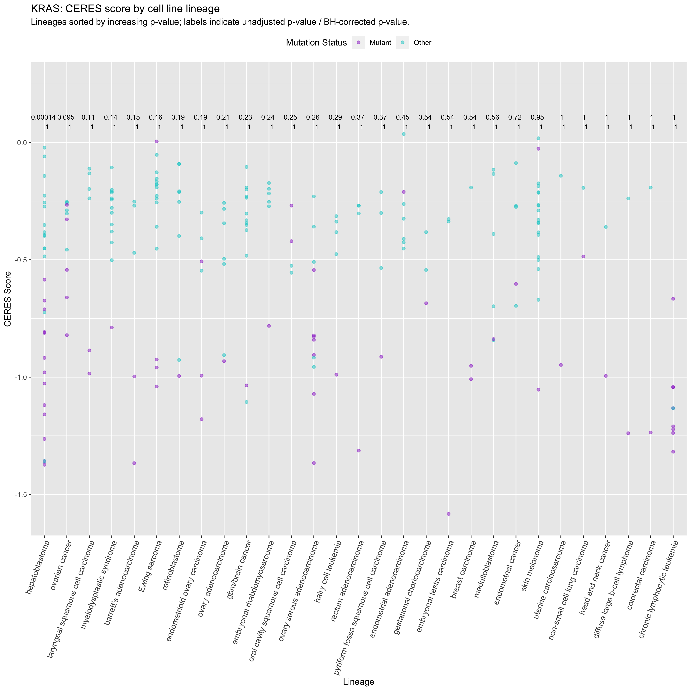

Analysis of the Broad's Avana CRISPR (Broad Institute Cancer Dependency Map 2018, Meyers et al. 2017) and the Broad and Dana-Farber Cancer Institite's Achilles shRNA (MacFarland et al. 2018, Data Science 2018).

The Avana screen produced results using [CERES](https://depmap.org/ceres/) (Meyers et al. 2017) ([GitHub](https://github.com/cancerdatasci/ceres)), which generates gene dependency scores from sgRNA depletion scores from gene essentiality screens and eliminates bias arising from the effect of copy number variation on Cas9 DNA cleavage. The lower the CERES score, the higher the likelihood that the gene is essential in the associated cell line. Scores are scaled per cell line such that a score of 0 is the median effect of nonessential genes and -1 is the median effect of common core essential genes.

In a previous version of the shRNA screen, DEMETER ([GitHub](https://github.com/cancerdatasci/demeter)) was used to compute a dependency score for each gene by using the depletion values from each shRNA to infer the effect of target knockdown (on-target) and of expressing a given miRNA seed (off-target) in each cell line. More negative values indicate increased dependency, while more positive values indicate lower dependency. Zero represents the avergae dependency across all cell lines.

In the new data release, [DEMETER2](https://depmap.org/R2-D2/) ([GitHub repository](https://github.com/cancerdatasci/demeter2)), developed by McFarland et al. (2018) was used to analyze the Achilles screen. DEMETER2 expands on DEMETER by including parameters for cell-line-specific screen effects and noisy data, correcting for global differences in shRNA levels across cell lines, pooling data acorss cell lines via hierarchical modeling, and using Bayesian inference to compute uncertainty estimates. Now, a score of zero represents no dependency.

All annotation files (copy number, mutation status, and gene expression) (Consortium and Consortium 2015, Barretina et al. 2012) were downloaded from the [DepMap Data Portal](https://depmap.org/portal/download/).

# Set up

--------------------------------------------------------------------------------


Load libraries.

```r
library(NMF)
library(ggpubr)
library(ggsignif)
library(rowr)
library(data.table)
library(CePa)
library(plyr)
library(tidyverse)
library(magrittr)
library(matrixStats)
library(parallel)
library(kableExtra)
library(gridExtra)
library(broom)
library(glmnet)
library(devtools)
library(reshape2)
library(caret)
library(bsselectR)
library(ComplexHeatmap)
library(circlize)
```

## Functions {.tabset .tabset-fade .tabset-pills}

### Significance thresholding


```r
adj_signif <- function(df) {
  # Takes df from compare_means and creates a signif code column for adjusted p-vals
  df$p.signif <- ifelse(df$p.signif == "ns", NA, df$p.signif)
  df$p.signif.adj <- ifelse(df$p.adj <= 0.0001, "****",
                     ifelse(df$p.adj <= 0.001, "***",
                     ifelse(df$p.adj <= 0.01, "**",
                     ifelse(df$p.adj <= 0.05, "*", NA))))
  df$p.short <- formatC(df$p, format = "g", digits =  2)
  df$p.adj.short <- formatC(df$p.adj, format = "g", digits =  2)
  
  return(df)
}
```

### Make CRISPR grobs


```r
makeCRISPRgrob <- function(g) {
  
  gene <- filter(crispr_data, Hugo_Symbol == g)
  
  # Mutation status
  crispr_color <- as.character(gene$Color)
  names(crispr_color) <- gene$Mutation_Status
  sig <- filter(crispr_signif, Hugo_Symbol == g)
  plot_mut <- ggplot(data = gene, aes(x = Mutation_Status, y = Score, color = Mutation_Status)) +
    geom_boxplot(outlier.shape = NA) +
    geom_jitter(alpha = 0.3, size = 0.7, position = position_jitter(w = 0.05)) +
    scale_color_manual(values = crispr_color) +
    geom_hline(yintercept = 0, linetype = 2, lwd = 0.3) +
    theme_light() +
    theme(legend.position = "none") +
    labs(x = paste0(g, " Mutation Status"), y = "CERES Score",
         title = "Mutation Status",
         subtitle = paste0("Wilcoxon test:\n- BH-corrected p-value: ", sig$p.adj.short, "\n- Uncorrected p-value: ", sig$p.short))
  
  # Copy number
  lo_cn <- range(gene$Copy_Number[!is.na(gene$Copy_Number)])[1]
  hi_cn <- range(gene$Copy_Number[!is.na(gene$Copy_Number)])[2]
  mid_cn <- (hi_cn - lo_cn) / 2
  plot_cn <- ggplot(data = gene, aes(x = Copy_Number, y = Score, color = Mutation_Status)) +
    geom_point(size = 0.5, alpha = 0.5) +
    geom_smooth(method = "lm", size = 0.5) +
    geom_hline(yintercept = 0, linetype = 2, lwd = 0.3) +
    scale_color_manual(values = crispr_color) +
    stat_cor(method = "pearson", show.legend = FALSE, label.x = c((lo_cn + mid_cn) / 2, (hi_cn - mid_cn) / 2 + mid_cn), label.y = max(gene$Score)) +
    theme(legend.position = "none") +
    labs(y = "CERES Score", color = "Mutation Status",
         x = paste0(g, " Copy number"), title = "Copy Number",
         subtitle = "r: Pearson correlation coeffcient")
  
  # Gene expression
  lo_ge <- range(gene$RPKM_log2[!is.na(gene$RPKM_log2)])[1]
  hi_ge <- range(gene$RPKM_log2[!is.na(gene$RPKM_log2)])[2]
  mid_ge <- (hi_ge - lo_ge) / 2
  plot_ge <- ggplot(data = gene, aes(x = RPKM_log2, y = Score, color = Mutation_Status)) +
    geom_point(size = 0.5, alpha = 0.5) +
    geom_smooth(method = "lm", size = 0.5) +
    geom_hline(yintercept = 0, linetype = 2, lwd = 0.3) +
    scale_color_manual(values = crispr_color) +
    stat_cor(method = "pearson", show.legend = FALSE, label.x = c((lo_ge + mid_ge) / 2, (hi_ge - mid_ge) / 2 + mid_ge), label.y = max(gene$Score)) +
    theme(legend.position = "none") +
    labs(y = "CERES Score", color = "Mutation Status",
         x = paste0(g, " Gene Expression [log2(RPKM)]"),
         title = "Gene Expression",
         subtitle = "r: Pearson correlation coeffcient")
  
  # Cell line lineage
  plot_lin <- ggplot(data = gene, aes(x = lineage_name, y = Score, color = Mutation_Status)) +
    geom_point(alpha = 0.5) +
    scale_color_manual(values = crispr_color) +
    geom_hline(yintercept = 0, linetype = 2, lwd = 0.3) +
    scale_y_continuous(sec.axis = sec_axis(~ .)) +
    coord_flip() +
    theme(legend.position = "none") +
    labs(y = "CERES Score", x = "Cell Line Lineage",
         color = "Mutation Status", title = g)
  
  # Arrange plots
  plot <- ggarrange(ggarrange(plot_lin, nrow = 1, labels = c("A")),
                    ggarrange(plot_mut, plot_cn, plot_ge, nrow = 3,
                              labels = c("B", "C", "D"), heights = c(2, 3, 3)),
                    font.label = list(size = 30, face = "bold"),
                    nrow = 1, ncol = 2, widths = c(3, 2))
  return(plot)
}
```

### Make lineage plot


```r
makeCRISPRlinplot <- function(g) {
  sig <- filter(crispr_signif_lineage, Hugo_Symbol == g)
  if(nrow(sig) == 0) {
    return(NULL)
  }
  else {
    gene <- filter(crispr_data, Hugo_Symbol == g)
    gene <- merge(gene, sig, by = c("Hugo_Symbol", "lineage_name"))
    gene <- mutate(gene, lineage_name = reorder(lineage_name, p, mean))
    crispr_color <- as.character(gene$Color)
    names(crispr_color) <- gene$Mutation_Status
    score_range <- abs(range(gene$Score)[2] - range(gene$Score)[1])
    round_accuracy <- ifelse(score_range <= 2, 0.25,
                             ifelse(score_range <= 3, 0.5, 1.0))
    
    plot <- ggplot(data = gene, aes(x = lineage_name, y = Score)) +
      geom_point(alpha = 0.5, mapping = aes(color = Mutation_Status)) +
      scale_color_manual(values = crispr_color) +
      coord_cartesian(y = c(min(gene$Score), round_any(x = max(gene$Score), accuracy = round_accuracy, f = ceiling))) +
      geom_signif(data = gene, mapping = aes(xmin = lineage_name, xmax = lineage_name, annotations = paste(p.short, "\n", p.adj.short), y_position = max(gene$Score)), manual = TRUE, tip_length   = 0, size = 0, textsize = 3) +
      theme(legend.position = "top", axis.text.x = element_text(angle = 70, hjust = 1, size = 10)) +
      labs(y = "CERES Score",
           x = "Lineage",
           color = "Mutation Status",
           title = paste0(g, ": CERES score by cell line lineage"),
           subtitle = "Lineages sorted by increasing p-value; labels indicate unadjusted p-value / BH-corrected p-value.")
    return(plot)
  }
}
```

### Make individual heatmaps per cluster

Take in a sorted gene list from a larger heatmap and produce smaller, individual heatmaps:

```r
makeHeatmaps <- function(clust_obj, clust_num) {
  chm_plot_cols <- colnames(clust_obj)
  chm_plot_rows <- rownames(clust_obj)
  
  chm_plot <- Heatmap(clust_obj, name = "CERES Score",
          bottom_annotation = HeatmapAnnotation(df = chm_annot),
          bottom_annotation_height = unit(5, "in"),
          row_title = "Genes", column_title = "Cancer Cell Lines (Broad IDs)",
          col = colorRamp2(c(min(chm_scores), 0, max(chm_scores)), c("purple4", "white", "seagreen4")),
          na_col = "black",
          column_title_gp = gpar(fontsize = 60, fontface = "bold"),
          show_column_names = FALSE,
          row_title_gp = gpar(fontsize = 60, fontface = "bold"),
          show_row_names = FALSE,
          row_dend_reorder = TRUE,
          column_dend_reorder = TRUE,
          column_order = chm_plot_cols,
          row_order = chm_plot_rows,
          column_dend_height = unit(4, "in"),
          row_dend_width = unit(4, "in"),
          width = 3)
  
  chm_ge_plot <- Heatmap(chm_ge[row_order(chm_scores_draw)[[clust_num]],], name = "Gene Expression (RPKM)",
          col = colorRamp2(c(min(chm_ge[!is.na(chm_ge)]), 0.25, max(chm_ge[!is.na(chm_ge)])), c("dodgerblue4", "white", "firebrick4")),
          na_col = "black",
          cluster_rows = FALSE, cluster_columns = FALSE,
          show_row_names = FALSE, show_column_names = FALSE,
          column_title = "Gene Expression",
          column_title_gp = gpar(fontsize = 60, fontface = "bold"),
          column_order = chm_plot_cols,
          row_order = chm_plot_rows,
          width = 1)
  chm_cn_plot <- Heatmap(chm_cn[row_order(chm_scores_draw)[[clust_num]],], name = "Copy Number",
          col = colorRamp2(c(min(chm_cn[!is.na(chm_cn)]), 2, max(chm_cn[!is.na(chm_cn)])), c("dodgerblue4", "white", "firebrick4")),
          na_col = "black",
          cluster_rows = FALSE, cluster_columns = FALSE,
          show_row_names = FALSE, show_column_names = FALSE,
          column_title = "Copy Number",
          column_title_gp = gpar(fontsize = 60, fontface = "bold"),
          column_order = chm_plot_cols,
          row_order = chm_plot_rows,
          width = 1)
  chm_mut_plot <- Heatmap(chm_mut[row_order(chm_scores_draw)[[clust_num]],], name = "Mutation Status",
          na_col = "black",
          col = c("cyan3", "darkorchid"),
          cluster_rows = FALSE, cluster_columns = FALSE,
          show_row_names = FALSE, show_column_names = FALSE,
          column_title = "Mutation Status",
          column_title_gp = gpar(fontsize = 60, fontface = "bold"),
          column_order = chm_plot_cols,
          row_order = chm_plot_rows,
          width = 1)
  
  chm_all_plot <- chm_plot + chm_ge_plot + chm_cn_plot + chm_mut_plot
  
  pdf(paste0("./plots_18Q3/crispr_heatmap_clustered/crispr_heatmap_all_c", clust_num, ".pdf"), width = 100, height = 100, paper = "special")
  draw(chm_all_plot, heatmap_legend_side = "right", annotation_legend_side = "right")
  seekViewport("annotation_Cell_Line_SSMD")
  grid.text("Cell Line SSMD", unit(1, "npc") + unit(2, "mm"), 0.5, gp = gpar(fontsize = 30), default.units = "npc", just = "left")
  seekViewport("annotation_Cas9_Activity")
  grid.text("Cas9 Activity", unit(1, "npc") + unit(2, "mm"), 0.5, gp = gpar(fontsize = 30), default.units = "npc", just = "left")
  seekViewport("annotation_Culture_Type")
  grid.text("Culture Type", unit(1, "npc") + unit(2, "mm"), 0.5, gp = gpar(fontsize = 30), default.units = "npc", just = "left")
  seekViewport("annotation_Primary_Tissue")
  grid.text("Primary Tissue", unit(1, "npc") + unit(2, "mm"), 0.5, gp = gpar(fontsize = 30), default.units = "npc", just = "left")
  seekViewport("annotation_Primary_Disease")
  grid.text("Primary Disease", unit(1, "npc") + unit(2, "mm"), 0.5, gp = gpar(fontsize = 30), default.units = "npc", just = "left")
  seekViewport("annotation_Gender")
  grid.text("Gender", unit(1, "npc") + unit(2, "mm"), 0.5, gp = gpar(fontsize = 30), default.units = "npc", just = "left")
  seekViewport("annotation_Source")
  grid.text("Source", unit(1, "npc") + unit(2, "mm"), 0.5, gp = gpar(fontsize = 30), default.units = "npc", just = "left")
  dev.off()
  
  pdf(paste0("./plots_18Q3/crispr_heatmap_ge_c", clust_num, ".pdf"), width = 100, height = 100, paper = "special")
  draw(chm_plot + chm_ge_plot, heatmap_legend_side = "right", annotation_legend_side = "right")
  seekViewport("annotation_Cell_Line_SSMD")
  grid.text("Cell Line SSMD", unit(1, "npc") + unit(2, "mm"), 0.5, gp = gpar(fontsize = 30), default.units = "npc", just = "left")
  seekViewport("annotation_Cas9_Activity")
  grid.text("Cas9 Activity", unit(1, "npc") + unit(2, "mm"), 0.5, gp = gpar(fontsize = 30), default.units = "npc", just = "left")
  seekViewport("annotation_Culture_Type")
  grid.text("Culture Type", unit(1, "npc") + unit(2, "mm"), 0.5, gp = gpar(fontsize = 30), default.units = "npc", just = "left")
  seekViewport("annotation_Primary_Tissue")
  grid.text("Primary Tissue", unit(1, "npc") + unit(2, "mm"), 0.5, gp = gpar(fontsize = 30), default.units = "npc", just = "left")
  seekViewport("annotation_Primary_Disease")
  grid.text("Primary Disease", unit(1, "npc") + unit(2, "mm"), 0.5, gp = gpar(fontsize = 30), default.units = "npc", just = "left")
  seekViewport("annotation_Gender")
  grid.text("Gender", unit(1, "npc") + unit(2, "mm"), 0.5, gp = gpar(fontsize = 30), default.units = "npc", just = "left")
  seekViewport("annotation_Source")
  grid.text("Source", unit(1, "npc") + unit(2, "mm"), 0.5, gp = gpar(fontsize = 30), default.units = "npc", just = "left")
  dev.off()
  
  pdf(paste0("./plots_18Q3/crispr_heatmap_mut_c", clust_num, ".pdf"), width = 100, height = 100, paper = "special") 
  draw(chm_plot + chm_mut_plot, heatmap_legend_side = "right", annotation_legend_side = "right")
  seekViewport("annotation_Cell_Line_SSMD")
  grid.text("Cell Line SSMD", unit(1, "npc") + unit(2, "mm"), 0.5, gp = gpar(fontsize = 30), default.units = "npc", just = "left")
  seekViewport("annotation_Cas9_Activity")
  grid.text("Cas9 Activity", unit(1, "npc") + unit(2, "mm"), 0.5, gp = gpar(fontsize = 30), default.units = "npc", just = "left")
  seekViewport("annotation_Culture_Type")
  grid.text("Culture Type", unit(1, "npc") + unit(2, "mm"), 0.5, gp = gpar(fontsize = 30), default.units = "npc", just = "left")
  seekViewport("annotation_Primary_Tissue")
  grid.text("Primary Tissue", unit(1, "npc") + unit(2, "mm"), 0.5, gp = gpar(fontsize = 30), default.units = "npc", just = "left")
  seekViewport("annotation_Primary_Disease")
  grid.text("Primary Disease", unit(1, "npc") + unit(2, "mm"), 0.5, gp = gpar(fontsize = 30), default.units = "npc", just = "left")
  seekViewport("annotation_Gender")
  grid.text("Gender", unit(1, "npc") + unit(2, "mm"), 0.5, gp = gpar(fontsize = 30), default.units = "npc", just = "left")
  seekViewport("annotation_Source")
  grid.text("Source", unit(1, "npc") + unit(2, "mm"), 0.5, gp = gpar(fontsize = 30), default.units = "npc", just = "left")
  dev.off()
  
  pdf(paste0("./plots_18Q3/crispr_heatmap_cn_c", clust_num, ".pdf"), width = 100, height = 100, paper = "special") 
  draw(chm_plot + chm_cn_plot, heatmap_legend_side = "right", annotation_legend_side = "right")
  seekViewport("annotation_Cell_Line_SSMD")
  grid.text("Cell Line SSMD", unit(1, "npc") + unit(2, "mm"), 0.5, gp = gpar(fontsize = 30), default.units = "npc", just = "left")
  seekViewport("annotation_Cas9_Activity")
  grid.text("Cas9 Activity", unit(1, "npc") + unit(2, "mm"), 0.5, gp = gpar(fontsize = 30), default.units = "npc", just = "left")
  seekViewport("annotation_Culture_Type")
  grid.text("Culture Type", unit(1, "npc") + unit(2, "mm"), 0.5, gp = gpar(fontsize = 30), default.units = "npc", just = "left")
  seekViewport("annotation_Primary_Tissue")
  grid.text("Primary Tissue", unit(1, "npc") + unit(2, "mm"), 0.5, gp = gpar(fontsize = 30), default.units = "npc", just = "left")
  seekViewport("annotation_Primary_Disease")
  grid.text("Primary Disease", unit(1, "npc") + unit(2, "mm"), 0.5, gp = gpar(fontsize = 30), default.units = "npc", just = "left")
  seekViewport("annotation_Gender")
  grid.text("Gender", unit(1, "npc") + unit(2, "mm"), 0.5, gp = gpar(fontsize = 30), default.units = "npc", just = "left")
  seekViewport("annotation_Source")
  grid.text("Source", unit(1, "npc") + unit(2, "mm"), 0.5, gp = gpar(fontsize = 30), default.units = "npc", just = "left")
  dev.off()
}
```

## Cell line converter

This comprehensive cancer cell line information curated by Daniel Charytonowicz.

```r
ccl_converter <- read.delim("./data_munging/cell_line_database_FINAL_MASTER.tsv", sep = "\t", row.names = 1, header = TRUE)
colnames(ccl_converter)[colnames(ccl_converter) == "ccle_cell_line_name"] <- "CCLE_Name"
colnames(ccl_converter)[colnames(ccl_converter) == "broad_id"] <- "Broad_ID"
```

## Cell line metadata


```r
ccl_info <- read.delim("./data_munging/DepMap-2018q3-celllines.csv", sep = ",", header = TRUE, na.strings = c("", NA))
ccl_info$Primary.Disease <- gsub("\\\\", "", ccl_info$Primary.Disease)
ccl_info$Primary.Disease <- gsub("Ewings", "Ewing's", ccl_info$Primary.Disease)

crispr_meta <- read.delim("./data_munging/sample_info_18Q3_crispr.csv", sep = ",", header = TRUE, na.strings = c("", NA))
colnames(crispr_meta)[7] <- "CCLE_Name"

shrna_meta <- read.delim("./data_munging/sample_info_18Q3_shrna.csv", sep = ",", header = TRUE, na.strings = c("", NA))
colnames(shrna_meta)[1] <- "CCLE_Name"
```

###  Metadata exploration


```r
tissue_summ <- crispr_meta %>% group_by(primary_tissue) %>% tally()
disease_summ <- ccl_info %>% group_by(Primary.Disease) %>% tally()
```


```r
ggplot(data = tissue_summ) + 
  aes(x = 0, y = n, fill = primary_tissue, label = primary_tissue) +
  geom_histogram(color = "black", stat = "identity") +
  geom_text(position = position_stack(vjust = 0.5))
```


```r
dan_test <- select(ccl_converter, CCLE_Name, Broad_ID, cell_line_name)
dan_test <- dan_test[-which(dan_test$CCLE_Name == ""), ]
ccl_test <- select(ccl_info, CCLE_Name, Broad_ID)

test <- merge(ccl_test, dan_test, by = "CCLE_Name", all = TRUE, suffixes = c("_DepMap", "_Daniel"))
test$BroadIDs_match <- ifelse(as.character(test$Broad_ID_DepMap) == as.character(test$Broad_ID_Daniel), TRUE, FALSE)
```

## Cancer Gene Census (CGC) gene list

Select genes from the Cancer Gene Census (CGC). The list was pulled from the [International Cancer Genome Consortium (ICGC) data portal](https://dcc.icgc.org/search/g?filters=%7B%22gene%22:%7B%22curatedSetId%22:%7B%22is%22:%5B%22GS1%22%5D%7D%7D%7D) (Advaced Search > Genes > Curated Gene Set > Cancer Gene Census).

```r
cgc <- data_frame("Hugo_Symbol" = read.delim("./data_munging/gene-ids-for-set-Cancer Gene Census.tsv", header = FALSE, sep = "\t")[, 2])
```

## MAF file

For mutation calling, get paired gene name and cell line fields in a data frame. For this analysis, we don't care about how many mutations there are per gene or what type of mutations there are, so I didn't save more information. I took unique gene-cell line combinations since we only cared about mutation presence/absence. Add a `Mutation_Status` column denoting all entries in MAF files as mutations present in the associated cell lines.

```r
maf_raw <- read.delim("./data_munging/CCLE_DepMap_18q3_maf_20180718.txt.gz", header = TRUE, sep = "\t")

# Remove silent mutations
maf_df <- maf_raw[maf_raw$Variant_Classification != "Silent",]

# Select columns
maf_df <- unique(subset(maf_raw, select = c("Hugo_Symbol", "Tumor_Sample_Barcode", "Broad_ID")))
colnames(maf_df)[2] <- "CCLE_Name"
# Add Mutation_Status column
maf_df$Mutation_Status <- "Mutant"

# MAF summary table
maf_summ <- maf_raw[, c("Variant_Classification", "isDeleterious")] %>% group_by(Variant_Classification, isDeleterious) %>% tally()
maf_summ$percent <- maf_summ$n / sum(maf_summ$n) * 100
knitr::kable(maf_summ, caption = "Distribution of variant classifications in the MAF file") %>% kable_styling(bootstrap_options = c("striped", "hover", "condensed", "responsive"))
```

<table class="table table-striped table-hover table-condensed table-responsive" style="margin-left: auto; margin-right: auto;">
<caption>Distribution of variant classifications in the MAF file</caption>
 <thead>
  <tr>
   <th style="text-align:left;"> Variant_Classification </th>
   <th style="text-align:left;"> isDeleterious </th>
   <th style="text-align:right;"> n </th>
   <th style="text-align:right;"> percent </th>
  </tr>
 </thead>
<tbody>
  <tr>
   <td style="text-align:left;"> 3'UTR </td>
   <td style="text-align:left;"> FALSE </td>
   <td style="text-align:right;"> 5 </td>
   <td style="text-align:right;"> 0.0004125 </td>
  </tr>
  <tr>
   <td style="text-align:left;"> 3'UTR </td>
   <td style="text-align:left;"> TRUE </td>
   <td style="text-align:right;"> 57 </td>
   <td style="text-align:right;"> 0.0047020 </td>
  </tr>
  <tr>
   <td style="text-align:left;"> 5'Flank </td>
   <td style="text-align:left;"> FALSE </td>
   <td style="text-align:right;"> 12 </td>
   <td style="text-align:right;"> 0.0009899 </td>
  </tr>
  <tr>
   <td style="text-align:left;"> 5'Flank </td>
   <td style="text-align:left;"> TRUE </td>
   <td style="text-align:right;"> 77 </td>
   <td style="text-align:right;"> 0.0063518 </td>
  </tr>
  <tr>
   <td style="text-align:left;"> 5'UTR </td>
   <td style="text-align:left;"> FALSE </td>
   <td style="text-align:right;"> 5 </td>
   <td style="text-align:right;"> 0.0004125 </td>
  </tr>
  <tr>
   <td style="text-align:left;"> 5'UTR </td>
   <td style="text-align:left;"> TRUE </td>
   <td style="text-align:right;"> 30 </td>
   <td style="text-align:right;"> 0.0024747 </td>
  </tr>
  <tr>
   <td style="text-align:left;"> De_novo_Start_OutOfFrame </td>
   <td style="text-align:left;"> TRUE </td>
   <td style="text-align:right;"> 5179 </td>
   <td style="text-align:right;"> 0.4272193 </td>
  </tr>
  <tr>
   <td style="text-align:left;"> Frame_Shift_Del </td>
   <td style="text-align:left;"> TRUE </td>
   <td style="text-align:right;"> 39184 </td>
   <td style="text-align:right;"> 3.2323152 </td>
  </tr>
  <tr>
   <td style="text-align:left;"> Frame_Shift_Ins </td>
   <td style="text-align:left;"> TRUE </td>
   <td style="text-align:right;"> 23445 </td>
   <td style="text-align:right;"> 1.9339942 </td>
  </tr>
  <tr>
   <td style="text-align:left;"> IGR </td>
   <td style="text-align:left;"> FALSE </td>
   <td style="text-align:right;"> 13 </td>
   <td style="text-align:right;"> 0.0010724 </td>
  </tr>
  <tr>
   <td style="text-align:left;"> IGR </td>
   <td style="text-align:left;"> TRUE </td>
   <td style="text-align:right;"> 100 </td>
   <td style="text-align:right;"> 0.0082491 </td>
  </tr>
  <tr>
   <td style="text-align:left;"> In_Frame_Del </td>
   <td style="text-align:left;"> FALSE </td>
   <td style="text-align:right;"> 5412 </td>
   <td style="text-align:right;"> 0.4464396 </td>
  </tr>
  <tr>
   <td style="text-align:left;"> In_Frame_Del </td>
   <td style="text-align:left;"> TRUE </td>
   <td style="text-align:right;"> 1 </td>
   <td style="text-align:right;"> 0.0000825 </td>
  </tr>
  <tr>
   <td style="text-align:left;"> In_Frame_Ins </td>
   <td style="text-align:left;"> FALSE </td>
   <td style="text-align:right;"> 1512 </td>
   <td style="text-align:right;"> 0.1247259 </td>
  </tr>
  <tr>
   <td style="text-align:left;"> Intron </td>
   <td style="text-align:left;"> FALSE </td>
   <td style="text-align:right;"> 20 </td>
   <td style="text-align:right;"> 0.0016498 </td>
  </tr>
  <tr>
   <td style="text-align:left;"> Intron </td>
   <td style="text-align:left;"> TRUE </td>
   <td style="text-align:right;"> 376 </td>
   <td style="text-align:right;"> 0.0310165 </td>
  </tr>
  <tr>
   <td style="text-align:left;"> Missense_Mutation </td>
   <td style="text-align:left;"> FALSE </td>
   <td style="text-align:right;"> 666798 </td>
   <td style="text-align:right;"> 55.0046277 </td>
  </tr>
  <tr>
   <td style="text-align:left;"> Nonsense_Mutation </td>
   <td style="text-align:left;"> TRUE </td>
   <td style="text-align:right;"> 38258 </td>
   <td style="text-align:right;"> 3.1559289 </td>
  </tr>
  <tr>
   <td style="text-align:left;"> Nonstop_Mutation </td>
   <td style="text-align:left;"> TRUE </td>
   <td style="text-align:right;"> 1014 </td>
   <td style="text-align:right;"> 0.0836456 </td>
  </tr>
  <tr>
   <td style="text-align:left;"> Silent </td>
   <td style="text-align:left;"> FALSE </td>
   <td style="text-align:right;"> 387651 </td>
   <td style="text-align:right;"> 31.9775988 </td>
  </tr>
  <tr>
   <td style="text-align:left;"> Splice_Site </td>
   <td style="text-align:left;"> TRUE </td>
   <td style="text-align:right;"> 41381 </td>
   <td style="text-align:right;"> 3.4135473 </td>
  </tr>
  <tr>
   <td style="text-align:left;"> Start_Codon_Del </td>
   <td style="text-align:left;"> TRUE </td>
   <td style="text-align:right;"> 91 </td>
   <td style="text-align:right;"> 0.0075067 </td>
  </tr>
  <tr>
   <td style="text-align:left;"> Start_Codon_Ins </td>
   <td style="text-align:left;"> TRUE </td>
   <td style="text-align:right;"> 74 </td>
   <td style="text-align:right;"> 0.0061043 </td>
  </tr>
  <tr>
   <td style="text-align:left;"> Start_Codon_SNP </td>
   <td style="text-align:left;"> FALSE </td>
   <td style="text-align:right;"> 1272 </td>
   <td style="text-align:right;"> 0.1049282 </td>
  </tr>
  <tr>
   <td style="text-align:left;"> Stop_Codon_Del </td>
   <td style="text-align:left;"> FALSE </td>
   <td style="text-align:right;"> 2 </td>
   <td style="text-align:right;"> 0.0001650 </td>
  </tr>
  <tr>
   <td style="text-align:left;"> Stop_Codon_Del </td>
   <td style="text-align:left;"> TRUE </td>
   <td style="text-align:right;"> 171 </td>
   <td style="text-align:right;"> 0.0141059 </td>
  </tr>
  <tr>
   <td style="text-align:left;"> Stop_Codon_Ins </td>
   <td style="text-align:left;"> TRUE </td>
   <td style="text-align:right;"> 118 </td>
   <td style="text-align:right;"> 0.0097339 </td>
  </tr>
</tbody>
</table>


## Copy number file


```r
cn <- read.delim("./data_munging/public_18Q3_gene_cn.csv.gz", sep = ",", check.names = FALSE, header = TRUE)

# Convert log2 ratios (log2(CN/2)) to CN
# cn[2:ncol(cn)] <- lapply(cn[2:ncol(cn)], function(x) 2 * (2 ^ x))

# Remove Entrez gene IDs from colnames
colnames(cn) <- gsub(" .*", "", colnames(cn))
colnames(cn)[1] <- "Broad_ID"

# Melt
cn_melt <- melt(data = cn, id.vars = "Broad_ID", measure.vars = colnames(cn[2:ncol(cn)]), variable.name = "Hugo_Symbol", value.name = "Copy_Number")

saveRDS(cn_melt, "./data_munging/rds/cn_melt_18Q3.rds", compress = "xz")
```


```r
cn_melt <- readRDS("./data_munging/rds/cn_melt_18Q3.rds")
```

## Gene expression file

Gene expression data (Reads Per Kilobase of transcript, per Million mapped reads, RPKM).

```r
ge <- read.delim("./../crispr_lineages_giant_files/CCLE_DepMap_18q3_RNAseq_RPKM_20180718.gct.gz", skip = 2, header = TRUE, sep = "\t", check.names = FALSE)

# Edit columns
ge$Name <- NULL
colnames(ge)[1] <- "Hugo_Symbol"

# Melt
ge_melt <- melt(data = ge, id.vars = "Hugo_Symbol", measure.vars = colnames(ge[2:ncol(ge)]), value.name = "RPKM")
## Split variable column
ge_melt <- with(ge_melt, cbind(Hugo_Symbol, colsplit(variable, pattern = " ", names = c("CCLE_Name", "Broad_ID")), RPKM))
## Remove parentheses around Broad IDs
ge_melt$Broad_ID <- gsub("\\(|\\)", "", ge_melt$Broad_ID)

saveRDS(ge_melt, "./../crispr_lineages_giant_files/ge_melt_18Q3.rds", compress = "xz")
```


```r
ge_melt <- readRDS("./../crispr_lineages_giant_files/ge_melt_18Q3.rds")
```

## CRISPR data and annotations

The latest CRISPR CERES score data (18Q3, August 2018) was pulled from the [DepMap Data Portal](https://depmap.org/portal/download/) (Broad Institute Cancer Dependency Map 2018, Meyers et al. 2017).

```r
crispr <- read.delim("./data_munging/gene_effect_18Q3.csv.gz", sep = ",", header  = TRUE, check.names = FALSE)
# Remove Entrez gene IDs from colnames
colnames(crispr) <- gsub(" .*", "", colnames(crispr))
```

Merge annotation data:

```r
# Melt CRISPR dataset for merging
crispr_melt <- melt(crispr, id.vars = "Broad_ID", measure.vars = colnames(crispr)[2:ncol(crispr)], variable.name = "Hugo_Symbol", value.name = "Score")

# Merge cell line metadata
crispr_melt <- merge(crispr_melt, ccl_info, by = "Broad_ID", all.x = TRUE)
crispr_melt <- merge(crispr_melt, crispr_meta, by = c("CCLE_Name", "Broad_ID"), all.x = TRUE)

# Merge mutation annotations
crispr_muts <- merge(crispr_melt, maf_df, by = c("Hugo_Symbol", "CCLE_Name", "Broad_ID"), all.x = TRUE)
crispr_muts <- crispr_muts %>% mutate(Mutation_Status = if_else(is.na(Mutation_Status), "Wildtype", Mutation_Status))
crispr_muts$Hugo_Symbol <- factor(crispr_muts$Hugo_Symbol)

# Summarize number of mutant and wildtype cell lines
crispr_muts_summ <- crispr_muts %>% group_by(Hugo_Symbol) %>%
  summarize(N_Wildtype = sum(Mutation_Status == "Wildtype"),
            N_Mutant = sum(Mutation_Status == "Mutant"))

# Merge test results back into full dataset, which restores information lost in the summarization
crispr_data <- merge(crispr_muts_summ, crispr_muts, by = "Hugo_Symbol")

# Add Color column
crispr_data$Color <- ifelse(crispr_data$Mutation_Status == "Wildtype", "cyan3", "darkorchid")
crispr_data$Color <- factor(crispr_data$Color)

# Cell line lineages
crispr_data <- merge(crispr_data, ccl_converter, by = c("CCLE_Name", "Broad_ID"), all.x = TRUE)
levels(crispr_data$lineage_name) <- sort(levels(crispr_data$lineage_name), decreasing = TRUE)

# Copy number
crispr_data <- merge(crispr_data, cn_melt, by = c("Hugo_Symbol", "Broad_ID"), all.x = TRUE)

# Gene expression (RPKM)
ge_filt <- filter(ge_melt, Hugo_Symbol %in% unique(crispr_data$Hugo_Symbol))
crispr_data <- merge(crispr_data, ge_filt, by = c("Hugo_Symbol", "Broad_ID", "CCLE_Name"), all.x = TRUE)
crispr_data$RPKM_log2 <- log2(crispr_data$RPKM + 0.0001)

saveRDS(crispr_data, "./../crispr_lineages_giant_files/crispr_data_18Q3.rds", compress = "xz")
```


```r
crispr_data <- readRDS("./../crispr_lineages_giant_files/crispr_data_18Q3.rds")
crispr_ccl <- data.frame("Broad_ID" = crispr_data$Broad_ID)
write.table(crispr_data[, c("Hugo_Symbol", "Broad_ID", "Score", "Primary.Disease", "primary_tissue", "Mutation_Status")], file = "~/Desktop/crispr_data_select.tsv", quote = FALSE, sep = "\t")
```


## shRNA data and annotations

The Achilles shRNA DEMETER score data was pulled from the [CTD^2^ Data Portal](https://ocg.cancer.gov/programs/ctd2/data-portal) (Tsherniak et al 2017).

```r
shrna <- read.table("./data_munging/D2_combined_gene_dep_scores.csv.gz", sep = ",", header = TRUE, check.names = FALSE)
colnames(shrna)[1] <- "Hugo_Symbol"
# Remove Entrez gene IDs from gene names
shrna$Hugo_Symbol <- gsub(" .*", "", shrna$Hugo_Symbol)

# Melt shRNA dataset for merging
shrna_melt <- melt(shrna , id.vars = "Hugo_Symbol", measure.vars = colnames(shrna)[2:ncol(shrna)], variable.name = "CCLE_Name", value.name = "Score")
shrna_melt <- drop_na(shrna_melt)
```

Merge annotation data:

```r
# Merge cell line metadata
shrna_melt <- merge(shrna_melt, ccl_info, by = "CCLE_Name", all.x = TRUE)
shrna_melt <- merge(shrna_melt, shrna_meta, by = "CCLE_Name", all.x = TRUE)

# Merge mutation annotations
shrna_muts <- merge(shrna_melt, maf_df, by = c("Hugo_Symbol", "CCLE_Name", "Broad_ID"), all.x = TRUE)
shrna_muts <- shrna_muts %>% mutate(Mutation_Status = if_else(is.na(Mutation_Status), "Wildtype", Mutation_Status))
shrna_muts$Hugo_Symbol <- factor(shrna_muts$Hugo_Symbol)

# Summarize number of mutant and wildtype cell lines
shrna_muts_summ <- shrna_muts %>% group_by(Hugo_Symbol) %>%
  summarize(N_Wildtype = sum(Mutation_Status == "Wildtype"),
            N_Mutant = sum(Mutation_Status == "Mutant"))

# Merge test results back into full dataset, which restores information lost in the summarization
shrna_data <- merge(shrna_muts_summ, shrna_muts, by = "Hugo_Symbol")

# Add Color column
shrna_data$Color <- ifelse(shrna_data$Mutation_Status == "Wildtype", "cyan3", "darkorchid")
shrna_data$Color <- factor(shrna_data$Color)

# Cell line lineages
shrna_data <- merge(shrna_data, ccl_converter, by = c("CCLE_Name", "Broad_ID"), all.x = TRUE)
levels(shrna_data$lineage_name) <- sort(levels(shrna_data$lineage_name), decreasing = TRUE)

# Copy number
shrna_data <- merge(shrna_data, cn_melt, by = c("Hugo_Symbol", "Broad_ID"), all.x = TRUE)

# Gene expression (RPKM)
ge_filt <- filter(ge_melt, Hugo_Symbol %in% unique(shrna_data$Hugo_Symbol))
shrna_data <- merge(shrna_data, ge_filt, by = c("Hugo_Symbol", "Broad_ID", "CCLE_Name"), all.x = TRUE)

saveRDS(shrna_data, "./../crispr_lineages_giant_files/shrna_data_18Q3.rds", compress = "xz")
```


```r
shrna_data <- readRDS("./../crispr_lineages_giant_files/shrna_data_18Q3.rds")
shrna_ccl <- data.frame("Broad_ID" = shrna_data$Broad_ID)
```


```r
write(union(as.character(distinct(crispr_data[which(is.na(crispr_data$lineage_name)), c("CCLE_Name", "lineage_name")])$CCLE_Name), as.character(distinct(shrna_data[which(is.na(shrna_data$lineage_name)), c("CCLE_Name", "lineage_name")])$CCLE_Name)), file = "./data_munging//na_ccl_in_converter.txt")
```


# Mutation exploration

--------------------------------------------------------------------------------


```r
maf_annot <- merge(maf_raw[maf_raw$Variant_Classification != "Silent",] %>% group_by(Broad_ID) %>% tally(), crispr_meta, by = "Broad_ID", all.y = TRUE)
```


```r
ggplot(data = maf_annot, aes(x = primary_tissue, y = n)) +
  geom_jitter(alpha = 0.6, size = 0.7, position = position_jitter(w = 0.15)) +
  theme(axis.text.x = element_text(angle = 45, hjust = 1))
```


# Wilcoxon tests

--------------------------------------------------------------------------------

## CRISPR

### Grouped by gene


```r
crispr_signif <- compare_means(Score ~ Mutation_Status, group.by = c("Hugo_Symbol"), data = crispr_data, method = "wilcox.test", p.adjust.method = "BH")
crispr_signif <- adj_signif(crispr_signif)
crispr_signif <- crispr_signif[order(crispr_signif$p),]
saveRDS(crispr_signif, "./data_munging/rds/crispr_signif.rds")
```


```r
crispr_signif <- readRDS("./data_munging/rds/crispr_signif.rds")

knitr::kable(filter(crispr_signif, p < 0.05)[, c("Hugo_Symbol", "p", "p.adj", "p.format", "p.signif", "p.signif.adj")], caption = "CRISPR Screen: Wilcoxon Test Results Comparing Mutant and Wildtype Cell Lines, p < 0.1 (Benjamini-Hochberg-corrected p-values: * p <= 0.05, ** p <= 0.01, *** p <= 0.001, **** p <= 0.0001)") %>% kable_styling(bootstrap_options = c("striped", "hover", "condensed", "responsive")) %>% footnote(general = "Wilcoxon test Benjamini-Hochberg-corrected p-values:\n*: p <= 0.05\n**: p <= 0.01\n***: p <= 0.001\n****: p <= 0.0001") %>% scroll_box(width = "900px", height = "450px")
```

<div style="border: 1px solid #ddd; padding: 5px; overflow-y: scroll; height:450px; overflow-x: scroll; width:900px; "><table class="table table-striped table-hover table-condensed table-responsive" style="margin-left: auto; margin-right: auto;">
<caption>CRISPR Screen: Wilcoxon Test Results Comparing Mutant and Wildtype Cell Lines, p &lt; 0.1 (Benjamini-Hochberg-corrected p-values: * p &lt;= 0.05, ** p &lt;= 0.01, *** p &lt;= 0.001, **** p &lt;= 0.0001)</caption>
 <thead>
  <tr>
   <th style="text-align:left;"> Hugo_Symbol </th>
   <th style="text-align:right;"> p </th>
   <th style="text-align:right;"> p.adj </th>
   <th style="text-align:left;"> p.format </th>
   <th style="text-align:left;"> p.signif </th>
   <th style="text-align:left;"> p.signif.adj </th>
  </tr>
 </thead>
<tbody>
  <tr>
   <td style="text-align:left;"> KRAS </td>
   <td style="text-align:right;"> 0.0000000 </td>
   <td style="text-align:right;"> 0.0000000 </td>
   <td style="text-align:left;"> &lt; 2e-16 </td>
   <td style="text-align:left;"> **** </td>
   <td style="text-align:left;"> **** </td>
  </tr>
  <tr>
   <td style="text-align:left;"> TP53 </td>
   <td style="text-align:right;"> 0.0000000 </td>
   <td style="text-align:right;"> 0.0000000 </td>
   <td style="text-align:left;"> &lt; 2e-16 </td>
   <td style="text-align:left;"> **** </td>
   <td style="text-align:left;"> **** </td>
  </tr>
  <tr>
   <td style="text-align:left;"> NRAS </td>
   <td style="text-align:right;"> 0.0000000 </td>
   <td style="text-align:right;"> 0.0000000 </td>
   <td style="text-align:left;"> &lt; 2e-16 </td>
   <td style="text-align:left;"> **** </td>
   <td style="text-align:left;"> **** </td>
  </tr>
  <tr>
   <td style="text-align:left;"> BRAF </td>
   <td style="text-align:right;"> 0.0000000 </td>
   <td style="text-align:right;"> 0.0000000 </td>
   <td style="text-align:left;"> 5.0e-15 </td>
   <td style="text-align:left;"> **** </td>
   <td style="text-align:left;"> **** </td>
  </tr>
  <tr>
   <td style="text-align:left;"> PIK3CA </td>
   <td style="text-align:right;"> 0.0000000 </td>
   <td style="text-align:right;"> 0.0000000 </td>
   <td style="text-align:left;"> 3.1e-14 </td>
   <td style="text-align:left;"> **** </td>
   <td style="text-align:left;"> **** </td>
  </tr>
  <tr>
   <td style="text-align:left;"> PTEN </td>
   <td style="text-align:right;"> 0.0000000 </td>
   <td style="text-align:right;"> 0.0000000 </td>
   <td style="text-align:left;"> 6.6e-14 </td>
   <td style="text-align:left;"> **** </td>
   <td style="text-align:left;"> **** </td>
  </tr>
  <tr>
   <td style="text-align:left;"> PIK3R1 </td>
   <td style="text-align:right;"> 0.0000094 </td>
   <td style="text-align:right;"> 0.0233470 </td>
   <td style="text-align:left;"> 9.4e-06 </td>
   <td style="text-align:left;"> **** </td>
   <td style="text-align:left;"> * </td>
  </tr>
  <tr>
   <td style="text-align:left;"> GAS2L2 </td>
   <td style="text-align:right;"> 0.0000634 </td>
   <td style="text-align:right;"> 0.1265210 </td>
   <td style="text-align:left;"> 6.3e-05 </td>
   <td style="text-align:left;"> **** </td>
   <td style="text-align:left;"> NA </td>
  </tr>
  <tr>
   <td style="text-align:left;"> CTNNB1 </td>
   <td style="text-align:right;"> 0.0000658 </td>
   <td style="text-align:right;"> 0.1265210 </td>
   <td style="text-align:left;"> 6.6e-05 </td>
   <td style="text-align:left;"> **** </td>
   <td style="text-align:left;"> NA </td>
  </tr>
  <tr>
   <td style="text-align:left;"> EML5 </td>
   <td style="text-align:right;"> 0.0001279 </td>
   <td style="text-align:right;"> 0.2113463 </td>
   <td style="text-align:left;"> 0.00013 </td>
   <td style="text-align:left;"> *** </td>
   <td style="text-align:left;"> NA </td>
  </tr>
  <tr>
   <td style="text-align:left;"> VHL </td>
   <td style="text-align:right;"> 0.0001403 </td>
   <td style="text-align:right;"> 0.2113463 </td>
   <td style="text-align:left;"> 0.00014 </td>
   <td style="text-align:left;"> *** </td>
   <td style="text-align:left;"> NA </td>
  </tr>
  <tr>
   <td style="text-align:left;"> ARID1A </td>
   <td style="text-align:right;"> 0.0001465 </td>
   <td style="text-align:right;"> 0.2113463 </td>
   <td style="text-align:left;"> 0.00015 </td>
   <td style="text-align:left;"> *** </td>
   <td style="text-align:left;"> NA </td>
  </tr>
  <tr>
   <td style="text-align:left;"> PROM1 </td>
   <td style="text-align:right;"> 0.0001756 </td>
   <td style="text-align:right;"> 0.2337946 </td>
   <td style="text-align:left;"> 0.00018 </td>
   <td style="text-align:left;"> *** </td>
   <td style="text-align:left;"> NA </td>
  </tr>
  <tr>
   <td style="text-align:left;"> OR8D1 </td>
   <td style="text-align:right;"> 0.0001913 </td>
   <td style="text-align:right;"> 0.2364567 </td>
   <td style="text-align:left;"> 0.00019 </td>
   <td style="text-align:left;"> *** </td>
   <td style="text-align:left;"> NA </td>
  </tr>
  <tr>
   <td style="text-align:left;"> TPR </td>
   <td style="text-align:right;"> 0.0003031 </td>
   <td style="text-align:right;"> 0.3497722 </td>
   <td style="text-align:left;"> 0.00030 </td>
   <td style="text-align:left;"> *** </td>
   <td style="text-align:left;"> NA </td>
  </tr>
  <tr>
   <td style="text-align:left;"> TCERG1 </td>
   <td style="text-align:right;"> 0.0004767 </td>
   <td style="text-align:right;"> 0.5156610 </td>
   <td style="text-align:left;"> 0.00048 </td>
   <td style="text-align:left;"> *** </td>
   <td style="text-align:left;"> NA </td>
  </tr>
  <tr>
   <td style="text-align:left;"> NFE2L1 </td>
   <td style="text-align:right;"> 0.0006240 </td>
   <td style="text-align:right;"> 0.6255120 </td>
   <td style="text-align:left;"> 0.00062 </td>
   <td style="text-align:left;"> *** </td>
   <td style="text-align:left;"> NA </td>
  </tr>
  <tr>
   <td style="text-align:left;"> ATXN2 </td>
   <td style="text-align:right;"> 0.0006506 </td>
   <td style="text-align:right;"> 0.6255120 </td>
   <td style="text-align:left;"> 0.00065 </td>
   <td style="text-align:left;"> *** </td>
   <td style="text-align:left;"> NA </td>
  </tr>
  <tr>
   <td style="text-align:left;"> TAOK2 </td>
   <td style="text-align:right;"> 0.0007479 </td>
   <td style="text-align:right;"> 0.6412831 </td>
   <td style="text-align:left;"> 0.00075 </td>
   <td style="text-align:left;"> *** </td>
   <td style="text-align:left;"> NA </td>
  </tr>
  <tr>
   <td style="text-align:left;"> FRMD4B </td>
   <td style="text-align:right;"> 0.0008177 </td>
   <td style="text-align:right;"> 0.6412831 </td>
   <td style="text-align:left;"> 0.00082 </td>
   <td style="text-align:left;"> *** </td>
   <td style="text-align:left;"> NA </td>
  </tr>
  <tr>
   <td style="text-align:left;"> CAMK2B </td>
   <td style="text-align:right;"> 0.0008694 </td>
   <td style="text-align:right;"> 0.6412831 </td>
   <td style="text-align:left;"> 0.00087 </td>
   <td style="text-align:left;"> *** </td>
   <td style="text-align:left;"> NA </td>
  </tr>
  <tr>
   <td style="text-align:left;"> C6orf99 </td>
   <td style="text-align:right;"> 0.0009114 </td>
   <td style="text-align:right;"> 0.6412831 </td>
   <td style="text-align:left;"> 0.00091 </td>
   <td style="text-align:left;"> *** </td>
   <td style="text-align:left;"> NA </td>
  </tr>
  <tr>
   <td style="text-align:left;"> KCNIP4 </td>
   <td style="text-align:right;"> 0.0009405 </td>
   <td style="text-align:right;"> 0.6412831 </td>
   <td style="text-align:left;"> 0.00094 </td>
   <td style="text-align:left;"> *** </td>
   <td style="text-align:left;"> NA </td>
  </tr>
  <tr>
   <td style="text-align:left;"> TAAR1 </td>
   <td style="text-align:right;"> 0.0009576 </td>
   <td style="text-align:right;"> 0.6412831 </td>
   <td style="text-align:left;"> 0.00096 </td>
   <td style="text-align:left;"> *** </td>
   <td style="text-align:left;"> NA </td>
  </tr>
  <tr>
   <td style="text-align:left;"> GMCL1 </td>
   <td style="text-align:right;"> 0.0009659 </td>
   <td style="text-align:right;"> 0.6412831 </td>
   <td style="text-align:left;"> 0.00097 </td>
   <td style="text-align:left;"> *** </td>
   <td style="text-align:left;"> NA </td>
  </tr>
  <tr>
   <td style="text-align:left;"> MYH13 </td>
   <td style="text-align:right;"> 0.0010170 </td>
   <td style="text-align:right;"> 0.6412831 </td>
   <td style="text-align:left;"> 0.00102 </td>
   <td style="text-align:left;"> ** </td>
   <td style="text-align:left;"> NA </td>
  </tr>
  <tr>
   <td style="text-align:left;"> MMRN2 </td>
   <td style="text-align:right;"> 0.0011690 </td>
   <td style="text-align:right;"> 0.6412831 </td>
   <td style="text-align:left;"> 0.00117 </td>
   <td style="text-align:left;"> ** </td>
   <td style="text-align:left;"> NA </td>
  </tr>
  <tr>
   <td style="text-align:left;"> KRT34 </td>
   <td style="text-align:right;"> 0.0011703 </td>
   <td style="text-align:right;"> 0.6412831 </td>
   <td style="text-align:left;"> 0.00117 </td>
   <td style="text-align:left;"> ** </td>
   <td style="text-align:left;"> NA </td>
  </tr>
  <tr>
   <td style="text-align:left;"> OR13C4 </td>
   <td style="text-align:right;"> 0.0012173 </td>
   <td style="text-align:right;"> 0.6412831 </td>
   <td style="text-align:left;"> 0.00122 </td>
   <td style="text-align:left;"> ** </td>
   <td style="text-align:left;"> NA </td>
  </tr>
  <tr>
   <td style="text-align:left;"> MAT2B </td>
   <td style="text-align:right;"> 0.0012266 </td>
   <td style="text-align:right;"> 0.6412831 </td>
   <td style="text-align:left;"> 0.00123 </td>
   <td style="text-align:left;"> ** </td>
   <td style="text-align:left;"> NA </td>
  </tr>
  <tr>
   <td style="text-align:left;"> CCDC115 </td>
   <td style="text-align:right;"> 0.0012698 </td>
   <td style="text-align:right;"> 0.6412831 </td>
   <td style="text-align:left;"> 0.00127 </td>
   <td style="text-align:left;"> ** </td>
   <td style="text-align:left;"> NA </td>
  </tr>
  <tr>
   <td style="text-align:left;"> BPHL </td>
   <td style="text-align:right;"> 0.0012789 </td>
   <td style="text-align:right;"> 0.6412831 </td>
   <td style="text-align:left;"> 0.00128 </td>
   <td style="text-align:left;"> ** </td>
   <td style="text-align:left;"> NA </td>
  </tr>
  <tr>
   <td style="text-align:left;"> SPHK2 </td>
   <td style="text-align:right;"> 0.0013252 </td>
   <td style="text-align:right;"> 0.6412831 </td>
   <td style="text-align:left;"> 0.00133 </td>
   <td style="text-align:left;"> ** </td>
   <td style="text-align:left;"> NA </td>
  </tr>
  <tr>
   <td style="text-align:left;"> SLC12A4 </td>
   <td style="text-align:right;"> 0.0013571 </td>
   <td style="text-align:right;"> 0.6412831 </td>
   <td style="text-align:left;"> 0.00136 </td>
   <td style="text-align:left;"> ** </td>
   <td style="text-align:left;"> NA </td>
  </tr>
  <tr>
   <td style="text-align:left;"> HSPB2 </td>
   <td style="text-align:right;"> 0.0014495 </td>
   <td style="text-align:right;"> 0.6412831 </td>
   <td style="text-align:left;"> 0.00145 </td>
   <td style="text-align:left;"> ** </td>
   <td style="text-align:left;"> NA </td>
  </tr>
  <tr>
   <td style="text-align:left;"> ING2 </td>
   <td style="text-align:right;"> 0.0014811 </td>
   <td style="text-align:right;"> 0.6412831 </td>
   <td style="text-align:left;"> 0.00148 </td>
   <td style="text-align:left;"> ** </td>
   <td style="text-align:left;"> NA </td>
  </tr>
  <tr>
   <td style="text-align:left;"> HSD3B7 </td>
   <td style="text-align:right;"> 0.0015616 </td>
   <td style="text-align:right;"> 0.6412831 </td>
   <td style="text-align:left;"> 0.00156 </td>
   <td style="text-align:left;"> ** </td>
   <td style="text-align:left;"> NA </td>
  </tr>
  <tr>
   <td style="text-align:left;"> C11orf80 </td>
   <td style="text-align:right;"> 0.0015622 </td>
   <td style="text-align:right;"> 0.6412831 </td>
   <td style="text-align:left;"> 0.00156 </td>
   <td style="text-align:left;"> ** </td>
   <td style="text-align:left;"> NA </td>
  </tr>
  <tr>
   <td style="text-align:left;"> GNAI2 </td>
   <td style="text-align:right;"> 0.0015622 </td>
   <td style="text-align:right;"> 0.6412831 </td>
   <td style="text-align:left;"> 0.00156 </td>
   <td style="text-align:left;"> ** </td>
   <td style="text-align:left;"> NA </td>
  </tr>
  <tr>
   <td style="text-align:left;"> PIGW </td>
   <td style="text-align:right;"> 0.0015849 </td>
   <td style="text-align:right;"> 0.6412831 </td>
   <td style="text-align:left;"> 0.00158 </td>
   <td style="text-align:left;"> ** </td>
   <td style="text-align:left;"> NA </td>
  </tr>
  <tr>
   <td style="text-align:left;"> PCDHA8 </td>
   <td style="text-align:right;"> 0.0016198 </td>
   <td style="text-align:right;"> 0.6412831 </td>
   <td style="text-align:left;"> 0.00162 </td>
   <td style="text-align:left;"> ** </td>
   <td style="text-align:left;"> NA </td>
  </tr>
  <tr>
   <td style="text-align:left;"> ZNF177 </td>
   <td style="text-align:right;"> 0.0016563 </td>
   <td style="text-align:right;"> 0.6412831 </td>
   <td style="text-align:left;"> 0.00166 </td>
   <td style="text-align:left;"> ** </td>
   <td style="text-align:left;"> NA </td>
  </tr>
  <tr>
   <td style="text-align:left;"> NCR3LG1 </td>
   <td style="text-align:right;"> 0.0016574 </td>
   <td style="text-align:right;"> 0.6412831 </td>
   <td style="text-align:left;"> 0.00166 </td>
   <td style="text-align:left;"> ** </td>
   <td style="text-align:left;"> NA </td>
  </tr>
  <tr>
   <td style="text-align:left;"> EZH2 </td>
   <td style="text-align:right;"> 0.0017923 </td>
   <td style="text-align:right;"> 0.6412831 </td>
   <td style="text-align:left;"> 0.00179 </td>
   <td style="text-align:left;"> ** </td>
   <td style="text-align:left;"> NA </td>
  </tr>
  <tr>
   <td style="text-align:left;"> DSEL </td>
   <td style="text-align:right;"> 0.0018013 </td>
   <td style="text-align:right;"> 0.6412831 </td>
   <td style="text-align:left;"> 0.00180 </td>
   <td style="text-align:left;"> ** </td>
   <td style="text-align:left;"> NA </td>
  </tr>
  <tr>
   <td style="text-align:left;"> AKR1C1 </td>
   <td style="text-align:right;"> 0.0018066 </td>
   <td style="text-align:right;"> 0.6412831 </td>
   <td style="text-align:left;"> 0.00181 </td>
   <td style="text-align:left;"> ** </td>
   <td style="text-align:left;"> NA </td>
  </tr>
  <tr>
   <td style="text-align:left;"> FCGBP </td>
   <td style="text-align:right;"> 0.0018105 </td>
   <td style="text-align:right;"> 0.6412831 </td>
   <td style="text-align:left;"> 0.00181 </td>
   <td style="text-align:left;"> ** </td>
   <td style="text-align:left;"> NA </td>
  </tr>
  <tr>
   <td style="text-align:left;"> CPSF1 </td>
   <td style="text-align:right;"> 0.0018272 </td>
   <td style="text-align:right;"> 0.6412831 </td>
   <td style="text-align:left;"> 0.00183 </td>
   <td style="text-align:left;"> ** </td>
   <td style="text-align:left;"> NA </td>
  </tr>
  <tr>
   <td style="text-align:left;"> TLX2 </td>
   <td style="text-align:right;"> 0.0018522 </td>
   <td style="text-align:right;"> 0.6412831 </td>
   <td style="text-align:left;"> 0.00185 </td>
   <td style="text-align:left;"> ** </td>
   <td style="text-align:left;"> NA </td>
  </tr>
  <tr>
   <td style="text-align:left;"> LRRC37A2 </td>
   <td style="text-align:right;"> 0.0018527 </td>
   <td style="text-align:right;"> 0.6412831 </td>
   <td style="text-align:left;"> 0.00185 </td>
   <td style="text-align:left;"> ** </td>
   <td style="text-align:left;"> NA </td>
  </tr>
  <tr>
   <td style="text-align:left;"> BNC2 </td>
   <td style="text-align:right;"> 0.0019504 </td>
   <td style="text-align:right;"> 0.6618632 </td>
   <td style="text-align:left;"> 0.00195 </td>
   <td style="text-align:left;"> ** </td>
   <td style="text-align:left;"> NA </td>
  </tr>
  <tr>
   <td style="text-align:left;"> KPNA6 </td>
   <td style="text-align:right;"> 0.0021334 </td>
   <td style="text-align:right;"> 0.7082436 </td>
   <td style="text-align:left;"> 0.00213 </td>
   <td style="text-align:left;"> ** </td>
   <td style="text-align:left;"> NA </td>
  </tr>
  <tr>
   <td style="text-align:left;"> TSC2 </td>
   <td style="text-align:right;"> 0.0021801 </td>
   <td style="text-align:right;"> 0.7082436 </td>
   <td style="text-align:left;"> 0.00218 </td>
   <td style="text-align:left;"> ** </td>
   <td style="text-align:left;"> NA </td>
  </tr>
  <tr>
   <td style="text-align:left;"> IL20RA </td>
   <td style="text-align:right;"> 0.0022216 </td>
   <td style="text-align:right;"> 0.7082436 </td>
   <td style="text-align:left;"> 0.00222 </td>
   <td style="text-align:left;"> ** </td>
   <td style="text-align:left;"> NA </td>
  </tr>
  <tr>
   <td style="text-align:left;"> ST6GALNAC1 </td>
   <td style="text-align:right;"> 0.0023064 </td>
   <td style="text-align:right;"> 0.7082436 </td>
   <td style="text-align:left;"> 0.00231 </td>
   <td style="text-align:left;"> ** </td>
   <td style="text-align:left;"> NA </td>
  </tr>
  <tr>
   <td style="text-align:left;"> IL31 </td>
   <td style="text-align:right;"> 0.0023228 </td>
   <td style="text-align:right;"> 0.7082436 </td>
   <td style="text-align:left;"> 0.00232 </td>
   <td style="text-align:left;"> ** </td>
   <td style="text-align:left;"> NA </td>
  </tr>
  <tr>
   <td style="text-align:left;"> CMTM4 </td>
   <td style="text-align:right;"> 0.0024753 </td>
   <td style="text-align:right;"> 0.7082436 </td>
   <td style="text-align:left;"> 0.00248 </td>
   <td style="text-align:left;"> ** </td>
   <td style="text-align:left;"> NA </td>
  </tr>
  <tr>
   <td style="text-align:left;"> MYO1C </td>
   <td style="text-align:right;"> 0.0025576 </td>
   <td style="text-align:right;"> 0.7082436 </td>
   <td style="text-align:left;"> 0.00256 </td>
   <td style="text-align:left;"> ** </td>
   <td style="text-align:left;"> NA </td>
  </tr>
  <tr>
   <td style="text-align:left;"> CLEC4F </td>
   <td style="text-align:right;"> 0.0026138 </td>
   <td style="text-align:right;"> 0.7082436 </td>
   <td style="text-align:left;"> 0.00261 </td>
   <td style="text-align:left;"> ** </td>
   <td style="text-align:left;"> NA </td>
  </tr>
  <tr>
   <td style="text-align:left;"> NFE2L2 </td>
   <td style="text-align:right;"> 0.0026667 </td>
   <td style="text-align:right;"> 0.7082436 </td>
   <td style="text-align:left;"> 0.00267 </td>
   <td style="text-align:left;"> ** </td>
   <td style="text-align:left;"> NA </td>
  </tr>
  <tr>
   <td style="text-align:left;"> NEDD1 </td>
   <td style="text-align:right;"> 0.0028880 </td>
   <td style="text-align:right;"> 0.7082436 </td>
   <td style="text-align:left;"> 0.00289 </td>
   <td style="text-align:left;"> ** </td>
   <td style="text-align:left;"> NA </td>
  </tr>
  <tr>
   <td style="text-align:left;"> ZNF17 </td>
   <td style="text-align:right;"> 0.0029504 </td>
   <td style="text-align:right;"> 0.7082436 </td>
   <td style="text-align:left;"> 0.00295 </td>
   <td style="text-align:left;"> ** </td>
   <td style="text-align:left;"> NA </td>
  </tr>
  <tr>
   <td style="text-align:left;"> DIS3L2 </td>
   <td style="text-align:right;"> 0.0029826 </td>
   <td style="text-align:right;"> 0.7082436 </td>
   <td style="text-align:left;"> 0.00298 </td>
   <td style="text-align:left;"> ** </td>
   <td style="text-align:left;"> NA </td>
  </tr>
  <tr>
   <td style="text-align:left;"> MSGN1 </td>
   <td style="text-align:right;"> 0.0029996 </td>
   <td style="text-align:right;"> 0.7082436 </td>
   <td style="text-align:left;"> 0.00300 </td>
   <td style="text-align:left;"> ** </td>
   <td style="text-align:left;"> NA </td>
  </tr>
  <tr>
   <td style="text-align:left;"> SMCR8 </td>
   <td style="text-align:right;"> 0.0030454 </td>
   <td style="text-align:right;"> 0.7082436 </td>
   <td style="text-align:left;"> 0.00305 </td>
   <td style="text-align:left;"> ** </td>
   <td style="text-align:left;"> NA </td>
  </tr>
  <tr>
   <td style="text-align:left;"> ADORA2B </td>
   <td style="text-align:right;"> 0.0030699 </td>
   <td style="text-align:right;"> 0.7082436 </td>
   <td style="text-align:left;"> 0.00307 </td>
   <td style="text-align:left;"> ** </td>
   <td style="text-align:left;"> NA </td>
  </tr>
  <tr>
   <td style="text-align:left;"> RBBP9 </td>
   <td style="text-align:right;"> 0.0031074 </td>
   <td style="text-align:right;"> 0.7082436 </td>
   <td style="text-align:left;"> 0.00311 </td>
   <td style="text-align:left;"> ** </td>
   <td style="text-align:left;"> NA </td>
  </tr>
  <tr>
   <td style="text-align:left;"> ACSM2B </td>
   <td style="text-align:right;"> 0.0031736 </td>
   <td style="text-align:right;"> 0.7082436 </td>
   <td style="text-align:left;"> 0.00317 </td>
   <td style="text-align:left;"> ** </td>
   <td style="text-align:left;"> NA </td>
  </tr>
  <tr>
   <td style="text-align:left;"> ARFGAP1 </td>
   <td style="text-align:right;"> 0.0031910 </td>
   <td style="text-align:right;"> 0.7082436 </td>
   <td style="text-align:left;"> 0.00319 </td>
   <td style="text-align:left;"> ** </td>
   <td style="text-align:left;"> NA </td>
  </tr>
  <tr>
   <td style="text-align:left;"> DSPP </td>
   <td style="text-align:right;"> 0.0032378 </td>
   <td style="text-align:right;"> 0.7082436 </td>
   <td style="text-align:left;"> 0.00324 </td>
   <td style="text-align:left;"> ** </td>
   <td style="text-align:left;"> NA </td>
  </tr>
  <tr>
   <td style="text-align:left;"> ACBD6 </td>
   <td style="text-align:right;"> 0.0032517 </td>
   <td style="text-align:right;"> 0.7082436 </td>
   <td style="text-align:left;"> 0.00325 </td>
   <td style="text-align:left;"> ** </td>
   <td style="text-align:left;"> NA </td>
  </tr>
  <tr>
   <td style="text-align:left;"> SMPD1 </td>
   <td style="text-align:right;"> 0.0033308 </td>
   <td style="text-align:right;"> 0.7082436 </td>
   <td style="text-align:left;"> 0.00333 </td>
   <td style="text-align:left;"> ** </td>
   <td style="text-align:left;"> NA </td>
  </tr>
  <tr>
   <td style="text-align:left;"> KRT84 </td>
   <td style="text-align:right;"> 0.0033626 </td>
   <td style="text-align:right;"> 0.7082436 </td>
   <td style="text-align:left;"> 0.00336 </td>
   <td style="text-align:left;"> ** </td>
   <td style="text-align:left;"> NA </td>
  </tr>
  <tr>
   <td style="text-align:left;"> OR51T1 </td>
   <td style="text-align:right;"> 0.0034115 </td>
   <td style="text-align:right;"> 0.7082436 </td>
   <td style="text-align:left;"> 0.00341 </td>
   <td style="text-align:left;"> ** </td>
   <td style="text-align:left;"> NA </td>
  </tr>
  <tr>
   <td style="text-align:left;"> CD83 </td>
   <td style="text-align:right;"> 0.0034583 </td>
   <td style="text-align:right;"> 0.7082436 </td>
   <td style="text-align:left;"> 0.00346 </td>
   <td style="text-align:left;"> ** </td>
   <td style="text-align:left;"> NA </td>
  </tr>
  <tr>
   <td style="text-align:left;"> ETAA1 </td>
   <td style="text-align:right;"> 0.0034842 </td>
   <td style="text-align:right;"> 0.7082436 </td>
   <td style="text-align:left;"> 0.00348 </td>
   <td style="text-align:left;"> ** </td>
   <td style="text-align:left;"> NA </td>
  </tr>
  <tr>
   <td style="text-align:left;"> TDRD5 </td>
   <td style="text-align:right;"> 0.0035276 </td>
   <td style="text-align:right;"> 0.7082436 </td>
   <td style="text-align:left;"> 0.00353 </td>
   <td style="text-align:left;"> ** </td>
   <td style="text-align:left;"> NA </td>
  </tr>
  <tr>
   <td style="text-align:left;"> HSF4 </td>
   <td style="text-align:right;"> 0.0035806 </td>
   <td style="text-align:right;"> 0.7082436 </td>
   <td style="text-align:left;"> 0.00358 </td>
   <td style="text-align:left;"> ** </td>
   <td style="text-align:left;"> NA </td>
  </tr>
  <tr>
   <td style="text-align:left;"> THADA </td>
   <td style="text-align:right;"> 0.0035901 </td>
   <td style="text-align:right;"> 0.7082436 </td>
   <td style="text-align:left;"> 0.00359 </td>
   <td style="text-align:left;"> ** </td>
   <td style="text-align:left;"> NA </td>
  </tr>
  <tr>
   <td style="text-align:left;"> FNTA </td>
   <td style="text-align:right;"> 0.0036023 </td>
   <td style="text-align:right;"> 0.7082436 </td>
   <td style="text-align:left;"> 0.00360 </td>
   <td style="text-align:left;"> ** </td>
   <td style="text-align:left;"> NA </td>
  </tr>
  <tr>
   <td style="text-align:left;"> ENTPD7 </td>
   <td style="text-align:right;"> 0.0036086 </td>
   <td style="text-align:right;"> 0.7082436 </td>
   <td style="text-align:left;"> 0.00361 </td>
   <td style="text-align:left;"> ** </td>
   <td style="text-align:left;"> NA </td>
  </tr>
  <tr>
   <td style="text-align:left;"> ATR </td>
   <td style="text-align:right;"> 0.0036293 </td>
   <td style="text-align:right;"> 0.7082436 </td>
   <td style="text-align:left;"> 0.00363 </td>
   <td style="text-align:left;"> ** </td>
   <td style="text-align:left;"> NA </td>
  </tr>
  <tr>
   <td style="text-align:left;"> LY9 </td>
   <td style="text-align:right;"> 0.0036616 </td>
   <td style="text-align:right;"> 0.7082436 </td>
   <td style="text-align:left;"> 0.00366 </td>
   <td style="text-align:left;"> ** </td>
   <td style="text-align:left;"> NA </td>
  </tr>
  <tr>
   <td style="text-align:left;"> OR52E8 </td>
   <td style="text-align:right;"> 0.0036899 </td>
   <td style="text-align:right;"> 0.7082436 </td>
   <td style="text-align:left;"> 0.00369 </td>
   <td style="text-align:left;"> ** </td>
   <td style="text-align:left;"> NA </td>
  </tr>
  <tr>
   <td style="text-align:left;"> RNF208 </td>
   <td style="text-align:right;"> 0.0036899 </td>
   <td style="text-align:right;"> 0.7082436 </td>
   <td style="text-align:left;"> 0.00369 </td>
   <td style="text-align:left;"> ** </td>
   <td style="text-align:left;"> NA </td>
  </tr>
  <tr>
   <td style="text-align:left;"> NPLOC4 </td>
   <td style="text-align:right;"> 0.0037050 </td>
   <td style="text-align:right;"> 0.7082436 </td>
   <td style="text-align:left;"> 0.00370 </td>
   <td style="text-align:left;"> ** </td>
   <td style="text-align:left;"> NA </td>
  </tr>
  <tr>
   <td style="text-align:left;"> TMPRSS13 </td>
   <td style="text-align:right;"> 0.0037527 </td>
   <td style="text-align:right;"> 0.7082436 </td>
   <td style="text-align:left;"> 0.00375 </td>
   <td style="text-align:left;"> ** </td>
   <td style="text-align:left;"> NA </td>
  </tr>
  <tr>
   <td style="text-align:left;"> SMARCAD1 </td>
   <td style="text-align:right;"> 0.0039350 </td>
   <td style="text-align:right;"> 0.7082436 </td>
   <td style="text-align:left;"> 0.00393 </td>
   <td style="text-align:left;"> ** </td>
   <td style="text-align:left;"> NA </td>
  </tr>
  <tr>
   <td style="text-align:left;"> CHRNA1 </td>
   <td style="text-align:right;"> 0.0040001 </td>
   <td style="text-align:right;"> 0.7082436 </td>
   <td style="text-align:left;"> 0.00400 </td>
   <td style="text-align:left;"> ** </td>
   <td style="text-align:left;"> NA </td>
  </tr>
  <tr>
   <td style="text-align:left;"> KRT27 </td>
   <td style="text-align:right;"> 0.0040103 </td>
   <td style="text-align:right;"> 0.7082436 </td>
   <td style="text-align:left;"> 0.00401 </td>
   <td style="text-align:left;"> ** </td>
   <td style="text-align:left;"> NA </td>
  </tr>
  <tr>
   <td style="text-align:left;"> GUCA1A </td>
   <td style="text-align:right;"> 0.0041050 </td>
   <td style="text-align:right;"> 0.7082436 </td>
   <td style="text-align:left;"> 0.00410 </td>
   <td style="text-align:left;"> ** </td>
   <td style="text-align:left;"> NA </td>
  </tr>
  <tr>
   <td style="text-align:left;"> SLC39A3 </td>
   <td style="text-align:right;"> 0.0041308 </td>
   <td style="text-align:right;"> 0.7082436 </td>
   <td style="text-align:left;"> 0.00413 </td>
   <td style="text-align:left;"> ** </td>
   <td style="text-align:left;"> NA </td>
  </tr>
  <tr>
   <td style="text-align:left;"> OR5B21 </td>
   <td style="text-align:right;"> 0.0042853 </td>
   <td style="text-align:right;"> 0.7082436 </td>
   <td style="text-align:left;"> 0.00429 </td>
   <td style="text-align:left;"> ** </td>
   <td style="text-align:left;"> NA </td>
  </tr>
  <tr>
   <td style="text-align:left;"> TIGD6 </td>
   <td style="text-align:right;"> 0.0043171 </td>
   <td style="text-align:right;"> 0.7082436 </td>
   <td style="text-align:left;"> 0.00432 </td>
   <td style="text-align:left;"> ** </td>
   <td style="text-align:left;"> NA </td>
  </tr>
  <tr>
   <td style="text-align:left;"> MRPS5 </td>
   <td style="text-align:right;"> 0.0043738 </td>
   <td style="text-align:right;"> 0.7082436 </td>
   <td style="text-align:left;"> 0.00437 </td>
   <td style="text-align:left;"> ** </td>
   <td style="text-align:left;"> NA </td>
  </tr>
  <tr>
   <td style="text-align:left;"> NXPH4 </td>
   <td style="text-align:right;"> 0.0044067 </td>
   <td style="text-align:right;"> 0.7082436 </td>
   <td style="text-align:left;"> 0.00441 </td>
   <td style="text-align:left;"> ** </td>
   <td style="text-align:left;"> NA </td>
  </tr>
  <tr>
   <td style="text-align:left;"> AARS </td>
   <td style="text-align:right;"> 0.0044532 </td>
   <td style="text-align:right;"> 0.7082436 </td>
   <td style="text-align:left;"> 0.00445 </td>
   <td style="text-align:left;"> ** </td>
   <td style="text-align:left;"> NA </td>
  </tr>
  <tr>
   <td style="text-align:left;"> DACT3 </td>
   <td style="text-align:right;"> 0.0044768 </td>
   <td style="text-align:right;"> 0.7082436 </td>
   <td style="text-align:left;"> 0.00448 </td>
   <td style="text-align:left;"> ** </td>
   <td style="text-align:left;"> NA </td>
  </tr>
  <tr>
   <td style="text-align:left;"> SAMM50 </td>
   <td style="text-align:right;"> 0.0044860 </td>
   <td style="text-align:right;"> 0.7082436 </td>
   <td style="text-align:left;"> 0.00449 </td>
   <td style="text-align:left;"> ** </td>
   <td style="text-align:left;"> NA </td>
  </tr>
  <tr>
   <td style="text-align:left;"> MTMR2 </td>
   <td style="text-align:right;"> 0.0044979 </td>
   <td style="text-align:right;"> 0.7082436 </td>
   <td style="text-align:left;"> 0.00450 </td>
   <td style="text-align:left;"> ** </td>
   <td style="text-align:left;"> NA </td>
  </tr>
  <tr>
   <td style="text-align:left;"> RFC1 </td>
   <td style="text-align:right;"> 0.0045286 </td>
   <td style="text-align:right;"> 0.7082436 </td>
   <td style="text-align:left;"> 0.00453 </td>
   <td style="text-align:left;"> ** </td>
   <td style="text-align:left;"> NA </td>
  </tr>
  <tr>
   <td style="text-align:left;"> VSTM2B </td>
   <td style="text-align:right;"> 0.0045483 </td>
   <td style="text-align:right;"> 0.7082436 </td>
   <td style="text-align:left;"> 0.00455 </td>
   <td style="text-align:left;"> ** </td>
   <td style="text-align:left;"> NA </td>
  </tr>
  <tr>
   <td style="text-align:left;"> TYRP1 </td>
   <td style="text-align:right;"> 0.0045657 </td>
   <td style="text-align:right;"> 0.7082436 </td>
   <td style="text-align:left;"> 0.00457 </td>
   <td style="text-align:left;"> ** </td>
   <td style="text-align:left;"> NA </td>
  </tr>
  <tr>
   <td style="text-align:left;"> CCDC104 </td>
   <td style="text-align:right;"> 0.0046303 </td>
   <td style="text-align:right;"> 0.7082436 </td>
   <td style="text-align:left;"> 0.00463 </td>
   <td style="text-align:left;"> ** </td>
   <td style="text-align:left;"> NA </td>
  </tr>
  <tr>
   <td style="text-align:left;"> SLC26A2 </td>
   <td style="text-align:right;"> 0.0046336 </td>
   <td style="text-align:right;"> 0.7082436 </td>
   <td style="text-align:left;"> 0.00463 </td>
   <td style="text-align:left;"> ** </td>
   <td style="text-align:left;"> NA </td>
  </tr>
  <tr>
   <td style="text-align:left;"> PPRC1 </td>
   <td style="text-align:right;"> 0.0046376 </td>
   <td style="text-align:right;"> 0.7082436 </td>
   <td style="text-align:left;"> 0.00464 </td>
   <td style="text-align:left;"> ** </td>
   <td style="text-align:left;"> NA </td>
  </tr>
  <tr>
   <td style="text-align:left;"> NIPBL </td>
   <td style="text-align:right;"> 0.0046767 </td>
   <td style="text-align:right;"> 0.7082436 </td>
   <td style="text-align:left;"> 0.00468 </td>
   <td style="text-align:left;"> ** </td>
   <td style="text-align:left;"> NA </td>
  </tr>
  <tr>
   <td style="text-align:left;"> RNF31 </td>
   <td style="text-align:right;"> 0.0047622 </td>
   <td style="text-align:right;"> 0.7082436 </td>
   <td style="text-align:left;"> 0.00476 </td>
   <td style="text-align:left;"> ** </td>
   <td style="text-align:left;"> NA </td>
  </tr>
  <tr>
   <td style="text-align:left;"> FOXRED1 </td>
   <td style="text-align:right;"> 0.0048835 </td>
   <td style="text-align:right;"> 0.7082436 </td>
   <td style="text-align:left;"> 0.00488 </td>
   <td style="text-align:left;"> ** </td>
   <td style="text-align:left;"> NA </td>
  </tr>
  <tr>
   <td style="text-align:left;"> PDZRN4 </td>
   <td style="text-align:right;"> 0.0049424 </td>
   <td style="text-align:right;"> 0.7082436 </td>
   <td style="text-align:left;"> 0.00494 </td>
   <td style="text-align:left;"> ** </td>
   <td style="text-align:left;"> NA </td>
  </tr>
  <tr>
   <td style="text-align:left;"> HSPG2 </td>
   <td style="text-align:right;"> 0.0049502 </td>
   <td style="text-align:right;"> 0.7082436 </td>
   <td style="text-align:left;"> 0.00495 </td>
   <td style="text-align:left;"> ** </td>
   <td style="text-align:left;"> NA </td>
  </tr>
  <tr>
   <td style="text-align:left;"> SCG2 </td>
   <td style="text-align:right;"> 0.0049545 </td>
   <td style="text-align:right;"> 0.7082436 </td>
   <td style="text-align:left;"> 0.00495 </td>
   <td style="text-align:left;"> ** </td>
   <td style="text-align:left;"> NA </td>
  </tr>
  <tr>
   <td style="text-align:left;"> ACHE </td>
   <td style="text-align:right;"> 0.0049968 </td>
   <td style="text-align:right;"> 0.7082436 </td>
   <td style="text-align:left;"> 0.00500 </td>
   <td style="text-align:left;"> ** </td>
   <td style="text-align:left;"> NA </td>
  </tr>
  <tr>
   <td style="text-align:left;"> PRB4 </td>
   <td style="text-align:right;"> 0.0050766 </td>
   <td style="text-align:right;"> 0.7082436 </td>
   <td style="text-align:left;"> 0.00508 </td>
   <td style="text-align:left;"> ** </td>
   <td style="text-align:left;"> NA </td>
  </tr>
  <tr>
   <td style="text-align:left;"> UTP3 </td>
   <td style="text-align:right;"> 0.0051027 </td>
   <td style="text-align:right;"> 0.7082436 </td>
   <td style="text-align:left;"> 0.00510 </td>
   <td style="text-align:left;"> ** </td>
   <td style="text-align:left;"> NA </td>
  </tr>
  <tr>
   <td style="text-align:left;"> TUBA3E </td>
   <td style="text-align:right;"> 0.0051635 </td>
   <td style="text-align:right;"> 0.7082436 </td>
   <td style="text-align:left;"> 0.00516 </td>
   <td style="text-align:left;"> ** </td>
   <td style="text-align:left;"> NA </td>
  </tr>
  <tr>
   <td style="text-align:left;"> MDN1 </td>
   <td style="text-align:right;"> 0.0051798 </td>
   <td style="text-align:right;"> 0.7082436 </td>
   <td style="text-align:left;"> 0.00518 </td>
   <td style="text-align:left;"> ** </td>
   <td style="text-align:left;"> NA </td>
  </tr>
  <tr>
   <td style="text-align:left;"> CPSF3 </td>
   <td style="text-align:right;"> 0.0052804 </td>
   <td style="text-align:right;"> 0.7082436 </td>
   <td style="text-align:left;"> 0.00528 </td>
   <td style="text-align:left;"> ** </td>
   <td style="text-align:left;"> NA </td>
  </tr>
  <tr>
   <td style="text-align:left;"> WHSC1 </td>
   <td style="text-align:right;"> 0.0053338 </td>
   <td style="text-align:right;"> 0.7082436 </td>
   <td style="text-align:left;"> 0.00533 </td>
   <td style="text-align:left;"> ** </td>
   <td style="text-align:left;"> NA </td>
  </tr>
  <tr>
   <td style="text-align:left;"> RPS2 </td>
   <td style="text-align:right;"> 0.0053363 </td>
   <td style="text-align:right;"> 0.7082436 </td>
   <td style="text-align:left;"> 0.00534 </td>
   <td style="text-align:left;"> ** </td>
   <td style="text-align:left;"> NA </td>
  </tr>
  <tr>
   <td style="text-align:left;"> MICAL2 </td>
   <td style="text-align:right;"> 0.0053401 </td>
   <td style="text-align:right;"> 0.7082436 </td>
   <td style="text-align:left;"> 0.00534 </td>
   <td style="text-align:left;"> ** </td>
   <td style="text-align:left;"> NA </td>
  </tr>
  <tr>
   <td style="text-align:left;"> KLHL12 </td>
   <td style="text-align:right;"> 0.0053454 </td>
   <td style="text-align:right;"> 0.7082436 </td>
   <td style="text-align:left;"> 0.00535 </td>
   <td style="text-align:left;"> ** </td>
   <td style="text-align:left;"> NA </td>
  </tr>
  <tr>
   <td style="text-align:left;"> PHTF2 </td>
   <td style="text-align:right;"> 0.0053640 </td>
   <td style="text-align:right;"> 0.7082436 </td>
   <td style="text-align:left;"> 0.00536 </td>
   <td style="text-align:left;"> ** </td>
   <td style="text-align:left;"> NA </td>
  </tr>
  <tr>
   <td style="text-align:left;"> MAN2C1 </td>
   <td style="text-align:right;"> 0.0053858 </td>
   <td style="text-align:right;"> 0.7082436 </td>
   <td style="text-align:left;"> 0.00539 </td>
   <td style="text-align:left;"> ** </td>
   <td style="text-align:left;"> NA </td>
  </tr>
  <tr>
   <td style="text-align:left;"> CA14 </td>
   <td style="text-align:right;"> 0.0054759 </td>
   <td style="text-align:right;"> 0.7082436 </td>
   <td style="text-align:left;"> 0.00548 </td>
   <td style="text-align:left;"> ** </td>
   <td style="text-align:left;"> NA </td>
  </tr>
  <tr>
   <td style="text-align:left;"> TMEM64 </td>
   <td style="text-align:right;"> 0.0055059 </td>
   <td style="text-align:right;"> 0.7082436 </td>
   <td style="text-align:left;"> 0.00551 </td>
   <td style="text-align:left;"> ** </td>
   <td style="text-align:left;"> NA </td>
  </tr>
  <tr>
   <td style="text-align:left;"> FBXW7 </td>
   <td style="text-align:right;"> 0.0055359 </td>
   <td style="text-align:right;"> 0.7082436 </td>
   <td style="text-align:left;"> 0.00554 </td>
   <td style="text-align:left;"> ** </td>
   <td style="text-align:left;"> NA </td>
  </tr>
  <tr>
   <td style="text-align:left;"> KRT76 </td>
   <td style="text-align:right;"> 0.0055637 </td>
   <td style="text-align:right;"> 0.7082436 </td>
   <td style="text-align:left;"> 0.00556 </td>
   <td style="text-align:left;"> ** </td>
   <td style="text-align:left;"> NA </td>
  </tr>
  <tr>
   <td style="text-align:left;"> ATP6V0A2 </td>
   <td style="text-align:right;"> 0.0056196 </td>
   <td style="text-align:right;"> 0.7082436 </td>
   <td style="text-align:left;"> 0.00562 </td>
   <td style="text-align:left;"> ** </td>
   <td style="text-align:left;"> NA </td>
  </tr>
  <tr>
   <td style="text-align:left;"> FBXW12 </td>
   <td style="text-align:right;"> 0.0056528 </td>
   <td style="text-align:right;"> 0.7082436 </td>
   <td style="text-align:left;"> 0.00565 </td>
   <td style="text-align:left;"> ** </td>
   <td style="text-align:left;"> NA </td>
  </tr>
  <tr>
   <td style="text-align:left;"> ANKRD32 </td>
   <td style="text-align:right;"> 0.0056928 </td>
   <td style="text-align:right;"> 0.7082436 </td>
   <td style="text-align:left;"> 0.00569 </td>
   <td style="text-align:left;"> ** </td>
   <td style="text-align:left;"> NA </td>
  </tr>
  <tr>
   <td style="text-align:left;"> DNAJC5B </td>
   <td style="text-align:right;"> 0.0057016 </td>
   <td style="text-align:right;"> 0.7082436 </td>
   <td style="text-align:left;"> 0.00570 </td>
   <td style="text-align:left;"> ** </td>
   <td style="text-align:left;"> NA </td>
  </tr>
  <tr>
   <td style="text-align:left;"> HCRTR1 </td>
   <td style="text-align:right;"> 0.0057359 </td>
   <td style="text-align:right;"> 0.7082436 </td>
   <td style="text-align:left;"> 0.00574 </td>
   <td style="text-align:left;"> ** </td>
   <td style="text-align:left;"> NA </td>
  </tr>
  <tr>
   <td style="text-align:left;"> RBKS </td>
   <td style="text-align:right;"> 0.0057868 </td>
   <td style="text-align:right;"> 0.7082436 </td>
   <td style="text-align:left;"> 0.00579 </td>
   <td style="text-align:left;"> ** </td>
   <td style="text-align:left;"> NA </td>
  </tr>
  <tr>
   <td style="text-align:left;"> WDR77 </td>
   <td style="text-align:right;"> 0.0058039 </td>
   <td style="text-align:right;"> 0.7082436 </td>
   <td style="text-align:left;"> 0.00580 </td>
   <td style="text-align:left;"> ** </td>
   <td style="text-align:left;"> NA </td>
  </tr>
  <tr>
   <td style="text-align:left;"> GPX8 </td>
   <td style="text-align:right;"> 0.0058362 </td>
   <td style="text-align:right;"> 0.7082436 </td>
   <td style="text-align:left;"> 0.00584 </td>
   <td style="text-align:left;"> ** </td>
   <td style="text-align:left;"> NA </td>
  </tr>
  <tr>
   <td style="text-align:left;"> SDC3 </td>
   <td style="text-align:right;"> 0.0058533 </td>
   <td style="text-align:right;"> 0.7082436 </td>
   <td style="text-align:left;"> 0.00585 </td>
   <td style="text-align:left;"> ** </td>
   <td style="text-align:left;"> NA </td>
  </tr>
  <tr>
   <td style="text-align:left;"> CES2 </td>
   <td style="text-align:right;"> 0.0058804 </td>
   <td style="text-align:right;"> 0.7082436 </td>
   <td style="text-align:left;"> 0.00588 </td>
   <td style="text-align:left;"> ** </td>
   <td style="text-align:left;"> NA </td>
  </tr>
  <tr>
   <td style="text-align:left;"> MBD3L2 </td>
   <td style="text-align:right;"> 0.0058844 </td>
   <td style="text-align:right;"> 0.7082436 </td>
   <td style="text-align:left;"> 0.00588 </td>
   <td style="text-align:left;"> ** </td>
   <td style="text-align:left;"> NA </td>
  </tr>
  <tr>
   <td style="text-align:left;"> ATG4D </td>
   <td style="text-align:right;"> 0.0058901 </td>
   <td style="text-align:right;"> 0.7082436 </td>
   <td style="text-align:left;"> 0.00589 </td>
   <td style="text-align:left;"> ** </td>
   <td style="text-align:left;"> NA </td>
  </tr>
  <tr>
   <td style="text-align:left;"> LIAS </td>
   <td style="text-align:right;"> 0.0059409 </td>
   <td style="text-align:right;"> 0.7082436 </td>
   <td style="text-align:left;"> 0.00594 </td>
   <td style="text-align:left;"> ** </td>
   <td style="text-align:left;"> NA </td>
  </tr>
  <tr>
   <td style="text-align:left;"> SSH1 </td>
   <td style="text-align:right;"> 0.0060022 </td>
   <td style="text-align:right;"> 0.7082436 </td>
   <td style="text-align:left;"> 0.00600 </td>
   <td style="text-align:left;"> ** </td>
   <td style="text-align:left;"> NA </td>
  </tr>
  <tr>
   <td style="text-align:left;"> BTBD18 </td>
   <td style="text-align:right;"> 0.0060507 </td>
   <td style="text-align:right;"> 0.7082436 </td>
   <td style="text-align:left;"> 0.00605 </td>
   <td style="text-align:left;"> ** </td>
   <td style="text-align:left;"> NA </td>
  </tr>
  <tr>
   <td style="text-align:left;"> RPL23A </td>
   <td style="text-align:right;"> 0.0060507 </td>
   <td style="text-align:right;"> 0.7082436 </td>
   <td style="text-align:left;"> 0.00605 </td>
   <td style="text-align:left;"> ** </td>
   <td style="text-align:left;"> NA </td>
  </tr>
  <tr>
   <td style="text-align:left;"> SERPINA1 </td>
   <td style="text-align:right;"> 0.0060876 </td>
   <td style="text-align:right;"> 0.7082436 </td>
   <td style="text-align:left;"> 0.00609 </td>
   <td style="text-align:left;"> ** </td>
   <td style="text-align:left;"> NA </td>
  </tr>
  <tr>
   <td style="text-align:left;"> CASP1 </td>
   <td style="text-align:right;"> 0.0061784 </td>
   <td style="text-align:right;"> 0.7082436 </td>
   <td style="text-align:left;"> 0.00618 </td>
   <td style="text-align:left;"> ** </td>
   <td style="text-align:left;"> NA </td>
  </tr>
  <tr>
   <td style="text-align:left;"> FHOD1 </td>
   <td style="text-align:right;"> 0.0061837 </td>
   <td style="text-align:right;"> 0.7082436 </td>
   <td style="text-align:left;"> 0.00618 </td>
   <td style="text-align:left;"> ** </td>
   <td style="text-align:left;"> NA </td>
  </tr>
  <tr>
   <td style="text-align:left;"> KLHL38 </td>
   <td style="text-align:right;"> 0.0062120 </td>
   <td style="text-align:right;"> 0.7082436 </td>
   <td style="text-align:left;"> 0.00621 </td>
   <td style="text-align:left;"> ** </td>
   <td style="text-align:left;"> NA </td>
  </tr>
  <tr>
   <td style="text-align:left;"> AMER2 </td>
   <td style="text-align:right;"> 0.0062196 </td>
   <td style="text-align:right;"> 0.7082436 </td>
   <td style="text-align:left;"> 0.00622 </td>
   <td style="text-align:left;"> ** </td>
   <td style="text-align:left;"> NA </td>
  </tr>
  <tr>
   <td style="text-align:left;"> TMEM258 </td>
   <td style="text-align:right;"> 0.0062354 </td>
   <td style="text-align:right;"> 0.7082436 </td>
   <td style="text-align:left;"> 0.00624 </td>
   <td style="text-align:left;"> ** </td>
   <td style="text-align:left;"> NA </td>
  </tr>
  <tr>
   <td style="text-align:left;"> OR4S2 </td>
   <td style="text-align:right;"> 0.0062357 </td>
   <td style="text-align:right;"> 0.7082436 </td>
   <td style="text-align:left;"> 0.00624 </td>
   <td style="text-align:left;"> ** </td>
   <td style="text-align:left;"> NA </td>
  </tr>
  <tr>
   <td style="text-align:left;"> ACTR5 </td>
   <td style="text-align:right;"> 0.0062805 </td>
   <td style="text-align:right;"> 0.7082436 </td>
   <td style="text-align:left;"> 0.00628 </td>
   <td style="text-align:left;"> ** </td>
   <td style="text-align:left;"> NA </td>
  </tr>
  <tr>
   <td style="text-align:left;"> DTHD1 </td>
   <td style="text-align:right;"> 0.0063750 </td>
   <td style="text-align:right;"> 0.7082436 </td>
   <td style="text-align:left;"> 0.00638 </td>
   <td style="text-align:left;"> ** </td>
   <td style="text-align:left;"> NA </td>
  </tr>
  <tr>
   <td style="text-align:left;"> ALDOC </td>
   <td style="text-align:right;"> 0.0063760 </td>
   <td style="text-align:right;"> 0.7082436 </td>
   <td style="text-align:left;"> 0.00638 </td>
   <td style="text-align:left;"> ** </td>
   <td style="text-align:left;"> NA </td>
  </tr>
  <tr>
   <td style="text-align:left;"> FBXL20 </td>
   <td style="text-align:right;"> 0.0064106 </td>
   <td style="text-align:right;"> 0.7082436 </td>
   <td style="text-align:left;"> 0.00641 </td>
   <td style="text-align:left;"> ** </td>
   <td style="text-align:left;"> NA </td>
  </tr>
  <tr>
   <td style="text-align:left;"> NNT </td>
   <td style="text-align:right;"> 0.0064582 </td>
   <td style="text-align:right;"> 0.7082436 </td>
   <td style="text-align:left;"> 0.00646 </td>
   <td style="text-align:left;"> ** </td>
   <td style="text-align:left;"> NA </td>
  </tr>
  <tr>
   <td style="text-align:left;"> LMAN1 </td>
   <td style="text-align:right;"> 0.0064722 </td>
   <td style="text-align:right;"> 0.7082436 </td>
   <td style="text-align:left;"> 0.00647 </td>
   <td style="text-align:left;"> ** </td>
   <td style="text-align:left;"> NA </td>
  </tr>
  <tr>
   <td style="text-align:left;"> PRRC2A </td>
   <td style="text-align:right;"> 0.0064937 </td>
   <td style="text-align:right;"> 0.7082436 </td>
   <td style="text-align:left;"> 0.00649 </td>
   <td style="text-align:left;"> ** </td>
   <td style="text-align:left;"> NA </td>
  </tr>
  <tr>
   <td style="text-align:left;"> CD80 </td>
   <td style="text-align:right;"> 0.0065511 </td>
   <td style="text-align:right;"> 0.7082436 </td>
   <td style="text-align:left;"> 0.00655 </td>
   <td style="text-align:left;"> ** </td>
   <td style="text-align:left;"> NA </td>
  </tr>
  <tr>
   <td style="text-align:left;"> EIF4B </td>
   <td style="text-align:right;"> 0.0066487 </td>
   <td style="text-align:right;"> 0.7082436 </td>
   <td style="text-align:left;"> 0.00665 </td>
   <td style="text-align:left;"> ** </td>
   <td style="text-align:left;"> NA </td>
  </tr>
  <tr>
   <td style="text-align:left;"> VPS37B </td>
   <td style="text-align:right;"> 0.0066878 </td>
   <td style="text-align:right;"> 0.7082436 </td>
   <td style="text-align:left;"> 0.00669 </td>
   <td style="text-align:left;"> ** </td>
   <td style="text-align:left;"> NA </td>
  </tr>
  <tr>
   <td style="text-align:left;"> CLVS1 </td>
   <td style="text-align:right;"> 0.0067435 </td>
   <td style="text-align:right;"> 0.7082436 </td>
   <td style="text-align:left;"> 0.00674 </td>
   <td style="text-align:left;"> ** </td>
   <td style="text-align:left;"> NA </td>
  </tr>
  <tr>
   <td style="text-align:left;"> INHBA </td>
   <td style="text-align:right;"> 0.0069799 </td>
   <td style="text-align:right;"> 0.7082436 </td>
   <td style="text-align:left;"> 0.00698 </td>
   <td style="text-align:left;"> ** </td>
   <td style="text-align:left;"> NA </td>
  </tr>
  <tr>
   <td style="text-align:left;"> DENND4C </td>
   <td style="text-align:right;"> 0.0070238 </td>
   <td style="text-align:right;"> 0.7082436 </td>
   <td style="text-align:left;"> 0.00702 </td>
   <td style="text-align:left;"> ** </td>
   <td style="text-align:left;"> NA </td>
  </tr>
  <tr>
   <td style="text-align:left;"> ARHGEF35 </td>
   <td style="text-align:right;"> 0.0070872 </td>
   <td style="text-align:right;"> 0.7082436 </td>
   <td style="text-align:left;"> 0.00709 </td>
   <td style="text-align:left;"> ** </td>
   <td style="text-align:left;"> NA </td>
  </tr>
  <tr>
   <td style="text-align:left;"> HSD11B1L </td>
   <td style="text-align:right;"> 0.0070877 </td>
   <td style="text-align:right;"> 0.7082436 </td>
   <td style="text-align:left;"> 0.00709 </td>
   <td style="text-align:left;"> ** </td>
   <td style="text-align:left;"> NA </td>
  </tr>
  <tr>
   <td style="text-align:left;"> COPS3 </td>
   <td style="text-align:right;"> 0.0070930 </td>
   <td style="text-align:right;"> 0.7082436 </td>
   <td style="text-align:left;"> 0.00709 </td>
   <td style="text-align:left;"> ** </td>
   <td style="text-align:left;"> NA </td>
  </tr>
  <tr>
   <td style="text-align:left;"> CCDC135 </td>
   <td style="text-align:right;"> 0.0071043 </td>
   <td style="text-align:right;"> 0.7082436 </td>
   <td style="text-align:left;"> 0.00710 </td>
   <td style="text-align:left;"> ** </td>
   <td style="text-align:left;"> NA </td>
  </tr>
  <tr>
   <td style="text-align:left;"> LRGUK </td>
   <td style="text-align:right;"> 0.0071251 </td>
   <td style="text-align:right;"> 0.7082436 </td>
   <td style="text-align:left;"> 0.00713 </td>
   <td style="text-align:left;"> ** </td>
   <td style="text-align:left;"> NA </td>
  </tr>
  <tr>
   <td style="text-align:left;"> SLC22A9 </td>
   <td style="text-align:right;"> 0.0072618 </td>
   <td style="text-align:right;"> 0.7082436 </td>
   <td style="text-align:left;"> 0.00726 </td>
   <td style="text-align:left;"> ** </td>
   <td style="text-align:left;"> NA </td>
  </tr>
  <tr>
   <td style="text-align:left;"> NPHP3 </td>
   <td style="text-align:right;"> 0.0072783 </td>
   <td style="text-align:right;"> 0.7082436 </td>
   <td style="text-align:left;"> 0.00728 </td>
   <td style="text-align:left;"> ** </td>
   <td style="text-align:left;"> NA </td>
  </tr>
  <tr>
   <td style="text-align:left;"> TMEM247 </td>
   <td style="text-align:right;"> 0.0073108 </td>
   <td style="text-align:right;"> 0.7082436 </td>
   <td style="text-align:left;"> 0.00731 </td>
   <td style="text-align:left;"> ** </td>
   <td style="text-align:left;"> NA </td>
  </tr>
  <tr>
   <td style="text-align:left;"> ZBTB9 </td>
   <td style="text-align:right;"> 0.0073841 </td>
   <td style="text-align:right;"> 0.7082436 </td>
   <td style="text-align:left;"> 0.00738 </td>
   <td style="text-align:left;"> ** </td>
   <td style="text-align:left;"> NA </td>
  </tr>
  <tr>
   <td style="text-align:left;"> LAMTOR4 </td>
   <td style="text-align:right;"> 0.0074900 </td>
   <td style="text-align:right;"> 0.7082436 </td>
   <td style="text-align:left;"> 0.00749 </td>
   <td style="text-align:left;"> ** </td>
   <td style="text-align:left;"> NA </td>
  </tr>
  <tr>
   <td style="text-align:left;"> IRF4 </td>
   <td style="text-align:right;"> 0.0076787 </td>
   <td style="text-align:right;"> 0.7082436 </td>
   <td style="text-align:left;"> 0.00768 </td>
   <td style="text-align:left;"> ** </td>
   <td style="text-align:left;"> NA </td>
  </tr>
  <tr>
   <td style="text-align:left;"> RNLS </td>
   <td style="text-align:right;"> 0.0077061 </td>
   <td style="text-align:right;"> 0.7082436 </td>
   <td style="text-align:left;"> 0.00771 </td>
   <td style="text-align:left;"> ** </td>
   <td style="text-align:left;"> NA </td>
  </tr>
  <tr>
   <td style="text-align:left;"> SLC38A7 </td>
   <td style="text-align:right;"> 0.0077266 </td>
   <td style="text-align:right;"> 0.7082436 </td>
   <td style="text-align:left;"> 0.00773 </td>
   <td style="text-align:left;"> ** </td>
   <td style="text-align:left;"> NA </td>
  </tr>
  <tr>
   <td style="text-align:left;"> KIF3B </td>
   <td style="text-align:right;"> 0.0077775 </td>
   <td style="text-align:right;"> 0.7082436 </td>
   <td style="text-align:left;"> 0.00778 </td>
   <td style="text-align:left;"> ** </td>
   <td style="text-align:left;"> NA </td>
  </tr>
  <tr>
   <td style="text-align:left;"> GNL1 </td>
   <td style="text-align:right;"> 0.0077920 </td>
   <td style="text-align:right;"> 0.7082436 </td>
   <td style="text-align:left;"> 0.00779 </td>
   <td style="text-align:left;"> ** </td>
   <td style="text-align:left;"> NA </td>
  </tr>
  <tr>
   <td style="text-align:left;"> NTSR2 </td>
   <td style="text-align:right;"> 0.0077920 </td>
   <td style="text-align:right;"> 0.7082436 </td>
   <td style="text-align:left;"> 0.00779 </td>
   <td style="text-align:left;"> ** </td>
   <td style="text-align:left;"> NA </td>
  </tr>
  <tr>
   <td style="text-align:left;"> CIITA </td>
   <td style="text-align:right;"> 0.0078537 </td>
   <td style="text-align:right;"> 0.7082436 </td>
   <td style="text-align:left;"> 0.00785 </td>
   <td style="text-align:left;"> ** </td>
   <td style="text-align:left;"> NA </td>
  </tr>
  <tr>
   <td style="text-align:left;"> FASTKD2 </td>
   <td style="text-align:right;"> 0.0078646 </td>
   <td style="text-align:right;"> 0.7082436 </td>
   <td style="text-align:left;"> 0.00786 </td>
   <td style="text-align:left;"> ** </td>
   <td style="text-align:left;"> NA </td>
  </tr>
  <tr>
   <td style="text-align:left;"> RUVBL1 </td>
   <td style="text-align:right;"> 0.0079590 </td>
   <td style="text-align:right;"> 0.7082436 </td>
   <td style="text-align:left;"> 0.00796 </td>
   <td style="text-align:left;"> ** </td>
   <td style="text-align:left;"> NA </td>
  </tr>
  <tr>
   <td style="text-align:left;"> NIT2 </td>
   <td style="text-align:right;"> 0.0079841 </td>
   <td style="text-align:right;"> 0.7082436 </td>
   <td style="text-align:left;"> 0.00798 </td>
   <td style="text-align:left;"> ** </td>
   <td style="text-align:left;"> NA </td>
  </tr>
  <tr>
   <td style="text-align:left;"> CUL5 </td>
   <td style="text-align:right;"> 0.0080048 </td>
   <td style="text-align:right;"> 0.7082436 </td>
   <td style="text-align:left;"> 0.00800 </td>
   <td style="text-align:left;"> ** </td>
   <td style="text-align:left;"> NA </td>
  </tr>
  <tr>
   <td style="text-align:left;"> ATXN2L </td>
   <td style="text-align:right;"> 0.0080459 </td>
   <td style="text-align:right;"> 0.7082436 </td>
   <td style="text-align:left;"> 0.00805 </td>
   <td style="text-align:left;"> ** </td>
   <td style="text-align:left;"> NA </td>
  </tr>
  <tr>
   <td style="text-align:left;"> TFAP2A </td>
   <td style="text-align:right;"> 0.0081605 </td>
   <td style="text-align:right;"> 0.7082436 </td>
   <td style="text-align:left;"> 0.00816 </td>
   <td style="text-align:left;"> ** </td>
   <td style="text-align:left;"> NA </td>
  </tr>
  <tr>
   <td style="text-align:left;"> GRPEL1 </td>
   <td style="text-align:right;"> 0.0082419 </td>
   <td style="text-align:right;"> 0.7082436 </td>
   <td style="text-align:left;"> 0.00824 </td>
   <td style="text-align:left;"> ** </td>
   <td style="text-align:left;"> NA </td>
  </tr>
  <tr>
   <td style="text-align:left;"> TTC9B </td>
   <td style="text-align:right;"> 0.0082570 </td>
   <td style="text-align:right;"> 0.7082436 </td>
   <td style="text-align:left;"> 0.00826 </td>
   <td style="text-align:left;"> ** </td>
   <td style="text-align:left;"> NA </td>
  </tr>
  <tr>
   <td style="text-align:left;"> UBE2Z </td>
   <td style="text-align:right;"> 0.0083126 </td>
   <td style="text-align:right;"> 0.7082436 </td>
   <td style="text-align:left;"> 0.00831 </td>
   <td style="text-align:left;"> ** </td>
   <td style="text-align:left;"> NA </td>
  </tr>
  <tr>
   <td style="text-align:left;"> MRPL13 </td>
   <td style="text-align:right;"> 0.0083762 </td>
   <td style="text-align:right;"> 0.7082436 </td>
   <td style="text-align:left;"> 0.00838 </td>
   <td style="text-align:left;"> ** </td>
   <td style="text-align:left;"> NA </td>
  </tr>
  <tr>
   <td style="text-align:left;"> ZNF2 </td>
   <td style="text-align:right;"> 0.0083887 </td>
   <td style="text-align:right;"> 0.7082436 </td>
   <td style="text-align:left;"> 0.00839 </td>
   <td style="text-align:left;"> ** </td>
   <td style="text-align:left;"> NA </td>
  </tr>
  <tr>
   <td style="text-align:left;"> RREB1 </td>
   <td style="text-align:right;"> 0.0084476 </td>
   <td style="text-align:right;"> 0.7082436 </td>
   <td style="text-align:left;"> 0.00845 </td>
   <td style="text-align:left;"> ** </td>
   <td style="text-align:left;"> NA </td>
  </tr>
  <tr>
   <td style="text-align:left;"> ABCB1 </td>
   <td style="text-align:right;"> 0.0084945 </td>
   <td style="text-align:right;"> 0.7082436 </td>
   <td style="text-align:left;"> 0.00849 </td>
   <td style="text-align:left;"> ** </td>
   <td style="text-align:left;"> NA </td>
  </tr>
  <tr>
   <td style="text-align:left;"> ACTR2 </td>
   <td style="text-align:right;"> 0.0085378 </td>
   <td style="text-align:right;"> 0.7082436 </td>
   <td style="text-align:left;"> 0.00854 </td>
   <td style="text-align:left;"> ** </td>
   <td style="text-align:left;"> NA </td>
  </tr>
  <tr>
   <td style="text-align:left;"> OR4K15 </td>
   <td style="text-align:right;"> 0.0085687 </td>
   <td style="text-align:right;"> 0.7082436 </td>
   <td style="text-align:left;"> 0.00857 </td>
   <td style="text-align:left;"> ** </td>
   <td style="text-align:left;"> NA </td>
  </tr>
  <tr>
   <td style="text-align:left;"> PRKAA2 </td>
   <td style="text-align:right;"> 0.0085711 </td>
   <td style="text-align:right;"> 0.7082436 </td>
   <td style="text-align:left;"> 0.00857 </td>
   <td style="text-align:left;"> ** </td>
   <td style="text-align:left;"> NA </td>
  </tr>
  <tr>
   <td style="text-align:left;"> VASP </td>
   <td style="text-align:right;"> 0.0085983 </td>
   <td style="text-align:right;"> 0.7082436 </td>
   <td style="text-align:left;"> 0.00860 </td>
   <td style="text-align:left;"> ** </td>
   <td style="text-align:left;"> NA </td>
  </tr>
  <tr>
   <td style="text-align:left;"> KLHL7 </td>
   <td style="text-align:right;"> 0.0086179 </td>
   <td style="text-align:right;"> 0.7082436 </td>
   <td style="text-align:left;"> 0.00862 </td>
   <td style="text-align:left;"> ** </td>
   <td style="text-align:left;"> NA </td>
  </tr>
  <tr>
   <td style="text-align:left;"> HIGD1C </td>
   <td style="text-align:right;"> 0.0086381 </td>
   <td style="text-align:right;"> 0.7082436 </td>
   <td style="text-align:left;"> 0.00864 </td>
   <td style="text-align:left;"> ** </td>
   <td style="text-align:left;"> NA </td>
  </tr>
  <tr>
   <td style="text-align:left;"> YWHAB </td>
   <td style="text-align:right;"> 0.0087073 </td>
   <td style="text-align:right;"> 0.7082436 </td>
   <td style="text-align:left;"> 0.00871 </td>
   <td style="text-align:left;"> ** </td>
   <td style="text-align:left;"> NA </td>
  </tr>
  <tr>
   <td style="text-align:left;"> MTSS1L </td>
   <td style="text-align:right;"> 0.0087076 </td>
   <td style="text-align:right;"> 0.7082436 </td>
   <td style="text-align:left;"> 0.00871 </td>
   <td style="text-align:left;"> ** </td>
   <td style="text-align:left;"> NA </td>
  </tr>
  <tr>
   <td style="text-align:left;"> CRKL </td>
   <td style="text-align:right;"> 0.0087381 </td>
   <td style="text-align:right;"> 0.7082436 </td>
   <td style="text-align:left;"> 0.00874 </td>
   <td style="text-align:left;"> ** </td>
   <td style="text-align:left;"> NA </td>
  </tr>
  <tr>
   <td style="text-align:left;"> RHBDF2 </td>
   <td style="text-align:right;"> 0.0087431 </td>
   <td style="text-align:right;"> 0.7082436 </td>
   <td style="text-align:left;"> 0.00874 </td>
   <td style="text-align:left;"> ** </td>
   <td style="text-align:left;"> NA </td>
  </tr>
  <tr>
   <td style="text-align:left;"> TNF </td>
   <td style="text-align:right;"> 0.0087451 </td>
   <td style="text-align:right;"> 0.7082436 </td>
   <td style="text-align:left;"> 0.00875 </td>
   <td style="text-align:left;"> ** </td>
   <td style="text-align:left;"> NA </td>
  </tr>
  <tr>
   <td style="text-align:left;"> PPM1A </td>
   <td style="text-align:right;"> 0.0087682 </td>
   <td style="text-align:right;"> 0.7082436 </td>
   <td style="text-align:left;"> 0.00877 </td>
   <td style="text-align:left;"> ** </td>
   <td style="text-align:left;"> NA </td>
  </tr>
  <tr>
   <td style="text-align:left;"> PTGIR </td>
   <td style="text-align:right;"> 0.0088107 </td>
   <td style="text-align:right;"> 0.7082436 </td>
   <td style="text-align:left;"> 0.00881 </td>
   <td style="text-align:left;"> ** </td>
   <td style="text-align:left;"> NA </td>
  </tr>
  <tr>
   <td style="text-align:left;"> ZNF135 </td>
   <td style="text-align:right;"> 0.0088107 </td>
   <td style="text-align:right;"> 0.7082436 </td>
   <td style="text-align:left;"> 0.00881 </td>
   <td style="text-align:left;"> ** </td>
   <td style="text-align:left;"> NA </td>
  </tr>
  <tr>
   <td style="text-align:left;"> SCN3B </td>
   <td style="text-align:right;"> 0.0088311 </td>
   <td style="text-align:right;"> 0.7082436 </td>
   <td style="text-align:left;"> 0.00883 </td>
   <td style="text-align:left;"> ** </td>
   <td style="text-align:left;"> NA </td>
  </tr>
  <tr>
   <td style="text-align:left;"> MFAP4 </td>
   <td style="text-align:right;"> 0.0089065 </td>
   <td style="text-align:right;"> 0.7082436 </td>
   <td style="text-align:left;"> 0.00891 </td>
   <td style="text-align:left;"> ** </td>
   <td style="text-align:left;"> NA </td>
  </tr>
  <tr>
   <td style="text-align:left;"> EXTL3 </td>
   <td style="text-align:right;"> 0.0089150 </td>
   <td style="text-align:right;"> 0.7082436 </td>
   <td style="text-align:left;"> 0.00892 </td>
   <td style="text-align:left;"> ** </td>
   <td style="text-align:left;"> NA </td>
  </tr>
  <tr>
   <td style="text-align:left;"> GPR39 </td>
   <td style="text-align:right;"> 0.0089410 </td>
   <td style="text-align:right;"> 0.7082436 </td>
   <td style="text-align:left;"> 0.00894 </td>
   <td style="text-align:left;"> ** </td>
   <td style="text-align:left;"> NA </td>
  </tr>
  <tr>
   <td style="text-align:left;"> LUC7L </td>
   <td style="text-align:right;"> 0.0089498 </td>
   <td style="text-align:right;"> 0.7082436 </td>
   <td style="text-align:left;"> 0.00895 </td>
   <td style="text-align:left;"> ** </td>
   <td style="text-align:left;"> NA </td>
  </tr>
  <tr>
   <td style="text-align:left;"> EID2 </td>
   <td style="text-align:right;"> 0.0089663 </td>
   <td style="text-align:right;"> 0.7082436 </td>
   <td style="text-align:left;"> 0.00897 </td>
   <td style="text-align:left;"> ** </td>
   <td style="text-align:left;"> NA </td>
  </tr>
  <tr>
   <td style="text-align:left;"> THBS3 </td>
   <td style="text-align:right;"> 0.0090000 </td>
   <td style="text-align:right;"> 0.7082436 </td>
   <td style="text-align:left;"> 0.00900 </td>
   <td style="text-align:left;"> ** </td>
   <td style="text-align:left;"> NA </td>
  </tr>
  <tr>
   <td style="text-align:left;"> INTS12 </td>
   <td style="text-align:right;"> 0.0090097 </td>
   <td style="text-align:right;"> 0.7082436 </td>
   <td style="text-align:left;"> 0.00901 </td>
   <td style="text-align:left;"> ** </td>
   <td style="text-align:left;"> NA </td>
  </tr>
  <tr>
   <td style="text-align:left;"> PCDHA11 </td>
   <td style="text-align:right;"> 0.0090952 </td>
   <td style="text-align:right;"> 0.7082436 </td>
   <td style="text-align:left;"> 0.00910 </td>
   <td style="text-align:left;"> ** </td>
   <td style="text-align:left;"> NA </td>
  </tr>
  <tr>
   <td style="text-align:left;"> MAD1L1 </td>
   <td style="text-align:right;"> 0.0091112 </td>
   <td style="text-align:right;"> 0.7082436 </td>
   <td style="text-align:left;"> 0.00911 </td>
   <td style="text-align:left;"> ** </td>
   <td style="text-align:left;"> NA </td>
  </tr>
  <tr>
   <td style="text-align:left;"> BTAF1 </td>
   <td style="text-align:right;"> 0.0091324 </td>
   <td style="text-align:right;"> 0.7082436 </td>
   <td style="text-align:left;"> 0.00913 </td>
   <td style="text-align:left;"> ** </td>
   <td style="text-align:left;"> NA </td>
  </tr>
  <tr>
   <td style="text-align:left;"> GTF3C1 </td>
   <td style="text-align:right;"> 0.0091519 </td>
   <td style="text-align:right;"> 0.7082436 </td>
   <td style="text-align:left;"> 0.00915 </td>
   <td style="text-align:left;"> ** </td>
   <td style="text-align:left;"> NA </td>
  </tr>
  <tr>
   <td style="text-align:left;"> NOL6 </td>
   <td style="text-align:right;"> 0.0091635 </td>
   <td style="text-align:right;"> 0.7082436 </td>
   <td style="text-align:left;"> 0.00916 </td>
   <td style="text-align:left;"> ** </td>
   <td style="text-align:left;"> NA </td>
  </tr>
  <tr>
   <td style="text-align:left;"> RTN4RL1 </td>
   <td style="text-align:right;"> 0.0092523 </td>
   <td style="text-align:right;"> 0.7082436 </td>
   <td style="text-align:left;"> 0.00925 </td>
   <td style="text-align:left;"> ** </td>
   <td style="text-align:left;"> NA </td>
  </tr>
  <tr>
   <td style="text-align:left;"> CCDC96 </td>
   <td style="text-align:right;"> 0.0093121 </td>
   <td style="text-align:right;"> 0.7082436 </td>
   <td style="text-align:left;"> 0.00931 </td>
   <td style="text-align:left;"> ** </td>
   <td style="text-align:left;"> NA </td>
  </tr>
  <tr>
   <td style="text-align:left;"> LPCAT4 </td>
   <td style="text-align:right;"> 0.0093473 </td>
   <td style="text-align:right;"> 0.7082436 </td>
   <td style="text-align:left;"> 0.00935 </td>
   <td style="text-align:left;"> ** </td>
   <td style="text-align:left;"> NA </td>
  </tr>
  <tr>
   <td style="text-align:left;"> KRTAP4-4 </td>
   <td style="text-align:right;"> 0.0093494 </td>
   <td style="text-align:right;"> 0.7082436 </td>
   <td style="text-align:left;"> 0.00935 </td>
   <td style="text-align:left;"> ** </td>
   <td style="text-align:left;"> NA </td>
  </tr>
  <tr>
   <td style="text-align:left;"> BVES </td>
   <td style="text-align:right;"> 0.0093841 </td>
   <td style="text-align:right;"> 0.7082436 </td>
   <td style="text-align:left;"> 0.00938 </td>
   <td style="text-align:left;"> ** </td>
   <td style="text-align:left;"> NA </td>
  </tr>
  <tr>
   <td style="text-align:left;"> PI4K2A </td>
   <td style="text-align:right;"> 0.0094006 </td>
   <td style="text-align:right;"> 0.7082436 </td>
   <td style="text-align:left;"> 0.00940 </td>
   <td style="text-align:left;"> ** </td>
   <td style="text-align:left;"> NA </td>
  </tr>
  <tr>
   <td style="text-align:left;"> HRAS </td>
   <td style="text-align:right;"> 0.0094108 </td>
   <td style="text-align:right;"> 0.7082436 </td>
   <td style="text-align:left;"> 0.00941 </td>
   <td style="text-align:left;"> ** </td>
   <td style="text-align:left;"> NA </td>
  </tr>
  <tr>
   <td style="text-align:left;"> EMILIN3 </td>
   <td style="text-align:right;"> 0.0094473 </td>
   <td style="text-align:right;"> 0.7082436 </td>
   <td style="text-align:left;"> 0.00945 </td>
   <td style="text-align:left;"> ** </td>
   <td style="text-align:left;"> NA </td>
  </tr>
  <tr>
   <td style="text-align:left;"> NPC2 </td>
   <td style="text-align:right;"> 0.0094474 </td>
   <td style="text-align:right;"> 0.7082436 </td>
   <td style="text-align:left;"> 0.00945 </td>
   <td style="text-align:left;"> ** </td>
   <td style="text-align:left;"> NA </td>
  </tr>
  <tr>
   <td style="text-align:left;"> ATAD5 </td>
   <td style="text-align:right;"> 0.0094531 </td>
   <td style="text-align:right;"> 0.7082436 </td>
   <td style="text-align:left;"> 0.00945 </td>
   <td style="text-align:left;"> ** </td>
   <td style="text-align:left;"> NA </td>
  </tr>
  <tr>
   <td style="text-align:left;"> CALU </td>
   <td style="text-align:right;"> 0.0095055 </td>
   <td style="text-align:right;"> 0.7091038 </td>
   <td style="text-align:left;"> 0.00951 </td>
   <td style="text-align:left;"> ** </td>
   <td style="text-align:left;"> NA </td>
  </tr>
  <tr>
   <td style="text-align:left;"> SLC30A5 </td>
   <td style="text-align:right;"> 0.0095692 </td>
   <td style="text-align:right;"> 0.7107883 </td>
   <td style="text-align:left;"> 0.00957 </td>
   <td style="text-align:left;"> ** </td>
   <td style="text-align:left;"> NA </td>
  </tr>
  <tr>
   <td style="text-align:left;"> TNFRSF19 </td>
   <td style="text-align:right;"> 0.0096489 </td>
   <td style="text-align:right;"> 0.7117726 </td>
   <td style="text-align:left;"> 0.00965 </td>
   <td style="text-align:left;"> ** </td>
   <td style="text-align:left;"> NA </td>
  </tr>
  <tr>
   <td style="text-align:left;"> MX1 </td>
   <td style="text-align:right;"> 0.0096647 </td>
   <td style="text-align:right;"> 0.7117726 </td>
   <td style="text-align:left;"> 0.00966 </td>
   <td style="text-align:left;"> ** </td>
   <td style="text-align:left;"> NA </td>
  </tr>
  <tr>
   <td style="text-align:left;"> ZDHHC24 </td>
   <td style="text-align:right;"> 0.0097763 </td>
   <td style="text-align:right;"> 0.7169431 </td>
   <td style="text-align:left;"> 0.00978 </td>
   <td style="text-align:left;"> ** </td>
   <td style="text-align:left;"> NA </td>
  </tr>
  <tr>
   <td style="text-align:left;"> DENR </td>
   <td style="text-align:right;"> 0.0098629 </td>
   <td style="text-align:right;"> 0.7202387 </td>
   <td style="text-align:left;"> 0.00986 </td>
   <td style="text-align:left;"> ** </td>
   <td style="text-align:left;"> NA </td>
  </tr>
  <tr>
   <td style="text-align:left;"> PCDHGA2 </td>
   <td style="text-align:right;"> 0.0099283 </td>
   <td style="text-align:right;"> 0.7206200 </td>
   <td style="text-align:left;"> 0.00993 </td>
   <td style="text-align:left;"> ** </td>
   <td style="text-align:left;"> NA </td>
  </tr>
  <tr>
   <td style="text-align:left;"> GSTM5 </td>
   <td style="text-align:right;"> 0.0100180 </td>
   <td style="text-align:right;"> 0.7206200 </td>
   <td style="text-align:left;"> 0.01002 </td>
   <td style="text-align:left;"> * </td>
   <td style="text-align:left;"> NA </td>
  </tr>
  <tr>
   <td style="text-align:left;"> FAM217B </td>
   <td style="text-align:right;"> 0.0100267 </td>
   <td style="text-align:right;"> 0.7206200 </td>
   <td style="text-align:left;"> 0.01003 </td>
   <td style="text-align:left;"> * </td>
   <td style="text-align:left;"> NA </td>
  </tr>
  <tr>
   <td style="text-align:left;"> SYBU </td>
   <td style="text-align:right;"> 0.0100946 </td>
   <td style="text-align:right;"> 0.7206200 </td>
   <td style="text-align:left;"> 0.01009 </td>
   <td style="text-align:left;"> * </td>
   <td style="text-align:left;"> NA </td>
  </tr>
  <tr>
   <td style="text-align:left;"> FNIP1 </td>
   <td style="text-align:right;"> 0.0101234 </td>
   <td style="text-align:right;"> 0.7206200 </td>
   <td style="text-align:left;"> 0.01012 </td>
   <td style="text-align:left;"> * </td>
   <td style="text-align:left;"> NA </td>
  </tr>
  <tr>
   <td style="text-align:left;"> SCTR </td>
   <td style="text-align:right;"> 0.0101454 </td>
   <td style="text-align:right;"> 0.7206200 </td>
   <td style="text-align:left;"> 0.01015 </td>
   <td style="text-align:left;"> * </td>
   <td style="text-align:left;"> NA </td>
  </tr>
  <tr>
   <td style="text-align:left;"> RASL10A </td>
   <td style="text-align:right;"> 0.0101963 </td>
   <td style="text-align:right;"> 0.7206200 </td>
   <td style="text-align:left;"> 0.01020 </td>
   <td style="text-align:left;"> * </td>
   <td style="text-align:left;"> NA </td>
  </tr>
  <tr>
   <td style="text-align:left;"> RTP1 </td>
   <td style="text-align:right;"> 0.0102012 </td>
   <td style="text-align:right;"> 0.7206200 </td>
   <td style="text-align:left;"> 0.01020 </td>
   <td style="text-align:left;"> * </td>
   <td style="text-align:left;"> NA </td>
  </tr>
  <tr>
   <td style="text-align:left;"> KIAA1586 </td>
   <td style="text-align:right;"> 0.0102916 </td>
   <td style="text-align:right;"> 0.7211005 </td>
   <td style="text-align:left;"> 0.01029 </td>
   <td style="text-align:left;"> * </td>
   <td style="text-align:left;"> NA </td>
  </tr>
  <tr>
   <td style="text-align:left;"> GBP1 </td>
   <td style="text-align:right;"> 0.0103116 </td>
   <td style="text-align:right;"> 0.7211005 </td>
   <td style="text-align:left;"> 0.01031 </td>
   <td style="text-align:left;"> * </td>
   <td style="text-align:left;"> NA </td>
  </tr>
  <tr>
   <td style="text-align:left;"> AVEN </td>
   <td style="text-align:right;"> 0.0103531 </td>
   <td style="text-align:right;"> 0.7211005 </td>
   <td style="text-align:left;"> 0.01035 </td>
   <td style="text-align:left;"> * </td>
   <td style="text-align:left;"> NA </td>
  </tr>
  <tr>
   <td style="text-align:left;"> RNF144B </td>
   <td style="text-align:right;"> 0.0103767 </td>
   <td style="text-align:right;"> 0.7211005 </td>
   <td style="text-align:left;"> 0.01038 </td>
   <td style="text-align:left;"> * </td>
   <td style="text-align:left;"> NA </td>
  </tr>
  <tr>
   <td style="text-align:left;"> TSNAX </td>
   <td style="text-align:right;"> 0.0104314 </td>
   <td style="text-align:right;"> 0.7211005 </td>
   <td style="text-align:left;"> 0.01043 </td>
   <td style="text-align:left;"> * </td>
   <td style="text-align:left;"> NA </td>
  </tr>
  <tr>
   <td style="text-align:left;"> PIGP </td>
   <td style="text-align:right;"> 0.0104580 </td>
   <td style="text-align:right;"> 0.7211005 </td>
   <td style="text-align:left;"> 0.01046 </td>
   <td style="text-align:left;"> * </td>
   <td style="text-align:left;"> NA </td>
  </tr>
  <tr>
   <td style="text-align:left;"> FCN3 </td>
   <td style="text-align:right;"> 0.0106284 </td>
   <td style="text-align:right;"> 0.7299406 </td>
   <td style="text-align:left;"> 0.01063 </td>
   <td style="text-align:left;"> * </td>
   <td style="text-align:left;"> NA </td>
  </tr>
  <tr>
   <td style="text-align:left;"> ANPEP </td>
   <td style="text-align:right;"> 0.0107093 </td>
   <td style="text-align:right;"> 0.7325949 </td>
   <td style="text-align:left;"> 0.01071 </td>
   <td style="text-align:left;"> * </td>
   <td style="text-align:left;"> NA </td>
  </tr>
  <tr>
   <td style="text-align:left;"> PPP1R1C </td>
   <td style="text-align:right;"> 0.0108162 </td>
   <td style="text-align:right;"> 0.7330557 </td>
   <td style="text-align:left;"> 0.01082 </td>
   <td style="text-align:left;"> * </td>
   <td style="text-align:left;"> NA </td>
  </tr>
  <tr>
   <td style="text-align:left;"> SPATA31A6 </td>
   <td style="text-align:right;"> 0.0108911 </td>
   <td style="text-align:right;"> 0.7330557 </td>
   <td style="text-align:left;"> 0.01089 </td>
   <td style="text-align:left;"> * </td>
   <td style="text-align:left;"> NA </td>
  </tr>
  <tr>
   <td style="text-align:left;"> SPECC1L </td>
   <td style="text-align:right;"> 0.0109002 </td>
   <td style="text-align:right;"> 0.7330557 </td>
   <td style="text-align:left;"> 0.01090 </td>
   <td style="text-align:left;"> * </td>
   <td style="text-align:left;"> NA </td>
  </tr>
  <tr>
   <td style="text-align:left;"> MGA </td>
   <td style="text-align:right;"> 0.0109095 </td>
   <td style="text-align:right;"> 0.7330557 </td>
   <td style="text-align:left;"> 0.01091 </td>
   <td style="text-align:left;"> * </td>
   <td style="text-align:left;"> NA </td>
  </tr>
  <tr>
   <td style="text-align:left;"> AP5B1 </td>
   <td style="text-align:right;"> 0.0109279 </td>
   <td style="text-align:right;"> 0.7330557 </td>
   <td style="text-align:left;"> 0.01093 </td>
   <td style="text-align:left;"> * </td>
   <td style="text-align:left;"> NA </td>
  </tr>
  <tr>
   <td style="text-align:left;"> SUSD5 </td>
   <td style="text-align:right;"> 0.0112000 </td>
   <td style="text-align:right;"> 0.7457538 </td>
   <td style="text-align:left;"> 0.01120 </td>
   <td style="text-align:left;"> * </td>
   <td style="text-align:left;"> NA </td>
  </tr>
  <tr>
   <td style="text-align:left;"> OR1G1 </td>
   <td style="text-align:right;"> 0.0112033 </td>
   <td style="text-align:right;"> 0.7457538 </td>
   <td style="text-align:left;"> 0.01120 </td>
   <td style="text-align:left;"> * </td>
   <td style="text-align:left;"> NA </td>
  </tr>
  <tr>
   <td style="text-align:left;"> CNNM2 </td>
   <td style="text-align:right;"> 0.0113644 </td>
   <td style="text-align:right;"> 0.7504298 </td>
   <td style="text-align:left;"> 0.01136 </td>
   <td style="text-align:left;"> * </td>
   <td style="text-align:left;"> NA </td>
  </tr>
  <tr>
   <td style="text-align:left;"> GSTT2 </td>
   <td style="text-align:right;"> 0.0114533 </td>
   <td style="text-align:right;"> 0.7504298 </td>
   <td style="text-align:left;"> 0.01145 </td>
   <td style="text-align:left;"> * </td>
   <td style="text-align:left;"> NA </td>
  </tr>
  <tr>
   <td style="text-align:left;"> BAG2 </td>
   <td style="text-align:right;"> 0.0115080 </td>
   <td style="text-align:right;"> 0.7504298 </td>
   <td style="text-align:left;"> 0.01151 </td>
   <td style="text-align:left;"> * </td>
   <td style="text-align:left;"> NA </td>
  </tr>
  <tr>
   <td style="text-align:left;"> SRSF7 </td>
   <td style="text-align:right;"> 0.0115654 </td>
   <td style="text-align:right;"> 0.7504298 </td>
   <td style="text-align:left;"> 0.01157 </td>
   <td style="text-align:left;"> * </td>
   <td style="text-align:left;"> NA </td>
  </tr>
  <tr>
   <td style="text-align:left;"> SLC16A6 </td>
   <td style="text-align:right;"> 0.0116567 </td>
   <td style="text-align:right;"> 0.7504298 </td>
   <td style="text-align:left;"> 0.01166 </td>
   <td style="text-align:left;"> * </td>
   <td style="text-align:left;"> NA </td>
  </tr>
  <tr>
   <td style="text-align:left;"> MEMO1 </td>
   <td style="text-align:right;"> 0.0116600 </td>
   <td style="text-align:right;"> 0.7504298 </td>
   <td style="text-align:left;"> 0.01166 </td>
   <td style="text-align:left;"> * </td>
   <td style="text-align:left;"> NA </td>
  </tr>
  <tr>
   <td style="text-align:left;"> ATXN10 </td>
   <td style="text-align:right;"> 0.0116659 </td>
   <td style="text-align:right;"> 0.7504298 </td>
   <td style="text-align:left;"> 0.01167 </td>
   <td style="text-align:left;"> * </td>
   <td style="text-align:left;"> NA </td>
  </tr>
  <tr>
   <td style="text-align:left;"> TSPAN13 </td>
   <td style="text-align:right;"> 0.0116659 </td>
   <td style="text-align:right;"> 0.7504298 </td>
   <td style="text-align:left;"> 0.01167 </td>
   <td style="text-align:left;"> * </td>
   <td style="text-align:left;"> NA </td>
  </tr>
  <tr>
   <td style="text-align:left;"> E2F1 </td>
   <td style="text-align:right;"> 0.0117209 </td>
   <td style="text-align:right;"> 0.7504298 </td>
   <td style="text-align:left;"> 0.01172 </td>
   <td style="text-align:left;"> * </td>
   <td style="text-align:left;"> NA </td>
  </tr>
  <tr>
   <td style="text-align:left;"> SPPL2C </td>
   <td style="text-align:right;"> 0.0117386 </td>
   <td style="text-align:right;"> 0.7504298 </td>
   <td style="text-align:left;"> 0.01174 </td>
   <td style="text-align:left;"> * </td>
   <td style="text-align:left;"> NA </td>
  </tr>
  <tr>
   <td style="text-align:left;"> AIMP2 </td>
   <td style="text-align:right;"> 0.0117505 </td>
   <td style="text-align:right;"> 0.7504298 </td>
   <td style="text-align:left;"> 0.01175 </td>
   <td style="text-align:left;"> * </td>
   <td style="text-align:left;"> NA </td>
  </tr>
  <tr>
   <td style="text-align:left;"> TRIM8 </td>
   <td style="text-align:right;"> 0.0118563 </td>
   <td style="text-align:right;"> 0.7543981 </td>
   <td style="text-align:left;"> 0.01186 </td>
   <td style="text-align:left;"> * </td>
   <td style="text-align:left;"> NA </td>
  </tr>
  <tr>
   <td style="text-align:left;"> NUDCD3 </td>
   <td style="text-align:right;"> 0.0119214 </td>
   <td style="text-align:right;"> 0.7548438 </td>
   <td style="text-align:left;"> 0.01192 </td>
   <td style="text-align:left;"> * </td>
   <td style="text-align:left;"> NA </td>
  </tr>
  <tr>
   <td style="text-align:left;"> KLHL1 </td>
   <td style="text-align:right;"> 0.0119505 </td>
   <td style="text-align:right;"> 0.7548438 </td>
   <td style="text-align:left;"> 0.01195 </td>
   <td style="text-align:left;"> * </td>
   <td style="text-align:left;"> NA </td>
  </tr>
  <tr>
   <td style="text-align:left;"> PRMT2 </td>
   <td style="text-align:right;"> 0.0120544 </td>
   <td style="text-align:right;"> 0.7570870 </td>
   <td style="text-align:left;"> 0.01205 </td>
   <td style="text-align:left;"> * </td>
   <td style="text-align:left;"> NA </td>
  </tr>
  <tr>
   <td style="text-align:left;"> CD320 </td>
   <td style="text-align:right;"> 0.0120735 </td>
   <td style="text-align:right;"> 0.7570870 </td>
   <td style="text-align:left;"> 0.01207 </td>
   <td style="text-align:left;"> * </td>
   <td style="text-align:left;"> NA </td>
  </tr>
  <tr>
   <td style="text-align:left;"> TDP1 </td>
   <td style="text-align:right;"> 0.0121827 </td>
   <td style="text-align:right;"> 0.7611779 </td>
   <td style="text-align:left;"> 0.01218 </td>
   <td style="text-align:left;"> * </td>
   <td style="text-align:left;"> NA </td>
  </tr>
  <tr>
   <td style="text-align:left;"> C8orf74 </td>
   <td style="text-align:right;"> 0.0123776 </td>
   <td style="text-align:right;"> 0.7648937 </td>
   <td style="text-align:left;"> 0.01238 </td>
   <td style="text-align:left;"> * </td>
   <td style="text-align:left;"> NA </td>
  </tr>
  <tr>
   <td style="text-align:left;"> F11 </td>
   <td style="text-align:right;"> 0.0123950 </td>
   <td style="text-align:right;"> 0.7648937 </td>
   <td style="text-align:left;"> 0.01240 </td>
   <td style="text-align:left;"> * </td>
   <td style="text-align:left;"> NA </td>
  </tr>
  <tr>
   <td style="text-align:left;"> SYNPO2L </td>
   <td style="text-align:right;"> 0.0124077 </td>
   <td style="text-align:right;"> 0.7648937 </td>
   <td style="text-align:left;"> 0.01241 </td>
   <td style="text-align:left;"> * </td>
   <td style="text-align:left;"> NA </td>
  </tr>
  <tr>
   <td style="text-align:left;"> HNRNPCL1 </td>
   <td style="text-align:right;"> 0.0124190 </td>
   <td style="text-align:right;"> 0.7648937 </td>
   <td style="text-align:left;"> 0.01242 </td>
   <td style="text-align:left;"> * </td>
   <td style="text-align:left;"> NA </td>
  </tr>
  <tr>
   <td style="text-align:left;"> NOS2 </td>
   <td style="text-align:right;"> 0.0126486 </td>
   <td style="text-align:right;"> 0.7762742 </td>
   <td style="text-align:left;"> 0.01265 </td>
   <td style="text-align:left;"> * </td>
   <td style="text-align:left;"> NA </td>
  </tr>
  <tr>
   <td style="text-align:left;"> ROCK2 </td>
   <td style="text-align:right;"> 0.0127629 </td>
   <td style="text-align:right;"> 0.7796184 </td>
   <td style="text-align:left;"> 0.01276 </td>
   <td style="text-align:left;"> * </td>
   <td style="text-align:left;"> NA </td>
  </tr>
  <tr>
   <td style="text-align:left;"> ZBTB37 </td>
   <td style="text-align:right;"> 0.0127932 </td>
   <td style="text-align:right;"> 0.7796184 </td>
   <td style="text-align:left;"> 0.01279 </td>
   <td style="text-align:left;"> * </td>
   <td style="text-align:left;"> NA </td>
  </tr>
  <tr>
   <td style="text-align:left;"> KHSRP </td>
   <td style="text-align:right;"> 0.0130638 </td>
   <td style="text-align:right;"> 0.7849155 </td>
   <td style="text-align:left;"> 0.01306 </td>
   <td style="text-align:left;"> * </td>
   <td style="text-align:left;"> NA </td>
  </tr>
  <tr>
   <td style="text-align:left;"> MGME1 </td>
   <td style="text-align:right;"> 0.0130858 </td>
   <td style="text-align:right;"> 0.7849155 </td>
   <td style="text-align:left;"> 0.01309 </td>
   <td style="text-align:left;"> * </td>
   <td style="text-align:left;"> NA </td>
  </tr>
  <tr>
   <td style="text-align:left;"> C20orf195 </td>
   <td style="text-align:right;"> 0.0131038 </td>
   <td style="text-align:right;"> 0.7849155 </td>
   <td style="text-align:left;"> 0.01310 </td>
   <td style="text-align:left;"> * </td>
   <td style="text-align:left;"> NA </td>
  </tr>
  <tr>
   <td style="text-align:left;"> TRIM10 </td>
   <td style="text-align:right;"> 0.0131547 </td>
   <td style="text-align:right;"> 0.7849155 </td>
   <td style="text-align:left;"> 0.01315 </td>
   <td style="text-align:left;"> * </td>
   <td style="text-align:left;"> NA </td>
  </tr>
  <tr>
   <td style="text-align:left;"> GPR137C </td>
   <td style="text-align:right;"> 0.0131823 </td>
   <td style="text-align:right;"> 0.7849155 </td>
   <td style="text-align:left;"> 0.01318 </td>
   <td style="text-align:left;"> * </td>
   <td style="text-align:left;"> NA </td>
  </tr>
  <tr>
   <td style="text-align:left;"> PRR7 </td>
   <td style="text-align:right;"> 0.0132034 </td>
   <td style="text-align:right;"> 0.7849155 </td>
   <td style="text-align:left;"> 0.01320 </td>
   <td style="text-align:left;"> * </td>
   <td style="text-align:left;"> NA </td>
  </tr>
  <tr>
   <td style="text-align:left;"> CSTF1 </td>
   <td style="text-align:right;"> 0.0132293 </td>
   <td style="text-align:right;"> 0.7849155 </td>
   <td style="text-align:left;"> 0.01323 </td>
   <td style="text-align:left;"> * </td>
   <td style="text-align:left;"> NA </td>
  </tr>
  <tr>
   <td style="text-align:left;"> IGLON5 </td>
   <td style="text-align:right;"> 0.0132430 </td>
   <td style="text-align:right;"> 0.7849155 </td>
   <td style="text-align:left;"> 0.01324 </td>
   <td style="text-align:left;"> * </td>
   <td style="text-align:left;"> NA </td>
  </tr>
  <tr>
   <td style="text-align:left;"> STK17B </td>
   <td style="text-align:right;"> 0.0133509 </td>
   <td style="text-align:right;"> 0.7849155 </td>
   <td style="text-align:left;"> 0.01335 </td>
   <td style="text-align:left;"> * </td>
   <td style="text-align:left;"> NA </td>
  </tr>
  <tr>
   <td style="text-align:left;"> FIS1 </td>
   <td style="text-align:right;"> 0.0133845 </td>
   <td style="text-align:right;"> 0.7849155 </td>
   <td style="text-align:left;"> 0.01338 </td>
   <td style="text-align:left;"> * </td>
   <td style="text-align:left;"> NA </td>
  </tr>
  <tr>
   <td style="text-align:left;"> PSMB4 </td>
   <td style="text-align:right;"> 0.0134654 </td>
   <td style="text-align:right;"> 0.7849155 </td>
   <td style="text-align:left;"> 0.01347 </td>
   <td style="text-align:left;"> * </td>
   <td style="text-align:left;"> NA </td>
  </tr>
  <tr>
   <td style="text-align:left;"> BPIFA2 </td>
   <td style="text-align:right;"> 0.0134866 </td>
   <td style="text-align:right;"> 0.7849155 </td>
   <td style="text-align:left;"> 0.01349 </td>
   <td style="text-align:left;"> * </td>
   <td style="text-align:left;"> NA </td>
  </tr>
  <tr>
   <td style="text-align:left;"> GXYLT2 </td>
   <td style="text-align:right;"> 0.0134921 </td>
   <td style="text-align:right;"> 0.7849155 </td>
   <td style="text-align:left;"> 0.01349 </td>
   <td style="text-align:left;"> * </td>
   <td style="text-align:left;"> NA </td>
  </tr>
  <tr>
   <td style="text-align:left;"> ARID1B </td>
   <td style="text-align:right;"> 0.0135150 </td>
   <td style="text-align:right;"> 0.7849155 </td>
   <td style="text-align:left;"> 0.01352 </td>
   <td style="text-align:left;"> * </td>
   <td style="text-align:left;"> NA </td>
  </tr>
  <tr>
   <td style="text-align:left;"> ADAM15 </td>
   <td style="text-align:right;"> 0.0135967 </td>
   <td style="text-align:right;"> 0.7867853 </td>
   <td style="text-align:left;"> 0.01360 </td>
   <td style="text-align:left;"> * </td>
   <td style="text-align:left;"> NA </td>
  </tr>
  <tr>
   <td style="text-align:left;"> STAR </td>
   <td style="text-align:right;"> 0.0136503 </td>
   <td style="text-align:right;"> 0.7867853 </td>
   <td style="text-align:left;"> 0.01365 </td>
   <td style="text-align:left;"> * </td>
   <td style="text-align:left;"> NA </td>
  </tr>
  <tr>
   <td style="text-align:left;"> PLEKHB1 </td>
   <td style="text-align:right;"> 0.0138534 </td>
   <td style="text-align:right;"> 0.7867853 </td>
   <td style="text-align:left;"> 0.01385 </td>
   <td style="text-align:left;"> * </td>
   <td style="text-align:left;"> NA </td>
  </tr>
  <tr>
   <td style="text-align:left;"> ANKRD31 </td>
   <td style="text-align:right;"> 0.0138829 </td>
   <td style="text-align:right;"> 0.7867853 </td>
   <td style="text-align:left;"> 0.01388 </td>
   <td style="text-align:left;"> * </td>
   <td style="text-align:left;"> NA </td>
  </tr>
  <tr>
   <td style="text-align:left;"> CLEC4C </td>
   <td style="text-align:right;"> 0.0138906 </td>
   <td style="text-align:right;"> 0.7867853 </td>
   <td style="text-align:left;"> 0.01389 </td>
   <td style="text-align:left;"> * </td>
   <td style="text-align:left;"> NA </td>
  </tr>
  <tr>
   <td style="text-align:left;"> MRPL1 </td>
   <td style="text-align:right;"> 0.0139018 </td>
   <td style="text-align:right;"> 0.7867853 </td>
   <td style="text-align:left;"> 0.01390 </td>
   <td style="text-align:left;"> * </td>
   <td style="text-align:left;"> NA </td>
  </tr>
  <tr>
   <td style="text-align:left;"> SPRED1 </td>
   <td style="text-align:right;"> 0.0139501 </td>
   <td style="text-align:right;"> 0.7867853 </td>
   <td style="text-align:left;"> 0.01395 </td>
   <td style="text-align:left;"> * </td>
   <td style="text-align:left;"> NA </td>
  </tr>
  <tr>
   <td style="text-align:left;"> AKAP12 </td>
   <td style="text-align:right;"> 0.0139808 </td>
   <td style="text-align:right;"> 0.7867853 </td>
   <td style="text-align:left;"> 0.01398 </td>
   <td style="text-align:left;"> * </td>
   <td style="text-align:left;"> NA </td>
  </tr>
  <tr>
   <td style="text-align:left;"> TNFSF11 </td>
   <td style="text-align:right;"> 0.0140240 </td>
   <td style="text-align:right;"> 0.7867853 </td>
   <td style="text-align:left;"> 0.01402 </td>
   <td style="text-align:left;"> * </td>
   <td style="text-align:left;"> NA </td>
  </tr>
  <tr>
   <td style="text-align:left;"> DHX35 </td>
   <td style="text-align:right;"> 0.0140385 </td>
   <td style="text-align:right;"> 0.7867853 </td>
   <td style="text-align:left;"> 0.01404 </td>
   <td style="text-align:left;"> * </td>
   <td style="text-align:left;"> NA </td>
  </tr>
  <tr>
   <td style="text-align:left;"> DTYMK </td>
   <td style="text-align:right;"> 0.0140606 </td>
   <td style="text-align:right;"> 0.7867853 </td>
   <td style="text-align:left;"> 0.01406 </td>
   <td style="text-align:left;"> * </td>
   <td style="text-align:left;"> NA </td>
  </tr>
  <tr>
   <td style="text-align:left;"> CWH43 </td>
   <td style="text-align:right;"> 0.0140928 </td>
   <td style="text-align:right;"> 0.7867853 </td>
   <td style="text-align:left;"> 0.01409 </td>
   <td style="text-align:left;"> * </td>
   <td style="text-align:left;"> NA </td>
  </tr>
  <tr>
   <td style="text-align:left;"> ZNF124 </td>
   <td style="text-align:right;"> 0.0142030 </td>
   <td style="text-align:right;"> 0.7873959 </td>
   <td style="text-align:left;"> 0.01420 </td>
   <td style="text-align:left;"> * </td>
   <td style="text-align:left;"> NA </td>
  </tr>
  <tr>
   <td style="text-align:left;"> LMX1A </td>
   <td style="text-align:right;"> 0.0142728 </td>
   <td style="text-align:right;"> 0.7873959 </td>
   <td style="text-align:left;"> 0.01427 </td>
   <td style="text-align:left;"> * </td>
   <td style="text-align:left;"> NA </td>
  </tr>
  <tr>
   <td style="text-align:left;"> MCTP1 </td>
   <td style="text-align:right;"> 0.0143532 </td>
   <td style="text-align:right;"> 0.7873959 </td>
   <td style="text-align:left;"> 0.01435 </td>
   <td style="text-align:left;"> * </td>
   <td style="text-align:left;"> NA </td>
  </tr>
  <tr>
   <td style="text-align:left;"> MLST8 </td>
   <td style="text-align:right;"> 0.0143823 </td>
   <td style="text-align:right;"> 0.7873959 </td>
   <td style="text-align:left;"> 0.01438 </td>
   <td style="text-align:left;"> * </td>
   <td style="text-align:left;"> NA </td>
  </tr>
  <tr>
   <td style="text-align:left;"> GSAP </td>
   <td style="text-align:right;"> 0.0143860 </td>
   <td style="text-align:right;"> 0.7873959 </td>
   <td style="text-align:left;"> 0.01439 </td>
   <td style="text-align:left;"> * </td>
   <td style="text-align:left;"> NA </td>
  </tr>
  <tr>
   <td style="text-align:left;"> C20orf144 </td>
   <td style="text-align:right;"> 0.0144368 </td>
   <td style="text-align:right;"> 0.7873959 </td>
   <td style="text-align:left;"> 0.01444 </td>
   <td style="text-align:left;"> * </td>
   <td style="text-align:left;"> NA </td>
  </tr>
  <tr>
   <td style="text-align:left;"> MED20 </td>
   <td style="text-align:right;"> 0.0144539 </td>
   <td style="text-align:right;"> 0.7873959 </td>
   <td style="text-align:left;"> 0.01445 </td>
   <td style="text-align:left;"> * </td>
   <td style="text-align:left;"> NA </td>
  </tr>
  <tr>
   <td style="text-align:left;"> SMARCB1 </td>
   <td style="text-align:right;"> 0.0144865 </td>
   <td style="text-align:right;"> 0.7873959 </td>
   <td style="text-align:left;"> 0.01449 </td>
   <td style="text-align:left;"> * </td>
   <td style="text-align:left;"> NA </td>
  </tr>
  <tr>
   <td style="text-align:left;"> GREM2 </td>
   <td style="text-align:right;"> 0.0145132 </td>
   <td style="text-align:right;"> 0.7873959 </td>
   <td style="text-align:left;"> 0.01451 </td>
   <td style="text-align:left;"> * </td>
   <td style="text-align:left;"> NA </td>
  </tr>
  <tr>
   <td style="text-align:left;"> POC1A </td>
   <td style="text-align:right;"> 0.0145751 </td>
   <td style="text-align:right;"> 0.7875569 </td>
   <td style="text-align:left;"> 0.01458 </td>
   <td style="text-align:left;"> * </td>
   <td style="text-align:left;"> NA </td>
  </tr>
  <tr>
   <td style="text-align:left;"> FAM110A </td>
   <td style="text-align:right;"> 0.0147538 </td>
   <td style="text-align:right;"> 0.7875569 </td>
   <td style="text-align:left;"> 0.01475 </td>
   <td style="text-align:left;"> * </td>
   <td style="text-align:left;"> NA </td>
  </tr>
  <tr>
   <td style="text-align:left;"> SEC24A </td>
   <td style="text-align:right;"> 0.0147987 </td>
   <td style="text-align:right;"> 0.7875569 </td>
   <td style="text-align:left;"> 0.01480 </td>
   <td style="text-align:left;"> * </td>
   <td style="text-align:left;"> NA </td>
  </tr>
  <tr>
   <td style="text-align:left;"> CEP76 </td>
   <td style="text-align:right;"> 0.0148003 </td>
   <td style="text-align:right;"> 0.7875569 </td>
   <td style="text-align:left;"> 0.01480 </td>
   <td style="text-align:left;"> * </td>
   <td style="text-align:left;"> NA </td>
  </tr>
  <tr>
   <td style="text-align:left;"> NUPR1L </td>
   <td style="text-align:right;"> 0.0148014 </td>
   <td style="text-align:right;"> 0.7875569 </td>
   <td style="text-align:left;"> 0.01480 </td>
   <td style="text-align:left;"> * </td>
   <td style="text-align:left;"> NA </td>
  </tr>
  <tr>
   <td style="text-align:left;"> TAS2R5 </td>
   <td style="text-align:right;"> 0.0148707 </td>
   <td style="text-align:right;"> 0.7875569 </td>
   <td style="text-align:left;"> 0.01487 </td>
   <td style="text-align:left;"> * </td>
   <td style="text-align:left;"> NA </td>
  </tr>
  <tr>
   <td style="text-align:left;"> PAQR3 </td>
   <td style="text-align:right;"> 0.0148778 </td>
   <td style="text-align:right;"> 0.7875569 </td>
   <td style="text-align:left;"> 0.01488 </td>
   <td style="text-align:left;"> * </td>
   <td style="text-align:left;"> NA </td>
  </tr>
  <tr>
   <td style="text-align:left;"> NFE2 </td>
   <td style="text-align:right;"> 0.0149324 </td>
   <td style="text-align:right;"> 0.7875569 </td>
   <td style="text-align:left;"> 0.01493 </td>
   <td style="text-align:left;"> * </td>
   <td style="text-align:left;"> NA </td>
  </tr>
  <tr>
   <td style="text-align:left;"> ASPHD1 </td>
   <td style="text-align:right;"> 0.0149595 </td>
   <td style="text-align:right;"> 0.7875569 </td>
   <td style="text-align:left;"> 0.01496 </td>
   <td style="text-align:left;"> * </td>
   <td style="text-align:left;"> NA </td>
  </tr>
  <tr>
   <td style="text-align:left;"> HHLA3 </td>
   <td style="text-align:right;"> 0.0149789 </td>
   <td style="text-align:right;"> 0.7875569 </td>
   <td style="text-align:left;"> 0.01498 </td>
   <td style="text-align:left;"> * </td>
   <td style="text-align:left;"> NA </td>
  </tr>
  <tr>
   <td style="text-align:left;"> OR51A2 </td>
   <td style="text-align:right;"> 0.0150431 </td>
   <td style="text-align:right;"> 0.7875569 </td>
   <td style="text-align:left;"> 0.01504 </td>
   <td style="text-align:left;"> * </td>
   <td style="text-align:left;"> NA </td>
  </tr>
  <tr>
   <td style="text-align:left;"> WDR45B </td>
   <td style="text-align:right;"> 0.0150622 </td>
   <td style="text-align:right;"> 0.7875569 </td>
   <td style="text-align:left;"> 0.01506 </td>
   <td style="text-align:left;"> * </td>
   <td style="text-align:left;"> NA </td>
  </tr>
  <tr>
   <td style="text-align:left;"> MKLN1 </td>
   <td style="text-align:right;"> 0.0152130 </td>
   <td style="text-align:right;"> 0.7881828 </td>
   <td style="text-align:left;"> 0.01521 </td>
   <td style="text-align:left;"> * </td>
   <td style="text-align:left;"> NA </td>
  </tr>
  <tr>
   <td style="text-align:left;"> MAFG </td>
   <td style="text-align:right;"> 0.0152463 </td>
   <td style="text-align:right;"> 0.7881828 </td>
   <td style="text-align:left;"> 0.01525 </td>
   <td style="text-align:left;"> * </td>
   <td style="text-align:left;"> NA </td>
  </tr>
  <tr>
   <td style="text-align:left;"> C1orf54 </td>
   <td style="text-align:right;"> 0.0153686 </td>
   <td style="text-align:right;"> 0.7881828 </td>
   <td style="text-align:left;"> 0.01537 </td>
   <td style="text-align:left;"> * </td>
   <td style="text-align:left;"> NA </td>
  </tr>
  <tr>
   <td style="text-align:left;"> TPP1 </td>
   <td style="text-align:right;"> 0.0153691 </td>
   <td style="text-align:right;"> 0.7881828 </td>
   <td style="text-align:left;"> 0.01537 </td>
   <td style="text-align:left;"> * </td>
   <td style="text-align:left;"> NA </td>
  </tr>
  <tr>
   <td style="text-align:left;"> AQP5 </td>
   <td style="text-align:right;"> 0.0153873 </td>
   <td style="text-align:right;"> 0.7881828 </td>
   <td style="text-align:left;"> 0.01539 </td>
   <td style="text-align:left;"> * </td>
   <td style="text-align:left;"> NA </td>
  </tr>
  <tr>
   <td style="text-align:left;"> TBC1D22A </td>
   <td style="text-align:right;"> 0.0153990 </td>
   <td style="text-align:right;"> 0.7881828 </td>
   <td style="text-align:left;"> 0.01540 </td>
   <td style="text-align:left;"> * </td>
   <td style="text-align:left;"> NA </td>
  </tr>
  <tr>
   <td style="text-align:left;"> SF3B3 </td>
   <td style="text-align:right;"> 0.0154350 </td>
   <td style="text-align:right;"> 0.7881828 </td>
   <td style="text-align:left;"> 0.01543 </td>
   <td style="text-align:left;"> * </td>
   <td style="text-align:left;"> NA </td>
  </tr>
  <tr>
   <td style="text-align:left;"> UBE2D2 </td>
   <td style="text-align:right;"> 0.0155253 </td>
   <td style="text-align:right;"> 0.7881828 </td>
   <td style="text-align:left;"> 0.01553 </td>
   <td style="text-align:left;"> * </td>
   <td style="text-align:left;"> NA </td>
  </tr>
  <tr>
   <td style="text-align:left;"> LILRA6 </td>
   <td style="text-align:right;"> 0.0156313 </td>
   <td style="text-align:right;"> 0.7881828 </td>
   <td style="text-align:left;"> 0.01563 </td>
   <td style="text-align:left;"> * </td>
   <td style="text-align:left;"> NA </td>
  </tr>
  <tr>
   <td style="text-align:left;"> EHHADH </td>
   <td style="text-align:right;"> 0.0156450 </td>
   <td style="text-align:right;"> 0.7881828 </td>
   <td style="text-align:left;"> 0.01565 </td>
   <td style="text-align:left;"> * </td>
   <td style="text-align:left;"> NA </td>
  </tr>
  <tr>
   <td style="text-align:left;"> UTP20 </td>
   <td style="text-align:right;"> 0.0157372 </td>
   <td style="text-align:right;"> 0.7881828 </td>
   <td style="text-align:left;"> 0.01574 </td>
   <td style="text-align:left;"> * </td>
   <td style="text-align:left;"> NA </td>
  </tr>
  <tr>
   <td style="text-align:left;"> RNF40 </td>
   <td style="text-align:right;"> 0.0157699 </td>
   <td style="text-align:right;"> 0.7881828 </td>
   <td style="text-align:left;"> 0.01577 </td>
   <td style="text-align:left;"> * </td>
   <td style="text-align:left;"> NA </td>
  </tr>
  <tr>
   <td style="text-align:left;"> CILP2 </td>
   <td style="text-align:right;"> 0.0158511 </td>
   <td style="text-align:right;"> 0.7881828 </td>
   <td style="text-align:left;"> 0.01585 </td>
   <td style="text-align:left;"> * </td>
   <td style="text-align:left;"> NA </td>
  </tr>
  <tr>
   <td style="text-align:left;"> C15orf43 </td>
   <td style="text-align:right;"> 0.0159011 </td>
   <td style="text-align:right;"> 0.7881828 </td>
   <td style="text-align:left;"> 0.01590 </td>
   <td style="text-align:left;"> * </td>
   <td style="text-align:left;"> NA </td>
  </tr>
  <tr>
   <td style="text-align:left;"> L3MBTL2 </td>
   <td style="text-align:right;"> 0.0159748 </td>
   <td style="text-align:right;"> 0.7881828 </td>
   <td style="text-align:left;"> 0.01597 </td>
   <td style="text-align:left;"> * </td>
   <td style="text-align:left;"> NA </td>
  </tr>
  <tr>
   <td style="text-align:left;"> BTG2 </td>
   <td style="text-align:right;"> 0.0159901 </td>
   <td style="text-align:right;"> 0.7881828 </td>
   <td style="text-align:left;"> 0.01599 </td>
   <td style="text-align:left;"> * </td>
   <td style="text-align:left;"> NA </td>
  </tr>
  <tr>
   <td style="text-align:left;"> KNOP1 </td>
   <td style="text-align:right;"> 0.0160007 </td>
   <td style="text-align:right;"> 0.7881828 </td>
   <td style="text-align:left;"> 0.01600 </td>
   <td style="text-align:left;"> * </td>
   <td style="text-align:left;"> NA </td>
  </tr>
  <tr>
   <td style="text-align:left;"> PLA2G4F </td>
   <td style="text-align:right;"> 0.0160741 </td>
   <td style="text-align:right;"> 0.7881828 </td>
   <td style="text-align:left;"> 0.01607 </td>
   <td style="text-align:left;"> * </td>
   <td style="text-align:left;"> NA </td>
  </tr>
  <tr>
   <td style="text-align:left;"> MAP6 </td>
   <td style="text-align:right;"> 0.0161477 </td>
   <td style="text-align:right;"> 0.7881828 </td>
   <td style="text-align:left;"> 0.01615 </td>
   <td style="text-align:left;"> * </td>
   <td style="text-align:left;"> NA </td>
  </tr>
  <tr>
   <td style="text-align:left;"> TYMS </td>
   <td style="text-align:right;"> 0.0162168 </td>
   <td style="text-align:right;"> 0.7881828 </td>
   <td style="text-align:left;"> 0.01622 </td>
   <td style="text-align:left;"> * </td>
   <td style="text-align:left;"> NA </td>
  </tr>
  <tr>
   <td style="text-align:left;"> LGALS3BP </td>
   <td style="text-align:right;"> 0.0163826 </td>
   <td style="text-align:right;"> 0.7881828 </td>
   <td style="text-align:left;"> 0.01638 </td>
   <td style="text-align:left;"> * </td>
   <td style="text-align:left;"> NA </td>
  </tr>
  <tr>
   <td style="text-align:left;"> ZNF266 </td>
   <td style="text-align:right;"> 0.0163826 </td>
   <td style="text-align:right;"> 0.7881828 </td>
   <td style="text-align:left;"> 0.01638 </td>
   <td style="text-align:left;"> * </td>
   <td style="text-align:left;"> NA </td>
  </tr>
  <tr>
   <td style="text-align:left;"> CADM4 </td>
   <td style="text-align:right;"> 0.0164312 </td>
   <td style="text-align:right;"> 0.7881828 </td>
   <td style="text-align:left;"> 0.01643 </td>
   <td style="text-align:left;"> * </td>
   <td style="text-align:left;"> NA </td>
  </tr>
  <tr>
   <td style="text-align:left;"> C2CD4A </td>
   <td style="text-align:right;"> 0.0166163 </td>
   <td style="text-align:right;"> 0.7881828 </td>
   <td style="text-align:left;"> 0.01662 </td>
   <td style="text-align:left;"> * </td>
   <td style="text-align:left;"> NA </td>
  </tr>
  <tr>
   <td style="text-align:left;"> PLA2G12B </td>
   <td style="text-align:right;"> 0.0166476 </td>
   <td style="text-align:right;"> 0.7881828 </td>
   <td style="text-align:left;"> 0.01665 </td>
   <td style="text-align:left;"> * </td>
   <td style="text-align:left;"> NA </td>
  </tr>
  <tr>
   <td style="text-align:left;"> CPS1 </td>
   <td style="text-align:right;"> 0.0166845 </td>
   <td style="text-align:right;"> 0.7881828 </td>
   <td style="text-align:left;"> 0.01668 </td>
   <td style="text-align:left;"> * </td>
   <td style="text-align:left;"> NA </td>
  </tr>
  <tr>
   <td style="text-align:left;"> TCTN1 </td>
   <td style="text-align:right;"> 0.0167403 </td>
   <td style="text-align:right;"> 0.7881828 </td>
   <td style="text-align:left;"> 0.01674 </td>
   <td style="text-align:left;"> * </td>
   <td style="text-align:left;"> NA </td>
  </tr>
  <tr>
   <td style="text-align:left;"> ZNHIT2 </td>
   <td style="text-align:right;"> 0.0167500 </td>
   <td style="text-align:right;"> 0.7881828 </td>
   <td style="text-align:left;"> 0.01675 </td>
   <td style="text-align:left;"> * </td>
   <td style="text-align:left;"> NA </td>
  </tr>
  <tr>
   <td style="text-align:left;"> TOP1MT </td>
   <td style="text-align:right;"> 0.0167811 </td>
   <td style="text-align:right;"> 0.7881828 </td>
   <td style="text-align:left;"> 0.01678 </td>
   <td style="text-align:left;"> * </td>
   <td style="text-align:left;"> NA </td>
  </tr>
  <tr>
   <td style="text-align:left;"> C1QA </td>
   <td style="text-align:right;"> 0.0168344 </td>
   <td style="text-align:right;"> 0.7881828 </td>
   <td style="text-align:left;"> 0.01683 </td>
   <td style="text-align:left;"> * </td>
   <td style="text-align:left;"> NA </td>
  </tr>
  <tr>
   <td style="text-align:left;"> NGRN </td>
   <td style="text-align:right;"> 0.0168506 </td>
   <td style="text-align:right;"> 0.7881828 </td>
   <td style="text-align:left;"> 0.01685 </td>
   <td style="text-align:left;"> * </td>
   <td style="text-align:left;"> NA </td>
  </tr>
  <tr>
   <td style="text-align:left;"> DDX31 </td>
   <td style="text-align:right;"> 0.0168698 </td>
   <td style="text-align:right;"> 0.7881828 </td>
   <td style="text-align:left;"> 0.01687 </td>
   <td style="text-align:left;"> * </td>
   <td style="text-align:left;"> NA </td>
  </tr>
  <tr>
   <td style="text-align:left;"> OLA1 </td>
   <td style="text-align:right;"> 0.0169259 </td>
   <td style="text-align:right;"> 0.7881828 </td>
   <td style="text-align:left;"> 0.01693 </td>
   <td style="text-align:left;"> * </td>
   <td style="text-align:left;"> NA </td>
  </tr>
  <tr>
   <td style="text-align:left;"> DNAJC8 </td>
   <td style="text-align:right;"> 0.0169288 </td>
   <td style="text-align:right;"> 0.7881828 </td>
   <td style="text-align:left;"> 0.01693 </td>
   <td style="text-align:left;"> * </td>
   <td style="text-align:left;"> NA </td>
  </tr>
  <tr>
   <td style="text-align:left;"> EARS2 </td>
   <td style="text-align:right;"> 0.0170794 </td>
   <td style="text-align:right;"> 0.7881828 </td>
   <td style="text-align:left;"> 0.01708 </td>
   <td style="text-align:left;"> * </td>
   <td style="text-align:left;"> NA </td>
  </tr>
  <tr>
   <td style="text-align:left;"> COL6A1 </td>
   <td style="text-align:right;"> 0.0171243 </td>
   <td style="text-align:right;"> 0.7881828 </td>
   <td style="text-align:left;"> 0.01712 </td>
   <td style="text-align:left;"> * </td>
   <td style="text-align:left;"> NA </td>
  </tr>
  <tr>
   <td style="text-align:left;"> OR8A1 </td>
   <td style="text-align:right;"> 0.0172652 </td>
   <td style="text-align:right;"> 0.7881828 </td>
   <td style="text-align:left;"> 0.01727 </td>
   <td style="text-align:left;"> * </td>
   <td style="text-align:left;"> NA </td>
  </tr>
  <tr>
   <td style="text-align:left;"> ALS2 </td>
   <td style="text-align:right;"> 0.0172717 </td>
   <td style="text-align:right;"> 0.7881828 </td>
   <td style="text-align:left;"> 0.01727 </td>
   <td style="text-align:left;"> * </td>
   <td style="text-align:left;"> NA </td>
  </tr>
  <tr>
   <td style="text-align:left;"> CILP </td>
   <td style="text-align:right;"> 0.0172717 </td>
   <td style="text-align:right;"> 0.7881828 </td>
   <td style="text-align:left;"> 0.01727 </td>
   <td style="text-align:left;"> * </td>
   <td style="text-align:left;"> NA </td>
  </tr>
  <tr>
   <td style="text-align:left;"> LIMA1 </td>
   <td style="text-align:right;"> 0.0173073 </td>
   <td style="text-align:right;"> 0.7881828 </td>
   <td style="text-align:left;"> 0.01731 </td>
   <td style="text-align:left;"> * </td>
   <td style="text-align:left;"> NA </td>
  </tr>
  <tr>
   <td style="text-align:left;"> CTTN </td>
   <td style="text-align:right;"> 0.0173339 </td>
   <td style="text-align:right;"> 0.7881828 </td>
   <td style="text-align:left;"> 0.01733 </td>
   <td style="text-align:left;"> * </td>
   <td style="text-align:left;"> NA </td>
  </tr>
  <tr>
   <td style="text-align:left;"> RPL10L </td>
   <td style="text-align:right;"> 0.0173514 </td>
   <td style="text-align:right;"> 0.7881828 </td>
   <td style="text-align:left;"> 0.01735 </td>
   <td style="text-align:left;"> * </td>
   <td style="text-align:left;"> NA </td>
  </tr>
  <tr>
   <td style="text-align:left;"> SRRM5 </td>
   <td style="text-align:right;"> 0.0175108 </td>
   <td style="text-align:right;"> 0.7881828 </td>
   <td style="text-align:left;"> 0.01751 </td>
   <td style="text-align:left;"> * </td>
   <td style="text-align:left;"> NA </td>
  </tr>
  <tr>
   <td style="text-align:left;"> FHL3 </td>
   <td style="text-align:right;"> 0.0175215 </td>
   <td style="text-align:right;"> 0.7881828 </td>
   <td style="text-align:left;"> 0.01752 </td>
   <td style="text-align:left;"> * </td>
   <td style="text-align:left;"> NA </td>
  </tr>
  <tr>
   <td style="text-align:left;"> HNRNPDL </td>
   <td style="text-align:right;"> 0.0175344 </td>
   <td style="text-align:right;"> 0.7881828 </td>
   <td style="text-align:left;"> 0.01753 </td>
   <td style="text-align:left;"> * </td>
   <td style="text-align:left;"> NA </td>
  </tr>
  <tr>
   <td style="text-align:left;"> LDLRAD2 </td>
   <td style="text-align:right;"> 0.0175416 </td>
   <td style="text-align:right;"> 0.7881828 </td>
   <td style="text-align:left;"> 0.01754 </td>
   <td style="text-align:left;"> * </td>
   <td style="text-align:left;"> NA </td>
  </tr>
  <tr>
   <td style="text-align:left;"> LINGO2 </td>
   <td style="text-align:right;"> 0.0176425 </td>
   <td style="text-align:right;"> 0.7881828 </td>
   <td style="text-align:left;"> 0.01764 </td>
   <td style="text-align:left;"> * </td>
   <td style="text-align:left;"> NA </td>
  </tr>
  <tr>
   <td style="text-align:left;"> DUSP1 </td>
   <td style="text-align:right;"> 0.0176578 </td>
   <td style="text-align:right;"> 0.7881828 </td>
   <td style="text-align:left;"> 0.01766 </td>
   <td style="text-align:left;"> * </td>
   <td style="text-align:left;"> NA </td>
  </tr>
  <tr>
   <td style="text-align:left;"> LPO </td>
   <td style="text-align:right;"> 0.0176970 </td>
   <td style="text-align:right;"> 0.7881828 </td>
   <td style="text-align:left;"> 0.01770 </td>
   <td style="text-align:left;"> * </td>
   <td style="text-align:left;"> NA </td>
  </tr>
  <tr>
   <td style="text-align:left;"> NEBL </td>
   <td style="text-align:right;"> 0.0177604 </td>
   <td style="text-align:right;"> 0.7881828 </td>
   <td style="text-align:left;"> 0.01776 </td>
   <td style="text-align:left;"> * </td>
   <td style="text-align:left;"> NA </td>
  </tr>
  <tr>
   <td style="text-align:left;"> RASD2 </td>
   <td style="text-align:right;"> 0.0177876 </td>
   <td style="text-align:right;"> 0.7881828 </td>
   <td style="text-align:left;"> 0.01779 </td>
   <td style="text-align:left;"> * </td>
   <td style="text-align:left;"> NA </td>
  </tr>
  <tr>
   <td style="text-align:left;"> NIP7 </td>
   <td style="text-align:right;"> 0.0177951 </td>
   <td style="text-align:right;"> 0.7881828 </td>
   <td style="text-align:left;"> 0.01780 </td>
   <td style="text-align:left;"> * </td>
   <td style="text-align:left;"> NA </td>
  </tr>
  <tr>
   <td style="text-align:left;"> KMT2C </td>
   <td style="text-align:right;"> 0.0179671 </td>
   <td style="text-align:right;"> 0.7881828 </td>
   <td style="text-align:left;"> 0.01797 </td>
   <td style="text-align:left;"> * </td>
   <td style="text-align:left;"> NA </td>
  </tr>
  <tr>
   <td style="text-align:left;"> LRIT3 </td>
   <td style="text-align:right;"> 0.0180604 </td>
   <td style="text-align:right;"> 0.7881828 </td>
   <td style="text-align:left;"> 0.01806 </td>
   <td style="text-align:left;"> * </td>
   <td style="text-align:left;"> NA </td>
  </tr>
  <tr>
   <td style="text-align:left;"> KIF20B </td>
   <td style="text-align:right;"> 0.0180972 </td>
   <td style="text-align:right;"> 0.7881828 </td>
   <td style="text-align:left;"> 0.01810 </td>
   <td style="text-align:left;"> * </td>
   <td style="text-align:left;"> NA </td>
  </tr>
  <tr>
   <td style="text-align:left;"> C1orf141 </td>
   <td style="text-align:right;"> 0.0182766 </td>
   <td style="text-align:right;"> 0.7881828 </td>
   <td style="text-align:left;"> 0.01828 </td>
   <td style="text-align:left;"> * </td>
   <td style="text-align:left;"> NA </td>
  </tr>
  <tr>
   <td style="text-align:left;"> SLC45A4 </td>
   <td style="text-align:right;"> 0.0182785 </td>
   <td style="text-align:right;"> 0.7881828 </td>
   <td style="text-align:left;"> 0.01828 </td>
   <td style="text-align:left;"> * </td>
   <td style="text-align:left;"> NA </td>
  </tr>
  <tr>
   <td style="text-align:left;"> ARID3B </td>
   <td style="text-align:right;"> 0.0182836 </td>
   <td style="text-align:right;"> 0.7881828 </td>
   <td style="text-align:left;"> 0.01828 </td>
   <td style="text-align:left;"> * </td>
   <td style="text-align:left;"> NA </td>
  </tr>
  <tr>
   <td style="text-align:left;"> OGDHL </td>
   <td style="text-align:right;"> 0.0182844 </td>
   <td style="text-align:right;"> 0.7881828 </td>
   <td style="text-align:left;"> 0.01828 </td>
   <td style="text-align:left;"> * </td>
   <td style="text-align:left;"> NA </td>
  </tr>
  <tr>
   <td style="text-align:left;"> CDKN2A </td>
   <td style="text-align:right;"> 0.0183274 </td>
   <td style="text-align:right;"> 0.7881828 </td>
   <td style="text-align:left;"> 0.01833 </td>
   <td style="text-align:left;"> * </td>
   <td style="text-align:left;"> NA </td>
  </tr>
  <tr>
   <td style="text-align:left;"> IL12A </td>
   <td style="text-align:right;"> 0.0183812 </td>
   <td style="text-align:right;"> 0.7881828 </td>
   <td style="text-align:left;"> 0.01838 </td>
   <td style="text-align:left;"> * </td>
   <td style="text-align:left;"> NA </td>
  </tr>
  <tr>
   <td style="text-align:left;"> MBOAT1 </td>
   <td style="text-align:right;"> 0.0184892 </td>
   <td style="text-align:right;"> 0.7881828 </td>
   <td style="text-align:left;"> 0.01849 </td>
   <td style="text-align:left;"> * </td>
   <td style="text-align:left;"> NA </td>
  </tr>
  <tr>
   <td style="text-align:left;"> ANO1 </td>
   <td style="text-align:right;"> 0.0185602 </td>
   <td style="text-align:right;"> 0.7881828 </td>
   <td style="text-align:left;"> 0.01856 </td>
   <td style="text-align:left;"> * </td>
   <td style="text-align:left;"> NA </td>
  </tr>
  <tr>
   <td style="text-align:left;"> PRR18 </td>
   <td style="text-align:right;"> 0.0186375 </td>
   <td style="text-align:right;"> 0.7881828 </td>
   <td style="text-align:left;"> 0.01864 </td>
   <td style="text-align:left;"> * </td>
   <td style="text-align:left;"> NA </td>
  </tr>
  <tr>
   <td style="text-align:left;"> RSPRY1 </td>
   <td style="text-align:right;"> 0.0186375 </td>
   <td style="text-align:right;"> 0.7881828 </td>
   <td style="text-align:left;"> 0.01864 </td>
   <td style="text-align:left;"> * </td>
   <td style="text-align:left;"> NA </td>
  </tr>
  <tr>
   <td style="text-align:left;"> TNFSF12 </td>
   <td style="text-align:right;"> 0.0186375 </td>
   <td style="text-align:right;"> 0.7881828 </td>
   <td style="text-align:left;"> 0.01864 </td>
   <td style="text-align:left;"> * </td>
   <td style="text-align:left;"> NA </td>
  </tr>
  <tr>
   <td style="text-align:left;"> CCHCR1 </td>
   <td style="text-align:right;"> 0.0188311 </td>
   <td style="text-align:right;"> 0.7881828 </td>
   <td style="text-align:left;"> 0.01883 </td>
   <td style="text-align:left;"> * </td>
   <td style="text-align:left;"> NA </td>
  </tr>
  <tr>
   <td style="text-align:left;"> DNLZ </td>
   <td style="text-align:right;"> 0.0188536 </td>
   <td style="text-align:right;"> 0.7881828 </td>
   <td style="text-align:left;"> 0.01885 </td>
   <td style="text-align:left;"> * </td>
   <td style="text-align:left;"> NA </td>
  </tr>
  <tr>
   <td style="text-align:left;"> SAMD3 </td>
   <td style="text-align:right;"> 0.0188663 </td>
   <td style="text-align:right;"> 0.7881828 </td>
   <td style="text-align:left;"> 0.01887 </td>
   <td style="text-align:left;"> * </td>
   <td style="text-align:left;"> NA </td>
  </tr>
  <tr>
   <td style="text-align:left;"> HAX1 </td>
   <td style="text-align:right;"> 0.0190765 </td>
   <td style="text-align:right;"> 0.7881828 </td>
   <td style="text-align:left;"> 0.01908 </td>
   <td style="text-align:left;"> * </td>
   <td style="text-align:left;"> NA </td>
  </tr>
  <tr>
   <td style="text-align:left;"> TBC1D24 </td>
   <td style="text-align:right;"> 0.0190777 </td>
   <td style="text-align:right;"> 0.7881828 </td>
   <td style="text-align:left;"> 0.01908 </td>
   <td style="text-align:left;"> * </td>
   <td style="text-align:left;"> NA </td>
  </tr>
  <tr>
   <td style="text-align:left;"> CNOT1 </td>
   <td style="text-align:right;"> 0.0190955 </td>
   <td style="text-align:right;"> 0.7881828 </td>
   <td style="text-align:left;"> 0.01910 </td>
   <td style="text-align:left;"> * </td>
   <td style="text-align:left;"> NA </td>
  </tr>
  <tr>
   <td style="text-align:left;"> CCND3 </td>
   <td style="text-align:right;"> 0.0192070 </td>
   <td style="text-align:right;"> 0.7881828 </td>
   <td style="text-align:left;"> 0.01921 </td>
   <td style="text-align:left;"> * </td>
   <td style="text-align:left;"> NA </td>
  </tr>
  <tr>
   <td style="text-align:left;"> TSHB </td>
   <td style="text-align:right;"> 0.0192070 </td>
   <td style="text-align:right;"> 0.7881828 </td>
   <td style="text-align:left;"> 0.01921 </td>
   <td style="text-align:left;"> * </td>
   <td style="text-align:left;"> NA </td>
  </tr>
  <tr>
   <td style="text-align:left;"> NOC4L </td>
   <td style="text-align:right;"> 0.0192615 </td>
   <td style="text-align:right;"> 0.7881828 </td>
   <td style="text-align:left;"> 0.01926 </td>
   <td style="text-align:left;"> * </td>
   <td style="text-align:left;"> NA </td>
  </tr>
  <tr>
   <td style="text-align:left;"> RGPD2 </td>
   <td style="text-align:right;"> 0.0192615 </td>
   <td style="text-align:right;"> 0.7881828 </td>
   <td style="text-align:left;"> 0.01926 </td>
   <td style="text-align:left;"> * </td>
   <td style="text-align:left;"> NA </td>
  </tr>
  <tr>
   <td style="text-align:left;"> LITAF </td>
   <td style="text-align:right;"> 0.0193077 </td>
   <td style="text-align:right;"> 0.7881828 </td>
   <td style="text-align:left;"> 0.01931 </td>
   <td style="text-align:left;"> * </td>
   <td style="text-align:left;"> NA </td>
  </tr>
  <tr>
   <td style="text-align:left;"> OR1M1 </td>
   <td style="text-align:right;"> 0.0196140 </td>
   <td style="text-align:right;"> 0.7881828 </td>
   <td style="text-align:left;"> 0.01961 </td>
   <td style="text-align:left;"> * </td>
   <td style="text-align:left;"> NA </td>
  </tr>
  <tr>
   <td style="text-align:left;"> OR13C3 </td>
   <td style="text-align:right;"> 0.0196607 </td>
   <td style="text-align:right;"> 0.7881828 </td>
   <td style="text-align:left;"> 0.01966 </td>
   <td style="text-align:left;"> * </td>
   <td style="text-align:left;"> NA </td>
  </tr>
  <tr>
   <td style="text-align:left;"> MAPK1IP1L </td>
   <td style="text-align:right;"> 0.0196658 </td>
   <td style="text-align:right;"> 0.7881828 </td>
   <td style="text-align:left;"> 0.01967 </td>
   <td style="text-align:left;"> * </td>
   <td style="text-align:left;"> NA </td>
  </tr>
  <tr>
   <td style="text-align:left;"> TSEN34 </td>
   <td style="text-align:right;"> 0.0197146 </td>
   <td style="text-align:right;"> 0.7881828 </td>
   <td style="text-align:left;"> 0.01971 </td>
   <td style="text-align:left;"> * </td>
   <td style="text-align:left;"> NA </td>
  </tr>
  <tr>
   <td style="text-align:left;"> TMEM18 </td>
   <td style="text-align:right;"> 0.0197174 </td>
   <td style="text-align:right;"> 0.7881828 </td>
   <td style="text-align:left;"> 0.01972 </td>
   <td style="text-align:left;"> * </td>
   <td style="text-align:left;"> NA </td>
  </tr>
  <tr>
   <td style="text-align:left;"> DAPP1 </td>
   <td style="text-align:right;"> 0.0197368 </td>
   <td style="text-align:right;"> 0.7881828 </td>
   <td style="text-align:left;"> 0.01974 </td>
   <td style="text-align:left;"> * </td>
   <td style="text-align:left;"> NA </td>
  </tr>
  <tr>
   <td style="text-align:left;"> SDHD </td>
   <td style="text-align:right;"> 0.0197930 </td>
   <td style="text-align:right;"> 0.7881828 </td>
   <td style="text-align:left;"> 0.01979 </td>
   <td style="text-align:left;"> * </td>
   <td style="text-align:left;"> NA </td>
  </tr>
  <tr>
   <td style="text-align:left;"> AGAP1 </td>
   <td style="text-align:right;"> 0.0198506 </td>
   <td style="text-align:right;"> 0.7881828 </td>
   <td style="text-align:left;"> 0.01985 </td>
   <td style="text-align:left;"> * </td>
   <td style="text-align:left;"> NA </td>
  </tr>
  <tr>
   <td style="text-align:left;"> MZT2B </td>
   <td style="text-align:right;"> 0.0198839 </td>
   <td style="text-align:right;"> 0.7881828 </td>
   <td style="text-align:left;"> 0.01988 </td>
   <td style="text-align:left;"> * </td>
   <td style="text-align:left;"> NA </td>
  </tr>
  <tr>
   <td style="text-align:left;"> KIAA1462 </td>
   <td style="text-align:right;"> 0.0200202 </td>
   <td style="text-align:right;"> 0.7881828 </td>
   <td style="text-align:left;"> 0.02002 </td>
   <td style="text-align:left;"> * </td>
   <td style="text-align:left;"> NA </td>
  </tr>
  <tr>
   <td style="text-align:left;"> TBRG4 </td>
   <td style="text-align:right;"> 0.0200609 </td>
   <td style="text-align:right;"> 0.7881828 </td>
   <td style="text-align:left;"> 0.02006 </td>
   <td style="text-align:left;"> * </td>
   <td style="text-align:left;"> NA </td>
  </tr>
  <tr>
   <td style="text-align:left;"> RDH16 </td>
   <td style="text-align:right;"> 0.0201343 </td>
   <td style="text-align:right;"> 0.7881828 </td>
   <td style="text-align:left;"> 0.02013 </td>
   <td style="text-align:left;"> * </td>
   <td style="text-align:left;"> NA </td>
  </tr>
  <tr>
   <td style="text-align:left;"> SMARCA2 </td>
   <td style="text-align:right;"> 0.0201807 </td>
   <td style="text-align:right;"> 0.7881828 </td>
   <td style="text-align:left;"> 0.02018 </td>
   <td style="text-align:left;"> * </td>
   <td style="text-align:left;"> NA </td>
  </tr>
  <tr>
   <td style="text-align:left;"> OR56A3 </td>
   <td style="text-align:right;"> 0.0202362 </td>
   <td style="text-align:right;"> 0.7881828 </td>
   <td style="text-align:left;"> 0.02024 </td>
   <td style="text-align:left;"> * </td>
   <td style="text-align:left;"> NA </td>
  </tr>
  <tr>
   <td style="text-align:left;"> TTF1 </td>
   <td style="text-align:right;"> 0.0202824 </td>
   <td style="text-align:right;"> 0.7881828 </td>
   <td style="text-align:left;"> 0.02028 </td>
   <td style="text-align:left;"> * </td>
   <td style="text-align:left;"> NA </td>
  </tr>
  <tr>
   <td style="text-align:left;"> MEF2B </td>
   <td style="text-align:right;"> 0.0203848 </td>
   <td style="text-align:right;"> 0.7881828 </td>
   <td style="text-align:left;"> 0.02038 </td>
   <td style="text-align:left;"> * </td>
   <td style="text-align:left;"> NA </td>
  </tr>
  <tr>
   <td style="text-align:left;"> PAPD5 </td>
   <td style="text-align:right;"> 0.0203875 </td>
   <td style="text-align:right;"> 0.7881828 </td>
   <td style="text-align:left;"> 0.02039 </td>
   <td style="text-align:left;"> * </td>
   <td style="text-align:left;"> NA </td>
  </tr>
  <tr>
   <td style="text-align:left;"> MYBPH </td>
   <td style="text-align:right;"> 0.0204101 </td>
   <td style="text-align:right;"> 0.7881828 </td>
   <td style="text-align:left;"> 0.02041 </td>
   <td style="text-align:left;"> * </td>
   <td style="text-align:left;"> NA </td>
  </tr>
  <tr>
   <td style="text-align:left;"> F11R </td>
   <td style="text-align:right;"> 0.0204652 </td>
   <td style="text-align:right;"> 0.7881828 </td>
   <td style="text-align:left;"> 0.02047 </td>
   <td style="text-align:left;"> * </td>
   <td style="text-align:left;"> NA </td>
  </tr>
  <tr>
   <td style="text-align:left;"> CTAGE4 </td>
   <td style="text-align:right;"> 0.0205583 </td>
   <td style="text-align:right;"> 0.7881828 </td>
   <td style="text-align:left;"> 0.02056 </td>
   <td style="text-align:left;"> * </td>
   <td style="text-align:left;"> NA </td>
  </tr>
  <tr>
   <td style="text-align:left;"> NUMBL </td>
   <td style="text-align:right;"> 0.0205615 </td>
   <td style="text-align:right;"> 0.7881828 </td>
   <td style="text-align:left;"> 0.02056 </td>
   <td style="text-align:left;"> * </td>
   <td style="text-align:left;"> NA </td>
  </tr>
  <tr>
   <td style="text-align:left;"> PET112 </td>
   <td style="text-align:right;"> 0.0205684 </td>
   <td style="text-align:right;"> 0.7881828 </td>
   <td style="text-align:left;"> 0.02057 </td>
   <td style="text-align:left;"> * </td>
   <td style="text-align:left;"> NA </td>
  </tr>
  <tr>
   <td style="text-align:left;"> HNRNPD </td>
   <td style="text-align:right;"> 0.0205970 </td>
   <td style="text-align:right;"> 0.7881828 </td>
   <td style="text-align:left;"> 0.02060 </td>
   <td style="text-align:left;"> * </td>
   <td style="text-align:left;"> NA </td>
  </tr>
  <tr>
   <td style="text-align:left;"> PROKR1 </td>
   <td style="text-align:right;"> 0.0206359 </td>
   <td style="text-align:right;"> 0.7881828 </td>
   <td style="text-align:left;"> 0.02064 </td>
   <td style="text-align:left;"> * </td>
   <td style="text-align:left;"> NA </td>
  </tr>
  <tr>
   <td style="text-align:left;"> SKIV2L </td>
   <td style="text-align:right;"> 0.0206466 </td>
   <td style="text-align:right;"> 0.7881828 </td>
   <td style="text-align:left;"> 0.02065 </td>
   <td style="text-align:left;"> * </td>
   <td style="text-align:left;"> NA </td>
  </tr>
  <tr>
   <td style="text-align:left;"> ASB7 </td>
   <td style="text-align:right;"> 0.0206561 </td>
   <td style="text-align:right;"> 0.7881828 </td>
   <td style="text-align:left;"> 0.02066 </td>
   <td style="text-align:left;"> * </td>
   <td style="text-align:left;"> NA </td>
  </tr>
  <tr>
   <td style="text-align:left;"> PLTP </td>
   <td style="text-align:right;"> 0.0207670 </td>
   <td style="text-align:right;"> 0.7881828 </td>
   <td style="text-align:left;"> 0.02077 </td>
   <td style="text-align:left;"> * </td>
   <td style="text-align:left;"> NA </td>
  </tr>
  <tr>
   <td style="text-align:left;"> PI3 </td>
   <td style="text-align:right;"> 0.0207775 </td>
   <td style="text-align:right;"> 0.7881828 </td>
   <td style="text-align:left;"> 0.02078 </td>
   <td style="text-align:left;"> * </td>
   <td style="text-align:left;"> NA </td>
  </tr>
  <tr>
   <td style="text-align:left;"> MIXL1 </td>
   <td style="text-align:right;"> 0.0208326 </td>
   <td style="text-align:right;"> 0.7881828 </td>
   <td style="text-align:left;"> 0.02083 </td>
   <td style="text-align:left;"> * </td>
   <td style="text-align:left;"> NA </td>
  </tr>
  <tr>
   <td style="text-align:left;"> CD163 </td>
   <td style="text-align:right;"> 0.0208812 </td>
   <td style="text-align:right;"> 0.7881828 </td>
   <td style="text-align:left;"> 0.02088 </td>
   <td style="text-align:left;"> * </td>
   <td style="text-align:left;"> NA </td>
  </tr>
  <tr>
   <td style="text-align:left;"> SLC7A1 </td>
   <td style="text-align:right;"> 0.0208843 </td>
   <td style="text-align:right;"> 0.7881828 </td>
   <td style="text-align:left;"> 0.02088 </td>
   <td style="text-align:left;"> * </td>
   <td style="text-align:left;"> NA </td>
  </tr>
  <tr>
   <td style="text-align:left;"> MAS1L </td>
   <td style="text-align:right;"> 0.0208931 </td>
   <td style="text-align:right;"> 0.7881828 </td>
   <td style="text-align:left;"> 0.02089 </td>
   <td style="text-align:left;"> * </td>
   <td style="text-align:left;"> NA </td>
  </tr>
  <tr>
   <td style="text-align:left;"> GINS1 </td>
   <td style="text-align:right;"> 0.0209527 </td>
   <td style="text-align:right;"> 0.7881828 </td>
   <td style="text-align:left;"> 0.02095 </td>
   <td style="text-align:left;"> * </td>
   <td style="text-align:left;"> NA </td>
  </tr>
  <tr>
   <td style="text-align:left;"> SF3B4 </td>
   <td style="text-align:right;"> 0.0209527 </td>
   <td style="text-align:right;"> 0.7881828 </td>
   <td style="text-align:left;"> 0.02095 </td>
   <td style="text-align:left;"> * </td>
   <td style="text-align:left;"> NA </td>
  </tr>
  <tr>
   <td style="text-align:left;"> CST5 </td>
   <td style="text-align:right;"> 0.0210104 </td>
   <td style="text-align:right;"> 0.7881828 </td>
   <td style="text-align:left;"> 0.02101 </td>
   <td style="text-align:left;"> * </td>
   <td style="text-align:left;"> NA </td>
  </tr>
  <tr>
   <td style="text-align:left;"> UNC45A </td>
   <td style="text-align:right;"> 0.0210530 </td>
   <td style="text-align:right;"> 0.7881828 </td>
   <td style="text-align:left;"> 0.02105 </td>
   <td style="text-align:left;"> * </td>
   <td style="text-align:left;"> NA </td>
  </tr>
  <tr>
   <td style="text-align:left;"> ART1 </td>
   <td style="text-align:right;"> 0.0210598 </td>
   <td style="text-align:right;"> 0.7881828 </td>
   <td style="text-align:left;"> 0.02106 </td>
   <td style="text-align:left;"> * </td>
   <td style="text-align:left;"> NA </td>
  </tr>
  <tr>
   <td style="text-align:left;"> ZKSCAN3 </td>
   <td style="text-align:right;"> 0.0210860 </td>
   <td style="text-align:right;"> 0.7881828 </td>
   <td style="text-align:left;"> 0.02109 </td>
   <td style="text-align:left;"> * </td>
   <td style="text-align:left;"> NA </td>
  </tr>
  <tr>
   <td style="text-align:left;"> ORC3 </td>
   <td style="text-align:right;"> 0.0211100 </td>
   <td style="text-align:right;"> 0.7881828 </td>
   <td style="text-align:left;"> 0.02111 </td>
   <td style="text-align:left;"> * </td>
   <td style="text-align:left;"> NA </td>
  </tr>
  <tr>
   <td style="text-align:left;"> KIF11 </td>
   <td style="text-align:right;"> 0.0212891 </td>
   <td style="text-align:right;"> 0.7881828 </td>
   <td style="text-align:left;"> 0.02129 </td>
   <td style="text-align:left;"> * </td>
   <td style="text-align:left;"> NA </td>
  </tr>
  <tr>
   <td style="text-align:left;"> OSBPL5 </td>
   <td style="text-align:right;"> 0.0213002 </td>
   <td style="text-align:right;"> 0.7881828 </td>
   <td style="text-align:left;"> 0.02130 </td>
   <td style="text-align:left;"> * </td>
   <td style="text-align:left;"> NA </td>
  </tr>
  <tr>
   <td style="text-align:left;"> AXDND1 </td>
   <td style="text-align:right;"> 0.0213135 </td>
   <td style="text-align:right;"> 0.7881828 </td>
   <td style="text-align:left;"> 0.02131 </td>
   <td style="text-align:left;"> * </td>
   <td style="text-align:left;"> NA </td>
  </tr>
  <tr>
   <td style="text-align:left;"> RAB27A </td>
   <td style="text-align:right;"> 0.0213143 </td>
   <td style="text-align:right;"> 0.7881828 </td>
   <td style="text-align:left;"> 0.02131 </td>
   <td style="text-align:left;"> * </td>
   <td style="text-align:left;"> NA </td>
  </tr>
  <tr>
   <td style="text-align:left;"> CHD2 </td>
   <td style="text-align:right;"> 0.0213218 </td>
   <td style="text-align:right;"> 0.7881828 </td>
   <td style="text-align:left;"> 0.02132 </td>
   <td style="text-align:left;"> * </td>
   <td style="text-align:left;"> NA </td>
  </tr>
  <tr>
   <td style="text-align:left;"> MRPL17 </td>
   <td style="text-align:right;"> 0.0214705 </td>
   <td style="text-align:right;"> 0.7881828 </td>
   <td style="text-align:left;"> 0.02147 </td>
   <td style="text-align:left;"> * </td>
   <td style="text-align:left;"> NA </td>
  </tr>
  <tr>
   <td style="text-align:left;"> NCAPG2 </td>
   <td style="text-align:right;"> 0.0214890 </td>
   <td style="text-align:right;"> 0.7881828 </td>
   <td style="text-align:left;"> 0.02149 </td>
   <td style="text-align:left;"> * </td>
   <td style="text-align:left;"> NA </td>
  </tr>
  <tr>
   <td style="text-align:left;"> SSTR2 </td>
   <td style="text-align:right;"> 0.0214997 </td>
   <td style="text-align:right;"> 0.7881828 </td>
   <td style="text-align:left;"> 0.02150 </td>
   <td style="text-align:left;"> * </td>
   <td style="text-align:left;"> NA </td>
  </tr>
  <tr>
   <td style="text-align:left;"> OR1B1 </td>
   <td style="text-align:right;"> 0.0215230 </td>
   <td style="text-align:right;"> 0.7881828 </td>
   <td style="text-align:left;"> 0.02152 </td>
   <td style="text-align:left;"> * </td>
   <td style="text-align:left;"> NA </td>
  </tr>
  <tr>
   <td style="text-align:left;"> SH3BGR </td>
   <td style="text-align:right;"> 0.0215478 </td>
   <td style="text-align:right;"> 0.7881828 </td>
   <td style="text-align:left;"> 0.02155 </td>
   <td style="text-align:left;"> * </td>
   <td style="text-align:left;"> NA </td>
  </tr>
  <tr>
   <td style="text-align:left;"> EIF4EBP2 </td>
   <td style="text-align:right;"> 0.0215568 </td>
   <td style="text-align:right;"> 0.7881828 </td>
   <td style="text-align:left;"> 0.02156 </td>
   <td style="text-align:left;"> * </td>
   <td style="text-align:left;"> NA </td>
  </tr>
  <tr>
   <td style="text-align:left;"> ORAOV1 </td>
   <td style="text-align:right;"> 0.0215715 </td>
   <td style="text-align:right;"> 0.7881828 </td>
   <td style="text-align:left;"> 0.02157 </td>
   <td style="text-align:left;"> * </td>
   <td style="text-align:left;"> NA </td>
  </tr>
  <tr>
   <td style="text-align:left;"> MSANTD2 </td>
   <td style="text-align:right;"> 0.0216235 </td>
   <td style="text-align:right;"> 0.7881828 </td>
   <td style="text-align:left;"> 0.02162 </td>
   <td style="text-align:left;"> * </td>
   <td style="text-align:left;"> NA </td>
  </tr>
  <tr>
   <td style="text-align:left;"> HJURP </td>
   <td style="text-align:right;"> 0.0217135 </td>
   <td style="text-align:right;"> 0.7881828 </td>
   <td style="text-align:left;"> 0.02171 </td>
   <td style="text-align:left;"> * </td>
   <td style="text-align:left;"> NA </td>
  </tr>
  <tr>
   <td style="text-align:left;"> PCDHGC5 </td>
   <td style="text-align:right;"> 0.0217135 </td>
   <td style="text-align:right;"> 0.7881828 </td>
   <td style="text-align:left;"> 0.02171 </td>
   <td style="text-align:left;"> * </td>
   <td style="text-align:left;"> NA </td>
  </tr>
  <tr>
   <td style="text-align:left;"> FMO5 </td>
   <td style="text-align:right;"> 0.0217154 </td>
   <td style="text-align:right;"> 0.7881828 </td>
   <td style="text-align:left;"> 0.02172 </td>
   <td style="text-align:left;"> * </td>
   <td style="text-align:left;"> NA </td>
  </tr>
  <tr>
   <td style="text-align:left;"> SPO11 </td>
   <td style="text-align:right;"> 0.0217462 </td>
   <td style="text-align:right;"> 0.7881828 </td>
   <td style="text-align:left;"> 0.02175 </td>
   <td style="text-align:left;"> * </td>
   <td style="text-align:left;"> NA </td>
  </tr>
  <tr>
   <td style="text-align:left;"> TCN1 </td>
   <td style="text-align:right;"> 0.0217857 </td>
   <td style="text-align:right;"> 0.7881828 </td>
   <td style="text-align:left;"> 0.02179 </td>
   <td style="text-align:left;"> * </td>
   <td style="text-align:left;"> NA </td>
  </tr>
  <tr>
   <td style="text-align:left;"> LRRN3 </td>
   <td style="text-align:right;"> 0.0218251 </td>
   <td style="text-align:right;"> 0.7881828 </td>
   <td style="text-align:left;"> 0.02183 </td>
   <td style="text-align:left;"> * </td>
   <td style="text-align:left;"> NA </td>
  </tr>
  <tr>
   <td style="text-align:left;"> ATAD2B </td>
   <td style="text-align:right;"> 0.0218663 </td>
   <td style="text-align:right;"> 0.7881828 </td>
   <td style="text-align:left;"> 0.02187 </td>
   <td style="text-align:left;"> * </td>
   <td style="text-align:left;"> NA </td>
  </tr>
  <tr>
   <td style="text-align:left;"> TRAP1 </td>
   <td style="text-align:right;"> 0.0218938 </td>
   <td style="text-align:right;"> 0.7881828 </td>
   <td style="text-align:left;"> 0.02189 </td>
   <td style="text-align:left;"> * </td>
   <td style="text-align:left;"> NA </td>
  </tr>
  <tr>
   <td style="text-align:left;"> TPRA1 </td>
   <td style="text-align:right;"> 0.0219679 </td>
   <td style="text-align:right;"> 0.7881828 </td>
   <td style="text-align:left;"> 0.02197 </td>
   <td style="text-align:left;"> * </td>
   <td style="text-align:left;"> NA </td>
  </tr>
  <tr>
   <td style="text-align:left;"> RPN1 </td>
   <td style="text-align:right;"> 0.0219988 </td>
   <td style="text-align:right;"> 0.7881828 </td>
   <td style="text-align:left;"> 0.02200 </td>
   <td style="text-align:left;"> * </td>
   <td style="text-align:left;"> NA </td>
  </tr>
  <tr>
   <td style="text-align:left;"> LIPT1 </td>
   <td style="text-align:right;"> 0.0220724 </td>
   <td style="text-align:right;"> 0.7881828 </td>
   <td style="text-align:left;"> 0.02207 </td>
   <td style="text-align:left;"> * </td>
   <td style="text-align:left;"> NA </td>
  </tr>
  <tr>
   <td style="text-align:left;"> ASB15 </td>
   <td style="text-align:right;"> 0.0220894 </td>
   <td style="text-align:right;"> 0.7881828 </td>
   <td style="text-align:left;"> 0.02209 </td>
   <td style="text-align:left;"> * </td>
   <td style="text-align:left;"> NA </td>
  </tr>
  <tr>
   <td style="text-align:left;"> ISG20 </td>
   <td style="text-align:right;"> 0.0220997 </td>
   <td style="text-align:right;"> 0.7881828 </td>
   <td style="text-align:left;"> 0.02210 </td>
   <td style="text-align:left;"> * </td>
   <td style="text-align:left;"> NA </td>
  </tr>
  <tr>
   <td style="text-align:left;"> HHATL </td>
   <td style="text-align:right;"> 0.0221079 </td>
   <td style="text-align:right;"> 0.7881828 </td>
   <td style="text-align:left;"> 0.02211 </td>
   <td style="text-align:left;"> * </td>
   <td style="text-align:left;"> NA </td>
  </tr>
  <tr>
   <td style="text-align:left;"> SLC35G5 </td>
   <td style="text-align:right;"> 0.0221415 </td>
   <td style="text-align:right;"> 0.7881828 </td>
   <td style="text-align:left;"> 0.02214 </td>
   <td style="text-align:left;"> * </td>
   <td style="text-align:left;"> NA </td>
  </tr>
  <tr>
   <td style="text-align:left;"> SGK2 </td>
   <td style="text-align:right;"> 0.0221465 </td>
   <td style="text-align:right;"> 0.7881828 </td>
   <td style="text-align:left;"> 0.02215 </td>
   <td style="text-align:left;"> * </td>
   <td style="text-align:left;"> NA </td>
  </tr>
  <tr>
   <td style="text-align:left;"> RAMP2 </td>
   <td style="text-align:right;"> 0.0221539 </td>
   <td style="text-align:right;"> 0.7881828 </td>
   <td style="text-align:left;"> 0.02215 </td>
   <td style="text-align:left;"> * </td>
   <td style="text-align:left;"> NA </td>
  </tr>
  <tr>
   <td style="text-align:left;"> LDHAL6A </td>
   <td style="text-align:right;"> 0.0221759 </td>
   <td style="text-align:right;"> 0.7881828 </td>
   <td style="text-align:left;"> 0.02218 </td>
   <td style="text-align:left;"> * </td>
   <td style="text-align:left;"> NA </td>
  </tr>
  <tr>
   <td style="text-align:left;"> PARS2 </td>
   <td style="text-align:right;"> 0.0222677 </td>
   <td style="text-align:right;"> 0.7881828 </td>
   <td style="text-align:left;"> 0.02227 </td>
   <td style="text-align:left;"> * </td>
   <td style="text-align:left;"> NA </td>
  </tr>
  <tr>
   <td style="text-align:left;"> LCE1F </td>
   <td style="text-align:right;"> 0.0222746 </td>
   <td style="text-align:right;"> 0.7881828 </td>
   <td style="text-align:left;"> 0.02227 </td>
   <td style="text-align:left;"> * </td>
   <td style="text-align:left;"> NA </td>
  </tr>
  <tr>
   <td style="text-align:left;"> DUSP14 </td>
   <td style="text-align:right;"> 0.0223255 </td>
   <td style="text-align:right;"> 0.7881828 </td>
   <td style="text-align:left;"> 0.02233 </td>
   <td style="text-align:left;"> * </td>
   <td style="text-align:left;"> NA </td>
  </tr>
  <tr>
   <td style="text-align:left;"> KIAA0825 </td>
   <td style="text-align:right;"> 0.0223340 </td>
   <td style="text-align:right;"> 0.7881828 </td>
   <td style="text-align:left;"> 0.02233 </td>
   <td style="text-align:left;"> * </td>
   <td style="text-align:left;"> NA </td>
  </tr>
  <tr>
   <td style="text-align:left;"> XIRP1 </td>
   <td style="text-align:right;"> 0.0223829 </td>
   <td style="text-align:right;"> 0.7881828 </td>
   <td style="text-align:left;"> 0.02238 </td>
   <td style="text-align:left;"> * </td>
   <td style="text-align:left;"> NA </td>
  </tr>
  <tr>
   <td style="text-align:left;"> SPG11 </td>
   <td style="text-align:right;"> 0.0224129 </td>
   <td style="text-align:right;"> 0.7881828 </td>
   <td style="text-align:left;"> 0.02241 </td>
   <td style="text-align:left;"> * </td>
   <td style="text-align:left;"> NA </td>
  </tr>
  <tr>
   <td style="text-align:left;"> CSF3R </td>
   <td style="text-align:right;"> 0.0225648 </td>
   <td style="text-align:right;"> 0.7881828 </td>
   <td style="text-align:left;"> 0.02256 </td>
   <td style="text-align:left;"> * </td>
   <td style="text-align:left;"> NA </td>
  </tr>
  <tr>
   <td style="text-align:left;"> FBXO41 </td>
   <td style="text-align:right;"> 0.0225862 </td>
   <td style="text-align:right;"> 0.7881828 </td>
   <td style="text-align:left;"> 0.02259 </td>
   <td style="text-align:left;"> * </td>
   <td style="text-align:left;"> NA </td>
  </tr>
  <tr>
   <td style="text-align:left;"> SPAG17 </td>
   <td style="text-align:right;"> 0.0226018 </td>
   <td style="text-align:right;"> 0.7881828 </td>
   <td style="text-align:left;"> 0.02260 </td>
   <td style="text-align:left;"> * </td>
   <td style="text-align:left;"> NA </td>
  </tr>
  <tr>
   <td style="text-align:left;"> ZMPSTE24 </td>
   <td style="text-align:right;"> 0.0226369 </td>
   <td style="text-align:right;"> 0.7881828 </td>
   <td style="text-align:left;"> 0.02264 </td>
   <td style="text-align:left;"> * </td>
   <td style="text-align:left;"> NA </td>
  </tr>
  <tr>
   <td style="text-align:left;"> CCDC28A </td>
   <td style="text-align:right;"> 0.0226712 </td>
   <td style="text-align:right;"> 0.7881828 </td>
   <td style="text-align:left;"> 0.02267 </td>
   <td style="text-align:left;"> * </td>
   <td style="text-align:left;"> NA </td>
  </tr>
  <tr>
   <td style="text-align:left;"> TUBB6 </td>
   <td style="text-align:right;"> 0.0226894 </td>
   <td style="text-align:right;"> 0.7881828 </td>
   <td style="text-align:left;"> 0.02269 </td>
   <td style="text-align:left;"> * </td>
   <td style="text-align:left;"> NA </td>
  </tr>
  <tr>
   <td style="text-align:left;"> PCDHB15 </td>
   <td style="text-align:right;"> 0.0227220 </td>
   <td style="text-align:right;"> 0.7881828 </td>
   <td style="text-align:left;"> 0.02272 </td>
   <td style="text-align:left;"> * </td>
   <td style="text-align:left;"> NA </td>
  </tr>
  <tr>
   <td style="text-align:left;"> RGS16 </td>
   <td style="text-align:right;"> 0.0227394 </td>
   <td style="text-align:right;"> 0.7881828 </td>
   <td style="text-align:left;"> 0.02274 </td>
   <td style="text-align:left;"> * </td>
   <td style="text-align:left;"> NA </td>
  </tr>
  <tr>
   <td style="text-align:left;"> XPO4 </td>
   <td style="text-align:right;"> 0.0227441 </td>
   <td style="text-align:right;"> 0.7881828 </td>
   <td style="text-align:left;"> 0.02274 </td>
   <td style="text-align:left;"> * </td>
   <td style="text-align:left;"> NA </td>
  </tr>
  <tr>
   <td style="text-align:left;"> VPS25 </td>
   <td style="text-align:right;"> 0.0228105 </td>
   <td style="text-align:right;"> 0.7881828 </td>
   <td style="text-align:left;"> 0.02281 </td>
   <td style="text-align:left;"> * </td>
   <td style="text-align:left;"> NA </td>
  </tr>
  <tr>
   <td style="text-align:left;"> OS9 </td>
   <td style="text-align:right;"> 0.0228579 </td>
   <td style="text-align:right;"> 0.7881828 </td>
   <td style="text-align:left;"> 0.02286 </td>
   <td style="text-align:left;"> * </td>
   <td style="text-align:left;"> NA </td>
  </tr>
  <tr>
   <td style="text-align:left;"> STT3A </td>
   <td style="text-align:right;"> 0.0228579 </td>
   <td style="text-align:right;"> 0.7881828 </td>
   <td style="text-align:left;"> 0.02286 </td>
   <td style="text-align:left;"> * </td>
   <td style="text-align:left;"> NA </td>
  </tr>
  <tr>
   <td style="text-align:left;"> ATRNL1 </td>
   <td style="text-align:right;"> 0.0228702 </td>
   <td style="text-align:right;"> 0.7881828 </td>
   <td style="text-align:left;"> 0.02287 </td>
   <td style="text-align:left;"> * </td>
   <td style="text-align:left;"> NA </td>
  </tr>
  <tr>
   <td style="text-align:left;"> LRRC61 </td>
   <td style="text-align:right;"> 0.0229019 </td>
   <td style="text-align:right;"> 0.7881828 </td>
   <td style="text-align:left;"> 0.02290 </td>
   <td style="text-align:left;"> * </td>
   <td style="text-align:left;"> NA </td>
  </tr>
  <tr>
   <td style="text-align:left;"> GMPR </td>
   <td style="text-align:right;"> 0.0229508 </td>
   <td style="text-align:right;"> 0.7881828 </td>
   <td style="text-align:left;"> 0.02295 </td>
   <td style="text-align:left;"> * </td>
   <td style="text-align:left;"> NA </td>
  </tr>
  <tr>
   <td style="text-align:left;"> DHODH </td>
   <td style="text-align:right;"> 0.0229783 </td>
   <td style="text-align:right;"> 0.7881828 </td>
   <td style="text-align:left;"> 0.02298 </td>
   <td style="text-align:left;"> * </td>
   <td style="text-align:left;"> NA </td>
  </tr>
  <tr>
   <td style="text-align:left;"> SNAP47 </td>
   <td style="text-align:right;"> 0.0229998 </td>
   <td style="text-align:right;"> 0.7881828 </td>
   <td style="text-align:left;"> 0.02300 </td>
   <td style="text-align:left;"> * </td>
   <td style="text-align:left;"> NA </td>
  </tr>
  <tr>
   <td style="text-align:left;"> TBX6 </td>
   <td style="text-align:right;"> 0.0230377 </td>
   <td style="text-align:right;"> 0.7881828 </td>
   <td style="text-align:left;"> 0.02304 </td>
   <td style="text-align:left;"> * </td>
   <td style="text-align:left;"> NA </td>
  </tr>
  <tr>
   <td style="text-align:left;"> C2orf88 </td>
   <td style="text-align:right;"> 0.0230554 </td>
   <td style="text-align:right;"> 0.7881828 </td>
   <td style="text-align:left;"> 0.02306 </td>
   <td style="text-align:left;"> * </td>
   <td style="text-align:left;"> NA </td>
  </tr>
  <tr>
   <td style="text-align:left;"> DCAF13 </td>
   <td style="text-align:right;"> 0.0230653 </td>
   <td style="text-align:right;"> 0.7881828 </td>
   <td style="text-align:left;"> 0.02307 </td>
   <td style="text-align:left;"> * </td>
   <td style="text-align:left;"> NA </td>
  </tr>
  <tr>
   <td style="text-align:left;"> DCTN6 </td>
   <td style="text-align:right;"> 0.0230653 </td>
   <td style="text-align:right;"> 0.7881828 </td>
   <td style="text-align:left;"> 0.02307 </td>
   <td style="text-align:left;"> * </td>
   <td style="text-align:left;"> NA </td>
  </tr>
  <tr>
   <td style="text-align:left;"> TMEM236 </td>
   <td style="text-align:right;"> 0.0230701 </td>
   <td style="text-align:right;"> 0.7881828 </td>
   <td style="text-align:left;"> 0.02307 </td>
   <td style="text-align:left;"> * </td>
   <td style="text-align:left;"> NA </td>
  </tr>
  <tr>
   <td style="text-align:left;"> SART1 </td>
   <td style="text-align:right;"> 0.0230894 </td>
   <td style="text-align:right;"> 0.7881828 </td>
   <td style="text-align:left;"> 0.02309 </td>
   <td style="text-align:left;"> * </td>
   <td style="text-align:left;"> NA </td>
  </tr>
  <tr>
   <td style="text-align:left;"> IL21R </td>
   <td style="text-align:right;"> 0.0231601 </td>
   <td style="text-align:right;"> 0.7890398 </td>
   <td style="text-align:left;"> 0.02316 </td>
   <td style="text-align:left;"> * </td>
   <td style="text-align:left;"> NA </td>
  </tr>
  <tr>
   <td style="text-align:left;"> POLR2C </td>
   <td style="text-align:right;"> 0.0232298 </td>
   <td style="text-align:right;"> 0.7893204 </td>
   <td style="text-align:left;"> 0.02323 </td>
   <td style="text-align:left;"> * </td>
   <td style="text-align:left;"> NA </td>
  </tr>
  <tr>
   <td style="text-align:left;"> SFRP4 </td>
   <td style="text-align:right;"> 0.0233651 </td>
   <td style="text-align:right;"> 0.7893204 </td>
   <td style="text-align:left;"> 0.02337 </td>
   <td style="text-align:left;"> * </td>
   <td style="text-align:left;"> NA </td>
  </tr>
  <tr>
   <td style="text-align:left;"> NAB1 </td>
   <td style="text-align:right;"> 0.0234446 </td>
   <td style="text-align:right;"> 0.7893204 </td>
   <td style="text-align:left;"> 0.02344 </td>
   <td style="text-align:left;"> * </td>
   <td style="text-align:left;"> NA </td>
  </tr>
  <tr>
   <td style="text-align:left;"> TMEM42 </td>
   <td style="text-align:right;"> 0.0234608 </td>
   <td style="text-align:right;"> 0.7893204 </td>
   <td style="text-align:left;"> 0.02346 </td>
   <td style="text-align:left;"> * </td>
   <td style="text-align:left;"> NA </td>
  </tr>
  <tr>
   <td style="text-align:left;"> CMKLR1 </td>
   <td style="text-align:right;"> 0.0234699 </td>
   <td style="text-align:right;"> 0.7893204 </td>
   <td style="text-align:left;"> 0.02347 </td>
   <td style="text-align:left;"> * </td>
   <td style="text-align:left;"> NA </td>
  </tr>
  <tr>
   <td style="text-align:left;"> ZNF439 </td>
   <td style="text-align:right;"> 0.0235018 </td>
   <td style="text-align:right;"> 0.7893204 </td>
   <td style="text-align:left;"> 0.02350 </td>
   <td style="text-align:left;"> * </td>
   <td style="text-align:left;"> NA </td>
  </tr>
  <tr>
   <td style="text-align:left;"> BRINP2 </td>
   <td style="text-align:right;"> 0.0235469 </td>
   <td style="text-align:right;"> 0.7893204 </td>
   <td style="text-align:left;"> 0.02355 </td>
   <td style="text-align:left;"> * </td>
   <td style="text-align:left;"> NA </td>
  </tr>
  <tr>
   <td style="text-align:left;"> RALGAPA1 </td>
   <td style="text-align:right;"> 0.0235913 </td>
   <td style="text-align:right;"> 0.7893204 </td>
   <td style="text-align:left;"> 0.02359 </td>
   <td style="text-align:left;"> * </td>
   <td style="text-align:left;"> NA </td>
  </tr>
  <tr>
   <td style="text-align:left;"> KIRREL2 </td>
   <td style="text-align:right;"> 0.0236159 </td>
   <td style="text-align:right;"> 0.7893204 </td>
   <td style="text-align:left;"> 0.02362 </td>
   <td style="text-align:left;"> * </td>
   <td style="text-align:left;"> NA </td>
  </tr>
  <tr>
   <td style="text-align:left;"> KLK5 </td>
   <td style="text-align:right;"> 0.0236448 </td>
   <td style="text-align:right;"> 0.7893204 </td>
   <td style="text-align:left;"> 0.02364 </td>
   <td style="text-align:left;"> * </td>
   <td style="text-align:left;"> NA </td>
  </tr>
  <tr>
   <td style="text-align:left;"> LLGL2 </td>
   <td style="text-align:right;"> 0.0238082 </td>
   <td style="text-align:right;"> 0.7893204 </td>
   <td style="text-align:left;"> 0.02381 </td>
   <td style="text-align:left;"> * </td>
   <td style="text-align:left;"> NA </td>
  </tr>
  <tr>
   <td style="text-align:left;"> MS4A13 </td>
   <td style="text-align:right;"> 0.0239032 </td>
   <td style="text-align:right;"> 0.7893204 </td>
   <td style="text-align:left;"> 0.02390 </td>
   <td style="text-align:left;"> * </td>
   <td style="text-align:left;"> NA </td>
  </tr>
  <tr>
   <td style="text-align:left;"> H2AFX </td>
   <td style="text-align:right;"> 0.0239280 </td>
   <td style="text-align:right;"> 0.7893204 </td>
   <td style="text-align:left;"> 0.02393 </td>
   <td style="text-align:left;"> * </td>
   <td style="text-align:left;"> NA </td>
  </tr>
  <tr>
   <td style="text-align:left;"> ERP44 </td>
   <td style="text-align:right;"> 0.0239615 </td>
   <td style="text-align:right;"> 0.7893204 </td>
   <td style="text-align:left;"> 0.02396 </td>
   <td style="text-align:left;"> * </td>
   <td style="text-align:left;"> NA </td>
  </tr>
  <tr>
   <td style="text-align:left;"> CCAR2 </td>
   <td style="text-align:right;"> 0.0240219 </td>
   <td style="text-align:right;"> 0.7893204 </td>
   <td style="text-align:left;"> 0.02402 </td>
   <td style="text-align:left;"> * </td>
   <td style="text-align:left;"> NA </td>
  </tr>
  <tr>
   <td style="text-align:left;"> GPATCH8 </td>
   <td style="text-align:right;"> 0.0240565 </td>
   <td style="text-align:right;"> 0.7893204 </td>
   <td style="text-align:left;"> 0.02406 </td>
   <td style="text-align:left;"> * </td>
   <td style="text-align:left;"> NA </td>
  </tr>
  <tr>
   <td style="text-align:left;"> C2CD2L </td>
   <td style="text-align:right;"> 0.0240687 </td>
   <td style="text-align:right;"> 0.7893204 </td>
   <td style="text-align:left;"> 0.02407 </td>
   <td style="text-align:left;"> * </td>
   <td style="text-align:left;"> NA </td>
  </tr>
  <tr>
   <td style="text-align:left;"> EGLN1 </td>
   <td style="text-align:right;"> 0.0240699 </td>
   <td style="text-align:right;"> 0.7893204 </td>
   <td style="text-align:left;"> 0.02407 </td>
   <td style="text-align:left;"> * </td>
   <td style="text-align:left;"> NA </td>
  </tr>
  <tr>
   <td style="text-align:left;"> FSD2 </td>
   <td style="text-align:right;"> 0.0240756 </td>
   <td style="text-align:right;"> 0.7893204 </td>
   <td style="text-align:left;"> 0.02408 </td>
   <td style="text-align:left;"> * </td>
   <td style="text-align:left;"> NA </td>
  </tr>
  <tr>
   <td style="text-align:left;"> CCK </td>
   <td style="text-align:right;"> 0.0241866 </td>
   <td style="text-align:right;"> 0.7893204 </td>
   <td style="text-align:left;"> 0.02419 </td>
   <td style="text-align:left;"> * </td>
   <td style="text-align:left;"> NA </td>
  </tr>
  <tr>
   <td style="text-align:left;"> GINS4 </td>
   <td style="text-align:right;"> 0.0242880 </td>
   <td style="text-align:right;"> 0.7893204 </td>
   <td style="text-align:left;"> 0.02429 </td>
   <td style="text-align:left;"> * </td>
   <td style="text-align:left;"> NA </td>
  </tr>
  <tr>
   <td style="text-align:left;"> TMEM234 </td>
   <td style="text-align:right;"> 0.0243528 </td>
   <td style="text-align:right;"> 0.7893204 </td>
   <td style="text-align:left;"> 0.02435 </td>
   <td style="text-align:left;"> * </td>
   <td style="text-align:left;"> NA </td>
  </tr>
  <tr>
   <td style="text-align:left;"> TAS1R2 </td>
   <td style="text-align:right;"> 0.0243721 </td>
   <td style="text-align:right;"> 0.7893204 </td>
   <td style="text-align:left;"> 0.02437 </td>
   <td style="text-align:left;"> * </td>
   <td style="text-align:left;"> NA </td>
  </tr>
  <tr>
   <td style="text-align:left;"> DCTN2 </td>
   <td style="text-align:right;"> 0.0244041 </td>
   <td style="text-align:right;"> 0.7893204 </td>
   <td style="text-align:left;"> 0.02440 </td>
   <td style="text-align:left;"> * </td>
   <td style="text-align:left;"> NA </td>
  </tr>
  <tr>
   <td style="text-align:left;"> FAM3C </td>
   <td style="text-align:right;"> 0.0244543 </td>
   <td style="text-align:right;"> 0.7893204 </td>
   <td style="text-align:left;"> 0.02445 </td>
   <td style="text-align:left;"> * </td>
   <td style="text-align:left;"> NA </td>
  </tr>
  <tr>
   <td style="text-align:left;"> SLAMF8 </td>
   <td style="text-align:right;"> 0.0244543 </td>
   <td style="text-align:right;"> 0.7893204 </td>
   <td style="text-align:left;"> 0.02445 </td>
   <td style="text-align:left;"> * </td>
   <td style="text-align:left;"> NA </td>
  </tr>
  <tr>
   <td style="text-align:left;"> PTDSS1 </td>
   <td style="text-align:right;"> 0.0245099 </td>
   <td style="text-align:right;"> 0.7893204 </td>
   <td style="text-align:left;"> 0.02451 </td>
   <td style="text-align:left;"> * </td>
   <td style="text-align:left;"> NA </td>
  </tr>
  <tr>
   <td style="text-align:left;"> IQUB </td>
   <td style="text-align:right;"> 0.0245507 </td>
   <td style="text-align:right;"> 0.7893204 </td>
   <td style="text-align:left;"> 0.02455 </td>
   <td style="text-align:left;"> * </td>
   <td style="text-align:left;"> NA </td>
  </tr>
  <tr>
   <td style="text-align:left;"> KLF6 </td>
   <td style="text-align:right;"> 0.0246163 </td>
   <td style="text-align:right;"> 0.7893204 </td>
   <td style="text-align:left;"> 0.02462 </td>
   <td style="text-align:left;"> * </td>
   <td style="text-align:left;"> NA </td>
  </tr>
  <tr>
   <td style="text-align:left;"> KIAA1211L </td>
   <td style="text-align:right;"> 0.0246478 </td>
   <td style="text-align:right;"> 0.7893204 </td>
   <td style="text-align:left;"> 0.02465 </td>
   <td style="text-align:left;"> * </td>
   <td style="text-align:left;"> NA </td>
  </tr>
  <tr>
   <td style="text-align:left;"> MAP2K3 </td>
   <td style="text-align:right;"> 0.0247117 </td>
   <td style="text-align:right;"> 0.7893204 </td>
   <td style="text-align:left;"> 0.02471 </td>
   <td style="text-align:left;"> * </td>
   <td style="text-align:left;"> NA </td>
  </tr>
  <tr>
   <td style="text-align:left;"> ACP2 </td>
   <td style="text-align:right;"> 0.0247881 </td>
   <td style="text-align:right;"> 0.7893204 </td>
   <td style="text-align:left;"> 0.02479 </td>
   <td style="text-align:left;"> * </td>
   <td style="text-align:left;"> NA </td>
  </tr>
  <tr>
   <td style="text-align:left;"> ZNF181 </td>
   <td style="text-align:right;"> 0.0248123 </td>
   <td style="text-align:right;"> 0.7893204 </td>
   <td style="text-align:left;"> 0.02481 </td>
   <td style="text-align:left;"> * </td>
   <td style="text-align:left;"> NA </td>
  </tr>
  <tr>
   <td style="text-align:left;"> ATP13A2 </td>
   <td style="text-align:right;"> 0.0248232 </td>
   <td style="text-align:right;"> 0.7893204 </td>
   <td style="text-align:left;"> 0.02482 </td>
   <td style="text-align:left;"> * </td>
   <td style="text-align:left;"> NA </td>
  </tr>
  <tr>
   <td style="text-align:left;"> CCDC130 </td>
   <td style="text-align:right;"> 0.0248551 </td>
   <td style="text-align:right;"> 0.7893204 </td>
   <td style="text-align:left;"> 0.02486 </td>
   <td style="text-align:left;"> * </td>
   <td style="text-align:left;"> NA </td>
  </tr>
  <tr>
   <td style="text-align:left;"> PPP6R1 </td>
   <td style="text-align:right;"> 0.0249530 </td>
   <td style="text-align:right;"> 0.7893204 </td>
   <td style="text-align:left;"> 0.02495 </td>
   <td style="text-align:left;"> * </td>
   <td style="text-align:left;"> NA </td>
  </tr>
  <tr>
   <td style="text-align:left;"> SLC4A8 </td>
   <td style="text-align:right;"> 0.0249655 </td>
   <td style="text-align:right;"> 0.7893204 </td>
   <td style="text-align:left;"> 0.02497 </td>
   <td style="text-align:left;"> * </td>
   <td style="text-align:left;"> NA </td>
  </tr>
  <tr>
   <td style="text-align:left;"> EAF1 </td>
   <td style="text-align:right;"> 0.0249772 </td>
   <td style="text-align:right;"> 0.7893204 </td>
   <td style="text-align:left;"> 0.02498 </td>
   <td style="text-align:left;"> * </td>
   <td style="text-align:left;"> NA </td>
  </tr>
  <tr>
   <td style="text-align:left;"> PNOC </td>
   <td style="text-align:right;"> 0.0249772 </td>
   <td style="text-align:right;"> 0.7893204 </td>
   <td style="text-align:left;"> 0.02498 </td>
   <td style="text-align:left;"> * </td>
   <td style="text-align:left;"> NA </td>
  </tr>
  <tr>
   <td style="text-align:left;"> PAK7 </td>
   <td style="text-align:right;"> 0.0250028 </td>
   <td style="text-align:right;"> 0.7893204 </td>
   <td style="text-align:left;"> 0.02500 </td>
   <td style="text-align:left;"> * </td>
   <td style="text-align:left;"> NA </td>
  </tr>
  <tr>
   <td style="text-align:left;"> NOMO3 </td>
   <td style="text-align:right;"> 0.0251108 </td>
   <td style="text-align:right;"> 0.7893204 </td>
   <td style="text-align:left;"> 0.02511 </td>
   <td style="text-align:left;"> * </td>
   <td style="text-align:left;"> NA </td>
  </tr>
  <tr>
   <td style="text-align:left;"> CD5L </td>
   <td style="text-align:right;"> 0.0251437 </td>
   <td style="text-align:right;"> 0.7893204 </td>
   <td style="text-align:left;"> 0.02514 </td>
   <td style="text-align:left;"> * </td>
   <td style="text-align:left;"> NA </td>
  </tr>
  <tr>
   <td style="text-align:left;"> GOLPH3L </td>
   <td style="text-align:right;"> 0.0251562 </td>
   <td style="text-align:right;"> 0.7893204 </td>
   <td style="text-align:left;"> 0.02516 </td>
   <td style="text-align:left;"> * </td>
   <td style="text-align:left;"> NA </td>
  </tr>
  <tr>
   <td style="text-align:left;"> GLRA3 </td>
   <td style="text-align:right;"> 0.0252077 </td>
   <td style="text-align:right;"> 0.7893204 </td>
   <td style="text-align:left;"> 0.02521 </td>
   <td style="text-align:left;"> * </td>
   <td style="text-align:left;"> NA </td>
  </tr>
  <tr>
   <td style="text-align:left;"> TP53BP2 </td>
   <td style="text-align:right;"> 0.0252339 </td>
   <td style="text-align:right;"> 0.7893204 </td>
   <td style="text-align:left;"> 0.02523 </td>
   <td style="text-align:left;"> * </td>
   <td style="text-align:left;"> NA </td>
  </tr>
  <tr>
   <td style="text-align:left;"> ESYT2 </td>
   <td style="text-align:right;"> 0.0252762 </td>
   <td style="text-align:right;"> 0.7893204 </td>
   <td style="text-align:left;"> 0.02528 </td>
   <td style="text-align:left;"> * </td>
   <td style="text-align:left;"> NA </td>
  </tr>
  <tr>
   <td style="text-align:left;"> SPATA5 </td>
   <td style="text-align:right;"> 0.0253674 </td>
   <td style="text-align:right;"> 0.7893204 </td>
   <td style="text-align:left;"> 0.02537 </td>
   <td style="text-align:left;"> * </td>
   <td style="text-align:left;"> NA </td>
  </tr>
  <tr>
   <td style="text-align:left;"> ACY3 </td>
   <td style="text-align:right;"> 0.0254801 </td>
   <td style="text-align:right;"> 0.7893204 </td>
   <td style="text-align:left;"> 0.02548 </td>
   <td style="text-align:left;"> * </td>
   <td style="text-align:left;"> NA </td>
  </tr>
  <tr>
   <td style="text-align:left;"> OR2K2 </td>
   <td style="text-align:right;"> 0.0254895 </td>
   <td style="text-align:right;"> 0.7893204 </td>
   <td style="text-align:left;"> 0.02549 </td>
   <td style="text-align:left;"> * </td>
   <td style="text-align:left;"> NA </td>
  </tr>
  <tr>
   <td style="text-align:left;"> OR2AP1 </td>
   <td style="text-align:right;"> 0.0255091 </td>
   <td style="text-align:right;"> 0.7893204 </td>
   <td style="text-align:left;"> 0.02551 </td>
   <td style="text-align:left;"> * </td>
   <td style="text-align:left;"> NA </td>
  </tr>
  <tr>
   <td style="text-align:left;"> SDF2 </td>
   <td style="text-align:right;"> 0.0256133 </td>
   <td style="text-align:right;"> 0.7893204 </td>
   <td style="text-align:left;"> 0.02561 </td>
   <td style="text-align:left;"> * </td>
   <td style="text-align:left;"> NA </td>
  </tr>
  <tr>
   <td style="text-align:left;"> ABCG2 </td>
   <td style="text-align:right;"> 0.0257358 </td>
   <td style="text-align:right;"> 0.7893204 </td>
   <td style="text-align:left;"> 0.02574 </td>
   <td style="text-align:left;"> * </td>
   <td style="text-align:left;"> NA </td>
  </tr>
  <tr>
   <td style="text-align:left;"> ERCC6L2 </td>
   <td style="text-align:right;"> 0.0257727 </td>
   <td style="text-align:right;"> 0.7893204 </td>
   <td style="text-align:left;"> 0.02577 </td>
   <td style="text-align:left;"> * </td>
   <td style="text-align:left;"> NA </td>
  </tr>
  <tr>
   <td style="text-align:left;"> RPL26 </td>
   <td style="text-align:right;"> 0.0257763 </td>
   <td style="text-align:right;"> 0.7893204 </td>
   <td style="text-align:left;"> 0.02578 </td>
   <td style="text-align:left;"> * </td>
   <td style="text-align:left;"> NA </td>
  </tr>
  <tr>
   <td style="text-align:left;"> TMBIM6 </td>
   <td style="text-align:right;"> 0.0258077 </td>
   <td style="text-align:right;"> 0.7893204 </td>
   <td style="text-align:left;"> 0.02581 </td>
   <td style="text-align:left;"> * </td>
   <td style="text-align:left;"> NA </td>
  </tr>
  <tr>
   <td style="text-align:left;"> CYP19A1 </td>
   <td style="text-align:right;"> 0.0259673 </td>
   <td style="text-align:right;"> 0.7893204 </td>
   <td style="text-align:left;"> 0.02597 </td>
   <td style="text-align:left;"> * </td>
   <td style="text-align:left;"> NA </td>
  </tr>
  <tr>
   <td style="text-align:left;"> TRIM48 </td>
   <td style="text-align:right;"> 0.0259673 </td>
   <td style="text-align:right;"> 0.7893204 </td>
   <td style="text-align:left;"> 0.02597 </td>
   <td style="text-align:left;"> * </td>
   <td style="text-align:left;"> NA </td>
  </tr>
  <tr>
   <td style="text-align:left;"> PCOLCE2 </td>
   <td style="text-align:right;"> 0.0259746 </td>
   <td style="text-align:right;"> 0.7893204 </td>
   <td style="text-align:left;"> 0.02597 </td>
   <td style="text-align:left;"> * </td>
   <td style="text-align:left;"> NA </td>
  </tr>
  <tr>
   <td style="text-align:left;"> ZNF654 </td>
   <td style="text-align:right;"> 0.0259938 </td>
   <td style="text-align:right;"> 0.7893204 </td>
   <td style="text-align:left;"> 0.02599 </td>
   <td style="text-align:left;"> * </td>
   <td style="text-align:left;"> NA </td>
  </tr>
  <tr>
   <td style="text-align:left;"> CDCA8 </td>
   <td style="text-align:right;"> 0.0261214 </td>
   <td style="text-align:right;"> 0.7893204 </td>
   <td style="text-align:left;"> 0.02612 </td>
   <td style="text-align:left;"> * </td>
   <td style="text-align:left;"> NA </td>
  </tr>
  <tr>
   <td style="text-align:left;"> ZNF107 </td>
   <td style="text-align:right;"> 0.0261724 </td>
   <td style="text-align:right;"> 0.7893204 </td>
   <td style="text-align:left;"> 0.02617 </td>
   <td style="text-align:left;"> * </td>
   <td style="text-align:left;"> NA </td>
  </tr>
  <tr>
   <td style="text-align:left;"> PPP4R1 </td>
   <td style="text-align:right;"> 0.0261970 </td>
   <td style="text-align:right;"> 0.7893204 </td>
   <td style="text-align:left;"> 0.02620 </td>
   <td style="text-align:left;"> * </td>
   <td style="text-align:left;"> NA </td>
  </tr>
  <tr>
   <td style="text-align:left;"> YWHAQ </td>
   <td style="text-align:right;"> 0.0263378 </td>
   <td style="text-align:right;"> 0.7893204 </td>
   <td style="text-align:left;"> 0.02634 </td>
   <td style="text-align:left;"> * </td>
   <td style="text-align:left;"> NA </td>
  </tr>
  <tr>
   <td style="text-align:left;"> ZNHIT1 </td>
   <td style="text-align:right;"> 0.0263687 </td>
   <td style="text-align:right;"> 0.7893204 </td>
   <td style="text-align:left;"> 0.02637 </td>
   <td style="text-align:left;"> * </td>
   <td style="text-align:left;"> NA </td>
  </tr>
  <tr>
   <td style="text-align:left;"> WBSCR28 </td>
   <td style="text-align:right;"> 0.0263866 </td>
   <td style="text-align:right;"> 0.7893204 </td>
   <td style="text-align:left;"> 0.02639 </td>
   <td style="text-align:left;"> * </td>
   <td style="text-align:left;"> NA </td>
  </tr>
  <tr>
   <td style="text-align:left;"> SNX33 </td>
   <td style="text-align:right;"> 0.0264529 </td>
   <td style="text-align:right;"> 0.7893204 </td>
   <td style="text-align:left;"> 0.02645 </td>
   <td style="text-align:left;"> * </td>
   <td style="text-align:left;"> NA </td>
  </tr>
  <tr>
   <td style="text-align:left;"> BLZF1 </td>
   <td style="text-align:right;"> 0.0265979 </td>
   <td style="text-align:right;"> 0.7893204 </td>
   <td style="text-align:left;"> 0.02660 </td>
   <td style="text-align:left;"> * </td>
   <td style="text-align:left;"> NA </td>
  </tr>
  <tr>
   <td style="text-align:left;"> FAM204A </td>
   <td style="text-align:right;"> 0.0268079 </td>
   <td style="text-align:right;"> 0.7893204 </td>
   <td style="text-align:left;"> 0.02681 </td>
   <td style="text-align:left;"> * </td>
   <td style="text-align:left;"> NA </td>
  </tr>
  <tr>
   <td style="text-align:left;"> ZBTB1 </td>
   <td style="text-align:right;"> 0.0268336 </td>
   <td style="text-align:right;"> 0.7893204 </td>
   <td style="text-align:left;"> 0.02683 </td>
   <td style="text-align:left;"> * </td>
   <td style="text-align:left;"> NA </td>
  </tr>
  <tr>
   <td style="text-align:left;"> MAPK8 </td>
   <td style="text-align:right;"> 0.0268553 </td>
   <td style="text-align:right;"> 0.7893204 </td>
   <td style="text-align:left;"> 0.02686 </td>
   <td style="text-align:left;"> * </td>
   <td style="text-align:left;"> NA </td>
  </tr>
  <tr>
   <td style="text-align:left;"> NR2C1 </td>
   <td style="text-align:right;"> 0.0268622 </td>
   <td style="text-align:right;"> 0.7893204 </td>
   <td style="text-align:left;"> 0.02686 </td>
   <td style="text-align:left;"> * </td>
   <td style="text-align:left;"> NA </td>
  </tr>
  <tr>
   <td style="text-align:left;"> IGFBP2 </td>
   <td style="text-align:right;"> 0.0268985 </td>
   <td style="text-align:right;"> 0.7893204 </td>
   <td style="text-align:left;"> 0.02690 </td>
   <td style="text-align:left;"> * </td>
   <td style="text-align:left;"> NA </td>
  </tr>
  <tr>
   <td style="text-align:left;"> FAM131B </td>
   <td style="text-align:right;"> 0.0269587 </td>
   <td style="text-align:right;"> 0.7893204 </td>
   <td style="text-align:left;"> 0.02696 </td>
   <td style="text-align:left;"> * </td>
   <td style="text-align:left;"> NA </td>
  </tr>
  <tr>
   <td style="text-align:left;"> TAL2 </td>
   <td style="text-align:right;"> 0.0269748 </td>
   <td style="text-align:right;"> 0.7893204 </td>
   <td style="text-align:left;"> 0.02697 </td>
   <td style="text-align:left;"> * </td>
   <td style="text-align:left;"> NA </td>
  </tr>
  <tr>
   <td style="text-align:left;"> SEC23B </td>
   <td style="text-align:right;"> 0.0269774 </td>
   <td style="text-align:right;"> 0.7893204 </td>
   <td style="text-align:left;"> 0.02698 </td>
   <td style="text-align:left;"> * </td>
   <td style="text-align:left;"> NA </td>
  </tr>
  <tr>
   <td style="text-align:left;"> PTPN9 </td>
   <td style="text-align:right;"> 0.0270278 </td>
   <td style="text-align:right;"> 0.7893204 </td>
   <td style="text-align:left;"> 0.02703 </td>
   <td style="text-align:left;"> * </td>
   <td style="text-align:left;"> NA </td>
  </tr>
  <tr>
   <td style="text-align:left;"> RHO </td>
   <td style="text-align:right;"> 0.0270278 </td>
   <td style="text-align:right;"> 0.7893204 </td>
   <td style="text-align:left;"> 0.02703 </td>
   <td style="text-align:left;"> * </td>
   <td style="text-align:left;"> NA </td>
  </tr>
  <tr>
   <td style="text-align:left;"> ANGEL1 </td>
   <td style="text-align:right;"> 0.0270480 </td>
   <td style="text-align:right;"> 0.7893204 </td>
   <td style="text-align:left;"> 0.02705 </td>
   <td style="text-align:left;"> * </td>
   <td style="text-align:left;"> NA </td>
  </tr>
  <tr>
   <td style="text-align:left;"> OR52I1 </td>
   <td style="text-align:right;"> 0.0271141 </td>
   <td style="text-align:right;"> 0.7893204 </td>
   <td style="text-align:left;"> 0.02711 </td>
   <td style="text-align:left;"> * </td>
   <td style="text-align:left;"> NA </td>
  </tr>
  <tr>
   <td style="text-align:left;"> TPTE2 </td>
   <td style="text-align:right;"> 0.0271952 </td>
   <td style="text-align:right;"> 0.7893204 </td>
   <td style="text-align:left;"> 0.02720 </td>
   <td style="text-align:left;"> * </td>
   <td style="text-align:left;"> NA </td>
  </tr>
  <tr>
   <td style="text-align:left;"> TMEM261 </td>
   <td style="text-align:right;"> 0.0271958 </td>
   <td style="text-align:right;"> 0.7893204 </td>
   <td style="text-align:left;"> 0.02720 </td>
   <td style="text-align:left;"> * </td>
   <td style="text-align:left;"> NA </td>
  </tr>
  <tr>
   <td style="text-align:left;"> ADCY7 </td>
   <td style="text-align:right;"> 0.0273756 </td>
   <td style="text-align:right;"> 0.7893204 </td>
   <td style="text-align:left;"> 0.02738 </td>
   <td style="text-align:left;"> * </td>
   <td style="text-align:left;"> NA </td>
  </tr>
  <tr>
   <td style="text-align:left;"> FAM43A </td>
   <td style="text-align:right;"> 0.0274177 </td>
   <td style="text-align:right;"> 0.7893204 </td>
   <td style="text-align:left;"> 0.02742 </td>
   <td style="text-align:left;"> * </td>
   <td style="text-align:left;"> NA </td>
  </tr>
  <tr>
   <td style="text-align:left;"> UTP23 </td>
   <td style="text-align:right;"> 0.0275153 </td>
   <td style="text-align:right;"> 0.7893204 </td>
   <td style="text-align:left;"> 0.02752 </td>
   <td style="text-align:left;"> * </td>
   <td style="text-align:left;"> NA </td>
  </tr>
  <tr>
   <td style="text-align:left;"> IBA57 </td>
   <td style="text-align:right;"> 0.0275968 </td>
   <td style="text-align:right;"> 0.7893204 </td>
   <td style="text-align:left;"> 0.02760 </td>
   <td style="text-align:left;"> * </td>
   <td style="text-align:left;"> NA </td>
  </tr>
  <tr>
   <td style="text-align:left;"> RPL9 </td>
   <td style="text-align:right;"> 0.0276149 </td>
   <td style="text-align:right;"> 0.7893204 </td>
   <td style="text-align:left;"> 0.02761 </td>
   <td style="text-align:left;"> * </td>
   <td style="text-align:left;"> NA </td>
  </tr>
  <tr>
   <td style="text-align:left;"> SEPT8 </td>
   <td style="text-align:right;"> 0.0276164 </td>
   <td style="text-align:right;"> 0.7893204 </td>
   <td style="text-align:left;"> 0.02762 </td>
   <td style="text-align:left;"> * </td>
   <td style="text-align:left;"> NA </td>
  </tr>
  <tr>
   <td style="text-align:left;"> TMEM61 </td>
   <td style="text-align:right;"> 0.0276164 </td>
   <td style="text-align:right;"> 0.7893204 </td>
   <td style="text-align:left;"> 0.02762 </td>
   <td style="text-align:left;"> * </td>
   <td style="text-align:left;"> NA </td>
  </tr>
  <tr>
   <td style="text-align:left;"> CSNK1G2 </td>
   <td style="text-align:right;"> 0.0276950 </td>
   <td style="text-align:right;"> 0.7893204 </td>
   <td style="text-align:left;"> 0.02770 </td>
   <td style="text-align:left;"> * </td>
   <td style="text-align:left;"> NA </td>
  </tr>
  <tr>
   <td style="text-align:left;"> DPPA2 </td>
   <td style="text-align:right;"> 0.0277039 </td>
   <td style="text-align:right;"> 0.7893204 </td>
   <td style="text-align:left;"> 0.02770 </td>
   <td style="text-align:left;"> * </td>
   <td style="text-align:left;"> NA </td>
  </tr>
  <tr>
   <td style="text-align:left;"> C4orf27 </td>
   <td style="text-align:right;"> 0.0277763 </td>
   <td style="text-align:right;"> 0.7893204 </td>
   <td style="text-align:left;"> 0.02778 </td>
   <td style="text-align:left;"> * </td>
   <td style="text-align:left;"> NA </td>
  </tr>
  <tr>
   <td style="text-align:left;"> COX17 </td>
   <td style="text-align:right;"> 0.0277763 </td>
   <td style="text-align:right;"> 0.7893204 </td>
   <td style="text-align:left;"> 0.02778 </td>
   <td style="text-align:left;"> * </td>
   <td style="text-align:left;"> NA </td>
  </tr>
  <tr>
   <td style="text-align:left;"> HGF </td>
   <td style="text-align:right;"> 0.0278306 </td>
   <td style="text-align:right;"> 0.7893204 </td>
   <td style="text-align:left;"> 0.02783 </td>
   <td style="text-align:left;"> * </td>
   <td style="text-align:left;"> NA </td>
  </tr>
  <tr>
   <td style="text-align:left;"> GRIK4 </td>
   <td style="text-align:right;"> 0.0278501 </td>
   <td style="text-align:right;"> 0.7893204 </td>
   <td style="text-align:left;"> 0.02785 </td>
   <td style="text-align:left;"> * </td>
   <td style="text-align:left;"> NA </td>
  </tr>
  <tr>
   <td style="text-align:left;"> HSDL1 </td>
   <td style="text-align:right;"> 0.0278518 </td>
   <td style="text-align:right;"> 0.7893204 </td>
   <td style="text-align:left;"> 0.02785 </td>
   <td style="text-align:left;"> * </td>
   <td style="text-align:left;"> NA </td>
  </tr>
  <tr>
   <td style="text-align:left;"> LIMD1 </td>
   <td style="text-align:right;"> 0.0278518 </td>
   <td style="text-align:right;"> 0.7893204 </td>
   <td style="text-align:left;"> 0.02785 </td>
   <td style="text-align:left;"> * </td>
   <td style="text-align:left;"> NA </td>
  </tr>
  <tr>
   <td style="text-align:left;"> BTBD11 </td>
   <td style="text-align:right;"> 0.0278524 </td>
   <td style="text-align:right;"> 0.7893204 </td>
   <td style="text-align:left;"> 0.02785 </td>
   <td style="text-align:left;"> * </td>
   <td style="text-align:left;"> NA </td>
  </tr>
  <tr>
   <td style="text-align:left;"> RAB13 </td>
   <td style="text-align:right;"> 0.0278770 </td>
   <td style="text-align:right;"> 0.7893204 </td>
   <td style="text-align:left;"> 0.02788 </td>
   <td style="text-align:left;"> * </td>
   <td style="text-align:left;"> NA </td>
  </tr>
  <tr>
   <td style="text-align:left;"> ATP2A2 </td>
   <td style="text-align:right;"> 0.0279145 </td>
   <td style="text-align:right;"> 0.7893204 </td>
   <td style="text-align:left;"> 0.02791 </td>
   <td style="text-align:left;"> * </td>
   <td style="text-align:left;"> NA </td>
  </tr>
  <tr>
   <td style="text-align:left;"> HMSD </td>
   <td style="text-align:right;"> 0.0279647 </td>
   <td style="text-align:right;"> 0.7893204 </td>
   <td style="text-align:left;"> 0.02796 </td>
   <td style="text-align:left;"> * </td>
   <td style="text-align:left;"> NA </td>
  </tr>
  <tr>
   <td style="text-align:left;"> CYP11B1 </td>
   <td style="text-align:right;"> 0.0280017 </td>
   <td style="text-align:right;"> 0.7893204 </td>
   <td style="text-align:left;"> 0.02800 </td>
   <td style="text-align:left;"> * </td>
   <td style="text-align:left;"> NA </td>
  </tr>
  <tr>
   <td style="text-align:left;"> DEFB131 </td>
   <td style="text-align:right;"> 0.0280408 </td>
   <td style="text-align:right;"> 0.7893204 </td>
   <td style="text-align:left;"> 0.02804 </td>
   <td style="text-align:left;"> * </td>
   <td style="text-align:left;"> NA </td>
  </tr>
  <tr>
   <td style="text-align:left;"> S1PR2 </td>
   <td style="text-align:right;"> 0.0281390 </td>
   <td style="text-align:right;"> 0.7893204 </td>
   <td style="text-align:left;"> 0.02814 </td>
   <td style="text-align:left;"> * </td>
   <td style="text-align:left;"> NA </td>
  </tr>
  <tr>
   <td style="text-align:left;"> PPAT </td>
   <td style="text-align:right;"> 0.0282028 </td>
   <td style="text-align:right;"> 0.7893204 </td>
   <td style="text-align:left;"> 0.02820 </td>
   <td style="text-align:left;"> * </td>
   <td style="text-align:left;"> NA </td>
  </tr>
  <tr>
   <td style="text-align:left;"> POLG </td>
   <td style="text-align:right;"> 0.0282131 </td>
   <td style="text-align:right;"> 0.7893204 </td>
   <td style="text-align:left;"> 0.02821 </td>
   <td style="text-align:left;"> * </td>
   <td style="text-align:left;"> NA </td>
  </tr>
  <tr>
   <td style="text-align:left;"> BET1L </td>
   <td style="text-align:right;"> 0.0282211 </td>
   <td style="text-align:right;"> 0.7893204 </td>
   <td style="text-align:left;"> 0.02822 </td>
   <td style="text-align:left;"> * </td>
   <td style="text-align:left;"> NA </td>
  </tr>
  <tr>
   <td style="text-align:left;"> RSPH3 </td>
   <td style="text-align:right;"> 0.0282371 </td>
   <td style="text-align:right;"> 0.7893204 </td>
   <td style="text-align:left;"> 0.02824 </td>
   <td style="text-align:left;"> * </td>
   <td style="text-align:left;"> NA </td>
  </tr>
  <tr>
   <td style="text-align:left;"> ZNF117 </td>
   <td style="text-align:right;"> 0.0284500 </td>
   <td style="text-align:right;"> 0.7893204 </td>
   <td style="text-align:left;"> 0.02845 </td>
   <td style="text-align:left;"> * </td>
   <td style="text-align:left;"> NA </td>
  </tr>
  <tr>
   <td style="text-align:left;"> TRIM16 </td>
   <td style="text-align:right;"> 0.0284703 </td>
   <td style="text-align:right;"> 0.7893204 </td>
   <td style="text-align:left;"> 0.02847 </td>
   <td style="text-align:left;"> * </td>
   <td style="text-align:left;"> NA </td>
  </tr>
  <tr>
   <td style="text-align:left;"> YAF2 </td>
   <td style="text-align:right;"> 0.0286486 </td>
   <td style="text-align:right;"> 0.7893204 </td>
   <td style="text-align:left;"> 0.02865 </td>
   <td style="text-align:left;"> * </td>
   <td style="text-align:left;"> NA </td>
  </tr>
  <tr>
   <td style="text-align:left;"> B3GNT1 </td>
   <td style="text-align:right;"> 0.0286594 </td>
   <td style="text-align:right;"> 0.7893204 </td>
   <td style="text-align:left;"> 0.02866 </td>
   <td style="text-align:left;"> * </td>
   <td style="text-align:left;"> NA </td>
  </tr>
  <tr>
   <td style="text-align:left;"> RBM48 </td>
   <td style="text-align:right;"> 0.0286594 </td>
   <td style="text-align:right;"> 0.7893204 </td>
   <td style="text-align:left;"> 0.02866 </td>
   <td style="text-align:left;"> * </td>
   <td style="text-align:left;"> NA </td>
  </tr>
  <tr>
   <td style="text-align:left;"> FASLG </td>
   <td style="text-align:right;"> 0.0286616 </td>
   <td style="text-align:right;"> 0.7893204 </td>
   <td style="text-align:left;"> 0.02866 </td>
   <td style="text-align:left;"> * </td>
   <td style="text-align:left;"> NA </td>
  </tr>
  <tr>
   <td style="text-align:left;"> HSPE1 </td>
   <td style="text-align:right;"> 0.0286670 </td>
   <td style="text-align:right;"> 0.7893204 </td>
   <td style="text-align:left;"> 0.02867 </td>
   <td style="text-align:left;"> * </td>
   <td style="text-align:left;"> NA </td>
  </tr>
  <tr>
   <td style="text-align:left;"> C16orf58 </td>
   <td style="text-align:right;"> 0.0286985 </td>
   <td style="text-align:right;"> 0.7893204 </td>
   <td style="text-align:left;"> 0.02870 </td>
   <td style="text-align:left;"> * </td>
   <td style="text-align:left;"> NA </td>
  </tr>
  <tr>
   <td style="text-align:left;"> C2orf47 </td>
   <td style="text-align:right;"> 0.0287400 </td>
   <td style="text-align:right;"> 0.7893204 </td>
   <td style="text-align:left;"> 0.02874 </td>
   <td style="text-align:left;"> * </td>
   <td style="text-align:left;"> NA </td>
  </tr>
  <tr>
   <td style="text-align:left;"> ALKBH5 </td>
   <td style="text-align:right;"> 0.0287920 </td>
   <td style="text-align:right;"> 0.7893204 </td>
   <td style="text-align:left;"> 0.02879 </td>
   <td style="text-align:left;"> * </td>
   <td style="text-align:left;"> NA </td>
  </tr>
  <tr>
   <td style="text-align:left;"> RNF175 </td>
   <td style="text-align:right;"> 0.0288578 </td>
   <td style="text-align:right;"> 0.7893204 </td>
   <td style="text-align:left;"> 0.02886 </td>
   <td style="text-align:left;"> * </td>
   <td style="text-align:left;"> NA </td>
  </tr>
  <tr>
   <td style="text-align:left;"> ZNF480 </td>
   <td style="text-align:right;"> 0.0288629 </td>
   <td style="text-align:right;"> 0.7893204 </td>
   <td style="text-align:left;"> 0.02886 </td>
   <td style="text-align:left;"> * </td>
   <td style="text-align:left;"> NA </td>
  </tr>
  <tr>
   <td style="text-align:left;"> TIMM22 </td>
   <td style="text-align:right;"> 0.0289694 </td>
   <td style="text-align:right;"> 0.7893204 </td>
   <td style="text-align:left;"> 0.02897 </td>
   <td style="text-align:left;"> * </td>
   <td style="text-align:left;"> NA </td>
  </tr>
  <tr>
   <td style="text-align:left;"> HIF3A </td>
   <td style="text-align:right;"> 0.0289718 </td>
   <td style="text-align:right;"> 0.7893204 </td>
   <td style="text-align:left;"> 0.02897 </td>
   <td style="text-align:left;"> * </td>
   <td style="text-align:left;"> NA </td>
  </tr>
  <tr>
   <td style="text-align:left;"> IGSF9B </td>
   <td style="text-align:right;"> 0.0290296 </td>
   <td style="text-align:right;"> 0.7893204 </td>
   <td style="text-align:left;"> 0.02903 </td>
   <td style="text-align:left;"> * </td>
   <td style="text-align:left;"> NA </td>
  </tr>
  <tr>
   <td style="text-align:left;"> JPH1 </td>
   <td style="text-align:right;"> 0.0290527 </td>
   <td style="text-align:right;"> 0.7893204 </td>
   <td style="text-align:left;"> 0.02905 </td>
   <td style="text-align:left;"> * </td>
   <td style="text-align:left;"> NA </td>
  </tr>
  <tr>
   <td style="text-align:left;"> DPYD </td>
   <td style="text-align:right;"> 0.0291378 </td>
   <td style="text-align:right;"> 0.7893204 </td>
   <td style="text-align:left;"> 0.02914 </td>
   <td style="text-align:left;"> * </td>
   <td style="text-align:left;"> NA </td>
  </tr>
  <tr>
   <td style="text-align:left;"> CPE </td>
   <td style="text-align:right;"> 0.0291450 </td>
   <td style="text-align:right;"> 0.7893204 </td>
   <td style="text-align:left;"> 0.02915 </td>
   <td style="text-align:left;"> * </td>
   <td style="text-align:left;"> NA </td>
  </tr>
  <tr>
   <td style="text-align:left;"> DBH </td>
   <td style="text-align:right;"> 0.0291801 </td>
   <td style="text-align:right;"> 0.7893204 </td>
   <td style="text-align:left;"> 0.02918 </td>
   <td style="text-align:left;"> * </td>
   <td style="text-align:left;"> NA </td>
  </tr>
  <tr>
   <td style="text-align:left;"> NDST4 </td>
   <td style="text-align:right;"> 0.0292883 </td>
   <td style="text-align:right;"> 0.7893204 </td>
   <td style="text-align:left;"> 0.02929 </td>
   <td style="text-align:left;"> * </td>
   <td style="text-align:left;"> NA </td>
  </tr>
  <tr>
   <td style="text-align:left;"> ADO </td>
   <td style="text-align:right;"> 0.0293693 </td>
   <td style="text-align:right;"> 0.7893204 </td>
   <td style="text-align:left;"> 0.02937 </td>
   <td style="text-align:left;"> * </td>
   <td style="text-align:left;"> NA </td>
  </tr>
  <tr>
   <td style="text-align:left;"> SLK </td>
   <td style="text-align:right;"> 0.0294397 </td>
   <td style="text-align:right;"> 0.7893204 </td>
   <td style="text-align:left;"> 0.02944 </td>
   <td style="text-align:left;"> * </td>
   <td style="text-align:left;"> NA </td>
  </tr>
  <tr>
   <td style="text-align:left;"> GJA10 </td>
   <td style="text-align:right;"> 0.0294454 </td>
   <td style="text-align:right;"> 0.7893204 </td>
   <td style="text-align:left;"> 0.02945 </td>
   <td style="text-align:left;"> * </td>
   <td style="text-align:left;"> NA </td>
  </tr>
  <tr>
   <td style="text-align:left;"> C2orf78 </td>
   <td style="text-align:right;"> 0.0294722 </td>
   <td style="text-align:right;"> 0.7893204 </td>
   <td style="text-align:left;"> 0.02947 </td>
   <td style="text-align:left;"> * </td>
   <td style="text-align:left;"> NA </td>
  </tr>
  <tr>
   <td style="text-align:left;"> C3orf27 </td>
   <td style="text-align:right;"> 0.0295303 </td>
   <td style="text-align:right;"> 0.7893204 </td>
   <td style="text-align:left;"> 0.02953 </td>
   <td style="text-align:left;"> * </td>
   <td style="text-align:left;"> NA </td>
  </tr>
  <tr>
   <td style="text-align:left;"> MMP1 </td>
   <td style="text-align:right;"> 0.0295734 </td>
   <td style="text-align:right;"> 0.7893204 </td>
   <td style="text-align:left;"> 0.02957 </td>
   <td style="text-align:left;"> * </td>
   <td style="text-align:left;"> NA </td>
  </tr>
  <tr>
   <td style="text-align:left;"> STIL </td>
   <td style="text-align:right;"> 0.0296856 </td>
   <td style="text-align:right;"> 0.7893204 </td>
   <td style="text-align:left;"> 0.02969 </td>
   <td style="text-align:left;"> * </td>
   <td style="text-align:left;"> NA </td>
  </tr>
  <tr>
   <td style="text-align:left;"> KLF5 </td>
   <td style="text-align:right;"> 0.0297008 </td>
   <td style="text-align:right;"> 0.7893204 </td>
   <td style="text-align:left;"> 0.02970 </td>
   <td style="text-align:left;"> * </td>
   <td style="text-align:left;"> NA </td>
  </tr>
  <tr>
   <td style="text-align:left;"> C14orf39 </td>
   <td style="text-align:right;"> 0.0297034 </td>
   <td style="text-align:right;"> 0.7893204 </td>
   <td style="text-align:left;"> 0.02970 </td>
   <td style="text-align:left;"> * </td>
   <td style="text-align:left;"> NA </td>
  </tr>
  <tr>
   <td style="text-align:left;"> IPPK </td>
   <td style="text-align:right;"> 0.0297139 </td>
   <td style="text-align:right;"> 0.7893204 </td>
   <td style="text-align:left;"> 0.02971 </td>
   <td style="text-align:left;"> * </td>
   <td style="text-align:left;"> NA </td>
  </tr>
  <tr>
   <td style="text-align:left;"> IFNL2 </td>
   <td style="text-align:right;"> 0.0297741 </td>
   <td style="text-align:right;"> 0.7893204 </td>
   <td style="text-align:left;"> 0.02977 </td>
   <td style="text-align:left;"> * </td>
   <td style="text-align:left;"> NA </td>
  </tr>
  <tr>
   <td style="text-align:left;"> MYOCD </td>
   <td style="text-align:right;"> 0.0297822 </td>
   <td style="text-align:right;"> 0.7893204 </td>
   <td style="text-align:left;"> 0.02978 </td>
   <td style="text-align:left;"> * </td>
   <td style="text-align:left;"> NA </td>
  </tr>
  <tr>
   <td style="text-align:left;"> ZNF536 </td>
   <td style="text-align:right;"> 0.0298393 </td>
   <td style="text-align:right;"> 0.7893204 </td>
   <td style="text-align:left;"> 0.02984 </td>
   <td style="text-align:left;"> * </td>
   <td style="text-align:left;"> NA </td>
  </tr>
  <tr>
   <td style="text-align:left;"> RASA3 </td>
   <td style="text-align:right;"> 0.0299706 </td>
   <td style="text-align:right;"> 0.7893204 </td>
   <td style="text-align:left;"> 0.02997 </td>
   <td style="text-align:left;"> * </td>
   <td style="text-align:left;"> NA </td>
  </tr>
  <tr>
   <td style="text-align:left;"> PAGR1 </td>
   <td style="text-align:right;"> 0.0300734 </td>
   <td style="text-align:right;"> 0.7893204 </td>
   <td style="text-align:left;"> 0.03007 </td>
   <td style="text-align:left;"> * </td>
   <td style="text-align:left;"> NA </td>
  </tr>
  <tr>
   <td style="text-align:left;"> RAB43 </td>
   <td style="text-align:right;"> 0.0302602 </td>
   <td style="text-align:right;"> 0.7893204 </td>
   <td style="text-align:left;"> 0.03026 </td>
   <td style="text-align:left;"> * </td>
   <td style="text-align:left;"> NA </td>
  </tr>
  <tr>
   <td style="text-align:left;"> HAUS1 </td>
   <td style="text-align:right;"> 0.0302800 </td>
   <td style="text-align:right;"> 0.7893204 </td>
   <td style="text-align:left;"> 0.03028 </td>
   <td style="text-align:left;"> * </td>
   <td style="text-align:left;"> NA </td>
  </tr>
  <tr>
   <td style="text-align:left;"> REEP1 </td>
   <td style="text-align:right;"> 0.0302821 </td>
   <td style="text-align:right;"> 0.7893204 </td>
   <td style="text-align:left;"> 0.03028 </td>
   <td style="text-align:left;"> * </td>
   <td style="text-align:left;"> NA </td>
  </tr>
  <tr>
   <td style="text-align:left;"> PRPSAP2 </td>
   <td style="text-align:right;"> 0.0303133 </td>
   <td style="text-align:right;"> 0.7893204 </td>
   <td style="text-align:left;"> 0.03031 </td>
   <td style="text-align:left;"> * </td>
   <td style="text-align:left;"> NA </td>
  </tr>
  <tr>
   <td style="text-align:left;"> CNTNAP5 </td>
   <td style="text-align:right;"> 0.0303576 </td>
   <td style="text-align:right;"> 0.7893204 </td>
   <td style="text-align:left;"> 0.03036 </td>
   <td style="text-align:left;"> * </td>
   <td style="text-align:left;"> NA </td>
  </tr>
  <tr>
   <td style="text-align:left;"> CFHR3 </td>
   <td style="text-align:right;"> 0.0303913 </td>
   <td style="text-align:right;"> 0.7893204 </td>
   <td style="text-align:left;"> 0.03039 </td>
   <td style="text-align:left;"> * </td>
   <td style="text-align:left;"> NA </td>
  </tr>
  <tr>
   <td style="text-align:left;"> RAD54B </td>
   <td style="text-align:right;"> 0.0305054 </td>
   <td style="text-align:right;"> 0.7893204 </td>
   <td style="text-align:left;"> 0.03051 </td>
   <td style="text-align:left;"> * </td>
   <td style="text-align:left;"> NA </td>
  </tr>
  <tr>
   <td style="text-align:left;"> ATAD1 </td>
   <td style="text-align:right;"> 0.0305058 </td>
   <td style="text-align:right;"> 0.7893204 </td>
   <td style="text-align:left;"> 0.03051 </td>
   <td style="text-align:left;"> * </td>
   <td style="text-align:left;"> NA </td>
  </tr>
  <tr>
   <td style="text-align:left;"> KRTAP21-1 </td>
   <td style="text-align:right;"> 0.0305058 </td>
   <td style="text-align:right;"> 0.7893204 </td>
   <td style="text-align:left;"> 0.03051 </td>
   <td style="text-align:left;"> * </td>
   <td style="text-align:left;"> NA </td>
  </tr>
  <tr>
   <td style="text-align:left;"> GRM7 </td>
   <td style="text-align:right;"> 0.0305903 </td>
   <td style="text-align:right;"> 0.7893204 </td>
   <td style="text-align:left;"> 0.03059 </td>
   <td style="text-align:left;"> * </td>
   <td style="text-align:left;"> NA </td>
  </tr>
  <tr>
   <td style="text-align:left;"> ASCL3 </td>
   <td style="text-align:right;"> 0.0306214 </td>
   <td style="text-align:right;"> 0.7893204 </td>
   <td style="text-align:left;"> 0.03062 </td>
   <td style="text-align:left;"> * </td>
   <td style="text-align:left;"> NA </td>
  </tr>
  <tr>
   <td style="text-align:left;"> ERO1L </td>
   <td style="text-align:right;"> 0.0306275 </td>
   <td style="text-align:right;"> 0.7893204 </td>
   <td style="text-align:left;"> 0.03063 </td>
   <td style="text-align:left;"> * </td>
   <td style="text-align:left;"> NA </td>
  </tr>
  <tr>
   <td style="text-align:left;"> TXNDC17 </td>
   <td style="text-align:right;"> 0.0306703 </td>
   <td style="text-align:right;"> 0.7893204 </td>
   <td style="text-align:left;"> 0.03067 </td>
   <td style="text-align:left;"> * </td>
   <td style="text-align:left;"> NA </td>
  </tr>
  <tr>
   <td style="text-align:left;"> ALDH3A1 </td>
   <td style="text-align:right;"> 0.0309547 </td>
   <td style="text-align:right;"> 0.7893204 </td>
   <td style="text-align:left;"> 0.03095 </td>
   <td style="text-align:left;"> * </td>
   <td style="text-align:left;"> NA </td>
  </tr>
  <tr>
   <td style="text-align:left;"> TNS3 </td>
   <td style="text-align:right;"> 0.0309982 </td>
   <td style="text-align:right;"> 0.7893204 </td>
   <td style="text-align:left;"> 0.03100 </td>
   <td style="text-align:left;"> * </td>
   <td style="text-align:left;"> NA </td>
  </tr>
  <tr>
   <td style="text-align:left;"> RRP36 </td>
   <td style="text-align:right;"> 0.0309996 </td>
   <td style="text-align:right;"> 0.7893204 </td>
   <td style="text-align:left;"> 0.03100 </td>
   <td style="text-align:left;"> * </td>
   <td style="text-align:left;"> NA </td>
  </tr>
  <tr>
   <td style="text-align:left;"> LDLRAD1 </td>
   <td style="text-align:right;"> 0.0310995 </td>
   <td style="text-align:right;"> 0.7893204 </td>
   <td style="text-align:left;"> 0.03110 </td>
   <td style="text-align:left;"> * </td>
   <td style="text-align:left;"> NA </td>
  </tr>
  <tr>
   <td style="text-align:left;"> TSNARE1 </td>
   <td style="text-align:right;"> 0.0312399 </td>
   <td style="text-align:right;"> 0.7893204 </td>
   <td style="text-align:left;"> 0.03124 </td>
   <td style="text-align:left;"> * </td>
   <td style="text-align:left;"> NA </td>
  </tr>
  <tr>
   <td style="text-align:left;"> RP1L1 </td>
   <td style="text-align:right;"> 0.0313248 </td>
   <td style="text-align:right;"> 0.7893204 </td>
   <td style="text-align:left;"> 0.03132 </td>
   <td style="text-align:left;"> * </td>
   <td style="text-align:left;"> NA </td>
  </tr>
  <tr>
   <td style="text-align:left;"> DPP9 </td>
   <td style="text-align:right;"> 0.0313529 </td>
   <td style="text-align:right;"> 0.7893204 </td>
   <td style="text-align:left;"> 0.03135 </td>
   <td style="text-align:left;"> * </td>
   <td style="text-align:left;"> NA </td>
  </tr>
  <tr>
   <td style="text-align:left;"> SPCS2 </td>
   <td style="text-align:right;"> 0.0314596 </td>
   <td style="text-align:right;"> 0.7893204 </td>
   <td style="text-align:left;"> 0.03146 </td>
   <td style="text-align:left;"> * </td>
   <td style="text-align:left;"> NA </td>
  </tr>
  <tr>
   <td style="text-align:left;"> OR4D6 </td>
   <td style="text-align:right;"> 0.0316459 </td>
   <td style="text-align:right;"> 0.7893204 </td>
   <td style="text-align:left;"> 0.03165 </td>
   <td style="text-align:left;"> * </td>
   <td style="text-align:left;"> NA </td>
  </tr>
  <tr>
   <td style="text-align:left;"> KRT83 </td>
   <td style="text-align:right;"> 0.0317579 </td>
   <td style="text-align:right;"> 0.7893204 </td>
   <td style="text-align:left;"> 0.03176 </td>
   <td style="text-align:left;"> * </td>
   <td style="text-align:left;"> NA </td>
  </tr>
  <tr>
   <td style="text-align:left;"> DIRAS3 </td>
   <td style="text-align:right;"> 0.0317914 </td>
   <td style="text-align:right;"> 0.7893204 </td>
   <td style="text-align:left;"> 0.03179 </td>
   <td style="text-align:left;"> * </td>
   <td style="text-align:left;"> NA </td>
  </tr>
  <tr>
   <td style="text-align:left;"> ZNF165 </td>
   <td style="text-align:right;"> 0.0318081 </td>
   <td style="text-align:right;"> 0.7893204 </td>
   <td style="text-align:left;"> 0.03181 </td>
   <td style="text-align:left;"> * </td>
   <td style="text-align:left;"> NA </td>
  </tr>
  <tr>
   <td style="text-align:left;"> KRTAP10-6 </td>
   <td style="text-align:right;"> 0.0318083 </td>
   <td style="text-align:right;"> 0.7893204 </td>
   <td style="text-align:left;"> 0.03181 </td>
   <td style="text-align:left;"> * </td>
   <td style="text-align:left;"> NA </td>
  </tr>
  <tr>
   <td style="text-align:left;"> PGM2 </td>
   <td style="text-align:right;"> 0.0318122 </td>
   <td style="text-align:right;"> 0.7893204 </td>
   <td style="text-align:left;"> 0.03181 </td>
   <td style="text-align:left;"> * </td>
   <td style="text-align:left;"> NA </td>
  </tr>
  <tr>
   <td style="text-align:left;"> GOLT1B </td>
   <td style="text-align:right;"> 0.0318604 </td>
   <td style="text-align:right;"> 0.7893204 </td>
   <td style="text-align:left;"> 0.03186 </td>
   <td style="text-align:left;"> * </td>
   <td style="text-align:left;"> NA </td>
  </tr>
  <tr>
   <td style="text-align:left;"> PCF11 </td>
   <td style="text-align:right;"> 0.0318796 </td>
   <td style="text-align:right;"> 0.7893204 </td>
   <td style="text-align:left;"> 0.03188 </td>
   <td style="text-align:left;"> * </td>
   <td style="text-align:left;"> NA </td>
  </tr>
  <tr>
   <td style="text-align:left;"> C19orf70 </td>
   <td style="text-align:right;"> 0.0320157 </td>
   <td style="text-align:right;"> 0.7893204 </td>
   <td style="text-align:left;"> 0.03202 </td>
   <td style="text-align:left;"> * </td>
   <td style="text-align:left;"> NA </td>
  </tr>
  <tr>
   <td style="text-align:left;"> ZNF330 </td>
   <td style="text-align:right;"> 0.0321067 </td>
   <td style="text-align:right;"> 0.7893204 </td>
   <td style="text-align:left;"> 0.03211 </td>
   <td style="text-align:left;"> * </td>
   <td style="text-align:left;"> NA </td>
  </tr>
  <tr>
   <td style="text-align:left;"> POU2F1 </td>
   <td style="text-align:right;"> 0.0321142 </td>
   <td style="text-align:right;"> 0.7893204 </td>
   <td style="text-align:left;"> 0.03211 </td>
   <td style="text-align:left;"> * </td>
   <td style="text-align:left;"> NA </td>
  </tr>
  <tr>
   <td style="text-align:left;"> RIN3 </td>
   <td style="text-align:right;"> 0.0321483 </td>
   <td style="text-align:right;"> 0.7893204 </td>
   <td style="text-align:left;"> 0.03215 </td>
   <td style="text-align:left;"> * </td>
   <td style="text-align:left;"> NA </td>
  </tr>
  <tr>
   <td style="text-align:left;"> TOM1 </td>
   <td style="text-align:right;"> 0.0322610 </td>
   <td style="text-align:right;"> 0.7893204 </td>
   <td style="text-align:left;"> 0.03226 </td>
   <td style="text-align:left;"> * </td>
   <td style="text-align:left;"> NA </td>
  </tr>
  <tr>
   <td style="text-align:left;"> GTF3A </td>
   <td style="text-align:right;"> 0.0322611 </td>
   <td style="text-align:right;"> 0.7893204 </td>
   <td style="text-align:left;"> 0.03226 </td>
   <td style="text-align:left;"> * </td>
   <td style="text-align:left;"> NA </td>
  </tr>
  <tr>
   <td style="text-align:left;"> RAD9B </td>
   <td style="text-align:right;"> 0.0323115 </td>
   <td style="text-align:right;"> 0.7893204 </td>
   <td style="text-align:left;"> 0.03231 </td>
   <td style="text-align:left;"> * </td>
   <td style="text-align:left;"> NA </td>
  </tr>
  <tr>
   <td style="text-align:left;"> CA10 </td>
   <td style="text-align:right;"> 0.0323905 </td>
   <td style="text-align:right;"> 0.7893204 </td>
   <td style="text-align:left;"> 0.03239 </td>
   <td style="text-align:left;"> * </td>
   <td style="text-align:left;"> NA </td>
  </tr>
  <tr>
   <td style="text-align:left;"> ARHGEF17 </td>
   <td style="text-align:right;"> 0.0324682 </td>
   <td style="text-align:right;"> 0.7893204 </td>
   <td style="text-align:left;"> 0.03247 </td>
   <td style="text-align:left;"> * </td>
   <td style="text-align:left;"> NA </td>
  </tr>
  <tr>
   <td style="text-align:left;"> NAA15 </td>
   <td style="text-align:right;"> 0.0324869 </td>
   <td style="text-align:right;"> 0.7893204 </td>
   <td style="text-align:left;"> 0.03249 </td>
   <td style="text-align:left;"> * </td>
   <td style="text-align:left;"> NA </td>
  </tr>
  <tr>
   <td style="text-align:left;"> ZNF189 </td>
   <td style="text-align:right;"> 0.0325021 </td>
   <td style="text-align:right;"> 0.7893204 </td>
   <td style="text-align:left;"> 0.03250 </td>
   <td style="text-align:left;"> * </td>
   <td style="text-align:left;"> NA </td>
  </tr>
  <tr>
   <td style="text-align:left;"> STRA6 </td>
   <td style="text-align:right;"> 0.0325062 </td>
   <td style="text-align:right;"> 0.7893204 </td>
   <td style="text-align:left;"> 0.03251 </td>
   <td style="text-align:left;"> * </td>
   <td style="text-align:left;"> NA </td>
  </tr>
  <tr>
   <td style="text-align:left;"> DHFRL1 </td>
   <td style="text-align:right;"> 0.0325174 </td>
   <td style="text-align:right;"> 0.7893204 </td>
   <td style="text-align:left;"> 0.03252 </td>
   <td style="text-align:left;"> * </td>
   <td style="text-align:left;"> NA </td>
  </tr>
  <tr>
   <td style="text-align:left;"> NECAB1 </td>
   <td style="text-align:right;"> 0.0325743 </td>
   <td style="text-align:right;"> 0.7893204 </td>
   <td style="text-align:left;"> 0.03257 </td>
   <td style="text-align:left;"> * </td>
   <td style="text-align:left;"> NA </td>
  </tr>
  <tr>
   <td style="text-align:left;"> CDPF1 </td>
   <td style="text-align:right;"> 0.0326756 </td>
   <td style="text-align:right;"> 0.7893204 </td>
   <td style="text-align:left;"> 0.03268 </td>
   <td style="text-align:left;"> * </td>
   <td style="text-align:left;"> NA </td>
  </tr>
  <tr>
   <td style="text-align:left;"> RB1 </td>
   <td style="text-align:right;"> 0.0327911 </td>
   <td style="text-align:right;"> 0.7893204 </td>
   <td style="text-align:left;"> 0.03279 </td>
   <td style="text-align:left;"> * </td>
   <td style="text-align:left;"> NA </td>
  </tr>
  <tr>
   <td style="text-align:left;"> CLEC2B </td>
   <td style="text-align:right;"> 0.0327943 </td>
   <td style="text-align:right;"> 0.7893204 </td>
   <td style="text-align:left;"> 0.03279 </td>
   <td style="text-align:left;"> * </td>
   <td style="text-align:left;"> NA </td>
  </tr>
  <tr>
   <td style="text-align:left;"> PRPF38A </td>
   <td style="text-align:right;"> 0.0329766 </td>
   <td style="text-align:right;"> 0.7893204 </td>
   <td style="text-align:left;"> 0.03298 </td>
   <td style="text-align:left;"> * </td>
   <td style="text-align:left;"> NA </td>
  </tr>
  <tr>
   <td style="text-align:left;"> DNAJC25 </td>
   <td style="text-align:right;"> 0.0330455 </td>
   <td style="text-align:right;"> 0.7893204 </td>
   <td style="text-align:left;"> 0.03305 </td>
   <td style="text-align:left;"> * </td>
   <td style="text-align:left;"> NA </td>
  </tr>
  <tr>
   <td style="text-align:left;"> C11orf21 </td>
   <td style="text-align:right;"> 0.0330899 </td>
   <td style="text-align:right;"> 0.7893204 </td>
   <td style="text-align:left;"> 0.03309 </td>
   <td style="text-align:left;"> * </td>
   <td style="text-align:left;"> NA </td>
  </tr>
  <tr>
   <td style="text-align:left;"> NARF </td>
   <td style="text-align:right;"> 0.0331104 </td>
   <td style="text-align:right;"> 0.7893204 </td>
   <td style="text-align:left;"> 0.03311 </td>
   <td style="text-align:left;"> * </td>
   <td style="text-align:left;"> NA </td>
  </tr>
  <tr>
   <td style="text-align:left;"> SYNCRIP </td>
   <td style="text-align:right;"> 0.0331139 </td>
   <td style="text-align:right;"> 0.7893204 </td>
   <td style="text-align:left;"> 0.03311 </td>
   <td style="text-align:left;"> * </td>
   <td style="text-align:left;"> NA </td>
  </tr>
  <tr>
   <td style="text-align:left;"> C17orf47 </td>
   <td style="text-align:right;"> 0.0331185 </td>
   <td style="text-align:right;"> 0.7893204 </td>
   <td style="text-align:left;"> 0.03312 </td>
   <td style="text-align:left;"> * </td>
   <td style="text-align:left;"> NA </td>
  </tr>
  <tr>
   <td style="text-align:left;"> NCAPG </td>
   <td style="text-align:right;"> 0.0331339 </td>
   <td style="text-align:right;"> 0.7893204 </td>
   <td style="text-align:left;"> 0.03313 </td>
   <td style="text-align:left;"> * </td>
   <td style="text-align:left;"> NA </td>
  </tr>
  <tr>
   <td style="text-align:left;"> ACOT6 </td>
   <td style="text-align:right;"> 0.0331565 </td>
   <td style="text-align:right;"> 0.7893204 </td>
   <td style="text-align:left;"> 0.03316 </td>
   <td style="text-align:left;"> * </td>
   <td style="text-align:left;"> NA </td>
  </tr>
  <tr>
   <td style="text-align:left;"> CABP5 </td>
   <td style="text-align:right;"> 0.0331950 </td>
   <td style="text-align:right;"> 0.7893204 </td>
   <td style="text-align:left;"> 0.03320 </td>
   <td style="text-align:left;"> * </td>
   <td style="text-align:left;"> NA </td>
  </tr>
  <tr>
   <td style="text-align:left;"> FAM120A </td>
   <td style="text-align:right;"> 0.0332453 </td>
   <td style="text-align:right;"> 0.7893204 </td>
   <td style="text-align:left;"> 0.03325 </td>
   <td style="text-align:left;"> * </td>
   <td style="text-align:left;"> NA </td>
  </tr>
  <tr>
   <td style="text-align:left;"> KIAA0513 </td>
   <td style="text-align:right;"> 0.0332994 </td>
   <td style="text-align:right;"> 0.7893204 </td>
   <td style="text-align:left;"> 0.03330 </td>
   <td style="text-align:left;"> * </td>
   <td style="text-align:left;"> NA </td>
  </tr>
  <tr>
   <td style="text-align:left;"> AGK </td>
   <td style="text-align:right;"> 0.0333093 </td>
   <td style="text-align:right;"> 0.7893204 </td>
   <td style="text-align:left;"> 0.03331 </td>
   <td style="text-align:left;"> * </td>
   <td style="text-align:left;"> NA </td>
  </tr>
  <tr>
   <td style="text-align:left;"> RPS13 </td>
   <td style="text-align:right;"> 0.0334921 </td>
   <td style="text-align:right;"> 0.7893204 </td>
   <td style="text-align:left;"> 0.03349 </td>
   <td style="text-align:left;"> * </td>
   <td style="text-align:left;"> NA </td>
  </tr>
  <tr>
   <td style="text-align:left;"> XPO1 </td>
   <td style="text-align:right;"> 0.0335036 </td>
   <td style="text-align:right;"> 0.7893204 </td>
   <td style="text-align:left;"> 0.03350 </td>
   <td style="text-align:left;"> * </td>
   <td style="text-align:left;"> NA </td>
  </tr>
  <tr>
   <td style="text-align:left;"> CXCL17 </td>
   <td style="text-align:right;"> 0.0335087 </td>
   <td style="text-align:right;"> 0.7893204 </td>
   <td style="text-align:left;"> 0.03351 </td>
   <td style="text-align:left;"> * </td>
   <td style="text-align:left;"> NA </td>
  </tr>
  <tr>
   <td style="text-align:left;"> PFDN4 </td>
   <td style="text-align:right;"> 0.0335087 </td>
   <td style="text-align:right;"> 0.7893204 </td>
   <td style="text-align:left;"> 0.03351 </td>
   <td style="text-align:left;"> * </td>
   <td style="text-align:left;"> NA </td>
  </tr>
  <tr>
   <td style="text-align:left;"> AXL </td>
   <td style="text-align:right;"> 0.0335670 </td>
   <td style="text-align:right;"> 0.7893204 </td>
   <td style="text-align:left;"> 0.03357 </td>
   <td style="text-align:left;"> * </td>
   <td style="text-align:left;"> NA </td>
  </tr>
  <tr>
   <td style="text-align:left;"> KLHL10 </td>
   <td style="text-align:right;"> 0.0336465 </td>
   <td style="text-align:right;"> 0.7893204 </td>
   <td style="text-align:left;"> 0.03365 </td>
   <td style="text-align:left;"> * </td>
   <td style="text-align:left;"> NA </td>
  </tr>
  <tr>
   <td style="text-align:left;"> DPP7 </td>
   <td style="text-align:right;"> 0.0336538 </td>
   <td style="text-align:right;"> 0.7893204 </td>
   <td style="text-align:left;"> 0.03365 </td>
   <td style="text-align:left;"> * </td>
   <td style="text-align:left;"> NA </td>
  </tr>
  <tr>
   <td style="text-align:left;"> CLEC9A </td>
   <td style="text-align:right;"> 0.0337057 </td>
   <td style="text-align:right;"> 0.7893204 </td>
   <td style="text-align:left;"> 0.03371 </td>
   <td style="text-align:left;"> * </td>
   <td style="text-align:left;"> NA </td>
  </tr>
  <tr>
   <td style="text-align:left;"> PTGDS </td>
   <td style="text-align:right;"> 0.0337057 </td>
   <td style="text-align:right;"> 0.7893204 </td>
   <td style="text-align:left;"> 0.03371 </td>
   <td style="text-align:left;"> * </td>
   <td style="text-align:left;"> NA </td>
  </tr>
  <tr>
   <td style="text-align:left;"> SENP8 </td>
   <td style="text-align:right;"> 0.0337586 </td>
   <td style="text-align:right;"> 0.7893204 </td>
   <td style="text-align:left;"> 0.03376 </td>
   <td style="text-align:left;"> * </td>
   <td style="text-align:left;"> NA </td>
  </tr>
  <tr>
   <td style="text-align:left;"> TLN1 </td>
   <td style="text-align:right;"> 0.0338469 </td>
   <td style="text-align:right;"> 0.7893204 </td>
   <td style="text-align:left;"> 0.03385 </td>
   <td style="text-align:left;"> * </td>
   <td style="text-align:left;"> NA </td>
  </tr>
  <tr>
   <td style="text-align:left;"> PALB2 </td>
   <td style="text-align:right;"> 0.0338496 </td>
   <td style="text-align:right;"> 0.7893204 </td>
   <td style="text-align:left;"> 0.03385 </td>
   <td style="text-align:left;"> * </td>
   <td style="text-align:left;"> NA </td>
  </tr>
  <tr>
   <td style="text-align:left;"> ST6GALNAC6 </td>
   <td style="text-align:right;"> 0.0338536 </td>
   <td style="text-align:right;"> 0.7893204 </td>
   <td style="text-align:left;"> 0.03385 </td>
   <td style="text-align:left;"> * </td>
   <td style="text-align:left;"> NA </td>
  </tr>
  <tr>
   <td style="text-align:left;"> PRM2 </td>
   <td style="text-align:right;"> 0.0338577 </td>
   <td style="text-align:right;"> 0.7893204 </td>
   <td style="text-align:left;"> 0.03386 </td>
   <td style="text-align:left;"> * </td>
   <td style="text-align:left;"> NA </td>
  </tr>
  <tr>
   <td style="text-align:left;"> PIGC </td>
   <td style="text-align:right;"> 0.0338801 </td>
   <td style="text-align:right;"> 0.7893204 </td>
   <td style="text-align:left;"> 0.03388 </td>
   <td style="text-align:left;"> * </td>
   <td style="text-align:left;"> NA </td>
  </tr>
  <tr>
   <td style="text-align:left;"> CBWD1 </td>
   <td style="text-align:right;"> 0.0338932 </td>
   <td style="text-align:right;"> 0.7893204 </td>
   <td style="text-align:left;"> 0.03389 </td>
   <td style="text-align:left;"> * </td>
   <td style="text-align:left;"> NA </td>
  </tr>
  <tr>
   <td style="text-align:left;"> DCAF6 </td>
   <td style="text-align:right;"> 0.0339093 </td>
   <td style="text-align:right;"> 0.7893204 </td>
   <td style="text-align:left;"> 0.03391 </td>
   <td style="text-align:left;"> * </td>
   <td style="text-align:left;"> NA </td>
  </tr>
  <tr>
   <td style="text-align:left;"> C16orf54 </td>
   <td style="text-align:right;"> 0.0339518 </td>
   <td style="text-align:right;"> 0.7893204 </td>
   <td style="text-align:left;"> 0.03395 </td>
   <td style="text-align:left;"> * </td>
   <td style="text-align:left;"> NA </td>
  </tr>
  <tr>
   <td style="text-align:left;"> R3HDML </td>
   <td style="text-align:right;"> 0.0340723 </td>
   <td style="text-align:right;"> 0.7893204 </td>
   <td style="text-align:left;"> 0.03407 </td>
   <td style="text-align:left;"> * </td>
   <td style="text-align:left;"> NA </td>
  </tr>
  <tr>
   <td style="text-align:left;"> STX12 </td>
   <td style="text-align:right;"> 0.0341187 </td>
   <td style="text-align:right;"> 0.7893204 </td>
   <td style="text-align:left;"> 0.03412 </td>
   <td style="text-align:left;"> * </td>
   <td style="text-align:left;"> NA </td>
  </tr>
  <tr>
   <td style="text-align:left;"> RERG </td>
   <td style="text-align:right;"> 0.0341281 </td>
   <td style="text-align:right;"> 0.7893204 </td>
   <td style="text-align:left;"> 0.03413 </td>
   <td style="text-align:left;"> * </td>
   <td style="text-align:left;"> NA </td>
  </tr>
  <tr>
   <td style="text-align:left;"> MPHOSPH9 </td>
   <td style="text-align:right;"> 0.0341621 </td>
   <td style="text-align:right;"> 0.7893204 </td>
   <td style="text-align:left;"> 0.03416 </td>
   <td style="text-align:left;"> * </td>
   <td style="text-align:left;"> NA </td>
  </tr>
  <tr>
   <td style="text-align:left;"> DGKZ </td>
   <td style="text-align:right;"> 0.0341932 </td>
   <td style="text-align:right;"> 0.7893204 </td>
   <td style="text-align:left;"> 0.03419 </td>
   <td style="text-align:left;"> * </td>
   <td style="text-align:left;"> NA </td>
  </tr>
  <tr>
   <td style="text-align:left;"> INPP4B </td>
   <td style="text-align:right;"> 0.0342889 </td>
   <td style="text-align:right;"> 0.7893204 </td>
   <td style="text-align:left;"> 0.03429 </td>
   <td style="text-align:left;"> * </td>
   <td style="text-align:left;"> NA </td>
  </tr>
  <tr>
   <td style="text-align:left;"> OR10G4 </td>
   <td style="text-align:right;"> 0.0344216 </td>
   <td style="text-align:right;"> 0.7893204 </td>
   <td style="text-align:left;"> 0.03442 </td>
   <td style="text-align:left;"> * </td>
   <td style="text-align:left;"> NA </td>
  </tr>
  <tr>
   <td style="text-align:left;"> CD1E </td>
   <td style="text-align:right;"> 0.0344310 </td>
   <td style="text-align:right;"> 0.7893204 </td>
   <td style="text-align:left;"> 0.03443 </td>
   <td style="text-align:left;"> * </td>
   <td style="text-align:left;"> NA </td>
  </tr>
  <tr>
   <td style="text-align:left;"> ZDHHC6 </td>
   <td style="text-align:right;"> 0.0344475 </td>
   <td style="text-align:right;"> 0.7893204 </td>
   <td style="text-align:left;"> 0.03445 </td>
   <td style="text-align:left;"> * </td>
   <td style="text-align:left;"> NA </td>
  </tr>
  <tr>
   <td style="text-align:left;"> PRAME </td>
   <td style="text-align:right;"> 0.0345504 </td>
   <td style="text-align:right;"> 0.7893204 </td>
   <td style="text-align:left;"> 0.03455 </td>
   <td style="text-align:left;"> * </td>
   <td style="text-align:left;"> NA </td>
  </tr>
  <tr>
   <td style="text-align:left;"> GOLGA6L1 </td>
   <td style="text-align:right;"> 0.0346543 </td>
   <td style="text-align:right;"> 0.7893204 </td>
   <td style="text-align:left;"> 0.03465 </td>
   <td style="text-align:left;"> * </td>
   <td style="text-align:left;"> NA </td>
  </tr>
  <tr>
   <td style="text-align:left;"> SIPA1L2 </td>
   <td style="text-align:right;"> 0.0347103 </td>
   <td style="text-align:right;"> 0.7893204 </td>
   <td style="text-align:left;"> 0.03471 </td>
   <td style="text-align:left;"> * </td>
   <td style="text-align:left;"> NA </td>
  </tr>
  <tr>
   <td style="text-align:left;"> CPN2 </td>
   <td style="text-align:right;"> 0.0347210 </td>
   <td style="text-align:right;"> 0.7893204 </td>
   <td style="text-align:left;"> 0.03472 </td>
   <td style="text-align:left;"> * </td>
   <td style="text-align:left;"> NA </td>
  </tr>
  <tr>
   <td style="text-align:left;"> NUDT1 </td>
   <td style="text-align:right;"> 0.0347923 </td>
   <td style="text-align:right;"> 0.7893204 </td>
   <td style="text-align:left;"> 0.03479 </td>
   <td style="text-align:left;"> * </td>
   <td style="text-align:left;"> NA </td>
  </tr>
  <tr>
   <td style="text-align:left;"> RSPH6A </td>
   <td style="text-align:right;"> 0.0347941 </td>
   <td style="text-align:right;"> 0.7893204 </td>
   <td style="text-align:left;"> 0.03479 </td>
   <td style="text-align:left;"> * </td>
   <td style="text-align:left;"> NA </td>
  </tr>
  <tr>
   <td style="text-align:left;"> PTK2 </td>
   <td style="text-align:right;"> 0.0348123 </td>
   <td style="text-align:right;"> 0.7893204 </td>
   <td style="text-align:left;"> 0.03481 </td>
   <td style="text-align:left;"> * </td>
   <td style="text-align:left;"> NA </td>
  </tr>
  <tr>
   <td style="text-align:left;"> BEND3 </td>
   <td style="text-align:right;"> 0.0348180 </td>
   <td style="text-align:right;"> 0.7893204 </td>
   <td style="text-align:left;"> 0.03482 </td>
   <td style="text-align:left;"> * </td>
   <td style="text-align:left;"> NA </td>
  </tr>
  <tr>
   <td style="text-align:left;"> B4GALT5 </td>
   <td style="text-align:right;"> 0.0348501 </td>
   <td style="text-align:right;"> 0.7893204 </td>
   <td style="text-align:left;"> 0.03485 </td>
   <td style="text-align:left;"> * </td>
   <td style="text-align:left;"> NA </td>
  </tr>
  <tr>
   <td style="text-align:left;"> OR52N5 </td>
   <td style="text-align:right;"> 0.0348501 </td>
   <td style="text-align:right;"> 0.7893204 </td>
   <td style="text-align:left;"> 0.03485 </td>
   <td style="text-align:left;"> * </td>
   <td style="text-align:left;"> NA </td>
  </tr>
  <tr>
   <td style="text-align:left;"> MTX2 </td>
   <td style="text-align:right;"> 0.0348574 </td>
   <td style="text-align:right;"> 0.7893204 </td>
   <td style="text-align:left;"> 0.03486 </td>
   <td style="text-align:left;"> * </td>
   <td style="text-align:left;"> NA </td>
  </tr>
  <tr>
   <td style="text-align:left;"> OR4N2 </td>
   <td style="text-align:right;"> 0.0348602 </td>
   <td style="text-align:right;"> 0.7893204 </td>
   <td style="text-align:left;"> 0.03486 </td>
   <td style="text-align:left;"> * </td>
   <td style="text-align:left;"> NA </td>
  </tr>
  <tr>
   <td style="text-align:left;"> OR2H1 </td>
   <td style="text-align:right;"> 0.0349392 </td>
   <td style="text-align:right;"> 0.7893204 </td>
   <td style="text-align:left;"> 0.03494 </td>
   <td style="text-align:left;"> * </td>
   <td style="text-align:left;"> NA </td>
  </tr>
  <tr>
   <td style="text-align:left;"> MED30 </td>
   <td style="text-align:right;"> 0.0349504 </td>
   <td style="text-align:right;"> 0.7893204 </td>
   <td style="text-align:left;"> 0.03495 </td>
   <td style="text-align:left;"> * </td>
   <td style="text-align:left;"> NA </td>
  </tr>
  <tr>
   <td style="text-align:left;"> PRG3 </td>
   <td style="text-align:right;"> 0.0349516 </td>
   <td style="text-align:right;"> 0.7893204 </td>
   <td style="text-align:left;"> 0.03495 </td>
   <td style="text-align:left;"> * </td>
   <td style="text-align:left;"> NA </td>
  </tr>
  <tr>
   <td style="text-align:left;"> DNASE1L2 </td>
   <td style="text-align:right;"> 0.0350148 </td>
   <td style="text-align:right;"> 0.7893204 </td>
   <td style="text-align:left;"> 0.03501 </td>
   <td style="text-align:left;"> * </td>
   <td style="text-align:left;"> NA </td>
  </tr>
  <tr>
   <td style="text-align:left;"> GLT8D2 </td>
   <td style="text-align:right;"> 0.0350663 </td>
   <td style="text-align:right;"> 0.7893204 </td>
   <td style="text-align:left;"> 0.03507 </td>
   <td style="text-align:left;"> * </td>
   <td style="text-align:left;"> NA </td>
  </tr>
  <tr>
   <td style="text-align:left;"> CERS3 </td>
   <td style="text-align:right;"> 0.0351489 </td>
   <td style="text-align:right;"> 0.7893204 </td>
   <td style="text-align:left;"> 0.03515 </td>
   <td style="text-align:left;"> * </td>
   <td style="text-align:left;"> NA </td>
  </tr>
  <tr>
   <td style="text-align:left;"> FZD1 </td>
   <td style="text-align:right;"> 0.0351723 </td>
   <td style="text-align:right;"> 0.7893204 </td>
   <td style="text-align:left;"> 0.03517 </td>
   <td style="text-align:left;"> * </td>
   <td style="text-align:left;"> NA </td>
  </tr>
  <tr>
   <td style="text-align:left;"> UQCRQ </td>
   <td style="text-align:right;"> 0.0352294 </td>
   <td style="text-align:right;"> 0.7893204 </td>
   <td style="text-align:left;"> 0.03523 </td>
   <td style="text-align:left;"> * </td>
   <td style="text-align:left;"> NA </td>
  </tr>
  <tr>
   <td style="text-align:left;"> OR52J3 </td>
   <td style="text-align:right;"> 0.0352488 </td>
   <td style="text-align:right;"> 0.7893204 </td>
   <td style="text-align:left;"> 0.03525 </td>
   <td style="text-align:left;"> * </td>
   <td style="text-align:left;"> NA </td>
  </tr>
  <tr>
   <td style="text-align:left;"> C9orf43 </td>
   <td style="text-align:right;"> 0.0353557 </td>
   <td style="text-align:right;"> 0.7893204 </td>
   <td style="text-align:left;"> 0.03536 </td>
   <td style="text-align:left;"> * </td>
   <td style="text-align:left;"> NA </td>
  </tr>
  <tr>
   <td style="text-align:left;"> DONSON </td>
   <td style="text-align:right;"> 0.0353557 </td>
   <td style="text-align:right;"> 0.7893204 </td>
   <td style="text-align:left;"> 0.03536 </td>
   <td style="text-align:left;"> * </td>
   <td style="text-align:left;"> NA </td>
  </tr>
  <tr>
   <td style="text-align:left;"> STARD6 </td>
   <td style="text-align:right;"> 0.0353557 </td>
   <td style="text-align:right;"> 0.7893204 </td>
   <td style="text-align:left;"> 0.03536 </td>
   <td style="text-align:left;"> * </td>
   <td style="text-align:left;"> NA </td>
  </tr>
  <tr>
   <td style="text-align:left;"> ANKRD13A </td>
   <td style="text-align:right;"> 0.0354286 </td>
   <td style="text-align:right;"> 0.7893204 </td>
   <td style="text-align:left;"> 0.03543 </td>
   <td style="text-align:left;"> * </td>
   <td style="text-align:left;"> NA </td>
  </tr>
  <tr>
   <td style="text-align:left;"> B4GALNT1 </td>
   <td style="text-align:right;"> 0.0356827 </td>
   <td style="text-align:right;"> 0.7893204 </td>
   <td style="text-align:left;"> 0.03568 </td>
   <td style="text-align:left;"> * </td>
   <td style="text-align:left;"> NA </td>
  </tr>
  <tr>
   <td style="text-align:left;"> NOTCH2 </td>
   <td style="text-align:right;"> 0.0357582 </td>
   <td style="text-align:right;"> 0.7893204 </td>
   <td style="text-align:left;"> 0.03576 </td>
   <td style="text-align:left;"> * </td>
   <td style="text-align:left;"> NA </td>
  </tr>
  <tr>
   <td style="text-align:left;"> CCM2 </td>
   <td style="text-align:right;"> 0.0357928 </td>
   <td style="text-align:right;"> 0.7893204 </td>
   <td style="text-align:left;"> 0.03579 </td>
   <td style="text-align:left;"> * </td>
   <td style="text-align:left;"> NA </td>
  </tr>
  <tr>
   <td style="text-align:left;"> ATP12A </td>
   <td style="text-align:right;"> 0.0358410 </td>
   <td style="text-align:right;"> 0.7893204 </td>
   <td style="text-align:left;"> 0.03584 </td>
   <td style="text-align:left;"> * </td>
   <td style="text-align:left;"> NA </td>
  </tr>
  <tr>
   <td style="text-align:left;"> OR2L3 </td>
   <td style="text-align:right;"> 0.0358912 </td>
   <td style="text-align:right;"> 0.7893204 </td>
   <td style="text-align:left;"> 0.03589 </td>
   <td style="text-align:left;"> * </td>
   <td style="text-align:left;"> NA </td>
  </tr>
  <tr>
   <td style="text-align:left;"> PPP1R12B </td>
   <td style="text-align:right;"> 0.0359168 </td>
   <td style="text-align:right;"> 0.7893204 </td>
   <td style="text-align:left;"> 0.03592 </td>
   <td style="text-align:left;"> * </td>
   <td style="text-align:left;"> NA </td>
  </tr>
  <tr>
   <td style="text-align:left;"> DPY30 </td>
   <td style="text-align:right;"> 0.0359515 </td>
   <td style="text-align:right;"> 0.7893204 </td>
   <td style="text-align:left;"> 0.03595 </td>
   <td style="text-align:left;"> * </td>
   <td style="text-align:left;"> NA </td>
  </tr>
  <tr>
   <td style="text-align:left;"> PDE6D </td>
   <td style="text-align:right;"> 0.0359825 </td>
   <td style="text-align:right;"> 0.7893204 </td>
   <td style="text-align:left;"> 0.03598 </td>
   <td style="text-align:left;"> * </td>
   <td style="text-align:left;"> NA </td>
  </tr>
  <tr>
   <td style="text-align:left;"> LMNA </td>
   <td style="text-align:right;"> 0.0360453 </td>
   <td style="text-align:right;"> 0.7893204 </td>
   <td style="text-align:left;"> 0.03605 </td>
   <td style="text-align:left;"> * </td>
   <td style="text-align:left;"> NA </td>
  </tr>
  <tr>
   <td style="text-align:left;"> LCMT2 </td>
   <td style="text-align:right;"> 0.0360736 </td>
   <td style="text-align:right;"> 0.7893204 </td>
   <td style="text-align:left;"> 0.03607 </td>
   <td style="text-align:left;"> * </td>
   <td style="text-align:left;"> NA </td>
  </tr>
  <tr>
   <td style="text-align:left;"> OLFML2B </td>
   <td style="text-align:right;"> 0.0361296 </td>
   <td style="text-align:right;"> 0.7893204 </td>
   <td style="text-align:left;"> 0.03613 </td>
   <td style="text-align:left;"> * </td>
   <td style="text-align:left;"> NA </td>
  </tr>
  <tr>
   <td style="text-align:left;"> HGSNAT </td>
   <td style="text-align:right;"> 0.0361527 </td>
   <td style="text-align:right;"> 0.7893204 </td>
   <td style="text-align:left;"> 0.03615 </td>
   <td style="text-align:left;"> * </td>
   <td style="text-align:left;"> NA </td>
  </tr>
  <tr>
   <td style="text-align:left;"> RPL7A </td>
   <td style="text-align:right;"> 0.0363436 </td>
   <td style="text-align:right;"> 0.7893204 </td>
   <td style="text-align:left;"> 0.03634 </td>
   <td style="text-align:left;"> * </td>
   <td style="text-align:left;"> NA </td>
  </tr>
  <tr>
   <td style="text-align:left;"> PROK2 </td>
   <td style="text-align:right;"> 0.0363586 </td>
   <td style="text-align:right;"> 0.7893204 </td>
   <td style="text-align:left;"> 0.03636 </td>
   <td style="text-align:left;"> * </td>
   <td style="text-align:left;"> NA </td>
  </tr>
  <tr>
   <td style="text-align:left;"> OSR1 </td>
   <td style="text-align:right;"> 0.0364032 </td>
   <td style="text-align:right;"> 0.7893204 </td>
   <td style="text-align:left;"> 0.03640 </td>
   <td style="text-align:left;"> * </td>
   <td style="text-align:left;"> NA </td>
  </tr>
  <tr>
   <td style="text-align:left;"> EBF1 </td>
   <td style="text-align:right;"> 0.0364365 </td>
   <td style="text-align:right;"> 0.7893204 </td>
   <td style="text-align:left;"> 0.03644 </td>
   <td style="text-align:left;"> * </td>
   <td style="text-align:left;"> NA </td>
  </tr>
  <tr>
   <td style="text-align:left;"> LRRC27 </td>
   <td style="text-align:right;"> 0.0364514 </td>
   <td style="text-align:right;"> 0.7893204 </td>
   <td style="text-align:left;"> 0.03645 </td>
   <td style="text-align:left;"> * </td>
   <td style="text-align:left;"> NA </td>
  </tr>
  <tr>
   <td style="text-align:left;"> BEND6 </td>
   <td style="text-align:right;"> 0.0364983 </td>
   <td style="text-align:right;"> 0.7893204 </td>
   <td style="text-align:left;"> 0.03650 </td>
   <td style="text-align:left;"> * </td>
   <td style="text-align:left;"> NA </td>
  </tr>
  <tr>
   <td style="text-align:left;"> KLHL23 </td>
   <td style="text-align:right;"> 0.0365360 </td>
   <td style="text-align:right;"> 0.7893204 </td>
   <td style="text-align:left;"> 0.03654 </td>
   <td style="text-align:left;"> * </td>
   <td style="text-align:left;"> NA </td>
  </tr>
  <tr>
   <td style="text-align:left;"> ALDH16A1 </td>
   <td style="text-align:right;"> 0.0366797 </td>
   <td style="text-align:right;"> 0.7893204 </td>
   <td style="text-align:left;"> 0.03668 </td>
   <td style="text-align:left;"> * </td>
   <td style="text-align:left;"> NA </td>
  </tr>
  <tr>
   <td style="text-align:left;"> SLC2A5 </td>
   <td style="text-align:right;"> 0.0367154 </td>
   <td style="text-align:right;"> 0.7893204 </td>
   <td style="text-align:left;"> 0.03672 </td>
   <td style="text-align:left;"> * </td>
   <td style="text-align:left;"> NA </td>
  </tr>
  <tr>
   <td style="text-align:left;"> IL17D </td>
   <td style="text-align:right;"> 0.0367203 </td>
   <td style="text-align:right;"> 0.7893204 </td>
   <td style="text-align:left;"> 0.03672 </td>
   <td style="text-align:left;"> * </td>
   <td style="text-align:left;"> NA </td>
  </tr>
  <tr>
   <td style="text-align:left;"> ALPK3 </td>
   <td style="text-align:right;"> 0.0367711 </td>
   <td style="text-align:right;"> 0.7893204 </td>
   <td style="text-align:left;"> 0.03677 </td>
   <td style="text-align:left;"> * </td>
   <td style="text-align:left;"> NA </td>
  </tr>
  <tr>
   <td style="text-align:left;"> EFCAB12 </td>
   <td style="text-align:right;"> 0.0369210 </td>
   <td style="text-align:right;"> 0.7893204 </td>
   <td style="text-align:left;"> 0.03692 </td>
   <td style="text-align:left;"> * </td>
   <td style="text-align:left;"> NA </td>
  </tr>
  <tr>
   <td style="text-align:left;"> ARID3A </td>
   <td style="text-align:right;"> 0.0369931 </td>
   <td style="text-align:right;"> 0.7893204 </td>
   <td style="text-align:left;"> 0.03699 </td>
   <td style="text-align:left;"> * </td>
   <td style="text-align:left;"> NA </td>
  </tr>
  <tr>
   <td style="text-align:left;"> CBWD2 </td>
   <td style="text-align:right;"> 0.0369939 </td>
   <td style="text-align:right;"> 0.7893204 </td>
   <td style="text-align:left;"> 0.03699 </td>
   <td style="text-align:left;"> * </td>
   <td style="text-align:left;"> NA </td>
  </tr>
  <tr>
   <td style="text-align:left;"> SRP54 </td>
   <td style="text-align:right;"> 0.0369939 </td>
   <td style="text-align:right;"> 0.7893204 </td>
   <td style="text-align:left;"> 0.03699 </td>
   <td style="text-align:left;"> * </td>
   <td style="text-align:left;"> NA </td>
  </tr>
  <tr>
   <td style="text-align:left;"> GNLY </td>
   <td style="text-align:right;"> 0.0370249 </td>
   <td style="text-align:right;"> 0.7893204 </td>
   <td style="text-align:left;"> 0.03702 </td>
   <td style="text-align:left;"> * </td>
   <td style="text-align:left;"> NA </td>
  </tr>
  <tr>
   <td style="text-align:left;"> TOPORS </td>
   <td style="text-align:right;"> 0.0370567 </td>
   <td style="text-align:right;"> 0.7893204 </td>
   <td style="text-align:left;"> 0.03706 </td>
   <td style="text-align:left;"> * </td>
   <td style="text-align:left;"> NA </td>
  </tr>
  <tr>
   <td style="text-align:left;"> LMOD1 </td>
   <td style="text-align:right;"> 0.0370643 </td>
   <td style="text-align:right;"> 0.7893204 </td>
   <td style="text-align:left;"> 0.03706 </td>
   <td style="text-align:left;"> * </td>
   <td style="text-align:left;"> NA </td>
  </tr>
  <tr>
   <td style="text-align:left;"> NICN1 </td>
   <td style="text-align:right;"> 0.0370643 </td>
   <td style="text-align:right;"> 0.7893204 </td>
   <td style="text-align:left;"> 0.03706 </td>
   <td style="text-align:left;"> * </td>
   <td style="text-align:left;"> NA </td>
  </tr>
  <tr>
   <td style="text-align:left;"> SURF6 </td>
   <td style="text-align:right;"> 0.0370678 </td>
   <td style="text-align:right;"> 0.7893204 </td>
   <td style="text-align:left;"> 0.03707 </td>
   <td style="text-align:left;"> * </td>
   <td style="text-align:left;"> NA </td>
  </tr>
  <tr>
   <td style="text-align:left;"> THAP6 </td>
   <td style="text-align:right;"> 0.0370757 </td>
   <td style="text-align:right;"> 0.7893204 </td>
   <td style="text-align:left;"> 0.03708 </td>
   <td style="text-align:left;"> * </td>
   <td style="text-align:left;"> NA </td>
  </tr>
  <tr>
   <td style="text-align:left;"> SESN2 </td>
   <td style="text-align:right;"> 0.0370763 </td>
   <td style="text-align:right;"> 0.7893204 </td>
   <td style="text-align:left;"> 0.03708 </td>
   <td style="text-align:left;"> * </td>
   <td style="text-align:left;"> NA </td>
  </tr>
  <tr>
   <td style="text-align:left;"> HTRA3 </td>
   <td style="text-align:right;"> 0.0371007 </td>
   <td style="text-align:right;"> 0.7893204 </td>
   <td style="text-align:left;"> 0.03710 </td>
   <td style="text-align:left;"> * </td>
   <td style="text-align:left;"> NA </td>
  </tr>
  <tr>
   <td style="text-align:left;"> SFTPD </td>
   <td style="text-align:right;"> 0.0372307 </td>
   <td style="text-align:right;"> 0.7893204 </td>
   <td style="text-align:left;"> 0.03723 </td>
   <td style="text-align:left;"> * </td>
   <td style="text-align:left;"> NA </td>
  </tr>
  <tr>
   <td style="text-align:left;"> ABHD15 </td>
   <td style="text-align:right;"> 0.0372413 </td>
   <td style="text-align:right;"> 0.7893204 </td>
   <td style="text-align:left;"> 0.03724 </td>
   <td style="text-align:left;"> * </td>
   <td style="text-align:left;"> NA </td>
  </tr>
  <tr>
   <td style="text-align:left;"> C7orf72 </td>
   <td style="text-align:right;"> 0.0372413 </td>
   <td style="text-align:right;"> 0.7893204 </td>
   <td style="text-align:left;"> 0.03724 </td>
   <td style="text-align:left;"> * </td>
   <td style="text-align:left;"> NA </td>
  </tr>
  <tr>
   <td style="text-align:left;"> TAF1A </td>
   <td style="text-align:right;"> 0.0372753 </td>
   <td style="text-align:right;"> 0.7893204 </td>
   <td style="text-align:left;"> 0.03728 </td>
   <td style="text-align:left;"> * </td>
   <td style="text-align:left;"> NA </td>
  </tr>
  <tr>
   <td style="text-align:left;"> GPR37 </td>
   <td style="text-align:right;"> 0.0372827 </td>
   <td style="text-align:right;"> 0.7893204 </td>
   <td style="text-align:left;"> 0.03728 </td>
   <td style="text-align:left;"> * </td>
   <td style="text-align:left;"> NA </td>
  </tr>
  <tr>
   <td style="text-align:left;"> VAX1 </td>
   <td style="text-align:right;"> 0.0373245 </td>
   <td style="text-align:right;"> 0.7893204 </td>
   <td style="text-align:left;"> 0.03732 </td>
   <td style="text-align:left;"> * </td>
   <td style="text-align:left;"> NA </td>
  </tr>
  <tr>
   <td style="text-align:left;"> TBC1D2B </td>
   <td style="text-align:right;"> 0.0374180 </td>
   <td style="text-align:right;"> 0.7893204 </td>
   <td style="text-align:left;"> 0.03742 </td>
   <td style="text-align:left;"> * </td>
   <td style="text-align:left;"> NA </td>
  </tr>
  <tr>
   <td style="text-align:left;"> ACOT11 </td>
   <td style="text-align:right;"> 0.0374481 </td>
   <td style="text-align:right;"> 0.7893204 </td>
   <td style="text-align:left;"> 0.03745 </td>
   <td style="text-align:left;"> * </td>
   <td style="text-align:left;"> NA </td>
  </tr>
  <tr>
   <td style="text-align:left;"> RAB35 </td>
   <td style="text-align:right;"> 0.0374709 </td>
   <td style="text-align:right;"> 0.7893204 </td>
   <td style="text-align:left;"> 0.03747 </td>
   <td style="text-align:left;"> * </td>
   <td style="text-align:left;"> NA </td>
  </tr>
  <tr>
   <td style="text-align:left;"> AJAP1 </td>
   <td style="text-align:right;"> 0.0375043 </td>
   <td style="text-align:right;"> 0.7893204 </td>
   <td style="text-align:left;"> 0.03750 </td>
   <td style="text-align:left;"> * </td>
   <td style="text-align:left;"> NA </td>
  </tr>
  <tr>
   <td style="text-align:left;"> FAM129C </td>
   <td style="text-align:right;"> 0.0375150 </td>
   <td style="text-align:right;"> 0.7893204 </td>
   <td style="text-align:left;"> 0.03751 </td>
   <td style="text-align:left;"> * </td>
   <td style="text-align:left;"> NA </td>
  </tr>
  <tr>
   <td style="text-align:left;"> ATP5I </td>
   <td style="text-align:right;"> 0.0375615 </td>
   <td style="text-align:right;"> 0.7893204 </td>
   <td style="text-align:left;"> 0.03756 </td>
   <td style="text-align:left;"> * </td>
   <td style="text-align:left;"> NA </td>
  </tr>
  <tr>
   <td style="text-align:left;"> TACSTD2 </td>
   <td style="text-align:right;"> 0.0375727 </td>
   <td style="text-align:right;"> 0.7893204 </td>
   <td style="text-align:left;"> 0.03757 </td>
   <td style="text-align:left;"> * </td>
   <td style="text-align:left;"> NA </td>
  </tr>
  <tr>
   <td style="text-align:left;"> PELO </td>
   <td style="text-align:right;"> 0.0376728 </td>
   <td style="text-align:right;"> 0.7893204 </td>
   <td style="text-align:left;"> 0.03767 </td>
   <td style="text-align:left;"> * </td>
   <td style="text-align:left;"> NA </td>
  </tr>
  <tr>
   <td style="text-align:left;"> CDC34 </td>
   <td style="text-align:right;"> 0.0376931 </td>
   <td style="text-align:right;"> 0.7893204 </td>
   <td style="text-align:left;"> 0.03769 </td>
   <td style="text-align:left;"> * </td>
   <td style="text-align:left;"> NA </td>
  </tr>
  <tr>
   <td style="text-align:left;"> SLC5A2 </td>
   <td style="text-align:right;"> 0.0377307 </td>
   <td style="text-align:right;"> 0.7893204 </td>
   <td style="text-align:left;"> 0.03773 </td>
   <td style="text-align:left;"> * </td>
   <td style="text-align:left;"> NA </td>
  </tr>
  <tr>
   <td style="text-align:left;"> HMBOX1 </td>
   <td style="text-align:right;"> 0.0377899 </td>
   <td style="text-align:right;"> 0.7893204 </td>
   <td style="text-align:left;"> 0.03779 </td>
   <td style="text-align:left;"> * </td>
   <td style="text-align:left;"> NA </td>
  </tr>
  <tr>
   <td style="text-align:left;"> RBM39 </td>
   <td style="text-align:right;"> 0.0378305 </td>
   <td style="text-align:right;"> 0.7893204 </td>
   <td style="text-align:left;"> 0.03783 </td>
   <td style="text-align:left;"> * </td>
   <td style="text-align:left;"> NA </td>
  </tr>
  <tr>
   <td style="text-align:left;"> CHAC1 </td>
   <td style="text-align:right;"> 0.0378957 </td>
   <td style="text-align:right;"> 0.7893204 </td>
   <td style="text-align:left;"> 0.03790 </td>
   <td style="text-align:left;"> * </td>
   <td style="text-align:left;"> NA </td>
  </tr>
  <tr>
   <td style="text-align:left;"> DYNLL2 </td>
   <td style="text-align:right;"> 0.0378957 </td>
   <td style="text-align:right;"> 0.7893204 </td>
   <td style="text-align:left;"> 0.03790 </td>
   <td style="text-align:left;"> * </td>
   <td style="text-align:left;"> NA </td>
  </tr>
  <tr>
   <td style="text-align:left;"> SLIRP </td>
   <td style="text-align:right;"> 0.0378957 </td>
   <td style="text-align:right;"> 0.7893204 </td>
   <td style="text-align:left;"> 0.03790 </td>
   <td style="text-align:left;"> * </td>
   <td style="text-align:left;"> NA </td>
  </tr>
  <tr>
   <td style="text-align:left;"> GIGYF2 </td>
   <td style="text-align:right;"> 0.0379157 </td>
   <td style="text-align:right;"> 0.7893204 </td>
   <td style="text-align:left;"> 0.03792 </td>
   <td style="text-align:left;"> * </td>
   <td style="text-align:left;"> NA </td>
  </tr>
  <tr>
   <td style="text-align:left;"> PPEF2 </td>
   <td style="text-align:right;"> 0.0379805 </td>
   <td style="text-align:right;"> 0.7893204 </td>
   <td style="text-align:left;"> 0.03798 </td>
   <td style="text-align:left;"> * </td>
   <td style="text-align:left;"> NA </td>
  </tr>
  <tr>
   <td style="text-align:left;"> CLGN </td>
   <td style="text-align:right;"> 0.0379813 </td>
   <td style="text-align:right;"> 0.7893204 </td>
   <td style="text-align:left;"> 0.03798 </td>
   <td style="text-align:left;"> * </td>
   <td style="text-align:left;"> NA </td>
  </tr>
  <tr>
   <td style="text-align:left;"> VPS13D </td>
   <td style="text-align:right;"> 0.0380123 </td>
   <td style="text-align:right;"> 0.7893204 </td>
   <td style="text-align:left;"> 0.03801 </td>
   <td style="text-align:left;"> * </td>
   <td style="text-align:left;"> NA </td>
  </tr>
  <tr>
   <td style="text-align:left;"> NDUFV3 </td>
   <td style="text-align:right;"> 0.0380423 </td>
   <td style="text-align:right;"> 0.7893204 </td>
   <td style="text-align:left;"> 0.03804 </td>
   <td style="text-align:left;"> * </td>
   <td style="text-align:left;"> NA </td>
  </tr>
  <tr>
   <td style="text-align:left;"> MTMR3 </td>
   <td style="text-align:right;"> 0.0380727 </td>
   <td style="text-align:right;"> 0.7893204 </td>
   <td style="text-align:left;"> 0.03807 </td>
   <td style="text-align:left;"> * </td>
   <td style="text-align:left;"> NA </td>
  </tr>
  <tr>
   <td style="text-align:left;"> TNFSF14 </td>
   <td style="text-align:right;"> 0.0381150 </td>
   <td style="text-align:right;"> 0.7893204 </td>
   <td style="text-align:left;"> 0.03811 </td>
   <td style="text-align:left;"> * </td>
   <td style="text-align:left;"> NA </td>
  </tr>
  <tr>
   <td style="text-align:left;"> GRWD1 </td>
   <td style="text-align:right;"> 0.0381319 </td>
   <td style="text-align:right;"> 0.7893204 </td>
   <td style="text-align:left;"> 0.03813 </td>
   <td style="text-align:left;"> * </td>
   <td style="text-align:left;"> NA </td>
  </tr>
  <tr>
   <td style="text-align:left;"> FCGRT </td>
   <td style="text-align:right;"> 0.0381541 </td>
   <td style="text-align:right;"> 0.7893204 </td>
   <td style="text-align:left;"> 0.03815 </td>
   <td style="text-align:left;"> * </td>
   <td style="text-align:left;"> NA </td>
  </tr>
  <tr>
   <td style="text-align:left;"> SVIL </td>
   <td style="text-align:right;"> 0.0381736 </td>
   <td style="text-align:right;"> 0.7893204 </td>
   <td style="text-align:left;"> 0.03817 </td>
   <td style="text-align:left;"> * </td>
   <td style="text-align:left;"> NA </td>
  </tr>
  <tr>
   <td style="text-align:left;"> BNIPL </td>
   <td style="text-align:right;"> 0.0381933 </td>
   <td style="text-align:right;"> 0.7893204 </td>
   <td style="text-align:left;"> 0.03819 </td>
   <td style="text-align:left;"> * </td>
   <td style="text-align:left;"> NA </td>
  </tr>
  <tr>
   <td style="text-align:left;"> MRPS15 </td>
   <td style="text-align:right;"> 0.0382283 </td>
   <td style="text-align:right;"> 0.7893204 </td>
   <td style="text-align:left;"> 0.03823 </td>
   <td style="text-align:left;"> * </td>
   <td style="text-align:left;"> NA </td>
  </tr>
  <tr>
   <td style="text-align:left;"> LIMK1 </td>
   <td style="text-align:right;"> 0.0382840 </td>
   <td style="text-align:right;"> 0.7893204 </td>
   <td style="text-align:left;"> 0.03828 </td>
   <td style="text-align:left;"> * </td>
   <td style="text-align:left;"> NA </td>
  </tr>
  <tr>
   <td style="text-align:left;"> PLOD1 </td>
   <td style="text-align:right;"> 0.0383390 </td>
   <td style="text-align:right;"> 0.7893204 </td>
   <td style="text-align:left;"> 0.03834 </td>
   <td style="text-align:left;"> * </td>
   <td style="text-align:left;"> NA </td>
  </tr>
  <tr>
   <td style="text-align:left;"> MANEAL </td>
   <td style="text-align:right;"> 0.0383814 </td>
   <td style="text-align:right;"> 0.7893204 </td>
   <td style="text-align:left;"> 0.03838 </td>
   <td style="text-align:left;"> * </td>
   <td style="text-align:left;"> NA </td>
  </tr>
  <tr>
   <td style="text-align:left;"> BGLAP </td>
   <td style="text-align:right;"> 0.0384222 </td>
   <td style="text-align:right;"> 0.7893204 </td>
   <td style="text-align:left;"> 0.03842 </td>
   <td style="text-align:left;"> * </td>
   <td style="text-align:left;"> NA </td>
  </tr>
  <tr>
   <td style="text-align:left;"> ACY1 </td>
   <td style="text-align:right;"> 0.0384472 </td>
   <td style="text-align:right;"> 0.7893204 </td>
   <td style="text-align:left;"> 0.03845 </td>
   <td style="text-align:left;"> * </td>
   <td style="text-align:left;"> NA </td>
  </tr>
  <tr>
   <td style="text-align:left;"> PKDCC </td>
   <td style="text-align:right;"> 0.0384574 </td>
   <td style="text-align:right;"> 0.7893204 </td>
   <td style="text-align:left;"> 0.03846 </td>
   <td style="text-align:left;"> * </td>
   <td style="text-align:left;"> NA </td>
  </tr>
  <tr>
   <td style="text-align:left;"> C7orf63 </td>
   <td style="text-align:right;"> 0.0386445 </td>
   <td style="text-align:right;"> 0.7893204 </td>
   <td style="text-align:left;"> 0.03864 </td>
   <td style="text-align:left;"> * </td>
   <td style="text-align:left;"> NA </td>
  </tr>
  <tr>
   <td style="text-align:left;"> LEPREL4 </td>
   <td style="text-align:right;"> 0.0387174 </td>
   <td style="text-align:right;"> 0.7893204 </td>
   <td style="text-align:left;"> 0.03872 </td>
   <td style="text-align:left;"> * </td>
   <td style="text-align:left;"> NA </td>
  </tr>
  <tr>
   <td style="text-align:left;"> CLPB </td>
   <td style="text-align:right;"> 0.0387538 </td>
   <td style="text-align:right;"> 0.7893204 </td>
   <td style="text-align:left;"> 0.03875 </td>
   <td style="text-align:left;"> * </td>
   <td style="text-align:left;"> NA </td>
  </tr>
  <tr>
   <td style="text-align:left;"> WFDC8 </td>
   <td style="text-align:right;"> 0.0388053 </td>
   <td style="text-align:right;"> 0.7893204 </td>
   <td style="text-align:left;"> 0.03881 </td>
   <td style="text-align:left;"> * </td>
   <td style="text-align:left;"> NA </td>
  </tr>
  <tr>
   <td style="text-align:left;"> MYADM </td>
   <td style="text-align:right;"> 0.0388395 </td>
   <td style="text-align:right;"> 0.7893204 </td>
   <td style="text-align:left;"> 0.03884 </td>
   <td style="text-align:left;"> * </td>
   <td style="text-align:left;"> NA </td>
  </tr>
  <tr>
   <td style="text-align:left;"> INO80E </td>
   <td style="text-align:right;"> 0.0388427 </td>
   <td style="text-align:right;"> 0.7893204 </td>
   <td style="text-align:left;"> 0.03884 </td>
   <td style="text-align:left;"> * </td>
   <td style="text-align:left;"> NA </td>
  </tr>
  <tr>
   <td style="text-align:left;"> PTPN21 </td>
   <td style="text-align:right;"> 0.0388779 </td>
   <td style="text-align:right;"> 0.7893204 </td>
   <td style="text-align:left;"> 0.03888 </td>
   <td style="text-align:left;"> * </td>
   <td style="text-align:left;"> NA </td>
  </tr>
  <tr>
   <td style="text-align:left;"> EREG </td>
   <td style="text-align:right;"> 0.0388978 </td>
   <td style="text-align:right;"> 0.7893204 </td>
   <td style="text-align:left;"> 0.03890 </td>
   <td style="text-align:left;"> * </td>
   <td style="text-align:left;"> NA </td>
  </tr>
  <tr>
   <td style="text-align:left;"> HRASLS5 </td>
   <td style="text-align:right;"> 0.0390111 </td>
   <td style="text-align:right;"> 0.7893204 </td>
   <td style="text-align:left;"> 0.03901 </td>
   <td style="text-align:left;"> * </td>
   <td style="text-align:left;"> NA </td>
  </tr>
  <tr>
   <td style="text-align:left;"> NCL </td>
   <td style="text-align:right;"> 0.0390111 </td>
   <td style="text-align:right;"> 0.7893204 </td>
   <td style="text-align:left;"> 0.03901 </td>
   <td style="text-align:left;"> * </td>
   <td style="text-align:left;"> NA </td>
  </tr>
  <tr>
   <td style="text-align:left;"> RNASEH1 </td>
   <td style="text-align:right;"> 0.0390151 </td>
   <td style="text-align:right;"> 0.7893204 </td>
   <td style="text-align:left;"> 0.03902 </td>
   <td style="text-align:left;"> * </td>
   <td style="text-align:left;"> NA </td>
  </tr>
  <tr>
   <td style="text-align:left;"> EAF2 </td>
   <td style="text-align:right;"> 0.0390773 </td>
   <td style="text-align:right;"> 0.7893204 </td>
   <td style="text-align:left;"> 0.03908 </td>
   <td style="text-align:left;"> * </td>
   <td style="text-align:left;"> NA </td>
  </tr>
  <tr>
   <td style="text-align:left;"> UBA3 </td>
   <td style="text-align:right;"> 0.0390773 </td>
   <td style="text-align:right;"> 0.7893204 </td>
   <td style="text-align:left;"> 0.03908 </td>
   <td style="text-align:left;"> * </td>
   <td style="text-align:left;"> NA </td>
  </tr>
  <tr>
   <td style="text-align:left;"> ZMYM6 </td>
   <td style="text-align:right;"> 0.0392068 </td>
   <td style="text-align:right;"> 0.7893204 </td>
   <td style="text-align:left;"> 0.03921 </td>
   <td style="text-align:left;"> * </td>
   <td style="text-align:left;"> NA </td>
  </tr>
  <tr>
   <td style="text-align:left;"> TRIM3 </td>
   <td style="text-align:right;"> 0.0393099 </td>
   <td style="text-align:right;"> 0.7893204 </td>
   <td style="text-align:left;"> 0.03931 </td>
   <td style="text-align:left;"> * </td>
   <td style="text-align:left;"> NA </td>
  </tr>
  <tr>
   <td style="text-align:left;"> RAMP1 </td>
   <td style="text-align:right;"> 0.0393202 </td>
   <td style="text-align:right;"> 0.7893204 </td>
   <td style="text-align:left;"> 0.03932 </td>
   <td style="text-align:left;"> * </td>
   <td style="text-align:left;"> NA </td>
  </tr>
  <tr>
   <td style="text-align:left;"> ERICH1 </td>
   <td style="text-align:right;"> 0.0394046 </td>
   <td style="text-align:right;"> 0.7893204 </td>
   <td style="text-align:left;"> 0.03940 </td>
   <td style="text-align:left;"> * </td>
   <td style="text-align:left;"> NA </td>
  </tr>
  <tr>
   <td style="text-align:left;"> KDM5B </td>
   <td style="text-align:right;"> 0.0394317 </td>
   <td style="text-align:right;"> 0.7893204 </td>
   <td style="text-align:left;"> 0.03943 </td>
   <td style="text-align:left;"> * </td>
   <td style="text-align:left;"> NA </td>
  </tr>
  <tr>
   <td style="text-align:left;"> SKIV2L2 </td>
   <td style="text-align:right;"> 0.0394497 </td>
   <td style="text-align:right;"> 0.7893204 </td>
   <td style="text-align:left;"> 0.03945 </td>
   <td style="text-align:left;"> * </td>
   <td style="text-align:left;"> NA </td>
  </tr>
  <tr>
   <td style="text-align:left;"> LCP2 </td>
   <td style="text-align:right;"> 0.0394608 </td>
   <td style="text-align:right;"> 0.7893204 </td>
   <td style="text-align:left;"> 0.03946 </td>
   <td style="text-align:left;"> * </td>
   <td style="text-align:left;"> NA </td>
  </tr>
  <tr>
   <td style="text-align:left;"> FAM69A </td>
   <td style="text-align:right;"> 0.0394812 </td>
   <td style="text-align:right;"> 0.7893204 </td>
   <td style="text-align:left;"> 0.03948 </td>
   <td style="text-align:left;"> * </td>
   <td style="text-align:left;"> NA </td>
  </tr>
  <tr>
   <td style="text-align:left;"> PUS10 </td>
   <td style="text-align:right;"> 0.0394812 </td>
   <td style="text-align:right;"> 0.7893204 </td>
   <td style="text-align:left;"> 0.03948 </td>
   <td style="text-align:left;"> * </td>
   <td style="text-align:left;"> NA </td>
  </tr>
  <tr>
   <td style="text-align:left;"> EPB41 </td>
   <td style="text-align:right;"> 0.0395700 </td>
   <td style="text-align:right;"> 0.7893204 </td>
   <td style="text-align:left;"> 0.03957 </td>
   <td style="text-align:left;"> * </td>
   <td style="text-align:left;"> NA </td>
  </tr>
  <tr>
   <td style="text-align:left;"> C19orf48 </td>
   <td style="text-align:right;"> 0.0396274 </td>
   <td style="text-align:right;"> 0.7893204 </td>
   <td style="text-align:left;"> 0.03963 </td>
   <td style="text-align:left;"> * </td>
   <td style="text-align:left;"> NA </td>
  </tr>
  <tr>
   <td style="text-align:left;"> GNG5 </td>
   <td style="text-align:right;"> 0.0396274 </td>
   <td style="text-align:right;"> 0.7893204 </td>
   <td style="text-align:left;"> 0.03963 </td>
   <td style="text-align:left;"> * </td>
   <td style="text-align:left;"> NA </td>
  </tr>
  <tr>
   <td style="text-align:left;"> KIAA1324L </td>
   <td style="text-align:right;"> 0.0396412 </td>
   <td style="text-align:right;"> 0.7893204 </td>
   <td style="text-align:left;"> 0.03964 </td>
   <td style="text-align:left;"> * </td>
   <td style="text-align:left;"> NA </td>
  </tr>
  <tr>
   <td style="text-align:left;"> SIMC1 </td>
   <td style="text-align:right;"> 0.0396743 </td>
   <td style="text-align:right;"> 0.7893204 </td>
   <td style="text-align:left;"> 0.03967 </td>
   <td style="text-align:left;"> * </td>
   <td style="text-align:left;"> NA </td>
  </tr>
  <tr>
   <td style="text-align:left;"> SLC16A13 </td>
   <td style="text-align:right;"> 0.0397101 </td>
   <td style="text-align:right;"> 0.7893204 </td>
   <td style="text-align:left;"> 0.03971 </td>
   <td style="text-align:left;"> * </td>
   <td style="text-align:left;"> NA </td>
  </tr>
  <tr>
   <td style="text-align:left;"> CD180 </td>
   <td style="text-align:right;"> 0.0398031 </td>
   <td style="text-align:right;"> 0.7893204 </td>
   <td style="text-align:left;"> 0.03980 </td>
   <td style="text-align:left;"> * </td>
   <td style="text-align:left;"> NA </td>
  </tr>
  <tr>
   <td style="text-align:left;"> VSIG8 </td>
   <td style="text-align:right;"> 0.0398438 </td>
   <td style="text-align:right;"> 0.7893204 </td>
   <td style="text-align:left;"> 0.03984 </td>
   <td style="text-align:left;"> * </td>
   <td style="text-align:left;"> NA </td>
  </tr>
  <tr>
   <td style="text-align:left;"> ODF4 </td>
   <td style="text-align:right;"> 0.0398641 </td>
   <td style="text-align:right;"> 0.7893204 </td>
   <td style="text-align:left;"> 0.03986 </td>
   <td style="text-align:left;"> * </td>
   <td style="text-align:left;"> NA </td>
  </tr>
  <tr>
   <td style="text-align:left;"> SEMA3G </td>
   <td style="text-align:right;"> 0.0398773 </td>
   <td style="text-align:right;"> 0.7893204 </td>
   <td style="text-align:left;"> 0.03988 </td>
   <td style="text-align:left;"> * </td>
   <td style="text-align:left;"> NA </td>
  </tr>
  <tr>
   <td style="text-align:left;"> ZNF493 </td>
   <td style="text-align:right;"> 0.0398949 </td>
   <td style="text-align:right;"> 0.7893204 </td>
   <td style="text-align:left;"> 0.03989 </td>
   <td style="text-align:left;"> * </td>
   <td style="text-align:left;"> NA </td>
  </tr>
  <tr>
   <td style="text-align:left;"> COL6A2 </td>
   <td style="text-align:right;"> 0.0399214 </td>
   <td style="text-align:right;"> 0.7893204 </td>
   <td style="text-align:left;"> 0.03992 </td>
   <td style="text-align:left;"> * </td>
   <td style="text-align:left;"> NA </td>
  </tr>
  <tr>
   <td style="text-align:left;"> MCCD1 </td>
   <td style="text-align:right;"> 0.0399286 </td>
   <td style="text-align:right;"> 0.7893204 </td>
   <td style="text-align:left;"> 0.03993 </td>
   <td style="text-align:left;"> * </td>
   <td style="text-align:left;"> NA </td>
  </tr>
  <tr>
   <td style="text-align:left;"> TMEM230 </td>
   <td style="text-align:right;"> 0.0399365 </td>
   <td style="text-align:right;"> 0.7893204 </td>
   <td style="text-align:left;"> 0.03994 </td>
   <td style="text-align:left;"> * </td>
   <td style="text-align:left;"> NA </td>
  </tr>
  <tr>
   <td style="text-align:left;"> LCTL </td>
   <td style="text-align:right;"> 0.0399839 </td>
   <td style="text-align:right;"> 0.7893204 </td>
   <td style="text-align:left;"> 0.03998 </td>
   <td style="text-align:left;"> * </td>
   <td style="text-align:left;"> NA </td>
  </tr>
  <tr>
   <td style="text-align:left;"> ESCO2 </td>
   <td style="text-align:right;"> 0.0400632 </td>
   <td style="text-align:right;"> 0.7893204 </td>
   <td style="text-align:left;"> 0.04006 </td>
   <td style="text-align:left;"> * </td>
   <td style="text-align:left;"> NA </td>
  </tr>
  <tr>
   <td style="text-align:left;"> GPI </td>
   <td style="text-align:right;"> 0.0401162 </td>
   <td style="text-align:right;"> 0.7893204 </td>
   <td style="text-align:left;"> 0.04012 </td>
   <td style="text-align:left;"> * </td>
   <td style="text-align:left;"> NA </td>
  </tr>
  <tr>
   <td style="text-align:left;"> PKNOX2 </td>
   <td style="text-align:right;"> 0.0401162 </td>
   <td style="text-align:right;"> 0.7893204 </td>
   <td style="text-align:left;"> 0.04012 </td>
   <td style="text-align:left;"> * </td>
   <td style="text-align:left;"> NA </td>
  </tr>
  <tr>
   <td style="text-align:left;"> CRX </td>
   <td style="text-align:right;"> 0.0401223 </td>
   <td style="text-align:right;"> 0.7893204 </td>
   <td style="text-align:left;"> 0.04012 </td>
   <td style="text-align:left;"> * </td>
   <td style="text-align:left;"> NA </td>
  </tr>
  <tr>
   <td style="text-align:left;"> ZNF207 </td>
   <td style="text-align:right;"> 0.0401223 </td>
   <td style="text-align:right;"> 0.7893204 </td>
   <td style="text-align:left;"> 0.04012 </td>
   <td style="text-align:left;"> * </td>
   <td style="text-align:left;"> NA </td>
  </tr>
  <tr>
   <td style="text-align:left;"> IQCH </td>
   <td style="text-align:right;"> 0.0401977 </td>
   <td style="text-align:right;"> 0.7893204 </td>
   <td style="text-align:left;"> 0.04020 </td>
   <td style="text-align:left;"> * </td>
   <td style="text-align:left;"> NA </td>
  </tr>
  <tr>
   <td style="text-align:left;"> GSTO1 </td>
   <td style="text-align:right;"> 0.0402017 </td>
   <td style="text-align:right;"> 0.7893204 </td>
   <td style="text-align:left;"> 0.04020 </td>
   <td style="text-align:left;"> * </td>
   <td style="text-align:left;"> NA </td>
  </tr>
  <tr>
   <td style="text-align:left;"> ECE1 </td>
   <td style="text-align:right;"> 0.0402154 </td>
   <td style="text-align:right;"> 0.7893204 </td>
   <td style="text-align:left;"> 0.04022 </td>
   <td style="text-align:left;"> * </td>
   <td style="text-align:left;"> NA </td>
  </tr>
  <tr>
   <td style="text-align:left;"> RFXANK </td>
   <td style="text-align:right;"> 0.0402215 </td>
   <td style="text-align:right;"> 0.7893204 </td>
   <td style="text-align:left;"> 0.04022 </td>
   <td style="text-align:left;"> * </td>
   <td style="text-align:left;"> NA </td>
  </tr>
  <tr>
   <td style="text-align:left;"> SDCCAG8 </td>
   <td style="text-align:right;"> 0.0402215 </td>
   <td style="text-align:right;"> 0.7893204 </td>
   <td style="text-align:left;"> 0.04022 </td>
   <td style="text-align:left;"> * </td>
   <td style="text-align:left;"> NA </td>
  </tr>
  <tr>
   <td style="text-align:left;"> UNC119 </td>
   <td style="text-align:right;"> 0.0403354 </td>
   <td style="text-align:right;"> 0.7893204 </td>
   <td style="text-align:left;"> 0.04034 </td>
   <td style="text-align:left;"> * </td>
   <td style="text-align:left;"> NA </td>
  </tr>
  <tr>
   <td style="text-align:left;"> LAMTOR5 </td>
   <td style="text-align:right;"> 0.0403548 </td>
   <td style="text-align:right;"> 0.7893204 </td>
   <td style="text-align:left;"> 0.04035 </td>
   <td style="text-align:left;"> * </td>
   <td style="text-align:left;"> NA </td>
  </tr>
  <tr>
   <td style="text-align:left;"> RALGPS2 </td>
   <td style="text-align:right;"> 0.0404428 </td>
   <td style="text-align:right;"> 0.7893204 </td>
   <td style="text-align:left;"> 0.04044 </td>
   <td style="text-align:left;"> * </td>
   <td style="text-align:left;"> NA </td>
  </tr>
  <tr>
   <td style="text-align:left;"> GOLGA8H </td>
   <td style="text-align:right;"> 0.0404781 </td>
   <td style="text-align:right;"> 0.7893204 </td>
   <td style="text-align:left;"> 0.04048 </td>
   <td style="text-align:left;"> * </td>
   <td style="text-align:left;"> NA </td>
  </tr>
  <tr>
   <td style="text-align:left;"> MARVELD2 </td>
   <td style="text-align:right;"> 0.0406471 </td>
   <td style="text-align:right;"> 0.7893204 </td>
   <td style="text-align:left;"> 0.04065 </td>
   <td style="text-align:left;"> * </td>
   <td style="text-align:left;"> NA </td>
  </tr>
  <tr>
   <td style="text-align:left;"> GHITM </td>
   <td style="text-align:right;"> 0.0407153 </td>
   <td style="text-align:right;"> 0.7893204 </td>
   <td style="text-align:left;"> 0.04072 </td>
   <td style="text-align:left;"> * </td>
   <td style="text-align:left;"> NA </td>
  </tr>
  <tr>
   <td style="text-align:left;"> NUDT12 </td>
   <td style="text-align:right;"> 0.0407384 </td>
   <td style="text-align:right;"> 0.7893204 </td>
   <td style="text-align:left;"> 0.04074 </td>
   <td style="text-align:left;"> * </td>
   <td style="text-align:left;"> NA </td>
  </tr>
  <tr>
   <td style="text-align:left;"> HAUS8 </td>
   <td style="text-align:right;"> 0.0408438 </td>
   <td style="text-align:right;"> 0.7893204 </td>
   <td style="text-align:left;"> 0.04084 </td>
   <td style="text-align:left;"> * </td>
   <td style="text-align:left;"> NA </td>
  </tr>
  <tr>
   <td style="text-align:left;"> RIPK2 </td>
   <td style="text-align:right;"> 0.0408438 </td>
   <td style="text-align:right;"> 0.7893204 </td>
   <td style="text-align:left;"> 0.04084 </td>
   <td style="text-align:left;"> * </td>
   <td style="text-align:left;"> NA </td>
  </tr>
  <tr>
   <td style="text-align:left;"> CCNC </td>
   <td style="text-align:right;"> 0.0409793 </td>
   <td style="text-align:right;"> 0.7893204 </td>
   <td style="text-align:left;"> 0.04098 </td>
   <td style="text-align:left;"> * </td>
   <td style="text-align:left;"> NA </td>
  </tr>
  <tr>
   <td style="text-align:left;"> TAF11 </td>
   <td style="text-align:right;"> 0.0409793 </td>
   <td style="text-align:right;"> 0.7893204 </td>
   <td style="text-align:left;"> 0.04098 </td>
   <td style="text-align:left;"> * </td>
   <td style="text-align:left;"> NA </td>
  </tr>
  <tr>
   <td style="text-align:left;"> TXNRD2 </td>
   <td style="text-align:right;"> 0.0410111 </td>
   <td style="text-align:right;"> 0.7893204 </td>
   <td style="text-align:left;"> 0.04101 </td>
   <td style="text-align:left;"> * </td>
   <td style="text-align:left;"> NA </td>
  </tr>
  <tr>
   <td style="text-align:left;"> DHX40 </td>
   <td style="text-align:right;"> 0.0410281 </td>
   <td style="text-align:right;"> 0.7893204 </td>
   <td style="text-align:left;"> 0.04103 </td>
   <td style="text-align:left;"> * </td>
   <td style="text-align:left;"> NA </td>
  </tr>
  <tr>
   <td style="text-align:left;"> TSC1 </td>
   <td style="text-align:right;"> 0.0410346 </td>
   <td style="text-align:right;"> 0.7893204 </td>
   <td style="text-align:left;"> 0.04103 </td>
   <td style="text-align:left;"> * </td>
   <td style="text-align:left;"> NA </td>
  </tr>
  <tr>
   <td style="text-align:left;"> SLC24A4 </td>
   <td style="text-align:right;"> 0.0410862 </td>
   <td style="text-align:right;"> 0.7893204 </td>
   <td style="text-align:left;"> 0.04109 </td>
   <td style="text-align:left;"> * </td>
   <td style="text-align:left;"> NA </td>
  </tr>
  <tr>
   <td style="text-align:left;"> DPH7 </td>
   <td style="text-align:right;"> 0.0411672 </td>
   <td style="text-align:right;"> 0.7893204 </td>
   <td style="text-align:left;"> 0.04117 </td>
   <td style="text-align:left;"> * </td>
   <td style="text-align:left;"> NA </td>
  </tr>
  <tr>
   <td style="text-align:left;"> C16orf52 </td>
   <td style="text-align:right;"> 0.0411937 </td>
   <td style="text-align:right;"> 0.7893204 </td>
   <td style="text-align:left;"> 0.04119 </td>
   <td style="text-align:left;"> * </td>
   <td style="text-align:left;"> NA </td>
  </tr>
  <tr>
   <td style="text-align:left;"> TMEM204 </td>
   <td style="text-align:right;"> 0.0412062 </td>
   <td style="text-align:right;"> 0.7893204 </td>
   <td style="text-align:left;"> 0.04121 </td>
   <td style="text-align:left;"> * </td>
   <td style="text-align:left;"> NA </td>
  </tr>
  <tr>
   <td style="text-align:left;"> NCAPH2 </td>
   <td style="text-align:right;"> 0.0412180 </td>
   <td style="text-align:right;"> 0.7893204 </td>
   <td style="text-align:left;"> 0.04122 </td>
   <td style="text-align:left;"> * </td>
   <td style="text-align:left;"> NA </td>
  </tr>
  <tr>
   <td style="text-align:left;"> DLX6 </td>
   <td style="text-align:right;"> 0.0412546 </td>
   <td style="text-align:right;"> 0.7893204 </td>
   <td style="text-align:left;"> 0.04125 </td>
   <td style="text-align:left;"> * </td>
   <td style="text-align:left;"> NA </td>
  </tr>
  <tr>
   <td style="text-align:left;"> CTSB </td>
   <td style="text-align:right;"> 0.0412968 </td>
   <td style="text-align:right;"> 0.7893204 </td>
   <td style="text-align:left;"> 0.04130 </td>
   <td style="text-align:left;"> * </td>
   <td style="text-align:left;"> NA </td>
  </tr>
  <tr>
   <td style="text-align:left;"> VAMP8 </td>
   <td style="text-align:right;"> 0.0413346 </td>
   <td style="text-align:right;"> 0.7893204 </td>
   <td style="text-align:left;"> 0.04133 </td>
   <td style="text-align:left;"> * </td>
   <td style="text-align:left;"> NA </td>
  </tr>
  <tr>
   <td style="text-align:left;"> LEFTY2 </td>
   <td style="text-align:right;"> 0.0413372 </td>
   <td style="text-align:right;"> 0.7893204 </td>
   <td style="text-align:left;"> 0.04134 </td>
   <td style="text-align:left;"> * </td>
   <td style="text-align:left;"> NA </td>
  </tr>
  <tr>
   <td style="text-align:left;"> PCDH12 </td>
   <td style="text-align:right;"> 0.0413586 </td>
   <td style="text-align:right;"> 0.7893204 </td>
   <td style="text-align:left;"> 0.04136 </td>
   <td style="text-align:left;"> * </td>
   <td style="text-align:left;"> NA </td>
  </tr>
  <tr>
   <td style="text-align:left;"> PFDN5 </td>
   <td style="text-align:right;"> 0.0414227 </td>
   <td style="text-align:right;"> 0.7893204 </td>
   <td style="text-align:left;"> 0.04142 </td>
   <td style="text-align:left;"> * </td>
   <td style="text-align:left;"> NA </td>
  </tr>
  <tr>
   <td style="text-align:left;"> FBXL18 </td>
   <td style="text-align:right;"> 0.0414260 </td>
   <td style="text-align:right;"> 0.7893204 </td>
   <td style="text-align:left;"> 0.04143 </td>
   <td style="text-align:left;"> * </td>
   <td style="text-align:left;"> NA </td>
  </tr>
  <tr>
   <td style="text-align:left;"> DNAL4 </td>
   <td style="text-align:right;"> 0.0415132 </td>
   <td style="text-align:right;"> 0.7893204 </td>
   <td style="text-align:left;"> 0.04151 </td>
   <td style="text-align:left;"> * </td>
   <td style="text-align:left;"> NA </td>
  </tr>
  <tr>
   <td style="text-align:left;"> CHD9 </td>
   <td style="text-align:right;"> 0.0416247 </td>
   <td style="text-align:right;"> 0.7893204 </td>
   <td style="text-align:left;"> 0.04162 </td>
   <td style="text-align:left;"> * </td>
   <td style="text-align:left;"> NA </td>
  </tr>
  <tr>
   <td style="text-align:left;"> CNTROB </td>
   <td style="text-align:right;"> 0.0416250 </td>
   <td style="text-align:right;"> 0.7893204 </td>
   <td style="text-align:left;"> 0.04162 </td>
   <td style="text-align:left;"> * </td>
   <td style="text-align:left;"> NA </td>
  </tr>
  <tr>
   <td style="text-align:left;"> PCDHA13 </td>
   <td style="text-align:right;"> 0.0416538 </td>
   <td style="text-align:right;"> 0.7893204 </td>
   <td style="text-align:left;"> 0.04165 </td>
   <td style="text-align:left;"> * </td>
   <td style="text-align:left;"> NA </td>
  </tr>
  <tr>
   <td style="text-align:left;"> KHDC3L </td>
   <td style="text-align:right;"> 0.0417259 </td>
   <td style="text-align:right;"> 0.7893204 </td>
   <td style="text-align:left;"> 0.04173 </td>
   <td style="text-align:left;"> * </td>
   <td style="text-align:left;"> NA </td>
  </tr>
  <tr>
   <td style="text-align:left;"> HIGD1A </td>
   <td style="text-align:right;"> 0.0418578 </td>
   <td style="text-align:right;"> 0.7893204 </td>
   <td style="text-align:left;"> 0.04186 </td>
   <td style="text-align:left;"> * </td>
   <td style="text-align:left;"> NA </td>
  </tr>
  <tr>
   <td style="text-align:left;"> SPNS1 </td>
   <td style="text-align:right;"> 0.0418653 </td>
   <td style="text-align:right;"> 0.7893204 </td>
   <td style="text-align:left;"> 0.04187 </td>
   <td style="text-align:left;"> * </td>
   <td style="text-align:left;"> NA </td>
  </tr>
  <tr>
   <td style="text-align:left;"> IRX6 </td>
   <td style="text-align:right;"> 0.0418679 </td>
   <td style="text-align:right;"> 0.7893204 </td>
   <td style="text-align:left;"> 0.04187 </td>
   <td style="text-align:left;"> * </td>
   <td style="text-align:left;"> NA </td>
  </tr>
  <tr>
   <td style="text-align:left;"> TOP3B </td>
   <td style="text-align:right;"> 0.0419428 </td>
   <td style="text-align:right;"> 0.7893204 </td>
   <td style="text-align:left;"> 0.04194 </td>
   <td style="text-align:left;"> * </td>
   <td style="text-align:left;"> NA </td>
  </tr>
  <tr>
   <td style="text-align:left;"> OR14C36 </td>
   <td style="text-align:right;"> 0.0419667 </td>
   <td style="text-align:right;"> 0.7893204 </td>
   <td style="text-align:left;"> 0.04197 </td>
   <td style="text-align:left;"> * </td>
   <td style="text-align:left;"> NA </td>
  </tr>
  <tr>
   <td style="text-align:left;"> UGT8 </td>
   <td style="text-align:right;"> 0.0419667 </td>
   <td style="text-align:right;"> 0.7893204 </td>
   <td style="text-align:left;"> 0.04197 </td>
   <td style="text-align:left;"> * </td>
   <td style="text-align:left;"> NA </td>
  </tr>
  <tr>
   <td style="text-align:left;"> HOXC8 </td>
   <td style="text-align:right;"> 0.0420533 </td>
   <td style="text-align:right;"> 0.7893204 </td>
   <td style="text-align:left;"> 0.04205 </td>
   <td style="text-align:left;"> * </td>
   <td style="text-align:left;"> NA </td>
  </tr>
  <tr>
   <td style="text-align:left;"> SMCP </td>
   <td style="text-align:right;"> 0.0420533 </td>
   <td style="text-align:right;"> 0.7893204 </td>
   <td style="text-align:left;"> 0.04205 </td>
   <td style="text-align:left;"> * </td>
   <td style="text-align:left;"> NA </td>
  </tr>
  <tr>
   <td style="text-align:left;"> SEC22A </td>
   <td style="text-align:right;"> 0.0420730 </td>
   <td style="text-align:right;"> 0.7893204 </td>
   <td style="text-align:left;"> 0.04207 </td>
   <td style="text-align:left;"> * </td>
   <td style="text-align:left;"> NA </td>
  </tr>
  <tr>
   <td style="text-align:left;"> C17orf99 </td>
   <td style="text-align:right;"> 0.0420818 </td>
   <td style="text-align:right;"> 0.7893204 </td>
   <td style="text-align:left;"> 0.04208 </td>
   <td style="text-align:left;"> * </td>
   <td style="text-align:left;"> NA </td>
  </tr>
  <tr>
   <td style="text-align:left;"> CLEC12A </td>
   <td style="text-align:right;"> 0.0420953 </td>
   <td style="text-align:right;"> 0.7893204 </td>
   <td style="text-align:left;"> 0.04210 </td>
   <td style="text-align:left;"> * </td>
   <td style="text-align:left;"> NA </td>
  </tr>
  <tr>
   <td style="text-align:left;"> NADK </td>
   <td style="text-align:right;"> 0.0423132 </td>
   <td style="text-align:right;"> 0.7925485 </td>
   <td style="text-align:left;"> 0.04231 </td>
   <td style="text-align:left;"> * </td>
   <td style="text-align:left;"> NA </td>
  </tr>
  <tr>
   <td style="text-align:left;"> GEMIN6 </td>
   <td style="text-align:right;"> 0.0424165 </td>
   <td style="text-align:right;"> 0.7936244 </td>
   <td style="text-align:left;"> 0.04242 </td>
   <td style="text-align:left;"> * </td>
   <td style="text-align:left;"> NA </td>
  </tr>
  <tr>
   <td style="text-align:left;"> CST3 </td>
   <td style="text-align:right;"> 0.0424978 </td>
   <td style="text-align:right;"> 0.7939009 </td>
   <td style="text-align:left;"> 0.04250 </td>
   <td style="text-align:left;"> * </td>
   <td style="text-align:left;"> NA </td>
  </tr>
  <tr>
   <td style="text-align:left;"> ZNF502 </td>
   <td style="text-align:right;"> 0.0425230 </td>
   <td style="text-align:right;"> 0.7939009 </td>
   <td style="text-align:left;"> 0.04252 </td>
   <td style="text-align:left;"> * </td>
   <td style="text-align:left;"> NA </td>
  </tr>
  <tr>
   <td style="text-align:left;"> SGCD </td>
   <td style="text-align:right;"> 0.0425894 </td>
   <td style="text-align:right;"> 0.7942827 </td>
   <td style="text-align:left;"> 0.04259 </td>
   <td style="text-align:left;"> * </td>
   <td style="text-align:left;"> NA </td>
  </tr>
  <tr>
   <td style="text-align:left;"> MRPS31 </td>
   <td style="text-align:right;"> 0.0426565 </td>
   <td style="text-align:right;"> 0.7946782 </td>
   <td style="text-align:left;"> 0.04266 </td>
   <td style="text-align:left;"> * </td>
   <td style="text-align:left;"> NA </td>
  </tr>
  <tr>
   <td style="text-align:left;"> ADAT3 </td>
   <td style="text-align:right;"> 0.0428020 </td>
   <td style="text-align:right;"> 0.7951218 </td>
   <td style="text-align:left;"> 0.04280 </td>
   <td style="text-align:left;"> * </td>
   <td style="text-align:left;"> NA </td>
  </tr>
  <tr>
   <td style="text-align:left;"> TMEM176A </td>
   <td style="text-align:right;"> 0.0428388 </td>
   <td style="text-align:right;"> 0.7951218 </td>
   <td style="text-align:left;"> 0.04284 </td>
   <td style="text-align:left;"> * </td>
   <td style="text-align:left;"> NA </td>
  </tr>
  <tr>
   <td style="text-align:left;"> TAF2 </td>
   <td style="text-align:right;"> 0.0428427 </td>
   <td style="text-align:right;"> 0.7951218 </td>
   <td style="text-align:left;"> 0.04284 </td>
   <td style="text-align:left;"> * </td>
   <td style="text-align:left;"> NA </td>
  </tr>
  <tr>
   <td style="text-align:left;"> SFMBT1 </td>
   <td style="text-align:right;"> 0.0429731 </td>
   <td style="text-align:right;"> 0.7951218 </td>
   <td style="text-align:left;"> 0.04297 </td>
   <td style="text-align:left;"> * </td>
   <td style="text-align:left;"> NA </td>
  </tr>
  <tr>
   <td style="text-align:left;"> DPP8 </td>
   <td style="text-align:right;"> 0.0430819 </td>
   <td style="text-align:right;"> 0.7951218 </td>
   <td style="text-align:left;"> 0.04308 </td>
   <td style="text-align:left;"> * </td>
   <td style="text-align:left;"> NA </td>
  </tr>
  <tr>
   <td style="text-align:left;"> AGR2 </td>
   <td style="text-align:right;"> 0.0430995 </td>
   <td style="text-align:right;"> 0.7951218 </td>
   <td style="text-align:left;"> 0.04310 </td>
   <td style="text-align:left;"> * </td>
   <td style="text-align:left;"> NA </td>
  </tr>
  <tr>
   <td style="text-align:left;"> C21orf59 </td>
   <td style="text-align:right;"> 0.0431423 </td>
   <td style="text-align:right;"> 0.7951218 </td>
   <td style="text-align:left;"> 0.04314 </td>
   <td style="text-align:left;"> * </td>
   <td style="text-align:left;"> NA </td>
  </tr>
  <tr>
   <td style="text-align:left;"> IFI6 </td>
   <td style="text-align:right;"> 0.0431423 </td>
   <td style="text-align:right;"> 0.7951218 </td>
   <td style="text-align:left;"> 0.04314 </td>
   <td style="text-align:left;"> * </td>
   <td style="text-align:left;"> NA </td>
  </tr>
  <tr>
   <td style="text-align:left;"> SPPL3 </td>
   <td style="text-align:right;"> 0.0431677 </td>
   <td style="text-align:right;"> 0.7951218 </td>
   <td style="text-align:left;"> 0.04317 </td>
   <td style="text-align:left;"> * </td>
   <td style="text-align:left;"> NA </td>
  </tr>
  <tr>
   <td style="text-align:left;"> OR5L2 </td>
   <td style="text-align:right;"> 0.0432261 </td>
   <td style="text-align:right;"> 0.7951218 </td>
   <td style="text-align:left;"> 0.04323 </td>
   <td style="text-align:left;"> * </td>
   <td style="text-align:left;"> NA </td>
  </tr>
  <tr>
   <td style="text-align:left;"> PRKACA </td>
   <td style="text-align:right;"> 0.0432756 </td>
   <td style="text-align:right;"> 0.7951218 </td>
   <td style="text-align:left;"> 0.04328 </td>
   <td style="text-align:left;"> * </td>
   <td style="text-align:left;"> NA </td>
  </tr>
  <tr>
   <td style="text-align:left;"> GLYCTK </td>
   <td style="text-align:right;"> 0.0432812 </td>
   <td style="text-align:right;"> 0.7951218 </td>
   <td style="text-align:left;"> 0.04328 </td>
   <td style="text-align:left;"> * </td>
   <td style="text-align:left;"> NA </td>
  </tr>
  <tr>
   <td style="text-align:left;"> TAS2R9 </td>
   <td style="text-align:right;"> 0.0433267 </td>
   <td style="text-align:right;"> 0.7951218 </td>
   <td style="text-align:left;"> 0.04333 </td>
   <td style="text-align:left;"> * </td>
   <td style="text-align:left;"> NA </td>
  </tr>
  <tr>
   <td style="text-align:left;"> SEPT9 </td>
   <td style="text-align:right;"> 0.0434040 </td>
   <td style="text-align:right;"> 0.7951218 </td>
   <td style="text-align:left;"> 0.04340 </td>
   <td style="text-align:left;"> * </td>
   <td style="text-align:left;"> NA </td>
  </tr>
  <tr>
   <td style="text-align:left;"> FKBP1B </td>
   <td style="text-align:right;"> 0.0434078 </td>
   <td style="text-align:right;"> 0.7951218 </td>
   <td style="text-align:left;"> 0.04341 </td>
   <td style="text-align:left;"> * </td>
   <td style="text-align:left;"> NA </td>
  </tr>
  <tr>
   <td style="text-align:left;"> CORO2B </td>
   <td style="text-align:right;"> 0.0434611 </td>
   <td style="text-align:right;"> 0.7951218 </td>
   <td style="text-align:left;"> 0.04346 </td>
   <td style="text-align:left;"> * </td>
   <td style="text-align:left;"> NA </td>
  </tr>
  <tr>
   <td style="text-align:left;"> IREB2 </td>
   <td style="text-align:right;"> 0.0434891 </td>
   <td style="text-align:right;"> 0.7951218 </td>
   <td style="text-align:left;"> 0.04349 </td>
   <td style="text-align:left;"> * </td>
   <td style="text-align:left;"> NA </td>
  </tr>
  <tr>
   <td style="text-align:left;"> C6orf163 </td>
   <td style="text-align:right;"> 0.0435527 </td>
   <td style="text-align:right;"> 0.7951218 </td>
   <td style="text-align:left;"> 0.04355 </td>
   <td style="text-align:left;"> * </td>
   <td style="text-align:left;"> NA </td>
  </tr>
  <tr>
   <td style="text-align:left;"> MYO19 </td>
   <td style="text-align:right;"> 0.0437213 </td>
   <td style="text-align:right;"> 0.7951218 </td>
   <td style="text-align:left;"> 0.04372 </td>
   <td style="text-align:left;"> * </td>
   <td style="text-align:left;"> NA </td>
  </tr>
  <tr>
   <td style="text-align:left;"> SERINC1 </td>
   <td style="text-align:right;"> 0.0438593 </td>
   <td style="text-align:right;"> 0.7951218 </td>
   <td style="text-align:left;"> 0.04386 </td>
   <td style="text-align:left;"> * </td>
   <td style="text-align:left;"> NA </td>
  </tr>
  <tr>
   <td style="text-align:left;"> HCN3 </td>
   <td style="text-align:right;"> 0.0439577 </td>
   <td style="text-align:right;"> 0.7951218 </td>
   <td style="text-align:left;"> 0.04396 </td>
   <td style="text-align:left;"> * </td>
   <td style="text-align:left;"> NA </td>
  </tr>
  <tr>
   <td style="text-align:left;"> CAV2 </td>
   <td style="text-align:right;"> 0.0439592 </td>
   <td style="text-align:right;"> 0.7951218 </td>
   <td style="text-align:left;"> 0.04396 </td>
   <td style="text-align:left;"> * </td>
   <td style="text-align:left;"> NA </td>
  </tr>
  <tr>
   <td style="text-align:left;"> MEOX1 </td>
   <td style="text-align:right;"> 0.0439797 </td>
   <td style="text-align:right;"> 0.7951218 </td>
   <td style="text-align:left;"> 0.04398 </td>
   <td style="text-align:left;"> * </td>
   <td style="text-align:left;"> NA </td>
  </tr>
  <tr>
   <td style="text-align:left;"> STK10 </td>
   <td style="text-align:right;"> 0.0440141 </td>
   <td style="text-align:right;"> 0.7951218 </td>
   <td style="text-align:left;"> 0.04401 </td>
   <td style="text-align:left;"> * </td>
   <td style="text-align:left;"> NA </td>
  </tr>
  <tr>
   <td style="text-align:left;"> COL19A1 </td>
   <td style="text-align:right;"> 0.0441101 </td>
   <td style="text-align:right;"> 0.7951218 </td>
   <td style="text-align:left;"> 0.04411 </td>
   <td style="text-align:left;"> * </td>
   <td style="text-align:left;"> NA </td>
  </tr>
  <tr>
   <td style="text-align:left;"> FGFR1OP </td>
   <td style="text-align:right;"> 0.0441112 </td>
   <td style="text-align:right;"> 0.7951218 </td>
   <td style="text-align:left;"> 0.04411 </td>
   <td style="text-align:left;"> * </td>
   <td style="text-align:left;"> NA </td>
  </tr>
  <tr>
   <td style="text-align:left;"> IFNG </td>
   <td style="text-align:right;"> 0.0442139 </td>
   <td style="text-align:right;"> 0.7951218 </td>
   <td style="text-align:left;"> 0.04421 </td>
   <td style="text-align:left;"> * </td>
   <td style="text-align:left;"> NA </td>
  </tr>
  <tr>
   <td style="text-align:left;"> MBD5 </td>
   <td style="text-align:right;"> 0.0442336 </td>
   <td style="text-align:right;"> 0.7951218 </td>
   <td style="text-align:left;"> 0.04423 </td>
   <td style="text-align:left;"> * </td>
   <td style="text-align:left;"> NA </td>
  </tr>
  <tr>
   <td style="text-align:left;"> ZNF559 </td>
   <td style="text-align:right;"> 0.0443309 </td>
   <td style="text-align:right;"> 0.7951218 </td>
   <td style="text-align:left;"> 0.04433 </td>
   <td style="text-align:left;"> * </td>
   <td style="text-align:left;"> NA </td>
  </tr>
  <tr>
   <td style="text-align:left;"> PPP1R14B </td>
   <td style="text-align:right;"> 0.0443944 </td>
   <td style="text-align:right;"> 0.7951218 </td>
   <td style="text-align:left;"> 0.04439 </td>
   <td style="text-align:left;"> * </td>
   <td style="text-align:left;"> NA </td>
  </tr>
  <tr>
   <td style="text-align:left;"> NBPF15 </td>
   <td style="text-align:right;"> 0.0444543 </td>
   <td style="text-align:right;"> 0.7951218 </td>
   <td style="text-align:left;"> 0.04445 </td>
   <td style="text-align:left;"> * </td>
   <td style="text-align:left;"> NA </td>
  </tr>
  <tr>
   <td style="text-align:left;"> PRRC1 </td>
   <td style="text-align:right;"> 0.0444768 </td>
   <td style="text-align:right;"> 0.7951218 </td>
   <td style="text-align:left;"> 0.04448 </td>
   <td style="text-align:left;"> * </td>
   <td style="text-align:left;"> NA </td>
  </tr>
  <tr>
   <td style="text-align:left;"> UNC80 </td>
   <td style="text-align:right;"> 0.0444808 </td>
   <td style="text-align:right;"> 0.7951218 </td>
   <td style="text-align:left;"> 0.04448 </td>
   <td style="text-align:left;"> * </td>
   <td style="text-align:left;"> NA </td>
  </tr>
  <tr>
   <td style="text-align:left;"> PIK3R2 </td>
   <td style="text-align:right;"> 0.0444828 </td>
   <td style="text-align:right;"> 0.7951218 </td>
   <td style="text-align:left;"> 0.04448 </td>
   <td style="text-align:left;"> * </td>
   <td style="text-align:left;"> NA </td>
  </tr>
  <tr>
   <td style="text-align:left;"> OR4M2 </td>
   <td style="text-align:right;"> 0.0445917 </td>
   <td style="text-align:right;"> 0.7951218 </td>
   <td style="text-align:left;"> 0.04459 </td>
   <td style="text-align:left;"> * </td>
   <td style="text-align:left;"> NA </td>
  </tr>
  <tr>
   <td style="text-align:left;"> C19orf73 </td>
   <td style="text-align:right;"> 0.0446522 </td>
   <td style="text-align:right;"> 0.7951218 </td>
   <td style="text-align:left;"> 0.04465 </td>
   <td style="text-align:left;"> * </td>
   <td style="text-align:left;"> NA </td>
  </tr>
  <tr>
   <td style="text-align:left;"> HMGXB4 </td>
   <td style="text-align:right;"> 0.0446975 </td>
   <td style="text-align:right;"> 0.7951218 </td>
   <td style="text-align:left;"> 0.04470 </td>
   <td style="text-align:left;"> * </td>
   <td style="text-align:left;"> NA </td>
  </tr>
  <tr>
   <td style="text-align:left;"> FOXG1 </td>
   <td style="text-align:right;"> 0.0447137 </td>
   <td style="text-align:right;"> 0.7951218 </td>
   <td style="text-align:left;"> 0.04471 </td>
   <td style="text-align:left;"> * </td>
   <td style="text-align:left;"> NA </td>
  </tr>
  <tr>
   <td style="text-align:left;"> ZNF438 </td>
   <td style="text-align:right;"> 0.0447688 </td>
   <td style="text-align:right;"> 0.7951218 </td>
   <td style="text-align:left;"> 0.04477 </td>
   <td style="text-align:left;"> * </td>
   <td style="text-align:left;"> NA </td>
  </tr>
  <tr>
   <td style="text-align:left;"> S100B </td>
   <td style="text-align:right;"> 0.0448333 </td>
   <td style="text-align:right;"> 0.7951218 </td>
   <td style="text-align:left;"> 0.04483 </td>
   <td style="text-align:left;"> * </td>
   <td style="text-align:left;"> NA </td>
  </tr>
  <tr>
   <td style="text-align:left;"> DEPDC5 </td>
   <td style="text-align:right;"> 0.0448477 </td>
   <td style="text-align:right;"> 0.7951218 </td>
   <td style="text-align:left;"> 0.04485 </td>
   <td style="text-align:left;"> * </td>
   <td style="text-align:left;"> NA </td>
  </tr>
  <tr>
   <td style="text-align:left;"> ACTA1 </td>
   <td style="text-align:right;"> 0.0448876 </td>
   <td style="text-align:right;"> 0.7951218 </td>
   <td style="text-align:left;"> 0.04489 </td>
   <td style="text-align:left;"> * </td>
   <td style="text-align:left;"> NA </td>
  </tr>
  <tr>
   <td style="text-align:left;"> ALKBH3 </td>
   <td style="text-align:right;"> 0.0448876 </td>
   <td style="text-align:right;"> 0.7951218 </td>
   <td style="text-align:left;"> 0.04489 </td>
   <td style="text-align:left;"> * </td>
   <td style="text-align:left;"> NA </td>
  </tr>
  <tr>
   <td style="text-align:left;"> CASC1 </td>
   <td style="text-align:right;"> 0.0449283 </td>
   <td style="text-align:right;"> 0.7951218 </td>
   <td style="text-align:left;"> 0.04493 </td>
   <td style="text-align:left;"> * </td>
   <td style="text-align:left;"> NA </td>
  </tr>
  <tr>
   <td style="text-align:left;"> ADAMTS13 </td>
   <td style="text-align:right;"> 0.0449302 </td>
   <td style="text-align:right;"> 0.7951218 </td>
   <td style="text-align:left;"> 0.04493 </td>
   <td style="text-align:left;"> * </td>
   <td style="text-align:left;"> NA </td>
  </tr>
  <tr>
   <td style="text-align:left;"> SLC19A1 </td>
   <td style="text-align:right;"> 0.0449639 </td>
   <td style="text-align:right;"> 0.7951218 </td>
   <td style="text-align:left;"> 0.04496 </td>
   <td style="text-align:left;"> * </td>
   <td style="text-align:left;"> NA </td>
  </tr>
  <tr>
   <td style="text-align:left;"> MED4 </td>
   <td style="text-align:right;"> 0.0450061 </td>
   <td style="text-align:right;"> 0.7951218 </td>
   <td style="text-align:left;"> 0.04501 </td>
   <td style="text-align:left;"> * </td>
   <td style="text-align:left;"> NA </td>
  </tr>
  <tr>
   <td style="text-align:left;"> PROK1 </td>
   <td style="text-align:right;"> 0.0450061 </td>
   <td style="text-align:right;"> 0.7951218 </td>
   <td style="text-align:left;"> 0.04501 </td>
   <td style="text-align:left;"> * </td>
   <td style="text-align:left;"> NA </td>
  </tr>
  <tr>
   <td style="text-align:left;"> NSUN6 </td>
   <td style="text-align:right;"> 0.0450107 </td>
   <td style="text-align:right;"> 0.7951218 </td>
   <td style="text-align:left;"> 0.04501 </td>
   <td style="text-align:left;"> * </td>
   <td style="text-align:left;"> NA </td>
  </tr>
  <tr>
   <td style="text-align:left;"> RPH3A </td>
   <td style="text-align:right;"> 0.0450262 </td>
   <td style="text-align:right;"> 0.7951218 </td>
   <td style="text-align:left;"> 0.04503 </td>
   <td style="text-align:left;"> * </td>
   <td style="text-align:left;"> NA </td>
  </tr>
  <tr>
   <td style="text-align:left;"> MED27 </td>
   <td style="text-align:right;"> 0.0450343 </td>
   <td style="text-align:right;"> 0.7951218 </td>
   <td style="text-align:left;"> 0.04503 </td>
   <td style="text-align:left;"> * </td>
   <td style="text-align:left;"> NA </td>
  </tr>
  <tr>
   <td style="text-align:left;"> TBL1XR1 </td>
   <td style="text-align:right;"> 0.0450946 </td>
   <td style="text-align:right;"> 0.7951218 </td>
   <td style="text-align:left;"> 0.04509 </td>
   <td style="text-align:left;"> * </td>
   <td style="text-align:left;"> NA </td>
  </tr>
  <tr>
   <td style="text-align:left;"> SFR1 </td>
   <td style="text-align:right;"> 0.0451682 </td>
   <td style="text-align:right;"> 0.7951218 </td>
   <td style="text-align:left;"> 0.04517 </td>
   <td style="text-align:left;"> * </td>
   <td style="text-align:left;"> NA </td>
  </tr>
  <tr>
   <td style="text-align:left;"> KCNN3 </td>
   <td style="text-align:right;"> 0.0451775 </td>
   <td style="text-align:right;"> 0.7951218 </td>
   <td style="text-align:left;"> 0.04518 </td>
   <td style="text-align:left;"> * </td>
   <td style="text-align:left;"> NA </td>
  </tr>
  <tr>
   <td style="text-align:left;"> ZNF609 </td>
   <td style="text-align:right;"> 0.0452071 </td>
   <td style="text-align:right;"> 0.7951218 </td>
   <td style="text-align:left;"> 0.04521 </td>
   <td style="text-align:left;"> * </td>
   <td style="text-align:left;"> NA </td>
  </tr>
  <tr>
   <td style="text-align:left;"> ALDH8A1 </td>
   <td style="text-align:right;"> 0.0453024 </td>
   <td style="text-align:right;"> 0.7959878 </td>
   <td style="text-align:left;"> 0.04530 </td>
   <td style="text-align:left;"> * </td>
   <td style="text-align:left;"> NA </td>
  </tr>
  <tr>
   <td style="text-align:left;"> EIF3C </td>
   <td style="text-align:right;"> 0.0455279 </td>
   <td style="text-align:right;"> 0.7967436 </td>
   <td style="text-align:left;"> 0.04553 </td>
   <td style="text-align:left;"> * </td>
   <td style="text-align:left;"> NA </td>
  </tr>
  <tr>
   <td style="text-align:left;"> KCNA5 </td>
   <td style="text-align:right;"> 0.0455665 </td>
   <td style="text-align:right;"> 0.7967436 </td>
   <td style="text-align:left;"> 0.04557 </td>
   <td style="text-align:left;"> * </td>
   <td style="text-align:left;"> NA </td>
  </tr>
  <tr>
   <td style="text-align:left;"> G3BP1 </td>
   <td style="text-align:right;"> 0.0456486 </td>
   <td style="text-align:right;"> 0.7967436 </td>
   <td style="text-align:left;"> 0.04565 </td>
   <td style="text-align:left;"> * </td>
   <td style="text-align:left;"> NA </td>
  </tr>
  <tr>
   <td style="text-align:left;"> PLCH2 </td>
   <td style="text-align:right;"> 0.0456845 </td>
   <td style="text-align:right;"> 0.7967436 </td>
   <td style="text-align:left;"> 0.04568 </td>
   <td style="text-align:left;"> * </td>
   <td style="text-align:left;"> NA </td>
  </tr>
  <tr>
   <td style="text-align:left;"> AMZ2 </td>
   <td style="text-align:right;"> 0.0457414 </td>
   <td style="text-align:right;"> 0.7967436 </td>
   <td style="text-align:left;"> 0.04574 </td>
   <td style="text-align:left;"> * </td>
   <td style="text-align:left;"> NA </td>
  </tr>
  <tr>
   <td style="text-align:left;"> MIA2 </td>
   <td style="text-align:right;"> 0.0457414 </td>
   <td style="text-align:right;"> 0.7967436 </td>
   <td style="text-align:left;"> 0.04574 </td>
   <td style="text-align:left;"> * </td>
   <td style="text-align:left;"> NA </td>
  </tr>
  <tr>
   <td style="text-align:left;"> GPR107 </td>
   <td style="text-align:right;"> 0.0458677 </td>
   <td style="text-align:right;"> 0.7967436 </td>
   <td style="text-align:left;"> 0.04587 </td>
   <td style="text-align:left;"> * </td>
   <td style="text-align:left;"> NA </td>
  </tr>
  <tr>
   <td style="text-align:left;"> MC2R </td>
   <td style="text-align:right;"> 0.0458677 </td>
   <td style="text-align:right;"> 0.7967436 </td>
   <td style="text-align:left;"> 0.04587 </td>
   <td style="text-align:left;"> * </td>
   <td style="text-align:left;"> NA </td>
  </tr>
  <tr>
   <td style="text-align:left;"> ITPR1 </td>
   <td style="text-align:right;"> 0.0459709 </td>
   <td style="text-align:right;"> 0.7967436 </td>
   <td style="text-align:left;"> 0.04597 </td>
   <td style="text-align:left;"> * </td>
   <td style="text-align:left;"> NA </td>
  </tr>
  <tr>
   <td style="text-align:left;"> C4orf22 </td>
   <td style="text-align:right;"> 0.0459836 </td>
   <td style="text-align:right;"> 0.7967436 </td>
   <td style="text-align:left;"> 0.04598 </td>
   <td style="text-align:left;"> * </td>
   <td style="text-align:left;"> NA </td>
  </tr>
  <tr>
   <td style="text-align:left;"> CORO1C </td>
   <td style="text-align:right;"> 0.0459836 </td>
   <td style="text-align:right;"> 0.7967436 </td>
   <td style="text-align:left;"> 0.04598 </td>
   <td style="text-align:left;"> * </td>
   <td style="text-align:left;"> NA </td>
  </tr>
  <tr>
   <td style="text-align:left;"> ECI1 </td>
   <td style="text-align:right;"> 0.0459836 </td>
   <td style="text-align:right;"> 0.7967436 </td>
   <td style="text-align:left;"> 0.04598 </td>
   <td style="text-align:left;"> * </td>
   <td style="text-align:left;"> NA </td>
  </tr>
  <tr>
   <td style="text-align:left;"> COX6B1 </td>
   <td style="text-align:right;"> 0.0461719 </td>
   <td style="text-align:right;"> 0.7967436 </td>
   <td style="text-align:left;"> 0.04617 </td>
   <td style="text-align:left;"> * </td>
   <td style="text-align:left;"> NA </td>
  </tr>
  <tr>
   <td style="text-align:left;"> MRPL23 </td>
   <td style="text-align:right;"> 0.0461720 </td>
   <td style="text-align:right;"> 0.7967436 </td>
   <td style="text-align:left;"> 0.04617 </td>
   <td style="text-align:left;"> * </td>
   <td style="text-align:left;"> NA </td>
  </tr>
  <tr>
   <td style="text-align:left;"> CNTD2 </td>
   <td style="text-align:right;"> 0.0462109 </td>
   <td style="text-align:right;"> 0.7967436 </td>
   <td style="text-align:left;"> 0.04621 </td>
   <td style="text-align:left;"> * </td>
   <td style="text-align:left;"> NA </td>
  </tr>
  <tr>
   <td style="text-align:left;"> PSMA1 </td>
   <td style="text-align:right;"> 0.0462109 </td>
   <td style="text-align:right;"> 0.7967436 </td>
   <td style="text-align:left;"> 0.04621 </td>
   <td style="text-align:left;"> * </td>
   <td style="text-align:left;"> NA </td>
  </tr>
  <tr>
   <td style="text-align:left;"> EPHB6 </td>
   <td style="text-align:right;"> 0.0462870 </td>
   <td style="text-align:right;"> 0.7967436 </td>
   <td style="text-align:left;"> 0.04629 </td>
   <td style="text-align:left;"> * </td>
   <td style="text-align:left;"> NA </td>
  </tr>
  <tr>
   <td style="text-align:left;"> TPPP3 </td>
   <td style="text-align:right;"> 0.0463105 </td>
   <td style="text-align:right;"> 0.7967436 </td>
   <td style="text-align:left;"> 0.04631 </td>
   <td style="text-align:left;"> * </td>
   <td style="text-align:left;"> NA </td>
  </tr>
  <tr>
   <td style="text-align:left;"> FOXS1 </td>
   <td style="text-align:right;"> 0.0463429 </td>
   <td style="text-align:right;"> 0.7967436 </td>
   <td style="text-align:left;"> 0.04634 </td>
   <td style="text-align:left;"> * </td>
   <td style="text-align:left;"> NA </td>
  </tr>
  <tr>
   <td style="text-align:left;"> ZNF808 </td>
   <td style="text-align:right;"> 0.0465549 </td>
   <td style="text-align:right;"> 0.7967436 </td>
   <td style="text-align:left;"> 0.04655 </td>
   <td style="text-align:left;"> * </td>
   <td style="text-align:left;"> NA </td>
  </tr>
  <tr>
   <td style="text-align:left;"> ETNK1 </td>
   <td style="text-align:right;"> 0.0466091 </td>
   <td style="text-align:right;"> 0.7967436 </td>
   <td style="text-align:left;"> 0.04661 </td>
   <td style="text-align:left;"> * </td>
   <td style="text-align:left;"> NA </td>
  </tr>
  <tr>
   <td style="text-align:left;"> CIB4 </td>
   <td style="text-align:right;"> 0.0466538 </td>
   <td style="text-align:right;"> 0.7967436 </td>
   <td style="text-align:left;"> 0.04665 </td>
   <td style="text-align:left;"> * </td>
   <td style="text-align:left;"> NA </td>
  </tr>
  <tr>
   <td style="text-align:left;"> CDC42BPA </td>
   <td style="text-align:right;"> 0.0466580 </td>
   <td style="text-align:right;"> 0.7967436 </td>
   <td style="text-align:left;"> 0.04666 </td>
   <td style="text-align:left;"> * </td>
   <td style="text-align:left;"> NA </td>
  </tr>
  <tr>
   <td style="text-align:left;"> APOBEC2 </td>
   <td style="text-align:right;"> 0.0467294 </td>
   <td style="text-align:right;"> 0.7967436 </td>
   <td style="text-align:left;"> 0.04673 </td>
   <td style="text-align:left;"> * </td>
   <td style="text-align:left;"> NA </td>
  </tr>
  <tr>
   <td style="text-align:left;"> BUD13 </td>
   <td style="text-align:right;"> 0.0467330 </td>
   <td style="text-align:right;"> 0.7967436 </td>
   <td style="text-align:left;"> 0.04673 </td>
   <td style="text-align:left;"> * </td>
   <td style="text-align:left;"> NA </td>
  </tr>
  <tr>
   <td style="text-align:left;"> STRN </td>
   <td style="text-align:right;"> 0.0467330 </td>
   <td style="text-align:right;"> 0.7967436 </td>
   <td style="text-align:left;"> 0.04673 </td>
   <td style="text-align:left;"> * </td>
   <td style="text-align:left;"> NA </td>
  </tr>
  <tr>
   <td style="text-align:left;"> CLMN </td>
   <td style="text-align:right;"> 0.0468037 </td>
   <td style="text-align:right;"> 0.7967436 </td>
   <td style="text-align:left;"> 0.04680 </td>
   <td style="text-align:left;"> * </td>
   <td style="text-align:left;"> NA </td>
  </tr>
  <tr>
   <td style="text-align:left;"> ECT2L </td>
   <td style="text-align:right;"> 0.0468548 </td>
   <td style="text-align:right;"> 0.7967436 </td>
   <td style="text-align:left;"> 0.04685 </td>
   <td style="text-align:left;"> * </td>
   <td style="text-align:left;"> NA </td>
  </tr>
  <tr>
   <td style="text-align:left;"> C1orf185 </td>
   <td style="text-align:right;"> 0.0469092 </td>
   <td style="text-align:right;"> 0.7967436 </td>
   <td style="text-align:left;"> 0.04691 </td>
   <td style="text-align:left;"> * </td>
   <td style="text-align:left;"> NA </td>
  </tr>
  <tr>
   <td style="text-align:left;"> SLC46A2 </td>
   <td style="text-align:right;"> 0.0469248 </td>
   <td style="text-align:right;"> 0.7967436 </td>
   <td style="text-align:left;"> 0.04692 </td>
   <td style="text-align:left;"> * </td>
   <td style="text-align:left;"> NA </td>
  </tr>
  <tr>
   <td style="text-align:left;"> ASUN </td>
   <td style="text-align:right;"> 0.0469887 </td>
   <td style="text-align:right;"> 0.7967436 </td>
   <td style="text-align:left;"> 0.04699 </td>
   <td style="text-align:left;"> * </td>
   <td style="text-align:left;"> NA </td>
  </tr>
  <tr>
   <td style="text-align:left;"> S100A6 </td>
   <td style="text-align:right;"> 0.0472141 </td>
   <td style="text-align:right;"> 0.7967436 </td>
   <td style="text-align:left;"> 0.04721 </td>
   <td style="text-align:left;"> * </td>
   <td style="text-align:left;"> NA </td>
  </tr>
  <tr>
   <td style="text-align:left;"> NPAS3 </td>
   <td style="text-align:right;"> 0.0472644 </td>
   <td style="text-align:right;"> 0.7967436 </td>
   <td style="text-align:left;"> 0.04726 </td>
   <td style="text-align:left;"> * </td>
   <td style="text-align:left;"> NA </td>
  </tr>
  <tr>
   <td style="text-align:left;"> C19orf52 </td>
   <td style="text-align:right;"> 0.0472737 </td>
   <td style="text-align:right;"> 0.7967436 </td>
   <td style="text-align:left;"> 0.04727 </td>
   <td style="text-align:left;"> * </td>
   <td style="text-align:left;"> NA </td>
  </tr>
  <tr>
   <td style="text-align:left;"> TNFRSF10A </td>
   <td style="text-align:right;"> 0.0474325 </td>
   <td style="text-align:right;"> 0.7967436 </td>
   <td style="text-align:left;"> 0.04743 </td>
   <td style="text-align:left;"> * </td>
   <td style="text-align:left;"> NA </td>
  </tr>
  <tr>
   <td style="text-align:left;"> LRRC32 </td>
   <td style="text-align:right;"> 0.0474591 </td>
   <td style="text-align:right;"> 0.7967436 </td>
   <td style="text-align:left;"> 0.04746 </td>
   <td style="text-align:left;"> * </td>
   <td style="text-align:left;"> NA </td>
  </tr>
  <tr>
   <td style="text-align:left;"> BRMS1 </td>
   <td style="text-align:right;"> 0.0474991 </td>
   <td style="text-align:right;"> 0.7967436 </td>
   <td style="text-align:left;"> 0.04750 </td>
   <td style="text-align:left;"> * </td>
   <td style="text-align:left;"> NA </td>
  </tr>
  <tr>
   <td style="text-align:left;"> STRN3 </td>
   <td style="text-align:right;"> 0.0475079 </td>
   <td style="text-align:right;"> 0.7967436 </td>
   <td style="text-align:left;"> 0.04751 </td>
   <td style="text-align:left;"> * </td>
   <td style="text-align:left;"> NA </td>
  </tr>
  <tr>
   <td style="text-align:left;"> COL7A1 </td>
   <td style="text-align:right;"> 0.0475301 </td>
   <td style="text-align:right;"> 0.7967436 </td>
   <td style="text-align:left;"> 0.04753 </td>
   <td style="text-align:left;"> * </td>
   <td style="text-align:left;"> NA </td>
  </tr>
  <tr>
   <td style="text-align:left;"> LYSMD1 </td>
   <td style="text-align:right;"> 0.0476325 </td>
   <td style="text-align:right;"> 0.7967436 </td>
   <td style="text-align:left;"> 0.04763 </td>
   <td style="text-align:left;"> * </td>
   <td style="text-align:left;"> NA </td>
  </tr>
  <tr>
   <td style="text-align:left;"> TEX29 </td>
   <td style="text-align:right;"> 0.0476325 </td>
   <td style="text-align:right;"> 0.7967436 </td>
   <td style="text-align:left;"> 0.04763 </td>
   <td style="text-align:left;"> * </td>
   <td style="text-align:left;"> NA </td>
  </tr>
  <tr>
   <td style="text-align:left;"> GLTSCR1L </td>
   <td style="text-align:right;"> 0.0476417 </td>
   <td style="text-align:right;"> 0.7967436 </td>
   <td style="text-align:left;"> 0.04764 </td>
   <td style="text-align:left;"> * </td>
   <td style="text-align:left;"> NA </td>
  </tr>
  <tr>
   <td style="text-align:left;"> LIPA </td>
   <td style="text-align:right;"> 0.0476620 </td>
   <td style="text-align:right;"> 0.7967436 </td>
   <td style="text-align:left;"> 0.04766 </td>
   <td style="text-align:left;"> * </td>
   <td style="text-align:left;"> NA </td>
  </tr>
  <tr>
   <td style="text-align:left;"> STON1 </td>
   <td style="text-align:right;"> 0.0476877 </td>
   <td style="text-align:right;"> 0.7967436 </td>
   <td style="text-align:left;"> 0.04769 </td>
   <td style="text-align:left;"> * </td>
   <td style="text-align:left;"> NA </td>
  </tr>
  <tr>
   <td style="text-align:left;"> GIT2 </td>
   <td style="text-align:right;"> 0.0477731 </td>
   <td style="text-align:right;"> 0.7967436 </td>
   <td style="text-align:left;"> 0.04777 </td>
   <td style="text-align:left;"> * </td>
   <td style="text-align:left;"> NA </td>
  </tr>
  <tr>
   <td style="text-align:left;"> CDC37 </td>
   <td style="text-align:right;"> 0.0477891 </td>
   <td style="text-align:right;"> 0.7967436 </td>
   <td style="text-align:left;"> 0.04779 </td>
   <td style="text-align:left;"> * </td>
   <td style="text-align:left;"> NA </td>
  </tr>
  <tr>
   <td style="text-align:left;"> IL12RB1 </td>
   <td style="text-align:right;"> 0.0478540 </td>
   <td style="text-align:right;"> 0.7967436 </td>
   <td style="text-align:left;"> 0.04785 </td>
   <td style="text-align:left;"> * </td>
   <td style="text-align:left;"> NA </td>
  </tr>
  <tr>
   <td style="text-align:left;"> SLC35F5 </td>
   <td style="text-align:right;"> 0.0478594 </td>
   <td style="text-align:right;"> 0.7967436 </td>
   <td style="text-align:left;"> 0.04786 </td>
   <td style="text-align:left;"> * </td>
   <td style="text-align:left;"> NA </td>
  </tr>
  <tr>
   <td style="text-align:left;"> CRYGA </td>
   <td style="text-align:right;"> 0.0478967 </td>
   <td style="text-align:right;"> 0.7967436 </td>
   <td style="text-align:left;"> 0.04790 </td>
   <td style="text-align:left;"> * </td>
   <td style="text-align:left;"> NA </td>
  </tr>
  <tr>
   <td style="text-align:left;"> HAND2 </td>
   <td style="text-align:right;"> 0.0478967 </td>
   <td style="text-align:right;"> 0.7967436 </td>
   <td style="text-align:left;"> 0.04790 </td>
   <td style="text-align:left;"> * </td>
   <td style="text-align:left;"> NA </td>
  </tr>
  <tr>
   <td style="text-align:left;"> CHL1 </td>
   <td style="text-align:right;"> 0.0479679 </td>
   <td style="text-align:right;"> 0.7967436 </td>
   <td style="text-align:left;"> 0.04797 </td>
   <td style="text-align:left;"> * </td>
   <td style="text-align:left;"> NA </td>
  </tr>
  <tr>
   <td style="text-align:left;"> TTLL12 </td>
   <td style="text-align:right;"> 0.0480086 </td>
   <td style="text-align:right;"> 0.7967436 </td>
   <td style="text-align:left;"> 0.04801 </td>
   <td style="text-align:left;"> * </td>
   <td style="text-align:left;"> NA </td>
  </tr>
  <tr>
   <td style="text-align:left;"> CRCP </td>
   <td style="text-align:right;"> 0.0480089 </td>
   <td style="text-align:right;"> 0.7967436 </td>
   <td style="text-align:left;"> 0.04801 </td>
   <td style="text-align:left;"> * </td>
   <td style="text-align:left;"> NA </td>
  </tr>
  <tr>
   <td style="text-align:left;"> SIGLEC15 </td>
   <td style="text-align:right;"> 0.0480392 </td>
   <td style="text-align:right;"> 0.7967436 </td>
   <td style="text-align:left;"> 0.04804 </td>
   <td style="text-align:left;"> * </td>
   <td style="text-align:left;"> NA </td>
  </tr>
  <tr>
   <td style="text-align:left;"> ATP6V0C </td>
   <td style="text-align:right;"> 0.0480394 </td>
   <td style="text-align:right;"> 0.7967436 </td>
   <td style="text-align:left;"> 0.04804 </td>
   <td style="text-align:left;"> * </td>
   <td style="text-align:left;"> NA </td>
  </tr>
  <tr>
   <td style="text-align:left;"> DMTN </td>
   <td style="text-align:right;"> 0.0481220 </td>
   <td style="text-align:right;"> 0.7967436 </td>
   <td style="text-align:left;"> 0.04812 </td>
   <td style="text-align:left;"> * </td>
   <td style="text-align:left;"> NA </td>
  </tr>
  <tr>
   <td style="text-align:left;"> PLCH1 </td>
   <td style="text-align:right;"> 0.0481906 </td>
   <td style="text-align:right;"> 0.7967436 </td>
   <td style="text-align:left;"> 0.04819 </td>
   <td style="text-align:left;"> * </td>
   <td style="text-align:left;"> NA </td>
  </tr>
  <tr>
   <td style="text-align:left;"> EMC3 </td>
   <td style="text-align:right;"> 0.0481916 </td>
   <td style="text-align:right;"> 0.7967436 </td>
   <td style="text-align:left;"> 0.04819 </td>
   <td style="text-align:left;"> * </td>
   <td style="text-align:left;"> NA </td>
  </tr>
  <tr>
   <td style="text-align:left;"> FGD5 </td>
   <td style="text-align:right;"> 0.0483476 </td>
   <td style="text-align:right;"> 0.7967436 </td>
   <td style="text-align:left;"> 0.04835 </td>
   <td style="text-align:left;"> * </td>
   <td style="text-align:left;"> NA </td>
  </tr>
  <tr>
   <td style="text-align:left;"> CYB5R1 </td>
   <td style="text-align:right;"> 0.0483689 </td>
   <td style="text-align:right;"> 0.7967436 </td>
   <td style="text-align:left;"> 0.04837 </td>
   <td style="text-align:left;"> * </td>
   <td style="text-align:left;"> NA </td>
  </tr>
  <tr>
   <td style="text-align:left;"> ALG8 </td>
   <td style="text-align:right;"> 0.0484616 </td>
   <td style="text-align:right;"> 0.7967436 </td>
   <td style="text-align:left;"> 0.04846 </td>
   <td style="text-align:left;"> * </td>
   <td style="text-align:left;"> NA </td>
  </tr>
  <tr>
   <td style="text-align:left;"> ZNF174 </td>
   <td style="text-align:right;"> 0.0484616 </td>
   <td style="text-align:right;"> 0.7967436 </td>
   <td style="text-align:left;"> 0.04846 </td>
   <td style="text-align:left;"> * </td>
   <td style="text-align:left;"> NA </td>
  </tr>
  <tr>
   <td style="text-align:left;"> IARS </td>
   <td style="text-align:right;"> 0.0484941 </td>
   <td style="text-align:right;"> 0.7967436 </td>
   <td style="text-align:left;"> 0.04849 </td>
   <td style="text-align:left;"> * </td>
   <td style="text-align:left;"> NA </td>
  </tr>
  <tr>
   <td style="text-align:left;"> KCNJ4 </td>
   <td style="text-align:right;"> 0.0485877 </td>
   <td style="text-align:right;"> 0.7967436 </td>
   <td style="text-align:left;"> 0.04859 </td>
   <td style="text-align:left;"> * </td>
   <td style="text-align:left;"> NA </td>
  </tr>
  <tr>
   <td style="text-align:left;"> FMNL2 </td>
   <td style="text-align:right;"> 0.0486283 </td>
   <td style="text-align:right;"> 0.7967436 </td>
   <td style="text-align:left;"> 0.04863 </td>
   <td style="text-align:left;"> * </td>
   <td style="text-align:left;"> NA </td>
  </tr>
  <tr>
   <td style="text-align:left;"> FRMPD2 </td>
   <td style="text-align:right;"> 0.0486445 </td>
   <td style="text-align:right;"> 0.7967436 </td>
   <td style="text-align:left;"> 0.04864 </td>
   <td style="text-align:left;"> * </td>
   <td style="text-align:left;"> NA </td>
  </tr>
  <tr>
   <td style="text-align:left;"> HILPDA </td>
   <td style="text-align:right;"> 0.0489293 </td>
   <td style="text-align:right;"> 0.7967436 </td>
   <td style="text-align:left;"> 0.04893 </td>
   <td style="text-align:left;"> * </td>
   <td style="text-align:left;"> NA </td>
  </tr>
  <tr>
   <td style="text-align:left;"> ERV3-1 </td>
   <td style="text-align:right;"> 0.0489365 </td>
   <td style="text-align:right;"> 0.7967436 </td>
   <td style="text-align:left;"> 0.04894 </td>
   <td style="text-align:left;"> * </td>
   <td style="text-align:left;"> NA </td>
  </tr>
  <tr>
   <td style="text-align:left;"> MAP2K5 </td>
   <td style="text-align:right;"> 0.0489664 </td>
   <td style="text-align:right;"> 0.7967436 </td>
   <td style="text-align:left;"> 0.04897 </td>
   <td style="text-align:left;"> * </td>
   <td style="text-align:left;"> NA </td>
  </tr>
  <tr>
   <td style="text-align:left;"> ATM </td>
   <td style="text-align:right;"> 0.0489948 </td>
   <td style="text-align:right;"> 0.7967436 </td>
   <td style="text-align:left;"> 0.04899 </td>
   <td style="text-align:left;"> * </td>
   <td style="text-align:left;"> NA </td>
  </tr>
  <tr>
   <td style="text-align:left;"> KLRC2 </td>
   <td style="text-align:right;"> 0.0490094 </td>
   <td style="text-align:right;"> 0.7967436 </td>
   <td style="text-align:left;"> 0.04901 </td>
   <td style="text-align:left;"> * </td>
   <td style="text-align:left;"> NA </td>
  </tr>
  <tr>
   <td style="text-align:left;"> TMEM116 </td>
   <td style="text-align:right;"> 0.0490094 </td>
   <td style="text-align:right;"> 0.7967436 </td>
   <td style="text-align:left;"> 0.04901 </td>
   <td style="text-align:left;"> * </td>
   <td style="text-align:left;"> NA </td>
  </tr>
  <tr>
   <td style="text-align:left;"> TMEM9 </td>
   <td style="text-align:right;"> 0.0490420 </td>
   <td style="text-align:right;"> 0.7967436 </td>
   <td style="text-align:left;"> 0.04904 </td>
   <td style="text-align:left;"> * </td>
   <td style="text-align:left;"> NA </td>
  </tr>
  <tr>
   <td style="text-align:left;"> TEX14 </td>
   <td style="text-align:right;"> 0.0490643 </td>
   <td style="text-align:right;"> 0.7967436 </td>
   <td style="text-align:left;"> 0.04906 </td>
   <td style="text-align:left;"> * </td>
   <td style="text-align:left;"> NA </td>
  </tr>
  <tr>
   <td style="text-align:left;"> NXPH1 </td>
   <td style="text-align:right;"> 0.0490847 </td>
   <td style="text-align:right;"> 0.7967436 </td>
   <td style="text-align:left;"> 0.04908 </td>
   <td style="text-align:left;"> * </td>
   <td style="text-align:left;"> NA </td>
  </tr>
  <tr>
   <td style="text-align:left;"> ADM </td>
   <td style="text-align:right;"> 0.0491350 </td>
   <td style="text-align:right;"> 0.7967436 </td>
   <td style="text-align:left;"> 0.04914 </td>
   <td style="text-align:left;"> * </td>
   <td style="text-align:left;"> NA </td>
  </tr>
  <tr>
   <td style="text-align:left;"> CLN6 </td>
   <td style="text-align:right;"> 0.0491350 </td>
   <td style="text-align:right;"> 0.7967436 </td>
   <td style="text-align:left;"> 0.04914 </td>
   <td style="text-align:left;"> * </td>
   <td style="text-align:left;"> NA </td>
  </tr>
  <tr>
   <td style="text-align:left;"> SPON2 </td>
   <td style="text-align:right;"> 0.0491973 </td>
   <td style="text-align:right;"> 0.7967436 </td>
   <td style="text-align:left;"> 0.04920 </td>
   <td style="text-align:left;"> * </td>
   <td style="text-align:left;"> NA </td>
  </tr>
  <tr>
   <td style="text-align:left;"> KIAA1430 </td>
   <td style="text-align:right;"> 0.0492218 </td>
   <td style="text-align:right;"> 0.7967436 </td>
   <td style="text-align:left;"> 0.04922 </td>
   <td style="text-align:left;"> * </td>
   <td style="text-align:left;"> NA </td>
  </tr>
  <tr>
   <td style="text-align:left;"> RABGEF1 </td>
   <td style="text-align:right;"> 0.0493036 </td>
   <td style="text-align:right;"> 0.7967436 </td>
   <td style="text-align:left;"> 0.04930 </td>
   <td style="text-align:left;"> * </td>
   <td style="text-align:left;"> NA </td>
  </tr>
  <tr>
   <td style="text-align:left;"> USP32 </td>
   <td style="text-align:right;"> 0.0493173 </td>
   <td style="text-align:right;"> 0.7967436 </td>
   <td style="text-align:left;"> 0.04932 </td>
   <td style="text-align:left;"> * </td>
   <td style="text-align:left;"> NA </td>
  </tr>
  <tr>
   <td style="text-align:left;"> ACTL8 </td>
   <td style="text-align:right;"> 0.0493973 </td>
   <td style="text-align:right;"> 0.7967436 </td>
   <td style="text-align:left;"> 0.04940 </td>
   <td style="text-align:left;"> * </td>
   <td style="text-align:left;"> NA </td>
  </tr>
  <tr>
   <td style="text-align:left;"> EGFL8 </td>
   <td style="text-align:right;"> 0.0494291 </td>
   <td style="text-align:right;"> 0.7967436 </td>
   <td style="text-align:left;"> 0.04943 </td>
   <td style="text-align:left;"> * </td>
   <td style="text-align:left;"> NA </td>
  </tr>
  <tr>
   <td style="text-align:left;"> ITCH </td>
   <td style="text-align:right;"> 0.0495141 </td>
   <td style="text-align:right;"> 0.7967436 </td>
   <td style="text-align:left;"> 0.04951 </td>
   <td style="text-align:left;"> * </td>
   <td style="text-align:left;"> NA </td>
  </tr>
  <tr>
   <td style="text-align:left;"> MOXD1 </td>
   <td style="text-align:right;"> 0.0495339 </td>
   <td style="text-align:right;"> 0.7967436 </td>
   <td style="text-align:left;"> 0.04953 </td>
   <td style="text-align:left;"> * </td>
   <td style="text-align:left;"> NA </td>
  </tr>
  <tr>
   <td style="text-align:left;"> ZNF85 </td>
   <td style="text-align:right;"> 0.0495667 </td>
   <td style="text-align:right;"> 0.7967436 </td>
   <td style="text-align:left;"> 0.04957 </td>
   <td style="text-align:left;"> * </td>
   <td style="text-align:left;"> NA </td>
  </tr>
  <tr>
   <td style="text-align:left;"> IL15RA </td>
   <td style="text-align:right;"> 0.0497201 </td>
   <td style="text-align:right;"> 0.7967436 </td>
   <td style="text-align:left;"> 0.04972 </td>
   <td style="text-align:left;"> * </td>
   <td style="text-align:left;"> NA </td>
  </tr>
  <tr>
   <td style="text-align:left;"> KIR3DL3 </td>
   <td style="text-align:right;"> 0.0497201 </td>
   <td style="text-align:right;"> 0.7967436 </td>
   <td style="text-align:left;"> 0.04972 </td>
   <td style="text-align:left;"> * </td>
   <td style="text-align:left;"> NA </td>
  </tr>
  <tr>
   <td style="text-align:left;"> MOG </td>
   <td style="text-align:right;"> 0.0497743 </td>
   <td style="text-align:right;"> 0.7967436 </td>
   <td style="text-align:left;"> 0.04977 </td>
   <td style="text-align:left;"> * </td>
   <td style="text-align:left;"> NA </td>
  </tr>
  <tr>
   <td style="text-align:left;"> RAE1 </td>
   <td style="text-align:right;"> 0.0497868 </td>
   <td style="text-align:right;"> 0.7967436 </td>
   <td style="text-align:left;"> 0.04979 </td>
   <td style="text-align:left;"> * </td>
   <td style="text-align:left;"> NA </td>
  </tr>
  <tr>
   <td style="text-align:left;"> PLIN5 </td>
   <td style="text-align:right;"> 0.0498093 </td>
   <td style="text-align:right;"> 0.7967436 </td>
   <td style="text-align:left;"> 0.04981 </td>
   <td style="text-align:left;"> * </td>
   <td style="text-align:left;"> NA </td>
  </tr>
  <tr>
   <td style="text-align:left;"> CARS </td>
   <td style="text-align:right;"> 0.0498379 </td>
   <td style="text-align:right;"> 0.7967436 </td>
   <td style="text-align:left;"> 0.04984 </td>
   <td style="text-align:left;"> * </td>
   <td style="text-align:left;"> NA </td>
  </tr>
  <tr>
   <td style="text-align:left;"> RBM42 </td>
   <td style="text-align:right;"> 0.0498558 </td>
   <td style="text-align:right;"> 0.7967436 </td>
   <td style="text-align:left;"> 0.04986 </td>
   <td style="text-align:left;"> * </td>
   <td style="text-align:left;"> NA </td>
  </tr>
  <tr>
   <td style="text-align:left;"> RIN1 </td>
   <td style="text-align:right;"> 0.0499116 </td>
   <td style="text-align:right;"> 0.7967436 </td>
   <td style="text-align:left;"> 0.04991 </td>
   <td style="text-align:left;"> * </td>
   <td style="text-align:left;"> NA </td>
  </tr>
  <tr>
   <td style="text-align:left;"> DIAPH1 </td>
   <td style="text-align:right;"> 0.0499649 </td>
   <td style="text-align:right;"> 0.7967436 </td>
   <td style="text-align:left;"> 0.04996 </td>
   <td style="text-align:left;"> * </td>
   <td style="text-align:left;"> NA </td>
  </tr>
</tbody>
<tfoot>
<tr><td style="padding: 0; border: 0;" colspan="100%"><span style="font-style: italic;">Note: </span></td></tr>
<tr><td style="padding: 0; border: 0;" colspan="100%">
<sup></sup> Wilcoxon test Benjamini-Hochberg-corrected p-values:<br>*: p &lt;= 0.05<br>**: p &lt;= 0.01<br>***: p &lt;= 0.001<br>****: p &lt;= 0.0001</td></tr>
</tfoot>
</table></div>

### Grouped by gene and lineage


```r
crispr_signif_lineage <- compare_means(Score ~ Mutation_Status, group.by = c("Hugo_Symbol", "lineage_name"), data = crispr_data, method = "wilcox.test", p.adjust.method = "BH")
crispr_signif_lineage <- adj_signif(crispr_signif_lineage)
crispr_signif_lineage <- mutate(crispr_signif_lineage, lineage_name = reorder(lineage_name, p.adj, mean))
saveRDS(crispr_signif_lineage, "./data_munging/rds/crispr_signif_lineage.rds")
```


```r
crispr_signif_lineage <- readRDS("./data_munging/rds/crispr_signif_lineage.rds")

knitr::kable(filter(crispr_signif_lineage, p < 0.05)[, c("Hugo_Symbol", "lineage_name", "p", "p.adj", "p.format", "p.signif", "p.signif.adj")], caption = "CRISPR Screen: Wilcoxon Test Results Comparing Mutant and Wildtype Cell Lines by Lineage, p < 0.1 (Benjamini-Hochberg-corrected p-values: * p <= 0.05, ** p <= 0.01, *** p <= 0.001, **** p <= 0.0001)") %>% kable_styling(bootstrap_options = c("striped", "hover", "condensed", "responsive")) %>% footnote(general = "Wilcoxon test Benjamini-Hochberg-corrected p-values:\n*: p <= 0.05\n**: p <= 0.01\n***: p <= 0.001\n****: p <= 0.0001") %>% scroll_box(width = "900px", height = "450px")
```

<div style="border: 1px solid #ddd; padding: 5px; overflow-y: scroll; height:450px; overflow-x: scroll; width:900px; "><table class="table table-striped table-hover table-condensed table-responsive" style="margin-left: auto; margin-right: auto;">
<caption>CRISPR Screen: Wilcoxon Test Results Comparing Mutant and Wildtype Cell Lines by Lineage, p &lt; 0.1 (Benjamini-Hochberg-corrected p-values: * p &lt;= 0.05, ** p &lt;= 0.01, *** p &lt;= 0.001, **** p &lt;= 0.0001)</caption>
 <thead>
  <tr>
   <th style="text-align:left;"> Hugo_Symbol </th>
   <th style="text-align:left;"> lineage_name </th>
   <th style="text-align:right;"> p </th>
   <th style="text-align:right;"> p.adj </th>
   <th style="text-align:left;"> p.format </th>
   <th style="text-align:left;"> p.signif </th>
   <th style="text-align:left;"> p.signif.adj </th>
  </tr>
 </thead>
<tbody>
  <tr>
   <td style="text-align:left;"> AATK </td>
   <td style="text-align:left;"> ovarian cancer </td>
   <td style="text-align:right;"> 0.0428256 </td>
   <td style="text-align:right;"> 1 </td>
   <td style="text-align:left;"> 0.04283 </td>
   <td style="text-align:left;"> * </td>
   <td style="text-align:left;"> NA </td>
  </tr>
  <tr>
   <td style="text-align:left;"> ABCA13 </td>
   <td style="text-align:left;"> gallbladder carcinoma </td>
   <td style="text-align:right;"> 0.0440110 </td>
   <td style="text-align:right;"> 1 </td>
   <td style="text-align:left;"> 0.04401 </td>
   <td style="text-align:left;"> * </td>
   <td style="text-align:left;"> NA </td>
  </tr>
  <tr>
   <td style="text-align:left;"> ABCA6 </td>
   <td style="text-align:left;"> hepatoblastoma </td>
   <td style="text-align:right;"> 0.0070184 </td>
   <td style="text-align:right;"> 1 </td>
   <td style="text-align:left;"> 0.00702 </td>
   <td style="text-align:left;"> ** </td>
   <td style="text-align:left;"> NA </td>
  </tr>
  <tr>
   <td style="text-align:left;"> ABCB4 </td>
   <td style="text-align:left;"> hepatoblastoma </td>
   <td style="text-align:right;"> 0.0315592 </td>
   <td style="text-align:right;"> 1 </td>
   <td style="text-align:left;"> 0.03156 </td>
   <td style="text-align:left;"> * </td>
   <td style="text-align:left;"> NA </td>
  </tr>
  <tr>
   <td style="text-align:left;"> ABCB6 </td>
   <td style="text-align:left;"> ovarian cancer </td>
   <td style="text-align:right;"> 0.0428256 </td>
   <td style="text-align:right;"> 1 </td>
   <td style="text-align:left;"> 0.04283 </td>
   <td style="text-align:left;"> * </td>
   <td style="text-align:left;"> NA </td>
  </tr>
  <tr>
   <td style="text-align:left;"> ABCC12 </td>
   <td style="text-align:left;"> hepatoblastoma </td>
   <td style="text-align:right;"> 0.0070184 </td>
   <td style="text-align:right;"> 1 </td>
   <td style="text-align:left;"> 0.00702 </td>
   <td style="text-align:left;"> ** </td>
   <td style="text-align:left;"> NA </td>
  </tr>
  <tr>
   <td style="text-align:left;"> ABL2 </td>
   <td style="text-align:left;"> skin melanoma </td>
   <td style="text-align:right;"> 0.0386059 </td>
   <td style="text-align:right;"> 1 </td>
   <td style="text-align:left;"> 0.03861 </td>
   <td style="text-align:left;"> * </td>
   <td style="text-align:left;"> NA </td>
  </tr>
  <tr>
   <td style="text-align:left;"> ACLY </td>
   <td style="text-align:left;"> ovarian cancer </td>
   <td style="text-align:right;"> 0.0402387 </td>
   <td style="text-align:right;"> 1 </td>
   <td style="text-align:left;"> 0.04024 </td>
   <td style="text-align:left;"> * </td>
   <td style="text-align:left;"> NA </td>
  </tr>
  <tr>
   <td style="text-align:left;"> ACSBG2 </td>
   <td style="text-align:left;"> gbm/brain cancer </td>
   <td style="text-align:right;"> 0.0382144 </td>
   <td style="text-align:right;"> 1 </td>
   <td style="text-align:left;"> 0.03821 </td>
   <td style="text-align:left;"> * </td>
   <td style="text-align:left;"> NA </td>
  </tr>
  <tr>
   <td style="text-align:left;"> ACTR6 </td>
   <td style="text-align:left;"> skin melanoma </td>
   <td style="text-align:right;"> 0.0394890 </td>
   <td style="text-align:right;"> 1 </td>
   <td style="text-align:left;"> 0.03949 </td>
   <td style="text-align:left;"> * </td>
   <td style="text-align:left;"> NA </td>
  </tr>
  <tr>
   <td style="text-align:left;"> ADAMTS16 </td>
   <td style="text-align:left;"> Ewing sarcoma </td>
   <td style="text-align:right;"> 0.0221907 </td>
   <td style="text-align:right;"> 1 </td>
   <td style="text-align:left;"> 0.02219 </td>
   <td style="text-align:left;"> * </td>
   <td style="text-align:left;"> NA </td>
  </tr>
  <tr>
   <td style="text-align:left;"> ADAMTS16 </td>
   <td style="text-align:left;"> gbm/brain cancer </td>
   <td style="text-align:right;"> 0.0382144 </td>
   <td style="text-align:right;"> 1 </td>
   <td style="text-align:left;"> 0.03821 </td>
   <td style="text-align:left;"> * </td>
   <td style="text-align:left;"> NA </td>
  </tr>
  <tr>
   <td style="text-align:left;"> ADAMTS5 </td>
   <td style="text-align:left;"> gallbladder carcinoma </td>
   <td style="text-align:right;"> 0.0294387 </td>
   <td style="text-align:right;"> 1 </td>
   <td style="text-align:left;"> 0.02944 </td>
   <td style="text-align:left;"> * </td>
   <td style="text-align:left;"> NA </td>
  </tr>
  <tr>
   <td style="text-align:left;"> ADAMTS7 </td>
   <td style="text-align:left;"> skin melanoma </td>
   <td style="text-align:right;"> 0.0386059 </td>
   <td style="text-align:right;"> 1 </td>
   <td style="text-align:left;"> 0.03861 </td>
   <td style="text-align:left;"> * </td>
   <td style="text-align:left;"> NA </td>
  </tr>
  <tr>
   <td style="text-align:left;"> ADAMTS7 </td>
   <td style="text-align:left;"> hepatoblastoma </td>
   <td style="text-align:right;"> 0.0114727 </td>
   <td style="text-align:right;"> 1 </td>
   <td style="text-align:left;"> 0.01147 </td>
   <td style="text-align:left;"> * </td>
   <td style="text-align:left;"> NA </td>
  </tr>
  <tr>
   <td style="text-align:left;"> ADAMTSL1 </td>
   <td style="text-align:left;"> gbm/brain cancer </td>
   <td style="text-align:right;"> 0.0382144 </td>
   <td style="text-align:right;"> 1 </td>
   <td style="text-align:left;"> 0.03821 </td>
   <td style="text-align:left;"> * </td>
   <td style="text-align:left;"> NA </td>
  </tr>
  <tr>
   <td style="text-align:left;"> ADCY4 </td>
   <td style="text-align:left;"> hepatoblastoma </td>
   <td style="text-align:right;"> 0.0491408 </td>
   <td style="text-align:right;"> 1 </td>
   <td style="text-align:left;"> 0.04914 </td>
   <td style="text-align:left;"> * </td>
   <td style="text-align:left;"> NA </td>
  </tr>
  <tr>
   <td style="text-align:left;"> ADCY5 </td>
   <td style="text-align:left;"> hepatoblastoma </td>
   <td style="text-align:right;"> 0.0372425 </td>
   <td style="text-align:right;"> 1 </td>
   <td style="text-align:left;"> 0.03724 </td>
   <td style="text-align:left;"> * </td>
   <td style="text-align:left;"> NA </td>
  </tr>
  <tr>
   <td style="text-align:left;"> ADCY6 </td>
   <td style="text-align:left;"> myelodysplastic syndrome </td>
   <td style="text-align:right;"> 0.0346106 </td>
   <td style="text-align:right;"> 1 </td>
   <td style="text-align:left;"> 0.03461 </td>
   <td style="text-align:left;"> * </td>
   <td style="text-align:left;"> NA </td>
  </tr>
  <tr>
   <td style="text-align:left;"> ADRBK2 </td>
   <td style="text-align:left;"> ovarian cancer </td>
   <td style="text-align:right;"> 0.0226545 </td>
   <td style="text-align:right;"> 1 </td>
   <td style="text-align:left;"> 0.02265 </td>
   <td style="text-align:left;"> * </td>
   <td style="text-align:left;"> NA </td>
  </tr>
  <tr>
   <td style="text-align:left;"> AGAP6 </td>
   <td style="text-align:left;"> ovarian cancer </td>
   <td style="text-align:right;"> 0.0402387 </td>
   <td style="text-align:right;"> 1 </td>
   <td style="text-align:left;"> 0.04024 </td>
   <td style="text-align:left;"> * </td>
   <td style="text-align:left;"> NA </td>
  </tr>
  <tr>
   <td style="text-align:left;"> AGT </td>
   <td style="text-align:left;"> erythroleukemia </td>
   <td style="text-align:right;"> 0.0382144 </td>
   <td style="text-align:right;"> 1 </td>
   <td style="text-align:left;"> 0.03821 </td>
   <td style="text-align:left;"> * </td>
   <td style="text-align:left;"> NA </td>
  </tr>
  <tr>
   <td style="text-align:left;"> AIG1 </td>
   <td style="text-align:left;"> gallbladder carcinoma </td>
   <td style="text-align:right;"> 0.0416426 </td>
   <td style="text-align:right;"> 1 </td>
   <td style="text-align:left;"> 0.04164 </td>
   <td style="text-align:left;"> * </td>
   <td style="text-align:left;"> NA </td>
  </tr>
  <tr>
   <td style="text-align:left;"> AKAP13 </td>
   <td style="text-align:left;"> lung nsclc </td>
   <td style="text-align:right;"> 0.0494941 </td>
   <td style="text-align:right;"> 1 </td>
   <td style="text-align:left;"> 0.04949 </td>
   <td style="text-align:left;"> * </td>
   <td style="text-align:left;"> NA </td>
  </tr>
  <tr>
   <td style="text-align:left;"> AKAP9 </td>
   <td style="text-align:left;"> lung nsclc </td>
   <td style="text-align:right;"> 0.0400314 </td>
   <td style="text-align:right;"> 1 </td>
   <td style="text-align:left;"> 0.04003 </td>
   <td style="text-align:left;"> * </td>
   <td style="text-align:left;"> NA </td>
  </tr>
  <tr>
   <td style="text-align:left;"> AKT1 </td>
   <td style="text-align:left;"> Ewing sarcoma </td>
   <td style="text-align:right;"> 0.0471767 </td>
   <td style="text-align:right;"> 1 </td>
   <td style="text-align:left;"> 0.04718 </td>
   <td style="text-align:left;"> * </td>
   <td style="text-align:left;"> NA </td>
  </tr>
  <tr>
   <td style="text-align:left;"> ALK </td>
   <td style="text-align:left;"> hepatoblastoma </td>
   <td style="text-align:right;"> 0.0440679 </td>
   <td style="text-align:right;"> 1 </td>
   <td style="text-align:left;"> 0.04407 </td>
   <td style="text-align:left;"> * </td>
   <td style="text-align:left;"> NA </td>
  </tr>
  <tr>
   <td style="text-align:left;"> AMER2 </td>
   <td style="text-align:left;"> ovary serous adenocarcinoma </td>
   <td style="text-align:right;"> 0.0412580 </td>
   <td style="text-align:right;"> 1 </td>
   <td style="text-align:left;"> 0.04126 </td>
   <td style="text-align:left;"> * </td>
   <td style="text-align:left;"> NA </td>
  </tr>
  <tr>
   <td style="text-align:left;"> ANAPC1 </td>
   <td style="text-align:left;"> myelodysplastic syndrome </td>
   <td style="text-align:right;"> 0.0382144 </td>
   <td style="text-align:right;"> 1 </td>
   <td style="text-align:left;"> 0.03821 </td>
   <td style="text-align:left;"> * </td>
   <td style="text-align:left;"> NA </td>
  </tr>
  <tr>
   <td style="text-align:left;"> ANGPTL2 </td>
   <td style="text-align:left;"> myelodysplastic syndrome </td>
   <td style="text-align:right;"> 0.0382144 </td>
   <td style="text-align:right;"> 1 </td>
   <td style="text-align:left;"> 0.03821 </td>
   <td style="text-align:left;"> * </td>
   <td style="text-align:left;"> NA </td>
  </tr>
  <tr>
   <td style="text-align:left;"> ANKDD1A </td>
   <td style="text-align:left;"> ovarian cancer </td>
   <td style="text-align:right;"> 0.0402387 </td>
   <td style="text-align:right;"> 1 </td>
   <td style="text-align:left;"> 0.04024 </td>
   <td style="text-align:left;"> * </td>
   <td style="text-align:left;"> NA </td>
  </tr>
  <tr>
   <td style="text-align:left;"> ANKHD1 </td>
   <td style="text-align:left;"> ovary serous adenocarcinoma </td>
   <td style="text-align:right;"> 0.0412580 </td>
   <td style="text-align:right;"> 1 </td>
   <td style="text-align:left;"> 0.04126 </td>
   <td style="text-align:left;"> * </td>
   <td style="text-align:left;"> NA </td>
  </tr>
  <tr>
   <td style="text-align:left;"> ANKRD13A </td>
   <td style="text-align:left;"> skin melanoma </td>
   <td style="text-align:right;"> 0.0283870 </td>
   <td style="text-align:right;"> 1 </td>
   <td style="text-align:left;"> 0.02839 </td>
   <td style="text-align:left;"> * </td>
   <td style="text-align:left;"> NA </td>
  </tr>
  <tr>
   <td style="text-align:left;"> ANKRD23 </td>
   <td style="text-align:left;"> ovary serous adenocarcinoma </td>
   <td style="text-align:right;"> 0.0412580 </td>
   <td style="text-align:right;"> 1 </td>
   <td style="text-align:left;"> 0.04126 </td>
   <td style="text-align:left;"> * </td>
   <td style="text-align:left;"> NA </td>
  </tr>
  <tr>
   <td style="text-align:left;"> ANKRD27 </td>
   <td style="text-align:left;"> ovarian cancer </td>
   <td style="text-align:right;"> 0.0226545 </td>
   <td style="text-align:right;"> 1 </td>
   <td style="text-align:left;"> 0.02265 </td>
   <td style="text-align:left;"> * </td>
   <td style="text-align:left;"> NA </td>
  </tr>
  <tr>
   <td style="text-align:left;"> ANKRD30A </td>
   <td style="text-align:left;"> ovarian cancer </td>
   <td style="text-align:right;"> 0.0226545 </td>
   <td style="text-align:right;"> 1 </td>
   <td style="text-align:left;"> 0.02265 </td>
   <td style="text-align:left;"> * </td>
   <td style="text-align:left;"> NA </td>
  </tr>
  <tr>
   <td style="text-align:left;"> ANKRD32 </td>
   <td style="text-align:left;"> gallbladder carcinoma </td>
   <td style="text-align:right;"> 0.0294387 </td>
   <td style="text-align:right;"> 1 </td>
   <td style="text-align:left;"> 0.02944 </td>
   <td style="text-align:left;"> * </td>
   <td style="text-align:left;"> NA </td>
  </tr>
  <tr>
   <td style="text-align:left;"> ANKRD35 </td>
   <td style="text-align:left;"> gallbladder carcinoma </td>
   <td style="text-align:right;"> 0.0178172 </td>
   <td style="text-align:right;"> 1 </td>
   <td style="text-align:left;"> 0.01782 </td>
   <td style="text-align:left;"> * </td>
   <td style="text-align:left;"> NA </td>
  </tr>
  <tr>
   <td style="text-align:left;"> ANKRD44 </td>
   <td style="text-align:left;"> gbm/brain cancer </td>
   <td style="text-align:right;"> 0.0382144 </td>
   <td style="text-align:right;"> 1 </td>
   <td style="text-align:left;"> 0.03821 </td>
   <td style="text-align:left;"> * </td>
   <td style="text-align:left;"> NA </td>
  </tr>
  <tr>
   <td style="text-align:left;"> ANKS3 </td>
   <td style="text-align:left;"> ovary serous adenocarcinoma </td>
   <td style="text-align:right;"> 0.0084748 </td>
   <td style="text-align:right;"> 1 </td>
   <td style="text-align:left;"> 0.00847 </td>
   <td style="text-align:left;"> ** </td>
   <td style="text-align:left;"> NA </td>
  </tr>
  <tr>
   <td style="text-align:left;"> AOC3 </td>
   <td style="text-align:left;"> ovary serous adenocarcinoma </td>
   <td style="text-align:right;"> 0.0419616 </td>
   <td style="text-align:right;"> 1 </td>
   <td style="text-align:left;"> 0.04196 </td>
   <td style="text-align:left;"> * </td>
   <td style="text-align:left;"> NA </td>
  </tr>
  <tr>
   <td style="text-align:left;"> AP5B1 </td>
   <td style="text-align:left;"> ovarian cancer </td>
   <td style="text-align:right;"> 0.0142140 </td>
   <td style="text-align:right;"> 1 </td>
   <td style="text-align:left;"> 0.01421 </td>
   <td style="text-align:left;"> * </td>
   <td style="text-align:left;"> NA </td>
  </tr>
  <tr>
   <td style="text-align:left;"> APAF1 </td>
   <td style="text-align:left;"> ovary serous adenocarcinoma </td>
   <td style="text-align:right;"> 0.0412580 </td>
   <td style="text-align:right;"> 1 </td>
   <td style="text-align:left;"> 0.04126 </td>
   <td style="text-align:left;"> * </td>
   <td style="text-align:left;"> NA </td>
  </tr>
  <tr>
   <td style="text-align:left;"> APBB1IP </td>
   <td style="text-align:left;"> gallbladder carcinoma </td>
   <td style="text-align:right;"> 0.0294387 </td>
   <td style="text-align:right;"> 1 </td>
   <td style="text-align:left;"> 0.02944 </td>
   <td style="text-align:left;"> * </td>
   <td style="text-align:left;"> NA </td>
  </tr>
  <tr>
   <td style="text-align:left;"> APEX1 </td>
   <td style="text-align:left;"> gallbladder carcinoma </td>
   <td style="text-align:right;"> 0.0416426 </td>
   <td style="text-align:right;"> 1 </td>
   <td style="text-align:left;"> 0.04164 </td>
   <td style="text-align:left;"> * </td>
   <td style="text-align:left;"> NA </td>
  </tr>
  <tr>
   <td style="text-align:left;"> APOA5 </td>
   <td style="text-align:left;"> Ewing sarcoma </td>
   <td style="text-align:right;"> 0.0320740 </td>
   <td style="text-align:right;"> 1 </td>
   <td style="text-align:left;"> 0.03207 </td>
   <td style="text-align:left;"> * </td>
   <td style="text-align:left;"> NA </td>
  </tr>
  <tr>
   <td style="text-align:left;"> APOL5 </td>
   <td style="text-align:left;"> gallbladder carcinoma </td>
   <td style="text-align:right;"> 0.0383702 </td>
   <td style="text-align:right;"> 1 </td>
   <td style="text-align:left;"> 0.03837 </td>
   <td style="text-align:left;"> * </td>
   <td style="text-align:left;"> NA </td>
  </tr>
  <tr>
   <td style="text-align:left;"> ARC </td>
   <td style="text-align:left;"> hepatoblastoma </td>
   <td style="text-align:right;"> 0.0491408 </td>
   <td style="text-align:right;"> 1 </td>
   <td style="text-align:left;"> 0.04914 </td>
   <td style="text-align:left;"> * </td>
   <td style="text-align:left;"> NA </td>
  </tr>
  <tr>
   <td style="text-align:left;"> ARHGAP21 </td>
   <td style="text-align:left;"> myelodysplastic syndrome </td>
   <td style="text-align:right;"> 0.0382144 </td>
   <td style="text-align:right;"> 1 </td>
   <td style="text-align:left;"> 0.03821 </td>
   <td style="text-align:left;"> * </td>
   <td style="text-align:left;"> NA </td>
  </tr>
  <tr>
   <td style="text-align:left;"> ARHGAP24 </td>
   <td style="text-align:left;"> lung nsclc </td>
   <td style="text-align:right;"> 0.0242113 </td>
   <td style="text-align:right;"> 1 </td>
   <td style="text-align:left;"> 0.02421 </td>
   <td style="text-align:left;"> * </td>
   <td style="text-align:left;"> NA </td>
  </tr>
  <tr>
   <td style="text-align:left;"> ARHGAP28 </td>
   <td style="text-align:left;"> intrahepatic cholangiocarcinoma </td>
   <td style="text-align:right;"> 0.0382144 </td>
   <td style="text-align:right;"> 1 </td>
   <td style="text-align:left;"> 0.03821 </td>
   <td style="text-align:left;"> * </td>
   <td style="text-align:left;"> NA </td>
  </tr>
  <tr>
   <td style="text-align:left;"> ARHGAP31 </td>
   <td style="text-align:left;"> skin melanoma </td>
   <td style="text-align:right;"> 0.0219074 </td>
   <td style="text-align:right;"> 1 </td>
   <td style="text-align:left;"> 0.02191 </td>
   <td style="text-align:left;"> * </td>
   <td style="text-align:left;"> NA </td>
  </tr>
  <tr>
   <td style="text-align:left;"> ARHGAP39 </td>
   <td style="text-align:left;"> gallbladder carcinoma </td>
   <td style="text-align:right;"> 0.0294387 </td>
   <td style="text-align:right;"> 1 </td>
   <td style="text-align:left;"> 0.02944 </td>
   <td style="text-align:left;"> * </td>
   <td style="text-align:left;"> NA </td>
  </tr>
  <tr>
   <td style="text-align:left;"> ARHGEF10L </td>
   <td style="text-align:left;"> ovary serous adenocarcinoma </td>
   <td style="text-align:right;"> 0.0412580 </td>
   <td style="text-align:right;"> 1 </td>
   <td style="text-align:left;"> 0.04126 </td>
   <td style="text-align:left;"> * </td>
   <td style="text-align:left;"> NA </td>
  </tr>
  <tr>
   <td style="text-align:left;"> ARID1A </td>
   <td style="text-align:left;"> clear cell renal cell carcinoma </td>
   <td style="text-align:right;"> 0.0226545 </td>
   <td style="text-align:right;"> 1 </td>
   <td style="text-align:left;"> 0.02265 </td>
   <td style="text-align:left;"> * </td>
   <td style="text-align:left;"> NA </td>
  </tr>
  <tr>
   <td style="text-align:left;"> ARID1A </td>
   <td style="text-align:left;"> gallbladder carcinoma </td>
   <td style="text-align:right;"> 0.0042550 </td>
   <td style="text-align:right;"> 1 </td>
   <td style="text-align:left;"> 0.00425 </td>
   <td style="text-align:left;"> ** </td>
   <td style="text-align:left;"> NA </td>
  </tr>
  <tr>
   <td style="text-align:left;"> ARPP21 </td>
   <td style="text-align:left;"> ovarian cancer </td>
   <td style="text-align:right;"> 0.0226545 </td>
   <td style="text-align:right;"> 1 </td>
   <td style="text-align:left;"> 0.02265 </td>
   <td style="text-align:left;"> * </td>
   <td style="text-align:left;"> NA </td>
  </tr>
  <tr>
   <td style="text-align:left;"> ARRDC2 </td>
   <td style="text-align:left;"> ovarian cancer </td>
   <td style="text-align:right;"> 0.0215717 </td>
   <td style="text-align:right;"> 1 </td>
   <td style="text-align:left;"> 0.02157 </td>
   <td style="text-align:left;"> * </td>
   <td style="text-align:left;"> NA </td>
  </tr>
  <tr>
   <td style="text-align:left;"> ASPM </td>
   <td style="text-align:left;"> ovarian cancer </td>
   <td style="text-align:right;"> 0.0215717 </td>
   <td style="text-align:right;"> 1 </td>
   <td style="text-align:left;"> 0.02157 </td>
   <td style="text-align:left;"> * </td>
   <td style="text-align:left;"> NA </td>
  </tr>
  <tr>
   <td style="text-align:left;"> ASTN2 </td>
   <td style="text-align:left;"> erythroleukemia </td>
   <td style="text-align:right;"> 0.0382144 </td>
   <td style="text-align:right;"> 1 </td>
   <td style="text-align:left;"> 0.03821 </td>
   <td style="text-align:left;"> * </td>
   <td style="text-align:left;"> NA </td>
  </tr>
  <tr>
   <td style="text-align:left;"> ATF7IP </td>
   <td style="text-align:left;"> ovary serous adenocarcinoma </td>
   <td style="text-align:right;"> 0.0265003 </td>
   <td style="text-align:right;"> 1 </td>
   <td style="text-align:left;"> 0.02650 </td>
   <td style="text-align:left;"> * </td>
   <td style="text-align:left;"> NA </td>
  </tr>
  <tr>
   <td style="text-align:left;"> ATG2B </td>
   <td style="text-align:left;"> hepatoblastoma </td>
   <td style="text-align:right;"> 0.0278905 </td>
   <td style="text-align:right;"> 1 </td>
   <td style="text-align:left;"> 0.02789 </td>
   <td style="text-align:left;"> * </td>
   <td style="text-align:left;"> NA </td>
  </tr>
  <tr>
   <td style="text-align:left;"> ATM </td>
   <td style="text-align:left;"> lung nsclc </td>
   <td style="text-align:right;"> 0.0242113 </td>
   <td style="text-align:right;"> 1 </td>
   <td style="text-align:left;"> 0.02421 </td>
   <td style="text-align:left;"> * </td>
   <td style="text-align:left;"> NA </td>
  </tr>
  <tr>
   <td style="text-align:left;"> ATP10D </td>
   <td style="text-align:left;"> ovary serous adenocarcinoma </td>
   <td style="text-align:right;"> 0.0419616 </td>
   <td style="text-align:right;"> 1 </td>
   <td style="text-align:left;"> 0.04196 </td>
   <td style="text-align:left;"> * </td>
   <td style="text-align:left;"> NA </td>
  </tr>
  <tr>
   <td style="text-align:left;"> ATP13A2 </td>
   <td style="text-align:left;"> hepatoblastoma </td>
   <td style="text-align:right;"> 0.0465344 </td>
   <td style="text-align:right;"> 1 </td>
   <td style="text-align:left;"> 0.04653 </td>
   <td style="text-align:left;"> * </td>
   <td style="text-align:left;"> NA </td>
  </tr>
  <tr>
   <td style="text-align:left;"> ATP6V0A4 </td>
   <td style="text-align:left;"> ovary serous adenocarcinoma </td>
   <td style="text-align:right;"> 0.0412580 </td>
   <td style="text-align:right;"> 1 </td>
   <td style="text-align:left;"> 0.04126 </td>
   <td style="text-align:left;"> * </td>
   <td style="text-align:left;"> NA </td>
  </tr>
  <tr>
   <td style="text-align:left;"> ATR </td>
   <td style="text-align:left;"> erythroleukemia </td>
   <td style="text-align:right;"> 0.0224943 </td>
   <td style="text-align:right;"> 1 </td>
   <td style="text-align:left;"> 0.02249 </td>
   <td style="text-align:left;"> * </td>
   <td style="text-align:left;"> NA </td>
  </tr>
  <tr>
   <td style="text-align:left;"> ATXN7L1 </td>
   <td style="text-align:left;"> erythroleukemia </td>
   <td style="text-align:right;"> 0.0382144 </td>
   <td style="text-align:right;"> 1 </td>
   <td style="text-align:left;"> 0.03821 </td>
   <td style="text-align:left;"> * </td>
   <td style="text-align:left;"> NA </td>
  </tr>
  <tr>
   <td style="text-align:left;"> B4GALNT3 </td>
   <td style="text-align:left;"> ovary serous adenocarcinoma </td>
   <td style="text-align:right;"> 0.0412580 </td>
   <td style="text-align:right;"> 1 </td>
   <td style="text-align:left;"> 0.04126 </td>
   <td style="text-align:left;"> * </td>
   <td style="text-align:left;"> NA </td>
  </tr>
  <tr>
   <td style="text-align:left;"> B4GALNT4 </td>
   <td style="text-align:left;"> ovarian cancer </td>
   <td style="text-align:right;"> 0.0251815 </td>
   <td style="text-align:right;"> 1 </td>
   <td style="text-align:left;"> 0.02518 </td>
   <td style="text-align:left;"> * </td>
   <td style="text-align:left;"> NA </td>
  </tr>
  <tr>
   <td style="text-align:left;"> B4GALT2 </td>
   <td style="text-align:left;"> gbm/brain cancer </td>
   <td style="text-align:right;"> 0.0382144 </td>
   <td style="text-align:right;"> 1 </td>
   <td style="text-align:left;"> 0.03821 </td>
   <td style="text-align:left;"> * </td>
   <td style="text-align:left;"> NA </td>
  </tr>
  <tr>
   <td style="text-align:left;"> BAIAP2L2 </td>
   <td style="text-align:left;"> ovary serous adenocarcinoma </td>
   <td style="text-align:right;"> 0.0412580 </td>
   <td style="text-align:right;"> 1 </td>
   <td style="text-align:left;"> 0.04126 </td>
   <td style="text-align:left;"> * </td>
   <td style="text-align:left;"> NA </td>
  </tr>
  <tr>
   <td style="text-align:left;"> BAZ2A </td>
   <td style="text-align:left;"> ovary serous adenocarcinoma </td>
   <td style="text-align:right;"> 0.0412580 </td>
   <td style="text-align:right;"> 1 </td>
   <td style="text-align:left;"> 0.04126 </td>
   <td style="text-align:left;"> * </td>
   <td style="text-align:left;"> NA </td>
  </tr>
  <tr>
   <td style="text-align:left;"> BBX </td>
   <td style="text-align:left;"> ovarian cancer </td>
   <td style="text-align:right;"> 0.0226545 </td>
   <td style="text-align:right;"> 1 </td>
   <td style="text-align:left;"> 0.02265 </td>
   <td style="text-align:left;"> * </td>
   <td style="text-align:left;"> NA </td>
  </tr>
  <tr>
   <td style="text-align:left;"> BCAN </td>
   <td style="text-align:left;"> ovary serous adenocarcinoma </td>
   <td style="text-align:right;"> 0.0412580 </td>
   <td style="text-align:right;"> 1 </td>
   <td style="text-align:left;"> 0.04126 </td>
   <td style="text-align:left;"> * </td>
   <td style="text-align:left;"> NA </td>
  </tr>
  <tr>
   <td style="text-align:left;"> BCAS3 </td>
   <td style="text-align:left;"> ovary serous adenocarcinoma </td>
   <td style="text-align:right;"> 0.0265003 </td>
   <td style="text-align:right;"> 1 </td>
   <td style="text-align:left;"> 0.02650 </td>
   <td style="text-align:left;"> * </td>
   <td style="text-align:left;"> NA </td>
  </tr>
  <tr>
   <td style="text-align:left;"> BCL9L </td>
   <td style="text-align:left;"> Ewing sarcoma </td>
   <td style="text-align:right;"> 0.0471767 </td>
   <td style="text-align:right;"> 1 </td>
   <td style="text-align:left;"> 0.04718 </td>
   <td style="text-align:left;"> * </td>
   <td style="text-align:left;"> NA </td>
  </tr>
  <tr>
   <td style="text-align:left;"> BCLAF1 </td>
   <td style="text-align:left;"> ovary serous adenocarcinoma </td>
   <td style="text-align:right;"> 0.0084748 </td>
   <td style="text-align:right;"> 1 </td>
   <td style="text-align:left;"> 0.00847 </td>
   <td style="text-align:left;"> ** </td>
   <td style="text-align:left;"> NA </td>
  </tr>
  <tr>
   <td style="text-align:left;"> BIRC6 </td>
   <td style="text-align:left;"> ovary serous adenocarcinoma </td>
   <td style="text-align:right;"> 0.0162300 </td>
   <td style="text-align:right;"> 1 </td>
   <td style="text-align:left;"> 0.01623 </td>
   <td style="text-align:left;"> * </td>
   <td style="text-align:left;"> NA </td>
  </tr>
  <tr>
   <td style="text-align:left;"> BLNK </td>
   <td style="text-align:left;"> Ewing sarcoma </td>
   <td style="text-align:right;"> 0.0471767 </td>
   <td style="text-align:right;"> 1 </td>
   <td style="text-align:left;"> 0.04718 </td>
   <td style="text-align:left;"> * </td>
   <td style="text-align:left;"> NA </td>
  </tr>
  <tr>
   <td style="text-align:left;"> BOP1 </td>
   <td style="text-align:left;"> hepatoblastoma </td>
   <td style="text-align:right;"> 0.0491408 </td>
   <td style="text-align:right;"> 1 </td>
   <td style="text-align:left;"> 0.04914 </td>
   <td style="text-align:left;"> * </td>
   <td style="text-align:left;"> NA </td>
  </tr>
  <tr>
   <td style="text-align:left;"> BRAF </td>
   <td style="text-align:left;"> gallbladder carcinoma </td>
   <td style="text-align:right;"> 0.0091517 </td>
   <td style="text-align:right;"> 1 </td>
   <td style="text-align:left;"> 0.00915 </td>
   <td style="text-align:left;"> ** </td>
   <td style="text-align:left;"> NA </td>
  </tr>
  <tr>
   <td style="text-align:left;"> BRE </td>
   <td style="text-align:left;"> ovarian cancer </td>
   <td style="text-align:right;"> 0.0226545 </td>
   <td style="text-align:right;"> 1 </td>
   <td style="text-align:left;"> 0.02265 </td>
   <td style="text-align:left;"> * </td>
   <td style="text-align:left;"> NA </td>
  </tr>
  <tr>
   <td style="text-align:left;"> BRINP1 </td>
   <td style="text-align:left;"> gallbladder carcinoma </td>
   <td style="text-align:right;"> 0.0301129 </td>
   <td style="text-align:right;"> 1 </td>
   <td style="text-align:left;"> 0.03011 </td>
   <td style="text-align:left;"> * </td>
   <td style="text-align:left;"> NA </td>
  </tr>
  <tr>
   <td style="text-align:left;"> BRINP2 </td>
   <td style="text-align:left;"> gallbladder carcinoma </td>
   <td style="text-align:right;"> 0.0383702 </td>
   <td style="text-align:right;"> 1 </td>
   <td style="text-align:left;"> 0.03837 </td>
   <td style="text-align:left;"> * </td>
   <td style="text-align:left;"> NA </td>
  </tr>
  <tr>
   <td style="text-align:left;"> BRMS1L </td>
   <td style="text-align:left;"> hepatoblastoma </td>
   <td style="text-align:right;"> 0.0465344 </td>
   <td style="text-align:right;"> 1 </td>
   <td style="text-align:left;"> 0.04653 </td>
   <td style="text-align:left;"> * </td>
   <td style="text-align:left;"> NA </td>
  </tr>
  <tr>
   <td style="text-align:left;"> BRWD1 </td>
   <td style="text-align:left;"> ovary serous adenocarcinoma </td>
   <td style="text-align:right;"> 0.0412580 </td>
   <td style="text-align:right;"> 1 </td>
   <td style="text-align:left;"> 0.04126 </td>
   <td style="text-align:left;"> * </td>
   <td style="text-align:left;"> NA </td>
  </tr>
  <tr>
   <td style="text-align:left;"> BTAF1 </td>
   <td style="text-align:left;"> hepatoblastoma </td>
   <td style="text-align:right;"> 0.0295794 </td>
   <td style="text-align:right;"> 1 </td>
   <td style="text-align:left;"> 0.02958 </td>
   <td style="text-align:left;"> * </td>
   <td style="text-align:left;"> NA </td>
  </tr>
  <tr>
   <td style="text-align:left;"> BTAF1 </td>
   <td style="text-align:left;"> myelodysplastic syndrome </td>
   <td style="text-align:right;"> 0.0346106 </td>
   <td style="text-align:right;"> 1 </td>
   <td style="text-align:left;"> 0.03461 </td>
   <td style="text-align:left;"> * </td>
   <td style="text-align:left;"> NA </td>
  </tr>
  <tr>
   <td style="text-align:left;"> BTBD16 </td>
   <td style="text-align:left;"> gallbladder carcinoma </td>
   <td style="text-align:right;"> 0.0294387 </td>
   <td style="text-align:right;"> 1 </td>
   <td style="text-align:left;"> 0.02944 </td>
   <td style="text-align:left;"> * </td>
   <td style="text-align:left;"> NA </td>
  </tr>
  <tr>
   <td style="text-align:left;"> BTN2A2 </td>
   <td style="text-align:left;"> retinoblastoma </td>
   <td style="text-align:right;"> 0.0368884 </td>
   <td style="text-align:right;"> 1 </td>
   <td style="text-align:left;"> 0.03689 </td>
   <td style="text-align:left;"> * </td>
   <td style="text-align:left;"> NA </td>
  </tr>
  <tr>
   <td style="text-align:left;"> C11orf57 </td>
   <td style="text-align:left;"> ovarian cancer </td>
   <td style="text-align:right;"> 0.0226545 </td>
   <td style="text-align:right;"> 1 </td>
   <td style="text-align:left;"> 0.02265 </td>
   <td style="text-align:left;"> * </td>
   <td style="text-align:left;"> NA </td>
  </tr>
  <tr>
   <td style="text-align:left;"> C11orf63 </td>
   <td style="text-align:left;"> lung nsclc </td>
   <td style="text-align:right;"> 0.0312722 </td>
   <td style="text-align:right;"> 1 </td>
   <td style="text-align:left;"> 0.03127 </td>
   <td style="text-align:left;"> * </td>
   <td style="text-align:left;"> NA </td>
  </tr>
  <tr>
   <td style="text-align:left;"> C17orf53 </td>
   <td style="text-align:left;"> Ewing sarcoma </td>
   <td style="text-align:right;"> 0.0471767 </td>
   <td style="text-align:right;"> 1 </td>
   <td style="text-align:left;"> 0.04718 </td>
   <td style="text-align:left;"> * </td>
   <td style="text-align:left;"> NA </td>
  </tr>
  <tr>
   <td style="text-align:left;"> C1orf159 </td>
   <td style="text-align:left;"> skin melanoma </td>
   <td style="text-align:right;"> 0.0283870 </td>
   <td style="text-align:right;"> 1 </td>
   <td style="text-align:left;"> 0.02839 </td>
   <td style="text-align:left;"> * </td>
   <td style="text-align:left;"> NA </td>
  </tr>
  <tr>
   <td style="text-align:left;"> C1orf68 </td>
   <td style="text-align:left;"> gallbladder carcinoma </td>
   <td style="text-align:right;"> 0.0416426 </td>
   <td style="text-align:right;"> 1 </td>
   <td style="text-align:left;"> 0.04164 </td>
   <td style="text-align:left;"> * </td>
   <td style="text-align:left;"> NA </td>
  </tr>
  <tr>
   <td style="text-align:left;"> C22orf46 </td>
   <td style="text-align:left;"> ovary serous adenocarcinoma </td>
   <td style="text-align:right;"> 0.0412580 </td>
   <td style="text-align:right;"> 1 </td>
   <td style="text-align:left;"> 0.04126 </td>
   <td style="text-align:left;"> * </td>
   <td style="text-align:left;"> NA </td>
  </tr>
  <tr>
   <td style="text-align:left;"> C2CD2 </td>
   <td style="text-align:left;"> ovary serous adenocarcinoma </td>
   <td style="text-align:right;"> 0.0412580 </td>
   <td style="text-align:right;"> 1 </td>
   <td style="text-align:left;"> 0.04126 </td>
   <td style="text-align:left;"> * </td>
   <td style="text-align:left;"> NA </td>
  </tr>
  <tr>
   <td style="text-align:left;"> C2orf16 </td>
   <td style="text-align:left;"> Ewing sarcoma </td>
   <td style="text-align:right;"> 0.0471767 </td>
   <td style="text-align:right;"> 1 </td>
   <td style="text-align:left;"> 0.04718 </td>
   <td style="text-align:left;"> * </td>
   <td style="text-align:left;"> NA </td>
  </tr>
  <tr>
   <td style="text-align:left;"> C2orf71 </td>
   <td style="text-align:left;"> myelodysplastic syndrome </td>
   <td style="text-align:right;"> 0.0382144 </td>
   <td style="text-align:right;"> 1 </td>
   <td style="text-align:left;"> 0.03821 </td>
   <td style="text-align:left;"> * </td>
   <td style="text-align:left;"> NA </td>
  </tr>
  <tr>
   <td style="text-align:left;"> C2orf78 </td>
   <td style="text-align:left;"> ovarian cancer </td>
   <td style="text-align:right;"> 0.0251815 </td>
   <td style="text-align:right;"> 1 </td>
   <td style="text-align:left;"> 0.02518 </td>
   <td style="text-align:left;"> * </td>
   <td style="text-align:left;"> NA </td>
  </tr>
  <tr>
   <td style="text-align:left;"> C5orf42 </td>
   <td style="text-align:left;"> gbm/brain cancer </td>
   <td style="text-align:right;"> 0.0382144 </td>
   <td style="text-align:right;"> 1 </td>
   <td style="text-align:left;"> 0.03821 </td>
   <td style="text-align:left;"> * </td>
   <td style="text-align:left;"> NA </td>
  </tr>
  <tr>
   <td style="text-align:left;"> CACNA1H </td>
   <td style="text-align:left;"> intrahepatic cholangiocarcinoma </td>
   <td style="text-align:right;"> 0.0372425 </td>
   <td style="text-align:right;"> 1 </td>
   <td style="text-align:left;"> 0.03724 </td>
   <td style="text-align:left;"> * </td>
   <td style="text-align:left;"> NA </td>
  </tr>
  <tr>
   <td style="text-align:left;"> CACNA2D4 </td>
   <td style="text-align:left;"> gbm/brain cancer </td>
   <td style="text-align:right;"> 0.0224943 </td>
   <td style="text-align:right;"> 1 </td>
   <td style="text-align:left;"> 0.02249 </td>
   <td style="text-align:left;"> * </td>
   <td style="text-align:left;"> NA </td>
  </tr>
  <tr>
   <td style="text-align:left;"> CACNG6 </td>
   <td style="text-align:left;"> ovary serous adenocarcinoma </td>
   <td style="text-align:right;"> 0.0412580 </td>
   <td style="text-align:right;"> 1 </td>
   <td style="text-align:left;"> 0.04126 </td>
   <td style="text-align:left;"> * </td>
   <td style="text-align:left;"> NA </td>
  </tr>
  <tr>
   <td style="text-align:left;"> CADPS2 </td>
   <td style="text-align:left;"> ovary serous adenocarcinoma </td>
   <td style="text-align:right;"> 0.0419616 </td>
   <td style="text-align:right;"> 1 </td>
   <td style="text-align:left;"> 0.04196 </td>
   <td style="text-align:left;"> * </td>
   <td style="text-align:left;"> NA </td>
  </tr>
  <tr>
   <td style="text-align:left;"> CADPS2 </td>
   <td style="text-align:left;"> myelodysplastic syndrome </td>
   <td style="text-align:right;"> 0.0382144 </td>
   <td style="text-align:right;"> 1 </td>
   <td style="text-align:left;"> 0.03821 </td>
   <td style="text-align:left;"> * </td>
   <td style="text-align:left;"> NA </td>
  </tr>
  <tr>
   <td style="text-align:left;"> CALCRL </td>
   <td style="text-align:left;"> hepatoblastoma </td>
   <td style="text-align:right;"> 0.0077740 </td>
   <td style="text-align:right;"> 1 </td>
   <td style="text-align:left;"> 0.00777 </td>
   <td style="text-align:left;"> ** </td>
   <td style="text-align:left;"> NA </td>
  </tr>
  <tr>
   <td style="text-align:left;"> CAND2 </td>
   <td style="text-align:left;"> myelodysplastic syndrome </td>
   <td style="text-align:right;"> 0.0224943 </td>
   <td style="text-align:right;"> 1 </td>
   <td style="text-align:left;"> 0.02249 </td>
   <td style="text-align:left;"> * </td>
   <td style="text-align:left;"> NA </td>
  </tr>
  <tr>
   <td style="text-align:left;"> CAPN15 </td>
   <td style="text-align:left;"> erythroleukemia </td>
   <td style="text-align:right;"> 0.0382144 </td>
   <td style="text-align:right;"> 1 </td>
   <td style="text-align:left;"> 0.03821 </td>
   <td style="text-align:left;"> * </td>
   <td style="text-align:left;"> NA </td>
  </tr>
  <tr>
   <td style="text-align:left;"> CAPN7 </td>
   <td style="text-align:left;"> ovarian cancer </td>
   <td style="text-align:right;"> 0.0428256 </td>
   <td style="text-align:right;"> 1 </td>
   <td style="text-align:left;"> 0.04283 </td>
   <td style="text-align:left;"> * </td>
   <td style="text-align:left;"> NA </td>
  </tr>
  <tr>
   <td style="text-align:left;"> CARS </td>
   <td style="text-align:left;"> ovary serous adenocarcinoma </td>
   <td style="text-align:right;"> 0.0084748 </td>
   <td style="text-align:right;"> 1 </td>
   <td style="text-align:left;"> 0.00847 </td>
   <td style="text-align:left;"> ** </td>
   <td style="text-align:left;"> NA </td>
  </tr>
  <tr>
   <td style="text-align:left;"> CASD1 </td>
   <td style="text-align:left;"> ovary serous adenocarcinoma </td>
   <td style="text-align:right;"> 0.0419616 </td>
   <td style="text-align:right;"> 1 </td>
   <td style="text-align:left;"> 0.04196 </td>
   <td style="text-align:left;"> * </td>
   <td style="text-align:left;"> NA </td>
  </tr>
  <tr>
   <td style="text-align:left;"> CASZ1 </td>
   <td style="text-align:left;"> hepatoblastoma </td>
   <td style="text-align:right;"> 0.0465344 </td>
   <td style="text-align:right;"> 1 </td>
   <td style="text-align:left;"> 0.04653 </td>
   <td style="text-align:left;"> * </td>
   <td style="text-align:left;"> NA </td>
  </tr>
  <tr>
   <td style="text-align:left;"> CATSPERG </td>
   <td style="text-align:left;"> ovary serous adenocarcinoma </td>
   <td style="text-align:right;"> 0.0412580 </td>
   <td style="text-align:right;"> 1 </td>
   <td style="text-align:left;"> 0.04126 </td>
   <td style="text-align:left;"> * </td>
   <td style="text-align:left;"> NA </td>
  </tr>
  <tr>
   <td style="text-align:left;"> CBFA2T3 </td>
   <td style="text-align:left;"> ovary serous adenocarcinoma </td>
   <td style="text-align:right;"> 0.0162300 </td>
   <td style="text-align:right;"> 1 </td>
   <td style="text-align:left;"> 0.01623 </td>
   <td style="text-align:left;"> * </td>
   <td style="text-align:left;"> NA </td>
  </tr>
  <tr>
   <td style="text-align:left;"> CBX6 </td>
   <td style="text-align:left;"> ovarian cancer </td>
   <td style="text-align:right;"> 0.0428256 </td>
   <td style="text-align:right;"> 1 </td>
   <td style="text-align:left;"> 0.04283 </td>
   <td style="text-align:left;"> * </td>
   <td style="text-align:left;"> NA </td>
  </tr>
  <tr>
   <td style="text-align:left;"> CC2D1A </td>
   <td style="text-align:left;"> ovarian cancer </td>
   <td style="text-align:right;"> 0.0428256 </td>
   <td style="text-align:right;"> 1 </td>
   <td style="text-align:left;"> 0.04283 </td>
   <td style="text-align:left;"> * </td>
   <td style="text-align:left;"> NA </td>
  </tr>
  <tr>
   <td style="text-align:left;"> CCDC108 </td>
   <td style="text-align:left;"> gallbladder carcinoma </td>
   <td style="text-align:right;"> 0.0294387 </td>
   <td style="text-align:right;"> 1 </td>
   <td style="text-align:left;"> 0.02944 </td>
   <td style="text-align:left;"> * </td>
   <td style="text-align:left;"> NA </td>
  </tr>
  <tr>
   <td style="text-align:left;"> CCDC132 </td>
   <td style="text-align:left;"> ovary serous adenocarcinoma </td>
   <td style="text-align:right;"> 0.0412580 </td>
   <td style="text-align:right;"> 1 </td>
   <td style="text-align:left;"> 0.04126 </td>
   <td style="text-align:left;"> * </td>
   <td style="text-align:left;"> NA </td>
  </tr>
  <tr>
   <td style="text-align:left;"> CCDC135 </td>
   <td style="text-align:left;"> Ewing sarcoma </td>
   <td style="text-align:right;"> 0.0320740 </td>
   <td style="text-align:right;"> 1 </td>
   <td style="text-align:left;"> 0.03207 </td>
   <td style="text-align:left;"> * </td>
   <td style="text-align:left;"> NA </td>
  </tr>
  <tr>
   <td style="text-align:left;"> CCDC177 </td>
   <td style="text-align:left;"> myelodysplastic syndrome </td>
   <td style="text-align:right;"> 0.0234312 </td>
   <td style="text-align:right;"> 1 </td>
   <td style="text-align:left;"> 0.02343 </td>
   <td style="text-align:left;"> * </td>
   <td style="text-align:left;"> NA </td>
  </tr>
  <tr>
   <td style="text-align:left;"> CCDC39 </td>
   <td style="text-align:left;"> hepatoblastoma </td>
   <td style="text-align:right;"> 0.0338654 </td>
   <td style="text-align:right;"> 1 </td>
   <td style="text-align:left;"> 0.03387 </td>
   <td style="text-align:left;"> * </td>
   <td style="text-align:left;"> NA </td>
  </tr>
  <tr>
   <td style="text-align:left;"> CCDC64B </td>
   <td style="text-align:left;"> gbm/brain cancer </td>
   <td style="text-align:right;"> 0.0382144 </td>
   <td style="text-align:right;"> 1 </td>
   <td style="text-align:left;"> 0.03821 </td>
   <td style="text-align:left;"> * </td>
   <td style="text-align:left;"> NA </td>
  </tr>
  <tr>
   <td style="text-align:left;"> CCNT2 </td>
   <td style="text-align:left;"> hepatoblastoma </td>
   <td style="text-align:right;"> 0.0491408 </td>
   <td style="text-align:right;"> 1 </td>
   <td style="text-align:left;"> 0.04914 </td>
   <td style="text-align:left;"> * </td>
   <td style="text-align:left;"> NA </td>
  </tr>
  <tr>
   <td style="text-align:left;"> CCT8L2 </td>
   <td style="text-align:left;"> ovary serous adenocarcinoma </td>
   <td style="text-align:right;"> 0.0412580 </td>
   <td style="text-align:right;"> 1 </td>
   <td style="text-align:left;"> 0.04126 </td>
   <td style="text-align:left;"> * </td>
   <td style="text-align:left;"> NA </td>
  </tr>
  <tr>
   <td style="text-align:left;"> CD163 </td>
   <td style="text-align:left;"> myelodysplastic syndrome </td>
   <td style="text-align:right;"> 0.0167705 </td>
   <td style="text-align:right;"> 1 </td>
   <td style="text-align:left;"> 0.01677 </td>
   <td style="text-align:left;"> * </td>
   <td style="text-align:left;"> NA </td>
  </tr>
  <tr>
   <td style="text-align:left;"> CD2AP </td>
   <td style="text-align:left;"> ovarian cancer </td>
   <td style="text-align:right;"> 0.0402387 </td>
   <td style="text-align:right;"> 1 </td>
   <td style="text-align:left;"> 0.04024 </td>
   <td style="text-align:left;"> * </td>
   <td style="text-align:left;"> NA </td>
  </tr>
  <tr>
   <td style="text-align:left;"> CD97 </td>
   <td style="text-align:left;"> hepatoblastoma </td>
   <td style="text-align:right;"> 0.0372425 </td>
   <td style="text-align:right;"> 1 </td>
   <td style="text-align:left;"> 0.03724 </td>
   <td style="text-align:left;"> * </td>
   <td style="text-align:left;"> NA </td>
  </tr>
  <tr>
   <td style="text-align:left;"> CDC37 </td>
   <td style="text-align:left;"> lung nsclc </td>
   <td style="text-align:right;"> 0.0242113 </td>
   <td style="text-align:right;"> 1 </td>
   <td style="text-align:left;"> 0.02421 </td>
   <td style="text-align:left;"> * </td>
   <td style="text-align:left;"> NA </td>
  </tr>
  <tr>
   <td style="text-align:left;"> CDC42BPA </td>
   <td style="text-align:left;"> ovary serous adenocarcinoma </td>
   <td style="text-align:right;"> 0.0419616 </td>
   <td style="text-align:right;"> 1 </td>
   <td style="text-align:left;"> 0.04196 </td>
   <td style="text-align:left;"> * </td>
   <td style="text-align:left;"> NA </td>
  </tr>
  <tr>
   <td style="text-align:left;"> CDC42BPG </td>
   <td style="text-align:left;"> hepatoblastoma </td>
   <td style="text-align:right;"> 0.0228475 </td>
   <td style="text-align:right;"> 1 </td>
   <td style="text-align:left;"> 0.02285 </td>
   <td style="text-align:left;"> * </td>
   <td style="text-align:left;"> NA </td>
  </tr>
  <tr>
   <td style="text-align:left;"> CDH23 </td>
   <td style="text-align:left;"> lung nsclc </td>
   <td style="text-align:right;"> 0.0266887 </td>
   <td style="text-align:right;"> 1 </td>
   <td style="text-align:left;"> 0.02669 </td>
   <td style="text-align:left;"> * </td>
   <td style="text-align:left;"> NA </td>
  </tr>
  <tr>
   <td style="text-align:left;"> CDH4 </td>
   <td style="text-align:left;"> hepatoblastoma </td>
   <td style="text-align:right;"> 0.0278905 </td>
   <td style="text-align:right;"> 1 </td>
   <td style="text-align:left;"> 0.02789 </td>
   <td style="text-align:left;"> * </td>
   <td style="text-align:left;"> NA </td>
  </tr>
  <tr>
   <td style="text-align:left;"> CDH8 </td>
   <td style="text-align:left;"> gallbladder carcinoma </td>
   <td style="text-align:right;"> 0.0416426 </td>
   <td style="text-align:right;"> 1 </td>
   <td style="text-align:left;"> 0.04164 </td>
   <td style="text-align:left;"> * </td>
   <td style="text-align:left;"> NA </td>
  </tr>
  <tr>
   <td style="text-align:left;"> CDHR5 </td>
   <td style="text-align:left;"> ovary serous adenocarcinoma </td>
   <td style="text-align:right;"> 0.0412580 </td>
   <td style="text-align:right;"> 1 </td>
   <td style="text-align:left;"> 0.04126 </td>
   <td style="text-align:left;"> * </td>
   <td style="text-align:left;"> NA </td>
  </tr>
  <tr>
   <td style="text-align:left;"> CDKN2A </td>
   <td style="text-align:left;"> clear cell renal cell carcinoma </td>
   <td style="text-align:right;"> 0.0226545 </td>
   <td style="text-align:right;"> 1 </td>
   <td style="text-align:left;"> 0.02265 </td>
   <td style="text-align:left;"> * </td>
   <td style="text-align:left;"> NA </td>
  </tr>
  <tr>
   <td style="text-align:left;"> CEP250 </td>
   <td style="text-align:left;"> myelodysplastic syndrome </td>
   <td style="text-align:right;"> 0.0167705 </td>
   <td style="text-align:right;"> 1 </td>
   <td style="text-align:left;"> 0.01677 </td>
   <td style="text-align:left;"> * </td>
   <td style="text-align:left;"> NA </td>
  </tr>
  <tr>
   <td style="text-align:left;"> CEPT1 </td>
   <td style="text-align:left;"> hepatoblastoma </td>
   <td style="text-align:right;"> 0.0465344 </td>
   <td style="text-align:right;"> 1 </td>
   <td style="text-align:left;"> 0.04653 </td>
   <td style="text-align:left;"> * </td>
   <td style="text-align:left;"> NA </td>
  </tr>
  <tr>
   <td style="text-align:left;"> CFH </td>
   <td style="text-align:left;"> myelodysplastic syndrome </td>
   <td style="text-align:right;"> 0.0224943 </td>
   <td style="text-align:right;"> 1 </td>
   <td style="text-align:left;"> 0.02249 </td>
   <td style="text-align:left;"> * </td>
   <td style="text-align:left;"> NA </td>
  </tr>
  <tr>
   <td style="text-align:left;"> CHD5 </td>
   <td style="text-align:left;"> ovary serous adenocarcinoma </td>
   <td style="text-align:right;"> 0.0229904 </td>
   <td style="text-align:right;"> 1 </td>
   <td style="text-align:left;"> 0.02299 </td>
   <td style="text-align:left;"> * </td>
   <td style="text-align:left;"> NA </td>
  </tr>
  <tr>
   <td style="text-align:left;"> CHD7 </td>
   <td style="text-align:left;"> clear cell renal cell carcinoma </td>
   <td style="text-align:right;"> 0.0428256 </td>
   <td style="text-align:right;"> 1 </td>
   <td style="text-align:left;"> 0.04283 </td>
   <td style="text-align:left;"> * </td>
   <td style="text-align:left;"> NA </td>
  </tr>
  <tr>
   <td style="text-align:left;"> CHD9 </td>
   <td style="text-align:left;"> hepatoblastoma </td>
   <td style="text-align:right;"> 0.0222277 </td>
   <td style="text-align:right;"> 1 </td>
   <td style="text-align:left;"> 0.02223 </td>
   <td style="text-align:left;"> * </td>
   <td style="text-align:left;"> NA </td>
  </tr>
  <tr>
   <td style="text-align:left;"> CHRM1 </td>
   <td style="text-align:left;"> myelodysplastic syndrome </td>
   <td style="text-align:right;"> 0.0382144 </td>
   <td style="text-align:right;"> 1 </td>
   <td style="text-align:left;"> 0.03821 </td>
   <td style="text-align:left;"> * </td>
   <td style="text-align:left;"> NA </td>
  </tr>
  <tr>
   <td style="text-align:left;"> CHRM3 </td>
   <td style="text-align:left;"> hepatoblastoma </td>
   <td style="text-align:right;"> 0.0186163 </td>
   <td style="text-align:right;"> 1 </td>
   <td style="text-align:left;"> 0.01862 </td>
   <td style="text-align:left;"> * </td>
   <td style="text-align:left;"> NA </td>
  </tr>
  <tr>
   <td style="text-align:left;"> CHTOP </td>
   <td style="text-align:left;"> hepatoblastoma </td>
   <td style="text-align:right;"> 0.0465344 </td>
   <td style="text-align:right;"> 1 </td>
   <td style="text-align:left;"> 0.04653 </td>
   <td style="text-align:left;"> * </td>
   <td style="text-align:left;"> NA </td>
  </tr>
  <tr>
   <td style="text-align:left;"> CKS1B </td>
   <td style="text-align:left;"> gastric tubular adenocarcinoma </td>
   <td style="text-align:right;"> 0.0286881 </td>
   <td style="text-align:right;"> 1 </td>
   <td style="text-align:left;"> 0.02869 </td>
   <td style="text-align:left;"> * </td>
   <td style="text-align:left;"> NA </td>
  </tr>
  <tr>
   <td style="text-align:left;"> CKS1B </td>
   <td style="text-align:left;"> gallbladder carcinoma </td>
   <td style="text-align:right;"> 0.0205451 </td>
   <td style="text-align:right;"> 1 </td>
   <td style="text-align:left;"> 0.02055 </td>
   <td style="text-align:left;"> * </td>
   <td style="text-align:left;"> NA </td>
  </tr>
  <tr>
   <td style="text-align:left;"> CLCN2 </td>
   <td style="text-align:left;"> ovarian cancer </td>
   <td style="text-align:right;"> 0.0428256 </td>
   <td style="text-align:right;"> 1 </td>
   <td style="text-align:left;"> 0.04283 </td>
   <td style="text-align:left;"> * </td>
   <td style="text-align:left;"> NA </td>
  </tr>
  <tr>
   <td style="text-align:left;"> CLECL1 </td>
   <td style="text-align:left;"> ovary serous adenocarcinoma </td>
   <td style="text-align:right;"> 0.0412580 </td>
   <td style="text-align:right;"> 1 </td>
   <td style="text-align:left;"> 0.04126 </td>
   <td style="text-align:left;"> * </td>
   <td style="text-align:left;"> NA </td>
  </tr>
  <tr>
   <td style="text-align:left;"> CLIP1 </td>
   <td style="text-align:left;"> gbm/brain cancer </td>
   <td style="text-align:right;"> 0.0382144 </td>
   <td style="text-align:right;"> 1 </td>
   <td style="text-align:left;"> 0.03821 </td>
   <td style="text-align:left;"> * </td>
   <td style="text-align:left;"> NA </td>
  </tr>
  <tr>
   <td style="text-align:left;"> CLIP4 </td>
   <td style="text-align:left;"> lung nsclc </td>
   <td style="text-align:right;"> 0.0242113 </td>
   <td style="text-align:right;"> 1 </td>
   <td style="text-align:left;"> 0.02421 </td>
   <td style="text-align:left;"> * </td>
   <td style="text-align:left;"> NA </td>
  </tr>
  <tr>
   <td style="text-align:left;"> CLK4 </td>
   <td style="text-align:left;"> ovarian cancer </td>
   <td style="text-align:right;"> 0.0428256 </td>
   <td style="text-align:right;"> 1 </td>
   <td style="text-align:left;"> 0.04283 </td>
   <td style="text-align:left;"> * </td>
   <td style="text-align:left;"> NA </td>
  </tr>
  <tr>
   <td style="text-align:left;"> CLPTM1L </td>
   <td style="text-align:left;"> intrahepatic cholangiocarcinoma </td>
   <td style="text-align:right;"> 0.0382144 </td>
   <td style="text-align:right;"> 1 </td>
   <td style="text-align:left;"> 0.03821 </td>
   <td style="text-align:left;"> * </td>
   <td style="text-align:left;"> NA </td>
  </tr>
  <tr>
   <td style="text-align:left;"> CLSPN </td>
   <td style="text-align:left;"> ovary serous adenocarcinoma </td>
   <td style="text-align:right;"> 0.0412580 </td>
   <td style="text-align:right;"> 1 </td>
   <td style="text-align:left;"> 0.04126 </td>
   <td style="text-align:left;"> * </td>
   <td style="text-align:left;"> NA </td>
  </tr>
  <tr>
   <td style="text-align:left;"> CLSTN1 </td>
   <td style="text-align:left;"> hepatoblastoma </td>
   <td style="text-align:right;"> 0.0121613 </td>
   <td style="text-align:right;"> 1 </td>
   <td style="text-align:left;"> 0.01216 </td>
   <td style="text-align:left;"> * </td>
   <td style="text-align:left;"> NA </td>
  </tr>
  <tr>
   <td style="text-align:left;"> CLTC </td>
   <td style="text-align:left;"> ovary serous adenocarcinoma </td>
   <td style="text-align:right;"> 0.0337522 </td>
   <td style="text-align:right;"> 1 </td>
   <td style="text-align:left;"> 0.03375 </td>
   <td style="text-align:left;"> * </td>
   <td style="text-align:left;"> NA </td>
  </tr>
  <tr>
   <td style="text-align:left;"> CLUH </td>
   <td style="text-align:left;"> Ewing sarcoma </td>
   <td style="text-align:right;"> 0.0105835 </td>
   <td style="text-align:right;"> 1 </td>
   <td style="text-align:left;"> 0.01058 </td>
   <td style="text-align:left;"> * </td>
   <td style="text-align:left;"> NA </td>
  </tr>
  <tr>
   <td style="text-align:left;"> CNGB3 </td>
   <td style="text-align:left;"> hepatoblastoma </td>
   <td style="text-align:right;"> 0.0085960 </td>
   <td style="text-align:right;"> 1 </td>
   <td style="text-align:left;"> 0.00860 </td>
   <td style="text-align:left;"> ** </td>
   <td style="text-align:left;"> NA </td>
  </tr>
  <tr>
   <td style="text-align:left;"> CNNM2 </td>
   <td style="text-align:left;"> ovary serous adenocarcinoma </td>
   <td style="text-align:right;"> 0.0265003 </td>
   <td style="text-align:right;"> 1 </td>
   <td style="text-align:left;"> 0.02650 </td>
   <td style="text-align:left;"> * </td>
   <td style="text-align:left;"> NA </td>
  </tr>
  <tr>
   <td style="text-align:left;"> CNST </td>
   <td style="text-align:left;"> gbm/brain cancer </td>
   <td style="text-align:right;"> 0.0382144 </td>
   <td style="text-align:right;"> 1 </td>
   <td style="text-align:left;"> 0.03821 </td>
   <td style="text-align:left;"> * </td>
   <td style="text-align:left;"> NA </td>
  </tr>
  <tr>
   <td style="text-align:left;"> CNST </td>
   <td style="text-align:left;"> ovarian cancer </td>
   <td style="text-align:right;"> 0.0226545 </td>
   <td style="text-align:right;"> 1 </td>
   <td style="text-align:left;"> 0.02265 </td>
   <td style="text-align:left;"> * </td>
   <td style="text-align:left;"> NA </td>
  </tr>
  <tr>
   <td style="text-align:left;"> CNTN5 </td>
   <td style="text-align:left;"> ovary serous adenocarcinoma </td>
   <td style="text-align:right;"> 0.0162300 </td>
   <td style="text-align:right;"> 1 </td>
   <td style="text-align:left;"> 0.01623 </td>
   <td style="text-align:left;"> * </td>
   <td style="text-align:left;"> NA </td>
  </tr>
  <tr>
   <td style="text-align:left;"> CNTNAP2 </td>
   <td style="text-align:left;"> breast cancer </td>
   <td style="text-align:right;"> 0.0412580 </td>
   <td style="text-align:right;"> 1 </td>
   <td style="text-align:left;"> 0.04126 </td>
   <td style="text-align:left;"> * </td>
   <td style="text-align:left;"> NA </td>
  </tr>
  <tr>
   <td style="text-align:left;"> CNTNAP2 </td>
   <td style="text-align:left;"> ovarian cancer </td>
   <td style="text-align:right;"> 0.0428256 </td>
   <td style="text-align:right;"> 1 </td>
   <td style="text-align:left;"> 0.04283 </td>
   <td style="text-align:left;"> * </td>
   <td style="text-align:left;"> NA </td>
  </tr>
  <tr>
   <td style="text-align:left;"> COL11A1 </td>
   <td style="text-align:left;"> hepatoblastoma </td>
   <td style="text-align:right;"> 0.0495120 </td>
   <td style="text-align:right;"> 1 </td>
   <td style="text-align:left;"> 0.04951 </td>
   <td style="text-align:left;"> * </td>
   <td style="text-align:left;"> NA </td>
  </tr>
  <tr>
   <td style="text-align:left;"> COL22A1 </td>
   <td style="text-align:left;"> breast cancer </td>
   <td style="text-align:right;"> 0.0412580 </td>
   <td style="text-align:right;"> 1 </td>
   <td style="text-align:left;"> 0.04126 </td>
   <td style="text-align:left;"> * </td>
   <td style="text-align:left;"> NA </td>
  </tr>
  <tr>
   <td style="text-align:left;"> COL22A1 </td>
   <td style="text-align:left;"> gbm/brain cancer </td>
   <td style="text-align:right;"> 0.0184162 </td>
   <td style="text-align:right;"> 1 </td>
   <td style="text-align:left;"> 0.01842 </td>
   <td style="text-align:left;"> * </td>
   <td style="text-align:left;"> NA </td>
  </tr>
  <tr>
   <td style="text-align:left;"> COL28A1 </td>
   <td style="text-align:left;"> ovary serous adenocarcinoma </td>
   <td style="text-align:right;"> 0.0412580 </td>
   <td style="text-align:right;"> 1 </td>
   <td style="text-align:left;"> 0.04126 </td>
   <td style="text-align:left;"> * </td>
   <td style="text-align:left;"> NA </td>
  </tr>
  <tr>
   <td style="text-align:left;"> COL28A1 </td>
   <td style="text-align:left;"> hepatoblastoma </td>
   <td style="text-align:right;"> 0.0121613 </td>
   <td style="text-align:right;"> 1 </td>
   <td style="text-align:left;"> 0.01216 </td>
   <td style="text-align:left;"> * </td>
   <td style="text-align:left;"> NA </td>
  </tr>
  <tr>
   <td style="text-align:left;"> COL2A1 </td>
   <td style="text-align:left;"> erythroleukemia </td>
   <td style="text-align:right;"> 0.0382144 </td>
   <td style="text-align:right;"> 1 </td>
   <td style="text-align:left;"> 0.03821 </td>
   <td style="text-align:left;"> * </td>
   <td style="text-align:left;"> NA </td>
  </tr>
  <tr>
   <td style="text-align:left;"> COL4A3 </td>
   <td style="text-align:left;"> hepatoblastoma </td>
   <td style="text-align:right;"> 0.0233134 </td>
   <td style="text-align:right;"> 1 </td>
   <td style="text-align:left;"> 0.02331 </td>
   <td style="text-align:left;"> * </td>
   <td style="text-align:left;"> NA </td>
  </tr>
  <tr>
   <td style="text-align:left;"> COL4A3 </td>
   <td style="text-align:left;"> ovarian cancer </td>
   <td style="text-align:right;"> 0.0142140 </td>
   <td style="text-align:right;"> 1 </td>
   <td style="text-align:left;"> 0.01421 </td>
   <td style="text-align:left;"> * </td>
   <td style="text-align:left;"> NA </td>
  </tr>
  <tr>
   <td style="text-align:left;"> COL5A2 </td>
   <td style="text-align:left;"> ovarian cancer </td>
   <td style="text-align:right;"> 0.0402387 </td>
   <td style="text-align:right;"> 1 </td>
   <td style="text-align:left;"> 0.04024 </td>
   <td style="text-align:left;"> * </td>
   <td style="text-align:left;"> NA </td>
  </tr>
  <tr>
   <td style="text-align:left;"> COMMD7 </td>
   <td style="text-align:left;"> ovary serous adenocarcinoma </td>
   <td style="text-align:right;"> 0.0412580 </td>
   <td style="text-align:right;"> 1 </td>
   <td style="text-align:left;"> 0.04126 </td>
   <td style="text-align:left;"> * </td>
   <td style="text-align:left;"> NA </td>
  </tr>
  <tr>
   <td style="text-align:left;"> COX15 </td>
   <td style="text-align:left;"> hepatoblastoma </td>
   <td style="text-align:right;"> 0.0465344 </td>
   <td style="text-align:right;"> 1 </td>
   <td style="text-align:left;"> 0.04653 </td>
   <td style="text-align:left;"> * </td>
   <td style="text-align:left;"> NA </td>
  </tr>
  <tr>
   <td style="text-align:left;"> CPS1 </td>
   <td style="text-align:left;"> hepatoblastoma </td>
   <td style="text-align:right;"> 0.0372425 </td>
   <td style="text-align:right;"> 1 </td>
   <td style="text-align:left;"> 0.03724 </td>
   <td style="text-align:left;"> * </td>
   <td style="text-align:left;"> NA </td>
  </tr>
  <tr>
   <td style="text-align:left;"> CPVL </td>
   <td style="text-align:left;"> hepatoblastoma </td>
   <td style="text-align:right;"> 0.0372425 </td>
   <td style="text-align:right;"> 1 </td>
   <td style="text-align:left;"> 0.03724 </td>
   <td style="text-align:left;"> * </td>
   <td style="text-align:left;"> NA </td>
  </tr>
  <tr>
   <td style="text-align:left;"> CSK </td>
   <td style="text-align:left;"> ovarian cancer </td>
   <td style="text-align:right;"> 0.0251815 </td>
   <td style="text-align:right;"> 1 </td>
   <td style="text-align:left;"> 0.02518 </td>
   <td style="text-align:left;"> * </td>
   <td style="text-align:left;"> NA </td>
  </tr>
  <tr>
   <td style="text-align:left;"> CSMD1 </td>
   <td style="text-align:left;"> gallbladder carcinoma </td>
   <td style="text-align:right;"> 0.0463198 </td>
   <td style="text-align:right;"> 1 </td>
   <td style="text-align:left;"> 0.04632 </td>
   <td style="text-align:left;"> * </td>
   <td style="text-align:left;"> NA </td>
  </tr>
  <tr>
   <td style="text-align:left;"> CSPP1 </td>
   <td style="text-align:left;"> gallbladder carcinoma </td>
   <td style="text-align:right;"> 0.0416426 </td>
   <td style="text-align:right;"> 1 </td>
   <td style="text-align:left;"> 0.04164 </td>
   <td style="text-align:left;"> * </td>
   <td style="text-align:left;"> NA </td>
  </tr>
  <tr>
   <td style="text-align:left;"> CTAGE15 </td>
   <td style="text-align:left;"> ovarian cancer </td>
   <td style="text-align:right;"> 0.0268888 </td>
   <td style="text-align:right;"> 1 </td>
   <td style="text-align:left;"> 0.02689 </td>
   <td style="text-align:left;"> * </td>
   <td style="text-align:left;"> NA </td>
  </tr>
  <tr>
   <td style="text-align:left;"> CTNNB1 </td>
   <td style="text-align:left;"> hepatoblastoma </td>
   <td style="text-align:right;"> 0.0409023 </td>
   <td style="text-align:right;"> 1 </td>
   <td style="text-align:left;"> 0.04090 </td>
   <td style="text-align:left;"> * </td>
   <td style="text-align:left;"> NA </td>
  </tr>
  <tr>
   <td style="text-align:left;"> CYP2C18 </td>
   <td style="text-align:left;"> hepatoblastoma </td>
   <td style="text-align:right;"> 0.0465344 </td>
   <td style="text-align:right;"> 1 </td>
   <td style="text-align:left;"> 0.04653 </td>
   <td style="text-align:left;"> * </td>
   <td style="text-align:left;"> NA </td>
  </tr>
  <tr>
   <td style="text-align:left;"> CYP2J2 </td>
   <td style="text-align:left;"> lung nsclc </td>
   <td style="text-align:right;"> 0.0400314 </td>
   <td style="text-align:right;"> 1 </td>
   <td style="text-align:left;"> 0.04003 </td>
   <td style="text-align:left;"> * </td>
   <td style="text-align:left;"> NA </td>
  </tr>
  <tr>
   <td style="text-align:left;"> CYP4F11 </td>
   <td style="text-align:left;"> hepatoblastoma </td>
   <td style="text-align:right;"> 0.0465344 </td>
   <td style="text-align:right;"> 1 </td>
   <td style="text-align:left;"> 0.04653 </td>
   <td style="text-align:left;"> * </td>
   <td style="text-align:left;"> NA </td>
  </tr>
  <tr>
   <td style="text-align:left;"> DAAM1 </td>
   <td style="text-align:left;"> hepatoblastoma </td>
   <td style="text-align:right;"> 0.0372425 </td>
   <td style="text-align:right;"> 1 </td>
   <td style="text-align:left;"> 0.03724 </td>
   <td style="text-align:left;"> * </td>
   <td style="text-align:left;"> NA </td>
  </tr>
  <tr>
   <td style="text-align:left;"> DAK </td>
   <td style="text-align:left;"> skin melanoma </td>
   <td style="text-align:right;"> 0.0283870 </td>
   <td style="text-align:right;"> 1 </td>
   <td style="text-align:left;"> 0.02839 </td>
   <td style="text-align:left;"> * </td>
   <td style="text-align:left;"> NA </td>
  </tr>
  <tr>
   <td style="text-align:left;"> DCAF8 </td>
   <td style="text-align:left;"> thyroid sarcoma </td>
   <td style="text-align:right;"> 0.0310674 </td>
   <td style="text-align:right;"> 1 </td>
   <td style="text-align:left;"> 0.03107 </td>
   <td style="text-align:left;"> * </td>
   <td style="text-align:left;"> NA </td>
  </tr>
  <tr>
   <td style="text-align:left;"> DCAF8 </td>
   <td style="text-align:left;"> endometrial cancer </td>
   <td style="text-align:right;"> 0.0467301 </td>
   <td style="text-align:right;"> 1 </td>
   <td style="text-align:left;"> 0.04673 </td>
   <td style="text-align:left;"> * </td>
   <td style="text-align:left;"> NA </td>
  </tr>
  <tr>
   <td style="text-align:left;"> DCHS1 </td>
   <td style="text-align:left;"> gallbladder carcinoma </td>
   <td style="text-align:right;"> 0.0178172 </td>
   <td style="text-align:right;"> 1 </td>
   <td style="text-align:left;"> 0.01782 </td>
   <td style="text-align:left;"> * </td>
   <td style="text-align:left;"> NA </td>
  </tr>
  <tr>
   <td style="text-align:left;"> DDB1 </td>
   <td style="text-align:left;"> ovary serous adenocarcinoma </td>
   <td style="text-align:right;"> 0.0412580 </td>
   <td style="text-align:right;"> 1 </td>
   <td style="text-align:left;"> 0.04126 </td>
   <td style="text-align:left;"> * </td>
   <td style="text-align:left;"> NA </td>
  </tr>
  <tr>
   <td style="text-align:left;"> DDHD1 </td>
   <td style="text-align:left;"> ovarian cancer </td>
   <td style="text-align:right;"> 0.0142140 </td>
   <td style="text-align:right;"> 1 </td>
   <td style="text-align:left;"> 0.01421 </td>
   <td style="text-align:left;"> * </td>
   <td style="text-align:left;"> NA </td>
  </tr>
  <tr>
   <td style="text-align:left;"> DDX60 </td>
   <td style="text-align:left;"> ovary serous adenocarcinoma </td>
   <td style="text-align:right;"> 0.0412580 </td>
   <td style="text-align:right;"> 1 </td>
   <td style="text-align:left;"> 0.04126 </td>
   <td style="text-align:left;"> * </td>
   <td style="text-align:left;"> NA </td>
  </tr>
  <tr>
   <td style="text-align:left;"> DENND1C </td>
   <td style="text-align:left;"> gbm/brain cancer </td>
   <td style="text-align:right;"> 0.0382144 </td>
   <td style="text-align:right;"> 1 </td>
   <td style="text-align:left;"> 0.03821 </td>
   <td style="text-align:left;"> * </td>
   <td style="text-align:left;"> NA </td>
  </tr>
  <tr>
   <td style="text-align:left;"> DENND4C </td>
   <td style="text-align:left;"> myelodysplastic syndrome </td>
   <td style="text-align:right;"> 0.0481324 </td>
   <td style="text-align:right;"> 1 </td>
   <td style="text-align:left;"> 0.04813 </td>
   <td style="text-align:left;"> * </td>
   <td style="text-align:left;"> NA </td>
  </tr>
  <tr>
   <td style="text-align:left;"> DENND5A </td>
   <td style="text-align:left;"> ovary serous adenocarcinoma </td>
   <td style="text-align:right;"> 0.0412580 </td>
   <td style="text-align:right;"> 1 </td>
   <td style="text-align:left;"> 0.04126 </td>
   <td style="text-align:left;"> * </td>
   <td style="text-align:left;"> NA </td>
  </tr>
  <tr>
   <td style="text-align:left;"> DEPTOR </td>
   <td style="text-align:left;"> myelodysplastic syndrome </td>
   <td style="text-align:right;"> 0.0382144 </td>
   <td style="text-align:right;"> 1 </td>
   <td style="text-align:left;"> 0.03821 </td>
   <td style="text-align:left;"> * </td>
   <td style="text-align:left;"> NA </td>
  </tr>
  <tr>
   <td style="text-align:left;"> DGKD </td>
   <td style="text-align:left;"> Ewing sarcoma </td>
   <td style="text-align:right;"> 0.0471767 </td>
   <td style="text-align:right;"> 1 </td>
   <td style="text-align:left;"> 0.04718 </td>
   <td style="text-align:left;"> * </td>
   <td style="text-align:left;"> NA </td>
  </tr>
  <tr>
   <td style="text-align:left;"> DHFRL1 </td>
   <td style="text-align:left;"> hepatoblastoma </td>
   <td style="text-align:right;"> 0.0465344 </td>
   <td style="text-align:right;"> 1 </td>
   <td style="text-align:left;"> 0.04653 </td>
   <td style="text-align:left;"> * </td>
   <td style="text-align:left;"> NA </td>
  </tr>
  <tr>
   <td style="text-align:left;"> DHRS12 </td>
   <td style="text-align:left;"> ovarian cancer </td>
   <td style="text-align:right;"> 0.0226545 </td>
   <td style="text-align:right;"> 1 </td>
   <td style="text-align:left;"> 0.02265 </td>
   <td style="text-align:left;"> * </td>
   <td style="text-align:left;"> NA </td>
  </tr>
  <tr>
   <td style="text-align:left;"> DIDO1 </td>
   <td style="text-align:left;"> breast cancer </td>
   <td style="text-align:right;"> 0.0412580 </td>
   <td style="text-align:right;"> 1 </td>
   <td style="text-align:left;"> 0.04126 </td>
   <td style="text-align:left;"> * </td>
   <td style="text-align:left;"> NA </td>
  </tr>
  <tr>
   <td style="text-align:left;"> DIDO1 </td>
   <td style="text-align:left;"> hepatocellular carcinoma </td>
   <td style="text-align:right;"> 0.0373364 </td>
   <td style="text-align:right;"> 1 </td>
   <td style="text-align:left;"> 0.03734 </td>
   <td style="text-align:left;"> * </td>
   <td style="text-align:left;"> NA </td>
  </tr>
  <tr>
   <td style="text-align:left;"> DIO1 </td>
   <td style="text-align:left;"> ovarian cancer </td>
   <td style="text-align:right;"> 0.0402387 </td>
   <td style="text-align:right;"> 1 </td>
   <td style="text-align:left;"> 0.04024 </td>
   <td style="text-align:left;"> * </td>
   <td style="text-align:left;"> NA </td>
  </tr>
  <tr>
   <td style="text-align:left;"> DIP2C </td>
   <td style="text-align:left;"> breast cancer </td>
   <td style="text-align:right;"> 0.0162300 </td>
   <td style="text-align:right;"> 1 </td>
   <td style="text-align:left;"> 0.01623 </td>
   <td style="text-align:left;"> * </td>
   <td style="text-align:left;"> NA </td>
  </tr>
  <tr>
   <td style="text-align:left;"> DLC1 </td>
   <td style="text-align:left;"> hepatoblastoma </td>
   <td style="text-align:right;"> 0.0372425 </td>
   <td style="text-align:right;"> 1 </td>
   <td style="text-align:left;"> 0.03724 </td>
   <td style="text-align:left;"> * </td>
   <td style="text-align:left;"> NA </td>
  </tr>
  <tr>
   <td style="text-align:left;"> DLL3 </td>
   <td style="text-align:left;"> ovarian cancer </td>
   <td style="text-align:right;"> 0.0402387 </td>
   <td style="text-align:right;"> 1 </td>
   <td style="text-align:left;"> 0.04024 </td>
   <td style="text-align:left;"> * </td>
   <td style="text-align:left;"> NA </td>
  </tr>
  <tr>
   <td style="text-align:left;"> DMTN </td>
   <td style="text-align:left;"> gallbladder carcinoma </td>
   <td style="text-align:right;"> 0.0294387 </td>
   <td style="text-align:right;"> 1 </td>
   <td style="text-align:left;"> 0.02944 </td>
   <td style="text-align:left;"> * </td>
   <td style="text-align:left;"> NA </td>
  </tr>
  <tr>
   <td style="text-align:left;"> DNM3 </td>
   <td style="text-align:left;"> gallbladder carcinoma </td>
   <td style="text-align:right;"> 0.0416426 </td>
   <td style="text-align:right;"> 1 </td>
   <td style="text-align:left;"> 0.04164 </td>
   <td style="text-align:left;"> * </td>
   <td style="text-align:left;"> NA </td>
  </tr>
  <tr>
   <td style="text-align:left;"> DOCK7 </td>
   <td style="text-align:left;"> ovarian cancer </td>
   <td style="text-align:right;"> 0.0226545 </td>
   <td style="text-align:right;"> 1 </td>
   <td style="text-align:left;"> 0.02265 </td>
   <td style="text-align:left;"> * </td>
   <td style="text-align:left;"> NA </td>
  </tr>
  <tr>
   <td style="text-align:left;"> DOK1 </td>
   <td style="text-align:left;"> myelodysplastic syndrome </td>
   <td style="text-align:right;"> 0.0382144 </td>
   <td style="text-align:right;"> 1 </td>
   <td style="text-align:left;"> 0.03821 </td>
   <td style="text-align:left;"> * </td>
   <td style="text-align:left;"> NA </td>
  </tr>
  <tr>
   <td style="text-align:left;"> DOPEY2 </td>
   <td style="text-align:left;"> hepatoblastoma </td>
   <td style="text-align:right;"> 0.0465344 </td>
   <td style="text-align:right;"> 1 </td>
   <td style="text-align:left;"> 0.04653 </td>
   <td style="text-align:left;"> * </td>
   <td style="text-align:left;"> NA </td>
  </tr>
  <tr>
   <td style="text-align:left;"> DOPEY2 </td>
   <td style="text-align:left;"> myelodysplastic syndrome </td>
   <td style="text-align:right;"> 0.0382144 </td>
   <td style="text-align:right;"> 1 </td>
   <td style="text-align:left;"> 0.03821 </td>
   <td style="text-align:left;"> * </td>
   <td style="text-align:left;"> NA </td>
  </tr>
  <tr>
   <td style="text-align:left;"> DPP4 </td>
   <td style="text-align:left;"> ovary serous adenocarcinoma </td>
   <td style="text-align:right;"> 0.0412580 </td>
   <td style="text-align:right;"> 1 </td>
   <td style="text-align:left;"> 0.04126 </td>
   <td style="text-align:left;"> * </td>
   <td style="text-align:left;"> NA </td>
  </tr>
  <tr>
   <td style="text-align:left;"> DPP8 </td>
   <td style="text-align:left;"> hepatoblastoma </td>
   <td style="text-align:right;"> 0.0372425 </td>
   <td style="text-align:right;"> 1 </td>
   <td style="text-align:left;"> 0.03724 </td>
   <td style="text-align:left;"> * </td>
   <td style="text-align:left;"> NA </td>
  </tr>
  <tr>
   <td style="text-align:left;"> DROSHA </td>
   <td style="text-align:left;"> lung nsclc </td>
   <td style="text-align:right;"> 0.0404824 </td>
   <td style="text-align:right;"> 1 </td>
   <td style="text-align:left;"> 0.04048 </td>
   <td style="text-align:left;"> * </td>
   <td style="text-align:left;"> NA </td>
  </tr>
  <tr>
   <td style="text-align:left;"> DSCAML1 </td>
   <td style="text-align:left;"> gbm/brain cancer </td>
   <td style="text-align:right;"> 0.0337888 </td>
   <td style="text-align:right;"> 1 </td>
   <td style="text-align:left;"> 0.03379 </td>
   <td style="text-align:left;"> * </td>
   <td style="text-align:left;"> NA </td>
  </tr>
  <tr>
   <td style="text-align:left;"> DTX2 </td>
   <td style="text-align:left;"> lung nsclc </td>
   <td style="text-align:right;"> 0.0266887 </td>
   <td style="text-align:right;"> 1 </td>
   <td style="text-align:left;"> 0.02669 </td>
   <td style="text-align:left;"> * </td>
   <td style="text-align:left;"> NA </td>
  </tr>
  <tr>
   <td style="text-align:left;"> DTX4 </td>
   <td style="text-align:left;"> ovarian cancer </td>
   <td style="text-align:right;"> 0.0402387 </td>
   <td style="text-align:right;"> 1 </td>
   <td style="text-align:left;"> 0.04024 </td>
   <td style="text-align:left;"> * </td>
   <td style="text-align:left;"> NA </td>
  </tr>
  <tr>
   <td style="text-align:left;"> DUSP18 </td>
   <td style="text-align:left;"> ovary serous adenocarcinoma </td>
   <td style="text-align:right;"> 0.0412580 </td>
   <td style="text-align:right;"> 1 </td>
   <td style="text-align:left;"> 0.04126 </td>
   <td style="text-align:left;"> * </td>
   <td style="text-align:left;"> NA </td>
  </tr>
  <tr>
   <td style="text-align:left;"> DUSP22 </td>
   <td style="text-align:left;"> Ewing sarcoma </td>
   <td style="text-align:right;"> 0.0320740 </td>
   <td style="text-align:right;"> 1 </td>
   <td style="text-align:left;"> 0.03207 </td>
   <td style="text-align:left;"> * </td>
   <td style="text-align:left;"> NA </td>
  </tr>
  <tr>
   <td style="text-align:left;"> DVL2 </td>
   <td style="text-align:left;"> ovarian cancer </td>
   <td style="text-align:right;"> 0.0226545 </td>
   <td style="text-align:right;"> 1 </td>
   <td style="text-align:left;"> 0.02265 </td>
   <td style="text-align:left;"> * </td>
   <td style="text-align:left;"> NA </td>
  </tr>
  <tr>
   <td style="text-align:left;"> DYNC2H1 </td>
   <td style="text-align:left;"> hepatoblastoma </td>
   <td style="text-align:right;"> 0.0212402 </td>
   <td style="text-align:right;"> 1 </td>
   <td style="text-align:left;"> 0.02124 </td>
   <td style="text-align:left;"> * </td>
   <td style="text-align:left;"> NA </td>
  </tr>
  <tr>
   <td style="text-align:left;"> E2F7 </td>
   <td style="text-align:left;"> ovarian cancer </td>
   <td style="text-align:right;"> 0.0402387 </td>
   <td style="text-align:right;"> 1 </td>
   <td style="text-align:left;"> 0.04024 </td>
   <td style="text-align:left;"> * </td>
   <td style="text-align:left;"> NA </td>
  </tr>
  <tr>
   <td style="text-align:left;"> ECE2 </td>
   <td style="text-align:left;"> ovary serous adenocarcinoma </td>
   <td style="text-align:right;"> 0.0412580 </td>
   <td style="text-align:right;"> 1 </td>
   <td style="text-align:left;"> 0.04126 </td>
   <td style="text-align:left;"> * </td>
   <td style="text-align:left;"> NA </td>
  </tr>
  <tr>
   <td style="text-align:left;"> ECT2 </td>
   <td style="text-align:left;"> hepatoblastoma </td>
   <td style="text-align:right;"> 0.0150873 </td>
   <td style="text-align:right;"> 1 </td>
   <td style="text-align:left;"> 0.01509 </td>
   <td style="text-align:left;"> * </td>
   <td style="text-align:left;"> NA </td>
  </tr>
  <tr>
   <td style="text-align:left;"> ECT2L </td>
   <td style="text-align:left;"> lung nsclc </td>
   <td style="text-align:right;"> 0.0065720 </td>
   <td style="text-align:right;"> 1 </td>
   <td style="text-align:left;"> 0.00657 </td>
   <td style="text-align:left;"> ** </td>
   <td style="text-align:left;"> NA </td>
  </tr>
  <tr>
   <td style="text-align:left;"> EDNRB </td>
   <td style="text-align:left;"> ovarian cancer </td>
   <td style="text-align:right;"> 0.0142140 </td>
   <td style="text-align:right;"> 1 </td>
   <td style="text-align:left;"> 0.01421 </td>
   <td style="text-align:left;"> * </td>
   <td style="text-align:left;"> NA </td>
  </tr>
  <tr>
   <td style="text-align:left;"> EEA1 </td>
   <td style="text-align:left;"> intrahepatic cholangiocarcinoma </td>
   <td style="text-align:right;"> 0.0382144 </td>
   <td style="text-align:right;"> 1 </td>
   <td style="text-align:left;"> 0.03821 </td>
   <td style="text-align:left;"> * </td>
   <td style="text-align:left;"> NA </td>
  </tr>
  <tr>
   <td style="text-align:left;"> EEF1D </td>
   <td style="text-align:left;"> ovary serous adenocarcinoma </td>
   <td style="text-align:right;"> 0.0412580 </td>
   <td style="text-align:right;"> 1 </td>
   <td style="text-align:left;"> 0.04126 </td>
   <td style="text-align:left;"> * </td>
   <td style="text-align:left;"> NA </td>
  </tr>
  <tr>
   <td style="text-align:left;"> EFHC1 </td>
   <td style="text-align:left;"> myelodysplastic syndrome </td>
   <td style="text-align:right;"> 0.0382144 </td>
   <td style="text-align:right;"> 1 </td>
   <td style="text-align:left;"> 0.03821 </td>
   <td style="text-align:left;"> * </td>
   <td style="text-align:left;"> NA </td>
  </tr>
  <tr>
   <td style="text-align:left;"> EHD2 </td>
   <td style="text-align:left;"> ovarian cancer </td>
   <td style="text-align:right;"> 0.0428256 </td>
   <td style="text-align:right;"> 1 </td>
   <td style="text-align:left;"> 0.04283 </td>
   <td style="text-align:left;"> * </td>
   <td style="text-align:left;"> NA </td>
  </tr>
  <tr>
   <td style="text-align:left;"> EHMT1 </td>
   <td style="text-align:left;"> ovary serous adenocarcinoma </td>
   <td style="text-align:right;"> 0.0419616 </td>
   <td style="text-align:right;"> 1 </td>
   <td style="text-align:left;"> 0.04196 </td>
   <td style="text-align:left;"> * </td>
   <td style="text-align:left;"> NA </td>
  </tr>
  <tr>
   <td style="text-align:left;"> EHMT1 </td>
   <td style="text-align:left;"> skin melanoma </td>
   <td style="text-align:right;"> 0.0219074 </td>
   <td style="text-align:right;"> 1 </td>
   <td style="text-align:left;"> 0.02191 </td>
   <td style="text-align:left;"> * </td>
   <td style="text-align:left;"> NA </td>
  </tr>
  <tr>
   <td style="text-align:left;"> EIF2AK4 </td>
   <td style="text-align:left;"> ovary serous adenocarcinoma </td>
   <td style="text-align:right;"> 0.0412580 </td>
   <td style="text-align:right;"> 1 </td>
   <td style="text-align:left;"> 0.04126 </td>
   <td style="text-align:left;"> * </td>
   <td style="text-align:left;"> NA </td>
  </tr>
  <tr>
   <td style="text-align:left;"> EIF3C </td>
   <td style="text-align:left;"> ovary serous adenocarcinoma </td>
   <td style="text-align:right;"> 0.0337522 </td>
   <td style="text-align:right;"> 1 </td>
   <td style="text-align:left;"> 0.03375 </td>
   <td style="text-align:left;"> * </td>
   <td style="text-align:left;"> NA </td>
  </tr>
  <tr>
   <td style="text-align:left;"> EIF4G3 </td>
   <td style="text-align:left;"> myelodysplastic syndrome </td>
   <td style="text-align:right;"> 0.0382144 </td>
   <td style="text-align:right;"> 1 </td>
   <td style="text-align:left;"> 0.03821 </td>
   <td style="text-align:left;"> * </td>
   <td style="text-align:left;"> NA </td>
  </tr>
  <tr>
   <td style="text-align:left;"> ELAC2 </td>
   <td style="text-align:left;"> hepatoblastoma </td>
   <td style="text-align:right;"> 0.0295794 </td>
   <td style="text-align:right;"> 1 </td>
   <td style="text-align:left;"> 0.02958 </td>
   <td style="text-align:left;"> * </td>
   <td style="text-align:left;"> NA </td>
  </tr>
  <tr>
   <td style="text-align:left;"> ELAVL1 </td>
   <td style="text-align:left;"> Ewing sarcoma </td>
   <td style="text-align:right;"> 0.0471767 </td>
   <td style="text-align:right;"> 1 </td>
   <td style="text-align:left;"> 0.04718 </td>
   <td style="text-align:left;"> * </td>
   <td style="text-align:left;"> NA </td>
  </tr>
  <tr>
   <td style="text-align:left;"> ELP2 </td>
   <td style="text-align:left;"> ovary serous adenocarcinoma </td>
   <td style="text-align:right;"> 0.0412580 </td>
   <td style="text-align:right;"> 1 </td>
   <td style="text-align:left;"> 0.04126 </td>
   <td style="text-align:left;"> * </td>
   <td style="text-align:left;"> NA </td>
  </tr>
  <tr>
   <td style="text-align:left;"> EML5 </td>
   <td style="text-align:left;"> ovary serous adenocarcinoma </td>
   <td style="text-align:right;"> 0.0218560 </td>
   <td style="text-align:right;"> 1 </td>
   <td style="text-align:left;"> 0.02186 </td>
   <td style="text-align:left;"> * </td>
   <td style="text-align:left;"> NA </td>
  </tr>
  <tr>
   <td style="text-align:left;"> ENDOV </td>
   <td style="text-align:left;"> hepatoblastoma </td>
   <td style="text-align:right;"> 0.0465344 </td>
   <td style="text-align:right;"> 1 </td>
   <td style="text-align:left;"> 0.04653 </td>
   <td style="text-align:left;"> * </td>
   <td style="text-align:left;"> NA </td>
  </tr>
  <tr>
   <td style="text-align:left;"> EP300 </td>
   <td style="text-align:left;"> skin melanoma </td>
   <td style="text-align:right;"> 0.0295794 </td>
   <td style="text-align:right;"> 1 </td>
   <td style="text-align:left;"> 0.02958 </td>
   <td style="text-align:left;"> * </td>
   <td style="text-align:left;"> NA </td>
  </tr>
  <tr>
   <td style="text-align:left;"> EPHA4 </td>
   <td style="text-align:left;"> ovarian cancer </td>
   <td style="text-align:right;"> 0.0121858 </td>
   <td style="text-align:right;"> 1 </td>
   <td style="text-align:left;"> 0.01219 </td>
   <td style="text-align:left;"> * </td>
   <td style="text-align:left;"> NA </td>
  </tr>
  <tr>
   <td style="text-align:left;"> EPHB2 </td>
   <td style="text-align:left;"> hepatoblastoma </td>
   <td style="text-align:right;"> 0.0372425 </td>
   <td style="text-align:right;"> 1 </td>
   <td style="text-align:left;"> 0.03724 </td>
   <td style="text-align:left;"> * </td>
   <td style="text-align:left;"> NA </td>
  </tr>
  <tr>
   <td style="text-align:left;"> EPS15 </td>
   <td style="text-align:left;"> hepatoblastoma </td>
   <td style="text-align:right;"> 0.0338654 </td>
   <td style="text-align:right;"> 1 </td>
   <td style="text-align:left;"> 0.03387 </td>
   <td style="text-align:left;"> * </td>
   <td style="text-align:left;"> NA </td>
  </tr>
  <tr>
   <td style="text-align:left;"> EPS8 </td>
   <td style="text-align:left;"> ovarian cancer </td>
   <td style="text-align:right;"> 0.0428256 </td>
   <td style="text-align:right;"> 1 </td>
   <td style="text-align:left;"> 0.04283 </td>
   <td style="text-align:left;"> * </td>
   <td style="text-align:left;"> NA </td>
  </tr>
  <tr>
   <td style="text-align:left;"> ERCC3 </td>
   <td style="text-align:left;"> hepatoblastoma </td>
   <td style="text-align:right;"> 0.0372425 </td>
   <td style="text-align:right;"> 1 </td>
   <td style="text-align:left;"> 0.03724 </td>
   <td style="text-align:left;"> * </td>
   <td style="text-align:left;"> NA </td>
  </tr>
  <tr>
   <td style="text-align:left;"> ERCC6L2 </td>
   <td style="text-align:left;"> skin melanoma </td>
   <td style="text-align:right;"> 0.0394890 </td>
   <td style="text-align:right;"> 1 </td>
   <td style="text-align:left;"> 0.03949 </td>
   <td style="text-align:left;"> * </td>
   <td style="text-align:left;"> NA </td>
  </tr>
  <tr>
   <td style="text-align:left;"> ERVW-1 </td>
   <td style="text-align:left;"> hepatoblastoma </td>
   <td style="text-align:right;"> 0.0222277 </td>
   <td style="text-align:right;"> 1 </td>
   <td style="text-align:left;"> 0.02223 </td>
   <td style="text-align:left;"> * </td>
   <td style="text-align:left;"> NA </td>
  </tr>
  <tr>
   <td style="text-align:left;"> EVI5L </td>
   <td style="text-align:left;"> ovarian cancer </td>
   <td style="text-align:right;"> 0.0402387 </td>
   <td style="text-align:right;"> 1 </td>
   <td style="text-align:left;"> 0.04024 </td>
   <td style="text-align:left;"> * </td>
   <td style="text-align:left;"> NA </td>
  </tr>
  <tr>
   <td style="text-align:left;"> EXD2 </td>
   <td style="text-align:left;"> gallbladder carcinoma </td>
   <td style="text-align:right;"> 0.0440110 </td>
   <td style="text-align:right;"> 1 </td>
   <td style="text-align:left;"> 0.04401 </td>
   <td style="text-align:left;"> * </td>
   <td style="text-align:left;"> NA </td>
  </tr>
  <tr>
   <td style="text-align:left;"> F11R </td>
   <td style="text-align:left;"> Ewing sarcoma </td>
   <td style="text-align:right;"> 0.0427881 </td>
   <td style="text-align:right;"> 1 </td>
   <td style="text-align:left;"> 0.04279 </td>
   <td style="text-align:left;"> * </td>
   <td style="text-align:left;"> NA </td>
  </tr>
  <tr>
   <td style="text-align:left;"> FAM131A </td>
   <td style="text-align:left;"> erythroleukemia </td>
   <td style="text-align:right;"> 0.0382144 </td>
   <td style="text-align:right;"> 1 </td>
   <td style="text-align:left;"> 0.03821 </td>
   <td style="text-align:left;"> * </td>
   <td style="text-align:left;"> NA </td>
  </tr>
  <tr>
   <td style="text-align:left;"> FAM135A </td>
   <td style="text-align:left;"> ovarian cancer </td>
   <td style="text-align:right;"> 0.0428256 </td>
   <td style="text-align:right;"> 1 </td>
   <td style="text-align:left;"> 0.04283 </td>
   <td style="text-align:left;"> * </td>
   <td style="text-align:left;"> NA </td>
  </tr>
  <tr>
   <td style="text-align:left;"> FAM154B </td>
   <td style="text-align:left;"> ovary serous adenocarcinoma </td>
   <td style="text-align:right;"> 0.0412580 </td>
   <td style="text-align:right;"> 1 </td>
   <td style="text-align:left;"> 0.04126 </td>
   <td style="text-align:left;"> * </td>
   <td style="text-align:left;"> NA </td>
  </tr>
  <tr>
   <td style="text-align:left;"> FAM184A </td>
   <td style="text-align:left;"> myelodysplastic syndrome </td>
   <td style="text-align:right;"> 0.0382144 </td>
   <td style="text-align:right;"> 1 </td>
   <td style="text-align:left;"> 0.03821 </td>
   <td style="text-align:left;"> * </td>
   <td style="text-align:left;"> NA </td>
  </tr>
  <tr>
   <td style="text-align:left;"> FAM193B </td>
   <td style="text-align:left;"> skin melanoma </td>
   <td style="text-align:right;"> 0.0292451 </td>
   <td style="text-align:right;"> 1 </td>
   <td style="text-align:left;"> 0.02925 </td>
   <td style="text-align:left;"> * </td>
   <td style="text-align:left;"> NA </td>
  </tr>
  <tr>
   <td style="text-align:left;"> FAM43A </td>
   <td style="text-align:left;"> hepatoblastoma </td>
   <td style="text-align:right;"> 0.0372425 </td>
   <td style="text-align:right;"> 1 </td>
   <td style="text-align:left;"> 0.03724 </td>
   <td style="text-align:left;"> * </td>
   <td style="text-align:left;"> NA </td>
  </tr>
  <tr>
   <td style="text-align:left;"> FAM83C </td>
   <td style="text-align:left;"> intrahepatic cholangiocarcinoma </td>
   <td style="text-align:right;"> 0.0382144 </td>
   <td style="text-align:right;"> 1 </td>
   <td style="text-align:left;"> 0.03821 </td>
   <td style="text-align:left;"> * </td>
   <td style="text-align:left;"> NA </td>
  </tr>
  <tr>
   <td style="text-align:left;"> FANCA </td>
   <td style="text-align:left;"> gallbladder carcinoma </td>
   <td style="text-align:right;"> 0.0128512 </td>
   <td style="text-align:right;"> 1 </td>
   <td style="text-align:left;"> 0.01285 </td>
   <td style="text-align:left;"> * </td>
   <td style="text-align:left;"> NA </td>
  </tr>
  <tr>
   <td style="text-align:left;"> FASN </td>
   <td style="text-align:left;"> ovarian cancer </td>
   <td style="text-align:right;"> 0.0226545 </td>
   <td style="text-align:right;"> 1 </td>
   <td style="text-align:left;"> 0.02265 </td>
   <td style="text-align:left;"> * </td>
   <td style="text-align:left;"> NA </td>
  </tr>
  <tr>
   <td style="text-align:left;"> FAT1 </td>
   <td style="text-align:left;"> thyroid sarcoma </td>
   <td style="text-align:right;"> 0.0368884 </td>
   <td style="text-align:right;"> 1 </td>
   <td style="text-align:left;"> 0.03689 </td>
   <td style="text-align:left;"> * </td>
   <td style="text-align:left;"> NA </td>
  </tr>
  <tr>
   <td style="text-align:left;"> FBN3 </td>
   <td style="text-align:left;"> ovarian cancer </td>
   <td style="text-align:right;"> 0.0251815 </td>
   <td style="text-align:right;"> 1 </td>
   <td style="text-align:left;"> 0.02518 </td>
   <td style="text-align:left;"> * </td>
   <td style="text-align:left;"> NA </td>
  </tr>
  <tr>
   <td style="text-align:left;"> FBXW7 </td>
   <td style="text-align:left;"> ovary serous adenocarcinoma </td>
   <td style="text-align:right;"> 0.0265003 </td>
   <td style="text-align:right;"> 1 </td>
   <td style="text-align:left;"> 0.02650 </td>
   <td style="text-align:left;"> * </td>
   <td style="text-align:left;"> NA </td>
  </tr>
  <tr>
   <td style="text-align:left;"> FCRL2 </td>
   <td style="text-align:left;"> hepatoblastoma </td>
   <td style="text-align:right;"> 0.0186163 </td>
   <td style="text-align:right;"> 1 </td>
   <td style="text-align:left;"> 0.01862 </td>
   <td style="text-align:left;"> * </td>
   <td style="text-align:left;"> NA </td>
  </tr>
  <tr>
   <td style="text-align:left;"> FER1L6 </td>
   <td style="text-align:left;"> hepatoblastoma </td>
   <td style="text-align:right;"> 0.0465344 </td>
   <td style="text-align:right;"> 1 </td>
   <td style="text-align:left;"> 0.04653 </td>
   <td style="text-align:left;"> * </td>
   <td style="text-align:left;"> NA </td>
  </tr>
  <tr>
   <td style="text-align:left;"> FERMT2 </td>
   <td style="text-align:left;"> myelodysplastic syndrome </td>
   <td style="text-align:right;"> 0.0382144 </td>
   <td style="text-align:right;"> 1 </td>
   <td style="text-align:left;"> 0.03821 </td>
   <td style="text-align:left;"> * </td>
   <td style="text-align:left;"> NA </td>
  </tr>
  <tr>
   <td style="text-align:left;"> FGD4 </td>
   <td style="text-align:left;"> ovarian cancer </td>
   <td style="text-align:right;"> 0.0402387 </td>
   <td style="text-align:right;"> 1 </td>
   <td style="text-align:left;"> 0.04024 </td>
   <td style="text-align:left;"> * </td>
   <td style="text-align:left;"> NA </td>
  </tr>
  <tr>
   <td style="text-align:left;"> FIGN </td>
   <td style="text-align:left;"> hepatocellular carcinoma </td>
   <td style="text-align:right;"> 0.0281858 </td>
   <td style="text-align:right;"> 1 </td>
   <td style="text-align:left;"> 0.02819 </td>
   <td style="text-align:left;"> * </td>
   <td style="text-align:left;"> NA </td>
  </tr>
  <tr>
   <td style="text-align:left;"> FLII </td>
   <td style="text-align:left;"> ovary serous adenocarcinoma </td>
   <td style="text-align:right;"> 0.0412580 </td>
   <td style="text-align:right;"> 1 </td>
   <td style="text-align:left;"> 0.04126 </td>
   <td style="text-align:left;"> * </td>
   <td style="text-align:left;"> NA </td>
  </tr>
  <tr>
   <td style="text-align:left;"> FLNB </td>
   <td style="text-align:left;"> ovarian cancer </td>
   <td style="text-align:right;"> 0.0226545 </td>
   <td style="text-align:right;"> 1 </td>
   <td style="text-align:left;"> 0.02265 </td>
   <td style="text-align:left;"> * </td>
   <td style="text-align:left;"> NA </td>
  </tr>
  <tr>
   <td style="text-align:left;"> FLNC </td>
   <td style="text-align:left;"> myelodysplastic syndrome </td>
   <td style="text-align:right;"> 0.0108964 </td>
   <td style="text-align:right;"> 1 </td>
   <td style="text-align:left;"> 0.01090 </td>
   <td style="text-align:left;"> * </td>
   <td style="text-align:left;"> NA </td>
  </tr>
  <tr>
   <td style="text-align:left;"> FMN2 </td>
   <td style="text-align:left;"> myelodysplastic syndrome </td>
   <td style="text-align:right;"> 0.0224943 </td>
   <td style="text-align:right;"> 1 </td>
   <td style="text-align:left;"> 0.02249 </td>
   <td style="text-align:left;"> * </td>
   <td style="text-align:left;"> NA </td>
  </tr>
  <tr>
   <td style="text-align:left;"> FMO3 </td>
   <td style="text-align:left;"> ovarian cancer </td>
   <td style="text-align:right;"> 0.0226545 </td>
   <td style="text-align:right;"> 1 </td>
   <td style="text-align:left;"> 0.02265 </td>
   <td style="text-align:left;"> * </td>
   <td style="text-align:left;"> NA </td>
  </tr>
  <tr>
   <td style="text-align:left;"> FNBP4 </td>
   <td style="text-align:left;"> ovary serous adenocarcinoma </td>
   <td style="text-align:right;"> 0.0137894 </td>
   <td style="text-align:right;"> 1 </td>
   <td style="text-align:left;"> 0.01379 </td>
   <td style="text-align:left;"> * </td>
   <td style="text-align:left;"> NA </td>
  </tr>
  <tr>
   <td style="text-align:left;"> FNDC7 </td>
   <td style="text-align:left;"> ovary serous adenocarcinoma </td>
   <td style="text-align:right;"> 0.0412580 </td>
   <td style="text-align:right;"> 1 </td>
   <td style="text-align:left;"> 0.04126 </td>
   <td style="text-align:left;"> * </td>
   <td style="text-align:left;"> NA </td>
  </tr>
  <tr>
   <td style="text-align:left;"> FNIP1 </td>
   <td style="text-align:left;"> ovary serous adenocarcinoma </td>
   <td style="text-align:right;"> 0.0419616 </td>
   <td style="text-align:right;"> 1 </td>
   <td style="text-align:left;"> 0.04196 </td>
   <td style="text-align:left;"> * </td>
   <td style="text-align:left;"> NA </td>
  </tr>
  <tr>
   <td style="text-align:left;"> FNIP1 </td>
   <td style="text-align:left;"> hepatoblastoma </td>
   <td style="text-align:right;"> 0.0233134 </td>
   <td style="text-align:right;"> 1 </td>
   <td style="text-align:left;"> 0.02331 </td>
   <td style="text-align:left;"> * </td>
   <td style="text-align:left;"> NA </td>
  </tr>
  <tr>
   <td style="text-align:left;"> FOLH1 </td>
   <td style="text-align:left;"> ovary serous adenocarcinoma </td>
   <td style="text-align:right;"> 0.0419616 </td>
   <td style="text-align:right;"> 1 </td>
   <td style="text-align:left;"> 0.04196 </td>
   <td style="text-align:left;"> * </td>
   <td style="text-align:left;"> NA </td>
  </tr>
  <tr>
   <td style="text-align:left;"> FSCN2 </td>
   <td style="text-align:left;"> ovary serous adenocarcinoma </td>
   <td style="text-align:right;"> 0.0412580 </td>
   <td style="text-align:right;"> 1 </td>
   <td style="text-align:left;"> 0.04126 </td>
   <td style="text-align:left;"> * </td>
   <td style="text-align:left;"> NA </td>
  </tr>
  <tr>
   <td style="text-align:left;"> FSD1 </td>
   <td style="text-align:left;"> ovary serous adenocarcinoma </td>
   <td style="text-align:right;"> 0.0412580 </td>
   <td style="text-align:right;"> 1 </td>
   <td style="text-align:left;"> 0.04126 </td>
   <td style="text-align:left;"> * </td>
   <td style="text-align:left;"> NA </td>
  </tr>
  <tr>
   <td style="text-align:left;"> FTCD </td>
   <td style="text-align:left;"> ovarian cancer </td>
   <td style="text-align:right;"> 0.0226545 </td>
   <td style="text-align:right;"> 1 </td>
   <td style="text-align:left;"> 0.02265 </td>
   <td style="text-align:left;"> * </td>
   <td style="text-align:left;"> NA </td>
  </tr>
  <tr>
   <td style="text-align:left;"> FYCO1 </td>
   <td style="text-align:left;"> ovary serous adenocarcinoma </td>
   <td style="text-align:right;"> 0.0412580 </td>
   <td style="text-align:right;"> 1 </td>
   <td style="text-align:left;"> 0.04126 </td>
   <td style="text-align:left;"> * </td>
   <td style="text-align:left;"> NA </td>
  </tr>
  <tr>
   <td style="text-align:left;"> FYN </td>
   <td style="text-align:left;"> ovarian cancer </td>
   <td style="text-align:right;"> 0.0428256 </td>
   <td style="text-align:right;"> 1 </td>
   <td style="text-align:left;"> 0.04283 </td>
   <td style="text-align:left;"> * </td>
   <td style="text-align:left;"> NA </td>
  </tr>
  <tr>
   <td style="text-align:left;"> GABRA5 </td>
   <td style="text-align:left;"> lung nsclc </td>
   <td style="text-align:right;"> 0.0312722 </td>
   <td style="text-align:right;"> 1 </td>
   <td style="text-align:left;"> 0.03127 </td>
   <td style="text-align:left;"> * </td>
   <td style="text-align:left;"> NA </td>
  </tr>
  <tr>
   <td style="text-align:left;"> GABRB3 </td>
   <td style="text-align:left;"> Ewing sarcoma </td>
   <td style="text-align:right;"> 0.0471767 </td>
   <td style="text-align:right;"> 1 </td>
   <td style="text-align:left;"> 0.04718 </td>
   <td style="text-align:left;"> * </td>
   <td style="text-align:left;"> NA </td>
  </tr>
  <tr>
   <td style="text-align:left;"> GAK </td>
   <td style="text-align:left;"> ovary serous adenocarcinoma </td>
   <td style="text-align:right;"> 0.0412580 </td>
   <td style="text-align:right;"> 1 </td>
   <td style="text-align:left;"> 0.04126 </td>
   <td style="text-align:left;"> * </td>
   <td style="text-align:left;"> NA </td>
  </tr>
  <tr>
   <td style="text-align:left;"> GALK1 </td>
   <td style="text-align:left;"> ovarian cancer </td>
   <td style="text-align:right;"> 0.0402387 </td>
   <td style="text-align:right;"> 1 </td>
   <td style="text-align:left;"> 0.04024 </td>
   <td style="text-align:left;"> * </td>
   <td style="text-align:left;"> NA </td>
  </tr>
  <tr>
   <td style="text-align:left;"> GALNS </td>
   <td style="text-align:left;"> gallbladder carcinoma </td>
   <td style="text-align:right;"> 0.0416426 </td>
   <td style="text-align:right;"> 1 </td>
   <td style="text-align:left;"> 0.04164 </td>
   <td style="text-align:left;"> * </td>
   <td style="text-align:left;"> NA </td>
  </tr>
  <tr>
   <td style="text-align:left;"> GALR2 </td>
   <td style="text-align:left;"> ovarian cancer </td>
   <td style="text-align:right;"> 0.0402387 </td>
   <td style="text-align:right;"> 1 </td>
   <td style="text-align:left;"> 0.04024 </td>
   <td style="text-align:left;"> * </td>
   <td style="text-align:left;"> NA </td>
  </tr>
  <tr>
   <td style="text-align:left;"> GAS2L3 </td>
   <td style="text-align:left;"> hepatoblastoma </td>
   <td style="text-align:right;"> 0.0373701 </td>
   <td style="text-align:right;"> 1 </td>
   <td style="text-align:left;"> 0.03737 </td>
   <td style="text-align:left;"> * </td>
   <td style="text-align:left;"> NA </td>
  </tr>
  <tr>
   <td style="text-align:left;"> GATA2 </td>
   <td style="text-align:left;"> ovary serous adenocarcinoma </td>
   <td style="text-align:right;"> 0.0419616 </td>
   <td style="text-align:right;"> 1 </td>
   <td style="text-align:left;"> 0.04196 </td>
   <td style="text-align:left;"> * </td>
   <td style="text-align:left;"> NA </td>
  </tr>
  <tr>
   <td style="text-align:left;"> GBF1 </td>
   <td style="text-align:left;"> erythroleukemia </td>
   <td style="text-align:right;"> 0.0382144 </td>
   <td style="text-align:right;"> 1 </td>
   <td style="text-align:left;"> 0.03821 </td>
   <td style="text-align:left;"> * </td>
   <td style="text-align:left;"> NA </td>
  </tr>
  <tr>
   <td style="text-align:left;"> GBP1 </td>
   <td style="text-align:left;"> lung nsclc </td>
   <td style="text-align:right;"> 0.0415064 </td>
   <td style="text-align:right;"> 1 </td>
   <td style="text-align:left;"> 0.04151 </td>
   <td style="text-align:left;"> * </td>
   <td style="text-align:left;"> NA </td>
  </tr>
  <tr>
   <td style="text-align:left;"> GCN1L1 </td>
   <td style="text-align:left;"> ovary serous adenocarcinoma </td>
   <td style="text-align:right;"> 0.0419616 </td>
   <td style="text-align:right;"> 1 </td>
   <td style="text-align:left;"> 0.04196 </td>
   <td style="text-align:left;"> * </td>
   <td style="text-align:left;"> NA </td>
  </tr>
  <tr>
   <td style="text-align:left;"> GGPS1 </td>
   <td style="text-align:left;"> ovary serous adenocarcinoma </td>
   <td style="text-align:right;"> 0.0412580 </td>
   <td style="text-align:right;"> 1 </td>
   <td style="text-align:left;"> 0.04126 </td>
   <td style="text-align:left;"> * </td>
   <td style="text-align:left;"> NA </td>
  </tr>
  <tr>
   <td style="text-align:left;"> GH2 </td>
   <td style="text-align:left;"> lung nsclc </td>
   <td style="text-align:right;"> 0.0404824 </td>
   <td style="text-align:right;"> 1 </td>
   <td style="text-align:left;"> 0.04048 </td>
   <td style="text-align:left;"> * </td>
   <td style="text-align:left;"> NA </td>
  </tr>
  <tr>
   <td style="text-align:left;"> GIMAP6 </td>
   <td style="text-align:left;"> gallbladder carcinoma </td>
   <td style="text-align:right;"> 0.0383702 </td>
   <td style="text-align:right;"> 1 </td>
   <td style="text-align:left;"> 0.03837 </td>
   <td style="text-align:left;"> * </td>
   <td style="text-align:left;"> NA </td>
  </tr>
  <tr>
   <td style="text-align:left;"> GJA8 </td>
   <td style="text-align:left;"> hepatoblastoma </td>
   <td style="text-align:right;"> 0.0372425 </td>
   <td style="text-align:right;"> 1 </td>
   <td style="text-align:left;"> 0.03724 </td>
   <td style="text-align:left;"> * </td>
   <td style="text-align:left;"> NA </td>
  </tr>
  <tr>
   <td style="text-align:left;"> GJC3 </td>
   <td style="text-align:left;"> ovary serous adenocarcinoma </td>
   <td style="text-align:right;"> 0.0412580 </td>
   <td style="text-align:right;"> 1 </td>
   <td style="text-align:left;"> 0.04126 </td>
   <td style="text-align:left;"> * </td>
   <td style="text-align:left;"> NA </td>
  </tr>
  <tr>
   <td style="text-align:left;"> GLB1L2 </td>
   <td style="text-align:left;"> hepatoblastoma </td>
   <td style="text-align:right;"> 0.0491408 </td>
   <td style="text-align:right;"> 1 </td>
   <td style="text-align:left;"> 0.04914 </td>
   <td style="text-align:left;"> * </td>
   <td style="text-align:left;"> NA </td>
  </tr>
  <tr>
   <td style="text-align:left;"> GNAI1 </td>
   <td style="text-align:left;"> lung nsclc </td>
   <td style="text-align:right;"> 0.0312722 </td>
   <td style="text-align:right;"> 1 </td>
   <td style="text-align:left;"> 0.03127 </td>
   <td style="text-align:left;"> * </td>
   <td style="text-align:left;"> NA </td>
  </tr>
  <tr>
   <td style="text-align:left;"> GOLGA3 </td>
   <td style="text-align:left;"> ovarian cancer </td>
   <td style="text-align:right;"> 0.0226545 </td>
   <td style="text-align:right;"> 1 </td>
   <td style="text-align:left;"> 0.02265 </td>
   <td style="text-align:left;"> * </td>
   <td style="text-align:left;"> NA </td>
  </tr>
  <tr>
   <td style="text-align:left;"> GOLGA4 </td>
   <td style="text-align:left;"> gallbladder carcinoma </td>
   <td style="text-align:right;"> 0.0294387 </td>
   <td style="text-align:right;"> 1 </td>
   <td style="text-align:left;"> 0.02944 </td>
   <td style="text-align:left;"> * </td>
   <td style="text-align:left;"> NA </td>
  </tr>
  <tr>
   <td style="text-align:left;"> GOLGA6L9 </td>
   <td style="text-align:left;"> gastric adenocarcinoma </td>
   <td style="text-align:right;"> 0.0391432 </td>
   <td style="text-align:right;"> 1 </td>
   <td style="text-align:left;"> 0.03914 </td>
   <td style="text-align:left;"> * </td>
   <td style="text-align:left;"> NA </td>
  </tr>
  <tr>
   <td style="text-align:left;"> GPC2 </td>
   <td style="text-align:left;"> ovary serous adenocarcinoma </td>
   <td style="text-align:right;"> 0.0412580 </td>
   <td style="text-align:right;"> 1 </td>
   <td style="text-align:left;"> 0.04126 </td>
   <td style="text-align:left;"> * </td>
   <td style="text-align:left;"> NA </td>
  </tr>
  <tr>
   <td style="text-align:left;"> GPHN </td>
   <td style="text-align:left;"> ovary serous adenocarcinoma </td>
   <td style="text-align:right;"> 0.0412580 </td>
   <td style="text-align:right;"> 1 </td>
   <td style="text-align:left;"> 0.04126 </td>
   <td style="text-align:left;"> * </td>
   <td style="text-align:left;"> NA </td>
  </tr>
  <tr>
   <td style="text-align:left;"> GPR37 </td>
   <td style="text-align:left;"> erythroleukemia </td>
   <td style="text-align:right;"> 0.0382144 </td>
   <td style="text-align:right;"> 1 </td>
   <td style="text-align:left;"> 0.03821 </td>
   <td style="text-align:left;"> * </td>
   <td style="text-align:left;"> NA </td>
  </tr>
  <tr>
   <td style="text-align:left;"> GPR68 </td>
   <td style="text-align:left;"> ovary serous adenocarcinoma </td>
   <td style="text-align:right;"> 0.0412580 </td>
   <td style="text-align:right;"> 1 </td>
   <td style="text-align:left;"> 0.04126 </td>
   <td style="text-align:left;"> * </td>
   <td style="text-align:left;"> NA </td>
  </tr>
  <tr>
   <td style="text-align:left;"> GRB10 </td>
   <td style="text-align:left;"> ovary serous adenocarcinoma </td>
   <td style="text-align:right;"> 0.0412580 </td>
   <td style="text-align:right;"> 1 </td>
   <td style="text-align:left;"> 0.04126 </td>
   <td style="text-align:left;"> * </td>
   <td style="text-align:left;"> NA </td>
  </tr>
  <tr>
   <td style="text-align:left;"> GRID1 </td>
   <td style="text-align:left;"> hepatoblastoma </td>
   <td style="text-align:right;"> 0.0372425 </td>
   <td style="text-align:right;"> 1 </td>
   <td style="text-align:left;"> 0.03724 </td>
   <td style="text-align:left;"> * </td>
   <td style="text-align:left;"> NA </td>
  </tr>
  <tr>
   <td style="text-align:left;"> GRIK4 </td>
   <td style="text-align:left;"> ovarian cancer </td>
   <td style="text-align:right;"> 0.0226545 </td>
   <td style="text-align:right;"> 1 </td>
   <td style="text-align:left;"> 0.02265 </td>
   <td style="text-align:left;"> * </td>
   <td style="text-align:left;"> NA </td>
  </tr>
  <tr>
   <td style="text-align:left;"> GRIN2B </td>
   <td style="text-align:left;"> gbm/brain cancer </td>
   <td style="text-align:right;"> 0.0142481 </td>
   <td style="text-align:right;"> 1 </td>
   <td style="text-align:left;"> 0.01425 </td>
   <td style="text-align:left;"> * </td>
   <td style="text-align:left;"> NA </td>
  </tr>
  <tr>
   <td style="text-align:left;"> GRM4 </td>
   <td style="text-align:left;"> hepatoblastoma </td>
   <td style="text-align:right;"> 0.0491408 </td>
   <td style="text-align:right;"> 1 </td>
   <td style="text-align:left;"> 0.04914 </td>
   <td style="text-align:left;"> * </td>
   <td style="text-align:left;"> NA </td>
  </tr>
  <tr>
   <td style="text-align:left;"> GRM5 </td>
   <td style="text-align:left;"> hepatoblastoma </td>
   <td style="text-align:right;"> 0.0315592 </td>
   <td style="text-align:right;"> 1 </td>
   <td style="text-align:left;"> 0.03156 </td>
   <td style="text-align:left;"> * </td>
   <td style="text-align:left;"> NA </td>
  </tr>
  <tr>
   <td style="text-align:left;"> GRM6 </td>
   <td style="text-align:left;"> ovary serous adenocarcinoma </td>
   <td style="text-align:right;"> 0.0419616 </td>
   <td style="text-align:right;"> 1 </td>
   <td style="text-align:left;"> 0.04196 </td>
   <td style="text-align:left;"> * </td>
   <td style="text-align:left;"> NA </td>
  </tr>
  <tr>
   <td style="text-align:left;"> GRM6 </td>
   <td style="text-align:left;"> myelodysplastic syndrome </td>
   <td style="text-align:right;"> 0.0382144 </td>
   <td style="text-align:right;"> 1 </td>
   <td style="text-align:left;"> 0.03821 </td>
   <td style="text-align:left;"> * </td>
   <td style="text-align:left;"> NA </td>
  </tr>
  <tr>
   <td style="text-align:left;"> GRN </td>
   <td style="text-align:left;"> hepatoblastoma </td>
   <td style="text-align:right;"> 0.0295794 </td>
   <td style="text-align:right;"> 1 </td>
   <td style="text-align:left;"> 0.02958 </td>
   <td style="text-align:left;"> * </td>
   <td style="text-align:left;"> NA </td>
  </tr>
  <tr>
   <td style="text-align:left;"> GSE1 </td>
   <td style="text-align:left;"> hepatoblastoma </td>
   <td style="text-align:right;"> 0.0409023 </td>
   <td style="text-align:right;"> 1 </td>
   <td style="text-align:left;"> 0.04090 </td>
   <td style="text-align:left;"> * </td>
   <td style="text-align:left;"> NA </td>
  </tr>
  <tr>
   <td style="text-align:left;"> GSPT1 </td>
   <td style="text-align:left;"> ovary serous adenocarcinoma </td>
   <td style="text-align:right;"> 0.0412580 </td>
   <td style="text-align:right;"> 1 </td>
   <td style="text-align:left;"> 0.04126 </td>
   <td style="text-align:left;"> * </td>
   <td style="text-align:left;"> NA </td>
  </tr>
  <tr>
   <td style="text-align:left;"> GTF2H2C </td>
   <td style="text-align:left;"> ovary serous adenocarcinoma </td>
   <td style="text-align:right;"> 0.0412580 </td>
   <td style="text-align:right;"> 1 </td>
   <td style="text-align:left;"> 0.04126 </td>
   <td style="text-align:left;"> * </td>
   <td style="text-align:left;"> NA </td>
  </tr>
  <tr>
   <td style="text-align:left;"> HDAC9 </td>
   <td style="text-align:left;"> ovary serous adenocarcinoma </td>
   <td style="text-align:right;"> 0.0412580 </td>
   <td style="text-align:right;"> 1 </td>
   <td style="text-align:left;"> 0.04126 </td>
   <td style="text-align:left;"> * </td>
   <td style="text-align:left;"> NA </td>
  </tr>
  <tr>
   <td style="text-align:left;"> HDDC3 </td>
   <td style="text-align:left;"> ovarian cancer </td>
   <td style="text-align:right;"> 0.0428256 </td>
   <td style="text-align:right;"> 1 </td>
   <td style="text-align:left;"> 0.04283 </td>
   <td style="text-align:left;"> * </td>
   <td style="text-align:left;"> NA </td>
  </tr>
  <tr>
   <td style="text-align:left;"> HEATR1 </td>
   <td style="text-align:left;"> hepatoblastoma </td>
   <td style="text-align:right;"> 0.0045106 </td>
   <td style="text-align:right;"> 1 </td>
   <td style="text-align:left;"> 0.00451 </td>
   <td style="text-align:left;"> ** </td>
   <td style="text-align:left;"> NA </td>
  </tr>
  <tr>
   <td style="text-align:left;"> HEATR2 </td>
   <td style="text-align:left;"> erythroleukemia </td>
   <td style="text-align:right;"> 0.0382144 </td>
   <td style="text-align:right;"> 1 </td>
   <td style="text-align:left;"> 0.03821 </td>
   <td style="text-align:left;"> * </td>
   <td style="text-align:left;"> NA </td>
  </tr>
  <tr>
   <td style="text-align:left;"> HELB </td>
   <td style="text-align:left;"> ovarian cancer </td>
   <td style="text-align:right;"> 0.0251815 </td>
   <td style="text-align:right;"> 1 </td>
   <td style="text-align:left;"> 0.02518 </td>
   <td style="text-align:left;"> * </td>
   <td style="text-align:left;"> NA </td>
  </tr>
  <tr>
   <td style="text-align:left;"> HERC1 </td>
   <td style="text-align:left;"> lung nsclc </td>
   <td style="text-align:right;"> 0.0415064 </td>
   <td style="text-align:right;"> 1 </td>
   <td style="text-align:left;"> 0.04151 </td>
   <td style="text-align:left;"> * </td>
   <td style="text-align:left;"> NA </td>
  </tr>
  <tr>
   <td style="text-align:left;"> HERC2 </td>
   <td style="text-align:left;"> gbm/brain cancer </td>
   <td style="text-align:right;"> 0.0346106 </td>
   <td style="text-align:right;"> 1 </td>
   <td style="text-align:left;"> 0.03461 </td>
   <td style="text-align:left;"> * </td>
   <td style="text-align:left;"> NA </td>
  </tr>
  <tr>
   <td style="text-align:left;"> HERC6 </td>
   <td style="text-align:left;"> ovary serous adenocarcinoma </td>
   <td style="text-align:right;"> 0.0162300 </td>
   <td style="text-align:right;"> 1 </td>
   <td style="text-align:left;"> 0.01623 </td>
   <td style="text-align:left;"> * </td>
   <td style="text-align:left;"> NA </td>
  </tr>
  <tr>
   <td style="text-align:left;"> HEXDC </td>
   <td style="text-align:left;"> hepatoblastoma </td>
   <td style="text-align:right;"> 0.0465344 </td>
   <td style="text-align:right;"> 1 </td>
   <td style="text-align:left;"> 0.04653 </td>
   <td style="text-align:left;"> * </td>
   <td style="text-align:left;"> NA </td>
  </tr>
  <tr>
   <td style="text-align:left;"> HIP1R </td>
   <td style="text-align:left;"> ovary serous adenocarcinoma </td>
   <td style="text-align:right;"> 0.0412580 </td>
   <td style="text-align:right;"> 1 </td>
   <td style="text-align:left;"> 0.04126 </td>
   <td style="text-align:left;"> * </td>
   <td style="text-align:left;"> NA </td>
  </tr>
  <tr>
   <td style="text-align:left;"> HIPK3 </td>
   <td style="text-align:left;"> ovarian cancer </td>
   <td style="text-align:right;"> 0.0251815 </td>
   <td style="text-align:right;"> 1 </td>
   <td style="text-align:left;"> 0.02518 </td>
   <td style="text-align:left;"> * </td>
   <td style="text-align:left;"> NA </td>
  </tr>
  <tr>
   <td style="text-align:left;"> HIST1H1T </td>
   <td style="text-align:left;"> lung nsclc </td>
   <td style="text-align:right;"> 0.0242113 </td>
   <td style="text-align:right;"> 1 </td>
   <td style="text-align:left;"> 0.02421 </td>
   <td style="text-align:left;"> * </td>
   <td style="text-align:left;"> NA </td>
  </tr>
  <tr>
   <td style="text-align:left;"> HIVEP2 </td>
   <td style="text-align:left;"> skin melanoma </td>
   <td style="text-align:right;"> 0.0403644 </td>
   <td style="text-align:right;"> 1 </td>
   <td style="text-align:left;"> 0.04036 </td>
   <td style="text-align:left;"> * </td>
   <td style="text-align:left;"> NA </td>
  </tr>
  <tr>
   <td style="text-align:left;"> HMCN1 </td>
   <td style="text-align:left;"> erythroleukemia </td>
   <td style="text-align:right;"> 0.0337888 </td>
   <td style="text-align:right;"> 1 </td>
   <td style="text-align:left;"> 0.03379 </td>
   <td style="text-align:left;"> * </td>
   <td style="text-align:left;"> NA </td>
  </tr>
  <tr>
   <td style="text-align:left;"> HMCN1 </td>
   <td style="text-align:left;"> myelodysplastic syndrome </td>
   <td style="text-align:right;"> 0.0346106 </td>
   <td style="text-align:right;"> 1 </td>
   <td style="text-align:left;"> 0.03461 </td>
   <td style="text-align:left;"> * </td>
   <td style="text-align:left;"> NA </td>
  </tr>
  <tr>
   <td style="text-align:left;"> HMMR </td>
   <td style="text-align:left;"> ovarian cancer </td>
   <td style="text-align:right;"> 0.0226545 </td>
   <td style="text-align:right;"> 1 </td>
   <td style="text-align:left;"> 0.02265 </td>
   <td style="text-align:left;"> * </td>
   <td style="text-align:left;"> NA </td>
  </tr>
  <tr>
   <td style="text-align:left;"> HOXC6 </td>
   <td style="text-align:left;"> hepatoblastoma </td>
   <td style="text-align:right;"> 0.0295794 </td>
   <td style="text-align:right;"> 1 </td>
   <td style="text-align:left;"> 0.02958 </td>
   <td style="text-align:left;"> * </td>
   <td style="text-align:left;"> NA </td>
  </tr>
  <tr>
   <td style="text-align:left;"> HOXD12 </td>
   <td style="text-align:left;"> hepatoblastoma </td>
   <td style="text-align:right;"> 0.0465344 </td>
   <td style="text-align:right;"> 1 </td>
   <td style="text-align:left;"> 0.04653 </td>
   <td style="text-align:left;"> * </td>
   <td style="text-align:left;"> NA </td>
  </tr>
  <tr>
   <td style="text-align:left;"> HR </td>
   <td style="text-align:left;"> ovary serous adenocarcinoma </td>
   <td style="text-align:right;"> 0.0412580 </td>
   <td style="text-align:right;"> 1 </td>
   <td style="text-align:left;"> 0.04126 </td>
   <td style="text-align:left;"> * </td>
   <td style="text-align:left;"> NA </td>
  </tr>
  <tr>
   <td style="text-align:left;"> HRNR </td>
   <td style="text-align:left;"> gallbladder carcinoma </td>
   <td style="text-align:right;"> 0.0294387 </td>
   <td style="text-align:right;"> 1 </td>
   <td style="text-align:left;"> 0.02944 </td>
   <td style="text-align:left;"> * </td>
   <td style="text-align:left;"> NA </td>
  </tr>
  <tr>
   <td style="text-align:left;"> HSPB2 </td>
   <td style="text-align:left;"> ovarian cancer </td>
   <td style="text-align:right;"> 0.0226545 </td>
   <td style="text-align:right;"> 1 </td>
   <td style="text-align:left;"> 0.02265 </td>
   <td style="text-align:left;"> * </td>
   <td style="text-align:left;"> NA </td>
  </tr>
  <tr>
   <td style="text-align:left;"> HSPG2 </td>
   <td style="text-align:left;"> gallbladder carcinoma </td>
   <td style="text-align:right;"> 0.0383702 </td>
   <td style="text-align:right;"> 1 </td>
   <td style="text-align:left;"> 0.03837 </td>
   <td style="text-align:left;"> * </td>
   <td style="text-align:left;"> NA </td>
  </tr>
  <tr>
   <td style="text-align:left;"> HTR5A </td>
   <td style="text-align:left;"> ovary serous adenocarcinoma </td>
   <td style="text-align:right;"> 0.0412580 </td>
   <td style="text-align:right;"> 1 </td>
   <td style="text-align:left;"> 0.04126 </td>
   <td style="text-align:left;"> * </td>
   <td style="text-align:left;"> NA </td>
  </tr>
  <tr>
   <td style="text-align:left;"> HYDIN </td>
   <td style="text-align:left;"> hepatocellular carcinoma </td>
   <td style="text-align:right;"> 0.0281858 </td>
   <td style="text-align:right;"> 1 </td>
   <td style="text-align:left;"> 0.02819 </td>
   <td style="text-align:left;"> * </td>
   <td style="text-align:left;"> NA </td>
  </tr>
  <tr>
   <td style="text-align:left;"> IDUA </td>
   <td style="text-align:left;"> gallbladder carcinoma </td>
   <td style="text-align:right;"> 0.0294387 </td>
   <td style="text-align:right;"> 1 </td>
   <td style="text-align:left;"> 0.02944 </td>
   <td style="text-align:left;"> * </td>
   <td style="text-align:left;"> NA </td>
  </tr>
  <tr>
   <td style="text-align:left;"> IFIH1 </td>
   <td style="text-align:left;"> hepatoblastoma </td>
   <td style="text-align:right;"> 0.0465344 </td>
   <td style="text-align:right;"> 1 </td>
   <td style="text-align:left;"> 0.04653 </td>
   <td style="text-align:left;"> * </td>
   <td style="text-align:left;"> NA </td>
  </tr>
  <tr>
   <td style="text-align:left;"> IGF2BP2 </td>
   <td style="text-align:left;"> ovarian cancer </td>
   <td style="text-align:right;"> 0.0215717 </td>
   <td style="text-align:right;"> 1 </td>
   <td style="text-align:left;"> 0.02157 </td>
   <td style="text-align:left;"> * </td>
   <td style="text-align:left;"> NA </td>
  </tr>
  <tr>
   <td style="text-align:left;"> IGFALS </td>
   <td style="text-align:left;"> ovarian cancer </td>
   <td style="text-align:right;"> 0.0226545 </td>
   <td style="text-align:right;"> 1 </td>
   <td style="text-align:left;"> 0.02265 </td>
   <td style="text-align:left;"> * </td>
   <td style="text-align:left;"> NA </td>
  </tr>
  <tr>
   <td style="text-align:left;"> IGSF9 </td>
   <td style="text-align:left;"> gallbladder carcinoma </td>
   <td style="text-align:right;"> 0.0329694 </td>
   <td style="text-align:right;"> 1 </td>
   <td style="text-align:left;"> 0.03297 </td>
   <td style="text-align:left;"> * </td>
   <td style="text-align:left;"> NA </td>
  </tr>
  <tr>
   <td style="text-align:left;"> IGSF9B </td>
   <td style="text-align:left;"> myelodysplastic syndrome </td>
   <td style="text-align:right;"> 0.0382144 </td>
   <td style="text-align:right;"> 1 </td>
   <td style="text-align:left;"> 0.03821 </td>
   <td style="text-align:left;"> * </td>
   <td style="text-align:left;"> NA </td>
  </tr>
  <tr>
   <td style="text-align:left;"> IHH </td>
   <td style="text-align:left;"> ovary serous adenocarcinoma </td>
   <td style="text-align:right;"> 0.0265003 </td>
   <td style="text-align:right;"> 1 </td>
   <td style="text-align:left;"> 0.02650 </td>
   <td style="text-align:left;"> * </td>
   <td style="text-align:left;"> NA </td>
  </tr>
  <tr>
   <td style="text-align:left;"> IL17RA </td>
   <td style="text-align:left;"> hepatoblastoma </td>
   <td style="text-align:right;"> 0.0233134 </td>
   <td style="text-align:right;"> 1 </td>
   <td style="text-align:left;"> 0.02331 </td>
   <td style="text-align:left;"> * </td>
   <td style="text-align:left;"> NA </td>
  </tr>
  <tr>
   <td style="text-align:left;"> IL27RA </td>
   <td style="text-align:left;"> myelodysplastic syndrome </td>
   <td style="text-align:right;"> 0.0252603 </td>
   <td style="text-align:right;"> 1 </td>
   <td style="text-align:left;"> 0.02526 </td>
   <td style="text-align:left;"> * </td>
   <td style="text-align:left;"> NA </td>
  </tr>
  <tr>
   <td style="text-align:left;"> INHBA </td>
   <td style="text-align:left;"> hepatoblastoma </td>
   <td style="text-align:right;"> 0.0372425 </td>
   <td style="text-align:right;"> 1 </td>
   <td style="text-align:left;"> 0.03724 </td>
   <td style="text-align:left;"> * </td>
   <td style="text-align:left;"> NA </td>
  </tr>
  <tr>
   <td style="text-align:left;"> INO80 </td>
   <td style="text-align:left;"> hepatoblastoma </td>
   <td style="text-align:right;"> 0.0465344 </td>
   <td style="text-align:right;"> 1 </td>
   <td style="text-align:left;"> 0.04653 </td>
   <td style="text-align:left;"> * </td>
   <td style="text-align:left;"> NA </td>
  </tr>
  <tr>
   <td style="text-align:left;"> INSM1 </td>
   <td style="text-align:left;"> gallbladder carcinoma </td>
   <td style="text-align:right;"> 0.0294387 </td>
   <td style="text-align:right;"> 1 </td>
   <td style="text-align:left;"> 0.02944 </td>
   <td style="text-align:left;"> * </td>
   <td style="text-align:left;"> NA </td>
  </tr>
  <tr>
   <td style="text-align:left;"> INSRR </td>
   <td style="text-align:left;"> hepatoblastoma </td>
   <td style="text-align:right;"> 0.0278905 </td>
   <td style="text-align:right;"> 1 </td>
   <td style="text-align:left;"> 0.02789 </td>
   <td style="text-align:left;"> * </td>
   <td style="text-align:left;"> NA </td>
  </tr>
  <tr>
   <td style="text-align:left;"> INTS1 </td>
   <td style="text-align:left;"> intrahepatic cholangiocarcinoma </td>
   <td style="text-align:right;"> 0.0382144 </td>
   <td style="text-align:right;"> 1 </td>
   <td style="text-align:left;"> 0.03821 </td>
   <td style="text-align:left;"> * </td>
   <td style="text-align:left;"> NA </td>
  </tr>
  <tr>
   <td style="text-align:left;"> IQGAP2 </td>
   <td style="text-align:left;"> hepatoblastoma </td>
   <td style="text-align:right;"> 0.0153947 </td>
   <td style="text-align:right;"> 1 </td>
   <td style="text-align:left;"> 0.01539 </td>
   <td style="text-align:left;"> * </td>
   <td style="text-align:left;"> NA </td>
  </tr>
  <tr>
   <td style="text-align:left;"> IRGC </td>
   <td style="text-align:left;"> ovarian cancer </td>
   <td style="text-align:right;"> 0.0142140 </td>
   <td style="text-align:right;"> 1 </td>
   <td style="text-align:left;"> 0.01421 </td>
   <td style="text-align:left;"> * </td>
   <td style="text-align:left;"> NA </td>
  </tr>
  <tr>
   <td style="text-align:left;"> IRS2 </td>
   <td style="text-align:left;"> breast cancer </td>
   <td style="text-align:right;"> 0.0419616 </td>
   <td style="text-align:right;"> 1 </td>
   <td style="text-align:left;"> 0.04196 </td>
   <td style="text-align:left;"> * </td>
   <td style="text-align:left;"> NA </td>
  </tr>
  <tr>
   <td style="text-align:left;"> ITGAL </td>
   <td style="text-align:left;"> intrahepatic cholangiocarcinoma </td>
   <td style="text-align:right;"> 0.0382144 </td>
   <td style="text-align:right;"> 1 </td>
   <td style="text-align:left;"> 0.03821 </td>
   <td style="text-align:left;"> * </td>
   <td style="text-align:left;"> NA </td>
  </tr>
  <tr>
   <td style="text-align:left;"> ITGAX </td>
   <td style="text-align:left;"> hepatoblastoma </td>
   <td style="text-align:right;"> 0.0372425 </td>
   <td style="text-align:right;"> 1 </td>
   <td style="text-align:left;"> 0.03724 </td>
   <td style="text-align:left;"> * </td>
   <td style="text-align:left;"> NA </td>
  </tr>
  <tr>
   <td style="text-align:left;"> ITGAX </td>
   <td style="text-align:left;"> gbm/brain cancer </td>
   <td style="text-align:right;"> 0.0382144 </td>
   <td style="text-align:right;"> 1 </td>
   <td style="text-align:left;"> 0.03821 </td>
   <td style="text-align:left;"> * </td>
   <td style="text-align:left;"> NA </td>
  </tr>
  <tr>
   <td style="text-align:left;"> ITGB2 </td>
   <td style="text-align:left;"> ovarian cancer </td>
   <td style="text-align:right;"> 0.0402387 </td>
   <td style="text-align:right;"> 1 </td>
   <td style="text-align:left;"> 0.04024 </td>
   <td style="text-align:left;"> * </td>
   <td style="text-align:left;"> NA </td>
  </tr>
  <tr>
   <td style="text-align:left;"> ITPKC </td>
   <td style="text-align:left;"> myelodysplastic syndrome </td>
   <td style="text-align:right;"> 0.0372425 </td>
   <td style="text-align:right;"> 1 </td>
   <td style="text-align:left;"> 0.03724 </td>
   <td style="text-align:left;"> * </td>
   <td style="text-align:left;"> NA </td>
  </tr>
  <tr>
   <td style="text-align:left;"> ITPR1 </td>
   <td style="text-align:left;"> skin melanoma </td>
   <td style="text-align:right;"> 0.0187734 </td>
   <td style="text-align:right;"> 1 </td>
   <td style="text-align:left;"> 0.01877 </td>
   <td style="text-align:left;"> * </td>
   <td style="text-align:left;"> NA </td>
  </tr>
  <tr>
   <td style="text-align:left;"> ITPR3 </td>
   <td style="text-align:left;"> Ewing sarcoma </td>
   <td style="text-align:right;"> 0.0108053 </td>
   <td style="text-align:right;"> 1 </td>
   <td style="text-align:left;"> 0.01081 </td>
   <td style="text-align:left;"> * </td>
   <td style="text-align:left;"> NA </td>
  </tr>
  <tr>
   <td style="text-align:left;"> IZUMO3 </td>
   <td style="text-align:left;"> hepatoblastoma </td>
   <td style="text-align:right;"> 0.0372425 </td>
   <td style="text-align:right;"> 1 </td>
   <td style="text-align:left;"> 0.03724 </td>
   <td style="text-align:left;"> * </td>
   <td style="text-align:left;"> NA </td>
  </tr>
  <tr>
   <td style="text-align:left;"> JAG1 </td>
   <td style="text-align:left;"> barrett's adenocarcinoma </td>
   <td style="text-align:right;"> 0.0467301 </td>
   <td style="text-align:right;"> 1 </td>
   <td style="text-align:left;"> 0.04673 </td>
   <td style="text-align:left;"> * </td>
   <td style="text-align:left;"> NA </td>
  </tr>
  <tr>
   <td style="text-align:left;"> JARID2 </td>
   <td style="text-align:left;"> hepatoblastoma </td>
   <td style="text-align:right;"> 0.0372425 </td>
   <td style="text-align:right;"> 1 </td>
   <td style="text-align:left;"> 0.03724 </td>
   <td style="text-align:left;"> * </td>
   <td style="text-align:left;"> NA </td>
  </tr>
  <tr>
   <td style="text-align:left;"> JPH2 </td>
   <td style="text-align:left;"> gallbladder carcinoma </td>
   <td style="text-align:right;"> 0.0416426 </td>
   <td style="text-align:right;"> 1 </td>
   <td style="text-align:left;"> 0.04164 </td>
   <td style="text-align:left;"> * </td>
   <td style="text-align:left;"> NA </td>
  </tr>
  <tr>
   <td style="text-align:left;"> JPH4 </td>
   <td style="text-align:left;"> hepatoblastoma </td>
   <td style="text-align:right;"> 0.0153947 </td>
   <td style="text-align:right;"> 1 </td>
   <td style="text-align:left;"> 0.01539 </td>
   <td style="text-align:left;"> * </td>
   <td style="text-align:left;"> NA </td>
  </tr>
  <tr>
   <td style="text-align:left;"> JRKL </td>
   <td style="text-align:left;"> Ewing sarcoma </td>
   <td style="text-align:right;"> 0.0320740 </td>
   <td style="text-align:right;"> 1 </td>
   <td style="text-align:left;"> 0.03207 </td>
   <td style="text-align:left;"> * </td>
   <td style="text-align:left;"> NA </td>
  </tr>
  <tr>
   <td style="text-align:left;"> JUNB </td>
   <td style="text-align:left;"> ovary serous adenocarcinoma </td>
   <td style="text-align:right;"> 0.0412580 </td>
   <td style="text-align:right;"> 1 </td>
   <td style="text-align:left;"> 0.04126 </td>
   <td style="text-align:left;"> * </td>
   <td style="text-align:left;"> NA </td>
  </tr>
  <tr>
   <td style="text-align:left;"> KALRN </td>
   <td style="text-align:left;"> myelodysplastic syndrome </td>
   <td style="text-align:right;"> 0.0481324 </td>
   <td style="text-align:right;"> 1 </td>
   <td style="text-align:left;"> 0.04813 </td>
   <td style="text-align:left;"> * </td>
   <td style="text-align:left;"> NA </td>
  </tr>
  <tr>
   <td style="text-align:left;"> KCNB2 </td>
   <td style="text-align:left;"> ovary serous adenocarcinoma </td>
   <td style="text-align:right;"> 0.0412580 </td>
   <td style="text-align:right;"> 1 </td>
   <td style="text-align:left;"> 0.04126 </td>
   <td style="text-align:left;"> * </td>
   <td style="text-align:left;"> NA </td>
  </tr>
  <tr>
   <td style="text-align:left;"> KCNG1 </td>
   <td style="text-align:left;"> myelodysplastic syndrome </td>
   <td style="text-align:right;"> 0.0382144 </td>
   <td style="text-align:right;"> 1 </td>
   <td style="text-align:left;"> 0.03821 </td>
   <td style="text-align:left;"> * </td>
   <td style="text-align:left;"> NA </td>
  </tr>
  <tr>
   <td style="text-align:left;"> KCNG4 </td>
   <td style="text-align:left;"> hepatoblastoma </td>
   <td style="text-align:right;"> 0.0372425 </td>
   <td style="text-align:right;"> 1 </td>
   <td style="text-align:left;"> 0.03724 </td>
   <td style="text-align:left;"> * </td>
   <td style="text-align:left;"> NA </td>
  </tr>
  <tr>
   <td style="text-align:left;"> KCNH2 </td>
   <td style="text-align:left;"> hepatoblastoma </td>
   <td style="text-align:right;"> 0.0372425 </td>
   <td style="text-align:right;"> 1 </td>
   <td style="text-align:left;"> 0.03724 </td>
   <td style="text-align:left;"> * </td>
   <td style="text-align:left;"> NA </td>
  </tr>
  <tr>
   <td style="text-align:left;"> KCNJ12 </td>
   <td style="text-align:left;"> hepatoblastoma </td>
   <td style="text-align:right;"> 0.0372425 </td>
   <td style="text-align:right;"> 1 </td>
   <td style="text-align:left;"> 0.03724 </td>
   <td style="text-align:left;"> * </td>
   <td style="text-align:left;"> NA </td>
  </tr>
  <tr>
   <td style="text-align:left;"> KCNJ6 </td>
   <td style="text-align:left;"> ovary serous adenocarcinoma </td>
   <td style="text-align:right;"> 0.0412580 </td>
   <td style="text-align:right;"> 1 </td>
   <td style="text-align:left;"> 0.04126 </td>
   <td style="text-align:left;"> * </td>
   <td style="text-align:left;"> NA </td>
  </tr>
  <tr>
   <td style="text-align:left;"> KCNQ2 </td>
   <td style="text-align:left;"> ovary serous adenocarcinoma </td>
   <td style="text-align:right;"> 0.0412580 </td>
   <td style="text-align:right;"> 1 </td>
   <td style="text-align:left;"> 0.04126 </td>
   <td style="text-align:left;"> * </td>
   <td style="text-align:left;"> NA </td>
  </tr>
  <tr>
   <td style="text-align:left;"> KCNT2 </td>
   <td style="text-align:left;"> hepatoblastoma </td>
   <td style="text-align:right;"> 0.0097497 </td>
   <td style="text-align:right;"> 1 </td>
   <td style="text-align:left;"> 0.00975 </td>
   <td style="text-align:left;"> ** </td>
   <td style="text-align:left;"> NA </td>
  </tr>
  <tr>
   <td style="text-align:left;"> KDM4A </td>
   <td style="text-align:left;"> skin melanoma </td>
   <td style="text-align:right;"> 0.0283870 </td>
   <td style="text-align:right;"> 1 </td>
   <td style="text-align:left;"> 0.02839 </td>
   <td style="text-align:left;"> * </td>
   <td style="text-align:left;"> NA </td>
  </tr>
  <tr>
   <td style="text-align:left;"> KDM4D </td>
   <td style="text-align:left;"> ovarian cancer </td>
   <td style="text-align:right;"> 0.0428256 </td>
   <td style="text-align:right;"> 1 </td>
   <td style="text-align:left;"> 0.04283 </td>
   <td style="text-align:left;"> * </td>
   <td style="text-align:left;"> NA </td>
  </tr>
  <tr>
   <td style="text-align:left;"> KHNYN </td>
   <td style="text-align:left;"> lung nsclc </td>
   <td style="text-align:right;"> 0.0400314 </td>
   <td style="text-align:right;"> 1 </td>
   <td style="text-align:left;"> 0.04003 </td>
   <td style="text-align:left;"> * </td>
   <td style="text-align:left;"> NA </td>
  </tr>
  <tr>
   <td style="text-align:left;"> KIAA0232 </td>
   <td style="text-align:left;"> Ewing sarcoma </td>
   <td style="text-align:right;"> 0.0471767 </td>
   <td style="text-align:right;"> 1 </td>
   <td style="text-align:left;"> 0.04718 </td>
   <td style="text-align:left;"> * </td>
   <td style="text-align:left;"> NA </td>
  </tr>
  <tr>
   <td style="text-align:left;"> KIAA0355 </td>
   <td style="text-align:left;"> myelodysplastic syndrome </td>
   <td style="text-align:right;"> 0.0382144 </td>
   <td style="text-align:right;"> 1 </td>
   <td style="text-align:left;"> 0.03821 </td>
   <td style="text-align:left;"> * </td>
   <td style="text-align:left;"> NA </td>
  </tr>
  <tr>
   <td style="text-align:left;"> KIAA0586 </td>
   <td style="text-align:left;"> ovary serous adenocarcinoma </td>
   <td style="text-align:right;"> 0.0419616 </td>
   <td style="text-align:right;"> 1 </td>
   <td style="text-align:left;"> 0.04196 </td>
   <td style="text-align:left;"> * </td>
   <td style="text-align:left;"> NA </td>
  </tr>
  <tr>
   <td style="text-align:left;"> KIAA1549L </td>
   <td style="text-align:left;"> ovarian cancer </td>
   <td style="text-align:right;"> 0.0251815 </td>
   <td style="text-align:right;"> 1 </td>
   <td style="text-align:left;"> 0.02518 </td>
   <td style="text-align:left;"> * </td>
   <td style="text-align:left;"> NA </td>
  </tr>
  <tr>
   <td style="text-align:left;"> KIAA1551 </td>
   <td style="text-align:left;"> intrahepatic cholangiocarcinoma </td>
   <td style="text-align:right;"> 0.0382144 </td>
   <td style="text-align:right;"> 1 </td>
   <td style="text-align:left;"> 0.03821 </td>
   <td style="text-align:left;"> * </td>
   <td style="text-align:left;"> NA </td>
  </tr>
  <tr>
   <td style="text-align:left;"> KIDINS220 </td>
   <td style="text-align:left;"> lung nsclc </td>
   <td style="text-align:right;"> 0.0242113 </td>
   <td style="text-align:right;"> 1 </td>
   <td style="text-align:left;"> 0.02421 </td>
   <td style="text-align:left;"> * </td>
   <td style="text-align:left;"> NA </td>
  </tr>
  <tr>
   <td style="text-align:left;"> KIF18A </td>
   <td style="text-align:left;"> ovary serous adenocarcinoma </td>
   <td style="text-align:right;"> 0.0412580 </td>
   <td style="text-align:right;"> 1 </td>
   <td style="text-align:left;"> 0.04126 </td>
   <td style="text-align:left;"> * </td>
   <td style="text-align:left;"> NA </td>
  </tr>
  <tr>
   <td style="text-align:left;"> KIF26A </td>
   <td style="text-align:left;"> ovary serous adenocarcinoma </td>
   <td style="text-align:right;"> 0.0162300 </td>
   <td style="text-align:right;"> 1 </td>
   <td style="text-align:left;"> 0.01623 </td>
   <td style="text-align:left;"> * </td>
   <td style="text-align:left;"> NA </td>
  </tr>
  <tr>
   <td style="text-align:left;"> KIF26B </td>
   <td style="text-align:left;"> intrahepatic cholangiocarcinoma </td>
   <td style="text-align:right;"> 0.0382144 </td>
   <td style="text-align:right;"> 1 </td>
   <td style="text-align:left;"> 0.03821 </td>
   <td style="text-align:left;"> * </td>
   <td style="text-align:left;"> NA </td>
  </tr>
  <tr>
   <td style="text-align:left;"> KIF26B </td>
   <td style="text-align:left;"> ovarian cancer </td>
   <td style="text-align:right;"> 0.0402387 </td>
   <td style="text-align:right;"> 1 </td>
   <td style="text-align:left;"> 0.04024 </td>
   <td style="text-align:left;"> * </td>
   <td style="text-align:left;"> NA </td>
  </tr>
  <tr>
   <td style="text-align:left;"> KIF2B </td>
   <td style="text-align:left;"> hepatoblastoma </td>
   <td style="text-align:right;"> 0.0372425 </td>
   <td style="text-align:right;"> 1 </td>
   <td style="text-align:left;"> 0.03724 </td>
   <td style="text-align:left;"> * </td>
   <td style="text-align:left;"> NA </td>
  </tr>
  <tr>
   <td style="text-align:left;"> KIF2B </td>
   <td style="text-align:left;"> lung nsclc </td>
   <td style="text-align:right;"> 0.0400314 </td>
   <td style="text-align:right;"> 1 </td>
   <td style="text-align:left;"> 0.04003 </td>
   <td style="text-align:left;"> * </td>
   <td style="text-align:left;"> NA </td>
  </tr>
  <tr>
   <td style="text-align:left;"> KIF2B </td>
   <td style="text-align:left;"> myelodysplastic syndrome </td>
   <td style="text-align:right;"> 0.0346106 </td>
   <td style="text-align:right;"> 1 </td>
   <td style="text-align:left;"> 0.03461 </td>
   <td style="text-align:left;"> * </td>
   <td style="text-align:left;"> NA </td>
  </tr>
  <tr>
   <td style="text-align:left;"> KIF6 </td>
   <td style="text-align:left;"> lung nsclc </td>
   <td style="text-align:right;"> 0.0242113 </td>
   <td style="text-align:right;"> 1 </td>
   <td style="text-align:left;"> 0.02421 </td>
   <td style="text-align:left;"> * </td>
   <td style="text-align:left;"> NA </td>
  </tr>
  <tr>
   <td style="text-align:left;"> KLC1 </td>
   <td style="text-align:left;"> ovary serous adenocarcinoma </td>
   <td style="text-align:right;"> 0.0412580 </td>
   <td style="text-align:right;"> 1 </td>
   <td style="text-align:left;"> 0.04126 </td>
   <td style="text-align:left;"> * </td>
   <td style="text-align:left;"> NA </td>
  </tr>
  <tr>
   <td style="text-align:left;"> KLF14 </td>
   <td style="text-align:left;"> hepatoblastoma </td>
   <td style="text-align:right;"> 0.0372425 </td>
   <td style="text-align:right;"> 1 </td>
   <td style="text-align:left;"> 0.03724 </td>
   <td style="text-align:left;"> * </td>
   <td style="text-align:left;"> NA </td>
  </tr>
  <tr>
   <td style="text-align:left;"> KLHL12 </td>
   <td style="text-align:left;"> ovary serous adenocarcinoma </td>
   <td style="text-align:right;"> 0.0162300 </td>
   <td style="text-align:right;"> 1 </td>
   <td style="text-align:left;"> 0.01623 </td>
   <td style="text-align:left;"> * </td>
   <td style="text-align:left;"> NA </td>
  </tr>
  <tr>
   <td style="text-align:left;"> KLK13 </td>
   <td style="text-align:left;"> hepatoblastoma </td>
   <td style="text-align:right;"> 0.0372425 </td>
   <td style="text-align:right;"> 1 </td>
   <td style="text-align:left;"> 0.03724 </td>
   <td style="text-align:left;"> * </td>
   <td style="text-align:left;"> NA </td>
  </tr>
  <tr>
   <td style="text-align:left;"> KMT2B </td>
   <td style="text-align:left;"> skin melanoma </td>
   <td style="text-align:right;"> 0.0171076 </td>
   <td style="text-align:right;"> 1 </td>
   <td style="text-align:left;"> 0.01711 </td>
   <td style="text-align:left;"> * </td>
   <td style="text-align:left;"> NA </td>
  </tr>
  <tr>
   <td style="text-align:left;"> KMT2B </td>
   <td style="text-align:left;"> erythroleukemia </td>
   <td style="text-align:right;"> 0.0114551 </td>
   <td style="text-align:right;"> 1 </td>
   <td style="text-align:left;"> 0.01146 </td>
   <td style="text-align:left;"> * </td>
   <td style="text-align:left;"> NA </td>
  </tr>
  <tr>
   <td style="text-align:left;"> KMT2B </td>
   <td style="text-align:left;"> endometrial adenocarcinoma </td>
   <td style="text-align:right;"> 0.0343497 </td>
   <td style="text-align:right;"> 1 </td>
   <td style="text-align:left;"> 0.03435 </td>
   <td style="text-align:left;"> * </td>
   <td style="text-align:left;"> NA </td>
  </tr>
  <tr>
   <td style="text-align:left;"> KMT2B </td>
   <td style="text-align:left;"> pancreatic adenocarcinoma </td>
   <td style="text-align:right;"> 0.0467301 </td>
   <td style="text-align:right;"> 1 </td>
   <td style="text-align:left;"> 0.04673 </td>
   <td style="text-align:left;"> * </td>
   <td style="text-align:left;"> NA </td>
  </tr>
  <tr>
   <td style="text-align:left;"> KMT2B </td>
   <td style="text-align:left;"> barrett's adenocarcinoma </td>
   <td style="text-align:right;"> 0.0467301 </td>
   <td style="text-align:right;"> 1 </td>
   <td style="text-align:left;"> 0.04673 </td>
   <td style="text-align:left;"> * </td>
   <td style="text-align:left;"> NA </td>
  </tr>
  <tr>
   <td style="text-align:left;"> KMT2C </td>
   <td style="text-align:left;"> Ewing sarcoma </td>
   <td style="text-align:right;"> 0.0173572 </td>
   <td style="text-align:right;"> 1 </td>
   <td style="text-align:left;"> 0.01736 </td>
   <td style="text-align:left;"> * </td>
   <td style="text-align:left;"> NA </td>
  </tr>
  <tr>
   <td style="text-align:left;"> KMT2D </td>
   <td style="text-align:left;"> lung nsclc </td>
   <td style="text-align:right;"> 0.0415064 </td>
   <td style="text-align:right;"> 1 </td>
   <td style="text-align:left;"> 0.04151 </td>
   <td style="text-align:left;"> * </td>
   <td style="text-align:left;"> NA </td>
  </tr>
  <tr>
   <td style="text-align:left;"> KNTC1 </td>
   <td style="text-align:left;"> ovary serous adenocarcinoma </td>
   <td style="text-align:right;"> 0.0412580 </td>
   <td style="text-align:right;"> 1 </td>
   <td style="text-align:left;"> 0.04126 </td>
   <td style="text-align:left;"> * </td>
   <td style="text-align:left;"> NA </td>
  </tr>
  <tr>
   <td style="text-align:left;"> KNTC1 </td>
   <td style="text-align:left;"> ovarian cancer </td>
   <td style="text-align:right;"> 0.0215717 </td>
   <td style="text-align:right;"> 1 </td>
   <td style="text-align:left;"> 0.02157 </td>
   <td style="text-align:left;"> * </td>
   <td style="text-align:left;"> NA </td>
  </tr>
  <tr>
   <td style="text-align:left;"> KRAS </td>
   <td style="text-align:left;"> hepatoblastoma </td>
   <td style="text-align:right;"> 0.0000218 </td>
   <td style="text-align:right;"> 1 </td>
   <td style="text-align:left;"> 2.2e-05 </td>
   <td style="text-align:left;"> **** </td>
   <td style="text-align:left;"> NA </td>
  </tr>
  <tr>
   <td style="text-align:left;"> KRT12 </td>
   <td style="text-align:left;"> myelodysplastic syndrome </td>
   <td style="text-align:right;"> 0.0382144 </td>
   <td style="text-align:right;"> 1 </td>
   <td style="text-align:left;"> 0.03821 </td>
   <td style="text-align:left;"> * </td>
   <td style="text-align:left;"> NA </td>
  </tr>
  <tr>
   <td style="text-align:left;"> KRT14 </td>
   <td style="text-align:left;"> myelodysplastic syndrome </td>
   <td style="text-align:right;"> 0.0252603 </td>
   <td style="text-align:right;"> 1 </td>
   <td style="text-align:left;"> 0.02526 </td>
   <td style="text-align:left;"> * </td>
   <td style="text-align:left;"> NA </td>
  </tr>
  <tr>
   <td style="text-align:left;"> KRT5 </td>
   <td style="text-align:left;"> gallbladder carcinoma </td>
   <td style="text-align:right;"> 0.0329694 </td>
   <td style="text-align:right;"> 1 </td>
   <td style="text-align:left;"> 0.03297 </td>
   <td style="text-align:left;"> * </td>
   <td style="text-align:left;"> NA </td>
  </tr>
  <tr>
   <td style="text-align:left;"> KRTAP10-2 </td>
   <td style="text-align:left;"> ovarian cancer </td>
   <td style="text-align:right;"> 0.0402387 </td>
   <td style="text-align:right;"> 1 </td>
   <td style="text-align:left;"> 0.04024 </td>
   <td style="text-align:left;"> * </td>
   <td style="text-align:left;"> NA </td>
  </tr>
  <tr>
   <td style="text-align:left;"> KSR2 </td>
   <td style="text-align:left;"> hepatoblastoma </td>
   <td style="text-align:right;"> 0.0185373 </td>
   <td style="text-align:right;"> 1 </td>
   <td style="text-align:left;"> 0.01854 </td>
   <td style="text-align:left;"> * </td>
   <td style="text-align:left;"> NA </td>
  </tr>
  <tr>
   <td style="text-align:left;"> LAMA3 </td>
   <td style="text-align:left;"> ovary serous adenocarcinoma </td>
   <td style="text-align:right;"> 0.0412580 </td>
   <td style="text-align:right;"> 1 </td>
   <td style="text-align:left;"> 0.04126 </td>
   <td style="text-align:left;"> * </td>
   <td style="text-align:left;"> NA </td>
  </tr>
  <tr>
   <td style="text-align:left;"> LAMB1 </td>
   <td style="text-align:left;"> myelodysplastic syndrome </td>
   <td style="text-align:right;"> 0.0382144 </td>
   <td style="text-align:right;"> 1 </td>
   <td style="text-align:left;"> 0.03821 </td>
   <td style="text-align:left;"> * </td>
   <td style="text-align:left;"> NA </td>
  </tr>
  <tr>
   <td style="text-align:left;"> LAMB3 </td>
   <td style="text-align:left;"> gallbladder carcinoma </td>
   <td style="text-align:right;"> 0.0416426 </td>
   <td style="text-align:right;"> 1 </td>
   <td style="text-align:left;"> 0.04164 </td>
   <td style="text-align:left;"> * </td>
   <td style="text-align:left;"> NA </td>
  </tr>
  <tr>
   <td style="text-align:left;"> LAMC1 </td>
   <td style="text-align:left;"> hepatoblastoma </td>
   <td style="text-align:right;"> 0.0233134 </td>
   <td style="text-align:right;"> 1 </td>
   <td style="text-align:left;"> 0.02331 </td>
   <td style="text-align:left;"> * </td>
   <td style="text-align:left;"> NA </td>
  </tr>
  <tr>
   <td style="text-align:left;"> LAPTM4B </td>
   <td style="text-align:left;"> hepatoblastoma </td>
   <td style="text-align:right;"> 0.0233134 </td>
   <td style="text-align:right;"> 1 </td>
   <td style="text-align:left;"> 0.02331 </td>
   <td style="text-align:left;"> * </td>
   <td style="text-align:left;"> NA </td>
  </tr>
  <tr>
   <td style="text-align:left;"> LDB3 </td>
   <td style="text-align:left;"> ovarian cancer </td>
   <td style="text-align:right;"> 0.0428256 </td>
   <td style="text-align:right;"> 1 </td>
   <td style="text-align:left;"> 0.04283 </td>
   <td style="text-align:left;"> * </td>
   <td style="text-align:left;"> NA </td>
  </tr>
  <tr>
   <td style="text-align:left;"> LDLR </td>
   <td style="text-align:left;"> ovary serous adenocarcinoma </td>
   <td style="text-align:right;"> 0.0412580 </td>
   <td style="text-align:right;"> 1 </td>
   <td style="text-align:left;"> 0.04126 </td>
   <td style="text-align:left;"> * </td>
   <td style="text-align:left;"> NA </td>
  </tr>
  <tr>
   <td style="text-align:left;"> LHCGR </td>
   <td style="text-align:left;"> gallbladder carcinoma </td>
   <td style="text-align:right;"> 0.0329694 </td>
   <td style="text-align:right;"> 1 </td>
   <td style="text-align:left;"> 0.03297 </td>
   <td style="text-align:left;"> * </td>
   <td style="text-align:left;"> NA </td>
  </tr>
  <tr>
   <td style="text-align:left;"> LIMA1 </td>
   <td style="text-align:left;"> Ewing sarcoma </td>
   <td style="text-align:right;"> 0.0320740 </td>
   <td style="text-align:right;"> 1 </td>
   <td style="text-align:left;"> 0.03207 </td>
   <td style="text-align:left;"> * </td>
   <td style="text-align:left;"> NA </td>
  </tr>
  <tr>
   <td style="text-align:left;"> LONRF1 </td>
   <td style="text-align:left;"> ovary serous adenocarcinoma </td>
   <td style="text-align:right;"> 0.0412580 </td>
   <td style="text-align:right;"> 1 </td>
   <td style="text-align:left;"> 0.04126 </td>
   <td style="text-align:left;"> * </td>
   <td style="text-align:left;"> NA </td>
  </tr>
  <tr>
   <td style="text-align:left;"> LOXHD1 </td>
   <td style="text-align:left;"> gallbladder carcinoma </td>
   <td style="text-align:right;"> 0.0185433 </td>
   <td style="text-align:right;"> 1 </td>
   <td style="text-align:left;"> 0.01854 </td>
   <td style="text-align:left;"> * </td>
   <td style="text-align:left;"> NA </td>
  </tr>
  <tr>
   <td style="text-align:left;"> LPHN3 </td>
   <td style="text-align:left;"> hepatoblastoma </td>
   <td style="text-align:right;"> 0.0312835 </td>
   <td style="text-align:right;"> 1 </td>
   <td style="text-align:left;"> 0.03128 </td>
   <td style="text-align:left;"> * </td>
   <td style="text-align:left;"> NA </td>
  </tr>
  <tr>
   <td style="text-align:left;"> LPPR4 </td>
   <td style="text-align:left;"> gbm/brain cancer </td>
   <td style="text-align:right;"> 0.0382144 </td>
   <td style="text-align:right;"> 1 </td>
   <td style="text-align:left;"> 0.03821 </td>
   <td style="text-align:left;"> * </td>
   <td style="text-align:left;"> NA </td>
  </tr>
  <tr>
   <td style="text-align:left;"> LPPR5 </td>
   <td style="text-align:left;"> breast cancer </td>
   <td style="text-align:right;"> 0.0412580 </td>
   <td style="text-align:right;"> 1 </td>
   <td style="text-align:left;"> 0.04126 </td>
   <td style="text-align:left;"> * </td>
   <td style="text-align:left;"> NA </td>
  </tr>
  <tr>
   <td style="text-align:left;"> LRIF1 </td>
   <td style="text-align:left;"> ovarian cancer </td>
   <td style="text-align:right;"> 0.0251815 </td>
   <td style="text-align:right;"> 1 </td>
   <td style="text-align:left;"> 0.02518 </td>
   <td style="text-align:left;"> * </td>
   <td style="text-align:left;"> NA </td>
  </tr>
  <tr>
   <td style="text-align:left;"> LRP1B </td>
   <td style="text-align:left;"> myelodysplastic syndrome </td>
   <td style="text-align:right;"> 0.0268091 </td>
   <td style="text-align:right;"> 1 </td>
   <td style="text-align:left;"> 0.02681 </td>
   <td style="text-align:left;"> * </td>
   <td style="text-align:left;"> NA </td>
  </tr>
  <tr>
   <td style="text-align:left;"> LRP4 </td>
   <td style="text-align:left;"> ovarian cancer </td>
   <td style="text-align:right;"> 0.0215717 </td>
   <td style="text-align:right;"> 1 </td>
   <td style="text-align:left;"> 0.02157 </td>
   <td style="text-align:left;"> * </td>
   <td style="text-align:left;"> NA </td>
  </tr>
  <tr>
   <td style="text-align:left;"> LRRC8A </td>
   <td style="text-align:left;"> ovary serous adenocarcinoma </td>
   <td style="text-align:right;"> 0.0419616 </td>
   <td style="text-align:right;"> 1 </td>
   <td style="text-align:left;"> 0.04196 </td>
   <td style="text-align:left;"> * </td>
   <td style="text-align:left;"> NA </td>
  </tr>
  <tr>
   <td style="text-align:left;"> LRRC8E </td>
   <td style="text-align:left;"> ovarian cancer </td>
   <td style="text-align:right;"> 0.0402387 </td>
   <td style="text-align:right;"> 1 </td>
   <td style="text-align:left;"> 0.04024 </td>
   <td style="text-align:left;"> * </td>
   <td style="text-align:left;"> NA </td>
  </tr>
  <tr>
   <td style="text-align:left;"> LRRIQ1 </td>
   <td style="text-align:left;"> hepatoblastoma </td>
   <td style="text-align:right;"> 0.0372425 </td>
   <td style="text-align:right;"> 1 </td>
   <td style="text-align:left;"> 0.03724 </td>
   <td style="text-align:left;"> * </td>
   <td style="text-align:left;"> NA </td>
  </tr>
  <tr>
   <td style="text-align:left;"> LRRIQ1 </td>
   <td style="text-align:left;"> intrahepatic cholangiocarcinoma </td>
   <td style="text-align:right;"> 0.0382144 </td>
   <td style="text-align:right;"> 1 </td>
   <td style="text-align:left;"> 0.03821 </td>
   <td style="text-align:left;"> * </td>
   <td style="text-align:left;"> NA </td>
  </tr>
  <tr>
   <td style="text-align:left;"> LRRIQ1 </td>
   <td style="text-align:left;"> lung nsclc </td>
   <td style="text-align:right;"> 0.0400314 </td>
   <td style="text-align:right;"> 1 </td>
   <td style="text-align:left;"> 0.04003 </td>
   <td style="text-align:left;"> * </td>
   <td style="text-align:left;"> NA </td>
  </tr>
  <tr>
   <td style="text-align:left;"> LRRIQ3 </td>
   <td style="text-align:left;"> myelodysplastic syndrome </td>
   <td style="text-align:right;"> 0.0382144 </td>
   <td style="text-align:right;"> 1 </td>
   <td style="text-align:left;"> 0.03821 </td>
   <td style="text-align:left;"> * </td>
   <td style="text-align:left;"> NA </td>
  </tr>
  <tr>
   <td style="text-align:left;"> LRRK1 </td>
   <td style="text-align:left;"> ovarian cancer </td>
   <td style="text-align:right;"> 0.0251815 </td>
   <td style="text-align:right;"> 1 </td>
   <td style="text-align:left;"> 0.02518 </td>
   <td style="text-align:left;"> * </td>
   <td style="text-align:left;"> NA </td>
  </tr>
  <tr>
   <td style="text-align:left;"> LRRTM4 </td>
   <td style="text-align:left;"> Ewing sarcoma </td>
   <td style="text-align:right;"> 0.0313538 </td>
   <td style="text-align:right;"> 1 </td>
   <td style="text-align:left;"> 0.03135 </td>
   <td style="text-align:left;"> * </td>
   <td style="text-align:left;"> NA </td>
  </tr>
  <tr>
   <td style="text-align:left;"> LSP1 </td>
   <td style="text-align:left;"> hairy cell leukemia </td>
   <td style="text-align:right;"> 0.0467301 </td>
   <td style="text-align:right;"> 1 </td>
   <td style="text-align:left;"> 0.04673 </td>
   <td style="text-align:left;"> * </td>
   <td style="text-align:left;"> NA </td>
  </tr>
  <tr>
   <td style="text-align:left;"> LSP1 </td>
   <td style="text-align:left;"> chronic lymphocytic leukemia </td>
   <td style="text-align:right;"> 0.0310674 </td>
   <td style="text-align:right;"> 1 </td>
   <td style="text-align:left;"> 0.03107 </td>
   <td style="text-align:left;"> * </td>
   <td style="text-align:left;"> NA </td>
  </tr>
  <tr>
   <td style="text-align:left;"> LTB4R2 </td>
   <td style="text-align:left;"> ovarian cancer </td>
   <td style="text-align:right;"> 0.0402387 </td>
   <td style="text-align:right;"> 1 </td>
   <td style="text-align:left;"> 0.04024 </td>
   <td style="text-align:left;"> * </td>
   <td style="text-align:left;"> NA </td>
  </tr>
  <tr>
   <td style="text-align:left;"> MAF </td>
   <td style="text-align:left;"> Ewing sarcoma </td>
   <td style="text-align:right;"> 0.0471767 </td>
   <td style="text-align:right;"> 1 </td>
   <td style="text-align:left;"> 0.04718 </td>
   <td style="text-align:left;"> * </td>
   <td style="text-align:left;"> NA </td>
  </tr>
  <tr>
   <td style="text-align:left;"> MAML3 </td>
   <td style="text-align:left;"> ovary serous adenocarcinoma </td>
   <td style="text-align:right;"> 0.0412580 </td>
   <td style="text-align:right;"> 1 </td>
   <td style="text-align:left;"> 0.04126 </td>
   <td style="text-align:left;"> * </td>
   <td style="text-align:left;"> NA </td>
  </tr>
  <tr>
   <td style="text-align:left;"> MAN2B2 </td>
   <td style="text-align:left;"> myelodysplastic syndrome </td>
   <td style="text-align:right;"> 0.0382144 </td>
   <td style="text-align:right;"> 1 </td>
   <td style="text-align:left;"> 0.03821 </td>
   <td style="text-align:left;"> * </td>
   <td style="text-align:left;"> NA </td>
  </tr>
  <tr>
   <td style="text-align:left;"> MAP10 </td>
   <td style="text-align:left;"> intrahepatic cholangiocarcinoma </td>
   <td style="text-align:right;"> 0.0382144 </td>
   <td style="text-align:right;"> 1 </td>
   <td style="text-align:left;"> 0.03821 </td>
   <td style="text-align:left;"> * </td>
   <td style="text-align:left;"> NA </td>
  </tr>
  <tr>
   <td style="text-align:left;"> MAP3K19 </td>
   <td style="text-align:left;"> hepatoblastoma </td>
   <td style="text-align:right;"> 0.0121613 </td>
   <td style="text-align:right;"> 1 </td>
   <td style="text-align:left;"> 0.01216 </td>
   <td style="text-align:left;"> * </td>
   <td style="text-align:left;"> NA </td>
  </tr>
  <tr>
   <td style="text-align:left;"> MAP3K2 </td>
   <td style="text-align:left;"> lung nsclc </td>
   <td style="text-align:right;"> 0.0159937 </td>
   <td style="text-align:right;"> 1 </td>
   <td style="text-align:left;"> 0.01599 </td>
   <td style="text-align:left;"> * </td>
   <td style="text-align:left;"> NA </td>
  </tr>
  <tr>
   <td style="text-align:left;"> MAPK10 </td>
   <td style="text-align:left;"> lung nsclc </td>
   <td style="text-align:right;"> 0.0214672 </td>
   <td style="text-align:right;"> 1 </td>
   <td style="text-align:left;"> 0.02147 </td>
   <td style="text-align:left;"> * </td>
   <td style="text-align:left;"> NA </td>
  </tr>
  <tr>
   <td style="text-align:left;"> MASP2 </td>
   <td style="text-align:left;"> skin melanoma </td>
   <td style="text-align:right;"> 0.0394890 </td>
   <td style="text-align:right;"> 1 </td>
   <td style="text-align:left;"> 0.03949 </td>
   <td style="text-align:left;"> * </td>
   <td style="text-align:left;"> NA </td>
  </tr>
  <tr>
   <td style="text-align:left;"> MAST2 </td>
   <td style="text-align:left;"> breast cancer </td>
   <td style="text-align:right;"> 0.0412580 </td>
   <td style="text-align:right;"> 1 </td>
   <td style="text-align:left;"> 0.04126 </td>
   <td style="text-align:left;"> * </td>
   <td style="text-align:left;"> NA </td>
  </tr>
  <tr>
   <td style="text-align:left;"> MATN4 </td>
   <td style="text-align:left;"> Ewing sarcoma </td>
   <td style="text-align:right;"> 0.0435893 </td>
   <td style="text-align:right;"> 1 </td>
   <td style="text-align:left;"> 0.04359 </td>
   <td style="text-align:left;"> * </td>
   <td style="text-align:left;"> NA </td>
  </tr>
  <tr>
   <td style="text-align:left;"> MC2R </td>
   <td style="text-align:left;"> hepatoblastoma </td>
   <td style="text-align:right;"> 0.0372425 </td>
   <td style="text-align:right;"> 1 </td>
   <td style="text-align:left;"> 0.03724 </td>
   <td style="text-align:left;"> * </td>
   <td style="text-align:left;"> NA </td>
  </tr>
  <tr>
   <td style="text-align:left;"> MCF2L </td>
   <td style="text-align:left;"> intrahepatic cholangiocarcinoma </td>
   <td style="text-align:right;"> 0.0382144 </td>
   <td style="text-align:right;"> 1 </td>
   <td style="text-align:left;"> 0.03821 </td>
   <td style="text-align:left;"> * </td>
   <td style="text-align:left;"> NA </td>
  </tr>
  <tr>
   <td style="text-align:left;"> MCM3AP </td>
   <td style="text-align:left;"> ovary serous adenocarcinoma </td>
   <td style="text-align:right;"> 0.0412580 </td>
   <td style="text-align:right;"> 1 </td>
   <td style="text-align:left;"> 0.04126 </td>
   <td style="text-align:left;"> * </td>
   <td style="text-align:left;"> NA </td>
  </tr>
  <tr>
   <td style="text-align:left;"> MCM4 </td>
   <td style="text-align:left;"> skin melanoma </td>
   <td style="text-align:right;"> 0.0283870 </td>
   <td style="text-align:right;"> 1 </td>
   <td style="text-align:left;"> 0.02839 </td>
   <td style="text-align:left;"> * </td>
   <td style="text-align:left;"> NA </td>
  </tr>
  <tr>
   <td style="text-align:left;"> MCM5 </td>
   <td style="text-align:left;"> hepatoblastoma </td>
   <td style="text-align:right;"> 0.0097497 </td>
   <td style="text-align:right;"> 1 </td>
   <td style="text-align:left;"> 0.00975 </td>
   <td style="text-align:left;"> ** </td>
   <td style="text-align:left;"> NA </td>
  </tr>
  <tr>
   <td style="text-align:left;"> MDN1 </td>
   <td style="text-align:left;"> gbm/brain cancer </td>
   <td style="text-align:right;"> 0.0167705 </td>
   <td style="text-align:right;"> 1 </td>
   <td style="text-align:left;"> 0.01677 </td>
   <td style="text-align:left;"> * </td>
   <td style="text-align:left;"> NA </td>
  </tr>
  <tr>
   <td style="text-align:left;"> MED12L </td>
   <td style="text-align:left;"> hepatoblastoma </td>
   <td style="text-align:right;"> 0.0492765 </td>
   <td style="text-align:right;"> 1 </td>
   <td style="text-align:left;"> 0.04928 </td>
   <td style="text-align:left;"> * </td>
   <td style="text-align:left;"> NA </td>
  </tr>
  <tr>
   <td style="text-align:left;"> MEGF6 </td>
   <td style="text-align:left;"> hepatoblastoma </td>
   <td style="text-align:right;"> 0.0465344 </td>
   <td style="text-align:right;"> 1 </td>
   <td style="text-align:left;"> 0.04653 </td>
   <td style="text-align:left;"> * </td>
   <td style="text-align:left;"> NA </td>
  </tr>
  <tr>
   <td style="text-align:left;"> MEGF8 </td>
   <td style="text-align:left;"> ovary serous adenocarcinoma </td>
   <td style="text-align:right;"> 0.0419616 </td>
   <td style="text-align:right;"> 1 </td>
   <td style="text-align:left;"> 0.04196 </td>
   <td style="text-align:left;"> * </td>
   <td style="text-align:left;"> NA </td>
  </tr>
  <tr>
   <td style="text-align:left;"> MERTK </td>
   <td style="text-align:left;"> ovary serous adenocarcinoma </td>
   <td style="text-align:right;"> 0.0419616 </td>
   <td style="text-align:right;"> 1 </td>
   <td style="text-align:left;"> 0.04196 </td>
   <td style="text-align:left;"> * </td>
   <td style="text-align:left;"> NA </td>
  </tr>
  <tr>
   <td style="text-align:left;"> MFHAS1 </td>
   <td style="text-align:left;"> ovary serous adenocarcinoma </td>
   <td style="text-align:right;"> 0.0412580 </td>
   <td style="text-align:right;"> 1 </td>
   <td style="text-align:left;"> 0.04126 </td>
   <td style="text-align:left;"> * </td>
   <td style="text-align:left;"> NA </td>
  </tr>
  <tr>
   <td style="text-align:left;"> MIER2 </td>
   <td style="text-align:left;"> ovary serous adenocarcinoma </td>
   <td style="text-align:right;"> 0.0412580 </td>
   <td style="text-align:right;"> 1 </td>
   <td style="text-align:left;"> 0.04126 </td>
   <td style="text-align:left;"> * </td>
   <td style="text-align:left;"> NA </td>
  </tr>
  <tr>
   <td style="text-align:left;"> MLF2 </td>
   <td style="text-align:left;"> ovary serous adenocarcinoma </td>
   <td style="text-align:right;"> 0.0419616 </td>
   <td style="text-align:right;"> 1 </td>
   <td style="text-align:left;"> 0.04196 </td>
   <td style="text-align:left;"> * </td>
   <td style="text-align:left;"> NA </td>
  </tr>
  <tr>
   <td style="text-align:left;"> MLPH </td>
   <td style="text-align:left;"> ovary serous adenocarcinoma </td>
   <td style="text-align:right;"> 0.0412580 </td>
   <td style="text-align:right;"> 1 </td>
   <td style="text-align:left;"> 0.04126 </td>
   <td style="text-align:left;"> * </td>
   <td style="text-align:left;"> NA </td>
  </tr>
  <tr>
   <td style="text-align:left;"> MLPH </td>
   <td style="text-align:left;"> hepatoblastoma </td>
   <td style="text-align:right;"> 0.0465344 </td>
   <td style="text-align:right;"> 1 </td>
   <td style="text-align:left;"> 0.04653 </td>
   <td style="text-align:left;"> * </td>
   <td style="text-align:left;"> NA </td>
  </tr>
  <tr>
   <td style="text-align:left;"> MMP19 </td>
   <td style="text-align:left;"> gallbladder carcinoma </td>
   <td style="text-align:right;"> 0.0294387 </td>
   <td style="text-align:right;"> 1 </td>
   <td style="text-align:left;"> 0.02944 </td>
   <td style="text-align:left;"> * </td>
   <td style="text-align:left;"> NA </td>
  </tr>
  <tr>
   <td style="text-align:left;"> MN1 </td>
   <td style="text-align:left;"> gastric tubular adenocarcinoma </td>
   <td style="text-align:right;"> 0.0373364 </td>
   <td style="text-align:right;"> 1 </td>
   <td style="text-align:left;"> 0.03734 </td>
   <td style="text-align:left;"> * </td>
   <td style="text-align:left;"> NA </td>
  </tr>
  <tr>
   <td style="text-align:left;"> MOCS1 </td>
   <td style="text-align:left;"> myelodysplastic syndrome </td>
   <td style="text-align:right;"> 0.0382144 </td>
   <td style="text-align:right;"> 1 </td>
   <td style="text-align:left;"> 0.03821 </td>
   <td style="text-align:left;"> * </td>
   <td style="text-align:left;"> NA </td>
  </tr>
  <tr>
   <td style="text-align:left;"> MPHOSPH9 </td>
   <td style="text-align:left;"> lung nsclc </td>
   <td style="text-align:right;"> 0.0493947 </td>
   <td style="text-align:right;"> 1 </td>
   <td style="text-align:left;"> 0.04939 </td>
   <td style="text-align:left;"> * </td>
   <td style="text-align:left;"> NA </td>
  </tr>
  <tr>
   <td style="text-align:left;"> MPST </td>
   <td style="text-align:left;"> ovarian cancer </td>
   <td style="text-align:right;"> 0.0428256 </td>
   <td style="text-align:right;"> 1 </td>
   <td style="text-align:left;"> 0.04283 </td>
   <td style="text-align:left;"> * </td>
   <td style="text-align:left;"> NA </td>
  </tr>
  <tr>
   <td style="text-align:left;"> MRPS9 </td>
   <td style="text-align:left;"> ovary serous adenocarcinoma </td>
   <td style="text-align:right;"> 0.0419616 </td>
   <td style="text-align:right;"> 1 </td>
   <td style="text-align:left;"> 0.04196 </td>
   <td style="text-align:left;"> * </td>
   <td style="text-align:left;"> NA </td>
  </tr>
  <tr>
   <td style="text-align:left;"> MS4A6A </td>
   <td style="text-align:left;"> hereditary thyroid gland medullary carcinoma </td>
   <td style="text-align:right;"> 0.0303828 </td>
   <td style="text-align:right;"> 1 </td>
   <td style="text-align:left;"> 0.03038 </td>
   <td style="text-align:left;"> * </td>
   <td style="text-align:left;"> NA </td>
  </tr>
  <tr>
   <td style="text-align:left;"> MS4A8 </td>
   <td style="text-align:left;"> myelodysplastic syndrome </td>
   <td style="text-align:right;"> 0.0382144 </td>
   <td style="text-align:right;"> 1 </td>
   <td style="text-align:left;"> 0.03821 </td>
   <td style="text-align:left;"> * </td>
   <td style="text-align:left;"> NA </td>
  </tr>
  <tr>
   <td style="text-align:left;"> MTMR12 </td>
   <td style="text-align:left;"> ovarian cancer </td>
   <td style="text-align:right;"> 0.0402387 </td>
   <td style="text-align:right;"> 1 </td>
   <td style="text-align:left;"> 0.04024 </td>
   <td style="text-align:left;"> * </td>
   <td style="text-align:left;"> NA </td>
  </tr>
  <tr>
   <td style="text-align:left;"> MTOR </td>
   <td style="text-align:left;"> hepatoblastoma </td>
   <td style="text-align:right;"> 0.0372425 </td>
   <td style="text-align:right;"> 1 </td>
   <td style="text-align:left;"> 0.03724 </td>
   <td style="text-align:left;"> * </td>
   <td style="text-align:left;"> NA </td>
  </tr>
  <tr>
   <td style="text-align:left;"> MTOR </td>
   <td style="text-align:left;"> ovarian cancer </td>
   <td style="text-align:right;"> 0.0215717 </td>
   <td style="text-align:right;"> 1 </td>
   <td style="text-align:left;"> 0.02157 </td>
   <td style="text-align:left;"> * </td>
   <td style="text-align:left;"> NA </td>
  </tr>
  <tr>
   <td style="text-align:left;"> MTUS2 </td>
   <td style="text-align:left;"> ovary serous adenocarcinoma </td>
   <td style="text-align:right;"> 0.0412580 </td>
   <td style="text-align:right;"> 1 </td>
   <td style="text-align:left;"> 0.04126 </td>
   <td style="text-align:left;"> * </td>
   <td style="text-align:left;"> NA </td>
  </tr>
  <tr>
   <td style="text-align:left;"> MUC6 </td>
   <td style="text-align:left;"> hepatoblastoma </td>
   <td style="text-align:right;"> 0.0150873 </td>
   <td style="text-align:right;"> 1 </td>
   <td style="text-align:left;"> 0.01509 </td>
   <td style="text-align:left;"> * </td>
   <td style="text-align:left;"> NA </td>
  </tr>
  <tr>
   <td style="text-align:left;"> MUS81 </td>
   <td style="text-align:left;"> skin melanoma </td>
   <td style="text-align:right;"> 0.0219074 </td>
   <td style="text-align:right;"> 1 </td>
   <td style="text-align:left;"> 0.02191 </td>
   <td style="text-align:left;"> * </td>
   <td style="text-align:left;"> NA </td>
  </tr>
  <tr>
   <td style="text-align:left;"> MX2 </td>
   <td style="text-align:left;"> hepatoblastoma </td>
   <td style="text-align:right;"> 0.0233134 </td>
   <td style="text-align:right;"> 1 </td>
   <td style="text-align:left;"> 0.02331 </td>
   <td style="text-align:left;"> * </td>
   <td style="text-align:left;"> NA </td>
  </tr>
  <tr>
   <td style="text-align:left;"> MYBPC3 </td>
   <td style="text-align:left;"> myelodysplastic syndrome </td>
   <td style="text-align:right;"> 0.0252603 </td>
   <td style="text-align:right;"> 1 </td>
   <td style="text-align:left;"> 0.02526 </td>
   <td style="text-align:left;"> * </td>
   <td style="text-align:left;"> NA </td>
  </tr>
  <tr>
   <td style="text-align:left;"> MYH13 </td>
   <td style="text-align:left;"> intrahepatic cholangiocarcinoma </td>
   <td style="text-align:right;"> 0.0382144 </td>
   <td style="text-align:right;"> 1 </td>
   <td style="text-align:left;"> 0.03821 </td>
   <td style="text-align:left;"> * </td>
   <td style="text-align:left;"> NA </td>
  </tr>
  <tr>
   <td style="text-align:left;"> MYH15 </td>
   <td style="text-align:left;"> hepatoblastoma </td>
   <td style="text-align:right;"> 0.0440679 </td>
   <td style="text-align:right;"> 1 </td>
   <td style="text-align:left;"> 0.04407 </td>
   <td style="text-align:left;"> * </td>
   <td style="text-align:left;"> NA </td>
  </tr>
  <tr>
   <td style="text-align:left;"> MYH15 </td>
   <td style="text-align:left;"> ovarian cancer </td>
   <td style="text-align:right;"> 0.0367139 </td>
   <td style="text-align:right;"> 1 </td>
   <td style="text-align:left;"> 0.03671 </td>
   <td style="text-align:left;"> * </td>
   <td style="text-align:left;"> NA </td>
  </tr>
  <tr>
   <td style="text-align:left;"> MYH6 </td>
   <td style="text-align:left;"> ovarian cancer </td>
   <td style="text-align:right;"> 0.0121858 </td>
   <td style="text-align:right;"> 1 </td>
   <td style="text-align:left;"> 0.01219 </td>
   <td style="text-align:left;"> * </td>
   <td style="text-align:left;"> NA </td>
  </tr>
  <tr>
   <td style="text-align:left;"> MYO15A </td>
   <td style="text-align:left;"> lung nsclc </td>
   <td style="text-align:right;"> 0.0312722 </td>
   <td style="text-align:right;"> 1 </td>
   <td style="text-align:left;"> 0.03127 </td>
   <td style="text-align:left;"> * </td>
   <td style="text-align:left;"> NA </td>
  </tr>
  <tr>
   <td style="text-align:left;"> MYO18B </td>
   <td style="text-align:left;"> gallbladder carcinoma </td>
   <td style="text-align:right;"> 0.0277377 </td>
   <td style="text-align:right;"> 1 </td>
   <td style="text-align:left;"> 0.02774 </td>
   <td style="text-align:left;"> * </td>
   <td style="text-align:left;"> NA </td>
  </tr>
  <tr>
   <td style="text-align:left;"> MYO1E </td>
   <td style="text-align:left;"> ovary serous adenocarcinoma </td>
   <td style="text-align:right;"> 0.0412580 </td>
   <td style="text-align:right;"> 1 </td>
   <td style="text-align:left;"> 0.04126 </td>
   <td style="text-align:left;"> * </td>
   <td style="text-align:left;"> NA </td>
  </tr>
  <tr>
   <td style="text-align:left;"> MYO1F </td>
   <td style="text-align:left;"> gallbladder carcinoma </td>
   <td style="text-align:right;"> 0.0416426 </td>
   <td style="text-align:right;"> 1 </td>
   <td style="text-align:left;"> 0.04164 </td>
   <td style="text-align:left;"> * </td>
   <td style="text-align:left;"> NA </td>
  </tr>
  <tr>
   <td style="text-align:left;"> MYO3B </td>
   <td style="text-align:left;"> lung nsclc </td>
   <td style="text-align:right;"> 0.0214672 </td>
   <td style="text-align:right;"> 1 </td>
   <td style="text-align:left;"> 0.02147 </td>
   <td style="text-align:left;"> * </td>
   <td style="text-align:left;"> NA </td>
  </tr>
  <tr>
   <td style="text-align:left;"> MYO7B </td>
   <td style="text-align:left;"> lung nsclc </td>
   <td style="text-align:right;"> 0.0404824 </td>
   <td style="text-align:right;"> 1 </td>
   <td style="text-align:left;"> 0.04048 </td>
   <td style="text-align:left;"> * </td>
   <td style="text-align:left;"> NA </td>
  </tr>
  <tr>
   <td style="text-align:left;"> MYO9A </td>
   <td style="text-align:left;"> ovary serous adenocarcinoma </td>
   <td style="text-align:right;"> 0.0412580 </td>
   <td style="text-align:right;"> 1 </td>
   <td style="text-align:left;"> 0.04126 </td>
   <td style="text-align:left;"> * </td>
   <td style="text-align:left;"> NA </td>
  </tr>
  <tr>
   <td style="text-align:left;"> MYPN </td>
   <td style="text-align:left;"> myelodysplastic syndrome </td>
   <td style="text-align:right;"> 0.0382144 </td>
   <td style="text-align:right;"> 1 </td>
   <td style="text-align:left;"> 0.03821 </td>
   <td style="text-align:left;"> * </td>
   <td style="text-align:left;"> NA </td>
  </tr>
  <tr>
   <td style="text-align:left;"> NAA60 </td>
   <td style="text-align:left;"> endometrial cancer </td>
   <td style="text-align:right;"> 0.0467301 </td>
   <td style="text-align:right;"> 1 </td>
   <td style="text-align:left;"> 0.04673 </td>
   <td style="text-align:left;"> * </td>
   <td style="text-align:left;"> NA </td>
  </tr>
  <tr>
   <td style="text-align:left;"> NAA60 </td>
   <td style="text-align:left;"> ovary adenocarcinoma </td>
   <td style="text-align:right;"> 0.0343497 </td>
   <td style="text-align:right;"> 1 </td>
   <td style="text-align:left;"> 0.03435 </td>
   <td style="text-align:left;"> * </td>
   <td style="text-align:left;"> NA </td>
  </tr>
  <tr>
   <td style="text-align:left;"> NAA60 </td>
   <td style="text-align:left;"> bladder carcinoma </td>
   <td style="text-align:right;"> 0.0343497 </td>
   <td style="text-align:right;"> 1 </td>
   <td style="text-align:left;"> 0.03435 </td>
   <td style="text-align:left;"> * </td>
   <td style="text-align:left;"> NA </td>
  </tr>
  <tr>
   <td style="text-align:left;"> NAPSA </td>
   <td style="text-align:left;"> hepatoblastoma </td>
   <td style="text-align:right;"> 0.0295794 </td>
   <td style="text-align:right;"> 1 </td>
   <td style="text-align:left;"> 0.02958 </td>
   <td style="text-align:left;"> * </td>
   <td style="text-align:left;"> NA </td>
  </tr>
  <tr>
   <td style="text-align:left;"> NBEA </td>
   <td style="text-align:left;"> gastric tubular adenocarcinoma </td>
   <td style="text-align:right;"> 0.0281858 </td>
   <td style="text-align:right;"> 1 </td>
   <td style="text-align:left;"> 0.02819 </td>
   <td style="text-align:left;"> * </td>
   <td style="text-align:left;"> NA </td>
  </tr>
  <tr>
   <td style="text-align:left;"> NBEA </td>
   <td style="text-align:left;"> myelodysplastic syndrome </td>
   <td style="text-align:right;"> 0.0481324 </td>
   <td style="text-align:right;"> 1 </td>
   <td style="text-align:left;"> 0.04813 </td>
   <td style="text-align:left;"> * </td>
   <td style="text-align:left;"> NA </td>
  </tr>
  <tr>
   <td style="text-align:left;"> NBEAL1 </td>
   <td style="text-align:left;"> ovarian cancer </td>
   <td style="text-align:right;"> 0.0428256 </td>
   <td style="text-align:right;"> 1 </td>
   <td style="text-align:left;"> 0.04283 </td>
   <td style="text-align:left;"> * </td>
   <td style="text-align:left;"> NA </td>
  </tr>
  <tr>
   <td style="text-align:left;"> NBPF15 </td>
   <td style="text-align:left;"> skin melanoma </td>
   <td style="text-align:right;"> 0.0283870 </td>
   <td style="text-align:right;"> 1 </td>
   <td style="text-align:left;"> 0.02839 </td>
   <td style="text-align:left;"> * </td>
   <td style="text-align:left;"> NA </td>
  </tr>
  <tr>
   <td style="text-align:left;"> NCAPG2 </td>
   <td style="text-align:left;"> gbm/brain cancer </td>
   <td style="text-align:right;"> 0.0382144 </td>
   <td style="text-align:right;"> 1 </td>
   <td style="text-align:left;"> 0.03821 </td>
   <td style="text-align:left;"> * </td>
   <td style="text-align:left;"> NA </td>
  </tr>
  <tr>
   <td style="text-align:left;"> NCKAP5 </td>
   <td style="text-align:left;"> myelodysplastic syndrome </td>
   <td style="text-align:right;"> 0.0224943 </td>
   <td style="text-align:right;"> 1 </td>
   <td style="text-align:left;"> 0.02249 </td>
   <td style="text-align:left;"> * </td>
   <td style="text-align:left;"> NA </td>
  </tr>
  <tr>
   <td style="text-align:left;"> NCOA3 </td>
   <td style="text-align:left;"> intrahepatic cholangiocarcinoma </td>
   <td style="text-align:right;"> 0.0382144 </td>
   <td style="text-align:right;"> 1 </td>
   <td style="text-align:left;"> 0.03821 </td>
   <td style="text-align:left;"> * </td>
   <td style="text-align:left;"> NA </td>
  </tr>
  <tr>
   <td style="text-align:left;"> NDST4 </td>
   <td style="text-align:left;"> ovary serous adenocarcinoma </td>
   <td style="text-align:right;"> 0.0412580 </td>
   <td style="text-align:right;"> 1 </td>
   <td style="text-align:left;"> 0.04126 </td>
   <td style="text-align:left;"> * </td>
   <td style="text-align:left;"> NA </td>
  </tr>
  <tr>
   <td style="text-align:left;"> NDUFA11 </td>
   <td style="text-align:left;"> gallbladder carcinoma </td>
   <td style="text-align:right;"> 0.0416426 </td>
   <td style="text-align:right;"> 1 </td>
   <td style="text-align:left;"> 0.04164 </td>
   <td style="text-align:left;"> * </td>
   <td style="text-align:left;"> NA </td>
  </tr>
  <tr>
   <td style="text-align:left;"> NEK5 </td>
   <td style="text-align:left;"> lung nsclc </td>
   <td style="text-align:right;"> 0.0493947 </td>
   <td style="text-align:right;"> 1 </td>
   <td style="text-align:left;"> 0.04939 </td>
   <td style="text-align:left;"> * </td>
   <td style="text-align:left;"> NA </td>
  </tr>
  <tr>
   <td style="text-align:left;"> NET1 </td>
   <td style="text-align:left;"> intrahepatic cholangiocarcinoma </td>
   <td style="text-align:right;"> 0.0382144 </td>
   <td style="text-align:right;"> 1 </td>
   <td style="text-align:left;"> 0.03821 </td>
   <td style="text-align:left;"> * </td>
   <td style="text-align:left;"> NA </td>
  </tr>
  <tr>
   <td style="text-align:left;"> NF1 </td>
   <td style="text-align:left;"> lung nsclc </td>
   <td style="text-align:right;"> 0.0142977 </td>
   <td style="text-align:right;"> 1 </td>
   <td style="text-align:left;"> 0.01430 </td>
   <td style="text-align:left;"> * </td>
   <td style="text-align:left;"> NA </td>
  </tr>
  <tr>
   <td style="text-align:left;"> NF1 </td>
   <td style="text-align:left;"> erythroleukemia </td>
   <td style="text-align:right;"> 0.0224943 </td>
   <td style="text-align:right;"> 1 </td>
   <td style="text-align:left;"> 0.02249 </td>
   <td style="text-align:left;"> * </td>
   <td style="text-align:left;"> NA </td>
  </tr>
  <tr>
   <td style="text-align:left;"> NFE2L2 </td>
   <td style="text-align:left;"> myelodysplastic syndrome </td>
   <td style="text-align:right;"> 0.0108964 </td>
   <td style="text-align:right;"> 1 </td>
   <td style="text-align:left;"> 0.01090 </td>
   <td style="text-align:left;"> * </td>
   <td style="text-align:left;"> NA </td>
  </tr>
  <tr>
   <td style="text-align:left;"> NFIC </td>
   <td style="text-align:left;"> ovarian cancer </td>
   <td style="text-align:right;"> 0.0428256 </td>
   <td style="text-align:right;"> 1 </td>
   <td style="text-align:left;"> 0.04283 </td>
   <td style="text-align:left;"> * </td>
   <td style="text-align:left;"> NA </td>
  </tr>
  <tr>
   <td style="text-align:left;"> NFRKB </td>
   <td style="text-align:left;"> hepatoblastoma </td>
   <td style="text-align:right;"> 0.0491408 </td>
   <td style="text-align:right;"> 1 </td>
   <td style="text-align:left;"> 0.04914 </td>
   <td style="text-align:left;"> * </td>
   <td style="text-align:left;"> NA </td>
  </tr>
  <tr>
   <td style="text-align:left;"> NKAIN4 </td>
   <td style="text-align:left;"> gallbladder carcinoma </td>
   <td style="text-align:right;"> 0.0294387 </td>
   <td style="text-align:right;"> 1 </td>
   <td style="text-align:left;"> 0.02944 </td>
   <td style="text-align:left;"> * </td>
   <td style="text-align:left;"> NA </td>
  </tr>
  <tr>
   <td style="text-align:left;"> NLRP1 </td>
   <td style="text-align:left;"> ovarian cancer </td>
   <td style="text-align:right;"> 0.0402387 </td>
   <td style="text-align:right;"> 1 </td>
   <td style="text-align:left;"> 0.04024 </td>
   <td style="text-align:left;"> * </td>
   <td style="text-align:left;"> NA </td>
  </tr>
  <tr>
   <td style="text-align:left;"> NLRP13 </td>
   <td style="text-align:left;"> lung nsclc </td>
   <td style="text-align:right;"> 0.0312722 </td>
   <td style="text-align:right;"> 1 </td>
   <td style="text-align:left;"> 0.03127 </td>
   <td style="text-align:left;"> * </td>
   <td style="text-align:left;"> NA </td>
  </tr>
  <tr>
   <td style="text-align:left;"> NLRP2 </td>
   <td style="text-align:left;"> hepatoblastoma </td>
   <td style="text-align:right;"> 0.0114727 </td>
   <td style="text-align:right;"> 1 </td>
   <td style="text-align:left;"> 0.01147 </td>
   <td style="text-align:left;"> * </td>
   <td style="text-align:left;"> NA </td>
  </tr>
  <tr>
   <td style="text-align:left;"> NLRP9 </td>
   <td style="text-align:left;"> hepatoblastoma </td>
   <td style="text-align:right;"> 0.0372425 </td>
   <td style="text-align:right;"> 1 </td>
   <td style="text-align:left;"> 0.03724 </td>
   <td style="text-align:left;"> * </td>
   <td style="text-align:left;"> NA </td>
  </tr>
  <tr>
   <td style="text-align:left;"> NOC4L </td>
   <td style="text-align:left;"> ovarian cancer </td>
   <td style="text-align:right;"> 0.0226545 </td>
   <td style="text-align:right;"> 1 </td>
   <td style="text-align:left;"> 0.02265 </td>
   <td style="text-align:left;"> * </td>
   <td style="text-align:left;"> NA </td>
  </tr>
  <tr>
   <td style="text-align:left;"> NOS1 </td>
   <td style="text-align:left;"> hepatoblastoma </td>
   <td style="text-align:right;"> 0.0338654 </td>
   <td style="text-align:right;"> 1 </td>
   <td style="text-align:left;"> 0.03387 </td>
   <td style="text-align:left;"> * </td>
   <td style="text-align:left;"> NA </td>
  </tr>
  <tr>
   <td style="text-align:left;"> NOTCH1 </td>
   <td style="text-align:left;"> hepatoblastoma </td>
   <td style="text-align:right;"> 0.0465344 </td>
   <td style="text-align:right;"> 1 </td>
   <td style="text-align:left;"> 0.04653 </td>
   <td style="text-align:left;"> * </td>
   <td style="text-align:left;"> NA </td>
  </tr>
  <tr>
   <td style="text-align:left;"> NOTCH4 </td>
   <td style="text-align:left;"> skin melanoma </td>
   <td style="text-align:right;"> 0.0403644 </td>
   <td style="text-align:right;"> 1 </td>
   <td style="text-align:left;"> 0.04036 </td>
   <td style="text-align:left;"> * </td>
   <td style="text-align:left;"> NA </td>
  </tr>
  <tr>
   <td style="text-align:left;"> NPAS4 </td>
   <td style="text-align:left;"> ovary serous adenocarcinoma </td>
   <td style="text-align:right;"> 0.0265003 </td>
   <td style="text-align:right;"> 1 </td>
   <td style="text-align:left;"> 0.02650 </td>
   <td style="text-align:left;"> * </td>
   <td style="text-align:left;"> NA </td>
  </tr>
  <tr>
   <td style="text-align:left;"> NRAS </td>
   <td style="text-align:left;"> hereditary thyroid gland medullary carcinoma </td>
   <td style="text-align:right;"> 0.0303828 </td>
   <td style="text-align:right;"> 1 </td>
   <td style="text-align:left;"> 0.03038 </td>
   <td style="text-align:left;"> * </td>
   <td style="text-align:left;"> NA </td>
  </tr>
  <tr>
   <td style="text-align:left;"> NRAS </td>
   <td style="text-align:left;"> erythroleukemia </td>
   <td style="text-align:right;"> 0.0382144 </td>
   <td style="text-align:right;"> 1 </td>
   <td style="text-align:left;"> 0.03821 </td>
   <td style="text-align:left;"> * </td>
   <td style="text-align:left;"> NA </td>
  </tr>
  <tr>
   <td style="text-align:left;"> NRAS </td>
   <td style="text-align:left;"> Ewing sarcoma </td>
   <td style="text-align:right;"> 0.0013756 </td>
   <td style="text-align:right;"> 1 </td>
   <td style="text-align:left;"> 0.00138 </td>
   <td style="text-align:left;"> ** </td>
   <td style="text-align:left;"> NA </td>
  </tr>
  <tr>
   <td style="text-align:left;"> NRG3 </td>
   <td style="text-align:left;"> myelodysplastic syndrome </td>
   <td style="text-align:right;"> 0.0382144 </td>
   <td style="text-align:right;"> 1 </td>
   <td style="text-align:left;"> 0.03821 </td>
   <td style="text-align:left;"> * </td>
   <td style="text-align:left;"> NA </td>
  </tr>
  <tr>
   <td style="text-align:left;"> NRXN3 </td>
   <td style="text-align:left;"> hepatoblastoma </td>
   <td style="text-align:right;"> 0.0491408 </td>
   <td style="text-align:right;"> 1 </td>
   <td style="text-align:left;"> 0.04914 </td>
   <td style="text-align:left;"> * </td>
   <td style="text-align:left;"> NA </td>
  </tr>
  <tr>
   <td style="text-align:left;"> NUAK2 </td>
   <td style="text-align:left;"> hepatoblastoma </td>
   <td style="text-align:right;"> 0.0150873 </td>
   <td style="text-align:right;"> 1 </td>
   <td style="text-align:left;"> 0.01509 </td>
   <td style="text-align:left;"> * </td>
   <td style="text-align:left;"> NA </td>
  </tr>
  <tr>
   <td style="text-align:left;"> NUAK2 </td>
   <td style="text-align:left;"> erythroleukemia </td>
   <td style="text-align:right;"> 0.0382144 </td>
   <td style="text-align:right;"> 1 </td>
   <td style="text-align:left;"> 0.03821 </td>
   <td style="text-align:left;"> * </td>
   <td style="text-align:left;"> NA </td>
  </tr>
  <tr>
   <td style="text-align:left;"> NUP210 </td>
   <td style="text-align:left;"> skin melanoma </td>
   <td style="text-align:right;"> 0.0386059 </td>
   <td style="text-align:right;"> 1 </td>
   <td style="text-align:left;"> 0.03861 </td>
   <td style="text-align:left;"> * </td>
   <td style="text-align:left;"> NA </td>
  </tr>
  <tr>
   <td style="text-align:left;"> NUTM1 </td>
   <td style="text-align:left;"> hepatoblastoma </td>
   <td style="text-align:right;"> 0.0465344 </td>
   <td style="text-align:right;"> 1 </td>
   <td style="text-align:left;"> 0.04653 </td>
   <td style="text-align:left;"> * </td>
   <td style="text-align:left;"> NA </td>
  </tr>
  <tr>
   <td style="text-align:left;"> OAS2 </td>
   <td style="text-align:left;"> ovary serous adenocarcinoma </td>
   <td style="text-align:right;"> 0.0412580 </td>
   <td style="text-align:right;"> 1 </td>
   <td style="text-align:left;"> 0.04126 </td>
   <td style="text-align:left;"> * </td>
   <td style="text-align:left;"> NA </td>
  </tr>
  <tr>
   <td style="text-align:left;"> OBSCN </td>
   <td style="text-align:left;"> ovary serous adenocarcinoma </td>
   <td style="text-align:right;"> 0.0057661 </td>
   <td style="text-align:right;"> 1 </td>
   <td style="text-align:left;"> 0.00577 </td>
   <td style="text-align:left;"> ** </td>
   <td style="text-align:left;"> NA </td>
  </tr>
  <tr>
   <td style="text-align:left;"> OGFRL1 </td>
   <td style="text-align:left;"> skin melanoma </td>
   <td style="text-align:right;"> 0.0283870 </td>
   <td style="text-align:right;"> 1 </td>
   <td style="text-align:left;"> 0.02839 </td>
   <td style="text-align:left;"> * </td>
   <td style="text-align:left;"> NA </td>
  </tr>
  <tr>
   <td style="text-align:left;"> OLA1 </td>
   <td style="text-align:left;"> ovarian cancer </td>
   <td style="text-align:right;"> 0.0226545 </td>
   <td style="text-align:right;"> 1 </td>
   <td style="text-align:left;"> 0.02265 </td>
   <td style="text-align:left;"> * </td>
   <td style="text-align:left;"> NA </td>
  </tr>
  <tr>
   <td style="text-align:left;"> OPTN </td>
   <td style="text-align:left;"> ovarian cancer </td>
   <td style="text-align:right;"> 0.0428256 </td>
   <td style="text-align:right;"> 1 </td>
   <td style="text-align:left;"> 0.04283 </td>
   <td style="text-align:left;"> * </td>
   <td style="text-align:left;"> NA </td>
  </tr>
  <tr>
   <td style="text-align:left;"> OR12D2 </td>
   <td style="text-align:left;"> gallbladder carcinoma </td>
   <td style="text-align:right;"> 0.0294387 </td>
   <td style="text-align:right;"> 1 </td>
   <td style="text-align:left;"> 0.02944 </td>
   <td style="text-align:left;"> * </td>
   <td style="text-align:left;"> NA </td>
  </tr>
  <tr>
   <td style="text-align:left;"> OR13C3 </td>
   <td style="text-align:left;"> hepatoblastoma </td>
   <td style="text-align:right;"> 0.0409023 </td>
   <td style="text-align:right;"> 1 </td>
   <td style="text-align:left;"> 0.04090 </td>
   <td style="text-align:left;"> * </td>
   <td style="text-align:left;"> NA </td>
  </tr>
  <tr>
   <td style="text-align:left;"> OR13C4 </td>
   <td style="text-align:left;"> ovarian cancer </td>
   <td style="text-align:right;"> 0.0226545 </td>
   <td style="text-align:right;"> 1 </td>
   <td style="text-align:left;"> 0.02265 </td>
   <td style="text-align:left;"> * </td>
   <td style="text-align:left;"> NA </td>
  </tr>
  <tr>
   <td style="text-align:left;"> OR2J2 </td>
   <td style="text-align:left;"> myelodysplastic syndrome </td>
   <td style="text-align:right;"> 0.0224943 </td>
   <td style="text-align:right;"> 1 </td>
   <td style="text-align:left;"> 0.02249 </td>
   <td style="text-align:left;"> * </td>
   <td style="text-align:left;"> NA </td>
  </tr>
  <tr>
   <td style="text-align:left;"> OR2L13 </td>
   <td style="text-align:left;"> hepatoblastoma </td>
   <td style="text-align:right;"> 0.0114727 </td>
   <td style="text-align:right;"> 1 </td>
   <td style="text-align:left;"> 0.01147 </td>
   <td style="text-align:left;"> * </td>
   <td style="text-align:left;"> NA </td>
  </tr>
  <tr>
   <td style="text-align:left;"> OR2T27 </td>
   <td style="text-align:left;"> gbm/brain cancer </td>
   <td style="text-align:right;"> 0.0382144 </td>
   <td style="text-align:right;"> 1 </td>
   <td style="text-align:left;"> 0.03821 </td>
   <td style="text-align:left;"> * </td>
   <td style="text-align:left;"> NA </td>
  </tr>
  <tr>
   <td style="text-align:left;"> OR4N2 </td>
   <td style="text-align:left;"> hepatoblastoma </td>
   <td style="text-align:right;"> 0.0233134 </td>
   <td style="text-align:right;"> 1 </td>
   <td style="text-align:left;"> 0.02331 </td>
   <td style="text-align:left;"> * </td>
   <td style="text-align:left;"> NA </td>
  </tr>
  <tr>
   <td style="text-align:left;"> OR4N5 </td>
   <td style="text-align:left;"> hepatoblastoma </td>
   <td style="text-align:right;"> 0.0228475 </td>
   <td style="text-align:right;"> 1 </td>
   <td style="text-align:left;"> 0.02285 </td>
   <td style="text-align:left;"> * </td>
   <td style="text-align:left;"> NA </td>
  </tr>
  <tr>
   <td style="text-align:left;"> OR4S2 </td>
   <td style="text-align:left;"> gallbladder carcinoma </td>
   <td style="text-align:right;"> 0.0294387 </td>
   <td style="text-align:right;"> 1 </td>
   <td style="text-align:left;"> 0.02944 </td>
   <td style="text-align:left;"> * </td>
   <td style="text-align:left;"> NA </td>
  </tr>
  <tr>
   <td style="text-align:left;"> OR51F2 </td>
   <td style="text-align:left;"> ovary serous adenocarcinoma </td>
   <td style="text-align:right;"> 0.0412580 </td>
   <td style="text-align:right;"> 1 </td>
   <td style="text-align:left;"> 0.04126 </td>
   <td style="text-align:left;"> * </td>
   <td style="text-align:left;"> NA </td>
  </tr>
  <tr>
   <td style="text-align:left;"> OR5B17 </td>
   <td style="text-align:left;"> myelodysplastic syndrome </td>
   <td style="text-align:right;"> 0.0252603 </td>
   <td style="text-align:right;"> 1 </td>
   <td style="text-align:left;"> 0.02526 </td>
   <td style="text-align:left;"> * </td>
   <td style="text-align:left;"> NA </td>
  </tr>
  <tr>
   <td style="text-align:left;"> OR5H1 </td>
   <td style="text-align:left;"> ovary serous adenocarcinoma </td>
   <td style="text-align:right;"> 0.0412580 </td>
   <td style="text-align:right;"> 1 </td>
   <td style="text-align:left;"> 0.04126 </td>
   <td style="text-align:left;"> * </td>
   <td style="text-align:left;"> NA </td>
  </tr>
  <tr>
   <td style="text-align:left;"> OR5W2 </td>
   <td style="text-align:left;"> hepatoblastoma </td>
   <td style="text-align:right;"> 0.0372425 </td>
   <td style="text-align:right;"> 1 </td>
   <td style="text-align:left;"> 0.03724 </td>
   <td style="text-align:left;"> * </td>
   <td style="text-align:left;"> NA </td>
  </tr>
  <tr>
   <td style="text-align:left;"> OR6C2 </td>
   <td style="text-align:left;"> hepatoblastoma </td>
   <td style="text-align:right;"> 0.0295794 </td>
   <td style="text-align:right;"> 1 </td>
   <td style="text-align:left;"> 0.02958 </td>
   <td style="text-align:left;"> * </td>
   <td style="text-align:left;"> NA </td>
  </tr>
  <tr>
   <td style="text-align:left;"> OSBPL1A </td>
   <td style="text-align:left;"> myelodysplastic syndrome </td>
   <td style="text-align:right;"> 0.0382144 </td>
   <td style="text-align:right;"> 1 </td>
   <td style="text-align:left;"> 0.03821 </td>
   <td style="text-align:left;"> * </td>
   <td style="text-align:left;"> NA </td>
  </tr>
  <tr>
   <td style="text-align:left;"> OSBPL8 </td>
   <td style="text-align:left;"> myelodysplastic syndrome </td>
   <td style="text-align:right;"> 0.0346106 </td>
   <td style="text-align:right;"> 1 </td>
   <td style="text-align:left;"> 0.03461 </td>
   <td style="text-align:left;"> * </td>
   <td style="text-align:left;"> NA </td>
  </tr>
  <tr>
   <td style="text-align:left;"> OTOG </td>
   <td style="text-align:left;"> hepatoblastoma </td>
   <td style="text-align:right;"> 0.0465344 </td>
   <td style="text-align:right;"> 1 </td>
   <td style="text-align:left;"> 0.04653 </td>
   <td style="text-align:left;"> * </td>
   <td style="text-align:left;"> NA </td>
  </tr>
  <tr>
   <td style="text-align:left;"> OTX2 </td>
   <td style="text-align:left;"> hepatoblastoma </td>
   <td style="text-align:right;"> 0.0315592 </td>
   <td style="text-align:right;"> 1 </td>
   <td style="text-align:left;"> 0.03156 </td>
   <td style="text-align:left;"> * </td>
   <td style="text-align:left;"> NA </td>
  </tr>
  <tr>
   <td style="text-align:left;"> PACS2 </td>
   <td style="text-align:left;"> hepatoblastoma </td>
   <td style="text-align:right;"> 0.0338654 </td>
   <td style="text-align:right;"> 1 </td>
   <td style="text-align:left;"> 0.03387 </td>
   <td style="text-align:left;"> * </td>
   <td style="text-align:left;"> NA </td>
  </tr>
  <tr>
   <td style="text-align:left;"> PACSIN3 </td>
   <td style="text-align:left;"> ovarian cancer </td>
   <td style="text-align:right;"> 0.0402387 </td>
   <td style="text-align:right;"> 1 </td>
   <td style="text-align:left;"> 0.04024 </td>
   <td style="text-align:left;"> * </td>
   <td style="text-align:left;"> NA </td>
  </tr>
  <tr>
   <td style="text-align:left;"> PAK7 </td>
   <td style="text-align:left;"> ovarian cancer </td>
   <td style="text-align:right;"> 0.0215717 </td>
   <td style="text-align:right;"> 1 </td>
   <td style="text-align:left;"> 0.02157 </td>
   <td style="text-align:left;"> * </td>
   <td style="text-align:left;"> NA </td>
  </tr>
  <tr>
   <td style="text-align:left;"> PAM </td>
   <td style="text-align:left;"> ovarian cancer </td>
   <td style="text-align:right;"> 0.0142140 </td>
   <td style="text-align:right;"> 1 </td>
   <td style="text-align:left;"> 0.01421 </td>
   <td style="text-align:left;"> * </td>
   <td style="text-align:left;"> NA </td>
  </tr>
  <tr>
   <td style="text-align:left;"> PAMR1 </td>
   <td style="text-align:left;"> lung nsclc </td>
   <td style="text-align:right;"> 0.0242113 </td>
   <td style="text-align:right;"> 1 </td>
   <td style="text-align:left;"> 0.02421 </td>
   <td style="text-align:left;"> * </td>
   <td style="text-align:left;"> NA </td>
  </tr>
  <tr>
   <td style="text-align:left;"> PANK4 </td>
   <td style="text-align:left;"> ovarian cancer </td>
   <td style="text-align:right;"> 0.0215717 </td>
   <td style="text-align:right;"> 1 </td>
   <td style="text-align:left;"> 0.02157 </td>
   <td style="text-align:left;"> * </td>
   <td style="text-align:left;"> NA </td>
  </tr>
  <tr>
   <td style="text-align:left;"> PARP1 </td>
   <td style="text-align:left;"> gallbladder carcinoma </td>
   <td style="text-align:right;"> 0.0416426 </td>
   <td style="text-align:right;"> 1 </td>
   <td style="text-align:left;"> 0.04164 </td>
   <td style="text-align:left;"> * </td>
   <td style="text-align:left;"> NA </td>
  </tr>
  <tr>
   <td style="text-align:left;"> PBX3 </td>
   <td style="text-align:left;"> gallbladder carcinoma </td>
   <td style="text-align:right;"> 0.0416426 </td>
   <td style="text-align:right;"> 1 </td>
   <td style="text-align:left;"> 0.04164 </td>
   <td style="text-align:left;"> * </td>
   <td style="text-align:left;"> NA </td>
  </tr>
  <tr>
   <td style="text-align:left;"> PCDHA1 </td>
   <td style="text-align:left;"> ovarian cancer </td>
   <td style="text-align:right;"> 0.0251815 </td>
   <td style="text-align:right;"> 1 </td>
   <td style="text-align:left;"> 0.02518 </td>
   <td style="text-align:left;"> * </td>
   <td style="text-align:left;"> NA </td>
  </tr>
  <tr>
   <td style="text-align:left;"> PCDHA12 </td>
   <td style="text-align:left;"> skin melanoma </td>
   <td style="text-align:right;"> 0.0283870 </td>
   <td style="text-align:right;"> 1 </td>
   <td style="text-align:left;"> 0.02839 </td>
   <td style="text-align:left;"> * </td>
   <td style="text-align:left;"> NA </td>
  </tr>
  <tr>
   <td style="text-align:left;"> PCDHA3 </td>
   <td style="text-align:left;"> lung nsclc </td>
   <td style="text-align:right;"> 0.0493947 </td>
   <td style="text-align:right;"> 1 </td>
   <td style="text-align:left;"> 0.04939 </td>
   <td style="text-align:left;"> * </td>
   <td style="text-align:left;"> NA </td>
  </tr>
  <tr>
   <td style="text-align:left;"> PCLO </td>
   <td style="text-align:left;"> retinoblastoma </td>
   <td style="text-align:right;"> 0.0303828 </td>
   <td style="text-align:right;"> 1 </td>
   <td style="text-align:left;"> 0.03038 </td>
   <td style="text-align:left;"> * </td>
   <td style="text-align:left;"> NA </td>
  </tr>
  <tr>
   <td style="text-align:left;"> PCLO </td>
   <td style="text-align:left;"> myelodysplastic syndrome </td>
   <td style="text-align:right;"> 0.0184162 </td>
   <td style="text-align:right;"> 1 </td>
   <td style="text-align:left;"> 0.01842 </td>
   <td style="text-align:left;"> * </td>
   <td style="text-align:left;"> NA </td>
  </tr>
  <tr>
   <td style="text-align:left;"> PCMTD2 </td>
   <td style="text-align:left;"> myelodysplastic syndrome </td>
   <td style="text-align:right;"> 0.0382144 </td>
   <td style="text-align:right;"> 1 </td>
   <td style="text-align:left;"> 0.03821 </td>
   <td style="text-align:left;"> * </td>
   <td style="text-align:left;"> NA </td>
  </tr>
  <tr>
   <td style="text-align:left;"> PDE10A </td>
   <td style="text-align:left;"> ovarian cancer </td>
   <td style="text-align:right;"> 0.0226545 </td>
   <td style="text-align:right;"> 1 </td>
   <td style="text-align:left;"> 0.02265 </td>
   <td style="text-align:left;"> * </td>
   <td style="text-align:left;"> NA </td>
  </tr>
  <tr>
   <td style="text-align:left;"> PDE2A </td>
   <td style="text-align:left;"> ovarian cancer </td>
   <td style="text-align:right;"> 0.0402387 </td>
   <td style="text-align:right;"> 1 </td>
   <td style="text-align:left;"> 0.04024 </td>
   <td style="text-align:left;"> * </td>
   <td style="text-align:left;"> NA </td>
  </tr>
  <tr>
   <td style="text-align:left;"> PDE8A </td>
   <td style="text-align:left;"> ovarian cancer </td>
   <td style="text-align:right;"> 0.0428256 </td>
   <td style="text-align:right;"> 1 </td>
   <td style="text-align:left;"> 0.04283 </td>
   <td style="text-align:left;"> * </td>
   <td style="text-align:left;"> NA </td>
  </tr>
  <tr>
   <td style="text-align:left;"> PDK1 </td>
   <td style="text-align:left;"> hepatoblastoma </td>
   <td style="text-align:right;"> 0.0372425 </td>
   <td style="text-align:right;"> 1 </td>
   <td style="text-align:left;"> 0.03724 </td>
   <td style="text-align:left;"> * </td>
   <td style="text-align:left;"> NA </td>
  </tr>
  <tr>
   <td style="text-align:left;"> PEAK1 </td>
   <td style="text-align:left;"> ovary serous adenocarcinoma </td>
   <td style="text-align:right;"> 0.0419616 </td>
   <td style="text-align:right;"> 1 </td>
   <td style="text-align:left;"> 0.04196 </td>
   <td style="text-align:left;"> * </td>
   <td style="text-align:left;"> NA </td>
  </tr>
  <tr>
   <td style="text-align:left;"> PEG3 </td>
   <td style="text-align:left;"> myelodysplastic syndrome </td>
   <td style="text-align:right;"> 0.0104150 </td>
   <td style="text-align:right;"> 1 </td>
   <td style="text-align:left;"> 0.01041 </td>
   <td style="text-align:left;"> * </td>
   <td style="text-align:left;"> NA </td>
  </tr>
  <tr>
   <td style="text-align:left;"> PER3 </td>
   <td style="text-align:left;"> hepatoblastoma </td>
   <td style="text-align:right;"> 0.0186163 </td>
   <td style="text-align:right;"> 1 </td>
   <td style="text-align:left;"> 0.01862 </td>
   <td style="text-align:left;"> * </td>
   <td style="text-align:left;"> NA </td>
  </tr>
  <tr>
   <td style="text-align:left;"> PGS1 </td>
   <td style="text-align:left;"> ovary serous adenocarcinoma </td>
   <td style="text-align:right;"> 0.0412580 </td>
   <td style="text-align:right;"> 1 </td>
   <td style="text-align:left;"> 0.04126 </td>
   <td style="text-align:left;"> * </td>
   <td style="text-align:left;"> NA </td>
  </tr>
  <tr>
   <td style="text-align:left;"> PHC3 </td>
   <td style="text-align:left;"> ovarian cancer </td>
   <td style="text-align:right;"> 0.0428256 </td>
   <td style="text-align:right;"> 1 </td>
   <td style="text-align:left;"> 0.04283 </td>
   <td style="text-align:left;"> * </td>
   <td style="text-align:left;"> NA </td>
  </tr>
  <tr>
   <td style="text-align:left;"> PHGDH </td>
   <td style="text-align:left;"> hepatoblastoma </td>
   <td style="text-align:right;"> 0.0373701 </td>
   <td style="text-align:right;"> 1 </td>
   <td style="text-align:left;"> 0.03737 </td>
   <td style="text-align:left;"> * </td>
   <td style="text-align:left;"> NA </td>
  </tr>
  <tr>
   <td style="text-align:left;"> PHRF1 </td>
   <td style="text-align:left;"> hepatoblastoma </td>
   <td style="text-align:right;"> 0.0338654 </td>
   <td style="text-align:right;"> 1 </td>
   <td style="text-align:left;"> 0.03387 </td>
   <td style="text-align:left;"> * </td>
   <td style="text-align:left;"> NA </td>
  </tr>
  <tr>
   <td style="text-align:left;"> PHRF1 </td>
   <td style="text-align:left;"> Ewing sarcoma </td>
   <td style="text-align:right;"> 0.0435893 </td>
   <td style="text-align:right;"> 1 </td>
   <td style="text-align:left;"> 0.04359 </td>
   <td style="text-align:left;"> * </td>
   <td style="text-align:left;"> NA </td>
  </tr>
  <tr>
   <td style="text-align:left;"> PHTF1 </td>
   <td style="text-align:left;"> hepatoblastoma </td>
   <td style="text-align:right;"> 0.0338654 </td>
   <td style="text-align:right;"> 1 </td>
   <td style="text-align:left;"> 0.03387 </td>
   <td style="text-align:left;"> * </td>
   <td style="text-align:left;"> NA </td>
  </tr>
  <tr>
   <td style="text-align:left;"> PI4KA </td>
   <td style="text-align:left;"> ovary serous adenocarcinoma </td>
   <td style="text-align:right;"> 0.0412580 </td>
   <td style="text-align:right;"> 1 </td>
   <td style="text-align:left;"> 0.04126 </td>
   <td style="text-align:left;"> * </td>
   <td style="text-align:left;"> NA </td>
  </tr>
  <tr>
   <td style="text-align:left;"> PIEZO1 </td>
   <td style="text-align:left;"> hepatoblastoma </td>
   <td style="text-align:right;"> 0.0278905 </td>
   <td style="text-align:right;"> 1 </td>
   <td style="text-align:left;"> 0.02789 </td>
   <td style="text-align:left;"> * </td>
   <td style="text-align:left;"> NA </td>
  </tr>
  <tr>
   <td style="text-align:left;"> PIK3CA </td>
   <td style="text-align:left;"> skin melanoma </td>
   <td style="text-align:right;"> 0.0383936 </td>
   <td style="text-align:right;"> 1 </td>
   <td style="text-align:left;"> 0.03839 </td>
   <td style="text-align:left;"> * </td>
   <td style="text-align:left;"> NA </td>
  </tr>
  <tr>
   <td style="text-align:left;"> PIK3CA </td>
   <td style="text-align:left;"> intrahepatic cholangiocarcinoma </td>
   <td style="text-align:right;"> 0.0157200 </td>
   <td style="text-align:right;"> 1 </td>
   <td style="text-align:left;"> 0.01572 </td>
   <td style="text-align:left;"> * </td>
   <td style="text-align:left;"> NA </td>
  </tr>
  <tr>
   <td style="text-align:left;"> PIK3CA </td>
   <td style="text-align:left;"> lung giant cell carcinoma </td>
   <td style="text-align:right;"> 0.0226545 </td>
   <td style="text-align:right;"> 1 </td>
   <td style="text-align:left;"> 0.02265 </td>
   <td style="text-align:left;"> * </td>
   <td style="text-align:left;"> NA </td>
  </tr>
  <tr>
   <td style="text-align:left;"> PIKFYVE </td>
   <td style="text-align:left;"> hepatoblastoma </td>
   <td style="text-align:right;"> 0.0278905 </td>
   <td style="text-align:right;"> 1 </td>
   <td style="text-align:left;"> 0.02789 </td>
   <td style="text-align:left;"> * </td>
   <td style="text-align:left;"> NA </td>
  </tr>
  <tr>
   <td style="text-align:left;"> PIP5KL1 </td>
   <td style="text-align:left;"> hepatoblastoma </td>
   <td style="text-align:right;"> 0.0233134 </td>
   <td style="text-align:right;"> 1 </td>
   <td style="text-align:left;"> 0.02331 </td>
   <td style="text-align:left;"> * </td>
   <td style="text-align:left;"> NA </td>
  </tr>
  <tr>
   <td style="text-align:left;"> PITPNM2 </td>
   <td style="text-align:left;"> hepatoblastoma </td>
   <td style="text-align:right;"> 0.0338654 </td>
   <td style="text-align:right;"> 1 </td>
   <td style="text-align:left;"> 0.03387 </td>
   <td style="text-align:left;"> * </td>
   <td style="text-align:left;"> NA </td>
  </tr>
  <tr>
   <td style="text-align:left;"> PITPNM3 </td>
   <td style="text-align:left;"> ovarian cancer </td>
   <td style="text-align:right;"> 0.0367139 </td>
   <td style="text-align:right;"> 1 </td>
   <td style="text-align:left;"> 0.03671 </td>
   <td style="text-align:left;"> * </td>
   <td style="text-align:left;"> NA </td>
  </tr>
  <tr>
   <td style="text-align:left;"> PKD1 </td>
   <td style="text-align:left;"> hepatoblastoma </td>
   <td style="text-align:right;"> 0.0240252 </td>
   <td style="text-align:right;"> 1 </td>
   <td style="text-align:left;"> 0.02403 </td>
   <td style="text-align:left;"> * </td>
   <td style="text-align:left;"> NA </td>
  </tr>
  <tr>
   <td style="text-align:left;"> PKD1 </td>
   <td style="text-align:left;"> lung nsclc </td>
   <td style="text-align:right;"> 0.0281505 </td>
   <td style="text-align:right;"> 1 </td>
   <td style="text-align:left;"> 0.02815 </td>
   <td style="text-align:left;"> * </td>
   <td style="text-align:left;"> NA </td>
  </tr>
  <tr>
   <td style="text-align:left;"> PKD1 </td>
   <td style="text-align:left;"> gallbladder carcinoma </td>
   <td style="text-align:right;"> 0.0243902 </td>
   <td style="text-align:right;"> 1 </td>
   <td style="text-align:left;"> 0.02439 </td>
   <td style="text-align:left;"> * </td>
   <td style="text-align:left;"> NA </td>
  </tr>
  <tr>
   <td style="text-align:left;"> PKDCC </td>
   <td style="text-align:left;"> ovarian cancer </td>
   <td style="text-align:right;"> 0.0402387 </td>
   <td style="text-align:right;"> 1 </td>
   <td style="text-align:left;"> 0.04024 </td>
   <td style="text-align:left;"> * </td>
   <td style="text-align:left;"> NA </td>
  </tr>
  <tr>
   <td style="text-align:left;"> PKHD1L1 </td>
   <td style="text-align:left;"> chronic lymphocytic leukemia </td>
   <td style="text-align:right;"> 0.0368884 </td>
   <td style="text-align:right;"> 1 </td>
   <td style="text-align:left;"> 0.03689 </td>
   <td style="text-align:left;"> * </td>
   <td style="text-align:left;"> NA </td>
  </tr>
  <tr>
   <td style="text-align:left;"> PKM </td>
   <td style="text-align:left;"> hepatoblastoma </td>
   <td style="text-align:right;"> 0.0372425 </td>
   <td style="text-align:right;"> 1 </td>
   <td style="text-align:left;"> 0.03724 </td>
   <td style="text-align:left;"> * </td>
   <td style="text-align:left;"> NA </td>
  </tr>
  <tr>
   <td style="text-align:left;"> PLCB4 </td>
   <td style="text-align:left;"> gbm/brain cancer </td>
   <td style="text-align:right;"> 0.0382144 </td>
   <td style="text-align:right;"> 1 </td>
   <td style="text-align:left;"> 0.03821 </td>
   <td style="text-align:left;"> * </td>
   <td style="text-align:left;"> NA </td>
  </tr>
  <tr>
   <td style="text-align:left;"> PLEKHM3 </td>
   <td style="text-align:left;"> lung nsclc </td>
   <td style="text-align:right;"> 0.0329726 </td>
   <td style="text-align:right;"> 1 </td>
   <td style="text-align:left;"> 0.03297 </td>
   <td style="text-align:left;"> * </td>
   <td style="text-align:left;"> NA </td>
  </tr>
  <tr>
   <td style="text-align:left;"> PLEKHO2 </td>
   <td style="text-align:left;"> hepatoblastoma </td>
   <td style="text-align:right;"> 0.0372425 </td>
   <td style="text-align:right;"> 1 </td>
   <td style="text-align:left;"> 0.03724 </td>
   <td style="text-align:left;"> * </td>
   <td style="text-align:left;"> NA </td>
  </tr>
  <tr>
   <td style="text-align:left;"> PLEKHS1 </td>
   <td style="text-align:left;"> hepatoblastoma </td>
   <td style="text-align:right;"> 0.0372425 </td>
   <td style="text-align:right;"> 1 </td>
   <td style="text-align:left;"> 0.03724 </td>
   <td style="text-align:left;"> * </td>
   <td style="text-align:left;"> NA </td>
  </tr>
  <tr>
   <td style="text-align:left;"> PNPLA5 </td>
   <td style="text-align:left;"> ovary serous adenocarcinoma </td>
   <td style="text-align:right;"> 0.0412580 </td>
   <td style="text-align:right;"> 1 </td>
   <td style="text-align:left;"> 0.04126 </td>
   <td style="text-align:left;"> * </td>
   <td style="text-align:left;"> NA </td>
  </tr>
  <tr>
   <td style="text-align:left;"> PPIF </td>
   <td style="text-align:left;"> ovary serous adenocarcinoma </td>
   <td style="text-align:right;"> 0.0412580 </td>
   <td style="text-align:right;"> 1 </td>
   <td style="text-align:left;"> 0.04126 </td>
   <td style="text-align:left;"> * </td>
   <td style="text-align:left;"> NA </td>
  </tr>
  <tr>
   <td style="text-align:left;"> PPP1R3A </td>
   <td style="text-align:left;"> Ewing sarcoma </td>
   <td style="text-align:right;"> 0.0221907 </td>
   <td style="text-align:right;"> 1 </td>
   <td style="text-align:left;"> 0.02219 </td>
   <td style="text-align:left;"> * </td>
   <td style="text-align:left;"> NA </td>
  </tr>
  <tr>
   <td style="text-align:left;"> PPP1R9A </td>
   <td style="text-align:left;"> gallbladder carcinoma </td>
   <td style="text-align:right;"> 0.0168725 </td>
   <td style="text-align:right;"> 1 </td>
   <td style="text-align:left;"> 0.01687 </td>
   <td style="text-align:left;"> * </td>
   <td style="text-align:left;"> NA </td>
  </tr>
  <tr>
   <td style="text-align:left;"> PPP3CB </td>
   <td style="text-align:left;"> gallbladder carcinoma </td>
   <td style="text-align:right;"> 0.0294387 </td>
   <td style="text-align:right;"> 1 </td>
   <td style="text-align:left;"> 0.02944 </td>
   <td style="text-align:left;"> * </td>
   <td style="text-align:left;"> NA </td>
  </tr>
  <tr>
   <td style="text-align:left;"> PRDM16 </td>
   <td style="text-align:left;"> hepatoblastoma </td>
   <td style="text-align:right;"> 0.0491408 </td>
   <td style="text-align:right;"> 1 </td>
   <td style="text-align:left;"> 0.04914 </td>
   <td style="text-align:left;"> * </td>
   <td style="text-align:left;"> NA </td>
  </tr>
  <tr>
   <td style="text-align:left;"> PROK2 </td>
   <td style="text-align:left;"> breast cancer </td>
   <td style="text-align:right;"> 0.0412580 </td>
   <td style="text-align:right;"> 1 </td>
   <td style="text-align:left;"> 0.04126 </td>
   <td style="text-align:left;"> * </td>
   <td style="text-align:left;"> NA </td>
  </tr>
  <tr>
   <td style="text-align:left;"> PSKH2 </td>
   <td style="text-align:left;"> hepatoblastoma </td>
   <td style="text-align:right;"> 0.0465344 </td>
   <td style="text-align:right;"> 1 </td>
   <td style="text-align:left;"> 0.04653 </td>
   <td style="text-align:left;"> * </td>
   <td style="text-align:left;"> NA </td>
  </tr>
  <tr>
   <td style="text-align:left;"> PTEN </td>
   <td style="text-align:left;"> skin melanoma </td>
   <td style="text-align:right;"> 0.0283870 </td>
   <td style="text-align:right;"> 1 </td>
   <td style="text-align:left;"> 0.02839 </td>
   <td style="text-align:left;"> * </td>
   <td style="text-align:left;"> NA </td>
  </tr>
  <tr>
   <td style="text-align:left;"> PTEN </td>
   <td style="text-align:left;"> lung nsclc </td>
   <td style="text-align:right;"> 0.0016449 </td>
   <td style="text-align:right;"> 1 </td>
   <td style="text-align:left;"> 0.00164 </td>
   <td style="text-align:left;"> ** </td>
   <td style="text-align:left;"> NA </td>
  </tr>
  <tr>
   <td style="text-align:left;"> PTGFRN </td>
   <td style="text-align:left;"> hepatoblastoma </td>
   <td style="text-align:right;"> 0.0278905 </td>
   <td style="text-align:right;"> 1 </td>
   <td style="text-align:left;"> 0.02789 </td>
   <td style="text-align:left;"> * </td>
   <td style="text-align:left;"> NA </td>
  </tr>
  <tr>
   <td style="text-align:left;"> PTK2 </td>
   <td style="text-align:left;"> ovarian cancer </td>
   <td style="text-align:right;"> 0.0402387 </td>
   <td style="text-align:right;"> 1 </td>
   <td style="text-align:left;"> 0.04024 </td>
   <td style="text-align:left;"> * </td>
   <td style="text-align:left;"> NA </td>
  </tr>
  <tr>
   <td style="text-align:left;"> PTK2B </td>
   <td style="text-align:left;"> hepatoblastoma </td>
   <td style="text-align:right;"> 0.0077740 </td>
   <td style="text-align:right;"> 1 </td>
   <td style="text-align:left;"> 0.00777 </td>
   <td style="text-align:left;"> ** </td>
   <td style="text-align:left;"> NA </td>
  </tr>
  <tr>
   <td style="text-align:left;"> PTPRZ1 </td>
   <td style="text-align:left;"> ovarian cancer </td>
   <td style="text-align:right;"> 0.0215717 </td>
   <td style="text-align:right;"> 1 </td>
   <td style="text-align:left;"> 0.02157 </td>
   <td style="text-align:left;"> * </td>
   <td style="text-align:left;"> NA </td>
  </tr>
  <tr>
   <td style="text-align:left;"> PURB </td>
   <td style="text-align:left;"> hepatoblastoma </td>
   <td style="text-align:right;"> 0.0372425 </td>
   <td style="text-align:right;"> 1 </td>
   <td style="text-align:left;"> 0.03724 </td>
   <td style="text-align:left;"> * </td>
   <td style="text-align:left;"> NA </td>
  </tr>
  <tr>
   <td style="text-align:left;"> PXDNL </td>
   <td style="text-align:left;"> ovarian cancer </td>
   <td style="text-align:right;"> 0.0142140 </td>
   <td style="text-align:right;"> 1 </td>
   <td style="text-align:left;"> 0.01421 </td>
   <td style="text-align:left;"> * </td>
   <td style="text-align:left;"> NA </td>
  </tr>
  <tr>
   <td style="text-align:left;"> PYROXD2 </td>
   <td style="text-align:left;"> ovarian cancer </td>
   <td style="text-align:right;"> 0.0402387 </td>
   <td style="text-align:right;"> 1 </td>
   <td style="text-align:left;"> 0.04024 </td>
   <td style="text-align:left;"> * </td>
   <td style="text-align:left;"> NA </td>
  </tr>
  <tr>
   <td style="text-align:left;"> RAB36 </td>
   <td style="text-align:left;"> gbm/brain cancer </td>
   <td style="text-align:right;"> 0.0382144 </td>
   <td style="text-align:right;"> 1 </td>
   <td style="text-align:left;"> 0.03821 </td>
   <td style="text-align:left;"> * </td>
   <td style="text-align:left;"> NA </td>
  </tr>
  <tr>
   <td style="text-align:left;"> RAB3D </td>
   <td style="text-align:left;"> skin melanoma </td>
   <td style="text-align:right;"> 0.0394890 </td>
   <td style="text-align:right;"> 1 </td>
   <td style="text-align:left;"> 0.03949 </td>
   <td style="text-align:left;"> * </td>
   <td style="text-align:left;"> NA </td>
  </tr>
  <tr>
   <td style="text-align:left;"> RABL2A </td>
   <td style="text-align:left;"> gallbladder carcinoma </td>
   <td style="text-align:right;"> 0.0416426 </td>
   <td style="text-align:right;"> 1 </td>
   <td style="text-align:left;"> 0.04164 </td>
   <td style="text-align:left;"> * </td>
   <td style="text-align:left;"> NA </td>
  </tr>
  <tr>
   <td style="text-align:left;"> RAD21 </td>
   <td style="text-align:left;"> hepatoblastoma </td>
   <td style="text-align:right;"> 0.0233134 </td>
   <td style="text-align:right;"> 1 </td>
   <td style="text-align:left;"> 0.02331 </td>
   <td style="text-align:left;"> * </td>
   <td style="text-align:left;"> NA </td>
  </tr>
  <tr>
   <td style="text-align:left;"> RAE1 </td>
   <td style="text-align:left;"> gallbladder carcinoma </td>
   <td style="text-align:right;"> 0.0416426 </td>
   <td style="text-align:right;"> 1 </td>
   <td style="text-align:left;"> 0.04164 </td>
   <td style="text-align:left;"> * </td>
   <td style="text-align:left;"> NA </td>
  </tr>
  <tr>
   <td style="text-align:left;"> RAPGEF4 </td>
   <td style="text-align:left;"> gbm/brain cancer </td>
   <td style="text-align:right;"> 0.0382144 </td>
   <td style="text-align:right;"> 1 </td>
   <td style="text-align:left;"> 0.03821 </td>
   <td style="text-align:left;"> * </td>
   <td style="text-align:left;"> NA </td>
  </tr>
  <tr>
   <td style="text-align:left;"> RAPSN </td>
   <td style="text-align:left;"> myelodysplastic syndrome </td>
   <td style="text-align:right;"> 0.0382144 </td>
   <td style="text-align:right;"> 1 </td>
   <td style="text-align:left;"> 0.03821 </td>
   <td style="text-align:left;"> * </td>
   <td style="text-align:left;"> NA </td>
  </tr>
  <tr>
   <td style="text-align:left;"> RASGRP1 </td>
   <td style="text-align:left;"> skin melanoma </td>
   <td style="text-align:right;"> 0.0283870 </td>
   <td style="text-align:right;"> 1 </td>
   <td style="text-align:left;"> 0.02839 </td>
   <td style="text-align:left;"> * </td>
   <td style="text-align:left;"> NA </td>
  </tr>
  <tr>
   <td style="text-align:left;"> RASIP1 </td>
   <td style="text-align:left;"> hepatoblastoma </td>
   <td style="text-align:right;"> 0.0295794 </td>
   <td style="text-align:right;"> 1 </td>
   <td style="text-align:left;"> 0.02958 </td>
   <td style="text-align:left;"> * </td>
   <td style="text-align:left;"> NA </td>
  </tr>
  <tr>
   <td style="text-align:left;"> RB1 </td>
   <td style="text-align:left;"> lung nsclc </td>
   <td style="text-align:right;"> 0.0171587 </td>
   <td style="text-align:right;"> 1 </td>
   <td style="text-align:left;"> 0.01716 </td>
   <td style="text-align:left;"> * </td>
   <td style="text-align:left;"> NA </td>
  </tr>
  <tr>
   <td style="text-align:left;"> RBBP9 </td>
   <td style="text-align:left;"> ovary serous adenocarcinoma </td>
   <td style="text-align:right;"> 0.0265003 </td>
   <td style="text-align:right;"> 1 </td>
   <td style="text-align:left;"> 0.02650 </td>
   <td style="text-align:left;"> * </td>
   <td style="text-align:left;"> NA </td>
  </tr>
  <tr>
   <td style="text-align:left;"> RHNO1 </td>
   <td style="text-align:left;"> Ewing sarcoma </td>
   <td style="text-align:right;"> 0.0471767 </td>
   <td style="text-align:right;"> 1 </td>
   <td style="text-align:left;"> 0.04718 </td>
   <td style="text-align:left;"> * </td>
   <td style="text-align:left;"> NA </td>
  </tr>
  <tr>
   <td style="text-align:left;"> RIN3 </td>
   <td style="text-align:left;"> myelodysplastic syndrome </td>
   <td style="text-align:right;"> 0.0224943 </td>
   <td style="text-align:right;"> 1 </td>
   <td style="text-align:left;"> 0.02249 </td>
   <td style="text-align:left;"> * </td>
   <td style="text-align:left;"> NA </td>
  </tr>
  <tr>
   <td style="text-align:left;"> RIPK4 </td>
   <td style="text-align:left;"> ovarian cancer </td>
   <td style="text-align:right;"> 0.0428256 </td>
   <td style="text-align:right;"> 1 </td>
   <td style="text-align:left;"> 0.04283 </td>
   <td style="text-align:left;"> * </td>
   <td style="text-align:left;"> NA </td>
  </tr>
  <tr>
   <td style="text-align:left;"> RNF10 </td>
   <td style="text-align:left;"> breast cancer </td>
   <td style="text-align:right;"> 0.0412580 </td>
   <td style="text-align:right;"> 1 </td>
   <td style="text-align:left;"> 0.04126 </td>
   <td style="text-align:left;"> * </td>
   <td style="text-align:left;"> NA </td>
  </tr>
  <tr>
   <td style="text-align:left;"> RNF169 </td>
   <td style="text-align:left;"> hepatoblastoma </td>
   <td style="text-align:right;"> 0.0121613 </td>
   <td style="text-align:right;"> 1 </td>
   <td style="text-align:left;"> 0.01216 </td>
   <td style="text-align:left;"> * </td>
   <td style="text-align:left;"> NA </td>
  </tr>
  <tr>
   <td style="text-align:left;"> RNF169 </td>
   <td style="text-align:left;"> erythroleukemia </td>
   <td style="text-align:right;"> 0.0382144 </td>
   <td style="text-align:right;"> 1 </td>
   <td style="text-align:left;"> 0.03821 </td>
   <td style="text-align:left;"> * </td>
   <td style="text-align:left;"> NA </td>
  </tr>
  <tr>
   <td style="text-align:left;"> RNF19A </td>
   <td style="text-align:left;"> ovary serous adenocarcinoma </td>
   <td style="text-align:right;"> 0.0412580 </td>
   <td style="text-align:right;"> 1 </td>
   <td style="text-align:left;"> 0.04126 </td>
   <td style="text-align:left;"> * </td>
   <td style="text-align:left;"> NA </td>
  </tr>
  <tr>
   <td style="text-align:left;"> ROBO2 </td>
   <td style="text-align:left;"> skin melanoma </td>
   <td style="text-align:right;"> 0.0383936 </td>
   <td style="text-align:right;"> 1 </td>
   <td style="text-align:left;"> 0.03839 </td>
   <td style="text-align:left;"> * </td>
   <td style="text-align:left;"> NA </td>
  </tr>
  <tr>
   <td style="text-align:left;"> RP1 </td>
   <td style="text-align:left;"> ovary serous adenocarcinoma </td>
   <td style="text-align:right;"> 0.0419616 </td>
   <td style="text-align:right;"> 1 </td>
   <td style="text-align:left;"> 0.04196 </td>
   <td style="text-align:left;"> * </td>
   <td style="text-align:left;"> NA </td>
  </tr>
  <tr>
   <td style="text-align:left;"> RPAP1 </td>
   <td style="text-align:left;"> ovarian cancer </td>
   <td style="text-align:right;"> 0.0251815 </td>
   <td style="text-align:right;"> 1 </td>
   <td style="text-align:left;"> 0.02518 </td>
   <td style="text-align:left;"> * </td>
   <td style="text-align:left;"> NA </td>
  </tr>
  <tr>
   <td style="text-align:left;"> RPL14 </td>
   <td style="text-align:left;"> ovarian cancer </td>
   <td style="text-align:right;"> 0.0367139 </td>
   <td style="text-align:right;"> 1 </td>
   <td style="text-align:left;"> 0.03671 </td>
   <td style="text-align:left;"> * </td>
   <td style="text-align:left;"> NA </td>
  </tr>
  <tr>
   <td style="text-align:left;"> RPN1 </td>
   <td style="text-align:left;"> skin melanoma </td>
   <td style="text-align:right;"> 0.0394890 </td>
   <td style="text-align:right;"> 1 </td>
   <td style="text-align:left;"> 0.03949 </td>
   <td style="text-align:left;"> * </td>
   <td style="text-align:left;"> NA </td>
  </tr>
  <tr>
   <td style="text-align:left;"> RPRD2 </td>
   <td style="text-align:left;"> ovary serous adenocarcinoma </td>
   <td style="text-align:right;"> 0.0412580 </td>
   <td style="text-align:right;"> 1 </td>
   <td style="text-align:left;"> 0.04126 </td>
   <td style="text-align:left;"> * </td>
   <td style="text-align:left;"> NA </td>
  </tr>
  <tr>
   <td style="text-align:left;"> RPS19BP1 </td>
   <td style="text-align:left;"> Ewing sarcoma </td>
   <td style="text-align:right;"> 0.0320740 </td>
   <td style="text-align:right;"> 1 </td>
   <td style="text-align:left;"> 0.03207 </td>
   <td style="text-align:left;"> * </td>
   <td style="text-align:left;"> NA </td>
  </tr>
  <tr>
   <td style="text-align:left;"> RRNAD1 </td>
   <td style="text-align:left;"> ovarian cancer </td>
   <td style="text-align:right;"> 0.0402387 </td>
   <td style="text-align:right;"> 1 </td>
   <td style="text-align:left;"> 0.04024 </td>
   <td style="text-align:left;"> * </td>
   <td style="text-align:left;"> NA </td>
  </tr>
  <tr>
   <td style="text-align:left;"> RSAD2 </td>
   <td style="text-align:left;"> ovary serous adenocarcinoma </td>
   <td style="text-align:right;"> 0.0412580 </td>
   <td style="text-align:right;"> 1 </td>
   <td style="text-align:left;"> 0.04126 </td>
   <td style="text-align:left;"> * </td>
   <td style="text-align:left;"> NA </td>
  </tr>
  <tr>
   <td style="text-align:left;"> RTL1 </td>
   <td style="text-align:left;"> hepatoblastoma </td>
   <td style="text-align:right;"> 0.0424980 </td>
   <td style="text-align:right;"> 1 </td>
   <td style="text-align:left;"> 0.04250 </td>
   <td style="text-align:left;"> * </td>
   <td style="text-align:left;"> NA </td>
  </tr>
  <tr>
   <td style="text-align:left;"> RUNX1T1 </td>
   <td style="text-align:left;"> ovarian cancer </td>
   <td style="text-align:right;"> 0.0402387 </td>
   <td style="text-align:right;"> 1 </td>
   <td style="text-align:left;"> 0.04024 </td>
   <td style="text-align:left;"> * </td>
   <td style="text-align:left;"> NA </td>
  </tr>
  <tr>
   <td style="text-align:left;"> RYR1 </td>
   <td style="text-align:left;"> ovary serous adenocarcinoma </td>
   <td style="text-align:right;"> 0.0137894 </td>
   <td style="text-align:right;"> 1 </td>
   <td style="text-align:left;"> 0.01379 </td>
   <td style="text-align:left;"> * </td>
   <td style="text-align:left;"> NA </td>
  </tr>
  <tr>
   <td style="text-align:left;"> SACS </td>
   <td style="text-align:left;"> ovary serous adenocarcinoma </td>
   <td style="text-align:right;"> 0.0347556 </td>
   <td style="text-align:right;"> 1 </td>
   <td style="text-align:left;"> 0.03476 </td>
   <td style="text-align:left;"> * </td>
   <td style="text-align:left;"> NA </td>
  </tr>
  <tr>
   <td style="text-align:left;"> SALL3 </td>
   <td style="text-align:left;"> gallbladder carcinoma </td>
   <td style="text-align:right;"> 0.0486717 </td>
   <td style="text-align:right;"> 1 </td>
   <td style="text-align:left;"> 0.04867 </td>
   <td style="text-align:left;"> * </td>
   <td style="text-align:left;"> NA </td>
  </tr>
  <tr>
   <td style="text-align:left;"> SALL4 </td>
   <td style="text-align:left;"> skin melanoma </td>
   <td style="text-align:right;"> 0.0219074 </td>
   <td style="text-align:right;"> 1 </td>
   <td style="text-align:left;"> 0.02191 </td>
   <td style="text-align:left;"> * </td>
   <td style="text-align:left;"> NA </td>
  </tr>
  <tr>
   <td style="text-align:left;"> SAMD11 </td>
   <td style="text-align:left;"> hepatoblastoma </td>
   <td style="text-align:right;"> 0.0233134 </td>
   <td style="text-align:right;"> 1 </td>
   <td style="text-align:left;"> 0.02331 </td>
   <td style="text-align:left;"> * </td>
   <td style="text-align:left;"> NA </td>
  </tr>
  <tr>
   <td style="text-align:left;"> SART1 </td>
   <td style="text-align:left;"> ovary serous adenocarcinoma </td>
   <td style="text-align:right;"> 0.0412580 </td>
   <td style="text-align:right;"> 1 </td>
   <td style="text-align:left;"> 0.04126 </td>
   <td style="text-align:left;"> * </td>
   <td style="text-align:left;"> NA </td>
  </tr>
  <tr>
   <td style="text-align:left;"> SATB1 </td>
   <td style="text-align:left;"> skin melanoma </td>
   <td style="text-align:right;"> 0.0394890 </td>
   <td style="text-align:right;"> 1 </td>
   <td style="text-align:left;"> 0.03949 </td>
   <td style="text-align:left;"> * </td>
   <td style="text-align:left;"> NA </td>
  </tr>
  <tr>
   <td style="text-align:left;"> SBF2 </td>
   <td style="text-align:left;"> gbm/brain cancer </td>
   <td style="text-align:right;"> 0.0346106 </td>
   <td style="text-align:right;"> 1 </td>
   <td style="text-align:left;"> 0.03461 </td>
   <td style="text-align:left;"> * </td>
   <td style="text-align:left;"> NA </td>
  </tr>
  <tr>
   <td style="text-align:left;"> SCAF11 </td>
   <td style="text-align:left;"> hepatoblastoma </td>
   <td style="text-align:right;"> 0.0192474 </td>
   <td style="text-align:right;"> 1 </td>
   <td style="text-align:left;"> 0.01925 </td>
   <td style="text-align:left;"> * </td>
   <td style="text-align:left;"> NA </td>
  </tr>
  <tr>
   <td style="text-align:left;"> SCAPER </td>
   <td style="text-align:left;"> hepatoblastoma </td>
   <td style="text-align:right;"> 0.0338654 </td>
   <td style="text-align:right;"> 1 </td>
   <td style="text-align:left;"> 0.03387 </td>
   <td style="text-align:left;"> * </td>
   <td style="text-align:left;"> NA </td>
  </tr>
  <tr>
   <td style="text-align:left;"> SCN2A </td>
   <td style="text-align:left;"> lung nsclc </td>
   <td style="text-align:right;"> 0.0266887 </td>
   <td style="text-align:right;"> 1 </td>
   <td style="text-align:left;"> 0.02669 </td>
   <td style="text-align:left;"> * </td>
   <td style="text-align:left;"> NA </td>
  </tr>
  <tr>
   <td style="text-align:left;"> SCN3A </td>
   <td style="text-align:left;"> hepatoblastoma </td>
   <td style="text-align:right;"> 0.0127308 </td>
   <td style="text-align:right;"> 1 </td>
   <td style="text-align:left;"> 0.01273 </td>
   <td style="text-align:left;"> * </td>
   <td style="text-align:left;"> NA </td>
  </tr>
  <tr>
   <td style="text-align:left;"> SCTR </td>
   <td style="text-align:left;"> breast cancer </td>
   <td style="text-align:right;"> 0.0412580 </td>
   <td style="text-align:right;"> 1 </td>
   <td style="text-align:left;"> 0.04126 </td>
   <td style="text-align:left;"> * </td>
   <td style="text-align:left;"> NA </td>
  </tr>
  <tr>
   <td style="text-align:left;"> SCUBE1 </td>
   <td style="text-align:left;"> ovarian cancer </td>
   <td style="text-align:right;"> 0.0226545 </td>
   <td style="text-align:right;"> 1 </td>
   <td style="text-align:left;"> 0.02265 </td>
   <td style="text-align:left;"> * </td>
   <td style="text-align:left;"> NA </td>
  </tr>
  <tr>
   <td style="text-align:left;"> SCYL1 </td>
   <td style="text-align:left;"> ovary serous adenocarcinoma </td>
   <td style="text-align:right;"> 0.0412580 </td>
   <td style="text-align:right;"> 1 </td>
   <td style="text-align:left;"> 0.04126 </td>
   <td style="text-align:left;"> * </td>
   <td style="text-align:left;"> NA </td>
  </tr>
  <tr>
   <td style="text-align:left;"> SDK1 </td>
   <td style="text-align:left;"> hepatoblastoma </td>
   <td style="text-align:right;"> 0.0013064 </td>
   <td style="text-align:right;"> 1 </td>
   <td style="text-align:left;"> 0.00131 </td>
   <td style="text-align:left;"> ** </td>
   <td style="text-align:left;"> NA </td>
  </tr>
  <tr>
   <td style="text-align:left;"> SDK1 </td>
   <td style="text-align:left;"> Ewing sarcoma </td>
   <td style="text-align:right;"> 0.0180436 </td>
   <td style="text-align:right;"> 1 </td>
   <td style="text-align:left;"> 0.01804 </td>
   <td style="text-align:left;"> * </td>
   <td style="text-align:left;"> NA </td>
  </tr>
  <tr>
   <td style="text-align:left;"> SECISBP2L </td>
   <td style="text-align:left;"> ovary serous adenocarcinoma </td>
   <td style="text-align:right;"> 0.0412580 </td>
   <td style="text-align:right;"> 1 </td>
   <td style="text-align:left;"> 0.04126 </td>
   <td style="text-align:left;"> * </td>
   <td style="text-align:left;"> NA </td>
  </tr>
  <tr>
   <td style="text-align:left;"> SEMA3D </td>
   <td style="text-align:left;"> Ewing sarcoma </td>
   <td style="text-align:right;"> 0.0471767 </td>
   <td style="text-align:right;"> 1 </td>
   <td style="text-align:left;"> 0.04718 </td>
   <td style="text-align:left;"> * </td>
   <td style="text-align:left;"> NA </td>
  </tr>
  <tr>
   <td style="text-align:left;"> SENP7 </td>
   <td style="text-align:left;"> ovary serous adenocarcinoma </td>
   <td style="text-align:right;"> 0.0412580 </td>
   <td style="text-align:right;"> 1 </td>
   <td style="text-align:left;"> 0.04126 </td>
   <td style="text-align:left;"> * </td>
   <td style="text-align:left;"> NA </td>
  </tr>
  <tr>
   <td style="text-align:left;"> SFRP2 </td>
   <td style="text-align:left;"> ovary serous adenocarcinoma </td>
   <td style="text-align:right;"> 0.0412580 </td>
   <td style="text-align:right;"> 1 </td>
   <td style="text-align:left;"> 0.04126 </td>
   <td style="text-align:left;"> * </td>
   <td style="text-align:left;"> NA </td>
  </tr>
  <tr>
   <td style="text-align:left;"> SGSM2 </td>
   <td style="text-align:left;"> ovary serous adenocarcinoma </td>
   <td style="text-align:right;"> 0.0419616 </td>
   <td style="text-align:right;"> 1 </td>
   <td style="text-align:left;"> 0.04196 </td>
   <td style="text-align:left;"> * </td>
   <td style="text-align:left;"> NA </td>
  </tr>
  <tr>
   <td style="text-align:left;"> SH3D21 </td>
   <td style="text-align:left;"> ovarian cancer </td>
   <td style="text-align:right;"> 0.0402387 </td>
   <td style="text-align:right;"> 1 </td>
   <td style="text-align:left;"> 0.04024 </td>
   <td style="text-align:left;"> * </td>
   <td style="text-align:left;"> NA </td>
  </tr>
  <tr>
   <td style="text-align:left;"> SHANK1 </td>
   <td style="text-align:left;"> lung nsclc </td>
   <td style="text-align:right;"> 0.0400314 </td>
   <td style="text-align:right;"> 1 </td>
   <td style="text-align:left;"> 0.04003 </td>
   <td style="text-align:left;"> * </td>
   <td style="text-align:left;"> NA </td>
  </tr>
  <tr>
   <td style="text-align:left;"> SHOX2 </td>
   <td style="text-align:left;"> hepatoblastoma </td>
   <td style="text-align:right;"> 0.0121613 </td>
   <td style="text-align:right;"> 1 </td>
   <td style="text-align:left;"> 0.01216 </td>
   <td style="text-align:left;"> * </td>
   <td style="text-align:left;"> NA </td>
  </tr>
  <tr>
   <td style="text-align:left;"> SHROOM1 </td>
   <td style="text-align:left;"> ovarian cancer </td>
   <td style="text-align:right;"> 0.0402387 </td>
   <td style="text-align:right;"> 1 </td>
   <td style="text-align:left;"> 0.04024 </td>
   <td style="text-align:left;"> * </td>
   <td style="text-align:left;"> NA </td>
  </tr>
  <tr>
   <td style="text-align:left;"> SIPA1L3 </td>
   <td style="text-align:left;"> ovarian cancer </td>
   <td style="text-align:right;"> 0.0402387 </td>
   <td style="text-align:right;"> 1 </td>
   <td style="text-align:left;"> 0.04024 </td>
   <td style="text-align:left;"> * </td>
   <td style="text-align:left;"> NA </td>
  </tr>
  <tr>
   <td style="text-align:left;"> SIRT3 </td>
   <td style="text-align:left;"> hereditary thyroid gland medullary carcinoma </td>
   <td style="text-align:right;"> 0.0368884 </td>
   <td style="text-align:right;"> 1 </td>
   <td style="text-align:left;"> 0.03689 </td>
   <td style="text-align:left;"> * </td>
   <td style="text-align:left;"> NA </td>
  </tr>
  <tr>
   <td style="text-align:left;"> SLC13A4 </td>
   <td style="text-align:left;"> myelodysplastic syndrome </td>
   <td style="text-align:right;"> 0.0382144 </td>
   <td style="text-align:right;"> 1 </td>
   <td style="text-align:left;"> 0.03821 </td>
   <td style="text-align:left;"> * </td>
   <td style="text-align:left;"> NA </td>
  </tr>
  <tr>
   <td style="text-align:left;"> SLC22A17 </td>
   <td style="text-align:left;"> hepatoblastoma </td>
   <td style="text-align:right;"> 0.0372425 </td>
   <td style="text-align:right;"> 1 </td>
   <td style="text-align:left;"> 0.03724 </td>
   <td style="text-align:left;"> * </td>
   <td style="text-align:left;"> NA </td>
  </tr>
  <tr>
   <td style="text-align:left;"> SLC22A8 </td>
   <td style="text-align:left;"> hepatoblastoma </td>
   <td style="text-align:right;"> 0.0372425 </td>
   <td style="text-align:right;"> 1 </td>
   <td style="text-align:left;"> 0.03724 </td>
   <td style="text-align:left;"> * </td>
   <td style="text-align:left;"> NA </td>
  </tr>
  <tr>
   <td style="text-align:left;"> SLC24A1 </td>
   <td style="text-align:left;"> hepatoblastoma </td>
   <td style="text-align:right;"> 0.0233134 </td>
   <td style="text-align:right;"> 1 </td>
   <td style="text-align:left;"> 0.02331 </td>
   <td style="text-align:left;"> * </td>
   <td style="text-align:left;"> NA </td>
  </tr>
  <tr>
   <td style="text-align:left;"> SLC24A4 </td>
   <td style="text-align:left;"> ovarian cancer </td>
   <td style="text-align:right;"> 0.0226545 </td>
   <td style="text-align:right;"> 1 </td>
   <td style="text-align:left;"> 0.02265 </td>
   <td style="text-align:left;"> * </td>
   <td style="text-align:left;"> NA </td>
  </tr>
  <tr>
   <td style="text-align:left;"> SLC26A6 </td>
   <td style="text-align:left;"> ovarian cancer </td>
   <td style="text-align:right;"> 0.0402387 </td>
   <td style="text-align:right;"> 1 </td>
   <td style="text-align:left;"> 0.04024 </td>
   <td style="text-align:left;"> * </td>
   <td style="text-align:left;"> NA </td>
  </tr>
  <tr>
   <td style="text-align:left;"> SLC26A7 </td>
   <td style="text-align:left;"> ovarian cancer </td>
   <td style="text-align:right;"> 0.0402387 </td>
   <td style="text-align:right;"> 1 </td>
   <td style="text-align:left;"> 0.04024 </td>
   <td style="text-align:left;"> * </td>
   <td style="text-align:left;"> NA </td>
  </tr>
  <tr>
   <td style="text-align:left;"> SLC36A1 </td>
   <td style="text-align:left;"> hepatoblastoma </td>
   <td style="text-align:right;"> 0.0233134 </td>
   <td style="text-align:right;"> 1 </td>
   <td style="text-align:left;"> 0.02331 </td>
   <td style="text-align:left;"> * </td>
   <td style="text-align:left;"> NA </td>
  </tr>
  <tr>
   <td style="text-align:left;"> SLC39A5 </td>
   <td style="text-align:left;"> Ewing sarcoma </td>
   <td style="text-align:right;"> 0.0471767 </td>
   <td style="text-align:right;"> 1 </td>
   <td style="text-align:left;"> 0.04718 </td>
   <td style="text-align:left;"> * </td>
   <td style="text-align:left;"> NA </td>
  </tr>
  <tr>
   <td style="text-align:left;"> SLC43A1 </td>
   <td style="text-align:left;"> myelodysplastic syndrome </td>
   <td style="text-align:right;"> 0.0382144 </td>
   <td style="text-align:right;"> 1 </td>
   <td style="text-align:left;"> 0.03821 </td>
   <td style="text-align:left;"> * </td>
   <td style="text-align:left;"> NA </td>
  </tr>
  <tr>
   <td style="text-align:left;"> SLC4A8 </td>
   <td style="text-align:left;"> skin melanoma </td>
   <td style="text-align:right;"> 0.0283870 </td>
   <td style="text-align:right;"> 1 </td>
   <td style="text-align:left;"> 0.02839 </td>
   <td style="text-align:left;"> * </td>
   <td style="text-align:left;"> NA </td>
  </tr>
  <tr>
   <td style="text-align:left;"> SLC5A6 </td>
   <td style="text-align:left;"> ovarian cancer </td>
   <td style="text-align:right;"> 0.0402387 </td>
   <td style="text-align:right;"> 1 </td>
   <td style="text-align:left;"> 0.04024 </td>
   <td style="text-align:left;"> * </td>
   <td style="text-align:left;"> NA </td>
  </tr>
  <tr>
   <td style="text-align:left;"> SLC6A17 </td>
   <td style="text-align:left;"> lung nsclc </td>
   <td style="text-align:right;"> 0.0242113 </td>
   <td style="text-align:right;"> 1 </td>
   <td style="text-align:left;"> 0.02421 </td>
   <td style="text-align:left;"> * </td>
   <td style="text-align:left;"> NA </td>
  </tr>
  <tr>
   <td style="text-align:left;"> SLCO6A1 </td>
   <td style="text-align:left;"> hepatoblastoma </td>
   <td style="text-align:right;"> 0.0491408 </td>
   <td style="text-align:right;"> 1 </td>
   <td style="text-align:left;"> 0.04914 </td>
   <td style="text-align:left;"> * </td>
   <td style="text-align:left;"> NA </td>
  </tr>
  <tr>
   <td style="text-align:left;"> SLFN12L </td>
   <td style="text-align:left;"> ovarian cancer </td>
   <td style="text-align:right;"> 0.0142140 </td>
   <td style="text-align:right;"> 1 </td>
   <td style="text-align:left;"> 0.01421 </td>
   <td style="text-align:left;"> * </td>
   <td style="text-align:left;"> NA </td>
  </tr>
  <tr>
   <td style="text-align:left;"> SLK </td>
   <td style="text-align:left;"> hepatoblastoma </td>
   <td style="text-align:right;"> 0.0372425 </td>
   <td style="text-align:right;"> 1 </td>
   <td style="text-align:left;"> 0.03724 </td>
   <td style="text-align:left;"> * </td>
   <td style="text-align:left;"> NA </td>
  </tr>
  <tr>
   <td style="text-align:left;"> SLK </td>
   <td style="text-align:left;"> ovarian cancer </td>
   <td style="text-align:right;"> 0.0215717 </td>
   <td style="text-align:right;"> 1 </td>
   <td style="text-align:left;"> 0.02157 </td>
   <td style="text-align:left;"> * </td>
   <td style="text-align:left;"> NA </td>
  </tr>
  <tr>
   <td style="text-align:left;"> SLTM </td>
   <td style="text-align:left;"> intrahepatic cholangiocarcinoma </td>
   <td style="text-align:right;"> 0.0382144 </td>
   <td style="text-align:right;"> 1 </td>
   <td style="text-align:left;"> 0.03821 </td>
   <td style="text-align:left;"> * </td>
   <td style="text-align:left;"> NA </td>
  </tr>
  <tr>
   <td style="text-align:left;"> SLX4 </td>
   <td style="text-align:left;"> gbm/brain cancer </td>
   <td style="text-align:right;"> 0.0382144 </td>
   <td style="text-align:right;"> 1 </td>
   <td style="text-align:left;"> 0.03821 </td>
   <td style="text-align:left;"> * </td>
   <td style="text-align:left;"> NA </td>
  </tr>
  <tr>
   <td style="text-align:left;"> SMAD4 </td>
   <td style="text-align:left;"> lung giant cell carcinoma </td>
   <td style="text-align:right;"> 0.0142140 </td>
   <td style="text-align:right;"> 1 </td>
   <td style="text-align:left;"> 0.01421 </td>
   <td style="text-align:left;"> * </td>
   <td style="text-align:left;"> NA </td>
  </tr>
  <tr>
   <td style="text-align:left;"> SMARCA4 </td>
   <td style="text-align:left;"> skin melanoma </td>
   <td style="text-align:right;"> 0.0403644 </td>
   <td style="text-align:right;"> 1 </td>
   <td style="text-align:left;"> 0.04036 </td>
   <td style="text-align:left;"> * </td>
   <td style="text-align:left;"> NA </td>
  </tr>
  <tr>
   <td style="text-align:left;"> SMARCA4 </td>
   <td style="text-align:left;"> hepatoblastoma </td>
   <td style="text-align:right;"> 0.0315136 </td>
   <td style="text-align:right;"> 1 </td>
   <td style="text-align:left;"> 0.03151 </td>
   <td style="text-align:left;"> * </td>
   <td style="text-align:left;"> NA </td>
  </tr>
  <tr>
   <td style="text-align:left;"> SMARCAD1 </td>
   <td style="text-align:left;"> hepatoblastoma </td>
   <td style="text-align:right;"> 0.0465344 </td>
   <td style="text-align:right;"> 1 </td>
   <td style="text-align:left;"> 0.04653 </td>
   <td style="text-align:left;"> * </td>
   <td style="text-align:left;"> NA </td>
  </tr>
  <tr>
   <td style="text-align:left;"> SMG1 </td>
   <td style="text-align:left;"> myelodysplastic syndrome </td>
   <td style="text-align:right;"> 0.0372425 </td>
   <td style="text-align:right;"> 1 </td>
   <td style="text-align:left;"> 0.03724 </td>
   <td style="text-align:left;"> * </td>
   <td style="text-align:left;"> NA </td>
  </tr>
  <tr>
   <td style="text-align:left;"> SMU1 </td>
   <td style="text-align:left;"> ovarian cancer </td>
   <td style="text-align:right;"> 0.0226545 </td>
   <td style="text-align:right;"> 1 </td>
   <td style="text-align:left;"> 0.02265 </td>
   <td style="text-align:left;"> * </td>
   <td style="text-align:left;"> NA </td>
  </tr>
  <tr>
   <td style="text-align:left;"> SMYD1 </td>
   <td style="text-align:left;"> hepatoblastoma </td>
   <td style="text-align:right;"> 0.0440679 </td>
   <td style="text-align:right;"> 1 </td>
   <td style="text-align:left;"> 0.04407 </td>
   <td style="text-align:left;"> * </td>
   <td style="text-align:left;"> NA </td>
  </tr>
  <tr>
   <td style="text-align:left;"> SNAPC4 </td>
   <td style="text-align:left;"> skin melanoma </td>
   <td style="text-align:right;"> 0.0283870 </td>
   <td style="text-align:right;"> 1 </td>
   <td style="text-align:left;"> 0.02839 </td>
   <td style="text-align:left;"> * </td>
   <td style="text-align:left;"> NA </td>
  </tr>
  <tr>
   <td style="text-align:left;"> SNURF </td>
   <td style="text-align:left;"> barrett's adenocarcinoma </td>
   <td style="text-align:right;"> 0.0467301 </td>
   <td style="text-align:right;"> 1 </td>
   <td style="text-align:left;"> 0.04673 </td>
   <td style="text-align:left;"> * </td>
   <td style="text-align:left;"> NA </td>
  </tr>
  <tr>
   <td style="text-align:left;"> SNURF </td>
   <td style="text-align:left;"> gallbladder carcinoma </td>
   <td style="text-align:right;"> 0.0413827 </td>
   <td style="text-align:right;"> 1 </td>
   <td style="text-align:left;"> 0.04138 </td>
   <td style="text-align:left;"> * </td>
   <td style="text-align:left;"> NA </td>
  </tr>
  <tr>
   <td style="text-align:left;"> SNX29 </td>
   <td style="text-align:left;"> ovarian cancer </td>
   <td style="text-align:right;"> 0.0142140 </td>
   <td style="text-align:right;"> 1 </td>
   <td style="text-align:left;"> 0.01421 </td>
   <td style="text-align:left;"> * </td>
   <td style="text-align:left;"> NA </td>
  </tr>
  <tr>
   <td style="text-align:left;"> SNX8 </td>
   <td style="text-align:left;"> ovary serous adenocarcinoma </td>
   <td style="text-align:right;"> 0.0412580 </td>
   <td style="text-align:right;"> 1 </td>
   <td style="text-align:left;"> 0.04126 </td>
   <td style="text-align:left;"> * </td>
   <td style="text-align:left;"> NA </td>
  </tr>
  <tr>
   <td style="text-align:left;"> SOGA1 </td>
   <td style="text-align:left;"> gbm/brain cancer </td>
   <td style="text-align:right;"> 0.0382144 </td>
   <td style="text-align:right;"> 1 </td>
   <td style="text-align:left;"> 0.03821 </td>
   <td style="text-align:left;"> * </td>
   <td style="text-align:left;"> NA </td>
  </tr>
  <tr>
   <td style="text-align:left;"> SOHLH2 </td>
   <td style="text-align:left;"> myelodysplastic syndrome </td>
   <td style="text-align:right;"> 0.0382144 </td>
   <td style="text-align:right;"> 1 </td>
   <td style="text-align:left;"> 0.03821 </td>
   <td style="text-align:left;"> * </td>
   <td style="text-align:left;"> NA </td>
  </tr>
  <tr>
   <td style="text-align:left;"> SORL1 </td>
   <td style="text-align:left;"> gallbladder carcinoma </td>
   <td style="text-align:right;"> 0.0128512 </td>
   <td style="text-align:right;"> 1 </td>
   <td style="text-align:left;"> 0.01285 </td>
   <td style="text-align:left;"> * </td>
   <td style="text-align:left;"> NA </td>
  </tr>
  <tr>
   <td style="text-align:left;"> SP140L </td>
   <td style="text-align:left;"> hepatoblastoma </td>
   <td style="text-align:right;"> 0.0372425 </td>
   <td style="text-align:right;"> 1 </td>
   <td style="text-align:left;"> 0.03724 </td>
   <td style="text-align:left;"> * </td>
   <td style="text-align:left;"> NA </td>
  </tr>
  <tr>
   <td style="text-align:left;"> SPECC1L </td>
   <td style="text-align:left;"> ovarian cancer </td>
   <td style="text-align:right;"> 0.0142140 </td>
   <td style="text-align:right;"> 1 </td>
   <td style="text-align:left;"> 0.01421 </td>
   <td style="text-align:left;"> * </td>
   <td style="text-align:left;"> NA </td>
  </tr>
  <tr>
   <td style="text-align:left;"> SPEG </td>
   <td style="text-align:left;"> ovary serous adenocarcinoma </td>
   <td style="text-align:right;"> 0.0419616 </td>
   <td style="text-align:right;"> 1 </td>
   <td style="text-align:left;"> 0.04196 </td>
   <td style="text-align:left;"> * </td>
   <td style="text-align:left;"> NA </td>
  </tr>
  <tr>
   <td style="text-align:left;"> SPIC </td>
   <td style="text-align:left;"> hepatoblastoma </td>
   <td style="text-align:right;"> 0.0465344 </td>
   <td style="text-align:right;"> 1 </td>
   <td style="text-align:left;"> 0.04653 </td>
   <td style="text-align:left;"> * </td>
   <td style="text-align:left;"> NA </td>
  </tr>
  <tr>
   <td style="text-align:left;"> SPICE1 </td>
   <td style="text-align:left;"> ovarian cancer </td>
   <td style="text-align:right;"> 0.0142140 </td>
   <td style="text-align:right;"> 1 </td>
   <td style="text-align:left;"> 0.01421 </td>
   <td style="text-align:left;"> * </td>
   <td style="text-align:left;"> NA </td>
  </tr>
  <tr>
   <td style="text-align:left;"> SPTAN1 </td>
   <td style="text-align:left;"> ovary serous adenocarcinoma </td>
   <td style="text-align:right;"> 0.0412580 </td>
   <td style="text-align:right;"> 1 </td>
   <td style="text-align:left;"> 0.04126 </td>
   <td style="text-align:left;"> * </td>
   <td style="text-align:left;"> NA </td>
  </tr>
  <tr>
   <td style="text-align:left;"> SPTAN1 </td>
   <td style="text-align:left;"> skin melanoma </td>
   <td style="text-align:right;"> 0.0014028 </td>
   <td style="text-align:right;"> 1 </td>
   <td style="text-align:left;"> 0.00140 </td>
   <td style="text-align:left;"> ** </td>
   <td style="text-align:left;"> NA </td>
  </tr>
  <tr>
   <td style="text-align:left;"> SPTAN1 </td>
   <td style="text-align:left;"> hepatoblastoma </td>
   <td style="text-align:right;"> 0.0465344 </td>
   <td style="text-align:right;"> 1 </td>
   <td style="text-align:left;"> 0.04653 </td>
   <td style="text-align:left;"> * </td>
   <td style="text-align:left;"> NA </td>
  </tr>
  <tr>
   <td style="text-align:left;"> SPTBN2 </td>
   <td style="text-align:left;"> intrahepatic cholangiocarcinoma </td>
   <td style="text-align:right;"> 0.0346106 </td>
   <td style="text-align:right;"> 1 </td>
   <td style="text-align:left;"> 0.03461 </td>
   <td style="text-align:left;"> * </td>
   <td style="text-align:left;"> NA </td>
  </tr>
  <tr>
   <td style="text-align:left;"> SPTBN4 </td>
   <td style="text-align:left;"> Ewing sarcoma </td>
   <td style="text-align:right;"> 0.0221907 </td>
   <td style="text-align:right;"> 1 </td>
   <td style="text-align:left;"> 0.02219 </td>
   <td style="text-align:left;"> * </td>
   <td style="text-align:left;"> NA </td>
  </tr>
  <tr>
   <td style="text-align:left;"> SPTBN4 </td>
   <td style="text-align:left;"> gbm/brain cancer </td>
   <td style="text-align:right;"> 0.0346106 </td>
   <td style="text-align:right;"> 1 </td>
   <td style="text-align:left;"> 0.03461 </td>
   <td style="text-align:left;"> * </td>
   <td style="text-align:left;"> NA </td>
  </tr>
  <tr>
   <td style="text-align:left;"> SPTBN5 </td>
   <td style="text-align:left;"> lung nsclc </td>
   <td style="text-align:right;"> 0.0287655 </td>
   <td style="text-align:right;"> 1 </td>
   <td style="text-align:left;"> 0.02877 </td>
   <td style="text-align:left;"> * </td>
   <td style="text-align:left;"> NA </td>
  </tr>
  <tr>
   <td style="text-align:left;"> SRFBP1 </td>
   <td style="text-align:left;"> ovary serous adenocarcinoma </td>
   <td style="text-align:right;"> 0.0412580 </td>
   <td style="text-align:right;"> 1 </td>
   <td style="text-align:left;"> 0.04126 </td>
   <td style="text-align:left;"> * </td>
   <td style="text-align:left;"> NA </td>
  </tr>
  <tr>
   <td style="text-align:left;"> SRPK1 </td>
   <td style="text-align:left;"> ovary serous adenocarcinoma </td>
   <td style="text-align:right;"> 0.0412580 </td>
   <td style="text-align:right;"> 1 </td>
   <td style="text-align:left;"> 0.04126 </td>
   <td style="text-align:left;"> * </td>
   <td style="text-align:left;"> NA </td>
  </tr>
  <tr>
   <td style="text-align:left;"> SSBP2 </td>
   <td style="text-align:left;"> hepatoblastoma </td>
   <td style="text-align:right;"> 0.0465344 </td>
   <td style="text-align:right;"> 1 </td>
   <td style="text-align:left;"> 0.04653 </td>
   <td style="text-align:left;"> * </td>
   <td style="text-align:left;"> NA </td>
  </tr>
  <tr>
   <td style="text-align:left;"> ST14 </td>
   <td style="text-align:left;"> hepatoblastoma </td>
   <td style="text-align:right;"> 0.0409023 </td>
   <td style="text-align:right;"> 1 </td>
   <td style="text-align:left;"> 0.04090 </td>
   <td style="text-align:left;"> * </td>
   <td style="text-align:left;"> NA </td>
  </tr>
  <tr>
   <td style="text-align:left;"> ST18 </td>
   <td style="text-align:left;"> intrahepatic cholangiocarcinoma </td>
   <td style="text-align:right;"> 0.0382144 </td>
   <td style="text-align:right;"> 1 </td>
   <td style="text-align:left;"> 0.03821 </td>
   <td style="text-align:left;"> * </td>
   <td style="text-align:left;"> NA </td>
  </tr>
  <tr>
   <td style="text-align:left;"> STAR </td>
   <td style="text-align:left;"> ovary serous adenocarcinoma </td>
   <td style="text-align:right;"> 0.0412580 </td>
   <td style="text-align:right;"> 1 </td>
   <td style="text-align:left;"> 0.04126 </td>
   <td style="text-align:left;"> * </td>
   <td style="text-align:left;"> NA </td>
  </tr>
  <tr>
   <td style="text-align:left;"> STARD9 </td>
   <td style="text-align:left;"> hepatoblastoma </td>
   <td style="text-align:right;"> 0.0331600 </td>
   <td style="text-align:right;"> 1 </td>
   <td style="text-align:left;"> 0.03316 </td>
   <td style="text-align:left;"> * </td>
   <td style="text-align:left;"> NA </td>
  </tr>
  <tr>
   <td style="text-align:left;"> STIL </td>
   <td style="text-align:left;"> skin melanoma </td>
   <td style="text-align:right;"> 0.0283870 </td>
   <td style="text-align:right;"> 1 </td>
   <td style="text-align:left;"> 0.02839 </td>
   <td style="text-align:left;"> * </td>
   <td style="text-align:left;"> NA </td>
  </tr>
  <tr>
   <td style="text-align:left;"> STK17B </td>
   <td style="text-align:left;"> gallbladder carcinoma </td>
   <td style="text-align:right;"> 0.0294387 </td>
   <td style="text-align:right;"> 1 </td>
   <td style="text-align:left;"> 0.02944 </td>
   <td style="text-align:left;"> * </td>
   <td style="text-align:left;"> NA </td>
  </tr>
  <tr>
   <td style="text-align:left;"> STOX1 </td>
   <td style="text-align:left;"> hepatoblastoma </td>
   <td style="text-align:right;"> 0.0295794 </td>
   <td style="text-align:right;"> 1 </td>
   <td style="text-align:left;"> 0.02958 </td>
   <td style="text-align:left;"> * </td>
   <td style="text-align:left;"> NA </td>
  </tr>
  <tr>
   <td style="text-align:left;"> STOX2 </td>
   <td style="text-align:left;"> ovarian cancer </td>
   <td style="text-align:right;"> 0.0428256 </td>
   <td style="text-align:right;"> 1 </td>
   <td style="text-align:left;"> 0.04283 </td>
   <td style="text-align:left;"> * </td>
   <td style="text-align:left;"> NA </td>
  </tr>
  <tr>
   <td style="text-align:left;"> STXBP4 </td>
   <td style="text-align:left;"> hepatoblastoma </td>
   <td style="text-align:right;"> 0.0491408 </td>
   <td style="text-align:right;"> 1 </td>
   <td style="text-align:left;"> 0.04914 </td>
   <td style="text-align:left;"> * </td>
   <td style="text-align:left;"> NA </td>
  </tr>
  <tr>
   <td style="text-align:left;"> SUN1 </td>
   <td style="text-align:left;"> intrahepatic cholangiocarcinoma </td>
   <td style="text-align:right;"> 0.0224943 </td>
   <td style="text-align:right;"> 1 </td>
   <td style="text-align:left;"> 0.02249 </td>
   <td style="text-align:left;"> * </td>
   <td style="text-align:left;"> NA </td>
  </tr>
  <tr>
   <td style="text-align:left;"> SURF6 </td>
   <td style="text-align:left;"> ovarian cancer </td>
   <td style="text-align:right;"> 0.0226545 </td>
   <td style="text-align:right;"> 1 </td>
   <td style="text-align:left;"> 0.02265 </td>
   <td style="text-align:left;"> * </td>
   <td style="text-align:left;"> NA </td>
  </tr>
  <tr>
   <td style="text-align:left;"> SV2B </td>
   <td style="text-align:left;"> gallbladder carcinoma </td>
   <td style="text-align:right;"> 0.0329694 </td>
   <td style="text-align:right;"> 1 </td>
   <td style="text-align:left;"> 0.03297 </td>
   <td style="text-align:left;"> * </td>
   <td style="text-align:left;"> NA </td>
  </tr>
  <tr>
   <td style="text-align:left;"> SV2C </td>
   <td style="text-align:left;"> skin melanoma </td>
   <td style="text-align:right;"> 0.0162268 </td>
   <td style="text-align:right;"> 1 </td>
   <td style="text-align:left;"> 0.01623 </td>
   <td style="text-align:left;"> * </td>
   <td style="text-align:left;"> NA </td>
  </tr>
  <tr>
   <td style="text-align:left;"> SVEP1 </td>
   <td style="text-align:left;"> lung nsclc </td>
   <td style="text-align:right;"> 0.0266887 </td>
   <td style="text-align:right;"> 1 </td>
   <td style="text-align:left;"> 0.02669 </td>
   <td style="text-align:left;"> * </td>
   <td style="text-align:left;"> NA </td>
  </tr>
  <tr>
   <td style="text-align:left;"> SVEP1 </td>
   <td style="text-align:left;"> gallbladder carcinoma </td>
   <td style="text-align:right;"> 0.0224142 </td>
   <td style="text-align:right;"> 1 </td>
   <td style="text-align:left;"> 0.02241 </td>
   <td style="text-align:left;"> * </td>
   <td style="text-align:left;"> NA </td>
  </tr>
  <tr>
   <td style="text-align:left;"> SVIL </td>
   <td style="text-align:left;"> gbm/brain cancer </td>
   <td style="text-align:right;"> 0.0382144 </td>
   <td style="text-align:right;"> 1 </td>
   <td style="text-align:left;"> 0.03821 </td>
   <td style="text-align:left;"> * </td>
   <td style="text-align:left;"> NA </td>
  </tr>
  <tr>
   <td style="text-align:left;"> SYBU </td>
   <td style="text-align:left;"> lung nsclc </td>
   <td style="text-align:right;"> 0.0242113 </td>
   <td style="text-align:right;"> 1 </td>
   <td style="text-align:left;"> 0.02421 </td>
   <td style="text-align:left;"> * </td>
   <td style="text-align:left;"> NA </td>
  </tr>
  <tr>
   <td style="text-align:left;"> SYCP1 </td>
   <td style="text-align:left;"> ovarian cancer </td>
   <td style="text-align:right;"> 0.0251815 </td>
   <td style="text-align:right;"> 1 </td>
   <td style="text-align:left;"> 0.02518 </td>
   <td style="text-align:left;"> * </td>
   <td style="text-align:left;"> NA </td>
  </tr>
  <tr>
   <td style="text-align:left;"> SYCP2L </td>
   <td style="text-align:left;"> gallbladder carcinoma </td>
   <td style="text-align:right;"> 0.0092717 </td>
   <td style="text-align:right;"> 1 </td>
   <td style="text-align:left;"> 0.00927 </td>
   <td style="text-align:left;"> ** </td>
   <td style="text-align:left;"> NA </td>
  </tr>
  <tr>
   <td style="text-align:left;"> SYNE1 </td>
   <td style="text-align:left;"> gallbladder carcinoma </td>
   <td style="text-align:right;"> 0.0100063 </td>
   <td style="text-align:right;"> 1 </td>
   <td style="text-align:left;"> 0.01001 </td>
   <td style="text-align:left;"> * </td>
   <td style="text-align:left;"> NA </td>
  </tr>
  <tr>
   <td style="text-align:left;"> SYNPO </td>
   <td style="text-align:left;"> ovarian cancer </td>
   <td style="text-align:right;"> 0.0215717 </td>
   <td style="text-align:right;"> 1 </td>
   <td style="text-align:left;"> 0.02157 </td>
   <td style="text-align:left;"> * </td>
   <td style="text-align:left;"> NA </td>
  </tr>
  <tr>
   <td style="text-align:left;"> SYT2 </td>
   <td style="text-align:left;"> myelodysplastic syndrome </td>
   <td style="text-align:right;"> 0.0382144 </td>
   <td style="text-align:right;"> 1 </td>
   <td style="text-align:left;"> 0.03821 </td>
   <td style="text-align:left;"> * </td>
   <td style="text-align:left;"> NA </td>
  </tr>
  <tr>
   <td style="text-align:left;"> SYT3 </td>
   <td style="text-align:left;"> ovary serous adenocarcinoma </td>
   <td style="text-align:right;"> 0.0412580 </td>
   <td style="text-align:right;"> 1 </td>
   <td style="text-align:left;"> 0.04126 </td>
   <td style="text-align:left;"> * </td>
   <td style="text-align:left;"> NA </td>
  </tr>
  <tr>
   <td style="text-align:left;"> SZT2 </td>
   <td style="text-align:left;"> myelodysplastic syndrome </td>
   <td style="text-align:right;"> 0.0382144 </td>
   <td style="text-align:right;"> 1 </td>
   <td style="text-align:left;"> 0.03821 </td>
   <td style="text-align:left;"> * </td>
   <td style="text-align:left;"> NA </td>
  </tr>
  <tr>
   <td style="text-align:left;"> T </td>
   <td style="text-align:left;"> hepatoblastoma </td>
   <td style="text-align:right;"> 0.0121613 </td>
   <td style="text-align:right;"> 1 </td>
   <td style="text-align:left;"> 0.01216 </td>
   <td style="text-align:left;"> * </td>
   <td style="text-align:left;"> NA </td>
  </tr>
  <tr>
   <td style="text-align:left;"> TAF2 </td>
   <td style="text-align:left;"> myelodysplastic syndrome </td>
   <td style="text-align:right;"> 0.0382144 </td>
   <td style="text-align:right;"> 1 </td>
   <td style="text-align:left;"> 0.03821 </td>
   <td style="text-align:left;"> * </td>
   <td style="text-align:left;"> NA </td>
  </tr>
  <tr>
   <td style="text-align:left;"> TAL1 </td>
   <td style="text-align:left;"> gallbladder carcinoma </td>
   <td style="text-align:right;"> 0.0294387 </td>
   <td style="text-align:right;"> 1 </td>
   <td style="text-align:left;"> 0.02944 </td>
   <td style="text-align:left;"> * </td>
   <td style="text-align:left;"> NA </td>
  </tr>
  <tr>
   <td style="text-align:left;"> TANC1 </td>
   <td style="text-align:left;"> ovarian cancer </td>
   <td style="text-align:right;"> 0.0226545 </td>
   <td style="text-align:right;"> 1 </td>
   <td style="text-align:left;"> 0.02265 </td>
   <td style="text-align:left;"> * </td>
   <td style="text-align:left;"> NA </td>
  </tr>
  <tr>
   <td style="text-align:left;"> TARBP1 </td>
   <td style="text-align:left;"> hepatoblastoma </td>
   <td style="text-align:right;"> 0.0409023 </td>
   <td style="text-align:right;"> 1 </td>
   <td style="text-align:left;"> 0.04090 </td>
   <td style="text-align:left;"> * </td>
   <td style="text-align:left;"> NA </td>
  </tr>
  <tr>
   <td style="text-align:left;"> TBC1D31 </td>
   <td style="text-align:left;"> skin melanoma </td>
   <td style="text-align:right;"> 0.0386059 </td>
   <td style="text-align:right;"> 1 </td>
   <td style="text-align:left;"> 0.03861 </td>
   <td style="text-align:left;"> * </td>
   <td style="text-align:left;"> NA </td>
  </tr>
  <tr>
   <td style="text-align:left;"> TBC1D32 </td>
   <td style="text-align:left;"> ovary serous adenocarcinoma </td>
   <td style="text-align:right;"> 0.0337522 </td>
   <td style="text-align:right;"> 1 </td>
   <td style="text-align:left;"> 0.03375 </td>
   <td style="text-align:left;"> * </td>
   <td style="text-align:left;"> NA </td>
  </tr>
  <tr>
   <td style="text-align:left;"> TBC1D32 </td>
   <td style="text-align:left;"> Ewing sarcoma </td>
   <td style="text-align:right;"> 0.0320740 </td>
   <td style="text-align:right;"> 1 </td>
   <td style="text-align:left;"> 0.03207 </td>
   <td style="text-align:left;"> * </td>
   <td style="text-align:left;"> NA </td>
  </tr>
  <tr>
   <td style="text-align:left;"> TBC1D4 </td>
   <td style="text-align:left;"> skin melanoma </td>
   <td style="text-align:right;"> 0.0394890 </td>
   <td style="text-align:right;"> 1 </td>
   <td style="text-align:left;"> 0.03949 </td>
   <td style="text-align:left;"> * </td>
   <td style="text-align:left;"> NA </td>
  </tr>
  <tr>
   <td style="text-align:left;"> TBC1D9B </td>
   <td style="text-align:left;"> lung nsclc </td>
   <td style="text-align:right;"> 0.0312722 </td>
   <td style="text-align:right;"> 1 </td>
   <td style="text-align:left;"> 0.03127 </td>
   <td style="text-align:left;"> * </td>
   <td style="text-align:left;"> NA </td>
  </tr>
  <tr>
   <td style="text-align:left;"> TBX20 </td>
   <td style="text-align:left;"> hepatoblastoma </td>
   <td style="text-align:right;"> 0.0338654 </td>
   <td style="text-align:right;"> 1 </td>
   <td style="text-align:left;"> 0.03387 </td>
   <td style="text-align:left;"> * </td>
   <td style="text-align:left;"> NA </td>
  </tr>
  <tr>
   <td style="text-align:left;"> TCERG1 </td>
   <td style="text-align:left;"> ovarian cancer </td>
   <td style="text-align:right;"> 0.0226545 </td>
   <td style="text-align:right;"> 1 </td>
   <td style="text-align:left;"> 0.02265 </td>
   <td style="text-align:left;"> * </td>
   <td style="text-align:left;"> NA </td>
  </tr>
  <tr>
   <td style="text-align:left;"> TCF3 </td>
   <td style="text-align:left;"> ovary serous adenocarcinoma </td>
   <td style="text-align:right;"> 0.0412580 </td>
   <td style="text-align:right;"> 1 </td>
   <td style="text-align:left;"> 0.04126 </td>
   <td style="text-align:left;"> * </td>
   <td style="text-align:left;"> NA </td>
  </tr>
  <tr>
   <td style="text-align:left;"> TCOF1 </td>
   <td style="text-align:left;"> breast cancer </td>
   <td style="text-align:right;"> 0.0419616 </td>
   <td style="text-align:right;"> 1 </td>
   <td style="text-align:left;"> 0.04196 </td>
   <td style="text-align:left;"> * </td>
   <td style="text-align:left;"> NA </td>
  </tr>
  <tr>
   <td style="text-align:left;"> TDRD1 </td>
   <td style="text-align:left;"> skin melanoma </td>
   <td style="text-align:right;"> 0.0292451 </td>
   <td style="text-align:right;"> 1 </td>
   <td style="text-align:left;"> 0.02925 </td>
   <td style="text-align:left;"> * </td>
   <td style="text-align:left;"> NA </td>
  </tr>
  <tr>
   <td style="text-align:left;"> TECRL </td>
   <td style="text-align:left;"> hepatoblastoma </td>
   <td style="text-align:right;"> 0.0338654 </td>
   <td style="text-align:right;"> 1 </td>
   <td style="text-align:left;"> 0.03387 </td>
   <td style="text-align:left;"> * </td>
   <td style="text-align:left;"> NA </td>
  </tr>
  <tr>
   <td style="text-align:left;"> THADA </td>
   <td style="text-align:left;"> ovarian cancer </td>
   <td style="text-align:right;"> 0.0428256 </td>
   <td style="text-align:right;"> 1 </td>
   <td style="text-align:left;"> 0.04283 </td>
   <td style="text-align:left;"> * </td>
   <td style="text-align:left;"> NA </td>
  </tr>
  <tr>
   <td style="text-align:left;"> THBS2 </td>
   <td style="text-align:left;"> gbm/brain cancer </td>
   <td style="text-align:right;"> 0.0252603 </td>
   <td style="text-align:right;"> 1 </td>
   <td style="text-align:left;"> 0.02526 </td>
   <td style="text-align:left;"> * </td>
   <td style="text-align:left;"> NA </td>
  </tr>
  <tr>
   <td style="text-align:left;"> TIGD6 </td>
   <td style="text-align:left;"> hepatoblastoma </td>
   <td style="text-align:right;"> 0.0465344 </td>
   <td style="text-align:right;"> 1 </td>
   <td style="text-align:left;"> 0.04653 </td>
   <td style="text-align:left;"> * </td>
   <td style="text-align:left;"> NA </td>
  </tr>
  <tr>
   <td style="text-align:left;"> TMC6 </td>
   <td style="text-align:left;"> ovary serous adenocarcinoma </td>
   <td style="text-align:right;"> 0.0412580 </td>
   <td style="text-align:right;"> 1 </td>
   <td style="text-align:left;"> 0.04126 </td>
   <td style="text-align:left;"> * </td>
   <td style="text-align:left;"> NA </td>
  </tr>
  <tr>
   <td style="text-align:left;"> TMEM132D </td>
   <td style="text-align:left;"> Ewing sarcoma </td>
   <td style="text-align:right;"> 0.0471767 </td>
   <td style="text-align:right;"> 1 </td>
   <td style="text-align:left;"> 0.04718 </td>
   <td style="text-align:left;"> * </td>
   <td style="text-align:left;"> NA </td>
  </tr>
  <tr>
   <td style="text-align:left;"> TMEM168 </td>
   <td style="text-align:left;"> gbm/brain cancer </td>
   <td style="text-align:right;"> 0.0382144 </td>
   <td style="text-align:right;"> 1 </td>
   <td style="text-align:left;"> 0.03821 </td>
   <td style="text-align:left;"> * </td>
   <td style="text-align:left;"> NA </td>
  </tr>
  <tr>
   <td style="text-align:left;"> TMEM234 </td>
   <td style="text-align:left;"> ovary serous adenocarcinoma </td>
   <td style="text-align:right;"> 0.0419616 </td>
   <td style="text-align:right;"> 1 </td>
   <td style="text-align:left;"> 0.04196 </td>
   <td style="text-align:left;"> * </td>
   <td style="text-align:left;"> NA </td>
  </tr>
  <tr>
   <td style="text-align:left;"> TMEM99 </td>
   <td style="text-align:left;"> Ewing sarcoma </td>
   <td style="text-align:right;"> 0.0320740 </td>
   <td style="text-align:right;"> 1 </td>
   <td style="text-align:left;"> 0.03207 </td>
   <td style="text-align:left;"> * </td>
   <td style="text-align:left;"> NA </td>
  </tr>
  <tr>
   <td style="text-align:left;"> TMPPE </td>
   <td style="text-align:left;"> ovarian cancer </td>
   <td style="text-align:right;"> 0.0402387 </td>
   <td style="text-align:right;"> 1 </td>
   <td style="text-align:left;"> 0.04024 </td>
   <td style="text-align:left;"> * </td>
   <td style="text-align:left;"> NA </td>
  </tr>
  <tr>
   <td style="text-align:left;"> TMTC2 </td>
   <td style="text-align:left;"> skin melanoma </td>
   <td style="text-align:right;"> 0.0219074 </td>
   <td style="text-align:right;"> 1 </td>
   <td style="text-align:left;"> 0.02191 </td>
   <td style="text-align:left;"> * </td>
   <td style="text-align:left;"> NA </td>
  </tr>
  <tr>
   <td style="text-align:left;"> TNC </td>
   <td style="text-align:left;"> ovarian cancer </td>
   <td style="text-align:right;"> 0.0402387 </td>
   <td style="text-align:right;"> 1 </td>
   <td style="text-align:left;"> 0.04024 </td>
   <td style="text-align:left;"> * </td>
   <td style="text-align:left;"> NA </td>
  </tr>
  <tr>
   <td style="text-align:left;"> TNFRSF25 </td>
   <td style="text-align:left;"> ovary serous adenocarcinoma </td>
   <td style="text-align:right;"> 0.0162300 </td>
   <td style="text-align:right;"> 1 </td>
   <td style="text-align:left;"> 0.01623 </td>
   <td style="text-align:left;"> * </td>
   <td style="text-align:left;"> NA </td>
  </tr>
  <tr>
   <td style="text-align:left;"> TNK2 </td>
   <td style="text-align:left;"> ovarian cancer </td>
   <td style="text-align:right;"> 0.0215717 </td>
   <td style="text-align:right;"> 1 </td>
   <td style="text-align:left;"> 0.02157 </td>
   <td style="text-align:left;"> * </td>
   <td style="text-align:left;"> NA </td>
  </tr>
  <tr>
   <td style="text-align:left;"> TNN </td>
   <td style="text-align:left;"> hepatoblastoma </td>
   <td style="text-align:right;"> 0.0095870 </td>
   <td style="text-align:right;"> 1 </td>
   <td style="text-align:left;"> 0.00959 </td>
   <td style="text-align:left;"> ** </td>
   <td style="text-align:left;"> NA </td>
  </tr>
  <tr>
   <td style="text-align:left;"> TNRC6A </td>
   <td style="text-align:left;"> hepatoblastoma </td>
   <td style="text-align:right;"> 0.0150873 </td>
   <td style="text-align:right;"> 1 </td>
   <td style="text-align:left;"> 0.01509 </td>
   <td style="text-align:left;"> * </td>
   <td style="text-align:left;"> NA </td>
  </tr>
  <tr>
   <td style="text-align:left;"> TNS3 </td>
   <td style="text-align:left;"> gbm/brain cancer </td>
   <td style="text-align:right;"> 0.0346106 </td>
   <td style="text-align:right;"> 1 </td>
   <td style="text-align:left;"> 0.03461 </td>
   <td style="text-align:left;"> * </td>
   <td style="text-align:left;"> NA </td>
  </tr>
  <tr>
   <td style="text-align:left;"> TONSL </td>
   <td style="text-align:left;"> gallbladder carcinoma </td>
   <td style="text-align:right;"> 0.0416426 </td>
   <td style="text-align:right;"> 1 </td>
   <td style="text-align:left;"> 0.04164 </td>
   <td style="text-align:left;"> * </td>
   <td style="text-align:left;"> NA </td>
  </tr>
  <tr>
   <td style="text-align:left;"> TOPBP1 </td>
   <td style="text-align:left;"> ovary serous adenocarcinoma </td>
   <td style="text-align:right;"> 0.0412580 </td>
   <td style="text-align:right;"> 1 </td>
   <td style="text-align:left;"> 0.04126 </td>
   <td style="text-align:left;"> * </td>
   <td style="text-align:left;"> NA </td>
  </tr>
  <tr>
   <td style="text-align:left;"> TP53 </td>
   <td style="text-align:left;"> hepatoblastoma </td>
   <td style="text-align:right;"> 0.0097497 </td>
   <td style="text-align:right;"> 1 </td>
   <td style="text-align:left;"> 0.00975 </td>
   <td style="text-align:left;"> ** </td>
   <td style="text-align:left;"> NA </td>
  </tr>
  <tr>
   <td style="text-align:left;"> TP53 </td>
   <td style="text-align:left;"> intrahepatic cholangiocarcinoma </td>
   <td style="text-align:right;"> 0.0382144 </td>
   <td style="text-align:right;"> 1 </td>
   <td style="text-align:left;"> 0.03821 </td>
   <td style="text-align:left;"> * </td>
   <td style="text-align:left;"> NA </td>
  </tr>
  <tr>
   <td style="text-align:left;"> TP53 </td>
   <td style="text-align:left;"> lung nsclc </td>
   <td style="text-align:right;"> 0.0007714 </td>
   <td style="text-align:right;"> 1 </td>
   <td style="text-align:left;"> 0.00077 </td>
   <td style="text-align:left;"> *** </td>
   <td style="text-align:left;"> NA </td>
  </tr>
  <tr>
   <td style="text-align:left;"> TPR </td>
   <td style="text-align:left;"> ovarian cancer </td>
   <td style="text-align:right;"> 0.0121858 </td>
   <td style="text-align:right;"> 1 </td>
   <td style="text-align:left;"> 0.01219 </td>
   <td style="text-align:left;"> * </td>
   <td style="text-align:left;"> NA </td>
  </tr>
  <tr>
   <td style="text-align:left;"> TPTE2 </td>
   <td style="text-align:left;"> hepatoblastoma </td>
   <td style="text-align:right;"> 0.0037230 </td>
   <td style="text-align:right;"> 1 </td>
   <td style="text-align:left;"> 0.00372 </td>
   <td style="text-align:left;"> ** </td>
   <td style="text-align:left;"> NA </td>
  </tr>
  <tr>
   <td style="text-align:left;"> TRAK1 </td>
   <td style="text-align:left;"> ovarian cancer </td>
   <td style="text-align:right;"> 0.0402387 </td>
   <td style="text-align:right;"> 1 </td>
   <td style="text-align:left;"> 0.04024 </td>
   <td style="text-align:left;"> * </td>
   <td style="text-align:left;"> NA </td>
  </tr>
  <tr>
   <td style="text-align:left;"> TRAM1L1 </td>
   <td style="text-align:left;"> lung nsclc </td>
   <td style="text-align:right;"> 0.0214672 </td>
   <td style="text-align:right;"> 1 </td>
   <td style="text-align:left;"> 0.02147 </td>
   <td style="text-align:left;"> * </td>
   <td style="text-align:left;"> NA </td>
  </tr>
  <tr>
   <td style="text-align:left;"> TRIM16L </td>
   <td style="text-align:left;"> skin melanoma </td>
   <td style="text-align:right;"> 0.0394890 </td>
   <td style="text-align:right;"> 1 </td>
   <td style="text-align:left;"> 0.03949 </td>
   <td style="text-align:left;"> * </td>
   <td style="text-align:left;"> NA </td>
  </tr>
  <tr>
   <td style="text-align:left;"> TRIM29 </td>
   <td style="text-align:left;"> Ewing sarcoma </td>
   <td style="text-align:right;"> 0.0154514 </td>
   <td style="text-align:right;"> 1 </td>
   <td style="text-align:left;"> 0.01545 </td>
   <td style="text-align:left;"> * </td>
   <td style="text-align:left;"> NA </td>
  </tr>
  <tr>
   <td style="text-align:left;"> TRIM3 </td>
   <td style="text-align:left;"> ovarian cancer </td>
   <td style="text-align:right;"> 0.0251815 </td>
   <td style="text-align:right;"> 1 </td>
   <td style="text-align:left;"> 0.02518 </td>
   <td style="text-align:left;"> * </td>
   <td style="text-align:left;"> NA </td>
  </tr>
  <tr>
   <td style="text-align:left;"> TRPM1 </td>
   <td style="text-align:left;"> gbm/brain cancer </td>
   <td style="text-align:right;"> 0.0142481 </td>
   <td style="text-align:right;"> 1 </td>
   <td style="text-align:left;"> 0.01425 </td>
   <td style="text-align:left;"> * </td>
   <td style="text-align:left;"> NA </td>
  </tr>
  <tr>
   <td style="text-align:left;"> TRPM7 </td>
   <td style="text-align:left;"> intrahepatic cholangiocarcinoma </td>
   <td style="text-align:right;"> 0.0382144 </td>
   <td style="text-align:right;"> 1 </td>
   <td style="text-align:left;"> 0.03821 </td>
   <td style="text-align:left;"> * </td>
   <td style="text-align:left;"> NA </td>
  </tr>
  <tr>
   <td style="text-align:left;"> TSC1 </td>
   <td style="text-align:left;"> hepatoblastoma </td>
   <td style="text-align:right;"> 0.0465344 </td>
   <td style="text-align:right;"> 1 </td>
   <td style="text-align:left;"> 0.04653 </td>
   <td style="text-align:left;"> * </td>
   <td style="text-align:left;"> NA </td>
  </tr>
  <tr>
   <td style="text-align:left;"> TSGA10 </td>
   <td style="text-align:left;"> ovary serous adenocarcinoma </td>
   <td style="text-align:right;"> 0.0162300 </td>
   <td style="text-align:right;"> 1 </td>
   <td style="text-align:left;"> 0.01623 </td>
   <td style="text-align:left;"> * </td>
   <td style="text-align:left;"> NA </td>
  </tr>
  <tr>
   <td style="text-align:left;"> TSHZ3 </td>
   <td style="text-align:left;"> hepatoblastoma </td>
   <td style="text-align:right;"> 0.0464558 </td>
   <td style="text-align:right;"> 1 </td>
   <td style="text-align:left;"> 0.04646 </td>
   <td style="text-align:left;"> * </td>
   <td style="text-align:left;"> NA </td>
  </tr>
  <tr>
   <td style="text-align:left;"> TSKS </td>
   <td style="text-align:left;"> ovarian cancer </td>
   <td style="text-align:right;"> 0.0226545 </td>
   <td style="text-align:right;"> 1 </td>
   <td style="text-align:left;"> 0.02265 </td>
   <td style="text-align:left;"> * </td>
   <td style="text-align:left;"> NA </td>
  </tr>
  <tr>
   <td style="text-align:left;"> TSNARE1 </td>
   <td style="text-align:left;"> ovarian cancer </td>
   <td style="text-align:right;"> 0.0251815 </td>
   <td style="text-align:right;"> 1 </td>
   <td style="text-align:left;"> 0.02518 </td>
   <td style="text-align:left;"> * </td>
   <td style="text-align:left;"> NA </td>
  </tr>
  <tr>
   <td style="text-align:left;"> TSPAN2 </td>
   <td style="text-align:left;"> ovarian cancer </td>
   <td style="text-align:right;"> 0.0226545 </td>
   <td style="text-align:right;"> 1 </td>
   <td style="text-align:left;"> 0.02265 </td>
   <td style="text-align:left;"> * </td>
   <td style="text-align:left;"> NA </td>
  </tr>
  <tr>
   <td style="text-align:left;"> TTC32 </td>
   <td style="text-align:left;"> ovarian cancer </td>
   <td style="text-align:right;"> 0.0226545 </td>
   <td style="text-align:right;"> 1 </td>
   <td style="text-align:left;"> 0.02265 </td>
   <td style="text-align:left;"> * </td>
   <td style="text-align:left;"> NA </td>
  </tr>
  <tr>
   <td style="text-align:left;"> TTC9B </td>
   <td style="text-align:left;"> hepatoblastoma </td>
   <td style="text-align:right;"> 0.0372425 </td>
   <td style="text-align:right;"> 1 </td>
   <td style="text-align:left;"> 0.03724 </td>
   <td style="text-align:left;"> * </td>
   <td style="text-align:left;"> NA </td>
  </tr>
  <tr>
   <td style="text-align:left;"> TTF1 </td>
   <td style="text-align:left;"> ovarian cancer </td>
   <td style="text-align:right;"> 0.0226545 </td>
   <td style="text-align:right;"> 1 </td>
   <td style="text-align:left;"> 0.02265 </td>
   <td style="text-align:left;"> * </td>
   <td style="text-align:left;"> NA </td>
  </tr>
  <tr>
   <td style="text-align:left;"> TTLL1 </td>
   <td style="text-align:left;"> hepatoblastoma </td>
   <td style="text-align:right;"> 0.0295794 </td>
   <td style="text-align:right;"> 1 </td>
   <td style="text-align:left;"> 0.02958 </td>
   <td style="text-align:left;"> * </td>
   <td style="text-align:left;"> NA </td>
  </tr>
  <tr>
   <td style="text-align:left;"> TTLL2 </td>
   <td style="text-align:left;"> hepatoblastoma </td>
   <td style="text-align:right;"> 0.0228475 </td>
   <td style="text-align:right;"> 1 </td>
   <td style="text-align:left;"> 0.02285 </td>
   <td style="text-align:left;"> * </td>
   <td style="text-align:left;"> NA </td>
  </tr>
  <tr>
   <td style="text-align:left;"> TTLL4 </td>
   <td style="text-align:left;"> hepatoblastoma </td>
   <td style="text-align:right;"> 0.0150873 </td>
   <td style="text-align:right;"> 1 </td>
   <td style="text-align:left;"> 0.01509 </td>
   <td style="text-align:left;"> * </td>
   <td style="text-align:left;"> NA </td>
  </tr>
  <tr>
   <td style="text-align:left;"> TTLL5 </td>
   <td style="text-align:left;"> ovarian cancer </td>
   <td style="text-align:right;"> 0.0428256 </td>
   <td style="text-align:right;"> 1 </td>
   <td style="text-align:left;"> 0.04283 </td>
   <td style="text-align:left;"> * </td>
   <td style="text-align:left;"> NA </td>
  </tr>
  <tr>
   <td style="text-align:left;"> TTLL6 </td>
   <td style="text-align:left;"> erythroleukemia </td>
   <td style="text-align:right;"> 0.0382144 </td>
   <td style="text-align:right;"> 1 </td>
   <td style="text-align:left;"> 0.03821 </td>
   <td style="text-align:left;"> * </td>
   <td style="text-align:left;"> NA </td>
  </tr>
  <tr>
   <td style="text-align:left;"> TUBA1A </td>
   <td style="text-align:left;"> hepatoblastoma </td>
   <td style="text-align:right;"> 0.0492765 </td>
   <td style="text-align:right;"> 1 </td>
   <td style="text-align:left;"> 0.04928 </td>
   <td style="text-align:left;"> * </td>
   <td style="text-align:left;"> NA </td>
  </tr>
  <tr>
   <td style="text-align:left;"> TULP1 </td>
   <td style="text-align:left;"> myelodysplastic syndrome </td>
   <td style="text-align:right;"> 0.0224943 </td>
   <td style="text-align:right;"> 1 </td>
   <td style="text-align:left;"> 0.02249 </td>
   <td style="text-align:left;"> * </td>
   <td style="text-align:left;"> NA </td>
  </tr>
  <tr>
   <td style="text-align:left;"> TWIST1 </td>
   <td style="text-align:left;"> intrahepatic cholangiocarcinoma </td>
   <td style="text-align:right;"> 0.0382144 </td>
   <td style="text-align:right;"> 1 </td>
   <td style="text-align:left;"> 0.03821 </td>
   <td style="text-align:left;"> * </td>
   <td style="text-align:left;"> NA </td>
  </tr>
  <tr>
   <td style="text-align:left;"> TYK2 </td>
   <td style="text-align:left;"> ovarian cancer </td>
   <td style="text-align:right;"> 0.0402387 </td>
   <td style="text-align:right;"> 1 </td>
   <td style="text-align:left;"> 0.04024 </td>
   <td style="text-align:left;"> * </td>
   <td style="text-align:left;"> NA </td>
  </tr>
  <tr>
   <td style="text-align:left;"> TYR </td>
   <td style="text-align:left;"> gallbladder carcinoma </td>
   <td style="text-align:right;"> 0.0329694 </td>
   <td style="text-align:right;"> 1 </td>
   <td style="text-align:left;"> 0.03297 </td>
   <td style="text-align:left;"> * </td>
   <td style="text-align:left;"> NA </td>
  </tr>
  <tr>
   <td style="text-align:left;"> TYRP1 </td>
   <td style="text-align:left;"> hepatoblastoma </td>
   <td style="text-align:right;"> 0.0295794 </td>
   <td style="text-align:right;"> 1 </td>
   <td style="text-align:left;"> 0.02958 </td>
   <td style="text-align:left;"> * </td>
   <td style="text-align:left;"> NA </td>
  </tr>
  <tr>
   <td style="text-align:left;"> UBE3A </td>
   <td style="text-align:left;"> hepatoblastoma </td>
   <td style="text-align:right;"> 0.0338654 </td>
   <td style="text-align:right;"> 1 </td>
   <td style="text-align:left;"> 0.03387 </td>
   <td style="text-align:left;"> * </td>
   <td style="text-align:left;"> NA </td>
  </tr>
  <tr>
   <td style="text-align:left;"> UBR5 </td>
   <td style="text-align:left;"> ovary serous adenocarcinoma </td>
   <td style="text-align:right;"> 0.0218560 </td>
   <td style="text-align:right;"> 1 </td>
   <td style="text-align:left;"> 0.02186 </td>
   <td style="text-align:left;"> * </td>
   <td style="text-align:left;"> NA </td>
  </tr>
  <tr>
   <td style="text-align:left;"> UBR5 </td>
   <td style="text-align:left;"> skin melanoma </td>
   <td style="text-align:right;"> 0.0244489 </td>
   <td style="text-align:right;"> 1 </td>
   <td style="text-align:left;"> 0.02445 </td>
   <td style="text-align:left;"> * </td>
   <td style="text-align:left;"> NA </td>
  </tr>
  <tr>
   <td style="text-align:left;"> UBXN10 </td>
   <td style="text-align:left;"> ovarian cancer </td>
   <td style="text-align:right;"> 0.0402387 </td>
   <td style="text-align:right;"> 1 </td>
   <td style="text-align:left;"> 0.04024 </td>
   <td style="text-align:left;"> * </td>
   <td style="text-align:left;"> NA </td>
  </tr>
  <tr>
   <td style="text-align:left;"> UBXN11 </td>
   <td style="text-align:left;"> ovarian cancer </td>
   <td style="text-align:right;"> 0.0402387 </td>
   <td style="text-align:right;"> 1 </td>
   <td style="text-align:left;"> 0.04024 </td>
   <td style="text-align:left;"> * </td>
   <td style="text-align:left;"> NA </td>
  </tr>
  <tr>
   <td style="text-align:left;"> UCP1 </td>
   <td style="text-align:left;"> hepatoblastoma </td>
   <td style="text-align:right;"> 0.0372425 </td>
   <td style="text-align:right;"> 1 </td>
   <td style="text-align:left;"> 0.03724 </td>
   <td style="text-align:left;"> * </td>
   <td style="text-align:left;"> NA </td>
  </tr>
  <tr>
   <td style="text-align:left;"> UGGT1 </td>
   <td style="text-align:left;"> ovarian cancer </td>
   <td style="text-align:right;"> 0.0215717 </td>
   <td style="text-align:right;"> 1 </td>
   <td style="text-align:left;"> 0.02157 </td>
   <td style="text-align:left;"> * </td>
   <td style="text-align:left;"> NA </td>
  </tr>
  <tr>
   <td style="text-align:left;"> ULK1 </td>
   <td style="text-align:left;"> ovarian cancer </td>
   <td style="text-align:right;"> 0.0428256 </td>
   <td style="text-align:right;"> 1 </td>
   <td style="text-align:left;"> 0.04283 </td>
   <td style="text-align:left;"> * </td>
   <td style="text-align:left;"> NA </td>
  </tr>
  <tr>
   <td style="text-align:left;"> ULK4 </td>
   <td style="text-align:left;"> gallbladder carcinoma </td>
   <td style="text-align:right;"> 0.0294387 </td>
   <td style="text-align:right;"> 1 </td>
   <td style="text-align:left;"> 0.02944 </td>
   <td style="text-align:left;"> * </td>
   <td style="text-align:left;"> NA </td>
  </tr>
  <tr>
   <td style="text-align:left;"> UMPS </td>
   <td style="text-align:left;"> ovarian cancer </td>
   <td style="text-align:right;"> 0.0428256 </td>
   <td style="text-align:right;"> 1 </td>
   <td style="text-align:left;"> 0.04283 </td>
   <td style="text-align:left;"> * </td>
   <td style="text-align:left;"> NA </td>
  </tr>
  <tr>
   <td style="text-align:left;"> UNC13B </td>
   <td style="text-align:left;"> gallbladder carcinoma </td>
   <td style="text-align:right;"> 0.0294387 </td>
   <td style="text-align:right;"> 1 </td>
   <td style="text-align:left;"> 0.02944 </td>
   <td style="text-align:left;"> * </td>
   <td style="text-align:left;"> NA </td>
  </tr>
  <tr>
   <td style="text-align:left;"> UNC13D </td>
   <td style="text-align:left;"> gallbladder carcinoma </td>
   <td style="text-align:right;"> 0.0416426 </td>
   <td style="text-align:right;"> 1 </td>
   <td style="text-align:left;"> 0.04164 </td>
   <td style="text-align:left;"> * </td>
   <td style="text-align:left;"> NA </td>
  </tr>
  <tr>
   <td style="text-align:left;"> UNC5C </td>
   <td style="text-align:left;"> lung nsclc </td>
   <td style="text-align:right;"> 0.0400314 </td>
   <td style="text-align:right;"> 1 </td>
   <td style="text-align:left;"> 0.04003 </td>
   <td style="text-align:left;"> * </td>
   <td style="text-align:left;"> NA </td>
  </tr>
  <tr>
   <td style="text-align:left;"> USH2A </td>
   <td style="text-align:left;"> gastric tubular adenocarcinoma </td>
   <td style="text-align:right;"> 0.0281858 </td>
   <td style="text-align:right;"> 1 </td>
   <td style="text-align:left;"> 0.02819 </td>
   <td style="text-align:left;"> * </td>
   <td style="text-align:left;"> NA </td>
  </tr>
  <tr>
   <td style="text-align:left;"> USP15 </td>
   <td style="text-align:left;"> gbm/brain cancer </td>
   <td style="text-align:right;"> 0.0372425 </td>
   <td style="text-align:right;"> 1 </td>
   <td style="text-align:left;"> 0.03724 </td>
   <td style="text-align:left;"> * </td>
   <td style="text-align:left;"> NA </td>
  </tr>
  <tr>
   <td style="text-align:left;"> USP34 </td>
   <td style="text-align:left;"> retinoblastoma </td>
   <td style="text-align:right;"> 0.0368884 </td>
   <td style="text-align:right;"> 1 </td>
   <td style="text-align:left;"> 0.03689 </td>
   <td style="text-align:left;"> * </td>
   <td style="text-align:left;"> NA </td>
  </tr>
  <tr>
   <td style="text-align:left;"> USP36 </td>
   <td style="text-align:left;"> gallbladder carcinoma </td>
   <td style="text-align:right;"> 0.0416426 </td>
   <td style="text-align:right;"> 1 </td>
   <td style="text-align:left;"> 0.04164 </td>
   <td style="text-align:left;"> * </td>
   <td style="text-align:left;"> NA </td>
  </tr>
  <tr>
   <td style="text-align:left;"> UTRN </td>
   <td style="text-align:left;"> ovary serous adenocarcinoma </td>
   <td style="text-align:right;"> 0.0419616 </td>
   <td style="text-align:right;"> 1 </td>
   <td style="text-align:left;"> 0.04196 </td>
   <td style="text-align:left;"> * </td>
   <td style="text-align:left;"> NA </td>
  </tr>
  <tr>
   <td style="text-align:left;"> VCAN </td>
   <td style="text-align:left;"> gallbladder carcinoma </td>
   <td style="text-align:right;"> 0.0178172 </td>
   <td style="text-align:right;"> 1 </td>
   <td style="text-align:left;"> 0.01782 </td>
   <td style="text-align:left;"> * </td>
   <td style="text-align:left;"> NA </td>
  </tr>
  <tr>
   <td style="text-align:left;"> VEZF1 </td>
   <td style="text-align:left;"> ovarian cancer </td>
   <td style="text-align:right;"> 0.0428256 </td>
   <td style="text-align:right;"> 1 </td>
   <td style="text-align:left;"> 0.04283 </td>
   <td style="text-align:left;"> * </td>
   <td style="text-align:left;"> NA </td>
  </tr>
  <tr>
   <td style="text-align:left;"> VHL </td>
   <td style="text-align:left;"> breast cancer </td>
   <td style="text-align:right;"> 0.0412580 </td>
   <td style="text-align:right;"> 1 </td>
   <td style="text-align:left;"> 0.04126 </td>
   <td style="text-align:left;"> * </td>
   <td style="text-align:left;"> NA </td>
  </tr>
  <tr>
   <td style="text-align:left;"> VPS13A </td>
   <td style="text-align:left;"> ovarian cancer </td>
   <td style="text-align:right;"> 0.0402387 </td>
   <td style="text-align:right;"> 1 </td>
   <td style="text-align:left;"> 0.04024 </td>
   <td style="text-align:left;"> * </td>
   <td style="text-align:left;"> NA </td>
  </tr>
  <tr>
   <td style="text-align:left;"> VPS16 </td>
   <td style="text-align:left;"> ovarian cancer </td>
   <td style="text-align:right;"> 0.0428256 </td>
   <td style="text-align:right;"> 1 </td>
   <td style="text-align:left;"> 0.04283 </td>
   <td style="text-align:left;"> * </td>
   <td style="text-align:left;"> NA </td>
  </tr>
  <tr>
   <td style="text-align:left;"> VPS51 </td>
   <td style="text-align:left;"> lung nsclc </td>
   <td style="text-align:right;"> 0.0400314 </td>
   <td style="text-align:right;"> 1 </td>
   <td style="text-align:left;"> 0.04003 </td>
   <td style="text-align:left;"> * </td>
   <td style="text-align:left;"> NA </td>
  </tr>
  <tr>
   <td style="text-align:left;"> VWA1 </td>
   <td style="text-align:left;"> gallbladder carcinoma </td>
   <td style="text-align:right;"> 0.0067676 </td>
   <td style="text-align:right;"> 1 </td>
   <td style="text-align:left;"> 0.00677 </td>
   <td style="text-align:left;"> ** </td>
   <td style="text-align:left;"> NA </td>
  </tr>
  <tr>
   <td style="text-align:left;"> VWF </td>
   <td style="text-align:left;"> ovarian cancer </td>
   <td style="text-align:right;"> 0.0251815 </td>
   <td style="text-align:right;"> 1 </td>
   <td style="text-align:left;"> 0.02518 </td>
   <td style="text-align:left;"> * </td>
   <td style="text-align:left;"> NA </td>
  </tr>
  <tr>
   <td style="text-align:left;"> WAPAL </td>
   <td style="text-align:left;"> hepatoblastoma </td>
   <td style="text-align:right;"> 0.0491408 </td>
   <td style="text-align:right;"> 1 </td>
   <td style="text-align:left;"> 0.04914 </td>
   <td style="text-align:left;"> * </td>
   <td style="text-align:left;"> NA </td>
  </tr>
  <tr>
   <td style="text-align:left;"> WBSCR16 </td>
   <td style="text-align:left;"> Ewing sarcoma </td>
   <td style="text-align:right;"> 0.0471767 </td>
   <td style="text-align:right;"> 1 </td>
   <td style="text-align:left;"> 0.04718 </td>
   <td style="text-align:left;"> * </td>
   <td style="text-align:left;"> NA </td>
  </tr>
  <tr>
   <td style="text-align:left;"> WDFY3 </td>
   <td style="text-align:left;"> Ewing sarcoma </td>
   <td style="text-align:right;"> 0.0447916 </td>
   <td style="text-align:right;"> 1 </td>
   <td style="text-align:left;"> 0.04479 </td>
   <td style="text-align:left;"> * </td>
   <td style="text-align:left;"> NA </td>
  </tr>
  <tr>
   <td style="text-align:left;"> WDFY4 </td>
   <td style="text-align:left;"> ovary serous adenocarcinoma </td>
   <td style="text-align:right;"> 0.0229904 </td>
   <td style="text-align:right;"> 1 </td>
   <td style="text-align:left;"> 0.02299 </td>
   <td style="text-align:left;"> * </td>
   <td style="text-align:left;"> NA </td>
  </tr>
  <tr>
   <td style="text-align:left;"> WDR1 </td>
   <td style="text-align:left;"> hepatoblastoma </td>
   <td style="text-align:right;"> 0.0295794 </td>
   <td style="text-align:right;"> 1 </td>
   <td style="text-align:left;"> 0.02958 </td>
   <td style="text-align:left;"> * </td>
   <td style="text-align:left;"> NA </td>
  </tr>
  <tr>
   <td style="text-align:left;"> WDR11 </td>
   <td style="text-align:left;"> hepatoblastoma </td>
   <td style="text-align:right;"> 0.0372425 </td>
   <td style="text-align:right;"> 1 </td>
   <td style="text-align:left;"> 0.03724 </td>
   <td style="text-align:left;"> * </td>
   <td style="text-align:left;"> NA </td>
  </tr>
  <tr>
   <td style="text-align:left;"> WDR20 </td>
   <td style="text-align:left;"> ovarian cancer </td>
   <td style="text-align:right;"> 0.0226545 </td>
   <td style="text-align:right;"> 1 </td>
   <td style="text-align:left;"> 0.02265 </td>
   <td style="text-align:left;"> * </td>
   <td style="text-align:left;"> NA </td>
  </tr>
  <tr>
   <td style="text-align:left;"> WDR24 </td>
   <td style="text-align:left;"> ovarian cancer </td>
   <td style="text-align:right;"> 0.0367139 </td>
   <td style="text-align:right;"> 1 </td>
   <td style="text-align:left;"> 0.03671 </td>
   <td style="text-align:left;"> * </td>
   <td style="text-align:left;"> NA </td>
  </tr>
  <tr>
   <td style="text-align:left;"> WDR35 </td>
   <td style="text-align:left;"> lung nsclc </td>
   <td style="text-align:right;"> 0.0400314 </td>
   <td style="text-align:right;"> 1 </td>
   <td style="text-align:left;"> 0.04003 </td>
   <td style="text-align:left;"> * </td>
   <td style="text-align:left;"> NA </td>
  </tr>
  <tr>
   <td style="text-align:left;"> WDR60 </td>
   <td style="text-align:left;"> ovarian cancer </td>
   <td style="text-align:right;"> 0.0428256 </td>
   <td style="text-align:right;"> 1 </td>
   <td style="text-align:left;"> 0.04283 </td>
   <td style="text-align:left;"> * </td>
   <td style="text-align:left;"> NA </td>
  </tr>
  <tr>
   <td style="text-align:left;"> WDR87 </td>
   <td style="text-align:left;"> erythroleukemia </td>
   <td style="text-align:right;"> 0.0382144 </td>
   <td style="text-align:right;"> 1 </td>
   <td style="text-align:left;"> 0.03821 </td>
   <td style="text-align:left;"> * </td>
   <td style="text-align:left;"> NA </td>
  </tr>
  <tr>
   <td style="text-align:left;"> WFIKKN1 </td>
   <td style="text-align:left;"> ovarian cancer </td>
   <td style="text-align:right;"> 0.0402387 </td>
   <td style="text-align:right;"> 1 </td>
   <td style="text-align:left;"> 0.04024 </td>
   <td style="text-align:left;"> * </td>
   <td style="text-align:left;"> NA </td>
  </tr>
  <tr>
   <td style="text-align:left;"> WIBG </td>
   <td style="text-align:left;"> ovary serous adenocarcinoma </td>
   <td style="text-align:right;"> 0.0412580 </td>
   <td style="text-align:right;"> 1 </td>
   <td style="text-align:left;"> 0.04126 </td>
   <td style="text-align:left;"> * </td>
   <td style="text-align:left;"> NA </td>
  </tr>
  <tr>
   <td style="text-align:left;"> WIZ </td>
   <td style="text-align:left;"> hepatoblastoma </td>
   <td style="text-align:right;"> 0.0465344 </td>
   <td style="text-align:right;"> 1 </td>
   <td style="text-align:left;"> 0.04653 </td>
   <td style="text-align:left;"> * </td>
   <td style="text-align:left;"> NA </td>
  </tr>
  <tr>
   <td style="text-align:left;"> WNT6 </td>
   <td style="text-align:left;"> hepatoblastoma </td>
   <td style="text-align:right;"> 0.0465344 </td>
   <td style="text-align:right;"> 1 </td>
   <td style="text-align:left;"> 0.04653 </td>
   <td style="text-align:left;"> * </td>
   <td style="text-align:left;"> NA </td>
  </tr>
  <tr>
   <td style="text-align:left;"> XIRP2 </td>
   <td style="text-align:left;"> ovary serous adenocarcinoma </td>
   <td style="text-align:right;"> 0.0162300 </td>
   <td style="text-align:right;"> 1 </td>
   <td style="text-align:left;"> 0.01623 </td>
   <td style="text-align:left;"> * </td>
   <td style="text-align:left;"> NA </td>
  </tr>
  <tr>
   <td style="text-align:left;"> XKR7 </td>
   <td style="text-align:left;"> hepatoblastoma </td>
   <td style="text-align:right;"> 0.0465344 </td>
   <td style="text-align:right;"> 1 </td>
   <td style="text-align:left;"> 0.04653 </td>
   <td style="text-align:left;"> * </td>
   <td style="text-align:left;"> NA </td>
  </tr>
  <tr>
   <td style="text-align:left;"> XRCC5 </td>
   <td style="text-align:left;"> hepatoblastoma </td>
   <td style="text-align:right;"> 0.0097497 </td>
   <td style="text-align:right;"> 1 </td>
   <td style="text-align:left;"> 0.00975 </td>
   <td style="text-align:left;"> ** </td>
   <td style="text-align:left;"> NA </td>
  </tr>
  <tr>
   <td style="text-align:left;"> XRN1 </td>
   <td style="text-align:left;"> ovarian cancer </td>
   <td style="text-align:right;"> 0.0251815 </td>
   <td style="text-align:right;"> 1 </td>
   <td style="text-align:left;"> 0.02518 </td>
   <td style="text-align:left;"> * </td>
   <td style="text-align:left;"> NA </td>
  </tr>
  <tr>
   <td style="text-align:left;"> ZBTB10 </td>
   <td style="text-align:left;"> gbm/brain cancer </td>
   <td style="text-align:right;"> 0.0382144 </td>
   <td style="text-align:right;"> 1 </td>
   <td style="text-align:left;"> 0.03821 </td>
   <td style="text-align:left;"> * </td>
   <td style="text-align:left;"> NA </td>
  </tr>
  <tr>
   <td style="text-align:left;"> ZBTB21 </td>
   <td style="text-align:left;"> ovarian cancer </td>
   <td style="text-align:right;"> 0.0367139 </td>
   <td style="text-align:right;"> 1 </td>
   <td style="text-align:left;"> 0.03671 </td>
   <td style="text-align:left;"> * </td>
   <td style="text-align:left;"> NA </td>
  </tr>
  <tr>
   <td style="text-align:left;"> ZBTB38 </td>
   <td style="text-align:left;"> gallbladder carcinoma </td>
   <td style="text-align:right;"> 0.0440110 </td>
   <td style="text-align:right;"> 1 </td>
   <td style="text-align:left;"> 0.04401 </td>
   <td style="text-align:left;"> * </td>
   <td style="text-align:left;"> NA </td>
  </tr>
  <tr>
   <td style="text-align:left;"> ZBTB7B </td>
   <td style="text-align:left;"> ovary serous adenocarcinoma </td>
   <td style="text-align:right;"> 0.0265003 </td>
   <td style="text-align:right;"> 1 </td>
   <td style="text-align:left;"> 0.02650 </td>
   <td style="text-align:left;"> * </td>
   <td style="text-align:left;"> NA </td>
  </tr>
  <tr>
   <td style="text-align:left;"> ZC3H6 </td>
   <td style="text-align:left;"> hepatoblastoma </td>
   <td style="text-align:right;"> 0.0372425 </td>
   <td style="text-align:right;"> 1 </td>
   <td style="text-align:left;"> 0.03724 </td>
   <td style="text-align:left;"> * </td>
   <td style="text-align:left;"> NA </td>
  </tr>
  <tr>
   <td style="text-align:left;"> ZDHHC7 </td>
   <td style="text-align:left;"> ovarian cancer </td>
   <td style="text-align:right;"> 0.0402387 </td>
   <td style="text-align:right;"> 1 </td>
   <td style="text-align:left;"> 0.04024 </td>
   <td style="text-align:left;"> * </td>
   <td style="text-align:left;"> NA </td>
  </tr>
  <tr>
   <td style="text-align:left;"> ZFHX3 </td>
   <td style="text-align:left;"> breast cancer </td>
   <td style="text-align:right;"> 0.0412580 </td>
   <td style="text-align:right;"> 1 </td>
   <td style="text-align:left;"> 0.04126 </td>
   <td style="text-align:left;"> * </td>
   <td style="text-align:left;"> NA </td>
  </tr>
  <tr>
   <td style="text-align:left;"> ZFHX4 </td>
   <td style="text-align:left;"> gallbladder carcinoma </td>
   <td style="text-align:right;"> 0.0224142 </td>
   <td style="text-align:right;"> 1 </td>
   <td style="text-align:left;"> 0.02241 </td>
   <td style="text-align:left;"> * </td>
   <td style="text-align:left;"> NA </td>
  </tr>
  <tr>
   <td style="text-align:left;"> ZFYVE19 </td>
   <td style="text-align:left;"> gallbladder carcinoma </td>
   <td style="text-align:right;"> 0.0294387 </td>
   <td style="text-align:right;"> 1 </td>
   <td style="text-align:left;"> 0.02944 </td>
   <td style="text-align:left;"> * </td>
   <td style="text-align:left;"> NA </td>
  </tr>
  <tr>
   <td style="text-align:left;"> ZMYM1 </td>
   <td style="text-align:left;"> ovary serous adenocarcinoma </td>
   <td style="text-align:right;"> 0.0419616 </td>
   <td style="text-align:right;"> 1 </td>
   <td style="text-align:left;"> 0.04196 </td>
   <td style="text-align:left;"> * </td>
   <td style="text-align:left;"> NA </td>
  </tr>
  <tr>
   <td style="text-align:left;"> ZNF142 </td>
   <td style="text-align:left;"> breast cancer </td>
   <td style="text-align:right;"> 0.0412580 </td>
   <td style="text-align:right;"> 1 </td>
   <td style="text-align:left;"> 0.04126 </td>
   <td style="text-align:left;"> * </td>
   <td style="text-align:left;"> NA </td>
  </tr>
  <tr>
   <td style="text-align:left;"> ZNF177 </td>
   <td style="text-align:left;"> barrett's adenocarcinoma </td>
   <td style="text-align:right;"> 0.0467301 </td>
   <td style="text-align:right;"> 1 </td>
   <td style="text-align:left;"> 0.04673 </td>
   <td style="text-align:left;"> * </td>
   <td style="text-align:left;"> NA </td>
  </tr>
  <tr>
   <td style="text-align:left;"> ZNF202 </td>
   <td style="text-align:left;"> ovarian cancer </td>
   <td style="text-align:right;"> 0.0428256 </td>
   <td style="text-align:right;"> 1 </td>
   <td style="text-align:left;"> 0.04283 </td>
   <td style="text-align:left;"> * </td>
   <td style="text-align:left;"> NA </td>
  </tr>
  <tr>
   <td style="text-align:left;"> ZNF253 </td>
   <td style="text-align:left;"> Ewing sarcoma </td>
   <td style="text-align:right;"> 0.0471767 </td>
   <td style="text-align:right;"> 1 </td>
   <td style="text-align:left;"> 0.04718 </td>
   <td style="text-align:left;"> * </td>
   <td style="text-align:left;"> NA </td>
  </tr>
  <tr>
   <td style="text-align:left;"> ZNF292 </td>
   <td style="text-align:left;"> ovary serous adenocarcinoma </td>
   <td style="text-align:right;"> 0.0265003 </td>
   <td style="text-align:right;"> 1 </td>
   <td style="text-align:left;"> 0.02650 </td>
   <td style="text-align:left;"> * </td>
   <td style="text-align:left;"> NA </td>
  </tr>
  <tr>
   <td style="text-align:left;"> ZNF292 </td>
   <td style="text-align:left;"> hepatoblastoma </td>
   <td style="text-align:right;"> 0.0008396 </td>
   <td style="text-align:right;"> 1 </td>
   <td style="text-align:left;"> 0.00084 </td>
   <td style="text-align:left;"> *** </td>
   <td style="text-align:left;"> NA </td>
  </tr>
  <tr>
   <td style="text-align:left;"> ZNF33B </td>
   <td style="text-align:left;"> endometrial cancer </td>
   <td style="text-align:right;"> 0.0467301 </td>
   <td style="text-align:right;"> 1 </td>
   <td style="text-align:left;"> 0.04673 </td>
   <td style="text-align:left;"> * </td>
   <td style="text-align:left;"> NA </td>
  </tr>
  <tr>
   <td style="text-align:left;"> ZNF33B </td>
   <td style="text-align:left;"> barrett's adenocarcinoma </td>
   <td style="text-align:right;"> 0.0467301 </td>
   <td style="text-align:right;"> 1 </td>
   <td style="text-align:left;"> 0.04673 </td>
   <td style="text-align:left;"> * </td>
   <td style="text-align:left;"> NA </td>
  </tr>
  <tr>
   <td style="text-align:left;"> ZNF398 </td>
   <td style="text-align:left;"> lung nsclc </td>
   <td style="text-align:right;"> 0.0493947 </td>
   <td style="text-align:right;"> 1 </td>
   <td style="text-align:left;"> 0.04939 </td>
   <td style="text-align:left;"> * </td>
   <td style="text-align:left;"> NA </td>
  </tr>
  <tr>
   <td style="text-align:left;"> ZNF408 </td>
   <td style="text-align:left;"> Ewing sarcoma </td>
   <td style="text-align:right;"> 0.0313538 </td>
   <td style="text-align:right;"> 1 </td>
   <td style="text-align:left;"> 0.03135 </td>
   <td style="text-align:left;"> * </td>
   <td style="text-align:left;"> NA </td>
  </tr>
  <tr>
   <td style="text-align:left;"> ZNF423 </td>
   <td style="text-align:left;"> lung nsclc </td>
   <td style="text-align:right;"> 0.0312722 </td>
   <td style="text-align:right;"> 1 </td>
   <td style="text-align:left;"> 0.03127 </td>
   <td style="text-align:left;"> * </td>
   <td style="text-align:left;"> NA </td>
  </tr>
  <tr>
   <td style="text-align:left;"> ZNF444 </td>
   <td style="text-align:left;"> gallbladder carcinoma </td>
   <td style="text-align:right;"> 0.0294387 </td>
   <td style="text-align:right;"> 1 </td>
   <td style="text-align:left;"> 0.02944 </td>
   <td style="text-align:left;"> * </td>
   <td style="text-align:left;"> NA </td>
  </tr>
  <tr>
   <td style="text-align:left;"> ZNF460 </td>
   <td style="text-align:left;"> ovarian cancer </td>
   <td style="text-align:right;"> 0.0402387 </td>
   <td style="text-align:right;"> 1 </td>
   <td style="text-align:left;"> 0.04024 </td>
   <td style="text-align:left;"> * </td>
   <td style="text-align:left;"> NA </td>
  </tr>
  <tr>
   <td style="text-align:left;"> ZNF469 </td>
   <td style="text-align:left;"> lung nsclc </td>
   <td style="text-align:right;"> 0.0494941 </td>
   <td style="text-align:right;"> 1 </td>
   <td style="text-align:left;"> 0.04949 </td>
   <td style="text-align:left;"> * </td>
   <td style="text-align:left;"> NA </td>
  </tr>
  <tr>
   <td style="text-align:left;"> ZNF503 </td>
   <td style="text-align:left;"> hepatoblastoma </td>
   <td style="text-align:right;"> 0.0186163 </td>
   <td style="text-align:right;"> 1 </td>
   <td style="text-align:left;"> 0.01862 </td>
   <td style="text-align:left;"> * </td>
   <td style="text-align:left;"> NA </td>
  </tr>
  <tr>
   <td style="text-align:left;"> ZNF510 </td>
   <td style="text-align:left;"> ovarian cancer </td>
   <td style="text-align:right;"> 0.0226545 </td>
   <td style="text-align:right;"> 1 </td>
   <td style="text-align:left;"> 0.02265 </td>
   <td style="text-align:left;"> * </td>
   <td style="text-align:left;"> NA </td>
  </tr>
  <tr>
   <td style="text-align:left;"> ZNF528 </td>
   <td style="text-align:left;"> Ewing sarcoma </td>
   <td style="text-align:right;"> 0.0320740 </td>
   <td style="text-align:right;"> 1 </td>
   <td style="text-align:left;"> 0.03207 </td>
   <td style="text-align:left;"> * </td>
   <td style="text-align:left;"> NA </td>
  </tr>
  <tr>
   <td style="text-align:left;"> ZNF536 </td>
   <td style="text-align:left;"> gallbladder carcinoma </td>
   <td style="text-align:right;"> 0.0440110 </td>
   <td style="text-align:right;"> 1 </td>
   <td style="text-align:left;"> 0.04401 </td>
   <td style="text-align:left;"> * </td>
   <td style="text-align:left;"> NA </td>
  </tr>
  <tr>
   <td style="text-align:left;"> ZNF551 </td>
   <td style="text-align:left;"> ovarian cancer </td>
   <td style="text-align:right;"> 0.0367139 </td>
   <td style="text-align:right;"> 1 </td>
   <td style="text-align:left;"> 0.03671 </td>
   <td style="text-align:left;"> * </td>
   <td style="text-align:left;"> NA </td>
  </tr>
  <tr>
   <td style="text-align:left;"> ZNF568 </td>
   <td style="text-align:left;"> gallbladder carcinoma </td>
   <td style="text-align:right;"> 0.0440110 </td>
   <td style="text-align:right;"> 1 </td>
   <td style="text-align:left;"> 0.04401 </td>
   <td style="text-align:left;"> * </td>
   <td style="text-align:left;"> NA </td>
  </tr>
  <tr>
   <td style="text-align:left;"> ZNF572 </td>
   <td style="text-align:left;"> gastric tubular adenocarcinoma </td>
   <td style="text-align:right;"> 0.0281858 </td>
   <td style="text-align:right;"> 1 </td>
   <td style="text-align:left;"> 0.02819 </td>
   <td style="text-align:left;"> * </td>
   <td style="text-align:left;"> NA </td>
  </tr>
  <tr>
   <td style="text-align:left;"> ZNF592 </td>
   <td style="text-align:left;"> lung giant cell carcinoma </td>
   <td style="text-align:right;"> 0.0402387 </td>
   <td style="text-align:right;"> 1 </td>
   <td style="text-align:left;"> 0.04024 </td>
   <td style="text-align:left;"> * </td>
   <td style="text-align:left;"> NA </td>
  </tr>
  <tr>
   <td style="text-align:left;"> ZNF597 </td>
   <td style="text-align:left;"> myelodysplastic syndrome </td>
   <td style="text-align:right;"> 0.0382144 </td>
   <td style="text-align:right;"> 1 </td>
   <td style="text-align:left;"> 0.03821 </td>
   <td style="text-align:left;"> * </td>
   <td style="text-align:left;"> NA </td>
  </tr>
  <tr>
   <td style="text-align:left;"> ZNF606 </td>
   <td style="text-align:left;"> ovary serous adenocarcinoma </td>
   <td style="text-align:right;"> 0.0412580 </td>
   <td style="text-align:right;"> 1 </td>
   <td style="text-align:left;"> 0.04126 </td>
   <td style="text-align:left;"> * </td>
   <td style="text-align:left;"> NA </td>
  </tr>
  <tr>
   <td style="text-align:left;"> ZNF618 </td>
   <td style="text-align:left;"> hepatoblastoma </td>
   <td style="text-align:right;"> 0.0409023 </td>
   <td style="text-align:right;"> 1 </td>
   <td style="text-align:left;"> 0.04090 </td>
   <td style="text-align:left;"> * </td>
   <td style="text-align:left;"> NA </td>
  </tr>
  <tr>
   <td style="text-align:left;"> ZNF676 </td>
   <td style="text-align:left;"> hepatoblastoma </td>
   <td style="text-align:right;"> 0.0338654 </td>
   <td style="text-align:right;"> 1 </td>
   <td style="text-align:left;"> 0.03387 </td>
   <td style="text-align:left;"> * </td>
   <td style="text-align:left;"> NA </td>
  </tr>
  <tr>
   <td style="text-align:left;"> ZNF680 </td>
   <td style="text-align:left;"> ovary serous adenocarcinoma </td>
   <td style="text-align:right;"> 0.0419616 </td>
   <td style="text-align:right;"> 1 </td>
   <td style="text-align:left;"> 0.04196 </td>
   <td style="text-align:left;"> * </td>
   <td style="text-align:left;"> NA </td>
  </tr>
  <tr>
   <td style="text-align:left;"> ZNF697 </td>
   <td style="text-align:left;"> hepatoblastoma </td>
   <td style="text-align:right;"> 0.0372425 </td>
   <td style="text-align:right;"> 1 </td>
   <td style="text-align:left;"> 0.03724 </td>
   <td style="text-align:left;"> * </td>
   <td style="text-align:left;"> NA </td>
  </tr>
  <tr>
   <td style="text-align:left;"> ZNF705A </td>
   <td style="text-align:left;"> gbm/brain cancer </td>
   <td style="text-align:right;"> 0.0382144 </td>
   <td style="text-align:right;"> 1 </td>
   <td style="text-align:left;"> 0.03821 </td>
   <td style="text-align:left;"> * </td>
   <td style="text-align:left;"> NA </td>
  </tr>
  <tr>
   <td style="text-align:left;"> ZNF729 </td>
   <td style="text-align:left;"> gbm/brain cancer </td>
   <td style="text-align:right;"> 0.0224943 </td>
   <td style="text-align:right;"> 1 </td>
   <td style="text-align:left;"> 0.02249 </td>
   <td style="text-align:left;"> * </td>
   <td style="text-align:left;"> NA </td>
  </tr>
  <tr>
   <td style="text-align:left;"> ZNF746 </td>
   <td style="text-align:left;"> hepatoblastoma </td>
   <td style="text-align:right;"> 0.0491408 </td>
   <td style="text-align:right;"> 1 </td>
   <td style="text-align:left;"> 0.04914 </td>
   <td style="text-align:left;"> * </td>
   <td style="text-align:left;"> NA </td>
  </tr>
  <tr>
   <td style="text-align:left;"> ZNF763 </td>
   <td style="text-align:left;"> retinoblastoma </td>
   <td style="text-align:right;"> 0.0310674 </td>
   <td style="text-align:right;"> 1 </td>
   <td style="text-align:left;"> 0.03107 </td>
   <td style="text-align:left;"> * </td>
   <td style="text-align:left;"> NA </td>
  </tr>
  <tr>
   <td style="text-align:left;"> ZNF763 </td>
   <td style="text-align:left;"> erythroleukemia </td>
   <td style="text-align:right;"> 0.0234312 </td>
   <td style="text-align:right;"> 1 </td>
   <td style="text-align:left;"> 0.02343 </td>
   <td style="text-align:left;"> * </td>
   <td style="text-align:left;"> NA </td>
  </tr>
  <tr>
   <td style="text-align:left;"> ZNF763 </td>
   <td style="text-align:left;"> lung giant cell carcinoma </td>
   <td style="text-align:right;"> 0.0268888 </td>
   <td style="text-align:right;"> 1 </td>
   <td style="text-align:left;"> 0.02689 </td>
   <td style="text-align:left;"> * </td>
   <td style="text-align:left;"> NA </td>
  </tr>
  <tr>
   <td style="text-align:left;"> ZNF763 </td>
   <td style="text-align:left;"> gallbladder carcinoma </td>
   <td style="text-align:right;"> 0.0094495 </td>
   <td style="text-align:right;"> 1 </td>
   <td style="text-align:left;"> 0.00945 </td>
   <td style="text-align:left;"> ** </td>
   <td style="text-align:left;"> NA </td>
  </tr>
  <tr>
   <td style="text-align:left;"> ZNF780B </td>
   <td style="text-align:left;"> lung nsclc </td>
   <td style="text-align:right;"> 0.0400314 </td>
   <td style="text-align:right;"> 1 </td>
   <td style="text-align:left;"> 0.04003 </td>
   <td style="text-align:left;"> * </td>
   <td style="text-align:left;"> NA </td>
  </tr>
  <tr>
   <td style="text-align:left;"> ZNF786 </td>
   <td style="text-align:left;"> Ewing sarcoma </td>
   <td style="text-align:right;"> 0.0471767 </td>
   <td style="text-align:right;"> 1 </td>
   <td style="text-align:left;"> 0.04718 </td>
   <td style="text-align:left;"> * </td>
   <td style="text-align:left;"> NA </td>
  </tr>
  <tr>
   <td style="text-align:left;"> ZNF789 </td>
   <td style="text-align:left;"> hepatoblastoma </td>
   <td style="text-align:right;"> 0.0372425 </td>
   <td style="text-align:right;"> 1 </td>
   <td style="text-align:left;"> 0.03724 </td>
   <td style="text-align:left;"> * </td>
   <td style="text-align:left;"> NA </td>
  </tr>
  <tr>
   <td style="text-align:left;"> ZNF804A </td>
   <td style="text-align:left;"> Ewing sarcoma </td>
   <td style="text-align:right;"> 0.0313538 </td>
   <td style="text-align:right;"> 1 </td>
   <td style="text-align:left;"> 0.03135 </td>
   <td style="text-align:left;"> * </td>
   <td style="text-align:left;"> NA </td>
  </tr>
  <tr>
   <td style="text-align:left;"> ZNF827 </td>
   <td style="text-align:left;"> hepatoblastoma </td>
   <td style="text-align:right;"> 0.0186163 </td>
   <td style="text-align:right;"> 1 </td>
   <td style="text-align:left;"> 0.01862 </td>
   <td style="text-align:left;"> * </td>
   <td style="text-align:left;"> NA </td>
  </tr>
  <tr>
   <td style="text-align:left;"> ZNF831 </td>
   <td style="text-align:left;"> Ewing sarcoma </td>
   <td style="text-align:right;"> 0.0471767 </td>
   <td style="text-align:right;"> 1 </td>
   <td style="text-align:left;"> 0.04718 </td>
   <td style="text-align:left;"> * </td>
   <td style="text-align:left;"> NA </td>
  </tr>
  <tr>
   <td style="text-align:left;"> ZNF837 </td>
   <td style="text-align:left;"> ovary serous adenocarcinoma </td>
   <td style="text-align:right;"> 0.0419616 </td>
   <td style="text-align:right;"> 1 </td>
   <td style="text-align:left;"> 0.04196 </td>
   <td style="text-align:left;"> * </td>
   <td style="text-align:left;"> NA </td>
  </tr>
  <tr>
   <td style="text-align:left;"> ZNF865 </td>
   <td style="text-align:left;"> hepatoblastoma </td>
   <td style="text-align:right;"> 0.0465344 </td>
   <td style="text-align:right;"> 1 </td>
   <td style="text-align:left;"> 0.04653 </td>
   <td style="text-align:left;"> * </td>
   <td style="text-align:left;"> NA </td>
  </tr>
  <tr>
   <td style="text-align:left;"> ZNF865 </td>
   <td style="text-align:left;"> myelodysplastic syndrome </td>
   <td style="text-align:right;"> 0.0167705 </td>
   <td style="text-align:right;"> 1 </td>
   <td style="text-align:left;"> 0.01677 </td>
   <td style="text-align:left;"> * </td>
   <td style="text-align:left;"> NA </td>
  </tr>
  <tr>
   <td style="text-align:left;"> ZNRF3 </td>
   <td style="text-align:left;"> gbm/brain cancer </td>
   <td style="text-align:right;"> 0.0382144 </td>
   <td style="text-align:right;"> 1 </td>
   <td style="text-align:left;"> 0.03821 </td>
   <td style="text-align:left;"> * </td>
   <td style="text-align:left;"> NA </td>
  </tr>
  <tr>
   <td style="text-align:left;"> ZP4 </td>
   <td style="text-align:left;"> Ewing sarcoma </td>
   <td style="text-align:right;"> 0.0221907 </td>
   <td style="text-align:right;"> 1 </td>
   <td style="text-align:left;"> 0.02219 </td>
   <td style="text-align:left;"> * </td>
   <td style="text-align:left;"> NA </td>
  </tr>
  <tr>
   <td style="text-align:left;"> ZSCAN10 </td>
   <td style="text-align:left;"> myelodysplastic syndrome </td>
   <td style="text-align:right;"> 0.0382144 </td>
   <td style="text-align:right;"> 1 </td>
   <td style="text-align:left;"> 0.03821 </td>
   <td style="text-align:left;"> * </td>
   <td style="text-align:left;"> NA </td>
  </tr>
  <tr>
   <td style="text-align:left;"> ZSWIM5 </td>
   <td style="text-align:left;"> ovarian cancer </td>
   <td style="text-align:right;"> 0.0428256 </td>
   <td style="text-align:right;"> 1 </td>
   <td style="text-align:left;"> 0.04283 </td>
   <td style="text-align:left;"> * </td>
   <td style="text-align:left;"> NA </td>
  </tr>
</tbody>
<tfoot>
<tr><td style="padding: 0; border: 0;" colspan="100%"><span style="font-style: italic;">Note: </span></td></tr>
<tr><td style="padding: 0; border: 0;" colspan="100%">
<sup></sup> Wilcoxon test Benjamini-Hochberg-corrected p-values:<br>*: p &lt;= 0.05<br>**: p &lt;= 0.01<br>***: p &lt;= 0.001<br>****: p &lt;= 0.0001</td></tr>
</tfoot>
</table></div>

### Grouped by gene and tissue


```r
crispr_signif_tissue <- compare_means(Score ~ Mutation_Status, group.by = c("Hugo_Symbol", "primary_tissue"), data = crispr_data, method = "wilcox.test", p.adjust.method = "BH")
crispr_signif_tissue <- adj_signif(crispr_signif_tissue)
# crispr_signif_tissue <- mutate(crispr_signif_tissue, primary_tissue = reorder(primary_tissue, p.adj, mean))
crispr_signif_tissue <- crispr_signif_tissue[order(crispr_signif_tissue$p),]
saveRDS(crispr_signif_tissue, "./data_munging/rds/crispr_signif_tissue.rds")
```


```r
crispr_signif_tissue <- readRDS("./data_munging/rds/crispr_signif_tissue.rds")

knitr::kable(filter(crispr_signif_tissue, p < 0.05)[, c("Hugo_Symbol", "primary_tissue", "p", "p.adj", "p.format", "p.signif", "p.signif.adj")], caption = "CRISPR Screen: Wilcoxon Test Results Comparing Mutant and Wildtype Cell Lines by Primary Tissue, p < 0.1 (Benjamini-Hochberg-corrected p-values: * p <= 0.05, ** p <= 0.01, *** p <= 0.001, **** p <= 0.0001)") %>% kable_styling(bootstrap_options = c("striped", "hover", "condensed", "responsive")) %>% footnote(general = "Wilcoxon test Benjamini-Hochberg-corrected p-values:\n*: p <= 0.05\n**: p <= 0.01\n***: p <= 0.001\n****: p <= 0.0001") %>% scroll_box(width = "900px", height = "450px")
```

<div style="border: 1px solid #ddd; padding: 5px; overflow-y: scroll; height:450px; overflow-x: scroll; width:900px; "><table class="table table-striped table-hover table-condensed table-responsive" style="margin-left: auto; margin-right: auto;">
<caption>CRISPR Screen: Wilcoxon Test Results Comparing Mutant and Wildtype Cell Lines by Primary Tissue, p &lt; 0.1 (Benjamini-Hochberg-corrected p-values: * p &lt;= 0.05, ** p &lt;= 0.01, *** p &lt;= 0.001, **** p &lt;= 0.0001)</caption>
 <thead>
  <tr>
   <th style="text-align:left;"> Hugo_Symbol </th>
   <th style="text-align:left;"> primary_tissue </th>
   <th style="text-align:right;"> p </th>
   <th style="text-align:right;"> p.adj </th>
   <th style="text-align:left;"> p.format </th>
   <th style="text-align:left;"> p.signif </th>
   <th style="text-align:left;"> p.signif.adj </th>
  </tr>
 </thead>
<tbody>
  <tr>
   <td style="text-align:left;"> KRAS </td>
   <td style="text-align:left;"> lung </td>
   <td style="text-align:right;"> 0.0000000 </td>
   <td style="text-align:right;"> 0.0002102 </td>
   <td style="text-align:left;"> 1.4e-09 </td>
   <td style="text-align:left;"> **** </td>
   <td style="text-align:left;"> *** </td>
  </tr>
  <tr>
   <td style="text-align:left;"> TP53 </td>
   <td style="text-align:left;"> central_nervous_system </td>
   <td style="text-align:right;"> 0.0000386 </td>
   <td style="text-align:right;"> 0.8929549 </td>
   <td style="text-align:left;"> 3.9e-05 </td>
   <td style="text-align:left;"> **** </td>
   <td style="text-align:left;"> NA </td>
  </tr>
  <tr>
   <td style="text-align:left;"> TP53 </td>
   <td style="text-align:left;"> lung </td>
   <td style="text-align:right;"> 0.0000500 </td>
   <td style="text-align:right;"> 0.8929549 </td>
   <td style="text-align:left;"> 5.0e-05 </td>
   <td style="text-align:left;"> **** </td>
   <td style="text-align:left;"> NA </td>
  </tr>
  <tr>
   <td style="text-align:left;"> BRAF </td>
   <td style="text-align:left;"> skin </td>
   <td style="text-align:right;"> 0.0002261 </td>
   <td style="text-align:right;"> 0.8929549 </td>
   <td style="text-align:left;"> 0.00023 </td>
   <td style="text-align:left;"> *** </td>
   <td style="text-align:left;"> NA </td>
  </tr>
  <tr>
   <td style="text-align:left;"> KRAS </td>
   <td style="text-align:left;"> ovary </td>
   <td style="text-align:right;"> 0.0003857 </td>
   <td style="text-align:right;"> 0.8929549 </td>
   <td style="text-align:left;"> 0.00039 </td>
   <td style="text-align:left;"> *** </td>
   <td style="text-align:left;"> NA </td>
  </tr>
  <tr>
   <td style="text-align:left;"> TP53 </td>
   <td style="text-align:left;"> ovary </td>
   <td style="text-align:right;"> 0.0004116 </td>
   <td style="text-align:right;"> 0.8929549 </td>
   <td style="text-align:left;"> 0.00041 </td>
   <td style="text-align:left;"> *** </td>
   <td style="text-align:left;"> NA </td>
  </tr>
  <tr>
   <td style="text-align:left;"> NRAS </td>
   <td style="text-align:left;"> leukemia </td>
   <td style="text-align:right;"> 0.0004525 </td>
   <td style="text-align:right;"> 0.8929549 </td>
   <td style="text-align:left;"> 0.00045 </td>
   <td style="text-align:left;"> *** </td>
   <td style="text-align:left;"> NA </td>
  </tr>
  <tr>
   <td style="text-align:left;"> UNC13B </td>
   <td style="text-align:left;"> skin </td>
   <td style="text-align:right;"> 0.0006292 </td>
   <td style="text-align:right;"> 0.8929549 </td>
   <td style="text-align:left;"> 0.00063 </td>
   <td style="text-align:left;"> *** </td>
   <td style="text-align:left;"> NA </td>
  </tr>
  <tr>
   <td style="text-align:left;"> PIK3CA </td>
   <td style="text-align:left;"> breast </td>
   <td style="text-align:right;"> 0.0009842 </td>
   <td style="text-align:right;"> 0.8929549 </td>
   <td style="text-align:left;"> 0.00098 </td>
   <td style="text-align:left;"> *** </td>
   <td style="text-align:left;"> NA </td>
  </tr>
  <tr>
   <td style="text-align:left;"> PIK3CA </td>
   <td style="text-align:left;"> ovary </td>
   <td style="text-align:right;"> 0.0009862 </td>
   <td style="text-align:right;"> 0.8929549 </td>
   <td style="text-align:left;"> 0.00099 </td>
   <td style="text-align:left;"> *** </td>
   <td style="text-align:left;"> NA </td>
  </tr>
  <tr>
   <td style="text-align:left;"> KRAS </td>
   <td style="text-align:left;"> colorectal </td>
   <td style="text-align:right;"> 0.0010547 </td>
   <td style="text-align:right;"> 0.8929549 </td>
   <td style="text-align:left;"> 0.00105 </td>
   <td style="text-align:left;"> ** </td>
   <td style="text-align:left;"> NA </td>
  </tr>
  <tr>
   <td style="text-align:left;"> NRAS </td>
   <td style="text-align:left;"> skin </td>
   <td style="text-align:right;"> 0.0011062 </td>
   <td style="text-align:right;"> 0.8929549 </td>
   <td style="text-align:left;"> 0.00111 </td>
   <td style="text-align:left;"> ** </td>
   <td style="text-align:left;"> NA </td>
  </tr>
  <tr>
   <td style="text-align:left;"> NRAS </td>
   <td style="text-align:left;"> multiple_myeloma </td>
   <td style="text-align:right;"> 0.0013756 </td>
   <td style="text-align:right;"> 0.8929549 </td>
   <td style="text-align:left;"> 0.00138 </td>
   <td style="text-align:left;"> ** </td>
   <td style="text-align:left;"> NA </td>
  </tr>
  <tr>
   <td style="text-align:left;"> ANK2 </td>
   <td style="text-align:left;"> colorectal </td>
   <td style="text-align:right;"> 0.0014658 </td>
   <td style="text-align:right;"> 0.8929549 </td>
   <td style="text-align:left;"> 0.00147 </td>
   <td style="text-align:left;"> ** </td>
   <td style="text-align:left;"> NA </td>
  </tr>
  <tr>
   <td style="text-align:left;"> GOLGA3 </td>
   <td style="text-align:left;"> uterus </td>
   <td style="text-align:right;"> 0.0015253 </td>
   <td style="text-align:right;"> 0.8929549 </td>
   <td style="text-align:left;"> 0.00153 </td>
   <td style="text-align:left;"> ** </td>
   <td style="text-align:left;"> NA </td>
  </tr>
  <tr>
   <td style="text-align:left;"> TP53 </td>
   <td style="text-align:left;"> leukemia </td>
   <td style="text-align:right;"> 0.0015279 </td>
   <td style="text-align:right;"> 0.8929549 </td>
   <td style="text-align:left;"> 0.00153 </td>
   <td style="text-align:left;"> ** </td>
   <td style="text-align:left;"> NA </td>
  </tr>
  <tr>
   <td style="text-align:left;"> HTR7 </td>
   <td style="text-align:left;"> lung </td>
   <td style="text-align:right;"> 0.0015960 </td>
   <td style="text-align:right;"> 0.8929549 </td>
   <td style="text-align:left;"> 0.00160 </td>
   <td style="text-align:left;"> ** </td>
   <td style="text-align:left;"> NA </td>
  </tr>
  <tr>
   <td style="text-align:left;"> NOC4L </td>
   <td style="text-align:left;"> uterus </td>
   <td style="text-align:right;"> 0.0016087 </td>
   <td style="text-align:right;"> 0.8929549 </td>
   <td style="text-align:left;"> 0.00161 </td>
   <td style="text-align:left;"> ** </td>
   <td style="text-align:left;"> NA </td>
  </tr>
  <tr>
   <td style="text-align:left;"> MGA </td>
   <td style="text-align:left;"> uterus </td>
   <td style="text-align:right;"> 0.0016091 </td>
   <td style="text-align:right;"> 0.8929549 </td>
   <td style="text-align:left;"> 0.00161 </td>
   <td style="text-align:left;"> ** </td>
   <td style="text-align:left;"> NA </td>
  </tr>
  <tr>
   <td style="text-align:left;"> MTMR3 </td>
   <td style="text-align:left;"> lung </td>
   <td style="text-align:right;"> 0.0016443 </td>
   <td style="text-align:right;"> 0.8929549 </td>
   <td style="text-align:left;"> 0.00164 </td>
   <td style="text-align:left;"> ** </td>
   <td style="text-align:left;"> NA </td>
  </tr>
  <tr>
   <td style="text-align:left;"> TP53 </td>
   <td style="text-align:left;"> skin </td>
   <td style="text-align:right;"> 0.0017854 </td>
   <td style="text-align:right;"> 0.8929549 </td>
   <td style="text-align:left;"> 0.00179 </td>
   <td style="text-align:left;"> ** </td>
   <td style="text-align:left;"> NA </td>
  </tr>
  <tr>
   <td style="text-align:left;"> CARS </td>
   <td style="text-align:left;"> colorectal </td>
   <td style="text-align:right;"> 0.0018997 </td>
   <td style="text-align:right;"> 0.8929549 </td>
   <td style="text-align:left;"> 0.00190 </td>
   <td style="text-align:left;"> ** </td>
   <td style="text-align:left;"> NA </td>
  </tr>
  <tr>
   <td style="text-align:left;"> KLHL12 </td>
   <td style="text-align:left;"> colorectal </td>
   <td style="text-align:right;"> 0.0018997 </td>
   <td style="text-align:right;"> 0.8929549 </td>
   <td style="text-align:left;"> 0.00190 </td>
   <td style="text-align:left;"> ** </td>
   <td style="text-align:left;"> NA </td>
  </tr>
  <tr>
   <td style="text-align:left;"> MED15 </td>
   <td style="text-align:left;"> lung </td>
   <td style="text-align:right;"> 0.0022733 </td>
   <td style="text-align:right;"> 0.8929549 </td>
   <td style="text-align:left;"> 0.00227 </td>
   <td style="text-align:left;"> ** </td>
   <td style="text-align:left;"> NA </td>
  </tr>
  <tr>
   <td style="text-align:left;"> ARID1A </td>
   <td style="text-align:left;"> pancreas </td>
   <td style="text-align:right;"> 0.0023221 </td>
   <td style="text-align:right;"> 0.8929549 </td>
   <td style="text-align:left;"> 0.00232 </td>
   <td style="text-align:left;"> ** </td>
   <td style="text-align:left;"> NA </td>
  </tr>
  <tr>
   <td style="text-align:left;"> SLK </td>
   <td style="text-align:left;"> uterus </td>
   <td style="text-align:right;"> 0.0023353 </td>
   <td style="text-align:right;"> 0.8929549 </td>
   <td style="text-align:left;"> 0.00234 </td>
   <td style="text-align:left;"> ** </td>
   <td style="text-align:left;"> NA </td>
  </tr>
  <tr>
   <td style="text-align:left;"> PTEN </td>
   <td style="text-align:left;"> ovary </td>
   <td style="text-align:right;"> 0.0023840 </td>
   <td style="text-align:right;"> 0.8929549 </td>
   <td style="text-align:left;"> 0.00238 </td>
   <td style="text-align:left;"> ** </td>
   <td style="text-align:left;"> NA </td>
  </tr>
  <tr>
   <td style="text-align:left;"> CSMD1 </td>
   <td style="text-align:left;"> skin </td>
   <td style="text-align:right;"> 0.0024141 </td>
   <td style="text-align:right;"> 0.8929549 </td>
   <td style="text-align:left;"> 0.00241 </td>
   <td style="text-align:left;"> ** </td>
   <td style="text-align:left;"> NA </td>
  </tr>
  <tr>
   <td style="text-align:left;"> HSPG2 </td>
   <td style="text-align:left;"> gastric </td>
   <td style="text-align:right;"> 0.0026540 </td>
   <td style="text-align:right;"> 0.8929549 </td>
   <td style="text-align:left;"> 0.00265 </td>
   <td style="text-align:left;"> ** </td>
   <td style="text-align:left;"> NA </td>
  </tr>
  <tr>
   <td style="text-align:left;"> ZC3H18 </td>
   <td style="text-align:left;"> uterus </td>
   <td style="text-align:right;"> 0.0028017 </td>
   <td style="text-align:right;"> 0.8929549 </td>
   <td style="text-align:left;"> 0.00280 </td>
   <td style="text-align:left;"> ** </td>
   <td style="text-align:left;"> NA </td>
  </tr>
  <tr>
   <td style="text-align:left;"> PTEN </td>
   <td style="text-align:left;"> central_nervous_system </td>
   <td style="text-align:right;"> 0.0028671 </td>
   <td style="text-align:right;"> 0.8929549 </td>
   <td style="text-align:left;"> 0.00287 </td>
   <td style="text-align:left;"> ** </td>
   <td style="text-align:left;"> NA </td>
  </tr>
  <tr>
   <td style="text-align:left;"> NLRP9 </td>
   <td style="text-align:left;"> lung </td>
   <td style="text-align:right;"> 0.0029114 </td>
   <td style="text-align:right;"> 0.8929549 </td>
   <td style="text-align:left;"> 0.00291 </td>
   <td style="text-align:left;"> ** </td>
   <td style="text-align:left;"> NA </td>
  </tr>
  <tr>
   <td style="text-align:left;"> ZNF264 </td>
   <td style="text-align:left;"> colorectal </td>
   <td style="text-align:right;"> 0.0029879 </td>
   <td style="text-align:right;"> 0.8929549 </td>
   <td style="text-align:left;"> 0.00299 </td>
   <td style="text-align:left;"> ** </td>
   <td style="text-align:left;"> NA </td>
  </tr>
  <tr>
   <td style="text-align:left;"> ATP8A2 </td>
   <td style="text-align:left;"> colorectal </td>
   <td style="text-align:right;"> 0.0030279 </td>
   <td style="text-align:right;"> 0.8929549 </td>
   <td style="text-align:left;"> 0.00303 </td>
   <td style="text-align:left;"> ** </td>
   <td style="text-align:left;"> NA </td>
  </tr>
  <tr>
   <td style="text-align:left;"> ZNF827 </td>
   <td style="text-align:left;"> lung </td>
   <td style="text-align:right;"> 0.0030794 </td>
   <td style="text-align:right;"> 0.8929549 </td>
   <td style="text-align:left;"> 0.00308 </td>
   <td style="text-align:left;"> ** </td>
   <td style="text-align:left;"> NA </td>
  </tr>
  <tr>
   <td style="text-align:left;"> SCUBE1 </td>
   <td style="text-align:left;"> uterus </td>
   <td style="text-align:right;"> 0.0031046 </td>
   <td style="text-align:right;"> 0.8929549 </td>
   <td style="text-align:left;"> 0.00310 </td>
   <td style="text-align:left;"> ** </td>
   <td style="text-align:left;"> NA </td>
  </tr>
  <tr>
   <td style="text-align:left;"> CTAGE15 </td>
   <td style="text-align:left;"> lung </td>
   <td style="text-align:right;"> 0.0031624 </td>
   <td style="text-align:right;"> 0.8929549 </td>
   <td style="text-align:left;"> 0.00316 </td>
   <td style="text-align:left;"> ** </td>
   <td style="text-align:left;"> NA </td>
  </tr>
  <tr>
   <td style="text-align:left;"> BRAF </td>
   <td style="text-align:left;"> ovary </td>
   <td style="text-align:right;"> 0.0031670 </td>
   <td style="text-align:right;"> 0.8929549 </td>
   <td style="text-align:left;"> 0.00317 </td>
   <td style="text-align:left;"> ** </td>
   <td style="text-align:left;"> NA </td>
  </tr>
  <tr>
   <td style="text-align:left;"> PIK3CA </td>
   <td style="text-align:left;"> upper_aerodigestive </td>
   <td style="text-align:right;"> 0.0031777 </td>
   <td style="text-align:right;"> 0.8929549 </td>
   <td style="text-align:left;"> 0.00318 </td>
   <td style="text-align:left;"> ** </td>
   <td style="text-align:left;"> NA </td>
  </tr>
  <tr>
   <td style="text-align:left;"> ZNF785 </td>
   <td style="text-align:left;"> leukemia </td>
   <td style="text-align:right;"> 0.0031777 </td>
   <td style="text-align:right;"> 0.8929549 </td>
   <td style="text-align:left;"> 0.00318 </td>
   <td style="text-align:left;"> ** </td>
   <td style="text-align:left;"> NA </td>
  </tr>
  <tr>
   <td style="text-align:left;"> SRRM2 </td>
   <td style="text-align:left;"> leukemia </td>
   <td style="text-align:right;"> 0.0033018 </td>
   <td style="text-align:right;"> 0.8929549 </td>
   <td style="text-align:left;"> 0.00330 </td>
   <td style="text-align:left;"> ** </td>
   <td style="text-align:left;"> NA </td>
  </tr>
  <tr>
   <td style="text-align:left;"> FGFRL1 </td>
   <td style="text-align:left;"> leukemia </td>
   <td style="text-align:right;"> 0.0035417 </td>
   <td style="text-align:right;"> 0.8929549 </td>
   <td style="text-align:left;"> 0.00354 </td>
   <td style="text-align:left;"> ** </td>
   <td style="text-align:left;"> NA </td>
  </tr>
  <tr>
   <td style="text-align:left;"> UNC80 </td>
   <td style="text-align:left;"> leukemia </td>
   <td style="text-align:right;"> 0.0035480 </td>
   <td style="text-align:right;"> 0.8929549 </td>
   <td style="text-align:left;"> 0.00355 </td>
   <td style="text-align:left;"> ** </td>
   <td style="text-align:left;"> NA </td>
  </tr>
  <tr>
   <td style="text-align:left;"> ARID1A </td>
   <td style="text-align:left;"> skin </td>
   <td style="text-align:right;"> 0.0035498 </td>
   <td style="text-align:right;"> 0.8929549 </td>
   <td style="text-align:left;"> 0.00355 </td>
   <td style="text-align:left;"> ** </td>
   <td style="text-align:left;"> NA </td>
  </tr>
  <tr>
   <td style="text-align:left;"> TP53 </td>
   <td style="text-align:left;"> colorectal </td>
   <td style="text-align:right;"> 0.0036603 </td>
   <td style="text-align:right;"> 0.8929549 </td>
   <td style="text-align:left;"> 0.00366 </td>
   <td style="text-align:left;"> ** </td>
   <td style="text-align:left;"> NA </td>
  </tr>
  <tr>
   <td style="text-align:left;"> RASIP1 </td>
   <td style="text-align:left;"> colorectal </td>
   <td style="text-align:right;"> 0.0037023 </td>
   <td style="text-align:right;"> 0.8929549 </td>
   <td style="text-align:left;"> 0.00370 </td>
   <td style="text-align:left;"> ** </td>
   <td style="text-align:left;"> NA </td>
  </tr>
  <tr>
   <td style="text-align:left;"> MYH6 </td>
   <td style="text-align:left;"> uterus </td>
   <td style="text-align:right;"> 0.0037539 </td>
   <td style="text-align:right;"> 0.8929549 </td>
   <td style="text-align:left;"> 0.00375 </td>
   <td style="text-align:left;"> ** </td>
   <td style="text-align:left;"> NA </td>
  </tr>
  <tr>
   <td style="text-align:left;"> VAV3 </td>
   <td style="text-align:left;"> lung </td>
   <td style="text-align:right;"> 0.0038451 </td>
   <td style="text-align:right;"> 0.8929549 </td>
   <td style="text-align:left;"> 0.00385 </td>
   <td style="text-align:left;"> ** </td>
   <td style="text-align:left;"> NA </td>
  </tr>
  <tr>
   <td style="text-align:left;"> WDFY4 </td>
   <td style="text-align:left;"> colorectal </td>
   <td style="text-align:right;"> 0.0038887 </td>
   <td style="text-align:right;"> 0.8929549 </td>
   <td style="text-align:left;"> 0.00389 </td>
   <td style="text-align:left;"> ** </td>
   <td style="text-align:left;"> NA </td>
  </tr>
  <tr>
   <td style="text-align:left;"> NFIA </td>
   <td style="text-align:left;"> colorectal </td>
   <td style="text-align:right;"> 0.0038906 </td>
   <td style="text-align:right;"> 0.8929549 </td>
   <td style="text-align:left;"> 0.00389 </td>
   <td style="text-align:left;"> ** </td>
   <td style="text-align:left;"> NA </td>
  </tr>
  <tr>
   <td style="text-align:left;"> GTF3C1 </td>
   <td style="text-align:left;"> lung </td>
   <td style="text-align:right;"> 0.0039467 </td>
   <td style="text-align:right;"> 0.8929549 </td>
   <td style="text-align:left;"> 0.00395 </td>
   <td style="text-align:left;"> ** </td>
   <td style="text-align:left;"> NA </td>
  </tr>
  <tr>
   <td style="text-align:left;"> KMT2B </td>
   <td style="text-align:left;"> peripheral_nervous_system </td>
   <td style="text-align:right;"> 0.0039472 </td>
   <td style="text-align:right;"> 0.8929549 </td>
   <td style="text-align:left;"> 0.00395 </td>
   <td style="text-align:left;"> ** </td>
   <td style="text-align:left;"> NA </td>
  </tr>
  <tr>
   <td style="text-align:left;"> KRAS </td>
   <td style="text-align:left;"> gastric </td>
   <td style="text-align:right;"> 0.0040001 </td>
   <td style="text-align:right;"> 0.8929549 </td>
   <td style="text-align:left;"> 0.00400 </td>
   <td style="text-align:left;"> ** </td>
   <td style="text-align:left;"> NA </td>
  </tr>
  <tr>
   <td style="text-align:left;"> TSKS </td>
   <td style="text-align:left;"> uterus </td>
   <td style="text-align:right;"> 0.0042550 </td>
   <td style="text-align:right;"> 0.8929549 </td>
   <td style="text-align:left;"> 0.00425 </td>
   <td style="text-align:left;"> ** </td>
   <td style="text-align:left;"> NA </td>
  </tr>
  <tr>
   <td style="text-align:left;"> IQGAP1 </td>
   <td style="text-align:left;"> skin </td>
   <td style="text-align:right;"> 0.0042648 </td>
   <td style="text-align:right;"> 0.8929549 </td>
   <td style="text-align:left;"> 0.00426 </td>
   <td style="text-align:left;"> ** </td>
   <td style="text-align:left;"> NA </td>
  </tr>
  <tr>
   <td style="text-align:left;"> RIPK4 </td>
   <td style="text-align:left;"> uterus </td>
   <td style="text-align:right;"> 0.0042822 </td>
   <td style="text-align:right;"> 0.8929549 </td>
   <td style="text-align:left;"> 0.00428 </td>
   <td style="text-align:left;"> ** </td>
   <td style="text-align:left;"> NA </td>
  </tr>
  <tr>
   <td style="text-align:left;"> KMT2B </td>
   <td style="text-align:left;"> ovary </td>
   <td style="text-align:right;"> 0.0044210 </td>
   <td style="text-align:right;"> 0.8929549 </td>
   <td style="text-align:left;"> 0.00442 </td>
   <td style="text-align:left;"> ** </td>
   <td style="text-align:left;"> NA </td>
  </tr>
  <tr>
   <td style="text-align:left;"> HYDIN </td>
   <td style="text-align:left;"> colorectal </td>
   <td style="text-align:right;"> 0.0045562 </td>
   <td style="text-align:right;"> 0.8929549 </td>
   <td style="text-align:left;"> 0.00456 </td>
   <td style="text-align:left;"> ** </td>
   <td style="text-align:left;"> NA </td>
  </tr>
  <tr>
   <td style="text-align:left;"> SGSM2 </td>
   <td style="text-align:left;"> colorectal </td>
   <td style="text-align:right;"> 0.0046189 </td>
   <td style="text-align:right;"> 0.8929549 </td>
   <td style="text-align:left;"> 0.00462 </td>
   <td style="text-align:left;"> ** </td>
   <td style="text-align:left;"> NA </td>
  </tr>
  <tr>
   <td style="text-align:left;"> DOCK7 </td>
   <td style="text-align:left;"> uterus </td>
   <td style="text-align:right;"> 0.0047182 </td>
   <td style="text-align:right;"> 0.8929549 </td>
   <td style="text-align:left;"> 0.00472 </td>
   <td style="text-align:left;"> ** </td>
   <td style="text-align:left;"> NA </td>
  </tr>
  <tr>
   <td style="text-align:left;"> SIPA1L2 </td>
   <td style="text-align:left;"> leukemia </td>
   <td style="text-align:right;"> 0.0047465 </td>
   <td style="text-align:right;"> 0.8929549 </td>
   <td style="text-align:left;"> 0.00475 </td>
   <td style="text-align:left;"> ** </td>
   <td style="text-align:left;"> NA </td>
  </tr>
  <tr>
   <td style="text-align:left;"> RNF169 </td>
   <td style="text-align:left;"> lung </td>
   <td style="text-align:right;"> 0.0048762 </td>
   <td style="text-align:right;"> 0.8929549 </td>
   <td style="text-align:left;"> 0.00488 </td>
   <td style="text-align:left;"> ** </td>
   <td style="text-align:left;"> NA </td>
  </tr>
  <tr>
   <td style="text-align:left;"> TYRP1 </td>
   <td style="text-align:left;"> lung </td>
   <td style="text-align:right;"> 0.0048762 </td>
   <td style="text-align:right;"> 0.8929549 </td>
   <td style="text-align:left;"> 0.00488 </td>
   <td style="text-align:left;"> ** </td>
   <td style="text-align:left;"> NA </td>
  </tr>
  <tr>
   <td style="text-align:left;"> CD2AP </td>
   <td style="text-align:left;"> uterus </td>
   <td style="text-align:right;"> 0.0048888 </td>
   <td style="text-align:right;"> 0.8929549 </td>
   <td style="text-align:left;"> 0.00489 </td>
   <td style="text-align:left;"> ** </td>
   <td style="text-align:left;"> NA </td>
  </tr>
  <tr>
   <td style="text-align:left;"> SNX29 </td>
   <td style="text-align:left;"> uterus </td>
   <td style="text-align:right;"> 0.0048888 </td>
   <td style="text-align:right;"> 0.8929549 </td>
   <td style="text-align:left;"> 0.00489 </td>
   <td style="text-align:left;"> ** </td>
   <td style="text-align:left;"> NA </td>
  </tr>
  <tr>
   <td style="text-align:left;"> EXOC1 </td>
   <td style="text-align:left;"> uterus </td>
   <td style="text-align:right;"> 0.0049917 </td>
   <td style="text-align:right;"> 0.8929549 </td>
   <td style="text-align:left;"> 0.00499 </td>
   <td style="text-align:left;"> ** </td>
   <td style="text-align:left;"> NA </td>
  </tr>
  <tr>
   <td style="text-align:left;"> ZFYVE16 </td>
   <td style="text-align:left;"> uterus </td>
   <td style="text-align:right;"> 0.0049917 </td>
   <td style="text-align:right;"> 0.8929549 </td>
   <td style="text-align:left;"> 0.00499 </td>
   <td style="text-align:left;"> ** </td>
   <td style="text-align:left;"> NA </td>
  </tr>
  <tr>
   <td style="text-align:left;"> PIK3CA </td>
   <td style="text-align:left;"> colorectal </td>
   <td style="text-align:right;"> 0.0050602 </td>
   <td style="text-align:right;"> 0.8929549 </td>
   <td style="text-align:left;"> 0.00506 </td>
   <td style="text-align:left;"> ** </td>
   <td style="text-align:left;"> NA </td>
  </tr>
  <tr>
   <td style="text-align:left;"> MUC6 </td>
   <td style="text-align:left;"> lung </td>
   <td style="text-align:right;"> 0.0051345 </td>
   <td style="text-align:right;"> 0.8929549 </td>
   <td style="text-align:left;"> 0.00513 </td>
   <td style="text-align:left;"> ** </td>
   <td style="text-align:left;"> NA </td>
  </tr>
  <tr>
   <td style="text-align:left;"> LRRIQ1 </td>
   <td style="text-align:left;"> central_nervous_system </td>
   <td style="text-align:right;"> 0.0051659 </td>
   <td style="text-align:right;"> 0.8929549 </td>
   <td style="text-align:left;"> 0.00517 </td>
   <td style="text-align:left;"> ** </td>
   <td style="text-align:left;"> NA </td>
  </tr>
  <tr>
   <td style="text-align:left;"> WAPAL </td>
   <td style="text-align:left;"> lung </td>
   <td style="text-align:right;"> 0.0053138 </td>
   <td style="text-align:right;"> 0.8929549 </td>
   <td style="text-align:left;"> 0.00531 </td>
   <td style="text-align:left;"> ** </td>
   <td style="text-align:left;"> NA </td>
  </tr>
  <tr>
   <td style="text-align:left;"> ALPK3 </td>
   <td style="text-align:left;"> ovary </td>
   <td style="text-align:right;"> 0.0053434 </td>
   <td style="text-align:right;"> 0.8929549 </td>
   <td style="text-align:left;"> 0.00534 </td>
   <td style="text-align:left;"> ** </td>
   <td style="text-align:left;"> NA </td>
  </tr>
  <tr>
   <td style="text-align:left;"> CORIN </td>
   <td style="text-align:left;"> colorectal </td>
   <td style="text-align:right;"> 0.0054756 </td>
   <td style="text-align:right;"> 0.8929549 </td>
   <td style="text-align:left;"> 0.00548 </td>
   <td style="text-align:left;"> ** </td>
   <td style="text-align:left;"> NA </td>
  </tr>
  <tr>
   <td style="text-align:left;"> SBF2 </td>
   <td style="text-align:left;"> lung </td>
   <td style="text-align:right;"> 0.0055230 </td>
   <td style="text-align:right;"> 0.8929549 </td>
   <td style="text-align:left;"> 0.00552 </td>
   <td style="text-align:left;"> ** </td>
   <td style="text-align:left;"> NA </td>
  </tr>
  <tr>
   <td style="text-align:left;"> FNDC7 </td>
   <td style="text-align:left;"> colorectal </td>
   <td style="text-align:right;"> 0.0057059 </td>
   <td style="text-align:right;"> 0.8929549 </td>
   <td style="text-align:left;"> 0.00571 </td>
   <td style="text-align:left;"> ** </td>
   <td style="text-align:left;"> NA </td>
  </tr>
  <tr>
   <td style="text-align:left;"> AP5B1 </td>
   <td style="text-align:left;"> uterus </td>
   <td style="text-align:right;"> 0.0057285 </td>
   <td style="text-align:right;"> 0.8929549 </td>
   <td style="text-align:left;"> 0.00573 </td>
   <td style="text-align:left;"> ** </td>
   <td style="text-align:left;"> NA </td>
  </tr>
  <tr>
   <td style="text-align:left;"> PIK3CG </td>
   <td style="text-align:left;"> uterus </td>
   <td style="text-align:right;"> 0.0057795 </td>
   <td style="text-align:right;"> 0.8929549 </td>
   <td style="text-align:left;"> 0.00578 </td>
   <td style="text-align:left;"> ** </td>
   <td style="text-align:left;"> NA </td>
  </tr>
  <tr>
   <td style="text-align:left;"> SKOR1 </td>
   <td style="text-align:left;"> uterus </td>
   <td style="text-align:right;"> 0.0057795 </td>
   <td style="text-align:right;"> 0.8929549 </td>
   <td style="text-align:left;"> 0.00578 </td>
   <td style="text-align:left;"> ** </td>
   <td style="text-align:left;"> NA </td>
  </tr>
  <tr>
   <td style="text-align:left;"> KCNJ4 </td>
   <td style="text-align:left;"> lung </td>
   <td style="text-align:right;"> 0.0057866 </td>
   <td style="text-align:right;"> 0.8929549 </td>
   <td style="text-align:left;"> 0.00579 </td>
   <td style="text-align:left;"> ** </td>
   <td style="text-align:left;"> NA </td>
  </tr>
  <tr>
   <td style="text-align:left;"> ABCA6 </td>
   <td style="text-align:left;"> lung </td>
   <td style="text-align:right;"> 0.0059270 </td>
   <td style="text-align:right;"> 0.8929549 </td>
   <td style="text-align:left;"> 0.00593 </td>
   <td style="text-align:left;"> ** </td>
   <td style="text-align:left;"> NA </td>
  </tr>
  <tr>
   <td style="text-align:left;"> RBP3 </td>
   <td style="text-align:left;"> skin </td>
   <td style="text-align:right;"> 0.0059381 </td>
   <td style="text-align:right;"> 0.8929549 </td>
   <td style="text-align:left;"> 0.00594 </td>
   <td style="text-align:left;"> ** </td>
   <td style="text-align:left;"> NA </td>
  </tr>
  <tr>
   <td style="text-align:left;"> SETD2 </td>
   <td style="text-align:left;"> kidney </td>
   <td style="text-align:right;"> 0.0059595 </td>
   <td style="text-align:right;"> 0.8929549 </td>
   <td style="text-align:left;"> 0.00596 </td>
   <td style="text-align:left;"> ** </td>
   <td style="text-align:left;"> NA </td>
  </tr>
  <tr>
   <td style="text-align:left;"> ZNF592 </td>
   <td style="text-align:left;"> upper_aerodigestive </td>
   <td style="text-align:right;"> 0.0059595 </td>
   <td style="text-align:right;"> 0.8929549 </td>
   <td style="text-align:left;"> 0.00596 </td>
   <td style="text-align:left;"> ** </td>
   <td style="text-align:left;"> NA </td>
  </tr>
  <tr>
   <td style="text-align:left;"> ASXL1 </td>
   <td style="text-align:left;"> colorectal </td>
   <td style="text-align:right;"> 0.0061648 </td>
   <td style="text-align:right;"> 0.8929549 </td>
   <td style="text-align:left;"> 0.00616 </td>
   <td style="text-align:left;"> ** </td>
   <td style="text-align:left;"> NA </td>
  </tr>
  <tr>
   <td style="text-align:left;"> MTMR14 </td>
   <td style="text-align:left;"> colorectal </td>
   <td style="text-align:right;"> 0.0061648 </td>
   <td style="text-align:right;"> 0.8929549 </td>
   <td style="text-align:left;"> 0.00616 </td>
   <td style="text-align:left;"> ** </td>
   <td style="text-align:left;"> NA </td>
  </tr>
  <tr>
   <td style="text-align:left;"> TCF3 </td>
   <td style="text-align:left;"> colorectal </td>
   <td style="text-align:right;"> 0.0061648 </td>
   <td style="text-align:right;"> 0.8929549 </td>
   <td style="text-align:left;"> 0.00616 </td>
   <td style="text-align:left;"> ** </td>
   <td style="text-align:left;"> NA </td>
  </tr>
  <tr>
   <td style="text-align:left;"> FAM208B </td>
   <td style="text-align:left;"> colorectal </td>
   <td style="text-align:right;"> 0.0061673 </td>
   <td style="text-align:right;"> 0.8929549 </td>
   <td style="text-align:left;"> 0.00617 </td>
   <td style="text-align:left;"> ** </td>
   <td style="text-align:left;"> NA </td>
  </tr>
  <tr>
   <td style="text-align:left;"> MAP3K2 </td>
   <td style="text-align:left;"> central_nervous_system </td>
   <td style="text-align:right;"> 0.0062093 </td>
   <td style="text-align:right;"> 0.8929549 </td>
   <td style="text-align:left;"> 0.00621 </td>
   <td style="text-align:left;"> ** </td>
   <td style="text-align:left;"> NA </td>
  </tr>
  <tr>
   <td style="text-align:left;"> PIK3R1 </td>
   <td style="text-align:left;"> central_nervous_system </td>
   <td style="text-align:right;"> 0.0062093 </td>
   <td style="text-align:right;"> 0.8929549 </td>
   <td style="text-align:left;"> 0.00621 </td>
   <td style="text-align:left;"> ** </td>
   <td style="text-align:left;"> NA </td>
  </tr>
  <tr>
   <td style="text-align:left;"> SP140L </td>
   <td style="text-align:left;"> lung </td>
   <td style="text-align:right;"> 0.0063040 </td>
   <td style="text-align:right;"> 0.8929549 </td>
   <td style="text-align:left;"> 0.00630 </td>
   <td style="text-align:left;"> ** </td>
   <td style="text-align:left;"> NA </td>
  </tr>
  <tr>
   <td style="text-align:left;"> AP2A2 </td>
   <td style="text-align:left;"> breast </td>
   <td style="text-align:right;"> 0.0063576 </td>
   <td style="text-align:right;"> 0.8929549 </td>
   <td style="text-align:left;"> 0.00636 </td>
   <td style="text-align:left;"> ** </td>
   <td style="text-align:left;"> NA </td>
  </tr>
  <tr>
   <td style="text-align:left;"> TNRC6A </td>
   <td style="text-align:left;"> lung </td>
   <td style="text-align:right;"> 0.0063956 </td>
   <td style="text-align:right;"> 0.8929549 </td>
   <td style="text-align:left;"> 0.00640 </td>
   <td style="text-align:left;"> ** </td>
   <td style="text-align:left;"> NA </td>
  </tr>
  <tr>
   <td style="text-align:left;"> CCT8L2 </td>
   <td style="text-align:left;"> colorectal </td>
   <td style="text-align:right;"> 0.0066232 </td>
   <td style="text-align:right;"> 0.8929549 </td>
   <td style="text-align:left;"> 0.00662 </td>
   <td style="text-align:left;"> ** </td>
   <td style="text-align:left;"> NA </td>
  </tr>
  <tr>
   <td style="text-align:left;"> TECRL </td>
   <td style="text-align:left;"> lung </td>
   <td style="text-align:right;"> 0.0067274 </td>
   <td style="text-align:right;"> 0.8929549 </td>
   <td style="text-align:left;"> 0.00673 </td>
   <td style="text-align:left;"> ** </td>
   <td style="text-align:left;"> NA </td>
  </tr>
  <tr>
   <td style="text-align:left;"> ADRBK2 </td>
   <td style="text-align:left;"> uterus </td>
   <td style="text-align:right;"> 0.0067676 </td>
   <td style="text-align:right;"> 0.8929549 </td>
   <td style="text-align:left;"> 0.00677 </td>
   <td style="text-align:left;"> ** </td>
   <td style="text-align:left;"> NA </td>
  </tr>
  <tr>
   <td style="text-align:left;"> CCDC147 </td>
   <td style="text-align:left;"> uterus </td>
   <td style="text-align:right;"> 0.0067676 </td>
   <td style="text-align:right;"> 0.8929549 </td>
   <td style="text-align:left;"> 0.00677 </td>
   <td style="text-align:left;"> ** </td>
   <td style="text-align:left;"> NA </td>
  </tr>
  <tr>
   <td style="text-align:left;"> CENPK </td>
   <td style="text-align:left;"> uterus </td>
   <td style="text-align:right;"> 0.0067676 </td>
   <td style="text-align:right;"> 0.8929549 </td>
   <td style="text-align:left;"> 0.00677 </td>
   <td style="text-align:left;"> ** </td>
   <td style="text-align:left;"> NA </td>
  </tr>
  <tr>
   <td style="text-align:left;"> EXOC8 </td>
   <td style="text-align:left;"> uterus </td>
   <td style="text-align:right;"> 0.0067676 </td>
   <td style="text-align:right;"> 0.8929549 </td>
   <td style="text-align:left;"> 0.00677 </td>
   <td style="text-align:left;"> ** </td>
   <td style="text-align:left;"> NA </td>
  </tr>
  <tr>
   <td style="text-align:left;"> PTGFRN </td>
   <td style="text-align:left;"> lung </td>
   <td style="text-align:right;"> 0.0068477 </td>
   <td style="text-align:right;"> 0.8929549 </td>
   <td style="text-align:left;"> 0.00685 </td>
   <td style="text-align:left;"> ** </td>
   <td style="text-align:left;"> NA </td>
  </tr>
  <tr>
   <td style="text-align:left;"> INHBA </td>
   <td style="text-align:left;"> lung </td>
   <td style="text-align:right;"> 0.0068974 </td>
   <td style="text-align:right;"> 0.8929549 </td>
   <td style="text-align:left;"> 0.00690 </td>
   <td style="text-align:left;"> ** </td>
   <td style="text-align:left;"> NA </td>
  </tr>
  <tr>
   <td style="text-align:left;"> OR4N5 </td>
   <td style="text-align:left;"> lung </td>
   <td style="text-align:right;"> 0.0068974 </td>
   <td style="text-align:right;"> 0.8929549 </td>
   <td style="text-align:left;"> 0.00690 </td>
   <td style="text-align:left;"> ** </td>
   <td style="text-align:left;"> NA </td>
  </tr>
  <tr>
   <td style="text-align:left;"> FAM43A </td>
   <td style="text-align:left;"> lung </td>
   <td style="text-align:right;"> 0.0069387 </td>
   <td style="text-align:right;"> 0.8929549 </td>
   <td style="text-align:left;"> 0.00694 </td>
   <td style="text-align:left;"> ** </td>
   <td style="text-align:left;"> NA </td>
  </tr>
  <tr>
   <td style="text-align:left;"> SLC22A17 </td>
   <td style="text-align:left;"> lung </td>
   <td style="text-align:right;"> 0.0069387 </td>
   <td style="text-align:right;"> 0.8929549 </td>
   <td style="text-align:left;"> 0.00694 </td>
   <td style="text-align:left;"> ** </td>
   <td style="text-align:left;"> NA </td>
  </tr>
  <tr>
   <td style="text-align:left;"> OR5M8 </td>
   <td style="text-align:left;"> colorectal </td>
   <td style="text-align:right;"> 0.0070184 </td>
   <td style="text-align:right;"> 0.8929549 </td>
   <td style="text-align:left;"> 0.00702 </td>
   <td style="text-align:left;"> ** </td>
   <td style="text-align:left;"> NA </td>
  </tr>
  <tr>
   <td style="text-align:left;"> LHCGR </td>
   <td style="text-align:left;"> skin </td>
   <td style="text-align:right;"> 0.0071895 </td>
   <td style="text-align:right;"> 0.8929549 </td>
   <td style="text-align:left;"> 0.00719 </td>
   <td style="text-align:left;"> ** </td>
   <td style="text-align:left;"> NA </td>
  </tr>
  <tr>
   <td style="text-align:left;"> ZNF536 </td>
   <td style="text-align:left;"> skin </td>
   <td style="text-align:right;"> 0.0071895 </td>
   <td style="text-align:right;"> 0.8929549 </td>
   <td style="text-align:left;"> 0.00719 </td>
   <td style="text-align:left;"> ** </td>
   <td style="text-align:left;"> NA </td>
  </tr>
  <tr>
   <td style="text-align:left;"> IDUA </td>
   <td style="text-align:left;"> skin </td>
   <td style="text-align:right;"> 0.0072436 </td>
   <td style="text-align:right;"> 0.8929549 </td>
   <td style="text-align:left;"> 0.00724 </td>
   <td style="text-align:left;"> ** </td>
   <td style="text-align:left;"> NA </td>
  </tr>
  <tr>
   <td style="text-align:left;"> CPS1 </td>
   <td style="text-align:left;"> lung </td>
   <td style="text-align:right;"> 0.0072662 </td>
   <td style="text-align:right;"> 0.8929549 </td>
   <td style="text-align:left;"> 0.00727 </td>
   <td style="text-align:left;"> ** </td>
   <td style="text-align:left;"> NA </td>
  </tr>
  <tr>
   <td style="text-align:left;"> PCDHGA2 </td>
   <td style="text-align:left;"> colorectal </td>
   <td style="text-align:right;"> 0.0073288 </td>
   <td style="text-align:right;"> 0.8929549 </td>
   <td style="text-align:left;"> 0.00733 </td>
   <td style="text-align:left;"> ** </td>
   <td style="text-align:left;"> NA </td>
  </tr>
  <tr>
   <td style="text-align:left;"> PIK3R1 </td>
   <td style="text-align:left;"> ovary </td>
   <td style="text-align:right;"> 0.0074674 </td>
   <td style="text-align:right;"> 0.8929549 </td>
   <td style="text-align:left;"> 0.00747 </td>
   <td style="text-align:left;"> ** </td>
   <td style="text-align:left;"> NA </td>
  </tr>
  <tr>
   <td style="text-align:left;"> KMT2B </td>
   <td style="text-align:left;"> gastric </td>
   <td style="text-align:right;"> 0.0074815 </td>
   <td style="text-align:right;"> 0.8929549 </td>
   <td style="text-align:left;"> 0.00748 </td>
   <td style="text-align:left;"> ** </td>
   <td style="text-align:left;"> NA </td>
  </tr>
  <tr>
   <td style="text-align:left;"> PEG3 </td>
   <td style="text-align:left;"> esophagus </td>
   <td style="text-align:right;"> 0.0076608 </td>
   <td style="text-align:right;"> 0.8929549 </td>
   <td style="text-align:left;"> 0.00766 </td>
   <td style="text-align:left;"> ** </td>
   <td style="text-align:left;"> NA </td>
  </tr>
  <tr>
   <td style="text-align:left;"> KDM4A </td>
   <td style="text-align:left;"> urinary_tract </td>
   <td style="text-align:right;"> 0.0077367 </td>
   <td style="text-align:right;"> 0.8929549 </td>
   <td style="text-align:left;"> 0.00774 </td>
   <td style="text-align:left;"> ** </td>
   <td style="text-align:left;"> NA </td>
  </tr>
  <tr>
   <td style="text-align:left;"> PNPLA5 </td>
   <td style="text-align:left;"> colorectal </td>
   <td style="text-align:right;"> 0.0077740 </td>
   <td style="text-align:right;"> 0.8929549 </td>
   <td style="text-align:left;"> 0.00777 </td>
   <td style="text-align:left;"> ** </td>
   <td style="text-align:left;"> NA </td>
  </tr>
  <tr>
   <td style="text-align:left;"> TAF1B </td>
   <td style="text-align:left;"> colorectal </td>
   <td style="text-align:right;"> 0.0077740 </td>
   <td style="text-align:right;"> 0.8929549 </td>
   <td style="text-align:left;"> 0.00777 </td>
   <td style="text-align:left;"> ** </td>
   <td style="text-align:left;"> NA </td>
  </tr>
  <tr>
   <td style="text-align:left;"> CD163 </td>
   <td style="text-align:left;"> uterus </td>
   <td style="text-align:right;"> 0.0077801 </td>
   <td style="text-align:right;"> 0.8929549 </td>
   <td style="text-align:left;"> 0.00778 </td>
   <td style="text-align:left;"> ** </td>
   <td style="text-align:left;"> NA </td>
  </tr>
  <tr>
   <td style="text-align:left;"> GRIK1 </td>
   <td style="text-align:left;"> uterus </td>
   <td style="text-align:right;"> 0.0077801 </td>
   <td style="text-align:right;"> 0.8929549 </td>
   <td style="text-align:left;"> 0.00778 </td>
   <td style="text-align:left;"> ** </td>
   <td style="text-align:left;"> NA </td>
  </tr>
  <tr>
   <td style="text-align:left;"> ITGB3 </td>
   <td style="text-align:left;"> uterus </td>
   <td style="text-align:right;"> 0.0077801 </td>
   <td style="text-align:right;"> 0.8929549 </td>
   <td style="text-align:left;"> 0.00778 </td>
   <td style="text-align:left;"> ** </td>
   <td style="text-align:left;"> NA </td>
  </tr>
  <tr>
   <td style="text-align:left;"> PAM </td>
   <td style="text-align:left;"> uterus </td>
   <td style="text-align:right;"> 0.0077801 </td>
   <td style="text-align:right;"> 0.8929549 </td>
   <td style="text-align:left;"> 0.00778 </td>
   <td style="text-align:left;"> ** </td>
   <td style="text-align:left;"> NA </td>
  </tr>
  <tr>
   <td style="text-align:left;"> RSF1 </td>
   <td style="text-align:left;"> uterus </td>
   <td style="text-align:right;"> 0.0077801 </td>
   <td style="text-align:right;"> 0.8929549 </td>
   <td style="text-align:left;"> 0.00778 </td>
   <td style="text-align:left;"> ** </td>
   <td style="text-align:left;"> NA </td>
  </tr>
  <tr>
   <td style="text-align:left;"> TSPAN2 </td>
   <td style="text-align:left;"> uterus </td>
   <td style="text-align:right;"> 0.0077801 </td>
   <td style="text-align:right;"> 0.8929549 </td>
   <td style="text-align:left;"> 0.00778 </td>
   <td style="text-align:left;"> ** </td>
   <td style="text-align:left;"> NA </td>
  </tr>
  <tr>
   <td style="text-align:left;"> CLRN3 </td>
   <td style="text-align:left;"> ovary </td>
   <td style="text-align:right;"> 0.0077804 </td>
   <td style="text-align:right;"> 0.8929549 </td>
   <td style="text-align:left;"> 0.00778 </td>
   <td style="text-align:left;"> ** </td>
   <td style="text-align:left;"> NA </td>
  </tr>
  <tr>
   <td style="text-align:left;"> COL9A1 </td>
   <td style="text-align:left;"> ovary </td>
   <td style="text-align:right;"> 0.0077804 </td>
   <td style="text-align:right;"> 0.8929549 </td>
   <td style="text-align:left;"> 0.00778 </td>
   <td style="text-align:left;"> ** </td>
   <td style="text-align:left;"> NA </td>
  </tr>
  <tr>
   <td style="text-align:left;"> SPAG5 </td>
   <td style="text-align:left;"> ovary </td>
   <td style="text-align:right;"> 0.0077804 </td>
   <td style="text-align:right;"> 0.8929549 </td>
   <td style="text-align:left;"> 0.00778 </td>
   <td style="text-align:left;"> ** </td>
   <td style="text-align:left;"> NA </td>
  </tr>
  <tr>
   <td style="text-align:left;"> ABCB11 </td>
   <td style="text-align:left;"> colorectal </td>
   <td style="text-align:right;"> 0.0079635 </td>
   <td style="text-align:right;"> 0.8929549 </td>
   <td style="text-align:left;"> 0.00796 </td>
   <td style="text-align:left;"> ** </td>
   <td style="text-align:left;"> NA </td>
  </tr>
  <tr>
   <td style="text-align:left;"> LRGUK </td>
   <td style="text-align:left;"> colorectal </td>
   <td style="text-align:right;"> 0.0079635 </td>
   <td style="text-align:right;"> 0.8929549 </td>
   <td style="text-align:left;"> 0.00796 </td>
   <td style="text-align:left;"> ** </td>
   <td style="text-align:left;"> NA </td>
  </tr>
  <tr>
   <td style="text-align:left;"> KIAA0586 </td>
   <td style="text-align:left;"> colorectal </td>
   <td style="text-align:right;"> 0.0079828 </td>
   <td style="text-align:right;"> 0.8929549 </td>
   <td style="text-align:left;"> 0.00798 </td>
   <td style="text-align:left;"> ** </td>
   <td style="text-align:left;"> NA </td>
  </tr>
  <tr>
   <td style="text-align:left;"> SCFD1 </td>
   <td style="text-align:left;"> colorectal </td>
   <td style="text-align:right;"> 0.0079828 </td>
   <td style="text-align:right;"> 0.8929549 </td>
   <td style="text-align:left;"> 0.00798 </td>
   <td style="text-align:left;"> ** </td>
   <td style="text-align:left;"> NA </td>
  </tr>
  <tr>
   <td style="text-align:left;"> MYH13 </td>
   <td style="text-align:left;"> central_nervous_system </td>
   <td style="text-align:right;"> 0.0080386 </td>
   <td style="text-align:right;"> 0.8929549 </td>
   <td style="text-align:left;"> 0.00804 </td>
   <td style="text-align:left;"> ** </td>
   <td style="text-align:left;"> NA </td>
  </tr>
  <tr>
   <td style="text-align:left;"> ROS1 </td>
   <td style="text-align:left;"> upper_aerodigestive </td>
   <td style="text-align:right;"> 0.0080492 </td>
   <td style="text-align:right;"> 0.8929549 </td>
   <td style="text-align:left;"> 0.00805 </td>
   <td style="text-align:left;"> ** </td>
   <td style="text-align:left;"> NA </td>
  </tr>
  <tr>
   <td style="text-align:left;"> VHL </td>
   <td style="text-align:left;"> kidney </td>
   <td style="text-align:right;"> 0.0080492 </td>
   <td style="text-align:right;"> 0.8929549 </td>
   <td style="text-align:left;"> 0.00805 </td>
   <td style="text-align:left;"> ** </td>
   <td style="text-align:left;"> NA </td>
  </tr>
  <tr>
   <td style="text-align:left;"> UNC45B </td>
   <td style="text-align:left;"> lung </td>
   <td style="text-align:right;"> 0.0080696 </td>
   <td style="text-align:right;"> 0.8929549 </td>
   <td style="text-align:left;"> 0.00807 </td>
   <td style="text-align:left;"> ** </td>
   <td style="text-align:left;"> NA </td>
  </tr>
  <tr>
   <td style="text-align:left;"> BCL11B </td>
   <td style="text-align:left;"> leukemia </td>
   <td style="text-align:right;"> 0.0083252 </td>
   <td style="text-align:right;"> 0.8929549 </td>
   <td style="text-align:left;"> 0.00833 </td>
   <td style="text-align:left;"> ** </td>
   <td style="text-align:left;"> NA </td>
  </tr>
  <tr>
   <td style="text-align:left;"> ARID1B </td>
   <td style="text-align:left;"> ovary </td>
   <td style="text-align:right;"> 0.0083595 </td>
   <td style="text-align:right;"> 0.8929549 </td>
   <td style="text-align:left;"> 0.00836 </td>
   <td style="text-align:left;"> ** </td>
   <td style="text-align:left;"> NA </td>
  </tr>
  <tr>
   <td style="text-align:left;"> STK17B </td>
   <td style="text-align:left;"> lung </td>
   <td style="text-align:right;"> 0.0083828 </td>
   <td style="text-align:right;"> 0.8929549 </td>
   <td style="text-align:left;"> 0.00838 </td>
   <td style="text-align:left;"> ** </td>
   <td style="text-align:left;"> NA </td>
  </tr>
  <tr>
   <td style="text-align:left;"> GAA </td>
   <td style="text-align:left;"> colorectal </td>
   <td style="text-align:right;"> 0.0085960 </td>
   <td style="text-align:right;"> 0.8929549 </td>
   <td style="text-align:left;"> 0.00860 </td>
   <td style="text-align:left;"> ** </td>
   <td style="text-align:left;"> NA </td>
  </tr>
  <tr>
   <td style="text-align:left;"> ITSN1 </td>
   <td style="text-align:left;"> colorectal </td>
   <td style="text-align:right;"> 0.0085960 </td>
   <td style="text-align:right;"> 0.8929549 </td>
   <td style="text-align:left;"> 0.00860 </td>
   <td style="text-align:left;"> ** </td>
   <td style="text-align:left;"> NA </td>
  </tr>
  <tr>
   <td style="text-align:left;"> NCAPD2 </td>
   <td style="text-align:left;"> colorectal </td>
   <td style="text-align:right;"> 0.0085960 </td>
   <td style="text-align:right;"> 0.8929549 </td>
   <td style="text-align:left;"> 0.00860 </td>
   <td style="text-align:left;"> ** </td>
   <td style="text-align:left;"> NA </td>
  </tr>
  <tr>
   <td style="text-align:left;"> NRP2 </td>
   <td style="text-align:left;"> colorectal </td>
   <td style="text-align:right;"> 0.0085960 </td>
   <td style="text-align:right;"> 0.8929549 </td>
   <td style="text-align:left;"> 0.00860 </td>
   <td style="text-align:left;"> ** </td>
   <td style="text-align:left;"> NA </td>
  </tr>
  <tr>
   <td style="text-align:left;"> PTPRN2 </td>
   <td style="text-align:left;"> colorectal </td>
   <td style="text-align:right;"> 0.0085960 </td>
   <td style="text-align:right;"> 0.8929549 </td>
   <td style="text-align:left;"> 0.00860 </td>
   <td style="text-align:left;"> ** </td>
   <td style="text-align:left;"> NA </td>
  </tr>
  <tr>
   <td style="text-align:left;"> RBBP9 </td>
   <td style="text-align:left;"> colorectal </td>
   <td style="text-align:right;"> 0.0085960 </td>
   <td style="text-align:right;"> 0.8929549 </td>
   <td style="text-align:left;"> 0.00860 </td>
   <td style="text-align:left;"> ** </td>
   <td style="text-align:left;"> NA </td>
  </tr>
  <tr>
   <td style="text-align:left;"> B3GAT1 </td>
   <td style="text-align:left;"> leukemia </td>
   <td style="text-align:right;"> 0.0086045 </td>
   <td style="text-align:right;"> 0.8929549 </td>
   <td style="text-align:left;"> 0.00860 </td>
   <td style="text-align:left;"> ** </td>
   <td style="text-align:left;"> NA </td>
  </tr>
  <tr>
   <td style="text-align:left;"> CEP192 </td>
   <td style="text-align:left;"> leukemia </td>
   <td style="text-align:right;"> 0.0086045 </td>
   <td style="text-align:right;"> 0.8929549 </td>
   <td style="text-align:left;"> 0.00860 </td>
   <td style="text-align:left;"> ** </td>
   <td style="text-align:left;"> NA </td>
  </tr>
  <tr>
   <td style="text-align:left;"> ERMAP </td>
   <td style="text-align:left;"> leukemia </td>
   <td style="text-align:right;"> 0.0086045 </td>
   <td style="text-align:right;"> 0.8929549 </td>
   <td style="text-align:left;"> 0.00860 </td>
   <td style="text-align:left;"> ** </td>
   <td style="text-align:left;"> NA </td>
  </tr>
  <tr>
   <td style="text-align:left;"> EXTL3 </td>
   <td style="text-align:left;"> leukemia </td>
   <td style="text-align:right;"> 0.0086045 </td>
   <td style="text-align:right;"> 0.8929549 </td>
   <td style="text-align:left;"> 0.00860 </td>
   <td style="text-align:left;"> ** </td>
   <td style="text-align:left;"> NA </td>
  </tr>
  <tr>
   <td style="text-align:left;"> STK3 </td>
   <td style="text-align:left;"> leukemia </td>
   <td style="text-align:right;"> 0.0086045 </td>
   <td style="text-align:right;"> 0.8929549 </td>
   <td style="text-align:left;"> 0.00860 </td>
   <td style="text-align:left;"> ** </td>
   <td style="text-align:left;"> NA </td>
  </tr>
  <tr>
   <td style="text-align:left;"> UPF1 </td>
   <td style="text-align:left;"> leukemia </td>
   <td style="text-align:right;"> 0.0086045 </td>
   <td style="text-align:right;"> 0.8929549 </td>
   <td style="text-align:left;"> 0.00860 </td>
   <td style="text-align:left;"> ** </td>
   <td style="text-align:left;"> NA </td>
  </tr>
  <tr>
   <td style="text-align:left;"> OR2L13 </td>
   <td style="text-align:left;"> lung </td>
   <td style="text-align:right;"> 0.0086279 </td>
   <td style="text-align:right;"> 0.8929549 </td>
   <td style="text-align:left;"> 0.00863 </td>
   <td style="text-align:left;"> ** </td>
   <td style="text-align:left;"> NA </td>
  </tr>
  <tr>
   <td style="text-align:left;"> TNK2 </td>
   <td style="text-align:left;"> uterus </td>
   <td style="text-align:right;"> 0.0086285 </td>
   <td style="text-align:right;"> 0.8929549 </td>
   <td style="text-align:left;"> 0.00863 </td>
   <td style="text-align:left;"> ** </td>
   <td style="text-align:left;"> NA </td>
  </tr>
  <tr>
   <td style="text-align:left;"> DCHS1 </td>
   <td style="text-align:left;"> skin </td>
   <td style="text-align:right;"> 0.0086728 </td>
   <td style="text-align:right;"> 0.8929549 </td>
   <td style="text-align:left;"> 0.00867 </td>
   <td style="text-align:left;"> ** </td>
   <td style="text-align:left;"> NA </td>
  </tr>
  <tr>
   <td style="text-align:left;"> VWA1 </td>
   <td style="text-align:left;"> skin </td>
   <td style="text-align:right;"> 0.0086728 </td>
   <td style="text-align:right;"> 0.8929549 </td>
   <td style="text-align:left;"> 0.00867 </td>
   <td style="text-align:left;"> ** </td>
   <td style="text-align:left;"> NA </td>
  </tr>
  <tr>
   <td style="text-align:left;"> ANKRD11 </td>
   <td style="text-align:left;"> skin </td>
   <td style="text-align:right;"> 0.0086730 </td>
   <td style="text-align:right;"> 0.8929549 </td>
   <td style="text-align:left;"> 0.00867 </td>
   <td style="text-align:left;"> ** </td>
   <td style="text-align:left;"> NA </td>
  </tr>
  <tr>
   <td style="text-align:left;"> TIAM2 </td>
   <td style="text-align:left;"> lung </td>
   <td style="text-align:right;"> 0.0086837 </td>
   <td style="text-align:right;"> 0.8929549 </td>
   <td style="text-align:left;"> 0.00868 </td>
   <td style="text-align:left;"> ** </td>
   <td style="text-align:left;"> NA </td>
  </tr>
  <tr>
   <td style="text-align:left;"> COL5A1 </td>
   <td style="text-align:left;"> skin </td>
   <td style="text-align:right;"> 0.0088890 </td>
   <td style="text-align:right;"> 0.8929549 </td>
   <td style="text-align:left;"> 0.00889 </td>
   <td style="text-align:left;"> ** </td>
   <td style="text-align:left;"> NA </td>
  </tr>
  <tr>
   <td style="text-align:left;"> FLNC </td>
   <td style="text-align:left;"> esophagus </td>
   <td style="text-align:right;"> 0.0088890 </td>
   <td style="text-align:right;"> 0.8929549 </td>
   <td style="text-align:left;"> 0.00889 </td>
   <td style="text-align:left;"> ** </td>
   <td style="text-align:left;"> NA </td>
  </tr>
  <tr>
   <td style="text-align:left;"> NFE2L2 </td>
   <td style="text-align:left;"> esophagus </td>
   <td style="text-align:right;"> 0.0088890 </td>
   <td style="text-align:right;"> 0.8929549 </td>
   <td style="text-align:left;"> 0.00889 </td>
   <td style="text-align:left;"> ** </td>
   <td style="text-align:left;"> NA </td>
  </tr>
  <tr>
   <td style="text-align:left;"> SVEP1 </td>
   <td style="text-align:left;"> skin </td>
   <td style="text-align:right;"> 0.0090238 </td>
   <td style="text-align:right;"> 0.8929549 </td>
   <td style="text-align:left;"> 0.00902 </td>
   <td style="text-align:left;"> ** </td>
   <td style="text-align:left;"> NA </td>
  </tr>
  <tr>
   <td style="text-align:left;"> SPTAN1 </td>
   <td style="text-align:left;"> urinary_tract </td>
   <td style="text-align:right;"> 0.0091081 </td>
   <td style="text-align:right;"> 0.8929549 </td>
   <td style="text-align:left;"> 0.00911 </td>
   <td style="text-align:left;"> ** </td>
   <td style="text-align:left;"> NA </td>
  </tr>
  <tr>
   <td style="text-align:left;"> DPYSL5 </td>
   <td style="text-align:left;"> uterus </td>
   <td style="text-align:right;"> 0.0091517 </td>
   <td style="text-align:right;"> 0.8929549 </td>
   <td style="text-align:left;"> 0.00915 </td>
   <td style="text-align:left;"> ** </td>
   <td style="text-align:left;"> NA </td>
  </tr>
  <tr>
   <td style="text-align:left;"> FAM189A1 </td>
   <td style="text-align:left;"> uterus </td>
   <td style="text-align:right;"> 0.0091517 </td>
   <td style="text-align:right;"> 0.8929549 </td>
   <td style="text-align:left;"> 0.00915 </td>
   <td style="text-align:left;"> ** </td>
   <td style="text-align:left;"> NA </td>
  </tr>
  <tr>
   <td style="text-align:left;"> HSPB2 </td>
   <td style="text-align:left;"> uterus </td>
   <td style="text-align:right;"> 0.0091517 </td>
   <td style="text-align:right;"> 0.8929549 </td>
   <td style="text-align:left;"> 0.00915 </td>
   <td style="text-align:left;"> ** </td>
   <td style="text-align:left;"> NA </td>
  </tr>
  <tr>
   <td style="text-align:left;"> OCIAD1 </td>
   <td style="text-align:left;"> uterus </td>
   <td style="text-align:right;"> 0.0091517 </td>
   <td style="text-align:right;"> 0.8929549 </td>
   <td style="text-align:left;"> 0.00915 </td>
   <td style="text-align:left;"> ** </td>
   <td style="text-align:left;"> NA </td>
  </tr>
  <tr>
   <td style="text-align:left;"> SLC39A14 </td>
   <td style="text-align:left;"> uterus </td>
   <td style="text-align:right;"> 0.0091517 </td>
   <td style="text-align:right;"> 0.8929549 </td>
   <td style="text-align:left;"> 0.00915 </td>
   <td style="text-align:left;"> ** </td>
   <td style="text-align:left;"> NA </td>
  </tr>
  <tr>
   <td style="text-align:left;"> XKR9 </td>
   <td style="text-align:left;"> uterus </td>
   <td style="text-align:right;"> 0.0091517 </td>
   <td style="text-align:right;"> 0.8929549 </td>
   <td style="text-align:left;"> 0.00915 </td>
   <td style="text-align:left;"> ** </td>
   <td style="text-align:left;"> NA </td>
  </tr>
  <tr>
   <td style="text-align:left;"> NPFFR1 </td>
   <td style="text-align:left;"> lung </td>
   <td style="text-align:right;"> 0.0092012 </td>
   <td style="text-align:right;"> 0.8929549 </td>
   <td style="text-align:left;"> 0.00920 </td>
   <td style="text-align:left;"> ** </td>
   <td style="text-align:left;"> NA </td>
  </tr>
  <tr>
   <td style="text-align:left;"> SPRED1 </td>
   <td style="text-align:left;"> lung </td>
   <td style="text-align:right;"> 0.0092012 </td>
   <td style="text-align:right;"> 0.8929549 </td>
   <td style="text-align:left;"> 0.00920 </td>
   <td style="text-align:left;"> ** </td>
   <td style="text-align:left;"> NA </td>
  </tr>
  <tr>
   <td style="text-align:left;"> TAS2R9 </td>
   <td style="text-align:left;"> lung </td>
   <td style="text-align:right;"> 0.0092012 </td>
   <td style="text-align:right;"> 0.8929549 </td>
   <td style="text-align:left;"> 0.00920 </td>
   <td style="text-align:left;"> ** </td>
   <td style="text-align:left;"> NA </td>
  </tr>
  <tr>
   <td style="text-align:left;"> DNAJC8 </td>
   <td style="text-align:left;"> uterus </td>
   <td style="text-align:right;"> 0.0092717 </td>
   <td style="text-align:right;"> 0.8929549 </td>
   <td style="text-align:left;"> 0.00927 </td>
   <td style="text-align:left;"> ** </td>
   <td style="text-align:left;"> NA </td>
  </tr>
  <tr>
   <td style="text-align:left;"> OR2M5 </td>
   <td style="text-align:left;"> uterus </td>
   <td style="text-align:right;"> 0.0092717 </td>
   <td style="text-align:right;"> 0.8929549 </td>
   <td style="text-align:left;"> 0.00927 </td>
   <td style="text-align:left;"> ** </td>
   <td style="text-align:left;"> NA </td>
  </tr>
  <tr>
   <td style="text-align:left;"> PUS10 </td>
   <td style="text-align:left;"> uterus </td>
   <td style="text-align:right;"> 0.0092717 </td>
   <td style="text-align:right;"> 0.8929549 </td>
   <td style="text-align:left;"> 0.00927 </td>
   <td style="text-align:left;"> ** </td>
   <td style="text-align:left;"> NA </td>
  </tr>
  <tr>
   <td style="text-align:left;"> TBC1D10B </td>
   <td style="text-align:left;"> uterus </td>
   <td style="text-align:right;"> 0.0092717 </td>
   <td style="text-align:right;"> 0.8929549 </td>
   <td style="text-align:left;"> 0.00927 </td>
   <td style="text-align:left;"> ** </td>
   <td style="text-align:left;"> NA </td>
  </tr>
  <tr>
   <td style="text-align:left;"> XIRP2 </td>
   <td style="text-align:left;"> breast </td>
   <td style="text-align:right;"> 0.0092863 </td>
   <td style="text-align:right;"> 0.8929549 </td>
   <td style="text-align:left;"> 0.00929 </td>
   <td style="text-align:left;"> ** </td>
   <td style="text-align:left;"> NA </td>
  </tr>
  <tr>
   <td style="text-align:left;"> GRID1 </td>
   <td style="text-align:left;"> ovary </td>
   <td style="text-align:right;"> 0.0093542 </td>
   <td style="text-align:right;"> 0.8929549 </td>
   <td style="text-align:left;"> 0.00935 </td>
   <td style="text-align:left;"> ** </td>
   <td style="text-align:left;"> NA </td>
  </tr>
  <tr>
   <td style="text-align:left;"> IDO1 </td>
   <td style="text-align:left;"> ovary </td>
   <td style="text-align:right;"> 0.0093542 </td>
   <td style="text-align:right;"> 0.8929549 </td>
   <td style="text-align:left;"> 0.00935 </td>
   <td style="text-align:left;"> ** </td>
   <td style="text-align:left;"> NA </td>
  </tr>
  <tr>
   <td style="text-align:left;"> DCAF8 </td>
   <td style="text-align:left;"> lung </td>
   <td style="text-align:right;"> 0.0094849 </td>
   <td style="text-align:right;"> 0.8929549 </td>
   <td style="text-align:left;"> 0.00948 </td>
   <td style="text-align:left;"> ** </td>
   <td style="text-align:left;"> NA </td>
  </tr>
  <tr>
   <td style="text-align:left;"> TET1 </td>
   <td style="text-align:left;"> breast </td>
   <td style="text-align:right;"> 0.0094882 </td>
   <td style="text-align:right;"> 0.8929549 </td>
   <td style="text-align:left;"> 0.00949 </td>
   <td style="text-align:left;"> ** </td>
   <td style="text-align:left;"> NA </td>
  </tr>
  <tr>
   <td style="text-align:left;"> USP34 </td>
   <td style="text-align:left;"> breast </td>
   <td style="text-align:right;"> 0.0094882 </td>
   <td style="text-align:right;"> 0.8929549 </td>
   <td style="text-align:left;"> 0.00949 </td>
   <td style="text-align:left;"> ** </td>
   <td style="text-align:left;"> NA </td>
  </tr>
  <tr>
   <td style="text-align:left;"> LRRC10 </td>
   <td style="text-align:left;"> lung </td>
   <td style="text-align:right;"> 0.0095081 </td>
   <td style="text-align:right;"> 0.8929549 </td>
   <td style="text-align:left;"> 0.00951 </td>
   <td style="text-align:left;"> ** </td>
   <td style="text-align:left;"> NA </td>
  </tr>
  <tr>
   <td style="text-align:left;"> ZNF292 </td>
   <td style="text-align:left;"> colorectal </td>
   <td style="text-align:right;"> 0.0095870 </td>
   <td style="text-align:right;"> 0.8929549 </td>
   <td style="text-align:left;"> 0.00959 </td>
   <td style="text-align:left;"> ** </td>
   <td style="text-align:left;"> NA </td>
  </tr>
  <tr>
   <td style="text-align:left;"> CCT4 </td>
   <td style="text-align:left;"> colorectal </td>
   <td style="text-align:right;"> 0.0097497 </td>
   <td style="text-align:right;"> 0.8929549 </td>
   <td style="text-align:left;"> 0.00975 </td>
   <td style="text-align:left;"> ** </td>
   <td style="text-align:left;"> NA </td>
  </tr>
  <tr>
   <td style="text-align:left;"> GSPT1 </td>
   <td style="text-align:left;"> colorectal </td>
   <td style="text-align:right;"> 0.0097497 </td>
   <td style="text-align:right;"> 0.8929549 </td>
   <td style="text-align:left;"> 0.00975 </td>
   <td style="text-align:left;"> ** </td>
   <td style="text-align:left;"> NA </td>
  </tr>
  <tr>
   <td style="text-align:left;"> NRAS </td>
   <td style="text-align:left;"> lung </td>
   <td style="text-align:right;"> 0.0099755 </td>
   <td style="text-align:right;"> 0.8929549 </td>
   <td style="text-align:left;"> 0.00998 </td>
   <td style="text-align:left;"> ** </td>
   <td style="text-align:left;"> NA </td>
  </tr>
  <tr>
   <td style="text-align:left;"> SLFN12L </td>
   <td style="text-align:left;"> uterus </td>
   <td style="text-align:right;"> 0.0100063 </td>
   <td style="text-align:right;"> 0.8929549 </td>
   <td style="text-align:left;"> 0.01001 </td>
   <td style="text-align:left;"> * </td>
   <td style="text-align:left;"> NA </td>
  </tr>
  <tr>
   <td style="text-align:left;"> TGS1 </td>
   <td style="text-align:left;"> uterus </td>
   <td style="text-align:right;"> 0.0100063 </td>
   <td style="text-align:right;"> 0.8929549 </td>
   <td style="text-align:left;"> 0.01001 </td>
   <td style="text-align:left;"> * </td>
   <td style="text-align:left;"> NA </td>
  </tr>
  <tr>
   <td style="text-align:left;"> ANK1 </td>
   <td style="text-align:left;"> skin </td>
   <td style="text-align:right;"> 0.0101931 </td>
   <td style="text-align:right;"> 0.8929549 </td>
   <td style="text-align:left;"> 0.01019 </td>
   <td style="text-align:left;"> * </td>
   <td style="text-align:left;"> NA </td>
  </tr>
  <tr>
   <td style="text-align:left;"> AP1G2 </td>
   <td style="text-align:left;"> breast </td>
   <td style="text-align:right;"> 0.0102219 </td>
   <td style="text-align:right;"> 0.8929549 </td>
   <td style="text-align:left;"> 0.01022 </td>
   <td style="text-align:left;"> * </td>
   <td style="text-align:left;"> NA </td>
  </tr>
  <tr>
   <td style="text-align:left;"> MCF2L </td>
   <td style="text-align:left;"> breast </td>
   <td style="text-align:right;"> 0.0102219 </td>
   <td style="text-align:right;"> 0.8929549 </td>
   <td style="text-align:left;"> 0.01022 </td>
   <td style="text-align:left;"> * </td>
   <td style="text-align:left;"> NA </td>
  </tr>
  <tr>
   <td style="text-align:left;"> CAMK2B </td>
   <td style="text-align:left;"> uterus </td>
   <td style="text-align:right;"> 0.0103804 </td>
   <td style="text-align:right;"> 0.8929549 </td>
   <td style="text-align:left;"> 0.01038 </td>
   <td style="text-align:left;"> * </td>
   <td style="text-align:left;"> NA </td>
  </tr>
  <tr>
   <td style="text-align:left;"> PDE10A </td>
   <td style="text-align:left;"> uterus </td>
   <td style="text-align:right;"> 0.0103804 </td>
   <td style="text-align:right;"> 0.8929549 </td>
   <td style="text-align:left;"> 0.01038 </td>
   <td style="text-align:left;"> * </td>
   <td style="text-align:left;"> NA </td>
  </tr>
  <tr>
   <td style="text-align:left;"> SEMA3D </td>
   <td style="text-align:left;"> uterus </td>
   <td style="text-align:right;"> 0.0103804 </td>
   <td style="text-align:right;"> 0.8929549 </td>
   <td style="text-align:left;"> 0.01038 </td>
   <td style="text-align:left;"> * </td>
   <td style="text-align:left;"> NA </td>
  </tr>
  <tr>
   <td style="text-align:left;"> WT1 </td>
   <td style="text-align:left;"> uterus </td>
   <td style="text-align:right;"> 0.0103804 </td>
   <td style="text-align:right;"> 0.8929549 </td>
   <td style="text-align:left;"> 0.01038 </td>
   <td style="text-align:left;"> * </td>
   <td style="text-align:left;"> NA </td>
  </tr>
  <tr>
   <td style="text-align:left;"> RREB1 </td>
   <td style="text-align:left;"> uterus </td>
   <td style="text-align:right;"> 0.0104443 </td>
   <td style="text-align:right;"> 0.8929549 </td>
   <td style="text-align:left;"> 0.01044 </td>
   <td style="text-align:left;"> * </td>
   <td style="text-align:left;"> NA </td>
  </tr>
  <tr>
   <td style="text-align:left;"> FBXO46 </td>
   <td style="text-align:left;"> colorectal </td>
   <td style="text-align:right;"> 0.0104834 </td>
   <td style="text-align:right;"> 0.8929549 </td>
   <td style="text-align:left;"> 0.01048 </td>
   <td style="text-align:left;"> * </td>
   <td style="text-align:left;"> NA </td>
  </tr>
  <tr>
   <td style="text-align:left;"> TRAPPC12 </td>
   <td style="text-align:left;"> colorectal </td>
   <td style="text-align:right;"> 0.0104834 </td>
   <td style="text-align:right;"> 0.8929549 </td>
   <td style="text-align:left;"> 0.01048 </td>
   <td style="text-align:left;"> * </td>
   <td style="text-align:left;"> NA </td>
  </tr>
  <tr>
   <td style="text-align:left;"> CLUH </td>
   <td style="text-align:left;"> multiple_myeloma </td>
   <td style="text-align:right;"> 0.0105835 </td>
   <td style="text-align:right;"> 0.8929549 </td>
   <td style="text-align:left;"> 0.01058 </td>
   <td style="text-align:left;"> * </td>
   <td style="text-align:left;"> NA </td>
  </tr>
  <tr>
   <td style="text-align:left;"> ZFAT </td>
   <td style="text-align:left;"> liver </td>
   <td style="text-align:right;"> 0.0105835 </td>
   <td style="text-align:right;"> 0.8929549 </td>
   <td style="text-align:left;"> 0.01058 </td>
   <td style="text-align:left;"> * </td>
   <td style="text-align:left;"> NA </td>
  </tr>
  <tr>
   <td style="text-align:left;"> PCLO </td>
   <td style="text-align:left;"> esophagus </td>
   <td style="text-align:right;"> 0.0106033 </td>
   <td style="text-align:right;"> 0.8929549 </td>
   <td style="text-align:left;"> 0.01060 </td>
   <td style="text-align:left;"> * </td>
   <td style="text-align:left;"> NA </td>
  </tr>
  <tr>
   <td style="text-align:left;"> SHPRH </td>
   <td style="text-align:left;"> leukemia </td>
   <td style="text-align:right;"> 0.0107723 </td>
   <td style="text-align:right;"> 0.8929549 </td>
   <td style="text-align:left;"> 0.01077 </td>
   <td style="text-align:left;"> * </td>
   <td style="text-align:left;"> NA </td>
  </tr>
  <tr>
   <td style="text-align:left;"> ZBTB4 </td>
   <td style="text-align:left;"> leukemia </td>
   <td style="text-align:right;"> 0.0107723 </td>
   <td style="text-align:right;"> 0.8929549 </td>
   <td style="text-align:left;"> 0.01077 </td>
   <td style="text-align:left;"> * </td>
   <td style="text-align:left;"> NA </td>
  </tr>
  <tr>
   <td style="text-align:left;"> ATR </td>
   <td style="text-align:left;"> lung </td>
   <td style="text-align:right;"> 0.0107968 </td>
   <td style="text-align:right;"> 0.8929549 </td>
   <td style="text-align:left;"> 0.01080 </td>
   <td style="text-align:left;"> * </td>
   <td style="text-align:left;"> NA </td>
  </tr>
  <tr>
   <td style="text-align:left;"> ITPR3 </td>
   <td style="text-align:left;"> multiple_myeloma </td>
   <td style="text-align:right;"> 0.0108053 </td>
   <td style="text-align:right;"> 0.8929549 </td>
   <td style="text-align:left;"> 0.01081 </td>
   <td style="text-align:left;"> * </td>
   <td style="text-align:left;"> NA </td>
  </tr>
  <tr>
   <td style="text-align:left;"> SLC7A1 </td>
   <td style="text-align:left;"> skin </td>
   <td style="text-align:right;"> 0.0110155 </td>
   <td style="text-align:right;"> 0.8929549 </td>
   <td style="text-align:left;"> 0.01102 </td>
   <td style="text-align:left;"> * </td>
   <td style="text-align:left;"> NA </td>
  </tr>
  <tr>
   <td style="text-align:left;"> CD180 </td>
   <td style="text-align:left;"> lung </td>
   <td style="text-align:right;"> 0.0110548 </td>
   <td style="text-align:right;"> 0.8929549 </td>
   <td style="text-align:left;"> 0.01105 </td>
   <td style="text-align:left;"> * </td>
   <td style="text-align:left;"> NA </td>
  </tr>
  <tr>
   <td style="text-align:left;"> CHRM3 </td>
   <td style="text-align:left;"> lung </td>
   <td style="text-align:right;"> 0.0110548 </td>
   <td style="text-align:right;"> 0.8929549 </td>
   <td style="text-align:left;"> 0.01105 </td>
   <td style="text-align:left;"> * </td>
   <td style="text-align:left;"> NA </td>
  </tr>
  <tr>
   <td style="text-align:left;"> ENTPD2 </td>
   <td style="text-align:left;"> lung </td>
   <td style="text-align:right;"> 0.0110548 </td>
   <td style="text-align:right;"> 0.8929549 </td>
   <td style="text-align:left;"> 0.01105 </td>
   <td style="text-align:left;"> * </td>
   <td style="text-align:left;"> NA </td>
  </tr>
  <tr>
   <td style="text-align:left;"> PFAS </td>
   <td style="text-align:left;"> lung </td>
   <td style="text-align:right;"> 0.0110548 </td>
   <td style="text-align:right;"> 0.8929549 </td>
   <td style="text-align:left;"> 0.01105 </td>
   <td style="text-align:left;"> * </td>
   <td style="text-align:left;"> NA </td>
  </tr>
  <tr>
   <td style="text-align:left;"> EXO1 </td>
   <td style="text-align:left;"> lung </td>
   <td style="text-align:right;"> 0.0111567 </td>
   <td style="text-align:right;"> 0.8929549 </td>
   <td style="text-align:left;"> 0.01116 </td>
   <td style="text-align:left;"> * </td>
   <td style="text-align:left;"> NA </td>
  </tr>
  <tr>
   <td style="text-align:left;"> LRRC24 </td>
   <td style="text-align:left;"> lung </td>
   <td style="text-align:right;"> 0.0111567 </td>
   <td style="text-align:right;"> 0.8929549 </td>
   <td style="text-align:left;"> 0.01116 </td>
   <td style="text-align:left;"> * </td>
   <td style="text-align:left;"> NA </td>
  </tr>
  <tr>
   <td style="text-align:left;"> GLI2 </td>
   <td style="text-align:left;"> breast </td>
   <td style="text-align:right;"> 0.0111698 </td>
   <td style="text-align:right;"> 0.8929549 </td>
   <td style="text-align:left;"> 0.01117 </td>
   <td style="text-align:left;"> * </td>
   <td style="text-align:left;"> NA </td>
  </tr>
  <tr>
   <td style="text-align:left;"> PTPRG </td>
   <td style="text-align:left;"> ovary </td>
   <td style="text-align:right;"> 0.0112060 </td>
   <td style="text-align:right;"> 0.8929549 </td>
   <td style="text-align:left;"> 0.01121 </td>
   <td style="text-align:left;"> * </td>
   <td style="text-align:left;"> NA </td>
  </tr>
  <tr>
   <td style="text-align:left;"> DDC </td>
   <td style="text-align:left;"> uterus </td>
   <td style="text-align:right;"> 0.0112169 </td>
   <td style="text-align:right;"> 0.8929549 </td>
   <td style="text-align:left;"> 0.01122 </td>
   <td style="text-align:left;"> * </td>
   <td style="text-align:left;"> NA </td>
  </tr>
  <tr>
   <td style="text-align:left;"> CARD10 </td>
   <td style="text-align:left;"> uterus </td>
   <td style="text-align:right;"> 0.0113320 </td>
   <td style="text-align:right;"> 0.8929549 </td>
   <td style="text-align:left;"> 0.01133 </td>
   <td style="text-align:left;"> * </td>
   <td style="text-align:left;"> NA </td>
  </tr>
  <tr>
   <td style="text-align:left;"> RBM39 </td>
   <td style="text-align:left;"> uterus </td>
   <td style="text-align:right;"> 0.0113320 </td>
   <td style="text-align:right;"> 0.8929549 </td>
   <td style="text-align:left;"> 0.01133 </td>
   <td style="text-align:left;"> * </td>
   <td style="text-align:left;"> NA </td>
  </tr>
  <tr>
   <td style="text-align:left;"> UGGT1 </td>
   <td style="text-align:left;"> uterus </td>
   <td style="text-align:right;"> 0.0113320 </td>
   <td style="text-align:right;"> 0.8929549 </td>
   <td style="text-align:left;"> 0.01133 </td>
   <td style="text-align:left;"> * </td>
   <td style="text-align:left;"> NA </td>
  </tr>
  <tr>
   <td style="text-align:left;"> IL17RD </td>
   <td style="text-align:left;"> colorectal </td>
   <td style="text-align:right;"> 0.0114727 </td>
   <td style="text-align:right;"> 0.8929549 </td>
   <td style="text-align:left;"> 0.01147 </td>
   <td style="text-align:left;"> * </td>
   <td style="text-align:left;"> NA </td>
  </tr>
  <tr>
   <td style="text-align:left;"> PITPNM2 </td>
   <td style="text-align:left;"> colorectal </td>
   <td style="text-align:right;"> 0.0114727 </td>
   <td style="text-align:right;"> 0.8929549 </td>
   <td style="text-align:left;"> 0.01147 </td>
   <td style="text-align:left;"> * </td>
   <td style="text-align:left;"> NA </td>
  </tr>
  <tr>
   <td style="text-align:left;"> HEATR1 </td>
   <td style="text-align:left;"> lung </td>
   <td style="text-align:right;"> 0.0115074 </td>
   <td style="text-align:right;"> 0.8929549 </td>
   <td style="text-align:left;"> 0.01151 </td>
   <td style="text-align:left;"> * </td>
   <td style="text-align:left;"> NA </td>
  </tr>
  <tr>
   <td style="text-align:left;"> SLC22A17 </td>
   <td style="text-align:left;"> gastric </td>
   <td style="text-align:right;"> 0.0115400 </td>
   <td style="text-align:right;"> 0.8929549 </td>
   <td style="text-align:left;"> 0.01154 </td>
   <td style="text-align:left;"> * </td>
   <td style="text-align:left;"> NA </td>
  </tr>
  <tr>
   <td style="text-align:left;"> CLEC4F </td>
   <td style="text-align:left;"> skin </td>
   <td style="text-align:right;"> 0.0116440 </td>
   <td style="text-align:right;"> 0.8929549 </td>
   <td style="text-align:left;"> 0.01164 </td>
   <td style="text-align:left;"> * </td>
   <td style="text-align:left;"> NA </td>
  </tr>
  <tr>
   <td style="text-align:left;"> CEP250 </td>
   <td style="text-align:left;"> leukemia </td>
   <td style="text-align:right;"> 0.0118838 </td>
   <td style="text-align:right;"> 0.8929549 </td>
   <td style="text-align:left;"> 0.01188 </td>
   <td style="text-align:left;"> * </td>
   <td style="text-align:left;"> NA </td>
  </tr>
  <tr>
   <td style="text-align:left;"> COL2A1 </td>
   <td style="text-align:left;"> leukemia </td>
   <td style="text-align:right;"> 0.0118838 </td>
   <td style="text-align:right;"> 0.8929549 </td>
   <td style="text-align:left;"> 0.01188 </td>
   <td style="text-align:left;"> * </td>
   <td style="text-align:left;"> NA </td>
  </tr>
  <tr>
   <td style="text-align:left;"> ERF </td>
   <td style="text-align:left;"> leukemia </td>
   <td style="text-align:right;"> 0.0118838 </td>
   <td style="text-align:right;"> 0.8929549 </td>
   <td style="text-align:left;"> 0.01188 </td>
   <td style="text-align:left;"> * </td>
   <td style="text-align:left;"> NA </td>
  </tr>
  <tr>
   <td style="text-align:left;"> PALD1 </td>
   <td style="text-align:left;"> leukemia </td>
   <td style="text-align:right;"> 0.0118838 </td>
   <td style="text-align:right;"> 0.8929549 </td>
   <td style="text-align:left;"> 0.01188 </td>
   <td style="text-align:left;"> * </td>
   <td style="text-align:left;"> NA </td>
  </tr>
  <tr>
   <td style="text-align:left;"> XYLT2 </td>
   <td style="text-align:left;"> leukemia </td>
   <td style="text-align:right;"> 0.0118838 </td>
   <td style="text-align:right;"> 0.8929549 </td>
   <td style="text-align:left;"> 0.01188 </td>
   <td style="text-align:left;"> * </td>
   <td style="text-align:left;"> NA </td>
  </tr>
  <tr>
   <td style="text-align:left;"> ZNF672 </td>
   <td style="text-align:left;"> leukemia </td>
   <td style="text-align:right;"> 0.0118838 </td>
   <td style="text-align:right;"> 0.8929549 </td>
   <td style="text-align:left;"> 0.01188 </td>
   <td style="text-align:left;"> * </td>
   <td style="text-align:left;"> NA </td>
  </tr>
  <tr>
   <td style="text-align:left;"> MYO15A </td>
   <td style="text-align:left;"> central_nervous_system </td>
   <td style="text-align:right;"> 0.0120483 </td>
   <td style="text-align:right;"> 0.8929549 </td>
   <td style="text-align:left;"> 0.01205 </td>
   <td style="text-align:left;"> * </td>
   <td style="text-align:left;"> NA </td>
  </tr>
  <tr>
   <td style="text-align:left;"> RB1 </td>
   <td style="text-align:left;"> central_nervous_system </td>
   <td style="text-align:right;"> 0.0120483 </td>
   <td style="text-align:right;"> 0.8929549 </td>
   <td style="text-align:left;"> 0.01205 </td>
   <td style="text-align:left;"> * </td>
   <td style="text-align:left;"> NA </td>
  </tr>
  <tr>
   <td style="text-align:left;"> ARHGDIB </td>
   <td style="text-align:left;"> lung </td>
   <td style="text-align:right;"> 0.0121005 </td>
   <td style="text-align:right;"> 0.8929549 </td>
   <td style="text-align:left;"> 0.01210 </td>
   <td style="text-align:left;"> * </td>
   <td style="text-align:left;"> NA </td>
  </tr>
  <tr>
   <td style="text-align:left;"> DGKQ </td>
   <td style="text-align:left;"> lung </td>
   <td style="text-align:right;"> 0.0121005 </td>
   <td style="text-align:right;"> 0.8929549 </td>
   <td style="text-align:left;"> 0.01210 </td>
   <td style="text-align:left;"> * </td>
   <td style="text-align:left;"> NA </td>
  </tr>
  <tr>
   <td style="text-align:left;"> NNT </td>
   <td style="text-align:left;"> lung </td>
   <td style="text-align:right;"> 0.0121005 </td>
   <td style="text-align:right;"> 0.8929549 </td>
   <td style="text-align:left;"> 0.01210 </td>
   <td style="text-align:left;"> * </td>
   <td style="text-align:left;"> NA </td>
  </tr>
  <tr>
   <td style="text-align:left;"> PHTF1 </td>
   <td style="text-align:left;"> lung </td>
   <td style="text-align:right;"> 0.0121005 </td>
   <td style="text-align:right;"> 0.8929549 </td>
   <td style="text-align:left;"> 0.01210 </td>
   <td style="text-align:left;"> * </td>
   <td style="text-align:left;"> NA </td>
  </tr>
  <tr>
   <td style="text-align:left;"> ARHGAP12 </td>
   <td style="text-align:left;"> colorectal </td>
   <td style="text-align:right;"> 0.0121613 </td>
   <td style="text-align:right;"> 0.8929549 </td>
   <td style="text-align:left;"> 0.01216 </td>
   <td style="text-align:left;"> * </td>
   <td style="text-align:left;"> NA </td>
  </tr>
  <tr>
   <td style="text-align:left;"> CCDC80 </td>
   <td style="text-align:left;"> colorectal </td>
   <td style="text-align:right;"> 0.0121613 </td>
   <td style="text-align:right;"> 0.8929549 </td>
   <td style="text-align:left;"> 0.01216 </td>
   <td style="text-align:left;"> * </td>
   <td style="text-align:left;"> NA </td>
  </tr>
  <tr>
   <td style="text-align:left;"> CLSPN </td>
   <td style="text-align:left;"> colorectal </td>
   <td style="text-align:right;"> 0.0121613 </td>
   <td style="text-align:right;"> 0.8929549 </td>
   <td style="text-align:left;"> 0.01216 </td>
   <td style="text-align:left;"> * </td>
   <td style="text-align:left;"> NA </td>
  </tr>
  <tr>
   <td style="text-align:left;"> DENND5A </td>
   <td style="text-align:left;"> colorectal </td>
   <td style="text-align:right;"> 0.0121613 </td>
   <td style="text-align:right;"> 0.8929549 </td>
   <td style="text-align:left;"> 0.01216 </td>
   <td style="text-align:left;"> * </td>
   <td style="text-align:left;"> NA </td>
  </tr>
  <tr>
   <td style="text-align:left;"> IL20RA </td>
   <td style="text-align:left;"> colorectal </td>
   <td style="text-align:right;"> 0.0121613 </td>
   <td style="text-align:right;"> 0.8929549 </td>
   <td style="text-align:left;"> 0.01216 </td>
   <td style="text-align:left;"> * </td>
   <td style="text-align:left;"> NA </td>
  </tr>
  <tr>
   <td style="text-align:left;"> KIAA0319L </td>
   <td style="text-align:left;"> colorectal </td>
   <td style="text-align:right;"> 0.0121613 </td>
   <td style="text-align:right;"> 0.8929549 </td>
   <td style="text-align:left;"> 0.01216 </td>
   <td style="text-align:left;"> * </td>
   <td style="text-align:left;"> NA </td>
  </tr>
  <tr>
   <td style="text-align:left;"> LGALS3BP </td>
   <td style="text-align:left;"> colorectal </td>
   <td style="text-align:right;"> 0.0121613 </td>
   <td style="text-align:right;"> 0.8929549 </td>
   <td style="text-align:left;"> 0.01216 </td>
   <td style="text-align:left;"> * </td>
   <td style="text-align:left;"> NA </td>
  </tr>
  <tr>
   <td style="text-align:left;"> PARP8 </td>
   <td style="text-align:left;"> colorectal </td>
   <td style="text-align:right;"> 0.0121613 </td>
   <td style="text-align:right;"> 0.8929549 </td>
   <td style="text-align:left;"> 0.01216 </td>
   <td style="text-align:left;"> * </td>
   <td style="text-align:left;"> NA </td>
  </tr>
  <tr>
   <td style="text-align:left;"> RNF31 </td>
   <td style="text-align:left;"> colorectal </td>
   <td style="text-align:right;"> 0.0121613 </td>
   <td style="text-align:right;"> 0.8929549 </td>
   <td style="text-align:left;"> 0.01216 </td>
   <td style="text-align:left;"> * </td>
   <td style="text-align:left;"> NA </td>
  </tr>
  <tr>
   <td style="text-align:left;"> TSGA10 </td>
   <td style="text-align:left;"> colorectal </td>
   <td style="text-align:right;"> 0.0121613 </td>
   <td style="text-align:right;"> 0.8929549 </td>
   <td style="text-align:left;"> 0.01216 </td>
   <td style="text-align:left;"> * </td>
   <td style="text-align:left;"> NA </td>
  </tr>
  <tr>
   <td style="text-align:left;"> ABCA13 </td>
   <td style="text-align:left;"> skin </td>
   <td style="text-align:right;"> 0.0122980 </td>
   <td style="text-align:right;"> 0.8929549 </td>
   <td style="text-align:left;"> 0.01230 </td>
   <td style="text-align:left;"> * </td>
   <td style="text-align:left;"> NA </td>
  </tr>
  <tr>
   <td style="text-align:left;"> SYCP2L </td>
   <td style="text-align:left;"> skin </td>
   <td style="text-align:right;"> 0.0122980 </td>
   <td style="text-align:right;"> 0.8929549 </td>
   <td style="text-align:left;"> 0.01230 </td>
   <td style="text-align:left;"> * </td>
   <td style="text-align:left;"> NA </td>
  </tr>
  <tr>
   <td style="text-align:left;"> XRCC5 </td>
   <td style="text-align:left;"> lung </td>
   <td style="text-align:right;"> 0.0123623 </td>
   <td style="text-align:right;"> 0.8929549 </td>
   <td style="text-align:left;"> 0.01236 </td>
   <td style="text-align:left;"> * </td>
   <td style="text-align:left;"> NA </td>
  </tr>
  <tr>
   <td style="text-align:left;"> ANKRD18A </td>
   <td style="text-align:left;"> skin </td>
   <td style="text-align:right;"> 0.0124826 </td>
   <td style="text-align:right;"> 0.8929549 </td>
   <td style="text-align:left;"> 0.01248 </td>
   <td style="text-align:left;"> * </td>
   <td style="text-align:left;"> NA </td>
  </tr>
  <tr>
   <td style="text-align:left;"> PNKD </td>
   <td style="text-align:left;"> skin </td>
   <td style="text-align:right;"> 0.0124826 </td>
   <td style="text-align:right;"> 0.8929549 </td>
   <td style="text-align:left;"> 0.01248 </td>
   <td style="text-align:left;"> * </td>
   <td style="text-align:left;"> NA </td>
  </tr>
  <tr>
   <td style="text-align:left;"> EDNRB </td>
   <td style="text-align:left;"> uterus </td>
   <td style="text-align:right;"> 0.0125718 </td>
   <td style="text-align:right;"> 0.8929549 </td>
   <td style="text-align:left;"> 0.01257 </td>
   <td style="text-align:left;"> * </td>
   <td style="text-align:left;"> NA </td>
  </tr>
  <tr>
   <td style="text-align:left;"> ITIH1 </td>
   <td style="text-align:left;"> uterus </td>
   <td style="text-align:right;"> 0.0125718 </td>
   <td style="text-align:right;"> 0.8929549 </td>
   <td style="text-align:left;"> 0.01257 </td>
   <td style="text-align:left;"> * </td>
   <td style="text-align:left;"> NA </td>
  </tr>
  <tr>
   <td style="text-align:left;"> PCDHGA3 </td>
   <td style="text-align:left;"> uterus </td>
   <td style="text-align:right;"> 0.0125718 </td>
   <td style="text-align:right;"> 0.8929549 </td>
   <td style="text-align:left;"> 0.01257 </td>
   <td style="text-align:left;"> * </td>
   <td style="text-align:left;"> NA </td>
  </tr>
  <tr>
   <td style="text-align:left;"> PCDHGB6 </td>
   <td style="text-align:left;"> uterus </td>
   <td style="text-align:right;"> 0.0125718 </td>
   <td style="text-align:right;"> 0.8929549 </td>
   <td style="text-align:left;"> 0.01257 </td>
   <td style="text-align:left;"> * </td>
   <td style="text-align:left;"> NA </td>
  </tr>
  <tr>
   <td style="text-align:left;"> ZNF460 </td>
   <td style="text-align:left;"> uterus </td>
   <td style="text-align:right;"> 0.0125718 </td>
   <td style="text-align:right;"> 0.8929549 </td>
   <td style="text-align:left;"> 0.01257 </td>
   <td style="text-align:left;"> * </td>
   <td style="text-align:left;"> NA </td>
  </tr>
  <tr>
   <td style="text-align:left;"> SLC37A1 </td>
   <td style="text-align:left;"> colorectal </td>
   <td style="text-align:right;"> 0.0127308 </td>
   <td style="text-align:right;"> 0.8929549 </td>
   <td style="text-align:left;"> 0.01273 </td>
   <td style="text-align:left;"> * </td>
   <td style="text-align:left;"> NA </td>
  </tr>
  <tr>
   <td style="text-align:left;"> TLX2 </td>
   <td style="text-align:left;"> colorectal </td>
   <td style="text-align:right;"> 0.0127308 </td>
   <td style="text-align:right;"> 0.8929549 </td>
   <td style="text-align:left;"> 0.01273 </td>
   <td style="text-align:left;"> * </td>
   <td style="text-align:left;"> NA </td>
  </tr>
  <tr>
   <td style="text-align:left;"> ALS2 </td>
   <td style="text-align:left;"> lymphoma </td>
   <td style="text-align:right;"> 0.0127314 </td>
   <td style="text-align:right;"> 0.8929549 </td>
   <td style="text-align:left;"> 0.01273 </td>
   <td style="text-align:left;"> * </td>
   <td style="text-align:left;"> NA </td>
  </tr>
  <tr>
   <td style="text-align:left;"> NBEA </td>
   <td style="text-align:left;"> lymphoma </td>
   <td style="text-align:right;"> 0.0127314 </td>
   <td style="text-align:right;"> 0.8929549 </td>
   <td style="text-align:left;"> 0.01273 </td>
   <td style="text-align:left;"> * </td>
   <td style="text-align:left;"> NA </td>
  </tr>
  <tr>
   <td style="text-align:left;"> KMT2B </td>
   <td style="text-align:left;"> central_nervous_system </td>
   <td style="text-align:right;"> 0.0127837 </td>
   <td style="text-align:right;"> 0.8929549 </td>
   <td style="text-align:left;"> 0.01278 </td>
   <td style="text-align:left;"> * </td>
   <td style="text-align:left;"> NA </td>
  </tr>
  <tr>
   <td style="text-align:left;"> C6orf223 </td>
   <td style="text-align:left;"> uterus </td>
   <td style="text-align:right;"> 0.0128512 </td>
   <td style="text-align:right;"> 0.8929549 </td>
   <td style="text-align:left;"> 0.01285 </td>
   <td style="text-align:left;"> * </td>
   <td style="text-align:left;"> NA </td>
  </tr>
  <tr>
   <td style="text-align:left;"> CNNM2 </td>
   <td style="text-align:left;"> uterus </td>
   <td style="text-align:right;"> 0.0128512 </td>
   <td style="text-align:right;"> 0.8929549 </td>
   <td style="text-align:left;"> 0.01285 </td>
   <td style="text-align:left;"> * </td>
   <td style="text-align:left;"> NA </td>
  </tr>
  <tr>
   <td style="text-align:left;"> CSNK1D </td>
   <td style="text-align:left;"> uterus </td>
   <td style="text-align:right;"> 0.0128512 </td>
   <td style="text-align:right;"> 0.8929549 </td>
   <td style="text-align:left;"> 0.01285 </td>
   <td style="text-align:left;"> * </td>
   <td style="text-align:left;"> NA </td>
  </tr>
  <tr>
   <td style="text-align:left;"> GALR2 </td>
   <td style="text-align:left;"> uterus </td>
   <td style="text-align:right;"> 0.0128512 </td>
   <td style="text-align:right;"> 0.8929549 </td>
   <td style="text-align:left;"> 0.01285 </td>
   <td style="text-align:left;"> * </td>
   <td style="text-align:left;"> NA </td>
  </tr>
  <tr>
   <td style="text-align:left;"> SLCO1A2 </td>
   <td style="text-align:left;"> uterus </td>
   <td style="text-align:right;"> 0.0128512 </td>
   <td style="text-align:right;"> 0.8929549 </td>
   <td style="text-align:left;"> 0.01285 </td>
   <td style="text-align:left;"> * </td>
   <td style="text-align:left;"> NA </td>
  </tr>
  <tr>
   <td style="text-align:left;"> TMEM108 </td>
   <td style="text-align:left;"> uterus </td>
   <td style="text-align:right;"> 0.0128512 </td>
   <td style="text-align:right;"> 0.8929549 </td>
   <td style="text-align:left;"> 0.01285 </td>
   <td style="text-align:left;"> * </td>
   <td style="text-align:left;"> NA </td>
  </tr>
  <tr>
   <td style="text-align:left;"> TMPPE </td>
   <td style="text-align:left;"> uterus </td>
   <td style="text-align:right;"> 0.0128512 </td>
   <td style="text-align:right;"> 0.8929549 </td>
   <td style="text-align:left;"> 0.01285 </td>
   <td style="text-align:left;"> * </td>
   <td style="text-align:left;"> NA </td>
  </tr>
  <tr>
   <td style="text-align:left;"> ZNF136 </td>
   <td style="text-align:left;"> uterus </td>
   <td style="text-align:right;"> 0.0128512 </td>
   <td style="text-align:right;"> 0.8929549 </td>
   <td style="text-align:left;"> 0.01285 </td>
   <td style="text-align:left;"> * </td>
   <td style="text-align:left;"> NA </td>
  </tr>
  <tr>
   <td style="text-align:left;"> ZPBP </td>
   <td style="text-align:left;"> lung </td>
   <td style="text-align:right;"> 0.0130543 </td>
   <td style="text-align:right;"> 0.8929549 </td>
   <td style="text-align:left;"> 0.01305 </td>
   <td style="text-align:left;"> * </td>
   <td style="text-align:left;"> NA </td>
  </tr>
  <tr>
   <td style="text-align:left;"> LGSN </td>
   <td style="text-align:left;"> uterus </td>
   <td style="text-align:right;"> 0.0130665 </td>
   <td style="text-align:right;"> 0.8929549 </td>
   <td style="text-align:left;"> 0.01307 </td>
   <td style="text-align:left;"> * </td>
   <td style="text-align:left;"> NA </td>
  </tr>
  <tr>
   <td style="text-align:left;"> ZSWIM8 </td>
   <td style="text-align:left;"> uterus </td>
   <td style="text-align:right;"> 0.0130665 </td>
   <td style="text-align:right;"> 0.8929549 </td>
   <td style="text-align:left;"> 0.01307 </td>
   <td style="text-align:left;"> * </td>
   <td style="text-align:left;"> NA </td>
  </tr>
  <tr>
   <td style="text-align:left;"> EML5 </td>
   <td style="text-align:left;"> colorectal </td>
   <td style="text-align:right;"> 0.0131881 </td>
   <td style="text-align:right;"> 0.8929549 </td>
   <td style="text-align:left;"> 0.01319 </td>
   <td style="text-align:left;"> * </td>
   <td style="text-align:left;"> NA </td>
  </tr>
  <tr>
   <td style="text-align:left;"> KLHL22 </td>
   <td style="text-align:left;"> lung </td>
   <td style="text-align:right;"> 0.0132329 </td>
   <td style="text-align:right;"> 0.8929549 </td>
   <td style="text-align:left;"> 0.01323 </td>
   <td style="text-align:left;"> * </td>
   <td style="text-align:left;"> NA </td>
  </tr>
  <tr>
   <td style="text-align:left;"> OR4N2 </td>
   <td style="text-align:left;"> lung </td>
   <td style="text-align:right;"> 0.0132329 </td>
   <td style="text-align:right;"> 0.8929549 </td>
   <td style="text-align:left;"> 0.01323 </td>
   <td style="text-align:left;"> * </td>
   <td style="text-align:left;"> NA </td>
  </tr>
  <tr>
   <td style="text-align:left;"> SOX30 </td>
   <td style="text-align:left;"> lung </td>
   <td style="text-align:right;"> 0.0132329 </td>
   <td style="text-align:right;"> 0.8929549 </td>
   <td style="text-align:left;"> 0.01323 </td>
   <td style="text-align:left;"> * </td>
   <td style="text-align:left;"> NA </td>
  </tr>
  <tr>
   <td style="text-align:left;"> CTNNB1 </td>
   <td style="text-align:left;"> lung </td>
   <td style="text-align:right;"> 0.0132636 </td>
   <td style="text-align:right;"> 0.8929549 </td>
   <td style="text-align:left;"> 0.01326 </td>
   <td style="text-align:left;"> * </td>
   <td style="text-align:left;"> NA </td>
  </tr>
  <tr>
   <td style="text-align:left;"> MCM5 </td>
   <td style="text-align:left;"> lung </td>
   <td style="text-align:right;"> 0.0132859 </td>
   <td style="text-align:right;"> 0.8929549 </td>
   <td style="text-align:left;"> 0.01329 </td>
   <td style="text-align:left;"> * </td>
   <td style="text-align:left;"> NA </td>
  </tr>
  <tr>
   <td style="text-align:left;"> CD163 </td>
   <td style="text-align:left;"> esophagus </td>
   <td style="text-align:right;"> 0.0133283 </td>
   <td style="text-align:right;"> 0.8929549 </td>
   <td style="text-align:left;"> 0.01333 </td>
   <td style="text-align:left;"> * </td>
   <td style="text-align:left;"> NA </td>
  </tr>
  <tr>
   <td style="text-align:left;"> DAB2IP </td>
   <td style="text-align:left;"> ovary </td>
   <td style="text-align:right;"> 0.0133765 </td>
   <td style="text-align:right;"> 0.8929549 </td>
   <td style="text-align:left;"> 0.01338 </td>
   <td style="text-align:left;"> * </td>
   <td style="text-align:left;"> NA </td>
  </tr>
  <tr>
   <td style="text-align:left;"> DSCAM </td>
   <td style="text-align:left;"> lung </td>
   <td style="text-align:right;"> 0.0133791 </td>
   <td style="text-align:right;"> 0.8929549 </td>
   <td style="text-align:left;"> 0.01338 </td>
   <td style="text-align:left;"> * </td>
   <td style="text-align:left;"> NA </td>
  </tr>
  <tr>
   <td style="text-align:left;"> ATAD2B </td>
   <td style="text-align:left;"> skin </td>
   <td style="text-align:right;"> 0.0134888 </td>
   <td style="text-align:right;"> 0.8929549 </td>
   <td style="text-align:left;"> 0.01349 </td>
   <td style="text-align:left;"> * </td>
   <td style="text-align:left;"> NA </td>
  </tr>
  <tr>
   <td style="text-align:left;"> DLG4 </td>
   <td style="text-align:left;"> skin </td>
   <td style="text-align:right;"> 0.0134888 </td>
   <td style="text-align:right;"> 0.8929549 </td>
   <td style="text-align:left;"> 0.01349 </td>
   <td style="text-align:left;"> * </td>
   <td style="text-align:left;"> NA </td>
  </tr>
  <tr>
   <td style="text-align:left;"> IL12RB1 </td>
   <td style="text-align:left;"> skin </td>
   <td style="text-align:right;"> 0.0134888 </td>
   <td style="text-align:right;"> 0.8929549 </td>
   <td style="text-align:left;"> 0.01349 </td>
   <td style="text-align:left;"> * </td>
   <td style="text-align:left;"> NA </td>
  </tr>
  <tr>
   <td style="text-align:left;"> PPP3R1 </td>
   <td style="text-align:left;"> skin </td>
   <td style="text-align:right;"> 0.0134888 </td>
   <td style="text-align:right;"> 0.8929549 </td>
   <td style="text-align:left;"> 0.01349 </td>
   <td style="text-align:left;"> * </td>
   <td style="text-align:left;"> NA </td>
  </tr>
  <tr>
   <td style="text-align:left;"> ADAM19 </td>
   <td style="text-align:left;"> central_nervous_system </td>
   <td style="text-align:right;"> 0.0135150 </td>
   <td style="text-align:right;"> 0.8929549 </td>
   <td style="text-align:left;"> 0.01352 </td>
   <td style="text-align:left;"> * </td>
   <td style="text-align:left;"> NA </td>
  </tr>
  <tr>
   <td style="text-align:left;"> JAG2 </td>
   <td style="text-align:left;"> central_nervous_system </td>
   <td style="text-align:right;"> 0.0135150 </td>
   <td style="text-align:right;"> 0.8929549 </td>
   <td style="text-align:left;"> 0.01352 </td>
   <td style="text-align:left;"> * </td>
   <td style="text-align:left;"> NA </td>
  </tr>
  <tr>
   <td style="text-align:left;"> SLCO1B3 </td>
   <td style="text-align:left;"> lung </td>
   <td style="text-align:right;"> 0.0135713 </td>
   <td style="text-align:right;"> 0.8929549 </td>
   <td style="text-align:left;"> 0.01357 </td>
   <td style="text-align:left;"> * </td>
   <td style="text-align:left;"> NA </td>
  </tr>
  <tr>
   <td style="text-align:left;"> CNGA4 </td>
   <td style="text-align:left;"> colorectal </td>
   <td style="text-align:right;"> 0.0136806 </td>
   <td style="text-align:right;"> 0.8929549 </td>
   <td style="text-align:left;"> 0.01368 </td>
   <td style="text-align:left;"> * </td>
   <td style="text-align:left;"> NA </td>
  </tr>
  <tr>
   <td style="text-align:left;"> LONRF1 </td>
   <td style="text-align:left;"> colorectal </td>
   <td style="text-align:right;"> 0.0136806 </td>
   <td style="text-align:right;"> 0.8929549 </td>
   <td style="text-align:left;"> 0.01368 </td>
   <td style="text-align:left;"> * </td>
   <td style="text-align:left;"> NA </td>
  </tr>
  <tr>
   <td style="text-align:left;"> C20orf194 </td>
   <td style="text-align:left;"> uterus </td>
   <td style="text-align:right;"> 0.0137273 </td>
   <td style="text-align:right;"> 0.8929549 </td>
   <td style="text-align:left;"> 0.01373 </td>
   <td style="text-align:left;"> * </td>
   <td style="text-align:left;"> NA </td>
  </tr>
  <tr>
   <td style="text-align:left;"> COMP </td>
   <td style="text-align:left;"> uterus </td>
   <td style="text-align:right;"> 0.0137273 </td>
   <td style="text-align:right;"> 0.8929549 </td>
   <td style="text-align:left;"> 0.01373 </td>
   <td style="text-align:left;"> * </td>
   <td style="text-align:left;"> NA </td>
  </tr>
  <tr>
   <td style="text-align:left;"> CWC22 </td>
   <td style="text-align:left;"> uterus </td>
   <td style="text-align:right;"> 0.0137273 </td>
   <td style="text-align:right;"> 0.8929549 </td>
   <td style="text-align:left;"> 0.01373 </td>
   <td style="text-align:left;"> * </td>
   <td style="text-align:left;"> NA </td>
  </tr>
  <tr>
   <td style="text-align:left;"> PDGFRA </td>
   <td style="text-align:left;"> uterus </td>
   <td style="text-align:right;"> 0.0137273 </td>
   <td style="text-align:right;"> 0.8929549 </td>
   <td style="text-align:left;"> 0.01373 </td>
   <td style="text-align:left;"> * </td>
   <td style="text-align:left;"> NA </td>
  </tr>
  <tr>
   <td style="text-align:left;"> PIK3R1 </td>
   <td style="text-align:left;"> uterus </td>
   <td style="text-align:right;"> 0.0137273 </td>
   <td style="text-align:right;"> 0.8929549 </td>
   <td style="text-align:left;"> 0.01373 </td>
   <td style="text-align:left;"> * </td>
   <td style="text-align:left;"> NA </td>
  </tr>
  <tr>
   <td style="text-align:left;"> SLC22A15 </td>
   <td style="text-align:left;"> uterus </td>
   <td style="text-align:right;"> 0.0137273 </td>
   <td style="text-align:right;"> 0.8929549 </td>
   <td style="text-align:left;"> 0.01373 </td>
   <td style="text-align:left;"> * </td>
   <td style="text-align:left;"> NA </td>
  </tr>
  <tr>
   <td style="text-align:left;"> TP53 </td>
   <td style="text-align:left;"> urinary_tract </td>
   <td style="text-align:right;"> 0.0137795 </td>
   <td style="text-align:right;"> 0.8929549 </td>
   <td style="text-align:left;"> 0.01378 </td>
   <td style="text-align:left;"> * </td>
   <td style="text-align:left;"> NA </td>
  </tr>
  <tr>
   <td style="text-align:left;"> ATRN </td>
   <td style="text-align:left;"> ovary </td>
   <td style="text-align:right;"> 0.0141038 </td>
   <td style="text-align:right;"> 0.8929549 </td>
   <td style="text-align:left;"> 0.01410 </td>
   <td style="text-align:left;"> * </td>
   <td style="text-align:left;"> NA </td>
  </tr>
  <tr>
   <td style="text-align:left;"> KIAA1731 </td>
   <td style="text-align:left;"> ovary </td>
   <td style="text-align:right;"> 0.0141038 </td>
   <td style="text-align:right;"> 0.8929549 </td>
   <td style="text-align:left;"> 0.01410 </td>
   <td style="text-align:left;"> * </td>
   <td style="text-align:left;"> NA </td>
  </tr>
  <tr>
   <td style="text-align:left;"> RASAL3 </td>
   <td style="text-align:left;"> leukemia </td>
   <td style="text-align:right;"> 0.0141504 </td>
   <td style="text-align:right;"> 0.8929549 </td>
   <td style="text-align:left;"> 0.01415 </td>
   <td style="text-align:left;"> * </td>
   <td style="text-align:left;"> NA </td>
  </tr>
  <tr>
   <td style="text-align:left;"> SALL1 </td>
   <td style="text-align:left;"> leukemia </td>
   <td style="text-align:right;"> 0.0141504 </td>
   <td style="text-align:right;"> 0.8929549 </td>
   <td style="text-align:left;"> 0.01415 </td>
   <td style="text-align:left;"> * </td>
   <td style="text-align:left;"> NA </td>
  </tr>
  <tr>
   <td style="text-align:left;"> ERBB3 </td>
   <td style="text-align:left;"> lung </td>
   <td style="text-align:right;"> 0.0141678 </td>
   <td style="text-align:right;"> 0.8929549 </td>
   <td style="text-align:left;"> 0.01417 </td>
   <td style="text-align:left;"> * </td>
   <td style="text-align:left;"> NA </td>
  </tr>
  <tr>
   <td style="text-align:left;"> KMT2B </td>
   <td style="text-align:left;"> kidney </td>
   <td style="text-align:right;"> 0.0142003 </td>
   <td style="text-align:right;"> 0.8929549 </td>
   <td style="text-align:left;"> 0.01420 </td>
   <td style="text-align:left;"> * </td>
   <td style="text-align:left;"> NA </td>
  </tr>
  <tr>
   <td style="text-align:left;"> COL4A3 </td>
   <td style="text-align:left;"> lung </td>
   <td style="text-align:right;"> 0.0142224 </td>
   <td style="text-align:right;"> 0.8929549 </td>
   <td style="text-align:left;"> 0.01422 </td>
   <td style="text-align:left;"> * </td>
   <td style="text-align:left;"> NA </td>
  </tr>
  <tr>
   <td style="text-align:left;"> BTBD11 </td>
   <td style="text-align:left;"> leukemia </td>
   <td style="text-align:right;"> 0.0142856 </td>
   <td style="text-align:right;"> 0.8929549 </td>
   <td style="text-align:left;"> 0.01429 </td>
   <td style="text-align:left;"> * </td>
   <td style="text-align:left;"> NA </td>
  </tr>
  <tr>
   <td style="text-align:left;"> CHRNA4 </td>
   <td style="text-align:left;"> leukemia </td>
   <td style="text-align:right;"> 0.0142856 </td>
   <td style="text-align:right;"> 0.8929549 </td>
   <td style="text-align:left;"> 0.01429 </td>
   <td style="text-align:left;"> * </td>
   <td style="text-align:left;"> NA </td>
  </tr>
  <tr>
   <td style="text-align:left;"> CYP4F3 </td>
   <td style="text-align:left;"> leukemia </td>
   <td style="text-align:right;"> 0.0142856 </td>
   <td style="text-align:right;"> 0.8929549 </td>
   <td style="text-align:left;"> 0.01429 </td>
   <td style="text-align:left;"> * </td>
   <td style="text-align:left;"> NA </td>
  </tr>
  <tr>
   <td style="text-align:left;"> MAML3 </td>
   <td style="text-align:left;"> leukemia </td>
   <td style="text-align:right;"> 0.0142856 </td>
   <td style="text-align:right;"> 0.8929549 </td>
   <td style="text-align:left;"> 0.01429 </td>
   <td style="text-align:left;"> * </td>
   <td style="text-align:left;"> NA </td>
  </tr>
  <tr>
   <td style="text-align:left;"> RBM19 </td>
   <td style="text-align:left;"> leukemia </td>
   <td style="text-align:right;"> 0.0142856 </td>
   <td style="text-align:right;"> 0.8929549 </td>
   <td style="text-align:left;"> 0.01429 </td>
   <td style="text-align:left;"> * </td>
   <td style="text-align:left;"> NA </td>
  </tr>
  <tr>
   <td style="text-align:left;"> RTTN </td>
   <td style="text-align:left;"> leukemia </td>
   <td style="text-align:right;"> 0.0142856 </td>
   <td style="text-align:right;"> 0.8929549 </td>
   <td style="text-align:left;"> 0.01429 </td>
   <td style="text-align:left;"> * </td>
   <td style="text-align:left;"> NA </td>
  </tr>
  <tr>
   <td style="text-align:left;"> CDH4 </td>
   <td style="text-align:left;"> lung </td>
   <td style="text-align:right;"> 0.0142886 </td>
   <td style="text-align:right;"> 0.8929549 </td>
   <td style="text-align:left;"> 0.01429 </td>
   <td style="text-align:left;"> * </td>
   <td style="text-align:left;"> NA </td>
  </tr>
  <tr>
   <td style="text-align:left;"> ARID1A </td>
   <td style="text-align:left;"> lung </td>
   <td style="text-align:right;"> 0.0144393 </td>
   <td style="text-align:right;"> 0.8929549 </td>
   <td style="text-align:left;"> 0.01444 </td>
   <td style="text-align:left;"> * </td>
   <td style="text-align:left;"> NA </td>
  </tr>
  <tr>
   <td style="text-align:left;"> DDX10 </td>
   <td style="text-align:left;"> lung </td>
   <td style="text-align:right;"> 0.0144580 </td>
   <td style="text-align:right;"> 0.8929549 </td>
   <td style="text-align:left;"> 0.01446 </td>
   <td style="text-align:left;"> * </td>
   <td style="text-align:left;"> NA </td>
  </tr>
  <tr>
   <td style="text-align:left;"> PTPRZ1 </td>
   <td style="text-align:left;"> uterus </td>
   <td style="text-align:right;"> 0.0144732 </td>
   <td style="text-align:right;"> 0.8929549 </td>
   <td style="text-align:left;"> 0.01447 </td>
   <td style="text-align:left;"> * </td>
   <td style="text-align:left;"> NA </td>
  </tr>
  <tr>
   <td style="text-align:left;"> SORCS3 </td>
   <td style="text-align:left;"> uterus </td>
   <td style="text-align:right;"> 0.0144732 </td>
   <td style="text-align:right;"> 0.8929549 </td>
   <td style="text-align:left;"> 0.01447 </td>
   <td style="text-align:left;"> * </td>
   <td style="text-align:left;"> NA </td>
  </tr>
  <tr>
   <td style="text-align:left;"> PAPPA </td>
   <td style="text-align:left;"> uterus </td>
   <td style="text-align:right;"> 0.0145480 </td>
   <td style="text-align:right;"> 0.8929549 </td>
   <td style="text-align:left;"> 0.01455 </td>
   <td style="text-align:left;"> * </td>
   <td style="text-align:left;"> NA </td>
  </tr>
  <tr>
   <td style="text-align:left;"> PXDNL </td>
   <td style="text-align:left;"> uterus </td>
   <td style="text-align:right;"> 0.0145480 </td>
   <td style="text-align:right;"> 0.8929549 </td>
   <td style="text-align:left;"> 0.01455 </td>
   <td style="text-align:left;"> * </td>
   <td style="text-align:left;"> NA </td>
  </tr>
  <tr>
   <td style="text-align:left;"> CAD </td>
   <td style="text-align:left;"> colorectal </td>
   <td style="text-align:right;"> 0.0145602 </td>
   <td style="text-align:right;"> 0.8929549 </td>
   <td style="text-align:left;"> 0.01456 </td>
   <td style="text-align:left;"> * </td>
   <td style="text-align:left;"> NA </td>
  </tr>
  <tr>
   <td style="text-align:left;"> CAPN15 </td>
   <td style="text-align:left;"> central_nervous_system </td>
   <td style="text-align:right;"> 0.0146596 </td>
   <td style="text-align:right;"> 0.8929549 </td>
   <td style="text-align:left;"> 0.01466 </td>
   <td style="text-align:left;"> * </td>
   <td style="text-align:left;"> NA </td>
  </tr>
  <tr>
   <td style="text-align:left;"> TCHH </td>
   <td style="text-align:left;"> liver </td>
   <td style="text-align:right;"> 0.0146683 </td>
   <td style="text-align:right;"> 0.8929549 </td>
   <td style="text-align:left;"> 0.01467 </td>
   <td style="text-align:left;"> * </td>
   <td style="text-align:left;"> NA </td>
  </tr>
  <tr>
   <td style="text-align:left;"> ZNF292 </td>
   <td style="text-align:left;"> lung </td>
   <td style="text-align:right;"> 0.0149605 </td>
   <td style="text-align:right;"> 0.8929549 </td>
   <td style="text-align:left;"> 0.01496 </td>
   <td style="text-align:left;"> * </td>
   <td style="text-align:left;"> NA </td>
  </tr>
  <tr>
   <td style="text-align:left;"> ITGB4 </td>
   <td style="text-align:left;"> lung </td>
   <td style="text-align:right;"> 0.0150709 </td>
   <td style="text-align:right;"> 0.8929549 </td>
   <td style="text-align:left;"> 0.01507 </td>
   <td style="text-align:left;"> * </td>
   <td style="text-align:left;"> NA </td>
  </tr>
  <tr>
   <td style="text-align:left;"> AFF3 </td>
   <td style="text-align:left;"> colorectal </td>
   <td style="text-align:right;"> 0.0150873 </td>
   <td style="text-align:right;"> 0.8929549 </td>
   <td style="text-align:left;"> 0.01509 </td>
   <td style="text-align:left;"> * </td>
   <td style="text-align:left;"> NA </td>
  </tr>
  <tr>
   <td style="text-align:left;"> ANKRD55 </td>
   <td style="text-align:left;"> colorectal </td>
   <td style="text-align:right;"> 0.0150873 </td>
   <td style="text-align:right;"> 0.8929549 </td>
   <td style="text-align:left;"> 0.01509 </td>
   <td style="text-align:left;"> * </td>
   <td style="text-align:left;"> NA </td>
  </tr>
  <tr>
   <td style="text-align:left;"> GPHN </td>
   <td style="text-align:left;"> colorectal </td>
   <td style="text-align:right;"> 0.0150873 </td>
   <td style="text-align:right;"> 0.8929549 </td>
   <td style="text-align:left;"> 0.01509 </td>
   <td style="text-align:left;"> * </td>
   <td style="text-align:left;"> NA </td>
  </tr>
  <tr>
   <td style="text-align:left;"> IFIT2 </td>
   <td style="text-align:left;"> colorectal </td>
   <td style="text-align:right;"> 0.0150873 </td>
   <td style="text-align:right;"> 0.8929549 </td>
   <td style="text-align:left;"> 0.01509 </td>
   <td style="text-align:left;"> * </td>
   <td style="text-align:left;"> NA </td>
  </tr>
  <tr>
   <td style="text-align:left;"> RFXANK </td>
   <td style="text-align:left;"> colorectal </td>
   <td style="text-align:right;"> 0.0150873 </td>
   <td style="text-align:right;"> 0.8929549 </td>
   <td style="text-align:left;"> 0.01509 </td>
   <td style="text-align:left;"> * </td>
   <td style="text-align:left;"> NA </td>
  </tr>
  <tr>
   <td style="text-align:left;"> RTF1 </td>
   <td style="text-align:left;"> colorectal </td>
   <td style="text-align:right;"> 0.0150873 </td>
   <td style="text-align:right;"> 0.8929549 </td>
   <td style="text-align:left;"> 0.01509 </td>
   <td style="text-align:left;"> * </td>
   <td style="text-align:left;"> NA </td>
  </tr>
  <tr>
   <td style="text-align:left;"> SEC22A </td>
   <td style="text-align:left;"> colorectal </td>
   <td style="text-align:right;"> 0.0150873 </td>
   <td style="text-align:right;"> 0.8929549 </td>
   <td style="text-align:left;"> 0.01509 </td>
   <td style="text-align:left;"> * </td>
   <td style="text-align:left;"> NA </td>
  </tr>
  <tr>
   <td style="text-align:left;"> UROC1 </td>
   <td style="text-align:left;"> colorectal </td>
   <td style="text-align:right;"> 0.0150873 </td>
   <td style="text-align:right;"> 0.8929549 </td>
   <td style="text-align:left;"> 0.01509 </td>
   <td style="text-align:left;"> * </td>
   <td style="text-align:left;"> NA </td>
  </tr>
  <tr>
   <td style="text-align:left;"> VASN </td>
   <td style="text-align:left;"> colorectal </td>
   <td style="text-align:right;"> 0.0150873 </td>
   <td style="text-align:right;"> 0.8929549 </td>
   <td style="text-align:left;"> 0.01509 </td>
   <td style="text-align:left;"> * </td>
   <td style="text-align:left;"> NA </td>
  </tr>
  <tr>
   <td style="text-align:left;"> LOXHD1 </td>
   <td style="text-align:left;"> skin </td>
   <td style="text-align:right;"> 0.0151935 </td>
   <td style="text-align:right;"> 0.8929549 </td>
   <td style="text-align:left;"> 0.01519 </td>
   <td style="text-align:left;"> * </td>
   <td style="text-align:left;"> NA </td>
  </tr>
  <tr>
   <td style="text-align:left;"> ECT2 </td>
   <td style="text-align:left;"> lung </td>
   <td style="text-align:right;"> 0.0152321 </td>
   <td style="text-align:right;"> 0.8929549 </td>
   <td style="text-align:left;"> 0.01523 </td>
   <td style="text-align:left;"> * </td>
   <td style="text-align:left;"> NA </td>
  </tr>
  <tr>
   <td style="text-align:left;"> KIAA0922 </td>
   <td style="text-align:left;"> lung </td>
   <td style="text-align:right;"> 0.0152419 </td>
   <td style="text-align:right;"> 0.8929549 </td>
   <td style="text-align:left;"> 0.01524 </td>
   <td style="text-align:left;"> * </td>
   <td style="text-align:left;"> NA </td>
  </tr>
  <tr>
   <td style="text-align:left;"> IHH </td>
   <td style="text-align:left;"> colorectal </td>
   <td style="text-align:right;"> 0.0153947 </td>
   <td style="text-align:right;"> 0.8929549 </td>
   <td style="text-align:left;"> 0.01539 </td>
   <td style="text-align:left;"> * </td>
   <td style="text-align:left;"> NA </td>
  </tr>
  <tr>
   <td style="text-align:left;"> PHF3 </td>
   <td style="text-align:left;"> colorectal </td>
   <td style="text-align:right;"> 0.0153947 </td>
   <td style="text-align:right;"> 0.8929549 </td>
   <td style="text-align:left;"> 0.01539 </td>
   <td style="text-align:left;"> * </td>
   <td style="text-align:left;"> NA </td>
  </tr>
  <tr>
   <td style="text-align:left;"> CEACAM6 </td>
   <td style="text-align:left;"> liver </td>
   <td style="text-align:right;"> 0.0154514 </td>
   <td style="text-align:right;"> 0.8929549 </td>
   <td style="text-align:left;"> 0.01545 </td>
   <td style="text-align:left;"> * </td>
   <td style="text-align:left;"> NA </td>
  </tr>
  <tr>
   <td style="text-align:left;"> KNDC1 </td>
   <td style="text-align:left;"> liver </td>
   <td style="text-align:right;"> 0.0154514 </td>
   <td style="text-align:right;"> 0.8929549 </td>
   <td style="text-align:left;"> 0.01545 </td>
   <td style="text-align:left;"> * </td>
   <td style="text-align:left;"> NA </td>
  </tr>
  <tr>
   <td style="text-align:left;"> TRIM29 </td>
   <td style="text-align:left;"> multiple_myeloma </td>
   <td style="text-align:right;"> 0.0154514 </td>
   <td style="text-align:right;"> 0.8929549 </td>
   <td style="text-align:left;"> 0.01545 </td>
   <td style="text-align:left;"> * </td>
   <td style="text-align:left;"> NA </td>
  </tr>
  <tr>
   <td style="text-align:left;"> DNAAF2 </td>
   <td style="text-align:left;"> central_nervous_system </td>
   <td style="text-align:right;"> 0.0154683 </td>
   <td style="text-align:right;"> 0.8929549 </td>
   <td style="text-align:left;"> 0.01547 </td>
   <td style="text-align:left;"> * </td>
   <td style="text-align:left;"> NA </td>
  </tr>
  <tr>
   <td style="text-align:left;"> GH2 </td>
   <td style="text-align:left;"> central_nervous_system </td>
   <td style="text-align:right;"> 0.0154683 </td>
   <td style="text-align:right;"> 0.8929549 </td>
   <td style="text-align:left;"> 0.01547 </td>
   <td style="text-align:left;"> * </td>
   <td style="text-align:left;"> NA </td>
  </tr>
  <tr>
   <td style="text-align:left;"> POM121 </td>
   <td style="text-align:left;"> colorectal </td>
   <td style="text-align:right;"> 0.0155065 </td>
   <td style="text-align:right;"> 0.8929549 </td>
   <td style="text-align:left;"> 0.01551 </td>
   <td style="text-align:left;"> * </td>
   <td style="text-align:left;"> NA </td>
  </tr>
  <tr>
   <td style="text-align:left;"> CCDC74B </td>
   <td style="text-align:left;"> pancreas </td>
   <td style="text-align:right;"> 0.0155586 </td>
   <td style="text-align:right;"> 0.8929549 </td>
   <td style="text-align:left;"> 0.01556 </td>
   <td style="text-align:left;"> * </td>
   <td style="text-align:left;"> NA </td>
  </tr>
  <tr>
   <td style="text-align:left;"> PRDM6 </td>
   <td style="text-align:left;"> lung </td>
   <td style="text-align:right;"> 0.0157821 </td>
   <td style="text-align:right;"> 0.8929549 </td>
   <td style="text-align:left;"> 0.01578 </td>
   <td style="text-align:left;"> * </td>
   <td style="text-align:left;"> NA </td>
  </tr>
  <tr>
   <td style="text-align:left;"> SLC9A9 </td>
   <td style="text-align:left;"> lung </td>
   <td style="text-align:right;"> 0.0157821 </td>
   <td style="text-align:right;"> 0.8929549 </td>
   <td style="text-align:left;"> 0.01578 </td>
   <td style="text-align:left;"> * </td>
   <td style="text-align:left;"> NA </td>
  </tr>
  <tr>
   <td style="text-align:left;"> TTN </td>
   <td style="text-align:left;"> upper_aerodigestive </td>
   <td style="text-align:right;"> 0.0158692 </td>
   <td style="text-align:right;"> 0.8929549 </td>
   <td style="text-align:left;"> 0.01587 </td>
   <td style="text-align:left;"> * </td>
   <td style="text-align:left;"> NA </td>
  </tr>
  <tr>
   <td style="text-align:left;"> C7orf63 </td>
   <td style="text-align:left;"> ovary </td>
   <td style="text-align:right;"> 0.0159104 </td>
   <td style="text-align:right;"> 0.8929549 </td>
   <td style="text-align:left;"> 0.01591 </td>
   <td style="text-align:left;"> * </td>
   <td style="text-align:left;"> NA </td>
  </tr>
  <tr>
   <td style="text-align:left;"> CD163L1 </td>
   <td style="text-align:left;"> ovary </td>
   <td style="text-align:right;"> 0.0159104 </td>
   <td style="text-align:right;"> 0.8929549 </td>
   <td style="text-align:left;"> 0.01591 </td>
   <td style="text-align:left;"> * </td>
   <td style="text-align:left;"> NA </td>
  </tr>
  <tr>
   <td style="text-align:left;"> NODAL </td>
   <td style="text-align:left;"> ovary </td>
   <td style="text-align:right;"> 0.0159104 </td>
   <td style="text-align:right;"> 0.8929549 </td>
   <td style="text-align:left;"> 0.01591 </td>
   <td style="text-align:left;"> * </td>
   <td style="text-align:left;"> NA </td>
  </tr>
  <tr>
   <td style="text-align:left;"> SMC1B </td>
   <td style="text-align:left;"> ovary </td>
   <td style="text-align:right;"> 0.0159104 </td>
   <td style="text-align:right;"> 0.8929549 </td>
   <td style="text-align:left;"> 0.01591 </td>
   <td style="text-align:left;"> * </td>
   <td style="text-align:left;"> NA </td>
  </tr>
  <tr>
   <td style="text-align:left;"> WDFY3 </td>
   <td style="text-align:left;"> lung </td>
   <td style="text-align:right;"> 0.0159893 </td>
   <td style="text-align:right;"> 0.8929549 </td>
   <td style="text-align:left;"> 0.01599 </td>
   <td style="text-align:left;"> * </td>
   <td style="text-align:left;"> NA </td>
  </tr>
  <tr>
   <td style="text-align:left;"> FAT4 </td>
   <td style="text-align:left;"> leukemia </td>
   <td style="text-align:right;"> 0.0160110 </td>
   <td style="text-align:right;"> 0.8929549 </td>
   <td style="text-align:left;"> 0.01601 </td>
   <td style="text-align:left;"> * </td>
   <td style="text-align:left;"> NA </td>
  </tr>
  <tr>
   <td style="text-align:left;"> NOX3 </td>
   <td style="text-align:left;"> breast </td>
   <td style="text-align:right;"> 0.0160526 </td>
   <td style="text-align:right;"> 0.8929549 </td>
   <td style="text-align:left;"> 0.01605 </td>
   <td style="text-align:left;"> * </td>
   <td style="text-align:left;"> NA </td>
  </tr>
  <tr>
   <td style="text-align:left;"> SETD1B </td>
   <td style="text-align:left;"> breast </td>
   <td style="text-align:right;"> 0.0160526 </td>
   <td style="text-align:right;"> 0.8929549 </td>
   <td style="text-align:left;"> 0.01605 </td>
   <td style="text-align:left;"> * </td>
   <td style="text-align:left;"> NA </td>
  </tr>
  <tr>
   <td style="text-align:left;"> TIGD5 </td>
   <td style="text-align:left;"> breast </td>
   <td style="text-align:right;"> 0.0160526 </td>
   <td style="text-align:right;"> 0.8929549 </td>
   <td style="text-align:left;"> 0.01605 </td>
   <td style="text-align:left;"> * </td>
   <td style="text-align:left;"> NA </td>
  </tr>
  <tr>
   <td style="text-align:left;"> BIRC6 </td>
   <td style="text-align:left;"> colorectal </td>
   <td style="text-align:right;"> 0.0160938 </td>
   <td style="text-align:right;"> 0.8929549 </td>
   <td style="text-align:left;"> 0.01609 </td>
   <td style="text-align:left;"> * </td>
   <td style="text-align:left;"> NA </td>
  </tr>
  <tr>
   <td style="text-align:left;"> CEP290 </td>
   <td style="text-align:left;"> colorectal </td>
   <td style="text-align:right;"> 0.0160938 </td>
   <td style="text-align:right;"> 0.8929549 </td>
   <td style="text-align:left;"> 0.01609 </td>
   <td style="text-align:left;"> * </td>
   <td style="text-align:left;"> NA </td>
  </tr>
  <tr>
   <td style="text-align:left;"> ADAM15 </td>
   <td style="text-align:left;"> leukemia </td>
   <td style="text-align:right;"> 0.0162268 </td>
   <td style="text-align:right;"> 0.8929549 </td>
   <td style="text-align:left;"> 0.01623 </td>
   <td style="text-align:left;"> * </td>
   <td style="text-align:left;"> NA </td>
  </tr>
  <tr>
   <td style="text-align:left;"> ATP2B4 </td>
   <td style="text-align:left;"> leukemia </td>
   <td style="text-align:right;"> 0.0162268 </td>
   <td style="text-align:right;"> 0.8929549 </td>
   <td style="text-align:left;"> 0.01623 </td>
   <td style="text-align:left;"> * </td>
   <td style="text-align:left;"> NA </td>
  </tr>
  <tr>
   <td style="text-align:left;"> C21orf2 </td>
   <td style="text-align:left;"> upper_aerodigestive </td>
   <td style="text-align:right;"> 0.0162268 </td>
   <td style="text-align:right;"> 0.8929549 </td>
   <td style="text-align:left;"> 0.01623 </td>
   <td style="text-align:left;"> * </td>
   <td style="text-align:left;"> NA </td>
  </tr>
  <tr>
   <td style="text-align:left;"> DIP2C </td>
   <td style="text-align:left;"> kidney </td>
   <td style="text-align:right;"> 0.0162268 </td>
   <td style="text-align:right;"> 0.8929549 </td>
   <td style="text-align:left;"> 0.01623 </td>
   <td style="text-align:left;"> * </td>
   <td style="text-align:left;"> NA </td>
  </tr>
  <tr>
   <td style="text-align:left;"> DRD2 </td>
   <td style="text-align:left;"> bone </td>
   <td style="text-align:right;"> 0.0162268 </td>
   <td style="text-align:right;"> 0.8929549 </td>
   <td style="text-align:left;"> 0.01623 </td>
   <td style="text-align:left;"> * </td>
   <td style="text-align:left;"> NA </td>
  </tr>
  <tr>
   <td style="text-align:left;"> GTF3C1 </td>
   <td style="text-align:left;"> upper_aerodigestive </td>
   <td style="text-align:right;"> 0.0162268 </td>
   <td style="text-align:right;"> 0.8929549 </td>
   <td style="text-align:left;"> 0.01623 </td>
   <td style="text-align:left;"> * </td>
   <td style="text-align:left;"> NA </td>
  </tr>
  <tr>
   <td style="text-align:left;"> HYDIN </td>
   <td style="text-align:left;"> bone </td>
   <td style="text-align:right;"> 0.0162268 </td>
   <td style="text-align:right;"> 0.8929549 </td>
   <td style="text-align:left;"> 0.01623 </td>
   <td style="text-align:left;"> * </td>
   <td style="text-align:left;"> NA </td>
  </tr>
  <tr>
   <td style="text-align:left;"> ITIH1 </td>
   <td style="text-align:left;"> leukemia </td>
   <td style="text-align:right;"> 0.0162268 </td>
   <td style="text-align:right;"> 0.8929549 </td>
   <td style="text-align:left;"> 0.01623 </td>
   <td style="text-align:left;"> * </td>
   <td style="text-align:left;"> NA </td>
  </tr>
  <tr>
   <td style="text-align:left;"> KMT2E </td>
   <td style="text-align:left;"> upper_aerodigestive </td>
   <td style="text-align:right;"> 0.0162268 </td>
   <td style="text-align:right;"> 0.8929549 </td>
   <td style="text-align:left;"> 0.01623 </td>
   <td style="text-align:left;"> * </td>
   <td style="text-align:left;"> NA </td>
  </tr>
  <tr>
   <td style="text-align:left;"> KSR2 </td>
   <td style="text-align:left;"> leukemia </td>
   <td style="text-align:right;"> 0.0162268 </td>
   <td style="text-align:right;"> 0.8929549 </td>
   <td style="text-align:left;"> 0.01623 </td>
   <td style="text-align:left;"> * </td>
   <td style="text-align:left;"> NA </td>
  </tr>
  <tr>
   <td style="text-align:left;"> ANKRD11 </td>
   <td style="text-align:left;"> central_nervous_system </td>
   <td style="text-align:right;"> 0.0162300 </td>
   <td style="text-align:right;"> 0.8929549 </td>
   <td style="text-align:left;"> 0.01623 </td>
   <td style="text-align:left;"> * </td>
   <td style="text-align:left;"> NA </td>
  </tr>
  <tr>
   <td style="text-align:left;"> MYH14 </td>
   <td style="text-align:left;"> central_nervous_system </td>
   <td style="text-align:right;"> 0.0162300 </td>
   <td style="text-align:right;"> 0.8929549 </td>
   <td style="text-align:left;"> 0.01623 </td>
   <td style="text-align:left;"> * </td>
   <td style="text-align:left;"> NA </td>
  </tr>
  <tr>
   <td style="text-align:left;"> FGD6 </td>
   <td style="text-align:left;"> colorectal </td>
   <td style="text-align:right;"> 0.0162557 </td>
   <td style="text-align:right;"> 0.8929549 </td>
   <td style="text-align:left;"> 0.01626 </td>
   <td style="text-align:left;"> * </td>
   <td style="text-align:left;"> NA </td>
  </tr>
  <tr>
   <td style="text-align:left;"> HYOU1 </td>
   <td style="text-align:left;"> colorectal </td>
   <td style="text-align:right;"> 0.0162557 </td>
   <td style="text-align:right;"> 0.8929549 </td>
   <td style="text-align:left;"> 0.01626 </td>
   <td style="text-align:left;"> * </td>
   <td style="text-align:left;"> NA </td>
  </tr>
  <tr>
   <td style="text-align:left;"> FMNL3 </td>
   <td style="text-align:left;"> lung </td>
   <td style="text-align:right;"> 0.0163252 </td>
   <td style="text-align:right;"> 0.8929549 </td>
   <td style="text-align:left;"> 0.01633 </td>
   <td style="text-align:left;"> * </td>
   <td style="text-align:left;"> NA </td>
  </tr>
  <tr>
   <td style="text-align:left;"> OR5W2 </td>
   <td style="text-align:left;"> lung </td>
   <td style="text-align:right;"> 0.0163252 </td>
   <td style="text-align:right;"> 0.8929549 </td>
   <td style="text-align:left;"> 0.01633 </td>
   <td style="text-align:left;"> * </td>
   <td style="text-align:left;"> NA </td>
  </tr>
  <tr>
   <td style="text-align:left;"> SMG1 </td>
   <td style="text-align:left;"> esophagus </td>
   <td style="text-align:right;"> 0.0163951 </td>
   <td style="text-align:right;"> 0.8929549 </td>
   <td style="text-align:left;"> 0.01640 </td>
   <td style="text-align:left;"> * </td>
   <td style="text-align:left;"> NA </td>
  </tr>
  <tr>
   <td style="text-align:left;"> VPS13C </td>
   <td style="text-align:left;"> ovary </td>
   <td style="text-align:right;"> 0.0164198 </td>
   <td style="text-align:right;"> 0.8929549 </td>
   <td style="text-align:left;"> 0.01642 </td>
   <td style="text-align:left;"> * </td>
   <td style="text-align:left;"> NA </td>
  </tr>
  <tr>
   <td style="text-align:left;"> GRIK5 </td>
   <td style="text-align:left;"> lung </td>
   <td style="text-align:right;"> 0.0164364 </td>
   <td style="text-align:right;"> 0.8929549 </td>
   <td style="text-align:left;"> 0.01644 </td>
   <td style="text-align:left;"> * </td>
   <td style="text-align:left;"> NA </td>
  </tr>
  <tr>
   <td style="text-align:left;"> SVOPL </td>
   <td style="text-align:left;"> lung </td>
   <td style="text-align:right;"> 0.0164364 </td>
   <td style="text-align:right;"> 0.8929549 </td>
   <td style="text-align:left;"> 0.01644 </td>
   <td style="text-align:left;"> * </td>
   <td style="text-align:left;"> NA </td>
  </tr>
  <tr>
   <td style="text-align:left;"> NBAS </td>
   <td style="text-align:left;"> skin </td>
   <td style="text-align:right;"> 0.0164406 </td>
   <td style="text-align:right;"> 0.8929549 </td>
   <td style="text-align:left;"> 0.01644 </td>
   <td style="text-align:left;"> * </td>
   <td style="text-align:left;"> NA </td>
  </tr>
  <tr>
   <td style="text-align:left;"> PCDHA11 </td>
   <td style="text-align:left;"> skin </td>
   <td style="text-align:right;"> 0.0164406 </td>
   <td style="text-align:right;"> 0.8929549 </td>
   <td style="text-align:left;"> 0.01644 </td>
   <td style="text-align:left;"> * </td>
   <td style="text-align:left;"> NA </td>
  </tr>
  <tr>
   <td style="text-align:left;"> SRGAP3 </td>
   <td style="text-align:left;"> skin </td>
   <td style="text-align:right;"> 0.0164406 </td>
   <td style="text-align:right;"> 0.8929549 </td>
   <td style="text-align:left;"> 0.01644 </td>
   <td style="text-align:left;"> * </td>
   <td style="text-align:left;"> NA </td>
  </tr>
  <tr>
   <td style="text-align:left;"> MIB2 </td>
   <td style="text-align:left;"> skin </td>
   <td style="text-align:right;"> 0.0165749 </td>
   <td style="text-align:right;"> 0.8929549 </td>
   <td style="text-align:left;"> 0.01657 </td>
   <td style="text-align:left;"> * </td>
   <td style="text-align:left;"> NA </td>
  </tr>
  <tr>
   <td style="text-align:left;"> SALL3 </td>
   <td style="text-align:left;"> skin </td>
   <td style="text-align:right;"> 0.0165749 </td>
   <td style="text-align:right;"> 0.8929549 </td>
   <td style="text-align:left;"> 0.01657 </td>
   <td style="text-align:left;"> * </td>
   <td style="text-align:left;"> NA </td>
  </tr>
  <tr>
   <td style="text-align:left;"> ADAM17 </td>
   <td style="text-align:left;"> uterus </td>
   <td style="text-align:right;"> 0.0168725 </td>
   <td style="text-align:right;"> 0.8929549 </td>
   <td style="text-align:left;"> 0.01687 </td>
   <td style="text-align:left;"> * </td>
   <td style="text-align:left;"> NA </td>
  </tr>
  <tr>
   <td style="text-align:left;"> BACH2 </td>
   <td style="text-align:left;"> uterus </td>
   <td style="text-align:right;"> 0.0168725 </td>
   <td style="text-align:right;"> 0.8929549 </td>
   <td style="text-align:left;"> 0.01687 </td>
   <td style="text-align:left;"> * </td>
   <td style="text-align:left;"> NA </td>
  </tr>
  <tr>
   <td style="text-align:left;"> ITPRIPL2 </td>
   <td style="text-align:left;"> uterus </td>
   <td style="text-align:right;"> 0.0168725 </td>
   <td style="text-align:right;"> 0.8929549 </td>
   <td style="text-align:left;"> 0.01687 </td>
   <td style="text-align:left;"> * </td>
   <td style="text-align:left;"> NA </td>
  </tr>
  <tr>
   <td style="text-align:left;"> SPATA6 </td>
   <td style="text-align:left;"> uterus </td>
   <td style="text-align:right;"> 0.0168725 </td>
   <td style="text-align:right;"> 0.8929549 </td>
   <td style="text-align:left;"> 0.01687 </td>
   <td style="text-align:left;"> * </td>
   <td style="text-align:left;"> NA </td>
  </tr>
  <tr>
   <td style="text-align:left;"> TTC32 </td>
   <td style="text-align:left;"> uterus </td>
   <td style="text-align:right;"> 0.0168725 </td>
   <td style="text-align:right;"> 0.8929549 </td>
   <td style="text-align:left;"> 0.01687 </td>
   <td style="text-align:left;"> * </td>
   <td style="text-align:left;"> NA </td>
  </tr>
  <tr>
   <td style="text-align:left;"> CCDC77 </td>
   <td style="text-align:left;"> uterus </td>
   <td style="text-align:right;"> 0.0169268 </td>
   <td style="text-align:right;"> 0.8929549 </td>
   <td style="text-align:left;"> 0.01693 </td>
   <td style="text-align:left;"> * </td>
   <td style="text-align:left;"> NA </td>
  </tr>
  <tr>
   <td style="text-align:left;"> INTS4 </td>
   <td style="text-align:left;"> uterus </td>
   <td style="text-align:right;"> 0.0169268 </td>
   <td style="text-align:right;"> 0.8929549 </td>
   <td style="text-align:left;"> 0.01693 </td>
   <td style="text-align:left;"> * </td>
   <td style="text-align:left;"> NA </td>
  </tr>
  <tr>
   <td style="text-align:left;"> MICAL2 </td>
   <td style="text-align:left;"> uterus </td>
   <td style="text-align:right;"> 0.0169268 </td>
   <td style="text-align:right;"> 0.8929549 </td>
   <td style="text-align:left;"> 0.01693 </td>
   <td style="text-align:left;"> * </td>
   <td style="text-align:left;"> NA </td>
  </tr>
  <tr>
   <td style="text-align:left;"> MYO15A </td>
   <td style="text-align:left;"> uterus </td>
   <td style="text-align:right;"> 0.0169268 </td>
   <td style="text-align:right;"> 0.8929549 </td>
   <td style="text-align:left;"> 0.01693 </td>
   <td style="text-align:left;"> * </td>
   <td style="text-align:left;"> NA </td>
  </tr>
  <tr>
   <td style="text-align:left;"> RAPGEF4 </td>
   <td style="text-align:left;"> lung </td>
   <td style="text-align:right;"> 0.0171311 </td>
   <td style="text-align:right;"> 0.8929549 </td>
   <td style="text-align:left;"> 0.01713 </td>
   <td style="text-align:left;"> * </td>
   <td style="text-align:left;"> NA </td>
  </tr>
  <tr>
   <td style="text-align:left;"> WDR11 </td>
   <td style="text-align:left;"> lung </td>
   <td style="text-align:right;"> 0.0171311 </td>
   <td style="text-align:right;"> 0.8929549 </td>
   <td style="text-align:left;"> 0.01713 </td>
   <td style="text-align:left;"> * </td>
   <td style="text-align:left;"> NA </td>
  </tr>
  <tr>
   <td style="text-align:left;"> CSDE1 </td>
   <td style="text-align:left;"> lung </td>
   <td style="text-align:right;"> 0.0172117 </td>
   <td style="text-align:right;"> 0.8929549 </td>
   <td style="text-align:left;"> 0.01721 </td>
   <td style="text-align:left;"> * </td>
   <td style="text-align:left;"> NA </td>
  </tr>
  <tr>
   <td style="text-align:left;"> ZNF213 </td>
   <td style="text-align:left;"> lung </td>
   <td style="text-align:right;"> 0.0172117 </td>
   <td style="text-align:right;"> 0.8929549 </td>
   <td style="text-align:left;"> 0.01721 </td>
   <td style="text-align:left;"> * </td>
   <td style="text-align:left;"> NA </td>
  </tr>
  <tr>
   <td style="text-align:left;"> NF1 </td>
   <td style="text-align:left;"> peripheral_nervous_system </td>
   <td style="text-align:right;"> 0.0172390 </td>
   <td style="text-align:right;"> 0.8929549 </td>
   <td style="text-align:left;"> 0.01724 </td>
   <td style="text-align:left;"> * </td>
   <td style="text-align:left;"> NA </td>
  </tr>
  <tr>
   <td style="text-align:left;"> ZNF292 </td>
   <td style="text-align:left;"> gastric </td>
   <td style="text-align:right;"> 0.0172390 </td>
   <td style="text-align:right;"> 0.8929549 </td>
   <td style="text-align:left;"> 0.01724 </td>
   <td style="text-align:left;"> * </td>
   <td style="text-align:left;"> NA </td>
  </tr>
  <tr>
   <td style="text-align:left;"> KIF26B </td>
   <td style="text-align:left;"> breast </td>
   <td style="text-align:right;"> 0.0172778 </td>
   <td style="text-align:right;"> 0.8929549 </td>
   <td style="text-align:left;"> 0.01728 </td>
   <td style="text-align:left;"> * </td>
   <td style="text-align:left;"> NA </td>
  </tr>
  <tr>
   <td style="text-align:left;"> KMT2C </td>
   <td style="text-align:left;"> multiple_myeloma </td>
   <td style="text-align:right;"> 0.0173572 </td>
   <td style="text-align:right;"> 0.8929549 </td>
   <td style="text-align:left;"> 0.01736 </td>
   <td style="text-align:left;"> * </td>
   <td style="text-align:left;"> NA </td>
  </tr>
  <tr>
   <td style="text-align:left;"> CR1 </td>
   <td style="text-align:left;"> lung </td>
   <td style="text-align:right;"> 0.0175031 </td>
   <td style="text-align:right;"> 0.8929549 </td>
   <td style="text-align:left;"> 0.01750 </td>
   <td style="text-align:left;"> * </td>
   <td style="text-align:left;"> NA </td>
  </tr>
  <tr>
   <td style="text-align:left;"> NWD1 </td>
   <td style="text-align:left;"> lung </td>
   <td style="text-align:right;"> 0.0175300 </td>
   <td style="text-align:right;"> 0.8929549 </td>
   <td style="text-align:left;"> 0.01753 </td>
   <td style="text-align:left;"> * </td>
   <td style="text-align:left;"> NA </td>
  </tr>
  <tr>
   <td style="text-align:left;"> GATS </td>
   <td style="text-align:left;"> ovary </td>
   <td style="text-align:right;"> 0.0175485 </td>
   <td style="text-align:right;"> 0.8929549 </td>
   <td style="text-align:left;"> 0.01755 </td>
   <td style="text-align:left;"> * </td>
   <td style="text-align:left;"> NA </td>
  </tr>
  <tr>
   <td style="text-align:left;"> C11orf63 </td>
   <td style="text-align:left;"> central_nervous_system </td>
   <td style="text-align:right;"> 0.0175650 </td>
   <td style="text-align:right;"> 0.8929549 </td>
   <td style="text-align:left;"> 0.01756 </td>
   <td style="text-align:left;"> * </td>
   <td style="text-align:left;"> NA </td>
  </tr>
  <tr>
   <td style="text-align:left;"> TRAM1L1 </td>
   <td style="text-align:left;"> central_nervous_system </td>
   <td style="text-align:right;"> 0.0175650 </td>
   <td style="text-align:right;"> 0.8929549 </td>
   <td style="text-align:left;"> 0.01756 </td>
   <td style="text-align:left;"> * </td>
   <td style="text-align:left;"> NA </td>
  </tr>
  <tr>
   <td style="text-align:left;"> KRTAP19-6 </td>
   <td style="text-align:left;"> lung </td>
   <td style="text-align:right;"> 0.0176441 </td>
   <td style="text-align:right;"> 0.8929549 </td>
   <td style="text-align:left;"> 0.01764 </td>
   <td style="text-align:left;"> * </td>
   <td style="text-align:left;"> NA </td>
  </tr>
  <tr>
   <td style="text-align:left;"> PIP5KL1 </td>
   <td style="text-align:left;"> lung </td>
   <td style="text-align:right;"> 0.0176441 </td>
   <td style="text-align:right;"> 0.8929549 </td>
   <td style="text-align:left;"> 0.01764 </td>
   <td style="text-align:left;"> * </td>
   <td style="text-align:left;"> NA </td>
  </tr>
  <tr>
   <td style="text-align:left;"> RERGL </td>
   <td style="text-align:left;"> lung </td>
   <td style="text-align:right;"> 0.0176441 </td>
   <td style="text-align:right;"> 0.8929549 </td>
   <td style="text-align:left;"> 0.01764 </td>
   <td style="text-align:left;"> * </td>
   <td style="text-align:left;"> NA </td>
  </tr>
  <tr>
   <td style="text-align:left;"> SLC46A2 </td>
   <td style="text-align:left;"> lung </td>
   <td style="text-align:right;"> 0.0176441 </td>
   <td style="text-align:right;"> 0.8929549 </td>
   <td style="text-align:left;"> 0.01764 </td>
   <td style="text-align:left;"> * </td>
   <td style="text-align:left;"> NA </td>
  </tr>
  <tr>
   <td style="text-align:left;"> SLC6A18 </td>
   <td style="text-align:left;"> lung </td>
   <td style="text-align:right;"> 0.0176441 </td>
   <td style="text-align:right;"> 0.8929549 </td>
   <td style="text-align:left;"> 0.01764 </td>
   <td style="text-align:left;"> * </td>
   <td style="text-align:left;"> NA </td>
  </tr>
  <tr>
   <td style="text-align:left;"> TOMM40 </td>
   <td style="text-align:left;"> lung </td>
   <td style="text-align:right;"> 0.0176441 </td>
   <td style="text-align:right;"> 0.8929549 </td>
   <td style="text-align:left;"> 0.01764 </td>
   <td style="text-align:left;"> * </td>
   <td style="text-align:left;"> NA </td>
  </tr>
  <tr>
   <td style="text-align:left;"> CEP135 </td>
   <td style="text-align:left;"> skin </td>
   <td style="text-align:right;"> 0.0177061 </td>
   <td style="text-align:right;"> 0.8929549 </td>
   <td style="text-align:left;"> 0.01771 </td>
   <td style="text-align:left;"> * </td>
   <td style="text-align:left;"> NA </td>
  </tr>
  <tr>
   <td style="text-align:left;"> FCRL3 </td>
   <td style="text-align:left;"> skin </td>
   <td style="text-align:right;"> 0.0177061 </td>
   <td style="text-align:right;"> 0.8929549 </td>
   <td style="text-align:left;"> 0.01771 </td>
   <td style="text-align:left;"> * </td>
   <td style="text-align:left;"> NA </td>
  </tr>
  <tr>
   <td style="text-align:left;"> SAMD11 </td>
   <td style="text-align:left;"> lung </td>
   <td style="text-align:right;"> 0.0177236 </td>
   <td style="text-align:right;"> 0.8929549 </td>
   <td style="text-align:left;"> 0.01772 </td>
   <td style="text-align:left;"> * </td>
   <td style="text-align:left;"> NA </td>
  </tr>
  <tr>
   <td style="text-align:left;"> CBFA2T2 </td>
   <td style="text-align:left;"> uterus </td>
   <td style="text-align:right;"> 0.0178172 </td>
   <td style="text-align:right;"> 0.8929549 </td>
   <td style="text-align:left;"> 0.01782 </td>
   <td style="text-align:left;"> * </td>
   <td style="text-align:left;"> NA </td>
  </tr>
  <tr>
   <td style="text-align:left;"> GALK1 </td>
   <td style="text-align:left;"> uterus </td>
   <td style="text-align:right;"> 0.0178172 </td>
   <td style="text-align:right;"> 0.8929549 </td>
   <td style="text-align:left;"> 0.01782 </td>
   <td style="text-align:left;"> * </td>
   <td style="text-align:left;"> NA </td>
  </tr>
  <tr>
   <td style="text-align:left;"> GBA2 </td>
   <td style="text-align:left;"> uterus </td>
   <td style="text-align:right;"> 0.0178172 </td>
   <td style="text-align:right;"> 0.8929549 </td>
   <td style="text-align:left;"> 0.01782 </td>
   <td style="text-align:left;"> * </td>
   <td style="text-align:left;"> NA </td>
  </tr>
  <tr>
   <td style="text-align:left;"> HABP4 </td>
   <td style="text-align:left;"> uterus </td>
   <td style="text-align:right;"> 0.0178172 </td>
   <td style="text-align:right;"> 0.8929549 </td>
   <td style="text-align:left;"> 0.01782 </td>
   <td style="text-align:left;"> * </td>
   <td style="text-align:left;"> NA </td>
  </tr>
  <tr>
   <td style="text-align:left;"> IGFALS </td>
   <td style="text-align:left;"> uterus </td>
   <td style="text-align:right;"> 0.0178172 </td>
   <td style="text-align:right;"> 0.8929549 </td>
   <td style="text-align:left;"> 0.01782 </td>
   <td style="text-align:left;"> * </td>
   <td style="text-align:left;"> NA </td>
  </tr>
  <tr>
   <td style="text-align:left;"> LEFTY2 </td>
   <td style="text-align:left;"> uterus </td>
   <td style="text-align:right;"> 0.0178172 </td>
   <td style="text-align:right;"> 0.8929549 </td>
   <td style="text-align:left;"> 0.01782 </td>
   <td style="text-align:left;"> * </td>
   <td style="text-align:left;"> NA </td>
  </tr>
  <tr>
   <td style="text-align:left;"> RNLS </td>
   <td style="text-align:left;"> uterus </td>
   <td style="text-align:right;"> 0.0178172 </td>
   <td style="text-align:right;"> 0.8929549 </td>
   <td style="text-align:left;"> 0.01782 </td>
   <td style="text-align:left;"> * </td>
   <td style="text-align:left;"> NA </td>
  </tr>
  <tr>
   <td style="text-align:left;"> TIMD4 </td>
   <td style="text-align:left;"> uterus </td>
   <td style="text-align:right;"> 0.0178172 </td>
   <td style="text-align:right;"> 0.8929549 </td>
   <td style="text-align:left;"> 0.01782 </td>
   <td style="text-align:left;"> * </td>
   <td style="text-align:left;"> NA </td>
  </tr>
  <tr>
   <td style="text-align:left;"> UBASH3B </td>
   <td style="text-align:left;"> uterus </td>
   <td style="text-align:right;"> 0.0178172 </td>
   <td style="text-align:right;"> 0.8929549 </td>
   <td style="text-align:left;"> 0.01782 </td>
   <td style="text-align:left;"> * </td>
   <td style="text-align:left;"> NA </td>
  </tr>
  <tr>
   <td style="text-align:left;"> HRNR </td>
   <td style="text-align:left;"> central_nervous_system </td>
   <td style="text-align:right;"> 0.0179465 </td>
   <td style="text-align:right;"> 0.8929549 </td>
   <td style="text-align:left;"> 0.01795 </td>
   <td style="text-align:left;"> * </td>
   <td style="text-align:left;"> NA </td>
  </tr>
  <tr>
   <td style="text-align:left;"> C6orf118 </td>
   <td style="text-align:left;"> uterus </td>
   <td style="text-align:right;"> 0.0179937 </td>
   <td style="text-align:right;"> 0.8929549 </td>
   <td style="text-align:left;"> 0.01799 </td>
   <td style="text-align:left;"> * </td>
   <td style="text-align:left;"> NA </td>
  </tr>
  <tr>
   <td style="text-align:left;"> CCNF </td>
   <td style="text-align:left;"> uterus </td>
   <td style="text-align:right;"> 0.0179937 </td>
   <td style="text-align:right;"> 0.8929549 </td>
   <td style="text-align:left;"> 0.01799 </td>
   <td style="text-align:left;"> * </td>
   <td style="text-align:left;"> NA </td>
  </tr>
  <tr>
   <td style="text-align:left;"> DLGAP3 </td>
   <td style="text-align:left;"> uterus </td>
   <td style="text-align:right;"> 0.0179937 </td>
   <td style="text-align:right;"> 0.8929549 </td>
   <td style="text-align:left;"> 0.01799 </td>
   <td style="text-align:left;"> * </td>
   <td style="text-align:left;"> NA </td>
  </tr>
  <tr>
   <td style="text-align:left;"> KCNC2 </td>
   <td style="text-align:left;"> uterus </td>
   <td style="text-align:right;"> 0.0179937 </td>
   <td style="text-align:right;"> 0.8929549 </td>
   <td style="text-align:left;"> 0.01799 </td>
   <td style="text-align:left;"> * </td>
   <td style="text-align:left;"> NA </td>
  </tr>
  <tr>
   <td style="text-align:left;"> KIAA1549L </td>
   <td style="text-align:left;"> uterus </td>
   <td style="text-align:right;"> 0.0179937 </td>
   <td style="text-align:right;"> 0.8929549 </td>
   <td style="text-align:left;"> 0.01799 </td>
   <td style="text-align:left;"> * </td>
   <td style="text-align:left;"> NA </td>
  </tr>
  <tr>
   <td style="text-align:left;"> ZNF510 </td>
   <td style="text-align:left;"> uterus </td>
   <td style="text-align:right;"> 0.0179937 </td>
   <td style="text-align:right;"> 0.8929549 </td>
   <td style="text-align:left;"> 0.01799 </td>
   <td style="text-align:left;"> * </td>
   <td style="text-align:left;"> NA </td>
  </tr>
  <tr>
   <td style="text-align:left;"> ZZZ3 </td>
   <td style="text-align:left;"> uterus </td>
   <td style="text-align:right;"> 0.0179937 </td>
   <td style="text-align:right;"> 0.8929549 </td>
   <td style="text-align:left;"> 0.01799 </td>
   <td style="text-align:left;"> * </td>
   <td style="text-align:left;"> NA </td>
  </tr>
  <tr>
   <td style="text-align:left;"> SDK1 </td>
   <td style="text-align:left;"> multiple_myeloma </td>
   <td style="text-align:right;"> 0.0180436 </td>
   <td style="text-align:right;"> 0.8929549 </td>
   <td style="text-align:left;"> 0.01804 </td>
   <td style="text-align:left;"> * </td>
   <td style="text-align:left;"> NA </td>
  </tr>
  <tr>
   <td style="text-align:left;"> SEZ6L </td>
   <td style="text-align:left;"> colorectal </td>
   <td style="text-align:right;"> 0.0181763 </td>
   <td style="text-align:right;"> 0.8929549 </td>
   <td style="text-align:left;"> 0.01818 </td>
   <td style="text-align:left;"> * </td>
   <td style="text-align:left;"> NA </td>
  </tr>
  <tr>
   <td style="text-align:left;"> EHMT1 </td>
   <td style="text-align:left;"> urinary_tract </td>
   <td style="text-align:right;"> 0.0181845 </td>
   <td style="text-align:right;"> 0.8929549 </td>
   <td style="text-align:left;"> 0.01818 </td>
   <td style="text-align:left;"> * </td>
   <td style="text-align:left;"> NA </td>
  </tr>
  <tr>
   <td style="text-align:left;"> SALL4 </td>
   <td style="text-align:left;"> urinary_tract </td>
   <td style="text-align:right;"> 0.0181845 </td>
   <td style="text-align:right;"> 0.8929549 </td>
   <td style="text-align:left;"> 0.01818 </td>
   <td style="text-align:left;"> * </td>
   <td style="text-align:left;"> NA </td>
  </tr>
  <tr>
   <td style="text-align:left;"> AGAP5 </td>
   <td style="text-align:left;"> leukemia </td>
   <td style="text-align:right;"> 0.0182335 </td>
   <td style="text-align:right;"> 0.8929549 </td>
   <td style="text-align:left;"> 0.01823 </td>
   <td style="text-align:left;"> * </td>
   <td style="text-align:left;"> NA </td>
  </tr>
  <tr>
   <td style="text-align:left;"> PCDHGA8 </td>
   <td style="text-align:left;"> leukemia </td>
   <td style="text-align:right;"> 0.0182335 </td>
   <td style="text-align:right;"> 0.8929549 </td>
   <td style="text-align:left;"> 0.01823 </td>
   <td style="text-align:left;"> * </td>
   <td style="text-align:left;"> NA </td>
  </tr>
  <tr>
   <td style="text-align:left;"> SMAD4 </td>
   <td style="text-align:left;"> upper_aerodigestive </td>
   <td style="text-align:right;"> 0.0182335 </td>
   <td style="text-align:right;"> 0.8929549 </td>
   <td style="text-align:left;"> 0.01823 </td>
   <td style="text-align:left;"> * </td>
   <td style="text-align:left;"> NA </td>
  </tr>
  <tr>
   <td style="text-align:left;"> BOD1L1 </td>
   <td style="text-align:left;"> ovary </td>
   <td style="text-align:right;"> 0.0184164 </td>
   <td style="text-align:right;"> 0.8929549 </td>
   <td style="text-align:left;"> 0.01842 </td>
   <td style="text-align:left;"> * </td>
   <td style="text-align:left;"> NA </td>
  </tr>
  <tr>
   <td style="text-align:left;"> DNAJC13 </td>
   <td style="text-align:left;"> uterus </td>
   <td style="text-align:right;"> 0.0185360 </td>
   <td style="text-align:right;"> 0.8929549 </td>
   <td style="text-align:left;"> 0.01854 </td>
   <td style="text-align:left;"> * </td>
   <td style="text-align:left;"> NA </td>
  </tr>
  <tr>
   <td style="text-align:left;"> LRP4 </td>
   <td style="text-align:left;"> uterus </td>
   <td style="text-align:right;"> 0.0185360 </td>
   <td style="text-align:right;"> 0.8929549 </td>
   <td style="text-align:left;"> 0.01854 </td>
   <td style="text-align:left;"> * </td>
   <td style="text-align:left;"> NA </td>
  </tr>
  <tr>
   <td style="text-align:left;"> SAMD3 </td>
   <td style="text-align:left;"> uterus </td>
   <td style="text-align:right;"> 0.0185360 </td>
   <td style="text-align:right;"> 0.8929549 </td>
   <td style="text-align:left;"> 0.01854 </td>
   <td style="text-align:left;"> * </td>
   <td style="text-align:left;"> NA </td>
  </tr>
  <tr>
   <td style="text-align:left;"> SYNPO </td>
   <td style="text-align:left;"> uterus </td>
   <td style="text-align:right;"> 0.0185360 </td>
   <td style="text-align:right;"> 0.8929549 </td>
   <td style="text-align:left;"> 0.01854 </td>
   <td style="text-align:left;"> * </td>
   <td style="text-align:left;"> NA </td>
  </tr>
  <tr>
   <td style="text-align:left;"> ABCB1 </td>
   <td style="text-align:left;"> colorectal </td>
   <td style="text-align:right;"> 0.0185373 </td>
   <td style="text-align:right;"> 0.8929549 </td>
   <td style="text-align:left;"> 0.01854 </td>
   <td style="text-align:left;"> * </td>
   <td style="text-align:left;"> NA </td>
  </tr>
  <tr>
   <td style="text-align:left;"> NFRKB </td>
   <td style="text-align:left;"> colorectal </td>
   <td style="text-align:right;"> 0.0185373 </td>
   <td style="text-align:right;"> 0.8929549 </td>
   <td style="text-align:left;"> 0.01854 </td>
   <td style="text-align:left;"> * </td>
   <td style="text-align:left;"> NA </td>
  </tr>
  <tr>
   <td style="text-align:left;"> SETBP1 </td>
   <td style="text-align:left;"> colorectal </td>
   <td style="text-align:right;"> 0.0185373 </td>
   <td style="text-align:right;"> 0.8929549 </td>
   <td style="text-align:left;"> 0.01854 </td>
   <td style="text-align:left;"> * </td>
   <td style="text-align:left;"> NA </td>
  </tr>
  <tr>
   <td style="text-align:left;"> SIGLEC8 </td>
   <td style="text-align:left;"> colorectal </td>
   <td style="text-align:right;"> 0.0185373 </td>
   <td style="text-align:right;"> 0.8929549 </td>
   <td style="text-align:left;"> 0.01854 </td>
   <td style="text-align:left;"> * </td>
   <td style="text-align:left;"> NA </td>
  </tr>
  <tr>
   <td style="text-align:left;"> VPS41 </td>
   <td style="text-align:left;"> colorectal </td>
   <td style="text-align:right;"> 0.0185373 </td>
   <td style="text-align:right;"> 0.8929549 </td>
   <td style="text-align:left;"> 0.01854 </td>
   <td style="text-align:left;"> * </td>
   <td style="text-align:left;"> NA </td>
  </tr>
  <tr>
   <td style="text-align:left;"> EVPL </td>
   <td style="text-align:left;"> uterus </td>
   <td style="text-align:right;"> 0.0185433 </td>
   <td style="text-align:right;"> 0.8929549 </td>
   <td style="text-align:left;"> 0.01854 </td>
   <td style="text-align:left;"> * </td>
   <td style="text-align:left;"> NA </td>
  </tr>
  <tr>
   <td style="text-align:left;"> IQSEC3 </td>
   <td style="text-align:left;"> uterus </td>
   <td style="text-align:right;"> 0.0185433 </td>
   <td style="text-align:right;"> 0.8929549 </td>
   <td style="text-align:left;"> 0.01854 </td>
   <td style="text-align:left;"> * </td>
   <td style="text-align:left;"> NA </td>
  </tr>
  <tr>
   <td style="text-align:left;"> SMCR8 </td>
   <td style="text-align:left;"> uterus </td>
   <td style="text-align:right;"> 0.0185433 </td>
   <td style="text-align:right;"> 0.8929549 </td>
   <td style="text-align:left;"> 0.01854 </td>
   <td style="text-align:left;"> * </td>
   <td style="text-align:left;"> NA </td>
  </tr>
  <tr>
   <td style="text-align:left;"> PIK3CA </td>
   <td style="text-align:left;"> urinary_tract </td>
   <td style="text-align:right;"> 0.0185890 </td>
   <td style="text-align:right;"> 0.8929549 </td>
   <td style="text-align:left;"> 0.01859 </td>
   <td style="text-align:left;"> * </td>
   <td style="text-align:left;"> NA </td>
  </tr>
  <tr>
   <td style="text-align:left;"> CLEC4F </td>
   <td style="text-align:left;"> colorectal </td>
   <td style="text-align:right;"> 0.0186163 </td>
   <td style="text-align:right;"> 0.8929549 </td>
   <td style="text-align:left;"> 0.01862 </td>
   <td style="text-align:left;"> * </td>
   <td style="text-align:left;"> NA </td>
  </tr>
  <tr>
   <td style="text-align:left;"> COMP </td>
   <td style="text-align:left;"> colorectal </td>
   <td style="text-align:right;"> 0.0186163 </td>
   <td style="text-align:right;"> 0.8929549 </td>
   <td style="text-align:left;"> 0.01862 </td>
   <td style="text-align:left;"> * </td>
   <td style="text-align:left;"> NA </td>
  </tr>
  <tr>
   <td style="text-align:left;"> ENTPD4 </td>
   <td style="text-align:left;"> colorectal </td>
   <td style="text-align:right;"> 0.0186163 </td>
   <td style="text-align:right;"> 0.8929549 </td>
   <td style="text-align:left;"> 0.01862 </td>
   <td style="text-align:left;"> * </td>
   <td style="text-align:left;"> NA </td>
  </tr>
  <tr>
   <td style="text-align:left;"> NR5A1 </td>
   <td style="text-align:left;"> colorectal </td>
   <td style="text-align:right;"> 0.0186163 </td>
   <td style="text-align:right;"> 0.8929549 </td>
   <td style="text-align:left;"> 0.01862 </td>
   <td style="text-align:left;"> * </td>
   <td style="text-align:left;"> NA </td>
  </tr>
  <tr>
   <td style="text-align:left;"> SCYL1 </td>
   <td style="text-align:left;"> colorectal </td>
   <td style="text-align:right;"> 0.0186163 </td>
   <td style="text-align:right;"> 0.8929549 </td>
   <td style="text-align:left;"> 0.01862 </td>
   <td style="text-align:left;"> * </td>
   <td style="text-align:left;"> NA </td>
  </tr>
  <tr>
   <td style="text-align:left;"> WAC </td>
   <td style="text-align:left;"> colorectal </td>
   <td style="text-align:right;"> 0.0186163 </td>
   <td style="text-align:right;"> 0.8929549 </td>
   <td style="text-align:left;"> 0.01862 </td>
   <td style="text-align:left;"> * </td>
   <td style="text-align:left;"> NA </td>
  </tr>
  <tr>
   <td style="text-align:left;"> ABCC6 </td>
   <td style="text-align:left;"> lung </td>
   <td style="text-align:right;"> 0.0186963 </td>
   <td style="text-align:right;"> 0.8929549 </td>
   <td style="text-align:left;"> 0.01870 </td>
   <td style="text-align:left;"> * </td>
   <td style="text-align:left;"> NA </td>
  </tr>
  <tr>
   <td style="text-align:left;"> NAV1 </td>
   <td style="text-align:left;"> lung </td>
   <td style="text-align:right;"> 0.0186963 </td>
   <td style="text-align:right;"> 0.8929549 </td>
   <td style="text-align:left;"> 0.01870 </td>
   <td style="text-align:left;"> * </td>
   <td style="text-align:left;"> NA </td>
  </tr>
  <tr>
   <td style="text-align:left;"> CLTC </td>
   <td style="text-align:left;"> colorectal </td>
   <td style="text-align:right;"> 0.0187002 </td>
   <td style="text-align:right;"> 0.8929549 </td>
   <td style="text-align:left;"> 0.01870 </td>
   <td style="text-align:left;"> * </td>
   <td style="text-align:left;"> NA </td>
  </tr>
  <tr>
   <td style="text-align:left;"> ESPL1 </td>
   <td style="text-align:left;"> lung </td>
   <td style="text-align:right;"> 0.0187537 </td>
   <td style="text-align:right;"> 0.8929549 </td>
   <td style="text-align:left;"> 0.01875 </td>
   <td style="text-align:left;"> * </td>
   <td style="text-align:left;"> NA </td>
  </tr>
  <tr>
   <td style="text-align:left;"> IK </td>
   <td style="text-align:left;"> lung </td>
   <td style="text-align:right;"> 0.0187537 </td>
   <td style="text-align:right;"> 0.8929549 </td>
   <td style="text-align:left;"> 0.01875 </td>
   <td style="text-align:left;"> * </td>
   <td style="text-align:left;"> NA </td>
  </tr>
  <tr>
   <td style="text-align:left;"> OR1F1 </td>
   <td style="text-align:left;"> lung </td>
   <td style="text-align:right;"> 0.0187537 </td>
   <td style="text-align:right;"> 0.8929549 </td>
   <td style="text-align:left;"> 0.01875 </td>
   <td style="text-align:left;"> * </td>
   <td style="text-align:left;"> NA </td>
  </tr>
  <tr>
   <td style="text-align:left;"> PPRC1 </td>
   <td style="text-align:left;"> lung </td>
   <td style="text-align:right;"> 0.0187537 </td>
   <td style="text-align:right;"> 0.8929549 </td>
   <td style="text-align:left;"> 0.01875 </td>
   <td style="text-align:left;"> * </td>
   <td style="text-align:left;"> NA </td>
  </tr>
  <tr>
   <td style="text-align:left;"> RPS6KA2 </td>
   <td style="text-align:left;"> leukemia </td>
   <td style="text-align:right;"> 0.0187734 </td>
   <td style="text-align:right;"> 0.8929549 </td>
   <td style="text-align:left;"> 0.01877 </td>
   <td style="text-align:left;"> * </td>
   <td style="text-align:left;"> NA </td>
  </tr>
  <tr>
   <td style="text-align:left;"> TXNRD1 </td>
   <td style="text-align:left;"> leukemia </td>
   <td style="text-align:right;"> 0.0187734 </td>
   <td style="text-align:right;"> 0.8929549 </td>
   <td style="text-align:left;"> 0.01877 </td>
   <td style="text-align:left;"> * </td>
   <td style="text-align:left;"> NA </td>
  </tr>
  <tr>
   <td style="text-align:left;"> C17orf70 </td>
   <td style="text-align:left;"> ovary </td>
   <td style="text-align:right;"> 0.0188572 </td>
   <td style="text-align:right;"> 0.8929549 </td>
   <td style="text-align:left;"> 0.01886 </td>
   <td style="text-align:left;"> * </td>
   <td style="text-align:left;"> NA </td>
  </tr>
  <tr>
   <td style="text-align:left;"> KIF1A </td>
   <td style="text-align:left;"> ovary </td>
   <td style="text-align:right;"> 0.0188572 </td>
   <td style="text-align:right;"> 0.8929549 </td>
   <td style="text-align:left;"> 0.01886 </td>
   <td style="text-align:left;"> * </td>
   <td style="text-align:left;"> NA </td>
  </tr>
  <tr>
   <td style="text-align:left;"> SLIT1 </td>
   <td style="text-align:left;"> ovary </td>
   <td style="text-align:right;"> 0.0188572 </td>
   <td style="text-align:right;"> 0.8929549 </td>
   <td style="text-align:left;"> 0.01886 </td>
   <td style="text-align:left;"> * </td>
   <td style="text-align:left;"> NA </td>
  </tr>
  <tr>
   <td style="text-align:left;"> SI </td>
   <td style="text-align:left;"> lung </td>
   <td style="text-align:right;"> 0.0188810 </td>
   <td style="text-align:right;"> 0.8929549 </td>
   <td style="text-align:left;"> 0.01888 </td>
   <td style="text-align:left;"> * </td>
   <td style="text-align:left;"> NA </td>
  </tr>
  <tr>
   <td style="text-align:left;"> CDKN2A </td>
   <td style="text-align:left;"> pancreas </td>
   <td style="text-align:right;"> 0.0190032 </td>
   <td style="text-align:right;"> 0.8929549 </td>
   <td style="text-align:left;"> 0.01900 </td>
   <td style="text-align:left;"> * </td>
   <td style="text-align:left;"> NA </td>
  </tr>
  <tr>
   <td style="text-align:left;"> ITGA6 </td>
   <td style="text-align:left;"> ovary </td>
   <td style="text-align:right;"> 0.0190634 </td>
   <td style="text-align:right;"> 0.8929549 </td>
   <td style="text-align:left;"> 0.01906 </td>
   <td style="text-align:left;"> * </td>
   <td style="text-align:left;"> NA </td>
  </tr>
  <tr>
   <td style="text-align:left;"> LHX8 </td>
   <td style="text-align:left;"> lung </td>
   <td style="text-align:right;"> 0.0190982 </td>
   <td style="text-align:right;"> 0.8929549 </td>
   <td style="text-align:left;"> 0.01910 </td>
   <td style="text-align:left;"> * </td>
   <td style="text-align:left;"> NA </td>
  </tr>
  <tr>
   <td style="text-align:left;"> MYO15A </td>
   <td style="text-align:left;"> breast </td>
   <td style="text-align:right;"> 0.0191725 </td>
   <td style="text-align:right;"> 0.8929549 </td>
   <td style="text-align:left;"> 0.01917 </td>
   <td style="text-align:left;"> * </td>
   <td style="text-align:left;"> NA </td>
  </tr>
  <tr>
   <td style="text-align:left;"> PLOD1 </td>
   <td style="text-align:left;"> colorectal </td>
   <td style="text-align:right;"> 0.0192474 </td>
   <td style="text-align:right;"> 0.8929549 </td>
   <td style="text-align:left;"> 0.01925 </td>
   <td style="text-align:left;"> * </td>
   <td style="text-align:left;"> NA </td>
  </tr>
  <tr>
   <td style="text-align:left;"> SPTAN1 </td>
   <td style="text-align:left;"> colorectal </td>
   <td style="text-align:right;"> 0.0192474 </td>
   <td style="text-align:right;"> 0.8929549 </td>
   <td style="text-align:left;"> 0.01925 </td>
   <td style="text-align:left;"> * </td>
   <td style="text-align:left;"> NA </td>
  </tr>
  <tr>
   <td style="text-align:left;"> WDR19 </td>
   <td style="text-align:left;"> colorectal </td>
   <td style="text-align:right;"> 0.0192474 </td>
   <td style="text-align:right;"> 0.8929549 </td>
   <td style="text-align:left;"> 0.01925 </td>
   <td style="text-align:left;"> * </td>
   <td style="text-align:left;"> NA </td>
  </tr>
  <tr>
   <td style="text-align:left;"> ANGEL2 </td>
   <td style="text-align:left;"> central_nervous_system </td>
   <td style="text-align:right;"> 0.0193738 </td>
   <td style="text-align:right;"> 0.8929549 </td>
   <td style="text-align:left;"> 0.01937 </td>
   <td style="text-align:left;"> * </td>
   <td style="text-align:left;"> NA </td>
  </tr>
  <tr>
   <td style="text-align:left;"> ANKRD36 </td>
   <td style="text-align:left;"> central_nervous_system </td>
   <td style="text-align:right;"> 0.0193738 </td>
   <td style="text-align:right;"> 0.8929549 </td>
   <td style="text-align:left;"> 0.01937 </td>
   <td style="text-align:left;"> * </td>
   <td style="text-align:left;"> NA </td>
  </tr>
  <tr>
   <td style="text-align:left;"> DTNB </td>
   <td style="text-align:left;"> central_nervous_system </td>
   <td style="text-align:right;"> 0.0193738 </td>
   <td style="text-align:right;"> 0.8929549 </td>
   <td style="text-align:left;"> 0.01937 </td>
   <td style="text-align:left;"> * </td>
   <td style="text-align:left;"> NA </td>
  </tr>
  <tr>
   <td style="text-align:left;"> FLNB </td>
   <td style="text-align:left;"> central_nervous_system </td>
   <td style="text-align:right;"> 0.0193738 </td>
   <td style="text-align:right;"> 0.8929549 </td>
   <td style="text-align:left;"> 0.01937 </td>
   <td style="text-align:left;"> * </td>
   <td style="text-align:left;"> NA </td>
  </tr>
  <tr>
   <td style="text-align:left;"> KIDINS220 </td>
   <td style="text-align:left;"> central_nervous_system </td>
   <td style="text-align:right;"> 0.0193738 </td>
   <td style="text-align:right;"> 0.8929549 </td>
   <td style="text-align:left;"> 0.01937 </td>
   <td style="text-align:left;"> * </td>
   <td style="text-align:left;"> NA </td>
  </tr>
  <tr>
   <td style="text-align:left;"> LRRC4B </td>
   <td style="text-align:left;"> central_nervous_system </td>
   <td style="text-align:right;"> 0.0193738 </td>
   <td style="text-align:right;"> 0.8929549 </td>
   <td style="text-align:left;"> 0.01937 </td>
   <td style="text-align:left;"> * </td>
   <td style="text-align:left;"> NA </td>
  </tr>
  <tr>
   <td style="text-align:left;"> OR5B17 </td>
   <td style="text-align:left;"> central_nervous_system </td>
   <td style="text-align:right;"> 0.0193738 </td>
   <td style="text-align:right;"> 0.8929549 </td>
   <td style="text-align:left;"> 0.01937 </td>
   <td style="text-align:left;"> * </td>
   <td style="text-align:left;"> NA </td>
  </tr>
  <tr>
   <td style="text-align:left;"> SLC35A5 </td>
   <td style="text-align:left;"> central_nervous_system </td>
   <td style="text-align:right;"> 0.0193738 </td>
   <td style="text-align:right;"> 0.8929549 </td>
   <td style="text-align:left;"> 0.01937 </td>
   <td style="text-align:left;"> * </td>
   <td style="text-align:left;"> NA </td>
  </tr>
  <tr>
   <td style="text-align:left;"> TLE1 </td>
   <td style="text-align:left;"> central_nervous_system </td>
   <td style="text-align:right;"> 0.0193738 </td>
   <td style="text-align:right;"> 0.8929549 </td>
   <td style="text-align:left;"> 0.01937 </td>
   <td style="text-align:left;"> * </td>
   <td style="text-align:left;"> NA </td>
  </tr>
  <tr>
   <td style="text-align:left;"> TOE1 </td>
   <td style="text-align:left;"> central_nervous_system </td>
   <td style="text-align:right;"> 0.0193738 </td>
   <td style="text-align:right;"> 0.8929549 </td>
   <td style="text-align:left;"> 0.01937 </td>
   <td style="text-align:left;"> * </td>
   <td style="text-align:left;"> NA </td>
  </tr>
  <tr>
   <td style="text-align:left;"> PALLD </td>
   <td style="text-align:left;"> lung </td>
   <td style="text-align:right;"> 0.0193968 </td>
   <td style="text-align:right;"> 0.8929549 </td>
   <td style="text-align:left;"> 0.01940 </td>
   <td style="text-align:left;"> * </td>
   <td style="text-align:left;"> NA </td>
  </tr>
  <tr>
   <td style="text-align:left;"> GSE1 </td>
   <td style="text-align:left;"> lung </td>
   <td style="text-align:right;"> 0.0194509 </td>
   <td style="text-align:right;"> 0.8929549 </td>
   <td style="text-align:left;"> 0.01945 </td>
   <td style="text-align:left;"> * </td>
   <td style="text-align:left;"> NA </td>
  </tr>
  <tr>
   <td style="text-align:left;"> PCDHA8 </td>
   <td style="text-align:left;"> lung </td>
   <td style="text-align:right;"> 0.0194509 </td>
   <td style="text-align:right;"> 0.8929549 </td>
   <td style="text-align:left;"> 0.01945 </td>
   <td style="text-align:left;"> * </td>
   <td style="text-align:left;"> NA </td>
  </tr>
  <tr>
   <td style="text-align:left;"> BAZ2B </td>
   <td style="text-align:left;"> lymphoma </td>
   <td style="text-align:right;"> 0.0195175 </td>
   <td style="text-align:right;"> 0.8929549 </td>
   <td style="text-align:left;"> 0.01952 </td>
   <td style="text-align:left;"> * </td>
   <td style="text-align:left;"> NA </td>
  </tr>
  <tr>
   <td style="text-align:left;"> CAND2 </td>
   <td style="text-align:left;"> esophagus </td>
   <td style="text-align:right;"> 0.0195175 </td>
   <td style="text-align:right;"> 0.8929549 </td>
   <td style="text-align:left;"> 0.01952 </td>
   <td style="text-align:left;"> * </td>
   <td style="text-align:left;"> NA </td>
  </tr>
  <tr>
   <td style="text-align:left;"> FMN2 </td>
   <td style="text-align:left;"> esophagus </td>
   <td style="text-align:right;"> 0.0195175 </td>
   <td style="text-align:right;"> 0.8929549 </td>
   <td style="text-align:left;"> 0.01952 </td>
   <td style="text-align:left;"> * </td>
   <td style="text-align:left;"> NA </td>
  </tr>
  <tr>
   <td style="text-align:left;"> NCKAP5 </td>
   <td style="text-align:left;"> esophagus </td>
   <td style="text-align:right;"> 0.0195175 </td>
   <td style="text-align:right;"> 0.8929549 </td>
   <td style="text-align:left;"> 0.01952 </td>
   <td style="text-align:left;"> * </td>
   <td style="text-align:left;"> NA </td>
  </tr>
  <tr>
   <td style="text-align:left;"> OR2J2 </td>
   <td style="text-align:left;"> esophagus </td>
   <td style="text-align:right;"> 0.0195175 </td>
   <td style="text-align:right;"> 0.8929549 </td>
   <td style="text-align:left;"> 0.01952 </td>
   <td style="text-align:left;"> * </td>
   <td style="text-align:left;"> NA </td>
  </tr>
  <tr>
   <td style="text-align:left;"> RIN3 </td>
   <td style="text-align:left;"> esophagus </td>
   <td style="text-align:right;"> 0.0195175 </td>
   <td style="text-align:right;"> 0.8929549 </td>
   <td style="text-align:left;"> 0.01952 </td>
   <td style="text-align:left;"> * </td>
   <td style="text-align:left;"> NA </td>
  </tr>
  <tr>
   <td style="text-align:left;"> TPR </td>
   <td style="text-align:left;"> ovary </td>
   <td style="text-align:right;"> 0.0195566 </td>
   <td style="text-align:right;"> 0.8929549 </td>
   <td style="text-align:left;"> 0.01956 </td>
   <td style="text-align:left;"> * </td>
   <td style="text-align:left;"> NA </td>
  </tr>
  <tr>
   <td style="text-align:left;"> DNLZ </td>
   <td style="text-align:left;"> lung </td>
   <td style="text-align:right;"> 0.0195739 </td>
   <td style="text-align:right;"> 0.8929549 </td>
   <td style="text-align:left;"> 0.01957 </td>
   <td style="text-align:left;"> * </td>
   <td style="text-align:left;"> NA </td>
  </tr>
  <tr>
   <td style="text-align:left;"> CEP250 </td>
   <td style="text-align:left;"> esophagus </td>
   <td style="text-align:right;"> 0.0196244 </td>
   <td style="text-align:right;"> 0.8929549 </td>
   <td style="text-align:left;"> 0.01962 </td>
   <td style="text-align:left;"> * </td>
   <td style="text-align:left;"> NA </td>
  </tr>
  <tr>
   <td style="text-align:left;"> CMYA5 </td>
   <td style="text-align:left;"> lymphoma </td>
   <td style="text-align:right;"> 0.0196244 </td>
   <td style="text-align:right;"> 0.8929549 </td>
   <td style="text-align:left;"> 0.01962 </td>
   <td style="text-align:left;"> * </td>
   <td style="text-align:left;"> NA </td>
  </tr>
  <tr>
   <td style="text-align:left;"> IL27RA </td>
   <td style="text-align:left;"> esophagus </td>
   <td style="text-align:right;"> 0.0196244 </td>
   <td style="text-align:right;"> 0.8929549 </td>
   <td style="text-align:left;"> 0.01962 </td>
   <td style="text-align:left;"> * </td>
   <td style="text-align:left;"> NA </td>
  </tr>
  <tr>
   <td style="text-align:left;"> KRT14 </td>
   <td style="text-align:left;"> esophagus </td>
   <td style="text-align:right;"> 0.0196244 </td>
   <td style="text-align:right;"> 0.8929549 </td>
   <td style="text-align:left;"> 0.01962 </td>
   <td style="text-align:left;"> * </td>
   <td style="text-align:left;"> NA </td>
  </tr>
  <tr>
   <td style="text-align:left;"> MYBPC3 </td>
   <td style="text-align:left;"> esophagus </td>
   <td style="text-align:right;"> 0.0196244 </td>
   <td style="text-align:right;"> 0.8929549 </td>
   <td style="text-align:left;"> 0.01962 </td>
   <td style="text-align:left;"> * </td>
   <td style="text-align:left;"> NA </td>
  </tr>
  <tr>
   <td style="text-align:left;"> OR5B17 </td>
   <td style="text-align:left;"> esophagus </td>
   <td style="text-align:right;"> 0.0196244 </td>
   <td style="text-align:right;"> 0.8929549 </td>
   <td style="text-align:left;"> 0.01962 </td>
   <td style="text-align:left;"> * </td>
   <td style="text-align:left;"> NA </td>
  </tr>
  <tr>
   <td style="text-align:left;"> ZNF865 </td>
   <td style="text-align:left;"> esophagus </td>
   <td style="text-align:right;"> 0.0196244 </td>
   <td style="text-align:right;"> 0.8929549 </td>
   <td style="text-align:left;"> 0.01962 </td>
   <td style="text-align:left;"> * </td>
   <td style="text-align:left;"> NA </td>
  </tr>
  <tr>
   <td style="text-align:left;"> MYO3B </td>
   <td style="text-align:left;"> central_nervous_system </td>
   <td style="text-align:right;"> 0.0199067 </td>
   <td style="text-align:right;"> 0.8929549 </td>
   <td style="text-align:left;"> 0.01991 </td>
   <td style="text-align:left;"> * </td>
   <td style="text-align:left;"> NA </td>
  </tr>
  <tr>
   <td style="text-align:left;"> GLI1 </td>
   <td style="text-align:left;"> breast </td>
   <td style="text-align:right;"> 0.0199408 </td>
   <td style="text-align:right;"> 0.8929549 </td>
   <td style="text-align:left;"> 0.01994 </td>
   <td style="text-align:left;"> * </td>
   <td style="text-align:left;"> NA </td>
  </tr>
  <tr>
   <td style="text-align:left;"> KIF26A </td>
   <td style="text-align:left;"> breast </td>
   <td style="text-align:right;"> 0.0199408 </td>
   <td style="text-align:right;"> 0.8929549 </td>
   <td style="text-align:left;"> 0.01994 </td>
   <td style="text-align:left;"> * </td>
   <td style="text-align:left;"> NA </td>
  </tr>
  <tr>
   <td style="text-align:left;"> KRT17 </td>
   <td style="text-align:left;"> breast </td>
   <td style="text-align:right;"> 0.0199408 </td>
   <td style="text-align:right;"> 0.8929549 </td>
   <td style="text-align:left;"> 0.01994 </td>
   <td style="text-align:left;"> * </td>
   <td style="text-align:left;"> NA </td>
  </tr>
  <tr>
   <td style="text-align:left;"> TYK2 </td>
   <td style="text-align:left;"> breast </td>
   <td style="text-align:right;"> 0.0199408 </td>
   <td style="text-align:right;"> 0.8929549 </td>
   <td style="text-align:left;"> 0.01994 </td>
   <td style="text-align:left;"> * </td>
   <td style="text-align:left;"> NA </td>
  </tr>
  <tr>
   <td style="text-align:left;"> CEP290 </td>
   <td style="text-align:left;"> skin </td>
   <td style="text-align:right;"> 0.0199454 </td>
   <td style="text-align:right;"> 0.8929549 </td>
   <td style="text-align:left;"> 0.01995 </td>
   <td style="text-align:left;"> * </td>
   <td style="text-align:left;"> NA </td>
  </tr>
  <tr>
   <td style="text-align:left;"> GALNS </td>
   <td style="text-align:left;"> skin </td>
   <td style="text-align:right;"> 0.0199454 </td>
   <td style="text-align:right;"> 0.8929549 </td>
   <td style="text-align:left;"> 0.01995 </td>
   <td style="text-align:left;"> * </td>
   <td style="text-align:left;"> NA </td>
  </tr>
  <tr>
   <td style="text-align:left;"> GLRA3 </td>
   <td style="text-align:left;"> skin </td>
   <td style="text-align:right;"> 0.0199454 </td>
   <td style="text-align:right;"> 0.8929549 </td>
   <td style="text-align:left;"> 0.01995 </td>
   <td style="text-align:left;"> * </td>
   <td style="text-align:left;"> NA </td>
  </tr>
  <tr>
   <td style="text-align:left;"> OR10G7 </td>
   <td style="text-align:left;"> skin </td>
   <td style="text-align:right;"> 0.0199454 </td>
   <td style="text-align:right;"> 0.8929549 </td>
   <td style="text-align:left;"> 0.01995 </td>
   <td style="text-align:left;"> * </td>
   <td style="text-align:left;"> NA </td>
  </tr>
  <tr>
   <td style="text-align:left;"> BRINP3 </td>
   <td style="text-align:left;"> lung </td>
   <td style="text-align:right;"> 0.0199911 </td>
   <td style="text-align:right;"> 0.8929549 </td>
   <td style="text-align:left;"> 0.01999 </td>
   <td style="text-align:left;"> * </td>
   <td style="text-align:left;"> NA </td>
  </tr>
  <tr>
   <td style="text-align:left;"> GIN1 </td>
   <td style="text-align:left;"> lung </td>
   <td style="text-align:right;"> 0.0199911 </td>
   <td style="text-align:right;"> 0.8929549 </td>
   <td style="text-align:left;"> 0.01999 </td>
   <td style="text-align:left;"> * </td>
   <td style="text-align:left;"> NA </td>
  </tr>
  <tr>
   <td style="text-align:left;"> IGFN1 </td>
   <td style="text-align:left;"> kidney </td>
   <td style="text-align:right;"> 0.0201146 </td>
   <td style="text-align:right;"> 0.8929549 </td>
   <td style="text-align:left;"> 0.02011 </td>
   <td style="text-align:left;"> * </td>
   <td style="text-align:left;"> NA </td>
  </tr>
  <tr>
   <td style="text-align:left;"> ANKRD34C </td>
   <td style="text-align:left;"> lung </td>
   <td style="text-align:right;"> 0.0204152 </td>
   <td style="text-align:right;"> 0.8929549 </td>
   <td style="text-align:left;"> 0.02042 </td>
   <td style="text-align:left;"> * </td>
   <td style="text-align:left;"> NA </td>
  </tr>
  <tr>
   <td style="text-align:left;"> INO80 </td>
   <td style="text-align:left;"> lung </td>
   <td style="text-align:right;"> 0.0204152 </td>
   <td style="text-align:right;"> 0.8929549 </td>
   <td style="text-align:left;"> 0.02042 </td>
   <td style="text-align:left;"> * </td>
   <td style="text-align:left;"> NA </td>
  </tr>
  <tr>
   <td style="text-align:left;"> KIRREL </td>
   <td style="text-align:left;"> lung </td>
   <td style="text-align:right;"> 0.0204152 </td>
   <td style="text-align:right;"> 0.8929549 </td>
   <td style="text-align:left;"> 0.02042 </td>
   <td style="text-align:left;"> * </td>
   <td style="text-align:left;"> NA </td>
  </tr>
  <tr>
   <td style="text-align:left;"> LACRT </td>
   <td style="text-align:left;"> lung </td>
   <td style="text-align:right;"> 0.0204152 </td>
   <td style="text-align:right;"> 0.8929549 </td>
   <td style="text-align:left;"> 0.02042 </td>
   <td style="text-align:left;"> * </td>
   <td style="text-align:left;"> NA </td>
  </tr>
  <tr>
   <td style="text-align:left;"> ZNF763 </td>
   <td style="text-align:left;"> skin </td>
   <td style="text-align:right;"> 0.0204595 </td>
   <td style="text-align:right;"> 0.8929549 </td>
   <td style="text-align:left;"> 0.02046 </td>
   <td style="text-align:left;"> * </td>
   <td style="text-align:left;"> NA </td>
  </tr>
  <tr>
   <td style="text-align:left;"> VCAN </td>
   <td style="text-align:left;"> skin </td>
   <td style="text-align:right;"> 0.0204622 </td>
   <td style="text-align:right;"> 0.8929549 </td>
   <td style="text-align:left;"> 0.02046 </td>
   <td style="text-align:left;"> * </td>
   <td style="text-align:left;"> NA </td>
  </tr>
  <tr>
   <td style="text-align:left;"> FNIP1 </td>
   <td style="text-align:left;"> lung </td>
   <td style="text-align:right;"> 0.0205652 </td>
   <td style="text-align:right;"> 0.8929549 </td>
   <td style="text-align:left;"> 0.02057 </td>
   <td style="text-align:left;"> * </td>
   <td style="text-align:left;"> NA </td>
  </tr>
  <tr>
   <td style="text-align:left;"> NOS1AP </td>
   <td style="text-align:left;"> lung </td>
   <td style="text-align:right;"> 0.0205652 </td>
   <td style="text-align:right;"> 0.8929549 </td>
   <td style="text-align:left;"> 0.02057 </td>
   <td style="text-align:left;"> * </td>
   <td style="text-align:left;"> NA </td>
  </tr>
  <tr>
   <td style="text-align:left;"> CRISP3 </td>
   <td style="text-align:left;"> lung </td>
   <td style="text-align:right;"> 0.0206248 </td>
   <td style="text-align:right;"> 0.8929549 </td>
   <td style="text-align:left;"> 0.02062 </td>
   <td style="text-align:left;"> * </td>
   <td style="text-align:left;"> NA </td>
  </tr>
  <tr>
   <td style="text-align:left;"> GOLGA6L9 </td>
   <td style="text-align:left;"> central_nervous_system </td>
   <td style="text-align:right;"> 0.0206593 </td>
   <td style="text-align:right;"> 0.8929549 </td>
   <td style="text-align:left;"> 0.02066 </td>
   <td style="text-align:left;"> * </td>
   <td style="text-align:left;"> NA </td>
  </tr>
  <tr>
   <td style="text-align:left;"> TBC1D32 </td>
   <td style="text-align:left;"> colorectal </td>
   <td style="text-align:right;"> 0.0208978 </td>
   <td style="text-align:right;"> 0.8929549 </td>
   <td style="text-align:left;"> 0.02090 </td>
   <td style="text-align:left;"> * </td>
   <td style="text-align:left;"> NA </td>
  </tr>
  <tr>
   <td style="text-align:left;"> LRP5 </td>
   <td style="text-align:left;"> breast </td>
   <td style="text-align:right;"> 0.0209062 </td>
   <td style="text-align:right;"> 0.8929549 </td>
   <td style="text-align:left;"> 0.02091 </td>
   <td style="text-align:left;"> * </td>
   <td style="text-align:left;"> NA </td>
  </tr>
  <tr>
   <td style="text-align:left;"> DAAM2 </td>
   <td style="text-align:left;"> skin </td>
   <td style="text-align:right;"> 0.0209734 </td>
   <td style="text-align:right;"> 0.8929549 </td>
   <td style="text-align:left;"> 0.02097 </td>
   <td style="text-align:left;"> * </td>
   <td style="text-align:left;"> NA </td>
  </tr>
  <tr>
   <td style="text-align:left;"> FCRL5 </td>
   <td style="text-align:left;"> skin </td>
   <td style="text-align:right;"> 0.0209734 </td>
   <td style="text-align:right;"> 0.8929549 </td>
   <td style="text-align:left;"> 0.02097 </td>
   <td style="text-align:left;"> * </td>
   <td style="text-align:left;"> NA </td>
  </tr>
  <tr>
   <td style="text-align:left;"> KCNQ5 </td>
   <td style="text-align:left;"> skin </td>
   <td style="text-align:right;"> 0.0209734 </td>
   <td style="text-align:right;"> 0.8929549 </td>
   <td style="text-align:left;"> 0.02097 </td>
   <td style="text-align:left;"> * </td>
   <td style="text-align:left;"> NA </td>
  </tr>
  <tr>
   <td style="text-align:left;"> ZNF568 </td>
   <td style="text-align:left;"> skin </td>
   <td style="text-align:right;"> 0.0209734 </td>
   <td style="text-align:right;"> 0.8929549 </td>
   <td style="text-align:left;"> 0.02097 </td>
   <td style="text-align:left;"> * </td>
   <td style="text-align:left;"> NA </td>
  </tr>
  <tr>
   <td style="text-align:left;"> LPHN3 </td>
   <td style="text-align:left;"> lung </td>
   <td style="text-align:right;"> 0.0213129 </td>
   <td style="text-align:right;"> 0.8929549 </td>
   <td style="text-align:left;"> 0.02131 </td>
   <td style="text-align:left;"> * </td>
   <td style="text-align:left;"> NA </td>
  </tr>
  <tr>
   <td style="text-align:left;"> SCN3A </td>
   <td style="text-align:left;"> lung </td>
   <td style="text-align:right;"> 0.0213573 </td>
   <td style="text-align:right;"> 0.8929549 </td>
   <td style="text-align:left;"> 0.02136 </td>
   <td style="text-align:left;"> * </td>
   <td style="text-align:left;"> NA </td>
  </tr>
  <tr>
   <td style="text-align:left;"> ARHGAP27 </td>
   <td style="text-align:left;"> lung </td>
   <td style="text-align:right;"> 0.0213634 </td>
   <td style="text-align:right;"> 0.8929549 </td>
   <td style="text-align:left;"> 0.02136 </td>
   <td style="text-align:left;"> * </td>
   <td style="text-align:left;"> NA </td>
  </tr>
  <tr>
   <td style="text-align:left;"> PDE1A </td>
   <td style="text-align:left;"> lung </td>
   <td style="text-align:right;"> 0.0213634 </td>
   <td style="text-align:right;"> 0.8929549 </td>
   <td style="text-align:left;"> 0.02136 </td>
   <td style="text-align:left;"> * </td>
   <td style="text-align:left;"> NA </td>
  </tr>
  <tr>
   <td style="text-align:left;"> TXNDC16 </td>
   <td style="text-align:left;"> lung </td>
   <td style="text-align:right;"> 0.0213634 </td>
   <td style="text-align:right;"> 0.8929549 </td>
   <td style="text-align:left;"> 0.02136 </td>
   <td style="text-align:left;"> * </td>
   <td style="text-align:left;"> NA </td>
  </tr>
  <tr>
   <td style="text-align:left;"> AXIN1 </td>
   <td style="text-align:left;"> ovary </td>
   <td style="text-align:right;"> 0.0213801 </td>
   <td style="text-align:right;"> 0.8929549 </td>
   <td style="text-align:left;"> 0.02138 </td>
   <td style="text-align:left;"> * </td>
   <td style="text-align:left;"> NA </td>
  </tr>
  <tr>
   <td style="text-align:left;"> GOLGA3 </td>
   <td style="text-align:left;"> ovary </td>
   <td style="text-align:right;"> 0.0213801 </td>
   <td style="text-align:right;"> 0.8929549 </td>
   <td style="text-align:left;"> 0.02138 </td>
   <td style="text-align:left;"> * </td>
   <td style="text-align:left;"> NA </td>
  </tr>
  <tr>
   <td style="text-align:left;"> IFI44 </td>
   <td style="text-align:left;"> ovary </td>
   <td style="text-align:right;"> 0.0213801 </td>
   <td style="text-align:right;"> 0.8929549 </td>
   <td style="text-align:left;"> 0.02138 </td>
   <td style="text-align:left;"> * </td>
   <td style="text-align:left;"> NA </td>
  </tr>
  <tr>
   <td style="text-align:left;"> MAP3K6 </td>
   <td style="text-align:left;"> ovary </td>
   <td style="text-align:right;"> 0.0213801 </td>
   <td style="text-align:right;"> 0.8929549 </td>
   <td style="text-align:left;"> 0.02138 </td>
   <td style="text-align:left;"> * </td>
   <td style="text-align:left;"> NA </td>
  </tr>
  <tr>
   <td style="text-align:left;"> MYLK3 </td>
   <td style="text-align:left;"> ovary </td>
   <td style="text-align:right;"> 0.0213801 </td>
   <td style="text-align:right;"> 0.8929549 </td>
   <td style="text-align:left;"> 0.02138 </td>
   <td style="text-align:left;"> * </td>
   <td style="text-align:left;"> NA </td>
  </tr>
  <tr>
   <td style="text-align:left;"> NOMO2 </td>
   <td style="text-align:left;"> ovary </td>
   <td style="text-align:right;"> 0.0213801 </td>
   <td style="text-align:right;"> 0.8929549 </td>
   <td style="text-align:left;"> 0.02138 </td>
   <td style="text-align:left;"> * </td>
   <td style="text-align:left;"> NA </td>
  </tr>
  <tr>
   <td style="text-align:left;"> RAD54L </td>
   <td style="text-align:left;"> ovary </td>
   <td style="text-align:right;"> 0.0213801 </td>
   <td style="text-align:right;"> 0.8929549 </td>
   <td style="text-align:left;"> 0.02138 </td>
   <td style="text-align:left;"> * </td>
   <td style="text-align:left;"> NA </td>
  </tr>
  <tr>
   <td style="text-align:left;"> TEX10 </td>
   <td style="text-align:left;"> ovary </td>
   <td style="text-align:right;"> 0.0213801 </td>
   <td style="text-align:right;"> 0.8929549 </td>
   <td style="text-align:left;"> 0.02138 </td>
   <td style="text-align:left;"> * </td>
   <td style="text-align:left;"> NA </td>
  </tr>
  <tr>
   <td style="text-align:left;"> ZNF184 </td>
   <td style="text-align:left;"> ovary </td>
   <td style="text-align:right;"> 0.0213801 </td>
   <td style="text-align:right;"> 0.8929549 </td>
   <td style="text-align:left;"> 0.02138 </td>
   <td style="text-align:left;"> * </td>
   <td style="text-align:left;"> NA </td>
  </tr>
  <tr>
   <td style="text-align:left;"> ZNF672 </td>
   <td style="text-align:left;"> ovary </td>
   <td style="text-align:right;"> 0.0213801 </td>
   <td style="text-align:right;"> 0.8929549 </td>
   <td style="text-align:left;"> 0.02138 </td>
   <td style="text-align:left;"> * </td>
   <td style="text-align:left;"> NA </td>
  </tr>
  <tr>
   <td style="text-align:left;"> LRP1B </td>
   <td style="text-align:left;"> esophagus </td>
   <td style="text-align:right;"> 0.0214507 </td>
   <td style="text-align:right;"> 0.8929549 </td>
   <td style="text-align:left;"> 0.02145 </td>
   <td style="text-align:left;"> * </td>
   <td style="text-align:left;"> NA </td>
  </tr>
  <tr>
   <td style="text-align:left;"> THADA </td>
   <td style="text-align:left;"> colorectal </td>
   <td style="text-align:right;"> 0.0216687 </td>
   <td style="text-align:right;"> 0.8929549 </td>
   <td style="text-align:left;"> 0.02167 </td>
   <td style="text-align:left;"> * </td>
   <td style="text-align:left;"> NA </td>
  </tr>
  <tr>
   <td style="text-align:left;"> ART1 </td>
   <td style="text-align:left;"> lung </td>
   <td style="text-align:right;"> 0.0216855 </td>
   <td style="text-align:right;"> 0.8929549 </td>
   <td style="text-align:left;"> 0.02169 </td>
   <td style="text-align:left;"> * </td>
   <td style="text-align:left;"> NA </td>
  </tr>
  <tr>
   <td style="text-align:left;"> C20orf166 </td>
   <td style="text-align:left;"> lung </td>
   <td style="text-align:right;"> 0.0216855 </td>
   <td style="text-align:right;"> 0.8929549 </td>
   <td style="text-align:left;"> 0.02169 </td>
   <td style="text-align:left;"> * </td>
   <td style="text-align:left;"> NA </td>
  </tr>
  <tr>
   <td style="text-align:left;"> CPA1 </td>
   <td style="text-align:left;"> lung </td>
   <td style="text-align:right;"> 0.0216855 </td>
   <td style="text-align:right;"> 0.8929549 </td>
   <td style="text-align:left;"> 0.02169 </td>
   <td style="text-align:left;"> * </td>
   <td style="text-align:left;"> NA </td>
  </tr>
  <tr>
   <td style="text-align:left;"> DDX56 </td>
   <td style="text-align:left;"> lung </td>
   <td style="text-align:right;"> 0.0216855 </td>
   <td style="text-align:right;"> 0.8929549 </td>
   <td style="text-align:left;"> 0.02169 </td>
   <td style="text-align:left;"> * </td>
   <td style="text-align:left;"> NA </td>
  </tr>
  <tr>
   <td style="text-align:left;"> DPYSL4 </td>
   <td style="text-align:left;"> lung </td>
   <td style="text-align:right;"> 0.0216855 </td>
   <td style="text-align:right;"> 0.8929549 </td>
   <td style="text-align:left;"> 0.02169 </td>
   <td style="text-align:left;"> * </td>
   <td style="text-align:left;"> NA </td>
  </tr>
  <tr>
   <td style="text-align:left;"> KRTAP10-9 </td>
   <td style="text-align:left;"> lung </td>
   <td style="text-align:right;"> 0.0216855 </td>
   <td style="text-align:right;"> 0.8929549 </td>
   <td style="text-align:left;"> 0.02169 </td>
   <td style="text-align:left;"> * </td>
   <td style="text-align:left;"> NA </td>
  </tr>
  <tr>
   <td style="text-align:left;"> NPTX2 </td>
   <td style="text-align:left;"> lung </td>
   <td style="text-align:right;"> 0.0216855 </td>
   <td style="text-align:right;"> 0.8929549 </td>
   <td style="text-align:left;"> 0.02169 </td>
   <td style="text-align:left;"> * </td>
   <td style="text-align:left;"> NA </td>
  </tr>
  <tr>
   <td style="text-align:left;"> RPS18 </td>
   <td style="text-align:left;"> lung </td>
   <td style="text-align:right;"> 0.0216855 </td>
   <td style="text-align:right;"> 0.8929549 </td>
   <td style="text-align:left;"> 0.02169 </td>
   <td style="text-align:left;"> * </td>
   <td style="text-align:left;"> NA </td>
  </tr>
  <tr>
   <td style="text-align:left;"> RRAGD </td>
   <td style="text-align:left;"> lung </td>
   <td style="text-align:right;"> 0.0216855 </td>
   <td style="text-align:right;"> 0.8929549 </td>
   <td style="text-align:left;"> 0.02169 </td>
   <td style="text-align:left;"> * </td>
   <td style="text-align:left;"> NA </td>
  </tr>
  <tr>
   <td style="text-align:left;"> SCTR </td>
   <td style="text-align:left;"> lung </td>
   <td style="text-align:right;"> 0.0216855 </td>
   <td style="text-align:right;"> 0.8929549 </td>
   <td style="text-align:left;"> 0.02169 </td>
   <td style="text-align:left;"> * </td>
   <td style="text-align:left;"> NA </td>
  </tr>
  <tr>
   <td style="text-align:left;"> SRPR </td>
   <td style="text-align:left;"> lung </td>
   <td style="text-align:right;"> 0.0216855 </td>
   <td style="text-align:right;"> 0.8929549 </td>
   <td style="text-align:left;"> 0.02169 </td>
   <td style="text-align:left;"> * </td>
   <td style="text-align:left;"> NA </td>
  </tr>
  <tr>
   <td style="text-align:left;"> ZNF221 </td>
   <td style="text-align:left;"> lung </td>
   <td style="text-align:right;"> 0.0216855 </td>
   <td style="text-align:right;"> 0.8929549 </td>
   <td style="text-align:left;"> 0.02169 </td>
   <td style="text-align:left;"> * </td>
   <td style="text-align:left;"> NA </td>
  </tr>
  <tr>
   <td style="text-align:left;"> GAS2L2 </td>
   <td style="text-align:left;"> uterus </td>
   <td style="text-align:right;"> 0.0217540 </td>
   <td style="text-align:right;"> 0.8929549 </td>
   <td style="text-align:left;"> 0.02175 </td>
   <td style="text-align:left;"> * </td>
   <td style="text-align:left;"> NA </td>
  </tr>
  <tr>
   <td style="text-align:left;"> MICAL3 </td>
   <td style="text-align:left;"> uterus </td>
   <td style="text-align:right;"> 0.0217540 </td>
   <td style="text-align:right;"> 0.8929549 </td>
   <td style="text-align:left;"> 0.02175 </td>
   <td style="text-align:left;"> * </td>
   <td style="text-align:left;"> NA </td>
  </tr>
  <tr>
   <td style="text-align:left;"> PAK7 </td>
   <td style="text-align:left;"> uterus </td>
   <td style="text-align:right;"> 0.0217540 </td>
   <td style="text-align:right;"> 0.8929549 </td>
   <td style="text-align:left;"> 0.02175 </td>
   <td style="text-align:left;"> * </td>
   <td style="text-align:left;"> NA </td>
  </tr>
  <tr>
   <td style="text-align:left;"> VPS16 </td>
   <td style="text-align:left;"> uterus </td>
   <td style="text-align:right;"> 0.0217540 </td>
   <td style="text-align:right;"> 0.8929549 </td>
   <td style="text-align:left;"> 0.02175 </td>
   <td style="text-align:left;"> * </td>
   <td style="text-align:left;"> NA </td>
  </tr>
  <tr>
   <td style="text-align:left;"> KMT2B </td>
   <td style="text-align:left;"> urinary_tract </td>
   <td style="text-align:right;"> 0.0218955 </td>
   <td style="text-align:right;"> 0.8929549 </td>
   <td style="text-align:left;"> 0.02190 </td>
   <td style="text-align:left;"> * </td>
   <td style="text-align:left;"> NA </td>
  </tr>
  <tr>
   <td style="text-align:left;"> ARHGEF17 </td>
   <td style="text-align:left;"> bone </td>
   <td style="text-align:right;"> 0.0219074 </td>
   <td style="text-align:right;"> 0.8929549 </td>
   <td style="text-align:left;"> 0.02191 </td>
   <td style="text-align:left;"> * </td>
   <td style="text-align:left;"> NA </td>
  </tr>
  <tr>
   <td style="text-align:left;"> CPT1C </td>
   <td style="text-align:left;"> leukemia </td>
   <td style="text-align:right;"> 0.0219074 </td>
   <td style="text-align:right;"> 0.8929549 </td>
   <td style="text-align:left;"> 0.02191 </td>
   <td style="text-align:left;"> * </td>
   <td style="text-align:left;"> NA </td>
  </tr>
  <tr>
   <td style="text-align:left;"> CYP2F1 </td>
   <td style="text-align:left;"> leukemia </td>
   <td style="text-align:right;"> 0.0219074 </td>
   <td style="text-align:right;"> 0.8929549 </td>
   <td style="text-align:left;"> 0.02191 </td>
   <td style="text-align:left;"> * </td>
   <td style="text-align:left;"> NA </td>
  </tr>
  <tr>
   <td style="text-align:left;"> HHIPL2 </td>
   <td style="text-align:left;"> leukemia </td>
   <td style="text-align:right;"> 0.0219074 </td>
   <td style="text-align:right;"> 0.8929549 </td>
   <td style="text-align:left;"> 0.02191 </td>
   <td style="text-align:left;"> * </td>
   <td style="text-align:left;"> NA </td>
  </tr>
  <tr>
   <td style="text-align:left;"> NWD1 </td>
   <td style="text-align:left;"> bone </td>
   <td style="text-align:right;"> 0.0219074 </td>
   <td style="text-align:right;"> 0.8929549 </td>
   <td style="text-align:left;"> 0.02191 </td>
   <td style="text-align:left;"> * </td>
   <td style="text-align:left;"> NA </td>
  </tr>
  <tr>
   <td style="text-align:left;"> PLEKHG3 </td>
   <td style="text-align:left;"> leukemia </td>
   <td style="text-align:right;"> 0.0219074 </td>
   <td style="text-align:right;"> 0.8929549 </td>
   <td style="text-align:left;"> 0.02191 </td>
   <td style="text-align:left;"> * </td>
   <td style="text-align:left;"> NA </td>
  </tr>
  <tr>
   <td style="text-align:left;"> RYR2 </td>
   <td style="text-align:left;"> bone </td>
   <td style="text-align:right;"> 0.0219074 </td>
   <td style="text-align:right;"> 0.8929549 </td>
   <td style="text-align:left;"> 0.02191 </td>
   <td style="text-align:left;"> * </td>
   <td style="text-align:left;"> NA </td>
  </tr>
  <tr>
   <td style="text-align:left;"> CCDC177 </td>
   <td style="text-align:left;"> peripheral_nervous_system </td>
   <td style="text-align:right;"> 0.0220095 </td>
   <td style="text-align:right;"> 0.8929549 </td>
   <td style="text-align:left;"> 0.02201 </td>
   <td style="text-align:left;"> * </td>
   <td style="text-align:left;"> NA </td>
  </tr>
  <tr>
   <td style="text-align:left;"> ZNF177 </td>
   <td style="text-align:left;"> gastric </td>
   <td style="text-align:right;"> 0.0220095 </td>
   <td style="text-align:right;"> 0.8929549 </td>
   <td style="text-align:left;"> 0.02201 </td>
   <td style="text-align:left;"> * </td>
   <td style="text-align:left;"> NA </td>
  </tr>
  <tr>
   <td style="text-align:left;"> ZNF33B </td>
   <td style="text-align:left;"> gastric </td>
   <td style="text-align:right;"> 0.0220095 </td>
   <td style="text-align:right;"> 0.8929549 </td>
   <td style="text-align:left;"> 0.02201 </td>
   <td style="text-align:left;"> * </td>
   <td style="text-align:left;"> NA </td>
  </tr>
  <tr>
   <td style="text-align:left;"> ZNF763 </td>
   <td style="text-align:left;"> peripheral_nervous_system </td>
   <td style="text-align:right;"> 0.0220095 </td>
   <td style="text-align:right;"> 0.8929549 </td>
   <td style="text-align:left;"> 0.02201 </td>
   <td style="text-align:left;"> * </td>
   <td style="text-align:left;"> NA </td>
  </tr>
  <tr>
   <td style="text-align:left;"> MYOF </td>
   <td style="text-align:left;"> lung </td>
   <td style="text-align:right;"> 0.0221295 </td>
   <td style="text-align:right;"> 0.8929549 </td>
   <td style="text-align:left;"> 0.02213 </td>
   <td style="text-align:left;"> * </td>
   <td style="text-align:left;"> NA </td>
  </tr>
  <tr>
   <td style="text-align:left;"> ADAMTS16 </td>
   <td style="text-align:left;"> multiple_myeloma </td>
   <td style="text-align:right;"> 0.0221907 </td>
   <td style="text-align:right;"> 0.8929549 </td>
   <td style="text-align:left;"> 0.02219 </td>
   <td style="text-align:left;"> * </td>
   <td style="text-align:left;"> NA </td>
  </tr>
  <tr>
   <td style="text-align:left;"> PLA2R1 </td>
   <td style="text-align:left;"> liver </td>
   <td style="text-align:right;"> 0.0221907 </td>
   <td style="text-align:right;"> 0.8929549 </td>
   <td style="text-align:left;"> 0.02219 </td>
   <td style="text-align:left;"> * </td>
   <td style="text-align:left;"> NA </td>
  </tr>
  <tr>
   <td style="text-align:left;"> PPP1R3A </td>
   <td style="text-align:left;"> multiple_myeloma </td>
   <td style="text-align:right;"> 0.0221907 </td>
   <td style="text-align:right;"> 0.8929549 </td>
   <td style="text-align:left;"> 0.02219 </td>
   <td style="text-align:left;"> * </td>
   <td style="text-align:left;"> NA </td>
  </tr>
  <tr>
   <td style="text-align:left;"> SPTBN4 </td>
   <td style="text-align:left;"> multiple_myeloma </td>
   <td style="text-align:right;"> 0.0221907 </td>
   <td style="text-align:right;"> 0.8929549 </td>
   <td style="text-align:left;"> 0.02219 </td>
   <td style="text-align:left;"> * </td>
   <td style="text-align:left;"> NA </td>
  </tr>
  <tr>
   <td style="text-align:left;"> ZP4 </td>
   <td style="text-align:left;"> multiple_myeloma </td>
   <td style="text-align:right;"> 0.0221907 </td>
   <td style="text-align:right;"> 0.8929549 </td>
   <td style="text-align:left;"> 0.02219 </td>
   <td style="text-align:left;"> * </td>
   <td style="text-align:left;"> NA </td>
  </tr>
  <tr>
   <td style="text-align:left;"> C14orf39 </td>
   <td style="text-align:left;"> lung </td>
   <td style="text-align:right;"> 0.0222036 </td>
   <td style="text-align:right;"> 0.8929549 </td>
   <td style="text-align:left;"> 0.02220 </td>
   <td style="text-align:left;"> * </td>
   <td style="text-align:left;"> NA </td>
  </tr>
  <tr>
   <td style="text-align:left;"> COPA </td>
   <td style="text-align:left;"> lung </td>
   <td style="text-align:right;"> 0.0222036 </td>
   <td style="text-align:right;"> 0.8929549 </td>
   <td style="text-align:left;"> 0.02220 </td>
   <td style="text-align:left;"> * </td>
   <td style="text-align:left;"> NA </td>
  </tr>
  <tr>
   <td style="text-align:left;"> EGFLAM </td>
   <td style="text-align:left;"> lung </td>
   <td style="text-align:right;"> 0.0222036 </td>
   <td style="text-align:right;"> 0.8929549 </td>
   <td style="text-align:left;"> 0.02220 </td>
   <td style="text-align:left;"> * </td>
   <td style="text-align:left;"> NA </td>
  </tr>
  <tr>
   <td style="text-align:left;"> FAM19A2 </td>
   <td style="text-align:left;"> lung </td>
   <td style="text-align:right;"> 0.0222036 </td>
   <td style="text-align:right;"> 0.8929549 </td>
   <td style="text-align:left;"> 0.02220 </td>
   <td style="text-align:left;"> * </td>
   <td style="text-align:left;"> NA </td>
  </tr>
  <tr>
   <td style="text-align:left;"> ANKRD23 </td>
   <td style="text-align:left;"> colorectal </td>
   <td style="text-align:right;"> 0.0222277 </td>
   <td style="text-align:right;"> 0.8929549 </td>
   <td style="text-align:left;"> 0.02223 </td>
   <td style="text-align:left;"> * </td>
   <td style="text-align:left;"> NA </td>
  </tr>
  <tr>
   <td style="text-align:left;"> CR1 </td>
   <td style="text-align:left;"> colorectal </td>
   <td style="text-align:right;"> 0.0222277 </td>
   <td style="text-align:right;"> 0.8929549 </td>
   <td style="text-align:left;"> 0.02223 </td>
   <td style="text-align:left;"> * </td>
   <td style="text-align:left;"> NA </td>
  </tr>
  <tr>
   <td style="text-align:left;"> GFRA3 </td>
   <td style="text-align:left;"> colorectal </td>
   <td style="text-align:right;"> 0.0222277 </td>
   <td style="text-align:right;"> 0.8929549 </td>
   <td style="text-align:left;"> 0.02223 </td>
   <td style="text-align:left;"> * </td>
   <td style="text-align:left;"> NA </td>
  </tr>
  <tr>
   <td style="text-align:left;"> KIAA2013 </td>
   <td style="text-align:left;"> ovary </td>
   <td style="text-align:right;"> 0.0222707 </td>
   <td style="text-align:right;"> 0.8929549 </td>
   <td style="text-align:left;"> 0.02227 </td>
   <td style="text-align:left;"> * </td>
   <td style="text-align:left;"> NA </td>
  </tr>
  <tr>
   <td style="text-align:left;"> PI4KB </td>
   <td style="text-align:left;"> ovary </td>
   <td style="text-align:right;"> 0.0222707 </td>
   <td style="text-align:right;"> 0.8929549 </td>
   <td style="text-align:left;"> 0.02227 </td>
   <td style="text-align:left;"> * </td>
   <td style="text-align:left;"> NA </td>
  </tr>
  <tr>
   <td style="text-align:left;"> PLA2G4E </td>
   <td style="text-align:left;"> ovary </td>
   <td style="text-align:right;"> 0.0222707 </td>
   <td style="text-align:right;"> 0.8929549 </td>
   <td style="text-align:left;"> 0.02227 </td>
   <td style="text-align:left;"> * </td>
   <td style="text-align:left;"> NA </td>
  </tr>
  <tr>
   <td style="text-align:left;"> PDPR </td>
   <td style="text-align:left;"> gastric </td>
   <td style="text-align:right;"> 0.0223264 </td>
   <td style="text-align:right;"> 0.8929549 </td>
   <td style="text-align:left;"> 0.02233 </td>
   <td style="text-align:left;"> * </td>
   <td style="text-align:left;"> NA </td>
  </tr>
  <tr>
   <td style="text-align:left;"> MUS81 </td>
   <td style="text-align:left;"> urinary_tract </td>
   <td style="text-align:right;"> 0.0223811 </td>
   <td style="text-align:right;"> 0.8929549 </td>
   <td style="text-align:left;"> 0.02238 </td>
   <td style="text-align:left;"> * </td>
   <td style="text-align:left;"> NA </td>
  </tr>
  <tr>
   <td style="text-align:left;"> UBR5 </td>
   <td style="text-align:left;"> urinary_tract </td>
   <td style="text-align:right;"> 0.0223811 </td>
   <td style="text-align:right;"> 0.8929549 </td>
   <td style="text-align:left;"> 0.02238 </td>
   <td style="text-align:left;"> * </td>
   <td style="text-align:left;"> NA </td>
  </tr>
  <tr>
   <td style="text-align:left;"> B4GALT5 </td>
   <td style="text-align:left;"> uterus </td>
   <td style="text-align:right;"> 0.0224142 </td>
   <td style="text-align:right;"> 0.8929549 </td>
   <td style="text-align:left;"> 0.02241 </td>
   <td style="text-align:left;"> * </td>
   <td style="text-align:left;"> NA </td>
  </tr>
  <tr>
   <td style="text-align:left;"> CYP26C1 </td>
   <td style="text-align:left;"> uterus </td>
   <td style="text-align:right;"> 0.0224142 </td>
   <td style="text-align:right;"> 0.8929549 </td>
   <td style="text-align:left;"> 0.02241 </td>
   <td style="text-align:left;"> * </td>
   <td style="text-align:left;"> NA </td>
  </tr>
  <tr>
   <td style="text-align:left;"> FRMD4B </td>
   <td style="text-align:left;"> uterus </td>
   <td style="text-align:right;"> 0.0224142 </td>
   <td style="text-align:right;"> 0.8929549 </td>
   <td style="text-align:left;"> 0.02241 </td>
   <td style="text-align:left;"> * </td>
   <td style="text-align:left;"> NA </td>
  </tr>
  <tr>
   <td style="text-align:left;"> KDM4D </td>
   <td style="text-align:left;"> uterus </td>
   <td style="text-align:right;"> 0.0224142 </td>
   <td style="text-align:right;"> 0.8929549 </td>
   <td style="text-align:left;"> 0.02241 </td>
   <td style="text-align:left;"> * </td>
   <td style="text-align:left;"> NA </td>
  </tr>
  <tr>
   <td style="text-align:left;"> NCAPG </td>
   <td style="text-align:left;"> uterus </td>
   <td style="text-align:right;"> 0.0224142 </td>
   <td style="text-align:right;"> 0.8929549 </td>
   <td style="text-align:left;"> 0.02241 </td>
   <td style="text-align:left;"> * </td>
   <td style="text-align:left;"> NA </td>
  </tr>
  <tr>
   <td style="text-align:left;"> PPID </td>
   <td style="text-align:left;"> uterus </td>
   <td style="text-align:right;"> 0.0224142 </td>
   <td style="text-align:right;"> 0.8929549 </td>
   <td style="text-align:left;"> 0.02241 </td>
   <td style="text-align:left;"> * </td>
   <td style="text-align:left;"> NA </td>
  </tr>
  <tr>
   <td style="text-align:left;"> PSPC1 </td>
   <td style="text-align:left;"> uterus </td>
   <td style="text-align:right;"> 0.0224142 </td>
   <td style="text-align:right;"> 0.8929549 </td>
   <td style="text-align:left;"> 0.02241 </td>
   <td style="text-align:left;"> * </td>
   <td style="text-align:left;"> NA </td>
  </tr>
  <tr>
   <td style="text-align:left;"> SKIV2L </td>
   <td style="text-align:left;"> uterus </td>
   <td style="text-align:right;"> 0.0224142 </td>
   <td style="text-align:right;"> 0.8929549 </td>
   <td style="text-align:left;"> 0.02241 </td>
   <td style="text-align:left;"> * </td>
   <td style="text-align:left;"> NA </td>
  </tr>
  <tr>
   <td style="text-align:left;"> SLC22A9 </td>
   <td style="text-align:left;"> uterus </td>
   <td style="text-align:right;"> 0.0224142 </td>
   <td style="text-align:right;"> 0.8929549 </td>
   <td style="text-align:left;"> 0.02241 </td>
   <td style="text-align:left;"> * </td>
   <td style="text-align:left;"> NA </td>
  </tr>
  <tr>
   <td style="text-align:left;"> SLC9B1 </td>
   <td style="text-align:left;"> uterus </td>
   <td style="text-align:right;"> 0.0224142 </td>
   <td style="text-align:right;"> 0.8929549 </td>
   <td style="text-align:left;"> 0.02241 </td>
   <td style="text-align:left;"> * </td>
   <td style="text-align:left;"> NA </td>
  </tr>
  <tr>
   <td style="text-align:left;"> TAF2 </td>
   <td style="text-align:left;"> uterus </td>
   <td style="text-align:right;"> 0.0224142 </td>
   <td style="text-align:right;"> 0.8929549 </td>
   <td style="text-align:left;"> 0.02241 </td>
   <td style="text-align:left;"> * </td>
   <td style="text-align:left;"> NA </td>
  </tr>
  <tr>
   <td style="text-align:left;"> TDP1 </td>
   <td style="text-align:left;"> uterus </td>
   <td style="text-align:right;"> 0.0224142 </td>
   <td style="text-align:right;"> 0.8929549 </td>
   <td style="text-align:left;"> 0.02241 </td>
   <td style="text-align:left;"> * </td>
   <td style="text-align:left;"> NA </td>
  </tr>
  <tr>
   <td style="text-align:left;"> TRIM35 </td>
   <td style="text-align:left;"> uterus </td>
   <td style="text-align:right;"> 0.0224142 </td>
   <td style="text-align:right;"> 0.8929549 </td>
   <td style="text-align:left;"> 0.02241 </td>
   <td style="text-align:left;"> * </td>
   <td style="text-align:left;"> NA </td>
  </tr>
  <tr>
   <td style="text-align:left;"> TTBK1 </td>
   <td style="text-align:left;"> uterus </td>
   <td style="text-align:right;"> 0.0224142 </td>
   <td style="text-align:right;"> 0.8929549 </td>
   <td style="text-align:left;"> 0.02241 </td>
   <td style="text-align:left;"> * </td>
   <td style="text-align:left;"> NA </td>
  </tr>
  <tr>
   <td style="text-align:left;"> USP33 </td>
   <td style="text-align:left;"> uterus </td>
   <td style="text-align:right;"> 0.0224142 </td>
   <td style="text-align:right;"> 0.8929549 </td>
   <td style="text-align:left;"> 0.02241 </td>
   <td style="text-align:left;"> * </td>
   <td style="text-align:left;"> NA </td>
  </tr>
  <tr>
   <td style="text-align:left;"> DZANK1 </td>
   <td style="text-align:left;"> breast </td>
   <td style="text-align:right;"> 0.0224789 </td>
   <td style="text-align:right;"> 0.8929549 </td>
   <td style="text-align:left;"> 0.02248 </td>
   <td style="text-align:left;"> * </td>
   <td style="text-align:left;"> NA </td>
  </tr>
  <tr>
   <td style="text-align:left;"> GABRA5 </td>
   <td style="text-align:left;"> central_nervous_system </td>
   <td style="text-align:right;"> 0.0224943 </td>
   <td style="text-align:right;"> 0.8929549 </td>
   <td style="text-align:left;"> 0.02249 </td>
   <td style="text-align:left;"> * </td>
   <td style="text-align:left;"> NA </td>
  </tr>
  <tr>
   <td style="text-align:left;"> MAP1A </td>
   <td style="text-align:left;"> central_nervous_system </td>
   <td style="text-align:right;"> 0.0224943 </td>
   <td style="text-align:right;"> 0.8929549 </td>
   <td style="text-align:left;"> 0.02249 </td>
   <td style="text-align:left;"> * </td>
   <td style="text-align:left;"> NA </td>
  </tr>
  <tr>
   <td style="text-align:left;"> NRAS </td>
   <td style="text-align:left;"> central_nervous_system </td>
   <td style="text-align:right;"> 0.0224943 </td>
   <td style="text-align:right;"> 0.8929549 </td>
   <td style="text-align:left;"> 0.02249 </td>
   <td style="text-align:left;"> * </td>
   <td style="text-align:left;"> NA </td>
  </tr>
  <tr>
   <td style="text-align:left;"> PAMR1 </td>
   <td style="text-align:left;"> central_nervous_system </td>
   <td style="text-align:right;"> 0.0224943 </td>
   <td style="text-align:right;"> 0.8929549 </td>
   <td style="text-align:left;"> 0.02249 </td>
   <td style="text-align:left;"> * </td>
   <td style="text-align:left;"> NA </td>
  </tr>
  <tr>
   <td style="text-align:left;"> ZNF544 </td>
   <td style="text-align:left;"> central_nervous_system </td>
   <td style="text-align:right;"> 0.0224943 </td>
   <td style="text-align:right;"> 0.8929549 </td>
   <td style="text-align:left;"> 0.02249 </td>
   <td style="text-align:left;"> * </td>
   <td style="text-align:left;"> NA </td>
  </tr>
  <tr>
   <td style="text-align:left;"> ZNF672 </td>
   <td style="text-align:left;"> central_nervous_system </td>
   <td style="text-align:right;"> 0.0224943 </td>
   <td style="text-align:right;"> 0.8929549 </td>
   <td style="text-align:left;"> 0.02249 </td>
   <td style="text-align:left;"> * </td>
   <td style="text-align:left;"> NA </td>
  </tr>
  <tr>
   <td style="text-align:left;"> ACTL8 </td>
   <td style="text-align:left;"> central_nervous_system </td>
   <td style="text-align:right;"> 0.0225166 </td>
   <td style="text-align:right;"> 0.8929549 </td>
   <td style="text-align:left;"> 0.02252 </td>
   <td style="text-align:left;"> * </td>
   <td style="text-align:left;"> NA </td>
  </tr>
  <tr>
   <td style="text-align:left;"> DTX2 </td>
   <td style="text-align:left;"> central_nervous_system </td>
   <td style="text-align:right;"> 0.0225166 </td>
   <td style="text-align:right;"> 0.8929549 </td>
   <td style="text-align:left;"> 0.02252 </td>
   <td style="text-align:left;"> * </td>
   <td style="text-align:left;"> NA </td>
  </tr>
  <tr>
   <td style="text-align:left;"> PCDHGA3 </td>
   <td style="text-align:left;"> central_nervous_system </td>
   <td style="text-align:right;"> 0.0225166 </td>
   <td style="text-align:right;"> 0.8929549 </td>
   <td style="text-align:left;"> 0.02252 </td>
   <td style="text-align:left;"> * </td>
   <td style="text-align:left;"> NA </td>
  </tr>
  <tr>
   <td style="text-align:left;"> ANKRD13D </td>
   <td style="text-align:left;"> skin </td>
   <td style="text-align:right;"> 0.0225628 </td>
   <td style="text-align:right;"> 0.8929549 </td>
   <td style="text-align:left;"> 0.02256 </td>
   <td style="text-align:left;"> * </td>
   <td style="text-align:left;"> NA </td>
  </tr>
  <tr>
   <td style="text-align:left;"> CNKSR1 </td>
   <td style="text-align:left;"> skin </td>
   <td style="text-align:right;"> 0.0225628 </td>
   <td style="text-align:right;"> 0.8929549 </td>
   <td style="text-align:left;"> 0.02256 </td>
   <td style="text-align:left;"> * </td>
   <td style="text-align:left;"> NA </td>
  </tr>
  <tr>
   <td style="text-align:left;"> DNMT3B </td>
   <td style="text-align:left;"> skin </td>
   <td style="text-align:right;"> 0.0225628 </td>
   <td style="text-align:right;"> 0.8929549 </td>
   <td style="text-align:left;"> 0.02256 </td>
   <td style="text-align:left;"> * </td>
   <td style="text-align:left;"> NA </td>
  </tr>
  <tr>
   <td style="text-align:left;"> FBXO41 </td>
   <td style="text-align:left;"> skin </td>
   <td style="text-align:right;"> 0.0225628 </td>
   <td style="text-align:right;"> 0.8929549 </td>
   <td style="text-align:left;"> 0.02256 </td>
   <td style="text-align:left;"> * </td>
   <td style="text-align:left;"> NA </td>
  </tr>
  <tr>
   <td style="text-align:left;"> HRAS </td>
   <td style="text-align:left;"> skin </td>
   <td style="text-align:right;"> 0.0225628 </td>
   <td style="text-align:right;"> 0.8929549 </td>
   <td style="text-align:left;"> 0.02256 </td>
   <td style="text-align:left;"> * </td>
   <td style="text-align:left;"> NA </td>
  </tr>
  <tr>
   <td style="text-align:left;"> MMP19 </td>
   <td style="text-align:left;"> skin </td>
   <td style="text-align:right;"> 0.0225628 </td>
   <td style="text-align:right;"> 0.8929549 </td>
   <td style="text-align:left;"> 0.02256 </td>
   <td style="text-align:left;"> * </td>
   <td style="text-align:left;"> NA </td>
  </tr>
  <tr>
   <td style="text-align:left;"> RSPH6A </td>
   <td style="text-align:left;"> skin </td>
   <td style="text-align:right;"> 0.0225628 </td>
   <td style="text-align:right;"> 0.8929549 </td>
   <td style="text-align:left;"> 0.02256 </td>
   <td style="text-align:left;"> * </td>
   <td style="text-align:left;"> NA </td>
  </tr>
  <tr>
   <td style="text-align:left;"> SCLT1 </td>
   <td style="text-align:left;"> skin </td>
   <td style="text-align:right;"> 0.0225628 </td>
   <td style="text-align:right;"> 0.8929549 </td>
   <td style="text-align:left;"> 0.02256 </td>
   <td style="text-align:left;"> * </td>
   <td style="text-align:left;"> NA </td>
  </tr>
  <tr>
   <td style="text-align:left;"> TEC </td>
   <td style="text-align:left;"> skin </td>
   <td style="text-align:right;"> 0.0225628 </td>
   <td style="text-align:right;"> 0.8929549 </td>
   <td style="text-align:left;"> 0.02256 </td>
   <td style="text-align:left;"> * </td>
   <td style="text-align:left;"> NA </td>
  </tr>
  <tr>
   <td style="text-align:left;"> ZNF831 </td>
   <td style="text-align:left;"> skin </td>
   <td style="text-align:right;"> 0.0225761 </td>
   <td style="text-align:right;"> 0.8929549 </td>
   <td style="text-align:left;"> 0.02258 </td>
   <td style="text-align:left;"> * </td>
   <td style="text-align:left;"> NA </td>
  </tr>
  <tr>
   <td style="text-align:left;"> CACNA2D4 </td>
   <td style="text-align:left;"> lung </td>
   <td style="text-align:right;"> 0.0226019 </td>
   <td style="text-align:right;"> 0.8929549 </td>
   <td style="text-align:left;"> 0.02260 </td>
   <td style="text-align:left;"> * </td>
   <td style="text-align:left;"> NA </td>
  </tr>
  <tr>
   <td style="text-align:left;"> CCDC177 </td>
   <td style="text-align:left;"> esophagus </td>
   <td style="text-align:right;"> 0.0226610 </td>
   <td style="text-align:right;"> 0.8929549 </td>
   <td style="text-align:left;"> 0.02266 </td>
   <td style="text-align:left;"> * </td>
   <td style="text-align:left;"> NA </td>
  </tr>
  <tr>
   <td style="text-align:left;"> KCNA5 </td>
   <td style="text-align:left;"> colorectal </td>
   <td style="text-align:right;"> 0.0227096 </td>
   <td style="text-align:right;"> 0.8929549 </td>
   <td style="text-align:left;"> 0.02271 </td>
   <td style="text-align:left;"> * </td>
   <td style="text-align:left;"> NA </td>
  </tr>
  <tr>
   <td style="text-align:left;"> MAP3K1 </td>
   <td style="text-align:left;"> breast </td>
   <td style="text-align:right;"> 0.0227802 </td>
   <td style="text-align:right;"> 0.8929549 </td>
   <td style="text-align:left;"> 0.02278 </td>
   <td style="text-align:left;"> * </td>
   <td style="text-align:left;"> NA </td>
  </tr>
  <tr>
   <td style="text-align:left;"> SUN1 </td>
   <td style="text-align:left;"> breast </td>
   <td style="text-align:right;"> 0.0227802 </td>
   <td style="text-align:right;"> 0.8929549 </td>
   <td style="text-align:left;"> 0.02278 </td>
   <td style="text-align:left;"> * </td>
   <td style="text-align:left;"> NA </td>
  </tr>
  <tr>
   <td style="text-align:left;"> ANO6 </td>
   <td style="text-align:left;"> lung </td>
   <td style="text-align:right;"> 0.0228171 </td>
   <td style="text-align:right;"> 0.8929549 </td>
   <td style="text-align:left;"> 0.02282 </td>
   <td style="text-align:left;"> * </td>
   <td style="text-align:left;"> NA </td>
  </tr>
  <tr>
   <td style="text-align:left;"> TP73 </td>
   <td style="text-align:left;"> lung </td>
   <td style="text-align:right;"> 0.0228171 </td>
   <td style="text-align:right;"> 0.8929549 </td>
   <td style="text-align:left;"> 0.02282 </td>
   <td style="text-align:left;"> * </td>
   <td style="text-align:left;"> NA </td>
  </tr>
  <tr>
   <td style="text-align:left;"> ALX1 </td>
   <td style="text-align:left;"> colorectal </td>
   <td style="text-align:right;"> 0.0228475 </td>
   <td style="text-align:right;"> 0.8929549 </td>
   <td style="text-align:left;"> 0.02285 </td>
   <td style="text-align:left;"> * </td>
   <td style="text-align:left;"> NA </td>
  </tr>
  <tr>
   <td style="text-align:left;"> CDYL </td>
   <td style="text-align:left;"> colorectal </td>
   <td style="text-align:right;"> 0.0228475 </td>
   <td style="text-align:right;"> 0.8929549 </td>
   <td style="text-align:left;"> 0.02285 </td>
   <td style="text-align:left;"> * </td>
   <td style="text-align:left;"> NA </td>
  </tr>
  <tr>
   <td style="text-align:left;"> CNOT1 </td>
   <td style="text-align:left;"> colorectal </td>
   <td style="text-align:right;"> 0.0228475 </td>
   <td style="text-align:right;"> 0.8929549 </td>
   <td style="text-align:left;"> 0.02285 </td>
   <td style="text-align:left;"> * </td>
   <td style="text-align:left;"> NA </td>
  </tr>
  <tr>
   <td style="text-align:left;"> CPSF3 </td>
   <td style="text-align:left;"> colorectal </td>
   <td style="text-align:right;"> 0.0228475 </td>
   <td style="text-align:right;"> 0.8929549 </td>
   <td style="text-align:left;"> 0.02285 </td>
   <td style="text-align:left;"> * </td>
   <td style="text-align:left;"> NA </td>
  </tr>
  <tr>
   <td style="text-align:left;"> DYX1C1 </td>
   <td style="text-align:left;"> colorectal </td>
   <td style="text-align:right;"> 0.0228475 </td>
   <td style="text-align:right;"> 0.8929549 </td>
   <td style="text-align:left;"> 0.02285 </td>
   <td style="text-align:left;"> * </td>
   <td style="text-align:left;"> NA </td>
  </tr>
  <tr>
   <td style="text-align:left;"> FAM98C </td>
   <td style="text-align:left;"> colorectal </td>
   <td style="text-align:right;"> 0.0228475 </td>
   <td style="text-align:right;"> 0.8929549 </td>
   <td style="text-align:left;"> 0.02285 </td>
   <td style="text-align:left;"> * </td>
   <td style="text-align:left;"> NA </td>
  </tr>
  <tr>
   <td style="text-align:left;"> FER </td>
   <td style="text-align:left;"> colorectal </td>
   <td style="text-align:right;"> 0.0228475 </td>
   <td style="text-align:right;"> 0.8929549 </td>
   <td style="text-align:left;"> 0.02285 </td>
   <td style="text-align:left;"> * </td>
   <td style="text-align:left;"> NA </td>
  </tr>
  <tr>
   <td style="text-align:left;"> NPAS4 </td>
   <td style="text-align:left;"> colorectal </td>
   <td style="text-align:right;"> 0.0228475 </td>
   <td style="text-align:right;"> 0.8929549 </td>
   <td style="text-align:left;"> 0.02285 </td>
   <td style="text-align:left;"> * </td>
   <td style="text-align:left;"> NA </td>
  </tr>
  <tr>
   <td style="text-align:left;"> RAB3IL1 </td>
   <td style="text-align:left;"> colorectal </td>
   <td style="text-align:right;"> 0.0228475 </td>
   <td style="text-align:right;"> 0.8929549 </td>
   <td style="text-align:left;"> 0.02285 </td>
   <td style="text-align:left;"> * </td>
   <td style="text-align:left;"> NA </td>
  </tr>
  <tr>
   <td style="text-align:left;"> SLC12A6 </td>
   <td style="text-align:left;"> colorectal </td>
   <td style="text-align:right;"> 0.0228475 </td>
   <td style="text-align:right;"> 0.8929549 </td>
   <td style="text-align:left;"> 0.02285 </td>
   <td style="text-align:left;"> * </td>
   <td style="text-align:left;"> NA </td>
  </tr>
  <tr>
   <td style="text-align:left;"> SUPT7L </td>
   <td style="text-align:left;"> colorectal </td>
   <td style="text-align:right;"> 0.0228475 </td>
   <td style="text-align:right;"> 0.8929549 </td>
   <td style="text-align:left;"> 0.02285 </td>
   <td style="text-align:left;"> * </td>
   <td style="text-align:left;"> NA </td>
  </tr>
  <tr>
   <td style="text-align:left;"> MUC4 </td>
   <td style="text-align:left;"> pancreas </td>
   <td style="text-align:right;"> 0.0230060 </td>
   <td style="text-align:right;"> 0.8929549 </td>
   <td style="text-align:left;"> 0.02301 </td>
   <td style="text-align:left;"> * </td>
   <td style="text-align:left;"> NA </td>
  </tr>
  <tr>
   <td style="text-align:left;"> APAF1 </td>
   <td style="text-align:left;"> colorectal </td>
   <td style="text-align:right;"> 0.0233134 </td>
   <td style="text-align:right;"> 0.8929549 </td>
   <td style="text-align:left;"> 0.02331 </td>
   <td style="text-align:left;"> * </td>
   <td style="text-align:left;"> NA </td>
  </tr>
  <tr>
   <td style="text-align:left;"> ASNS </td>
   <td style="text-align:left;"> colorectal </td>
   <td style="text-align:right;"> 0.0233134 </td>
   <td style="text-align:right;"> 0.8929549 </td>
   <td style="text-align:left;"> 0.02331 </td>
   <td style="text-align:left;"> * </td>
   <td style="text-align:left;"> NA </td>
  </tr>
  <tr>
   <td style="text-align:left;"> BRD1 </td>
   <td style="text-align:left;"> leukemia </td>
   <td style="text-align:right;"> 0.0233134 </td>
   <td style="text-align:right;"> 0.8929549 </td>
   <td style="text-align:left;"> 0.02331 </td>
   <td style="text-align:left;"> * </td>
   <td style="text-align:left;"> NA </td>
  </tr>
  <tr>
   <td style="text-align:left;"> CACNG6 </td>
   <td style="text-align:left;"> colorectal </td>
   <td style="text-align:right;"> 0.0233134 </td>
   <td style="text-align:right;"> 0.8929549 </td>
   <td style="text-align:left;"> 0.02331 </td>
   <td style="text-align:left;"> * </td>
   <td style="text-align:left;"> NA </td>
  </tr>
  <tr>
   <td style="text-align:left;"> CDK7 </td>
   <td style="text-align:left;"> colorectal </td>
   <td style="text-align:right;"> 0.0233134 </td>
   <td style="text-align:right;"> 0.8929549 </td>
   <td style="text-align:left;"> 0.02331 </td>
   <td style="text-align:left;"> * </td>
   <td style="text-align:left;"> NA </td>
  </tr>
  <tr>
   <td style="text-align:left;"> CHRNA1 </td>
   <td style="text-align:left;"> colorectal </td>
   <td style="text-align:right;"> 0.0233134 </td>
   <td style="text-align:right;"> 0.8929549 </td>
   <td style="text-align:left;"> 0.02331 </td>
   <td style="text-align:left;"> * </td>
   <td style="text-align:left;"> NA </td>
  </tr>
  <tr>
   <td style="text-align:left;"> CYP2A13 </td>
   <td style="text-align:left;"> colorectal </td>
   <td style="text-align:right;"> 0.0233134 </td>
   <td style="text-align:right;"> 0.8929549 </td>
   <td style="text-align:left;"> 0.02331 </td>
   <td style="text-align:left;"> * </td>
   <td style="text-align:left;"> NA </td>
  </tr>
  <tr>
   <td style="text-align:left;"> EIF3H </td>
   <td style="text-align:left;"> colorectal </td>
   <td style="text-align:right;"> 0.0233134 </td>
   <td style="text-align:right;"> 0.8929549 </td>
   <td style="text-align:left;"> 0.02331 </td>
   <td style="text-align:left;"> * </td>
   <td style="text-align:left;"> NA </td>
  </tr>
  <tr>
   <td style="text-align:left;"> FSCN2 </td>
   <td style="text-align:left;"> colorectal </td>
   <td style="text-align:right;"> 0.0233134 </td>
   <td style="text-align:right;"> 0.8929549 </td>
   <td style="text-align:left;"> 0.02331 </td>
   <td style="text-align:left;"> * </td>
   <td style="text-align:left;"> NA </td>
  </tr>
  <tr>
   <td style="text-align:left;"> GJC3 </td>
   <td style="text-align:left;"> colorectal </td>
   <td style="text-align:right;"> 0.0233134 </td>
   <td style="text-align:right;"> 0.8929549 </td>
   <td style="text-align:left;"> 0.02331 </td>
   <td style="text-align:left;"> * </td>
   <td style="text-align:left;"> NA </td>
  </tr>
  <tr>
   <td style="text-align:left;"> GPR32 </td>
   <td style="text-align:left;"> colorectal </td>
   <td style="text-align:right;"> 0.0233134 </td>
   <td style="text-align:right;"> 0.8929549 </td>
   <td style="text-align:left;"> 0.02331 </td>
   <td style="text-align:left;"> * </td>
   <td style="text-align:left;"> NA </td>
  </tr>
  <tr>
   <td style="text-align:left;"> HAX1 </td>
   <td style="text-align:left;"> colorectal </td>
   <td style="text-align:right;"> 0.0233134 </td>
   <td style="text-align:right;"> 0.8929549 </td>
   <td style="text-align:left;"> 0.02331 </td>
   <td style="text-align:left;"> * </td>
   <td style="text-align:left;"> NA </td>
  </tr>
  <tr>
   <td style="text-align:left;"> HTR5A </td>
   <td style="text-align:left;"> colorectal </td>
   <td style="text-align:right;"> 0.0233134 </td>
   <td style="text-align:right;"> 0.8929549 </td>
   <td style="text-align:left;"> 0.02331 </td>
   <td style="text-align:left;"> * </td>
   <td style="text-align:left;"> NA </td>
  </tr>
  <tr>
   <td style="text-align:left;"> KCNJ6 </td>
   <td style="text-align:left;"> colorectal </td>
   <td style="text-align:right;"> 0.0233134 </td>
   <td style="text-align:right;"> 0.8929549 </td>
   <td style="text-align:left;"> 0.02331 </td>
   <td style="text-align:left;"> * </td>
   <td style="text-align:left;"> NA </td>
  </tr>
  <tr>
   <td style="text-align:left;"> KLC1 </td>
   <td style="text-align:left;"> colorectal </td>
   <td style="text-align:right;"> 0.0233134 </td>
   <td style="text-align:right;"> 0.8929549 </td>
   <td style="text-align:left;"> 0.02331 </td>
   <td style="text-align:left;"> * </td>
   <td style="text-align:left;"> NA </td>
  </tr>
  <tr>
   <td style="text-align:left;"> MIER2 </td>
   <td style="text-align:left;"> colorectal </td>
   <td style="text-align:right;"> 0.0233134 </td>
   <td style="text-align:right;"> 0.8929549 </td>
   <td style="text-align:left;"> 0.02331 </td>
   <td style="text-align:left;"> * </td>
   <td style="text-align:left;"> NA </td>
  </tr>
  <tr>
   <td style="text-align:left;"> NOL3 </td>
   <td style="text-align:left;"> colorectal </td>
   <td style="text-align:right;"> 0.0233134 </td>
   <td style="text-align:right;"> 0.8929549 </td>
   <td style="text-align:left;"> 0.02331 </td>
   <td style="text-align:left;"> * </td>
   <td style="text-align:left;"> NA </td>
  </tr>
  <tr>
   <td style="text-align:left;"> NSUN6 </td>
   <td style="text-align:left;"> colorectal </td>
   <td style="text-align:right;"> 0.0233134 </td>
   <td style="text-align:right;"> 0.8929549 </td>
   <td style="text-align:left;"> 0.02331 </td>
   <td style="text-align:left;"> * </td>
   <td style="text-align:left;"> NA </td>
  </tr>
  <tr>
   <td style="text-align:left;"> NUCB1 </td>
   <td style="text-align:left;"> colorectal </td>
   <td style="text-align:right;"> 0.0233134 </td>
   <td style="text-align:right;"> 0.8929549 </td>
   <td style="text-align:left;"> 0.02331 </td>
   <td style="text-align:left;"> * </td>
   <td style="text-align:left;"> NA </td>
  </tr>
  <tr>
   <td style="text-align:left;"> OR51F2 </td>
   <td style="text-align:left;"> colorectal </td>
   <td style="text-align:right;"> 0.0233134 </td>
   <td style="text-align:right;"> 0.8929549 </td>
   <td style="text-align:left;"> 0.02331 </td>
   <td style="text-align:left;"> * </td>
   <td style="text-align:left;"> NA </td>
  </tr>
  <tr>
   <td style="text-align:left;"> PAPLN </td>
   <td style="text-align:left;"> leukemia </td>
   <td style="text-align:right;"> 0.0233134 </td>
   <td style="text-align:right;"> 0.8929549 </td>
   <td style="text-align:left;"> 0.02331 </td>
   <td style="text-align:left;"> * </td>
   <td style="text-align:left;"> NA </td>
  </tr>
  <tr>
   <td style="text-align:left;"> PDZD3 </td>
   <td style="text-align:left;"> colorectal </td>
   <td style="text-align:right;"> 0.0233134 </td>
   <td style="text-align:right;"> 0.8929549 </td>
   <td style="text-align:left;"> 0.02331 </td>
   <td style="text-align:left;"> * </td>
   <td style="text-align:left;"> NA </td>
  </tr>
  <tr>
   <td style="text-align:left;"> PGS1 </td>
   <td style="text-align:left;"> colorectal </td>
   <td style="text-align:right;"> 0.0233134 </td>
   <td style="text-align:right;"> 0.8929549 </td>
   <td style="text-align:left;"> 0.02331 </td>
   <td style="text-align:left;"> * </td>
   <td style="text-align:left;"> NA </td>
  </tr>
  <tr>
   <td style="text-align:left;"> SRFBP1 </td>
   <td style="text-align:left;"> colorectal </td>
   <td style="text-align:right;"> 0.0233134 </td>
   <td style="text-align:right;"> 0.8929549 </td>
   <td style="text-align:left;"> 0.02331 </td>
   <td style="text-align:left;"> * </td>
   <td style="text-align:left;"> NA </td>
  </tr>
  <tr>
   <td style="text-align:left;"> TCOF1 </td>
   <td style="text-align:left;"> kidney </td>
   <td style="text-align:right;"> 0.0233134 </td>
   <td style="text-align:right;"> 0.8929549 </td>
   <td style="text-align:left;"> 0.02331 </td>
   <td style="text-align:left;"> * </td>
   <td style="text-align:left;"> NA </td>
  </tr>
  <tr>
   <td style="text-align:left;"> TSEN2 </td>
   <td style="text-align:left;"> colorectal </td>
   <td style="text-align:right;"> 0.0233134 </td>
   <td style="text-align:right;"> 0.8929549 </td>
   <td style="text-align:left;"> 0.02331 </td>
   <td style="text-align:left;"> * </td>
   <td style="text-align:left;"> NA </td>
  </tr>
  <tr>
   <td style="text-align:left;"> WDR46 </td>
   <td style="text-align:left;"> colorectal </td>
   <td style="text-align:right;"> 0.0233134 </td>
   <td style="text-align:right;"> 0.8929549 </td>
   <td style="text-align:left;"> 0.02331 </td>
   <td style="text-align:left;"> * </td>
   <td style="text-align:left;"> NA </td>
  </tr>
  <tr>
   <td style="text-align:left;"> WDR87 </td>
   <td style="text-align:left;"> leukemia </td>
   <td style="text-align:right;"> 0.0233134 </td>
   <td style="text-align:right;"> 0.8929549 </td>
   <td style="text-align:left;"> 0.02331 </td>
   <td style="text-align:left;"> * </td>
   <td style="text-align:left;"> NA </td>
  </tr>
  <tr>
   <td style="text-align:left;"> ZNF768 </td>
   <td style="text-align:left;"> colorectal </td>
   <td style="text-align:right;"> 0.0233134 </td>
   <td style="text-align:right;"> 0.8929549 </td>
   <td style="text-align:left;"> 0.02331 </td>
   <td style="text-align:left;"> * </td>
   <td style="text-align:left;"> NA </td>
  </tr>
  <tr>
   <td style="text-align:left;"> ZZZ3 </td>
   <td style="text-align:left;"> colorectal </td>
   <td style="text-align:right;"> 0.0233134 </td>
   <td style="text-align:right;"> 0.8929549 </td>
   <td style="text-align:left;"> 0.02331 </td>
   <td style="text-align:left;"> * </td>
   <td style="text-align:left;"> NA </td>
  </tr>
  <tr>
   <td style="text-align:left;"> ATP13A5 </td>
   <td style="text-align:left;"> uterus </td>
   <td style="text-align:right;"> 0.0233796 </td>
   <td style="text-align:right;"> 0.8929549 </td>
   <td style="text-align:left;"> 0.02338 </td>
   <td style="text-align:left;"> * </td>
   <td style="text-align:left;"> NA </td>
  </tr>
  <tr>
   <td style="text-align:left;"> CD93 </td>
   <td style="text-align:left;"> uterus </td>
   <td style="text-align:right;"> 0.0233796 </td>
   <td style="text-align:right;"> 0.8929549 </td>
   <td style="text-align:left;"> 0.02338 </td>
   <td style="text-align:left;"> * </td>
   <td style="text-align:left;"> NA </td>
  </tr>
  <tr>
   <td style="text-align:left;"> COL7A1 </td>
   <td style="text-align:left;"> uterus </td>
   <td style="text-align:right;"> 0.0233796 </td>
   <td style="text-align:right;"> 0.8929549 </td>
   <td style="text-align:left;"> 0.02338 </td>
   <td style="text-align:left;"> * </td>
   <td style="text-align:left;"> NA </td>
  </tr>
  <tr>
   <td style="text-align:left;"> IRX6 </td>
   <td style="text-align:left;"> uterus </td>
   <td style="text-align:right;"> 0.0233796 </td>
   <td style="text-align:right;"> 0.8929549 </td>
   <td style="text-align:left;"> 0.02338 </td>
   <td style="text-align:left;"> * </td>
   <td style="text-align:left;"> NA </td>
  </tr>
  <tr>
   <td style="text-align:left;"> NOD2 </td>
   <td style="text-align:left;"> uterus </td>
   <td style="text-align:right;"> 0.0233796 </td>
   <td style="text-align:right;"> 0.8929549 </td>
   <td style="text-align:left;"> 0.02338 </td>
   <td style="text-align:left;"> * </td>
   <td style="text-align:left;"> NA </td>
  </tr>
  <tr>
   <td style="text-align:left;"> OPTN </td>
   <td style="text-align:left;"> uterus </td>
   <td style="text-align:right;"> 0.0233796 </td>
   <td style="text-align:right;"> 0.8929549 </td>
   <td style="text-align:left;"> 0.02338 </td>
   <td style="text-align:left;"> * </td>
   <td style="text-align:left;"> NA </td>
  </tr>
  <tr>
   <td style="text-align:left;"> PGR </td>
   <td style="text-align:left;"> uterus </td>
   <td style="text-align:right;"> 0.0233796 </td>
   <td style="text-align:right;"> 0.8929549 </td>
   <td style="text-align:left;"> 0.02338 </td>
   <td style="text-align:left;"> * </td>
   <td style="text-align:left;"> NA </td>
  </tr>
  <tr>
   <td style="text-align:left;"> PKDCC </td>
   <td style="text-align:left;"> uterus </td>
   <td style="text-align:right;"> 0.0233796 </td>
   <td style="text-align:right;"> 0.8929549 </td>
   <td style="text-align:left;"> 0.02338 </td>
   <td style="text-align:left;"> * </td>
   <td style="text-align:left;"> NA </td>
  </tr>
  <tr>
   <td style="text-align:left;"> SH3D21 </td>
   <td style="text-align:left;"> uterus </td>
   <td style="text-align:right;"> 0.0233796 </td>
   <td style="text-align:right;"> 0.8929549 </td>
   <td style="text-align:left;"> 0.02338 </td>
   <td style="text-align:left;"> * </td>
   <td style="text-align:left;"> NA </td>
  </tr>
  <tr>
   <td style="text-align:left;"> TOPAZ1 </td>
   <td style="text-align:left;"> uterus </td>
   <td style="text-align:right;"> 0.0233796 </td>
   <td style="text-align:right;"> 0.8929549 </td>
   <td style="text-align:left;"> 0.02338 </td>
   <td style="text-align:left;"> * </td>
   <td style="text-align:left;"> NA </td>
  </tr>
  <tr>
   <td style="text-align:left;"> TRIM60 </td>
   <td style="text-align:left;"> uterus </td>
   <td style="text-align:right;"> 0.0233796 </td>
   <td style="text-align:right;"> 0.8929549 </td>
   <td style="text-align:left;"> 0.02338 </td>
   <td style="text-align:left;"> * </td>
   <td style="text-align:left;"> NA </td>
  </tr>
  <tr>
   <td style="text-align:left;"> USP6 </td>
   <td style="text-align:left;"> uterus </td>
   <td style="text-align:right;"> 0.0233796 </td>
   <td style="text-align:right;"> 0.8929549 </td>
   <td style="text-align:left;"> 0.02338 </td>
   <td style="text-align:left;"> * </td>
   <td style="text-align:left;"> NA </td>
  </tr>
  <tr>
   <td style="text-align:left;"> ZNF592 </td>
   <td style="text-align:left;"> uterus </td>
   <td style="text-align:right;"> 0.0233796 </td>
   <td style="text-align:right;"> 0.8929549 </td>
   <td style="text-align:left;"> 0.02338 </td>
   <td style="text-align:left;"> * </td>
   <td style="text-align:left;"> NA </td>
  </tr>
  <tr>
   <td style="text-align:left;"> CACNA1I </td>
   <td style="text-align:left;"> uterus </td>
   <td style="text-align:right;"> 0.0234676 </td>
   <td style="text-align:right;"> 0.8929549 </td>
   <td style="text-align:left;"> 0.02347 </td>
   <td style="text-align:left;"> * </td>
   <td style="text-align:left;"> NA </td>
  </tr>
  <tr>
   <td style="text-align:left;"> NOTCH3 </td>
   <td style="text-align:left;"> uterus </td>
   <td style="text-align:right;"> 0.0234676 </td>
   <td style="text-align:right;"> 0.8929549 </td>
   <td style="text-align:left;"> 0.02347 </td>
   <td style="text-align:left;"> * </td>
   <td style="text-align:left;"> NA </td>
  </tr>
  <tr>
   <td style="text-align:left;"> PI4KA </td>
   <td style="text-align:left;"> uterus </td>
   <td style="text-align:right;"> 0.0234676 </td>
   <td style="text-align:right;"> 0.8929549 </td>
   <td style="text-align:left;"> 0.02347 </td>
   <td style="text-align:left;"> * </td>
   <td style="text-align:left;"> NA </td>
  </tr>
  <tr>
   <td style="text-align:left;"> DNAH14 </td>
   <td style="text-align:left;"> uterus </td>
   <td style="text-align:right;"> 0.0235638 </td>
   <td style="text-align:right;"> 0.8929549 </td>
   <td style="text-align:left;"> 0.02356 </td>
   <td style="text-align:left;"> * </td>
   <td style="text-align:left;"> NA </td>
  </tr>
  <tr>
   <td style="text-align:left;"> MUM1 </td>
   <td style="text-align:left;"> uterus </td>
   <td style="text-align:right;"> 0.0235638 </td>
   <td style="text-align:right;"> 0.8929549 </td>
   <td style="text-align:left;"> 0.02356 </td>
   <td style="text-align:left;"> * </td>
   <td style="text-align:left;"> NA </td>
  </tr>
  <tr>
   <td style="text-align:left;"> FAM193B </td>
   <td style="text-align:left;"> urinary_tract </td>
   <td style="text-align:right;"> 0.0237385 </td>
   <td style="text-align:right;"> 0.8929549 </td>
   <td style="text-align:left;"> 0.02374 </td>
   <td style="text-align:left;"> * </td>
   <td style="text-align:left;"> NA </td>
  </tr>
  <tr>
   <td style="text-align:left;"> TDRD1 </td>
   <td style="text-align:left;"> urinary_tract </td>
   <td style="text-align:right;"> 0.0237385 </td>
   <td style="text-align:right;"> 0.8929549 </td>
   <td style="text-align:left;"> 0.02374 </td>
   <td style="text-align:left;"> * </td>
   <td style="text-align:left;"> NA </td>
  </tr>
  <tr>
   <td style="text-align:left;"> UTS2R </td>
   <td style="text-align:left;"> urinary_tract </td>
   <td style="text-align:right;"> 0.0237385 </td>
   <td style="text-align:right;"> 0.8929549 </td>
   <td style="text-align:left;"> 0.02374 </td>
   <td style="text-align:left;"> * </td>
   <td style="text-align:left;"> NA </td>
  </tr>
  <tr>
   <td style="text-align:left;"> ANXA4 </td>
   <td style="text-align:left;"> breast </td>
   <td style="text-align:right;"> 0.0237414 </td>
   <td style="text-align:right;"> 0.8929549 </td>
   <td style="text-align:left;"> 0.02374 </td>
   <td style="text-align:left;"> * </td>
   <td style="text-align:left;"> NA </td>
  </tr>
  <tr>
   <td style="text-align:left;"> C1S </td>
   <td style="text-align:left;"> breast </td>
   <td style="text-align:right;"> 0.0237414 </td>
   <td style="text-align:right;"> 0.8929549 </td>
   <td style="text-align:left;"> 0.02374 </td>
   <td style="text-align:left;"> * </td>
   <td style="text-align:left;"> NA </td>
  </tr>
  <tr>
   <td style="text-align:left;"> EEA1 </td>
   <td style="text-align:left;"> breast </td>
   <td style="text-align:right;"> 0.0237414 </td>
   <td style="text-align:right;"> 0.8929549 </td>
   <td style="text-align:left;"> 0.02374 </td>
   <td style="text-align:left;"> * </td>
   <td style="text-align:left;"> NA </td>
  </tr>
  <tr>
   <td style="text-align:left;"> EVPL </td>
   <td style="text-align:left;"> breast </td>
   <td style="text-align:right;"> 0.0237414 </td>
   <td style="text-align:right;"> 0.8929549 </td>
   <td style="text-align:left;"> 0.02374 </td>
   <td style="text-align:left;"> * </td>
   <td style="text-align:left;"> NA </td>
  </tr>
  <tr>
   <td style="text-align:left;"> KRAS </td>
   <td style="text-align:left;"> breast </td>
   <td style="text-align:right;"> 0.0237414 </td>
   <td style="text-align:right;"> 0.8929549 </td>
   <td style="text-align:left;"> 0.02374 </td>
   <td style="text-align:left;"> * </td>
   <td style="text-align:left;"> NA </td>
  </tr>
  <tr>
   <td style="text-align:left;"> MAP10 </td>
   <td style="text-align:left;"> breast </td>
   <td style="text-align:right;"> 0.0237414 </td>
   <td style="text-align:right;"> 0.8929549 </td>
   <td style="text-align:left;"> 0.02374 </td>
   <td style="text-align:left;"> * </td>
   <td style="text-align:left;"> NA </td>
  </tr>
  <tr>
   <td style="text-align:left;"> NFKBIZ </td>
   <td style="text-align:left;"> breast </td>
   <td style="text-align:right;"> 0.0237414 </td>
   <td style="text-align:right;"> 0.8929549 </td>
   <td style="text-align:left;"> 0.02374 </td>
   <td style="text-align:left;"> * </td>
   <td style="text-align:left;"> NA </td>
  </tr>
  <tr>
   <td style="text-align:left;"> OR51D1 </td>
   <td style="text-align:left;"> breast </td>
   <td style="text-align:right;"> 0.0237414 </td>
   <td style="text-align:right;"> 0.8929549 </td>
   <td style="text-align:left;"> 0.02374 </td>
   <td style="text-align:left;"> * </td>
   <td style="text-align:left;"> NA </td>
  </tr>
  <tr>
   <td style="text-align:left;"> PTPN23 </td>
   <td style="text-align:left;"> breast </td>
   <td style="text-align:right;"> 0.0237414 </td>
   <td style="text-align:right;"> 0.8929549 </td>
   <td style="text-align:left;"> 0.02374 </td>
   <td style="text-align:left;"> * </td>
   <td style="text-align:left;"> NA </td>
  </tr>
  <tr>
   <td style="text-align:left;"> SLTM </td>
   <td style="text-align:left;"> breast </td>
   <td style="text-align:right;"> 0.0237414 </td>
   <td style="text-align:right;"> 0.8929549 </td>
   <td style="text-align:left;"> 0.02374 </td>
   <td style="text-align:left;"> * </td>
   <td style="text-align:left;"> NA </td>
  </tr>
  <tr>
   <td style="text-align:left;"> TMC7 </td>
   <td style="text-align:left;"> breast </td>
   <td style="text-align:right;"> 0.0237414 </td>
   <td style="text-align:right;"> 0.8929549 </td>
   <td style="text-align:left;"> 0.02374 </td>
   <td style="text-align:left;"> * </td>
   <td style="text-align:left;"> NA </td>
  </tr>
  <tr>
   <td style="text-align:left;"> TRIML1 </td>
   <td style="text-align:left;"> breast </td>
   <td style="text-align:right;"> 0.0237414 </td>
   <td style="text-align:right;"> 0.8929549 </td>
   <td style="text-align:left;"> 0.02374 </td>
   <td style="text-align:left;"> * </td>
   <td style="text-align:left;"> NA </td>
  </tr>
  <tr>
   <td style="text-align:left;"> TRPC3 </td>
   <td style="text-align:left;"> breast </td>
   <td style="text-align:right;"> 0.0237414 </td>
   <td style="text-align:right;"> 0.8929549 </td>
   <td style="text-align:left;"> 0.02374 </td>
   <td style="text-align:left;"> * </td>
   <td style="text-align:left;"> NA </td>
  </tr>
  <tr>
   <td style="text-align:left;"> ERVW-1 </td>
   <td style="text-align:left;"> lung </td>
   <td style="text-align:right;"> 0.0237962 </td>
   <td style="text-align:right;"> 0.8929549 </td>
   <td style="text-align:left;"> 0.02380 </td>
   <td style="text-align:left;"> * </td>
   <td style="text-align:left;"> NA </td>
  </tr>
  <tr>
   <td style="text-align:left;"> PSG8 </td>
   <td style="text-align:left;"> lung </td>
   <td style="text-align:right;"> 0.0237962 </td>
   <td style="text-align:right;"> 0.8929549 </td>
   <td style="text-align:left;"> 0.02380 </td>
   <td style="text-align:left;"> * </td>
   <td style="text-align:left;"> NA </td>
  </tr>
  <tr>
   <td style="text-align:left;"> DGCR14 </td>
   <td style="text-align:left;"> lung </td>
   <td style="text-align:right;"> 0.0239927 </td>
   <td style="text-align:right;"> 0.8929549 </td>
   <td style="text-align:left;"> 0.02399 </td>
   <td style="text-align:left;"> * </td>
   <td style="text-align:left;"> NA </td>
  </tr>
  <tr>
   <td style="text-align:left;"> GPR37L1 </td>
   <td style="text-align:left;"> lung </td>
   <td style="text-align:right;"> 0.0239927 </td>
   <td style="text-align:right;"> 0.8929549 </td>
   <td style="text-align:left;"> 0.02399 </td>
   <td style="text-align:left;"> * </td>
   <td style="text-align:left;"> NA </td>
  </tr>
  <tr>
   <td style="text-align:left;"> IFIT1B </td>
   <td style="text-align:left;"> lung </td>
   <td style="text-align:right;"> 0.0239927 </td>
   <td style="text-align:right;"> 0.8929549 </td>
   <td style="text-align:left;"> 0.02399 </td>
   <td style="text-align:left;"> * </td>
   <td style="text-align:left;"> NA </td>
  </tr>
  <tr>
   <td style="text-align:left;"> LARP4B </td>
   <td style="text-align:left;"> lung </td>
   <td style="text-align:right;"> 0.0239927 </td>
   <td style="text-align:right;"> 0.8929549 </td>
   <td style="text-align:left;"> 0.02399 </td>
   <td style="text-align:left;"> * </td>
   <td style="text-align:left;"> NA </td>
  </tr>
  <tr>
   <td style="text-align:left;"> RASIP1 </td>
   <td style="text-align:left;"> lung </td>
   <td style="text-align:right;"> 0.0239927 </td>
   <td style="text-align:right;"> 0.8929549 </td>
   <td style="text-align:left;"> 0.02399 </td>
   <td style="text-align:left;"> * </td>
   <td style="text-align:left;"> NA </td>
  </tr>
  <tr>
   <td style="text-align:left;"> STOX1 </td>
   <td style="text-align:left;"> lung </td>
   <td style="text-align:right;"> 0.0239927 </td>
   <td style="text-align:right;"> 0.8929549 </td>
   <td style="text-align:left;"> 0.02399 </td>
   <td style="text-align:left;"> * </td>
   <td style="text-align:left;"> NA </td>
  </tr>
  <tr>
   <td style="text-align:left;"> UCP1 </td>
   <td style="text-align:left;"> lung </td>
   <td style="text-align:right;"> 0.0239927 </td>
   <td style="text-align:right;"> 0.8929549 </td>
   <td style="text-align:left;"> 0.02399 </td>
   <td style="text-align:left;"> * </td>
   <td style="text-align:left;"> NA </td>
  </tr>
  <tr>
   <td style="text-align:left;"> ZNF572 </td>
   <td style="text-align:left;"> lung </td>
   <td style="text-align:right;"> 0.0239927 </td>
   <td style="text-align:right;"> 0.8929549 </td>
   <td style="text-align:left;"> 0.02399 </td>
   <td style="text-align:left;"> * </td>
   <td style="text-align:left;"> NA </td>
  </tr>
  <tr>
   <td style="text-align:left;"> COL18A1 </td>
   <td style="text-align:left;"> colorectal </td>
   <td style="text-align:right;"> 0.0240252 </td>
   <td style="text-align:right;"> 0.8929549 </td>
   <td style="text-align:left;"> 0.02403 </td>
   <td style="text-align:left;"> * </td>
   <td style="text-align:left;"> NA </td>
  </tr>
  <tr>
   <td style="text-align:left;"> CIDEC </td>
   <td style="text-align:left;"> skin </td>
   <td style="text-align:right;"> 0.0240855 </td>
   <td style="text-align:right;"> 0.8929549 </td>
   <td style="text-align:left;"> 0.02409 </td>
   <td style="text-align:left;"> * </td>
   <td style="text-align:left;"> NA </td>
  </tr>
  <tr>
   <td style="text-align:left;"> RBFOX1 </td>
   <td style="text-align:left;"> skin </td>
   <td style="text-align:right;"> 0.0240855 </td>
   <td style="text-align:right;"> 0.8929549 </td>
   <td style="text-align:left;"> 0.02409 </td>
   <td style="text-align:left;"> * </td>
   <td style="text-align:left;"> NA </td>
  </tr>
  <tr>
   <td style="text-align:left;"> SNX20 </td>
   <td style="text-align:left;"> skin </td>
   <td style="text-align:right;"> 0.0240855 </td>
   <td style="text-align:right;"> 0.8929549 </td>
   <td style="text-align:left;"> 0.02409 </td>
   <td style="text-align:left;"> * </td>
   <td style="text-align:left;"> NA </td>
  </tr>
  <tr>
   <td style="text-align:left;"> PIRT </td>
   <td style="text-align:left;"> lung </td>
   <td style="text-align:right;"> 0.0241267 </td>
   <td style="text-align:right;"> 0.8929549 </td>
   <td style="text-align:left;"> 0.02413 </td>
   <td style="text-align:left;"> * </td>
   <td style="text-align:left;"> NA </td>
  </tr>
  <tr>
   <td style="text-align:left;"> RAD21 </td>
   <td style="text-align:left;"> lung </td>
   <td style="text-align:right;"> 0.0241267 </td>
   <td style="text-align:right;"> 0.8929549 </td>
   <td style="text-align:left;"> 0.02413 </td>
   <td style="text-align:left;"> * </td>
   <td style="text-align:left;"> NA </td>
  </tr>
  <tr>
   <td style="text-align:left;"> SLC22A8 </td>
   <td style="text-align:left;"> lung </td>
   <td style="text-align:right;"> 0.0241267 </td>
   <td style="text-align:right;"> 0.8929549 </td>
   <td style="text-align:left;"> 0.02413 </td>
   <td style="text-align:left;"> * </td>
   <td style="text-align:left;"> NA </td>
  </tr>
  <tr>
   <td style="text-align:left;"> GABRB1 </td>
   <td style="text-align:left;"> lung </td>
   <td style="text-align:right;"> 0.0243560 </td>
   <td style="text-align:right;"> 0.8929549 </td>
   <td style="text-align:left;"> 0.02436 </td>
   <td style="text-align:left;"> * </td>
   <td style="text-align:left;"> NA </td>
  </tr>
  <tr>
   <td style="text-align:left;"> APPL2 </td>
   <td style="text-align:left;"> uterus </td>
   <td style="text-align:right;"> 0.0243902 </td>
   <td style="text-align:right;"> 0.8929549 </td>
   <td style="text-align:left;"> 0.02439 </td>
   <td style="text-align:left;"> * </td>
   <td style="text-align:left;"> NA </td>
  </tr>
  <tr>
   <td style="text-align:left;"> BPIFB6 </td>
   <td style="text-align:left;"> uterus </td>
   <td style="text-align:right;"> 0.0243902 </td>
   <td style="text-align:right;"> 0.8929549 </td>
   <td style="text-align:left;"> 0.02439 </td>
   <td style="text-align:left;"> * </td>
   <td style="text-align:left;"> NA </td>
  </tr>
  <tr>
   <td style="text-align:left;"> C11orf58 </td>
   <td style="text-align:left;"> uterus </td>
   <td style="text-align:right;"> 0.0243902 </td>
   <td style="text-align:right;"> 0.8929549 </td>
   <td style="text-align:left;"> 0.02439 </td>
   <td style="text-align:left;"> * </td>
   <td style="text-align:left;"> NA </td>
  </tr>
  <tr>
   <td style="text-align:left;"> CHRM1 </td>
   <td style="text-align:left;"> uterus </td>
   <td style="text-align:right;"> 0.0243902 </td>
   <td style="text-align:right;"> 0.8929549 </td>
   <td style="text-align:left;"> 0.02439 </td>
   <td style="text-align:left;"> * </td>
   <td style="text-align:left;"> NA </td>
  </tr>
  <tr>
   <td style="text-align:left;"> CYP20A1 </td>
   <td style="text-align:left;"> uterus </td>
   <td style="text-align:right;"> 0.0243902 </td>
   <td style="text-align:right;"> 0.8929549 </td>
   <td style="text-align:left;"> 0.02439 </td>
   <td style="text-align:left;"> * </td>
   <td style="text-align:left;"> NA </td>
  </tr>
  <tr>
   <td style="text-align:left;"> DLD </td>
   <td style="text-align:left;"> uterus </td>
   <td style="text-align:right;"> 0.0243902 </td>
   <td style="text-align:right;"> 0.8929549 </td>
   <td style="text-align:left;"> 0.02439 </td>
   <td style="text-align:left;"> * </td>
   <td style="text-align:left;"> NA </td>
  </tr>
  <tr>
   <td style="text-align:left;"> ENGASE </td>
   <td style="text-align:left;"> uterus </td>
   <td style="text-align:right;"> 0.0243902 </td>
   <td style="text-align:right;"> 0.8929549 </td>
   <td style="text-align:left;"> 0.02439 </td>
   <td style="text-align:left;"> * </td>
   <td style="text-align:left;"> NA </td>
  </tr>
  <tr>
   <td style="text-align:left;"> FASLG </td>
   <td style="text-align:left;"> uterus </td>
   <td style="text-align:right;"> 0.0243902 </td>
   <td style="text-align:right;"> 0.8929549 </td>
   <td style="text-align:left;"> 0.02439 </td>
   <td style="text-align:left;"> * </td>
   <td style="text-align:left;"> NA </td>
  </tr>
  <tr>
   <td style="text-align:left;"> IL10RA </td>
   <td style="text-align:left;"> uterus </td>
   <td style="text-align:right;"> 0.0243902 </td>
   <td style="text-align:right;"> 0.8929549 </td>
   <td style="text-align:left;"> 0.02439 </td>
   <td style="text-align:left;"> * </td>
   <td style="text-align:left;"> NA </td>
  </tr>
  <tr>
   <td style="text-align:left;"> KRT27 </td>
   <td style="text-align:left;"> uterus </td>
   <td style="text-align:right;"> 0.0243902 </td>
   <td style="text-align:right;"> 0.8929549 </td>
   <td style="text-align:left;"> 0.02439 </td>
   <td style="text-align:left;"> * </td>
   <td style="text-align:left;"> NA </td>
  </tr>
  <tr>
   <td style="text-align:left;"> MLC1 </td>
   <td style="text-align:left;"> uterus </td>
   <td style="text-align:right;"> 0.0243902 </td>
   <td style="text-align:right;"> 0.8929549 </td>
   <td style="text-align:left;"> 0.02439 </td>
   <td style="text-align:left;"> * </td>
   <td style="text-align:left;"> NA </td>
  </tr>
  <tr>
   <td style="text-align:left;"> MTMR2 </td>
   <td style="text-align:left;"> uterus </td>
   <td style="text-align:right;"> 0.0243902 </td>
   <td style="text-align:right;"> 0.8929549 </td>
   <td style="text-align:left;"> 0.02439 </td>
   <td style="text-align:left;"> * </td>
   <td style="text-align:left;"> NA </td>
  </tr>
  <tr>
   <td style="text-align:left;"> NDUFA9 </td>
   <td style="text-align:left;"> uterus </td>
   <td style="text-align:right;"> 0.0243902 </td>
   <td style="text-align:right;"> 0.8929549 </td>
   <td style="text-align:left;"> 0.02439 </td>
   <td style="text-align:left;"> * </td>
   <td style="text-align:left;"> NA </td>
  </tr>
  <tr>
   <td style="text-align:left;"> NPLOC4 </td>
   <td style="text-align:left;"> uterus </td>
   <td style="text-align:right;"> 0.0243902 </td>
   <td style="text-align:right;"> 0.8929549 </td>
   <td style="text-align:left;"> 0.02439 </td>
   <td style="text-align:left;"> * </td>
   <td style="text-align:left;"> NA </td>
  </tr>
  <tr>
   <td style="text-align:left;"> NR2F1 </td>
   <td style="text-align:left;"> uterus </td>
   <td style="text-align:right;"> 0.0243902 </td>
   <td style="text-align:right;"> 0.8929549 </td>
   <td style="text-align:left;"> 0.02439 </td>
   <td style="text-align:left;"> * </td>
   <td style="text-align:left;"> NA </td>
  </tr>
  <tr>
   <td style="text-align:left;"> P2RY2 </td>
   <td style="text-align:left;"> uterus </td>
   <td style="text-align:right;"> 0.0243902 </td>
   <td style="text-align:right;"> 0.8929549 </td>
   <td style="text-align:left;"> 0.02439 </td>
   <td style="text-align:left;"> * </td>
   <td style="text-align:left;"> NA </td>
  </tr>
  <tr>
   <td style="text-align:left;"> PARVG </td>
   <td style="text-align:left;"> uterus </td>
   <td style="text-align:right;"> 0.0243902 </td>
   <td style="text-align:right;"> 0.8929549 </td>
   <td style="text-align:left;"> 0.02439 </td>
   <td style="text-align:left;"> * </td>
   <td style="text-align:left;"> NA </td>
  </tr>
  <tr>
   <td style="text-align:left;"> PEA15 </td>
   <td style="text-align:left;"> uterus </td>
   <td style="text-align:right;"> 0.0243902 </td>
   <td style="text-align:right;"> 0.8929549 </td>
   <td style="text-align:left;"> 0.02439 </td>
   <td style="text-align:left;"> * </td>
   <td style="text-align:left;"> NA </td>
  </tr>
  <tr>
   <td style="text-align:left;"> PHF11 </td>
   <td style="text-align:left;"> uterus </td>
   <td style="text-align:right;"> 0.0243902 </td>
   <td style="text-align:right;"> 0.8929549 </td>
   <td style="text-align:left;"> 0.02439 </td>
   <td style="text-align:left;"> * </td>
   <td style="text-align:left;"> NA </td>
  </tr>
  <tr>
   <td style="text-align:left;"> PRAMEF10 </td>
   <td style="text-align:left;"> uterus </td>
   <td style="text-align:right;"> 0.0243902 </td>
   <td style="text-align:right;"> 0.8929549 </td>
   <td style="text-align:left;"> 0.02439 </td>
   <td style="text-align:left;"> * </td>
   <td style="text-align:left;"> NA </td>
  </tr>
  <tr>
   <td style="text-align:left;"> SLC24A5 </td>
   <td style="text-align:left;"> uterus </td>
   <td style="text-align:right;"> 0.0243902 </td>
   <td style="text-align:right;"> 0.8929549 </td>
   <td style="text-align:left;"> 0.02439 </td>
   <td style="text-align:left;"> * </td>
   <td style="text-align:left;"> NA </td>
  </tr>
  <tr>
   <td style="text-align:left;"> TRIM65 </td>
   <td style="text-align:left;"> uterus </td>
   <td style="text-align:right;"> 0.0243902 </td>
   <td style="text-align:right;"> 0.8929549 </td>
   <td style="text-align:left;"> 0.02439 </td>
   <td style="text-align:left;"> * </td>
   <td style="text-align:left;"> NA </td>
  </tr>
  <tr>
   <td style="text-align:left;"> TTC27 </td>
   <td style="text-align:left;"> uterus </td>
   <td style="text-align:right;"> 0.0243902 </td>
   <td style="text-align:right;"> 0.8929549 </td>
   <td style="text-align:left;"> 0.02439 </td>
   <td style="text-align:left;"> * </td>
   <td style="text-align:left;"> NA </td>
  </tr>
  <tr>
   <td style="text-align:left;"> TTLL6 </td>
   <td style="text-align:left;"> uterus </td>
   <td style="text-align:right;"> 0.0243902 </td>
   <td style="text-align:right;"> 0.8929549 </td>
   <td style="text-align:left;"> 0.02439 </td>
   <td style="text-align:left;"> * </td>
   <td style="text-align:left;"> NA </td>
  </tr>
  <tr>
   <td style="text-align:left;"> ZNF124 </td>
   <td style="text-align:left;"> uterus </td>
   <td style="text-align:right;"> 0.0243902 </td>
   <td style="text-align:right;"> 0.8929549 </td>
   <td style="text-align:left;"> 0.02439 </td>
   <td style="text-align:left;"> * </td>
   <td style="text-align:left;"> NA </td>
  </tr>
  <tr>
   <td style="text-align:left;"> ANO8 </td>
   <td style="text-align:left;"> leukemia </td>
   <td style="text-align:right;"> 0.0244489 </td>
   <td style="text-align:right;"> 0.8929549 </td>
   <td style="text-align:left;"> 0.02445 </td>
   <td style="text-align:left;"> * </td>
   <td style="text-align:left;"> NA </td>
  </tr>
  <tr>
   <td style="text-align:left;"> KIAA1683 </td>
   <td style="text-align:left;"> upper_aerodigestive </td>
   <td style="text-align:right;"> 0.0244489 </td>
   <td style="text-align:right;"> 0.8929549 </td>
   <td style="text-align:left;"> 0.02445 </td>
   <td style="text-align:left;"> * </td>
   <td style="text-align:left;"> NA </td>
  </tr>
  <tr>
   <td style="text-align:left;"> KIF20B </td>
   <td style="text-align:left;"> leukemia </td>
   <td style="text-align:right;"> 0.0244489 </td>
   <td style="text-align:right;"> 0.8929549 </td>
   <td style="text-align:left;"> 0.02445 </td>
   <td style="text-align:left;"> * </td>
   <td style="text-align:left;"> NA </td>
  </tr>
  <tr>
   <td style="text-align:left;"> PCDH1 </td>
   <td style="text-align:left;"> leukemia </td>
   <td style="text-align:right;"> 0.0244489 </td>
   <td style="text-align:right;"> 0.8929549 </td>
   <td style="text-align:left;"> 0.02445 </td>
   <td style="text-align:left;"> * </td>
   <td style="text-align:left;"> NA </td>
  </tr>
  <tr>
   <td style="text-align:left;"> TTC14 </td>
   <td style="text-align:left;"> kidney </td>
   <td style="text-align:right;"> 0.0244489 </td>
   <td style="text-align:right;"> 0.8929549 </td>
   <td style="text-align:left;"> 0.02445 </td>
   <td style="text-align:left;"> * </td>
   <td style="text-align:left;"> NA </td>
  </tr>
  <tr>
   <td style="text-align:left;"> USP34 </td>
   <td style="text-align:left;"> leukemia </td>
   <td style="text-align:right;"> 0.0244489 </td>
   <td style="text-align:right;"> 0.8929549 </td>
   <td style="text-align:left;"> 0.02445 </td>
   <td style="text-align:left;"> * </td>
   <td style="text-align:left;"> NA </td>
  </tr>
  <tr>
   <td style="text-align:left;"> ABCA7 </td>
   <td style="text-align:left;"> breast </td>
   <td style="text-align:right;"> 0.0246271 </td>
   <td style="text-align:right;"> 0.8929549 </td>
   <td style="text-align:left;"> 0.02463 </td>
   <td style="text-align:left;"> * </td>
   <td style="text-align:left;"> NA </td>
  </tr>
  <tr>
   <td style="text-align:left;"> CCDC51 </td>
   <td style="text-align:left;"> breast </td>
   <td style="text-align:right;"> 0.0246271 </td>
   <td style="text-align:right;"> 0.8929549 </td>
   <td style="text-align:left;"> 0.02463 </td>
   <td style="text-align:left;"> * </td>
   <td style="text-align:left;"> NA </td>
  </tr>
  <tr>
   <td style="text-align:left;"> DNPEP </td>
   <td style="text-align:left;"> breast </td>
   <td style="text-align:right;"> 0.0246271 </td>
   <td style="text-align:right;"> 0.8929549 </td>
   <td style="text-align:left;"> 0.02463 </td>
   <td style="text-align:left;"> * </td>
   <td style="text-align:left;"> NA </td>
  </tr>
  <tr>
   <td style="text-align:left;"> KIAA0196 </td>
   <td style="text-align:left;"> breast </td>
   <td style="text-align:right;"> 0.0246271 </td>
   <td style="text-align:right;"> 0.8929549 </td>
   <td style="text-align:left;"> 0.02463 </td>
   <td style="text-align:left;"> * </td>
   <td style="text-align:left;"> NA </td>
  </tr>
  <tr>
   <td style="text-align:left;"> NEDD4L </td>
   <td style="text-align:left;"> breast </td>
   <td style="text-align:right;"> 0.0246271 </td>
   <td style="text-align:right;"> 0.8929549 </td>
   <td style="text-align:left;"> 0.02463 </td>
   <td style="text-align:left;"> * </td>
   <td style="text-align:left;"> NA </td>
  </tr>
  <tr>
   <td style="text-align:left;"> NEK8 </td>
   <td style="text-align:left;"> breast </td>
   <td style="text-align:right;"> 0.0246271 </td>
   <td style="text-align:right;"> 0.8929549 </td>
   <td style="text-align:left;"> 0.02463 </td>
   <td style="text-align:left;"> * </td>
   <td style="text-align:left;"> NA </td>
  </tr>
  <tr>
   <td style="text-align:left;"> TCFL5 </td>
   <td style="text-align:left;"> breast </td>
   <td style="text-align:right;"> 0.0246271 </td>
   <td style="text-align:right;"> 0.8929549 </td>
   <td style="text-align:left;"> 0.02463 </td>
   <td style="text-align:left;"> * </td>
   <td style="text-align:left;"> NA </td>
  </tr>
  <tr>
   <td style="text-align:left;"> ADAMTS18 </td>
   <td style="text-align:left;"> colorectal </td>
   <td style="text-align:right;"> 0.0247447 </td>
   <td style="text-align:right;"> 0.8929549 </td>
   <td style="text-align:left;"> 0.02474 </td>
   <td style="text-align:left;"> * </td>
   <td style="text-align:left;"> NA </td>
  </tr>
  <tr>
   <td style="text-align:left;"> APC </td>
   <td style="text-align:left;"> colorectal </td>
   <td style="text-align:right;"> 0.0247447 </td>
   <td style="text-align:right;"> 0.8929549 </td>
   <td style="text-align:left;"> 0.02474 </td>
   <td style="text-align:left;"> * </td>
   <td style="text-align:left;"> NA </td>
  </tr>
  <tr>
   <td style="text-align:left;"> PKN1 </td>
   <td style="text-align:left;"> colorectal </td>
   <td style="text-align:right;"> 0.0247447 </td>
   <td style="text-align:right;"> 0.8929549 </td>
   <td style="text-align:left;"> 0.02474 </td>
   <td style="text-align:left;"> * </td>
   <td style="text-align:left;"> NA </td>
  </tr>
  <tr>
   <td style="text-align:left;"> RAPGEF2 </td>
   <td style="text-align:left;"> colorectal </td>
   <td style="text-align:right;"> 0.0247447 </td>
   <td style="text-align:right;"> 0.8929549 </td>
   <td style="text-align:left;"> 0.02474 </td>
   <td style="text-align:left;"> * </td>
   <td style="text-align:left;"> NA </td>
  </tr>
  <tr>
   <td style="text-align:left;"> SPHKAP </td>
   <td style="text-align:left;"> liver </td>
   <td style="text-align:right;"> 0.0248675 </td>
   <td style="text-align:right;"> 0.8929549 </td>
   <td style="text-align:left;"> 0.02487 </td>
   <td style="text-align:left;"> * </td>
   <td style="text-align:left;"> NA </td>
  </tr>
  <tr>
   <td style="text-align:left;"> DPP10 </td>
   <td style="text-align:left;"> lung </td>
   <td style="text-align:right;"> 0.0248875 </td>
   <td style="text-align:right;"> 0.8929549 </td>
   <td style="text-align:left;"> 0.02489 </td>
   <td style="text-align:left;"> * </td>
   <td style="text-align:left;"> NA </td>
  </tr>
  <tr>
   <td style="text-align:left;"> PCM1 </td>
   <td style="text-align:left;"> colorectal </td>
   <td style="text-align:right;"> 0.0250392 </td>
   <td style="text-align:right;"> 0.8929549 </td>
   <td style="text-align:left;"> 0.02504 </td>
   <td style="text-align:left;"> * </td>
   <td style="text-align:left;"> NA </td>
  </tr>
  <tr>
   <td style="text-align:left;"> PKHD1 </td>
   <td style="text-align:left;"> colorectal </td>
   <td style="text-align:right;"> 0.0250392 </td>
   <td style="text-align:right;"> 0.8929549 </td>
   <td style="text-align:left;"> 0.02504 </td>
   <td style="text-align:left;"> * </td>
   <td style="text-align:left;"> NA </td>
  </tr>
  <tr>
   <td style="text-align:left;"> ITGA11 </td>
   <td style="text-align:left;"> gastric </td>
   <td style="text-align:right;"> 0.0252712 </td>
   <td style="text-align:right;"> 0.8929549 </td>
   <td style="text-align:left;"> 0.02527 </td>
   <td style="text-align:left;"> * </td>
   <td style="text-align:left;"> NA </td>
  </tr>
  <tr>
   <td style="text-align:left;"> MCOLN1 </td>
   <td style="text-align:left;"> gastric </td>
   <td style="text-align:right;"> 0.0252712 </td>
   <td style="text-align:right;"> 0.8929549 </td>
   <td style="text-align:left;"> 0.02527 </td>
   <td style="text-align:left;"> * </td>
   <td style="text-align:left;"> NA </td>
  </tr>
  <tr>
   <td style="text-align:left;"> NYNRIN </td>
   <td style="text-align:left;"> gastric </td>
   <td style="text-align:right;"> 0.0252712 </td>
   <td style="text-align:right;"> 0.8929549 </td>
   <td style="text-align:left;"> 0.02527 </td>
   <td style="text-align:left;"> * </td>
   <td style="text-align:left;"> NA </td>
  </tr>
  <tr>
   <td style="text-align:left;"> PIK3CA </td>
   <td style="text-align:left;"> gastric </td>
   <td style="text-align:right;"> 0.0252712 </td>
   <td style="text-align:right;"> 0.8929549 </td>
   <td style="text-align:left;"> 0.02527 </td>
   <td style="text-align:left;"> * </td>
   <td style="text-align:left;"> NA </td>
  </tr>
  <tr>
   <td style="text-align:left;"> SPEG </td>
   <td style="text-align:left;"> peripheral_nervous_system </td>
   <td style="text-align:right;"> 0.0252712 </td>
   <td style="text-align:right;"> 0.8929549 </td>
   <td style="text-align:left;"> 0.02527 </td>
   <td style="text-align:left;"> * </td>
   <td style="text-align:left;"> NA </td>
  </tr>
  <tr>
   <td style="text-align:left;"> AAK1 </td>
   <td style="text-align:left;"> pancreas </td>
   <td style="text-align:right;"> 0.0253038 </td>
   <td style="text-align:right;"> 0.8929549 </td>
   <td style="text-align:left;"> 0.02530 </td>
   <td style="text-align:left;"> * </td>
   <td style="text-align:left;"> NA </td>
  </tr>
  <tr>
   <td style="text-align:left;"> FANCE </td>
   <td style="text-align:left;"> pancreas </td>
   <td style="text-align:right;"> 0.0253038 </td>
   <td style="text-align:right;"> 0.8929549 </td>
   <td style="text-align:left;"> 0.02530 </td>
   <td style="text-align:left;"> * </td>
   <td style="text-align:left;"> NA </td>
  </tr>
  <tr>
   <td style="text-align:left;"> GLCE </td>
   <td style="text-align:left;"> pancreas </td>
   <td style="text-align:right;"> 0.0253038 </td>
   <td style="text-align:right;"> 0.8929549 </td>
   <td style="text-align:left;"> 0.02530 </td>
   <td style="text-align:left;"> * </td>
   <td style="text-align:left;"> NA </td>
  </tr>
  <tr>
   <td style="text-align:left;"> KNDC1 </td>
   <td style="text-align:left;"> pancreas </td>
   <td style="text-align:right;"> 0.0253038 </td>
   <td style="text-align:right;"> 0.8929549 </td>
   <td style="text-align:left;"> 0.02530 </td>
   <td style="text-align:left;"> * </td>
   <td style="text-align:left;"> NA </td>
  </tr>
  <tr>
   <td style="text-align:left;"> MYH3 </td>
   <td style="text-align:left;"> pancreas </td>
   <td style="text-align:right;"> 0.0253038 </td>
   <td style="text-align:right;"> 0.8929549 </td>
   <td style="text-align:left;"> 0.02530 </td>
   <td style="text-align:left;"> * </td>
   <td style="text-align:left;"> NA </td>
  </tr>
  <tr>
   <td style="text-align:left;"> NUP214 </td>
   <td style="text-align:left;"> pancreas </td>
   <td style="text-align:right;"> 0.0253038 </td>
   <td style="text-align:right;"> 0.8929549 </td>
   <td style="text-align:left;"> 0.02530 </td>
   <td style="text-align:left;"> * </td>
   <td style="text-align:left;"> NA </td>
  </tr>
  <tr>
   <td style="text-align:left;"> OTOP2 </td>
   <td style="text-align:left;"> pancreas </td>
   <td style="text-align:right;"> 0.0253038 </td>
   <td style="text-align:right;"> 0.8929549 </td>
   <td style="text-align:left;"> 0.02530 </td>
   <td style="text-align:left;"> * </td>
   <td style="text-align:left;"> NA </td>
  </tr>
  <tr>
   <td style="text-align:left;"> RPS6KC1 </td>
   <td style="text-align:left;"> pancreas </td>
   <td style="text-align:right;"> 0.0253038 </td>
   <td style="text-align:right;"> 0.8929549 </td>
   <td style="text-align:left;"> 0.02530 </td>
   <td style="text-align:left;"> * </td>
   <td style="text-align:left;"> NA </td>
  </tr>
  <tr>
   <td style="text-align:left;"> SCN10A </td>
   <td style="text-align:left;"> pancreas </td>
   <td style="text-align:right;"> 0.0253168 </td>
   <td style="text-align:right;"> 0.8929549 </td>
   <td style="text-align:left;"> 0.02532 </td>
   <td style="text-align:left;"> * </td>
   <td style="text-align:left;"> NA </td>
  </tr>
  <tr>
   <td style="text-align:left;"> UNC5A </td>
   <td style="text-align:left;"> pancreas </td>
   <td style="text-align:right;"> 0.0253168 </td>
   <td style="text-align:right;"> 0.8929549 </td>
   <td style="text-align:left;"> 0.02532 </td>
   <td style="text-align:left;"> * </td>
   <td style="text-align:left;"> NA </td>
  </tr>
  <tr>
   <td style="text-align:left;"> SCN2A </td>
   <td style="text-align:left;"> leukemia </td>
   <td style="text-align:right;"> 0.0253192 </td>
   <td style="text-align:right;"> 0.8929549 </td>
   <td style="text-align:left;"> 0.02532 </td>
   <td style="text-align:left;"> * </td>
   <td style="text-align:left;"> NA </td>
  </tr>
  <tr>
   <td style="text-align:left;"> DROSHA </td>
   <td style="text-align:left;"> central_nervous_system </td>
   <td style="text-align:right;"> 0.0254189 </td>
   <td style="text-align:right;"> 0.8929549 </td>
   <td style="text-align:left;"> 0.02542 </td>
   <td style="text-align:left;"> * </td>
   <td style="text-align:left;"> NA </td>
  </tr>
  <tr>
   <td style="text-align:left;"> FAM193B </td>
   <td style="text-align:left;"> central_nervous_system </td>
   <td style="text-align:right;"> 0.0254189 </td>
   <td style="text-align:right;"> 0.8929549 </td>
   <td style="text-align:left;"> 0.02542 </td>
   <td style="text-align:left;"> * </td>
   <td style="text-align:left;"> NA </td>
  </tr>
  <tr>
   <td style="text-align:left;"> FBN3 </td>
   <td style="text-align:left;"> colorectal </td>
   <td style="text-align:right;"> 0.0254614 </td>
   <td style="text-align:right;"> 0.8929549 </td>
   <td style="text-align:left;"> 0.02546 </td>
   <td style="text-align:left;"> * </td>
   <td style="text-align:left;"> NA </td>
  </tr>
  <tr>
   <td style="text-align:left;"> DCAF8 </td>
   <td style="text-align:left;"> central_nervous_system </td>
   <td style="text-align:right;"> 0.0254825 </td>
   <td style="text-align:right;"> 0.8929549 </td>
   <td style="text-align:left;"> 0.02548 </td>
   <td style="text-align:left;"> * </td>
   <td style="text-align:left;"> NA </td>
  </tr>
  <tr>
   <td style="text-align:left;"> TTC26 </td>
   <td style="text-align:left;"> lung </td>
   <td style="text-align:right;"> 0.0255708 </td>
   <td style="text-align:right;"> 0.8929549 </td>
   <td style="text-align:left;"> 0.02557 </td>
   <td style="text-align:left;"> * </td>
   <td style="text-align:left;"> NA </td>
  </tr>
  <tr>
   <td style="text-align:left;"> GEMIN5 </td>
   <td style="text-align:left;"> lung </td>
   <td style="text-align:right;"> 0.0259841 </td>
   <td style="text-align:right;"> 0.8929549 </td>
   <td style="text-align:left;"> 0.02598 </td>
   <td style="text-align:left;"> * </td>
   <td style="text-align:left;"> NA </td>
  </tr>
  <tr>
   <td style="text-align:left;"> ARHGEF25 </td>
   <td style="text-align:left;"> ovary </td>
   <td style="text-align:right;"> 0.0260306 </td>
   <td style="text-align:right;"> 0.8929549 </td>
   <td style="text-align:left;"> 0.02603 </td>
   <td style="text-align:left;"> * </td>
   <td style="text-align:left;"> NA </td>
  </tr>
  <tr>
   <td style="text-align:left;"> C11orf49 </td>
   <td style="text-align:left;"> ovary </td>
   <td style="text-align:right;"> 0.0260306 </td>
   <td style="text-align:right;"> 0.8929549 </td>
   <td style="text-align:left;"> 0.02603 </td>
   <td style="text-align:left;"> * </td>
   <td style="text-align:left;"> NA </td>
  </tr>
  <tr>
   <td style="text-align:left;"> GATM </td>
   <td style="text-align:left;"> ovary </td>
   <td style="text-align:right;"> 0.0260306 </td>
   <td style="text-align:right;"> 0.8929549 </td>
   <td style="text-align:left;"> 0.02603 </td>
   <td style="text-align:left;"> * </td>
   <td style="text-align:left;"> NA </td>
  </tr>
  <tr>
   <td style="text-align:left;"> IHH </td>
   <td style="text-align:left;"> ovary </td>
   <td style="text-align:right;"> 0.0260306 </td>
   <td style="text-align:right;"> 0.8929549 </td>
   <td style="text-align:left;"> 0.02603 </td>
   <td style="text-align:left;"> * </td>
   <td style="text-align:left;"> NA </td>
  </tr>
  <tr>
   <td style="text-align:left;"> IL10RA </td>
   <td style="text-align:left;"> ovary </td>
   <td style="text-align:right;"> 0.0260306 </td>
   <td style="text-align:right;"> 0.8929549 </td>
   <td style="text-align:left;"> 0.02603 </td>
   <td style="text-align:left;"> * </td>
   <td style="text-align:left;"> NA </td>
  </tr>
  <tr>
   <td style="text-align:left;"> MYH6 </td>
   <td style="text-align:left;"> ovary </td>
   <td style="text-align:right;"> 0.0260306 </td>
   <td style="text-align:right;"> 0.8929549 </td>
   <td style="text-align:left;"> 0.02603 </td>
   <td style="text-align:left;"> * </td>
   <td style="text-align:left;"> NA </td>
  </tr>
  <tr>
   <td style="text-align:left;"> POLG </td>
   <td style="text-align:left;"> ovary </td>
   <td style="text-align:right;"> 0.0260306 </td>
   <td style="text-align:right;"> 0.8929549 </td>
   <td style="text-align:left;"> 0.02603 </td>
   <td style="text-align:left;"> * </td>
   <td style="text-align:left;"> NA </td>
  </tr>
  <tr>
   <td style="text-align:left;"> RRP12 </td>
   <td style="text-align:left;"> ovary </td>
   <td style="text-align:right;"> 0.0260306 </td>
   <td style="text-align:right;"> 0.8929549 </td>
   <td style="text-align:left;"> 0.02603 </td>
   <td style="text-align:left;"> * </td>
   <td style="text-align:left;"> NA </td>
  </tr>
  <tr>
   <td style="text-align:left;"> SDHA </td>
   <td style="text-align:left;"> ovary </td>
   <td style="text-align:right;"> 0.0260306 </td>
   <td style="text-align:right;"> 0.8929549 </td>
   <td style="text-align:left;"> 0.02603 </td>
   <td style="text-align:left;"> * </td>
   <td style="text-align:left;"> NA </td>
  </tr>
  <tr>
   <td style="text-align:left;"> SLC1A3 </td>
   <td style="text-align:left;"> ovary </td>
   <td style="text-align:right;"> 0.0260306 </td>
   <td style="text-align:right;"> 0.8929549 </td>
   <td style="text-align:left;"> 0.02603 </td>
   <td style="text-align:left;"> * </td>
   <td style="text-align:left;"> NA </td>
  </tr>
  <tr>
   <td style="text-align:left;"> XIRP2 </td>
   <td style="text-align:left;"> ovary </td>
   <td style="text-align:right;"> 0.0260306 </td>
   <td style="text-align:right;"> 0.8929549 </td>
   <td style="text-align:left;"> 0.02603 </td>
   <td style="text-align:left;"> * </td>
   <td style="text-align:left;"> NA </td>
  </tr>
  <tr>
   <td style="text-align:left;"> CLIP4 </td>
   <td style="text-align:left;"> central_nervous_system </td>
   <td style="text-align:right;"> 0.0260428 </td>
   <td style="text-align:right;"> 0.8929549 </td>
   <td style="text-align:left;"> 0.02604 </td>
   <td style="text-align:left;"> * </td>
   <td style="text-align:left;"> NA </td>
  </tr>
  <tr>
   <td style="text-align:left;"> DCAKD </td>
   <td style="text-align:left;"> central_nervous_system </td>
   <td style="text-align:right;"> 0.0260428 </td>
   <td style="text-align:right;"> 0.8929549 </td>
   <td style="text-align:left;"> 0.02604 </td>
   <td style="text-align:left;"> * </td>
   <td style="text-align:left;"> NA </td>
  </tr>
  <tr>
   <td style="text-align:left;"> HIST1H1T </td>
   <td style="text-align:left;"> central_nervous_system </td>
   <td style="text-align:right;"> 0.0260428 </td>
   <td style="text-align:right;"> 0.8929549 </td>
   <td style="text-align:left;"> 0.02604 </td>
   <td style="text-align:left;"> * </td>
   <td style="text-align:left;"> NA </td>
  </tr>
  <tr>
   <td style="text-align:left;"> KIF17 </td>
   <td style="text-align:left;"> central_nervous_system </td>
   <td style="text-align:right;"> 0.0260428 </td>
   <td style="text-align:right;"> 0.8929549 </td>
   <td style="text-align:left;"> 0.02604 </td>
   <td style="text-align:left;"> * </td>
   <td style="text-align:left;"> NA </td>
  </tr>
  <tr>
   <td style="text-align:left;"> NLRP13 </td>
   <td style="text-align:left;"> central_nervous_system </td>
   <td style="text-align:right;"> 0.0260428 </td>
   <td style="text-align:right;"> 0.8929549 </td>
   <td style="text-align:left;"> 0.02604 </td>
   <td style="text-align:left;"> * </td>
   <td style="text-align:left;"> NA </td>
  </tr>
  <tr>
   <td style="text-align:left;"> PPP1R12A </td>
   <td style="text-align:left;"> central_nervous_system </td>
   <td style="text-align:right;"> 0.0260428 </td>
   <td style="text-align:right;"> 0.8929549 </td>
   <td style="text-align:left;"> 0.02604 </td>
   <td style="text-align:left;"> * </td>
   <td style="text-align:left;"> NA </td>
  </tr>
  <tr>
   <td style="text-align:left;"> ROCK2 </td>
   <td style="text-align:left;"> central_nervous_system </td>
   <td style="text-align:right;"> 0.0260428 </td>
   <td style="text-align:right;"> 0.8929549 </td>
   <td style="text-align:left;"> 0.02604 </td>
   <td style="text-align:left;"> * </td>
   <td style="text-align:left;"> NA </td>
  </tr>
  <tr>
   <td style="text-align:left;"> VWA3A </td>
   <td style="text-align:left;"> central_nervous_system </td>
   <td style="text-align:right;"> 0.0260428 </td>
   <td style="text-align:right;"> 0.8929549 </td>
   <td style="text-align:left;"> 0.02604 </td>
   <td style="text-align:left;"> * </td>
   <td style="text-align:left;"> NA </td>
  </tr>
  <tr>
   <td style="text-align:left;"> ZNF658 </td>
   <td style="text-align:left;"> central_nervous_system </td>
   <td style="text-align:right;"> 0.0260428 </td>
   <td style="text-align:right;"> 0.8929549 </td>
   <td style="text-align:left;"> 0.02604 </td>
   <td style="text-align:left;"> * </td>
   <td style="text-align:left;"> NA </td>
  </tr>
  <tr>
   <td style="text-align:left;"> ZNF398 </td>
   <td style="text-align:left;"> central_nervous_system </td>
   <td style="text-align:right;"> 0.0260844 </td>
   <td style="text-align:right;"> 0.8929549 </td>
   <td style="text-align:left;"> 0.02608 </td>
   <td style="text-align:left;"> * </td>
   <td style="text-align:left;"> NA </td>
  </tr>
  <tr>
   <td style="text-align:left;"> DIDO1 </td>
   <td style="text-align:left;"> liver </td>
   <td style="text-align:right;"> 0.0261796 </td>
   <td style="text-align:right;"> 0.8929549 </td>
   <td style="text-align:left;"> 0.02618 </td>
   <td style="text-align:left;"> * </td>
   <td style="text-align:left;"> NA </td>
  </tr>
  <tr>
   <td style="text-align:left;"> LIPI </td>
   <td style="text-align:left;"> lung </td>
   <td style="text-align:right;"> 0.0261927 </td>
   <td style="text-align:right;"> 0.8929549 </td>
   <td style="text-align:left;"> 0.02619 </td>
   <td style="text-align:left;"> * </td>
   <td style="text-align:left;"> NA </td>
  </tr>
  <tr>
   <td style="text-align:left;"> LMO4 </td>
   <td style="text-align:left;"> lung </td>
   <td style="text-align:right;"> 0.0261927 </td>
   <td style="text-align:right;"> 0.8929549 </td>
   <td style="text-align:left;"> 0.02619 </td>
   <td style="text-align:left;"> * </td>
   <td style="text-align:left;"> NA </td>
  </tr>
  <tr>
   <td style="text-align:left;"> PALB2 </td>
   <td style="text-align:left;"> lung </td>
   <td style="text-align:right;"> 0.0261927 </td>
   <td style="text-align:right;"> 0.8929549 </td>
   <td style="text-align:left;"> 0.02619 </td>
   <td style="text-align:left;"> * </td>
   <td style="text-align:left;"> NA </td>
  </tr>
  <tr>
   <td style="text-align:left;"> RAB38 </td>
   <td style="text-align:left;"> lung </td>
   <td style="text-align:right;"> 0.0261927 </td>
   <td style="text-align:right;"> 0.8929549 </td>
   <td style="text-align:left;"> 0.02619 </td>
   <td style="text-align:left;"> * </td>
   <td style="text-align:left;"> NA </td>
  </tr>
  <tr>
   <td style="text-align:left;"> ZBTB10 </td>
   <td style="text-align:left;"> lung </td>
   <td style="text-align:right;"> 0.0261927 </td>
   <td style="text-align:right;"> 0.8929549 </td>
   <td style="text-align:left;"> 0.02619 </td>
   <td style="text-align:left;"> * </td>
   <td style="text-align:left;"> NA </td>
  </tr>
  <tr>
   <td style="text-align:left;"> C10orf76 </td>
   <td style="text-align:left;"> ovary </td>
   <td style="text-align:right;"> 0.0262093 </td>
   <td style="text-align:right;"> 0.8929549 </td>
   <td style="text-align:left;"> 0.02621 </td>
   <td style="text-align:left;"> * </td>
   <td style="text-align:left;"> NA </td>
  </tr>
  <tr>
   <td style="text-align:left;"> EXD1 </td>
   <td style="text-align:left;"> ovary </td>
   <td style="text-align:right;"> 0.0262093 </td>
   <td style="text-align:right;"> 0.8929549 </td>
   <td style="text-align:left;"> 0.02621 </td>
   <td style="text-align:left;"> * </td>
   <td style="text-align:left;"> NA </td>
  </tr>
  <tr>
   <td style="text-align:left;"> ZNF675 </td>
   <td style="text-align:left;"> ovary </td>
   <td style="text-align:right;"> 0.0262093 </td>
   <td style="text-align:right;"> 0.8929549 </td>
   <td style="text-align:left;"> 0.02621 </td>
   <td style="text-align:left;"> * </td>
   <td style="text-align:left;"> NA </td>
  </tr>
  <tr>
   <td style="text-align:left;"> VWA3B </td>
   <td style="text-align:left;"> lung </td>
   <td style="text-align:right;"> 0.0262392 </td>
   <td style="text-align:right;"> 0.8929549 </td>
   <td style="text-align:left;"> 0.02624 </td>
   <td style="text-align:left;"> * </td>
   <td style="text-align:left;"> NA </td>
  </tr>
  <tr>
   <td style="text-align:left;"> TP53 </td>
   <td style="text-align:left;"> breast </td>
   <td style="text-align:right;"> 0.0263293 </td>
   <td style="text-align:right;"> 0.8929549 </td>
   <td style="text-align:left;"> 0.02633 </td>
   <td style="text-align:left;"> * </td>
   <td style="text-align:left;"> NA </td>
  </tr>
  <tr>
   <td style="text-align:left;"> ACSBG2 </td>
   <td style="text-align:left;"> lung </td>
   <td style="text-align:right;"> 0.0265098 </td>
   <td style="text-align:right;"> 0.8929549 </td>
   <td style="text-align:left;"> 0.02651 </td>
   <td style="text-align:left;"> * </td>
   <td style="text-align:left;"> NA </td>
  </tr>
  <tr>
   <td style="text-align:left;"> DAW1 </td>
   <td style="text-align:left;"> lung </td>
   <td style="text-align:right;"> 0.0265098 </td>
   <td style="text-align:right;"> 0.8929549 </td>
   <td style="text-align:left;"> 0.02651 </td>
   <td style="text-align:left;"> * </td>
   <td style="text-align:left;"> NA </td>
  </tr>
  <tr>
   <td style="text-align:left;"> ETFA </td>
   <td style="text-align:left;"> lung </td>
   <td style="text-align:right;"> 0.0265098 </td>
   <td style="text-align:right;"> 0.8929549 </td>
   <td style="text-align:left;"> 0.02651 </td>
   <td style="text-align:left;"> * </td>
   <td style="text-align:left;"> NA </td>
  </tr>
  <tr>
   <td style="text-align:left;"> GGA1 </td>
   <td style="text-align:left;"> lung </td>
   <td style="text-align:right;"> 0.0265098 </td>
   <td style="text-align:right;"> 0.8929549 </td>
   <td style="text-align:left;"> 0.02651 </td>
   <td style="text-align:left;"> * </td>
   <td style="text-align:left;"> NA </td>
  </tr>
  <tr>
   <td style="text-align:left;"> KIAA1045 </td>
   <td style="text-align:left;"> lung </td>
   <td style="text-align:right;"> 0.0265098 </td>
   <td style="text-align:right;"> 0.8929549 </td>
   <td style="text-align:left;"> 0.02651 </td>
   <td style="text-align:left;"> * </td>
   <td style="text-align:left;"> NA </td>
  </tr>
  <tr>
   <td style="text-align:left;"> KLK13 </td>
   <td style="text-align:left;"> lung </td>
   <td style="text-align:right;"> 0.0265098 </td>
   <td style="text-align:right;"> 0.8929549 </td>
   <td style="text-align:left;"> 0.02651 </td>
   <td style="text-align:left;"> * </td>
   <td style="text-align:left;"> NA </td>
  </tr>
  <tr>
   <td style="text-align:left;"> NELFB </td>
   <td style="text-align:left;"> lung </td>
   <td style="text-align:right;"> 0.0265098 </td>
   <td style="text-align:right;"> 0.8929549 </td>
   <td style="text-align:left;"> 0.02651 </td>
   <td style="text-align:left;"> * </td>
   <td style="text-align:left;"> NA </td>
  </tr>
  <tr>
   <td style="text-align:left;"> OR13J1 </td>
   <td style="text-align:left;"> lung </td>
   <td style="text-align:right;"> 0.0265098 </td>
   <td style="text-align:right;"> 0.8929549 </td>
   <td style="text-align:left;"> 0.02651 </td>
   <td style="text-align:left;"> * </td>
   <td style="text-align:left;"> NA </td>
  </tr>
  <tr>
   <td style="text-align:left;"> P4HA3 </td>
   <td style="text-align:left;"> lung </td>
   <td style="text-align:right;"> 0.0265098 </td>
   <td style="text-align:right;"> 0.8929549 </td>
   <td style="text-align:left;"> 0.02651 </td>
   <td style="text-align:left;"> * </td>
   <td style="text-align:left;"> NA </td>
  </tr>
  <tr>
   <td style="text-align:left;"> PMS2 </td>
   <td style="text-align:left;"> lung </td>
   <td style="text-align:right;"> 0.0265098 </td>
   <td style="text-align:right;"> 0.8929549 </td>
   <td style="text-align:left;"> 0.02651 </td>
   <td style="text-align:left;"> * </td>
   <td style="text-align:left;"> NA </td>
  </tr>
  <tr>
   <td style="text-align:left;"> POU4F2 </td>
   <td style="text-align:left;"> lung </td>
   <td style="text-align:right;"> 0.0265098 </td>
   <td style="text-align:right;"> 0.8929549 </td>
   <td style="text-align:left;"> 0.02651 </td>
   <td style="text-align:left;"> * </td>
   <td style="text-align:left;"> NA </td>
  </tr>
  <tr>
   <td style="text-align:left;"> ZNF697 </td>
   <td style="text-align:left;"> lung </td>
   <td style="text-align:right;"> 0.0265098 </td>
   <td style="text-align:right;"> 0.8929549 </td>
   <td style="text-align:left;"> 0.02651 </td>
   <td style="text-align:left;"> * </td>
   <td style="text-align:left;"> NA </td>
  </tr>
  <tr>
   <td style="text-align:left;"> COG6 </td>
   <td style="text-align:left;"> colorectal </td>
   <td style="text-align:right;"> 0.0265411 </td>
   <td style="text-align:right;"> 0.8929549 </td>
   <td style="text-align:left;"> 0.02654 </td>
   <td style="text-align:left;"> * </td>
   <td style="text-align:left;"> NA </td>
  </tr>
  <tr>
   <td style="text-align:left;"> KANK4 </td>
   <td style="text-align:left;"> colorectal </td>
   <td style="text-align:right;"> 0.0265411 </td>
   <td style="text-align:right;"> 0.8929549 </td>
   <td style="text-align:left;"> 0.02654 </td>
   <td style="text-align:left;"> * </td>
   <td style="text-align:left;"> NA </td>
  </tr>
  <tr>
   <td style="text-align:left;"> SYT16 </td>
   <td style="text-align:left;"> colorectal </td>
   <td style="text-align:right;"> 0.0265411 </td>
   <td style="text-align:right;"> 0.8929549 </td>
   <td style="text-align:left;"> 0.02654 </td>
   <td style="text-align:left;"> * </td>
   <td style="text-align:left;"> NA </td>
  </tr>
  <tr>
   <td style="text-align:left;"> ZNF862 </td>
   <td style="text-align:left;"> colorectal </td>
   <td style="text-align:right;"> 0.0265411 </td>
   <td style="text-align:right;"> 0.8929549 </td>
   <td style="text-align:left;"> 0.02654 </td>
   <td style="text-align:left;"> * </td>
   <td style="text-align:left;"> NA </td>
  </tr>
  <tr>
   <td style="text-align:left;"> CACNA1D </td>
   <td style="text-align:left;"> ovary </td>
   <td style="text-align:right;"> 0.0266156 </td>
   <td style="text-align:right;"> 0.8929549 </td>
   <td style="text-align:left;"> 0.02662 </td>
   <td style="text-align:left;"> * </td>
   <td style="text-align:left;"> NA </td>
  </tr>
  <tr>
   <td style="text-align:left;"> ASCL4 </td>
   <td style="text-align:left;"> urinary_tract </td>
   <td style="text-align:right;"> 0.0266603 </td>
   <td style="text-align:right;"> 0.8929549 </td>
   <td style="text-align:left;"> 0.02666 </td>
   <td style="text-align:left;"> * </td>
   <td style="text-align:left;"> NA </td>
  </tr>
  <tr>
   <td style="text-align:left;"> C1orf159 </td>
   <td style="text-align:left;"> urinary_tract </td>
   <td style="text-align:right;"> 0.0266603 </td>
   <td style="text-align:right;"> 0.8929549 </td>
   <td style="text-align:left;"> 0.02666 </td>
   <td style="text-align:left;"> * </td>
   <td style="text-align:left;"> NA </td>
  </tr>
  <tr>
   <td style="text-align:left;"> DAK </td>
   <td style="text-align:left;"> urinary_tract </td>
   <td style="text-align:right;"> 0.0266603 </td>
   <td style="text-align:right;"> 0.8929549 </td>
   <td style="text-align:left;"> 0.02666 </td>
   <td style="text-align:left;"> * </td>
   <td style="text-align:left;"> NA </td>
  </tr>
  <tr>
   <td style="text-align:left;"> MCM4 </td>
   <td style="text-align:left;"> urinary_tract </td>
   <td style="text-align:right;"> 0.0266603 </td>
   <td style="text-align:right;"> 0.8929549 </td>
   <td style="text-align:left;"> 0.02666 </td>
   <td style="text-align:left;"> * </td>
   <td style="text-align:left;"> NA </td>
  </tr>
  <tr>
   <td style="text-align:left;"> NBPF15 </td>
   <td style="text-align:left;"> urinary_tract </td>
   <td style="text-align:right;"> 0.0266603 </td>
   <td style="text-align:right;"> 0.8929549 </td>
   <td style="text-align:left;"> 0.02666 </td>
   <td style="text-align:left;"> * </td>
   <td style="text-align:left;"> NA </td>
  </tr>
  <tr>
   <td style="text-align:left;"> OGFRL1 </td>
   <td style="text-align:left;"> urinary_tract </td>
   <td style="text-align:right;"> 0.0266603 </td>
   <td style="text-align:right;"> 0.8929549 </td>
   <td style="text-align:left;"> 0.02666 </td>
   <td style="text-align:left;"> * </td>
   <td style="text-align:left;"> NA </td>
  </tr>
  <tr>
   <td style="text-align:left;"> PCDHA12 </td>
   <td style="text-align:left;"> urinary_tract </td>
   <td style="text-align:right;"> 0.0266603 </td>
   <td style="text-align:right;"> 0.8929549 </td>
   <td style="text-align:left;"> 0.02666 </td>
   <td style="text-align:left;"> * </td>
   <td style="text-align:left;"> NA </td>
  </tr>
  <tr>
   <td style="text-align:left;"> PPFIBP2 </td>
   <td style="text-align:left;"> urinary_tract </td>
   <td style="text-align:right;"> 0.0266603 </td>
   <td style="text-align:right;"> 0.8929549 </td>
   <td style="text-align:left;"> 0.02666 </td>
   <td style="text-align:left;"> * </td>
   <td style="text-align:left;"> NA </td>
  </tr>
  <tr>
   <td style="text-align:left;"> PTEN </td>
   <td style="text-align:left;"> urinary_tract </td>
   <td style="text-align:right;"> 0.0266603 </td>
   <td style="text-align:right;"> 0.8929549 </td>
   <td style="text-align:left;"> 0.02666 </td>
   <td style="text-align:left;"> * </td>
   <td style="text-align:left;"> NA </td>
  </tr>
  <tr>
   <td style="text-align:left;"> RASGRP1 </td>
   <td style="text-align:left;"> urinary_tract </td>
   <td style="text-align:right;"> 0.0266603 </td>
   <td style="text-align:right;"> 0.8929549 </td>
   <td style="text-align:left;"> 0.02666 </td>
   <td style="text-align:left;"> * </td>
   <td style="text-align:left;"> NA </td>
  </tr>
  <tr>
   <td style="text-align:left;"> SNAPC4 </td>
   <td style="text-align:left;"> urinary_tract </td>
   <td style="text-align:right;"> 0.0266603 </td>
   <td style="text-align:right;"> 0.8929549 </td>
   <td style="text-align:left;"> 0.02666 </td>
   <td style="text-align:left;"> * </td>
   <td style="text-align:left;"> NA </td>
  </tr>
  <tr>
   <td style="text-align:left;"> TMCO4 </td>
   <td style="text-align:left;"> urinary_tract </td>
   <td style="text-align:right;"> 0.0266603 </td>
   <td style="text-align:right;"> 0.8929549 </td>
   <td style="text-align:left;"> 0.02666 </td>
   <td style="text-align:left;"> * </td>
   <td style="text-align:left;"> NA </td>
  </tr>
  <tr>
   <td style="text-align:left;"> ZFHX2 </td>
   <td style="text-align:left;"> urinary_tract </td>
   <td style="text-align:right;"> 0.0266603 </td>
   <td style="text-align:right;"> 0.8929549 </td>
   <td style="text-align:left;"> 0.02666 </td>
   <td style="text-align:left;"> * </td>
   <td style="text-align:left;"> NA </td>
  </tr>
  <tr>
   <td style="text-align:left;"> ZNF230 </td>
   <td style="text-align:left;"> urinary_tract </td>
   <td style="text-align:right;"> 0.0266603 </td>
   <td style="text-align:right;"> 0.8929549 </td>
   <td style="text-align:left;"> 0.02666 </td>
   <td style="text-align:left;"> * </td>
   <td style="text-align:left;"> NA </td>
  </tr>
  <tr>
   <td style="text-align:left;"> CNNM2 </td>
   <td style="text-align:left;"> colorectal </td>
   <td style="text-align:right;"> 0.0267006 </td>
   <td style="text-align:right;"> 0.8929549 </td>
   <td style="text-align:left;"> 0.02670 </td>
   <td style="text-align:left;"> * </td>
   <td style="text-align:left;"> NA </td>
  </tr>
  <tr>
   <td style="text-align:left;"> KIF26A </td>
   <td style="text-align:left;"> colorectal </td>
   <td style="text-align:right;"> 0.0267006 </td>
   <td style="text-align:right;"> 0.8929549 </td>
   <td style="text-align:left;"> 0.02670 </td>
   <td style="text-align:left;"> * </td>
   <td style="text-align:left;"> NA </td>
  </tr>
  <tr>
   <td style="text-align:left;"> ZNF521 </td>
   <td style="text-align:left;"> colorectal </td>
   <td style="text-align:right;"> 0.0267006 </td>
   <td style="text-align:right;"> 0.8929549 </td>
   <td style="text-align:left;"> 0.02670 </td>
   <td style="text-align:left;"> * </td>
   <td style="text-align:left;"> NA </td>
  </tr>
  <tr>
   <td style="text-align:left;"> ACTN2 </td>
   <td style="text-align:left;"> lung </td>
   <td style="text-align:right;"> 0.0267212 </td>
   <td style="text-align:right;"> 0.8929549 </td>
   <td style="text-align:left;"> 0.02672 </td>
   <td style="text-align:left;"> * </td>
   <td style="text-align:left;"> NA </td>
  </tr>
  <tr>
   <td style="text-align:left;"> ACAN </td>
   <td style="text-align:left;"> breast </td>
   <td style="text-align:right;"> 0.0269639 </td>
   <td style="text-align:right;"> 0.8929549 </td>
   <td style="text-align:left;"> 0.02696 </td>
   <td style="text-align:left;"> * </td>
   <td style="text-align:left;"> NA </td>
  </tr>
  <tr>
   <td style="text-align:left;"> HTR1E </td>
   <td style="text-align:left;"> lung </td>
   <td style="text-align:right;"> 0.0274588 </td>
   <td style="text-align:right;"> 0.8929549 </td>
   <td style="text-align:left;"> 0.02746 </td>
   <td style="text-align:left;"> * </td>
   <td style="text-align:left;"> NA </td>
  </tr>
  <tr>
   <td style="text-align:left;"> LRRC36 </td>
   <td style="text-align:left;"> lung </td>
   <td style="text-align:right;"> 0.0274588 </td>
   <td style="text-align:right;"> 0.8929549 </td>
   <td style="text-align:left;"> 0.02746 </td>
   <td style="text-align:left;"> * </td>
   <td style="text-align:left;"> NA </td>
  </tr>
  <tr>
   <td style="text-align:left;"> SIGLEC12 </td>
   <td style="text-align:left;"> lung </td>
   <td style="text-align:right;"> 0.0274588 </td>
   <td style="text-align:right;"> 0.8929549 </td>
   <td style="text-align:left;"> 0.02746 </td>
   <td style="text-align:left;"> * </td>
   <td style="text-align:left;"> NA </td>
  </tr>
  <tr>
   <td style="text-align:left;"> TMEM168 </td>
   <td style="text-align:left;"> lung </td>
   <td style="text-align:right;"> 0.0274588 </td>
   <td style="text-align:right;"> 0.8929549 </td>
   <td style="text-align:left;"> 0.02746 </td>
   <td style="text-align:left;"> * </td>
   <td style="text-align:left;"> NA </td>
  </tr>
  <tr>
   <td style="text-align:left;"> MX2 </td>
   <td style="text-align:left;"> lung </td>
   <td style="text-align:right;"> 0.0277053 </td>
   <td style="text-align:right;"> 0.8929549 </td>
   <td style="text-align:left;"> 0.02771 </td>
   <td style="text-align:left;"> * </td>
   <td style="text-align:left;"> NA </td>
  </tr>
  <tr>
   <td style="text-align:left;"> SLCO1A2 </td>
   <td style="text-align:left;"> lung </td>
   <td style="text-align:right;"> 0.0277053 </td>
   <td style="text-align:right;"> 0.8929549 </td>
   <td style="text-align:left;"> 0.02771 </td>
   <td style="text-align:left;"> * </td>
   <td style="text-align:left;"> NA </td>
  </tr>
  <tr>
   <td style="text-align:left;"> TTBK1 </td>
   <td style="text-align:left;"> lung </td>
   <td style="text-align:right;"> 0.0277053 </td>
   <td style="text-align:right;"> 0.8929549 </td>
   <td style="text-align:left;"> 0.02771 </td>
   <td style="text-align:left;"> * </td>
   <td style="text-align:left;"> NA </td>
  </tr>
  <tr>
   <td style="text-align:left;"> ZNF219 </td>
   <td style="text-align:left;"> lung </td>
   <td style="text-align:right;"> 0.0277053 </td>
   <td style="text-align:right;"> 0.8929549 </td>
   <td style="text-align:left;"> 0.02771 </td>
   <td style="text-align:left;"> * </td>
   <td style="text-align:left;"> NA </td>
  </tr>
  <tr>
   <td style="text-align:left;"> HDGFRP2 </td>
   <td style="text-align:left;"> uterus </td>
   <td style="text-align:right;"> 0.0277377 </td>
   <td style="text-align:right;"> 0.8929549 </td>
   <td style="text-align:left;"> 0.02774 </td>
   <td style="text-align:left;"> * </td>
   <td style="text-align:left;"> NA </td>
  </tr>
  <tr>
   <td style="text-align:left;"> HELB </td>
   <td style="text-align:left;"> uterus </td>
   <td style="text-align:right;"> 0.0277377 </td>
   <td style="text-align:right;"> 0.8929549 </td>
   <td style="text-align:left;"> 0.02774 </td>
   <td style="text-align:left;"> * </td>
   <td style="text-align:left;"> NA </td>
  </tr>
  <tr>
   <td style="text-align:left;"> HIVEP1 </td>
   <td style="text-align:left;"> uterus </td>
   <td style="text-align:right;"> 0.0277377 </td>
   <td style="text-align:right;"> 0.8929549 </td>
   <td style="text-align:left;"> 0.02774 </td>
   <td style="text-align:left;"> * </td>
   <td style="text-align:left;"> NA </td>
  </tr>
  <tr>
   <td style="text-align:left;"> KIF15 </td>
   <td style="text-align:left;"> uterus </td>
   <td style="text-align:right;"> 0.0277377 </td>
   <td style="text-align:right;"> 0.8929549 </td>
   <td style="text-align:left;"> 0.02774 </td>
   <td style="text-align:left;"> * </td>
   <td style="text-align:left;"> NA </td>
  </tr>
  <tr>
   <td style="text-align:left;"> PCDHA3 </td>
   <td style="text-align:left;"> uterus </td>
   <td style="text-align:right;"> 0.0277377 </td>
   <td style="text-align:right;"> 0.8929549 </td>
   <td style="text-align:left;"> 0.02774 </td>
   <td style="text-align:left;"> * </td>
   <td style="text-align:left;"> NA </td>
  </tr>
  <tr>
   <td style="text-align:left;"> STK38 </td>
   <td style="text-align:left;"> uterus </td>
   <td style="text-align:right;"> 0.0277377 </td>
   <td style="text-align:right;"> 0.8929549 </td>
   <td style="text-align:left;"> 0.02774 </td>
   <td style="text-align:left;"> * </td>
   <td style="text-align:left;"> NA </td>
  </tr>
  <tr>
   <td style="text-align:left;"> AKNAD1 </td>
   <td style="text-align:left;"> colorectal </td>
   <td style="text-align:right;"> 0.0278905 </td>
   <td style="text-align:right;"> 0.8929549 </td>
   <td style="text-align:left;"> 0.02789 </td>
   <td style="text-align:left;"> * </td>
   <td style="text-align:left;"> NA </td>
  </tr>
  <tr>
   <td style="text-align:left;"> APOBEC3F </td>
   <td style="text-align:left;"> colorectal </td>
   <td style="text-align:right;"> 0.0278905 </td>
   <td style="text-align:right;"> 0.8929549 </td>
   <td style="text-align:left;"> 0.02789 </td>
   <td style="text-align:left;"> * </td>
   <td style="text-align:left;"> NA </td>
  </tr>
  <tr>
   <td style="text-align:left;"> CRHR1 </td>
   <td style="text-align:left;"> colorectal </td>
   <td style="text-align:right;"> 0.0278905 </td>
   <td style="text-align:right;"> 0.8929549 </td>
   <td style="text-align:left;"> 0.02789 </td>
   <td style="text-align:left;"> * </td>
   <td style="text-align:left;"> NA </td>
  </tr>
  <tr>
   <td style="text-align:left;"> FBXO17 </td>
   <td style="text-align:left;"> colorectal </td>
   <td style="text-align:right;"> 0.0278905 </td>
   <td style="text-align:right;"> 0.8929549 </td>
   <td style="text-align:left;"> 0.02789 </td>
   <td style="text-align:left;"> * </td>
   <td style="text-align:left;"> NA </td>
  </tr>
  <tr>
   <td style="text-align:left;"> LRRC8A </td>
   <td style="text-align:left;"> colorectal </td>
   <td style="text-align:right;"> 0.0278905 </td>
   <td style="text-align:right;"> 0.8929549 </td>
   <td style="text-align:left;"> 0.02789 </td>
   <td style="text-align:left;"> * </td>
   <td style="text-align:left;"> NA </td>
  </tr>
  <tr>
   <td style="text-align:left;"> LTB </td>
   <td style="text-align:left;"> colorectal </td>
   <td style="text-align:right;"> 0.0278905 </td>
   <td style="text-align:right;"> 0.8929549 </td>
   <td style="text-align:left;"> 0.02789 </td>
   <td style="text-align:left;"> * </td>
   <td style="text-align:left;"> NA </td>
  </tr>
  <tr>
   <td style="text-align:left;"> NEK8 </td>
   <td style="text-align:left;"> colorectal </td>
   <td style="text-align:right;"> 0.0278905 </td>
   <td style="text-align:right;"> 0.8929549 </td>
   <td style="text-align:left;"> 0.02789 </td>
   <td style="text-align:left;"> * </td>
   <td style="text-align:left;"> NA </td>
  </tr>
  <tr>
   <td style="text-align:left;"> PDGFD </td>
   <td style="text-align:left;"> colorectal </td>
   <td style="text-align:right;"> 0.0278905 </td>
   <td style="text-align:right;"> 0.8929549 </td>
   <td style="text-align:left;"> 0.02789 </td>
   <td style="text-align:left;"> * </td>
   <td style="text-align:left;"> NA </td>
  </tr>
  <tr>
   <td style="text-align:left;"> PHACTR3 </td>
   <td style="text-align:left;"> colorectal </td>
   <td style="text-align:right;"> 0.0278905 </td>
   <td style="text-align:right;"> 0.8929549 </td>
   <td style="text-align:left;"> 0.02789 </td>
   <td style="text-align:left;"> * </td>
   <td style="text-align:left;"> NA </td>
  </tr>
  <tr>
   <td style="text-align:left;"> TAF3 </td>
   <td style="text-align:left;"> colorectal </td>
   <td style="text-align:right;"> 0.0278905 </td>
   <td style="text-align:right;"> 0.8929549 </td>
   <td style="text-align:left;"> 0.02789 </td>
   <td style="text-align:left;"> * </td>
   <td style="text-align:left;"> NA </td>
  </tr>
  <tr>
   <td style="text-align:left;"> TRIP13 </td>
   <td style="text-align:left;"> colorectal </td>
   <td style="text-align:right;"> 0.0278905 </td>
   <td style="text-align:right;"> 0.8929549 </td>
   <td style="text-align:left;"> 0.02789 </td>
   <td style="text-align:left;"> * </td>
   <td style="text-align:left;"> NA </td>
  </tr>
  <tr>
   <td style="text-align:left;"> CKS1B </td>
   <td style="text-align:left;"> skin </td>
   <td style="text-align:right;"> 0.0281194 </td>
   <td style="text-align:right;"> 0.8929549 </td>
   <td style="text-align:left;"> 0.02812 </td>
   <td style="text-align:left;"> * </td>
   <td style="text-align:left;"> NA </td>
  </tr>
  <tr>
   <td style="text-align:left;"> C9orf152 </td>
   <td style="text-align:left;"> skin </td>
   <td style="text-align:right;"> 0.0281858 </td>
   <td style="text-align:right;"> 0.8929549 </td>
   <td style="text-align:left;"> 0.02819 </td>
   <td style="text-align:left;"> * </td>
   <td style="text-align:left;"> NA </td>
  </tr>
  <tr>
   <td style="text-align:left;"> CMYA5 </td>
   <td style="text-align:left;"> soft_tissue </td>
   <td style="text-align:right;"> 0.0281858 </td>
   <td style="text-align:right;"> 0.8929549 </td>
   <td style="text-align:left;"> 0.02819 </td>
   <td style="text-align:left;"> * </td>
   <td style="text-align:left;"> NA </td>
  </tr>
  <tr>
   <td style="text-align:left;"> FGFR2 </td>
   <td style="text-align:left;"> skin </td>
   <td style="text-align:right;"> 0.0281858 </td>
   <td style="text-align:right;"> 0.8929549 </td>
   <td style="text-align:left;"> 0.02819 </td>
   <td style="text-align:left;"> * </td>
   <td style="text-align:left;"> NA </td>
  </tr>
  <tr>
   <td style="text-align:left;"> GYPE </td>
   <td style="text-align:left;"> skin </td>
   <td style="text-align:right;"> 0.0281858 </td>
   <td style="text-align:right;"> 0.8929549 </td>
   <td style="text-align:left;"> 0.02819 </td>
   <td style="text-align:left;"> * </td>
   <td style="text-align:left;"> NA </td>
  </tr>
  <tr>
   <td style="text-align:left;"> NDUFA11 </td>
   <td style="text-align:left;"> skin </td>
   <td style="text-align:right;"> 0.0281858 </td>
   <td style="text-align:right;"> 0.8929549 </td>
   <td style="text-align:left;"> 0.02819 </td>
   <td style="text-align:left;"> * </td>
   <td style="text-align:left;"> NA </td>
  </tr>
  <tr>
   <td style="text-align:left;"> NKAIN4 </td>
   <td style="text-align:left;"> skin </td>
   <td style="text-align:right;"> 0.0281858 </td>
   <td style="text-align:right;"> 0.8929549 </td>
   <td style="text-align:left;"> 0.02819 </td>
   <td style="text-align:left;"> * </td>
   <td style="text-align:left;"> NA </td>
  </tr>
  <tr>
   <td style="text-align:left;"> PARP1 </td>
   <td style="text-align:left;"> skin </td>
   <td style="text-align:right;"> 0.0281858 </td>
   <td style="text-align:right;"> 0.8929549 </td>
   <td style="text-align:left;"> 0.02819 </td>
   <td style="text-align:left;"> * </td>
   <td style="text-align:left;"> NA </td>
  </tr>
  <tr>
   <td style="text-align:left;"> RANBP9 </td>
   <td style="text-align:left;"> soft_tissue </td>
   <td style="text-align:right;"> 0.0281858 </td>
   <td style="text-align:right;"> 0.8929549 </td>
   <td style="text-align:left;"> 0.02819 </td>
   <td style="text-align:left;"> * </td>
   <td style="text-align:left;"> NA </td>
  </tr>
  <tr>
   <td style="text-align:left;"> TAL1 </td>
   <td style="text-align:left;"> skin </td>
   <td style="text-align:right;"> 0.0281858 </td>
   <td style="text-align:right;"> 0.8929549 </td>
   <td style="text-align:left;"> 0.02819 </td>
   <td style="text-align:left;"> * </td>
   <td style="text-align:left;"> NA </td>
  </tr>
  <tr>
   <td style="text-align:left;"> TFAP2A </td>
   <td style="text-align:left;"> skin </td>
   <td style="text-align:right;"> 0.0281858 </td>
   <td style="text-align:right;"> 0.8929549 </td>
   <td style="text-align:left;"> 0.02819 </td>
   <td style="text-align:left;"> * </td>
   <td style="text-align:left;"> NA </td>
  </tr>
  <tr>
   <td style="text-align:left;"> TONSL </td>
   <td style="text-align:left;"> skin </td>
   <td style="text-align:right;"> 0.0281858 </td>
   <td style="text-align:right;"> 0.8929549 </td>
   <td style="text-align:left;"> 0.02819 </td>
   <td style="text-align:left;"> * </td>
   <td style="text-align:left;"> NA </td>
  </tr>
  <tr>
   <td style="text-align:left;"> TSEN54 </td>
   <td style="text-align:left;"> skin </td>
   <td style="text-align:right;"> 0.0281858 </td>
   <td style="text-align:right;"> 0.8929549 </td>
   <td style="text-align:left;"> 0.02819 </td>
   <td style="text-align:left;"> * </td>
   <td style="text-align:left;"> NA </td>
  </tr>
  <tr>
   <td style="text-align:left;"> ZNF233 </td>
   <td style="text-align:left;"> skin </td>
   <td style="text-align:right;"> 0.0281858 </td>
   <td style="text-align:right;"> 0.8929549 </td>
   <td style="text-align:left;"> 0.02819 </td>
   <td style="text-align:left;"> * </td>
   <td style="text-align:left;"> NA </td>
  </tr>
  <tr>
   <td style="text-align:left;"> ITPR1 </td>
   <td style="text-align:left;"> urinary_tract </td>
   <td style="text-align:right;"> 0.0282157 </td>
   <td style="text-align:right;"> 0.8929549 </td>
   <td style="text-align:left;"> 0.02822 </td>
   <td style="text-align:left;"> * </td>
   <td style="text-align:left;"> NA </td>
  </tr>
  <tr>
   <td style="text-align:left;"> CHD9 </td>
   <td style="text-align:left;"> lung </td>
   <td style="text-align:right;"> 0.0283026 </td>
   <td style="text-align:right;"> 0.8929549 </td>
   <td style="text-align:left;"> 0.02830 </td>
   <td style="text-align:left;"> * </td>
   <td style="text-align:left;"> NA </td>
  </tr>
  <tr>
   <td style="text-align:left;"> NYNRIN </td>
   <td style="text-align:left;"> esophagus </td>
   <td style="text-align:right;"> 0.0283773 </td>
   <td style="text-align:right;"> 0.8929549 </td>
   <td style="text-align:left;"> 0.02838 </td>
   <td style="text-align:left;"> * </td>
   <td style="text-align:left;"> NA </td>
  </tr>
  <tr>
   <td style="text-align:left;"> TENM4 </td>
   <td style="text-align:left;"> skin </td>
   <td style="text-align:right;"> 0.0283773 </td>
   <td style="text-align:right;"> 0.8929549 </td>
   <td style="text-align:left;"> 0.02838 </td>
   <td style="text-align:left;"> * </td>
   <td style="text-align:left;"> NA </td>
  </tr>
  <tr>
   <td style="text-align:left;"> AAR2 </td>
   <td style="text-align:left;"> upper_aerodigestive </td>
   <td style="text-align:right;"> 0.0283870 </td>
   <td style="text-align:right;"> 0.8929549 </td>
   <td style="text-align:left;"> 0.02839 </td>
   <td style="text-align:left;"> * </td>
   <td style="text-align:left;"> NA </td>
  </tr>
  <tr>
   <td style="text-align:left;"> ABCB6 </td>
   <td style="text-align:left;"> leukemia </td>
   <td style="text-align:right;"> 0.0283870 </td>
   <td style="text-align:right;"> 0.8929549 </td>
   <td style="text-align:left;"> 0.02839 </td>
   <td style="text-align:left;"> * </td>
   <td style="text-align:left;"> NA </td>
  </tr>
  <tr>
   <td style="text-align:left;"> AKTIP </td>
   <td style="text-align:left;"> leukemia </td>
   <td style="text-align:right;"> 0.0283870 </td>
   <td style="text-align:right;"> 0.8929549 </td>
   <td style="text-align:left;"> 0.02839 </td>
   <td style="text-align:left;"> * </td>
   <td style="text-align:left;"> NA </td>
  </tr>
  <tr>
   <td style="text-align:left;"> ANKRD30B </td>
   <td style="text-align:left;"> upper_aerodigestive </td>
   <td style="text-align:right;"> 0.0283870 </td>
   <td style="text-align:right;"> 0.8929549 </td>
   <td style="text-align:left;"> 0.02839 </td>
   <td style="text-align:left;"> * </td>
   <td style="text-align:left;"> NA </td>
  </tr>
  <tr>
   <td style="text-align:left;"> APBB1 </td>
   <td style="text-align:left;"> leukemia </td>
   <td style="text-align:right;"> 0.0283870 </td>
   <td style="text-align:right;"> 0.8929549 </td>
   <td style="text-align:left;"> 0.02839 </td>
   <td style="text-align:left;"> * </td>
   <td style="text-align:left;"> NA </td>
  </tr>
  <tr>
   <td style="text-align:left;"> ASB16 </td>
   <td style="text-align:left;"> upper_aerodigestive </td>
   <td style="text-align:right;"> 0.0283870 </td>
   <td style="text-align:right;"> 0.8929549 </td>
   <td style="text-align:left;"> 0.02839 </td>
   <td style="text-align:left;"> * </td>
   <td style="text-align:left;"> NA </td>
  </tr>
  <tr>
   <td style="text-align:left;"> ATP5S </td>
   <td style="text-align:left;"> leukemia </td>
   <td style="text-align:right;"> 0.0283870 </td>
   <td style="text-align:right;"> 0.8929549 </td>
   <td style="text-align:left;"> 0.02839 </td>
   <td style="text-align:left;"> * </td>
   <td style="text-align:left;"> NA </td>
  </tr>
  <tr>
   <td style="text-align:left;"> C10orf90 </td>
   <td style="text-align:left;"> leukemia </td>
   <td style="text-align:right;"> 0.0283870 </td>
   <td style="text-align:right;"> 0.8929549 </td>
   <td style="text-align:left;"> 0.02839 </td>
   <td style="text-align:left;"> * </td>
   <td style="text-align:left;"> NA </td>
  </tr>
  <tr>
   <td style="text-align:left;"> C1orf86 </td>
   <td style="text-align:left;"> leukemia </td>
   <td style="text-align:right;"> 0.0283870 </td>
   <td style="text-align:right;"> 0.8929549 </td>
   <td style="text-align:left;"> 0.02839 </td>
   <td style="text-align:left;"> * </td>
   <td style="text-align:left;"> NA </td>
  </tr>
  <tr>
   <td style="text-align:left;"> CBL </td>
   <td style="text-align:left;"> bone </td>
   <td style="text-align:right;"> 0.0283870 </td>
   <td style="text-align:right;"> 0.8929549 </td>
   <td style="text-align:left;"> 0.02839 </td>
   <td style="text-align:left;"> * </td>
   <td style="text-align:left;"> NA </td>
  </tr>
  <tr>
   <td style="text-align:left;"> CCDC13 </td>
   <td style="text-align:left;"> leukemia </td>
   <td style="text-align:right;"> 0.0283870 </td>
   <td style="text-align:right;"> 0.8929549 </td>
   <td style="text-align:left;"> 0.02839 </td>
   <td style="text-align:left;"> * </td>
   <td style="text-align:left;"> NA </td>
  </tr>
  <tr>
   <td style="text-align:left;"> CCDC62 </td>
   <td style="text-align:left;"> leukemia </td>
   <td style="text-align:right;"> 0.0283870 </td>
   <td style="text-align:right;"> 0.8929549 </td>
   <td style="text-align:left;"> 0.02839 </td>
   <td style="text-align:left;"> * </td>
   <td style="text-align:left;"> NA </td>
  </tr>
  <tr>
   <td style="text-align:left;"> CENPB </td>
   <td style="text-align:left;"> leukemia </td>
   <td style="text-align:right;"> 0.0283870 </td>
   <td style="text-align:right;"> 0.8929549 </td>
   <td style="text-align:left;"> 0.02839 </td>
   <td style="text-align:left;"> * </td>
   <td style="text-align:left;"> NA </td>
  </tr>
  <tr>
   <td style="text-align:left;"> COL18A1 </td>
   <td style="text-align:left;"> leukemia </td>
   <td style="text-align:right;"> 0.0283870 </td>
   <td style="text-align:right;"> 0.8929549 </td>
   <td style="text-align:left;"> 0.02839 </td>
   <td style="text-align:left;"> * </td>
   <td style="text-align:left;"> NA </td>
  </tr>
  <tr>
   <td style="text-align:left;"> CTRC </td>
   <td style="text-align:left;"> leukemia </td>
   <td style="text-align:right;"> 0.0283870 </td>
   <td style="text-align:right;"> 0.8929549 </td>
   <td style="text-align:left;"> 0.02839 </td>
   <td style="text-align:left;"> * </td>
   <td style="text-align:left;"> NA </td>
  </tr>
  <tr>
   <td style="text-align:left;"> CUEDC1 </td>
   <td style="text-align:left;"> leukemia </td>
   <td style="text-align:right;"> 0.0283870 </td>
   <td style="text-align:right;"> 0.8929549 </td>
   <td style="text-align:left;"> 0.02839 </td>
   <td style="text-align:left;"> * </td>
   <td style="text-align:left;"> NA </td>
  </tr>
  <tr>
   <td style="text-align:left;"> CUL7 </td>
   <td style="text-align:left;"> leukemia </td>
   <td style="text-align:right;"> 0.0283870 </td>
   <td style="text-align:right;"> 0.8929549 </td>
   <td style="text-align:left;"> 0.02839 </td>
   <td style="text-align:left;"> * </td>
   <td style="text-align:left;"> NA </td>
  </tr>
  <tr>
   <td style="text-align:left;"> CYP2C19 </td>
   <td style="text-align:left;"> upper_aerodigestive </td>
   <td style="text-align:right;"> 0.0283870 </td>
   <td style="text-align:right;"> 0.8929549 </td>
   <td style="text-align:left;"> 0.02839 </td>
   <td style="text-align:left;"> * </td>
   <td style="text-align:left;"> NA </td>
  </tr>
  <tr>
   <td style="text-align:left;"> CYP4F2 </td>
   <td style="text-align:left;"> upper_aerodigestive </td>
   <td style="text-align:right;"> 0.0283870 </td>
   <td style="text-align:right;"> 0.8929549 </td>
   <td style="text-align:left;"> 0.02839 </td>
   <td style="text-align:left;"> * </td>
   <td style="text-align:left;"> NA </td>
  </tr>
  <tr>
   <td style="text-align:left;"> DBT </td>
   <td style="text-align:left;"> leukemia </td>
   <td style="text-align:right;"> 0.0283870 </td>
   <td style="text-align:right;"> 0.8929549 </td>
   <td style="text-align:left;"> 0.02839 </td>
   <td style="text-align:left;"> * </td>
   <td style="text-align:left;"> NA </td>
  </tr>
  <tr>
   <td style="text-align:left;"> DDR1 </td>
   <td style="text-align:left;"> kidney </td>
   <td style="text-align:right;"> 0.0283870 </td>
   <td style="text-align:right;"> 0.8929549 </td>
   <td style="text-align:left;"> 0.02839 </td>
   <td style="text-align:left;"> * </td>
   <td style="text-align:left;"> NA </td>
  </tr>
  <tr>
   <td style="text-align:left;"> DOCK10 </td>
   <td style="text-align:left;"> leukemia </td>
   <td style="text-align:right;"> 0.0283870 </td>
   <td style="text-align:right;"> 0.8929549 </td>
   <td style="text-align:left;"> 0.02839 </td>
   <td style="text-align:left;"> * </td>
   <td style="text-align:left;"> NA </td>
  </tr>
  <tr>
   <td style="text-align:left;"> EPS8L2 </td>
   <td style="text-align:left;"> leukemia </td>
   <td style="text-align:right;"> 0.0283870 </td>
   <td style="text-align:right;"> 0.8929549 </td>
   <td style="text-align:left;"> 0.02839 </td>
   <td style="text-align:left;"> * </td>
   <td style="text-align:left;"> NA </td>
  </tr>
  <tr>
   <td style="text-align:left;"> ESYT2 </td>
   <td style="text-align:left;"> leukemia </td>
   <td style="text-align:right;"> 0.0283870 </td>
   <td style="text-align:right;"> 0.8929549 </td>
   <td style="text-align:left;"> 0.02839 </td>
   <td style="text-align:left;"> * </td>
   <td style="text-align:left;"> NA </td>
  </tr>
  <tr>
   <td style="text-align:left;"> EXPH5 </td>
   <td style="text-align:left;"> kidney </td>
   <td style="text-align:right;"> 0.0283870 </td>
   <td style="text-align:right;"> 0.8929549 </td>
   <td style="text-align:left;"> 0.02839 </td>
   <td style="text-align:left;"> * </td>
   <td style="text-align:left;"> NA </td>
  </tr>
  <tr>
   <td style="text-align:left;"> FBXL6 </td>
   <td style="text-align:left;"> leukemia </td>
   <td style="text-align:right;"> 0.0283870 </td>
   <td style="text-align:right;"> 0.8929549 </td>
   <td style="text-align:left;"> 0.02839 </td>
   <td style="text-align:left;"> * </td>
   <td style="text-align:left;"> NA </td>
  </tr>
  <tr>
   <td style="text-align:left;"> FEZ1 </td>
   <td style="text-align:left;"> leukemia </td>
   <td style="text-align:right;"> 0.0283870 </td>
   <td style="text-align:right;"> 0.8929549 </td>
   <td style="text-align:left;"> 0.02839 </td>
   <td style="text-align:left;"> * </td>
   <td style="text-align:left;"> NA </td>
  </tr>
  <tr>
   <td style="text-align:left;"> FGL2 </td>
   <td style="text-align:left;"> leukemia </td>
   <td style="text-align:right;"> 0.0283870 </td>
   <td style="text-align:right;"> 0.8929549 </td>
   <td style="text-align:left;"> 0.02839 </td>
   <td style="text-align:left;"> * </td>
   <td style="text-align:left;"> NA </td>
  </tr>
  <tr>
   <td style="text-align:left;"> GALNT16 </td>
   <td style="text-align:left;"> leukemia </td>
   <td style="text-align:right;"> 0.0283870 </td>
   <td style="text-align:right;"> 0.8929549 </td>
   <td style="text-align:left;"> 0.02839 </td>
   <td style="text-align:left;"> * </td>
   <td style="text-align:left;"> NA </td>
  </tr>
  <tr>
   <td style="text-align:left;"> GOLIM4 </td>
   <td style="text-align:left;"> leukemia </td>
   <td style="text-align:right;"> 0.0283870 </td>
   <td style="text-align:right;"> 0.8929549 </td>
   <td style="text-align:left;"> 0.02839 </td>
   <td style="text-align:left;"> * </td>
   <td style="text-align:left;"> NA </td>
  </tr>
  <tr>
   <td style="text-align:left;"> HNRNPK </td>
   <td style="text-align:left;"> leukemia </td>
   <td style="text-align:right;"> 0.0283870 </td>
   <td style="text-align:right;"> 0.8929549 </td>
   <td style="text-align:left;"> 0.02839 </td>
   <td style="text-align:left;"> * </td>
   <td style="text-align:left;"> NA </td>
  </tr>
  <tr>
   <td style="text-align:left;"> HOXB3 </td>
   <td style="text-align:left;"> bone </td>
   <td style="text-align:right;"> 0.0283870 </td>
   <td style="text-align:right;"> 0.8929549 </td>
   <td style="text-align:left;"> 0.02839 </td>
   <td style="text-align:left;"> * </td>
   <td style="text-align:left;"> NA </td>
  </tr>
  <tr>
   <td style="text-align:left;"> IFNAR1 </td>
   <td style="text-align:left;"> upper_aerodigestive </td>
   <td style="text-align:right;"> 0.0283870 </td>
   <td style="text-align:right;"> 0.8929549 </td>
   <td style="text-align:left;"> 0.02839 </td>
   <td style="text-align:left;"> * </td>
   <td style="text-align:left;"> NA </td>
  </tr>
  <tr>
   <td style="text-align:left;"> IGSF10 </td>
   <td style="text-align:left;"> upper_aerodigestive </td>
   <td style="text-align:right;"> 0.0283870 </td>
   <td style="text-align:right;"> 0.8929549 </td>
   <td style="text-align:left;"> 0.02839 </td>
   <td style="text-align:left;"> * </td>
   <td style="text-align:left;"> NA </td>
  </tr>
  <tr>
   <td style="text-align:left;"> KAZN </td>
   <td style="text-align:left;"> leukemia </td>
   <td style="text-align:right;"> 0.0283870 </td>
   <td style="text-align:right;"> 0.8929549 </td>
   <td style="text-align:left;"> 0.02839 </td>
   <td style="text-align:left;"> * </td>
   <td style="text-align:left;"> NA </td>
  </tr>
  <tr>
   <td style="text-align:left;"> KIF1B </td>
   <td style="text-align:left;"> kidney </td>
   <td style="text-align:right;"> 0.0283870 </td>
   <td style="text-align:right;"> 0.8929549 </td>
   <td style="text-align:left;"> 0.02839 </td>
   <td style="text-align:left;"> * </td>
   <td style="text-align:left;"> NA </td>
  </tr>
  <tr>
   <td style="text-align:left;"> LRBA </td>
   <td style="text-align:left;"> upper_aerodigestive </td>
   <td style="text-align:right;"> 0.0283870 </td>
   <td style="text-align:right;"> 0.8929549 </td>
   <td style="text-align:left;"> 0.02839 </td>
   <td style="text-align:left;"> * </td>
   <td style="text-align:left;"> NA </td>
  </tr>
  <tr>
   <td style="text-align:left;"> MAP9 </td>
   <td style="text-align:left;"> bone </td>
   <td style="text-align:right;"> 0.0283870 </td>
   <td style="text-align:right;"> 0.8929549 </td>
   <td style="text-align:left;"> 0.02839 </td>
   <td style="text-align:left;"> * </td>
   <td style="text-align:left;"> NA </td>
  </tr>
  <tr>
   <td style="text-align:left;"> METTL3 </td>
   <td style="text-align:left;"> leukemia </td>
   <td style="text-align:right;"> 0.0283870 </td>
   <td style="text-align:right;"> 0.8929549 </td>
   <td style="text-align:left;"> 0.02839 </td>
   <td style="text-align:left;"> * </td>
   <td style="text-align:left;"> NA </td>
  </tr>
  <tr>
   <td style="text-align:left;"> MFSD7 </td>
   <td style="text-align:left;"> leukemia </td>
   <td style="text-align:right;"> 0.0283870 </td>
   <td style="text-align:right;"> 0.8929549 </td>
   <td style="text-align:left;"> 0.02839 </td>
   <td style="text-align:left;"> * </td>
   <td style="text-align:left;"> NA </td>
  </tr>
  <tr>
   <td style="text-align:left;"> MSC </td>
   <td style="text-align:left;"> leukemia </td>
   <td style="text-align:right;"> 0.0283870 </td>
   <td style="text-align:right;"> 0.8929549 </td>
   <td style="text-align:left;"> 0.02839 </td>
   <td style="text-align:left;"> * </td>
   <td style="text-align:left;"> NA </td>
  </tr>
  <tr>
   <td style="text-align:left;"> MSR1 </td>
   <td style="text-align:left;"> leukemia </td>
   <td style="text-align:right;"> 0.0283870 </td>
   <td style="text-align:right;"> 0.8929549 </td>
   <td style="text-align:left;"> 0.02839 </td>
   <td style="text-align:left;"> * </td>
   <td style="text-align:left;"> NA </td>
  </tr>
  <tr>
   <td style="text-align:left;"> NLRP3 </td>
   <td style="text-align:left;"> leukemia </td>
   <td style="text-align:right;"> 0.0283870 </td>
   <td style="text-align:right;"> 0.8929549 </td>
   <td style="text-align:left;"> 0.02839 </td>
   <td style="text-align:left;"> * </td>
   <td style="text-align:left;"> NA </td>
  </tr>
  <tr>
   <td style="text-align:left;"> OGDH </td>
   <td style="text-align:left;"> kidney </td>
   <td style="text-align:right;"> 0.0283870 </td>
   <td style="text-align:right;"> 0.8929549 </td>
   <td style="text-align:left;"> 0.02839 </td>
   <td style="text-align:left;"> * </td>
   <td style="text-align:left;"> NA </td>
  </tr>
  <tr>
   <td style="text-align:left;"> PM20D2 </td>
   <td style="text-align:left;"> leukemia </td>
   <td style="text-align:right;"> 0.0283870 </td>
   <td style="text-align:right;"> 0.8929549 </td>
   <td style="text-align:left;"> 0.02839 </td>
   <td style="text-align:left;"> * </td>
   <td style="text-align:left;"> NA </td>
  </tr>
  <tr>
   <td style="text-align:left;"> POLR1B </td>
   <td style="text-align:left;"> leukemia </td>
   <td style="text-align:right;"> 0.0283870 </td>
   <td style="text-align:right;"> 0.8929549 </td>
   <td style="text-align:left;"> 0.02839 </td>
   <td style="text-align:left;"> * </td>
   <td style="text-align:left;"> NA </td>
  </tr>
  <tr>
   <td style="text-align:left;"> PROKR1 </td>
   <td style="text-align:left;"> leukemia </td>
   <td style="text-align:right;"> 0.0283870 </td>
   <td style="text-align:right;"> 0.8929549 </td>
   <td style="text-align:left;"> 0.02839 </td>
   <td style="text-align:left;"> * </td>
   <td style="text-align:left;"> NA </td>
  </tr>
  <tr>
   <td style="text-align:left;"> PRRC2B </td>
   <td style="text-align:left;"> upper_aerodigestive </td>
   <td style="text-align:right;"> 0.0283870 </td>
   <td style="text-align:right;"> 0.8929549 </td>
   <td style="text-align:left;"> 0.02839 </td>
   <td style="text-align:left;"> * </td>
   <td style="text-align:left;"> NA </td>
  </tr>
  <tr>
   <td style="text-align:left;"> RASA2 </td>
   <td style="text-align:left;"> leukemia </td>
   <td style="text-align:right;"> 0.0283870 </td>
   <td style="text-align:right;"> 0.8929549 </td>
   <td style="text-align:left;"> 0.02839 </td>
   <td style="text-align:left;"> * </td>
   <td style="text-align:left;"> NA </td>
  </tr>
  <tr>
   <td style="text-align:left;"> RPS6KB2 </td>
   <td style="text-align:left;"> leukemia </td>
   <td style="text-align:right;"> 0.0283870 </td>
   <td style="text-align:right;"> 0.8929549 </td>
   <td style="text-align:left;"> 0.02839 </td>
   <td style="text-align:left;"> * </td>
   <td style="text-align:left;"> NA </td>
  </tr>
  <tr>
   <td style="text-align:left;"> SARDH </td>
   <td style="text-align:left;"> upper_aerodigestive </td>
   <td style="text-align:right;"> 0.0283870 </td>
   <td style="text-align:right;"> 0.8929549 </td>
   <td style="text-align:left;"> 0.02839 </td>
   <td style="text-align:left;"> * </td>
   <td style="text-align:left;"> NA </td>
  </tr>
  <tr>
   <td style="text-align:left;"> SIX6 </td>
   <td style="text-align:left;"> upper_aerodigestive </td>
   <td style="text-align:right;"> 0.0283870 </td>
   <td style="text-align:right;"> 0.8929549 </td>
   <td style="text-align:left;"> 0.02839 </td>
   <td style="text-align:left;"> * </td>
   <td style="text-align:left;"> NA </td>
  </tr>
  <tr>
   <td style="text-align:left;"> SLC45A1 </td>
   <td style="text-align:left;"> bone </td>
   <td style="text-align:right;"> 0.0283870 </td>
   <td style="text-align:right;"> 0.8929549 </td>
   <td style="text-align:left;"> 0.02839 </td>
   <td style="text-align:left;"> * </td>
   <td style="text-align:left;"> NA </td>
  </tr>
  <tr>
   <td style="text-align:left;"> SNX4 </td>
   <td style="text-align:left;"> bone </td>
   <td style="text-align:right;"> 0.0283870 </td>
   <td style="text-align:right;"> 0.8929549 </td>
   <td style="text-align:left;"> 0.02839 </td>
   <td style="text-align:left;"> * </td>
   <td style="text-align:left;"> NA </td>
  </tr>
  <tr>
   <td style="text-align:left;"> SPEN </td>
   <td style="text-align:left;"> upper_aerodigestive </td>
   <td style="text-align:right;"> 0.0283870 </td>
   <td style="text-align:right;"> 0.8929549 </td>
   <td style="text-align:left;"> 0.02839 </td>
   <td style="text-align:left;"> * </td>
   <td style="text-align:left;"> NA </td>
  </tr>
  <tr>
   <td style="text-align:left;"> SPRTN </td>
   <td style="text-align:left;"> leukemia </td>
   <td style="text-align:right;"> 0.0283870 </td>
   <td style="text-align:right;"> 0.8929549 </td>
   <td style="text-align:left;"> 0.02839 </td>
   <td style="text-align:left;"> * </td>
   <td style="text-align:left;"> NA </td>
  </tr>
  <tr>
   <td style="text-align:left;"> TAS2R5 </td>
   <td style="text-align:left;"> leukemia </td>
   <td style="text-align:right;"> 0.0283870 </td>
   <td style="text-align:right;"> 0.8929549 </td>
   <td style="text-align:left;"> 0.02839 </td>
   <td style="text-align:left;"> * </td>
   <td style="text-align:left;"> NA </td>
  </tr>
  <tr>
   <td style="text-align:left;"> TEKT4 </td>
   <td style="text-align:left;"> upper_aerodigestive </td>
   <td style="text-align:right;"> 0.0283870 </td>
   <td style="text-align:right;"> 0.8929549 </td>
   <td style="text-align:left;"> 0.02839 </td>
   <td style="text-align:left;"> * </td>
   <td style="text-align:left;"> NA </td>
  </tr>
  <tr>
   <td style="text-align:left;"> THRA </td>
   <td style="text-align:left;"> leukemia </td>
   <td style="text-align:right;"> 0.0283870 </td>
   <td style="text-align:right;"> 0.8929549 </td>
   <td style="text-align:left;"> 0.02839 </td>
   <td style="text-align:left;"> * </td>
   <td style="text-align:left;"> NA </td>
  </tr>
  <tr>
   <td style="text-align:left;"> TMEM161A </td>
   <td style="text-align:left;"> leukemia </td>
   <td style="text-align:right;"> 0.0283870 </td>
   <td style="text-align:right;"> 0.8929549 </td>
   <td style="text-align:left;"> 0.02839 </td>
   <td style="text-align:left;"> * </td>
   <td style="text-align:left;"> NA </td>
  </tr>
  <tr>
   <td style="text-align:left;"> TMEM259 </td>
   <td style="text-align:left;"> leukemia </td>
   <td style="text-align:right;"> 0.0283870 </td>
   <td style="text-align:right;"> 0.8929549 </td>
   <td style="text-align:left;"> 0.02839 </td>
   <td style="text-align:left;"> * </td>
   <td style="text-align:left;"> NA </td>
  </tr>
  <tr>
   <td style="text-align:left;"> TUBA3D </td>
   <td style="text-align:left;"> leukemia </td>
   <td style="text-align:right;"> 0.0283870 </td>
   <td style="text-align:right;"> 0.8929549 </td>
   <td style="text-align:left;"> 0.02839 </td>
   <td style="text-align:left;"> * </td>
   <td style="text-align:left;"> NA </td>
  </tr>
  <tr>
   <td style="text-align:left;"> UBQLN3 </td>
   <td style="text-align:left;"> upper_aerodigestive </td>
   <td style="text-align:right;"> 0.0283870 </td>
   <td style="text-align:right;"> 0.8929549 </td>
   <td style="text-align:left;"> 0.02839 </td>
   <td style="text-align:left;"> * </td>
   <td style="text-align:left;"> NA </td>
  </tr>
  <tr>
   <td style="text-align:left;"> VCPKMT </td>
   <td style="text-align:left;"> upper_aerodigestive </td>
   <td style="text-align:right;"> 0.0283870 </td>
   <td style="text-align:right;"> 0.8929549 </td>
   <td style="text-align:left;"> 0.02839 </td>
   <td style="text-align:left;"> * </td>
   <td style="text-align:left;"> NA </td>
  </tr>
  <tr>
   <td style="text-align:left;"> ZNF142 </td>
   <td style="text-align:left;"> kidney </td>
   <td style="text-align:right;"> 0.0283870 </td>
   <td style="text-align:right;"> 0.8929549 </td>
   <td style="text-align:left;"> 0.02839 </td>
   <td style="text-align:left;"> * </td>
   <td style="text-align:left;"> NA </td>
  </tr>
  <tr>
   <td style="text-align:left;"> ZNF581 </td>
   <td style="text-align:left;"> leukemia </td>
   <td style="text-align:right;"> 0.0283870 </td>
   <td style="text-align:right;"> 0.8929549 </td>
   <td style="text-align:left;"> 0.02839 </td>
   <td style="text-align:left;"> * </td>
   <td style="text-align:left;"> NA </td>
  </tr>
  <tr>
   <td style="text-align:left;"> ZNF721 </td>
   <td style="text-align:left;"> leukemia </td>
   <td style="text-align:right;"> 0.0283870 </td>
   <td style="text-align:right;"> 0.8929549 </td>
   <td style="text-align:left;"> 0.02839 </td>
   <td style="text-align:left;"> * </td>
   <td style="text-align:left;"> NA </td>
  </tr>
  <tr>
   <td style="text-align:left;"> ZNF792 </td>
   <td style="text-align:left;"> kidney </td>
   <td style="text-align:right;"> 0.0283870 </td>
   <td style="text-align:right;"> 0.8929549 </td>
   <td style="text-align:left;"> 0.02839 </td>
   <td style="text-align:left;"> * </td>
   <td style="text-align:left;"> NA </td>
  </tr>
  <tr>
   <td style="text-align:left;"> ZSWIM6 </td>
   <td style="text-align:left;"> leukemia </td>
   <td style="text-align:right;"> 0.0283870 </td>
   <td style="text-align:right;"> 0.8929549 </td>
   <td style="text-align:left;"> 0.02839 </td>
   <td style="text-align:left;"> * </td>
   <td style="text-align:left;"> NA </td>
  </tr>
  <tr>
   <td style="text-align:left;"> NUAK2 </td>
   <td style="text-align:left;"> lung </td>
   <td style="text-align:right;"> 0.0284098 </td>
   <td style="text-align:right;"> 0.8929549 </td>
   <td style="text-align:left;"> 0.02841 </td>
   <td style="text-align:left;"> * </td>
   <td style="text-align:left;"> NA </td>
  </tr>
  <tr>
   <td style="text-align:left;"> OR10P1 </td>
   <td style="text-align:left;"> lung </td>
   <td style="text-align:right;"> 0.0284098 </td>
   <td style="text-align:right;"> 0.8929549 </td>
   <td style="text-align:left;"> 0.02841 </td>
   <td style="text-align:left;"> * </td>
   <td style="text-align:left;"> NA </td>
  </tr>
  <tr>
   <td style="text-align:left;"> PCDHGC5 </td>
   <td style="text-align:left;"> lung </td>
   <td style="text-align:right;"> 0.0284098 </td>
   <td style="text-align:right;"> 0.8929549 </td>
   <td style="text-align:left;"> 0.02841 </td>
   <td style="text-align:left;"> * </td>
   <td style="text-align:left;"> NA </td>
  </tr>
  <tr>
   <td style="text-align:left;"> SVEP1 </td>
   <td style="text-align:left;"> central_nervous_system </td>
   <td style="text-align:right;"> 0.0286394 </td>
   <td style="text-align:right;"> 0.8929549 </td>
   <td style="text-align:left;"> 0.02864 </td>
   <td style="text-align:left;"> * </td>
   <td style="text-align:left;"> NA </td>
  </tr>
  <tr>
   <td style="text-align:left;"> TMCO4 </td>
   <td style="text-align:left;"> central_nervous_system </td>
   <td style="text-align:right;"> 0.0286394 </td>
   <td style="text-align:right;"> 0.8929549 </td>
   <td style="text-align:left;"> 0.02864 </td>
   <td style="text-align:left;"> * </td>
   <td style="text-align:left;"> NA </td>
  </tr>
  <tr>
   <td style="text-align:left;"> GATS </td>
   <td style="text-align:left;"> soft_tissue </td>
   <td style="text-align:right;"> 0.0286881 </td>
   <td style="text-align:right;"> 0.8929549 </td>
   <td style="text-align:left;"> 0.02869 </td>
   <td style="text-align:left;"> * </td>
   <td style="text-align:left;"> NA </td>
  </tr>
  <tr>
   <td style="text-align:left;"> TMEM236 </td>
   <td style="text-align:left;"> soft_tissue </td>
   <td style="text-align:right;"> 0.0286881 </td>
   <td style="text-align:right;"> 0.8929549 </td>
   <td style="text-align:left;"> 0.02869 </td>
   <td style="text-align:left;"> * </td>
   <td style="text-align:left;"> NA </td>
  </tr>
  <tr>
   <td style="text-align:left;"> CTNNB1 </td>
   <td style="text-align:left;"> colorectal </td>
   <td style="text-align:right;"> 0.0287393 </td>
   <td style="text-align:right;"> 0.8929549 </td>
   <td style="text-align:left;"> 0.02874 </td>
   <td style="text-align:left;"> * </td>
   <td style="text-align:left;"> NA </td>
  </tr>
  <tr>
   <td style="text-align:left;"> RNF220 </td>
   <td style="text-align:left;"> colorectal </td>
   <td style="text-align:right;"> 0.0287393 </td>
   <td style="text-align:right;"> 0.8929549 </td>
   <td style="text-align:left;"> 0.02874 </td>
   <td style="text-align:left;"> * </td>
   <td style="text-align:left;"> NA </td>
  </tr>
  <tr>
   <td style="text-align:left;"> NIPBL </td>
   <td style="text-align:left;"> colorectal </td>
   <td style="text-align:right;"> 0.0288182 </td>
   <td style="text-align:right;"> 0.8929549 </td>
   <td style="text-align:left;"> 0.02882 </td>
   <td style="text-align:left;"> * </td>
   <td style="text-align:left;"> NA </td>
  </tr>
  <tr>
   <td style="text-align:left;"> COL6A6 </td>
   <td style="text-align:left;"> colorectal </td>
   <td style="text-align:right;"> 0.0288545 </td>
   <td style="text-align:right;"> 0.8929549 </td>
   <td style="text-align:left;"> 0.02885 </td>
   <td style="text-align:left;"> * </td>
   <td style="text-align:left;"> NA </td>
  </tr>
  <tr>
   <td style="text-align:left;"> C7orf72 </td>
   <td style="text-align:left;"> skin </td>
   <td style="text-align:right;"> 0.0289512 </td>
   <td style="text-align:right;"> 0.8929549 </td>
   <td style="text-align:left;"> 0.02895 </td>
   <td style="text-align:left;"> * </td>
   <td style="text-align:left;"> NA </td>
  </tr>
  <tr>
   <td style="text-align:left;"> HERC1 </td>
   <td style="text-align:left;"> skin </td>
   <td style="text-align:right;"> 0.0289512 </td>
   <td style="text-align:right;"> 0.8929549 </td>
   <td style="text-align:left;"> 0.02895 </td>
   <td style="text-align:left;"> * </td>
   <td style="text-align:left;"> NA </td>
  </tr>
  <tr>
   <td style="text-align:left;"> KREMEN1 </td>
   <td style="text-align:left;"> skin </td>
   <td style="text-align:right;"> 0.0289512 </td>
   <td style="text-align:right;"> 0.8929549 </td>
   <td style="text-align:left;"> 0.02895 </td>
   <td style="text-align:left;"> * </td>
   <td style="text-align:left;"> NA </td>
  </tr>
  <tr>
   <td style="text-align:left;"> PKP1 </td>
   <td style="text-align:left;"> skin </td>
   <td style="text-align:right;"> 0.0289512 </td>
   <td style="text-align:right;"> 0.8929549 </td>
   <td style="text-align:left;"> 0.02895 </td>
   <td style="text-align:left;"> * </td>
   <td style="text-align:left;"> NA </td>
  </tr>
  <tr>
   <td style="text-align:left;"> SLITRK3 </td>
   <td style="text-align:left;"> skin </td>
   <td style="text-align:right;"> 0.0289512 </td>
   <td style="text-align:right;"> 0.8929549 </td>
   <td style="text-align:left;"> 0.02895 </td>
   <td style="text-align:left;"> * </td>
   <td style="text-align:left;"> NA </td>
  </tr>
  <tr>
   <td style="text-align:left;"> TYR </td>
   <td style="text-align:left;"> skin </td>
   <td style="text-align:right;"> 0.0289512 </td>
   <td style="text-align:right;"> 0.8929549 </td>
   <td style="text-align:left;"> 0.02895 </td>
   <td style="text-align:left;"> * </td>
   <td style="text-align:left;"> NA </td>
  </tr>
  <tr>
   <td style="text-align:left;"> ZNF10 </td>
   <td style="text-align:left;"> skin </td>
   <td style="text-align:right;"> 0.0289512 </td>
   <td style="text-align:right;"> 0.8929549 </td>
   <td style="text-align:left;"> 0.02895 </td>
   <td style="text-align:left;"> * </td>
   <td style="text-align:left;"> NA </td>
  </tr>
  <tr>
   <td style="text-align:left;"> FLG2 </td>
   <td style="text-align:left;"> lung </td>
   <td style="text-align:right;"> 0.0290891 </td>
   <td style="text-align:right;"> 0.8929549 </td>
   <td style="text-align:left;"> 0.02909 </td>
   <td style="text-align:left;"> * </td>
   <td style="text-align:left;"> NA </td>
  </tr>
  <tr>
   <td style="text-align:left;"> DZIP1L </td>
   <td style="text-align:left;"> lung </td>
   <td style="text-align:right;"> 0.0290915 </td>
   <td style="text-align:right;"> 0.8929549 </td>
   <td style="text-align:left;"> 0.02909 </td>
   <td style="text-align:left;"> * </td>
   <td style="text-align:left;"> NA </td>
  </tr>
  <tr>
   <td style="text-align:left;"> SLC4A10 </td>
   <td style="text-align:left;"> lung </td>
   <td style="text-align:right;"> 0.0290915 </td>
   <td style="text-align:right;"> 0.8929549 </td>
   <td style="text-align:left;"> 0.02909 </td>
   <td style="text-align:left;"> * </td>
   <td style="text-align:left;"> NA </td>
  </tr>
  <tr>
   <td style="text-align:left;"> CCDC158 </td>
   <td style="text-align:left;"> skin </td>
   <td style="text-align:right;"> 0.0291116 </td>
   <td style="text-align:right;"> 0.8929549 </td>
   <td style="text-align:left;"> 0.02911 </td>
   <td style="text-align:left;"> * </td>
   <td style="text-align:left;"> NA </td>
  </tr>
  <tr>
   <td style="text-align:left;"> HEXDC </td>
   <td style="text-align:left;"> skin </td>
   <td style="text-align:right;"> 0.0291116 </td>
   <td style="text-align:right;"> 0.8929549 </td>
   <td style="text-align:left;"> 0.02911 </td>
   <td style="text-align:left;"> * </td>
   <td style="text-align:left;"> NA </td>
  </tr>
  <tr>
   <td style="text-align:left;"> ADAM33 </td>
   <td style="text-align:left;"> leukemia </td>
   <td style="text-align:right;"> 0.0292451 </td>
   <td style="text-align:right;"> 0.8929549 </td>
   <td style="text-align:left;"> 0.02925 </td>
   <td style="text-align:left;"> * </td>
   <td style="text-align:left;"> NA </td>
  </tr>
  <tr>
   <td style="text-align:left;"> ARVCF </td>
   <td style="text-align:left;"> leukemia </td>
   <td style="text-align:right;"> 0.0292451 </td>
   <td style="text-align:right;"> 0.8929549 </td>
   <td style="text-align:left;"> 0.02925 </td>
   <td style="text-align:left;"> * </td>
   <td style="text-align:left;"> NA </td>
  </tr>
  <tr>
   <td style="text-align:left;"> KCNF1 </td>
   <td style="text-align:left;"> leukemia </td>
   <td style="text-align:right;"> 0.0292451 </td>
   <td style="text-align:right;"> 0.8929549 </td>
   <td style="text-align:left;"> 0.02925 </td>
   <td style="text-align:left;"> * </td>
   <td style="text-align:left;"> NA </td>
  </tr>
  <tr>
   <td style="text-align:left;"> MRVI1 </td>
   <td style="text-align:left;"> leukemia </td>
   <td style="text-align:right;"> 0.0292451 </td>
   <td style="text-align:right;"> 0.8929549 </td>
   <td style="text-align:left;"> 0.02925 </td>
   <td style="text-align:left;"> * </td>
   <td style="text-align:left;"> NA </td>
  </tr>
  <tr>
   <td style="text-align:left;"> MTUS2 </td>
   <td style="text-align:left;"> leukemia </td>
   <td style="text-align:right;"> 0.0292451 </td>
   <td style="text-align:right;"> 0.8929549 </td>
   <td style="text-align:left;"> 0.02925 </td>
   <td style="text-align:left;"> * </td>
   <td style="text-align:left;"> NA </td>
  </tr>
  <tr>
   <td style="text-align:left;"> PASK </td>
   <td style="text-align:left;"> leukemia </td>
   <td style="text-align:right;"> 0.0292451 </td>
   <td style="text-align:right;"> 0.8929549 </td>
   <td style="text-align:left;"> 0.02925 </td>
   <td style="text-align:left;"> * </td>
   <td style="text-align:left;"> NA </td>
  </tr>
  <tr>
   <td style="text-align:left;"> PKHD1 </td>
   <td style="text-align:left;"> leukemia </td>
   <td style="text-align:right;"> 0.0292451 </td>
   <td style="text-align:right;"> 0.8929549 </td>
   <td style="text-align:left;"> 0.02925 </td>
   <td style="text-align:left;"> * </td>
   <td style="text-align:left;"> NA </td>
  </tr>
  <tr>
   <td style="text-align:left;"> RAD50 </td>
   <td style="text-align:left;"> leukemia </td>
   <td style="text-align:right;"> 0.0292451 </td>
   <td style="text-align:right;"> 0.8929549 </td>
   <td style="text-align:left;"> 0.02925 </td>
   <td style="text-align:left;"> * </td>
   <td style="text-align:left;"> NA </td>
  </tr>
  <tr>
   <td style="text-align:left;"> RADIL </td>
   <td style="text-align:left;"> leukemia </td>
   <td style="text-align:right;"> 0.0292451 </td>
   <td style="text-align:right;"> 0.8929549 </td>
   <td style="text-align:left;"> 0.02925 </td>
   <td style="text-align:left;"> * </td>
   <td style="text-align:left;"> NA </td>
  </tr>
  <tr>
   <td style="text-align:left;"> RICTOR </td>
   <td style="text-align:left;"> kidney </td>
   <td style="text-align:right;"> 0.0292451 </td>
   <td style="text-align:right;"> 0.8929549 </td>
   <td style="text-align:left;"> 0.02925 </td>
   <td style="text-align:left;"> * </td>
   <td style="text-align:left;"> NA </td>
  </tr>
  <tr>
   <td style="text-align:left;"> RNF123 </td>
   <td style="text-align:left;"> leukemia </td>
   <td style="text-align:right;"> 0.0292451 </td>
   <td style="text-align:right;"> 0.8929549 </td>
   <td style="text-align:left;"> 0.02925 </td>
   <td style="text-align:left;"> * </td>
   <td style="text-align:left;"> NA </td>
  </tr>
  <tr>
   <td style="text-align:left;"> SLC26A10 </td>
   <td style="text-align:left;"> leukemia </td>
   <td style="text-align:right;"> 0.0292451 </td>
   <td style="text-align:right;"> 0.8929549 </td>
   <td style="text-align:left;"> 0.02925 </td>
   <td style="text-align:left;"> * </td>
   <td style="text-align:left;"> NA </td>
  </tr>
  <tr>
   <td style="text-align:left;"> SLIT3 </td>
   <td style="text-align:left;"> leukemia </td>
   <td style="text-align:right;"> 0.0292451 </td>
   <td style="text-align:right;"> 0.8929549 </td>
   <td style="text-align:left;"> 0.02925 </td>
   <td style="text-align:left;"> * </td>
   <td style="text-align:left;"> NA </td>
  </tr>
  <tr>
   <td style="text-align:left;"> SUPT6H </td>
   <td style="text-align:left;"> kidney </td>
   <td style="text-align:right;"> 0.0292451 </td>
   <td style="text-align:right;"> 0.8929549 </td>
   <td style="text-align:left;"> 0.02925 </td>
   <td style="text-align:left;"> * </td>
   <td style="text-align:left;"> NA </td>
  </tr>
  <tr>
   <td style="text-align:left;"> VPS13D </td>
   <td style="text-align:left;"> upper_aerodigestive </td>
   <td style="text-align:right;"> 0.0292451 </td>
   <td style="text-align:right;"> 0.8929549 </td>
   <td style="text-align:left;"> 0.02925 </td>
   <td style="text-align:left;"> * </td>
   <td style="text-align:left;"> NA </td>
  </tr>
  <tr>
   <td style="text-align:left;"> WDR19 </td>
   <td style="text-align:left;"> leukemia </td>
   <td style="text-align:right;"> 0.0292451 </td>
   <td style="text-align:right;"> 0.8929549 </td>
   <td style="text-align:left;"> 0.02925 </td>
   <td style="text-align:left;"> * </td>
   <td style="text-align:left;"> NA </td>
  </tr>
  <tr>
   <td style="text-align:left;"> ABTB1 </td>
   <td style="text-align:left;"> lung </td>
   <td style="text-align:right;"> 0.0292519 </td>
   <td style="text-align:right;"> 0.8929549 </td>
   <td style="text-align:left;"> 0.02925 </td>
   <td style="text-align:left;"> * </td>
   <td style="text-align:left;"> NA </td>
  </tr>
  <tr>
   <td style="text-align:left;"> ADCK4 </td>
   <td style="text-align:left;"> lung </td>
   <td style="text-align:right;"> 0.0292519 </td>
   <td style="text-align:right;"> 0.8929549 </td>
   <td style="text-align:left;"> 0.02925 </td>
   <td style="text-align:left;"> * </td>
   <td style="text-align:left;"> NA </td>
  </tr>
  <tr>
   <td style="text-align:left;"> BRMS1L </td>
   <td style="text-align:left;"> lung </td>
   <td style="text-align:right;"> 0.0292519 </td>
   <td style="text-align:right;"> 0.8929549 </td>
   <td style="text-align:left;"> 0.02925 </td>
   <td style="text-align:left;"> * </td>
   <td style="text-align:left;"> NA </td>
  </tr>
  <tr>
   <td style="text-align:left;"> CHUK </td>
   <td style="text-align:left;"> lung </td>
   <td style="text-align:right;"> 0.0292519 </td>
   <td style="text-align:right;"> 0.8929549 </td>
   <td style="text-align:left;"> 0.02925 </td>
   <td style="text-align:left;"> * </td>
   <td style="text-align:left;"> NA </td>
  </tr>
  <tr>
   <td style="text-align:left;"> FAM78B </td>
   <td style="text-align:left;"> lung </td>
   <td style="text-align:right;"> 0.0292519 </td>
   <td style="text-align:right;"> 0.8929549 </td>
   <td style="text-align:left;"> 0.02925 </td>
   <td style="text-align:left;"> * </td>
   <td style="text-align:left;"> NA </td>
  </tr>
  <tr>
   <td style="text-align:left;"> FLCN </td>
   <td style="text-align:left;"> lung </td>
   <td style="text-align:right;"> 0.0292519 </td>
   <td style="text-align:right;"> 0.8929549 </td>
   <td style="text-align:left;"> 0.02925 </td>
   <td style="text-align:left;"> * </td>
   <td style="text-align:left;"> NA </td>
  </tr>
  <tr>
   <td style="text-align:left;"> GLS </td>
   <td style="text-align:left;"> lung </td>
   <td style="text-align:right;"> 0.0292519 </td>
   <td style="text-align:right;"> 0.8929549 </td>
   <td style="text-align:left;"> 0.02925 </td>
   <td style="text-align:left;"> * </td>
   <td style="text-align:left;"> NA </td>
  </tr>
  <tr>
   <td style="text-align:left;"> NRBP2 </td>
   <td style="text-align:left;"> lung </td>
   <td style="text-align:right;"> 0.0292519 </td>
   <td style="text-align:right;"> 0.8929549 </td>
   <td style="text-align:left;"> 0.02925 </td>
   <td style="text-align:left;"> * </td>
   <td style="text-align:left;"> NA </td>
  </tr>
  <tr>
   <td style="text-align:left;"> PLEKHB2 </td>
   <td style="text-align:left;"> lung </td>
   <td style="text-align:right;"> 0.0292519 </td>
   <td style="text-align:right;"> 0.8929549 </td>
   <td style="text-align:left;"> 0.02925 </td>
   <td style="text-align:left;"> * </td>
   <td style="text-align:left;"> NA </td>
  </tr>
  <tr>
   <td style="text-align:left;"> SBDS </td>
   <td style="text-align:left;"> lung </td>
   <td style="text-align:right;"> 0.0292519 </td>
   <td style="text-align:right;"> 0.8929549 </td>
   <td style="text-align:left;"> 0.02925 </td>
   <td style="text-align:left;"> * </td>
   <td style="text-align:left;"> NA </td>
  </tr>
  <tr>
   <td style="text-align:left;"> SPON2 </td>
   <td style="text-align:left;"> lung </td>
   <td style="text-align:right;"> 0.0292519 </td>
   <td style="text-align:right;"> 0.8929549 </td>
   <td style="text-align:left;"> 0.02925 </td>
   <td style="text-align:left;"> * </td>
   <td style="text-align:left;"> NA </td>
  </tr>
  <tr>
   <td style="text-align:left;"> TSPAN8 </td>
   <td style="text-align:left;"> lung </td>
   <td style="text-align:right;"> 0.0292519 </td>
   <td style="text-align:right;"> 0.8929549 </td>
   <td style="text-align:left;"> 0.02925 </td>
   <td style="text-align:left;"> * </td>
   <td style="text-align:left;"> NA </td>
  </tr>
  <tr>
   <td style="text-align:left;"> TTF1 </td>
   <td style="text-align:left;"> lung </td>
   <td style="text-align:right;"> 0.0292519 </td>
   <td style="text-align:right;"> 0.8929549 </td>
   <td style="text-align:left;"> 0.02925 </td>
   <td style="text-align:left;"> * </td>
   <td style="text-align:left;"> NA </td>
  </tr>
  <tr>
   <td style="text-align:left;"> TUBB3 </td>
   <td style="text-align:left;"> lung </td>
   <td style="text-align:right;"> 0.0292519 </td>
   <td style="text-align:right;"> 0.8929549 </td>
   <td style="text-align:left;"> 0.02925 </td>
   <td style="text-align:left;"> * </td>
   <td style="text-align:left;"> NA </td>
  </tr>
  <tr>
   <td style="text-align:left;"> UTP3 </td>
   <td style="text-align:left;"> lung </td>
   <td style="text-align:right;"> 0.0292519 </td>
   <td style="text-align:right;"> 0.8929549 </td>
   <td style="text-align:left;"> 0.02925 </td>
   <td style="text-align:left;"> * </td>
   <td style="text-align:left;"> NA </td>
  </tr>
  <tr>
   <td style="text-align:left;"> ZNF497 </td>
   <td style="text-align:left;"> lung </td>
   <td style="text-align:right;"> 0.0292519 </td>
   <td style="text-align:right;"> 0.8929549 </td>
   <td style="text-align:left;"> 0.02925 </td>
   <td style="text-align:left;"> * </td>
   <td style="text-align:left;"> NA </td>
  </tr>
  <tr>
   <td style="text-align:left;"> ZNF610 </td>
   <td style="text-align:left;"> lung </td>
   <td style="text-align:right;"> 0.0292519 </td>
   <td style="text-align:right;"> 0.8929549 </td>
   <td style="text-align:left;"> 0.02925 </td>
   <td style="text-align:left;"> * </td>
   <td style="text-align:left;"> NA </td>
  </tr>
  <tr>
   <td style="text-align:left;"> RANBP2 </td>
   <td style="text-align:left;"> ovary </td>
   <td style="text-align:right;"> 0.0292708 </td>
   <td style="text-align:right;"> 0.8929549 </td>
   <td style="text-align:left;"> 0.02927 </td>
   <td style="text-align:left;"> * </td>
   <td style="text-align:left;"> NA </td>
  </tr>
  <tr>
   <td style="text-align:left;"> BCL2 </td>
   <td style="text-align:left;"> lymphoma </td>
   <td style="text-align:right;"> 0.0292725 </td>
   <td style="text-align:right;"> 0.8929549 </td>
   <td style="text-align:left;"> 0.02927 </td>
   <td style="text-align:left;"> * </td>
   <td style="text-align:left;"> NA </td>
  </tr>
  <tr>
   <td style="text-align:left;"> BTAF1 </td>
   <td style="text-align:left;"> esophagus </td>
   <td style="text-align:right;"> 0.0292725 </td>
   <td style="text-align:right;"> 0.8929549 </td>
   <td style="text-align:left;"> 0.02927 </td>
   <td style="text-align:left;"> * </td>
   <td style="text-align:left;"> NA </td>
  </tr>
  <tr>
   <td style="text-align:left;"> CFH </td>
   <td style="text-align:left;"> esophagus </td>
   <td style="text-align:right;"> 0.0292725 </td>
   <td style="text-align:right;"> 0.8929549 </td>
   <td style="text-align:left;"> 0.02927 </td>
   <td style="text-align:left;"> * </td>
   <td style="text-align:left;"> NA </td>
  </tr>
  <tr>
   <td style="text-align:left;"> KIF2B </td>
   <td style="text-align:left;"> esophagus </td>
   <td style="text-align:right;"> 0.0292725 </td>
   <td style="text-align:right;"> 0.8929549 </td>
   <td style="text-align:left;"> 0.02927 </td>
   <td style="text-align:left;"> * </td>
   <td style="text-align:left;"> NA </td>
  </tr>
  <tr>
   <td style="text-align:left;"> OSBPL8 </td>
   <td style="text-align:left;"> esophagus </td>
   <td style="text-align:right;"> 0.0292725 </td>
   <td style="text-align:right;"> 0.8929549 </td>
   <td style="text-align:left;"> 0.02927 </td>
   <td style="text-align:left;"> * </td>
   <td style="text-align:left;"> NA </td>
  </tr>
  <tr>
   <td style="text-align:left;"> FLNB </td>
   <td style="text-align:left;"> ovary </td>
   <td style="text-align:right;"> 0.0293458 </td>
   <td style="text-align:right;"> 0.8929549 </td>
   <td style="text-align:left;"> 0.02935 </td>
   <td style="text-align:left;"> * </td>
   <td style="text-align:left;"> NA </td>
  </tr>
  <tr>
   <td style="text-align:left;"> ADAM18 </td>
   <td style="text-align:left;"> uterus </td>
   <td style="text-align:right;"> 0.0294387 </td>
   <td style="text-align:right;"> 0.8929549 </td>
   <td style="text-align:left;"> 0.02944 </td>
   <td style="text-align:left;"> * </td>
   <td style="text-align:left;"> NA </td>
  </tr>
  <tr>
   <td style="text-align:left;"> ADH6 </td>
   <td style="text-align:left;"> uterus </td>
   <td style="text-align:right;"> 0.0294387 </td>
   <td style="text-align:right;"> 0.8929549 </td>
   <td style="text-align:left;"> 0.02944 </td>
   <td style="text-align:left;"> * </td>
   <td style="text-align:left;"> NA </td>
  </tr>
  <tr>
   <td style="text-align:left;"> BBS7 </td>
   <td style="text-align:left;"> uterus </td>
   <td style="text-align:right;"> 0.0294387 </td>
   <td style="text-align:right;"> 0.8929549 </td>
   <td style="text-align:left;"> 0.02944 </td>
   <td style="text-align:left;"> * </td>
   <td style="text-align:left;"> NA </td>
  </tr>
  <tr>
   <td style="text-align:left;"> BMP2K </td>
   <td style="text-align:left;"> uterus </td>
   <td style="text-align:right;"> 0.0294387 </td>
   <td style="text-align:right;"> 0.8929549 </td>
   <td style="text-align:left;"> 0.02944 </td>
   <td style="text-align:left;"> * </td>
   <td style="text-align:left;"> NA </td>
  </tr>
  <tr>
   <td style="text-align:left;"> BPIFA3 </td>
   <td style="text-align:left;"> uterus </td>
   <td style="text-align:right;"> 0.0294387 </td>
   <td style="text-align:right;"> 0.8929549 </td>
   <td style="text-align:left;"> 0.02944 </td>
   <td style="text-align:left;"> * </td>
   <td style="text-align:left;"> NA </td>
  </tr>
  <tr>
   <td style="text-align:left;"> BROX </td>
   <td style="text-align:left;"> uterus </td>
   <td style="text-align:right;"> 0.0294387 </td>
   <td style="text-align:right;"> 0.8929549 </td>
   <td style="text-align:left;"> 0.02944 </td>
   <td style="text-align:left;"> * </td>
   <td style="text-align:left;"> NA </td>
  </tr>
  <tr>
   <td style="text-align:left;"> C1orf111 </td>
   <td style="text-align:left;"> uterus </td>
   <td style="text-align:right;"> 0.0294387 </td>
   <td style="text-align:right;"> 0.8929549 </td>
   <td style="text-align:left;"> 0.02944 </td>
   <td style="text-align:left;"> * </td>
   <td style="text-align:left;"> NA </td>
  </tr>
  <tr>
   <td style="text-align:left;"> CD9 </td>
   <td style="text-align:left;"> uterus </td>
   <td style="text-align:right;"> 0.0294387 </td>
   <td style="text-align:right;"> 0.8929549 </td>
   <td style="text-align:left;"> 0.02944 </td>
   <td style="text-align:left;"> * </td>
   <td style="text-align:left;"> NA </td>
  </tr>
  <tr>
   <td style="text-align:left;"> CREB3L4 </td>
   <td style="text-align:left;"> uterus </td>
   <td style="text-align:right;"> 0.0294387 </td>
   <td style="text-align:right;"> 0.8929549 </td>
   <td style="text-align:left;"> 0.02944 </td>
   <td style="text-align:left;"> * </td>
   <td style="text-align:left;"> NA </td>
  </tr>
  <tr>
   <td style="text-align:left;"> FAM110A </td>
   <td style="text-align:left;"> uterus </td>
   <td style="text-align:right;"> 0.0294387 </td>
   <td style="text-align:right;"> 0.8929549 </td>
   <td style="text-align:left;"> 0.02944 </td>
   <td style="text-align:left;"> * </td>
   <td style="text-align:left;"> NA </td>
  </tr>
  <tr>
   <td style="text-align:left;"> FAM221B </td>
   <td style="text-align:left;"> uterus </td>
   <td style="text-align:right;"> 0.0294387 </td>
   <td style="text-align:right;"> 0.8929549 </td>
   <td style="text-align:left;"> 0.02944 </td>
   <td style="text-align:left;"> * </td>
   <td style="text-align:left;"> NA </td>
  </tr>
  <tr>
   <td style="text-align:left;"> FANK1 </td>
   <td style="text-align:left;"> uterus </td>
   <td style="text-align:right;"> 0.0294387 </td>
   <td style="text-align:right;"> 0.8929549 </td>
   <td style="text-align:left;"> 0.02944 </td>
   <td style="text-align:left;"> * </td>
   <td style="text-align:left;"> NA </td>
  </tr>
  <tr>
   <td style="text-align:left;"> FOSB </td>
   <td style="text-align:left;"> uterus </td>
   <td style="text-align:right;"> 0.0294387 </td>
   <td style="text-align:right;"> 0.8929549 </td>
   <td style="text-align:left;"> 0.02944 </td>
   <td style="text-align:left;"> * </td>
   <td style="text-align:left;"> NA </td>
  </tr>
  <tr>
   <td style="text-align:left;"> FPR3 </td>
   <td style="text-align:left;"> uterus </td>
   <td style="text-align:right;"> 0.0294387 </td>
   <td style="text-align:right;"> 0.8929549 </td>
   <td style="text-align:left;"> 0.02944 </td>
   <td style="text-align:left;"> * </td>
   <td style="text-align:left;"> NA </td>
  </tr>
  <tr>
   <td style="text-align:left;"> HESX1 </td>
   <td style="text-align:left;"> uterus </td>
   <td style="text-align:right;"> 0.0294387 </td>
   <td style="text-align:right;"> 0.8929549 </td>
   <td style="text-align:left;"> 0.02944 </td>
   <td style="text-align:left;"> * </td>
   <td style="text-align:left;"> NA </td>
  </tr>
  <tr>
   <td style="text-align:left;"> HLA-DQA1 </td>
   <td style="text-align:left;"> uterus </td>
   <td style="text-align:right;"> 0.0294387 </td>
   <td style="text-align:right;"> 0.8929549 </td>
   <td style="text-align:left;"> 0.02944 </td>
   <td style="text-align:left;"> * </td>
   <td style="text-align:left;"> NA </td>
  </tr>
  <tr>
   <td style="text-align:left;"> KRT81 </td>
   <td style="text-align:left;"> uterus </td>
   <td style="text-align:right;"> 0.0294387 </td>
   <td style="text-align:right;"> 0.8929549 </td>
   <td style="text-align:left;"> 0.02944 </td>
   <td style="text-align:left;"> * </td>
   <td style="text-align:left;"> NA </td>
  </tr>
  <tr>
   <td style="text-align:left;"> KRTAP4-5 </td>
   <td style="text-align:left;"> uterus </td>
   <td style="text-align:right;"> 0.0294387 </td>
   <td style="text-align:right;"> 0.8929549 </td>
   <td style="text-align:left;"> 0.02944 </td>
   <td style="text-align:left;"> * </td>
   <td style="text-align:left;"> NA </td>
  </tr>
  <tr>
   <td style="text-align:left;"> LIPC </td>
   <td style="text-align:left;"> uterus </td>
   <td style="text-align:right;"> 0.0294387 </td>
   <td style="text-align:right;"> 0.8929549 </td>
   <td style="text-align:left;"> 0.02944 </td>
   <td style="text-align:left;"> * </td>
   <td style="text-align:left;"> NA </td>
  </tr>
  <tr>
   <td style="text-align:left;"> MIEF1 </td>
   <td style="text-align:left;"> uterus </td>
   <td style="text-align:right;"> 0.0294387 </td>
   <td style="text-align:right;"> 0.8929549 </td>
   <td style="text-align:left;"> 0.02944 </td>
   <td style="text-align:left;"> * </td>
   <td style="text-align:left;"> NA </td>
  </tr>
  <tr>
   <td style="text-align:left;"> NETO1 </td>
   <td style="text-align:left;"> uterus </td>
   <td style="text-align:right;"> 0.0294387 </td>
   <td style="text-align:right;"> 0.8929549 </td>
   <td style="text-align:left;"> 0.02944 </td>
   <td style="text-align:left;"> * </td>
   <td style="text-align:left;"> NA </td>
  </tr>
  <tr>
   <td style="text-align:left;"> NICN1 </td>
   <td style="text-align:left;"> uterus </td>
   <td style="text-align:right;"> 0.0294387 </td>
   <td style="text-align:right;"> 0.8929549 </td>
   <td style="text-align:left;"> 0.02944 </td>
   <td style="text-align:left;"> * </td>
   <td style="text-align:left;"> NA </td>
  </tr>
  <tr>
   <td style="text-align:left;"> NTF3 </td>
   <td style="text-align:left;"> uterus </td>
   <td style="text-align:right;"> 0.0294387 </td>
   <td style="text-align:right;"> 0.8929549 </td>
   <td style="text-align:left;"> 0.02944 </td>
   <td style="text-align:left;"> * </td>
   <td style="text-align:left;"> NA </td>
  </tr>
  <tr>
   <td style="text-align:left;"> OR8B4 </td>
   <td style="text-align:left;"> uterus </td>
   <td style="text-align:right;"> 0.0294387 </td>
   <td style="text-align:right;"> 0.8929549 </td>
   <td style="text-align:left;"> 0.02944 </td>
   <td style="text-align:left;"> * </td>
   <td style="text-align:left;"> NA </td>
  </tr>
  <tr>
   <td style="text-align:left;"> OSBPL5 </td>
   <td style="text-align:left;"> uterus </td>
   <td style="text-align:right;"> 0.0294387 </td>
   <td style="text-align:right;"> 0.8929549 </td>
   <td style="text-align:left;"> 0.02944 </td>
   <td style="text-align:left;"> * </td>
   <td style="text-align:left;"> NA </td>
  </tr>
  <tr>
   <td style="text-align:left;"> PCGF6 </td>
   <td style="text-align:left;"> uterus </td>
   <td style="text-align:right;"> 0.0294387 </td>
   <td style="text-align:right;"> 0.8929549 </td>
   <td style="text-align:left;"> 0.02944 </td>
   <td style="text-align:left;"> * </td>
   <td style="text-align:left;"> NA </td>
  </tr>
  <tr>
   <td style="text-align:left;"> PDSS1 </td>
   <td style="text-align:left;"> uterus </td>
   <td style="text-align:right;"> 0.0294387 </td>
   <td style="text-align:right;"> 0.8929549 </td>
   <td style="text-align:left;"> 0.02944 </td>
   <td style="text-align:left;"> * </td>
   <td style="text-align:left;"> NA </td>
  </tr>
  <tr>
   <td style="text-align:left;"> PRIMPOL </td>
   <td style="text-align:left;"> uterus </td>
   <td style="text-align:right;"> 0.0294387 </td>
   <td style="text-align:right;"> 0.8929549 </td>
   <td style="text-align:left;"> 0.02944 </td>
   <td style="text-align:left;"> * </td>
   <td style="text-align:left;"> NA </td>
  </tr>
  <tr>
   <td style="text-align:left;"> PRL </td>
   <td style="text-align:left;"> uterus </td>
   <td style="text-align:right;"> 0.0294387 </td>
   <td style="text-align:right;"> 0.8929549 </td>
   <td style="text-align:left;"> 0.02944 </td>
   <td style="text-align:left;"> * </td>
   <td style="text-align:left;"> NA </td>
  </tr>
  <tr>
   <td style="text-align:left;"> PRSS23 </td>
   <td style="text-align:left;"> uterus </td>
   <td style="text-align:right;"> 0.0294387 </td>
   <td style="text-align:right;"> 0.8929549 </td>
   <td style="text-align:left;"> 0.02944 </td>
   <td style="text-align:left;"> * </td>
   <td style="text-align:left;"> NA </td>
  </tr>
  <tr>
   <td style="text-align:left;"> RBM48 </td>
   <td style="text-align:left;"> uterus </td>
   <td style="text-align:right;"> 0.0294387 </td>
   <td style="text-align:right;"> 0.8929549 </td>
   <td style="text-align:left;"> 0.02944 </td>
   <td style="text-align:left;"> * </td>
   <td style="text-align:left;"> NA </td>
  </tr>
  <tr>
   <td style="text-align:left;"> RFX8 </td>
   <td style="text-align:left;"> uterus </td>
   <td style="text-align:right;"> 0.0294387 </td>
   <td style="text-align:right;"> 0.8929549 </td>
   <td style="text-align:left;"> 0.02944 </td>
   <td style="text-align:left;"> * </td>
   <td style="text-align:left;"> NA </td>
  </tr>
  <tr>
   <td style="text-align:left;"> RIOK2 </td>
   <td style="text-align:left;"> uterus </td>
   <td style="text-align:right;"> 0.0294387 </td>
   <td style="text-align:right;"> 0.8929549 </td>
   <td style="text-align:left;"> 0.02944 </td>
   <td style="text-align:left;"> * </td>
   <td style="text-align:left;"> NA </td>
  </tr>
  <tr>
   <td style="text-align:left;"> RPLP2 </td>
   <td style="text-align:left;"> uterus </td>
   <td style="text-align:right;"> 0.0294387 </td>
   <td style="text-align:right;"> 0.8929549 </td>
   <td style="text-align:left;"> 0.02944 </td>
   <td style="text-align:left;"> * </td>
   <td style="text-align:left;"> NA </td>
  </tr>
  <tr>
   <td style="text-align:left;"> SLAMF6 </td>
   <td style="text-align:left;"> uterus </td>
   <td style="text-align:right;"> 0.0294387 </td>
   <td style="text-align:right;"> 0.8929549 </td>
   <td style="text-align:left;"> 0.02944 </td>
   <td style="text-align:left;"> * </td>
   <td style="text-align:left;"> NA </td>
  </tr>
  <tr>
   <td style="text-align:left;"> SOX7 </td>
   <td style="text-align:left;"> uterus </td>
   <td style="text-align:right;"> 0.0294387 </td>
   <td style="text-align:right;"> 0.8929549 </td>
   <td style="text-align:left;"> 0.02944 </td>
   <td style="text-align:left;"> * </td>
   <td style="text-align:left;"> NA </td>
  </tr>
  <tr>
   <td style="text-align:left;"> SPDYE3 </td>
   <td style="text-align:left;"> uterus </td>
   <td style="text-align:right;"> 0.0294387 </td>
   <td style="text-align:right;"> 0.8929549 </td>
   <td style="text-align:left;"> 0.02944 </td>
   <td style="text-align:left;"> * </td>
   <td style="text-align:left;"> NA </td>
  </tr>
  <tr>
   <td style="text-align:left;"> TEKT4 </td>
   <td style="text-align:left;"> uterus </td>
   <td style="text-align:right;"> 0.0294387 </td>
   <td style="text-align:right;"> 0.8929549 </td>
   <td style="text-align:left;"> 0.02944 </td>
   <td style="text-align:left;"> * </td>
   <td style="text-align:left;"> NA </td>
  </tr>
  <tr>
   <td style="text-align:left;"> TMEM5 </td>
   <td style="text-align:left;"> uterus </td>
   <td style="text-align:right;"> 0.0294387 </td>
   <td style="text-align:right;"> 0.8929549 </td>
   <td style="text-align:left;"> 0.02944 </td>
   <td style="text-align:left;"> * </td>
   <td style="text-align:left;"> NA </td>
  </tr>
  <tr>
   <td style="text-align:left;"> TPSD1 </td>
   <td style="text-align:left;"> uterus </td>
   <td style="text-align:right;"> 0.0294387 </td>
   <td style="text-align:right;"> 0.8929549 </td>
   <td style="text-align:left;"> 0.02944 </td>
   <td style="text-align:left;"> * </td>
   <td style="text-align:left;"> NA </td>
  </tr>
  <tr>
   <td style="text-align:left;"> TSNAX </td>
   <td style="text-align:left;"> uterus </td>
   <td style="text-align:right;"> 0.0294387 </td>
   <td style="text-align:right;"> 0.8929549 </td>
   <td style="text-align:left;"> 0.02944 </td>
   <td style="text-align:left;"> * </td>
   <td style="text-align:left;"> NA </td>
  </tr>
  <tr>
   <td style="text-align:left;"> UBALD2 </td>
   <td style="text-align:left;"> uterus </td>
   <td style="text-align:right;"> 0.0294387 </td>
   <td style="text-align:right;"> 0.8929549 </td>
   <td style="text-align:left;"> 0.02944 </td>
   <td style="text-align:left;"> * </td>
   <td style="text-align:left;"> NA </td>
  </tr>
  <tr>
   <td style="text-align:left;"> VEPH1 </td>
   <td style="text-align:left;"> uterus </td>
   <td style="text-align:right;"> 0.0294387 </td>
   <td style="text-align:right;"> 0.8929549 </td>
   <td style="text-align:left;"> 0.02944 </td>
   <td style="text-align:left;"> * </td>
   <td style="text-align:left;"> NA </td>
  </tr>
  <tr>
   <td style="text-align:left;"> WASF2 </td>
   <td style="text-align:left;"> uterus </td>
   <td style="text-align:right;"> 0.0294387 </td>
   <td style="text-align:right;"> 0.8929549 </td>
   <td style="text-align:left;"> 0.02944 </td>
   <td style="text-align:left;"> * </td>
   <td style="text-align:left;"> NA </td>
  </tr>
  <tr>
   <td style="text-align:left;"> PCDH1 </td>
   <td style="text-align:left;"> lung </td>
   <td style="text-align:right;"> 0.0294658 </td>
   <td style="text-align:right;"> 0.8929549 </td>
   <td style="text-align:left;"> 0.02947 </td>
   <td style="text-align:left;"> * </td>
   <td style="text-align:left;"> NA </td>
  </tr>
  <tr>
   <td style="text-align:left;"> PRAMEF1 </td>
   <td style="text-align:left;"> lung </td>
   <td style="text-align:right;"> 0.0294658 </td>
   <td style="text-align:right;"> 0.8929549 </td>
   <td style="text-align:left;"> 0.02947 </td>
   <td style="text-align:left;"> * </td>
   <td style="text-align:left;"> NA </td>
  </tr>
  <tr>
   <td style="text-align:left;"> SLC35B1 </td>
   <td style="text-align:left;"> lung </td>
   <td style="text-align:right;"> 0.0294658 </td>
   <td style="text-align:right;"> 0.8929549 </td>
   <td style="text-align:left;"> 0.02947 </td>
   <td style="text-align:left;"> * </td>
   <td style="text-align:left;"> NA </td>
  </tr>
  <tr>
   <td style="text-align:left;"> ATAD3A </td>
   <td style="text-align:left;"> uterus </td>
   <td style="text-align:right;"> 0.0294749 </td>
   <td style="text-align:right;"> 0.8929549 </td>
   <td style="text-align:left;"> 0.02947 </td>
   <td style="text-align:left;"> * </td>
   <td style="text-align:left;"> NA </td>
  </tr>
  <tr>
   <td style="text-align:left;"> C6orf132 </td>
   <td style="text-align:left;"> uterus </td>
   <td style="text-align:right;"> 0.0294749 </td>
   <td style="text-align:right;"> 0.8929549 </td>
   <td style="text-align:left;"> 0.02947 </td>
   <td style="text-align:left;"> * </td>
   <td style="text-align:left;"> NA </td>
  </tr>
  <tr>
   <td style="text-align:left;"> CD248 </td>
   <td style="text-align:left;"> uterus </td>
   <td style="text-align:right;"> 0.0294749 </td>
   <td style="text-align:right;"> 0.8929549 </td>
   <td style="text-align:left;"> 0.02947 </td>
   <td style="text-align:left;"> * </td>
   <td style="text-align:left;"> NA </td>
  </tr>
  <tr>
   <td style="text-align:left;"> CRELD1 </td>
   <td style="text-align:left;"> uterus </td>
   <td style="text-align:right;"> 0.0294749 </td>
   <td style="text-align:right;"> 0.8929549 </td>
   <td style="text-align:left;"> 0.02947 </td>
   <td style="text-align:left;"> * </td>
   <td style="text-align:left;"> NA </td>
  </tr>
  <tr>
   <td style="text-align:left;"> DCUN1D4 </td>
   <td style="text-align:left;"> uterus </td>
   <td style="text-align:right;"> 0.0294749 </td>
   <td style="text-align:right;"> 0.8929549 </td>
   <td style="text-align:left;"> 0.02947 </td>
   <td style="text-align:left;"> * </td>
   <td style="text-align:left;"> NA </td>
  </tr>
  <tr>
   <td style="text-align:left;"> EPB41L5 </td>
   <td style="text-align:left;"> uterus </td>
   <td style="text-align:right;"> 0.0294749 </td>
   <td style="text-align:right;"> 0.8929549 </td>
   <td style="text-align:left;"> 0.02947 </td>
   <td style="text-align:left;"> * </td>
   <td style="text-align:left;"> NA </td>
  </tr>
  <tr>
   <td style="text-align:left;"> FICD </td>
   <td style="text-align:left;"> uterus </td>
   <td style="text-align:right;"> 0.0294749 </td>
   <td style="text-align:right;"> 0.8929549 </td>
   <td style="text-align:left;"> 0.02947 </td>
   <td style="text-align:left;"> * </td>
   <td style="text-align:left;"> NA </td>
  </tr>
  <tr>
   <td style="text-align:left;"> KLHL24 </td>
   <td style="text-align:left;"> uterus </td>
   <td style="text-align:right;"> 0.0294749 </td>
   <td style="text-align:right;"> 0.8929549 </td>
   <td style="text-align:left;"> 0.02947 </td>
   <td style="text-align:left;"> * </td>
   <td style="text-align:left;"> NA </td>
  </tr>
  <tr>
   <td style="text-align:left;"> LILRA6 </td>
   <td style="text-align:left;"> uterus </td>
   <td style="text-align:right;"> 0.0294749 </td>
   <td style="text-align:right;"> 0.8929549 </td>
   <td style="text-align:left;"> 0.02947 </td>
   <td style="text-align:left;"> * </td>
   <td style="text-align:left;"> NA </td>
  </tr>
  <tr>
   <td style="text-align:left;"> LMF1 </td>
   <td style="text-align:left;"> uterus </td>
   <td style="text-align:right;"> 0.0294749 </td>
   <td style="text-align:right;"> 0.8929549 </td>
   <td style="text-align:left;"> 0.02947 </td>
   <td style="text-align:left;"> * </td>
   <td style="text-align:left;"> NA </td>
  </tr>
  <tr>
   <td style="text-align:left;"> MAN1B1 </td>
   <td style="text-align:left;"> uterus </td>
   <td style="text-align:right;"> 0.0294749 </td>
   <td style="text-align:right;"> 0.8929549 </td>
   <td style="text-align:left;"> 0.02947 </td>
   <td style="text-align:left;"> * </td>
   <td style="text-align:left;"> NA </td>
  </tr>
  <tr>
   <td style="text-align:left;"> NEK7 </td>
   <td style="text-align:left;"> uterus </td>
   <td style="text-align:right;"> 0.0294749 </td>
   <td style="text-align:right;"> 0.8929549 </td>
   <td style="text-align:left;"> 0.02947 </td>
   <td style="text-align:left;"> * </td>
   <td style="text-align:left;"> NA </td>
  </tr>
  <tr>
   <td style="text-align:left;"> NPY5R </td>
   <td style="text-align:left;"> uterus </td>
   <td style="text-align:right;"> 0.0294749 </td>
   <td style="text-align:right;"> 0.8929549 </td>
   <td style="text-align:left;"> 0.02947 </td>
   <td style="text-align:left;"> * </td>
   <td style="text-align:left;"> NA </td>
  </tr>
  <tr>
   <td style="text-align:left;"> NYAP1 </td>
   <td style="text-align:left;"> uterus </td>
   <td style="text-align:right;"> 0.0294749 </td>
   <td style="text-align:right;"> 0.8929549 </td>
   <td style="text-align:left;"> 0.02947 </td>
   <td style="text-align:left;"> * </td>
   <td style="text-align:left;"> NA </td>
  </tr>
  <tr>
   <td style="text-align:left;"> SLC17A5 </td>
   <td style="text-align:left;"> uterus </td>
   <td style="text-align:right;"> 0.0294749 </td>
   <td style="text-align:right;"> 0.8929549 </td>
   <td style="text-align:left;"> 0.02947 </td>
   <td style="text-align:left;"> * </td>
   <td style="text-align:left;"> NA </td>
  </tr>
  <tr>
   <td style="text-align:left;"> SLC2A2 </td>
   <td style="text-align:left;"> uterus </td>
   <td style="text-align:right;"> 0.0294749 </td>
   <td style="text-align:right;"> 0.8929549 </td>
   <td style="text-align:left;"> 0.02947 </td>
   <td style="text-align:left;"> * </td>
   <td style="text-align:left;"> NA </td>
  </tr>
  <tr>
   <td style="text-align:left;"> CEP170 </td>
   <td style="text-align:left;"> uterus </td>
   <td style="text-align:right;"> 0.0294894 </td>
   <td style="text-align:right;"> 0.8929549 </td>
   <td style="text-align:left;"> 0.02949 </td>
   <td style="text-align:left;"> * </td>
   <td style="text-align:left;"> NA </td>
  </tr>
  <tr>
   <td style="text-align:left;"> GLG1 </td>
   <td style="text-align:left;"> uterus </td>
   <td style="text-align:right;"> 0.0294894 </td>
   <td style="text-align:right;"> 0.8929549 </td>
   <td style="text-align:left;"> 0.02949 </td>
   <td style="text-align:left;"> * </td>
   <td style="text-align:left;"> NA </td>
  </tr>
  <tr>
   <td style="text-align:left;"> HSF4 </td>
   <td style="text-align:left;"> uterus </td>
   <td style="text-align:right;"> 0.0294894 </td>
   <td style="text-align:right;"> 0.8929549 </td>
   <td style="text-align:left;"> 0.02949 </td>
   <td style="text-align:left;"> * </td>
   <td style="text-align:left;"> NA </td>
  </tr>
  <tr>
   <td style="text-align:left;"> KNTC1 </td>
   <td style="text-align:left;"> uterus </td>
   <td style="text-align:right;"> 0.0294894 </td>
   <td style="text-align:right;"> 0.8929549 </td>
   <td style="text-align:left;"> 0.02949 </td>
   <td style="text-align:left;"> * </td>
   <td style="text-align:left;"> NA </td>
  </tr>
  <tr>
   <td style="text-align:left;"> TCERG1 </td>
   <td style="text-align:left;"> uterus </td>
   <td style="text-align:right;"> 0.0294894 </td>
   <td style="text-align:right;"> 0.8929549 </td>
   <td style="text-align:left;"> 0.02949 </td>
   <td style="text-align:left;"> * </td>
   <td style="text-align:left;"> NA </td>
  </tr>
  <tr>
   <td style="text-align:left;"> B3GAT1 </td>
   <td style="text-align:left;"> lung </td>
   <td style="text-align:right;"> 0.0295241 </td>
   <td style="text-align:right;"> 0.8929549 </td>
   <td style="text-align:left;"> 0.02952 </td>
   <td style="text-align:left;"> * </td>
   <td style="text-align:left;"> NA </td>
  </tr>
  <tr>
   <td style="text-align:left;"> ZNF331 </td>
   <td style="text-align:left;"> lung </td>
   <td style="text-align:right;"> 0.0295241 </td>
   <td style="text-align:right;"> 0.8929549 </td>
   <td style="text-align:left;"> 0.02952 </td>
   <td style="text-align:left;"> * </td>
   <td style="text-align:left;"> NA </td>
  </tr>
  <tr>
   <td style="text-align:left;"> ACCSL </td>
   <td style="text-align:left;"> colorectal </td>
   <td style="text-align:right;"> 0.0295794 </td>
   <td style="text-align:right;"> 0.8929549 </td>
   <td style="text-align:left;"> 0.02958 </td>
   <td style="text-align:left;"> * </td>
   <td style="text-align:left;"> NA </td>
  </tr>
  <tr>
   <td style="text-align:left;"> AIFM3 </td>
   <td style="text-align:left;"> colorectal </td>
   <td style="text-align:right;"> 0.0295794 </td>
   <td style="text-align:right;"> 0.8929549 </td>
   <td style="text-align:left;"> 0.02958 </td>
   <td style="text-align:left;"> * </td>
   <td style="text-align:left;"> NA </td>
  </tr>
  <tr>
   <td style="text-align:left;"> ARHGEF35 </td>
   <td style="text-align:left;"> colorectal </td>
   <td style="text-align:right;"> 0.0295794 </td>
   <td style="text-align:right;"> 0.8929549 </td>
   <td style="text-align:left;"> 0.02958 </td>
   <td style="text-align:left;"> * </td>
   <td style="text-align:left;"> NA </td>
  </tr>
  <tr>
   <td style="text-align:left;"> BCAN </td>
   <td style="text-align:left;"> colorectal </td>
   <td style="text-align:right;"> 0.0295794 </td>
   <td style="text-align:right;"> 0.8929549 </td>
   <td style="text-align:left;"> 0.02958 </td>
   <td style="text-align:left;"> * </td>
   <td style="text-align:left;"> NA </td>
  </tr>
  <tr>
   <td style="text-align:left;"> BTBD10 </td>
   <td style="text-align:left;"> colorectal </td>
   <td style="text-align:right;"> 0.0295794 </td>
   <td style="text-align:right;"> 0.8929549 </td>
   <td style="text-align:left;"> 0.02958 </td>
   <td style="text-align:left;"> * </td>
   <td style="text-align:left;"> NA </td>
  </tr>
  <tr>
   <td style="text-align:left;"> C1orf68 </td>
   <td style="text-align:left;"> colorectal </td>
   <td style="text-align:right;"> 0.0295794 </td>
   <td style="text-align:right;"> 0.8929549 </td>
   <td style="text-align:left;"> 0.02958 </td>
   <td style="text-align:left;"> * </td>
   <td style="text-align:left;"> NA </td>
  </tr>
  <tr>
   <td style="text-align:left;"> CSTF3 </td>
   <td style="text-align:left;"> colorectal </td>
   <td style="text-align:right;"> 0.0295794 </td>
   <td style="text-align:right;"> 0.8929549 </td>
   <td style="text-align:left;"> 0.02958 </td>
   <td style="text-align:left;"> * </td>
   <td style="text-align:left;"> NA </td>
  </tr>
  <tr>
   <td style="text-align:left;"> DDX49 </td>
   <td style="text-align:left;"> colorectal </td>
   <td style="text-align:right;"> 0.0295794 </td>
   <td style="text-align:right;"> 0.8929549 </td>
   <td style="text-align:left;"> 0.02958 </td>
   <td style="text-align:left;"> * </td>
   <td style="text-align:left;"> NA </td>
  </tr>
  <tr>
   <td style="text-align:left;"> DHFR </td>
   <td style="text-align:left;"> colorectal </td>
   <td style="text-align:right;"> 0.0295794 </td>
   <td style="text-align:right;"> 0.8929549 </td>
   <td style="text-align:left;"> 0.02958 </td>
   <td style="text-align:left;"> * </td>
   <td style="text-align:left;"> NA </td>
  </tr>
  <tr>
   <td style="text-align:left;"> DPH1 </td>
   <td style="text-align:left;"> colorectal </td>
   <td style="text-align:right;"> 0.0295794 </td>
   <td style="text-align:right;"> 0.8929549 </td>
   <td style="text-align:left;"> 0.02958 </td>
   <td style="text-align:left;"> * </td>
   <td style="text-align:left;"> NA </td>
  </tr>
  <tr>
   <td style="text-align:left;"> FAM154B </td>
   <td style="text-align:left;"> colorectal </td>
   <td style="text-align:right;"> 0.0295794 </td>
   <td style="text-align:right;"> 0.8929549 </td>
   <td style="text-align:left;"> 0.02958 </td>
   <td style="text-align:left;"> * </td>
   <td style="text-align:left;"> NA </td>
  </tr>
  <tr>
   <td style="text-align:left;"> FZD5 </td>
   <td style="text-align:left;"> colorectal </td>
   <td style="text-align:right;"> 0.0295794 </td>
   <td style="text-align:right;"> 0.8929549 </td>
   <td style="text-align:left;"> 0.02958 </td>
   <td style="text-align:left;"> * </td>
   <td style="text-align:left;"> NA </td>
  </tr>
  <tr>
   <td style="text-align:left;"> IGF1R </td>
   <td style="text-align:left;"> colorectal </td>
   <td style="text-align:right;"> 0.0295794 </td>
   <td style="text-align:right;"> 0.8929549 </td>
   <td style="text-align:left;"> 0.02958 </td>
   <td style="text-align:left;"> * </td>
   <td style="text-align:left;"> NA </td>
  </tr>
  <tr>
   <td style="text-align:left;"> IK </td>
   <td style="text-align:left;"> colorectal </td>
   <td style="text-align:right;"> 0.0295794 </td>
   <td style="text-align:right;"> 0.8929549 </td>
   <td style="text-align:left;"> 0.02958 </td>
   <td style="text-align:left;"> * </td>
   <td style="text-align:left;"> NA </td>
  </tr>
  <tr>
   <td style="text-align:left;"> KANK2 </td>
   <td style="text-align:left;"> colorectal </td>
   <td style="text-align:right;"> 0.0295794 </td>
   <td style="text-align:right;"> 0.8929549 </td>
   <td style="text-align:left;"> 0.02958 </td>
   <td style="text-align:left;"> * </td>
   <td style="text-align:left;"> NA </td>
  </tr>
  <tr>
   <td style="text-align:left;"> MAB21L3 </td>
   <td style="text-align:left;"> colorectal </td>
   <td style="text-align:right;"> 0.0295794 </td>
   <td style="text-align:right;"> 0.8929549 </td>
   <td style="text-align:left;"> 0.02958 </td>
   <td style="text-align:left;"> * </td>
   <td style="text-align:left;"> NA </td>
  </tr>
  <tr>
   <td style="text-align:left;"> MBOAT1 </td>
   <td style="text-align:left;"> colorectal </td>
   <td style="text-align:right;"> 0.0295794 </td>
   <td style="text-align:right;"> 0.8929549 </td>
   <td style="text-align:left;"> 0.02958 </td>
   <td style="text-align:left;"> * </td>
   <td style="text-align:left;"> NA </td>
  </tr>
  <tr>
   <td style="text-align:left;"> MGRN1 </td>
   <td style="text-align:left;"> colorectal </td>
   <td style="text-align:right;"> 0.0295794 </td>
   <td style="text-align:right;"> 0.8929549 </td>
   <td style="text-align:left;"> 0.02958 </td>
   <td style="text-align:left;"> * </td>
   <td style="text-align:left;"> NA </td>
  </tr>
  <tr>
   <td style="text-align:left;"> OGFOD3 </td>
   <td style="text-align:left;"> colorectal </td>
   <td style="text-align:right;"> 0.0295794 </td>
   <td style="text-align:right;"> 0.8929549 </td>
   <td style="text-align:left;"> 0.02958 </td>
   <td style="text-align:left;"> * </td>
   <td style="text-align:left;"> NA </td>
  </tr>
  <tr>
   <td style="text-align:left;"> OR10S1 </td>
   <td style="text-align:left;"> colorectal </td>
   <td style="text-align:right;"> 0.0295794 </td>
   <td style="text-align:right;"> 0.8929549 </td>
   <td style="text-align:left;"> 0.02958 </td>
   <td style="text-align:left;"> * </td>
   <td style="text-align:left;"> NA </td>
  </tr>
  <tr>
   <td style="text-align:left;"> PCDHA5 </td>
   <td style="text-align:left;"> colorectal </td>
   <td style="text-align:right;"> 0.0295794 </td>
   <td style="text-align:right;"> 0.8929549 </td>
   <td style="text-align:left;"> 0.02958 </td>
   <td style="text-align:left;"> * </td>
   <td style="text-align:left;"> NA </td>
  </tr>
  <tr>
   <td style="text-align:left;"> PIK3R2 </td>
   <td style="text-align:left;"> colorectal </td>
   <td style="text-align:right;"> 0.0295794 </td>
   <td style="text-align:right;"> 0.8929549 </td>
   <td style="text-align:left;"> 0.02958 </td>
   <td style="text-align:left;"> * </td>
   <td style="text-align:left;"> NA </td>
  </tr>
  <tr>
   <td style="text-align:left;"> POLR3C </td>
   <td style="text-align:left;"> colorectal </td>
   <td style="text-align:right;"> 0.0295794 </td>
   <td style="text-align:right;"> 0.8929549 </td>
   <td style="text-align:left;"> 0.02958 </td>
   <td style="text-align:left;"> * </td>
   <td style="text-align:left;"> NA </td>
  </tr>
  <tr>
   <td style="text-align:left;"> PPP2R5B </td>
   <td style="text-align:left;"> bone </td>
   <td style="text-align:right;"> 0.0295794 </td>
   <td style="text-align:right;"> 0.8929549 </td>
   <td style="text-align:left;"> 0.02958 </td>
   <td style="text-align:left;"> * </td>
   <td style="text-align:left;"> NA </td>
  </tr>
  <tr>
   <td style="text-align:left;"> SERPINB4 </td>
   <td style="text-align:left;"> colorectal </td>
   <td style="text-align:right;"> 0.0295794 </td>
   <td style="text-align:right;"> 0.8929549 </td>
   <td style="text-align:left;"> 0.02958 </td>
   <td style="text-align:left;"> * </td>
   <td style="text-align:left;"> NA </td>
  </tr>
  <tr>
   <td style="text-align:left;"> WDR1 </td>
   <td style="text-align:left;"> colorectal </td>
   <td style="text-align:right;"> 0.0295794 </td>
   <td style="text-align:right;"> 0.8929549 </td>
   <td style="text-align:left;"> 0.02958 </td>
   <td style="text-align:left;"> * </td>
   <td style="text-align:left;"> NA </td>
  </tr>
  <tr>
   <td style="text-align:left;"> ZNF615 </td>
   <td style="text-align:left;"> colorectal </td>
   <td style="text-align:right;"> 0.0295794 </td>
   <td style="text-align:right;"> 0.8929549 </td>
   <td style="text-align:left;"> 0.02958 </td>
   <td style="text-align:left;"> * </td>
   <td style="text-align:left;"> NA </td>
  </tr>
  <tr>
   <td style="text-align:left;"> C14orf159 </td>
   <td style="text-align:left;"> uterus </td>
   <td style="text-align:right;"> 0.0297352 </td>
   <td style="text-align:right;"> 0.8929549 </td>
   <td style="text-align:left;"> 0.02974 </td>
   <td style="text-align:left;"> * </td>
   <td style="text-align:left;"> NA </td>
  </tr>
  <tr>
   <td style="text-align:left;"> CNTN5 </td>
   <td style="text-align:left;"> uterus </td>
   <td style="text-align:right;"> 0.0297352 </td>
   <td style="text-align:right;"> 0.8929549 </td>
   <td style="text-align:left;"> 0.02974 </td>
   <td style="text-align:left;"> * </td>
   <td style="text-align:left;"> NA </td>
  </tr>
  <tr>
   <td style="text-align:left;"> FLNB </td>
   <td style="text-align:left;"> uterus </td>
   <td style="text-align:right;"> 0.0297352 </td>
   <td style="text-align:right;"> 0.8929549 </td>
   <td style="text-align:left;"> 0.02974 </td>
   <td style="text-align:left;"> * </td>
   <td style="text-align:left;"> NA </td>
  </tr>
  <tr>
   <td style="text-align:left;"> HIVEP2 </td>
   <td style="text-align:left;"> uterus </td>
   <td style="text-align:right;"> 0.0297352 </td>
   <td style="text-align:right;"> 0.8929549 </td>
   <td style="text-align:left;"> 0.02974 </td>
   <td style="text-align:left;"> * </td>
   <td style="text-align:left;"> NA </td>
  </tr>
  <tr>
   <td style="text-align:left;"> KIF19 </td>
   <td style="text-align:left;"> uterus </td>
   <td style="text-align:right;"> 0.0297352 </td>
   <td style="text-align:right;"> 0.8929549 </td>
   <td style="text-align:left;"> 0.02974 </td>
   <td style="text-align:left;"> * </td>
   <td style="text-align:left;"> NA </td>
  </tr>
  <tr>
   <td style="text-align:left;"> NLRP3 </td>
   <td style="text-align:left;"> uterus </td>
   <td style="text-align:right;"> 0.0297352 </td>
   <td style="text-align:right;"> 0.8929549 </td>
   <td style="text-align:left;"> 0.02974 </td>
   <td style="text-align:left;"> * </td>
   <td style="text-align:left;"> NA </td>
  </tr>
  <tr>
   <td style="text-align:left;"> PCDHGA4 </td>
   <td style="text-align:left;"> uterus </td>
   <td style="text-align:right;"> 0.0297352 </td>
   <td style="text-align:right;"> 0.8929549 </td>
   <td style="text-align:left;"> 0.02974 </td>
   <td style="text-align:left;"> * </td>
   <td style="text-align:left;"> NA </td>
  </tr>
  <tr>
   <td style="text-align:left;"> BRINP3 </td>
   <td style="text-align:left;"> skin </td>
   <td style="text-align:right;"> 0.0299026 </td>
   <td style="text-align:right;"> 0.8929549 </td>
   <td style="text-align:left;"> 0.02990 </td>
   <td style="text-align:left;"> * </td>
   <td style="text-align:left;"> NA </td>
  </tr>
  <tr>
   <td style="text-align:left;"> DSP </td>
   <td style="text-align:left;"> central_nervous_system </td>
   <td style="text-align:right;"> 0.0299740 </td>
   <td style="text-align:right;"> 0.8929549 </td>
   <td style="text-align:left;"> 0.02997 </td>
   <td style="text-align:left;"> * </td>
   <td style="text-align:left;"> NA </td>
  </tr>
  <tr>
   <td style="text-align:left;"> ETV6 </td>
   <td style="text-align:left;"> central_nervous_system </td>
   <td style="text-align:right;"> 0.0300653 </td>
   <td style="text-align:right;"> 0.8929549 </td>
   <td style="text-align:left;"> 0.03007 </td>
   <td style="text-align:left;"> * </td>
   <td style="text-align:left;"> NA </td>
  </tr>
  <tr>
   <td style="text-align:left;"> KIAA1919 </td>
   <td style="text-align:left;"> central_nervous_system </td>
   <td style="text-align:right;"> 0.0300653 </td>
   <td style="text-align:right;"> 0.8929549 </td>
   <td style="text-align:left;"> 0.03007 </td>
   <td style="text-align:left;"> * </td>
   <td style="text-align:left;"> NA </td>
  </tr>
  <tr>
   <td style="text-align:left;"> NFAT5 </td>
   <td style="text-align:left;"> central_nervous_system </td>
   <td style="text-align:right;"> 0.0300653 </td>
   <td style="text-align:right;"> 0.8929549 </td>
   <td style="text-align:left;"> 0.03007 </td>
   <td style="text-align:left;"> * </td>
   <td style="text-align:left;"> NA </td>
  </tr>
  <tr>
   <td style="text-align:left;"> SLC2A13 </td>
   <td style="text-align:left;"> central_nervous_system </td>
   <td style="text-align:right;"> 0.0300653 </td>
   <td style="text-align:right;"> 0.8929549 </td>
   <td style="text-align:left;"> 0.03007 </td>
   <td style="text-align:left;"> * </td>
   <td style="text-align:left;"> NA </td>
  </tr>
  <tr>
   <td style="text-align:left;"> TBC1D9B </td>
   <td style="text-align:left;"> central_nervous_system </td>
   <td style="text-align:right;"> 0.0300653 </td>
   <td style="text-align:right;"> 0.8929549 </td>
   <td style="text-align:left;"> 0.03007 </td>
   <td style="text-align:left;"> * </td>
   <td style="text-align:left;"> NA </td>
  </tr>
  <tr>
   <td style="text-align:left;"> ZNF181 </td>
   <td style="text-align:left;"> central_nervous_system </td>
   <td style="text-align:right;"> 0.0300653 </td>
   <td style="text-align:right;"> 0.8929549 </td>
   <td style="text-align:left;"> 0.03007 </td>
   <td style="text-align:left;"> * </td>
   <td style="text-align:left;"> NA </td>
  </tr>
  <tr>
   <td style="text-align:left;"> ADCY5 </td>
   <td style="text-align:left;"> uterus </td>
   <td style="text-align:right;"> 0.0301129 </td>
   <td style="text-align:right;"> 0.8929549 </td>
   <td style="text-align:left;"> 0.03011 </td>
   <td style="text-align:left;"> * </td>
   <td style="text-align:left;"> NA </td>
  </tr>
  <tr>
   <td style="text-align:left;"> CLK4 </td>
   <td style="text-align:left;"> uterus </td>
   <td style="text-align:right;"> 0.0301129 </td>
   <td style="text-align:right;"> 0.8929549 </td>
   <td style="text-align:left;"> 0.03011 </td>
   <td style="text-align:left;"> * </td>
   <td style="text-align:left;"> NA </td>
  </tr>
  <tr>
   <td style="text-align:left;"> DVL2 </td>
   <td style="text-align:left;"> uterus </td>
   <td style="text-align:right;"> 0.0301129 </td>
   <td style="text-align:right;"> 0.8929549 </td>
   <td style="text-align:left;"> 0.03011 </td>
   <td style="text-align:left;"> * </td>
   <td style="text-align:left;"> NA </td>
  </tr>
  <tr>
   <td style="text-align:left;"> HMMR </td>
   <td style="text-align:left;"> uterus </td>
   <td style="text-align:right;"> 0.0301129 </td>
   <td style="text-align:right;"> 0.8929549 </td>
   <td style="text-align:left;"> 0.03011 </td>
   <td style="text-align:left;"> * </td>
   <td style="text-align:left;"> NA </td>
  </tr>
  <tr>
   <td style="text-align:left;"> MTMR12 </td>
   <td style="text-align:left;"> uterus </td>
   <td style="text-align:right;"> 0.0301129 </td>
   <td style="text-align:right;"> 0.8929549 </td>
   <td style="text-align:left;"> 0.03011 </td>
   <td style="text-align:left;"> * </td>
   <td style="text-align:left;"> NA </td>
  </tr>
  <tr>
   <td style="text-align:left;"> PTPRR </td>
   <td style="text-align:left;"> uterus </td>
   <td style="text-align:right;"> 0.0301129 </td>
   <td style="text-align:right;"> 0.8929549 </td>
   <td style="text-align:left;"> 0.03011 </td>
   <td style="text-align:left;"> * </td>
   <td style="text-align:left;"> NA </td>
  </tr>
  <tr>
   <td style="text-align:left;"> SLC26A7 </td>
   <td style="text-align:left;"> uterus </td>
   <td style="text-align:right;"> 0.0301129 </td>
   <td style="text-align:right;"> 0.8929549 </td>
   <td style="text-align:left;"> 0.03011 </td>
   <td style="text-align:left;"> * </td>
   <td style="text-align:left;"> NA </td>
  </tr>
  <tr>
   <td style="text-align:left;"> TCHP </td>
   <td style="text-align:left;"> uterus </td>
   <td style="text-align:right;"> 0.0301129 </td>
   <td style="text-align:right;"> 0.8929549 </td>
   <td style="text-align:left;"> 0.03011 </td>
   <td style="text-align:left;"> * </td>
   <td style="text-align:left;"> NA </td>
  </tr>
  <tr>
   <td style="text-align:left;"> TICRR </td>
   <td style="text-align:left;"> uterus </td>
   <td style="text-align:right;"> 0.0301129 </td>
   <td style="text-align:right;"> 0.8929549 </td>
   <td style="text-align:left;"> 0.03011 </td>
   <td style="text-align:left;"> * </td>
   <td style="text-align:left;"> NA </td>
  </tr>
  <tr>
   <td style="text-align:left;"> TRPC1 </td>
   <td style="text-align:left;"> uterus </td>
   <td style="text-align:right;"> 0.0301129 </td>
   <td style="text-align:right;"> 0.8929549 </td>
   <td style="text-align:left;"> 0.03011 </td>
   <td style="text-align:left;"> * </td>
   <td style="text-align:left;"> NA </td>
  </tr>
  <tr>
   <td style="text-align:left;"> TYK2 </td>
   <td style="text-align:left;"> uterus </td>
   <td style="text-align:right;"> 0.0301129 </td>
   <td style="text-align:right;"> 0.8929549 </td>
   <td style="text-align:left;"> 0.03011 </td>
   <td style="text-align:left;"> * </td>
   <td style="text-align:left;"> NA </td>
  </tr>
  <tr>
   <td style="text-align:left;"> VASP </td>
   <td style="text-align:left;"> uterus </td>
   <td style="text-align:right;"> 0.0301129 </td>
   <td style="text-align:right;"> 0.8929549 </td>
   <td style="text-align:left;"> 0.03011 </td>
   <td style="text-align:left;"> * </td>
   <td style="text-align:left;"> NA </td>
  </tr>
  <tr>
   <td style="text-align:left;"> GOLGA2 </td>
   <td style="text-align:left;"> breast </td>
   <td style="text-align:right;"> 0.0301937 </td>
   <td style="text-align:right;"> 0.8929549 </td>
   <td style="text-align:left;"> 0.03019 </td>
   <td style="text-align:left;"> * </td>
   <td style="text-align:left;"> NA </td>
  </tr>
  <tr>
   <td style="text-align:left;"> POLQ </td>
   <td style="text-align:left;"> breast </td>
   <td style="text-align:right;"> 0.0301937 </td>
   <td style="text-align:right;"> 0.8929549 </td>
   <td style="text-align:left;"> 0.03019 </td>
   <td style="text-align:left;"> * </td>
   <td style="text-align:left;"> NA </td>
  </tr>
  <tr>
   <td style="text-align:left;"> POM121C </td>
   <td style="text-align:left;"> breast </td>
   <td style="text-align:right;"> 0.0301937 </td>
   <td style="text-align:right;"> 0.8929549 </td>
   <td style="text-align:left;"> 0.03019 </td>
   <td style="text-align:left;"> * </td>
   <td style="text-align:left;"> NA </td>
  </tr>
  <tr>
   <td style="text-align:left;"> BTN2A2 </td>
   <td style="text-align:left;"> breast </td>
   <td style="text-align:right;"> 0.0302390 </td>
   <td style="text-align:right;"> 0.8929549 </td>
   <td style="text-align:left;"> 0.03024 </td>
   <td style="text-align:left;"> * </td>
   <td style="text-align:left;"> NA </td>
  </tr>
  <tr>
   <td style="text-align:left;"> LRRC10 </td>
   <td style="text-align:left;"> breast </td>
   <td style="text-align:right;"> 0.0302390 </td>
   <td style="text-align:right;"> 0.8929549 </td>
   <td style="text-align:left;"> 0.03024 </td>
   <td style="text-align:left;"> * </td>
   <td style="text-align:left;"> NA </td>
  </tr>
  <tr>
   <td style="text-align:left;"> ARHGAP28 </td>
   <td style="text-align:left;"> breast </td>
   <td style="text-align:right;"> 0.0303828 </td>
   <td style="text-align:right;"> 0.8929549 </td>
   <td style="text-align:left;"> 0.03038 </td>
   <td style="text-align:left;"> * </td>
   <td style="text-align:left;"> NA </td>
  </tr>
  <tr>
   <td style="text-align:left;"> AUTS2 </td>
   <td style="text-align:left;"> breast </td>
   <td style="text-align:right;"> 0.0303828 </td>
   <td style="text-align:right;"> 0.8929549 </td>
   <td style="text-align:left;"> 0.03038 </td>
   <td style="text-align:left;"> * </td>
   <td style="text-align:left;"> NA </td>
  </tr>
  <tr>
   <td style="text-align:left;"> C2orf16 </td>
   <td style="text-align:left;"> breast </td>
   <td style="text-align:right;"> 0.0303828 </td>
   <td style="text-align:right;"> 0.8929549 </td>
   <td style="text-align:left;"> 0.03038 </td>
   <td style="text-align:left;"> * </td>
   <td style="text-align:left;"> NA </td>
  </tr>
  <tr>
   <td style="text-align:left;"> CELF2 </td>
   <td style="text-align:left;"> breast </td>
   <td style="text-align:right;"> 0.0303828 </td>
   <td style="text-align:right;"> 0.8929549 </td>
   <td style="text-align:left;"> 0.03038 </td>
   <td style="text-align:left;"> * </td>
   <td style="text-align:left;"> NA </td>
  </tr>
  <tr>
   <td style="text-align:left;"> CLPTM1L </td>
   <td style="text-align:left;"> breast </td>
   <td style="text-align:right;"> 0.0303828 </td>
   <td style="text-align:right;"> 0.8929549 </td>
   <td style="text-align:left;"> 0.03038 </td>
   <td style="text-align:left;"> * </td>
   <td style="text-align:left;"> NA </td>
  </tr>
  <tr>
   <td style="text-align:left;"> FARSA </td>
   <td style="text-align:left;"> breast </td>
   <td style="text-align:right;"> 0.0303828 </td>
   <td style="text-align:right;"> 0.8929549 </td>
   <td style="text-align:left;"> 0.03038 </td>
   <td style="text-align:left;"> * </td>
   <td style="text-align:left;"> NA </td>
  </tr>
  <tr>
   <td style="text-align:left;"> LPHN3 </td>
   <td style="text-align:left;"> skin </td>
   <td style="text-align:right;"> 0.0303828 </td>
   <td style="text-align:right;"> 0.8929549 </td>
   <td style="text-align:left;"> 0.03038 </td>
   <td style="text-align:left;"> * </td>
   <td style="text-align:left;"> NA </td>
  </tr>
  <tr>
   <td style="text-align:left;"> NBPF15 </td>
   <td style="text-align:left;"> breast </td>
   <td style="text-align:right;"> 0.0303828 </td>
   <td style="text-align:right;"> 0.8929549 </td>
   <td style="text-align:left;"> 0.03038 </td>
   <td style="text-align:left;"> * </td>
   <td style="text-align:left;"> NA </td>
  </tr>
  <tr>
   <td style="text-align:left;"> NPTX2 </td>
   <td style="text-align:left;"> breast </td>
   <td style="text-align:right;"> 0.0303828 </td>
   <td style="text-align:right;"> 0.8929549 </td>
   <td style="text-align:left;"> 0.03038 </td>
   <td style="text-align:left;"> * </td>
   <td style="text-align:left;"> NA </td>
  </tr>
  <tr>
   <td style="text-align:left;"> NUP155 </td>
   <td style="text-align:left;"> skin </td>
   <td style="text-align:right;"> 0.0303828 </td>
   <td style="text-align:right;"> 0.8929549 </td>
   <td style="text-align:left;"> 0.03038 </td>
   <td style="text-align:left;"> * </td>
   <td style="text-align:left;"> NA </td>
  </tr>
  <tr>
   <td style="text-align:left;"> POLRMT </td>
   <td style="text-align:left;"> breast </td>
   <td style="text-align:right;"> 0.0303828 </td>
   <td style="text-align:right;"> 0.8929549 </td>
   <td style="text-align:left;"> 0.03038 </td>
   <td style="text-align:left;"> * </td>
   <td style="text-align:left;"> NA </td>
  </tr>
  <tr>
   <td style="text-align:left;"> TMEM200B </td>
   <td style="text-align:left;"> breast </td>
   <td style="text-align:right;"> 0.0303828 </td>
   <td style="text-align:right;"> 0.8929549 </td>
   <td style="text-align:left;"> 0.03038 </td>
   <td style="text-align:left;"> * </td>
   <td style="text-align:left;"> NA </td>
  </tr>
  <tr>
   <td style="text-align:left;"> TREML1 </td>
   <td style="text-align:left;"> breast </td>
   <td style="text-align:right;"> 0.0303828 </td>
   <td style="text-align:right;"> 0.8929549 </td>
   <td style="text-align:left;"> 0.03038 </td>
   <td style="text-align:left;"> * </td>
   <td style="text-align:left;"> NA </td>
  </tr>
  <tr>
   <td style="text-align:left;"> BMPER </td>
   <td style="text-align:left;"> lung </td>
   <td style="text-align:right;"> 0.0305439 </td>
   <td style="text-align:right;"> 0.8929549 </td>
   <td style="text-align:left;"> 0.03054 </td>
   <td style="text-align:left;"> * </td>
   <td style="text-align:left;"> NA </td>
  </tr>
  <tr>
   <td style="text-align:left;"> LRBA </td>
   <td style="text-align:left;"> lung </td>
   <td style="text-align:right;"> 0.0306225 </td>
   <td style="text-align:right;"> 0.8929549 </td>
   <td style="text-align:left;"> 0.03062 </td>
   <td style="text-align:left;"> * </td>
   <td style="text-align:left;"> NA </td>
  </tr>
  <tr>
   <td style="text-align:left;"> ADAMTS7 </td>
   <td style="text-align:left;"> urinary_tract </td>
   <td style="text-align:right;"> 0.0307084 </td>
   <td style="text-align:right;"> 0.8929549 </td>
   <td style="text-align:left;"> 0.03071 </td>
   <td style="text-align:left;"> * </td>
   <td style="text-align:left;"> NA </td>
  </tr>
  <tr>
   <td style="text-align:left;"> COL22A1 </td>
   <td style="text-align:left;"> urinary_tract </td>
   <td style="text-align:right;"> 0.0307084 </td>
   <td style="text-align:right;"> 0.8929549 </td>
   <td style="text-align:left;"> 0.03071 </td>
   <td style="text-align:left;"> * </td>
   <td style="text-align:left;"> NA </td>
  </tr>
  <tr>
   <td style="text-align:left;"> FOCAD </td>
   <td style="text-align:left;"> urinary_tract </td>
   <td style="text-align:right;"> 0.0307084 </td>
   <td style="text-align:right;"> 0.8929549 </td>
   <td style="text-align:left;"> 0.03071 </td>
   <td style="text-align:left;"> * </td>
   <td style="text-align:left;"> NA </td>
  </tr>
  <tr>
   <td style="text-align:left;"> NUP210 </td>
   <td style="text-align:left;"> urinary_tract </td>
   <td style="text-align:right;"> 0.0307084 </td>
   <td style="text-align:right;"> 0.8929549 </td>
   <td style="text-align:left;"> 0.03071 </td>
   <td style="text-align:left;"> * </td>
   <td style="text-align:left;"> NA </td>
  </tr>
  <tr>
   <td style="text-align:left;"> SV2C </td>
   <td style="text-align:left;"> urinary_tract </td>
   <td style="text-align:right;"> 0.0307084 </td>
   <td style="text-align:right;"> 0.8929549 </td>
   <td style="text-align:left;"> 0.03071 </td>
   <td style="text-align:left;"> * </td>
   <td style="text-align:left;"> NA </td>
  </tr>
  <tr>
   <td style="text-align:left;"> TMTC2 </td>
   <td style="text-align:left;"> urinary_tract </td>
   <td style="text-align:right;"> 0.0307084 </td>
   <td style="text-align:right;"> 0.8929549 </td>
   <td style="text-align:left;"> 0.03071 </td>
   <td style="text-align:left;"> * </td>
   <td style="text-align:left;"> NA </td>
  </tr>
  <tr>
   <td style="text-align:left;"> ANKRD30B </td>
   <td style="text-align:left;"> ovary </td>
   <td style="text-align:right;"> 0.0307360 </td>
   <td style="text-align:right;"> 0.8929549 </td>
   <td style="text-align:left;"> 0.03074 </td>
   <td style="text-align:left;"> * </td>
   <td style="text-align:left;"> NA </td>
  </tr>
  <tr>
   <td style="text-align:left;"> ANO9 </td>
   <td style="text-align:left;"> ovary </td>
   <td style="text-align:right;"> 0.0307360 </td>
   <td style="text-align:right;"> 0.8929549 </td>
   <td style="text-align:left;"> 0.03074 </td>
   <td style="text-align:left;"> * </td>
   <td style="text-align:left;"> NA </td>
  </tr>
  <tr>
   <td style="text-align:left;"> AP5B1 </td>
   <td style="text-align:left;"> ovary </td>
   <td style="text-align:right;"> 0.0307360 </td>
   <td style="text-align:right;"> 0.8929549 </td>
   <td style="text-align:left;"> 0.03074 </td>
   <td style="text-align:left;"> * </td>
   <td style="text-align:left;"> NA </td>
  </tr>
  <tr>
   <td style="text-align:left;"> DNER </td>
   <td style="text-align:left;"> ovary </td>
   <td style="text-align:right;"> 0.0307360 </td>
   <td style="text-align:right;"> 0.8929549 </td>
   <td style="text-align:left;"> 0.03074 </td>
   <td style="text-align:left;"> * </td>
   <td style="text-align:left;"> NA </td>
  </tr>
  <tr>
   <td style="text-align:left;"> TEK </td>
   <td style="text-align:left;"> ovary </td>
   <td style="text-align:right;"> 0.0307360 </td>
   <td style="text-align:right;"> 0.8929549 </td>
   <td style="text-align:left;"> 0.03074 </td>
   <td style="text-align:left;"> * </td>
   <td style="text-align:left;"> NA </td>
  </tr>
  <tr>
   <td style="text-align:left;"> ZC3H12A </td>
   <td style="text-align:left;"> ovary </td>
   <td style="text-align:right;"> 0.0307360 </td>
   <td style="text-align:right;"> 0.8929549 </td>
   <td style="text-align:left;"> 0.03074 </td>
   <td style="text-align:left;"> * </td>
   <td style="text-align:left;"> NA </td>
  </tr>
  <tr>
   <td style="text-align:left;"> BIRC6 </td>
   <td style="text-align:left;"> breast </td>
   <td style="text-align:right;"> 0.0307370 </td>
   <td style="text-align:right;"> 0.8929549 </td>
   <td style="text-align:left;"> 0.03074 </td>
   <td style="text-align:left;"> * </td>
   <td style="text-align:left;"> NA </td>
  </tr>
  <tr>
   <td style="text-align:left;"> AMER2 </td>
   <td style="text-align:left;"> lung </td>
   <td style="text-align:right;"> 0.0307867 </td>
   <td style="text-align:right;"> 0.8929549 </td>
   <td style="text-align:left;"> 0.03079 </td>
   <td style="text-align:left;"> * </td>
   <td style="text-align:left;"> NA </td>
  </tr>
  <tr>
   <td style="text-align:left;"> CHRNG </td>
   <td style="text-align:left;"> lung </td>
   <td style="text-align:right;"> 0.0307867 </td>
   <td style="text-align:right;"> 0.8929549 </td>
   <td style="text-align:left;"> 0.03079 </td>
   <td style="text-align:left;"> * </td>
   <td style="text-align:left;"> NA </td>
  </tr>
  <tr>
   <td style="text-align:left;"> ELAC2 </td>
   <td style="text-align:left;"> lung </td>
   <td style="text-align:right;"> 0.0307867 </td>
   <td style="text-align:right;"> 0.8929549 </td>
   <td style="text-align:left;"> 0.03079 </td>
   <td style="text-align:left;"> * </td>
   <td style="text-align:left;"> NA </td>
  </tr>
  <tr>
   <td style="text-align:left;"> OR4M2 </td>
   <td style="text-align:left;"> lung </td>
   <td style="text-align:right;"> 0.0308761 </td>
   <td style="text-align:right;"> 0.8929549 </td>
   <td style="text-align:left;"> 0.03088 </td>
   <td style="text-align:left;"> * </td>
   <td style="text-align:left;"> NA </td>
  </tr>
  <tr>
   <td style="text-align:left;"> MUC5B </td>
   <td style="text-align:left;"> leukemia </td>
   <td style="text-align:right;"> 0.0311506 </td>
   <td style="text-align:right;"> 0.8929549 </td>
   <td style="text-align:left;"> 0.03115 </td>
   <td style="text-align:left;"> * </td>
   <td style="text-align:left;"> NA </td>
  </tr>
  <tr>
   <td style="text-align:left;"> TP53 </td>
   <td style="text-align:left;"> kidney </td>
   <td style="text-align:right;"> 0.0311506 </td>
   <td style="text-align:right;"> 0.8929549 </td>
   <td style="text-align:left;"> 0.03115 </td>
   <td style="text-align:left;"> * </td>
   <td style="text-align:left;"> NA </td>
  </tr>
  <tr>
   <td style="text-align:left;"> WHSC1L1 </td>
   <td style="text-align:left;"> gastric </td>
   <td style="text-align:right;"> 0.0312236 </td>
   <td style="text-align:right;"> 0.8929549 </td>
   <td style="text-align:left;"> 0.03122 </td>
   <td style="text-align:left;"> * </td>
   <td style="text-align:left;"> NA </td>
  </tr>
  <tr>
   <td style="text-align:left;"> ABL2 </td>
   <td style="text-align:left;"> lung </td>
   <td style="text-align:right;"> 0.0312751 </td>
   <td style="text-align:right;"> 0.8929549 </td>
   <td style="text-align:left;"> 0.03128 </td>
   <td style="text-align:left;"> * </td>
   <td style="text-align:left;"> NA </td>
  </tr>
  <tr>
   <td style="text-align:left;"> FAM193B </td>
   <td style="text-align:left;"> lung </td>
   <td style="text-align:right;"> 0.0312751 </td>
   <td style="text-align:right;"> 0.8929549 </td>
   <td style="text-align:left;"> 0.03128 </td>
   <td style="text-align:left;"> * </td>
   <td style="text-align:left;"> NA </td>
  </tr>
  <tr>
   <td style="text-align:left;"> GGNBP2 </td>
   <td style="text-align:left;"> colorectal </td>
   <td style="text-align:right;"> 0.0312835 </td>
   <td style="text-align:right;"> 0.8929549 </td>
   <td style="text-align:left;"> 0.03128 </td>
   <td style="text-align:left;"> * </td>
   <td style="text-align:left;"> NA </td>
  </tr>
  <tr>
   <td style="text-align:left;"> KCNB2 </td>
   <td style="text-align:left;"> colorectal </td>
   <td style="text-align:right;"> 0.0312835 </td>
   <td style="text-align:right;"> 0.8929549 </td>
   <td style="text-align:left;"> 0.03128 </td>
   <td style="text-align:left;"> * </td>
   <td style="text-align:left;"> NA </td>
  </tr>
  <tr>
   <td style="text-align:left;"> LRPPRC </td>
   <td style="text-align:left;"> colorectal </td>
   <td style="text-align:right;"> 0.0312835 </td>
   <td style="text-align:right;"> 0.8929549 </td>
   <td style="text-align:left;"> 0.03128 </td>
   <td style="text-align:left;"> * </td>
   <td style="text-align:left;"> NA </td>
  </tr>
  <tr>
   <td style="text-align:left;"> COL18A1 </td>
   <td style="text-align:left;"> liver </td>
   <td style="text-align:right;"> 0.0313538 </td>
   <td style="text-align:right;"> 0.8929549 </td>
   <td style="text-align:left;"> 0.03135 </td>
   <td style="text-align:left;"> * </td>
   <td style="text-align:left;"> NA </td>
  </tr>
  <tr>
   <td style="text-align:left;"> LRRTM4 </td>
   <td style="text-align:left;"> multiple_myeloma </td>
   <td style="text-align:right;"> 0.0313538 </td>
   <td style="text-align:right;"> 0.8929549 </td>
   <td style="text-align:left;"> 0.03135 </td>
   <td style="text-align:left;"> * </td>
   <td style="text-align:left;"> NA </td>
  </tr>
  <tr>
   <td style="text-align:left;"> ZNF408 </td>
   <td style="text-align:left;"> multiple_myeloma </td>
   <td style="text-align:right;"> 0.0313538 </td>
   <td style="text-align:right;"> 0.8929549 </td>
   <td style="text-align:left;"> 0.03135 </td>
   <td style="text-align:left;"> * </td>
   <td style="text-align:left;"> NA </td>
  </tr>
  <tr>
   <td style="text-align:left;"> ZNF804A </td>
   <td style="text-align:left;"> multiple_myeloma </td>
   <td style="text-align:right;"> 0.0313538 </td>
   <td style="text-align:right;"> 0.8929549 </td>
   <td style="text-align:left;"> 0.03135 </td>
   <td style="text-align:left;"> * </td>
   <td style="text-align:left;"> NA </td>
  </tr>
  <tr>
   <td style="text-align:left;"> PHGDH </td>
   <td style="text-align:left;"> lung </td>
   <td style="text-align:right;"> 0.0314446 </td>
   <td style="text-align:right;"> 0.8929549 </td>
   <td style="text-align:left;"> 0.03144 </td>
   <td style="text-align:left;"> * </td>
   <td style="text-align:left;"> NA </td>
  </tr>
  <tr>
   <td style="text-align:left;"> ANKRD31 </td>
   <td style="text-align:left;"> lung </td>
   <td style="text-align:right;"> 0.0314734 </td>
   <td style="text-align:right;"> 0.8929549 </td>
   <td style="text-align:left;"> 0.03147 </td>
   <td style="text-align:left;"> * </td>
   <td style="text-align:left;"> NA </td>
  </tr>
  <tr>
   <td style="text-align:left;"> ART3 </td>
   <td style="text-align:left;"> ovary </td>
   <td style="text-align:right;"> 0.0315311 </td>
   <td style="text-align:right;"> 0.8929549 </td>
   <td style="text-align:left;"> 0.03153 </td>
   <td style="text-align:left;"> * </td>
   <td style="text-align:left;"> NA </td>
  </tr>
  <tr>
   <td style="text-align:left;"> CTBP2 </td>
   <td style="text-align:left;"> ovary </td>
   <td style="text-align:right;"> 0.0315311 </td>
   <td style="text-align:right;"> 0.8929549 </td>
   <td style="text-align:left;"> 0.03153 </td>
   <td style="text-align:left;"> * </td>
   <td style="text-align:left;"> NA </td>
  </tr>
  <tr>
   <td style="text-align:left;"> KIAA1324L </td>
   <td style="text-align:left;"> ovary </td>
   <td style="text-align:right;"> 0.0315311 </td>
   <td style="text-align:right;"> 0.8929549 </td>
   <td style="text-align:left;"> 0.03153 </td>
   <td style="text-align:left;"> * </td>
   <td style="text-align:left;"> NA </td>
  </tr>
  <tr>
   <td style="text-align:left;"> MRPL22 </td>
   <td style="text-align:left;"> ovary </td>
   <td style="text-align:right;"> 0.0315311 </td>
   <td style="text-align:right;"> 0.8929549 </td>
   <td style="text-align:left;"> 0.03153 </td>
   <td style="text-align:left;"> * </td>
   <td style="text-align:left;"> NA </td>
  </tr>
  <tr>
   <td style="text-align:left;"> PLCD1 </td>
   <td style="text-align:left;"> ovary </td>
   <td style="text-align:right;"> 0.0315311 </td>
   <td style="text-align:right;"> 0.8929549 </td>
   <td style="text-align:left;"> 0.03153 </td>
   <td style="text-align:left;"> * </td>
   <td style="text-align:left;"> NA </td>
  </tr>
  <tr>
   <td style="text-align:left;"> SLC34A2 </td>
   <td style="text-align:left;"> ovary </td>
   <td style="text-align:right;"> 0.0315311 </td>
   <td style="text-align:right;"> 0.8929549 </td>
   <td style="text-align:left;"> 0.03153 </td>
   <td style="text-align:left;"> * </td>
   <td style="text-align:left;"> NA </td>
  </tr>
  <tr>
   <td style="text-align:left;"> UBR2 </td>
   <td style="text-align:left;"> ovary </td>
   <td style="text-align:right;"> 0.0315311 </td>
   <td style="text-align:right;"> 0.8929549 </td>
   <td style="text-align:left;"> 0.03153 </td>
   <td style="text-align:left;"> * </td>
   <td style="text-align:left;"> NA </td>
  </tr>
  <tr>
   <td style="text-align:left;"> UCN3 </td>
   <td style="text-align:left;"> ovary </td>
   <td style="text-align:right;"> 0.0315311 </td>
   <td style="text-align:right;"> 0.8929549 </td>
   <td style="text-align:left;"> 0.03153 </td>
   <td style="text-align:left;"> * </td>
   <td style="text-align:left;"> NA </td>
  </tr>
  <tr>
   <td style="text-align:left;"> ULK4 </td>
   <td style="text-align:left;"> ovary </td>
   <td style="text-align:right;"> 0.0315311 </td>
   <td style="text-align:right;"> 0.8929549 </td>
   <td style="text-align:left;"> 0.03153 </td>
   <td style="text-align:left;"> * </td>
   <td style="text-align:left;"> NA </td>
  </tr>
  <tr>
   <td style="text-align:left;"> USP21 </td>
   <td style="text-align:left;"> ovary </td>
   <td style="text-align:right;"> 0.0315311 </td>
   <td style="text-align:right;"> 0.8929549 </td>
   <td style="text-align:left;"> 0.03153 </td>
   <td style="text-align:left;"> * </td>
   <td style="text-align:left;"> NA </td>
  </tr>
  <tr>
   <td style="text-align:left;"> ZBTB49 </td>
   <td style="text-align:left;"> ovary </td>
   <td style="text-align:right;"> 0.0315311 </td>
   <td style="text-align:right;"> 0.8929549 </td>
   <td style="text-align:left;"> 0.03153 </td>
   <td style="text-align:left;"> * </td>
   <td style="text-align:left;"> NA </td>
  </tr>
  <tr>
   <td style="text-align:left;"> ZNF133 </td>
   <td style="text-align:left;"> ovary </td>
   <td style="text-align:right;"> 0.0315311 </td>
   <td style="text-align:right;"> 0.8929549 </td>
   <td style="text-align:left;"> 0.03153 </td>
   <td style="text-align:left;"> * </td>
   <td style="text-align:left;"> NA </td>
  </tr>
  <tr>
   <td style="text-align:left;"> ATP10A </td>
   <td style="text-align:left;"> leukemia </td>
   <td style="text-align:right;"> 0.0315552 </td>
   <td style="text-align:right;"> 0.8929549 </td>
   <td style="text-align:left;"> 0.03156 </td>
   <td style="text-align:left;"> * </td>
   <td style="text-align:left;"> NA </td>
  </tr>
  <tr>
   <td style="text-align:left;"> DUOX1 </td>
   <td style="text-align:left;"> leukemia </td>
   <td style="text-align:right;"> 0.0315552 </td>
   <td style="text-align:right;"> 0.8929549 </td>
   <td style="text-align:left;"> 0.03156 </td>
   <td style="text-align:left;"> * </td>
   <td style="text-align:left;"> NA </td>
  </tr>
  <tr>
   <td style="text-align:left;"> MUC17 </td>
   <td style="text-align:left;"> bone </td>
   <td style="text-align:right;"> 0.0315552 </td>
   <td style="text-align:right;"> 0.8929549 </td>
   <td style="text-align:left;"> 0.03156 </td>
   <td style="text-align:left;"> * </td>
   <td style="text-align:left;"> NA </td>
  </tr>
  <tr>
   <td style="text-align:left;"> SHC1 </td>
   <td style="text-align:left;"> leukemia </td>
   <td style="text-align:right;"> 0.0315552 </td>
   <td style="text-align:right;"> 0.8929549 </td>
   <td style="text-align:left;"> 0.03156 </td>
   <td style="text-align:left;"> * </td>
   <td style="text-align:left;"> NA </td>
  </tr>
  <tr>
   <td style="text-align:left;"> TNS3 </td>
   <td style="text-align:left;"> upper_aerodigestive </td>
   <td style="text-align:right;"> 0.0315552 </td>
   <td style="text-align:right;"> 0.8929549 </td>
   <td style="text-align:left;"> 0.03156 </td>
   <td style="text-align:left;"> * </td>
   <td style="text-align:left;"> NA </td>
  </tr>
  <tr>
   <td style="text-align:left;"> TRIM28 </td>
   <td style="text-align:left;"> leukemia </td>
   <td style="text-align:right;"> 0.0315552 </td>
   <td style="text-align:right;"> 0.8929549 </td>
   <td style="text-align:left;"> 0.03156 </td>
   <td style="text-align:left;"> * </td>
   <td style="text-align:left;"> NA </td>
  </tr>
  <tr>
   <td style="text-align:left;"> C8orf74 </td>
   <td style="text-align:left;"> colorectal </td>
   <td style="text-align:right;"> 0.0315592 </td>
   <td style="text-align:right;"> 0.8929549 </td>
   <td style="text-align:left;"> 0.03156 </td>
   <td style="text-align:left;"> * </td>
   <td style="text-align:left;"> NA </td>
  </tr>
  <tr>
   <td style="text-align:left;"> KIAA1468 </td>
   <td style="text-align:left;"> colorectal </td>
   <td style="text-align:right;"> 0.0315592 </td>
   <td style="text-align:right;"> 0.8929549 </td>
   <td style="text-align:left;"> 0.03156 </td>
   <td style="text-align:left;"> * </td>
   <td style="text-align:left;"> NA </td>
  </tr>
  <tr>
   <td style="text-align:left;"> MERTK </td>
   <td style="text-align:left;"> colorectal </td>
   <td style="text-align:right;"> 0.0315592 </td>
   <td style="text-align:right;"> 0.8929549 </td>
   <td style="text-align:left;"> 0.03156 </td>
   <td style="text-align:left;"> * </td>
   <td style="text-align:left;"> NA </td>
  </tr>
  <tr>
   <td style="text-align:left;"> PLA2G4D </td>
   <td style="text-align:left;"> colorectal </td>
   <td style="text-align:right;"> 0.0315592 </td>
   <td style="text-align:right;"> 0.8929549 </td>
   <td style="text-align:left;"> 0.03156 </td>
   <td style="text-align:left;"> * </td>
   <td style="text-align:left;"> NA </td>
  </tr>
  <tr>
   <td style="text-align:left;"> ZBTB41 </td>
   <td style="text-align:left;"> colorectal </td>
   <td style="text-align:right;"> 0.0315592 </td>
   <td style="text-align:right;"> 0.8929549 </td>
   <td style="text-align:left;"> 0.03156 </td>
   <td style="text-align:left;"> * </td>
   <td style="text-align:left;"> NA </td>
  </tr>
  <tr>
   <td style="text-align:left;"> NR4A1 </td>
   <td style="text-align:left;"> lung </td>
   <td style="text-align:right;"> 0.0315977 </td>
   <td style="text-align:right;"> 0.8929549 </td>
   <td style="text-align:left;"> 0.03160 </td>
   <td style="text-align:left;"> * </td>
   <td style="text-align:left;"> NA </td>
  </tr>
  <tr>
   <td style="text-align:left;"> DMXL2 </td>
   <td style="text-align:left;"> pancreas </td>
   <td style="text-align:right;"> 0.0319331 </td>
   <td style="text-align:right;"> 0.8929549 </td>
   <td style="text-align:left;"> 0.03193 </td>
   <td style="text-align:left;"> * </td>
   <td style="text-align:left;"> NA </td>
  </tr>
  <tr>
   <td style="text-align:left;"> SPTBN5 </td>
   <td style="text-align:left;"> central_nervous_system </td>
   <td style="text-align:right;"> 0.0319656 </td>
   <td style="text-align:right;"> 0.8929549 </td>
   <td style="text-align:left;"> 0.03197 </td>
   <td style="text-align:left;"> * </td>
   <td style="text-align:left;"> NA </td>
  </tr>
  <tr>
   <td style="text-align:left;"> TPR </td>
   <td style="text-align:left;"> lung </td>
   <td style="text-align:right;"> 0.0320608 </td>
   <td style="text-align:right;"> 0.8929549 </td>
   <td style="text-align:left;"> 0.03206 </td>
   <td style="text-align:left;"> * </td>
   <td style="text-align:left;"> NA </td>
  </tr>
  <tr>
   <td style="text-align:left;"> APOA5 </td>
   <td style="text-align:left;"> multiple_myeloma </td>
   <td style="text-align:right;"> 0.0320740 </td>
   <td style="text-align:right;"> 0.8929549 </td>
   <td style="text-align:left;"> 0.03207 </td>
   <td style="text-align:left;"> * </td>
   <td style="text-align:left;"> NA </td>
  </tr>
  <tr>
   <td style="text-align:left;"> ATP13A5 </td>
   <td style="text-align:left;"> liver </td>
   <td style="text-align:right;"> 0.0320740 </td>
   <td style="text-align:right;"> 0.8929549 </td>
   <td style="text-align:left;"> 0.03207 </td>
   <td style="text-align:left;"> * </td>
   <td style="text-align:left;"> NA </td>
  </tr>
  <tr>
   <td style="text-align:left;"> CCDC135 </td>
   <td style="text-align:left;"> multiple_myeloma </td>
   <td style="text-align:right;"> 0.0320740 </td>
   <td style="text-align:right;"> 0.8929549 </td>
   <td style="text-align:left;"> 0.03207 </td>
   <td style="text-align:left;"> * </td>
   <td style="text-align:left;"> NA </td>
  </tr>
  <tr>
   <td style="text-align:left;"> CTNNB1 </td>
   <td style="text-align:left;"> liver </td>
   <td style="text-align:right;"> 0.0320740 </td>
   <td style="text-align:right;"> 0.8929549 </td>
   <td style="text-align:left;"> 0.03207 </td>
   <td style="text-align:left;"> * </td>
   <td style="text-align:left;"> NA </td>
  </tr>
  <tr>
   <td style="text-align:left;"> DUSP22 </td>
   <td style="text-align:left;"> multiple_myeloma </td>
   <td style="text-align:right;"> 0.0320740 </td>
   <td style="text-align:right;"> 0.8929549 </td>
   <td style="text-align:left;"> 0.03207 </td>
   <td style="text-align:left;"> * </td>
   <td style="text-align:left;"> NA </td>
  </tr>
  <tr>
   <td style="text-align:left;"> JRKL </td>
   <td style="text-align:left;"> multiple_myeloma </td>
   <td style="text-align:right;"> 0.0320740 </td>
   <td style="text-align:right;"> 0.8929549 </td>
   <td style="text-align:left;"> 0.03207 </td>
   <td style="text-align:left;"> * </td>
   <td style="text-align:left;"> NA </td>
  </tr>
  <tr>
   <td style="text-align:left;"> LIMA1 </td>
   <td style="text-align:left;"> multiple_myeloma </td>
   <td style="text-align:right;"> 0.0320740 </td>
   <td style="text-align:right;"> 0.8929549 </td>
   <td style="text-align:left;"> 0.03207 </td>
   <td style="text-align:left;"> * </td>
   <td style="text-align:left;"> NA </td>
  </tr>
  <tr>
   <td style="text-align:left;"> NARFL </td>
   <td style="text-align:left;"> liver </td>
   <td style="text-align:right;"> 0.0320740 </td>
   <td style="text-align:right;"> 0.8929549 </td>
   <td style="text-align:left;"> 0.03207 </td>
   <td style="text-align:left;"> * </td>
   <td style="text-align:left;"> NA </td>
  </tr>
  <tr>
   <td style="text-align:left;"> OR2L3 </td>
   <td style="text-align:left;"> liver </td>
   <td style="text-align:right;"> 0.0320740 </td>
   <td style="text-align:right;"> 0.8929549 </td>
   <td style="text-align:left;"> 0.03207 </td>
   <td style="text-align:left;"> * </td>
   <td style="text-align:left;"> NA </td>
  </tr>
  <tr>
   <td style="text-align:left;"> RHPN2 </td>
   <td style="text-align:left;"> liver </td>
   <td style="text-align:right;"> 0.0320740 </td>
   <td style="text-align:right;"> 0.8929549 </td>
   <td style="text-align:left;"> 0.03207 </td>
   <td style="text-align:left;"> * </td>
   <td style="text-align:left;"> NA </td>
  </tr>
  <tr>
   <td style="text-align:left;"> RPS19BP1 </td>
   <td style="text-align:left;"> multiple_myeloma </td>
   <td style="text-align:right;"> 0.0320740 </td>
   <td style="text-align:right;"> 0.8929549 </td>
   <td style="text-align:left;"> 0.03207 </td>
   <td style="text-align:left;"> * </td>
   <td style="text-align:left;"> NA </td>
  </tr>
  <tr>
   <td style="text-align:left;"> TBC1D32 </td>
   <td style="text-align:left;"> multiple_myeloma </td>
   <td style="text-align:right;"> 0.0320740 </td>
   <td style="text-align:right;"> 0.8929549 </td>
   <td style="text-align:left;"> 0.03207 </td>
   <td style="text-align:left;"> * </td>
   <td style="text-align:left;"> NA </td>
  </tr>
  <tr>
   <td style="text-align:left;"> TMEM99 </td>
   <td style="text-align:left;"> multiple_myeloma </td>
   <td style="text-align:right;"> 0.0320740 </td>
   <td style="text-align:right;"> 0.8929549 </td>
   <td style="text-align:left;"> 0.03207 </td>
   <td style="text-align:left;"> * </td>
   <td style="text-align:left;"> NA </td>
  </tr>
  <tr>
   <td style="text-align:left;"> UNC5B </td>
   <td style="text-align:left;"> liver </td>
   <td style="text-align:right;"> 0.0320740 </td>
   <td style="text-align:right;"> 0.8929549 </td>
   <td style="text-align:left;"> 0.03207 </td>
   <td style="text-align:left;"> * </td>
   <td style="text-align:left;"> NA </td>
  </tr>
  <tr>
   <td style="text-align:left;"> WRAP73 </td>
   <td style="text-align:left;"> liver </td>
   <td style="text-align:right;"> 0.0320740 </td>
   <td style="text-align:right;"> 0.8929549 </td>
   <td style="text-align:left;"> 0.03207 </td>
   <td style="text-align:left;"> * </td>
   <td style="text-align:left;"> NA </td>
  </tr>
  <tr>
   <td style="text-align:left;"> ZNF528 </td>
   <td style="text-align:left;"> multiple_myeloma </td>
   <td style="text-align:right;"> 0.0320740 </td>
   <td style="text-align:right;"> 0.8929549 </td>
   <td style="text-align:left;"> 0.03207 </td>
   <td style="text-align:left;"> * </td>
   <td style="text-align:left;"> NA </td>
  </tr>
  <tr>
   <td style="text-align:left;"> TRIM36 </td>
   <td style="text-align:left;"> central_nervous_system </td>
   <td style="text-align:right;"> 0.0320887 </td>
   <td style="text-align:right;"> 0.8929549 </td>
   <td style="text-align:left;"> 0.03209 </td>
   <td style="text-align:left;"> * </td>
   <td style="text-align:left;"> NA </td>
  </tr>
  <tr>
   <td style="text-align:left;"> MAPK10 </td>
   <td style="text-align:left;"> central_nervous_system </td>
   <td style="text-align:right;"> 0.0322053 </td>
   <td style="text-align:right;"> 0.8929549 </td>
   <td style="text-align:left;"> 0.03221 </td>
   <td style="text-align:left;"> * </td>
   <td style="text-align:left;"> NA </td>
  </tr>
  <tr>
   <td style="text-align:left;"> SELL </td>
   <td style="text-align:left;"> central_nervous_system </td>
   <td style="text-align:right;"> 0.0322053 </td>
   <td style="text-align:right;"> 0.8929549 </td>
   <td style="text-align:left;"> 0.03221 </td>
   <td style="text-align:left;"> * </td>
   <td style="text-align:left;"> NA </td>
  </tr>
  <tr>
   <td style="text-align:left;"> C11orf85 </td>
   <td style="text-align:left;"> lung </td>
   <td style="text-align:right;"> 0.0322345 </td>
   <td style="text-align:right;"> 0.8929549 </td>
   <td style="text-align:left;"> 0.03223 </td>
   <td style="text-align:left;"> * </td>
   <td style="text-align:left;"> NA </td>
  </tr>
  <tr>
   <td style="text-align:left;"> CEP70 </td>
   <td style="text-align:left;"> lung </td>
   <td style="text-align:right;"> 0.0322345 </td>
   <td style="text-align:right;"> 0.8929549 </td>
   <td style="text-align:left;"> 0.03223 </td>
   <td style="text-align:left;"> * </td>
   <td style="text-align:left;"> NA </td>
  </tr>
  <tr>
   <td style="text-align:left;"> CSPP1 </td>
   <td style="text-align:left;"> lung </td>
   <td style="text-align:right;"> 0.0322345 </td>
   <td style="text-align:right;"> 0.8929549 </td>
   <td style="text-align:left;"> 0.03223 </td>
   <td style="text-align:left;"> * </td>
   <td style="text-align:left;"> NA </td>
  </tr>
  <tr>
   <td style="text-align:left;"> DENND1C </td>
   <td style="text-align:left;"> lung </td>
   <td style="text-align:right;"> 0.0322345 </td>
   <td style="text-align:right;"> 0.8929549 </td>
   <td style="text-align:left;"> 0.03223 </td>
   <td style="text-align:left;"> * </td>
   <td style="text-align:left;"> NA </td>
  </tr>
  <tr>
   <td style="text-align:left;"> GOSR1 </td>
   <td style="text-align:left;"> lung </td>
   <td style="text-align:right;"> 0.0322345 </td>
   <td style="text-align:right;"> 0.8929549 </td>
   <td style="text-align:left;"> 0.03223 </td>
   <td style="text-align:left;"> * </td>
   <td style="text-align:left;"> NA </td>
  </tr>
  <tr>
   <td style="text-align:left;"> GRB10 </td>
   <td style="text-align:left;"> lung </td>
   <td style="text-align:right;"> 0.0322345 </td>
   <td style="text-align:right;"> 0.8929549 </td>
   <td style="text-align:left;"> 0.03223 </td>
   <td style="text-align:left;"> * </td>
   <td style="text-align:left;"> NA </td>
  </tr>
  <tr>
   <td style="text-align:left;"> NELFA </td>
   <td style="text-align:left;"> lung </td>
   <td style="text-align:right;"> 0.0322345 </td>
   <td style="text-align:right;"> 0.8929549 </td>
   <td style="text-align:left;"> 0.03223 </td>
   <td style="text-align:left;"> * </td>
   <td style="text-align:left;"> NA </td>
  </tr>
  <tr>
   <td style="text-align:left;"> PKM </td>
   <td style="text-align:left;"> lung </td>
   <td style="text-align:right;"> 0.0322345 </td>
   <td style="text-align:right;"> 0.8929549 </td>
   <td style="text-align:left;"> 0.03223 </td>
   <td style="text-align:left;"> * </td>
   <td style="text-align:left;"> NA </td>
  </tr>
  <tr>
   <td style="text-align:left;"> RUNDC1 </td>
   <td style="text-align:left;"> lung </td>
   <td style="text-align:right;"> 0.0322345 </td>
   <td style="text-align:right;"> 0.8929549 </td>
   <td style="text-align:left;"> 0.03223 </td>
   <td style="text-align:left;"> * </td>
   <td style="text-align:left;"> NA </td>
  </tr>
  <tr>
   <td style="text-align:left;"> SMARCAD1 </td>
   <td style="text-align:left;"> lung </td>
   <td style="text-align:right;"> 0.0322345 </td>
   <td style="text-align:right;"> 0.8929549 </td>
   <td style="text-align:left;"> 0.03223 </td>
   <td style="text-align:left;"> * </td>
   <td style="text-align:left;"> NA </td>
  </tr>
  <tr>
   <td style="text-align:left;"> SNF8 </td>
   <td style="text-align:left;"> lung </td>
   <td style="text-align:right;"> 0.0322345 </td>
   <td style="text-align:right;"> 0.8929549 </td>
   <td style="text-align:left;"> 0.03223 </td>
   <td style="text-align:left;"> * </td>
   <td style="text-align:left;"> NA </td>
  </tr>
  <tr>
   <td style="text-align:left;"> ZBTB26 </td>
   <td style="text-align:left;"> lung </td>
   <td style="text-align:right;"> 0.0322345 </td>
   <td style="text-align:right;"> 0.8929549 </td>
   <td style="text-align:left;"> 0.03223 </td>
   <td style="text-align:left;"> * </td>
   <td style="text-align:left;"> NA </td>
  </tr>
  <tr>
   <td style="text-align:left;"> DNAH2 </td>
   <td style="text-align:left;"> colorectal </td>
   <td style="text-align:right;"> 0.0327994 </td>
   <td style="text-align:right;"> 0.8929549 </td>
   <td style="text-align:left;"> 0.03280 </td>
   <td style="text-align:left;"> * </td>
   <td style="text-align:left;"> NA </td>
  </tr>
  <tr>
   <td style="text-align:left;"> CHD5 </td>
   <td style="text-align:left;"> colorectal </td>
   <td style="text-align:right;"> 0.0328502 </td>
   <td style="text-align:right;"> 0.8929549 </td>
   <td style="text-align:left;"> 0.03285 </td>
   <td style="text-align:left;"> * </td>
   <td style="text-align:left;"> NA </td>
  </tr>
  <tr>
   <td style="text-align:left;"> DENND4C </td>
   <td style="text-align:left;"> esophagus </td>
   <td style="text-align:right;"> 0.0328974 </td>
   <td style="text-align:right;"> 0.8929549 </td>
   <td style="text-align:left;"> 0.03290 </td>
   <td style="text-align:left;"> * </td>
   <td style="text-align:left;"> NA </td>
  </tr>
  <tr>
   <td style="text-align:left;"> ACTN2 </td>
   <td style="text-align:left;"> uterus </td>
   <td style="text-align:right;"> 0.0329694 </td>
   <td style="text-align:right;"> 0.8929549 </td>
   <td style="text-align:left;"> 0.03297 </td>
   <td style="text-align:left;"> * </td>
   <td style="text-align:left;"> NA </td>
  </tr>
  <tr>
   <td style="text-align:left;"> C8B </td>
   <td style="text-align:left;"> uterus </td>
   <td style="text-align:right;"> 0.0329694 </td>
   <td style="text-align:right;"> 0.8929549 </td>
   <td style="text-align:left;"> 0.03297 </td>
   <td style="text-align:left;"> * </td>
   <td style="text-align:left;"> NA </td>
  </tr>
  <tr>
   <td style="text-align:left;"> EVA1C </td>
   <td style="text-align:left;"> uterus </td>
   <td style="text-align:right;"> 0.0329694 </td>
   <td style="text-align:right;"> 0.8929549 </td>
   <td style="text-align:left;"> 0.03297 </td>
   <td style="text-align:left;"> * </td>
   <td style="text-align:left;"> NA </td>
  </tr>
  <tr>
   <td style="text-align:left;"> GAD2 </td>
   <td style="text-align:left;"> uterus </td>
   <td style="text-align:right;"> 0.0329694 </td>
   <td style="text-align:right;"> 0.8929549 </td>
   <td style="text-align:left;"> 0.03297 </td>
   <td style="text-align:left;"> * </td>
   <td style="text-align:left;"> NA </td>
  </tr>
  <tr>
   <td style="text-align:left;"> IGSF11 </td>
   <td style="text-align:left;"> uterus </td>
   <td style="text-align:right;"> 0.0329694 </td>
   <td style="text-align:right;"> 0.8929549 </td>
   <td style="text-align:left;"> 0.03297 </td>
   <td style="text-align:left;"> * </td>
   <td style="text-align:left;"> NA </td>
  </tr>
  <tr>
   <td style="text-align:left;"> KIAA1147 </td>
   <td style="text-align:left;"> uterus </td>
   <td style="text-align:right;"> 0.0329694 </td>
   <td style="text-align:right;"> 0.8929549 </td>
   <td style="text-align:left;"> 0.03297 </td>
   <td style="text-align:left;"> * </td>
   <td style="text-align:left;"> NA </td>
  </tr>
  <tr>
   <td style="text-align:left;"> LSM2 </td>
   <td style="text-align:left;"> uterus </td>
   <td style="text-align:right;"> 0.0329694 </td>
   <td style="text-align:right;"> 0.8929549 </td>
   <td style="text-align:left;"> 0.03297 </td>
   <td style="text-align:left;"> * </td>
   <td style="text-align:left;"> NA </td>
  </tr>
  <tr>
   <td style="text-align:left;"> MAPK8 </td>
   <td style="text-align:left;"> uterus </td>
   <td style="text-align:right;"> 0.0329694 </td>
   <td style="text-align:right;"> 0.8929549 </td>
   <td style="text-align:left;"> 0.03297 </td>
   <td style="text-align:left;"> * </td>
   <td style="text-align:left;"> NA </td>
  </tr>
  <tr>
   <td style="text-align:left;"> PANX2 </td>
   <td style="text-align:left;"> uterus </td>
   <td style="text-align:right;"> 0.0329694 </td>
   <td style="text-align:right;"> 0.8929549 </td>
   <td style="text-align:left;"> 0.03297 </td>
   <td style="text-align:left;"> * </td>
   <td style="text-align:left;"> NA </td>
  </tr>
  <tr>
   <td style="text-align:left;"> PIGW </td>
   <td style="text-align:left;"> uterus </td>
   <td style="text-align:right;"> 0.0329694 </td>
   <td style="text-align:right;"> 0.8929549 </td>
   <td style="text-align:left;"> 0.03297 </td>
   <td style="text-align:left;"> * </td>
   <td style="text-align:left;"> NA </td>
  </tr>
  <tr>
   <td style="text-align:left;"> PLTP </td>
   <td style="text-align:left;"> uterus </td>
   <td style="text-align:right;"> 0.0329694 </td>
   <td style="text-align:right;"> 0.8929549 </td>
   <td style="text-align:left;"> 0.03297 </td>
   <td style="text-align:left;"> * </td>
   <td style="text-align:left;"> NA </td>
  </tr>
  <tr>
   <td style="text-align:left;"> PRCC </td>
   <td style="text-align:left;"> uterus </td>
   <td style="text-align:right;"> 0.0329694 </td>
   <td style="text-align:right;"> 0.8929549 </td>
   <td style="text-align:left;"> 0.03297 </td>
   <td style="text-align:left;"> * </td>
   <td style="text-align:left;"> NA </td>
  </tr>
  <tr>
   <td style="text-align:left;"> PROZ </td>
   <td style="text-align:left;"> uterus </td>
   <td style="text-align:right;"> 0.0329694 </td>
   <td style="text-align:right;"> 0.8929549 </td>
   <td style="text-align:left;"> 0.03297 </td>
   <td style="text-align:left;"> * </td>
   <td style="text-align:left;"> NA </td>
  </tr>
  <tr>
   <td style="text-align:left;"> RPS6KA2 </td>
   <td style="text-align:left;"> uterus </td>
   <td style="text-align:right;"> 0.0329694 </td>
   <td style="text-align:right;"> 0.8929549 </td>
   <td style="text-align:left;"> 0.03297 </td>
   <td style="text-align:left;"> * </td>
   <td style="text-align:left;"> NA </td>
  </tr>
  <tr>
   <td style="text-align:left;"> RRNAD1 </td>
   <td style="text-align:left;"> uterus </td>
   <td style="text-align:right;"> 0.0329694 </td>
   <td style="text-align:right;"> 0.8929549 </td>
   <td style="text-align:left;"> 0.03297 </td>
   <td style="text-align:left;"> * </td>
   <td style="text-align:left;"> NA </td>
  </tr>
  <tr>
   <td style="text-align:left;"> RXRA </td>
   <td style="text-align:left;"> uterus </td>
   <td style="text-align:right;"> 0.0329694 </td>
   <td style="text-align:right;"> 0.8929549 </td>
   <td style="text-align:left;"> 0.03297 </td>
   <td style="text-align:left;"> * </td>
   <td style="text-align:left;"> NA </td>
  </tr>
  <tr>
   <td style="text-align:left;"> SDCCAG8 </td>
   <td style="text-align:left;"> uterus </td>
   <td style="text-align:right;"> 0.0329694 </td>
   <td style="text-align:right;"> 0.8929549 </td>
   <td style="text-align:left;"> 0.03297 </td>
   <td style="text-align:left;"> * </td>
   <td style="text-align:left;"> NA </td>
  </tr>
  <tr>
   <td style="text-align:left;"> SLC11A1 </td>
   <td style="text-align:left;"> uterus </td>
   <td style="text-align:right;"> 0.0329694 </td>
   <td style="text-align:right;"> 0.8929549 </td>
   <td style="text-align:left;"> 0.03297 </td>
   <td style="text-align:left;"> * </td>
   <td style="text-align:left;"> NA </td>
  </tr>
  <tr>
   <td style="text-align:left;"> SLC24A4 </td>
   <td style="text-align:left;"> uterus </td>
   <td style="text-align:right;"> 0.0329694 </td>
   <td style="text-align:right;"> 0.8929549 </td>
   <td style="text-align:left;"> 0.03297 </td>
   <td style="text-align:left;"> * </td>
   <td style="text-align:left;"> NA </td>
  </tr>
  <tr>
   <td style="text-align:left;"> SPATA5L1 </td>
   <td style="text-align:left;"> uterus </td>
   <td style="text-align:right;"> 0.0329694 </td>
   <td style="text-align:right;"> 0.8929549 </td>
   <td style="text-align:left;"> 0.03297 </td>
   <td style="text-align:left;"> * </td>
   <td style="text-align:left;"> NA </td>
  </tr>
  <tr>
   <td style="text-align:left;"> SYTL2 </td>
   <td style="text-align:left;"> uterus </td>
   <td style="text-align:right;"> 0.0329694 </td>
   <td style="text-align:right;"> 0.8929549 </td>
   <td style="text-align:left;"> 0.03297 </td>
   <td style="text-align:left;"> * </td>
   <td style="text-align:left;"> NA </td>
  </tr>
  <tr>
   <td style="text-align:left;"> TM4SF4 </td>
   <td style="text-align:left;"> uterus </td>
   <td style="text-align:right;"> 0.0329694 </td>
   <td style="text-align:right;"> 0.8929549 </td>
   <td style="text-align:left;"> 0.03297 </td>
   <td style="text-align:left;"> * </td>
   <td style="text-align:left;"> NA </td>
  </tr>
  <tr>
   <td style="text-align:left;"> VWA5B2 </td>
   <td style="text-align:left;"> uterus </td>
   <td style="text-align:right;"> 0.0329694 </td>
   <td style="text-align:right;"> 0.8929549 </td>
   <td style="text-align:left;"> 0.03297 </td>
   <td style="text-align:left;"> * </td>
   <td style="text-align:left;"> NA </td>
  </tr>
  <tr>
   <td style="text-align:left;"> WFIKKN1 </td>
   <td style="text-align:left;"> uterus </td>
   <td style="text-align:right;"> 0.0329694 </td>
   <td style="text-align:right;"> 0.8929549 </td>
   <td style="text-align:left;"> 0.03297 </td>
   <td style="text-align:left;"> * </td>
   <td style="text-align:left;"> NA </td>
  </tr>
  <tr>
   <td style="text-align:left;"> YME1L1 </td>
   <td style="text-align:left;"> uterus </td>
   <td style="text-align:right;"> 0.0329694 </td>
   <td style="text-align:right;"> 0.8929549 </td>
   <td style="text-align:left;"> 0.03297 </td>
   <td style="text-align:left;"> * </td>
   <td style="text-align:left;"> NA </td>
  </tr>
  <tr>
   <td style="text-align:left;"> ZP2 </td>
   <td style="text-align:left;"> uterus </td>
   <td style="text-align:right;"> 0.0329694 </td>
   <td style="text-align:right;"> 0.8929549 </td>
   <td style="text-align:left;"> 0.03297 </td>
   <td style="text-align:left;"> * </td>
   <td style="text-align:left;"> NA </td>
  </tr>
  <tr>
   <td style="text-align:left;"> ZSCAN29 </td>
   <td style="text-align:left;"> uterus </td>
   <td style="text-align:right;"> 0.0329694 </td>
   <td style="text-align:right;"> 0.8929549 </td>
   <td style="text-align:left;"> 0.03297 </td>
   <td style="text-align:left;"> * </td>
   <td style="text-align:left;"> NA </td>
  </tr>
  <tr>
   <td style="text-align:left;"> ABCA2 </td>
   <td style="text-align:left;"> colorectal </td>
   <td style="text-align:right;"> 0.0331600 </td>
   <td style="text-align:right;"> 0.8929549 </td>
   <td style="text-align:left;"> 0.03316 </td>
   <td style="text-align:left;"> * </td>
   <td style="text-align:left;"> NA </td>
  </tr>
  <tr>
   <td style="text-align:left;"> NUP205 </td>
   <td style="text-align:left;"> colorectal </td>
   <td style="text-align:right;"> 0.0331600 </td>
   <td style="text-align:right;"> 0.8929549 </td>
   <td style="text-align:left;"> 0.03316 </td>
   <td style="text-align:left;"> * </td>
   <td style="text-align:left;"> NA </td>
  </tr>
  <tr>
   <td style="text-align:left;"> MYH13 </td>
   <td style="text-align:left;"> lung </td>
   <td style="text-align:right;"> 0.0332109 </td>
   <td style="text-align:right;"> 0.8929549 </td>
   <td style="text-align:left;"> 0.03321 </td>
   <td style="text-align:left;"> * </td>
   <td style="text-align:left;"> NA </td>
  </tr>
  <tr>
   <td style="text-align:left;"> LSP1 </td>
   <td style="text-align:left;"> pancreas </td>
   <td style="text-align:right;"> 0.0332421 </td>
   <td style="text-align:right;"> 0.8929549 </td>
   <td style="text-align:left;"> 0.03324 </td>
   <td style="text-align:left;"> * </td>
   <td style="text-align:left;"> NA </td>
  </tr>
  <tr>
   <td style="text-align:left;"> NBEA </td>
   <td style="text-align:left;"> colorectal </td>
   <td style="text-align:right;"> 0.0332772 </td>
   <td style="text-align:right;"> 0.8929549 </td>
   <td style="text-align:left;"> 0.03328 </td>
   <td style="text-align:left;"> * </td>
   <td style="text-align:left;"> NA </td>
  </tr>
  <tr>
   <td style="text-align:left;"> ATXN1L </td>
   <td style="text-align:left;"> lung </td>
   <td style="text-align:right;"> 0.0333324 </td>
   <td style="text-align:right;"> 0.8929549 </td>
   <td style="text-align:left;"> 0.03333 </td>
   <td style="text-align:left;"> * </td>
   <td style="text-align:left;"> NA </td>
  </tr>
  <tr>
   <td style="text-align:left;"> CLSTN1 </td>
   <td style="text-align:left;"> lung </td>
   <td style="text-align:right;"> 0.0333324 </td>
   <td style="text-align:right;"> 0.8929549 </td>
   <td style="text-align:left;"> 0.03333 </td>
   <td style="text-align:left;"> * </td>
   <td style="text-align:left;"> NA </td>
  </tr>
  <tr>
   <td style="text-align:left;"> DUSP4 </td>
   <td style="text-align:left;"> lung </td>
   <td style="text-align:right;"> 0.0333324 </td>
   <td style="text-align:right;"> 0.8929549 </td>
   <td style="text-align:left;"> 0.03333 </td>
   <td style="text-align:left;"> * </td>
   <td style="text-align:left;"> NA </td>
  </tr>
  <tr>
   <td style="text-align:left;"> VAV1 </td>
   <td style="text-align:left;"> lung </td>
   <td style="text-align:right;"> 0.0333324 </td>
   <td style="text-align:right;"> 0.8929549 </td>
   <td style="text-align:left;"> 0.03333 </td>
   <td style="text-align:left;"> * </td>
   <td style="text-align:left;"> NA </td>
  </tr>
  <tr>
   <td style="text-align:left;"> ZNF254 </td>
   <td style="text-align:left;"> lung </td>
   <td style="text-align:right;"> 0.0333324 </td>
   <td style="text-align:right;"> 0.8929549 </td>
   <td style="text-align:left;"> 0.03333 </td>
   <td style="text-align:left;"> * </td>
   <td style="text-align:left;"> NA </td>
  </tr>
  <tr>
   <td style="text-align:left;"> BRPF1 </td>
   <td style="text-align:left;"> pancreas </td>
   <td style="text-align:right;"> 0.0333682 </td>
   <td style="text-align:right;"> 0.8929549 </td>
   <td style="text-align:left;"> 0.03337 </td>
   <td style="text-align:left;"> * </td>
   <td style="text-align:left;"> NA </td>
  </tr>
  <tr>
   <td style="text-align:left;"> CDH18 </td>
   <td style="text-align:left;"> pancreas </td>
   <td style="text-align:right;"> 0.0333682 </td>
   <td style="text-align:right;"> 0.8929549 </td>
   <td style="text-align:left;"> 0.03337 </td>
   <td style="text-align:left;"> * </td>
   <td style="text-align:left;"> NA </td>
  </tr>
  <tr>
   <td style="text-align:left;"> KRT75 </td>
   <td style="text-align:left;"> pancreas </td>
   <td style="text-align:right;"> 0.0333682 </td>
   <td style="text-align:right;"> 0.8929549 </td>
   <td style="text-align:left;"> 0.03337 </td>
   <td style="text-align:left;"> * </td>
   <td style="text-align:left;"> NA </td>
  </tr>
  <tr>
   <td style="text-align:left;"> LRRTM1 </td>
   <td style="text-align:left;"> pancreas </td>
   <td style="text-align:right;"> 0.0333682 </td>
   <td style="text-align:right;"> 0.8929549 </td>
   <td style="text-align:left;"> 0.03337 </td>
   <td style="text-align:left;"> * </td>
   <td style="text-align:left;"> NA </td>
  </tr>
  <tr>
   <td style="text-align:left;"> MYH8 </td>
   <td style="text-align:left;"> pancreas </td>
   <td style="text-align:right;"> 0.0333682 </td>
   <td style="text-align:right;"> 0.8929549 </td>
   <td style="text-align:left;"> 0.03337 </td>
   <td style="text-align:left;"> * </td>
   <td style="text-align:left;"> NA </td>
  </tr>
  <tr>
   <td style="text-align:left;"> PCDHB4 </td>
   <td style="text-align:left;"> pancreas </td>
   <td style="text-align:right;"> 0.0333682 </td>
   <td style="text-align:right;"> 0.8929549 </td>
   <td style="text-align:left;"> 0.03337 </td>
   <td style="text-align:left;"> * </td>
   <td style="text-align:left;"> NA </td>
  </tr>
  <tr>
   <td style="text-align:left;"> ZNF716 </td>
   <td style="text-align:left;"> pancreas </td>
   <td style="text-align:right;"> 0.0333682 </td>
   <td style="text-align:right;"> 0.8929549 </td>
   <td style="text-align:left;"> 0.03337 </td>
   <td style="text-align:left;"> * </td>
   <td style="text-align:left;"> NA </td>
  </tr>
  <tr>
   <td style="text-align:left;"> AKAP8 </td>
   <td style="text-align:left;"> lung </td>
   <td style="text-align:right;"> 0.0334712 </td>
   <td style="text-align:right;"> 0.8929549 </td>
   <td style="text-align:left;"> 0.03347 </td>
   <td style="text-align:left;"> * </td>
   <td style="text-align:left;"> NA </td>
  </tr>
  <tr>
   <td style="text-align:left;"> KIAA1524 </td>
   <td style="text-align:left;"> lung </td>
   <td style="text-align:right;"> 0.0334712 </td>
   <td style="text-align:right;"> 0.8929549 </td>
   <td style="text-align:left;"> 0.03347 </td>
   <td style="text-align:left;"> * </td>
   <td style="text-align:left;"> NA </td>
  </tr>
  <tr>
   <td style="text-align:left;"> SEMA5B </td>
   <td style="text-align:left;"> lung </td>
   <td style="text-align:right;"> 0.0334712 </td>
   <td style="text-align:right;"> 0.8929549 </td>
   <td style="text-align:left;"> 0.03347 </td>
   <td style="text-align:left;"> * </td>
   <td style="text-align:left;"> NA </td>
  </tr>
  <tr>
   <td style="text-align:left;"> CILP </td>
   <td style="text-align:left;"> ovary </td>
   <td style="text-align:right;"> 0.0336994 </td>
   <td style="text-align:right;"> 0.8929549 </td>
   <td style="text-align:left;"> 0.03370 </td>
   <td style="text-align:left;"> * </td>
   <td style="text-align:left;"> NA </td>
  </tr>
  <tr>
   <td style="text-align:left;"> FANCI </td>
   <td style="text-align:left;"> ovary </td>
   <td style="text-align:right;"> 0.0336994 </td>
   <td style="text-align:right;"> 0.8929549 </td>
   <td style="text-align:left;"> 0.03370 </td>
   <td style="text-align:left;"> * </td>
   <td style="text-align:left;"> NA </td>
  </tr>
  <tr>
   <td style="text-align:left;"> NOLC1 </td>
   <td style="text-align:left;"> ovary </td>
   <td style="text-align:right;"> 0.0336994 </td>
   <td style="text-align:right;"> 0.8929549 </td>
   <td style="text-align:left;"> 0.03370 </td>
   <td style="text-align:left;"> * </td>
   <td style="text-align:left;"> NA </td>
  </tr>
  <tr>
   <td style="text-align:left;"> RIMS2 </td>
   <td style="text-align:left;"> ovary </td>
   <td style="text-align:right;"> 0.0336994 </td>
   <td style="text-align:right;"> 0.8929549 </td>
   <td style="text-align:left;"> 0.03370 </td>
   <td style="text-align:left;"> * </td>
   <td style="text-align:left;"> NA </td>
  </tr>
  <tr>
   <td style="text-align:left;"> ATXN7L1 </td>
   <td style="text-align:left;"> peripheral_nervous_system </td>
   <td style="text-align:right;"> 0.0337522 </td>
   <td style="text-align:right;"> 0.8929549 </td>
   <td style="text-align:left;"> 0.03375 </td>
   <td style="text-align:left;"> * </td>
   <td style="text-align:left;"> NA </td>
  </tr>
  <tr>
   <td style="text-align:left;"> B3GAT1 </td>
   <td style="text-align:left;"> gastric </td>
   <td style="text-align:right;"> 0.0337522 </td>
   <td style="text-align:right;"> 0.8929549 </td>
   <td style="text-align:left;"> 0.03375 </td>
   <td style="text-align:left;"> * </td>
   <td style="text-align:left;"> NA </td>
  </tr>
  <tr>
   <td style="text-align:left;"> C10orf12 </td>
   <td style="text-align:left;"> gastric </td>
   <td style="text-align:right;"> 0.0337522 </td>
   <td style="text-align:right;"> 0.8929549 </td>
   <td style="text-align:left;"> 0.03375 </td>
   <td style="text-align:left;"> * </td>
   <td style="text-align:left;"> NA </td>
  </tr>
  <tr>
   <td style="text-align:left;"> C2CD2L </td>
   <td style="text-align:left;"> gastric </td>
   <td style="text-align:right;"> 0.0337522 </td>
   <td style="text-align:right;"> 0.8929549 </td>
   <td style="text-align:left;"> 0.03375 </td>
   <td style="text-align:left;"> * </td>
   <td style="text-align:left;"> NA </td>
  </tr>
  <tr>
   <td style="text-align:left;"> CAPN15 </td>
   <td style="text-align:left;"> peripheral_nervous_system </td>
   <td style="text-align:right;"> 0.0337522 </td>
   <td style="text-align:right;"> 0.8929549 </td>
   <td style="text-align:left;"> 0.03375 </td>
   <td style="text-align:left;"> * </td>
   <td style="text-align:left;"> NA </td>
  </tr>
  <tr>
   <td style="text-align:left;"> CBFA2T3 </td>
   <td style="text-align:left;"> gastric </td>
   <td style="text-align:right;"> 0.0337522 </td>
   <td style="text-align:right;"> 0.8929549 </td>
   <td style="text-align:left;"> 0.03375 </td>
   <td style="text-align:left;"> * </td>
   <td style="text-align:left;"> NA </td>
  </tr>
  <tr>
   <td style="text-align:left;"> CDHR3 </td>
   <td style="text-align:left;"> gastric </td>
   <td style="text-align:right;"> 0.0337522 </td>
   <td style="text-align:right;"> 0.8929549 </td>
   <td style="text-align:left;"> 0.03375 </td>
   <td style="text-align:left;"> * </td>
   <td style="text-align:left;"> NA </td>
  </tr>
  <tr>
   <td style="text-align:left;"> CEP95 </td>
   <td style="text-align:left;"> gastric </td>
   <td style="text-align:right;"> 0.0337522 </td>
   <td style="text-align:right;"> 0.8929549 </td>
   <td style="text-align:left;"> 0.03375 </td>
   <td style="text-align:left;"> * </td>
   <td style="text-align:left;"> NA </td>
  </tr>
  <tr>
   <td style="text-align:left;"> COL2A1 </td>
   <td style="text-align:left;"> peripheral_nervous_system </td>
   <td style="text-align:right;"> 0.0337522 </td>
   <td style="text-align:right;"> 0.8929549 </td>
   <td style="text-align:left;"> 0.03375 </td>
   <td style="text-align:left;"> * </td>
   <td style="text-align:left;"> NA </td>
  </tr>
  <tr>
   <td style="text-align:left;"> CPNE8 </td>
   <td style="text-align:left;"> gastric </td>
   <td style="text-align:right;"> 0.0337522 </td>
   <td style="text-align:right;"> 0.8929549 </td>
   <td style="text-align:left;"> 0.03375 </td>
   <td style="text-align:left;"> * </td>
   <td style="text-align:left;"> NA </td>
  </tr>
  <tr>
   <td style="text-align:left;"> D2HGDH </td>
   <td style="text-align:left;"> gastric </td>
   <td style="text-align:right;"> 0.0337522 </td>
   <td style="text-align:right;"> 0.8929549 </td>
   <td style="text-align:left;"> 0.03375 </td>
   <td style="text-align:left;"> * </td>
   <td style="text-align:left;"> NA </td>
  </tr>
  <tr>
   <td style="text-align:left;"> DOCK6 </td>
   <td style="text-align:left;"> gastric </td>
   <td style="text-align:right;"> 0.0337522 </td>
   <td style="text-align:right;"> 0.8929549 </td>
   <td style="text-align:left;"> 0.03375 </td>
   <td style="text-align:left;"> * </td>
   <td style="text-align:left;"> NA </td>
  </tr>
  <tr>
   <td style="text-align:left;"> DYNC1I2 </td>
   <td style="text-align:left;"> gastric </td>
   <td style="text-align:right;"> 0.0337522 </td>
   <td style="text-align:right;"> 0.8929549 </td>
   <td style="text-align:left;"> 0.03375 </td>
   <td style="text-align:left;"> * </td>
   <td style="text-align:left;"> NA </td>
  </tr>
  <tr>
   <td style="text-align:left;"> FAM131A </td>
   <td style="text-align:left;"> peripheral_nervous_system </td>
   <td style="text-align:right;"> 0.0337522 </td>
   <td style="text-align:right;"> 0.8929549 </td>
   <td style="text-align:left;"> 0.03375 </td>
   <td style="text-align:left;"> * </td>
   <td style="text-align:left;"> NA </td>
  </tr>
  <tr>
   <td style="text-align:left;"> FAT4 </td>
   <td style="text-align:left;"> peripheral_nervous_system </td>
   <td style="text-align:right;"> 0.0337522 </td>
   <td style="text-align:right;"> 0.8929549 </td>
   <td style="text-align:left;"> 0.03375 </td>
   <td style="text-align:left;"> * </td>
   <td style="text-align:left;"> NA </td>
  </tr>
  <tr>
   <td style="text-align:left;"> FMN2 </td>
   <td style="text-align:left;"> gastric </td>
   <td style="text-align:right;"> 0.0337522 </td>
   <td style="text-align:right;"> 0.8929549 </td>
   <td style="text-align:left;"> 0.03375 </td>
   <td style="text-align:left;"> * </td>
   <td style="text-align:left;"> NA </td>
  </tr>
  <tr>
   <td style="text-align:left;"> FRMD4B </td>
   <td style="text-align:left;"> gastric </td>
   <td style="text-align:right;"> 0.0337522 </td>
   <td style="text-align:right;"> 0.8929549 </td>
   <td style="text-align:left;"> 0.03375 </td>
   <td style="text-align:left;"> * </td>
   <td style="text-align:left;"> NA </td>
  </tr>
  <tr>
   <td style="text-align:left;"> FUT1 </td>
   <td style="text-align:left;"> gastric </td>
   <td style="text-align:right;"> 0.0337522 </td>
   <td style="text-align:right;"> 0.8929549 </td>
   <td style="text-align:left;"> 0.03375 </td>
   <td style="text-align:left;"> * </td>
   <td style="text-align:left;"> NA </td>
  </tr>
  <tr>
   <td style="text-align:left;"> HIC1 </td>
   <td style="text-align:left;"> gastric </td>
   <td style="text-align:right;"> 0.0337522 </td>
   <td style="text-align:right;"> 0.8929549 </td>
   <td style="text-align:left;"> 0.03375 </td>
   <td style="text-align:left;"> * </td>
   <td style="text-align:left;"> NA </td>
  </tr>
  <tr>
   <td style="text-align:left;"> ITIH2 </td>
   <td style="text-align:left;"> gastric </td>
   <td style="text-align:right;"> 0.0337522 </td>
   <td style="text-align:right;"> 0.8929549 </td>
   <td style="text-align:left;"> 0.03375 </td>
   <td style="text-align:left;"> * </td>
   <td style="text-align:left;"> NA </td>
  </tr>
  <tr>
   <td style="text-align:left;"> KIAA1211 </td>
   <td style="text-align:left;"> gastric </td>
   <td style="text-align:right;"> 0.0337522 </td>
   <td style="text-align:right;"> 0.8929549 </td>
   <td style="text-align:left;"> 0.03375 </td>
   <td style="text-align:left;"> * </td>
   <td style="text-align:left;"> NA </td>
  </tr>
  <tr>
   <td style="text-align:left;"> LGR6 </td>
   <td style="text-align:left;"> gastric </td>
   <td style="text-align:right;"> 0.0337522 </td>
   <td style="text-align:right;"> 0.8929549 </td>
   <td style="text-align:left;"> 0.03375 </td>
   <td style="text-align:left;"> * </td>
   <td style="text-align:left;"> NA </td>
  </tr>
  <tr>
   <td style="text-align:left;"> LRRC16B </td>
   <td style="text-align:left;"> peripheral_nervous_system </td>
   <td style="text-align:right;"> 0.0337522 </td>
   <td style="text-align:right;"> 0.8929549 </td>
   <td style="text-align:left;"> 0.03375 </td>
   <td style="text-align:left;"> * </td>
   <td style="text-align:left;"> NA </td>
  </tr>
  <tr>
   <td style="text-align:left;"> MPRIP </td>
   <td style="text-align:left;"> gastric </td>
   <td style="text-align:right;"> 0.0337522 </td>
   <td style="text-align:right;"> 0.8929549 </td>
   <td style="text-align:left;"> 0.03375 </td>
   <td style="text-align:left;"> * </td>
   <td style="text-align:left;"> NA </td>
  </tr>
  <tr>
   <td style="text-align:left;"> NAT10 </td>
   <td style="text-align:left;"> gastric </td>
   <td style="text-align:right;"> 0.0337522 </td>
   <td style="text-align:right;"> 0.8929549 </td>
   <td style="text-align:left;"> 0.03375 </td>
   <td style="text-align:left;"> * </td>
   <td style="text-align:left;"> NA </td>
  </tr>
  <tr>
   <td style="text-align:left;"> NRAS </td>
   <td style="text-align:left;"> peripheral_nervous_system </td>
   <td style="text-align:right;"> 0.0337522 </td>
   <td style="text-align:right;"> 0.8929549 </td>
   <td style="text-align:left;"> 0.03375 </td>
   <td style="text-align:left;"> * </td>
   <td style="text-align:left;"> NA </td>
  </tr>
  <tr>
   <td style="text-align:left;"> NRP1 </td>
   <td style="text-align:left;"> gastric </td>
   <td style="text-align:right;"> 0.0337522 </td>
   <td style="text-align:right;"> 0.8929549 </td>
   <td style="text-align:left;"> 0.03375 </td>
   <td style="text-align:left;"> * </td>
   <td style="text-align:left;"> NA </td>
  </tr>
  <tr>
   <td style="text-align:left;"> NRXN2 </td>
   <td style="text-align:left;"> gastric </td>
   <td style="text-align:right;"> 0.0337522 </td>
   <td style="text-align:right;"> 0.8929549 </td>
   <td style="text-align:left;"> 0.03375 </td>
   <td style="text-align:left;"> * </td>
   <td style="text-align:left;"> NA </td>
  </tr>
  <tr>
   <td style="text-align:left;"> PIK3C2B </td>
   <td style="text-align:left;"> gastric </td>
   <td style="text-align:right;"> 0.0337522 </td>
   <td style="text-align:right;"> 0.8929549 </td>
   <td style="text-align:left;"> 0.03375 </td>
   <td style="text-align:left;"> * </td>
   <td style="text-align:left;"> NA </td>
  </tr>
  <tr>
   <td style="text-align:left;"> PPHLN1 </td>
   <td style="text-align:left;"> gastric </td>
   <td style="text-align:right;"> 0.0337522 </td>
   <td style="text-align:right;"> 0.8929549 </td>
   <td style="text-align:left;"> 0.03375 </td>
   <td style="text-align:left;"> * </td>
   <td style="text-align:left;"> NA </td>
  </tr>
  <tr>
   <td style="text-align:left;"> RNF169 </td>
   <td style="text-align:left;"> peripheral_nervous_system </td>
   <td style="text-align:right;"> 0.0337522 </td>
   <td style="text-align:right;"> 0.8929549 </td>
   <td style="text-align:left;"> 0.03375 </td>
   <td style="text-align:left;"> * </td>
   <td style="text-align:left;"> NA </td>
  </tr>
  <tr>
   <td style="text-align:left;"> SETDB1 </td>
   <td style="text-align:left;"> gastric </td>
   <td style="text-align:right;"> 0.0337522 </td>
   <td style="text-align:right;"> 0.8929549 </td>
   <td style="text-align:left;"> 0.03375 </td>
   <td style="text-align:left;"> * </td>
   <td style="text-align:left;"> NA </td>
  </tr>
  <tr>
   <td style="text-align:left;"> SOX13 </td>
   <td style="text-align:left;"> gastric </td>
   <td style="text-align:right;"> 0.0337522 </td>
   <td style="text-align:right;"> 0.8929549 </td>
   <td style="text-align:left;"> 0.03375 </td>
   <td style="text-align:left;"> * </td>
   <td style="text-align:left;"> NA </td>
  </tr>
  <tr>
   <td style="text-align:left;"> ST6GALNAC3 </td>
   <td style="text-align:left;"> peripheral_nervous_system </td>
   <td style="text-align:right;"> 0.0337522 </td>
   <td style="text-align:right;"> 0.8929549 </td>
   <td style="text-align:left;"> 0.03375 </td>
   <td style="text-align:left;"> * </td>
   <td style="text-align:left;"> NA </td>
  </tr>
  <tr>
   <td style="text-align:left;"> TINAGL1 </td>
   <td style="text-align:left;"> gastric </td>
   <td style="text-align:right;"> 0.0337522 </td>
   <td style="text-align:right;"> 0.8929549 </td>
   <td style="text-align:left;"> 0.03375 </td>
   <td style="text-align:left;"> * </td>
   <td style="text-align:left;"> NA </td>
  </tr>
  <tr>
   <td style="text-align:left;"> KDM3A </td>
   <td style="text-align:left;"> liver </td>
   <td style="text-align:right;"> 0.0338221 </td>
   <td style="text-align:right;"> 0.8929549 </td>
   <td style="text-align:left;"> 0.03382 </td>
   <td style="text-align:left;"> * </td>
   <td style="text-align:left;"> NA </td>
  </tr>
  <tr>
   <td style="text-align:left;"> CMTR1 </td>
   <td style="text-align:left;"> lung </td>
   <td style="text-align:right;"> 0.0338606 </td>
   <td style="text-align:right;"> 0.8929549 </td>
   <td style="text-align:left;"> 0.03386 </td>
   <td style="text-align:left;"> * </td>
   <td style="text-align:left;"> NA </td>
  </tr>
  <tr>
   <td style="text-align:left;"> LPPR4 </td>
   <td style="text-align:left;"> lung </td>
   <td style="text-align:right;"> 0.0338606 </td>
   <td style="text-align:right;"> 0.8929549 </td>
   <td style="text-align:left;"> 0.03386 </td>
   <td style="text-align:left;"> * </td>
   <td style="text-align:left;"> NA </td>
  </tr>
  <tr>
   <td style="text-align:left;"> SYCE1 </td>
   <td style="text-align:left;"> lung </td>
   <td style="text-align:right;"> 0.0338606 </td>
   <td style="text-align:right;"> 0.8929549 </td>
   <td style="text-align:left;"> 0.03386 </td>
   <td style="text-align:left;"> * </td>
   <td style="text-align:left;"> NA </td>
  </tr>
  <tr>
   <td style="text-align:left;"> TMCC2 </td>
   <td style="text-align:left;"> lung </td>
   <td style="text-align:right;"> 0.0338606 </td>
   <td style="text-align:right;"> 0.8929549 </td>
   <td style="text-align:left;"> 0.03386 </td>
   <td style="text-align:left;"> * </td>
   <td style="text-align:left;"> NA </td>
  </tr>
  <tr>
   <td style="text-align:left;"> ATP9B </td>
   <td style="text-align:left;"> colorectal </td>
   <td style="text-align:right;"> 0.0338654 </td>
   <td style="text-align:right;"> 0.8929549 </td>
   <td style="text-align:left;"> 0.03387 </td>
   <td style="text-align:left;"> * </td>
   <td style="text-align:left;"> NA </td>
  </tr>
  <tr>
   <td style="text-align:left;"> CDC42EP1 </td>
   <td style="text-align:left;"> colorectal </td>
   <td style="text-align:right;"> 0.0338654 </td>
   <td style="text-align:right;"> 0.8929549 </td>
   <td style="text-align:left;"> 0.03387 </td>
   <td style="text-align:left;"> * </td>
   <td style="text-align:left;"> NA </td>
  </tr>
  <tr>
   <td style="text-align:left;"> EFCC1 </td>
   <td style="text-align:left;"> colorectal </td>
   <td style="text-align:right;"> 0.0338654 </td>
   <td style="text-align:right;"> 0.8929549 </td>
   <td style="text-align:left;"> 0.03387 </td>
   <td style="text-align:left;"> * </td>
   <td style="text-align:left;"> NA </td>
  </tr>
  <tr>
   <td style="text-align:left;"> HAND2 </td>
   <td style="text-align:left;"> colorectal </td>
   <td style="text-align:right;"> 0.0338654 </td>
   <td style="text-align:right;"> 0.8929549 </td>
   <td style="text-align:left;"> 0.03387 </td>
   <td style="text-align:left;"> * </td>
   <td style="text-align:left;"> NA </td>
  </tr>
  <tr>
   <td style="text-align:left;"> IQCD </td>
   <td style="text-align:left;"> colorectal </td>
   <td style="text-align:right;"> 0.0338654 </td>
   <td style="text-align:right;"> 0.8929549 </td>
   <td style="text-align:left;"> 0.03387 </td>
   <td style="text-align:left;"> * </td>
   <td style="text-align:left;"> NA </td>
  </tr>
  <tr>
   <td style="text-align:left;"> KCNQ5 </td>
   <td style="text-align:left;"> colorectal </td>
   <td style="text-align:right;"> 0.0338654 </td>
   <td style="text-align:right;"> 0.8929549 </td>
   <td style="text-align:left;"> 0.03387 </td>
   <td style="text-align:left;"> * </td>
   <td style="text-align:left;"> NA </td>
  </tr>
  <tr>
   <td style="text-align:left;"> KRT76 </td>
   <td style="text-align:left;"> colorectal </td>
   <td style="text-align:right;"> 0.0338654 </td>
   <td style="text-align:right;"> 0.8929549 </td>
   <td style="text-align:left;"> 0.03387 </td>
   <td style="text-align:left;"> * </td>
   <td style="text-align:left;"> NA </td>
  </tr>
  <tr>
   <td style="text-align:left;"> LRMP </td>
   <td style="text-align:left;"> colorectal </td>
   <td style="text-align:right;"> 0.0338654 </td>
   <td style="text-align:right;"> 0.8929549 </td>
   <td style="text-align:left;"> 0.03387 </td>
   <td style="text-align:left;"> * </td>
   <td style="text-align:left;"> NA </td>
  </tr>
  <tr>
   <td style="text-align:left;"> LRRC8E </td>
   <td style="text-align:left;"> colorectal </td>
   <td style="text-align:right;"> 0.0338654 </td>
   <td style="text-align:right;"> 0.8929549 </td>
   <td style="text-align:left;"> 0.03387 </td>
   <td style="text-align:left;"> * </td>
   <td style="text-align:left;"> NA </td>
  </tr>
  <tr>
   <td style="text-align:left;"> MSH5 </td>
   <td style="text-align:left;"> colorectal </td>
   <td style="text-align:right;"> 0.0338654 </td>
   <td style="text-align:right;"> 0.8929549 </td>
   <td style="text-align:left;"> 0.03387 </td>
   <td style="text-align:left;"> * </td>
   <td style="text-align:left;"> NA </td>
  </tr>
  <tr>
   <td style="text-align:left;"> NTPCR </td>
   <td style="text-align:left;"> colorectal </td>
   <td style="text-align:right;"> 0.0338654 </td>
   <td style="text-align:right;"> 0.8929549 </td>
   <td style="text-align:left;"> 0.03387 </td>
   <td style="text-align:left;"> * </td>
   <td style="text-align:left;"> NA </td>
  </tr>
  <tr>
   <td style="text-align:left;"> PCDHA8 </td>
   <td style="text-align:left;"> colorectal </td>
   <td style="text-align:right;"> 0.0338654 </td>
   <td style="text-align:right;"> 0.8929549 </td>
   <td style="text-align:left;"> 0.03387 </td>
   <td style="text-align:left;"> * </td>
   <td style="text-align:left;"> NA </td>
  </tr>
  <tr>
   <td style="text-align:left;"> PIAS1 </td>
   <td style="text-align:left;"> colorectal </td>
   <td style="text-align:right;"> 0.0338654 </td>
   <td style="text-align:right;"> 0.8929549 </td>
   <td style="text-align:left;"> 0.03387 </td>
   <td style="text-align:left;"> * </td>
   <td style="text-align:left;"> NA </td>
  </tr>
  <tr>
   <td style="text-align:left;"> TMPRSS9 </td>
   <td style="text-align:left;"> colorectal </td>
   <td style="text-align:right;"> 0.0338654 </td>
   <td style="text-align:right;"> 0.8929549 </td>
   <td style="text-align:left;"> 0.03387 </td>
   <td style="text-align:left;"> * </td>
   <td style="text-align:left;"> NA </td>
  </tr>
  <tr>
   <td style="text-align:left;"> WIBG </td>
   <td style="text-align:left;"> colorectal </td>
   <td style="text-align:right;"> 0.0338654 </td>
   <td style="text-align:right;"> 0.8929549 </td>
   <td style="text-align:left;"> 0.03387 </td>
   <td style="text-align:left;"> * </td>
   <td style="text-align:left;"> NA </td>
  </tr>
  <tr>
   <td style="text-align:left;"> ZNF92 </td>
   <td style="text-align:left;"> colorectal </td>
   <td style="text-align:right;"> 0.0338654 </td>
   <td style="text-align:right;"> 0.8929549 </td>
   <td style="text-align:left;"> 0.03387 </td>
   <td style="text-align:left;"> * </td>
   <td style="text-align:left;"> NA </td>
  </tr>
  <tr>
   <td style="text-align:left;"> ZP4 </td>
   <td style="text-align:left;"> lung </td>
   <td style="text-align:right;"> 0.0340639 </td>
   <td style="text-align:right;"> 0.8929549 </td>
   <td style="text-align:left;"> 0.03406 </td>
   <td style="text-align:left;"> * </td>
   <td style="text-align:left;"> NA </td>
  </tr>
  <tr>
   <td style="text-align:left;"> MTOR </td>
   <td style="text-align:left;"> uterus </td>
   <td style="text-align:right;"> 0.0340692 </td>
   <td style="text-align:right;"> 0.8929549 </td>
   <td style="text-align:left;"> 0.03407 </td>
   <td style="text-align:left;"> * </td>
   <td style="text-align:left;"> NA </td>
  </tr>
  <tr>
   <td style="text-align:left;"> APBB1IP </td>
   <td style="text-align:left;"> skin </td>
   <td style="text-align:right;"> 0.0341136 </td>
   <td style="text-align:right;"> 0.8929549 </td>
   <td style="text-align:left;"> 0.03411 </td>
   <td style="text-align:left;"> * </td>
   <td style="text-align:left;"> NA </td>
  </tr>
  <tr>
   <td style="text-align:left;"> GOLGB1 </td>
   <td style="text-align:left;"> skin </td>
   <td style="text-align:right;"> 0.0341136 </td>
   <td style="text-align:right;"> 0.8929549 </td>
   <td style="text-align:left;"> 0.03411 </td>
   <td style="text-align:left;"> * </td>
   <td style="text-align:left;"> NA </td>
  </tr>
  <tr>
   <td style="text-align:left;"> AKAP1 </td>
   <td style="text-align:left;"> central_nervous_system </td>
   <td style="text-align:right;"> 0.0346106 </td>
   <td style="text-align:right;"> 0.8929549 </td>
   <td style="text-align:left;"> 0.03461 </td>
   <td style="text-align:left;"> * </td>
   <td style="text-align:left;"> NA </td>
  </tr>
  <tr>
   <td style="text-align:left;"> ASB1 </td>
   <td style="text-align:left;"> central_nervous_system </td>
   <td style="text-align:right;"> 0.0346106 </td>
   <td style="text-align:right;"> 0.8929549 </td>
   <td style="text-align:left;"> 0.03461 </td>
   <td style="text-align:left;"> * </td>
   <td style="text-align:left;"> NA </td>
  </tr>
  <tr>
   <td style="text-align:left;"> CACNA2D2 </td>
   <td style="text-align:left;"> central_nervous_system </td>
   <td style="text-align:right;"> 0.0346106 </td>
   <td style="text-align:right;"> 0.8929549 </td>
   <td style="text-align:left;"> 0.03461 </td>
   <td style="text-align:left;"> * </td>
   <td style="text-align:left;"> NA </td>
  </tr>
  <tr>
   <td style="text-align:left;"> CAMSAP3 </td>
   <td style="text-align:left;"> central_nervous_system </td>
   <td style="text-align:right;"> 0.0346106 </td>
   <td style="text-align:right;"> 0.8929549 </td>
   <td style="text-align:left;"> 0.03461 </td>
   <td style="text-align:left;"> * </td>
   <td style="text-align:left;"> NA </td>
  </tr>
  <tr>
   <td style="text-align:left;"> CEACAM1 </td>
   <td style="text-align:left;"> central_nervous_system </td>
   <td style="text-align:right;"> 0.0346106 </td>
   <td style="text-align:right;"> 0.8929549 </td>
   <td style="text-align:left;"> 0.03461 </td>
   <td style="text-align:left;"> * </td>
   <td style="text-align:left;"> NA </td>
  </tr>
  <tr>
   <td style="text-align:left;"> CTNNA2 </td>
   <td style="text-align:left;"> central_nervous_system </td>
   <td style="text-align:right;"> 0.0346106 </td>
   <td style="text-align:right;"> 0.8929549 </td>
   <td style="text-align:left;"> 0.03461 </td>
   <td style="text-align:left;"> * </td>
   <td style="text-align:left;"> NA </td>
  </tr>
  <tr>
   <td style="text-align:left;"> EBF3 </td>
   <td style="text-align:left;"> central_nervous_system </td>
   <td style="text-align:right;"> 0.0346106 </td>
   <td style="text-align:right;"> 0.8929549 </td>
   <td style="text-align:left;"> 0.03461 </td>
   <td style="text-align:left;"> * </td>
   <td style="text-align:left;"> NA </td>
  </tr>
  <tr>
   <td style="text-align:left;"> ITGAD </td>
   <td style="text-align:left;"> central_nervous_system </td>
   <td style="text-align:right;"> 0.0346106 </td>
   <td style="text-align:right;"> 0.8929549 </td>
   <td style="text-align:left;"> 0.03461 </td>
   <td style="text-align:left;"> * </td>
   <td style="text-align:left;"> NA </td>
  </tr>
  <tr>
   <td style="text-align:left;"> NLRP4 </td>
   <td style="text-align:left;"> central_nervous_system </td>
   <td style="text-align:right;"> 0.0346106 </td>
   <td style="text-align:right;"> 0.8929549 </td>
   <td style="text-align:left;"> 0.03461 </td>
   <td style="text-align:left;"> * </td>
   <td style="text-align:left;"> NA </td>
  </tr>
  <tr>
   <td style="text-align:left;"> PRRC1 </td>
   <td style="text-align:left;"> central_nervous_system </td>
   <td style="text-align:right;"> 0.0346106 </td>
   <td style="text-align:right;"> 0.8929549 </td>
   <td style="text-align:left;"> 0.03461 </td>
   <td style="text-align:left;"> * </td>
   <td style="text-align:left;"> NA </td>
  </tr>
  <tr>
   <td style="text-align:left;"> STC1 </td>
   <td style="text-align:left;"> central_nervous_system </td>
   <td style="text-align:right;"> 0.0346106 </td>
   <td style="text-align:right;"> 0.8929549 </td>
   <td style="text-align:left;"> 0.03461 </td>
   <td style="text-align:left;"> * </td>
   <td style="text-align:left;"> NA </td>
  </tr>
  <tr>
   <td style="text-align:left;"> SYBU </td>
   <td style="text-align:left;"> central_nervous_system </td>
   <td style="text-align:right;"> 0.0346106 </td>
   <td style="text-align:right;"> 0.8929549 </td>
   <td style="text-align:left;"> 0.03461 </td>
   <td style="text-align:left;"> * </td>
   <td style="text-align:left;"> NA </td>
  </tr>
  <tr>
   <td style="text-align:left;"> DACH1 </td>
   <td style="text-align:left;"> skin </td>
   <td style="text-align:right;"> 0.0346403 </td>
   <td style="text-align:right;"> 0.8929549 </td>
   <td style="text-align:left;"> 0.03464 </td>
   <td style="text-align:left;"> * </td>
   <td style="text-align:left;"> NA </td>
  </tr>
  <tr>
   <td style="text-align:left;"> GLDN </td>
   <td style="text-align:left;"> skin </td>
   <td style="text-align:right;"> 0.0346403 </td>
   <td style="text-align:right;"> 0.8929549 </td>
   <td style="text-align:left;"> 0.03464 </td>
   <td style="text-align:left;"> * </td>
   <td style="text-align:left;"> NA </td>
  </tr>
  <tr>
   <td style="text-align:left;"> NOC4L </td>
   <td style="text-align:left;"> skin </td>
   <td style="text-align:right;"> 0.0346403 </td>
   <td style="text-align:right;"> 0.8929549 </td>
   <td style="text-align:left;"> 0.03464 </td>
   <td style="text-align:left;"> * </td>
   <td style="text-align:left;"> NA </td>
  </tr>
  <tr>
   <td style="text-align:left;"> OR6K6 </td>
   <td style="text-align:left;"> skin </td>
   <td style="text-align:right;"> 0.0346403 </td>
   <td style="text-align:right;"> 0.8929549 </td>
   <td style="text-align:left;"> 0.03464 </td>
   <td style="text-align:left;"> * </td>
   <td style="text-align:left;"> NA </td>
  </tr>
  <tr>
   <td style="text-align:left;"> POM121L2 </td>
   <td style="text-align:left;"> skin </td>
   <td style="text-align:right;"> 0.0346403 </td>
   <td style="text-align:right;"> 0.8929549 </td>
   <td style="text-align:left;"> 0.03464 </td>
   <td style="text-align:left;"> * </td>
   <td style="text-align:left;"> NA </td>
  </tr>
  <tr>
   <td style="text-align:left;"> PRICKLE1 </td>
   <td style="text-align:left;"> skin </td>
   <td style="text-align:right;"> 0.0346403 </td>
   <td style="text-align:right;"> 0.8929549 </td>
   <td style="text-align:left;"> 0.03464 </td>
   <td style="text-align:left;"> * </td>
   <td style="text-align:left;"> NA </td>
  </tr>
  <tr>
   <td style="text-align:left;"> PRRC2B </td>
   <td style="text-align:left;"> skin </td>
   <td style="text-align:right;"> 0.0346403 </td>
   <td style="text-align:right;"> 0.8929549 </td>
   <td style="text-align:left;"> 0.03464 </td>
   <td style="text-align:left;"> * </td>
   <td style="text-align:left;"> NA </td>
  </tr>
  <tr>
   <td style="text-align:left;"> SAFB </td>
   <td style="text-align:left;"> skin </td>
   <td style="text-align:right;"> 0.0346403 </td>
   <td style="text-align:right;"> 0.8929549 </td>
   <td style="text-align:left;"> 0.03464 </td>
   <td style="text-align:left;"> * </td>
   <td style="text-align:left;"> NA </td>
  </tr>
  <tr>
   <td style="text-align:left;"> SLC12A8 </td>
   <td style="text-align:left;"> skin </td>
   <td style="text-align:right;"> 0.0346403 </td>
   <td style="text-align:right;"> 0.8929549 </td>
   <td style="text-align:left;"> 0.03464 </td>
   <td style="text-align:left;"> * </td>
   <td style="text-align:left;"> NA </td>
  </tr>
  <tr>
   <td style="text-align:left;"> TGFBRAP1 </td>
   <td style="text-align:left;"> skin </td>
   <td style="text-align:right;"> 0.0346403 </td>
   <td style="text-align:right;"> 0.8929549 </td>
   <td style="text-align:left;"> 0.03464 </td>
   <td style="text-align:left;"> * </td>
   <td style="text-align:left;"> NA </td>
  </tr>
  <tr>
   <td style="text-align:left;"> VPS51 </td>
   <td style="text-align:left;"> skin </td>
   <td style="text-align:right;"> 0.0346403 </td>
   <td style="text-align:right;"> 0.8929549 </td>
   <td style="text-align:left;"> 0.03464 </td>
   <td style="text-align:left;"> * </td>
   <td style="text-align:left;"> NA </td>
  </tr>
  <tr>
   <td style="text-align:left;"> ZNF721 </td>
   <td style="text-align:left;"> skin </td>
   <td style="text-align:right;"> 0.0346403 </td>
   <td style="text-align:right;"> 0.8929549 </td>
   <td style="text-align:left;"> 0.03464 </td>
   <td style="text-align:left;"> * </td>
   <td style="text-align:left;"> NA </td>
  </tr>
  <tr>
   <td style="text-align:left;"> ARHGAP39 </td>
   <td style="text-align:left;"> skin </td>
   <td style="text-align:right;"> 0.0349770 </td>
   <td style="text-align:right;"> 0.8929549 </td>
   <td style="text-align:left;"> 0.03498 </td>
   <td style="text-align:left;"> * </td>
   <td style="text-align:left;"> NA </td>
  </tr>
  <tr>
   <td style="text-align:left;"> BTBD16 </td>
   <td style="text-align:left;"> skin </td>
   <td style="text-align:right;"> 0.0349770 </td>
   <td style="text-align:right;"> 0.8929549 </td>
   <td style="text-align:left;"> 0.03498 </td>
   <td style="text-align:left;"> * </td>
   <td style="text-align:left;"> NA </td>
  </tr>
  <tr>
   <td style="text-align:left;"> CYP1A1 </td>
   <td style="text-align:left;"> skin </td>
   <td style="text-align:right;"> 0.0349770 </td>
   <td style="text-align:right;"> 0.8929549 </td>
   <td style="text-align:left;"> 0.03498 </td>
   <td style="text-align:left;"> * </td>
   <td style="text-align:left;"> NA </td>
  </tr>
  <tr>
   <td style="text-align:left;"> DHRS9 </td>
   <td style="text-align:left;"> skin </td>
   <td style="text-align:right;"> 0.0349770 </td>
   <td style="text-align:right;"> 0.8929549 </td>
   <td style="text-align:left;"> 0.03498 </td>
   <td style="text-align:left;"> * </td>
   <td style="text-align:left;"> NA </td>
  </tr>
  <tr>
   <td style="text-align:left;"> DMTN </td>
   <td style="text-align:left;"> skin </td>
   <td style="text-align:right;"> 0.0349770 </td>
   <td style="text-align:right;"> 0.8929549 </td>
   <td style="text-align:left;"> 0.03498 </td>
   <td style="text-align:left;"> * </td>
   <td style="text-align:left;"> NA </td>
  </tr>
  <tr>
   <td style="text-align:left;"> EGR1 </td>
   <td style="text-align:left;"> skin </td>
   <td style="text-align:right;"> 0.0349770 </td>
   <td style="text-align:right;"> 0.8929549 </td>
   <td style="text-align:left;"> 0.03498 </td>
   <td style="text-align:left;"> * </td>
   <td style="text-align:left;"> NA </td>
  </tr>
  <tr>
   <td style="text-align:left;"> GTF2IRD1 </td>
   <td style="text-align:left;"> skin </td>
   <td style="text-align:right;"> 0.0349770 </td>
   <td style="text-align:right;"> 0.8929549 </td>
   <td style="text-align:left;"> 0.03498 </td>
   <td style="text-align:left;"> * </td>
   <td style="text-align:left;"> NA </td>
  </tr>
  <tr>
   <td style="text-align:left;"> IMPDH1 </td>
   <td style="text-align:left;"> skin </td>
   <td style="text-align:right;"> 0.0349770 </td>
   <td style="text-align:right;"> 0.8929549 </td>
   <td style="text-align:left;"> 0.03498 </td>
   <td style="text-align:left;"> * </td>
   <td style="text-align:left;"> NA </td>
  </tr>
  <tr>
   <td style="text-align:left;"> MIDN </td>
   <td style="text-align:left;"> skin </td>
   <td style="text-align:right;"> 0.0349770 </td>
   <td style="text-align:right;"> 0.8929549 </td>
   <td style="text-align:left;"> 0.03498 </td>
   <td style="text-align:left;"> * </td>
   <td style="text-align:left;"> NA </td>
  </tr>
  <tr>
   <td style="text-align:left;"> OR4S2 </td>
   <td style="text-align:left;"> skin </td>
   <td style="text-align:right;"> 0.0349770 </td>
   <td style="text-align:right;"> 0.8929549 </td>
   <td style="text-align:left;"> 0.03498 </td>
   <td style="text-align:left;"> * </td>
   <td style="text-align:left;"> NA </td>
  </tr>
  <tr>
   <td style="text-align:left;"> PDE8B </td>
   <td style="text-align:left;"> skin </td>
   <td style="text-align:right;"> 0.0349770 </td>
   <td style="text-align:right;"> 0.8929549 </td>
   <td style="text-align:left;"> 0.03498 </td>
   <td style="text-align:left;"> * </td>
   <td style="text-align:left;"> NA </td>
  </tr>
  <tr>
   <td style="text-align:left;"> POTEG </td>
   <td style="text-align:left;"> skin </td>
   <td style="text-align:right;"> 0.0349770 </td>
   <td style="text-align:right;"> 0.8929549 </td>
   <td style="text-align:left;"> 0.03498 </td>
   <td style="text-align:left;"> * </td>
   <td style="text-align:left;"> NA </td>
  </tr>
  <tr>
   <td style="text-align:left;"> PROX1 </td>
   <td style="text-align:left;"> skin </td>
   <td style="text-align:right;"> 0.0349770 </td>
   <td style="text-align:right;"> 0.8929549 </td>
   <td style="text-align:left;"> 0.03498 </td>
   <td style="text-align:left;"> * </td>
   <td style="text-align:left;"> NA </td>
  </tr>
  <tr>
   <td style="text-align:left;"> RAE1 </td>
   <td style="text-align:left;"> skin </td>
   <td style="text-align:right;"> 0.0349770 </td>
   <td style="text-align:right;"> 0.8929549 </td>
   <td style="text-align:left;"> 0.03498 </td>
   <td style="text-align:left;"> * </td>
   <td style="text-align:left;"> NA </td>
  </tr>
  <tr>
   <td style="text-align:left;"> SEC23B </td>
   <td style="text-align:left;"> skin </td>
   <td style="text-align:right;"> 0.0349770 </td>
   <td style="text-align:right;"> 0.8929549 </td>
   <td style="text-align:left;"> 0.03498 </td>
   <td style="text-align:left;"> * </td>
   <td style="text-align:left;"> NA </td>
  </tr>
  <tr>
   <td style="text-align:left;"> SELP </td>
   <td style="text-align:left;"> skin </td>
   <td style="text-align:right;"> 0.0349770 </td>
   <td style="text-align:right;"> 0.8929549 </td>
   <td style="text-align:left;"> 0.03498 </td>
   <td style="text-align:left;"> * </td>
   <td style="text-align:left;"> NA </td>
  </tr>
  <tr>
   <td style="text-align:left;"> SNCG </td>
   <td style="text-align:left;"> skin </td>
   <td style="text-align:right;"> 0.0349770 </td>
   <td style="text-align:right;"> 0.8929549 </td>
   <td style="text-align:left;"> 0.03498 </td>
   <td style="text-align:left;"> * </td>
   <td style="text-align:left;"> NA </td>
  </tr>
  <tr>
   <td style="text-align:left;"> TTLL4 </td>
   <td style="text-align:left;"> skin </td>
   <td style="text-align:right;"> 0.0349770 </td>
   <td style="text-align:right;"> 0.8929549 </td>
   <td style="text-align:left;"> 0.03498 </td>
   <td style="text-align:left;"> * </td>
   <td style="text-align:left;"> NA </td>
  </tr>
  <tr>
   <td style="text-align:left;"> USP4 </td>
   <td style="text-align:left;"> skin </td>
   <td style="text-align:right;"> 0.0349770 </td>
   <td style="text-align:right;"> 0.8929549 </td>
   <td style="text-align:left;"> 0.03498 </td>
   <td style="text-align:left;"> * </td>
   <td style="text-align:left;"> NA </td>
  </tr>
  <tr>
   <td style="text-align:left;"> WRAP53 </td>
   <td style="text-align:left;"> skin </td>
   <td style="text-align:right;"> 0.0349770 </td>
   <td style="text-align:right;"> 0.8929549 </td>
   <td style="text-align:left;"> 0.03498 </td>
   <td style="text-align:left;"> * </td>
   <td style="text-align:left;"> NA </td>
  </tr>
  <tr>
   <td style="text-align:left;"> XPO6 </td>
   <td style="text-align:left;"> skin </td>
   <td style="text-align:right;"> 0.0349770 </td>
   <td style="text-align:right;"> 0.8929549 </td>
   <td style="text-align:left;"> 0.03498 </td>
   <td style="text-align:left;"> * </td>
   <td style="text-align:left;"> NA </td>
  </tr>
  <tr>
   <td style="text-align:left;"> XYLT1 </td>
   <td style="text-align:left;"> skin </td>
   <td style="text-align:right;"> 0.0349770 </td>
   <td style="text-align:right;"> 0.8929549 </td>
   <td style="text-align:left;"> 0.03498 </td>
   <td style="text-align:left;"> * </td>
   <td style="text-align:left;"> NA </td>
  </tr>
  <tr>
   <td style="text-align:left;"> ZBTB9 </td>
   <td style="text-align:left;"> skin </td>
   <td style="text-align:right;"> 0.0349770 </td>
   <td style="text-align:right;"> 0.8929549 </td>
   <td style="text-align:left;"> 0.03498 </td>
   <td style="text-align:left;"> * </td>
   <td style="text-align:left;"> NA </td>
  </tr>
  <tr>
   <td style="text-align:left;"> ZFYVE19 </td>
   <td style="text-align:left;"> skin </td>
   <td style="text-align:right;"> 0.0349770 </td>
   <td style="text-align:right;"> 0.8929549 </td>
   <td style="text-align:left;"> 0.03498 </td>
   <td style="text-align:left;"> * </td>
   <td style="text-align:left;"> NA </td>
  </tr>
  <tr>
   <td style="text-align:left;"> ZNF341 </td>
   <td style="text-align:left;"> skin </td>
   <td style="text-align:right;"> 0.0349770 </td>
   <td style="text-align:right;"> 0.8929549 </td>
   <td style="text-align:left;"> 0.03498 </td>
   <td style="text-align:left;"> * </td>
   <td style="text-align:left;"> NA </td>
  </tr>
  <tr>
   <td style="text-align:left;"> ZNF572 </td>
   <td style="text-align:left;"> skin </td>
   <td style="text-align:right;"> 0.0349770 </td>
   <td style="text-align:right;"> 0.8929549 </td>
   <td style="text-align:left;"> 0.03498 </td>
   <td style="text-align:left;"> * </td>
   <td style="text-align:left;"> NA </td>
  </tr>
  <tr>
   <td style="text-align:left;"> OR2T2 </td>
   <td style="text-align:left;"> lung </td>
   <td style="text-align:right;"> 0.0350297 </td>
   <td style="text-align:right;"> 0.8929549 </td>
   <td style="text-align:left;"> 0.03503 </td>
   <td style="text-align:left;"> * </td>
   <td style="text-align:left;"> NA </td>
  </tr>
  <tr>
   <td style="text-align:left;"> TNS3 </td>
   <td style="text-align:left;"> lung </td>
   <td style="text-align:right;"> 0.0350297 </td>
   <td style="text-align:right;"> 0.8929549 </td>
   <td style="text-align:left;"> 0.03503 </td>
   <td style="text-align:left;"> * </td>
   <td style="text-align:left;"> NA </td>
  </tr>
  <tr>
   <td style="text-align:left;"> USP6 </td>
   <td style="text-align:left;"> lung </td>
   <td style="text-align:right;"> 0.0350297 </td>
   <td style="text-align:right;"> 0.8929549 </td>
   <td style="text-align:left;"> 0.03503 </td>
   <td style="text-align:left;"> * </td>
   <td style="text-align:left;"> NA </td>
  </tr>
  <tr>
   <td style="text-align:left;"> IQUB </td>
   <td style="text-align:left;"> lung </td>
   <td style="text-align:right;"> 0.0350752 </td>
   <td style="text-align:right;"> 0.8929549 </td>
   <td style="text-align:left;"> 0.03508 </td>
   <td style="text-align:left;"> * </td>
   <td style="text-align:left;"> NA </td>
  </tr>
  <tr>
   <td style="text-align:left;"> ZNF530 </td>
   <td style="text-align:left;"> lung </td>
   <td style="text-align:right;"> 0.0350752 </td>
   <td style="text-align:right;"> 0.8929549 </td>
   <td style="text-align:left;"> 0.03508 </td>
   <td style="text-align:left;"> * </td>
   <td style="text-align:left;"> NA </td>
  </tr>
  <tr>
   <td style="text-align:left;"> C8A </td>
   <td style="text-align:left;"> skin </td>
   <td style="text-align:right;"> 0.0350891 </td>
   <td style="text-align:right;"> 0.8929549 </td>
   <td style="text-align:left;"> 0.03509 </td>
   <td style="text-align:left;"> * </td>
   <td style="text-align:left;"> NA </td>
  </tr>
  <tr>
   <td style="text-align:left;"> ABCB6 </td>
   <td style="text-align:left;"> uterus </td>
   <td style="text-align:right;"> 0.0350900 </td>
   <td style="text-align:right;"> 0.8929549 </td>
   <td style="text-align:left;"> 0.03509 </td>
   <td style="text-align:left;"> * </td>
   <td style="text-align:left;"> NA </td>
  </tr>
  <tr>
   <td style="text-align:left;"> DLGAP5 </td>
   <td style="text-align:left;"> uterus </td>
   <td style="text-align:right;"> 0.0350900 </td>
   <td style="text-align:right;"> 0.8929549 </td>
   <td style="text-align:left;"> 0.03509 </td>
   <td style="text-align:left;"> * </td>
   <td style="text-align:left;"> NA </td>
  </tr>
  <tr>
   <td style="text-align:left;"> FRMD4A </td>
   <td style="text-align:left;"> uterus </td>
   <td style="text-align:right;"> 0.0350900 </td>
   <td style="text-align:right;"> 0.8929549 </td>
   <td style="text-align:left;"> 0.03509 </td>
   <td style="text-align:left;"> * </td>
   <td style="text-align:left;"> NA </td>
  </tr>
  <tr>
   <td style="text-align:left;"> GRAMD1A </td>
   <td style="text-align:left;"> uterus </td>
   <td style="text-align:right;"> 0.0350900 </td>
   <td style="text-align:right;"> 0.8929549 </td>
   <td style="text-align:left;"> 0.03509 </td>
   <td style="text-align:left;"> * </td>
   <td style="text-align:left;"> NA </td>
  </tr>
  <tr>
   <td style="text-align:left;"> KCNH6 </td>
   <td style="text-align:left;"> uterus </td>
   <td style="text-align:right;"> 0.0350900 </td>
   <td style="text-align:right;"> 0.8929549 </td>
   <td style="text-align:left;"> 0.03509 </td>
   <td style="text-align:left;"> * </td>
   <td style="text-align:left;"> NA </td>
  </tr>
  <tr>
   <td style="text-align:left;"> MTA1 </td>
   <td style="text-align:left;"> uterus </td>
   <td style="text-align:right;"> 0.0350900 </td>
   <td style="text-align:right;"> 0.8929549 </td>
   <td style="text-align:left;"> 0.03509 </td>
   <td style="text-align:left;"> * </td>
   <td style="text-align:left;"> NA </td>
  </tr>
  <tr>
   <td style="text-align:left;"> NEDD4 </td>
   <td style="text-align:left;"> uterus </td>
   <td style="text-align:right;"> 0.0350900 </td>
   <td style="text-align:right;"> 0.8929549 </td>
   <td style="text-align:left;"> 0.03509 </td>
   <td style="text-align:left;"> * </td>
   <td style="text-align:left;"> NA </td>
  </tr>
  <tr>
   <td style="text-align:left;"> NUB1 </td>
   <td style="text-align:left;"> uterus </td>
   <td style="text-align:right;"> 0.0350900 </td>
   <td style="text-align:right;"> 0.8929549 </td>
   <td style="text-align:left;"> 0.03509 </td>
   <td style="text-align:left;"> * </td>
   <td style="text-align:left;"> NA </td>
  </tr>
  <tr>
   <td style="text-align:left;"> ORC3 </td>
   <td style="text-align:left;"> uterus </td>
   <td style="text-align:right;"> 0.0350900 </td>
   <td style="text-align:right;"> 0.8929549 </td>
   <td style="text-align:left;"> 0.03509 </td>
   <td style="text-align:left;"> * </td>
   <td style="text-align:left;"> NA </td>
  </tr>
  <tr>
   <td style="text-align:left;"> PMS2 </td>
   <td style="text-align:left;"> uterus </td>
   <td style="text-align:right;"> 0.0350900 </td>
   <td style="text-align:right;"> 0.8929549 </td>
   <td style="text-align:left;"> 0.03509 </td>
   <td style="text-align:left;"> * </td>
   <td style="text-align:left;"> NA </td>
  </tr>
  <tr>
   <td style="text-align:left;"> PTK2 </td>
   <td style="text-align:left;"> uterus </td>
   <td style="text-align:right;"> 0.0350900 </td>
   <td style="text-align:right;"> 0.8929549 </td>
   <td style="text-align:left;"> 0.03509 </td>
   <td style="text-align:left;"> * </td>
   <td style="text-align:left;"> NA </td>
  </tr>
  <tr>
   <td style="text-align:left;"> SEMA4G </td>
   <td style="text-align:left;"> uterus </td>
   <td style="text-align:right;"> 0.0350900 </td>
   <td style="text-align:right;"> 0.8929549 </td>
   <td style="text-align:left;"> 0.03509 </td>
   <td style="text-align:left;"> * </td>
   <td style="text-align:left;"> NA </td>
  </tr>
  <tr>
   <td style="text-align:left;"> TPTE2 </td>
   <td style="text-align:left;"> uterus </td>
   <td style="text-align:right;"> 0.0350900 </td>
   <td style="text-align:right;"> 0.8929549 </td>
   <td style="text-align:left;"> 0.03509 </td>
   <td style="text-align:left;"> * </td>
   <td style="text-align:left;"> NA </td>
  </tr>
  <tr>
   <td style="text-align:left;"> TP53 </td>
   <td style="text-align:left;"> bone </td>
   <td style="text-align:right;"> 0.0352397 </td>
   <td style="text-align:right;"> 0.8929549 </td>
   <td style="text-align:left;"> 0.03524 </td>
   <td style="text-align:left;"> * </td>
   <td style="text-align:left;"> NA </td>
  </tr>
  <tr>
   <td style="text-align:left;"> PKD1 </td>
   <td style="text-align:left;"> lung </td>
   <td style="text-align:right;"> 0.0354592 </td>
   <td style="text-align:right;"> 0.8929549 </td>
   <td style="text-align:left;"> 0.03546 </td>
   <td style="text-align:left;"> * </td>
   <td style="text-align:left;"> NA </td>
  </tr>
  <tr>
   <td style="text-align:left;"> BPHL </td>
   <td style="text-align:left;"> lung </td>
   <td style="text-align:right;"> 0.0354741 </td>
   <td style="text-align:right;"> 0.8929549 </td>
   <td style="text-align:left;"> 0.03547 </td>
   <td style="text-align:left;"> * </td>
   <td style="text-align:left;"> NA </td>
  </tr>
  <tr>
   <td style="text-align:left;"> C7orf62 </td>
   <td style="text-align:left;"> lung </td>
   <td style="text-align:right;"> 0.0354741 </td>
   <td style="text-align:right;"> 0.8929549 </td>
   <td style="text-align:left;"> 0.03547 </td>
   <td style="text-align:left;"> * </td>
   <td style="text-align:left;"> NA </td>
  </tr>
  <tr>
   <td style="text-align:left;"> CPVL </td>
   <td style="text-align:left;"> lung </td>
   <td style="text-align:right;"> 0.0354741 </td>
   <td style="text-align:right;"> 0.8929549 </td>
   <td style="text-align:left;"> 0.03547 </td>
   <td style="text-align:left;"> * </td>
   <td style="text-align:left;"> NA </td>
  </tr>
  <tr>
   <td style="text-align:left;"> CYP2C18 </td>
   <td style="text-align:left;"> lung </td>
   <td style="text-align:right;"> 0.0354741 </td>
   <td style="text-align:right;"> 0.8929549 </td>
   <td style="text-align:left;"> 0.03547 </td>
   <td style="text-align:left;"> * </td>
   <td style="text-align:left;"> NA </td>
  </tr>
  <tr>
   <td style="text-align:left;"> DNM2 </td>
   <td style="text-align:left;"> lung </td>
   <td style="text-align:right;"> 0.0354741 </td>
   <td style="text-align:right;"> 0.8929549 </td>
   <td style="text-align:left;"> 0.03547 </td>
   <td style="text-align:left;"> * </td>
   <td style="text-align:left;"> NA </td>
  </tr>
  <tr>
   <td style="text-align:left;"> FAM53B </td>
   <td style="text-align:left;"> lung </td>
   <td style="text-align:right;"> 0.0354741 </td>
   <td style="text-align:right;"> 0.8929549 </td>
   <td style="text-align:left;"> 0.03547 </td>
   <td style="text-align:left;"> * </td>
   <td style="text-align:left;"> NA </td>
  </tr>
  <tr>
   <td style="text-align:left;"> KREMEN2 </td>
   <td style="text-align:left;"> lung </td>
   <td style="text-align:right;"> 0.0354741 </td>
   <td style="text-align:right;"> 0.8929549 </td>
   <td style="text-align:left;"> 0.03547 </td>
   <td style="text-align:left;"> * </td>
   <td style="text-align:left;"> NA </td>
  </tr>
  <tr>
   <td style="text-align:left;"> LIM2 </td>
   <td style="text-align:left;"> lung </td>
   <td style="text-align:right;"> 0.0354741 </td>
   <td style="text-align:right;"> 0.8929549 </td>
   <td style="text-align:left;"> 0.03547 </td>
   <td style="text-align:left;"> * </td>
   <td style="text-align:left;"> NA </td>
  </tr>
  <tr>
   <td style="text-align:left;"> MED24 </td>
   <td style="text-align:left;"> lung </td>
   <td style="text-align:right;"> 0.0354741 </td>
   <td style="text-align:right;"> 0.8929549 </td>
   <td style="text-align:left;"> 0.03547 </td>
   <td style="text-align:left;"> * </td>
   <td style="text-align:left;"> NA </td>
  </tr>
  <tr>
   <td style="text-align:left;"> NUP62 </td>
   <td style="text-align:left;"> lung </td>
   <td style="text-align:right;"> 0.0354741 </td>
   <td style="text-align:right;"> 0.8929549 </td>
   <td style="text-align:left;"> 0.03547 </td>
   <td style="text-align:left;"> * </td>
   <td style="text-align:left;"> NA </td>
  </tr>
  <tr>
   <td style="text-align:left;"> RAB36 </td>
   <td style="text-align:left;"> lung </td>
   <td style="text-align:right;"> 0.0354741 </td>
   <td style="text-align:right;"> 0.8929549 </td>
   <td style="text-align:left;"> 0.03547 </td>
   <td style="text-align:left;"> * </td>
   <td style="text-align:left;"> NA </td>
  </tr>
  <tr>
   <td style="text-align:left;"> TMPRSS3 </td>
   <td style="text-align:left;"> lung </td>
   <td style="text-align:right;"> 0.0354741 </td>
   <td style="text-align:right;"> 0.8929549 </td>
   <td style="text-align:left;"> 0.03547 </td>
   <td style="text-align:left;"> * </td>
   <td style="text-align:left;"> NA </td>
  </tr>
  <tr>
   <td style="text-align:left;"> DNAH3 </td>
   <td style="text-align:left;"> lung </td>
   <td style="text-align:right;"> 0.0355045 </td>
   <td style="text-align:right;"> 0.8929549 </td>
   <td style="text-align:left;"> 0.03550 </td>
   <td style="text-align:left;"> * </td>
   <td style="text-align:left;"> NA </td>
  </tr>
  <tr>
   <td style="text-align:left;"> PLEKHM3 </td>
   <td style="text-align:left;"> central_nervous_system </td>
   <td style="text-align:right;"> 0.0355114 </td>
   <td style="text-align:right;"> 0.8929549 </td>
   <td style="text-align:left;"> 0.03551 </td>
   <td style="text-align:left;"> * </td>
   <td style="text-align:left;"> NA </td>
  </tr>
  <tr>
   <td style="text-align:left;"> DPPA2 </td>
   <td style="text-align:left;"> lung </td>
   <td style="text-align:right;"> 0.0356086 </td>
   <td style="text-align:right;"> 0.8929549 </td>
   <td style="text-align:left;"> 0.03561 </td>
   <td style="text-align:left;"> * </td>
   <td style="text-align:left;"> NA </td>
  </tr>
  <tr>
   <td style="text-align:left;"> KIF3A </td>
   <td style="text-align:left;"> lung </td>
   <td style="text-align:right;"> 0.0356086 </td>
   <td style="text-align:right;"> 0.8929549 </td>
   <td style="text-align:left;"> 0.03561 </td>
   <td style="text-align:left;"> * </td>
   <td style="text-align:left;"> NA </td>
  </tr>
  <tr>
   <td style="text-align:left;"> ANAPC1 </td>
   <td style="text-align:left;"> esophagus </td>
   <td style="text-align:right;"> 0.0357638 </td>
   <td style="text-align:right;"> 0.8929549 </td>
   <td style="text-align:left;"> 0.03576 </td>
   <td style="text-align:left;"> * </td>
   <td style="text-align:left;"> NA </td>
  </tr>
  <tr>
   <td style="text-align:left;"> ANGPTL2 </td>
   <td style="text-align:left;"> esophagus </td>
   <td style="text-align:right;"> 0.0357638 </td>
   <td style="text-align:right;"> 0.8929549 </td>
   <td style="text-align:left;"> 0.03576 </td>
   <td style="text-align:left;"> * </td>
   <td style="text-align:left;"> NA </td>
  </tr>
  <tr>
   <td style="text-align:left;"> ARHGAP21 </td>
   <td style="text-align:left;"> esophagus </td>
   <td style="text-align:right;"> 0.0357638 </td>
   <td style="text-align:right;"> 0.8929549 </td>
   <td style="text-align:left;"> 0.03576 </td>
   <td style="text-align:left;"> * </td>
   <td style="text-align:left;"> NA </td>
  </tr>
  <tr>
   <td style="text-align:left;"> C11orf70 </td>
   <td style="text-align:left;"> lymphoma </td>
   <td style="text-align:right;"> 0.0357638 </td>
   <td style="text-align:right;"> 0.8929549 </td>
   <td style="text-align:left;"> 0.03576 </td>
   <td style="text-align:left;"> * </td>
   <td style="text-align:left;"> NA </td>
  </tr>
  <tr>
   <td style="text-align:left;"> C2orf71 </td>
   <td style="text-align:left;"> esophagus </td>
   <td style="text-align:right;"> 0.0357638 </td>
   <td style="text-align:right;"> 0.8929549 </td>
   <td style="text-align:left;"> 0.03576 </td>
   <td style="text-align:left;"> * </td>
   <td style="text-align:left;"> NA </td>
  </tr>
  <tr>
   <td style="text-align:left;"> CACNA1I </td>
   <td style="text-align:left;"> lymphoma </td>
   <td style="text-align:right;"> 0.0357638 </td>
   <td style="text-align:right;"> 0.8929549 </td>
   <td style="text-align:left;"> 0.03576 </td>
   <td style="text-align:left;"> * </td>
   <td style="text-align:left;"> NA </td>
  </tr>
  <tr>
   <td style="text-align:left;"> CADPS2 </td>
   <td style="text-align:left;"> esophagus </td>
   <td style="text-align:right;"> 0.0357638 </td>
   <td style="text-align:right;"> 0.8929549 </td>
   <td style="text-align:left;"> 0.03576 </td>
   <td style="text-align:left;"> * </td>
   <td style="text-align:left;"> NA </td>
  </tr>
  <tr>
   <td style="text-align:left;"> CCDC157 </td>
   <td style="text-align:left;"> lymphoma </td>
   <td style="text-align:right;"> 0.0357638 </td>
   <td style="text-align:right;"> 0.8929549 </td>
   <td style="text-align:left;"> 0.03576 </td>
   <td style="text-align:left;"> * </td>
   <td style="text-align:left;"> NA </td>
  </tr>
  <tr>
   <td style="text-align:left;"> CHRM1 </td>
   <td style="text-align:left;"> esophagus </td>
   <td style="text-align:right;"> 0.0357638 </td>
   <td style="text-align:right;"> 0.8929549 </td>
   <td style="text-align:left;"> 0.03576 </td>
   <td style="text-align:left;"> * </td>
   <td style="text-align:left;"> NA </td>
  </tr>
  <tr>
   <td style="text-align:left;"> CYFIP1 </td>
   <td style="text-align:left;"> lymphoma </td>
   <td style="text-align:right;"> 0.0357638 </td>
   <td style="text-align:right;"> 0.8929549 </td>
   <td style="text-align:left;"> 0.03576 </td>
   <td style="text-align:left;"> * </td>
   <td style="text-align:left;"> NA </td>
  </tr>
  <tr>
   <td style="text-align:left;"> DEPTOR </td>
   <td style="text-align:left;"> esophagus </td>
   <td style="text-align:right;"> 0.0357638 </td>
   <td style="text-align:right;"> 0.8929549 </td>
   <td style="text-align:left;"> 0.03576 </td>
   <td style="text-align:left;"> * </td>
   <td style="text-align:left;"> NA </td>
  </tr>
  <tr>
   <td style="text-align:left;"> DHX57 </td>
   <td style="text-align:left;"> lymphoma </td>
   <td style="text-align:right;"> 0.0357638 </td>
   <td style="text-align:right;"> 0.8929549 </td>
   <td style="text-align:left;"> 0.03576 </td>
   <td style="text-align:left;"> * </td>
   <td style="text-align:left;"> NA </td>
  </tr>
  <tr>
   <td style="text-align:left;"> DNAJC13 </td>
   <td style="text-align:left;"> lymphoma </td>
   <td style="text-align:right;"> 0.0357638 </td>
   <td style="text-align:right;"> 0.8929549 </td>
   <td style="text-align:left;"> 0.03576 </td>
   <td style="text-align:left;"> * </td>
   <td style="text-align:left;"> NA </td>
  </tr>
  <tr>
   <td style="text-align:left;"> DOK1 </td>
   <td style="text-align:left;"> esophagus </td>
   <td style="text-align:right;"> 0.0357638 </td>
   <td style="text-align:right;"> 0.8929549 </td>
   <td style="text-align:left;"> 0.03576 </td>
   <td style="text-align:left;"> * </td>
   <td style="text-align:left;"> NA </td>
  </tr>
  <tr>
   <td style="text-align:left;"> DOPEY2 </td>
   <td style="text-align:left;"> esophagus </td>
   <td style="text-align:right;"> 0.0357638 </td>
   <td style="text-align:right;"> 0.8929549 </td>
   <td style="text-align:left;"> 0.03576 </td>
   <td style="text-align:left;"> * </td>
   <td style="text-align:left;"> NA </td>
  </tr>
  <tr>
   <td style="text-align:left;"> FAM184A </td>
   <td style="text-align:left;"> esophagus </td>
   <td style="text-align:right;"> 0.0357638 </td>
   <td style="text-align:right;"> 0.8929549 </td>
   <td style="text-align:left;"> 0.03576 </td>
   <td style="text-align:left;"> * </td>
   <td style="text-align:left;"> NA </td>
  </tr>
  <tr>
   <td style="text-align:left;"> FN1 </td>
   <td style="text-align:left;"> lymphoma </td>
   <td style="text-align:right;"> 0.0357638 </td>
   <td style="text-align:right;"> 0.8929549 </td>
   <td style="text-align:left;"> 0.03576 </td>
   <td style="text-align:left;"> * </td>
   <td style="text-align:left;"> NA </td>
  </tr>
  <tr>
   <td style="text-align:left;"> FOXM1 </td>
   <td style="text-align:left;"> esophagus </td>
   <td style="text-align:right;"> 0.0357638 </td>
   <td style="text-align:right;"> 0.8929549 </td>
   <td style="text-align:left;"> 0.03576 </td>
   <td style="text-align:left;"> * </td>
   <td style="text-align:left;"> NA </td>
  </tr>
  <tr>
   <td style="text-align:left;"> GNB1 </td>
   <td style="text-align:left;"> lymphoma </td>
   <td style="text-align:right;"> 0.0357638 </td>
   <td style="text-align:right;"> 0.8929549 </td>
   <td style="text-align:left;"> 0.03576 </td>
   <td style="text-align:left;"> * </td>
   <td style="text-align:left;"> NA </td>
  </tr>
  <tr>
   <td style="text-align:left;"> GRM6 </td>
   <td style="text-align:left;"> esophagus </td>
   <td style="text-align:right;"> 0.0357638 </td>
   <td style="text-align:right;"> 0.8929549 </td>
   <td style="text-align:left;"> 0.03576 </td>
   <td style="text-align:left;"> * </td>
   <td style="text-align:left;"> NA </td>
  </tr>
  <tr>
   <td style="text-align:left;"> IGSF9B </td>
   <td style="text-align:left;"> esophagus </td>
   <td style="text-align:right;"> 0.0357638 </td>
   <td style="text-align:right;"> 0.8929549 </td>
   <td style="text-align:left;"> 0.03576 </td>
   <td style="text-align:left;"> * </td>
   <td style="text-align:left;"> NA </td>
  </tr>
  <tr>
   <td style="text-align:left;"> KCNB2 </td>
   <td style="text-align:left;"> esophagus </td>
   <td style="text-align:right;"> 0.0357638 </td>
   <td style="text-align:right;"> 0.8929549 </td>
   <td style="text-align:left;"> 0.03576 </td>
   <td style="text-align:left;"> * </td>
   <td style="text-align:left;"> NA </td>
  </tr>
  <tr>
   <td style="text-align:left;"> KCNG1 </td>
   <td style="text-align:left;"> esophagus </td>
   <td style="text-align:right;"> 0.0357638 </td>
   <td style="text-align:right;"> 0.8929549 </td>
   <td style="text-align:left;"> 0.03576 </td>
   <td style="text-align:left;"> * </td>
   <td style="text-align:left;"> NA </td>
  </tr>
  <tr>
   <td style="text-align:left;"> KIAA0355 </td>
   <td style="text-align:left;"> esophagus </td>
   <td style="text-align:right;"> 0.0357638 </td>
   <td style="text-align:right;"> 0.8929549 </td>
   <td style="text-align:left;"> 0.03576 </td>
   <td style="text-align:left;"> * </td>
   <td style="text-align:left;"> NA </td>
  </tr>
  <tr>
   <td style="text-align:left;"> KIAA1109 </td>
   <td style="text-align:left;"> lymphoma </td>
   <td style="text-align:right;"> 0.0357638 </td>
   <td style="text-align:right;"> 0.8929549 </td>
   <td style="text-align:left;"> 0.03576 </td>
   <td style="text-align:left;"> * </td>
   <td style="text-align:left;"> NA </td>
  </tr>
  <tr>
   <td style="text-align:left;"> LAMB1 </td>
   <td style="text-align:left;"> esophagus </td>
   <td style="text-align:right;"> 0.0357638 </td>
   <td style="text-align:right;"> 0.8929549 </td>
   <td style="text-align:left;"> 0.03576 </td>
   <td style="text-align:left;"> * </td>
   <td style="text-align:left;"> NA </td>
  </tr>
  <tr>
   <td style="text-align:left;"> LRRIQ3 </td>
   <td style="text-align:left;"> esophagus </td>
   <td style="text-align:right;"> 0.0357638 </td>
   <td style="text-align:right;"> 0.8929549 </td>
   <td style="text-align:left;"> 0.03576 </td>
   <td style="text-align:left;"> * </td>
   <td style="text-align:left;"> NA </td>
  </tr>
  <tr>
   <td style="text-align:left;"> MAN2B2 </td>
   <td style="text-align:left;"> esophagus </td>
   <td style="text-align:right;"> 0.0357638 </td>
   <td style="text-align:right;"> 0.8929549 </td>
   <td style="text-align:left;"> 0.03576 </td>
   <td style="text-align:left;"> * </td>
   <td style="text-align:left;"> NA </td>
  </tr>
  <tr>
   <td style="text-align:left;"> MAP3K9 </td>
   <td style="text-align:left;"> lymphoma </td>
   <td style="text-align:right;"> 0.0357638 </td>
   <td style="text-align:right;"> 0.8929549 </td>
   <td style="text-align:left;"> 0.03576 </td>
   <td style="text-align:left;"> * </td>
   <td style="text-align:left;"> NA </td>
  </tr>
  <tr>
   <td style="text-align:left;"> MISP </td>
   <td style="text-align:left;"> lymphoma </td>
   <td style="text-align:right;"> 0.0357638 </td>
   <td style="text-align:right;"> 0.8929549 </td>
   <td style="text-align:left;"> 0.03576 </td>
   <td style="text-align:left;"> * </td>
   <td style="text-align:left;"> NA </td>
  </tr>
  <tr>
   <td style="text-align:left;"> MS4A8 </td>
   <td style="text-align:left;"> esophagus </td>
   <td style="text-align:right;"> 0.0357638 </td>
   <td style="text-align:right;"> 0.8929549 </td>
   <td style="text-align:left;"> 0.03576 </td>
   <td style="text-align:left;"> * </td>
   <td style="text-align:left;"> NA </td>
  </tr>
  <tr>
   <td style="text-align:left;"> MYPN </td>
   <td style="text-align:left;"> esophagus </td>
   <td style="text-align:right;"> 0.0357638 </td>
   <td style="text-align:right;"> 0.8929549 </td>
   <td style="text-align:left;"> 0.03576 </td>
   <td style="text-align:left;"> * </td>
   <td style="text-align:left;"> NA </td>
  </tr>
  <tr>
   <td style="text-align:left;"> NAT10 </td>
   <td style="text-align:left;"> lymphoma </td>
   <td style="text-align:right;"> 0.0357638 </td>
   <td style="text-align:right;"> 0.8929549 </td>
   <td style="text-align:left;"> 0.03576 </td>
   <td style="text-align:left;"> * </td>
   <td style="text-align:left;"> NA </td>
  </tr>
  <tr>
   <td style="text-align:left;"> NKAPL </td>
   <td style="text-align:left;"> lymphoma </td>
   <td style="text-align:right;"> 0.0357638 </td>
   <td style="text-align:right;"> 0.8929549 </td>
   <td style="text-align:left;"> 0.03576 </td>
   <td style="text-align:left;"> * </td>
   <td style="text-align:left;"> NA </td>
  </tr>
  <tr>
   <td style="text-align:left;"> NRG3 </td>
   <td style="text-align:left;"> esophagus </td>
   <td style="text-align:right;"> 0.0357638 </td>
   <td style="text-align:right;"> 0.8929549 </td>
   <td style="text-align:left;"> 0.03576 </td>
   <td style="text-align:left;"> * </td>
   <td style="text-align:left;"> NA </td>
  </tr>
  <tr>
   <td style="text-align:left;"> OSBPL1A </td>
   <td style="text-align:left;"> esophagus </td>
   <td style="text-align:right;"> 0.0357638 </td>
   <td style="text-align:right;"> 0.8929549 </td>
   <td style="text-align:left;"> 0.03576 </td>
   <td style="text-align:left;"> * </td>
   <td style="text-align:left;"> NA </td>
  </tr>
  <tr>
   <td style="text-align:left;"> PCMTD2 </td>
   <td style="text-align:left;"> esophagus </td>
   <td style="text-align:right;"> 0.0357638 </td>
   <td style="text-align:right;"> 0.8929549 </td>
   <td style="text-align:left;"> 0.03576 </td>
   <td style="text-align:left;"> * </td>
   <td style="text-align:left;"> NA </td>
  </tr>
  <tr>
   <td style="text-align:left;"> PHC2 </td>
   <td style="text-align:left;"> lymphoma </td>
   <td style="text-align:right;"> 0.0357638 </td>
   <td style="text-align:right;"> 0.8929549 </td>
   <td style="text-align:left;"> 0.03576 </td>
   <td style="text-align:left;"> * </td>
   <td style="text-align:left;"> NA </td>
  </tr>
  <tr>
   <td style="text-align:left;"> PIK3C2B </td>
   <td style="text-align:left;"> lymphoma </td>
   <td style="text-align:right;"> 0.0357638 </td>
   <td style="text-align:right;"> 0.8929549 </td>
   <td style="text-align:left;"> 0.03576 </td>
   <td style="text-align:left;"> * </td>
   <td style="text-align:left;"> NA </td>
  </tr>
  <tr>
   <td style="text-align:left;"> RAPSN </td>
   <td style="text-align:left;"> esophagus </td>
   <td style="text-align:right;"> 0.0357638 </td>
   <td style="text-align:right;"> 0.8929549 </td>
   <td style="text-align:left;"> 0.03576 </td>
   <td style="text-align:left;"> * </td>
   <td style="text-align:left;"> NA </td>
  </tr>
  <tr>
   <td style="text-align:left;"> SLC13A4 </td>
   <td style="text-align:left;"> esophagus </td>
   <td style="text-align:right;"> 0.0357638 </td>
   <td style="text-align:right;"> 0.8929549 </td>
   <td style="text-align:left;"> 0.03576 </td>
   <td style="text-align:left;"> * </td>
   <td style="text-align:left;"> NA </td>
  </tr>
  <tr>
   <td style="text-align:left;"> SLC43A1 </td>
   <td style="text-align:left;"> esophagus </td>
   <td style="text-align:right;"> 0.0357638 </td>
   <td style="text-align:right;"> 0.8929549 </td>
   <td style="text-align:left;"> 0.03576 </td>
   <td style="text-align:left;"> * </td>
   <td style="text-align:left;"> NA </td>
  </tr>
  <tr>
   <td style="text-align:left;"> SOHLH2 </td>
   <td style="text-align:left;"> esophagus </td>
   <td style="text-align:right;"> 0.0357638 </td>
   <td style="text-align:right;"> 0.8929549 </td>
   <td style="text-align:left;"> 0.03576 </td>
   <td style="text-align:left;"> * </td>
   <td style="text-align:left;"> NA </td>
  </tr>
  <tr>
   <td style="text-align:left;"> SYT2 </td>
   <td style="text-align:left;"> esophagus </td>
   <td style="text-align:right;"> 0.0357638 </td>
   <td style="text-align:right;"> 0.8929549 </td>
   <td style="text-align:left;"> 0.03576 </td>
   <td style="text-align:left;"> * </td>
   <td style="text-align:left;"> NA </td>
  </tr>
  <tr>
   <td style="text-align:left;"> SZT2 </td>
   <td style="text-align:left;"> esophagus </td>
   <td style="text-align:right;"> 0.0357638 </td>
   <td style="text-align:right;"> 0.8929549 </td>
   <td style="text-align:left;"> 0.03576 </td>
   <td style="text-align:left;"> * </td>
   <td style="text-align:left;"> NA </td>
  </tr>
  <tr>
   <td style="text-align:left;"> TAF2 </td>
   <td style="text-align:left;"> esophagus </td>
   <td style="text-align:right;"> 0.0357638 </td>
   <td style="text-align:right;"> 0.8929549 </td>
   <td style="text-align:left;"> 0.03576 </td>
   <td style="text-align:left;"> * </td>
   <td style="text-align:left;"> NA </td>
  </tr>
  <tr>
   <td style="text-align:left;"> ZNF597 </td>
   <td style="text-align:left;"> esophagus </td>
   <td style="text-align:right;"> 0.0357638 </td>
   <td style="text-align:right;"> 0.8929549 </td>
   <td style="text-align:left;"> 0.03576 </td>
   <td style="text-align:left;"> * </td>
   <td style="text-align:left;"> NA </td>
  </tr>
  <tr>
   <td style="text-align:left;"> ZSCAN10 </td>
   <td style="text-align:left;"> esophagus </td>
   <td style="text-align:right;"> 0.0357638 </td>
   <td style="text-align:right;"> 0.8929549 </td>
   <td style="text-align:left;"> 0.03576 </td>
   <td style="text-align:left;"> * </td>
   <td style="text-align:left;"> NA </td>
  </tr>
  <tr>
   <td style="text-align:left;"> ZSCAN20 </td>
   <td style="text-align:left;"> lymphoma </td>
   <td style="text-align:right;"> 0.0357638 </td>
   <td style="text-align:right;"> 0.8929549 </td>
   <td style="text-align:left;"> 0.03576 </td>
   <td style="text-align:left;"> * </td>
   <td style="text-align:left;"> NA </td>
  </tr>
  <tr>
   <td style="text-align:left;"> COL25A1 </td>
   <td style="text-align:left;"> lung </td>
   <td style="text-align:right;"> 0.0358508 </td>
   <td style="text-align:right;"> 0.8929549 </td>
   <td style="text-align:left;"> 0.03585 </td>
   <td style="text-align:left;"> * </td>
   <td style="text-align:left;"> NA </td>
  </tr>
  <tr>
   <td style="text-align:left;"> FGA </td>
   <td style="text-align:left;"> ovary </td>
   <td style="text-align:right;"> 0.0359183 </td>
   <td style="text-align:right;"> 0.8929549 </td>
   <td style="text-align:left;"> 0.03592 </td>
   <td style="text-align:left;"> * </td>
   <td style="text-align:left;"> NA </td>
  </tr>
  <tr>
   <td style="text-align:left;"> FNIP1 </td>
   <td style="text-align:left;"> ovary </td>
   <td style="text-align:right;"> 0.0359183 </td>
   <td style="text-align:right;"> 0.8929549 </td>
   <td style="text-align:left;"> 0.03592 </td>
   <td style="text-align:left;"> * </td>
   <td style="text-align:left;"> NA </td>
  </tr>
  <tr>
   <td style="text-align:left;"> OR6C75 </td>
   <td style="text-align:left;"> ovary </td>
   <td style="text-align:right;"> 0.0359183 </td>
   <td style="text-align:right;"> 0.8929549 </td>
   <td style="text-align:left;"> 0.03592 </td>
   <td style="text-align:left;"> * </td>
   <td style="text-align:left;"> NA </td>
  </tr>
  <tr>
   <td style="text-align:left;"> PLXNB2 </td>
   <td style="text-align:left;"> colorectal </td>
   <td style="text-align:right;"> 0.0359558 </td>
   <td style="text-align:right;"> 0.8929549 </td>
   <td style="text-align:left;"> 0.03596 </td>
   <td style="text-align:left;"> * </td>
   <td style="text-align:left;"> NA </td>
  </tr>
  <tr>
   <td style="text-align:left;"> VPS13C </td>
   <td style="text-align:left;"> colorectal </td>
   <td style="text-align:right;"> 0.0359558 </td>
   <td style="text-align:right;"> 0.8929549 </td>
   <td style="text-align:left;"> 0.03596 </td>
   <td style="text-align:left;"> * </td>
   <td style="text-align:left;"> NA </td>
  </tr>
  <tr>
   <td style="text-align:left;"> DDX41 </td>
   <td style="text-align:left;"> urinary_tract </td>
   <td style="text-align:right;"> 0.0360247 </td>
   <td style="text-align:right;"> 0.8929549 </td>
   <td style="text-align:left;"> 0.03602 </td>
   <td style="text-align:left;"> * </td>
   <td style="text-align:left;"> NA </td>
  </tr>
  <tr>
   <td style="text-align:left;"> ERCC6L2 </td>
   <td style="text-align:left;"> urinary_tract </td>
   <td style="text-align:right;"> 0.0360247 </td>
   <td style="text-align:right;"> 0.8929549 </td>
   <td style="text-align:left;"> 0.03602 </td>
   <td style="text-align:left;"> * </td>
   <td style="text-align:left;"> NA </td>
  </tr>
  <tr>
   <td style="text-align:left;"> FOXRED1 </td>
   <td style="text-align:left;"> urinary_tract </td>
   <td style="text-align:right;"> 0.0360247 </td>
   <td style="text-align:right;"> 0.8929549 </td>
   <td style="text-align:left;"> 0.03602 </td>
   <td style="text-align:left;"> * </td>
   <td style="text-align:left;"> NA </td>
  </tr>
  <tr>
   <td style="text-align:left;"> MASP2 </td>
   <td style="text-align:left;"> urinary_tract </td>
   <td style="text-align:right;"> 0.0360247 </td>
   <td style="text-align:right;"> 0.8929549 </td>
   <td style="text-align:left;"> 0.03602 </td>
   <td style="text-align:left;"> * </td>
   <td style="text-align:left;"> NA </td>
  </tr>
  <tr>
   <td style="text-align:left;"> OR4S2 </td>
   <td style="text-align:left;"> urinary_tract </td>
   <td style="text-align:right;"> 0.0360247 </td>
   <td style="text-align:right;"> 0.8929549 </td>
   <td style="text-align:left;"> 0.03602 </td>
   <td style="text-align:left;"> * </td>
   <td style="text-align:left;"> NA </td>
  </tr>
  <tr>
   <td style="text-align:left;"> RAB3D </td>
   <td style="text-align:left;"> urinary_tract </td>
   <td style="text-align:right;"> 0.0360247 </td>
   <td style="text-align:right;"> 0.8929549 </td>
   <td style="text-align:left;"> 0.03602 </td>
   <td style="text-align:left;"> * </td>
   <td style="text-align:left;"> NA </td>
  </tr>
  <tr>
   <td style="text-align:left;"> SATB1 </td>
   <td style="text-align:left;"> urinary_tract </td>
   <td style="text-align:right;"> 0.0360247 </td>
   <td style="text-align:right;"> 0.8929549 </td>
   <td style="text-align:left;"> 0.03602 </td>
   <td style="text-align:left;"> * </td>
   <td style="text-align:left;"> NA </td>
  </tr>
  <tr>
   <td style="text-align:left;"> STIL </td>
   <td style="text-align:left;"> urinary_tract </td>
   <td style="text-align:right;"> 0.0360247 </td>
   <td style="text-align:right;"> 0.8929549 </td>
   <td style="text-align:left;"> 0.03602 </td>
   <td style="text-align:left;"> * </td>
   <td style="text-align:left;"> NA </td>
  </tr>
  <tr>
   <td style="text-align:left;"> TBC1D4 </td>
   <td style="text-align:left;"> urinary_tract </td>
   <td style="text-align:right;"> 0.0360247 </td>
   <td style="text-align:right;"> 0.8929549 </td>
   <td style="text-align:left;"> 0.03602 </td>
   <td style="text-align:left;"> * </td>
   <td style="text-align:left;"> NA </td>
  </tr>
  <tr>
   <td style="text-align:left;"> TRIM16L </td>
   <td style="text-align:left;"> urinary_tract </td>
   <td style="text-align:right;"> 0.0360247 </td>
   <td style="text-align:right;"> 0.8929549 </td>
   <td style="text-align:left;"> 0.03602 </td>
   <td style="text-align:left;"> * </td>
   <td style="text-align:left;"> NA </td>
  </tr>
  <tr>
   <td style="text-align:left;"> ABCA12 </td>
   <td style="text-align:left;"> breast </td>
   <td style="text-align:right;"> 0.0360402 </td>
   <td style="text-align:right;"> 0.8929549 </td>
   <td style="text-align:left;"> 0.03604 </td>
   <td style="text-align:left;"> * </td>
   <td style="text-align:left;"> NA </td>
  </tr>
  <tr>
   <td style="text-align:left;"> JAKMIP3 </td>
   <td style="text-align:left;"> breast </td>
   <td style="text-align:right;"> 0.0360402 </td>
   <td style="text-align:right;"> 0.8929549 </td>
   <td style="text-align:left;"> 0.03604 </td>
   <td style="text-align:left;"> * </td>
   <td style="text-align:left;"> NA </td>
  </tr>
  <tr>
   <td style="text-align:left;"> ALS2CR12 </td>
   <td style="text-align:left;"> lung </td>
   <td style="text-align:right;"> 0.0360561 </td>
   <td style="text-align:right;"> 0.8929549 </td>
   <td style="text-align:left;"> 0.03606 </td>
   <td style="text-align:left;"> * </td>
   <td style="text-align:left;"> NA </td>
  </tr>
  <tr>
   <td style="text-align:left;"> OR51E2 </td>
   <td style="text-align:left;"> lung </td>
   <td style="text-align:right;"> 0.0360561 </td>
   <td style="text-align:right;"> 0.8929549 </td>
   <td style="text-align:left;"> 0.03606 </td>
   <td style="text-align:left;"> * </td>
   <td style="text-align:left;"> NA </td>
  </tr>
  <tr>
   <td style="text-align:left;"> PIGV </td>
   <td style="text-align:left;"> lung </td>
   <td style="text-align:right;"> 0.0360561 </td>
   <td style="text-align:right;"> 0.8929549 </td>
   <td style="text-align:left;"> 0.03606 </td>
   <td style="text-align:left;"> * </td>
   <td style="text-align:left;"> NA </td>
  </tr>
  <tr>
   <td style="text-align:left;"> SEZ6 </td>
   <td style="text-align:left;"> lung </td>
   <td style="text-align:right;"> 0.0360561 </td>
   <td style="text-align:right;"> 0.8929549 </td>
   <td style="text-align:left;"> 0.03606 </td>
   <td style="text-align:left;"> * </td>
   <td style="text-align:left;"> NA </td>
  </tr>
  <tr>
   <td style="text-align:left;"> SPIC </td>
   <td style="text-align:left;"> lung </td>
   <td style="text-align:right;"> 0.0360561 </td>
   <td style="text-align:right;"> 0.8929549 </td>
   <td style="text-align:left;"> 0.03606 </td>
   <td style="text-align:left;"> * </td>
   <td style="text-align:left;"> NA </td>
  </tr>
  <tr>
   <td style="text-align:left;"> LTV1 </td>
   <td style="text-align:left;"> central_nervous_system </td>
   <td style="text-align:right;"> 0.0361451 </td>
   <td style="text-align:right;"> 0.8929549 </td>
   <td style="text-align:left;"> 0.03615 </td>
   <td style="text-align:left;"> * </td>
   <td style="text-align:left;"> NA </td>
  </tr>
  <tr>
   <td style="text-align:left;"> VWA7 </td>
   <td style="text-align:left;"> central_nervous_system </td>
   <td style="text-align:right;"> 0.0361451 </td>
   <td style="text-align:right;"> 0.8929549 </td>
   <td style="text-align:left;"> 0.03615 </td>
   <td style="text-align:left;"> * </td>
   <td style="text-align:left;"> NA </td>
  </tr>
  <tr>
   <td style="text-align:left;"> GATAD1 </td>
   <td style="text-align:left;"> lung </td>
   <td style="text-align:right;"> 0.0362606 </td>
   <td style="text-align:right;"> 0.8929549 </td>
   <td style="text-align:left;"> 0.03626 </td>
   <td style="text-align:left;"> * </td>
   <td style="text-align:left;"> NA </td>
  </tr>
  <tr>
   <td style="text-align:left;"> CIITA </td>
   <td style="text-align:left;"> gastric </td>
   <td style="text-align:right;"> 0.0363586 </td>
   <td style="text-align:right;"> 0.8929549 </td>
   <td style="text-align:left;"> 0.03636 </td>
   <td style="text-align:left;"> * </td>
   <td style="text-align:left;"> NA </td>
  </tr>
  <tr>
   <td style="text-align:left;"> FANCA </td>
   <td style="text-align:left;"> gastric </td>
   <td style="text-align:right;"> 0.0363586 </td>
   <td style="text-align:right;"> 0.8929549 </td>
   <td style="text-align:left;"> 0.03636 </td>
   <td style="text-align:left;"> * </td>
   <td style="text-align:left;"> NA </td>
  </tr>
  <tr>
   <td style="text-align:left;"> MYO15A </td>
   <td style="text-align:left;"> gastric </td>
   <td style="text-align:right;"> 0.0363586 </td>
   <td style="text-align:right;"> 0.8929549 </td>
   <td style="text-align:left;"> 0.03636 </td>
   <td style="text-align:left;"> * </td>
   <td style="text-align:left;"> NA </td>
  </tr>
  <tr>
   <td style="text-align:left;"> TMC6 </td>
   <td style="text-align:left;"> gastric </td>
   <td style="text-align:right;"> 0.0363586 </td>
   <td style="text-align:right;"> 0.8929549 </td>
   <td style="text-align:left;"> 0.03636 </td>
   <td style="text-align:left;"> * </td>
   <td style="text-align:left;"> NA </td>
  </tr>
  <tr>
   <td style="text-align:left;"> FSIP2 </td>
   <td style="text-align:left;"> ovary </td>
   <td style="text-align:right;"> 0.0364612 </td>
   <td style="text-align:right;"> 0.8929549 </td>
   <td style="text-align:left;"> 0.03646 </td>
   <td style="text-align:left;"> * </td>
   <td style="text-align:left;"> NA </td>
  </tr>
  <tr>
   <td style="text-align:left;"> AEBP1 </td>
   <td style="text-align:left;"> colorectal </td>
   <td style="text-align:right;"> 0.0365255 </td>
   <td style="text-align:right;"> 0.8929549 </td>
   <td style="text-align:left;"> 0.03653 </td>
   <td style="text-align:left;"> * </td>
   <td style="text-align:left;"> NA </td>
  </tr>
  <tr>
   <td style="text-align:left;"> CNTN3 </td>
   <td style="text-align:left;"> colorectal </td>
   <td style="text-align:right;"> 0.0365255 </td>
   <td style="text-align:right;"> 0.8929549 </td>
   <td style="text-align:left;"> 0.03653 </td>
   <td style="text-align:left;"> * </td>
   <td style="text-align:left;"> NA </td>
  </tr>
  <tr>
   <td style="text-align:left;"> CYP11B1 </td>
   <td style="text-align:left;"> colorectal </td>
   <td style="text-align:right;"> 0.0365255 </td>
   <td style="text-align:right;"> 0.8929549 </td>
   <td style="text-align:left;"> 0.03653 </td>
   <td style="text-align:left;"> * </td>
   <td style="text-align:left;"> NA </td>
  </tr>
  <tr>
   <td style="text-align:left;"> LGI3 </td>
   <td style="text-align:left;"> colorectal </td>
   <td style="text-align:right;"> 0.0365255 </td>
   <td style="text-align:right;"> 0.8929549 </td>
   <td style="text-align:left;"> 0.03653 </td>
   <td style="text-align:left;"> * </td>
   <td style="text-align:left;"> NA </td>
  </tr>
  <tr>
   <td style="text-align:left;"> PLD5 </td>
   <td style="text-align:left;"> colorectal </td>
   <td style="text-align:right;"> 0.0365255 </td>
   <td style="text-align:right;"> 0.8929549 </td>
   <td style="text-align:left;"> 0.03653 </td>
   <td style="text-align:left;"> * </td>
   <td style="text-align:left;"> NA </td>
  </tr>
  <tr>
   <td style="text-align:left;"> SART1 </td>
   <td style="text-align:left;"> colorectal </td>
   <td style="text-align:right;"> 0.0365255 </td>
   <td style="text-align:right;"> 0.8929549 </td>
   <td style="text-align:left;"> 0.03653 </td>
   <td style="text-align:left;"> * </td>
   <td style="text-align:left;"> NA </td>
  </tr>
  <tr>
   <td style="text-align:left;"> CENPE </td>
   <td style="text-align:left;"> uterus </td>
   <td style="text-align:right;"> 0.0367951 </td>
   <td style="text-align:right;"> 0.8929549 </td>
   <td style="text-align:left;"> 0.03680 </td>
   <td style="text-align:left;"> * </td>
   <td style="text-align:left;"> NA </td>
  </tr>
  <tr>
   <td style="text-align:left;"> SPAG17 </td>
   <td style="text-align:left;"> uterus </td>
   <td style="text-align:right;"> 0.0367951 </td>
   <td style="text-align:right;"> 0.8929549 </td>
   <td style="text-align:left;"> 0.03680 </td>
   <td style="text-align:left;"> * </td>
   <td style="text-align:left;"> NA </td>
  </tr>
  <tr>
   <td style="text-align:left;"> HELZ2 </td>
   <td style="text-align:left;"> mesothelioma </td>
   <td style="text-align:right;"> 0.0368884 </td>
   <td style="text-align:right;"> 0.8929549 </td>
   <td style="text-align:left;"> 0.03689 </td>
   <td style="text-align:left;"> * </td>
   <td style="text-align:left;"> NA </td>
  </tr>
  <tr>
   <td style="text-align:left;"> PCDHB4 </td>
   <td style="text-align:left;"> mesothelioma </td>
   <td style="text-align:right;"> 0.0368884 </td>
   <td style="text-align:right;"> 0.8929549 </td>
   <td style="text-align:left;"> 0.03689 </td>
   <td style="text-align:left;"> * </td>
   <td style="text-align:left;"> NA </td>
  </tr>
  <tr>
   <td style="text-align:left;"> PCDHB4 </td>
   <td style="text-align:left;"> breast </td>
   <td style="text-align:right;"> 0.0369163 </td>
   <td style="text-align:right;"> 0.8929549 </td>
   <td style="text-align:left;"> 0.03692 </td>
   <td style="text-align:left;"> * </td>
   <td style="text-align:left;"> NA </td>
  </tr>
  <tr>
   <td style="text-align:left;"> SORL1 </td>
   <td style="text-align:left;"> breast </td>
   <td style="text-align:right;"> 0.0369163 </td>
   <td style="text-align:right;"> 0.8929549 </td>
   <td style="text-align:left;"> 0.03692 </td>
   <td style="text-align:left;"> * </td>
   <td style="text-align:left;"> NA </td>
  </tr>
  <tr>
   <td style="text-align:left;"> STAB1 </td>
   <td style="text-align:left;"> breast </td>
   <td style="text-align:right;"> 0.0369163 </td>
   <td style="text-align:right;"> 0.8929549 </td>
   <td style="text-align:left;"> 0.03692 </td>
   <td style="text-align:left;"> * </td>
   <td style="text-align:left;"> NA </td>
  </tr>
  <tr>
   <td style="text-align:left;"> STAT5B </td>
   <td style="text-align:left;"> breast </td>
   <td style="text-align:right;"> 0.0369163 </td>
   <td style="text-align:right;"> 0.8929549 </td>
   <td style="text-align:left;"> 0.03692 </td>
   <td style="text-align:left;"> * </td>
   <td style="text-align:left;"> NA </td>
  </tr>
  <tr>
   <td style="text-align:left;"> YWHAZ </td>
   <td style="text-align:left;"> breast </td>
   <td style="text-align:right;"> 0.0369163 </td>
   <td style="text-align:right;"> 0.8929549 </td>
   <td style="text-align:left;"> 0.03692 </td>
   <td style="text-align:left;"> * </td>
   <td style="text-align:left;"> NA </td>
  </tr>
  <tr>
   <td style="text-align:left;"> ASCC3 </td>
   <td style="text-align:left;"> lung </td>
   <td style="text-align:right;"> 0.0369330 </td>
   <td style="text-align:right;"> 0.8929549 </td>
   <td style="text-align:left;"> 0.03693 </td>
   <td style="text-align:left;"> * </td>
   <td style="text-align:left;"> NA </td>
  </tr>
  <tr>
   <td style="text-align:left;"> KMT2D </td>
   <td style="text-align:left;"> central_nervous_system </td>
   <td style="text-align:right;"> 0.0370075 </td>
   <td style="text-align:right;"> 0.8929549 </td>
   <td style="text-align:left;"> 0.03701 </td>
   <td style="text-align:left;"> * </td>
   <td style="text-align:left;"> NA </td>
  </tr>
  <tr>
   <td style="text-align:left;"> MEGF8 </td>
   <td style="text-align:left;"> ovary </td>
   <td style="text-align:right;"> 0.0371874 </td>
   <td style="text-align:right;"> 0.8929549 </td>
   <td style="text-align:left;"> 0.03719 </td>
   <td style="text-align:left;"> * </td>
   <td style="text-align:left;"> NA </td>
  </tr>
  <tr>
   <td style="text-align:left;"> AJAP1 </td>
   <td style="text-align:left;"> colorectal </td>
   <td style="text-align:right;"> 0.0372425 </td>
   <td style="text-align:right;"> 0.8929549 </td>
   <td style="text-align:left;"> 0.03724 </td>
   <td style="text-align:left;"> * </td>
   <td style="text-align:left;"> NA </td>
  </tr>
  <tr>
   <td style="text-align:left;"> APLP2 </td>
   <td style="text-align:left;"> colorectal </td>
   <td style="text-align:right;"> 0.0372425 </td>
   <td style="text-align:right;"> 0.8929549 </td>
   <td style="text-align:left;"> 0.03724 </td>
   <td style="text-align:left;"> * </td>
   <td style="text-align:left;"> NA </td>
  </tr>
  <tr>
   <td style="text-align:left;"> C16orf62 </td>
   <td style="text-align:left;"> colorectal </td>
   <td style="text-align:right;"> 0.0372425 </td>
   <td style="text-align:right;"> 0.8929549 </td>
   <td style="text-align:left;"> 0.03724 </td>
   <td style="text-align:left;"> * </td>
   <td style="text-align:left;"> NA </td>
  </tr>
  <tr>
   <td style="text-align:left;"> C16orf71 </td>
   <td style="text-align:left;"> colorectal </td>
   <td style="text-align:right;"> 0.0372425 </td>
   <td style="text-align:right;"> 0.8929549 </td>
   <td style="text-align:left;"> 0.03724 </td>
   <td style="text-align:left;"> * </td>
   <td style="text-align:left;"> NA </td>
  </tr>
  <tr>
   <td style="text-align:left;"> C17orf104 </td>
   <td style="text-align:left;"> colorectal </td>
   <td style="text-align:right;"> 0.0372425 </td>
   <td style="text-align:right;"> 0.8929549 </td>
   <td style="text-align:left;"> 0.03724 </td>
   <td style="text-align:left;"> * </td>
   <td style="text-align:left;"> NA </td>
  </tr>
  <tr>
   <td style="text-align:left;"> C5orf22 </td>
   <td style="text-align:left;"> colorectal </td>
   <td style="text-align:right;"> 0.0372425 </td>
   <td style="text-align:right;"> 0.8929549 </td>
   <td style="text-align:left;"> 0.03724 </td>
   <td style="text-align:left;"> * </td>
   <td style="text-align:left;"> NA </td>
  </tr>
  <tr>
   <td style="text-align:left;"> CACNA1H </td>
   <td style="text-align:left;"> leukemia </td>
   <td style="text-align:right;"> 0.0372425 </td>
   <td style="text-align:right;"> 0.8929549 </td>
   <td style="text-align:left;"> 0.03724 </td>
   <td style="text-align:left;"> * </td>
   <td style="text-align:left;"> NA </td>
  </tr>
  <tr>
   <td style="text-align:left;"> CCDC54 </td>
   <td style="text-align:left;"> colorectal </td>
   <td style="text-align:right;"> 0.0372425 </td>
   <td style="text-align:right;"> 0.8929549 </td>
   <td style="text-align:left;"> 0.03724 </td>
   <td style="text-align:left;"> * </td>
   <td style="text-align:left;"> NA </td>
  </tr>
  <tr>
   <td style="text-align:left;"> CCDC6 </td>
   <td style="text-align:left;"> colorectal </td>
   <td style="text-align:right;"> 0.0372425 </td>
   <td style="text-align:right;"> 0.8929549 </td>
   <td style="text-align:left;"> 0.03724 </td>
   <td style="text-align:left;"> * </td>
   <td style="text-align:left;"> NA </td>
  </tr>
  <tr>
   <td style="text-align:left;"> CCDC84 </td>
   <td style="text-align:left;"> colorectal </td>
   <td style="text-align:right;"> 0.0372425 </td>
   <td style="text-align:right;"> 0.8929549 </td>
   <td style="text-align:left;"> 0.03724 </td>
   <td style="text-align:left;"> * </td>
   <td style="text-align:left;"> NA </td>
  </tr>
  <tr>
   <td style="text-align:left;"> CD84 </td>
   <td style="text-align:left;"> colorectal </td>
   <td style="text-align:right;"> 0.0372425 </td>
   <td style="text-align:right;"> 0.8929549 </td>
   <td style="text-align:left;"> 0.03724 </td>
   <td style="text-align:left;"> * </td>
   <td style="text-align:left;"> NA </td>
  </tr>
  <tr>
   <td style="text-align:left;"> CHTOP </td>
   <td style="text-align:left;"> colorectal </td>
   <td style="text-align:right;"> 0.0372425 </td>
   <td style="text-align:right;"> 0.8929549 </td>
   <td style="text-align:left;"> 0.03724 </td>
   <td style="text-align:left;"> * </td>
   <td style="text-align:left;"> NA </td>
  </tr>
  <tr>
   <td style="text-align:left;"> CPNE2 </td>
   <td style="text-align:left;"> colorectal </td>
   <td style="text-align:right;"> 0.0372425 </td>
   <td style="text-align:right;"> 0.8929549 </td>
   <td style="text-align:left;"> 0.03724 </td>
   <td style="text-align:left;"> * </td>
   <td style="text-align:left;"> NA </td>
  </tr>
  <tr>
   <td style="text-align:left;"> CYP2R1 </td>
   <td style="text-align:left;"> colorectal </td>
   <td style="text-align:right;"> 0.0372425 </td>
   <td style="text-align:right;"> 0.8929549 </td>
   <td style="text-align:left;"> 0.03724 </td>
   <td style="text-align:left;"> * </td>
   <td style="text-align:left;"> NA </td>
  </tr>
  <tr>
   <td style="text-align:left;"> DNAJC5B </td>
   <td style="text-align:left;"> colorectal </td>
   <td style="text-align:right;"> 0.0372425 </td>
   <td style="text-align:right;"> 0.8929549 </td>
   <td style="text-align:left;"> 0.03724 </td>
   <td style="text-align:left;"> * </td>
   <td style="text-align:left;"> NA </td>
  </tr>
  <tr>
   <td style="text-align:left;"> GLYATL1 </td>
   <td style="text-align:left;"> colorectal </td>
   <td style="text-align:right;"> 0.0372425 </td>
   <td style="text-align:right;"> 0.8929549 </td>
   <td style="text-align:left;"> 0.03724 </td>
   <td style="text-align:left;"> * </td>
   <td style="text-align:left;"> NA </td>
  </tr>
  <tr>
   <td style="text-align:left;"> GRK7 </td>
   <td style="text-align:left;"> colorectal </td>
   <td style="text-align:right;"> 0.0372425 </td>
   <td style="text-align:right;"> 0.8929549 </td>
   <td style="text-align:left;"> 0.03724 </td>
   <td style="text-align:left;"> * </td>
   <td style="text-align:left;"> NA </td>
  </tr>
  <tr>
   <td style="text-align:left;"> HERC2 </td>
   <td style="text-align:left;"> leukemia </td>
   <td style="text-align:right;"> 0.0372425 </td>
   <td style="text-align:right;"> 0.8929549 </td>
   <td style="text-align:left;"> 0.03724 </td>
   <td style="text-align:left;"> * </td>
   <td style="text-align:left;"> NA </td>
  </tr>
  <tr>
   <td style="text-align:left;"> HOOK1 </td>
   <td style="text-align:left;"> colorectal </td>
   <td style="text-align:right;"> 0.0372425 </td>
   <td style="text-align:right;"> 0.8929549 </td>
   <td style="text-align:left;"> 0.03724 </td>
   <td style="text-align:left;"> * </td>
   <td style="text-align:left;"> NA </td>
  </tr>
  <tr>
   <td style="text-align:left;"> HR </td>
   <td style="text-align:left;"> colorectal </td>
   <td style="text-align:right;"> 0.0372425 </td>
   <td style="text-align:right;"> 0.8929549 </td>
   <td style="text-align:left;"> 0.03724 </td>
   <td style="text-align:left;"> * </td>
   <td style="text-align:left;"> NA </td>
  </tr>
  <tr>
   <td style="text-align:left;"> HSPD1 </td>
   <td style="text-align:left;"> colorectal </td>
   <td style="text-align:right;"> 0.0372425 </td>
   <td style="text-align:right;"> 0.8929549 </td>
   <td style="text-align:left;"> 0.03724 </td>
   <td style="text-align:left;"> * </td>
   <td style="text-align:left;"> NA </td>
  </tr>
  <tr>
   <td style="text-align:left;"> IPO11 </td>
   <td style="text-align:left;"> colorectal </td>
   <td style="text-align:right;"> 0.0372425 </td>
   <td style="text-align:right;"> 0.8929549 </td>
   <td style="text-align:left;"> 0.03724 </td>
   <td style="text-align:left;"> * </td>
   <td style="text-align:left;"> NA </td>
  </tr>
  <tr>
   <td style="text-align:left;"> ITPKB </td>
   <td style="text-align:left;"> colorectal </td>
   <td style="text-align:right;"> 0.0372425 </td>
   <td style="text-align:right;"> 0.8929549 </td>
   <td style="text-align:left;"> 0.03724 </td>
   <td style="text-align:left;"> * </td>
   <td style="text-align:left;"> NA </td>
  </tr>
  <tr>
   <td style="text-align:left;"> LALBA </td>
   <td style="text-align:left;"> colorectal </td>
   <td style="text-align:right;"> 0.0372425 </td>
   <td style="text-align:right;"> 0.8929549 </td>
   <td style="text-align:left;"> 0.03724 </td>
   <td style="text-align:left;"> * </td>
   <td style="text-align:left;"> NA </td>
  </tr>
  <tr>
   <td style="text-align:left;"> LEMD1 </td>
   <td style="text-align:left;"> colorectal </td>
   <td style="text-align:right;"> 0.0372425 </td>
   <td style="text-align:right;"> 0.8929549 </td>
   <td style="text-align:left;"> 0.03724 </td>
   <td style="text-align:left;"> * </td>
   <td style="text-align:left;"> NA </td>
  </tr>
  <tr>
   <td style="text-align:left;"> LSM14A </td>
   <td style="text-align:left;"> colorectal </td>
   <td style="text-align:right;"> 0.0372425 </td>
   <td style="text-align:right;"> 0.8929549 </td>
   <td style="text-align:left;"> 0.03724 </td>
   <td style="text-align:left;"> * </td>
   <td style="text-align:left;"> NA </td>
  </tr>
  <tr>
   <td style="text-align:left;"> LYPD6B </td>
   <td style="text-align:left;"> colorectal </td>
   <td style="text-align:right;"> 0.0372425 </td>
   <td style="text-align:right;"> 0.8929549 </td>
   <td style="text-align:left;"> 0.03724 </td>
   <td style="text-align:left;"> * </td>
   <td style="text-align:left;"> NA </td>
  </tr>
  <tr>
   <td style="text-align:left;"> MGMT </td>
   <td style="text-align:left;"> colorectal </td>
   <td style="text-align:right;"> 0.0372425 </td>
   <td style="text-align:right;"> 0.8929549 </td>
   <td style="text-align:left;"> 0.03724 </td>
   <td style="text-align:left;"> * </td>
   <td style="text-align:left;"> NA </td>
  </tr>
  <tr>
   <td style="text-align:left;"> NDST2 </td>
   <td style="text-align:left;"> colorectal </td>
   <td style="text-align:right;"> 0.0372425 </td>
   <td style="text-align:right;"> 0.8929549 </td>
   <td style="text-align:left;"> 0.03724 </td>
   <td style="text-align:left;"> * </td>
   <td style="text-align:left;"> NA </td>
  </tr>
  <tr>
   <td style="text-align:left;"> NRSN1 </td>
   <td style="text-align:left;"> colorectal </td>
   <td style="text-align:right;"> 0.0372425 </td>
   <td style="text-align:right;"> 0.8929549 </td>
   <td style="text-align:left;"> 0.03724 </td>
   <td style="text-align:left;"> * </td>
   <td style="text-align:left;"> NA </td>
  </tr>
  <tr>
   <td style="text-align:left;"> NTSR2 </td>
   <td style="text-align:left;"> colorectal </td>
   <td style="text-align:right;"> 0.0372425 </td>
   <td style="text-align:right;"> 0.8929549 </td>
   <td style="text-align:left;"> 0.03724 </td>
   <td style="text-align:left;"> * </td>
   <td style="text-align:left;"> NA </td>
  </tr>
  <tr>
   <td style="text-align:left;"> OAS2 </td>
   <td style="text-align:left;"> colorectal </td>
   <td style="text-align:right;"> 0.0372425 </td>
   <td style="text-align:right;"> 0.8929549 </td>
   <td style="text-align:left;"> 0.03724 </td>
   <td style="text-align:left;"> * </td>
   <td style="text-align:left;"> NA </td>
  </tr>
  <tr>
   <td style="text-align:left;"> OR5M1 </td>
   <td style="text-align:left;"> colorectal </td>
   <td style="text-align:right;"> 0.0372425 </td>
   <td style="text-align:right;"> 0.8929549 </td>
   <td style="text-align:left;"> 0.03724 </td>
   <td style="text-align:left;"> * </td>
   <td style="text-align:left;"> NA </td>
  </tr>
  <tr>
   <td style="text-align:left;"> P2RY2 </td>
   <td style="text-align:left;"> colorectal </td>
   <td style="text-align:right;"> 0.0372425 </td>
   <td style="text-align:right;"> 0.8929549 </td>
   <td style="text-align:left;"> 0.03724 </td>
   <td style="text-align:left;"> * </td>
   <td style="text-align:left;"> NA </td>
  </tr>
  <tr>
   <td style="text-align:left;"> PCK2 </td>
   <td style="text-align:left;"> colorectal </td>
   <td style="text-align:right;"> 0.0372425 </td>
   <td style="text-align:right;"> 0.8929549 </td>
   <td style="text-align:left;"> 0.03724 </td>
   <td style="text-align:left;"> * </td>
   <td style="text-align:left;"> NA </td>
  </tr>
  <tr>
   <td style="text-align:left;"> PLEC </td>
   <td style="text-align:left;"> kidney </td>
   <td style="text-align:right;"> 0.0372425 </td>
   <td style="text-align:right;"> 0.8929549 </td>
   <td style="text-align:left;"> 0.03724 </td>
   <td style="text-align:left;"> * </td>
   <td style="text-align:left;"> NA </td>
  </tr>
  <tr>
   <td style="text-align:left;"> POLR2C </td>
   <td style="text-align:left;"> colorectal </td>
   <td style="text-align:right;"> 0.0372425 </td>
   <td style="text-align:right;"> 0.8929549 </td>
   <td style="text-align:left;"> 0.03724 </td>
   <td style="text-align:left;"> * </td>
   <td style="text-align:left;"> NA </td>
  </tr>
  <tr>
   <td style="text-align:left;"> PPAPDC2 </td>
   <td style="text-align:left;"> colorectal </td>
   <td style="text-align:right;"> 0.0372425 </td>
   <td style="text-align:right;"> 0.8929549 </td>
   <td style="text-align:left;"> 0.03724 </td>
   <td style="text-align:left;"> * </td>
   <td style="text-align:left;"> NA </td>
  </tr>
  <tr>
   <td style="text-align:left;"> PPM1G </td>
   <td style="text-align:left;"> colorectal </td>
   <td style="text-align:right;"> 0.0372425 </td>
   <td style="text-align:right;"> 0.8929549 </td>
   <td style="text-align:left;"> 0.03724 </td>
   <td style="text-align:left;"> * </td>
   <td style="text-align:left;"> NA </td>
  </tr>
  <tr>
   <td style="text-align:left;"> PRMT2 </td>
   <td style="text-align:left;"> colorectal </td>
   <td style="text-align:right;"> 0.0372425 </td>
   <td style="text-align:right;"> 0.8929549 </td>
   <td style="text-align:left;"> 0.03724 </td>
   <td style="text-align:left;"> * </td>
   <td style="text-align:left;"> NA </td>
  </tr>
  <tr>
   <td style="text-align:left;"> RAB38 </td>
   <td style="text-align:left;"> colorectal </td>
   <td style="text-align:right;"> 0.0372425 </td>
   <td style="text-align:right;"> 0.8929549 </td>
   <td style="text-align:left;"> 0.03724 </td>
   <td style="text-align:left;"> * </td>
   <td style="text-align:left;"> NA </td>
  </tr>
  <tr>
   <td style="text-align:left;"> RPL26L1 </td>
   <td style="text-align:left;"> colorectal </td>
   <td style="text-align:right;"> 0.0372425 </td>
   <td style="text-align:right;"> 0.8929549 </td>
   <td style="text-align:left;"> 0.03724 </td>
   <td style="text-align:left;"> * </td>
   <td style="text-align:left;"> NA </td>
  </tr>
  <tr>
   <td style="text-align:left;"> SEC16B </td>
   <td style="text-align:left;"> colorectal </td>
   <td style="text-align:right;"> 0.0372425 </td>
   <td style="text-align:right;"> 0.8929549 </td>
   <td style="text-align:left;"> 0.03724 </td>
   <td style="text-align:left;"> * </td>
   <td style="text-align:left;"> NA </td>
  </tr>
  <tr>
   <td style="text-align:left;"> SHMT1 </td>
   <td style="text-align:left;"> colorectal </td>
   <td style="text-align:right;"> 0.0372425 </td>
   <td style="text-align:right;"> 0.8929549 </td>
   <td style="text-align:left;"> 0.03724 </td>
   <td style="text-align:left;"> * </td>
   <td style="text-align:left;"> NA </td>
  </tr>
  <tr>
   <td style="text-align:left;"> SLC5A11 </td>
   <td style="text-align:left;"> colorectal </td>
   <td style="text-align:right;"> 0.0372425 </td>
   <td style="text-align:right;"> 0.8929549 </td>
   <td style="text-align:left;"> 0.03724 </td>
   <td style="text-align:left;"> * </td>
   <td style="text-align:left;"> NA </td>
  </tr>
  <tr>
   <td style="text-align:left;"> SON </td>
   <td style="text-align:left;"> leukemia </td>
   <td style="text-align:right;"> 0.0372425 </td>
   <td style="text-align:right;"> 0.8929549 </td>
   <td style="text-align:left;"> 0.03724 </td>
   <td style="text-align:left;"> * </td>
   <td style="text-align:left;"> NA </td>
  </tr>
  <tr>
   <td style="text-align:left;"> ST3GAL3 </td>
   <td style="text-align:left;"> colorectal </td>
   <td style="text-align:right;"> 0.0372425 </td>
   <td style="text-align:right;"> 0.8929549 </td>
   <td style="text-align:left;"> 0.03724 </td>
   <td style="text-align:left;"> * </td>
   <td style="text-align:left;"> NA </td>
  </tr>
  <tr>
   <td style="text-align:left;"> TCF25 </td>
   <td style="text-align:left;"> colorectal </td>
   <td style="text-align:right;"> 0.0372425 </td>
   <td style="text-align:right;"> 0.8929549 </td>
   <td style="text-align:left;"> 0.03724 </td>
   <td style="text-align:left;"> * </td>
   <td style="text-align:left;"> NA </td>
  </tr>
  <tr>
   <td style="text-align:left;"> TMC6 </td>
   <td style="text-align:left;"> colorectal </td>
   <td style="text-align:right;"> 0.0372425 </td>
   <td style="text-align:right;"> 0.8929549 </td>
   <td style="text-align:left;"> 0.03724 </td>
   <td style="text-align:left;"> * </td>
   <td style="text-align:left;"> NA </td>
  </tr>
  <tr>
   <td style="text-align:left;"> TNNC2 </td>
   <td style="text-align:left;"> colorectal </td>
   <td style="text-align:right;"> 0.0372425 </td>
   <td style="text-align:right;"> 0.8929549 </td>
   <td style="text-align:left;"> 0.03724 </td>
   <td style="text-align:left;"> * </td>
   <td style="text-align:left;"> NA </td>
  </tr>
  <tr>
   <td style="text-align:left;"> TUBB6 </td>
   <td style="text-align:left;"> colorectal </td>
   <td style="text-align:right;"> 0.0372425 </td>
   <td style="text-align:right;"> 0.8929549 </td>
   <td style="text-align:left;"> 0.03724 </td>
   <td style="text-align:left;"> * </td>
   <td style="text-align:left;"> NA </td>
  </tr>
  <tr>
   <td style="text-align:left;"> VPS36 </td>
   <td style="text-align:left;"> colorectal </td>
   <td style="text-align:right;"> 0.0372425 </td>
   <td style="text-align:right;"> 0.8929549 </td>
   <td style="text-align:left;"> 0.03724 </td>
   <td style="text-align:left;"> * </td>
   <td style="text-align:left;"> NA </td>
  </tr>
  <tr>
   <td style="text-align:left;"> ZNF132 </td>
   <td style="text-align:left;"> colorectal </td>
   <td style="text-align:right;"> 0.0372425 </td>
   <td style="text-align:right;"> 0.8929549 </td>
   <td style="text-align:left;"> 0.03724 </td>
   <td style="text-align:left;"> * </td>
   <td style="text-align:left;"> NA </td>
  </tr>
  <tr>
   <td style="text-align:left;"> ZNF17 </td>
   <td style="text-align:left;"> colorectal </td>
   <td style="text-align:right;"> 0.0372425 </td>
   <td style="text-align:right;"> 0.8929549 </td>
   <td style="text-align:left;"> 0.03724 </td>
   <td style="text-align:left;"> * </td>
   <td style="text-align:left;"> NA </td>
  </tr>
  <tr>
   <td style="text-align:left;"> ZNF23 </td>
   <td style="text-align:left;"> colorectal </td>
   <td style="text-align:right;"> 0.0372425 </td>
   <td style="text-align:right;"> 0.8929549 </td>
   <td style="text-align:left;"> 0.03724 </td>
   <td style="text-align:left;"> * </td>
   <td style="text-align:left;"> NA </td>
  </tr>
  <tr>
   <td style="text-align:left;"> ZNF426 </td>
   <td style="text-align:left;"> colorectal </td>
   <td style="text-align:right;"> 0.0372425 </td>
   <td style="text-align:right;"> 0.8929549 </td>
   <td style="text-align:left;"> 0.03724 </td>
   <td style="text-align:left;"> * </td>
   <td style="text-align:left;"> NA </td>
  </tr>
  <tr>
   <td style="text-align:left;"> ZNF623 </td>
   <td style="text-align:left;"> colorectal </td>
   <td style="text-align:right;"> 0.0372425 </td>
   <td style="text-align:right;"> 0.8929549 </td>
   <td style="text-align:left;"> 0.03724 </td>
   <td style="text-align:left;"> * </td>
   <td style="text-align:left;"> NA </td>
  </tr>
  <tr>
   <td style="text-align:left;"> DNAH9 </td>
   <td style="text-align:left;"> uterus </td>
   <td style="text-align:right;"> 0.0372482 </td>
   <td style="text-align:right;"> 0.8929549 </td>
   <td style="text-align:left;"> 0.03725 </td>
   <td style="text-align:left;"> * </td>
   <td style="text-align:left;"> NA </td>
  </tr>
  <tr>
   <td style="text-align:left;"> EPS8L2 </td>
   <td style="text-align:left;"> uterus </td>
   <td style="text-align:right;"> 0.0372482 </td>
   <td style="text-align:right;"> 0.8929549 </td>
   <td style="text-align:left;"> 0.03725 </td>
   <td style="text-align:left;"> * </td>
   <td style="text-align:left;"> NA </td>
  </tr>
  <tr>
   <td style="text-align:left;"> FBN3 </td>
   <td style="text-align:left;"> uterus </td>
   <td style="text-align:right;"> 0.0372482 </td>
   <td style="text-align:right;"> 0.8929549 </td>
   <td style="text-align:left;"> 0.03725 </td>
   <td style="text-align:left;"> * </td>
   <td style="text-align:left;"> NA </td>
  </tr>
  <tr>
   <td style="text-align:left;"> PCDH17 </td>
   <td style="text-align:left;"> uterus </td>
   <td style="text-align:right;"> 0.0372482 </td>
   <td style="text-align:right;"> 0.8929549 </td>
   <td style="text-align:left;"> 0.03725 </td>
   <td style="text-align:left;"> * </td>
   <td style="text-align:left;"> NA </td>
  </tr>
  <tr>
   <td style="text-align:left;"> PYGB </td>
   <td style="text-align:left;"> uterus </td>
   <td style="text-align:right;"> 0.0372482 </td>
   <td style="text-align:right;"> 0.8929549 </td>
   <td style="text-align:left;"> 0.03725 </td>
   <td style="text-align:left;"> * </td>
   <td style="text-align:left;"> NA </td>
  </tr>
  <tr>
   <td style="text-align:left;"> RALGAPA1 </td>
   <td style="text-align:left;"> uterus </td>
   <td style="text-align:right;"> 0.0372482 </td>
   <td style="text-align:right;"> 0.8929549 </td>
   <td style="text-align:left;"> 0.03725 </td>
   <td style="text-align:left;"> * </td>
   <td style="text-align:left;"> NA </td>
  </tr>
  <tr>
   <td style="text-align:left;"> TTF1 </td>
   <td style="text-align:left;"> uterus </td>
   <td style="text-align:right;"> 0.0372482 </td>
   <td style="text-align:right;"> 0.8929549 </td>
   <td style="text-align:left;"> 0.03725 </td>
   <td style="text-align:left;"> * </td>
   <td style="text-align:left;"> NA </td>
  </tr>
  <tr>
   <td style="text-align:left;"> LPHN2 </td>
   <td style="text-align:left;"> lung </td>
   <td style="text-align:right;"> 0.0373404 </td>
   <td style="text-align:right;"> 0.8929549 </td>
   <td style="text-align:left;"> 0.03734 </td>
   <td style="text-align:left;"> * </td>
   <td style="text-align:left;"> NA </td>
  </tr>
  <tr>
   <td style="text-align:left;"> ERCC5 </td>
   <td style="text-align:left;"> colorectal </td>
   <td style="text-align:right;"> 0.0373701 </td>
   <td style="text-align:right;"> 0.8929549 </td>
   <td style="text-align:left;"> 0.03737 </td>
   <td style="text-align:left;"> * </td>
   <td style="text-align:left;"> NA </td>
  </tr>
  <tr>
   <td style="text-align:left;"> MIS18BP1 </td>
   <td style="text-align:left;"> colorectal </td>
   <td style="text-align:right;"> 0.0373701 </td>
   <td style="text-align:right;"> 0.8929549 </td>
   <td style="text-align:left;"> 0.03737 </td>
   <td style="text-align:left;"> * </td>
   <td style="text-align:left;"> NA </td>
  </tr>
  <tr>
   <td style="text-align:left;"> ZRANB1 </td>
   <td style="text-align:left;"> colorectal </td>
   <td style="text-align:right;"> 0.0373701 </td>
   <td style="text-align:right;"> 0.8929549 </td>
   <td style="text-align:left;"> 0.03737 </td>
   <td style="text-align:left;"> * </td>
   <td style="text-align:left;"> NA </td>
  </tr>
  <tr>
   <td style="text-align:left;"> ASAP3 </td>
   <td style="text-align:left;"> ovary </td>
   <td style="text-align:right;"> 0.0379999 </td>
   <td style="text-align:right;"> 0.8929549 </td>
   <td style="text-align:left;"> 0.03800 </td>
   <td style="text-align:left;"> * </td>
   <td style="text-align:left;"> NA </td>
  </tr>
  <tr>
   <td style="text-align:left;"> CNTN1 </td>
   <td style="text-align:left;"> ovary </td>
   <td style="text-align:right;"> 0.0379999 </td>
   <td style="text-align:right;"> 0.8929549 </td>
   <td style="text-align:left;"> 0.03800 </td>
   <td style="text-align:left;"> * </td>
   <td style="text-align:left;"> NA </td>
  </tr>
  <tr>
   <td style="text-align:left;"> COL6A2 </td>
   <td style="text-align:left;"> ovary </td>
   <td style="text-align:right;"> 0.0379999 </td>
   <td style="text-align:right;"> 0.8929549 </td>
   <td style="text-align:left;"> 0.03800 </td>
   <td style="text-align:left;"> * </td>
   <td style="text-align:left;"> NA </td>
  </tr>
  <tr>
   <td style="text-align:left;"> COMTD1 </td>
   <td style="text-align:left;"> ovary </td>
   <td style="text-align:right;"> 0.0379999 </td>
   <td style="text-align:right;"> 0.8929549 </td>
   <td style="text-align:left;"> 0.03800 </td>
   <td style="text-align:left;"> * </td>
   <td style="text-align:left;"> NA </td>
  </tr>
  <tr>
   <td style="text-align:left;"> EFCAB5 </td>
   <td style="text-align:left;"> ovary </td>
   <td style="text-align:right;"> 0.0379999 </td>
   <td style="text-align:right;"> 0.8929549 </td>
   <td style="text-align:left;"> 0.03800 </td>
   <td style="text-align:left;"> * </td>
   <td style="text-align:left;"> NA </td>
  </tr>
  <tr>
   <td style="text-align:left;"> ERBB3 </td>
   <td style="text-align:left;"> ovary </td>
   <td style="text-align:right;"> 0.0379999 </td>
   <td style="text-align:right;"> 0.8929549 </td>
   <td style="text-align:left;"> 0.03800 </td>
   <td style="text-align:left;"> * </td>
   <td style="text-align:left;"> NA </td>
  </tr>
  <tr>
   <td style="text-align:left;"> GTPBP1 </td>
   <td style="text-align:left;"> ovary </td>
   <td style="text-align:right;"> 0.0379999 </td>
   <td style="text-align:right;"> 0.8929549 </td>
   <td style="text-align:left;"> 0.03800 </td>
   <td style="text-align:left;"> * </td>
   <td style="text-align:left;"> NA </td>
  </tr>
  <tr>
   <td style="text-align:left;"> HMMR </td>
   <td style="text-align:left;"> ovary </td>
   <td style="text-align:right;"> 0.0379999 </td>
   <td style="text-align:right;"> 0.8929549 </td>
   <td style="text-align:left;"> 0.03800 </td>
   <td style="text-align:left;"> * </td>
   <td style="text-align:left;"> NA </td>
  </tr>
  <tr>
   <td style="text-align:left;"> L3MBTL2 </td>
   <td style="text-align:left;"> ovary </td>
   <td style="text-align:right;"> 0.0379999 </td>
   <td style="text-align:right;"> 0.8929549 </td>
   <td style="text-align:left;"> 0.03800 </td>
   <td style="text-align:left;"> * </td>
   <td style="text-align:left;"> NA </td>
  </tr>
  <tr>
   <td style="text-align:left;"> NKAIN3 </td>
   <td style="text-align:left;"> ovary </td>
   <td style="text-align:right;"> 0.0379999 </td>
   <td style="text-align:right;"> 0.8929549 </td>
   <td style="text-align:left;"> 0.03800 </td>
   <td style="text-align:left;"> * </td>
   <td style="text-align:left;"> NA </td>
  </tr>
  <tr>
   <td style="text-align:left;"> NUP133 </td>
   <td style="text-align:left;"> ovary </td>
   <td style="text-align:right;"> 0.0379999 </td>
   <td style="text-align:right;"> 0.8929549 </td>
   <td style="text-align:left;"> 0.03800 </td>
   <td style="text-align:left;"> * </td>
   <td style="text-align:left;"> NA </td>
  </tr>
  <tr>
   <td style="text-align:left;"> PSD </td>
   <td style="text-align:left;"> ovary </td>
   <td style="text-align:right;"> 0.0379999 </td>
   <td style="text-align:right;"> 0.8929549 </td>
   <td style="text-align:left;"> 0.03800 </td>
   <td style="text-align:left;"> * </td>
   <td style="text-align:left;"> NA </td>
  </tr>
  <tr>
   <td style="text-align:left;"> SDPR </td>
   <td style="text-align:left;"> ovary </td>
   <td style="text-align:right;"> 0.0379999 </td>
   <td style="text-align:right;"> 0.8929549 </td>
   <td style="text-align:left;"> 0.03800 </td>
   <td style="text-align:left;"> * </td>
   <td style="text-align:left;"> NA </td>
  </tr>
  <tr>
   <td style="text-align:left;"> SLC18A3 </td>
   <td style="text-align:left;"> ovary </td>
   <td style="text-align:right;"> 0.0379999 </td>
   <td style="text-align:right;"> 0.8929549 </td>
   <td style="text-align:left;"> 0.03800 </td>
   <td style="text-align:left;"> * </td>
   <td style="text-align:left;"> NA </td>
  </tr>
  <tr>
   <td style="text-align:left;"> TBC1D5 </td>
   <td style="text-align:left;"> ovary </td>
   <td style="text-align:right;"> 0.0379999 </td>
   <td style="text-align:right;"> 0.8929549 </td>
   <td style="text-align:left;"> 0.03800 </td>
   <td style="text-align:left;"> * </td>
   <td style="text-align:left;"> NA </td>
  </tr>
  <tr>
   <td style="text-align:left;"> ZNF765 </td>
   <td style="text-align:left;"> ovary </td>
   <td style="text-align:right;"> 0.0379999 </td>
   <td style="text-align:right;"> 0.8929549 </td>
   <td style="text-align:left;"> 0.03800 </td>
   <td style="text-align:left;"> * </td>
   <td style="text-align:left;"> NA </td>
  </tr>
  <tr>
   <td style="text-align:left;"> C2CD3 </td>
   <td style="text-align:left;"> colorectal </td>
   <td style="text-align:right;"> 0.0380039 </td>
   <td style="text-align:right;"> 0.8929549 </td>
   <td style="text-align:left;"> 0.03800 </td>
   <td style="text-align:left;"> * </td>
   <td style="text-align:left;"> NA </td>
  </tr>
  <tr>
   <td style="text-align:left;"> MYO9B </td>
   <td style="text-align:left;"> colorectal </td>
   <td style="text-align:right;"> 0.0380039 </td>
   <td style="text-align:right;"> 0.8929549 </td>
   <td style="text-align:left;"> 0.03800 </td>
   <td style="text-align:left;"> * </td>
   <td style="text-align:left;"> NA </td>
  </tr>
  <tr>
   <td style="text-align:left;"> DNAH9 </td>
   <td style="text-align:left;"> skin </td>
   <td style="text-align:right;"> 0.0381658 </td>
   <td style="text-align:right;"> 0.8929549 </td>
   <td style="text-align:left;"> 0.03817 </td>
   <td style="text-align:left;"> * </td>
   <td style="text-align:left;"> NA </td>
  </tr>
  <tr>
   <td style="text-align:left;"> AOC2 </td>
   <td style="text-align:left;"> uterus </td>
   <td style="text-align:right;"> 0.0383702 </td>
   <td style="text-align:right;"> 0.8929549 </td>
   <td style="text-align:left;"> 0.03837 </td>
   <td style="text-align:left;"> * </td>
   <td style="text-align:left;"> NA </td>
  </tr>
  <tr>
   <td style="text-align:left;"> ATP2A2 </td>
   <td style="text-align:left;"> uterus </td>
   <td style="text-align:right;"> 0.0383702 </td>
   <td style="text-align:right;"> 0.8929549 </td>
   <td style="text-align:left;"> 0.03837 </td>
   <td style="text-align:left;"> * </td>
   <td style="text-align:left;"> NA </td>
  </tr>
  <tr>
   <td style="text-align:left;"> C7orf26 </td>
   <td style="text-align:left;"> uterus </td>
   <td style="text-align:right;"> 0.0383702 </td>
   <td style="text-align:right;"> 0.8929549 </td>
   <td style="text-align:left;"> 0.03837 </td>
   <td style="text-align:left;"> * </td>
   <td style="text-align:left;"> NA </td>
  </tr>
  <tr>
   <td style="text-align:left;"> CAGE1 </td>
   <td style="text-align:left;"> uterus </td>
   <td style="text-align:right;"> 0.0383702 </td>
   <td style="text-align:right;"> 0.8929549 </td>
   <td style="text-align:left;"> 0.03837 </td>
   <td style="text-align:left;"> * </td>
   <td style="text-align:left;"> NA </td>
  </tr>
  <tr>
   <td style="text-align:left;"> CETN3 </td>
   <td style="text-align:left;"> uterus </td>
   <td style="text-align:right;"> 0.0383702 </td>
   <td style="text-align:right;"> 0.8929549 </td>
   <td style="text-align:left;"> 0.03837 </td>
   <td style="text-align:left;"> * </td>
   <td style="text-align:left;"> NA </td>
  </tr>
  <tr>
   <td style="text-align:left;"> FAM83A </td>
   <td style="text-align:left;"> uterus </td>
   <td style="text-align:right;"> 0.0383702 </td>
   <td style="text-align:right;"> 0.8929549 </td>
   <td style="text-align:left;"> 0.03837 </td>
   <td style="text-align:left;"> * </td>
   <td style="text-align:left;"> NA </td>
  </tr>
  <tr>
   <td style="text-align:left;"> FBXO4 </td>
   <td style="text-align:left;"> uterus </td>
   <td style="text-align:right;"> 0.0383702 </td>
   <td style="text-align:right;"> 0.8929549 </td>
   <td style="text-align:left;"> 0.03837 </td>
   <td style="text-align:left;"> * </td>
   <td style="text-align:left;"> NA </td>
  </tr>
  <tr>
   <td style="text-align:left;"> FYN </td>
   <td style="text-align:left;"> uterus </td>
   <td style="text-align:right;"> 0.0383702 </td>
   <td style="text-align:right;"> 0.8929549 </td>
   <td style="text-align:left;"> 0.03837 </td>
   <td style="text-align:left;"> * </td>
   <td style="text-align:left;"> NA </td>
  </tr>
  <tr>
   <td style="text-align:left;"> GABRB3 </td>
   <td style="text-align:left;"> uterus </td>
   <td style="text-align:right;"> 0.0383702 </td>
   <td style="text-align:right;"> 0.8929549 </td>
   <td style="text-align:left;"> 0.03837 </td>
   <td style="text-align:left;"> * </td>
   <td style="text-align:left;"> NA </td>
  </tr>
  <tr>
   <td style="text-align:left;"> GSTM2 </td>
   <td style="text-align:left;"> uterus </td>
   <td style="text-align:right;"> 0.0383702 </td>
   <td style="text-align:right;"> 0.8929549 </td>
   <td style="text-align:left;"> 0.03837 </td>
   <td style="text-align:left;"> * </td>
   <td style="text-align:left;"> NA </td>
  </tr>
  <tr>
   <td style="text-align:left;"> LPO </td>
   <td style="text-align:left;"> uterus </td>
   <td style="text-align:right;"> 0.0383702 </td>
   <td style="text-align:right;"> 0.8929549 </td>
   <td style="text-align:left;"> 0.03837 </td>
   <td style="text-align:left;"> * </td>
   <td style="text-align:left;"> NA </td>
  </tr>
  <tr>
   <td style="text-align:left;"> MAP2K2 </td>
   <td style="text-align:left;"> uterus </td>
   <td style="text-align:right;"> 0.0383702 </td>
   <td style="text-align:right;"> 0.8929549 </td>
   <td style="text-align:left;"> 0.03837 </td>
   <td style="text-align:left;"> * </td>
   <td style="text-align:left;"> NA </td>
  </tr>
  <tr>
   <td style="text-align:left;"> MTX3 </td>
   <td style="text-align:left;"> uterus </td>
   <td style="text-align:right;"> 0.0383702 </td>
   <td style="text-align:right;"> 0.8929549 </td>
   <td style="text-align:left;"> 0.03837 </td>
   <td style="text-align:left;"> * </td>
   <td style="text-align:left;"> NA </td>
  </tr>
  <tr>
   <td style="text-align:left;"> MYO1B </td>
   <td style="text-align:left;"> uterus </td>
   <td style="text-align:right;"> 0.0383702 </td>
   <td style="text-align:right;"> 0.8929549 </td>
   <td style="text-align:left;"> 0.03837 </td>
   <td style="text-align:left;"> * </td>
   <td style="text-align:left;"> NA </td>
  </tr>
  <tr>
   <td style="text-align:left;"> OLFM1 </td>
   <td style="text-align:left;"> uterus </td>
   <td style="text-align:right;"> 0.0383702 </td>
   <td style="text-align:right;"> 0.8929549 </td>
   <td style="text-align:left;"> 0.03837 </td>
   <td style="text-align:left;"> * </td>
   <td style="text-align:left;"> NA </td>
  </tr>
  <tr>
   <td style="text-align:left;"> PIAS4 </td>
   <td style="text-align:left;"> uterus </td>
   <td style="text-align:right;"> 0.0383702 </td>
   <td style="text-align:right;"> 0.8929549 </td>
   <td style="text-align:left;"> 0.03837 </td>
   <td style="text-align:left;"> * </td>
   <td style="text-align:left;"> NA </td>
  </tr>
  <tr>
   <td style="text-align:left;"> PLEKHN1 </td>
   <td style="text-align:left;"> uterus </td>
   <td style="text-align:right;"> 0.0383702 </td>
   <td style="text-align:right;"> 0.8929549 </td>
   <td style="text-align:left;"> 0.03837 </td>
   <td style="text-align:left;"> * </td>
   <td style="text-align:left;"> NA </td>
  </tr>
  <tr>
   <td style="text-align:left;"> PPP1R16A </td>
   <td style="text-align:left;"> uterus </td>
   <td style="text-align:right;"> 0.0383702 </td>
   <td style="text-align:right;"> 0.8929549 </td>
   <td style="text-align:left;"> 0.03837 </td>
   <td style="text-align:left;"> * </td>
   <td style="text-align:left;"> NA </td>
  </tr>
  <tr>
   <td style="text-align:left;"> RCOR3 </td>
   <td style="text-align:left;"> uterus </td>
   <td style="text-align:right;"> 0.0383702 </td>
   <td style="text-align:right;"> 0.8929549 </td>
   <td style="text-align:left;"> 0.03837 </td>
   <td style="text-align:left;"> * </td>
   <td style="text-align:left;"> NA </td>
  </tr>
  <tr>
   <td style="text-align:left;"> STRBP </td>
   <td style="text-align:left;"> uterus </td>
   <td style="text-align:right;"> 0.0383702 </td>
   <td style="text-align:right;"> 0.8929549 </td>
   <td style="text-align:left;"> 0.03837 </td>
   <td style="text-align:left;"> * </td>
   <td style="text-align:left;"> NA </td>
  </tr>
  <tr>
   <td style="text-align:left;"> TP53 </td>
   <td style="text-align:left;"> uterus </td>
   <td style="text-align:right;"> 0.0383702 </td>
   <td style="text-align:right;"> 0.8929549 </td>
   <td style="text-align:left;"> 0.03837 </td>
   <td style="text-align:left;"> * </td>
   <td style="text-align:left;"> NA </td>
  </tr>
  <tr>
   <td style="text-align:left;"> TSNARE1 </td>
   <td style="text-align:left;"> uterus </td>
   <td style="text-align:right;"> 0.0383702 </td>
   <td style="text-align:right;"> 0.8929549 </td>
   <td style="text-align:left;"> 0.03837 </td>
   <td style="text-align:left;"> * </td>
   <td style="text-align:left;"> NA </td>
  </tr>
  <tr>
   <td style="text-align:left;"> ZNF160 </td>
   <td style="text-align:left;"> uterus </td>
   <td style="text-align:right;"> 0.0383702 </td>
   <td style="text-align:right;"> 0.8929549 </td>
   <td style="text-align:left;"> 0.03837 </td>
   <td style="text-align:left;"> * </td>
   <td style="text-align:left;"> NA </td>
  </tr>
  <tr>
   <td style="text-align:left;"> ZNF70 </td>
   <td style="text-align:left;"> uterus </td>
   <td style="text-align:right;"> 0.0383702 </td>
   <td style="text-align:right;"> 0.8929549 </td>
   <td style="text-align:left;"> 0.03837 </td>
   <td style="text-align:left;"> * </td>
   <td style="text-align:left;"> NA </td>
  </tr>
  <tr>
   <td style="text-align:left;"> CAPN7 </td>
   <td style="text-align:left;"> uterus </td>
   <td style="text-align:right;"> 0.0384496 </td>
   <td style="text-align:right;"> 0.8929549 </td>
   <td style="text-align:left;"> 0.03845 </td>
   <td style="text-align:left;"> * </td>
   <td style="text-align:left;"> NA </td>
  </tr>
  <tr>
   <td style="text-align:left;"> FOXJ2 </td>
   <td style="text-align:left;"> uterus </td>
   <td style="text-align:right;"> 0.0384496 </td>
   <td style="text-align:right;"> 0.8929549 </td>
   <td style="text-align:left;"> 0.03845 </td>
   <td style="text-align:left;"> * </td>
   <td style="text-align:left;"> NA </td>
  </tr>
  <tr>
   <td style="text-align:left;"> MMP17 </td>
   <td style="text-align:left;"> uterus </td>
   <td style="text-align:right;"> 0.0384496 </td>
   <td style="text-align:right;"> 0.8929549 </td>
   <td style="text-align:left;"> 0.03845 </td>
   <td style="text-align:left;"> * </td>
   <td style="text-align:left;"> NA </td>
  </tr>
  <tr>
   <td style="text-align:left;"> PARD3B </td>
   <td style="text-align:left;"> uterus </td>
   <td style="text-align:right;"> 0.0384496 </td>
   <td style="text-align:right;"> 0.8929549 </td>
   <td style="text-align:left;"> 0.03845 </td>
   <td style="text-align:left;"> * </td>
   <td style="text-align:left;"> NA </td>
  </tr>
  <tr>
   <td style="text-align:left;"> PDE8A </td>
   <td style="text-align:left;"> uterus </td>
   <td style="text-align:right;"> 0.0384496 </td>
   <td style="text-align:right;"> 0.8929549 </td>
   <td style="text-align:left;"> 0.03845 </td>
   <td style="text-align:left;"> * </td>
   <td style="text-align:left;"> NA </td>
  </tr>
  <tr>
   <td style="text-align:left;"> PHC3 </td>
   <td style="text-align:left;"> uterus </td>
   <td style="text-align:right;"> 0.0384496 </td>
   <td style="text-align:right;"> 0.8929549 </td>
   <td style="text-align:left;"> 0.03845 </td>
   <td style="text-align:left;"> * </td>
   <td style="text-align:left;"> NA </td>
  </tr>
  <tr>
   <td style="text-align:left;"> SLC38A10 </td>
   <td style="text-align:left;"> uterus </td>
   <td style="text-align:right;"> 0.0384496 </td>
   <td style="text-align:right;"> 0.8929549 </td>
   <td style="text-align:left;"> 0.03845 </td>
   <td style="text-align:left;"> * </td>
   <td style="text-align:left;"> NA </td>
  </tr>
  <tr>
   <td style="text-align:left;"> ZNF469 </td>
   <td style="text-align:left;"> uterus </td>
   <td style="text-align:right;"> 0.0384496 </td>
   <td style="text-align:right;"> 0.8929549 </td>
   <td style="text-align:left;"> 0.03845 </td>
   <td style="text-align:left;"> * </td>
   <td style="text-align:left;"> NA </td>
  </tr>
  <tr>
   <td style="text-align:left;"> ACO2 </td>
   <td style="text-align:left;"> breast </td>
   <td style="text-align:right;"> 0.0385612 </td>
   <td style="text-align:right;"> 0.8929549 </td>
   <td style="text-align:left;"> 0.03856 </td>
   <td style="text-align:left;"> * </td>
   <td style="text-align:left;"> NA </td>
  </tr>
  <tr>
   <td style="text-align:left;"> CANT1 </td>
   <td style="text-align:left;"> breast </td>
   <td style="text-align:right;"> 0.0385612 </td>
   <td style="text-align:right;"> 0.8929549 </td>
   <td style="text-align:left;"> 0.03856 </td>
   <td style="text-align:left;"> * </td>
   <td style="text-align:left;"> NA </td>
  </tr>
  <tr>
   <td style="text-align:left;"> CAPNS1 </td>
   <td style="text-align:left;"> breast </td>
   <td style="text-align:right;"> 0.0385612 </td>
   <td style="text-align:right;"> 0.8929549 </td>
   <td style="text-align:left;"> 0.03856 </td>
   <td style="text-align:left;"> * </td>
   <td style="text-align:left;"> NA </td>
  </tr>
  <tr>
   <td style="text-align:left;"> CD109 </td>
   <td style="text-align:left;"> breast </td>
   <td style="text-align:right;"> 0.0385612 </td>
   <td style="text-align:right;"> 0.8929549 </td>
   <td style="text-align:left;"> 0.03856 </td>
   <td style="text-align:left;"> * </td>
   <td style="text-align:left;"> NA </td>
  </tr>
  <tr>
   <td style="text-align:left;"> CLIP3 </td>
   <td style="text-align:left;"> breast </td>
   <td style="text-align:right;"> 0.0385612 </td>
   <td style="text-align:right;"> 0.8929549 </td>
   <td style="text-align:left;"> 0.03856 </td>
   <td style="text-align:left;"> * </td>
   <td style="text-align:left;"> NA </td>
  </tr>
  <tr>
   <td style="text-align:left;"> CNOT1 </td>
   <td style="text-align:left;"> breast </td>
   <td style="text-align:right;"> 0.0385612 </td>
   <td style="text-align:right;"> 0.8929549 </td>
   <td style="text-align:left;"> 0.03856 </td>
   <td style="text-align:left;"> * </td>
   <td style="text-align:left;"> NA </td>
  </tr>
  <tr>
   <td style="text-align:left;"> CORIN </td>
   <td style="text-align:left;"> breast </td>
   <td style="text-align:right;"> 0.0385612 </td>
   <td style="text-align:right;"> 0.8929549 </td>
   <td style="text-align:left;"> 0.03856 </td>
   <td style="text-align:left;"> * </td>
   <td style="text-align:left;"> NA </td>
  </tr>
  <tr>
   <td style="text-align:left;"> DOCK2 </td>
   <td style="text-align:left;"> breast </td>
   <td style="text-align:right;"> 0.0385612 </td>
   <td style="text-align:right;"> 0.8929549 </td>
   <td style="text-align:left;"> 0.03856 </td>
   <td style="text-align:left;"> * </td>
   <td style="text-align:left;"> NA </td>
  </tr>
  <tr>
   <td style="text-align:left;"> FGFR1 </td>
   <td style="text-align:left;"> breast </td>
   <td style="text-align:right;"> 0.0385612 </td>
   <td style="text-align:right;"> 0.8929549 </td>
   <td style="text-align:left;"> 0.03856 </td>
   <td style="text-align:left;"> * </td>
   <td style="text-align:left;"> NA </td>
  </tr>
  <tr>
   <td style="text-align:left;"> ITGAV </td>
   <td style="text-align:left;"> breast </td>
   <td style="text-align:right;"> 0.0385612 </td>
   <td style="text-align:right;"> 0.8929549 </td>
   <td style="text-align:left;"> 0.03856 </td>
   <td style="text-align:left;"> * </td>
   <td style="text-align:left;"> NA </td>
  </tr>
  <tr>
   <td style="text-align:left;"> KCNA6 </td>
   <td style="text-align:left;"> breast </td>
   <td style="text-align:right;"> 0.0385612 </td>
   <td style="text-align:right;"> 0.8929549 </td>
   <td style="text-align:left;"> 0.03856 </td>
   <td style="text-align:left;"> * </td>
   <td style="text-align:left;"> NA </td>
  </tr>
  <tr>
   <td style="text-align:left;"> LRRC27 </td>
   <td style="text-align:left;"> breast </td>
   <td style="text-align:right;"> 0.0385612 </td>
   <td style="text-align:right;"> 0.8929549 </td>
   <td style="text-align:left;"> 0.03856 </td>
   <td style="text-align:left;"> * </td>
   <td style="text-align:left;"> NA </td>
  </tr>
  <tr>
   <td style="text-align:left;"> MAP3K19 </td>
   <td style="text-align:left;"> breast </td>
   <td style="text-align:right;"> 0.0385612 </td>
   <td style="text-align:right;"> 0.8929549 </td>
   <td style="text-align:left;"> 0.03856 </td>
   <td style="text-align:left;"> * </td>
   <td style="text-align:left;"> NA </td>
  </tr>
  <tr>
   <td style="text-align:left;"> NCKAP1L </td>
   <td style="text-align:left;"> breast </td>
   <td style="text-align:right;"> 0.0385612 </td>
   <td style="text-align:right;"> 0.8929549 </td>
   <td style="text-align:left;"> 0.03856 </td>
   <td style="text-align:left;"> * </td>
   <td style="text-align:left;"> NA </td>
  </tr>
  <tr>
   <td style="text-align:left;"> NET1 </td>
   <td style="text-align:left;"> breast </td>
   <td style="text-align:right;"> 0.0385612 </td>
   <td style="text-align:right;"> 0.8929549 </td>
   <td style="text-align:left;"> 0.03856 </td>
   <td style="text-align:left;"> * </td>
   <td style="text-align:left;"> NA </td>
  </tr>
  <tr>
   <td style="text-align:left;"> PHOSPHO2 </td>
   <td style="text-align:left;"> breast </td>
   <td style="text-align:right;"> 0.0385612 </td>
   <td style="text-align:right;"> 0.8929549 </td>
   <td style="text-align:left;"> 0.03856 </td>
   <td style="text-align:left;"> * </td>
   <td style="text-align:left;"> NA </td>
  </tr>
  <tr>
   <td style="text-align:left;"> PRPS1L1 </td>
   <td style="text-align:left;"> breast </td>
   <td style="text-align:right;"> 0.0385612 </td>
   <td style="text-align:right;"> 0.8929549 </td>
   <td style="text-align:left;"> 0.03856 </td>
   <td style="text-align:left;"> * </td>
   <td style="text-align:left;"> NA </td>
  </tr>
  <tr>
   <td style="text-align:left;"> RBP3 </td>
   <td style="text-align:left;"> breast </td>
   <td style="text-align:right;"> 0.0385612 </td>
   <td style="text-align:right;"> 0.8929549 </td>
   <td style="text-align:left;"> 0.03856 </td>
   <td style="text-align:left;"> * </td>
   <td style="text-align:left;"> NA </td>
  </tr>
  <tr>
   <td style="text-align:left;"> RHO </td>
   <td style="text-align:left;"> breast </td>
   <td style="text-align:right;"> 0.0385612 </td>
   <td style="text-align:right;"> 0.8929549 </td>
   <td style="text-align:left;"> 0.03856 </td>
   <td style="text-align:left;"> * </td>
   <td style="text-align:left;"> NA </td>
  </tr>
  <tr>
   <td style="text-align:left;"> SCNN1B </td>
   <td style="text-align:left;"> breast </td>
   <td style="text-align:right;"> 0.0385612 </td>
   <td style="text-align:right;"> 0.8929549 </td>
   <td style="text-align:left;"> 0.03856 </td>
   <td style="text-align:left;"> * </td>
   <td style="text-align:left;"> NA </td>
  </tr>
  <tr>
   <td style="text-align:left;"> TTC22 </td>
   <td style="text-align:left;"> breast </td>
   <td style="text-align:right;"> 0.0385612 </td>
   <td style="text-align:right;"> 0.8929549 </td>
   <td style="text-align:left;"> 0.03856 </td>
   <td style="text-align:left;"> * </td>
   <td style="text-align:left;"> NA </td>
  </tr>
  <tr>
   <td style="text-align:left;"> ZSCAN22 </td>
   <td style="text-align:left;"> breast </td>
   <td style="text-align:right;"> 0.0385612 </td>
   <td style="text-align:right;"> 0.8929549 </td>
   <td style="text-align:left;"> 0.03856 </td>
   <td style="text-align:left;"> * </td>
   <td style="text-align:left;"> NA </td>
  </tr>
  <tr>
   <td style="text-align:left;"> EYA1 </td>
   <td style="text-align:left;"> ovary </td>
   <td style="text-align:right;"> 0.0385940 </td>
   <td style="text-align:right;"> 0.8929549 </td>
   <td style="text-align:left;"> 0.03859 </td>
   <td style="text-align:left;"> * </td>
   <td style="text-align:left;"> NA </td>
  </tr>
  <tr>
   <td style="text-align:left;"> APC </td>
   <td style="text-align:left;"> leukemia </td>
   <td style="text-align:right;"> 0.0386059 </td>
   <td style="text-align:right;"> 0.8929549 </td>
   <td style="text-align:left;"> 0.03861 </td>
   <td style="text-align:left;"> * </td>
   <td style="text-align:left;"> NA </td>
  </tr>
  <tr>
   <td style="text-align:left;"> ATP10A </td>
   <td style="text-align:left;"> kidney </td>
   <td style="text-align:right;"> 0.0386059 </td>
   <td style="text-align:right;"> 0.8929549 </td>
   <td style="text-align:left;"> 0.03861 </td>
   <td style="text-align:left;"> * </td>
   <td style="text-align:left;"> NA </td>
  </tr>
  <tr>
   <td style="text-align:left;"> CWH43 </td>
   <td style="text-align:left;"> leukemia </td>
   <td style="text-align:right;"> 0.0386059 </td>
   <td style="text-align:right;"> 0.8929549 </td>
   <td style="text-align:left;"> 0.03861 </td>
   <td style="text-align:left;"> * </td>
   <td style="text-align:left;"> NA </td>
  </tr>
  <tr>
   <td style="text-align:left;"> FBN1 </td>
   <td style="text-align:left;"> leukemia </td>
   <td style="text-align:right;"> 0.0386059 </td>
   <td style="text-align:right;"> 0.8929549 </td>
   <td style="text-align:left;"> 0.03861 </td>
   <td style="text-align:left;"> * </td>
   <td style="text-align:left;"> NA </td>
  </tr>
  <tr>
   <td style="text-align:left;"> IFT140 </td>
   <td style="text-align:left;"> leukemia </td>
   <td style="text-align:right;"> 0.0386059 </td>
   <td style="text-align:right;"> 0.8929549 </td>
   <td style="text-align:left;"> 0.03861 </td>
   <td style="text-align:left;"> * </td>
   <td style="text-align:left;"> NA </td>
  </tr>
  <tr>
   <td style="text-align:left;"> KIF5B </td>
   <td style="text-align:left;"> leukemia </td>
   <td style="text-align:right;"> 0.0386059 </td>
   <td style="text-align:right;"> 0.8929549 </td>
   <td style="text-align:left;"> 0.03861 </td>
   <td style="text-align:left;"> * </td>
   <td style="text-align:left;"> NA </td>
  </tr>
  <tr>
   <td style="text-align:left;"> LIG1 </td>
   <td style="text-align:left;"> leukemia </td>
   <td style="text-align:right;"> 0.0386059 </td>
   <td style="text-align:right;"> 0.8929549 </td>
   <td style="text-align:left;"> 0.03861 </td>
   <td style="text-align:left;"> * </td>
   <td style="text-align:left;"> NA </td>
  </tr>
  <tr>
   <td style="text-align:left;"> LRAT </td>
   <td style="text-align:left;"> leukemia </td>
   <td style="text-align:right;"> 0.0386059 </td>
   <td style="text-align:right;"> 0.8929549 </td>
   <td style="text-align:left;"> 0.03861 </td>
   <td style="text-align:left;"> * </td>
   <td style="text-align:left;"> NA </td>
  </tr>
  <tr>
   <td style="text-align:left;"> LSM1 </td>
   <td style="text-align:left;"> leukemia </td>
   <td style="text-align:right;"> 0.0386059 </td>
   <td style="text-align:right;"> 0.8929549 </td>
   <td style="text-align:left;"> 0.03861 </td>
   <td style="text-align:left;"> * </td>
   <td style="text-align:left;"> NA </td>
  </tr>
  <tr>
   <td style="text-align:left;"> LYPLA1 </td>
   <td style="text-align:left;"> leukemia </td>
   <td style="text-align:right;"> 0.0386059 </td>
   <td style="text-align:right;"> 0.8929549 </td>
   <td style="text-align:left;"> 0.03861 </td>
   <td style="text-align:left;"> * </td>
   <td style="text-align:left;"> NA </td>
  </tr>
  <tr>
   <td style="text-align:left;"> MCF2L </td>
   <td style="text-align:left;"> leukemia </td>
   <td style="text-align:right;"> 0.0386059 </td>
   <td style="text-align:right;"> 0.8929549 </td>
   <td style="text-align:left;"> 0.03861 </td>
   <td style="text-align:left;"> * </td>
   <td style="text-align:left;"> NA </td>
  </tr>
  <tr>
   <td style="text-align:left;"> NCOA2 </td>
   <td style="text-align:left;"> leukemia </td>
   <td style="text-align:right;"> 0.0386059 </td>
   <td style="text-align:right;"> 0.8929549 </td>
   <td style="text-align:left;"> 0.03861 </td>
   <td style="text-align:left;"> * </td>
   <td style="text-align:left;"> NA </td>
  </tr>
  <tr>
   <td style="text-align:left;"> NR4A2 </td>
   <td style="text-align:left;"> kidney </td>
   <td style="text-align:right;"> 0.0386059 </td>
   <td style="text-align:right;"> 0.8929549 </td>
   <td style="text-align:left;"> 0.03861 </td>
   <td style="text-align:left;"> * </td>
   <td style="text-align:left;"> NA </td>
  </tr>
  <tr>
   <td style="text-align:left;"> PCDHA11 </td>
   <td style="text-align:left;"> leukemia </td>
   <td style="text-align:right;"> 0.0386059 </td>
   <td style="text-align:right;"> 0.8929549 </td>
   <td style="text-align:left;"> 0.03861 </td>
   <td style="text-align:left;"> * </td>
   <td style="text-align:left;"> NA </td>
  </tr>
  <tr>
   <td style="text-align:left;"> PCNT </td>
   <td style="text-align:left;"> kidney </td>
   <td style="text-align:right;"> 0.0386059 </td>
   <td style="text-align:right;"> 0.8929549 </td>
   <td style="text-align:left;"> 0.03861 </td>
   <td style="text-align:left;"> * </td>
   <td style="text-align:left;"> NA </td>
  </tr>
  <tr>
   <td style="text-align:left;"> SLC25A24 </td>
   <td style="text-align:left;"> leukemia </td>
   <td style="text-align:right;"> 0.0386059 </td>
   <td style="text-align:right;"> 0.8929549 </td>
   <td style="text-align:left;"> 0.03861 </td>
   <td style="text-align:left;"> * </td>
   <td style="text-align:left;"> NA </td>
  </tr>
  <tr>
   <td style="text-align:left;"> SORBS1 </td>
   <td style="text-align:left;"> leukemia </td>
   <td style="text-align:right;"> 0.0386059 </td>
   <td style="text-align:right;"> 0.8929549 </td>
   <td style="text-align:left;"> 0.03861 </td>
   <td style="text-align:left;"> * </td>
   <td style="text-align:left;"> NA </td>
  </tr>
  <tr>
   <td style="text-align:left;"> TIGD3 </td>
   <td style="text-align:left;"> leukemia </td>
   <td style="text-align:right;"> 0.0386059 </td>
   <td style="text-align:right;"> 0.8929549 </td>
   <td style="text-align:left;"> 0.03861 </td>
   <td style="text-align:left;"> * </td>
   <td style="text-align:left;"> NA </td>
  </tr>
  <tr>
   <td style="text-align:left;"> TROAP </td>
   <td style="text-align:left;"> kidney </td>
   <td style="text-align:right;"> 0.0386059 </td>
   <td style="text-align:right;"> 0.8929549 </td>
   <td style="text-align:left;"> 0.03861 </td>
   <td style="text-align:left;"> * </td>
   <td style="text-align:left;"> NA </td>
  </tr>
  <tr>
   <td style="text-align:left;"> WNT3 </td>
   <td style="text-align:left;"> leukemia </td>
   <td style="text-align:right;"> 0.0386059 </td>
   <td style="text-align:right;"> 0.8929549 </td>
   <td style="text-align:left;"> 0.03861 </td>
   <td style="text-align:left;"> * </td>
   <td style="text-align:left;"> NA </td>
  </tr>
  <tr>
   <td style="text-align:left;"> ZNF251 </td>
   <td style="text-align:left;"> upper_aerodigestive </td>
   <td style="text-align:right;"> 0.0386059 </td>
   <td style="text-align:right;"> 0.8929549 </td>
   <td style="text-align:left;"> 0.03861 </td>
   <td style="text-align:left;"> * </td>
   <td style="text-align:left;"> NA </td>
  </tr>
  <tr>
   <td style="text-align:left;"> ZNF697 </td>
   <td style="text-align:left;"> leukemia </td>
   <td style="text-align:right;"> 0.0386059 </td>
   <td style="text-align:right;"> 0.8929549 </td>
   <td style="text-align:left;"> 0.03861 </td>
   <td style="text-align:left;"> * </td>
   <td style="text-align:left;"> NA </td>
  </tr>
  <tr>
   <td style="text-align:left;"> ZSCAN29 </td>
   <td style="text-align:left;"> kidney </td>
   <td style="text-align:right;"> 0.0386059 </td>
   <td style="text-align:right;"> 0.8929549 </td>
   <td style="text-align:left;"> 0.03861 </td>
   <td style="text-align:left;"> * </td>
   <td style="text-align:left;"> NA </td>
  </tr>
  <tr>
   <td style="text-align:left;"> CADM1 </td>
   <td style="text-align:left;"> lung </td>
   <td style="text-align:right;"> 0.0388041 </td>
   <td style="text-align:right;"> 0.8929549 </td>
   <td style="text-align:left;"> 0.03880 </td>
   <td style="text-align:left;"> * </td>
   <td style="text-align:left;"> NA </td>
  </tr>
  <tr>
   <td style="text-align:left;"> NTN5 </td>
   <td style="text-align:left;"> lung </td>
   <td style="text-align:right;"> 0.0388041 </td>
   <td style="text-align:right;"> 0.8929549 </td>
   <td style="text-align:left;"> 0.03880 </td>
   <td style="text-align:left;"> * </td>
   <td style="text-align:left;"> NA </td>
  </tr>
  <tr>
   <td style="text-align:left;"> OR5AR1 </td>
   <td style="text-align:left;"> lung </td>
   <td style="text-align:right;"> 0.0388041 </td>
   <td style="text-align:right;"> 0.8929549 </td>
   <td style="text-align:left;"> 0.03880 </td>
   <td style="text-align:left;"> * </td>
   <td style="text-align:left;"> NA </td>
  </tr>
  <tr>
   <td style="text-align:left;"> ST14 </td>
   <td style="text-align:left;"> lung </td>
   <td style="text-align:right;"> 0.0388041 </td>
   <td style="text-align:right;"> 0.8929549 </td>
   <td style="text-align:left;"> 0.03880 </td>
   <td style="text-align:left;"> * </td>
   <td style="text-align:left;"> NA </td>
  </tr>
  <tr>
   <td style="text-align:left;"> CRKL </td>
   <td style="text-align:left;"> lung </td>
   <td style="text-align:right;"> 0.0389672 </td>
   <td style="text-align:right;"> 0.8929549 </td>
   <td style="text-align:left;"> 0.03897 </td>
   <td style="text-align:left;"> * </td>
   <td style="text-align:left;"> NA </td>
  </tr>
  <tr>
   <td style="text-align:left;"> CYP2F1 </td>
   <td style="text-align:left;"> lung </td>
   <td style="text-align:right;"> 0.0389672 </td>
   <td style="text-align:right;"> 0.8929549 </td>
   <td style="text-align:left;"> 0.03897 </td>
   <td style="text-align:left;"> * </td>
   <td style="text-align:left;"> NA </td>
  </tr>
  <tr>
   <td style="text-align:left;"> NOM1 </td>
   <td style="text-align:left;"> lung </td>
   <td style="text-align:right;"> 0.0389672 </td>
   <td style="text-align:right;"> 0.8929549 </td>
   <td style="text-align:left;"> 0.03897 </td>
   <td style="text-align:left;"> * </td>
   <td style="text-align:left;"> NA </td>
  </tr>
  <tr>
   <td style="text-align:left;"> SRPK2 </td>
   <td style="text-align:left;"> lung </td>
   <td style="text-align:right;"> 0.0389672 </td>
   <td style="text-align:right;"> 0.8929549 </td>
   <td style="text-align:left;"> 0.03897 </td>
   <td style="text-align:left;"> * </td>
   <td style="text-align:left;"> NA </td>
  </tr>
  <tr>
   <td style="text-align:left;"> TREML2 </td>
   <td style="text-align:left;"> lung </td>
   <td style="text-align:right;"> 0.0389672 </td>
   <td style="text-align:right;"> 0.8929549 </td>
   <td style="text-align:left;"> 0.03897 </td>
   <td style="text-align:left;"> * </td>
   <td style="text-align:left;"> NA </td>
  </tr>
  <tr>
   <td style="text-align:left;"> ACAP1 </td>
   <td style="text-align:left;"> lung </td>
   <td style="text-align:right;"> 0.0389874 </td>
   <td style="text-align:right;"> 0.8929549 </td>
   <td style="text-align:left;"> 0.03899 </td>
   <td style="text-align:left;"> * </td>
   <td style="text-align:left;"> NA </td>
  </tr>
  <tr>
   <td style="text-align:left;"> AGGF1 </td>
   <td style="text-align:left;"> lung </td>
   <td style="text-align:right;"> 0.0389874 </td>
   <td style="text-align:right;"> 0.8929549 </td>
   <td style="text-align:left;"> 0.03899 </td>
   <td style="text-align:left;"> * </td>
   <td style="text-align:left;"> NA </td>
  </tr>
  <tr>
   <td style="text-align:left;"> CAMK1D </td>
   <td style="text-align:left;"> lung </td>
   <td style="text-align:right;"> 0.0389874 </td>
   <td style="text-align:right;"> 0.8929549 </td>
   <td style="text-align:left;"> 0.03899 </td>
   <td style="text-align:left;"> * </td>
   <td style="text-align:left;"> NA </td>
  </tr>
  <tr>
   <td style="text-align:left;"> EIF2B4 </td>
   <td style="text-align:left;"> lung </td>
   <td style="text-align:right;"> 0.0389874 </td>
   <td style="text-align:right;"> 0.8929549 </td>
   <td style="text-align:left;"> 0.03899 </td>
   <td style="text-align:left;"> * </td>
   <td style="text-align:left;"> NA </td>
  </tr>
  <tr>
   <td style="text-align:left;"> HOXC6 </td>
   <td style="text-align:left;"> lung </td>
   <td style="text-align:right;"> 0.0389874 </td>
   <td style="text-align:right;"> 0.8929549 </td>
   <td style="text-align:left;"> 0.03899 </td>
   <td style="text-align:left;"> * </td>
   <td style="text-align:left;"> NA </td>
  </tr>
  <tr>
   <td style="text-align:left;"> KCNJ5 </td>
   <td style="text-align:left;"> lung </td>
   <td style="text-align:right;"> 0.0389874 </td>
   <td style="text-align:right;"> 0.8929549 </td>
   <td style="text-align:left;"> 0.03899 </td>
   <td style="text-align:left;"> * </td>
   <td style="text-align:left;"> NA </td>
  </tr>
  <tr>
   <td style="text-align:left;"> KDM4D </td>
   <td style="text-align:left;"> lung </td>
   <td style="text-align:right;"> 0.0389874 </td>
   <td style="text-align:right;"> 0.8929549 </td>
   <td style="text-align:left;"> 0.03899 </td>
   <td style="text-align:left;"> * </td>
   <td style="text-align:left;"> NA </td>
  </tr>
  <tr>
   <td style="text-align:left;"> KRTAP10-5 </td>
   <td style="text-align:left;"> lung </td>
   <td style="text-align:right;"> 0.0389874 </td>
   <td style="text-align:right;"> 0.8929549 </td>
   <td style="text-align:left;"> 0.03899 </td>
   <td style="text-align:left;"> * </td>
   <td style="text-align:left;"> NA </td>
  </tr>
  <tr>
   <td style="text-align:left;"> MICU2 </td>
   <td style="text-align:left;"> lung </td>
   <td style="text-align:right;"> 0.0389874 </td>
   <td style="text-align:right;"> 0.8929549 </td>
   <td style="text-align:left;"> 0.03899 </td>
   <td style="text-align:left;"> * </td>
   <td style="text-align:left;"> NA </td>
  </tr>
  <tr>
   <td style="text-align:left;"> NKX2-3 </td>
   <td style="text-align:left;"> lung </td>
   <td style="text-align:right;"> 0.0389874 </td>
   <td style="text-align:right;"> 0.8929549 </td>
   <td style="text-align:left;"> 0.03899 </td>
   <td style="text-align:left;"> * </td>
   <td style="text-align:left;"> NA </td>
  </tr>
  <tr>
   <td style="text-align:left;"> OR51M1 </td>
   <td style="text-align:left;"> lung </td>
   <td style="text-align:right;"> 0.0389874 </td>
   <td style="text-align:right;"> 0.8929549 </td>
   <td style="text-align:left;"> 0.03899 </td>
   <td style="text-align:left;"> * </td>
   <td style="text-align:left;"> NA </td>
  </tr>
  <tr>
   <td style="text-align:left;"> PDZK1 </td>
   <td style="text-align:left;"> lung </td>
   <td style="text-align:right;"> 0.0389874 </td>
   <td style="text-align:right;"> 0.8929549 </td>
   <td style="text-align:left;"> 0.03899 </td>
   <td style="text-align:left;"> * </td>
   <td style="text-align:left;"> NA </td>
  </tr>
  <tr>
   <td style="text-align:left;"> PPAPDC2 </td>
   <td style="text-align:left;"> lung </td>
   <td style="text-align:right;"> 0.0389874 </td>
   <td style="text-align:right;"> 0.8929549 </td>
   <td style="text-align:left;"> 0.03899 </td>
   <td style="text-align:left;"> * </td>
   <td style="text-align:left;"> NA </td>
  </tr>
  <tr>
   <td style="text-align:left;"> SDCCAG8 </td>
   <td style="text-align:left;"> lung </td>
   <td style="text-align:right;"> 0.0389874 </td>
   <td style="text-align:right;"> 0.8929549 </td>
   <td style="text-align:left;"> 0.03899 </td>
   <td style="text-align:left;"> * </td>
   <td style="text-align:left;"> NA </td>
  </tr>
  <tr>
   <td style="text-align:left;"> TCHP </td>
   <td style="text-align:left;"> lung </td>
   <td style="text-align:right;"> 0.0389874 </td>
   <td style="text-align:right;"> 0.8929549 </td>
   <td style="text-align:left;"> 0.03899 </td>
   <td style="text-align:left;"> * </td>
   <td style="text-align:left;"> NA </td>
  </tr>
  <tr>
   <td style="text-align:left;"> TMEFF1 </td>
   <td style="text-align:left;"> lung </td>
   <td style="text-align:right;"> 0.0389874 </td>
   <td style="text-align:right;"> 0.8929549 </td>
   <td style="text-align:left;"> 0.03899 </td>
   <td style="text-align:left;"> * </td>
   <td style="text-align:left;"> NA </td>
  </tr>
  <tr>
   <td style="text-align:left;"> TNIP1 </td>
   <td style="text-align:left;"> lung </td>
   <td style="text-align:right;"> 0.0389874 </td>
   <td style="text-align:right;"> 0.8929549 </td>
   <td style="text-align:left;"> 0.03899 </td>
   <td style="text-align:left;"> * </td>
   <td style="text-align:left;"> NA </td>
  </tr>
  <tr>
   <td style="text-align:left;"> TRIM24 </td>
   <td style="text-align:left;"> lung </td>
   <td style="text-align:right;"> 0.0389874 </td>
   <td style="text-align:right;"> 0.8929549 </td>
   <td style="text-align:left;"> 0.03899 </td>
   <td style="text-align:left;"> * </td>
   <td style="text-align:left;"> NA </td>
  </tr>
  <tr>
   <td style="text-align:left;"> XCR1 </td>
   <td style="text-align:left;"> lung </td>
   <td style="text-align:right;"> 0.0389874 </td>
   <td style="text-align:right;"> 0.8929549 </td>
   <td style="text-align:left;"> 0.03899 </td>
   <td style="text-align:left;"> * </td>
   <td style="text-align:left;"> NA </td>
  </tr>
  <tr>
   <td style="text-align:left;"> XKR6 </td>
   <td style="text-align:left;"> lung </td>
   <td style="text-align:right;"> 0.0389874 </td>
   <td style="text-align:right;"> 0.8929549 </td>
   <td style="text-align:left;"> 0.03899 </td>
   <td style="text-align:left;"> * </td>
   <td style="text-align:left;"> NA </td>
  </tr>
  <tr>
   <td style="text-align:left;"> CDC42BPG </td>
   <td style="text-align:left;"> central_nervous_system </td>
   <td style="text-align:right;"> 0.0392407 </td>
   <td style="text-align:right;"> 0.8929549 </td>
   <td style="text-align:left;"> 0.03924 </td>
   <td style="text-align:left;"> * </td>
   <td style="text-align:left;"> NA </td>
  </tr>
  <tr>
   <td style="text-align:left;"> STON1 </td>
   <td style="text-align:left;"> lung </td>
   <td style="text-align:right;"> 0.0392626 </td>
   <td style="text-align:right;"> 0.8929549 </td>
   <td style="text-align:left;"> 0.03926 </td>
   <td style="text-align:left;"> * </td>
   <td style="text-align:left;"> NA </td>
  </tr>
  <tr>
   <td style="text-align:left;"> ZNF177 </td>
   <td style="text-align:left;"> leukemia </td>
   <td style="text-align:right;"> 0.0392684 </td>
   <td style="text-align:right;"> 0.8929549 </td>
   <td style="text-align:left;"> 0.03927 </td>
   <td style="text-align:left;"> * </td>
   <td style="text-align:left;"> NA </td>
  </tr>
  <tr>
   <td style="text-align:left;"> DNMT1 </td>
   <td style="text-align:left;"> leukemia </td>
   <td style="text-align:right;"> 0.0392948 </td>
   <td style="text-align:right;"> 0.8929549 </td>
   <td style="text-align:left;"> 0.03929 </td>
   <td style="text-align:left;"> * </td>
   <td style="text-align:left;"> NA </td>
  </tr>
  <tr>
   <td style="text-align:left;"> KIAA0368 </td>
   <td style="text-align:left;"> leukemia </td>
   <td style="text-align:right;"> 0.0392948 </td>
   <td style="text-align:right;"> 0.8929549 </td>
   <td style="text-align:left;"> 0.03929 </td>
   <td style="text-align:left;"> * </td>
   <td style="text-align:left;"> NA </td>
  </tr>
  <tr>
   <td style="text-align:left;"> ABL2 </td>
   <td style="text-align:left;"> urinary_tract </td>
   <td style="text-align:right;"> 0.0393672 </td>
   <td style="text-align:right;"> 0.8929549 </td>
   <td style="text-align:left;"> 0.03937 </td>
   <td style="text-align:left;"> * </td>
   <td style="text-align:left;"> NA </td>
  </tr>
  <tr>
   <td style="text-align:left;"> DSP </td>
   <td style="text-align:left;"> urinary_tract </td>
   <td style="text-align:right;"> 0.0393672 </td>
   <td style="text-align:right;"> 0.8929549 </td>
   <td style="text-align:left;"> 0.03937 </td>
   <td style="text-align:left;"> * </td>
   <td style="text-align:left;"> NA </td>
  </tr>
  <tr>
   <td style="text-align:left;"> MAP4K3 </td>
   <td style="text-align:left;"> urinary_tract </td>
   <td style="text-align:right;"> 0.0393672 </td>
   <td style="text-align:right;"> 0.8929549 </td>
   <td style="text-align:left;"> 0.03937 </td>
   <td style="text-align:left;"> * </td>
   <td style="text-align:left;"> NA </td>
  </tr>
  <tr>
   <td style="text-align:left;"> NOTCH2 </td>
   <td style="text-align:left;"> urinary_tract </td>
   <td style="text-align:right;"> 0.0393672 </td>
   <td style="text-align:right;"> 0.8929549 </td>
   <td style="text-align:left;"> 0.03937 </td>
   <td style="text-align:left;"> * </td>
   <td style="text-align:left;"> NA </td>
  </tr>
  <tr>
   <td style="text-align:left;"> TLE2 </td>
   <td style="text-align:left;"> urinary_tract </td>
   <td style="text-align:right;"> 0.0393672 </td>
   <td style="text-align:right;"> 0.8929549 </td>
   <td style="text-align:left;"> 0.03937 </td>
   <td style="text-align:left;"> * </td>
   <td style="text-align:left;"> NA </td>
  </tr>
  <tr>
   <td style="text-align:left;"> AFAP1 </td>
   <td style="text-align:left;"> leukemia </td>
   <td style="text-align:right;"> 0.0394890 </td>
   <td style="text-align:right;"> 0.8929549 </td>
   <td style="text-align:left;"> 0.03949 </td>
   <td style="text-align:left;"> * </td>
   <td style="text-align:left;"> NA </td>
  </tr>
  <tr>
   <td style="text-align:left;"> AMBRA1 </td>
   <td style="text-align:left;"> leukemia </td>
   <td style="text-align:right;"> 0.0394890 </td>
   <td style="text-align:right;"> 0.8929549 </td>
   <td style="text-align:left;"> 0.03949 </td>
   <td style="text-align:left;"> * </td>
   <td style="text-align:left;"> NA </td>
  </tr>
  <tr>
   <td style="text-align:left;"> BAI3 </td>
   <td style="text-align:left;"> bone </td>
   <td style="text-align:right;"> 0.0394890 </td>
   <td style="text-align:right;"> 0.8929549 </td>
   <td style="text-align:left;"> 0.03949 </td>
   <td style="text-align:left;"> * </td>
   <td style="text-align:left;"> NA </td>
  </tr>
  <tr>
   <td style="text-align:left;"> BRCA1 </td>
   <td style="text-align:left;"> leukemia </td>
   <td style="text-align:right;"> 0.0394890 </td>
   <td style="text-align:right;"> 0.8929549 </td>
   <td style="text-align:left;"> 0.03949 </td>
   <td style="text-align:left;"> * </td>
   <td style="text-align:left;"> NA </td>
  </tr>
  <tr>
   <td style="text-align:left;"> C9orf84 </td>
   <td style="text-align:left;"> upper_aerodigestive </td>
   <td style="text-align:right;"> 0.0394890 </td>
   <td style="text-align:right;"> 0.8929549 </td>
   <td style="text-align:left;"> 0.03949 </td>
   <td style="text-align:left;"> * </td>
   <td style="text-align:left;"> NA </td>
  </tr>
  <tr>
   <td style="text-align:left;"> CACNG8 </td>
   <td style="text-align:left;"> leukemia </td>
   <td style="text-align:right;"> 0.0394890 </td>
   <td style="text-align:right;"> 0.8929549 </td>
   <td style="text-align:left;"> 0.03949 </td>
   <td style="text-align:left;"> * </td>
   <td style="text-align:left;"> NA </td>
  </tr>
  <tr>
   <td style="text-align:left;"> CES3 </td>
   <td style="text-align:left;"> leukemia </td>
   <td style="text-align:right;"> 0.0394890 </td>
   <td style="text-align:right;"> 0.8929549 </td>
   <td style="text-align:left;"> 0.03949 </td>
   <td style="text-align:left;"> * </td>
   <td style="text-align:left;"> NA </td>
  </tr>
  <tr>
   <td style="text-align:left;"> CILP2 </td>
   <td style="text-align:left;"> upper_aerodigestive </td>
   <td style="text-align:right;"> 0.0394890 </td>
   <td style="text-align:right;"> 0.8929549 </td>
   <td style="text-align:left;"> 0.03949 </td>
   <td style="text-align:left;"> * </td>
   <td style="text-align:left;"> NA </td>
  </tr>
  <tr>
   <td style="text-align:left;"> CLIC5 </td>
   <td style="text-align:left;"> leukemia </td>
   <td style="text-align:right;"> 0.0394890 </td>
   <td style="text-align:right;"> 0.8929549 </td>
   <td style="text-align:left;"> 0.03949 </td>
   <td style="text-align:left;"> * </td>
   <td style="text-align:left;"> NA </td>
  </tr>
  <tr>
   <td style="text-align:left;"> COL10A1 </td>
   <td style="text-align:left;"> leukemia </td>
   <td style="text-align:right;"> 0.0394890 </td>
   <td style="text-align:right;"> 0.8929549 </td>
   <td style="text-align:left;"> 0.03949 </td>
   <td style="text-align:left;"> * </td>
   <td style="text-align:left;"> NA </td>
  </tr>
  <tr>
   <td style="text-align:left;"> COL1A1 </td>
   <td style="text-align:left;"> leukemia </td>
   <td style="text-align:right;"> 0.0394890 </td>
   <td style="text-align:right;"> 0.8929549 </td>
   <td style="text-align:left;"> 0.03949 </td>
   <td style="text-align:left;"> * </td>
   <td style="text-align:left;"> NA </td>
  </tr>
  <tr>
   <td style="text-align:left;"> CYFIP1 </td>
   <td style="text-align:left;"> upper_aerodigestive </td>
   <td style="text-align:right;"> 0.0394890 </td>
   <td style="text-align:right;"> 0.8929549 </td>
   <td style="text-align:left;"> 0.03949 </td>
   <td style="text-align:left;"> * </td>
   <td style="text-align:left;"> NA </td>
  </tr>
  <tr>
   <td style="text-align:left;"> DPEP1 </td>
   <td style="text-align:left;"> leukemia </td>
   <td style="text-align:right;"> 0.0394890 </td>
   <td style="text-align:right;"> 0.8929549 </td>
   <td style="text-align:left;"> 0.03949 </td>
   <td style="text-align:left;"> * </td>
   <td style="text-align:left;"> NA </td>
  </tr>
  <tr>
   <td style="text-align:left;"> F2RL3 </td>
   <td style="text-align:left;"> leukemia </td>
   <td style="text-align:right;"> 0.0394890 </td>
   <td style="text-align:right;"> 0.8929549 </td>
   <td style="text-align:left;"> 0.03949 </td>
   <td style="text-align:left;"> * </td>
   <td style="text-align:left;"> NA </td>
  </tr>
  <tr>
   <td style="text-align:left;"> FAM131B </td>
   <td style="text-align:left;"> leukemia </td>
   <td style="text-align:right;"> 0.0394890 </td>
   <td style="text-align:right;"> 0.8929549 </td>
   <td style="text-align:left;"> 0.03949 </td>
   <td style="text-align:left;"> * </td>
   <td style="text-align:left;"> NA </td>
  </tr>
  <tr>
   <td style="text-align:left;"> FARSA </td>
   <td style="text-align:left;"> leukemia </td>
   <td style="text-align:right;"> 0.0394890 </td>
   <td style="text-align:right;"> 0.8929549 </td>
   <td style="text-align:left;"> 0.03949 </td>
   <td style="text-align:left;"> * </td>
   <td style="text-align:left;"> NA </td>
  </tr>
  <tr>
   <td style="text-align:left;"> FMN1 </td>
   <td style="text-align:left;"> bone </td>
   <td style="text-align:right;"> 0.0394890 </td>
   <td style="text-align:right;"> 0.8929549 </td>
   <td style="text-align:left;"> 0.03949 </td>
   <td style="text-align:left;"> * </td>
   <td style="text-align:left;"> NA </td>
  </tr>
  <tr>
   <td style="text-align:left;"> GPSM1 </td>
   <td style="text-align:left;"> leukemia </td>
   <td style="text-align:right;"> 0.0394890 </td>
   <td style="text-align:right;"> 0.8929549 </td>
   <td style="text-align:left;"> 0.03949 </td>
   <td style="text-align:left;"> * </td>
   <td style="text-align:left;"> NA </td>
  </tr>
  <tr>
   <td style="text-align:left;"> GYLTL1B </td>
   <td style="text-align:left;"> leukemia </td>
   <td style="text-align:right;"> 0.0394890 </td>
   <td style="text-align:right;"> 0.8929549 </td>
   <td style="text-align:left;"> 0.03949 </td>
   <td style="text-align:left;"> * </td>
   <td style="text-align:left;"> NA </td>
  </tr>
  <tr>
   <td style="text-align:left;"> HINFP </td>
   <td style="text-align:left;"> leukemia </td>
   <td style="text-align:right;"> 0.0394890 </td>
   <td style="text-align:right;"> 0.8929549 </td>
   <td style="text-align:left;"> 0.03949 </td>
   <td style="text-align:left;"> * </td>
   <td style="text-align:left;"> NA </td>
  </tr>
  <tr>
   <td style="text-align:left;"> HIST1H1A </td>
   <td style="text-align:left;"> leukemia </td>
   <td style="text-align:right;"> 0.0394890 </td>
   <td style="text-align:right;"> 0.8929549 </td>
   <td style="text-align:left;"> 0.03949 </td>
   <td style="text-align:left;"> * </td>
   <td style="text-align:left;"> NA </td>
  </tr>
  <tr>
   <td style="text-align:left;"> HIST1H3G </td>
   <td style="text-align:left;"> leukemia </td>
   <td style="text-align:right;"> 0.0394890 </td>
   <td style="text-align:right;"> 0.8929549 </td>
   <td style="text-align:left;"> 0.03949 </td>
   <td style="text-align:left;"> * </td>
   <td style="text-align:left;"> NA </td>
  </tr>
  <tr>
   <td style="text-align:left;"> IFT122 </td>
   <td style="text-align:left;"> upper_aerodigestive </td>
   <td style="text-align:right;"> 0.0394890 </td>
   <td style="text-align:right;"> 0.8929549 </td>
   <td style="text-align:left;"> 0.03949 </td>
   <td style="text-align:left;"> * </td>
   <td style="text-align:left;"> NA </td>
  </tr>
  <tr>
   <td style="text-align:left;"> IGSF9 </td>
   <td style="text-align:left;"> bone </td>
   <td style="text-align:right;"> 0.0394890 </td>
   <td style="text-align:right;"> 0.8929549 </td>
   <td style="text-align:left;"> 0.03949 </td>
   <td style="text-align:left;"> * </td>
   <td style="text-align:left;"> NA </td>
  </tr>
  <tr>
   <td style="text-align:left;"> IQSEC3 </td>
   <td style="text-align:left;"> leukemia </td>
   <td style="text-align:right;"> 0.0394890 </td>
   <td style="text-align:right;"> 0.8929549 </td>
   <td style="text-align:left;"> 0.03949 </td>
   <td style="text-align:left;"> * </td>
   <td style="text-align:left;"> NA </td>
  </tr>
  <tr>
   <td style="text-align:left;"> KIAA0319 </td>
   <td style="text-align:left;"> upper_aerodigestive </td>
   <td style="text-align:right;"> 0.0394890 </td>
   <td style="text-align:right;"> 0.8929549 </td>
   <td style="text-align:left;"> 0.03949 </td>
   <td style="text-align:left;"> * </td>
   <td style="text-align:left;"> NA </td>
  </tr>
  <tr>
   <td style="text-align:left;"> KRAS </td>
   <td style="text-align:left;"> leukemia </td>
   <td style="text-align:right;"> 0.0394890 </td>
   <td style="text-align:right;"> 0.8929549 </td>
   <td style="text-align:left;"> 0.03949 </td>
   <td style="text-align:left;"> * </td>
   <td style="text-align:left;"> NA </td>
  </tr>
  <tr>
   <td style="text-align:left;"> LPPR5 </td>
   <td style="text-align:left;"> kidney </td>
   <td style="text-align:right;"> 0.0394890 </td>
   <td style="text-align:right;"> 0.8929549 </td>
   <td style="text-align:left;"> 0.03949 </td>
   <td style="text-align:left;"> * </td>
   <td style="text-align:left;"> NA </td>
  </tr>
  <tr>
   <td style="text-align:left;"> LRIG2 </td>
   <td style="text-align:left;"> leukemia </td>
   <td style="text-align:right;"> 0.0394890 </td>
   <td style="text-align:right;"> 0.8929549 </td>
   <td style="text-align:left;"> 0.03949 </td>
   <td style="text-align:left;"> * </td>
   <td style="text-align:left;"> NA </td>
  </tr>
  <tr>
   <td style="text-align:left;"> LUM </td>
   <td style="text-align:left;"> leukemia </td>
   <td style="text-align:right;"> 0.0394890 </td>
   <td style="text-align:right;"> 0.8929549 </td>
   <td style="text-align:left;"> 0.03949 </td>
   <td style="text-align:left;"> * </td>
   <td style="text-align:left;"> NA </td>
  </tr>
  <tr>
   <td style="text-align:left;"> METTL11B </td>
   <td style="text-align:left;"> leukemia </td>
   <td style="text-align:right;"> 0.0394890 </td>
   <td style="text-align:right;"> 0.8929549 </td>
   <td style="text-align:left;"> 0.03949 </td>
   <td style="text-align:left;"> * </td>
   <td style="text-align:left;"> NA </td>
  </tr>
  <tr>
   <td style="text-align:left;"> MYBL2 </td>
   <td style="text-align:left;"> leukemia </td>
   <td style="text-align:right;"> 0.0394890 </td>
   <td style="text-align:right;"> 0.8929549 </td>
   <td style="text-align:left;"> 0.03949 </td>
   <td style="text-align:left;"> * </td>
   <td style="text-align:left;"> NA </td>
  </tr>
  <tr>
   <td style="text-align:left;"> NADK </td>
   <td style="text-align:left;"> leukemia </td>
   <td style="text-align:right;"> 0.0394890 </td>
   <td style="text-align:right;"> 0.8929549 </td>
   <td style="text-align:left;"> 0.03949 </td>
   <td style="text-align:left;"> * </td>
   <td style="text-align:left;"> NA </td>
  </tr>
  <tr>
   <td style="text-align:left;"> NANP </td>
   <td style="text-align:left;"> leukemia </td>
   <td style="text-align:right;"> 0.0394890 </td>
   <td style="text-align:right;"> 0.8929549 </td>
   <td style="text-align:left;"> 0.03949 </td>
   <td style="text-align:left;"> * </td>
   <td style="text-align:left;"> NA </td>
  </tr>
  <tr>
   <td style="text-align:left;"> NFKBIB </td>
   <td style="text-align:left;"> leukemia </td>
   <td style="text-align:right;"> 0.0394890 </td>
   <td style="text-align:right;"> 0.8929549 </td>
   <td style="text-align:left;"> 0.03949 </td>
   <td style="text-align:left;"> * </td>
   <td style="text-align:left;"> NA </td>
  </tr>
  <tr>
   <td style="text-align:left;"> NSD1 </td>
   <td style="text-align:left;"> leukemia </td>
   <td style="text-align:right;"> 0.0394890 </td>
   <td style="text-align:right;"> 0.8929549 </td>
   <td style="text-align:left;"> 0.03949 </td>
   <td style="text-align:left;"> * </td>
   <td style="text-align:left;"> NA </td>
  </tr>
  <tr>
   <td style="text-align:left;"> OSGIN2 </td>
   <td style="text-align:left;"> leukemia </td>
   <td style="text-align:right;"> 0.0394890 </td>
   <td style="text-align:right;"> 0.8929549 </td>
   <td style="text-align:left;"> 0.03949 </td>
   <td style="text-align:left;"> * </td>
   <td style="text-align:left;"> NA </td>
  </tr>
  <tr>
   <td style="text-align:left;"> PCDHA1 </td>
   <td style="text-align:left;"> bone </td>
   <td style="text-align:right;"> 0.0394890 </td>
   <td style="text-align:right;"> 0.8929549 </td>
   <td style="text-align:left;"> 0.03949 </td>
   <td style="text-align:left;"> * </td>
   <td style="text-align:left;"> NA </td>
  </tr>
  <tr>
   <td style="text-align:left;"> PHGDH </td>
   <td style="text-align:left;"> leukemia </td>
   <td style="text-align:right;"> 0.0394890 </td>
   <td style="text-align:right;"> 0.8929549 </td>
   <td style="text-align:left;"> 0.03949 </td>
   <td style="text-align:left;"> * </td>
   <td style="text-align:left;"> NA </td>
  </tr>
  <tr>
   <td style="text-align:left;"> PHIP </td>
   <td style="text-align:left;"> upper_aerodigestive </td>
   <td style="text-align:right;"> 0.0394890 </td>
   <td style="text-align:right;"> 0.8929549 </td>
   <td style="text-align:left;"> 0.03949 </td>
   <td style="text-align:left;"> * </td>
   <td style="text-align:left;"> NA </td>
  </tr>
  <tr>
   <td style="text-align:left;"> PLEKHA7 </td>
   <td style="text-align:left;"> leukemia </td>
   <td style="text-align:right;"> 0.0394890 </td>
   <td style="text-align:right;"> 0.8929549 </td>
   <td style="text-align:left;"> 0.03949 </td>
   <td style="text-align:left;"> * </td>
   <td style="text-align:left;"> NA </td>
  </tr>
  <tr>
   <td style="text-align:left;"> POLL </td>
   <td style="text-align:left;"> leukemia </td>
   <td style="text-align:right;"> 0.0394890 </td>
   <td style="text-align:right;"> 0.8929549 </td>
   <td style="text-align:left;"> 0.03949 </td>
   <td style="text-align:left;"> * </td>
   <td style="text-align:left;"> NA </td>
  </tr>
  <tr>
   <td style="text-align:left;"> PPM1H </td>
   <td style="text-align:left;"> leukemia </td>
   <td style="text-align:right;"> 0.0394890 </td>
   <td style="text-align:right;"> 0.8929549 </td>
   <td style="text-align:left;"> 0.03949 </td>
   <td style="text-align:left;"> * </td>
   <td style="text-align:left;"> NA </td>
  </tr>
  <tr>
   <td style="text-align:left;"> PPP3CB </td>
   <td style="text-align:left;"> leukemia </td>
   <td style="text-align:right;"> 0.0394890 </td>
   <td style="text-align:right;"> 0.8929549 </td>
   <td style="text-align:left;"> 0.03949 </td>
   <td style="text-align:left;"> * </td>
   <td style="text-align:left;"> NA </td>
  </tr>
  <tr>
   <td style="text-align:left;"> PROK2 </td>
   <td style="text-align:left;"> kidney </td>
   <td style="text-align:right;"> 0.0394890 </td>
   <td style="text-align:right;"> 0.8929549 </td>
   <td style="text-align:left;"> 0.03949 </td>
   <td style="text-align:left;"> * </td>
   <td style="text-align:left;"> NA </td>
  </tr>
  <tr>
   <td style="text-align:left;"> RAC3 </td>
   <td style="text-align:left;"> leukemia </td>
   <td style="text-align:right;"> 0.0394890 </td>
   <td style="text-align:right;"> 0.8929549 </td>
   <td style="text-align:left;"> 0.03949 </td>
   <td style="text-align:left;"> * </td>
   <td style="text-align:left;"> NA </td>
  </tr>
  <tr>
   <td style="text-align:left;"> RASD2 </td>
   <td style="text-align:left;"> leukemia </td>
   <td style="text-align:right;"> 0.0394890 </td>
   <td style="text-align:right;"> 0.8929549 </td>
   <td style="text-align:left;"> 0.03949 </td>
   <td style="text-align:left;"> * </td>
   <td style="text-align:left;"> NA </td>
  </tr>
  <tr>
   <td style="text-align:left;"> RBBP6 </td>
   <td style="text-align:left;"> leukemia </td>
   <td style="text-align:right;"> 0.0394890 </td>
   <td style="text-align:right;"> 0.8929549 </td>
   <td style="text-align:left;"> 0.03949 </td>
   <td style="text-align:left;"> * </td>
   <td style="text-align:left;"> NA </td>
  </tr>
  <tr>
   <td style="text-align:left;"> RGSL1 </td>
   <td style="text-align:left;"> bone </td>
   <td style="text-align:right;"> 0.0394890 </td>
   <td style="text-align:right;"> 0.8929549 </td>
   <td style="text-align:left;"> 0.03949 </td>
   <td style="text-align:left;"> * </td>
   <td style="text-align:left;"> NA </td>
  </tr>
  <tr>
   <td style="text-align:left;"> RPL22 </td>
   <td style="text-align:left;"> kidney </td>
   <td style="text-align:right;"> 0.0394890 </td>
   <td style="text-align:right;"> 0.8929549 </td>
   <td style="text-align:left;"> 0.03949 </td>
   <td style="text-align:left;"> * </td>
   <td style="text-align:left;"> NA </td>
  </tr>
  <tr>
   <td style="text-align:left;"> SAE1 </td>
   <td style="text-align:left;"> leukemia </td>
   <td style="text-align:right;"> 0.0394890 </td>
   <td style="text-align:right;"> 0.8929549 </td>
   <td style="text-align:left;"> 0.03949 </td>
   <td style="text-align:left;"> * </td>
   <td style="text-align:left;"> NA </td>
  </tr>
  <tr>
   <td style="text-align:left;"> SAFB </td>
   <td style="text-align:left;"> leukemia </td>
   <td style="text-align:right;"> 0.0394890 </td>
   <td style="text-align:right;"> 0.8929549 </td>
   <td style="text-align:left;"> 0.03949 </td>
   <td style="text-align:left;"> * </td>
   <td style="text-align:left;"> NA </td>
  </tr>
  <tr>
   <td style="text-align:left;"> SCAPER </td>
   <td style="text-align:left;"> upper_aerodigestive </td>
   <td style="text-align:right;"> 0.0394890 </td>
   <td style="text-align:right;"> 0.8929549 </td>
   <td style="text-align:left;"> 0.03949 </td>
   <td style="text-align:left;"> * </td>
   <td style="text-align:left;"> NA </td>
  </tr>
  <tr>
   <td style="text-align:left;"> SCYL1 </td>
   <td style="text-align:left;"> leukemia </td>
   <td style="text-align:right;"> 0.0394890 </td>
   <td style="text-align:right;"> 0.8929549 </td>
   <td style="text-align:left;"> 0.03949 </td>
   <td style="text-align:left;"> * </td>
   <td style="text-align:left;"> NA </td>
  </tr>
  <tr>
   <td style="text-align:left;"> SGCG </td>
   <td style="text-align:left;"> leukemia </td>
   <td style="text-align:right;"> 0.0394890 </td>
   <td style="text-align:right;"> 0.8929549 </td>
   <td style="text-align:left;"> 0.03949 </td>
   <td style="text-align:left;"> * </td>
   <td style="text-align:left;"> NA </td>
  </tr>
  <tr>
   <td style="text-align:left;"> SPTLC3 </td>
   <td style="text-align:left;"> leukemia </td>
   <td style="text-align:right;"> 0.0394890 </td>
   <td style="text-align:right;"> 0.8929549 </td>
   <td style="text-align:left;"> 0.03949 </td>
   <td style="text-align:left;"> * </td>
   <td style="text-align:left;"> NA </td>
  </tr>
  <tr>
   <td style="text-align:left;"> TBC1D16 </td>
   <td style="text-align:left;"> leukemia </td>
   <td style="text-align:right;"> 0.0394890 </td>
   <td style="text-align:right;"> 0.8929549 </td>
   <td style="text-align:left;"> 0.03949 </td>
   <td style="text-align:left;"> * </td>
   <td style="text-align:left;"> NA </td>
  </tr>
  <tr>
   <td style="text-align:left;"> THRAP3 </td>
   <td style="text-align:left;"> upper_aerodigestive </td>
   <td style="text-align:right;"> 0.0394890 </td>
   <td style="text-align:right;"> 0.8929549 </td>
   <td style="text-align:left;"> 0.03949 </td>
   <td style="text-align:left;"> * </td>
   <td style="text-align:left;"> NA </td>
  </tr>
  <tr>
   <td style="text-align:left;"> TPD52 </td>
   <td style="text-align:left;"> upper_aerodigestive </td>
   <td style="text-align:right;"> 0.0394890 </td>
   <td style="text-align:right;"> 0.8929549 </td>
   <td style="text-align:left;"> 0.03949 </td>
   <td style="text-align:left;"> * </td>
   <td style="text-align:left;"> NA </td>
  </tr>
  <tr>
   <td style="text-align:left;"> TTC4 </td>
   <td style="text-align:left;"> leukemia </td>
   <td style="text-align:right;"> 0.0394890 </td>
   <td style="text-align:right;"> 0.8929549 </td>
   <td style="text-align:left;"> 0.03949 </td>
   <td style="text-align:left;"> * </td>
   <td style="text-align:left;"> NA </td>
  </tr>
  <tr>
   <td style="text-align:left;"> TUBGCP6 </td>
   <td style="text-align:left;"> leukemia </td>
   <td style="text-align:right;"> 0.0394890 </td>
   <td style="text-align:right;"> 0.8929549 </td>
   <td style="text-align:left;"> 0.03949 </td>
   <td style="text-align:left;"> * </td>
   <td style="text-align:left;"> NA </td>
  </tr>
  <tr>
   <td style="text-align:left;"> UNC13B </td>
   <td style="text-align:left;"> upper_aerodigestive </td>
   <td style="text-align:right;"> 0.0394890 </td>
   <td style="text-align:right;"> 0.8929549 </td>
   <td style="text-align:left;"> 0.03949 </td>
   <td style="text-align:left;"> * </td>
   <td style="text-align:left;"> NA </td>
  </tr>
  <tr>
   <td style="text-align:left;"> UNC13D </td>
   <td style="text-align:left;"> bone </td>
   <td style="text-align:right;"> 0.0394890 </td>
   <td style="text-align:right;"> 0.8929549 </td>
   <td style="text-align:left;"> 0.03949 </td>
   <td style="text-align:left;"> * </td>
   <td style="text-align:left;"> NA </td>
  </tr>
  <tr>
   <td style="text-align:left;"> ZNF28 </td>
   <td style="text-align:left;"> leukemia </td>
   <td style="text-align:right;"> 0.0394890 </td>
   <td style="text-align:right;"> 0.8929549 </td>
   <td style="text-align:left;"> 0.03949 </td>
   <td style="text-align:left;"> * </td>
   <td style="text-align:left;"> NA </td>
  </tr>
  <tr>
   <td style="text-align:left;"> ZNF322 </td>
   <td style="text-align:left;"> leukemia </td>
   <td style="text-align:right;"> 0.0394890 </td>
   <td style="text-align:right;"> 0.8929549 </td>
   <td style="text-align:left;"> 0.03949 </td>
   <td style="text-align:left;"> * </td>
   <td style="text-align:left;"> NA </td>
  </tr>
  <tr>
   <td style="text-align:left;"> ZNF488 </td>
   <td style="text-align:left;"> leukemia </td>
   <td style="text-align:right;"> 0.0394890 </td>
   <td style="text-align:right;"> 0.8929549 </td>
   <td style="text-align:left;"> 0.03949 </td>
   <td style="text-align:left;"> * </td>
   <td style="text-align:left;"> NA </td>
  </tr>
  <tr>
   <td style="text-align:left;"> ZNF615 </td>
   <td style="text-align:left;"> leukemia </td>
   <td style="text-align:right;"> 0.0394890 </td>
   <td style="text-align:right;"> 0.8929549 </td>
   <td style="text-align:left;"> 0.03949 </td>
   <td style="text-align:left;"> * </td>
   <td style="text-align:left;"> NA </td>
  </tr>
  <tr>
   <td style="text-align:left;"> CABLES1 </td>
   <td style="text-align:left;"> central_nervous_system </td>
   <td style="text-align:right;"> 0.0397303 </td>
   <td style="text-align:right;"> 0.8929549 </td>
   <td style="text-align:left;"> 0.03973 </td>
   <td style="text-align:left;"> * </td>
   <td style="text-align:left;"> NA </td>
  </tr>
  <tr>
   <td style="text-align:left;"> CNTNAP5 </td>
   <td style="text-align:left;"> central_nervous_system </td>
   <td style="text-align:right;"> 0.0397303 </td>
   <td style="text-align:right;"> 0.8929549 </td>
   <td style="text-align:left;"> 0.03973 </td>
   <td style="text-align:left;"> * </td>
   <td style="text-align:left;"> NA </td>
  </tr>
  <tr>
   <td style="text-align:left;"> DIDO1 </td>
   <td style="text-align:left;"> central_nervous_system </td>
   <td style="text-align:right;"> 0.0397303 </td>
   <td style="text-align:right;"> 0.8929549 </td>
   <td style="text-align:left;"> 0.03973 </td>
   <td style="text-align:left;"> * </td>
   <td style="text-align:left;"> NA </td>
  </tr>
  <tr>
   <td style="text-align:left;"> ELL </td>
   <td style="text-align:left;"> central_nervous_system </td>
   <td style="text-align:right;"> 0.0397303 </td>
   <td style="text-align:right;"> 0.8929549 </td>
   <td style="text-align:left;"> 0.03973 </td>
   <td style="text-align:left;"> * </td>
   <td style="text-align:left;"> NA </td>
  </tr>
  <tr>
   <td style="text-align:left;"> LRRC8E </td>
   <td style="text-align:left;"> central_nervous_system </td>
   <td style="text-align:right;"> 0.0397303 </td>
   <td style="text-align:right;"> 0.8929549 </td>
   <td style="text-align:left;"> 0.03973 </td>
   <td style="text-align:left;"> * </td>
   <td style="text-align:left;"> NA </td>
  </tr>
  <tr>
   <td style="text-align:left;"> MYBL1 </td>
   <td style="text-align:left;"> central_nervous_system </td>
   <td style="text-align:right;"> 0.0397303 </td>
   <td style="text-align:right;"> 0.8929549 </td>
   <td style="text-align:left;"> 0.03973 </td>
   <td style="text-align:left;"> * </td>
   <td style="text-align:left;"> NA </td>
  </tr>
  <tr>
   <td style="text-align:left;"> MYO1H </td>
   <td style="text-align:left;"> central_nervous_system </td>
   <td style="text-align:right;"> 0.0397303 </td>
   <td style="text-align:right;"> 0.8929549 </td>
   <td style="text-align:left;"> 0.03973 </td>
   <td style="text-align:left;"> * </td>
   <td style="text-align:left;"> NA </td>
  </tr>
  <tr>
   <td style="text-align:left;"> MYO7A </td>
   <td style="text-align:left;"> central_nervous_system </td>
   <td style="text-align:right;"> 0.0397303 </td>
   <td style="text-align:right;"> 0.8929549 </td>
   <td style="text-align:left;"> 0.03973 </td>
   <td style="text-align:left;"> * </td>
   <td style="text-align:left;"> NA </td>
  </tr>
  <tr>
   <td style="text-align:left;"> POLN </td>
   <td style="text-align:left;"> central_nervous_system </td>
   <td style="text-align:right;"> 0.0397303 </td>
   <td style="text-align:right;"> 0.8929549 </td>
   <td style="text-align:left;"> 0.03973 </td>
   <td style="text-align:left;"> * </td>
   <td style="text-align:left;"> NA </td>
  </tr>
  <tr>
   <td style="text-align:left;"> PRKD2 </td>
   <td style="text-align:left;"> central_nervous_system </td>
   <td style="text-align:right;"> 0.0397303 </td>
   <td style="text-align:right;"> 0.8929549 </td>
   <td style="text-align:left;"> 0.03973 </td>
   <td style="text-align:left;"> * </td>
   <td style="text-align:left;"> NA </td>
  </tr>
  <tr>
   <td style="text-align:left;"> TRPM1 </td>
   <td style="text-align:left;"> central_nervous_system </td>
   <td style="text-align:right;"> 0.0397303 </td>
   <td style="text-align:right;"> 0.8929549 </td>
   <td style="text-align:left;"> 0.03973 </td>
   <td style="text-align:left;"> * </td>
   <td style="text-align:left;"> NA </td>
  </tr>
  <tr>
   <td style="text-align:left;"> VWDE </td>
   <td style="text-align:left;"> central_nervous_system </td>
   <td style="text-align:right;"> 0.0397303 </td>
   <td style="text-align:right;"> 0.8929549 </td>
   <td style="text-align:left;"> 0.03973 </td>
   <td style="text-align:left;"> * </td>
   <td style="text-align:left;"> NA </td>
  </tr>
  <tr>
   <td style="text-align:left;"> WDR35 </td>
   <td style="text-align:left;"> central_nervous_system </td>
   <td style="text-align:right;"> 0.0397303 </td>
   <td style="text-align:right;"> 0.8929549 </td>
   <td style="text-align:left;"> 0.03973 </td>
   <td style="text-align:left;"> * </td>
   <td style="text-align:left;"> NA </td>
  </tr>
  <tr>
   <td style="text-align:left;"> ZNF335 </td>
   <td style="text-align:left;"> central_nervous_system </td>
   <td style="text-align:right;"> 0.0397303 </td>
   <td style="text-align:right;"> 0.8929549 </td>
   <td style="text-align:left;"> 0.03973 </td>
   <td style="text-align:left;"> * </td>
   <td style="text-align:left;"> NA </td>
  </tr>
  <tr>
   <td style="text-align:left;"> APOL5 </td>
   <td style="text-align:left;"> skin </td>
   <td style="text-align:right;"> 0.0398326 </td>
   <td style="text-align:right;"> 0.8929549 </td>
   <td style="text-align:left;"> 0.03983 </td>
   <td style="text-align:left;"> * </td>
   <td style="text-align:left;"> NA </td>
  </tr>
  <tr>
   <td style="text-align:left;"> SLC4A9 </td>
   <td style="text-align:left;"> skin </td>
   <td style="text-align:right;"> 0.0398326 </td>
   <td style="text-align:right;"> 0.8929549 </td>
   <td style="text-align:left;"> 0.03983 </td>
   <td style="text-align:left;"> * </td>
   <td style="text-align:left;"> NA </td>
  </tr>
  <tr>
   <td style="text-align:left;"> ADAMTS7 </td>
   <td style="text-align:left;"> pancreas </td>
   <td style="text-align:right;"> 0.0399796 </td>
   <td style="text-align:right;"> 0.8929549 </td>
   <td style="text-align:left;"> 0.03998 </td>
   <td style="text-align:left;"> * </td>
   <td style="text-align:left;"> NA </td>
  </tr>
  <tr>
   <td style="text-align:left;"> METTL22 </td>
   <td style="text-align:left;"> pancreas </td>
   <td style="text-align:right;"> 0.0399796 </td>
   <td style="text-align:right;"> 0.8929549 </td>
   <td style="text-align:left;"> 0.03998 </td>
   <td style="text-align:left;"> * </td>
   <td style="text-align:left;"> NA </td>
  </tr>
  <tr>
   <td style="text-align:left;"> WHSC1 </td>
   <td style="text-align:left;"> pancreas </td>
   <td style="text-align:right;"> 0.0399796 </td>
   <td style="text-align:right;"> 0.8929549 </td>
   <td style="text-align:left;"> 0.03998 </td>
   <td style="text-align:left;"> * </td>
   <td style="text-align:left;"> NA </td>
  </tr>
  <tr>
   <td style="text-align:left;"> EPS15 </td>
   <td style="text-align:left;"> lung </td>
   <td style="text-align:right;"> 0.0402342 </td>
   <td style="text-align:right;"> 0.8929549 </td>
   <td style="text-align:left;"> 0.04023 </td>
   <td style="text-align:left;"> * </td>
   <td style="text-align:left;"> NA </td>
  </tr>
  <tr>
   <td style="text-align:left;"> KCNC4 </td>
   <td style="text-align:left;"> lung </td>
   <td style="text-align:right;"> 0.0402342 </td>
   <td style="text-align:right;"> 0.8929549 </td>
   <td style="text-align:left;"> 0.04023 </td>
   <td style="text-align:left;"> * </td>
   <td style="text-align:left;"> NA </td>
  </tr>
  <tr>
   <td style="text-align:left;"> CAND1 </td>
   <td style="text-align:left;"> esophagus </td>
   <td style="text-align:right;"> 0.0403050 </td>
   <td style="text-align:right;"> 0.8929549 </td>
   <td style="text-align:left;"> 0.04030 </td>
   <td style="text-align:left;"> * </td>
   <td style="text-align:left;"> NA </td>
  </tr>
  <tr>
   <td style="text-align:left;"> DNHD1 </td>
   <td style="text-align:left;"> esophagus </td>
   <td style="text-align:right;"> 0.0403050 </td>
   <td style="text-align:right;"> 0.8929549 </td>
   <td style="text-align:left;"> 0.04030 </td>
   <td style="text-align:left;"> * </td>
   <td style="text-align:left;"> NA </td>
  </tr>
  <tr>
   <td style="text-align:left;"> ITPKC </td>
   <td style="text-align:left;"> esophagus </td>
   <td style="text-align:right;"> 0.0403050 </td>
   <td style="text-align:right;"> 0.8929549 </td>
   <td style="text-align:left;"> 0.04030 </td>
   <td style="text-align:left;"> * </td>
   <td style="text-align:left;"> NA </td>
  </tr>
  <tr>
   <td style="text-align:left;"> TUBA1A </td>
   <td style="text-align:left;"> esophagus </td>
   <td style="text-align:right;"> 0.0403050 </td>
   <td style="text-align:right;"> 0.8929549 </td>
   <td style="text-align:left;"> 0.04030 </td>
   <td style="text-align:left;"> * </td>
   <td style="text-align:left;"> NA </td>
  </tr>
  <tr>
   <td style="text-align:left;"> BIRC6 </td>
   <td style="text-align:left;"> upper_aerodigestive </td>
   <td style="text-align:right;"> 0.0403644 </td>
   <td style="text-align:right;"> 0.8929549 </td>
   <td style="text-align:left;"> 0.04036 </td>
   <td style="text-align:left;"> * </td>
   <td style="text-align:left;"> NA </td>
  </tr>
  <tr>
   <td style="text-align:left;"> CROCC </td>
   <td style="text-align:left;"> leukemia </td>
   <td style="text-align:right;"> 0.0403644 </td>
   <td style="text-align:right;"> 0.8929549 </td>
   <td style="text-align:left;"> 0.04036 </td>
   <td style="text-align:left;"> * </td>
   <td style="text-align:left;"> NA </td>
  </tr>
  <tr>
   <td style="text-align:left;"> PPT1 </td>
   <td style="text-align:left;"> leukemia </td>
   <td style="text-align:right;"> 0.0403644 </td>
   <td style="text-align:right;"> 0.8929549 </td>
   <td style="text-align:left;"> 0.04036 </td>
   <td style="text-align:left;"> * </td>
   <td style="text-align:left;"> NA </td>
  </tr>
  <tr>
   <td style="text-align:left;"> PTPRM </td>
   <td style="text-align:left;"> leukemia </td>
   <td style="text-align:right;"> 0.0403644 </td>
   <td style="text-align:right;"> 0.8929549 </td>
   <td style="text-align:left;"> 0.04036 </td>
   <td style="text-align:left;"> * </td>
   <td style="text-align:left;"> NA </td>
  </tr>
  <tr>
   <td style="text-align:left;"> TARS2 </td>
   <td style="text-align:left;"> leukemia </td>
   <td style="text-align:right;"> 0.0403644 </td>
   <td style="text-align:right;"> 0.8929549 </td>
   <td style="text-align:left;"> 0.04036 </td>
   <td style="text-align:left;"> * </td>
   <td style="text-align:left;"> NA </td>
  </tr>
  <tr>
   <td style="text-align:left;"> ASTN1 </td>
   <td style="text-align:left;"> skin </td>
   <td style="text-align:right;"> 0.0404041 </td>
   <td style="text-align:right;"> 0.8929549 </td>
   <td style="text-align:left;"> 0.04040 </td>
   <td style="text-align:left;"> * </td>
   <td style="text-align:left;"> NA </td>
  </tr>
  <tr>
   <td style="text-align:left;"> SH2D3C </td>
   <td style="text-align:left;"> skin </td>
   <td style="text-align:right;"> 0.0404041 </td>
   <td style="text-align:right;"> 0.8929549 </td>
   <td style="text-align:left;"> 0.04040 </td>
   <td style="text-align:left;"> * </td>
   <td style="text-align:left;"> NA </td>
  </tr>
  <tr>
   <td style="text-align:left;"> SMARCA4 </td>
   <td style="text-align:left;"> lung </td>
   <td style="text-align:right;"> 0.0404127 </td>
   <td style="text-align:right;"> 0.8929549 </td>
   <td style="text-align:left;"> 0.04041 </td>
   <td style="text-align:left;"> * </td>
   <td style="text-align:left;"> NA </td>
  </tr>
  <tr>
   <td style="text-align:left;"> SCN2A </td>
   <td style="text-align:left;"> central_nervous_system </td>
   <td style="text-align:right;"> 0.0404886 </td>
   <td style="text-align:right;"> 0.8929549 </td>
   <td style="text-align:left;"> 0.04049 </td>
   <td style="text-align:left;"> * </td>
   <td style="text-align:left;"> NA </td>
  </tr>
  <tr>
   <td style="text-align:left;"> UBE3C </td>
   <td style="text-align:left;"> central_nervous_system </td>
   <td style="text-align:right;"> 0.0404886 </td>
   <td style="text-align:right;"> 0.8929549 </td>
   <td style="text-align:left;"> 0.04049 </td>
   <td style="text-align:left;"> * </td>
   <td style="text-align:left;"> NA </td>
  </tr>
  <tr>
   <td style="text-align:left;"> ABCC12 </td>
   <td style="text-align:left;"> lung </td>
   <td style="text-align:right;"> 0.0406491 </td>
   <td style="text-align:right;"> 0.8929549 </td>
   <td style="text-align:left;"> 0.04065 </td>
   <td style="text-align:left;"> * </td>
   <td style="text-align:left;"> NA </td>
  </tr>
  <tr>
   <td style="text-align:left;"> TAF1L </td>
   <td style="text-align:left;"> lung </td>
   <td style="text-align:right;"> 0.0406491 </td>
   <td style="text-align:right;"> 0.8929549 </td>
   <td style="text-align:left;"> 0.04065 </td>
   <td style="text-align:left;"> * </td>
   <td style="text-align:left;"> NA </td>
  </tr>
  <tr>
   <td style="text-align:left;"> AMPD3 </td>
   <td style="text-align:left;"> colorectal </td>
   <td style="text-align:right;"> 0.0409023 </td>
   <td style="text-align:right;"> 0.8929549 </td>
   <td style="text-align:left;"> 0.04090 </td>
   <td style="text-align:left;"> * </td>
   <td style="text-align:left;"> NA </td>
  </tr>
  <tr>
   <td style="text-align:left;"> ANXA6 </td>
   <td style="text-align:left;"> colorectal </td>
   <td style="text-align:right;"> 0.0409023 </td>
   <td style="text-align:right;"> 0.8929549 </td>
   <td style="text-align:left;"> 0.04090 </td>
   <td style="text-align:left;"> * </td>
   <td style="text-align:left;"> NA </td>
  </tr>
  <tr>
   <td style="text-align:left;"> C11orf54 </td>
   <td style="text-align:left;"> colorectal </td>
   <td style="text-align:right;"> 0.0409023 </td>
   <td style="text-align:right;"> 0.8929549 </td>
   <td style="text-align:left;"> 0.04090 </td>
   <td style="text-align:left;"> * </td>
   <td style="text-align:left;"> NA </td>
  </tr>
  <tr>
   <td style="text-align:left;"> COG1 </td>
   <td style="text-align:left;"> colorectal </td>
   <td style="text-align:right;"> 0.0409023 </td>
   <td style="text-align:right;"> 0.8929549 </td>
   <td style="text-align:left;"> 0.04090 </td>
   <td style="text-align:left;"> * </td>
   <td style="text-align:left;"> NA </td>
  </tr>
  <tr>
   <td style="text-align:left;"> DAAM1 </td>
   <td style="text-align:left;"> colorectal </td>
   <td style="text-align:right;"> 0.0409023 </td>
   <td style="text-align:right;"> 0.8929549 </td>
   <td style="text-align:left;"> 0.04090 </td>
   <td style="text-align:left;"> * </td>
   <td style="text-align:left;"> NA </td>
  </tr>
  <tr>
   <td style="text-align:left;"> DHX9 </td>
   <td style="text-align:left;"> colorectal </td>
   <td style="text-align:right;"> 0.0409023 </td>
   <td style="text-align:right;"> 0.8929549 </td>
   <td style="text-align:left;"> 0.04090 </td>
   <td style="text-align:left;"> * </td>
   <td style="text-align:left;"> NA </td>
  </tr>
  <tr>
   <td style="text-align:left;"> ECE2 </td>
   <td style="text-align:left;"> colorectal </td>
   <td style="text-align:right;"> 0.0409023 </td>
   <td style="text-align:right;"> 0.8929549 </td>
   <td style="text-align:left;"> 0.04090 </td>
   <td style="text-align:left;"> * </td>
   <td style="text-align:left;"> NA </td>
  </tr>
  <tr>
   <td style="text-align:left;"> EEA1 </td>
   <td style="text-align:left;"> colorectal </td>
   <td style="text-align:right;"> 0.0409023 </td>
   <td style="text-align:right;"> 0.8929549 </td>
   <td style="text-align:left;"> 0.04090 </td>
   <td style="text-align:left;"> * </td>
   <td style="text-align:left;"> NA </td>
  </tr>
  <tr>
   <td style="text-align:left;"> EHD2 </td>
   <td style="text-align:left;"> colorectal </td>
   <td style="text-align:right;"> 0.0409023 </td>
   <td style="text-align:right;"> 0.8929549 </td>
   <td style="text-align:left;"> 0.04090 </td>
   <td style="text-align:left;"> * </td>
   <td style="text-align:left;"> NA </td>
  </tr>
  <tr>
   <td style="text-align:left;"> HDAC7 </td>
   <td style="text-align:left;"> colorectal </td>
   <td style="text-align:right;"> 0.0409023 </td>
   <td style="text-align:right;"> 0.8929549 </td>
   <td style="text-align:left;"> 0.04090 </td>
   <td style="text-align:left;"> * </td>
   <td style="text-align:left;"> NA </td>
  </tr>
  <tr>
   <td style="text-align:left;"> KBTBD4 </td>
   <td style="text-align:left;"> colorectal </td>
   <td style="text-align:right;"> 0.0409023 </td>
   <td style="text-align:right;"> 0.8929549 </td>
   <td style="text-align:left;"> 0.04090 </td>
   <td style="text-align:left;"> * </td>
   <td style="text-align:left;"> NA </td>
  </tr>
  <tr>
   <td style="text-align:left;"> KEL </td>
   <td style="text-align:left;"> colorectal </td>
   <td style="text-align:right;"> 0.0409023 </td>
   <td style="text-align:right;"> 0.8929549 </td>
   <td style="text-align:left;"> 0.04090 </td>
   <td style="text-align:left;"> * </td>
   <td style="text-align:left;"> NA </td>
  </tr>
  <tr>
   <td style="text-align:left;"> KRT18 </td>
   <td style="text-align:left;"> colorectal </td>
   <td style="text-align:right;"> 0.0409023 </td>
   <td style="text-align:right;"> 0.8929549 </td>
   <td style="text-align:left;"> 0.04090 </td>
   <td style="text-align:left;"> * </td>
   <td style="text-align:left;"> NA </td>
  </tr>
  <tr>
   <td style="text-align:left;"> KRT27 </td>
   <td style="text-align:left;"> colorectal </td>
   <td style="text-align:right;"> 0.0409023 </td>
   <td style="text-align:right;"> 0.8929549 </td>
   <td style="text-align:left;"> 0.04090 </td>
   <td style="text-align:left;"> * </td>
   <td style="text-align:left;"> NA </td>
  </tr>
  <tr>
   <td style="text-align:left;"> LPIN2 </td>
   <td style="text-align:left;"> colorectal </td>
   <td style="text-align:right;"> 0.0409023 </td>
   <td style="text-align:right;"> 0.8929549 </td>
   <td style="text-align:left;"> 0.04090 </td>
   <td style="text-align:left;"> * </td>
   <td style="text-align:left;"> NA </td>
  </tr>
  <tr>
   <td style="text-align:left;"> MYO1E </td>
   <td style="text-align:left;"> colorectal </td>
   <td style="text-align:right;"> 0.0409023 </td>
   <td style="text-align:right;"> 0.8929549 </td>
   <td style="text-align:left;"> 0.04090 </td>
   <td style="text-align:left;"> * </td>
   <td style="text-align:left;"> NA </td>
  </tr>
  <tr>
   <td style="text-align:left;"> NCDN </td>
   <td style="text-align:left;"> colorectal </td>
   <td style="text-align:right;"> 0.0409023 </td>
   <td style="text-align:right;"> 0.8929549 </td>
   <td style="text-align:left;"> 0.04090 </td>
   <td style="text-align:left;"> * </td>
   <td style="text-align:left;"> NA </td>
  </tr>
  <tr>
   <td style="text-align:left;"> NLRP2 </td>
   <td style="text-align:left;"> colorectal </td>
   <td style="text-align:right;"> 0.0409023 </td>
   <td style="text-align:right;"> 0.8929549 </td>
   <td style="text-align:left;"> 0.04090 </td>
   <td style="text-align:left;"> * </td>
   <td style="text-align:left;"> NA </td>
  </tr>
  <tr>
   <td style="text-align:left;"> OPN4 </td>
   <td style="text-align:left;"> colorectal </td>
   <td style="text-align:right;"> 0.0409023 </td>
   <td style="text-align:right;"> 0.8929549 </td>
   <td style="text-align:left;"> 0.04090 </td>
   <td style="text-align:left;"> * </td>
   <td style="text-align:left;"> NA </td>
  </tr>
  <tr>
   <td style="text-align:left;"> PAQR8 </td>
   <td style="text-align:left;"> colorectal </td>
   <td style="text-align:right;"> 0.0409023 </td>
   <td style="text-align:right;"> 0.8929549 </td>
   <td style="text-align:left;"> 0.04090 </td>
   <td style="text-align:left;"> * </td>
   <td style="text-align:left;"> NA </td>
  </tr>
  <tr>
   <td style="text-align:left;"> PPP1R9A </td>
   <td style="text-align:left;"> colorectal </td>
   <td style="text-align:right;"> 0.0409023 </td>
   <td style="text-align:right;"> 0.8929549 </td>
   <td style="text-align:left;"> 0.04090 </td>
   <td style="text-align:left;"> * </td>
   <td style="text-align:left;"> NA </td>
  </tr>
  <tr>
   <td style="text-align:left;"> PSIP1 </td>
   <td style="text-align:left;"> colorectal </td>
   <td style="text-align:right;"> 0.0409023 </td>
   <td style="text-align:right;"> 0.8929549 </td>
   <td style="text-align:left;"> 0.04090 </td>
   <td style="text-align:left;"> * </td>
   <td style="text-align:left;"> NA </td>
  </tr>
  <tr>
   <td style="text-align:left;"> SCUBE2 </td>
   <td style="text-align:left;"> colorectal </td>
   <td style="text-align:right;"> 0.0409023 </td>
   <td style="text-align:right;"> 0.8929549 </td>
   <td style="text-align:left;"> 0.04090 </td>
   <td style="text-align:left;"> * </td>
   <td style="text-align:left;"> NA </td>
  </tr>
  <tr>
   <td style="text-align:left;"> SLC1A6 </td>
   <td style="text-align:left;"> colorectal </td>
   <td style="text-align:right;"> 0.0409023 </td>
   <td style="text-align:right;"> 0.8929549 </td>
   <td style="text-align:left;"> 0.04090 </td>
   <td style="text-align:left;"> * </td>
   <td style="text-align:left;"> NA </td>
  </tr>
  <tr>
   <td style="text-align:left;"> SUPT16H </td>
   <td style="text-align:left;"> colorectal </td>
   <td style="text-align:right;"> 0.0409023 </td>
   <td style="text-align:right;"> 0.8929549 </td>
   <td style="text-align:left;"> 0.04090 </td>
   <td style="text-align:left;"> * </td>
   <td style="text-align:left;"> NA </td>
  </tr>
  <tr>
   <td style="text-align:left;"> TRIM64B </td>
   <td style="text-align:left;"> colorectal </td>
   <td style="text-align:right;"> 0.0409023 </td>
   <td style="text-align:right;"> 0.8929549 </td>
   <td style="text-align:left;"> 0.04090 </td>
   <td style="text-align:left;"> * </td>
   <td style="text-align:left;"> NA </td>
  </tr>
  <tr>
   <td style="text-align:left;"> UNC5A </td>
   <td style="text-align:left;"> colorectal </td>
   <td style="text-align:right;"> 0.0409023 </td>
   <td style="text-align:right;"> 0.8929549 </td>
   <td style="text-align:left;"> 0.04090 </td>
   <td style="text-align:left;"> * </td>
   <td style="text-align:left;"> NA </td>
  </tr>
  <tr>
   <td style="text-align:left;"> VPS29 </td>
   <td style="text-align:left;"> colorectal </td>
   <td style="text-align:right;"> 0.0409023 </td>
   <td style="text-align:right;"> 0.8929549 </td>
   <td style="text-align:left;"> 0.04090 </td>
   <td style="text-align:left;"> * </td>
   <td style="text-align:left;"> NA </td>
  </tr>
  <tr>
   <td style="text-align:left;"> ZBTB3 </td>
   <td style="text-align:left;"> colorectal </td>
   <td style="text-align:right;"> 0.0409023 </td>
   <td style="text-align:right;"> 0.8929549 </td>
   <td style="text-align:left;"> 0.04090 </td>
   <td style="text-align:left;"> * </td>
   <td style="text-align:left;"> NA </td>
  </tr>
  <tr>
   <td style="text-align:left;"> ZNF286B </td>
   <td style="text-align:left;"> colorectal </td>
   <td style="text-align:right;"> 0.0409023 </td>
   <td style="text-align:right;"> 0.8929549 </td>
   <td style="text-align:left;"> 0.04090 </td>
   <td style="text-align:left;"> * </td>
   <td style="text-align:left;"> NA </td>
  </tr>
  <tr>
   <td style="text-align:left;"> ZNF382 </td>
   <td style="text-align:left;"> colorectal </td>
   <td style="text-align:right;"> 0.0409023 </td>
   <td style="text-align:right;"> 0.8929549 </td>
   <td style="text-align:left;"> 0.04090 </td>
   <td style="text-align:left;"> * </td>
   <td style="text-align:left;"> NA </td>
  </tr>
  <tr>
   <td style="text-align:left;"> ANKRD32 </td>
   <td style="text-align:left;"> skin </td>
   <td style="text-align:right;"> 0.0412580 </td>
   <td style="text-align:right;"> 0.8929549 </td>
   <td style="text-align:left;"> 0.04126 </td>
   <td style="text-align:left;"> * </td>
   <td style="text-align:left;"> NA </td>
  </tr>
  <tr>
   <td style="text-align:left;"> CAPN15 </td>
   <td style="text-align:left;"> skin </td>
   <td style="text-align:right;"> 0.0412580 </td>
   <td style="text-align:right;"> 0.8929549 </td>
   <td style="text-align:left;"> 0.04126 </td>
   <td style="text-align:left;"> * </td>
   <td style="text-align:left;"> NA </td>
  </tr>
  <tr>
   <td style="text-align:left;"> COL6A1 </td>
   <td style="text-align:left;"> skin </td>
   <td style="text-align:right;"> 0.0412580 </td>
   <td style="text-align:right;"> 0.8929549 </td>
   <td style="text-align:left;"> 0.04126 </td>
   <td style="text-align:left;"> * </td>
   <td style="text-align:left;"> NA </td>
  </tr>
  <tr>
   <td style="text-align:left;"> EPB41L1 </td>
   <td style="text-align:left;"> skin </td>
   <td style="text-align:right;"> 0.0412580 </td>
   <td style="text-align:right;"> 0.8929549 </td>
   <td style="text-align:left;"> 0.04126 </td>
   <td style="text-align:left;"> * </td>
   <td style="text-align:left;"> NA </td>
  </tr>
  <tr>
   <td style="text-align:left;"> KLHL1 </td>
   <td style="text-align:left;"> skin </td>
   <td style="text-align:right;"> 0.0412580 </td>
   <td style="text-align:right;"> 0.8929549 </td>
   <td style="text-align:left;"> 0.04126 </td>
   <td style="text-align:left;"> * </td>
   <td style="text-align:left;"> NA </td>
  </tr>
  <tr>
   <td style="text-align:left;"> KRT5 </td>
   <td style="text-align:left;"> skin </td>
   <td style="text-align:right;"> 0.0412580 </td>
   <td style="text-align:right;"> 0.8929549 </td>
   <td style="text-align:left;"> 0.04126 </td>
   <td style="text-align:left;"> * </td>
   <td style="text-align:left;"> NA </td>
  </tr>
  <tr>
   <td style="text-align:left;"> TLN2 </td>
   <td style="text-align:left;"> skin </td>
   <td style="text-align:right;"> 0.0412580 </td>
   <td style="text-align:right;"> 0.8929549 </td>
   <td style="text-align:left;"> 0.04126 </td>
   <td style="text-align:left;"> * </td>
   <td style="text-align:left;"> NA </td>
  </tr>
  <tr>
   <td style="text-align:left;"> WDR90 </td>
   <td style="text-align:left;"> skin </td>
   <td style="text-align:right;"> 0.0412580 </td>
   <td style="text-align:right;"> 0.8929549 </td>
   <td style="text-align:left;"> 0.04126 </td>
   <td style="text-align:left;"> * </td>
   <td style="text-align:left;"> NA </td>
  </tr>
  <tr>
   <td style="text-align:left;"> ZNF551 </td>
   <td style="text-align:left;"> skin </td>
   <td style="text-align:right;"> 0.0412580 </td>
   <td style="text-align:right;"> 0.8929549 </td>
   <td style="text-align:left;"> 0.04126 </td>
   <td style="text-align:left;"> * </td>
   <td style="text-align:left;"> NA </td>
  </tr>
  <tr>
   <td style="text-align:left;"> NGFR </td>
   <td style="text-align:left;"> lung </td>
   <td style="text-align:right;"> 0.0414976 </td>
   <td style="text-align:right;"> 0.8929549 </td>
   <td style="text-align:left;"> 0.04150 </td>
   <td style="text-align:left;"> * </td>
   <td style="text-align:left;"> NA </td>
  </tr>
  <tr>
   <td style="text-align:left;"> ZBTB37 </td>
   <td style="text-align:left;"> lung </td>
   <td style="text-align:right;"> 0.0414976 </td>
   <td style="text-align:right;"> 0.8929549 </td>
   <td style="text-align:left;"> 0.04150 </td>
   <td style="text-align:left;"> * </td>
   <td style="text-align:left;"> NA </td>
  </tr>
  <tr>
   <td style="text-align:left;"> AAR2 </td>
   <td style="text-align:left;"> uterus </td>
   <td style="text-align:right;"> 0.0416426 </td>
   <td style="text-align:right;"> 0.8929549 </td>
   <td style="text-align:left;"> 0.04164 </td>
   <td style="text-align:left;"> * </td>
   <td style="text-align:left;"> NA </td>
  </tr>
  <tr>
   <td style="text-align:left;"> ACTR1A </td>
   <td style="text-align:left;"> uterus </td>
   <td style="text-align:right;"> 0.0416426 </td>
   <td style="text-align:right;"> 0.8929549 </td>
   <td style="text-align:left;"> 0.04164 </td>
   <td style="text-align:left;"> * </td>
   <td style="text-align:left;"> NA </td>
  </tr>
  <tr>
   <td style="text-align:left;"> ADCK1 </td>
   <td style="text-align:left;"> uterus </td>
   <td style="text-align:right;"> 0.0416426 </td>
   <td style="text-align:right;"> 0.8929549 </td>
   <td style="text-align:left;"> 0.04164 </td>
   <td style="text-align:left;"> * </td>
   <td style="text-align:left;"> NA </td>
  </tr>
  <tr>
   <td style="text-align:left;"> ALOX15 </td>
   <td style="text-align:left;"> uterus </td>
   <td style="text-align:right;"> 0.0416426 </td>
   <td style="text-align:right;"> 0.8929549 </td>
   <td style="text-align:left;"> 0.04164 </td>
   <td style="text-align:left;"> * </td>
   <td style="text-align:left;"> NA </td>
  </tr>
  <tr>
   <td style="text-align:left;"> ARHGEF15 </td>
   <td style="text-align:left;"> uterus </td>
   <td style="text-align:right;"> 0.0416426 </td>
   <td style="text-align:right;"> 0.8929549 </td>
   <td style="text-align:left;"> 0.04164 </td>
   <td style="text-align:left;"> * </td>
   <td style="text-align:left;"> NA </td>
  </tr>
  <tr>
   <td style="text-align:left;"> C19orf40 </td>
   <td style="text-align:left;"> uterus </td>
   <td style="text-align:right;"> 0.0416426 </td>
   <td style="text-align:right;"> 0.8929549 </td>
   <td style="text-align:left;"> 0.04164 </td>
   <td style="text-align:left;"> * </td>
   <td style="text-align:left;"> NA </td>
  </tr>
  <tr>
   <td style="text-align:left;"> CD8A </td>
   <td style="text-align:left;"> uterus </td>
   <td style="text-align:right;"> 0.0416426 </td>
   <td style="text-align:right;"> 0.8929549 </td>
   <td style="text-align:left;"> 0.04164 </td>
   <td style="text-align:left;"> * </td>
   <td style="text-align:left;"> NA </td>
  </tr>
  <tr>
   <td style="text-align:left;"> DCTD </td>
   <td style="text-align:left;"> uterus </td>
   <td style="text-align:right;"> 0.0416426 </td>
   <td style="text-align:right;"> 0.8929549 </td>
   <td style="text-align:left;"> 0.04164 </td>
   <td style="text-align:left;"> * </td>
   <td style="text-align:left;"> NA </td>
  </tr>
  <tr>
   <td style="text-align:left;"> EIF2D </td>
   <td style="text-align:left;"> uterus </td>
   <td style="text-align:right;"> 0.0416426 </td>
   <td style="text-align:right;"> 0.8929549 </td>
   <td style="text-align:left;"> 0.04164 </td>
   <td style="text-align:left;"> * </td>
   <td style="text-align:left;"> NA </td>
  </tr>
  <tr>
   <td style="text-align:left;"> FAM129C </td>
   <td style="text-align:left;"> uterus </td>
   <td style="text-align:right;"> 0.0416426 </td>
   <td style="text-align:right;"> 0.8929549 </td>
   <td style="text-align:left;"> 0.04164 </td>
   <td style="text-align:left;"> * </td>
   <td style="text-align:left;"> NA </td>
  </tr>
  <tr>
   <td style="text-align:left;"> FAM174B </td>
   <td style="text-align:left;"> uterus </td>
   <td style="text-align:right;"> 0.0416426 </td>
   <td style="text-align:right;"> 0.8929549 </td>
   <td style="text-align:left;"> 0.04164 </td>
   <td style="text-align:left;"> * </td>
   <td style="text-align:left;"> NA </td>
  </tr>
  <tr>
   <td style="text-align:left;"> FAR2 </td>
   <td style="text-align:left;"> uterus </td>
   <td style="text-align:right;"> 0.0416426 </td>
   <td style="text-align:right;"> 0.8929549 </td>
   <td style="text-align:left;"> 0.04164 </td>
   <td style="text-align:left;"> * </td>
   <td style="text-align:left;"> NA </td>
  </tr>
  <tr>
   <td style="text-align:left;"> GFRAL </td>
   <td style="text-align:left;"> uterus </td>
   <td style="text-align:right;"> 0.0416426 </td>
   <td style="text-align:right;"> 0.8929549 </td>
   <td style="text-align:left;"> 0.04164 </td>
   <td style="text-align:left;"> * </td>
   <td style="text-align:left;"> NA </td>
  </tr>
  <tr>
   <td style="text-align:left;"> IMP3 </td>
   <td style="text-align:left;"> uterus </td>
   <td style="text-align:right;"> 0.0416426 </td>
   <td style="text-align:right;"> 0.8929549 </td>
   <td style="text-align:left;"> 0.04164 </td>
   <td style="text-align:left;"> * </td>
   <td style="text-align:left;"> NA </td>
  </tr>
  <tr>
   <td style="text-align:left;"> LCTL </td>
   <td style="text-align:left;"> uterus </td>
   <td style="text-align:right;"> 0.0416426 </td>
   <td style="text-align:right;"> 0.8929549 </td>
   <td style="text-align:left;"> 0.04164 </td>
   <td style="text-align:left;"> * </td>
   <td style="text-align:left;"> NA </td>
  </tr>
  <tr>
   <td style="text-align:left;"> MPZL3 </td>
   <td style="text-align:left;"> uterus </td>
   <td style="text-align:right;"> 0.0416426 </td>
   <td style="text-align:right;"> 0.8929549 </td>
   <td style="text-align:left;"> 0.04164 </td>
   <td style="text-align:left;"> * </td>
   <td style="text-align:left;"> NA </td>
  </tr>
  <tr>
   <td style="text-align:left;"> NAT10 </td>
   <td style="text-align:left;"> uterus </td>
   <td style="text-align:right;"> 0.0416426 </td>
   <td style="text-align:right;"> 0.8929549 </td>
   <td style="text-align:left;"> 0.04164 </td>
   <td style="text-align:left;"> * </td>
   <td style="text-align:left;"> NA </td>
  </tr>
  <tr>
   <td style="text-align:left;"> NDUFB10 </td>
   <td style="text-align:left;"> uterus </td>
   <td style="text-align:right;"> 0.0416426 </td>
   <td style="text-align:right;"> 0.8929549 </td>
   <td style="text-align:left;"> 0.04164 </td>
   <td style="text-align:left;"> * </td>
   <td style="text-align:left;"> NA </td>
  </tr>
  <tr>
   <td style="text-align:left;"> NRM </td>
   <td style="text-align:left;"> uterus </td>
   <td style="text-align:right;"> 0.0416426 </td>
   <td style="text-align:right;"> 0.8929549 </td>
   <td style="text-align:left;"> 0.04164 </td>
   <td style="text-align:left;"> * </td>
   <td style="text-align:left;"> NA </td>
  </tr>
  <tr>
   <td style="text-align:left;"> NUDT16L1 </td>
   <td style="text-align:left;"> uterus </td>
   <td style="text-align:right;"> 0.0416426 </td>
   <td style="text-align:right;"> 0.8929549 </td>
   <td style="text-align:left;"> 0.04164 </td>
   <td style="text-align:left;"> * </td>
   <td style="text-align:left;"> NA </td>
  </tr>
  <tr>
   <td style="text-align:left;"> ODAM </td>
   <td style="text-align:left;"> uterus </td>
   <td style="text-align:right;"> 0.0416426 </td>
   <td style="text-align:right;"> 0.8929549 </td>
   <td style="text-align:left;"> 0.04164 </td>
   <td style="text-align:left;"> * </td>
   <td style="text-align:left;"> NA </td>
  </tr>
  <tr>
   <td style="text-align:left;"> OR1L6 </td>
   <td style="text-align:left;"> uterus </td>
   <td style="text-align:right;"> 0.0416426 </td>
   <td style="text-align:right;"> 0.8929549 </td>
   <td style="text-align:left;"> 0.04164 </td>
   <td style="text-align:left;"> * </td>
   <td style="text-align:left;"> NA </td>
  </tr>
  <tr>
   <td style="text-align:left;"> OR5B17 </td>
   <td style="text-align:left;"> uterus </td>
   <td style="text-align:right;"> 0.0416426 </td>
   <td style="text-align:right;"> 0.8929549 </td>
   <td style="text-align:left;"> 0.04164 </td>
   <td style="text-align:left;"> * </td>
   <td style="text-align:left;"> NA </td>
  </tr>
  <tr>
   <td style="text-align:left;"> PGLS </td>
   <td style="text-align:left;"> uterus </td>
   <td style="text-align:right;"> 0.0416426 </td>
   <td style="text-align:right;"> 0.8929549 </td>
   <td style="text-align:left;"> 0.04164 </td>
   <td style="text-align:left;"> * </td>
   <td style="text-align:left;"> NA </td>
  </tr>
  <tr>
   <td style="text-align:left;"> POU4F2 </td>
   <td style="text-align:left;"> uterus </td>
   <td style="text-align:right;"> 0.0416426 </td>
   <td style="text-align:right;"> 0.8929549 </td>
   <td style="text-align:left;"> 0.04164 </td>
   <td style="text-align:left;"> * </td>
   <td style="text-align:left;"> NA </td>
  </tr>
  <tr>
   <td style="text-align:left;"> PPIL2 </td>
   <td style="text-align:left;"> uterus </td>
   <td style="text-align:right;"> 0.0416426 </td>
   <td style="text-align:right;"> 0.8929549 </td>
   <td style="text-align:left;"> 0.04164 </td>
   <td style="text-align:left;"> * </td>
   <td style="text-align:left;"> NA </td>
  </tr>
  <tr>
   <td style="text-align:left;"> RMDN2 </td>
   <td style="text-align:left;"> uterus </td>
   <td style="text-align:right;"> 0.0416426 </td>
   <td style="text-align:right;"> 0.8929549 </td>
   <td style="text-align:left;"> 0.04164 </td>
   <td style="text-align:left;"> * </td>
   <td style="text-align:left;"> NA </td>
  </tr>
  <tr>
   <td style="text-align:left;"> RND2 </td>
   <td style="text-align:left;"> uterus </td>
   <td style="text-align:right;"> 0.0416426 </td>
   <td style="text-align:right;"> 0.8929549 </td>
   <td style="text-align:left;"> 0.04164 </td>
   <td style="text-align:left;"> * </td>
   <td style="text-align:left;"> NA </td>
  </tr>
  <tr>
   <td style="text-align:left;"> RPS15 </td>
   <td style="text-align:left;"> uterus </td>
   <td style="text-align:right;"> 0.0416426 </td>
   <td style="text-align:right;"> 0.8929549 </td>
   <td style="text-align:left;"> 0.04164 </td>
   <td style="text-align:left;"> * </td>
   <td style="text-align:left;"> NA </td>
  </tr>
  <tr>
   <td style="text-align:left;"> SF3B4 </td>
   <td style="text-align:left;"> uterus </td>
   <td style="text-align:right;"> 0.0416426 </td>
   <td style="text-align:right;"> 0.8929549 </td>
   <td style="text-align:left;"> 0.04164 </td>
   <td style="text-align:left;"> * </td>
   <td style="text-align:left;"> NA </td>
  </tr>
  <tr>
   <td style="text-align:left;"> SLC27A1 </td>
   <td style="text-align:left;"> uterus </td>
   <td style="text-align:right;"> 0.0416426 </td>
   <td style="text-align:right;"> 0.8929549 </td>
   <td style="text-align:left;"> 0.04164 </td>
   <td style="text-align:left;"> * </td>
   <td style="text-align:left;"> NA </td>
  </tr>
  <tr>
   <td style="text-align:left;"> SPATA31A6 </td>
   <td style="text-align:left;"> uterus </td>
   <td style="text-align:right;"> 0.0416426 </td>
   <td style="text-align:right;"> 0.8929549 </td>
   <td style="text-align:left;"> 0.04164 </td>
   <td style="text-align:left;"> * </td>
   <td style="text-align:left;"> NA </td>
  </tr>
  <tr>
   <td style="text-align:left;"> SPHAR </td>
   <td style="text-align:left;"> uterus </td>
   <td style="text-align:right;"> 0.0416426 </td>
   <td style="text-align:right;"> 0.8929549 </td>
   <td style="text-align:left;"> 0.04164 </td>
   <td style="text-align:left;"> * </td>
   <td style="text-align:left;"> NA </td>
  </tr>
  <tr>
   <td style="text-align:left;"> SPP2 </td>
   <td style="text-align:left;"> uterus </td>
   <td style="text-align:right;"> 0.0416426 </td>
   <td style="text-align:right;"> 0.8929549 </td>
   <td style="text-align:left;"> 0.04164 </td>
   <td style="text-align:left;"> * </td>
   <td style="text-align:left;"> NA </td>
  </tr>
  <tr>
   <td style="text-align:left;"> SRSF6 </td>
   <td style="text-align:left;"> uterus </td>
   <td style="text-align:right;"> 0.0416426 </td>
   <td style="text-align:right;"> 0.8929549 </td>
   <td style="text-align:left;"> 0.04164 </td>
   <td style="text-align:left;"> * </td>
   <td style="text-align:left;"> NA </td>
  </tr>
  <tr>
   <td style="text-align:left;"> SULT4A1 </td>
   <td style="text-align:left;"> uterus </td>
   <td style="text-align:right;"> 0.0416426 </td>
   <td style="text-align:right;"> 0.8929549 </td>
   <td style="text-align:left;"> 0.04164 </td>
   <td style="text-align:left;"> * </td>
   <td style="text-align:left;"> NA </td>
  </tr>
  <tr>
   <td style="text-align:left;"> TTL </td>
   <td style="text-align:left;"> uterus </td>
   <td style="text-align:right;"> 0.0416426 </td>
   <td style="text-align:right;"> 0.8929549 </td>
   <td style="text-align:left;"> 0.04164 </td>
   <td style="text-align:left;"> * </td>
   <td style="text-align:left;"> NA </td>
  </tr>
  <tr>
   <td style="text-align:left;"> VTN </td>
   <td style="text-align:left;"> uterus </td>
   <td style="text-align:right;"> 0.0416426 </td>
   <td style="text-align:right;"> 0.8929549 </td>
   <td style="text-align:left;"> 0.04164 </td>
   <td style="text-align:left;"> * </td>
   <td style="text-align:left;"> NA </td>
  </tr>
  <tr>
   <td style="text-align:left;"> WBSCR28 </td>
   <td style="text-align:left;"> uterus </td>
   <td style="text-align:right;"> 0.0416426 </td>
   <td style="text-align:right;"> 0.8929549 </td>
   <td style="text-align:left;"> 0.04164 </td>
   <td style="text-align:left;"> * </td>
   <td style="text-align:left;"> NA </td>
  </tr>
  <tr>
   <td style="text-align:left;"> WDR77 </td>
   <td style="text-align:left;"> uterus </td>
   <td style="text-align:right;"> 0.0416426 </td>
   <td style="text-align:right;"> 0.8929549 </td>
   <td style="text-align:left;"> 0.04164 </td>
   <td style="text-align:left;"> * </td>
   <td style="text-align:left;"> NA </td>
  </tr>
  <tr>
   <td style="text-align:left;"> WIPF1 </td>
   <td style="text-align:left;"> uterus </td>
   <td style="text-align:right;"> 0.0416426 </td>
   <td style="text-align:right;"> 0.8929549 </td>
   <td style="text-align:left;"> 0.04164 </td>
   <td style="text-align:left;"> * </td>
   <td style="text-align:left;"> NA </td>
  </tr>
  <tr>
   <td style="text-align:left;"> ZNF140 </td>
   <td style="text-align:left;"> uterus </td>
   <td style="text-align:right;"> 0.0416426 </td>
   <td style="text-align:right;"> 0.8929549 </td>
   <td style="text-align:left;"> 0.04164 </td>
   <td style="text-align:left;"> * </td>
   <td style="text-align:left;"> NA </td>
  </tr>
  <tr>
   <td style="text-align:left;"> ZNF543 </td>
   <td style="text-align:left;"> uterus </td>
   <td style="text-align:right;"> 0.0416426 </td>
   <td style="text-align:right;"> 0.8929549 </td>
   <td style="text-align:left;"> 0.04164 </td>
   <td style="text-align:left;"> * </td>
   <td style="text-align:left;"> NA </td>
  </tr>
  <tr>
   <td style="text-align:left;"> CAND2 </td>
   <td style="text-align:left;"> ovary </td>
   <td style="text-align:right;"> 0.0418278 </td>
   <td style="text-align:right;"> 0.8929549 </td>
   <td style="text-align:left;"> 0.04183 </td>
   <td style="text-align:left;"> * </td>
   <td style="text-align:left;"> NA </td>
  </tr>
  <tr>
   <td style="text-align:left;"> IRF6 </td>
   <td style="text-align:left;"> ovary </td>
   <td style="text-align:right;"> 0.0418278 </td>
   <td style="text-align:right;"> 0.8929549 </td>
   <td style="text-align:left;"> 0.04183 </td>
   <td style="text-align:left;"> * </td>
   <td style="text-align:left;"> NA </td>
  </tr>
  <tr>
   <td style="text-align:left;"> RBAK </td>
   <td style="text-align:left;"> ovary </td>
   <td style="text-align:right;"> 0.0418278 </td>
   <td style="text-align:right;"> 0.8929549 </td>
   <td style="text-align:left;"> 0.04183 </td>
   <td style="text-align:left;"> * </td>
   <td style="text-align:left;"> NA </td>
  </tr>
  <tr>
   <td style="text-align:left;"> SEC16A </td>
   <td style="text-align:left;"> ovary </td>
   <td style="text-align:right;"> 0.0420030 </td>
   <td style="text-align:right;"> 0.8929549 </td>
   <td style="text-align:left;"> 0.04200 </td>
   <td style="text-align:left;"> * </td>
   <td style="text-align:left;"> NA </td>
  </tr>
  <tr>
   <td style="text-align:left;"> AKR1C1 </td>
   <td style="text-align:left;"> lung </td>
   <td style="text-align:right;"> 0.0420757 </td>
   <td style="text-align:right;"> 0.8929549 </td>
   <td style="text-align:left;"> 0.04208 </td>
   <td style="text-align:left;"> * </td>
   <td style="text-align:left;"> NA </td>
  </tr>
  <tr>
   <td style="text-align:left;"> ARID3B </td>
   <td style="text-align:left;"> lung </td>
   <td style="text-align:right;"> 0.0420757 </td>
   <td style="text-align:right;"> 0.8929549 </td>
   <td style="text-align:left;"> 0.04208 </td>
   <td style="text-align:left;"> * </td>
   <td style="text-align:left;"> NA </td>
  </tr>
  <tr>
   <td style="text-align:left;"> C12orf60 </td>
   <td style="text-align:left;"> lung </td>
   <td style="text-align:right;"> 0.0420757 </td>
   <td style="text-align:right;"> 0.8929549 </td>
   <td style="text-align:left;"> 0.04208 </td>
   <td style="text-align:left;"> * </td>
   <td style="text-align:left;"> NA </td>
  </tr>
  <tr>
   <td style="text-align:left;"> GOLPH3L </td>
   <td style="text-align:left;"> lung </td>
   <td style="text-align:right;"> 0.0420757 </td>
   <td style="text-align:right;"> 0.8929549 </td>
   <td style="text-align:left;"> 0.04208 </td>
   <td style="text-align:left;"> * </td>
   <td style="text-align:left;"> NA </td>
  </tr>
  <tr>
   <td style="text-align:left;"> HMGXB4 </td>
   <td style="text-align:left;"> lung </td>
   <td style="text-align:right;"> 0.0420757 </td>
   <td style="text-align:right;"> 0.8929549 </td>
   <td style="text-align:left;"> 0.04208 </td>
   <td style="text-align:left;"> * </td>
   <td style="text-align:left;"> NA </td>
  </tr>
  <tr>
   <td style="text-align:left;"> LHX6 </td>
   <td style="text-align:left;"> lung </td>
   <td style="text-align:right;"> 0.0420757 </td>
   <td style="text-align:right;"> 0.8929549 </td>
   <td style="text-align:left;"> 0.04208 </td>
   <td style="text-align:left;"> * </td>
   <td style="text-align:left;"> NA </td>
  </tr>
  <tr>
   <td style="text-align:left;"> UNC45A </td>
   <td style="text-align:left;"> lung </td>
   <td style="text-align:right;"> 0.0420757 </td>
   <td style="text-align:right;"> 0.8929549 </td>
   <td style="text-align:left;"> 0.04208 </td>
   <td style="text-align:left;"> * </td>
   <td style="text-align:left;"> NA </td>
  </tr>
  <tr>
   <td style="text-align:left;"> DENND4B </td>
   <td style="text-align:left;"> uterus </td>
   <td style="text-align:right;"> 0.0422601 </td>
   <td style="text-align:right;"> 0.8929549 </td>
   <td style="text-align:left;"> 0.04226 </td>
   <td style="text-align:left;"> * </td>
   <td style="text-align:left;"> NA </td>
  </tr>
  <tr>
   <td style="text-align:left;"> ERC1 </td>
   <td style="text-align:left;"> uterus </td>
   <td style="text-align:right;"> 0.0422601 </td>
   <td style="text-align:right;"> 0.8929549 </td>
   <td style="text-align:left;"> 0.04226 </td>
   <td style="text-align:left;"> * </td>
   <td style="text-align:left;"> NA </td>
  </tr>
  <tr>
   <td style="text-align:left;"> TACC2 </td>
   <td style="text-align:left;"> ovary </td>
   <td style="text-align:right;"> 0.0423153 </td>
   <td style="text-align:right;"> 0.8929549 </td>
   <td style="text-align:left;"> 0.04232 </td>
   <td style="text-align:left;"> * </td>
   <td style="text-align:left;"> NA </td>
  </tr>
  <tr>
   <td style="text-align:left;"> GTPBP4 </td>
   <td style="text-align:left;"> colorectal </td>
   <td style="text-align:right;"> 0.0424980 </td>
   <td style="text-align:right;"> 0.8929549 </td>
   <td style="text-align:left;"> 0.04250 </td>
   <td style="text-align:left;"> * </td>
   <td style="text-align:left;"> NA </td>
  </tr>
  <tr>
   <td style="text-align:left;"> KIF18A </td>
   <td style="text-align:left;"> colorectal </td>
   <td style="text-align:right;"> 0.0424980 </td>
   <td style="text-align:right;"> 0.8929549 </td>
   <td style="text-align:left;"> 0.04250 </td>
   <td style="text-align:left;"> * </td>
   <td style="text-align:left;"> NA </td>
  </tr>
  <tr>
   <td style="text-align:left;"> SBF1 </td>
   <td style="text-align:left;"> colorectal </td>
   <td style="text-align:right;"> 0.0424980 </td>
   <td style="text-align:right;"> 0.8929549 </td>
   <td style="text-align:left;"> 0.04250 </td>
   <td style="text-align:left;"> * </td>
   <td style="text-align:left;"> NA </td>
  </tr>
  <tr>
   <td style="text-align:left;"> STARD13 </td>
   <td style="text-align:left;"> colorectal </td>
   <td style="text-align:right;"> 0.0424980 </td>
   <td style="text-align:right;"> 0.8929549 </td>
   <td style="text-align:left;"> 0.04250 </td>
   <td style="text-align:left;"> * </td>
   <td style="text-align:left;"> NA </td>
  </tr>
  <tr>
   <td style="text-align:left;"> ZNF616 </td>
   <td style="text-align:left;"> colorectal </td>
   <td style="text-align:right;"> 0.0424980 </td>
   <td style="text-align:right;"> 0.8929549 </td>
   <td style="text-align:left;"> 0.04250 </td>
   <td style="text-align:left;"> * </td>
   <td style="text-align:left;"> NA </td>
  </tr>
  <tr>
   <td style="text-align:left;"> OTX2 </td>
   <td style="text-align:left;"> lung </td>
   <td style="text-align:right;"> 0.0425828 </td>
   <td style="text-align:right;"> 0.8929549 </td>
   <td style="text-align:left;"> 0.04258 </td>
   <td style="text-align:left;"> * </td>
   <td style="text-align:left;"> NA </td>
  </tr>
  <tr>
   <td style="text-align:left;"> KMT2B </td>
   <td style="text-align:left;"> rhabdomyosarcoma </td>
   <td style="text-align:right;"> 0.0427001 </td>
   <td style="text-align:right;"> 0.8929549 </td>
   <td style="text-align:left;"> 0.04270 </td>
   <td style="text-align:left;"> * </td>
   <td style="text-align:left;"> NA </td>
  </tr>
  <tr>
   <td style="text-align:left;"> GALNT15 </td>
   <td style="text-align:left;"> lung </td>
   <td style="text-align:right;"> 0.0427320 </td>
   <td style="text-align:right;"> 0.8929549 </td>
   <td style="text-align:left;"> 0.04273 </td>
   <td style="text-align:left;"> * </td>
   <td style="text-align:left;"> NA </td>
  </tr>
  <tr>
   <td style="text-align:left;"> SLC26A10 </td>
   <td style="text-align:left;"> lung </td>
   <td style="text-align:right;"> 0.0427320 </td>
   <td style="text-align:right;"> 0.8929549 </td>
   <td style="text-align:left;"> 0.04273 </td>
   <td style="text-align:left;"> * </td>
   <td style="text-align:left;"> NA </td>
  </tr>
  <tr>
   <td style="text-align:left;"> SLC34A2 </td>
   <td style="text-align:left;"> lung </td>
   <td style="text-align:right;"> 0.0427320 </td>
   <td style="text-align:right;"> 0.8929549 </td>
   <td style="text-align:left;"> 0.04273 </td>
   <td style="text-align:left;"> * </td>
   <td style="text-align:left;"> NA </td>
  </tr>
  <tr>
   <td style="text-align:left;"> TOPAZ1 </td>
   <td style="text-align:left;"> lung </td>
   <td style="text-align:right;"> 0.0427320 </td>
   <td style="text-align:right;"> 0.8929549 </td>
   <td style="text-align:left;"> 0.04273 </td>
   <td style="text-align:left;"> * </td>
   <td style="text-align:left;"> NA </td>
  </tr>
  <tr>
   <td style="text-align:left;"> ZNF236 </td>
   <td style="text-align:left;"> lung </td>
   <td style="text-align:right;"> 0.0427320 </td>
   <td style="text-align:right;"> 0.8929549 </td>
   <td style="text-align:left;"> 0.04273 </td>
   <td style="text-align:left;"> * </td>
   <td style="text-align:left;"> NA </td>
  </tr>
  <tr>
   <td style="text-align:left;"> F11R </td>
   <td style="text-align:left;"> multiple_myeloma </td>
   <td style="text-align:right;"> 0.0427881 </td>
   <td style="text-align:right;"> 0.8929549 </td>
   <td style="text-align:left;"> 0.04279 </td>
   <td style="text-align:left;"> * </td>
   <td style="text-align:left;"> NA </td>
  </tr>
  <tr>
   <td style="text-align:left;"> ARHGEF15 </td>
   <td style="text-align:left;"> lung </td>
   <td style="text-align:right;"> 0.0427921 </td>
   <td style="text-align:right;"> 0.8929549 </td>
   <td style="text-align:left;"> 0.04279 </td>
   <td style="text-align:left;"> * </td>
   <td style="text-align:left;"> NA </td>
  </tr>
  <tr>
   <td style="text-align:left;"> ATIC </td>
   <td style="text-align:left;"> lung </td>
   <td style="text-align:right;"> 0.0427921 </td>
   <td style="text-align:right;"> 0.8929549 </td>
   <td style="text-align:left;"> 0.04279 </td>
   <td style="text-align:left;"> * </td>
   <td style="text-align:left;"> NA </td>
  </tr>
  <tr>
   <td style="text-align:left;"> BTBD18 </td>
   <td style="text-align:left;"> lung </td>
   <td style="text-align:right;"> 0.0427921 </td>
   <td style="text-align:right;"> 0.8929549 </td>
   <td style="text-align:left;"> 0.04279 </td>
   <td style="text-align:left;"> * </td>
   <td style="text-align:left;"> NA </td>
  </tr>
  <tr>
   <td style="text-align:left;"> CFHR3 </td>
   <td style="text-align:left;"> lung </td>
   <td style="text-align:right;"> 0.0427921 </td>
   <td style="text-align:right;"> 0.8929549 </td>
   <td style="text-align:left;"> 0.04279 </td>
   <td style="text-align:left;"> * </td>
   <td style="text-align:left;"> NA </td>
  </tr>
  <tr>
   <td style="text-align:left;"> CUL1 </td>
   <td style="text-align:left;"> lung </td>
   <td style="text-align:right;"> 0.0427921 </td>
   <td style="text-align:right;"> 0.8929549 </td>
   <td style="text-align:left;"> 0.04279 </td>
   <td style="text-align:left;"> * </td>
   <td style="text-align:left;"> NA </td>
  </tr>
  <tr>
   <td style="text-align:left;"> CYP39A1 </td>
   <td style="text-align:left;"> lung </td>
   <td style="text-align:right;"> 0.0427921 </td>
   <td style="text-align:right;"> 0.8929549 </td>
   <td style="text-align:left;"> 0.04279 </td>
   <td style="text-align:left;"> * </td>
   <td style="text-align:left;"> NA </td>
  </tr>
  <tr>
   <td style="text-align:left;"> FAM49A </td>
   <td style="text-align:left;"> lung </td>
   <td style="text-align:right;"> 0.0427921 </td>
   <td style="text-align:right;"> 0.8929549 </td>
   <td style="text-align:left;"> 0.04279 </td>
   <td style="text-align:left;"> * </td>
   <td style="text-align:left;"> NA </td>
  </tr>
  <tr>
   <td style="text-align:left;"> INTS6 </td>
   <td style="text-align:left;"> lung </td>
   <td style="text-align:right;"> 0.0427921 </td>
   <td style="text-align:right;"> 0.8929549 </td>
   <td style="text-align:left;"> 0.04279 </td>
   <td style="text-align:left;"> * </td>
   <td style="text-align:left;"> NA </td>
  </tr>
  <tr>
   <td style="text-align:left;"> IPO4 </td>
   <td style="text-align:left;"> lung </td>
   <td style="text-align:right;"> 0.0427921 </td>
   <td style="text-align:right;"> 0.8929549 </td>
   <td style="text-align:left;"> 0.04279 </td>
   <td style="text-align:left;"> * </td>
   <td style="text-align:left;"> NA </td>
  </tr>
  <tr>
   <td style="text-align:left;"> ITIH1 </td>
   <td style="text-align:left;"> lung </td>
   <td style="text-align:right;"> 0.0427921 </td>
   <td style="text-align:right;"> 0.8929549 </td>
   <td style="text-align:left;"> 0.04279 </td>
   <td style="text-align:left;"> * </td>
   <td style="text-align:left;"> NA </td>
  </tr>
  <tr>
   <td style="text-align:left;"> LRWD1 </td>
   <td style="text-align:left;"> lung </td>
   <td style="text-align:right;"> 0.0427921 </td>
   <td style="text-align:right;"> 0.8929549 </td>
   <td style="text-align:left;"> 0.04279 </td>
   <td style="text-align:left;"> * </td>
   <td style="text-align:left;"> NA </td>
  </tr>
  <tr>
   <td style="text-align:left;"> MAF </td>
   <td style="text-align:left;"> lung </td>
   <td style="text-align:right;"> 0.0427921 </td>
   <td style="text-align:right;"> 0.8929549 </td>
   <td style="text-align:left;"> 0.04279 </td>
   <td style="text-align:left;"> * </td>
   <td style="text-align:left;"> NA </td>
  </tr>
  <tr>
   <td style="text-align:left;"> MYZAP </td>
   <td style="text-align:left;"> lung </td>
   <td style="text-align:right;"> 0.0427921 </td>
   <td style="text-align:right;"> 0.8929549 </td>
   <td style="text-align:left;"> 0.04279 </td>
   <td style="text-align:left;"> * </td>
   <td style="text-align:left;"> NA </td>
  </tr>
  <tr>
   <td style="text-align:left;"> NAPSA </td>
   <td style="text-align:left;"> lung </td>
   <td style="text-align:right;"> 0.0427921 </td>
   <td style="text-align:right;"> 0.8929549 </td>
   <td style="text-align:left;"> 0.04279 </td>
   <td style="text-align:left;"> * </td>
   <td style="text-align:left;"> NA </td>
  </tr>
  <tr>
   <td style="text-align:left;"> OR52N2 </td>
   <td style="text-align:left;"> lung </td>
   <td style="text-align:right;"> 0.0427921 </td>
   <td style="text-align:right;"> 0.8929549 </td>
   <td style="text-align:left;"> 0.04279 </td>
   <td style="text-align:left;"> * </td>
   <td style="text-align:left;"> NA </td>
  </tr>
  <tr>
   <td style="text-align:left;"> SLC24A3 </td>
   <td style="text-align:left;"> lung </td>
   <td style="text-align:right;"> 0.0427921 </td>
   <td style="text-align:right;"> 0.8929549 </td>
   <td style="text-align:left;"> 0.04279 </td>
   <td style="text-align:left;"> * </td>
   <td style="text-align:left;"> NA </td>
  </tr>
  <tr>
   <td style="text-align:left;"> SYNGR1 </td>
   <td style="text-align:left;"> lung </td>
   <td style="text-align:right;"> 0.0427921 </td>
   <td style="text-align:right;"> 0.8929549 </td>
   <td style="text-align:left;"> 0.04279 </td>
   <td style="text-align:left;"> * </td>
   <td style="text-align:left;"> NA </td>
  </tr>
  <tr>
   <td style="text-align:left;"> FSIP2 </td>
   <td style="text-align:left;"> breast </td>
   <td style="text-align:right;"> 0.0428256 </td>
   <td style="text-align:right;"> 0.8929549 </td>
   <td style="text-align:left;"> 0.04283 </td>
   <td style="text-align:left;"> * </td>
   <td style="text-align:left;"> NA </td>
  </tr>
  <tr>
   <td style="text-align:left;"> SBF2 </td>
   <td style="text-align:left;"> breast </td>
   <td style="text-align:right;"> 0.0428256 </td>
   <td style="text-align:right;"> 0.8929549 </td>
   <td style="text-align:left;"> 0.04283 </td>
   <td style="text-align:left;"> * </td>
   <td style="text-align:left;"> NA </td>
  </tr>
  <tr>
   <td style="text-align:left;"> SNURF </td>
   <td style="text-align:left;"> skin </td>
   <td style="text-align:right;"> 0.0428588 </td>
   <td style="text-align:right;"> 0.8929549 </td>
   <td style="text-align:left;"> 0.04286 </td>
   <td style="text-align:left;"> * </td>
   <td style="text-align:left;"> NA </td>
  </tr>
  <tr>
   <td style="text-align:left;"> FCGBP </td>
   <td style="text-align:left;"> skin </td>
   <td style="text-align:right;"> 0.0428681 </td>
   <td style="text-align:right;"> 0.8929549 </td>
   <td style="text-align:left;"> 0.04287 </td>
   <td style="text-align:left;"> * </td>
   <td style="text-align:left;"> NA </td>
  </tr>
  <tr>
   <td style="text-align:left;"> EZH2 </td>
   <td style="text-align:left;"> lymphoma </td>
   <td style="text-align:right;"> 0.0429601 </td>
   <td style="text-align:right;"> 0.8929549 </td>
   <td style="text-align:left;"> 0.04296 </td>
   <td style="text-align:left;"> * </td>
   <td style="text-align:left;"> NA </td>
  </tr>
  <tr>
   <td style="text-align:left;"> MYO10 </td>
   <td style="text-align:left;"> esophagus </td>
   <td style="text-align:right;"> 0.0429601 </td>
   <td style="text-align:right;"> 0.8929549 </td>
   <td style="text-align:left;"> 0.04296 </td>
   <td style="text-align:left;"> * </td>
   <td style="text-align:left;"> NA </td>
  </tr>
  <tr>
   <td style="text-align:left;"> ZNF572 </td>
   <td style="text-align:left;"> lymphoma </td>
   <td style="text-align:right;"> 0.0429601 </td>
   <td style="text-align:right;"> 0.8929549 </td>
   <td style="text-align:left;"> 0.04296 </td>
   <td style="text-align:left;"> * </td>
   <td style="text-align:left;"> NA </td>
  </tr>
  <tr>
   <td style="text-align:left;"> TP53 </td>
   <td style="text-align:left;"> peripheral_nervous_system </td>
   <td style="text-align:right;"> 0.0430059 </td>
   <td style="text-align:right;"> 0.8929549 </td>
   <td style="text-align:left;"> 0.04301 </td>
   <td style="text-align:left;"> * </td>
   <td style="text-align:left;"> NA </td>
  </tr>
  <tr>
   <td style="text-align:left;"> EP300 </td>
   <td style="text-align:left;"> urinary_tract </td>
   <td style="text-align:right;"> 0.0430710 </td>
   <td style="text-align:right;"> 0.8929549 </td>
   <td style="text-align:left;"> 0.04307 </td>
   <td style="text-align:left;"> * </td>
   <td style="text-align:left;"> NA </td>
  </tr>
  <tr>
   <td style="text-align:left;"> ABCC3 </td>
   <td style="text-align:left;"> skin </td>
   <td style="text-align:right;"> 0.0431187 </td>
   <td style="text-align:right;"> 0.8929549 </td>
   <td style="text-align:left;"> 0.04312 </td>
   <td style="text-align:left;"> * </td>
   <td style="text-align:left;"> NA </td>
  </tr>
  <tr>
   <td style="text-align:left;"> ANKRD50 </td>
   <td style="text-align:left;"> skin </td>
   <td style="text-align:right;"> 0.0431187 </td>
   <td style="text-align:right;"> 0.8929549 </td>
   <td style="text-align:left;"> 0.04312 </td>
   <td style="text-align:left;"> * </td>
   <td style="text-align:left;"> NA </td>
  </tr>
  <tr>
   <td style="text-align:left;"> ARID5A </td>
   <td style="text-align:left;"> skin </td>
   <td style="text-align:right;"> 0.0431187 </td>
   <td style="text-align:right;"> 0.8929549 </td>
   <td style="text-align:left;"> 0.04312 </td>
   <td style="text-align:left;"> * </td>
   <td style="text-align:left;"> NA </td>
  </tr>
  <tr>
   <td style="text-align:left;"> CDC6 </td>
   <td style="text-align:left;"> skin </td>
   <td style="text-align:right;"> 0.0431187 </td>
   <td style="text-align:right;"> 0.8929549 </td>
   <td style="text-align:left;"> 0.04312 </td>
   <td style="text-align:left;"> * </td>
   <td style="text-align:left;"> NA </td>
  </tr>
  <tr>
   <td style="text-align:left;"> DNM3 </td>
   <td style="text-align:left;"> skin </td>
   <td style="text-align:right;"> 0.0431187 </td>
   <td style="text-align:right;"> 0.8929549 </td>
   <td style="text-align:left;"> 0.04312 </td>
   <td style="text-align:left;"> * </td>
   <td style="text-align:left;"> NA </td>
  </tr>
  <tr>
   <td style="text-align:left;"> ESF1 </td>
   <td style="text-align:left;"> skin </td>
   <td style="text-align:right;"> 0.0431187 </td>
   <td style="text-align:right;"> 0.8929549 </td>
   <td style="text-align:left;"> 0.04312 </td>
   <td style="text-align:left;"> * </td>
   <td style="text-align:left;"> NA </td>
  </tr>
  <tr>
   <td style="text-align:left;"> FST </td>
   <td style="text-align:left;"> skin </td>
   <td style="text-align:right;"> 0.0431187 </td>
   <td style="text-align:right;"> 0.8929549 </td>
   <td style="text-align:left;"> 0.04312 </td>
   <td style="text-align:left;"> * </td>
   <td style="text-align:left;"> NA </td>
  </tr>
  <tr>
   <td style="text-align:left;"> GALNT10 </td>
   <td style="text-align:left;"> skin </td>
   <td style="text-align:right;"> 0.0431187 </td>
   <td style="text-align:right;"> 0.8929549 </td>
   <td style="text-align:left;"> 0.04312 </td>
   <td style="text-align:left;"> * </td>
   <td style="text-align:left;"> NA </td>
  </tr>
  <tr>
   <td style="text-align:left;"> GPR63 </td>
   <td style="text-align:left;"> skin </td>
   <td style="text-align:right;"> 0.0431187 </td>
   <td style="text-align:right;"> 0.8929549 </td>
   <td style="text-align:left;"> 0.04312 </td>
   <td style="text-align:left;"> * </td>
   <td style="text-align:left;"> NA </td>
  </tr>
  <tr>
   <td style="text-align:left;"> HPN </td>
   <td style="text-align:left;"> skin </td>
   <td style="text-align:right;"> 0.0431187 </td>
   <td style="text-align:right;"> 0.8929549 </td>
   <td style="text-align:left;"> 0.04312 </td>
   <td style="text-align:left;"> * </td>
   <td style="text-align:left;"> NA </td>
  </tr>
  <tr>
   <td style="text-align:left;"> IL21R </td>
   <td style="text-align:left;"> skin </td>
   <td style="text-align:right;"> 0.0431187 </td>
   <td style="text-align:right;"> 0.8929549 </td>
   <td style="text-align:left;"> 0.04312 </td>
   <td style="text-align:left;"> * </td>
   <td style="text-align:left;"> NA </td>
  </tr>
  <tr>
   <td style="text-align:left;"> KRT27 </td>
   <td style="text-align:left;"> skin </td>
   <td style="text-align:right;"> 0.0431187 </td>
   <td style="text-align:right;"> 0.8929549 </td>
   <td style="text-align:left;"> 0.04312 </td>
   <td style="text-align:left;"> * </td>
   <td style="text-align:left;"> NA </td>
  </tr>
  <tr>
   <td style="text-align:left;"> LIG4 </td>
   <td style="text-align:left;"> skin </td>
   <td style="text-align:right;"> 0.0431187 </td>
   <td style="text-align:right;"> 0.8929549 </td>
   <td style="text-align:left;"> 0.04312 </td>
   <td style="text-align:left;"> * </td>
   <td style="text-align:left;"> NA </td>
  </tr>
  <tr>
   <td style="text-align:left;"> OR52I2 </td>
   <td style="text-align:left;"> skin </td>
   <td style="text-align:right;"> 0.0431187 </td>
   <td style="text-align:right;"> 0.8929549 </td>
   <td style="text-align:left;"> 0.04312 </td>
   <td style="text-align:left;"> * </td>
   <td style="text-align:left;"> NA </td>
  </tr>
  <tr>
   <td style="text-align:left;"> PARK2 </td>
   <td style="text-align:left;"> skin </td>
   <td style="text-align:right;"> 0.0431187 </td>
   <td style="text-align:right;"> 0.8929549 </td>
   <td style="text-align:left;"> 0.04312 </td>
   <td style="text-align:left;"> * </td>
   <td style="text-align:left;"> NA </td>
  </tr>
  <tr>
   <td style="text-align:left;"> RNF43 </td>
   <td style="text-align:left;"> skin </td>
   <td style="text-align:right;"> 0.0431187 </td>
   <td style="text-align:right;"> 0.8929549 </td>
   <td style="text-align:left;"> 0.04312 </td>
   <td style="text-align:left;"> * </td>
   <td style="text-align:left;"> NA </td>
  </tr>
  <tr>
   <td style="text-align:left;"> SLFN12 </td>
   <td style="text-align:left;"> skin </td>
   <td style="text-align:right;"> 0.0431187 </td>
   <td style="text-align:right;"> 0.8929549 </td>
   <td style="text-align:left;"> 0.04312 </td>
   <td style="text-align:left;"> * </td>
   <td style="text-align:left;"> NA </td>
  </tr>
  <tr>
   <td style="text-align:left;"> SPRYD3 </td>
   <td style="text-align:left;"> skin </td>
   <td style="text-align:right;"> 0.0431187 </td>
   <td style="text-align:right;"> 0.8929549 </td>
   <td style="text-align:left;"> 0.04312 </td>
   <td style="text-align:left;"> * </td>
   <td style="text-align:left;"> NA </td>
  </tr>
  <tr>
   <td style="text-align:left;"> ST6GALNAC4 </td>
   <td style="text-align:left;"> skin </td>
   <td style="text-align:right;"> 0.0431187 </td>
   <td style="text-align:right;"> 0.8929549 </td>
   <td style="text-align:left;"> 0.04312 </td>
   <td style="text-align:left;"> * </td>
   <td style="text-align:left;"> NA </td>
  </tr>
  <tr>
   <td style="text-align:left;"> TMEM106A </td>
   <td style="text-align:left;"> skin </td>
   <td style="text-align:right;"> 0.0431187 </td>
   <td style="text-align:right;"> 0.8929549 </td>
   <td style="text-align:left;"> 0.04312 </td>
   <td style="text-align:left;"> * </td>
   <td style="text-align:left;"> NA </td>
  </tr>
  <tr>
   <td style="text-align:left;"> TNFSF10 </td>
   <td style="text-align:left;"> skin </td>
   <td style="text-align:right;"> 0.0431187 </td>
   <td style="text-align:right;"> 0.8929549 </td>
   <td style="text-align:left;"> 0.04312 </td>
   <td style="text-align:left;"> * </td>
   <td style="text-align:left;"> NA </td>
  </tr>
  <tr>
   <td style="text-align:left;"> TOM1 </td>
   <td style="text-align:left;"> skin </td>
   <td style="text-align:right;"> 0.0431187 </td>
   <td style="text-align:right;"> 0.8929549 </td>
   <td style="text-align:left;"> 0.04312 </td>
   <td style="text-align:left;"> * </td>
   <td style="text-align:left;"> NA </td>
  </tr>
  <tr>
   <td style="text-align:left;"> TPTE2 </td>
   <td style="text-align:left;"> skin </td>
   <td style="text-align:right;"> 0.0431187 </td>
   <td style="text-align:right;"> 0.8929549 </td>
   <td style="text-align:left;"> 0.04312 </td>
   <td style="text-align:left;"> * </td>
   <td style="text-align:left;"> NA </td>
  </tr>
  <tr>
   <td style="text-align:left;"> TTI1 </td>
   <td style="text-align:left;"> skin </td>
   <td style="text-align:right;"> 0.0431187 </td>
   <td style="text-align:right;"> 0.8929549 </td>
   <td style="text-align:left;"> 0.04312 </td>
   <td style="text-align:left;"> * </td>
   <td style="text-align:left;"> NA </td>
  </tr>
  <tr>
   <td style="text-align:left;"> ULK4 </td>
   <td style="text-align:left;"> skin </td>
   <td style="text-align:right;"> 0.0431187 </td>
   <td style="text-align:right;"> 0.8929549 </td>
   <td style="text-align:left;"> 0.04312 </td>
   <td style="text-align:left;"> * </td>
   <td style="text-align:left;"> NA </td>
  </tr>
  <tr>
   <td style="text-align:left;"> ZKSCAN5 </td>
   <td style="text-align:left;"> skin </td>
   <td style="text-align:right;"> 0.0431187 </td>
   <td style="text-align:right;"> 0.8929549 </td>
   <td style="text-align:left;"> 0.04312 </td>
   <td style="text-align:left;"> * </td>
   <td style="text-align:left;"> NA </td>
  </tr>
  <tr>
   <td style="text-align:left;"> ZNF444 </td>
   <td style="text-align:left;"> skin </td>
   <td style="text-align:right;"> 0.0431187 </td>
   <td style="text-align:right;"> 0.8929549 </td>
   <td style="text-align:left;"> 0.04312 </td>
   <td style="text-align:left;"> * </td>
   <td style="text-align:left;"> NA </td>
  </tr>
  <tr>
   <td style="text-align:left;"> ASXL1 </td>
   <td style="text-align:left;"> lung </td>
   <td style="text-align:right;"> 0.0431791 </td>
   <td style="text-align:right;"> 0.8929549 </td>
   <td style="text-align:left;"> 0.04318 </td>
   <td style="text-align:left;"> * </td>
   <td style="text-align:left;"> NA </td>
  </tr>
  <tr>
   <td style="text-align:left;"> RP1 </td>
   <td style="text-align:left;"> colorectal </td>
   <td style="text-align:right;"> 0.0434049 </td>
   <td style="text-align:right;"> 0.8929549 </td>
   <td style="text-align:left;"> 0.04340 </td>
   <td style="text-align:left;"> * </td>
   <td style="text-align:left;"> NA </td>
  </tr>
  <tr>
   <td style="text-align:left;"> NPAS3 </td>
   <td style="text-align:left;"> colorectal </td>
   <td style="text-align:right;"> 0.0434369 </td>
   <td style="text-align:right;"> 0.8929549 </td>
   <td style="text-align:left;"> 0.04344 </td>
   <td style="text-align:left;"> * </td>
   <td style="text-align:left;"> NA </td>
  </tr>
  <tr>
   <td style="text-align:left;"> FNBP1 </td>
   <td style="text-align:left;"> pancreas </td>
   <td style="text-align:right;"> 0.0435376 </td>
   <td style="text-align:right;"> 0.8929549 </td>
   <td style="text-align:left;"> 0.04354 </td>
   <td style="text-align:left;"> * </td>
   <td style="text-align:left;"> NA </td>
  </tr>
  <tr>
   <td style="text-align:left;"> GABRR2 </td>
   <td style="text-align:left;"> pancreas </td>
   <td style="text-align:right;"> 0.0435376 </td>
   <td style="text-align:right;"> 0.8929549 </td>
   <td style="text-align:left;"> 0.04354 </td>
   <td style="text-align:left;"> * </td>
   <td style="text-align:left;"> NA </td>
  </tr>
  <tr>
   <td style="text-align:left;"> GNPTAB </td>
   <td style="text-align:left;"> pancreas </td>
   <td style="text-align:right;"> 0.0435376 </td>
   <td style="text-align:right;"> 0.8929549 </td>
   <td style="text-align:left;"> 0.04354 </td>
   <td style="text-align:left;"> * </td>
   <td style="text-align:left;"> NA </td>
  </tr>
  <tr>
   <td style="text-align:left;"> GPATCH1 </td>
   <td style="text-align:left;"> pancreas </td>
   <td style="text-align:right;"> 0.0435376 </td>
   <td style="text-align:right;"> 0.8929549 </td>
   <td style="text-align:left;"> 0.04354 </td>
   <td style="text-align:left;"> * </td>
   <td style="text-align:left;"> NA </td>
  </tr>
  <tr>
   <td style="text-align:left;"> GRAMD1B </td>
   <td style="text-align:left;"> pancreas </td>
   <td style="text-align:right;"> 0.0435376 </td>
   <td style="text-align:right;"> 0.8929549 </td>
   <td style="text-align:left;"> 0.04354 </td>
   <td style="text-align:left;"> * </td>
   <td style="text-align:left;"> NA </td>
  </tr>
  <tr>
   <td style="text-align:left;"> MC5R </td>
   <td style="text-align:left;"> pancreas </td>
   <td style="text-align:right;"> 0.0435376 </td>
   <td style="text-align:right;"> 0.8929549 </td>
   <td style="text-align:left;"> 0.04354 </td>
   <td style="text-align:left;"> * </td>
   <td style="text-align:left;"> NA </td>
  </tr>
  <tr>
   <td style="text-align:left;"> MROH1 </td>
   <td style="text-align:left;"> pancreas </td>
   <td style="text-align:right;"> 0.0435376 </td>
   <td style="text-align:right;"> 0.8929549 </td>
   <td style="text-align:left;"> 0.04354 </td>
   <td style="text-align:left;"> * </td>
   <td style="text-align:left;"> NA </td>
  </tr>
  <tr>
   <td style="text-align:left;"> NABP2 </td>
   <td style="text-align:left;"> pancreas </td>
   <td style="text-align:right;"> 0.0435376 </td>
   <td style="text-align:right;"> 0.8929549 </td>
   <td style="text-align:left;"> 0.04354 </td>
   <td style="text-align:left;"> * </td>
   <td style="text-align:left;"> NA </td>
  </tr>
  <tr>
   <td style="text-align:left;"> NRXN3 </td>
   <td style="text-align:left;"> pancreas </td>
   <td style="text-align:right;"> 0.0435376 </td>
   <td style="text-align:right;"> 0.8929549 </td>
   <td style="text-align:left;"> 0.04354 </td>
   <td style="text-align:left;"> * </td>
   <td style="text-align:left;"> NA </td>
  </tr>
  <tr>
   <td style="text-align:left;"> NT5C1B </td>
   <td style="text-align:left;"> pancreas </td>
   <td style="text-align:right;"> 0.0435376 </td>
   <td style="text-align:right;"> 0.8929549 </td>
   <td style="text-align:left;"> 0.04354 </td>
   <td style="text-align:left;"> * </td>
   <td style="text-align:left;"> NA </td>
  </tr>
  <tr>
   <td style="text-align:left;"> SFXN1 </td>
   <td style="text-align:left;"> pancreas </td>
   <td style="text-align:right;"> 0.0435376 </td>
   <td style="text-align:right;"> 0.8929549 </td>
   <td style="text-align:left;"> 0.04354 </td>
   <td style="text-align:left;"> * </td>
   <td style="text-align:left;"> NA </td>
  </tr>
  <tr>
   <td style="text-align:left;"> SPTB </td>
   <td style="text-align:left;"> pancreas </td>
   <td style="text-align:right;"> 0.0435376 </td>
   <td style="text-align:right;"> 0.8929549 </td>
   <td style="text-align:left;"> 0.04354 </td>
   <td style="text-align:left;"> * </td>
   <td style="text-align:left;"> NA </td>
  </tr>
  <tr>
   <td style="text-align:left;"> TECPR1 </td>
   <td style="text-align:left;"> pancreas </td>
   <td style="text-align:right;"> 0.0435376 </td>
   <td style="text-align:right;"> 0.8929549 </td>
   <td style="text-align:left;"> 0.04354 </td>
   <td style="text-align:left;"> * </td>
   <td style="text-align:left;"> NA </td>
  </tr>
  <tr>
   <td style="text-align:left;"> UBR2 </td>
   <td style="text-align:left;"> pancreas </td>
   <td style="text-align:right;"> 0.0435376 </td>
   <td style="text-align:right;"> 0.8929549 </td>
   <td style="text-align:left;"> 0.04354 </td>
   <td style="text-align:left;"> * </td>
   <td style="text-align:left;"> NA </td>
  </tr>
  <tr>
   <td style="text-align:left;"> CHD8 </td>
   <td style="text-align:left;"> liver </td>
   <td style="text-align:right;"> 0.0435893 </td>
   <td style="text-align:right;"> 0.8929549 </td>
   <td style="text-align:left;"> 0.04359 </td>
   <td style="text-align:left;"> * </td>
   <td style="text-align:left;"> NA </td>
  </tr>
  <tr>
   <td style="text-align:left;"> DSCAM </td>
   <td style="text-align:left;"> liver </td>
   <td style="text-align:right;"> 0.0435893 </td>
   <td style="text-align:right;"> 0.8929549 </td>
   <td style="text-align:left;"> 0.04359 </td>
   <td style="text-align:left;"> * </td>
   <td style="text-align:left;"> NA </td>
  </tr>
  <tr>
   <td style="text-align:left;"> KCNH2 </td>
   <td style="text-align:left;"> liver </td>
   <td style="text-align:right;"> 0.0435893 </td>
   <td style="text-align:right;"> 0.8929549 </td>
   <td style="text-align:left;"> 0.04359 </td>
   <td style="text-align:left;"> * </td>
   <td style="text-align:left;"> NA </td>
  </tr>
  <tr>
   <td style="text-align:left;"> LRRC7 </td>
   <td style="text-align:left;"> liver </td>
   <td style="text-align:right;"> 0.0435893 </td>
   <td style="text-align:right;"> 0.8929549 </td>
   <td style="text-align:left;"> 0.04359 </td>
   <td style="text-align:left;"> * </td>
   <td style="text-align:left;"> NA </td>
  </tr>
  <tr>
   <td style="text-align:left;"> MATN4 </td>
   <td style="text-align:left;"> multiple_myeloma </td>
   <td style="text-align:right;"> 0.0435893 </td>
   <td style="text-align:right;"> 0.8929549 </td>
   <td style="text-align:left;"> 0.04359 </td>
   <td style="text-align:left;"> * </td>
   <td style="text-align:left;"> NA </td>
  </tr>
  <tr>
   <td style="text-align:left;"> PHRF1 </td>
   <td style="text-align:left;"> multiple_myeloma </td>
   <td style="text-align:right;"> 0.0435893 </td>
   <td style="text-align:right;"> 0.8929549 </td>
   <td style="text-align:left;"> 0.04359 </td>
   <td style="text-align:left;"> * </td>
   <td style="text-align:left;"> NA </td>
  </tr>
  <tr>
   <td style="text-align:left;"> TEK </td>
   <td style="text-align:left;"> lung </td>
   <td style="text-align:right;"> 0.0438671 </td>
   <td style="text-align:right;"> 0.8929549 </td>
   <td style="text-align:left;"> 0.04387 </td>
   <td style="text-align:left;"> * </td>
   <td style="text-align:left;"> NA </td>
  </tr>
  <tr>
   <td style="text-align:left;"> CMYA5 </td>
   <td style="text-align:left;"> urinary_tract </td>
   <td style="text-align:right;"> 0.0438890 </td>
   <td style="text-align:right;"> 0.8929549 </td>
   <td style="text-align:left;"> 0.04389 </td>
   <td style="text-align:left;"> * </td>
   <td style="text-align:left;"> NA </td>
  </tr>
  <tr>
   <td style="text-align:left;"> MYH2 </td>
   <td style="text-align:left;"> urinary_tract </td>
   <td style="text-align:right;"> 0.0438890 </td>
   <td style="text-align:right;"> 0.8929549 </td>
   <td style="text-align:left;"> 0.04389 </td>
   <td style="text-align:left;"> * </td>
   <td style="text-align:left;"> NA </td>
  </tr>
  <tr>
   <td style="text-align:left;"> ALKBH3 </td>
   <td style="text-align:left;"> uterus </td>
   <td style="text-align:right;"> 0.0440110 </td>
   <td style="text-align:right;"> 0.8929549 </td>
   <td style="text-align:left;"> 0.04401 </td>
   <td style="text-align:left;"> * </td>
   <td style="text-align:left;"> NA </td>
  </tr>
  <tr>
   <td style="text-align:left;"> ARHGDIG </td>
   <td style="text-align:left;"> uterus </td>
   <td style="text-align:right;"> 0.0440110 </td>
   <td style="text-align:right;"> 0.8929549 </td>
   <td style="text-align:left;"> 0.04401 </td>
   <td style="text-align:left;"> * </td>
   <td style="text-align:left;"> NA </td>
  </tr>
  <tr>
   <td style="text-align:left;"> B4GALNT1 </td>
   <td style="text-align:left;"> uterus </td>
   <td style="text-align:right;"> 0.0440110 </td>
   <td style="text-align:right;"> 0.8929549 </td>
   <td style="text-align:left;"> 0.04401 </td>
   <td style="text-align:left;"> * </td>
   <td style="text-align:left;"> NA </td>
  </tr>
  <tr>
   <td style="text-align:left;"> C12orf60 </td>
   <td style="text-align:left;"> uterus </td>
   <td style="text-align:right;"> 0.0440110 </td>
   <td style="text-align:right;"> 0.8929549 </td>
   <td style="text-align:left;"> 0.04401 </td>
   <td style="text-align:left;"> * </td>
   <td style="text-align:left;"> NA </td>
  </tr>
  <tr>
   <td style="text-align:left;"> C9orf43 </td>
   <td style="text-align:left;"> uterus </td>
   <td style="text-align:right;"> 0.0440110 </td>
   <td style="text-align:right;"> 0.8929549 </td>
   <td style="text-align:left;"> 0.04401 </td>
   <td style="text-align:left;"> * </td>
   <td style="text-align:left;"> NA </td>
  </tr>
  <tr>
   <td style="text-align:left;"> CCDC91 </td>
   <td style="text-align:left;"> uterus </td>
   <td style="text-align:right;"> 0.0440110 </td>
   <td style="text-align:right;"> 0.8929549 </td>
   <td style="text-align:left;"> 0.04401 </td>
   <td style="text-align:left;"> * </td>
   <td style="text-align:left;"> NA </td>
  </tr>
  <tr>
   <td style="text-align:left;"> CD22 </td>
   <td style="text-align:left;"> uterus </td>
   <td style="text-align:right;"> 0.0440110 </td>
   <td style="text-align:right;"> 0.8929549 </td>
   <td style="text-align:left;"> 0.04401 </td>
   <td style="text-align:left;"> * </td>
   <td style="text-align:left;"> NA </td>
  </tr>
  <tr>
   <td style="text-align:left;"> CMTM4 </td>
   <td style="text-align:left;"> uterus </td>
   <td style="text-align:right;"> 0.0440110 </td>
   <td style="text-align:right;"> 0.8929549 </td>
   <td style="text-align:left;"> 0.04401 </td>
   <td style="text-align:left;"> * </td>
   <td style="text-align:left;"> NA </td>
  </tr>
  <tr>
   <td style="text-align:left;"> DACT3 </td>
   <td style="text-align:left;"> uterus </td>
   <td style="text-align:right;"> 0.0440110 </td>
   <td style="text-align:right;"> 0.8929549 </td>
   <td style="text-align:left;"> 0.04401 </td>
   <td style="text-align:left;"> * </td>
   <td style="text-align:left;"> NA </td>
  </tr>
  <tr>
   <td style="text-align:left;"> DHRS12 </td>
   <td style="text-align:left;"> uterus </td>
   <td style="text-align:right;"> 0.0440110 </td>
   <td style="text-align:right;"> 0.8929549 </td>
   <td style="text-align:left;"> 0.04401 </td>
   <td style="text-align:left;"> * </td>
   <td style="text-align:left;"> NA </td>
  </tr>
  <tr>
   <td style="text-align:left;"> DIS3L2 </td>
   <td style="text-align:left;"> uterus </td>
   <td style="text-align:right;"> 0.0440110 </td>
   <td style="text-align:right;"> 0.8929549 </td>
   <td style="text-align:left;"> 0.04401 </td>
   <td style="text-align:left;"> * </td>
   <td style="text-align:left;"> NA </td>
  </tr>
  <tr>
   <td style="text-align:left;"> DPY19L3 </td>
   <td style="text-align:left;"> uterus </td>
   <td style="text-align:right;"> 0.0440110 </td>
   <td style="text-align:right;"> 0.8929549 </td>
   <td style="text-align:left;"> 0.04401 </td>
   <td style="text-align:left;"> * </td>
   <td style="text-align:left;"> NA </td>
  </tr>
  <tr>
   <td style="text-align:left;"> EPB41L4B </td>
   <td style="text-align:left;"> uterus </td>
   <td style="text-align:right;"> 0.0440110 </td>
   <td style="text-align:right;"> 0.8929549 </td>
   <td style="text-align:left;"> 0.04401 </td>
   <td style="text-align:left;"> * </td>
   <td style="text-align:left;"> NA </td>
  </tr>
  <tr>
   <td style="text-align:left;"> FAM53C </td>
   <td style="text-align:left;"> uterus </td>
   <td style="text-align:right;"> 0.0440110 </td>
   <td style="text-align:right;"> 0.8929549 </td>
   <td style="text-align:left;"> 0.04401 </td>
   <td style="text-align:left;"> * </td>
   <td style="text-align:left;"> NA </td>
  </tr>
  <tr>
   <td style="text-align:left;"> FBXW8 </td>
   <td style="text-align:left;"> uterus </td>
   <td style="text-align:right;"> 0.0440110 </td>
   <td style="text-align:right;"> 0.8929549 </td>
   <td style="text-align:left;"> 0.04401 </td>
   <td style="text-align:left;"> * </td>
   <td style="text-align:left;"> NA </td>
  </tr>
  <tr>
   <td style="text-align:left;"> FLI1 </td>
   <td style="text-align:left;"> uterus </td>
   <td style="text-align:right;"> 0.0440110 </td>
   <td style="text-align:right;"> 0.8929549 </td>
   <td style="text-align:left;"> 0.04401 </td>
   <td style="text-align:left;"> * </td>
   <td style="text-align:left;"> NA </td>
  </tr>
  <tr>
   <td style="text-align:left;"> GDF3 </td>
   <td style="text-align:left;"> uterus </td>
   <td style="text-align:right;"> 0.0440110 </td>
   <td style="text-align:right;"> 0.8929549 </td>
   <td style="text-align:left;"> 0.04401 </td>
   <td style="text-align:left;"> * </td>
   <td style="text-align:left;"> NA </td>
  </tr>
  <tr>
   <td style="text-align:left;"> LARP6 </td>
   <td style="text-align:left;"> uterus </td>
   <td style="text-align:right;"> 0.0440110 </td>
   <td style="text-align:right;"> 0.8929549 </td>
   <td style="text-align:left;"> 0.04401 </td>
   <td style="text-align:left;"> * </td>
   <td style="text-align:left;"> NA </td>
  </tr>
  <tr>
   <td style="text-align:left;"> LMX1A </td>
   <td style="text-align:left;"> uterus </td>
   <td style="text-align:right;"> 0.0440110 </td>
   <td style="text-align:right;"> 0.8929549 </td>
   <td style="text-align:left;"> 0.04401 </td>
   <td style="text-align:left;"> * </td>
   <td style="text-align:left;"> NA </td>
  </tr>
  <tr>
   <td style="text-align:left;"> LZTS2 </td>
   <td style="text-align:left;"> uterus </td>
   <td style="text-align:right;"> 0.0440110 </td>
   <td style="text-align:right;"> 0.8929549 </td>
   <td style="text-align:left;"> 0.04401 </td>
   <td style="text-align:left;"> * </td>
   <td style="text-align:left;"> NA </td>
  </tr>
  <tr>
   <td style="text-align:left;"> MAPK7 </td>
   <td style="text-align:left;"> uterus </td>
   <td style="text-align:right;"> 0.0440110 </td>
   <td style="text-align:right;"> 0.8929549 </td>
   <td style="text-align:left;"> 0.04401 </td>
   <td style="text-align:left;"> * </td>
   <td style="text-align:left;"> NA </td>
  </tr>
  <tr>
   <td style="text-align:left;"> MFAP4 </td>
   <td style="text-align:left;"> uterus </td>
   <td style="text-align:right;"> 0.0440110 </td>
   <td style="text-align:right;"> 0.8929549 </td>
   <td style="text-align:left;"> 0.04401 </td>
   <td style="text-align:left;"> * </td>
   <td style="text-align:left;"> NA </td>
  </tr>
  <tr>
   <td style="text-align:left;"> MUC12 </td>
   <td style="text-align:left;"> uterus </td>
   <td style="text-align:right;"> 0.0440110 </td>
   <td style="text-align:right;"> 0.8929549 </td>
   <td style="text-align:left;"> 0.04401 </td>
   <td style="text-align:left;"> * </td>
   <td style="text-align:left;"> NA </td>
  </tr>
  <tr>
   <td style="text-align:left;"> NEDD9 </td>
   <td style="text-align:left;"> uterus </td>
   <td style="text-align:right;"> 0.0440110 </td>
   <td style="text-align:right;"> 0.8929549 </td>
   <td style="text-align:left;"> 0.04401 </td>
   <td style="text-align:left;"> * </td>
   <td style="text-align:left;"> NA </td>
  </tr>
  <tr>
   <td style="text-align:left;"> NOL7 </td>
   <td style="text-align:left;"> uterus </td>
   <td style="text-align:right;"> 0.0440110 </td>
   <td style="text-align:right;"> 0.8929549 </td>
   <td style="text-align:left;"> 0.04401 </td>
   <td style="text-align:left;"> * </td>
   <td style="text-align:left;"> NA </td>
  </tr>
  <tr>
   <td style="text-align:left;"> OR52E8 </td>
   <td style="text-align:left;"> uterus </td>
   <td style="text-align:right;"> 0.0440110 </td>
   <td style="text-align:right;"> 0.8929549 </td>
   <td style="text-align:left;"> 0.04401 </td>
   <td style="text-align:left;"> * </td>
   <td style="text-align:left;"> NA </td>
  </tr>
  <tr>
   <td style="text-align:left;"> OR5T1 </td>
   <td style="text-align:left;"> uterus </td>
   <td style="text-align:right;"> 0.0440110 </td>
   <td style="text-align:right;"> 0.8929549 </td>
   <td style="text-align:left;"> 0.04401 </td>
   <td style="text-align:left;"> * </td>
   <td style="text-align:left;"> NA </td>
  </tr>
  <tr>
   <td style="text-align:left;"> PDE6B </td>
   <td style="text-align:left;"> uterus </td>
   <td style="text-align:right;"> 0.0440110 </td>
   <td style="text-align:right;"> 0.8929549 </td>
   <td style="text-align:left;"> 0.04401 </td>
   <td style="text-align:left;"> * </td>
   <td style="text-align:left;"> NA </td>
  </tr>
  <tr>
   <td style="text-align:left;"> PNKD </td>
   <td style="text-align:left;"> uterus </td>
   <td style="text-align:right;"> 0.0440110 </td>
   <td style="text-align:right;"> 0.8929549 </td>
   <td style="text-align:left;"> 0.04401 </td>
   <td style="text-align:left;"> * </td>
   <td style="text-align:left;"> NA </td>
  </tr>
  <tr>
   <td style="text-align:left;"> RELL1 </td>
   <td style="text-align:left;"> uterus </td>
   <td style="text-align:right;"> 0.0440110 </td>
   <td style="text-align:right;"> 0.8929549 </td>
   <td style="text-align:left;"> 0.04401 </td>
   <td style="text-align:left;"> * </td>
   <td style="text-align:left;"> NA </td>
  </tr>
  <tr>
   <td style="text-align:left;"> RGS19 </td>
   <td style="text-align:left;"> uterus </td>
   <td style="text-align:right;"> 0.0440110 </td>
   <td style="text-align:right;"> 0.8929549 </td>
   <td style="text-align:left;"> 0.04401 </td>
   <td style="text-align:left;"> * </td>
   <td style="text-align:left;"> NA </td>
  </tr>
  <tr>
   <td style="text-align:left;"> RNF44 </td>
   <td style="text-align:left;"> uterus </td>
   <td style="text-align:right;"> 0.0440110 </td>
   <td style="text-align:right;"> 0.8929549 </td>
   <td style="text-align:left;"> 0.04401 </td>
   <td style="text-align:left;"> * </td>
   <td style="text-align:left;"> NA </td>
  </tr>
  <tr>
   <td style="text-align:left;"> SCNN1G </td>
   <td style="text-align:left;"> uterus </td>
   <td style="text-align:right;"> 0.0440110 </td>
   <td style="text-align:right;"> 0.8929549 </td>
   <td style="text-align:left;"> 0.04401 </td>
   <td style="text-align:left;"> * </td>
   <td style="text-align:left;"> NA </td>
  </tr>
  <tr>
   <td style="text-align:left;"> SLC37A2 </td>
   <td style="text-align:left;"> uterus </td>
   <td style="text-align:right;"> 0.0440110 </td>
   <td style="text-align:right;"> 0.8929549 </td>
   <td style="text-align:left;"> 0.04401 </td>
   <td style="text-align:left;"> * </td>
   <td style="text-align:left;"> NA </td>
  </tr>
  <tr>
   <td style="text-align:left;"> SSTR2 </td>
   <td style="text-align:left;"> uterus </td>
   <td style="text-align:right;"> 0.0440110 </td>
   <td style="text-align:right;"> 0.8929549 </td>
   <td style="text-align:left;"> 0.04401 </td>
   <td style="text-align:left;"> * </td>
   <td style="text-align:left;"> NA </td>
  </tr>
  <tr>
   <td style="text-align:left;"> TMC3 </td>
   <td style="text-align:left;"> uterus </td>
   <td style="text-align:right;"> 0.0440110 </td>
   <td style="text-align:right;"> 0.8929549 </td>
   <td style="text-align:left;"> 0.04401 </td>
   <td style="text-align:left;"> * </td>
   <td style="text-align:left;"> NA </td>
  </tr>
  <tr>
   <td style="text-align:left;"> TTLL9 </td>
   <td style="text-align:left;"> uterus </td>
   <td style="text-align:right;"> 0.0440110 </td>
   <td style="text-align:right;"> 0.8929549 </td>
   <td style="text-align:left;"> 0.04401 </td>
   <td style="text-align:left;"> * </td>
   <td style="text-align:left;"> NA </td>
  </tr>
  <tr>
   <td style="text-align:left;"> USH1G </td>
   <td style="text-align:left;"> uterus </td>
   <td style="text-align:right;"> 0.0440110 </td>
   <td style="text-align:right;"> 0.8929549 </td>
   <td style="text-align:left;"> 0.04401 </td>
   <td style="text-align:left;"> * </td>
   <td style="text-align:left;"> NA </td>
  </tr>
  <tr>
   <td style="text-align:left;"> USP45 </td>
   <td style="text-align:left;"> uterus </td>
   <td style="text-align:right;"> 0.0440110 </td>
   <td style="text-align:right;"> 0.8929549 </td>
   <td style="text-align:left;"> 0.04401 </td>
   <td style="text-align:left;"> * </td>
   <td style="text-align:left;"> NA </td>
  </tr>
  <tr>
   <td style="text-align:left;"> ZBTB39 </td>
   <td style="text-align:left;"> uterus </td>
   <td style="text-align:right;"> 0.0440110 </td>
   <td style="text-align:right;"> 0.8929549 </td>
   <td style="text-align:left;"> 0.04401 </td>
   <td style="text-align:left;"> * </td>
   <td style="text-align:left;"> NA </td>
  </tr>
  <tr>
   <td style="text-align:left;"> ZNF263 </td>
   <td style="text-align:left;"> uterus </td>
   <td style="text-align:right;"> 0.0440110 </td>
   <td style="text-align:right;"> 0.8929549 </td>
   <td style="text-align:left;"> 0.04401 </td>
   <td style="text-align:left;"> * </td>
   <td style="text-align:left;"> NA </td>
  </tr>
  <tr>
   <td style="text-align:left;"> ZNF414 </td>
   <td style="text-align:left;"> uterus </td>
   <td style="text-align:right;"> 0.0440110 </td>
   <td style="text-align:right;"> 0.8929549 </td>
   <td style="text-align:left;"> 0.04401 </td>
   <td style="text-align:left;"> * </td>
   <td style="text-align:left;"> NA </td>
  </tr>
  <tr>
   <td style="text-align:left;"> CLEC16A </td>
   <td style="text-align:left;"> uterus </td>
   <td style="text-align:right;"> 0.0440453 </td>
   <td style="text-align:right;"> 0.8929549 </td>
   <td style="text-align:left;"> 0.04405 </td>
   <td style="text-align:left;"> * </td>
   <td style="text-align:left;"> NA </td>
  </tr>
  <tr>
   <td style="text-align:left;"> DCLK2 </td>
   <td style="text-align:left;"> uterus </td>
   <td style="text-align:right;"> 0.0440453 </td>
   <td style="text-align:right;"> 0.8929549 </td>
   <td style="text-align:left;"> 0.04405 </td>
   <td style="text-align:left;"> * </td>
   <td style="text-align:left;"> NA </td>
  </tr>
  <tr>
   <td style="text-align:left;"> FEZF1 </td>
   <td style="text-align:left;"> uterus </td>
   <td style="text-align:right;"> 0.0440453 </td>
   <td style="text-align:right;"> 0.8929549 </td>
   <td style="text-align:left;"> 0.04405 </td>
   <td style="text-align:left;"> * </td>
   <td style="text-align:left;"> NA </td>
  </tr>
  <tr>
   <td style="text-align:left;"> KCNH8 </td>
   <td style="text-align:left;"> uterus </td>
   <td style="text-align:right;"> 0.0440453 </td>
   <td style="text-align:right;"> 0.8929549 </td>
   <td style="text-align:left;"> 0.04405 </td>
   <td style="text-align:left;"> * </td>
   <td style="text-align:left;"> NA </td>
  </tr>
  <tr>
   <td style="text-align:left;"> TLDC1 </td>
   <td style="text-align:left;"> uterus </td>
   <td style="text-align:right;"> 0.0440453 </td>
   <td style="text-align:right;"> 0.8929549 </td>
   <td style="text-align:left;"> 0.04405 </td>
   <td style="text-align:left;"> * </td>
   <td style="text-align:left;"> NA </td>
  </tr>
  <tr>
   <td style="text-align:left;"> WDR66 </td>
   <td style="text-align:left;"> uterus </td>
   <td style="text-align:right;"> 0.0440453 </td>
   <td style="text-align:right;"> 0.8929549 </td>
   <td style="text-align:left;"> 0.04405 </td>
   <td style="text-align:left;"> * </td>
   <td style="text-align:left;"> NA </td>
  </tr>
  <tr>
   <td style="text-align:left;"> XRN2 </td>
   <td style="text-align:left;"> uterus </td>
   <td style="text-align:right;"> 0.0440453 </td>
   <td style="text-align:right;"> 0.8929549 </td>
   <td style="text-align:left;"> 0.04405 </td>
   <td style="text-align:left;"> * </td>
   <td style="text-align:left;"> NA </td>
  </tr>
  <tr>
   <td style="text-align:left;"> CFTR </td>
   <td style="text-align:left;"> colorectal </td>
   <td style="text-align:right;"> 0.0440679 </td>
   <td style="text-align:right;"> 0.8929549 </td>
   <td style="text-align:left;"> 0.04407 </td>
   <td style="text-align:left;"> * </td>
   <td style="text-align:left;"> NA </td>
  </tr>
  <tr>
   <td style="text-align:left;"> CLIP2 </td>
   <td style="text-align:left;"> colorectal </td>
   <td style="text-align:right;"> 0.0440679 </td>
   <td style="text-align:right;"> 0.8929549 </td>
   <td style="text-align:left;"> 0.04407 </td>
   <td style="text-align:left;"> * </td>
   <td style="text-align:left;"> NA </td>
  </tr>
  <tr>
   <td style="text-align:left;"> DMWD </td>
   <td style="text-align:left;"> colorectal </td>
   <td style="text-align:right;"> 0.0440679 </td>
   <td style="text-align:right;"> 0.8929549 </td>
   <td style="text-align:left;"> 0.04407 </td>
   <td style="text-align:left;"> * </td>
   <td style="text-align:left;"> NA </td>
  </tr>
  <tr>
   <td style="text-align:left;"> PRRC1 </td>
   <td style="text-align:left;"> colorectal </td>
   <td style="text-align:right;"> 0.0440679 </td>
   <td style="text-align:right;"> 0.8929549 </td>
   <td style="text-align:left;"> 0.04407 </td>
   <td style="text-align:left;"> * </td>
   <td style="text-align:left;"> NA </td>
  </tr>
  <tr>
   <td style="text-align:left;"> RSAD2 </td>
   <td style="text-align:left;"> colorectal </td>
   <td style="text-align:right;"> 0.0440679 </td>
   <td style="text-align:right;"> 0.8929549 </td>
   <td style="text-align:left;"> 0.04407 </td>
   <td style="text-align:left;"> * </td>
   <td style="text-align:left;"> NA </td>
  </tr>
  <tr>
   <td style="text-align:left;"> SREK1 </td>
   <td style="text-align:left;"> colorectal </td>
   <td style="text-align:right;"> 0.0440679 </td>
   <td style="text-align:right;"> 0.8929549 </td>
   <td style="text-align:left;"> 0.04407 </td>
   <td style="text-align:left;"> * </td>
   <td style="text-align:left;"> NA </td>
  </tr>
  <tr>
   <td style="text-align:left;"> THBD </td>
   <td style="text-align:left;"> colorectal </td>
   <td style="text-align:right;"> 0.0440679 </td>
   <td style="text-align:right;"> 0.8929549 </td>
   <td style="text-align:left;"> 0.04407 </td>
   <td style="text-align:left;"> * </td>
   <td style="text-align:left;"> NA </td>
  </tr>
  <tr>
   <td style="text-align:left;"> USP8 </td>
   <td style="text-align:left;"> colorectal </td>
   <td style="text-align:right;"> 0.0440679 </td>
   <td style="text-align:right;"> 0.8929549 </td>
   <td style="text-align:left;"> 0.04407 </td>
   <td style="text-align:left;"> * </td>
   <td style="text-align:left;"> NA </td>
  </tr>
  <tr>
   <td style="text-align:left;"> ZFC3H1 </td>
   <td style="text-align:left;"> colorectal </td>
   <td style="text-align:right;"> 0.0440679 </td>
   <td style="text-align:right;"> 0.8929549 </td>
   <td style="text-align:left;"> 0.04407 </td>
   <td style="text-align:left;"> * </td>
   <td style="text-align:left;"> NA </td>
  </tr>
  <tr>
   <td style="text-align:left;"> CACNA1C </td>
   <td style="text-align:left;"> ovary </td>
   <td style="text-align:right;"> 0.0440799 </td>
   <td style="text-align:right;"> 0.8929549 </td>
   <td style="text-align:left;"> 0.04408 </td>
   <td style="text-align:left;"> * </td>
   <td style="text-align:left;"> NA </td>
  </tr>
  <tr>
   <td style="text-align:left;"> COL19A1 </td>
   <td style="text-align:left;"> ovary </td>
   <td style="text-align:right;"> 0.0440799 </td>
   <td style="text-align:right;"> 0.8929549 </td>
   <td style="text-align:left;"> 0.04408 </td>
   <td style="text-align:left;"> * </td>
   <td style="text-align:left;"> NA </td>
  </tr>
  <tr>
   <td style="text-align:left;"> MYH11 </td>
   <td style="text-align:left;"> ovary </td>
   <td style="text-align:right;"> 0.0440799 </td>
   <td style="text-align:right;"> 0.8929549 </td>
   <td style="text-align:left;"> 0.04408 </td>
   <td style="text-align:left;"> * </td>
   <td style="text-align:left;"> NA </td>
  </tr>
  <tr>
   <td style="text-align:left;"> OSBPL6 </td>
   <td style="text-align:left;"> colorectal </td>
   <td style="text-align:right;"> 0.0442114 </td>
   <td style="text-align:right;"> 0.8929549 </td>
   <td style="text-align:left;"> 0.04421 </td>
   <td style="text-align:left;"> * </td>
   <td style="text-align:left;"> NA </td>
  </tr>
  <tr>
   <td style="text-align:left;"> TBCK </td>
   <td style="text-align:left;"> colorectal </td>
   <td style="text-align:right;"> 0.0442114 </td>
   <td style="text-align:right;"> 0.8929549 </td>
   <td style="text-align:left;"> 0.04421 </td>
   <td style="text-align:left;"> * </td>
   <td style="text-align:left;"> NA </td>
  </tr>
  <tr>
   <td style="text-align:left;"> ADAMTS7 </td>
   <td style="text-align:left;"> lung </td>
   <td style="text-align:right;"> 0.0443421 </td>
   <td style="text-align:right;"> 0.8929549 </td>
   <td style="text-align:left;"> 0.04434 </td>
   <td style="text-align:left;"> * </td>
   <td style="text-align:left;"> NA </td>
  </tr>
  <tr>
   <td style="text-align:left;"> PDCD6IP </td>
   <td style="text-align:left;"> lung </td>
   <td style="text-align:right;"> 0.0443478 </td>
   <td style="text-align:right;"> 0.8929549 </td>
   <td style="text-align:left;"> 0.04435 </td>
   <td style="text-align:left;"> * </td>
   <td style="text-align:left;"> NA </td>
  </tr>
  <tr>
   <td style="text-align:left;"> PIKFYVE </td>
   <td style="text-align:left;"> lung </td>
   <td style="text-align:right;"> 0.0443478 </td>
   <td style="text-align:right;"> 0.8929549 </td>
   <td style="text-align:left;"> 0.04435 </td>
   <td style="text-align:left;"> * </td>
   <td style="text-align:left;"> NA </td>
  </tr>
  <tr>
   <td style="text-align:left;"> PRKAA1 </td>
   <td style="text-align:left;"> lung </td>
   <td style="text-align:right;"> 0.0443478 </td>
   <td style="text-align:right;"> 0.8929549 </td>
   <td style="text-align:left;"> 0.04435 </td>
   <td style="text-align:left;"> * </td>
   <td style="text-align:left;"> NA </td>
  </tr>
  <tr>
   <td style="text-align:left;"> ZNRF3 </td>
   <td style="text-align:left;"> lung </td>
   <td style="text-align:right;"> 0.0443478 </td>
   <td style="text-align:right;"> 0.8929549 </td>
   <td style="text-align:left;"> 0.04435 </td>
   <td style="text-align:left;"> * </td>
   <td style="text-align:left;"> NA </td>
  </tr>
  <tr>
   <td style="text-align:left;"> KMT2D </td>
   <td style="text-align:left;"> liver </td>
   <td style="text-align:right;"> 0.0447916 </td>
   <td style="text-align:right;"> 0.8929549 </td>
   <td style="text-align:left;"> 0.04479 </td>
   <td style="text-align:left;"> * </td>
   <td style="text-align:left;"> NA </td>
  </tr>
  <tr>
   <td style="text-align:left;"> WDFY3 </td>
   <td style="text-align:left;"> multiple_myeloma </td>
   <td style="text-align:right;"> 0.0447916 </td>
   <td style="text-align:right;"> 0.8929549 </td>
   <td style="text-align:left;"> 0.04479 </td>
   <td style="text-align:left;"> * </td>
   <td style="text-align:left;"> NA </td>
  </tr>
  <tr>
   <td style="text-align:left;"> ACAP1 </td>
   <td style="text-align:left;"> breast </td>
   <td style="text-align:right;"> 0.0448103 </td>
   <td style="text-align:right;"> 0.8929549 </td>
   <td style="text-align:left;"> 0.04481 </td>
   <td style="text-align:left;"> * </td>
   <td style="text-align:left;"> NA </td>
  </tr>
  <tr>
   <td style="text-align:left;"> C6 </td>
   <td style="text-align:left;"> breast </td>
   <td style="text-align:right;"> 0.0448103 </td>
   <td style="text-align:right;"> 0.8929549 </td>
   <td style="text-align:left;"> 0.04481 </td>
   <td style="text-align:left;"> * </td>
   <td style="text-align:left;"> NA </td>
  </tr>
  <tr>
   <td style="text-align:left;"> CC2D2A </td>
   <td style="text-align:left;"> breast </td>
   <td style="text-align:right;"> 0.0448103 </td>
   <td style="text-align:right;"> 0.8929549 </td>
   <td style="text-align:left;"> 0.04481 </td>
   <td style="text-align:left;"> * </td>
   <td style="text-align:left;"> NA </td>
  </tr>
  <tr>
   <td style="text-align:left;"> DSCAM </td>
   <td style="text-align:left;"> breast </td>
   <td style="text-align:right;"> 0.0448103 </td>
   <td style="text-align:right;"> 0.8929549 </td>
   <td style="text-align:left;"> 0.04481 </td>
   <td style="text-align:left;"> * </td>
   <td style="text-align:left;"> NA </td>
  </tr>
  <tr>
   <td style="text-align:left;"> KCNH4 </td>
   <td style="text-align:left;"> breast </td>
   <td style="text-align:right;"> 0.0448103 </td>
   <td style="text-align:right;"> 0.8929549 </td>
   <td style="text-align:left;"> 0.04481 </td>
   <td style="text-align:left;"> * </td>
   <td style="text-align:left;"> NA </td>
  </tr>
  <tr>
   <td style="text-align:left;"> MX1 </td>
   <td style="text-align:left;"> breast </td>
   <td style="text-align:right;"> 0.0448103 </td>
   <td style="text-align:right;"> 0.8929549 </td>
   <td style="text-align:left;"> 0.04481 </td>
   <td style="text-align:left;"> * </td>
   <td style="text-align:left;"> NA </td>
  </tr>
  <tr>
   <td style="text-align:left;"> SIK3 </td>
   <td style="text-align:left;"> breast </td>
   <td style="text-align:right;"> 0.0448103 </td>
   <td style="text-align:right;"> 0.8929549 </td>
   <td style="text-align:left;"> 0.04481 </td>
   <td style="text-align:left;"> * </td>
   <td style="text-align:left;"> NA </td>
  </tr>
  <tr>
   <td style="text-align:left;"> SIN3B </td>
   <td style="text-align:left;"> breast </td>
   <td style="text-align:right;"> 0.0448103 </td>
   <td style="text-align:right;"> 0.8929549 </td>
   <td style="text-align:left;"> 0.04481 </td>
   <td style="text-align:left;"> * </td>
   <td style="text-align:left;"> NA </td>
  </tr>
  <tr>
   <td style="text-align:left;"> TMEM194A </td>
   <td style="text-align:left;"> breast </td>
   <td style="text-align:right;"> 0.0448103 </td>
   <td style="text-align:right;"> 0.8929549 </td>
   <td style="text-align:left;"> 0.04481 </td>
   <td style="text-align:left;"> * </td>
   <td style="text-align:left;"> NA </td>
  </tr>
  <tr>
   <td style="text-align:left;"> INTS1 </td>
   <td style="text-align:left;"> lung </td>
   <td style="text-align:right;"> 0.0448952 </td>
   <td style="text-align:right;"> 0.8929549 </td>
   <td style="text-align:left;"> 0.04490 </td>
   <td style="text-align:left;"> * </td>
   <td style="text-align:left;"> NA </td>
  </tr>
  <tr>
   <td style="text-align:left;"> FBN3 </td>
   <td style="text-align:left;"> ovary </td>
   <td style="text-align:right;"> 0.0451051 </td>
   <td style="text-align:right;"> 0.8929549 </td>
   <td style="text-align:left;"> 0.04511 </td>
   <td style="text-align:left;"> * </td>
   <td style="text-align:left;"> NA </td>
  </tr>
  <tr>
   <td style="text-align:left;"> MACF1 </td>
   <td style="text-align:left;"> ovary </td>
   <td style="text-align:right;"> 0.0451051 </td>
   <td style="text-align:right;"> 0.8929549 </td>
   <td style="text-align:left;"> 0.04511 </td>
   <td style="text-align:left;"> * </td>
   <td style="text-align:left;"> NA </td>
  </tr>
  <tr>
   <td style="text-align:left;"> PCDHA3 </td>
   <td style="text-align:left;"> central_nervous_system </td>
   <td style="text-align:right;"> 0.0452668 </td>
   <td style="text-align:right;"> 0.8929549 </td>
   <td style="text-align:left;"> 0.04527 </td>
   <td style="text-align:left;"> * </td>
   <td style="text-align:left;"> NA </td>
  </tr>
  <tr>
   <td style="text-align:left;"> RNF40 </td>
   <td style="text-align:left;"> central_nervous_system </td>
   <td style="text-align:right;"> 0.0452668 </td>
   <td style="text-align:right;"> 0.8929549 </td>
   <td style="text-align:left;"> 0.04527 </td>
   <td style="text-align:left;"> * </td>
   <td style="text-align:left;"> NA </td>
  </tr>
  <tr>
   <td style="text-align:left;"> SETD6 </td>
   <td style="text-align:left;"> central_nervous_system </td>
   <td style="text-align:right;"> 0.0452668 </td>
   <td style="text-align:right;"> 0.8929549 </td>
   <td style="text-align:left;"> 0.04527 </td>
   <td style="text-align:left;"> * </td>
   <td style="text-align:left;"> NA </td>
  </tr>
  <tr>
   <td style="text-align:left;"> SHPRH </td>
   <td style="text-align:left;"> central_nervous_system </td>
   <td style="text-align:right;"> 0.0452668 </td>
   <td style="text-align:right;"> 0.8929549 </td>
   <td style="text-align:left;"> 0.04527 </td>
   <td style="text-align:left;"> * </td>
   <td style="text-align:left;"> NA </td>
  </tr>
  <tr>
   <td style="text-align:left;"> LRIT1 </td>
   <td style="text-align:left;"> lung </td>
   <td style="text-align:right;"> 0.0453597 </td>
   <td style="text-align:right;"> 0.8929549 </td>
   <td style="text-align:left;"> 0.04536 </td>
   <td style="text-align:left;"> * </td>
   <td style="text-align:left;"> NA </td>
  </tr>
  <tr>
   <td style="text-align:left;"> SLC6A17 </td>
   <td style="text-align:left;"> lung </td>
   <td style="text-align:right;"> 0.0453597 </td>
   <td style="text-align:right;"> 0.8929549 </td>
   <td style="text-align:left;"> 0.04536 </td>
   <td style="text-align:left;"> * </td>
   <td style="text-align:left;"> NA </td>
  </tr>
  <tr>
   <td style="text-align:left;"> TSEN34 </td>
   <td style="text-align:left;"> lung </td>
   <td style="text-align:right;"> 0.0453597 </td>
   <td style="text-align:right;"> 0.8929549 </td>
   <td style="text-align:left;"> 0.04536 </td>
   <td style="text-align:left;"> * </td>
   <td style="text-align:left;"> NA </td>
  </tr>
  <tr>
   <td style="text-align:left;"> STARD9 </td>
   <td style="text-align:left;"> esophagus </td>
   <td style="text-align:right;"> 0.0453879 </td>
   <td style="text-align:right;"> 0.8929549 </td>
   <td style="text-align:left;"> 0.04539 </td>
   <td style="text-align:left;"> * </td>
   <td style="text-align:left;"> NA </td>
  </tr>
  <tr>
   <td style="text-align:left;"> GRIK2 </td>
   <td style="text-align:left;"> lung </td>
   <td style="text-align:right;"> 0.0453915 </td>
   <td style="text-align:right;"> 0.8929549 </td>
   <td style="text-align:left;"> 0.04539 </td>
   <td style="text-align:left;"> * </td>
   <td style="text-align:left;"> NA </td>
  </tr>
  <tr>
   <td style="text-align:left;"> NUP160 </td>
   <td style="text-align:left;"> lung </td>
   <td style="text-align:right;"> 0.0453915 </td>
   <td style="text-align:right;"> 0.8929549 </td>
   <td style="text-align:left;"> 0.04539 </td>
   <td style="text-align:left;"> * </td>
   <td style="text-align:left;"> NA </td>
  </tr>
  <tr>
   <td style="text-align:left;"> PLEKHS1 </td>
   <td style="text-align:left;"> lung </td>
   <td style="text-align:right;"> 0.0453915 </td>
   <td style="text-align:right;"> 0.8929549 </td>
   <td style="text-align:left;"> 0.04539 </td>
   <td style="text-align:left;"> * </td>
   <td style="text-align:left;"> NA </td>
  </tr>
  <tr>
   <td style="text-align:left;"> ROCK2 </td>
   <td style="text-align:left;"> lung </td>
   <td style="text-align:right;"> 0.0453915 </td>
   <td style="text-align:right;"> 0.8929549 </td>
   <td style="text-align:left;"> 0.04539 </td>
   <td style="text-align:left;"> * </td>
   <td style="text-align:left;"> NA </td>
  </tr>
  <tr>
   <td style="text-align:left;"> SHOX2 </td>
   <td style="text-align:left;"> lung </td>
   <td style="text-align:right;"> 0.0453915 </td>
   <td style="text-align:right;"> 0.8929549 </td>
   <td style="text-align:left;"> 0.04539 </td>
   <td style="text-align:left;"> * </td>
   <td style="text-align:left;"> NA </td>
  </tr>
  <tr>
   <td style="text-align:left;"> SP2 </td>
   <td style="text-align:left;"> lung </td>
   <td style="text-align:right;"> 0.0453915 </td>
   <td style="text-align:right;"> 0.8929549 </td>
   <td style="text-align:left;"> 0.04539 </td>
   <td style="text-align:left;"> * </td>
   <td style="text-align:left;"> NA </td>
  </tr>
  <tr>
   <td style="text-align:left;"> TNK2 </td>
   <td style="text-align:left;"> lung </td>
   <td style="text-align:right;"> 0.0453915 </td>
   <td style="text-align:right;"> 0.8929549 </td>
   <td style="text-align:left;"> 0.04539 </td>
   <td style="text-align:left;"> * </td>
   <td style="text-align:left;"> NA </td>
  </tr>
  <tr>
   <td style="text-align:left;"> FIGN </td>
   <td style="text-align:left;"> liver </td>
   <td style="text-align:right;"> 0.0454011 </td>
   <td style="text-align:right;"> 0.8929549 </td>
   <td style="text-align:left;"> 0.04540 </td>
   <td style="text-align:left;"> * </td>
   <td style="text-align:left;"> NA </td>
  </tr>
  <tr>
   <td style="text-align:left;"> LRRC16A </td>
   <td style="text-align:left;"> liver </td>
   <td style="text-align:right;"> 0.0454011 </td>
   <td style="text-align:right;"> 0.8929549 </td>
   <td style="text-align:left;"> 0.04540 </td>
   <td style="text-align:left;"> * </td>
   <td style="text-align:left;"> NA </td>
  </tr>
  <tr>
   <td style="text-align:left;"> SLIT1 </td>
   <td style="text-align:left;"> liver </td>
   <td style="text-align:right;"> 0.0454011 </td>
   <td style="text-align:right;"> 0.8929549 </td>
   <td style="text-align:left;"> 0.04540 </td>
   <td style="text-align:left;"> * </td>
   <td style="text-align:left;"> NA </td>
  </tr>
  <tr>
   <td style="text-align:left;"> PACS2 </td>
   <td style="text-align:left;"> lung </td>
   <td style="text-align:right;"> 0.0454503 </td>
   <td style="text-align:right;"> 0.8929549 </td>
   <td style="text-align:left;"> 0.04545 </td>
   <td style="text-align:left;"> * </td>
   <td style="text-align:left;"> NA </td>
  </tr>
  <tr>
   <td style="text-align:left;"> ARMC4 </td>
   <td style="text-align:left;"> central_nervous_system </td>
   <td style="text-align:right;"> 0.0454788 </td>
   <td style="text-align:right;"> 0.8929549 </td>
   <td style="text-align:left;"> 0.04548 </td>
   <td style="text-align:left;"> * </td>
   <td style="text-align:left;"> NA </td>
  </tr>
  <tr>
   <td style="text-align:left;"> ATM </td>
   <td style="text-align:left;"> central_nervous_system </td>
   <td style="text-align:right;"> 0.0454788 </td>
   <td style="text-align:right;"> 0.8929549 </td>
   <td style="text-align:left;"> 0.04548 </td>
   <td style="text-align:left;"> * </td>
   <td style="text-align:left;"> NA </td>
  </tr>
  <tr>
   <td style="text-align:left;"> ENGASE </td>
   <td style="text-align:left;"> central_nervous_system </td>
   <td style="text-align:right;"> 0.0454788 </td>
   <td style="text-align:right;"> 0.8929549 </td>
   <td style="text-align:left;"> 0.04548 </td>
   <td style="text-align:left;"> * </td>
   <td style="text-align:left;"> NA </td>
  </tr>
  <tr>
   <td style="text-align:left;"> ICK </td>
   <td style="text-align:left;"> central_nervous_system </td>
   <td style="text-align:right;"> 0.0454788 </td>
   <td style="text-align:right;"> 0.8929549 </td>
   <td style="text-align:left;"> 0.04548 </td>
   <td style="text-align:left;"> * </td>
   <td style="text-align:left;"> NA </td>
  </tr>
  <tr>
   <td style="text-align:left;"> JPH2 </td>
   <td style="text-align:left;"> central_nervous_system </td>
   <td style="text-align:right;"> 0.0454788 </td>
   <td style="text-align:right;"> 0.8929549 </td>
   <td style="text-align:left;"> 0.04548 </td>
   <td style="text-align:left;"> * </td>
   <td style="text-align:left;"> NA </td>
  </tr>
  <tr>
   <td style="text-align:left;"> LYPLA2 </td>
   <td style="text-align:left;"> central_nervous_system </td>
   <td style="text-align:right;"> 0.0454788 </td>
   <td style="text-align:right;"> 0.8929549 </td>
   <td style="text-align:left;"> 0.04548 </td>
   <td style="text-align:left;"> * </td>
   <td style="text-align:left;"> NA </td>
  </tr>
  <tr>
   <td style="text-align:left;"> MAG </td>
   <td style="text-align:left;"> central_nervous_system </td>
   <td style="text-align:right;"> 0.0454788 </td>
   <td style="text-align:right;"> 0.8929549 </td>
   <td style="text-align:left;"> 0.04548 </td>
   <td style="text-align:left;"> * </td>
   <td style="text-align:left;"> NA </td>
  </tr>
  <tr>
   <td style="text-align:left;"> MFSD12 </td>
   <td style="text-align:left;"> central_nervous_system </td>
   <td style="text-align:right;"> 0.0454788 </td>
   <td style="text-align:right;"> 0.8929549 </td>
   <td style="text-align:left;"> 0.04548 </td>
   <td style="text-align:left;"> * </td>
   <td style="text-align:left;"> NA </td>
  </tr>
  <tr>
   <td style="text-align:left;"> MRC2 </td>
   <td style="text-align:left;"> central_nervous_system </td>
   <td style="text-align:right;"> 0.0454788 </td>
   <td style="text-align:right;"> 0.8929549 </td>
   <td style="text-align:left;"> 0.04548 </td>
   <td style="text-align:left;"> * </td>
   <td style="text-align:left;"> NA </td>
  </tr>
  <tr>
   <td style="text-align:left;"> NUAK1 </td>
   <td style="text-align:left;"> central_nervous_system </td>
   <td style="text-align:right;"> 0.0454788 </td>
   <td style="text-align:right;"> 0.8929549 </td>
   <td style="text-align:left;"> 0.04548 </td>
   <td style="text-align:left;"> * </td>
   <td style="text-align:left;"> NA </td>
  </tr>
  <tr>
   <td style="text-align:left;"> OR5D18 </td>
   <td style="text-align:left;"> central_nervous_system </td>
   <td style="text-align:right;"> 0.0454788 </td>
   <td style="text-align:right;"> 0.8929549 </td>
   <td style="text-align:left;"> 0.04548 </td>
   <td style="text-align:left;"> * </td>
   <td style="text-align:left;"> NA </td>
  </tr>
  <tr>
   <td style="text-align:left;"> PCDHB13 </td>
   <td style="text-align:left;"> central_nervous_system </td>
   <td style="text-align:right;"> 0.0454788 </td>
   <td style="text-align:right;"> 0.8929549 </td>
   <td style="text-align:left;"> 0.04548 </td>
   <td style="text-align:left;"> * </td>
   <td style="text-align:left;"> NA </td>
  </tr>
  <tr>
   <td style="text-align:left;"> PENK </td>
   <td style="text-align:left;"> central_nervous_system </td>
   <td style="text-align:right;"> 0.0454788 </td>
   <td style="text-align:right;"> 0.8929549 </td>
   <td style="text-align:left;"> 0.04548 </td>
   <td style="text-align:left;"> * </td>
   <td style="text-align:left;"> NA </td>
  </tr>
  <tr>
   <td style="text-align:left;"> PGAM2 </td>
   <td style="text-align:left;"> central_nervous_system </td>
   <td style="text-align:right;"> 0.0454788 </td>
   <td style="text-align:right;"> 0.8929549 </td>
   <td style="text-align:left;"> 0.04548 </td>
   <td style="text-align:left;"> * </td>
   <td style="text-align:left;"> NA </td>
  </tr>
  <tr>
   <td style="text-align:left;"> PLEKHG4 </td>
   <td style="text-align:left;"> central_nervous_system </td>
   <td style="text-align:right;"> 0.0454788 </td>
   <td style="text-align:right;"> 0.8929549 </td>
   <td style="text-align:left;"> 0.04548 </td>
   <td style="text-align:left;"> * </td>
   <td style="text-align:left;"> NA </td>
  </tr>
  <tr>
   <td style="text-align:left;"> SEPT14 </td>
   <td style="text-align:left;"> central_nervous_system </td>
   <td style="text-align:right;"> 0.0454788 </td>
   <td style="text-align:right;"> 0.8929549 </td>
   <td style="text-align:left;"> 0.04548 </td>
   <td style="text-align:left;"> * </td>
   <td style="text-align:left;"> NA </td>
  </tr>
  <tr>
   <td style="text-align:left;"> SLC22A13 </td>
   <td style="text-align:left;"> central_nervous_system </td>
   <td style="text-align:right;"> 0.0454788 </td>
   <td style="text-align:right;"> 0.8929549 </td>
   <td style="text-align:left;"> 0.04548 </td>
   <td style="text-align:left;"> * </td>
   <td style="text-align:left;"> NA </td>
  </tr>
  <tr>
   <td style="text-align:left;"> TMEM63B </td>
   <td style="text-align:left;"> central_nervous_system </td>
   <td style="text-align:right;"> 0.0454788 </td>
   <td style="text-align:right;"> 0.8929549 </td>
   <td style="text-align:left;"> 0.04548 </td>
   <td style="text-align:left;"> * </td>
   <td style="text-align:left;"> NA </td>
  </tr>
  <tr>
   <td style="text-align:left;"> UBXN1 </td>
   <td style="text-align:left;"> central_nervous_system </td>
   <td style="text-align:right;"> 0.0454788 </td>
   <td style="text-align:right;"> 0.8929549 </td>
   <td style="text-align:left;"> 0.04548 </td>
   <td style="text-align:left;"> * </td>
   <td style="text-align:left;"> NA </td>
  </tr>
  <tr>
   <td style="text-align:left;"> WTAP </td>
   <td style="text-align:left;"> central_nervous_system </td>
   <td style="text-align:right;"> 0.0454788 </td>
   <td style="text-align:right;"> 0.8929549 </td>
   <td style="text-align:left;"> 0.04548 </td>
   <td style="text-align:left;"> * </td>
   <td style="text-align:left;"> NA </td>
  </tr>
  <tr>
   <td style="text-align:left;"> FBXL18 </td>
   <td style="text-align:left;"> esophagus </td>
   <td style="text-align:right;"> 0.0455003 </td>
   <td style="text-align:right;"> 0.8929549 </td>
   <td style="text-align:left;"> 0.04550 </td>
   <td style="text-align:left;"> * </td>
   <td style="text-align:left;"> NA </td>
  </tr>
  <tr>
   <td style="text-align:left;"> NBEA </td>
   <td style="text-align:left;"> esophagus </td>
   <td style="text-align:right;"> 0.0455003 </td>
   <td style="text-align:right;"> 0.8929549 </td>
   <td style="text-align:left;"> 0.04550 </td>
   <td style="text-align:left;"> * </td>
   <td style="text-align:left;"> NA </td>
  </tr>
  <tr>
   <td style="text-align:left;"> ADAM19 </td>
   <td style="text-align:left;"> ovary </td>
   <td style="text-align:right;"> 0.0455643 </td>
   <td style="text-align:right;"> 0.8929549 </td>
   <td style="text-align:left;"> 0.04556 </td>
   <td style="text-align:left;"> * </td>
   <td style="text-align:left;"> NA </td>
  </tr>
  <tr>
   <td style="text-align:left;"> ALG6 </td>
   <td style="text-align:left;"> ovary </td>
   <td style="text-align:right;"> 0.0455643 </td>
   <td style="text-align:right;"> 0.8929549 </td>
   <td style="text-align:left;"> 0.04556 </td>
   <td style="text-align:left;"> * </td>
   <td style="text-align:left;"> NA </td>
  </tr>
  <tr>
   <td style="text-align:left;"> CCDC149 </td>
   <td style="text-align:left;"> ovary </td>
   <td style="text-align:right;"> 0.0455643 </td>
   <td style="text-align:right;"> 0.8929549 </td>
   <td style="text-align:left;"> 0.04556 </td>
   <td style="text-align:left;"> * </td>
   <td style="text-align:left;"> NA </td>
  </tr>
  <tr>
   <td style="text-align:left;"> CCDC97 </td>
   <td style="text-align:left;"> ovary </td>
   <td style="text-align:right;"> 0.0455643 </td>
   <td style="text-align:right;"> 0.8929549 </td>
   <td style="text-align:left;"> 0.04556 </td>
   <td style="text-align:left;"> * </td>
   <td style="text-align:left;"> NA </td>
  </tr>
  <tr>
   <td style="text-align:left;"> DGKH </td>
   <td style="text-align:left;"> ovary </td>
   <td style="text-align:right;"> 0.0455643 </td>
   <td style="text-align:right;"> 0.8929549 </td>
   <td style="text-align:left;"> 0.04556 </td>
   <td style="text-align:left;"> * </td>
   <td style="text-align:left;"> NA </td>
  </tr>
  <tr>
   <td style="text-align:left;"> DNMT1 </td>
   <td style="text-align:left;"> ovary </td>
   <td style="text-align:right;"> 0.0455643 </td>
   <td style="text-align:right;"> 0.8929549 </td>
   <td style="text-align:left;"> 0.04556 </td>
   <td style="text-align:left;"> * </td>
   <td style="text-align:left;"> NA </td>
  </tr>
  <tr>
   <td style="text-align:left;"> E4F1 </td>
   <td style="text-align:left;"> ovary </td>
   <td style="text-align:right;"> 0.0455643 </td>
   <td style="text-align:right;"> 0.8929549 </td>
   <td style="text-align:left;"> 0.04556 </td>
   <td style="text-align:left;"> * </td>
   <td style="text-align:left;"> NA </td>
  </tr>
  <tr>
   <td style="text-align:left;"> FLNC </td>
   <td style="text-align:left;"> ovary </td>
   <td style="text-align:right;"> 0.0455643 </td>
   <td style="text-align:right;"> 0.8929549 </td>
   <td style="text-align:left;"> 0.04556 </td>
   <td style="text-align:left;"> * </td>
   <td style="text-align:left;"> NA </td>
  </tr>
  <tr>
   <td style="text-align:left;"> GRWD1 </td>
   <td style="text-align:left;"> ovary </td>
   <td style="text-align:right;"> 0.0455643 </td>
   <td style="text-align:right;"> 0.8929549 </td>
   <td style="text-align:left;"> 0.04556 </td>
   <td style="text-align:left;"> * </td>
   <td style="text-align:left;"> NA </td>
  </tr>
  <tr>
   <td style="text-align:left;"> HMBOX1 </td>
   <td style="text-align:left;"> ovary </td>
   <td style="text-align:right;"> 0.0455643 </td>
   <td style="text-align:right;"> 0.8929549 </td>
   <td style="text-align:left;"> 0.04556 </td>
   <td style="text-align:left;"> * </td>
   <td style="text-align:left;"> NA </td>
  </tr>
  <tr>
   <td style="text-align:left;"> HSF4 </td>
   <td style="text-align:left;"> ovary </td>
   <td style="text-align:right;"> 0.0455643 </td>
   <td style="text-align:right;"> 0.8929549 </td>
   <td style="text-align:left;"> 0.04556 </td>
   <td style="text-align:left;"> * </td>
   <td style="text-align:left;"> NA </td>
  </tr>
  <tr>
   <td style="text-align:left;"> IL17RC </td>
   <td style="text-align:left;"> ovary </td>
   <td style="text-align:right;"> 0.0455643 </td>
   <td style="text-align:right;"> 0.8929549 </td>
   <td style="text-align:left;"> 0.04556 </td>
   <td style="text-align:left;"> * </td>
   <td style="text-align:left;"> NA </td>
  </tr>
  <tr>
   <td style="text-align:left;"> MRPL23 </td>
   <td style="text-align:left;"> ovary </td>
   <td style="text-align:right;"> 0.0455643 </td>
   <td style="text-align:right;"> 0.8929549 </td>
   <td style="text-align:left;"> 0.04556 </td>
   <td style="text-align:left;"> * </td>
   <td style="text-align:left;"> NA </td>
  </tr>
  <tr>
   <td style="text-align:left;"> OCLN </td>
   <td style="text-align:left;"> ovary </td>
   <td style="text-align:right;"> 0.0455643 </td>
   <td style="text-align:right;"> 0.8929549 </td>
   <td style="text-align:left;"> 0.04556 </td>
   <td style="text-align:left;"> * </td>
   <td style="text-align:left;"> NA </td>
  </tr>
  <tr>
   <td style="text-align:left;"> PCDHGA5 </td>
   <td style="text-align:left;"> ovary </td>
   <td style="text-align:right;"> 0.0455643 </td>
   <td style="text-align:right;"> 0.8929549 </td>
   <td style="text-align:left;"> 0.04556 </td>
   <td style="text-align:left;"> * </td>
   <td style="text-align:left;"> NA </td>
  </tr>
  <tr>
   <td style="text-align:left;"> PCDHGA8 </td>
   <td style="text-align:left;"> ovary </td>
   <td style="text-align:right;"> 0.0455643 </td>
   <td style="text-align:right;"> 0.8929549 </td>
   <td style="text-align:left;"> 0.04556 </td>
   <td style="text-align:left;"> * </td>
   <td style="text-align:left;"> NA </td>
  </tr>
  <tr>
   <td style="text-align:left;"> PCDHGB4 </td>
   <td style="text-align:left;"> ovary </td>
   <td style="text-align:right;"> 0.0455643 </td>
   <td style="text-align:right;"> 0.8929549 </td>
   <td style="text-align:left;"> 0.04556 </td>
   <td style="text-align:left;"> * </td>
   <td style="text-align:left;"> NA </td>
  </tr>
  <tr>
   <td style="text-align:left;"> PLCB4 </td>
   <td style="text-align:left;"> ovary </td>
   <td style="text-align:right;"> 0.0455643 </td>
   <td style="text-align:right;"> 0.8929549 </td>
   <td style="text-align:left;"> 0.04556 </td>
   <td style="text-align:left;"> * </td>
   <td style="text-align:left;"> NA </td>
  </tr>
  <tr>
   <td style="text-align:left;"> RAPGEF6 </td>
   <td style="text-align:left;"> ovary </td>
   <td style="text-align:right;"> 0.0455643 </td>
   <td style="text-align:right;"> 0.8929549 </td>
   <td style="text-align:left;"> 0.04556 </td>
   <td style="text-align:left;"> * </td>
   <td style="text-align:left;"> NA </td>
  </tr>
  <tr>
   <td style="text-align:left;"> SOBP </td>
   <td style="text-align:left;"> ovary </td>
   <td style="text-align:right;"> 0.0455643 </td>
   <td style="text-align:right;"> 0.8929549 </td>
   <td style="text-align:left;"> 0.04556 </td>
   <td style="text-align:left;"> * </td>
   <td style="text-align:left;"> NA </td>
  </tr>
  <tr>
   <td style="text-align:left;"> SPG21 </td>
   <td style="text-align:left;"> ovary </td>
   <td style="text-align:right;"> 0.0455643 </td>
   <td style="text-align:right;"> 0.8929549 </td>
   <td style="text-align:left;"> 0.04556 </td>
   <td style="text-align:left;"> * </td>
   <td style="text-align:left;"> NA </td>
  </tr>
  <tr>
   <td style="text-align:left;"> SYT2 </td>
   <td style="text-align:left;"> ovary </td>
   <td style="text-align:right;"> 0.0455643 </td>
   <td style="text-align:right;"> 0.8929549 </td>
   <td style="text-align:left;"> 0.04556 </td>
   <td style="text-align:left;"> * </td>
   <td style="text-align:left;"> NA </td>
  </tr>
  <tr>
   <td style="text-align:left;"> TNKS2 </td>
   <td style="text-align:left;"> ovary </td>
   <td style="text-align:right;"> 0.0455643 </td>
   <td style="text-align:right;"> 0.8929549 </td>
   <td style="text-align:left;"> 0.04556 </td>
   <td style="text-align:left;"> * </td>
   <td style="text-align:left;"> NA </td>
  </tr>
  <tr>
   <td style="text-align:left;"> UNC80 </td>
   <td style="text-align:left;"> ovary </td>
   <td style="text-align:right;"> 0.0455643 </td>
   <td style="text-align:right;"> 0.8929549 </td>
   <td style="text-align:left;"> 0.04556 </td>
   <td style="text-align:left;"> * </td>
   <td style="text-align:left;"> NA </td>
  </tr>
  <tr>
   <td style="text-align:left;"> URB2 </td>
   <td style="text-align:left;"> ovary </td>
   <td style="text-align:right;"> 0.0455643 </td>
   <td style="text-align:right;"> 0.8929549 </td>
   <td style="text-align:left;"> 0.04556 </td>
   <td style="text-align:left;"> * </td>
   <td style="text-align:left;"> NA </td>
  </tr>
  <tr>
   <td style="text-align:left;"> ZFP1 </td>
   <td style="text-align:left;"> ovary </td>
   <td style="text-align:right;"> 0.0455643 </td>
   <td style="text-align:right;"> 0.8929549 </td>
   <td style="text-align:left;"> 0.04556 </td>
   <td style="text-align:left;"> * </td>
   <td style="text-align:left;"> NA </td>
  </tr>
  <tr>
   <td style="text-align:left;"> ZFP64 </td>
   <td style="text-align:left;"> ovary </td>
   <td style="text-align:right;"> 0.0455643 </td>
   <td style="text-align:right;"> 0.8929549 </td>
   <td style="text-align:left;"> 0.04556 </td>
   <td style="text-align:left;"> * </td>
   <td style="text-align:left;"> NA </td>
  </tr>
  <tr>
   <td style="text-align:left;"> ZNF648 </td>
   <td style="text-align:left;"> ovary </td>
   <td style="text-align:right;"> 0.0455643 </td>
   <td style="text-align:right;"> 0.8929549 </td>
   <td style="text-align:left;"> 0.04556 </td>
   <td style="text-align:left;"> * </td>
   <td style="text-align:left;"> NA </td>
  </tr>
  <tr>
   <td style="text-align:left;"> AVPR1B </td>
   <td style="text-align:left;"> uterus </td>
   <td style="text-align:right;"> 0.0455892 </td>
   <td style="text-align:right;"> 0.8929549 </td>
   <td style="text-align:left;"> 0.04559 </td>
   <td style="text-align:left;"> * </td>
   <td style="text-align:left;"> NA </td>
  </tr>
  <tr>
   <td style="text-align:left;"> CSMD1 </td>
   <td style="text-align:left;"> uterus </td>
   <td style="text-align:right;"> 0.0455892 </td>
   <td style="text-align:right;"> 0.8929549 </td>
   <td style="text-align:left;"> 0.04559 </td>
   <td style="text-align:left;"> * </td>
   <td style="text-align:left;"> NA </td>
  </tr>
  <tr>
   <td style="text-align:left;"> FLT1 </td>
   <td style="text-align:left;"> uterus </td>
   <td style="text-align:right;"> 0.0455892 </td>
   <td style="text-align:right;"> 0.8929549 </td>
   <td style="text-align:left;"> 0.04559 </td>
   <td style="text-align:left;"> * </td>
   <td style="text-align:left;"> NA </td>
  </tr>
  <tr>
   <td style="text-align:left;"> ITGAD </td>
   <td style="text-align:left;"> uterus </td>
   <td style="text-align:right;"> 0.0455892 </td>
   <td style="text-align:right;"> 0.8929549 </td>
   <td style="text-align:left;"> 0.04559 </td>
   <td style="text-align:left;"> * </td>
   <td style="text-align:left;"> NA </td>
  </tr>
  <tr>
   <td style="text-align:left;"> LPA </td>
   <td style="text-align:left;"> uterus </td>
   <td style="text-align:right;"> 0.0455892 </td>
   <td style="text-align:right;"> 0.8929549 </td>
   <td style="text-align:left;"> 0.04559 </td>
   <td style="text-align:left;"> * </td>
   <td style="text-align:left;"> NA </td>
  </tr>
  <tr>
   <td style="text-align:left;"> PTPN21 </td>
   <td style="text-align:left;"> uterus </td>
   <td style="text-align:right;"> 0.0455892 </td>
   <td style="text-align:right;"> 0.8929549 </td>
   <td style="text-align:left;"> 0.04559 </td>
   <td style="text-align:left;"> * </td>
   <td style="text-align:left;"> NA </td>
  </tr>
  <tr>
   <td style="text-align:left;"> TNKS1BP1 </td>
   <td style="text-align:left;"> uterus </td>
   <td style="text-align:right;"> 0.0455892 </td>
   <td style="text-align:right;"> 0.8929549 </td>
   <td style="text-align:left;"> 0.04559 </td>
   <td style="text-align:left;"> * </td>
   <td style="text-align:left;"> NA </td>
  </tr>
  <tr>
   <td style="text-align:left;"> NCOR2 </td>
   <td style="text-align:left;"> colorectal </td>
   <td style="text-align:right;"> 0.0456594 </td>
   <td style="text-align:right;"> 0.8929549 </td>
   <td style="text-align:left;"> 0.04566 </td>
   <td style="text-align:left;"> * </td>
   <td style="text-align:left;"> NA </td>
  </tr>
  <tr>
   <td style="text-align:left;"> LRRC15 </td>
   <td style="text-align:left;"> lung </td>
   <td style="text-align:right;"> 0.0462562 </td>
   <td style="text-align:right;"> 0.8929549 </td>
   <td style="text-align:left;"> 0.04626 </td>
   <td style="text-align:left;"> * </td>
   <td style="text-align:left;"> NA </td>
  </tr>
  <tr>
   <td style="text-align:left;"> THSD7A </td>
   <td style="text-align:left;"> lung </td>
   <td style="text-align:right;"> 0.0462562 </td>
   <td style="text-align:right;"> 0.8929549 </td>
   <td style="text-align:left;"> 0.04626 </td>
   <td style="text-align:left;"> * </td>
   <td style="text-align:left;"> NA </td>
  </tr>
  <tr>
   <td style="text-align:left;"> ARHGAP5 </td>
   <td style="text-align:left;"> uterus </td>
   <td style="text-align:right;"> 0.0463198 </td>
   <td style="text-align:right;"> 0.8929549 </td>
   <td style="text-align:left;"> 0.04632 </td>
   <td style="text-align:left;"> * </td>
   <td style="text-align:left;"> NA </td>
  </tr>
  <tr>
   <td style="text-align:left;"> ASTN1 </td>
   <td style="text-align:left;"> uterus </td>
   <td style="text-align:right;"> 0.0463198 </td>
   <td style="text-align:right;"> 0.8929549 </td>
   <td style="text-align:left;"> 0.04632 </td>
   <td style="text-align:left;"> * </td>
   <td style="text-align:left;"> NA </td>
  </tr>
  <tr>
   <td style="text-align:left;"> EMR2 </td>
   <td style="text-align:left;"> uterus </td>
   <td style="text-align:right;"> 0.0463198 </td>
   <td style="text-align:right;"> 0.8929549 </td>
   <td style="text-align:left;"> 0.04632 </td>
   <td style="text-align:left;"> * </td>
   <td style="text-align:left;"> NA </td>
  </tr>
  <tr>
   <td style="text-align:left;"> FASN </td>
   <td style="text-align:left;"> uterus </td>
   <td style="text-align:right;"> 0.0463198 </td>
   <td style="text-align:right;"> 0.8929549 </td>
   <td style="text-align:left;"> 0.04632 </td>
   <td style="text-align:left;"> * </td>
   <td style="text-align:left;"> NA </td>
  </tr>
  <tr>
   <td style="text-align:left;"> KCNH2 </td>
   <td style="text-align:left;"> uterus </td>
   <td style="text-align:right;"> 0.0463198 </td>
   <td style="text-align:right;"> 0.8929549 </td>
   <td style="text-align:left;"> 0.04632 </td>
   <td style="text-align:left;"> * </td>
   <td style="text-align:left;"> NA </td>
  </tr>
  <tr>
   <td style="text-align:left;"> KTN1 </td>
   <td style="text-align:left;"> uterus </td>
   <td style="text-align:right;"> 0.0463198 </td>
   <td style="text-align:right;"> 0.8929549 </td>
   <td style="text-align:left;"> 0.04632 </td>
   <td style="text-align:left;"> * </td>
   <td style="text-align:left;"> NA </td>
  </tr>
  <tr>
   <td style="text-align:left;"> RHOT2 </td>
   <td style="text-align:left;"> uterus </td>
   <td style="text-align:right;"> 0.0463198 </td>
   <td style="text-align:right;"> 0.8929549 </td>
   <td style="text-align:left;"> 0.04632 </td>
   <td style="text-align:left;"> * </td>
   <td style="text-align:left;"> NA </td>
  </tr>
  <tr>
   <td style="text-align:left;"> SRRM2 </td>
   <td style="text-align:left;"> uterus </td>
   <td style="text-align:right;"> 0.0463198 </td>
   <td style="text-align:right;"> 0.8929549 </td>
   <td style="text-align:left;"> 0.04632 </td>
   <td style="text-align:left;"> * </td>
   <td style="text-align:left;"> NA </td>
  </tr>
  <tr>
   <td style="text-align:left;"> UHRF1BP1L </td>
   <td style="text-align:left;"> uterus </td>
   <td style="text-align:right;"> 0.0463198 </td>
   <td style="text-align:right;"> 0.8929549 </td>
   <td style="text-align:left;"> 0.04632 </td>
   <td style="text-align:left;"> * </td>
   <td style="text-align:left;"> NA </td>
  </tr>
  <tr>
   <td style="text-align:left;"> ERV3-1 </td>
   <td style="text-align:left;"> lung </td>
   <td style="text-align:right;"> 0.0463353 </td>
   <td style="text-align:right;"> 0.8929549 </td>
   <td style="text-align:left;"> 0.04634 </td>
   <td style="text-align:left;"> * </td>
   <td style="text-align:left;"> NA </td>
  </tr>
  <tr>
   <td style="text-align:left;"> OSBPL3 </td>
   <td style="text-align:left;"> lung </td>
   <td style="text-align:right;"> 0.0463353 </td>
   <td style="text-align:right;"> 0.8929549 </td>
   <td style="text-align:left;"> 0.04634 </td>
   <td style="text-align:left;"> * </td>
   <td style="text-align:left;"> NA </td>
  </tr>
  <tr>
   <td style="text-align:left;"> ARHGAP17 </td>
   <td style="text-align:left;"> skin </td>
   <td style="text-align:right;"> 0.0463453 </td>
   <td style="text-align:right;"> 0.8929549 </td>
   <td style="text-align:left;"> 0.04635 </td>
   <td style="text-align:left;"> * </td>
   <td style="text-align:left;"> NA </td>
  </tr>
  <tr>
   <td style="text-align:left;"> EBF1 </td>
   <td style="text-align:left;"> skin </td>
   <td style="text-align:right;"> 0.0463453 </td>
   <td style="text-align:right;"> 0.8929549 </td>
   <td style="text-align:left;"> 0.04635 </td>
   <td style="text-align:left;"> * </td>
   <td style="text-align:left;"> NA </td>
  </tr>
  <tr>
   <td style="text-align:left;"> NEURL4 </td>
   <td style="text-align:left;"> skin </td>
   <td style="text-align:right;"> 0.0463453 </td>
   <td style="text-align:right;"> 0.8929549 </td>
   <td style="text-align:left;"> 0.04635 </td>
   <td style="text-align:left;"> * </td>
   <td style="text-align:left;"> NA </td>
  </tr>
  <tr>
   <td style="text-align:left;"> NOS3 </td>
   <td style="text-align:left;"> skin </td>
   <td style="text-align:right;"> 0.0463453 </td>
   <td style="text-align:right;"> 0.8929549 </td>
   <td style="text-align:left;"> 0.04635 </td>
   <td style="text-align:left;"> * </td>
   <td style="text-align:left;"> NA </td>
  </tr>
  <tr>
   <td style="text-align:left;"> ZNF623 </td>
   <td style="text-align:left;"> skin </td>
   <td style="text-align:right;"> 0.0463453 </td>
   <td style="text-align:right;"> 0.8929549 </td>
   <td style="text-align:left;"> 0.04635 </td>
   <td style="text-align:left;"> * </td>
   <td style="text-align:left;"> NA </td>
  </tr>
  <tr>
   <td style="text-align:left;"> DNAH6 </td>
   <td style="text-align:left;"> colorectal </td>
   <td style="text-align:right;"> 0.0464558 </td>
   <td style="text-align:right;"> 0.8929549 </td>
   <td style="text-align:left;"> 0.04646 </td>
   <td style="text-align:left;"> * </td>
   <td style="text-align:left;"> NA </td>
  </tr>
  <tr>
   <td style="text-align:left;"> ABRA </td>
   <td style="text-align:left;"> colorectal </td>
   <td style="text-align:right;"> 0.0465344 </td>
   <td style="text-align:right;"> 0.8929549 </td>
   <td style="text-align:left;"> 0.04653 </td>
   <td style="text-align:left;"> * </td>
   <td style="text-align:left;"> NA </td>
  </tr>
  <tr>
   <td style="text-align:left;"> ADAM17 </td>
   <td style="text-align:left;"> colorectal </td>
   <td style="text-align:right;"> 0.0465344 </td>
   <td style="text-align:right;"> 0.8929549 </td>
   <td style="text-align:left;"> 0.04653 </td>
   <td style="text-align:left;"> * </td>
   <td style="text-align:left;"> NA </td>
  </tr>
  <tr>
   <td style="text-align:left;"> ALOX12B </td>
   <td style="text-align:left;"> colorectal </td>
   <td style="text-align:right;"> 0.0465344 </td>
   <td style="text-align:right;"> 0.8929549 </td>
   <td style="text-align:left;"> 0.04653 </td>
   <td style="text-align:left;"> * </td>
   <td style="text-align:left;"> NA </td>
  </tr>
  <tr>
   <td style="text-align:left;"> ANKRD10 </td>
   <td style="text-align:left;"> colorectal </td>
   <td style="text-align:right;"> 0.0465344 </td>
   <td style="text-align:right;"> 0.8929549 </td>
   <td style="text-align:left;"> 0.04653 </td>
   <td style="text-align:left;"> * </td>
   <td style="text-align:left;"> NA </td>
  </tr>
  <tr>
   <td style="text-align:left;"> ARHGAP32 </td>
   <td style="text-align:left;"> colorectal </td>
   <td style="text-align:right;"> 0.0465344 </td>
   <td style="text-align:right;"> 0.8929549 </td>
   <td style="text-align:left;"> 0.04653 </td>
   <td style="text-align:left;"> * </td>
   <td style="text-align:left;"> NA </td>
  </tr>
  <tr>
   <td style="text-align:left;"> ARSG </td>
   <td style="text-align:left;"> colorectal </td>
   <td style="text-align:right;"> 0.0465344 </td>
   <td style="text-align:right;"> 0.8929549 </td>
   <td style="text-align:left;"> 0.04653 </td>
   <td style="text-align:left;"> * </td>
   <td style="text-align:left;"> NA </td>
  </tr>
  <tr>
   <td style="text-align:left;"> ATP6V1C1 </td>
   <td style="text-align:left;"> colorectal </td>
   <td style="text-align:right;"> 0.0465344 </td>
   <td style="text-align:right;"> 0.8929549 </td>
   <td style="text-align:left;"> 0.04653 </td>
   <td style="text-align:left;"> * </td>
   <td style="text-align:left;"> NA </td>
  </tr>
  <tr>
   <td style="text-align:left;"> BAP1 </td>
   <td style="text-align:left;"> kidney </td>
   <td style="text-align:right;"> 0.0465344 </td>
   <td style="text-align:right;"> 0.8929549 </td>
   <td style="text-align:left;"> 0.04653 </td>
   <td style="text-align:left;"> * </td>
   <td style="text-align:left;"> NA </td>
  </tr>
  <tr>
   <td style="text-align:left;"> BNC2 </td>
   <td style="text-align:left;"> colorectal </td>
   <td style="text-align:right;"> 0.0465344 </td>
   <td style="text-align:right;"> 0.8929549 </td>
   <td style="text-align:left;"> 0.04653 </td>
   <td style="text-align:left;"> * </td>
   <td style="text-align:left;"> NA </td>
  </tr>
  <tr>
   <td style="text-align:left;"> BTF3L4 </td>
   <td style="text-align:left;"> colorectal </td>
   <td style="text-align:right;"> 0.0465344 </td>
   <td style="text-align:right;"> 0.8929549 </td>
   <td style="text-align:left;"> 0.04653 </td>
   <td style="text-align:left;"> * </td>
   <td style="text-align:left;"> NA </td>
  </tr>
  <tr>
   <td style="text-align:left;"> C11orf21 </td>
   <td style="text-align:left;"> colorectal </td>
   <td style="text-align:right;"> 0.0465344 </td>
   <td style="text-align:right;"> 0.8929549 </td>
   <td style="text-align:left;"> 0.04653 </td>
   <td style="text-align:left;"> * </td>
   <td style="text-align:left;"> NA </td>
  </tr>
  <tr>
   <td style="text-align:left;"> CA12 </td>
   <td style="text-align:left;"> colorectal </td>
   <td style="text-align:right;"> 0.0465344 </td>
   <td style="text-align:right;"> 0.8929549 </td>
   <td style="text-align:left;"> 0.04653 </td>
   <td style="text-align:left;"> * </td>
   <td style="text-align:left;"> NA </td>
  </tr>
  <tr>
   <td style="text-align:left;"> CNTROB </td>
   <td style="text-align:left;"> colorectal </td>
   <td style="text-align:right;"> 0.0465344 </td>
   <td style="text-align:right;"> 0.8929549 </td>
   <td style="text-align:left;"> 0.04653 </td>
   <td style="text-align:left;"> * </td>
   <td style="text-align:left;"> NA </td>
  </tr>
  <tr>
   <td style="text-align:left;"> CRELD1 </td>
   <td style="text-align:left;"> colorectal </td>
   <td style="text-align:right;"> 0.0465344 </td>
   <td style="text-align:right;"> 0.8929549 </td>
   <td style="text-align:left;"> 0.04653 </td>
   <td style="text-align:left;"> * </td>
   <td style="text-align:left;"> NA </td>
  </tr>
  <tr>
   <td style="text-align:left;"> CUBN </td>
   <td style="text-align:left;"> leukemia </td>
   <td style="text-align:right;"> 0.0465344 </td>
   <td style="text-align:right;"> 0.8929549 </td>
   <td style="text-align:left;"> 0.04653 </td>
   <td style="text-align:left;"> * </td>
   <td style="text-align:left;"> NA </td>
  </tr>
  <tr>
   <td style="text-align:left;"> CUEDC1 </td>
   <td style="text-align:left;"> colorectal </td>
   <td style="text-align:right;"> 0.0465344 </td>
   <td style="text-align:right;"> 0.8929549 </td>
   <td style="text-align:left;"> 0.04653 </td>
   <td style="text-align:left;"> * </td>
   <td style="text-align:left;"> NA </td>
  </tr>
  <tr>
   <td style="text-align:left;"> DALRD3 </td>
   <td style="text-align:left;"> colorectal </td>
   <td style="text-align:right;"> 0.0465344 </td>
   <td style="text-align:right;"> 0.8929549 </td>
   <td style="text-align:left;"> 0.04653 </td>
   <td style="text-align:left;"> * </td>
   <td style="text-align:left;"> NA </td>
  </tr>
  <tr>
   <td style="text-align:left;"> DBNDD2 </td>
   <td style="text-align:left;"> colorectal </td>
   <td style="text-align:right;"> 0.0465344 </td>
   <td style="text-align:right;"> 0.8929549 </td>
   <td style="text-align:left;"> 0.04653 </td>
   <td style="text-align:left;"> * </td>
   <td style="text-align:left;"> NA </td>
  </tr>
  <tr>
   <td style="text-align:left;"> DDHD2 </td>
   <td style="text-align:left;"> colorectal </td>
   <td style="text-align:right;"> 0.0465344 </td>
   <td style="text-align:right;"> 0.8929549 </td>
   <td style="text-align:left;"> 0.04653 </td>
   <td style="text-align:left;"> * </td>
   <td style="text-align:left;"> NA </td>
  </tr>
  <tr>
   <td style="text-align:left;"> EEF1D </td>
   <td style="text-align:left;"> colorectal </td>
   <td style="text-align:right;"> 0.0465344 </td>
   <td style="text-align:right;"> 0.8929549 </td>
   <td style="text-align:left;"> 0.04653 </td>
   <td style="text-align:left;"> * </td>
   <td style="text-align:left;"> NA </td>
  </tr>
  <tr>
   <td style="text-align:left;"> FAM209A </td>
   <td style="text-align:left;"> colorectal </td>
   <td style="text-align:right;"> 0.0465344 </td>
   <td style="text-align:right;"> 0.8929549 </td>
   <td style="text-align:left;"> 0.04653 </td>
   <td style="text-align:left;"> * </td>
   <td style="text-align:left;"> NA </td>
  </tr>
  <tr>
   <td style="text-align:left;"> GGN </td>
   <td style="text-align:left;"> colorectal </td>
   <td style="text-align:right;"> 0.0465344 </td>
   <td style="text-align:right;"> 0.8929549 </td>
   <td style="text-align:left;"> 0.04653 </td>
   <td style="text-align:left;"> * </td>
   <td style="text-align:left;"> NA </td>
  </tr>
  <tr>
   <td style="text-align:left;"> GNB2L1 </td>
   <td style="text-align:left;"> colorectal </td>
   <td style="text-align:right;"> 0.0465344 </td>
   <td style="text-align:right;"> 0.8929549 </td>
   <td style="text-align:left;"> 0.04653 </td>
   <td style="text-align:left;"> * </td>
   <td style="text-align:left;"> NA </td>
  </tr>
  <tr>
   <td style="text-align:left;"> IL27RA </td>
   <td style="text-align:left;"> colorectal </td>
   <td style="text-align:right;"> 0.0465344 </td>
   <td style="text-align:right;"> 0.8929549 </td>
   <td style="text-align:left;"> 0.04653 </td>
   <td style="text-align:left;"> * </td>
   <td style="text-align:left;"> NA </td>
  </tr>
  <tr>
   <td style="text-align:left;"> IRS2 </td>
   <td style="text-align:left;"> leukemia </td>
   <td style="text-align:right;"> 0.0465344 </td>
   <td style="text-align:right;"> 0.8929549 </td>
   <td style="text-align:left;"> 0.04653 </td>
   <td style="text-align:left;"> * </td>
   <td style="text-align:left;"> NA </td>
  </tr>
  <tr>
   <td style="text-align:left;"> KCNJ2 </td>
   <td style="text-align:left;"> colorectal </td>
   <td style="text-align:right;"> 0.0465344 </td>
   <td style="text-align:right;"> 0.8929549 </td>
   <td style="text-align:left;"> 0.04653 </td>
   <td style="text-align:left;"> * </td>
   <td style="text-align:left;"> NA </td>
  </tr>
  <tr>
   <td style="text-align:left;"> LIN28B </td>
   <td style="text-align:left;"> colorectal </td>
   <td style="text-align:right;"> 0.0465344 </td>
   <td style="text-align:right;"> 0.8929549 </td>
   <td style="text-align:left;"> 0.04653 </td>
   <td style="text-align:left;"> * </td>
   <td style="text-align:left;"> NA </td>
  </tr>
  <tr>
   <td style="text-align:left;"> LRP10 </td>
   <td style="text-align:left;"> colorectal </td>
   <td style="text-align:right;"> 0.0465344 </td>
   <td style="text-align:right;"> 0.8929549 </td>
   <td style="text-align:left;"> 0.04653 </td>
   <td style="text-align:left;"> * </td>
   <td style="text-align:left;"> NA </td>
  </tr>
  <tr>
   <td style="text-align:left;"> LSM1 </td>
   <td style="text-align:left;"> colorectal </td>
   <td style="text-align:right;"> 0.0465344 </td>
   <td style="text-align:right;"> 0.8929549 </td>
   <td style="text-align:left;"> 0.04653 </td>
   <td style="text-align:left;"> * </td>
   <td style="text-align:left;"> NA </td>
  </tr>
  <tr>
   <td style="text-align:left;"> MED20 </td>
   <td style="text-align:left;"> colorectal </td>
   <td style="text-align:right;"> 0.0465344 </td>
   <td style="text-align:right;"> 0.8929549 </td>
   <td style="text-align:left;"> 0.04653 </td>
   <td style="text-align:left;"> * </td>
   <td style="text-align:left;"> NA </td>
  </tr>
  <tr>
   <td style="text-align:left;"> NAPA </td>
   <td style="text-align:left;"> colorectal </td>
   <td style="text-align:right;"> 0.0465344 </td>
   <td style="text-align:right;"> 0.8929549 </td>
   <td style="text-align:left;"> 0.04653 </td>
   <td style="text-align:left;"> * </td>
   <td style="text-align:left;"> NA </td>
  </tr>
  <tr>
   <td style="text-align:left;"> NUTM2F </td>
   <td style="text-align:left;"> colorectal </td>
   <td style="text-align:right;"> 0.0465344 </td>
   <td style="text-align:right;"> 0.8929549 </td>
   <td style="text-align:left;"> 0.04653 </td>
   <td style="text-align:left;"> * </td>
   <td style="text-align:left;"> NA </td>
  </tr>
  <tr>
   <td style="text-align:left;"> OR2T10 </td>
   <td style="text-align:left;"> colorectal </td>
   <td style="text-align:right;"> 0.0465344 </td>
   <td style="text-align:right;"> 0.8929549 </td>
   <td style="text-align:left;"> 0.04653 </td>
   <td style="text-align:left;"> * </td>
   <td style="text-align:left;"> NA </td>
  </tr>
  <tr>
   <td style="text-align:left;"> OR52A1 </td>
   <td style="text-align:left;"> colorectal </td>
   <td style="text-align:right;"> 0.0465344 </td>
   <td style="text-align:right;"> 0.8929549 </td>
   <td style="text-align:left;"> 0.04653 </td>
   <td style="text-align:left;"> * </td>
   <td style="text-align:left;"> NA </td>
  </tr>
  <tr>
   <td style="text-align:left;"> OR5H1 </td>
   <td style="text-align:left;"> colorectal </td>
   <td style="text-align:right;"> 0.0465344 </td>
   <td style="text-align:right;"> 0.8929549 </td>
   <td style="text-align:left;"> 0.04653 </td>
   <td style="text-align:left;"> * </td>
   <td style="text-align:left;"> NA </td>
  </tr>
  <tr>
   <td style="text-align:left;"> PIK3CB </td>
   <td style="text-align:left;"> colorectal </td>
   <td style="text-align:right;"> 0.0465344 </td>
   <td style="text-align:right;"> 0.8929549 </td>
   <td style="text-align:left;"> 0.04653 </td>
   <td style="text-align:left;"> * </td>
   <td style="text-align:left;"> NA </td>
  </tr>
  <tr>
   <td style="text-align:left;"> PKD2 </td>
   <td style="text-align:left;"> colorectal </td>
   <td style="text-align:right;"> 0.0465344 </td>
   <td style="text-align:right;"> 0.8929549 </td>
   <td style="text-align:left;"> 0.04653 </td>
   <td style="text-align:left;"> * </td>
   <td style="text-align:left;"> NA </td>
  </tr>
  <tr>
   <td style="text-align:left;"> PLEKHS1 </td>
   <td style="text-align:left;"> colorectal </td>
   <td style="text-align:right;"> 0.0465344 </td>
   <td style="text-align:right;"> 0.8929549 </td>
   <td style="text-align:left;"> 0.04653 </td>
   <td style="text-align:left;"> * </td>
   <td style="text-align:left;"> NA </td>
  </tr>
  <tr>
   <td style="text-align:left;"> POLR3B </td>
   <td style="text-align:left;"> colorectal </td>
   <td style="text-align:right;"> 0.0465344 </td>
   <td style="text-align:right;"> 0.8929549 </td>
   <td style="text-align:left;"> 0.04653 </td>
   <td style="text-align:left;"> * </td>
   <td style="text-align:left;"> NA </td>
  </tr>
  <tr>
   <td style="text-align:left;"> PWP2 </td>
   <td style="text-align:left;"> colorectal </td>
   <td style="text-align:right;"> 0.0465344 </td>
   <td style="text-align:right;"> 0.8929549 </td>
   <td style="text-align:left;"> 0.04653 </td>
   <td style="text-align:left;"> * </td>
   <td style="text-align:left;"> NA </td>
  </tr>
  <tr>
   <td style="text-align:left;"> SAMSN1 </td>
   <td style="text-align:left;"> colorectal </td>
   <td style="text-align:right;"> 0.0465344 </td>
   <td style="text-align:right;"> 0.8929549 </td>
   <td style="text-align:left;"> 0.04653 </td>
   <td style="text-align:left;"> * </td>
   <td style="text-align:left;"> NA </td>
  </tr>
  <tr>
   <td style="text-align:left;"> SETD2 </td>
   <td style="text-align:left;"> colorectal </td>
   <td style="text-align:right;"> 0.0465344 </td>
   <td style="text-align:right;"> 0.8929549 </td>
   <td style="text-align:left;"> 0.04653 </td>
   <td style="text-align:left;"> * </td>
   <td style="text-align:left;"> NA </td>
  </tr>
  <tr>
   <td style="text-align:left;"> SFRP2 </td>
   <td style="text-align:left;"> colorectal </td>
   <td style="text-align:right;"> 0.0465344 </td>
   <td style="text-align:right;"> 0.8929549 </td>
   <td style="text-align:left;"> 0.04653 </td>
   <td style="text-align:left;"> * </td>
   <td style="text-align:left;"> NA </td>
  </tr>
  <tr>
   <td style="text-align:left;"> SLC26A11 </td>
   <td style="text-align:left;"> colorectal </td>
   <td style="text-align:right;"> 0.0465344 </td>
   <td style="text-align:right;"> 0.8929549 </td>
   <td style="text-align:left;"> 0.04653 </td>
   <td style="text-align:left;"> * </td>
   <td style="text-align:left;"> NA </td>
  </tr>
  <tr>
   <td style="text-align:left;"> TEX30 </td>
   <td style="text-align:left;"> colorectal </td>
   <td style="text-align:right;"> 0.0465344 </td>
   <td style="text-align:right;"> 0.8929549 </td>
   <td style="text-align:left;"> 0.04653 </td>
   <td style="text-align:left;"> * </td>
   <td style="text-align:left;"> NA </td>
  </tr>
  <tr>
   <td style="text-align:left;"> ZFR </td>
   <td style="text-align:left;"> colorectal </td>
   <td style="text-align:right;"> 0.0465344 </td>
   <td style="text-align:right;"> 0.8929549 </td>
   <td style="text-align:left;"> 0.04653 </td>
   <td style="text-align:left;"> * </td>
   <td style="text-align:left;"> NA </td>
  </tr>
  <tr>
   <td style="text-align:left;"> OR2L2 </td>
   <td style="text-align:left;"> lung </td>
   <td style="text-align:right;"> 0.0466841 </td>
   <td style="text-align:right;"> 0.8929549 </td>
   <td style="text-align:left;"> 0.04668 </td>
   <td style="text-align:left;"> * </td>
   <td style="text-align:left;"> NA </td>
  </tr>
  <tr>
   <td style="text-align:left;"> CCDC88C </td>
   <td style="text-align:left;"> pancreas </td>
   <td style="text-align:right;"> 0.0468989 </td>
   <td style="text-align:right;"> 0.8929549 </td>
   <td style="text-align:left;"> 0.04690 </td>
   <td style="text-align:left;"> * </td>
   <td style="text-align:left;"> NA </td>
  </tr>
  <tr>
   <td style="text-align:left;"> ABCF3 </td>
   <td style="text-align:left;"> lung </td>
   <td style="text-align:right;"> 0.0469059 </td>
   <td style="text-align:right;"> 0.8929549 </td>
   <td style="text-align:left;"> 0.04691 </td>
   <td style="text-align:left;"> * </td>
   <td style="text-align:left;"> NA </td>
  </tr>
  <tr>
   <td style="text-align:left;"> ACPT </td>
   <td style="text-align:left;"> lung </td>
   <td style="text-align:right;"> 0.0469059 </td>
   <td style="text-align:right;"> 0.8929549 </td>
   <td style="text-align:left;"> 0.04691 </td>
   <td style="text-align:left;"> * </td>
   <td style="text-align:left;"> NA </td>
  </tr>
  <tr>
   <td style="text-align:left;"> ACVR2B </td>
   <td style="text-align:left;"> lung </td>
   <td style="text-align:right;"> 0.0469059 </td>
   <td style="text-align:right;"> 0.8929549 </td>
   <td style="text-align:left;"> 0.04691 </td>
   <td style="text-align:left;"> * </td>
   <td style="text-align:left;"> NA </td>
  </tr>
  <tr>
   <td style="text-align:left;"> AKAP5 </td>
   <td style="text-align:left;"> lung </td>
   <td style="text-align:right;"> 0.0469059 </td>
   <td style="text-align:right;"> 0.8929549 </td>
   <td style="text-align:left;"> 0.04691 </td>
   <td style="text-align:left;"> * </td>
   <td style="text-align:left;"> NA </td>
  </tr>
  <tr>
   <td style="text-align:left;"> ANKRD13D </td>
   <td style="text-align:left;"> lung </td>
   <td style="text-align:right;"> 0.0469059 </td>
   <td style="text-align:right;"> 0.8929549 </td>
   <td style="text-align:left;"> 0.04691 </td>
   <td style="text-align:left;"> * </td>
   <td style="text-align:left;"> NA </td>
  </tr>
  <tr>
   <td style="text-align:left;"> B4GALNT4 </td>
   <td style="text-align:left;"> lung </td>
   <td style="text-align:right;"> 0.0469059 </td>
   <td style="text-align:right;"> 0.8929549 </td>
   <td style="text-align:left;"> 0.04691 </td>
   <td style="text-align:left;"> * </td>
   <td style="text-align:left;"> NA </td>
  </tr>
  <tr>
   <td style="text-align:left;"> C14orf37 </td>
   <td style="text-align:left;"> lung </td>
   <td style="text-align:right;"> 0.0469059 </td>
   <td style="text-align:right;"> 0.8929549 </td>
   <td style="text-align:left;"> 0.04691 </td>
   <td style="text-align:left;"> * </td>
   <td style="text-align:left;"> NA </td>
  </tr>
  <tr>
   <td style="text-align:left;"> CCDC64B </td>
   <td style="text-align:left;"> lung </td>
   <td style="text-align:right;"> 0.0469059 </td>
   <td style="text-align:right;"> 0.8929549 </td>
   <td style="text-align:left;"> 0.04691 </td>
   <td style="text-align:left;"> * </td>
   <td style="text-align:left;"> NA </td>
  </tr>
  <tr>
   <td style="text-align:left;"> CRTAM </td>
   <td style="text-align:left;"> lung </td>
   <td style="text-align:right;"> 0.0469059 </td>
   <td style="text-align:right;"> 0.8929549 </td>
   <td style="text-align:left;"> 0.04691 </td>
   <td style="text-align:left;"> * </td>
   <td style="text-align:left;"> NA </td>
  </tr>
  <tr>
   <td style="text-align:left;"> DEPDC1 </td>
   <td style="text-align:left;"> lung </td>
   <td style="text-align:right;"> 0.0469059 </td>
   <td style="text-align:right;"> 0.8929549 </td>
   <td style="text-align:left;"> 0.04691 </td>
   <td style="text-align:left;"> * </td>
   <td style="text-align:left;"> NA </td>
  </tr>
  <tr>
   <td style="text-align:left;"> KRT19 </td>
   <td style="text-align:left;"> lung </td>
   <td style="text-align:right;"> 0.0469059 </td>
   <td style="text-align:right;"> 0.8929549 </td>
   <td style="text-align:left;"> 0.04691 </td>
   <td style="text-align:left;"> * </td>
   <td style="text-align:left;"> NA </td>
  </tr>
  <tr>
   <td style="text-align:left;"> LITAF </td>
   <td style="text-align:left;"> lung </td>
   <td style="text-align:right;"> 0.0469059 </td>
   <td style="text-align:right;"> 0.8929549 </td>
   <td style="text-align:left;"> 0.04691 </td>
   <td style="text-align:left;"> * </td>
   <td style="text-align:left;"> NA </td>
  </tr>
  <tr>
   <td style="text-align:left;"> MRPS31 </td>
   <td style="text-align:left;"> lung </td>
   <td style="text-align:right;"> 0.0469059 </td>
   <td style="text-align:right;"> 0.8929549 </td>
   <td style="text-align:left;"> 0.04691 </td>
   <td style="text-align:left;"> * </td>
   <td style="text-align:left;"> NA </td>
  </tr>
  <tr>
   <td style="text-align:left;"> MRPS9 </td>
   <td style="text-align:left;"> lung </td>
   <td style="text-align:right;"> 0.0469059 </td>
   <td style="text-align:right;"> 0.8929549 </td>
   <td style="text-align:left;"> 0.04691 </td>
   <td style="text-align:left;"> * </td>
   <td style="text-align:left;"> NA </td>
  </tr>
  <tr>
   <td style="text-align:left;"> PIGW </td>
   <td style="text-align:left;"> lung </td>
   <td style="text-align:right;"> 0.0469059 </td>
   <td style="text-align:right;"> 0.8929549 </td>
   <td style="text-align:left;"> 0.04691 </td>
   <td style="text-align:left;"> * </td>
   <td style="text-align:left;"> NA </td>
  </tr>
  <tr>
   <td style="text-align:left;"> PLEKHG2 </td>
   <td style="text-align:left;"> lung </td>
   <td style="text-align:right;"> 0.0469059 </td>
   <td style="text-align:right;"> 0.8929549 </td>
   <td style="text-align:left;"> 0.04691 </td>
   <td style="text-align:left;"> * </td>
   <td style="text-align:left;"> NA </td>
  </tr>
  <tr>
   <td style="text-align:left;"> PURG </td>
   <td style="text-align:left;"> lung </td>
   <td style="text-align:right;"> 0.0469059 </td>
   <td style="text-align:right;"> 0.8929549 </td>
   <td style="text-align:left;"> 0.04691 </td>
   <td style="text-align:left;"> * </td>
   <td style="text-align:left;"> NA </td>
  </tr>
  <tr>
   <td style="text-align:left;"> SLC6A16 </td>
   <td style="text-align:left;"> lung </td>
   <td style="text-align:right;"> 0.0469059 </td>
   <td style="text-align:right;"> 0.8929549 </td>
   <td style="text-align:left;"> 0.04691 </td>
   <td style="text-align:left;"> * </td>
   <td style="text-align:left;"> NA </td>
  </tr>
  <tr>
   <td style="text-align:left;"> SSBP2 </td>
   <td style="text-align:left;"> lung </td>
   <td style="text-align:right;"> 0.0469059 </td>
   <td style="text-align:right;"> 0.8929549 </td>
   <td style="text-align:left;"> 0.04691 </td>
   <td style="text-align:left;"> * </td>
   <td style="text-align:left;"> NA </td>
  </tr>
  <tr>
   <td style="text-align:left;"> TNFRSF10B </td>
   <td style="text-align:left;"> lung </td>
   <td style="text-align:right;"> 0.0469059 </td>
   <td style="text-align:right;"> 0.8929549 </td>
   <td style="text-align:left;"> 0.04691 </td>
   <td style="text-align:left;"> * </td>
   <td style="text-align:left;"> NA </td>
  </tr>
  <tr>
   <td style="text-align:left;"> PCLO </td>
   <td style="text-align:left;"> leukemia </td>
   <td style="text-align:right;"> 0.0470208 </td>
   <td style="text-align:right;"> 0.8929549 </td>
   <td style="text-align:left;"> 0.04702 </td>
   <td style="text-align:left;"> * </td>
   <td style="text-align:left;"> NA </td>
  </tr>
  <tr>
   <td style="text-align:left;"> ABCA7 </td>
   <td style="text-align:left;"> liver </td>
   <td style="text-align:right;"> 0.0471767 </td>
   <td style="text-align:right;"> 0.8929549 </td>
   <td style="text-align:left;"> 0.04718 </td>
   <td style="text-align:left;"> * </td>
   <td style="text-align:left;"> NA </td>
  </tr>
  <tr>
   <td style="text-align:left;"> AGPAT6 </td>
   <td style="text-align:left;"> liver </td>
   <td style="text-align:right;"> 0.0471767 </td>
   <td style="text-align:right;"> 0.8929549 </td>
   <td style="text-align:left;"> 0.04718 </td>
   <td style="text-align:left;"> * </td>
   <td style="text-align:left;"> NA </td>
  </tr>
  <tr>
   <td style="text-align:left;"> AKT1 </td>
   <td style="text-align:left;"> multiple_myeloma </td>
   <td style="text-align:right;"> 0.0471767 </td>
   <td style="text-align:right;"> 0.8929549 </td>
   <td style="text-align:left;"> 0.04718 </td>
   <td style="text-align:left;"> * </td>
   <td style="text-align:left;"> NA </td>
  </tr>
  <tr>
   <td style="text-align:left;"> ASPM </td>
   <td style="text-align:left;"> liver </td>
   <td style="text-align:right;"> 0.0471767 </td>
   <td style="text-align:right;"> 0.8929549 </td>
   <td style="text-align:left;"> 0.04718 </td>
   <td style="text-align:left;"> * </td>
   <td style="text-align:left;"> NA </td>
  </tr>
  <tr>
   <td style="text-align:left;"> BCL9L </td>
   <td style="text-align:left;"> multiple_myeloma </td>
   <td style="text-align:right;"> 0.0471767 </td>
   <td style="text-align:right;"> 0.8929549 </td>
   <td style="text-align:left;"> 0.04718 </td>
   <td style="text-align:left;"> * </td>
   <td style="text-align:left;"> NA </td>
  </tr>
  <tr>
   <td style="text-align:left;"> BLNK </td>
   <td style="text-align:left;"> multiple_myeloma </td>
   <td style="text-align:right;"> 0.0471767 </td>
   <td style="text-align:right;"> 0.8929549 </td>
   <td style="text-align:left;"> 0.04718 </td>
   <td style="text-align:left;"> * </td>
   <td style="text-align:left;"> NA </td>
  </tr>
  <tr>
   <td style="text-align:left;"> C17orf53 </td>
   <td style="text-align:left;"> multiple_myeloma </td>
   <td style="text-align:right;"> 0.0471767 </td>
   <td style="text-align:right;"> 0.8929549 </td>
   <td style="text-align:left;"> 0.04718 </td>
   <td style="text-align:left;"> * </td>
   <td style="text-align:left;"> NA </td>
  </tr>
  <tr>
   <td style="text-align:left;"> C2orf16 </td>
   <td style="text-align:left;"> multiple_myeloma </td>
   <td style="text-align:right;"> 0.0471767 </td>
   <td style="text-align:right;"> 0.8929549 </td>
   <td style="text-align:left;"> 0.04718 </td>
   <td style="text-align:left;"> * </td>
   <td style="text-align:left;"> NA </td>
  </tr>
  <tr>
   <td style="text-align:left;"> DGKD </td>
   <td style="text-align:left;"> multiple_myeloma </td>
   <td style="text-align:right;"> 0.0471767 </td>
   <td style="text-align:right;"> 0.8929549 </td>
   <td style="text-align:left;"> 0.04718 </td>
   <td style="text-align:left;"> * </td>
   <td style="text-align:left;"> NA </td>
  </tr>
  <tr>
   <td style="text-align:left;"> DPEP2 </td>
   <td style="text-align:left;"> liver </td>
   <td style="text-align:right;"> 0.0471767 </td>
   <td style="text-align:right;"> 0.8929549 </td>
   <td style="text-align:left;"> 0.04718 </td>
   <td style="text-align:left;"> * </td>
   <td style="text-align:left;"> NA </td>
  </tr>
  <tr>
   <td style="text-align:left;"> ELAVL1 </td>
   <td style="text-align:left;"> multiple_myeloma </td>
   <td style="text-align:right;"> 0.0471767 </td>
   <td style="text-align:right;"> 0.8929549 </td>
   <td style="text-align:left;"> 0.04718 </td>
   <td style="text-align:left;"> * </td>
   <td style="text-align:left;"> NA </td>
  </tr>
  <tr>
   <td style="text-align:left;"> FGFR4 </td>
   <td style="text-align:left;"> liver </td>
   <td style="text-align:right;"> 0.0471767 </td>
   <td style="text-align:right;"> 0.8929549 </td>
   <td style="text-align:left;"> 0.04718 </td>
   <td style="text-align:left;"> * </td>
   <td style="text-align:left;"> NA </td>
  </tr>
  <tr>
   <td style="text-align:left;"> FRMPD2 </td>
   <td style="text-align:left;"> liver </td>
   <td style="text-align:right;"> 0.0471767 </td>
   <td style="text-align:right;"> 0.8929549 </td>
   <td style="text-align:left;"> 0.04718 </td>
   <td style="text-align:left;"> * </td>
   <td style="text-align:left;"> NA </td>
  </tr>
  <tr>
   <td style="text-align:left;"> GABRB3 </td>
   <td style="text-align:left;"> multiple_myeloma </td>
   <td style="text-align:right;"> 0.0471767 </td>
   <td style="text-align:right;"> 0.8929549 </td>
   <td style="text-align:left;"> 0.04718 </td>
   <td style="text-align:left;"> * </td>
   <td style="text-align:left;"> NA </td>
  </tr>
  <tr>
   <td style="text-align:left;"> KIAA0232 </td>
   <td style="text-align:left;"> multiple_myeloma </td>
   <td style="text-align:right;"> 0.0471767 </td>
   <td style="text-align:right;"> 0.8929549 </td>
   <td style="text-align:left;"> 0.04718 </td>
   <td style="text-align:left;"> * </td>
   <td style="text-align:left;"> NA </td>
  </tr>
  <tr>
   <td style="text-align:left;"> LRP5 </td>
   <td style="text-align:left;"> liver </td>
   <td style="text-align:right;"> 0.0471767 </td>
   <td style="text-align:right;"> 0.8929549 </td>
   <td style="text-align:left;"> 0.04718 </td>
   <td style="text-align:left;"> * </td>
   <td style="text-align:left;"> NA </td>
  </tr>
  <tr>
   <td style="text-align:left;"> MAF </td>
   <td style="text-align:left;"> multiple_myeloma </td>
   <td style="text-align:right;"> 0.0471767 </td>
   <td style="text-align:right;"> 0.8929549 </td>
   <td style="text-align:left;"> 0.04718 </td>
   <td style="text-align:left;"> * </td>
   <td style="text-align:left;"> NA </td>
  </tr>
  <tr>
   <td style="text-align:left;"> MARVELD3 </td>
   <td style="text-align:left;"> liver </td>
   <td style="text-align:right;"> 0.0471767 </td>
   <td style="text-align:right;"> 0.8929549 </td>
   <td style="text-align:left;"> 0.04718 </td>
   <td style="text-align:left;"> * </td>
   <td style="text-align:left;"> NA </td>
  </tr>
  <tr>
   <td style="text-align:left;"> MYOM1 </td>
   <td style="text-align:left;"> liver </td>
   <td style="text-align:right;"> 0.0471767 </td>
   <td style="text-align:right;"> 0.8929549 </td>
   <td style="text-align:left;"> 0.04718 </td>
   <td style="text-align:left;"> * </td>
   <td style="text-align:left;"> NA </td>
  </tr>
  <tr>
   <td style="text-align:left;"> PARL </td>
   <td style="text-align:left;"> liver </td>
   <td style="text-align:right;"> 0.0471767 </td>
   <td style="text-align:right;"> 0.8929549 </td>
   <td style="text-align:left;"> 0.04718 </td>
   <td style="text-align:left;"> * </td>
   <td style="text-align:left;"> NA </td>
  </tr>
  <tr>
   <td style="text-align:left;"> PCDHGB1 </td>
   <td style="text-align:left;"> liver </td>
   <td style="text-align:right;"> 0.0471767 </td>
   <td style="text-align:right;"> 0.8929549 </td>
   <td style="text-align:left;"> 0.04718 </td>
   <td style="text-align:left;"> * </td>
   <td style="text-align:left;"> NA </td>
  </tr>
  <tr>
   <td style="text-align:left;"> RHNO1 </td>
   <td style="text-align:left;"> multiple_myeloma </td>
   <td style="text-align:right;"> 0.0471767 </td>
   <td style="text-align:right;"> 0.8929549 </td>
   <td style="text-align:left;"> 0.04718 </td>
   <td style="text-align:left;"> * </td>
   <td style="text-align:left;"> NA </td>
  </tr>
  <tr>
   <td style="text-align:left;"> RNF213 </td>
   <td style="text-align:left;"> liver </td>
   <td style="text-align:right;"> 0.0471767 </td>
   <td style="text-align:right;"> 0.8929549 </td>
   <td style="text-align:left;"> 0.04718 </td>
   <td style="text-align:left;"> * </td>
   <td style="text-align:left;"> NA </td>
  </tr>
  <tr>
   <td style="text-align:left;"> SEMA3D </td>
   <td style="text-align:left;"> multiple_myeloma </td>
   <td style="text-align:right;"> 0.0471767 </td>
   <td style="text-align:right;"> 0.8929549 </td>
   <td style="text-align:left;"> 0.04718 </td>
   <td style="text-align:left;"> * </td>
   <td style="text-align:left;"> NA </td>
  </tr>
  <tr>
   <td style="text-align:left;"> SLC39A5 </td>
   <td style="text-align:left;"> multiple_myeloma </td>
   <td style="text-align:right;"> 0.0471767 </td>
   <td style="text-align:right;"> 0.8929549 </td>
   <td style="text-align:left;"> 0.04718 </td>
   <td style="text-align:left;"> * </td>
   <td style="text-align:left;"> NA </td>
  </tr>
  <tr>
   <td style="text-align:left;"> SULT1C2 </td>
   <td style="text-align:left;"> liver </td>
   <td style="text-align:right;"> 0.0471767 </td>
   <td style="text-align:right;"> 0.8929549 </td>
   <td style="text-align:left;"> 0.04718 </td>
   <td style="text-align:left;"> * </td>
   <td style="text-align:left;"> NA </td>
  </tr>
  <tr>
   <td style="text-align:left;"> TECTA </td>
   <td style="text-align:left;"> liver </td>
   <td style="text-align:right;"> 0.0471767 </td>
   <td style="text-align:right;"> 0.8929549 </td>
   <td style="text-align:left;"> 0.04718 </td>
   <td style="text-align:left;"> * </td>
   <td style="text-align:left;"> NA </td>
  </tr>
  <tr>
   <td style="text-align:left;"> TMEM132D </td>
   <td style="text-align:left;"> multiple_myeloma </td>
   <td style="text-align:right;"> 0.0471767 </td>
   <td style="text-align:right;"> 0.8929549 </td>
   <td style="text-align:left;"> 0.04718 </td>
   <td style="text-align:left;"> * </td>
   <td style="text-align:left;"> NA </td>
  </tr>
  <tr>
   <td style="text-align:left;"> WBSCR16 </td>
   <td style="text-align:left;"> multiple_myeloma </td>
   <td style="text-align:right;"> 0.0471767 </td>
   <td style="text-align:right;"> 0.8929549 </td>
   <td style="text-align:left;"> 0.04718 </td>
   <td style="text-align:left;"> * </td>
   <td style="text-align:left;"> NA </td>
  </tr>
  <tr>
   <td style="text-align:left;"> WBSCR28 </td>
   <td style="text-align:left;"> liver </td>
   <td style="text-align:right;"> 0.0471767 </td>
   <td style="text-align:right;"> 0.8929549 </td>
   <td style="text-align:left;"> 0.04718 </td>
   <td style="text-align:left;"> * </td>
   <td style="text-align:left;"> NA </td>
  </tr>
  <tr>
   <td style="text-align:left;"> YTHDC1 </td>
   <td style="text-align:left;"> liver </td>
   <td style="text-align:right;"> 0.0471767 </td>
   <td style="text-align:right;"> 0.8929549 </td>
   <td style="text-align:left;"> 0.04718 </td>
   <td style="text-align:left;"> * </td>
   <td style="text-align:left;"> NA </td>
  </tr>
  <tr>
   <td style="text-align:left;"> ZNF253 </td>
   <td style="text-align:left;"> multiple_myeloma </td>
   <td style="text-align:right;"> 0.0471767 </td>
   <td style="text-align:right;"> 0.8929549 </td>
   <td style="text-align:left;"> 0.04718 </td>
   <td style="text-align:left;"> * </td>
   <td style="text-align:left;"> NA </td>
  </tr>
  <tr>
   <td style="text-align:left;"> ZNF768 </td>
   <td style="text-align:left;"> liver </td>
   <td style="text-align:right;"> 0.0471767 </td>
   <td style="text-align:right;"> 0.8929549 </td>
   <td style="text-align:left;"> 0.04718 </td>
   <td style="text-align:left;"> * </td>
   <td style="text-align:left;"> NA </td>
  </tr>
  <tr>
   <td style="text-align:left;"> ZNF786 </td>
   <td style="text-align:left;"> multiple_myeloma </td>
   <td style="text-align:right;"> 0.0471767 </td>
   <td style="text-align:right;"> 0.8929549 </td>
   <td style="text-align:left;"> 0.04718 </td>
   <td style="text-align:left;"> * </td>
   <td style="text-align:left;"> NA </td>
  </tr>
  <tr>
   <td style="text-align:left;"> ZNF831 </td>
   <td style="text-align:left;"> multiple_myeloma </td>
   <td style="text-align:right;"> 0.0471767 </td>
   <td style="text-align:right;"> 0.8929549 </td>
   <td style="text-align:left;"> 0.04718 </td>
   <td style="text-align:left;"> * </td>
   <td style="text-align:left;"> NA </td>
  </tr>
  <tr>
   <td style="text-align:left;"> RP1L1 </td>
   <td style="text-align:left;"> colorectal </td>
   <td style="text-align:right;"> 0.0473361 </td>
   <td style="text-align:right;"> 0.8929549 </td>
   <td style="text-align:left;"> 0.04734 </td>
   <td style="text-align:left;"> * </td>
   <td style="text-align:left;"> NA </td>
  </tr>
  <tr>
   <td style="text-align:left;"> EFR3A </td>
   <td style="text-align:left;"> lung </td>
   <td style="text-align:right;"> 0.0473615 </td>
   <td style="text-align:right;"> 0.8929549 </td>
   <td style="text-align:left;"> 0.04736 </td>
   <td style="text-align:left;"> * </td>
   <td style="text-align:left;"> NA </td>
  </tr>
  <tr>
   <td style="text-align:left;"> ITGA2 </td>
   <td style="text-align:left;"> lung </td>
   <td style="text-align:right;"> 0.0473615 </td>
   <td style="text-align:right;"> 0.8929549 </td>
   <td style="text-align:left;"> 0.04736 </td>
   <td style="text-align:left;"> * </td>
   <td style="text-align:left;"> NA </td>
  </tr>
  <tr>
   <td style="text-align:left;"> OR13C3 </td>
   <td style="text-align:left;"> lung </td>
   <td style="text-align:right;"> 0.0473615 </td>
   <td style="text-align:right;"> 0.8929549 </td>
   <td style="text-align:left;"> 0.04736 </td>
   <td style="text-align:left;"> * </td>
   <td style="text-align:left;"> NA </td>
  </tr>
  <tr>
   <td style="text-align:left;"> TSNARE1 </td>
   <td style="text-align:left;"> lung </td>
   <td style="text-align:right;"> 0.0473615 </td>
   <td style="text-align:right;"> 0.8929549 </td>
   <td style="text-align:left;"> 0.04736 </td>
   <td style="text-align:left;"> * </td>
   <td style="text-align:left;"> NA </td>
  </tr>
  <tr>
   <td style="text-align:left;"> ZNF710 </td>
   <td style="text-align:left;"> lung </td>
   <td style="text-align:right;"> 0.0473615 </td>
   <td style="text-align:right;"> 0.8929549 </td>
   <td style="text-align:left;"> 0.04736 </td>
   <td style="text-align:left;"> * </td>
   <td style="text-align:left;"> NA </td>
  </tr>
  <tr>
   <td style="text-align:left;"> TEKT1 </td>
   <td style="text-align:left;"> central_nervous_system </td>
   <td style="text-align:right;"> 0.0477031 </td>
   <td style="text-align:right;"> 0.8929549 </td>
   <td style="text-align:left;"> 0.04770 </td>
   <td style="text-align:left;"> * </td>
   <td style="text-align:left;"> NA </td>
  </tr>
  <tr>
   <td style="text-align:left;"> WDR16 </td>
   <td style="text-align:left;"> central_nervous_system </td>
   <td style="text-align:right;"> 0.0477031 </td>
   <td style="text-align:right;"> 0.8929549 </td>
   <td style="text-align:left;"> 0.04770 </td>
   <td style="text-align:left;"> * </td>
   <td style="text-align:left;"> NA </td>
  </tr>
  <tr>
   <td style="text-align:left;"> FAM189B </td>
   <td style="text-align:left;"> central_nervous_system </td>
   <td style="text-align:right;"> 0.0478713 </td>
   <td style="text-align:right;"> 0.8929549 </td>
   <td style="text-align:left;"> 0.04787 </td>
   <td style="text-align:left;"> * </td>
   <td style="text-align:left;"> NA </td>
  </tr>
  <tr>
   <td style="text-align:left;"> ROBO2 </td>
   <td style="text-align:left;"> urinary_tract </td>
   <td style="text-align:right;"> 0.0480388 </td>
   <td style="text-align:right;"> 0.8929549 </td>
   <td style="text-align:left;"> 0.04804 </td>
   <td style="text-align:left;"> * </td>
   <td style="text-align:left;"> NA </td>
  </tr>
  <tr>
   <td style="text-align:left;"> ACTR6 </td>
   <td style="text-align:left;"> urinary_tract </td>
   <td style="text-align:right;"> 0.0480598 </td>
   <td style="text-align:right;"> 0.8929549 </td>
   <td style="text-align:left;"> 0.04806 </td>
   <td style="text-align:left;"> * </td>
   <td style="text-align:left;"> NA </td>
  </tr>
  <tr>
   <td style="text-align:left;"> CBR1 </td>
   <td style="text-align:left;"> urinary_tract </td>
   <td style="text-align:right;"> 0.0480598 </td>
   <td style="text-align:right;"> 0.8929549 </td>
   <td style="text-align:left;"> 0.04806 </td>
   <td style="text-align:left;"> * </td>
   <td style="text-align:left;"> NA </td>
  </tr>
  <tr>
   <td style="text-align:left;"> CCDC117 </td>
   <td style="text-align:left;"> urinary_tract </td>
   <td style="text-align:right;"> 0.0480598 </td>
   <td style="text-align:right;"> 0.8929549 </td>
   <td style="text-align:left;"> 0.04806 </td>
   <td style="text-align:left;"> * </td>
   <td style="text-align:left;"> NA </td>
  </tr>
  <tr>
   <td style="text-align:left;"> CNTD1 </td>
   <td style="text-align:left;"> urinary_tract </td>
   <td style="text-align:right;"> 0.0480598 </td>
   <td style="text-align:right;"> 0.8929549 </td>
   <td style="text-align:left;"> 0.04806 </td>
   <td style="text-align:left;"> * </td>
   <td style="text-align:left;"> NA </td>
  </tr>
  <tr>
   <td style="text-align:left;"> CSTF3 </td>
   <td style="text-align:left;"> urinary_tract </td>
   <td style="text-align:right;"> 0.0480598 </td>
   <td style="text-align:right;"> 0.8929549 </td>
   <td style="text-align:left;"> 0.04806 </td>
   <td style="text-align:left;"> * </td>
   <td style="text-align:left;"> NA </td>
  </tr>
  <tr>
   <td style="text-align:left;"> DHX38 </td>
   <td style="text-align:left;"> urinary_tract </td>
   <td style="text-align:right;"> 0.0480598 </td>
   <td style="text-align:right;"> 0.8929549 </td>
   <td style="text-align:left;"> 0.04806 </td>
   <td style="text-align:left;"> * </td>
   <td style="text-align:left;"> NA </td>
  </tr>
  <tr>
   <td style="text-align:left;"> DROSHA </td>
   <td style="text-align:left;"> urinary_tract </td>
   <td style="text-align:right;"> 0.0480598 </td>
   <td style="text-align:right;"> 0.8929549 </td>
   <td style="text-align:left;"> 0.04806 </td>
   <td style="text-align:left;"> * </td>
   <td style="text-align:left;"> NA </td>
  </tr>
  <tr>
   <td style="text-align:left;"> DTNA </td>
   <td style="text-align:left;"> urinary_tract </td>
   <td style="text-align:right;"> 0.0480598 </td>
   <td style="text-align:right;"> 0.8929549 </td>
   <td style="text-align:left;"> 0.04806 </td>
   <td style="text-align:left;"> * </td>
   <td style="text-align:left;"> NA </td>
  </tr>
  <tr>
   <td style="text-align:left;"> EPB41L3 </td>
   <td style="text-align:left;"> urinary_tract </td>
   <td style="text-align:right;"> 0.0480598 </td>
   <td style="text-align:right;"> 0.8929549 </td>
   <td style="text-align:left;"> 0.04806 </td>
   <td style="text-align:left;"> * </td>
   <td style="text-align:left;"> NA </td>
  </tr>
  <tr>
   <td style="text-align:left;"> FASTKD1 </td>
   <td style="text-align:left;"> urinary_tract </td>
   <td style="text-align:right;"> 0.0480598 </td>
   <td style="text-align:right;"> 0.8929549 </td>
   <td style="text-align:left;"> 0.04806 </td>
   <td style="text-align:left;"> * </td>
   <td style="text-align:left;"> NA </td>
  </tr>
  <tr>
   <td style="text-align:left;"> HRH2 </td>
   <td style="text-align:left;"> urinary_tract </td>
   <td style="text-align:right;"> 0.0480598 </td>
   <td style="text-align:right;"> 0.8929549 </td>
   <td style="text-align:left;"> 0.04806 </td>
   <td style="text-align:left;"> * </td>
   <td style="text-align:left;"> NA </td>
  </tr>
  <tr>
   <td style="text-align:left;"> KDM5A </td>
   <td style="text-align:left;"> urinary_tract </td>
   <td style="text-align:right;"> 0.0480598 </td>
   <td style="text-align:right;"> 0.8929549 </td>
   <td style="text-align:left;"> 0.04806 </td>
   <td style="text-align:left;"> * </td>
   <td style="text-align:left;"> NA </td>
  </tr>
  <tr>
   <td style="text-align:left;"> KIAA0825 </td>
   <td style="text-align:left;"> urinary_tract </td>
   <td style="text-align:right;"> 0.0480598 </td>
   <td style="text-align:right;"> 0.8929549 </td>
   <td style="text-align:left;"> 0.04806 </td>
   <td style="text-align:left;"> * </td>
   <td style="text-align:left;"> NA </td>
  </tr>
  <tr>
   <td style="text-align:left;"> LMOD2 </td>
   <td style="text-align:left;"> urinary_tract </td>
   <td style="text-align:right;"> 0.0480598 </td>
   <td style="text-align:right;"> 0.8929549 </td>
   <td style="text-align:left;"> 0.04806 </td>
   <td style="text-align:left;"> * </td>
   <td style="text-align:left;"> NA </td>
  </tr>
  <tr>
   <td style="text-align:left;"> MAP3K5 </td>
   <td style="text-align:left;"> urinary_tract </td>
   <td style="text-align:right;"> 0.0480598 </td>
   <td style="text-align:right;"> 0.8929549 </td>
   <td style="text-align:left;"> 0.04806 </td>
   <td style="text-align:left;"> * </td>
   <td style="text-align:left;"> NA </td>
  </tr>
  <tr>
   <td style="text-align:left;"> MSX1 </td>
   <td style="text-align:left;"> urinary_tract </td>
   <td style="text-align:right;"> 0.0480598 </td>
   <td style="text-align:right;"> 0.8929549 </td>
   <td style="text-align:left;"> 0.04806 </td>
   <td style="text-align:left;"> * </td>
   <td style="text-align:left;"> NA </td>
  </tr>
  <tr>
   <td style="text-align:left;"> NOL4 </td>
   <td style="text-align:left;"> urinary_tract </td>
   <td style="text-align:right;"> 0.0480598 </td>
   <td style="text-align:right;"> 0.8929549 </td>
   <td style="text-align:left;"> 0.04806 </td>
   <td style="text-align:left;"> * </td>
   <td style="text-align:left;"> NA </td>
  </tr>
  <tr>
   <td style="text-align:left;"> OR5P3 </td>
   <td style="text-align:left;"> urinary_tract </td>
   <td style="text-align:right;"> 0.0480598 </td>
   <td style="text-align:right;"> 0.8929549 </td>
   <td style="text-align:left;"> 0.04806 </td>
   <td style="text-align:left;"> * </td>
   <td style="text-align:left;"> NA </td>
  </tr>
  <tr>
   <td style="text-align:left;"> P4HA1 </td>
   <td style="text-align:left;"> urinary_tract </td>
   <td style="text-align:right;"> 0.0480598 </td>
   <td style="text-align:right;"> 0.8929549 </td>
   <td style="text-align:left;"> 0.04806 </td>
   <td style="text-align:left;"> * </td>
   <td style="text-align:left;"> NA </td>
  </tr>
  <tr>
   <td style="text-align:left;"> PGP </td>
   <td style="text-align:left;"> urinary_tract </td>
   <td style="text-align:right;"> 0.0480598 </td>
   <td style="text-align:right;"> 0.8929549 </td>
   <td style="text-align:left;"> 0.04806 </td>
   <td style="text-align:left;"> * </td>
   <td style="text-align:left;"> NA </td>
  </tr>
  <tr>
   <td style="text-align:left;"> PLA2G4A </td>
   <td style="text-align:left;"> urinary_tract </td>
   <td style="text-align:right;"> 0.0480598 </td>
   <td style="text-align:right;"> 0.8929549 </td>
   <td style="text-align:left;"> 0.04806 </td>
   <td style="text-align:left;"> * </td>
   <td style="text-align:left;"> NA </td>
  </tr>
  <tr>
   <td style="text-align:left;"> RPN1 </td>
   <td style="text-align:left;"> urinary_tract </td>
   <td style="text-align:right;"> 0.0480598 </td>
   <td style="text-align:right;"> 0.8929549 </td>
   <td style="text-align:left;"> 0.04806 </td>
   <td style="text-align:left;"> * </td>
   <td style="text-align:left;"> NA </td>
  </tr>
  <tr>
   <td style="text-align:left;"> RTP2 </td>
   <td style="text-align:left;"> urinary_tract </td>
   <td style="text-align:right;"> 0.0480598 </td>
   <td style="text-align:right;"> 0.8929549 </td>
   <td style="text-align:left;"> 0.04806 </td>
   <td style="text-align:left;"> * </td>
   <td style="text-align:left;"> NA </td>
  </tr>
  <tr>
   <td style="text-align:left;"> SGK223 </td>
   <td style="text-align:left;"> urinary_tract </td>
   <td style="text-align:right;"> 0.0480598 </td>
   <td style="text-align:right;"> 0.8929549 </td>
   <td style="text-align:left;"> 0.04806 </td>
   <td style="text-align:left;"> * </td>
   <td style="text-align:left;"> NA </td>
  </tr>
  <tr>
   <td style="text-align:left;"> SLC35F6 </td>
   <td style="text-align:left;"> urinary_tract </td>
   <td style="text-align:right;"> 0.0480598 </td>
   <td style="text-align:right;"> 0.8929549 </td>
   <td style="text-align:left;"> 0.04806 </td>
   <td style="text-align:left;"> * </td>
   <td style="text-align:left;"> NA </td>
  </tr>
  <tr>
   <td style="text-align:left;"> STEAP1B </td>
   <td style="text-align:left;"> urinary_tract </td>
   <td style="text-align:right;"> 0.0480598 </td>
   <td style="text-align:right;"> 0.8929549 </td>
   <td style="text-align:left;"> 0.04806 </td>
   <td style="text-align:left;"> * </td>
   <td style="text-align:left;"> NA </td>
  </tr>
  <tr>
   <td style="text-align:left;"> TP63 </td>
   <td style="text-align:left;"> urinary_tract </td>
   <td style="text-align:right;"> 0.0480598 </td>
   <td style="text-align:right;"> 0.8929549 </td>
   <td style="text-align:left;"> 0.04806 </td>
   <td style="text-align:left;"> * </td>
   <td style="text-align:left;"> NA </td>
  </tr>
  <tr>
   <td style="text-align:left;"> TRPC4 </td>
   <td style="text-align:left;"> urinary_tract </td>
   <td style="text-align:right;"> 0.0480598 </td>
   <td style="text-align:right;"> 0.8929549 </td>
   <td style="text-align:left;"> 0.04806 </td>
   <td style="text-align:left;"> * </td>
   <td style="text-align:left;"> NA </td>
  </tr>
  <tr>
   <td style="text-align:left;"> ZBTB49 </td>
   <td style="text-align:left;"> urinary_tract </td>
   <td style="text-align:right;"> 0.0480598 </td>
   <td style="text-align:right;"> 0.8929549 </td>
   <td style="text-align:left;"> 0.04806 </td>
   <td style="text-align:left;"> * </td>
   <td style="text-align:left;"> NA </td>
  </tr>
  <tr>
   <td style="text-align:left;"> ZC3H13 </td>
   <td style="text-align:left;"> urinary_tract </td>
   <td style="text-align:right;"> 0.0480598 </td>
   <td style="text-align:right;"> 0.8929549 </td>
   <td style="text-align:left;"> 0.04806 </td>
   <td style="text-align:left;"> * </td>
   <td style="text-align:left;"> NA </td>
  </tr>
  <tr>
   <td style="text-align:left;"> ZNF763 </td>
   <td style="text-align:left;"> breast </td>
   <td style="text-align:right;"> 0.0481780 </td>
   <td style="text-align:right;"> 0.8929549 </td>
   <td style="text-align:left;"> 0.04818 </td>
   <td style="text-align:left;"> * </td>
   <td style="text-align:left;"> NA </td>
  </tr>
  <tr>
   <td style="text-align:left;"> AATK </td>
   <td style="text-align:left;"> breast </td>
   <td style="text-align:right;"> 0.0485396 </td>
   <td style="text-align:right;"> 0.8929549 </td>
   <td style="text-align:left;"> 0.04854 </td>
   <td style="text-align:left;"> * </td>
   <td style="text-align:left;"> NA </td>
  </tr>
  <tr>
   <td style="text-align:left;"> ATP8B3 </td>
   <td style="text-align:left;"> breast </td>
   <td style="text-align:right;"> 0.0485396 </td>
   <td style="text-align:right;"> 0.8929549 </td>
   <td style="text-align:left;"> 0.04854 </td>
   <td style="text-align:left;"> * </td>
   <td style="text-align:left;"> NA </td>
  </tr>
  <tr>
   <td style="text-align:left;"> COL1A1 </td>
   <td style="text-align:left;"> breast </td>
   <td style="text-align:right;"> 0.0485396 </td>
   <td style="text-align:right;"> 0.8929549 </td>
   <td style="text-align:left;"> 0.04854 </td>
   <td style="text-align:left;"> * </td>
   <td style="text-align:left;"> NA </td>
  </tr>
  <tr>
   <td style="text-align:left;"> COL4A2 </td>
   <td style="text-align:left;"> breast </td>
   <td style="text-align:right;"> 0.0485396 </td>
   <td style="text-align:right;"> 0.8929549 </td>
   <td style="text-align:left;"> 0.04854 </td>
   <td style="text-align:left;"> * </td>
   <td style="text-align:left;"> NA </td>
  </tr>
  <tr>
   <td style="text-align:left;"> EXOC8 </td>
   <td style="text-align:left;"> breast </td>
   <td style="text-align:right;"> 0.0485396 </td>
   <td style="text-align:right;"> 0.8929549 </td>
   <td style="text-align:left;"> 0.04854 </td>
   <td style="text-align:left;"> * </td>
   <td style="text-align:left;"> NA </td>
  </tr>
  <tr>
   <td style="text-align:left;"> EYA2 </td>
   <td style="text-align:left;"> breast </td>
   <td style="text-align:right;"> 0.0485396 </td>
   <td style="text-align:right;"> 0.8929549 </td>
   <td style="text-align:left;"> 0.04854 </td>
   <td style="text-align:left;"> * </td>
   <td style="text-align:left;"> NA </td>
  </tr>
  <tr>
   <td style="text-align:left;"> FAM160A2 </td>
   <td style="text-align:left;"> breast </td>
   <td style="text-align:right;"> 0.0485396 </td>
   <td style="text-align:right;"> 0.8929549 </td>
   <td style="text-align:left;"> 0.04854 </td>
   <td style="text-align:left;"> * </td>
   <td style="text-align:left;"> NA </td>
  </tr>
  <tr>
   <td style="text-align:left;"> FAM186A </td>
   <td style="text-align:left;"> breast </td>
   <td style="text-align:right;"> 0.0485396 </td>
   <td style="text-align:right;"> 0.8929549 </td>
   <td style="text-align:left;"> 0.04854 </td>
   <td style="text-align:left;"> * </td>
   <td style="text-align:left;"> NA </td>
  </tr>
  <tr>
   <td style="text-align:left;"> FGD3 </td>
   <td style="text-align:left;"> breast </td>
   <td style="text-align:right;"> 0.0485396 </td>
   <td style="text-align:right;"> 0.8929549 </td>
   <td style="text-align:left;"> 0.04854 </td>
   <td style="text-align:left;"> * </td>
   <td style="text-align:left;"> NA </td>
  </tr>
  <tr>
   <td style="text-align:left;"> FZD2 </td>
   <td style="text-align:left;"> breast </td>
   <td style="text-align:right;"> 0.0485396 </td>
   <td style="text-align:right;"> 0.8929549 </td>
   <td style="text-align:left;"> 0.04854 </td>
   <td style="text-align:left;"> * </td>
   <td style="text-align:left;"> NA </td>
  </tr>
  <tr>
   <td style="text-align:left;"> GNG5 </td>
   <td style="text-align:left;"> breast </td>
   <td style="text-align:right;"> 0.0485396 </td>
   <td style="text-align:right;"> 0.8929549 </td>
   <td style="text-align:left;"> 0.04854 </td>
   <td style="text-align:left;"> * </td>
   <td style="text-align:left;"> NA </td>
  </tr>
  <tr>
   <td style="text-align:left;"> GTF2H2C </td>
   <td style="text-align:left;"> breast </td>
   <td style="text-align:right;"> 0.0485396 </td>
   <td style="text-align:right;"> 0.8929549 </td>
   <td style="text-align:left;"> 0.04854 </td>
   <td style="text-align:left;"> * </td>
   <td style="text-align:left;"> NA </td>
  </tr>
  <tr>
   <td style="text-align:left;"> HECW2 </td>
   <td style="text-align:left;"> breast </td>
   <td style="text-align:right;"> 0.0485396 </td>
   <td style="text-align:right;"> 0.8929549 </td>
   <td style="text-align:left;"> 0.04854 </td>
   <td style="text-align:left;"> * </td>
   <td style="text-align:left;"> NA </td>
  </tr>
  <tr>
   <td style="text-align:left;"> LIAS </td>
   <td style="text-align:left;"> breast </td>
   <td style="text-align:right;"> 0.0485396 </td>
   <td style="text-align:right;"> 0.8929549 </td>
   <td style="text-align:left;"> 0.04854 </td>
   <td style="text-align:left;"> * </td>
   <td style="text-align:left;"> NA </td>
  </tr>
  <tr>
   <td style="text-align:left;"> MIER1 </td>
   <td style="text-align:left;"> breast </td>
   <td style="text-align:right;"> 0.0485396 </td>
   <td style="text-align:right;"> 0.8929549 </td>
   <td style="text-align:left;"> 0.04854 </td>
   <td style="text-align:left;"> * </td>
   <td style="text-align:left;"> NA </td>
  </tr>
  <tr>
   <td style="text-align:left;"> MSH3 </td>
   <td style="text-align:left;"> breast </td>
   <td style="text-align:right;"> 0.0485396 </td>
   <td style="text-align:right;"> 0.8929549 </td>
   <td style="text-align:left;"> 0.04854 </td>
   <td style="text-align:left;"> * </td>
   <td style="text-align:left;"> NA </td>
  </tr>
  <tr>
   <td style="text-align:left;"> OR51A2 </td>
   <td style="text-align:left;"> breast </td>
   <td style="text-align:right;"> 0.0485396 </td>
   <td style="text-align:right;"> 0.8929549 </td>
   <td style="text-align:left;"> 0.04854 </td>
   <td style="text-align:left;"> * </td>
   <td style="text-align:left;"> NA </td>
  </tr>
  <tr>
   <td style="text-align:left;"> PEX11G </td>
   <td style="text-align:left;"> breast </td>
   <td style="text-align:right;"> 0.0485396 </td>
   <td style="text-align:right;"> 0.8929549 </td>
   <td style="text-align:left;"> 0.04854 </td>
   <td style="text-align:left;"> * </td>
   <td style="text-align:left;"> NA </td>
  </tr>
  <tr>
   <td style="text-align:left;"> PMPCA </td>
   <td style="text-align:left;"> breast </td>
   <td style="text-align:right;"> 0.0485396 </td>
   <td style="text-align:right;"> 0.8929549 </td>
   <td style="text-align:left;"> 0.04854 </td>
   <td style="text-align:left;"> * </td>
   <td style="text-align:left;"> NA </td>
  </tr>
  <tr>
   <td style="text-align:left;"> PPP6R2 </td>
   <td style="text-align:left;"> breast </td>
   <td style="text-align:right;"> 0.0485396 </td>
   <td style="text-align:right;"> 0.8929549 </td>
   <td style="text-align:left;"> 0.04854 </td>
   <td style="text-align:left;"> * </td>
   <td style="text-align:left;"> NA </td>
  </tr>
  <tr>
   <td style="text-align:left;"> RAB5A </td>
   <td style="text-align:left;"> breast </td>
   <td style="text-align:right;"> 0.0485396 </td>
   <td style="text-align:right;"> 0.8929549 </td>
   <td style="text-align:left;"> 0.04854 </td>
   <td style="text-align:left;"> * </td>
   <td style="text-align:left;"> NA </td>
  </tr>
  <tr>
   <td style="text-align:left;"> RAC1 </td>
   <td style="text-align:left;"> breast </td>
   <td style="text-align:right;"> 0.0485396 </td>
   <td style="text-align:right;"> 0.8929549 </td>
   <td style="text-align:left;"> 0.04854 </td>
   <td style="text-align:left;"> * </td>
   <td style="text-align:left;"> NA </td>
  </tr>
  <tr>
   <td style="text-align:left;"> RNF175 </td>
   <td style="text-align:left;"> breast </td>
   <td style="text-align:right;"> 0.0485396 </td>
   <td style="text-align:right;"> 0.8929549 </td>
   <td style="text-align:left;"> 0.04854 </td>
   <td style="text-align:left;"> * </td>
   <td style="text-align:left;"> NA </td>
  </tr>
  <tr>
   <td style="text-align:left;"> SEMA3A </td>
   <td style="text-align:left;"> breast </td>
   <td style="text-align:right;"> 0.0485396 </td>
   <td style="text-align:right;"> 0.8929549 </td>
   <td style="text-align:left;"> 0.04854 </td>
   <td style="text-align:left;"> * </td>
   <td style="text-align:left;"> NA </td>
  </tr>
  <tr>
   <td style="text-align:left;"> USP3 </td>
   <td style="text-align:left;"> breast </td>
   <td style="text-align:right;"> 0.0485396 </td>
   <td style="text-align:right;"> 0.8929549 </td>
   <td style="text-align:left;"> 0.04854 </td>
   <td style="text-align:left;"> * </td>
   <td style="text-align:left;"> NA </td>
  </tr>
  <tr>
   <td style="text-align:left;"> WNT5B </td>
   <td style="text-align:left;"> breast </td>
   <td style="text-align:right;"> 0.0485396 </td>
   <td style="text-align:right;"> 0.8929549 </td>
   <td style="text-align:left;"> 0.04854 </td>
   <td style="text-align:left;"> * </td>
   <td style="text-align:left;"> NA </td>
  </tr>
  <tr>
   <td style="text-align:left;"> C2orf88 </td>
   <td style="text-align:left;"> ovary </td>
   <td style="text-align:right;"> 0.0485404 </td>
   <td style="text-align:right;"> 0.8929549 </td>
   <td style="text-align:left;"> 0.04854 </td>
   <td style="text-align:left;"> * </td>
   <td style="text-align:left;"> NA </td>
  </tr>
  <tr>
   <td style="text-align:left;"> GATA2 </td>
   <td style="text-align:left;"> ovary </td>
   <td style="text-align:right;"> 0.0485404 </td>
   <td style="text-align:right;"> 0.8929549 </td>
   <td style="text-align:left;"> 0.04854 </td>
   <td style="text-align:left;"> * </td>
   <td style="text-align:left;"> NA </td>
  </tr>
  <tr>
   <td style="text-align:left;"> KIF3B </td>
   <td style="text-align:left;"> ovary </td>
   <td style="text-align:right;"> 0.0485404 </td>
   <td style="text-align:right;"> 0.8929549 </td>
   <td style="text-align:left;"> 0.04854 </td>
   <td style="text-align:left;"> * </td>
   <td style="text-align:left;"> NA </td>
  </tr>
  <tr>
   <td style="text-align:left;"> LIPK </td>
   <td style="text-align:left;"> ovary </td>
   <td style="text-align:right;"> 0.0485404 </td>
   <td style="text-align:right;"> 0.8929549 </td>
   <td style="text-align:left;"> 0.04854 </td>
   <td style="text-align:left;"> * </td>
   <td style="text-align:left;"> NA </td>
  </tr>
  <tr>
   <td style="text-align:left;"> PRKD2 </td>
   <td style="text-align:left;"> ovary </td>
   <td style="text-align:right;"> 0.0485404 </td>
   <td style="text-align:right;"> 0.8929549 </td>
   <td style="text-align:left;"> 0.04854 </td>
   <td style="text-align:left;"> * </td>
   <td style="text-align:left;"> NA </td>
  </tr>
  <tr>
   <td style="text-align:left;"> USP42 </td>
   <td style="text-align:left;"> ovary </td>
   <td style="text-align:right;"> 0.0485404 </td>
   <td style="text-align:right;"> 0.8929549 </td>
   <td style="text-align:left;"> 0.04854 </td>
   <td style="text-align:left;"> * </td>
   <td style="text-align:left;"> NA </td>
  </tr>
  <tr>
   <td style="text-align:left;"> ZCCHC14 </td>
   <td style="text-align:left;"> ovary </td>
   <td style="text-align:right;"> 0.0485404 </td>
   <td style="text-align:right;"> 0.8929549 </td>
   <td style="text-align:left;"> 0.04854 </td>
   <td style="text-align:left;"> * </td>
   <td style="text-align:left;"> NA </td>
  </tr>
  <tr>
   <td style="text-align:left;"> ACSS1 </td>
   <td style="text-align:left;"> uterus </td>
   <td style="text-align:right;"> 0.0486717 </td>
   <td style="text-align:right;"> 0.8929549 </td>
   <td style="text-align:left;"> 0.04867 </td>
   <td style="text-align:left;"> * </td>
   <td style="text-align:left;"> NA </td>
  </tr>
  <tr>
   <td style="text-align:left;"> ARPP21 </td>
   <td style="text-align:left;"> uterus </td>
   <td style="text-align:right;"> 0.0486717 </td>
   <td style="text-align:right;"> 0.8929549 </td>
   <td style="text-align:left;"> 0.04867 </td>
   <td style="text-align:left;"> * </td>
   <td style="text-align:left;"> NA </td>
  </tr>
  <tr>
   <td style="text-align:left;"> C11orf24 </td>
   <td style="text-align:left;"> uterus </td>
   <td style="text-align:right;"> 0.0486717 </td>
   <td style="text-align:right;"> 0.8929549 </td>
   <td style="text-align:left;"> 0.04867 </td>
   <td style="text-align:left;"> * </td>
   <td style="text-align:left;"> NA </td>
  </tr>
  <tr>
   <td style="text-align:left;"> EOMES </td>
   <td style="text-align:left;"> uterus </td>
   <td style="text-align:right;"> 0.0486717 </td>
   <td style="text-align:right;"> 0.8929549 </td>
   <td style="text-align:left;"> 0.04867 </td>
   <td style="text-align:left;"> * </td>
   <td style="text-align:left;"> NA </td>
  </tr>
  <tr>
   <td style="text-align:left;"> FDXR </td>
   <td style="text-align:left;"> uterus </td>
   <td style="text-align:right;"> 0.0486717 </td>
   <td style="text-align:right;"> 0.8929549 </td>
   <td style="text-align:left;"> 0.04867 </td>
   <td style="text-align:left;"> * </td>
   <td style="text-align:left;"> NA </td>
  </tr>
  <tr>
   <td style="text-align:left;"> FSTL5 </td>
   <td style="text-align:left;"> uterus </td>
   <td style="text-align:right;"> 0.0486717 </td>
   <td style="text-align:right;"> 0.8929549 </td>
   <td style="text-align:left;"> 0.04867 </td>
   <td style="text-align:left;"> * </td>
   <td style="text-align:left;"> NA </td>
  </tr>
  <tr>
   <td style="text-align:left;"> HOXD3 </td>
   <td style="text-align:left;"> uterus </td>
   <td style="text-align:right;"> 0.0486717 </td>
   <td style="text-align:right;"> 0.8929549 </td>
   <td style="text-align:left;"> 0.04867 </td>
   <td style="text-align:left;"> * </td>
   <td style="text-align:left;"> NA </td>
  </tr>
  <tr>
   <td style="text-align:left;"> MTMR10 </td>
   <td style="text-align:left;"> uterus </td>
   <td style="text-align:right;"> 0.0486717 </td>
   <td style="text-align:right;"> 0.8929549 </td>
   <td style="text-align:left;"> 0.04867 </td>
   <td style="text-align:left;"> * </td>
   <td style="text-align:left;"> NA </td>
  </tr>
  <tr>
   <td style="text-align:left;"> NBR1 </td>
   <td style="text-align:left;"> uterus </td>
   <td style="text-align:right;"> 0.0486717 </td>
   <td style="text-align:right;"> 0.8929549 </td>
   <td style="text-align:left;"> 0.04867 </td>
   <td style="text-align:left;"> * </td>
   <td style="text-align:left;"> NA </td>
  </tr>
  <tr>
   <td style="text-align:left;"> RPL14 </td>
   <td style="text-align:left;"> uterus </td>
   <td style="text-align:right;"> 0.0486717 </td>
   <td style="text-align:right;"> 0.8929549 </td>
   <td style="text-align:left;"> 0.04867 </td>
   <td style="text-align:left;"> * </td>
   <td style="text-align:left;"> NA </td>
  </tr>
  <tr>
   <td style="text-align:left;"> SENP2 </td>
   <td style="text-align:left;"> uterus </td>
   <td style="text-align:right;"> 0.0486717 </td>
   <td style="text-align:right;"> 0.8929549 </td>
   <td style="text-align:left;"> 0.04867 </td>
   <td style="text-align:left;"> * </td>
   <td style="text-align:left;"> NA </td>
  </tr>
  <tr>
   <td style="text-align:left;"> SLC8A3 </td>
   <td style="text-align:left;"> uterus </td>
   <td style="text-align:right;"> 0.0486717 </td>
   <td style="text-align:right;"> 0.8929549 </td>
   <td style="text-align:left;"> 0.04867 </td>
   <td style="text-align:left;"> * </td>
   <td style="text-align:left;"> NA </td>
  </tr>
  <tr>
   <td style="text-align:left;"> TYW1 </td>
   <td style="text-align:left;"> uterus </td>
   <td style="text-align:right;"> 0.0486717 </td>
   <td style="text-align:right;"> 0.8929549 </td>
   <td style="text-align:left;"> 0.04867 </td>
   <td style="text-align:left;"> * </td>
   <td style="text-align:left;"> NA </td>
  </tr>
  <tr>
   <td style="text-align:left;"> ZNF207 </td>
   <td style="text-align:left;"> uterus </td>
   <td style="text-align:right;"> 0.0486717 </td>
   <td style="text-align:right;"> 0.8929549 </td>
   <td style="text-align:left;"> 0.04867 </td>
   <td style="text-align:left;"> * </td>
   <td style="text-align:left;"> NA </td>
  </tr>
  <tr>
   <td style="text-align:left;"> CAMK2B </td>
   <td style="text-align:left;"> skin </td>
   <td style="text-align:right;"> 0.0489168 </td>
   <td style="text-align:right;"> 0.8929549 </td>
   <td style="text-align:left;"> 0.04892 </td>
   <td style="text-align:left;"> * </td>
   <td style="text-align:left;"> NA </td>
  </tr>
  <tr>
   <td style="text-align:left;"> CCT6B </td>
   <td style="text-align:left;"> skin </td>
   <td style="text-align:right;"> 0.0489168 </td>
   <td style="text-align:right;"> 0.8929549 </td>
   <td style="text-align:left;"> 0.04892 </td>
   <td style="text-align:left;"> * </td>
   <td style="text-align:left;"> NA </td>
  </tr>
  <tr>
   <td style="text-align:left;"> DAB2IP </td>
   <td style="text-align:left;"> skin </td>
   <td style="text-align:right;"> 0.0489168 </td>
   <td style="text-align:right;"> 0.8929549 </td>
   <td style="text-align:left;"> 0.04892 </td>
   <td style="text-align:left;"> * </td>
   <td style="text-align:left;"> NA </td>
  </tr>
  <tr>
   <td style="text-align:left;"> KRT4 </td>
   <td style="text-align:left;"> skin </td>
   <td style="text-align:right;"> 0.0489168 </td>
   <td style="text-align:right;"> 0.8929549 </td>
   <td style="text-align:left;"> 0.04892 </td>
   <td style="text-align:left;"> * </td>
   <td style="text-align:left;"> NA </td>
  </tr>
  <tr>
   <td style="text-align:left;"> MDGA1 </td>
   <td style="text-align:left;"> skin </td>
   <td style="text-align:right;"> 0.0489168 </td>
   <td style="text-align:right;"> 0.8929549 </td>
   <td style="text-align:left;"> 0.04892 </td>
   <td style="text-align:left;"> * </td>
   <td style="text-align:left;"> NA </td>
  </tr>
  <tr>
   <td style="text-align:left;"> MEN1 </td>
   <td style="text-align:left;"> skin </td>
   <td style="text-align:right;"> 0.0489168 </td>
   <td style="text-align:right;"> 0.8929549 </td>
   <td style="text-align:left;"> 0.04892 </td>
   <td style="text-align:left;"> * </td>
   <td style="text-align:left;"> NA </td>
  </tr>
  <tr>
   <td style="text-align:left;"> SEC62 </td>
   <td style="text-align:left;"> skin </td>
   <td style="text-align:right;"> 0.0489168 </td>
   <td style="text-align:right;"> 0.8929549 </td>
   <td style="text-align:left;"> 0.04892 </td>
   <td style="text-align:left;"> * </td>
   <td style="text-align:left;"> NA </td>
  </tr>
  <tr>
   <td style="text-align:left;"> UNC13D </td>
   <td style="text-align:left;"> skin </td>
   <td style="text-align:right;"> 0.0489168 </td>
   <td style="text-align:right;"> 0.8929549 </td>
   <td style="text-align:left;"> 0.04892 </td>
   <td style="text-align:left;"> * </td>
   <td style="text-align:left;"> NA </td>
  </tr>
  <tr>
   <td style="text-align:left;"> UBAP2 </td>
   <td style="text-align:left;"> lung </td>
   <td style="text-align:right;"> 0.0489194 </td>
   <td style="text-align:right;"> 0.8929549 </td>
   <td style="text-align:left;"> 0.04892 </td>
   <td style="text-align:left;"> * </td>
   <td style="text-align:left;"> NA </td>
  </tr>
  <tr>
   <td style="text-align:left;"> CD300E </td>
   <td style="text-align:left;"> lung </td>
   <td style="text-align:right;"> 0.0489248 </td>
   <td style="text-align:right;"> 0.8929549 </td>
   <td style="text-align:left;"> 0.04892 </td>
   <td style="text-align:left;"> * </td>
   <td style="text-align:left;"> NA </td>
  </tr>
  <tr>
   <td style="text-align:left;"> CXXC1 </td>
   <td style="text-align:left;"> lung </td>
   <td style="text-align:right;"> 0.0489248 </td>
   <td style="text-align:right;"> 0.8929549 </td>
   <td style="text-align:left;"> 0.04892 </td>
   <td style="text-align:left;"> * </td>
   <td style="text-align:left;"> NA </td>
  </tr>
  <tr>
   <td style="text-align:left;"> EMR1 </td>
   <td style="text-align:left;"> lung </td>
   <td style="text-align:right;"> 0.0489248 </td>
   <td style="text-align:right;"> 0.8929549 </td>
   <td style="text-align:left;"> 0.04892 </td>
   <td style="text-align:left;"> * </td>
   <td style="text-align:left;"> NA </td>
  </tr>
  <tr>
   <td style="text-align:left;"> EVI5 </td>
   <td style="text-align:left;"> lung </td>
   <td style="text-align:right;"> 0.0489248 </td>
   <td style="text-align:right;"> 0.8929549 </td>
   <td style="text-align:left;"> 0.04892 </td>
   <td style="text-align:left;"> * </td>
   <td style="text-align:left;"> NA </td>
  </tr>
  <tr>
   <td style="text-align:left;"> FSIP1 </td>
   <td style="text-align:left;"> lung </td>
   <td style="text-align:right;"> 0.0489248 </td>
   <td style="text-align:right;"> 0.8929549 </td>
   <td style="text-align:left;"> 0.04892 </td>
   <td style="text-align:left;"> * </td>
   <td style="text-align:left;"> NA </td>
  </tr>
  <tr>
   <td style="text-align:left;"> MAP3K19 </td>
   <td style="text-align:left;"> lung </td>
   <td style="text-align:right;"> 0.0489248 </td>
   <td style="text-align:right;"> 0.8929549 </td>
   <td style="text-align:left;"> 0.04892 </td>
   <td style="text-align:left;"> * </td>
   <td style="text-align:left;"> NA </td>
  </tr>
  <tr>
   <td style="text-align:left;"> NOC4L </td>
   <td style="text-align:left;"> lung </td>
   <td style="text-align:right;"> 0.0489248 </td>
   <td style="text-align:right;"> 0.8929549 </td>
   <td style="text-align:left;"> 0.04892 </td>
   <td style="text-align:left;"> * </td>
   <td style="text-align:left;"> NA </td>
  </tr>
  <tr>
   <td style="text-align:left;"> OR5M10 </td>
   <td style="text-align:left;"> lung </td>
   <td style="text-align:right;"> 0.0489248 </td>
   <td style="text-align:right;"> 0.8929549 </td>
   <td style="text-align:left;"> 0.04892 </td>
   <td style="text-align:left;"> * </td>
   <td style="text-align:left;"> NA </td>
  </tr>
  <tr>
   <td style="text-align:left;"> ZNF626 </td>
   <td style="text-align:left;"> lung </td>
   <td style="text-align:right;"> 0.0489248 </td>
   <td style="text-align:right;"> 0.8929549 </td>
   <td style="text-align:left;"> 0.04892 </td>
   <td style="text-align:left;"> * </td>
   <td style="text-align:left;"> NA </td>
  </tr>
  <tr>
   <td style="text-align:left;"> ZNF789 </td>
   <td style="text-align:left;"> lung </td>
   <td style="text-align:right;"> 0.0489248 </td>
   <td style="text-align:right;"> 0.8929549 </td>
   <td style="text-align:left;"> 0.04892 </td>
   <td style="text-align:left;"> * </td>
   <td style="text-align:left;"> NA </td>
  </tr>
  <tr>
   <td style="text-align:left;"> ACSF3 </td>
   <td style="text-align:left;"> colorectal </td>
   <td style="text-align:right;"> 0.0491408 </td>
   <td style="text-align:right;"> 0.8929549 </td>
   <td style="text-align:left;"> 0.04914 </td>
   <td style="text-align:left;"> * </td>
   <td style="text-align:left;"> NA </td>
  </tr>
  <tr>
   <td style="text-align:left;"> ALDH2 </td>
   <td style="text-align:left;"> colorectal </td>
   <td style="text-align:right;"> 0.0491408 </td>
   <td style="text-align:right;"> 0.8929549 </td>
   <td style="text-align:left;"> 0.04914 </td>
   <td style="text-align:left;"> * </td>
   <td style="text-align:left;"> NA </td>
  </tr>
  <tr>
   <td style="text-align:left;"> CLEC5A </td>
   <td style="text-align:left;"> colorectal </td>
   <td style="text-align:right;"> 0.0491408 </td>
   <td style="text-align:right;"> 0.8929549 </td>
   <td style="text-align:left;"> 0.04914 </td>
   <td style="text-align:left;"> * </td>
   <td style="text-align:left;"> NA </td>
  </tr>
  <tr>
   <td style="text-align:left;"> FCRL2 </td>
   <td style="text-align:left;"> colorectal </td>
   <td style="text-align:right;"> 0.0491408 </td>
   <td style="text-align:right;"> 0.8929549 </td>
   <td style="text-align:left;"> 0.04914 </td>
   <td style="text-align:left;"> * </td>
   <td style="text-align:left;"> NA </td>
  </tr>
  <tr>
   <td style="text-align:left;"> FHOD1 </td>
   <td style="text-align:left;"> colorectal </td>
   <td style="text-align:right;"> 0.0491408 </td>
   <td style="text-align:right;"> 0.8929549 </td>
   <td style="text-align:left;"> 0.04914 </td>
   <td style="text-align:left;"> * </td>
   <td style="text-align:left;"> NA </td>
  </tr>
  <tr>
   <td style="text-align:left;"> GLTP </td>
   <td style="text-align:left;"> colorectal </td>
   <td style="text-align:right;"> 0.0491408 </td>
   <td style="text-align:right;"> 0.8929549 </td>
   <td style="text-align:left;"> 0.04914 </td>
   <td style="text-align:left;"> * </td>
   <td style="text-align:left;"> NA </td>
  </tr>
  <tr>
   <td style="text-align:left;"> GRB10 </td>
   <td style="text-align:left;"> colorectal </td>
   <td style="text-align:right;"> 0.0491408 </td>
   <td style="text-align:right;"> 0.8929549 </td>
   <td style="text-align:left;"> 0.04914 </td>
   <td style="text-align:left;"> * </td>
   <td style="text-align:left;"> NA </td>
  </tr>
  <tr>
   <td style="text-align:left;"> KNOP1 </td>
   <td style="text-align:left;"> colorectal </td>
   <td style="text-align:right;"> 0.0491408 </td>
   <td style="text-align:right;"> 0.8929549 </td>
   <td style="text-align:left;"> 0.04914 </td>
   <td style="text-align:left;"> * </td>
   <td style="text-align:left;"> NA </td>
  </tr>
  <tr>
   <td style="text-align:left;"> KNTC1 </td>
   <td style="text-align:left;"> colorectal </td>
   <td style="text-align:right;"> 0.0491408 </td>
   <td style="text-align:right;"> 0.8929549 </td>
   <td style="text-align:left;"> 0.04914 </td>
   <td style="text-align:left;"> * </td>
   <td style="text-align:left;"> NA </td>
  </tr>
  <tr>
   <td style="text-align:left;"> LRRC52 </td>
   <td style="text-align:left;"> colorectal </td>
   <td style="text-align:right;"> 0.0491408 </td>
   <td style="text-align:right;"> 0.8929549 </td>
   <td style="text-align:left;"> 0.04914 </td>
   <td style="text-align:left;"> * </td>
   <td style="text-align:left;"> NA </td>
  </tr>
  <tr>
   <td style="text-align:left;"> MARCH6 </td>
   <td style="text-align:left;"> colorectal </td>
   <td style="text-align:right;"> 0.0491408 </td>
   <td style="text-align:right;"> 0.8929549 </td>
   <td style="text-align:left;"> 0.04914 </td>
   <td style="text-align:left;"> * </td>
   <td style="text-align:left;"> NA </td>
  </tr>
  <tr>
   <td style="text-align:left;"> OR1M1 </td>
   <td style="text-align:left;"> colorectal </td>
   <td style="text-align:right;"> 0.0491408 </td>
   <td style="text-align:right;"> 0.8929549 </td>
   <td style="text-align:left;"> 0.04914 </td>
   <td style="text-align:left;"> * </td>
   <td style="text-align:left;"> NA </td>
  </tr>
  <tr>
   <td style="text-align:left;"> SEMA3E </td>
   <td style="text-align:left;"> colorectal </td>
   <td style="text-align:right;"> 0.0491408 </td>
   <td style="text-align:right;"> 0.8929549 </td>
   <td style="text-align:left;"> 0.04914 </td>
   <td style="text-align:left;"> * </td>
   <td style="text-align:left;"> NA </td>
  </tr>
  <tr>
   <td style="text-align:left;"> SLC14A2 </td>
   <td style="text-align:left;"> colorectal </td>
   <td style="text-align:right;"> 0.0491408 </td>
   <td style="text-align:right;"> 0.8929549 </td>
   <td style="text-align:left;"> 0.04914 </td>
   <td style="text-align:left;"> * </td>
   <td style="text-align:left;"> NA </td>
  </tr>
  <tr>
   <td style="text-align:left;"> SPG11 </td>
   <td style="text-align:left;"> colorectal </td>
   <td style="text-align:right;"> 0.0491408 </td>
   <td style="text-align:right;"> 0.8929549 </td>
   <td style="text-align:left;"> 0.04914 </td>
   <td style="text-align:left;"> * </td>
   <td style="text-align:left;"> NA </td>
  </tr>
  <tr>
   <td style="text-align:left;"> SRSF6 </td>
   <td style="text-align:left;"> colorectal </td>
   <td style="text-align:right;"> 0.0491408 </td>
   <td style="text-align:right;"> 0.8929549 </td>
   <td style="text-align:left;"> 0.04914 </td>
   <td style="text-align:left;"> * </td>
   <td style="text-align:left;"> NA </td>
  </tr>
  <tr>
   <td style="text-align:left;"> TMEM115 </td>
   <td style="text-align:left;"> colorectal </td>
   <td style="text-align:right;"> 0.0491408 </td>
   <td style="text-align:right;"> 0.8929549 </td>
   <td style="text-align:left;"> 0.04914 </td>
   <td style="text-align:left;"> * </td>
   <td style="text-align:left;"> NA </td>
  </tr>
  <tr>
   <td style="text-align:left;"> TNKS1BP1 </td>
   <td style="text-align:left;"> colorectal </td>
   <td style="text-align:right;"> 0.0491408 </td>
   <td style="text-align:right;"> 0.8929549 </td>
   <td style="text-align:left;"> 0.04914 </td>
   <td style="text-align:left;"> * </td>
   <td style="text-align:left;"> NA </td>
  </tr>
  <tr>
   <td style="text-align:left;"> TOR1AIP2 </td>
   <td style="text-align:left;"> colorectal </td>
   <td style="text-align:right;"> 0.0491408 </td>
   <td style="text-align:right;"> 0.8929549 </td>
   <td style="text-align:left;"> 0.04914 </td>
   <td style="text-align:left;"> * </td>
   <td style="text-align:left;"> NA </td>
  </tr>
  <tr>
   <td style="text-align:left;"> ZNF165 </td>
   <td style="text-align:left;"> colorectal </td>
   <td style="text-align:right;"> 0.0491408 </td>
   <td style="text-align:right;"> 0.8929549 </td>
   <td style="text-align:left;"> 0.04914 </td>
   <td style="text-align:left;"> * </td>
   <td style="text-align:left;"> NA </td>
  </tr>
  <tr>
   <td style="text-align:left;"> ARID4A </td>
   <td style="text-align:left;"> colorectal </td>
   <td style="text-align:right;"> 0.0492765 </td>
   <td style="text-align:right;"> 0.8929549 </td>
   <td style="text-align:left;"> 0.04928 </td>
   <td style="text-align:left;"> * </td>
   <td style="text-align:left;"> NA </td>
  </tr>
  <tr>
   <td style="text-align:left;"> CUBN </td>
   <td style="text-align:left;"> breast </td>
   <td style="text-align:right;"> 0.0493623 </td>
   <td style="text-align:right;"> 0.8929549 </td>
   <td style="text-align:left;"> 0.04936 </td>
   <td style="text-align:left;"> * </td>
   <td style="text-align:left;"> NA </td>
  </tr>
  <tr>
   <td style="text-align:left;"> AMACR </td>
   <td style="text-align:left;"> uterus </td>
   <td style="text-align:right;"> 0.0494514 </td>
   <td style="text-align:right;"> 0.8929549 </td>
   <td style="text-align:left;"> 0.04945 </td>
   <td style="text-align:left;"> * </td>
   <td style="text-align:left;"> NA </td>
  </tr>
  <tr>
   <td style="text-align:left;"> APTX </td>
   <td style="text-align:left;"> uterus </td>
   <td style="text-align:right;"> 0.0494514 </td>
   <td style="text-align:right;"> 0.8929549 </td>
   <td style="text-align:left;"> 0.04945 </td>
   <td style="text-align:left;"> * </td>
   <td style="text-align:left;"> NA </td>
  </tr>
  <tr>
   <td style="text-align:left;"> CALU </td>
   <td style="text-align:left;"> uterus </td>
   <td style="text-align:right;"> 0.0494514 </td>
   <td style="text-align:right;"> 0.8929549 </td>
   <td style="text-align:left;"> 0.04945 </td>
   <td style="text-align:left;"> * </td>
   <td style="text-align:left;"> NA </td>
  </tr>
  <tr>
   <td style="text-align:left;"> CCDC83 </td>
   <td style="text-align:left;"> uterus </td>
   <td style="text-align:right;"> 0.0494514 </td>
   <td style="text-align:right;"> 0.8929549 </td>
   <td style="text-align:left;"> 0.04945 </td>
   <td style="text-align:left;"> * </td>
   <td style="text-align:left;"> NA </td>
  </tr>
  <tr>
   <td style="text-align:left;"> CST3 </td>
   <td style="text-align:left;"> uterus </td>
   <td style="text-align:right;"> 0.0494514 </td>
   <td style="text-align:right;"> 0.8929549 </td>
   <td style="text-align:left;"> 0.04945 </td>
   <td style="text-align:left;"> * </td>
   <td style="text-align:left;"> NA </td>
  </tr>
  <tr>
   <td style="text-align:left;"> HK1 </td>
   <td style="text-align:left;"> uterus </td>
   <td style="text-align:right;"> 0.0494514 </td>
   <td style="text-align:right;"> 0.8929549 </td>
   <td style="text-align:left;"> 0.04945 </td>
   <td style="text-align:left;"> * </td>
   <td style="text-align:left;"> NA </td>
  </tr>
  <tr>
   <td style="text-align:left;"> KIAA1211L </td>
   <td style="text-align:left;"> uterus </td>
   <td style="text-align:right;"> 0.0494514 </td>
   <td style="text-align:right;"> 0.8929549 </td>
   <td style="text-align:left;"> 0.04945 </td>
   <td style="text-align:left;"> * </td>
   <td style="text-align:left;"> NA </td>
  </tr>
  <tr>
   <td style="text-align:left;"> MCTP1 </td>
   <td style="text-align:left;"> uterus </td>
   <td style="text-align:right;"> 0.0494514 </td>
   <td style="text-align:right;"> 0.8929549 </td>
   <td style="text-align:left;"> 0.04945 </td>
   <td style="text-align:left;"> * </td>
   <td style="text-align:left;"> NA </td>
  </tr>
  <tr>
   <td style="text-align:left;"> MVK </td>
   <td style="text-align:left;"> uterus </td>
   <td style="text-align:right;"> 0.0494514 </td>
   <td style="text-align:right;"> 0.8929549 </td>
   <td style="text-align:left;"> 0.04945 </td>
   <td style="text-align:left;"> * </td>
   <td style="text-align:left;"> NA </td>
  </tr>
  <tr>
   <td style="text-align:left;"> MYZAP </td>
   <td style="text-align:left;"> uterus </td>
   <td style="text-align:right;"> 0.0494514 </td>
   <td style="text-align:right;"> 0.8929549 </td>
   <td style="text-align:left;"> 0.04945 </td>
   <td style="text-align:left;"> * </td>
   <td style="text-align:left;"> NA </td>
  </tr>
  <tr>
   <td style="text-align:left;"> NDE1 </td>
   <td style="text-align:left;"> uterus </td>
   <td style="text-align:right;"> 0.0494514 </td>
   <td style="text-align:right;"> 0.8929549 </td>
   <td style="text-align:left;"> 0.04945 </td>
   <td style="text-align:left;"> * </td>
   <td style="text-align:left;"> NA </td>
  </tr>
  <tr>
   <td style="text-align:left;"> NUP62 </td>
   <td style="text-align:left;"> uterus </td>
   <td style="text-align:right;"> 0.0494514 </td>
   <td style="text-align:right;"> 0.8929549 </td>
   <td style="text-align:left;"> 0.04945 </td>
   <td style="text-align:left;"> * </td>
   <td style="text-align:left;"> NA </td>
  </tr>
  <tr>
   <td style="text-align:left;"> OR5B12 </td>
   <td style="text-align:left;"> uterus </td>
   <td style="text-align:right;"> 0.0494514 </td>
   <td style="text-align:right;"> 0.8929549 </td>
   <td style="text-align:left;"> 0.04945 </td>
   <td style="text-align:left;"> * </td>
   <td style="text-align:left;"> NA </td>
  </tr>
  <tr>
   <td style="text-align:left;"> SLC30A5 </td>
   <td style="text-align:left;"> uterus </td>
   <td style="text-align:right;"> 0.0494514 </td>
   <td style="text-align:right;"> 0.8929549 </td>
   <td style="text-align:left;"> 0.04945 </td>
   <td style="text-align:left;"> * </td>
   <td style="text-align:left;"> NA </td>
  </tr>
  <tr>
   <td style="text-align:left;"> SMTN </td>
   <td style="text-align:left;"> uterus </td>
   <td style="text-align:right;"> 0.0494514 </td>
   <td style="text-align:right;"> 0.8929549 </td>
   <td style="text-align:left;"> 0.04945 </td>
   <td style="text-align:left;"> * </td>
   <td style="text-align:left;"> NA </td>
  </tr>
  <tr>
   <td style="text-align:left;"> SRP68 </td>
   <td style="text-align:left;"> uterus </td>
   <td style="text-align:right;"> 0.0494514 </td>
   <td style="text-align:right;"> 0.8929549 </td>
   <td style="text-align:left;"> 0.04945 </td>
   <td style="text-align:left;"> * </td>
   <td style="text-align:left;"> NA </td>
  </tr>
  <tr>
   <td style="text-align:left;"> SURF6 </td>
   <td style="text-align:left;"> uterus </td>
   <td style="text-align:right;"> 0.0494514 </td>
   <td style="text-align:right;"> 0.8929549 </td>
   <td style="text-align:left;"> 0.04945 </td>
   <td style="text-align:left;"> * </td>
   <td style="text-align:left;"> NA </td>
  </tr>
  <tr>
   <td style="text-align:left;"> TNNT2 </td>
   <td style="text-align:left;"> uterus </td>
   <td style="text-align:right;"> 0.0494514 </td>
   <td style="text-align:right;"> 0.8929549 </td>
   <td style="text-align:left;"> 0.04945 </td>
   <td style="text-align:left;"> * </td>
   <td style="text-align:left;"> NA </td>
  </tr>
  <tr>
   <td style="text-align:left;"> TRIM10 </td>
   <td style="text-align:left;"> uterus </td>
   <td style="text-align:right;"> 0.0494514 </td>
   <td style="text-align:right;"> 0.8929549 </td>
   <td style="text-align:left;"> 0.04945 </td>
   <td style="text-align:left;"> * </td>
   <td style="text-align:left;"> NA </td>
  </tr>
  <tr>
   <td style="text-align:left;"> TSGA10 </td>
   <td style="text-align:left;"> uterus </td>
   <td style="text-align:right;"> 0.0494514 </td>
   <td style="text-align:right;"> 0.8929549 </td>
   <td style="text-align:left;"> 0.04945 </td>
   <td style="text-align:left;"> * </td>
   <td style="text-align:left;"> NA </td>
  </tr>
  <tr>
   <td style="text-align:left;"> WNT2B </td>
   <td style="text-align:left;"> uterus </td>
   <td style="text-align:right;"> 0.0494514 </td>
   <td style="text-align:right;"> 0.8929549 </td>
   <td style="text-align:left;"> 0.04945 </td>
   <td style="text-align:left;"> * </td>
   <td style="text-align:left;"> NA </td>
  </tr>
  <tr>
   <td style="text-align:left;"> ZFP69 </td>
   <td style="text-align:left;"> uterus </td>
   <td style="text-align:right;"> 0.0494514 </td>
   <td style="text-align:right;"> 0.8929549 </td>
   <td style="text-align:left;"> 0.04945 </td>
   <td style="text-align:left;"> * </td>
   <td style="text-align:left;"> NA </td>
  </tr>
  <tr>
   <td style="text-align:left;"> SOX6 </td>
   <td style="text-align:left;"> colorectal </td>
   <td style="text-align:right;"> 0.0495120 </td>
   <td style="text-align:right;"> 0.8929549 </td>
   <td style="text-align:left;"> 0.04951 </td>
   <td style="text-align:left;"> * </td>
   <td style="text-align:left;"> NA </td>
  </tr>
  <tr>
   <td style="text-align:left;"> CHUK </td>
   <td style="text-align:left;"> pancreas </td>
   <td style="text-align:right;"> 0.0496842 </td>
   <td style="text-align:right;"> 0.8929549 </td>
   <td style="text-align:left;"> 0.04968 </td>
   <td style="text-align:left;"> * </td>
   <td style="text-align:left;"> NA </td>
  </tr>
  <tr>
   <td style="text-align:left;"> MYH1 </td>
   <td style="text-align:left;"> lung </td>
   <td style="text-align:right;"> 0.0498934 </td>
   <td style="text-align:right;"> 0.8929549 </td>
   <td style="text-align:left;"> 0.04989 </td>
   <td style="text-align:left;"> * </td>
   <td style="text-align:left;"> NA </td>
  </tr>
</tbody>
<tfoot>
<tr><td style="padding: 0; border: 0;" colspan="100%"><span style="font-style: italic;">Note: </span></td></tr>
<tr><td style="padding: 0; border: 0;" colspan="100%">
<sup></sup> Wilcoxon test Benjamini-Hochberg-corrected p-values:<br>*: p &lt;= 0.05<br>**: p &lt;= 0.01<br>***: p &lt;= 0.001<br>****: p &lt;= 0.0001</td></tr>
</tfoot>
</table></div>

## shRNA

### Grouped by gene


```r
shrna_signif <- compare_means(Score ~ Mutation_Status, group.by = c("Hugo_Symbol"), data = shrna_data, method = "wilcox.test", p.adjust.method = "BH")
shrna_signif <- adj_signif(shrna_signif)
shrna_signif <- shrna_signif[order(shrna_signif$p),]
saveRDS(shrna_signif, "./data_munging/rds/shrna_signif.rds")
```


```r
shrna_signif <- readRDS("./data_munging/rds/shrna_signif.rds")

knitr::kable(filter(shrna_signif, p < 0.05)[, c("Hugo_Symbol", "p", "p.adj", "p.format", "p.signif", "p.signif.adj")], caption = "shRNA Screen: Wilcoxon Test Results Comparing Mutant and Wildtype Cell Lines, p < 0.1  (Benjamini-Hochberg-corrected p-values: * p <= 0.05, ** p <= 0.01, *** p <= 0.001, **** p <= 0.0001)") %>% kable_styling(bootstrap_options = c("striped", "hover", "condensed", "responsive")) %>% footnote(general = "Wilcoxon test Benjamini-Hochberg-corrected p-values:\n*: p <= 0.05\n**: p <= 0.01\n***: p <= 0.001\n****: p <= 0.0001") %>% scroll_box(width = "900px", height = "450px")
```

<div style="border: 1px solid #ddd; padding: 5px; overflow-y: scroll; height:450px; overflow-x: scroll; width:900px; "><table class="table table-striped table-hover table-condensed table-responsive" style="margin-left: auto; margin-right: auto;">
<caption>shRNA Screen: Wilcoxon Test Results Comparing Mutant and Wildtype Cell Lines, p &lt; 0.1  (Benjamini-Hochberg-corrected p-values: * p &lt;= 0.05, ** p &lt;= 0.01, *** p &lt;= 0.001, **** p &lt;= 0.0001)</caption>
 <thead>
  <tr>
   <th style="text-align:left;"> Hugo_Symbol </th>
   <th style="text-align:right;"> p </th>
   <th style="text-align:right;"> p.adj </th>
   <th style="text-align:left;"> p.format </th>
   <th style="text-align:left;"> p.signif </th>
   <th style="text-align:left;"> p.signif.adj </th>
  </tr>
 </thead>
<tbody>
  <tr>
   <td style="text-align:left;"> KRAS </td>
   <td style="text-align:right;"> 0.0000000 </td>
   <td style="text-align:right;"> 0.0000000 </td>
   <td style="text-align:left;"> &lt; 2e-16 </td>
   <td style="text-align:left;"> **** </td>
   <td style="text-align:left;"> **** </td>
  </tr>
  <tr>
   <td style="text-align:left;"> TP53 </td>
   <td style="text-align:right;"> 0.0000000 </td>
   <td style="text-align:right;"> 0.0000000 </td>
   <td style="text-align:left;"> &lt; 2e-16 </td>
   <td style="text-align:left;"> **** </td>
   <td style="text-align:left;"> **** </td>
  </tr>
  <tr>
   <td style="text-align:left;"> PIK3CA </td>
   <td style="text-align:right;"> 0.0000000 </td>
   <td style="text-align:right;"> 0.0000000 </td>
   <td style="text-align:left;"> &lt; 2e-16 </td>
   <td style="text-align:left;"> **** </td>
   <td style="text-align:left;"> **** </td>
  </tr>
  <tr>
   <td style="text-align:left;"> NRAS </td>
   <td style="text-align:right;"> 0.0000000 </td>
   <td style="text-align:right;"> 0.0000000 </td>
   <td style="text-align:left;"> &lt; 2e-16 </td>
   <td style="text-align:left;"> **** </td>
   <td style="text-align:left;"> **** </td>
  </tr>
  <tr>
   <td style="text-align:left;"> BRAF </td>
   <td style="text-align:right;"> 0.0000000 </td>
   <td style="text-align:right;"> 0.0000000 </td>
   <td style="text-align:left;"> &lt; 2e-16 </td>
   <td style="text-align:left;"> **** </td>
   <td style="text-align:left;"> **** </td>
  </tr>
  <tr>
   <td style="text-align:left;"> CTNNB1 </td>
   <td style="text-align:right;"> 0.0000000 </td>
   <td style="text-align:right;"> 0.0000000 </td>
   <td style="text-align:left;"> 9.0e-12 </td>
   <td style="text-align:left;"> **** </td>
   <td style="text-align:left;"> **** </td>
  </tr>
  <tr>
   <td style="text-align:left;"> SMC4 </td>
   <td style="text-align:right;"> 0.0000101 </td>
   <td style="text-align:right;"> 0.0222880 </td>
   <td style="text-align:left;"> 1.0e-05 </td>
   <td style="text-align:left;"> **** </td>
   <td style="text-align:left;"> * </td>
  </tr>
  <tr>
   <td style="text-align:left;"> ATR </td>
   <td style="text-align:right;"> 0.0000123 </td>
   <td style="text-align:right;"> 0.0237737 </td>
   <td style="text-align:left;"> 1.2e-05 </td>
   <td style="text-align:left;"> **** </td>
   <td style="text-align:left;"> * </td>
  </tr>
  <tr>
   <td style="text-align:left;"> PTEN </td>
   <td style="text-align:right;"> 0.0000197 </td>
   <td style="text-align:right;"> 0.0338988 </td>
   <td style="text-align:left;"> 2.0e-05 </td>
   <td style="text-align:left;"> **** </td>
   <td style="text-align:left;"> * </td>
  </tr>
  <tr>
   <td style="text-align:left;"> HRAS </td>
   <td style="text-align:right;"> 0.0000848 </td>
   <td style="text-align:right;"> 0.1312886 </td>
   <td style="text-align:left;"> 8.5e-05 </td>
   <td style="text-align:left;"> **** </td>
   <td style="text-align:left;"> NA </td>
  </tr>
  <tr>
   <td style="text-align:left;"> EBNA1BP2 </td>
   <td style="text-align:right;"> 0.0001095 </td>
   <td style="text-align:right;"> 0.1541798 </td>
   <td style="text-align:left;"> 0.00011 </td>
   <td style="text-align:left;"> *** </td>
   <td style="text-align:left;"> NA </td>
  </tr>
  <tr>
   <td style="text-align:left;"> TSC1 </td>
   <td style="text-align:right;"> 0.0002015 </td>
   <td style="text-align:right;"> 0.2599922 </td>
   <td style="text-align:left;"> 0.00020 </td>
   <td style="text-align:left;"> *** </td>
   <td style="text-align:left;"> NA </td>
  </tr>
  <tr>
   <td style="text-align:left;"> SCNN1D </td>
   <td style="text-align:right;"> 0.0002554 </td>
   <td style="text-align:right;"> 0.2924992 </td>
   <td style="text-align:left;"> 0.00026 </td>
   <td style="text-align:left;"> *** </td>
   <td style="text-align:left;"> NA </td>
  </tr>
  <tr>
   <td style="text-align:left;"> FN1 </td>
   <td style="text-align:right;"> 0.0002645 </td>
   <td style="text-align:right;"> 0.2924992 </td>
   <td style="text-align:left;"> 0.00026 </td>
   <td style="text-align:left;"> *** </td>
   <td style="text-align:left;"> NA </td>
  </tr>
  <tr>
   <td style="text-align:left;"> XRCC5 </td>
   <td style="text-align:right;"> 0.0003202 </td>
   <td style="text-align:right;"> 0.3282418 </td>
   <td style="text-align:left;"> 0.00032 </td>
   <td style="text-align:left;"> *** </td>
   <td style="text-align:left;"> NA </td>
  </tr>
  <tr>
   <td style="text-align:left;"> CDC5L </td>
   <td style="text-align:right;"> 0.0003490 </td>
   <td style="text-align:right;"> 0.3282418 </td>
   <td style="text-align:left;"> 0.00035 </td>
   <td style="text-align:left;"> *** </td>
   <td style="text-align:left;"> NA </td>
  </tr>
  <tr>
   <td style="text-align:left;"> TTK </td>
   <td style="text-align:right;"> 0.0003604 </td>
   <td style="text-align:right;"> 0.3282418 </td>
   <td style="text-align:left;"> 0.00036 </td>
   <td style="text-align:left;"> *** </td>
   <td style="text-align:left;"> NA </td>
  </tr>
  <tr>
   <td style="text-align:left;"> PIK3R1 </td>
   <td style="text-align:right;"> 0.0004016 </td>
   <td style="text-align:right;"> 0.3297938 </td>
   <td style="text-align:left;"> 0.00040 </td>
   <td style="text-align:left;"> *** </td>
   <td style="text-align:left;"> NA </td>
  </tr>
  <tr>
   <td style="text-align:left;"> CKS1B </td>
   <td style="text-align:right;"> 0.0004099 </td>
   <td style="text-align:right;"> 0.3297938 </td>
   <td style="text-align:left;"> 0.00041 </td>
   <td style="text-align:left;"> *** </td>
   <td style="text-align:left;"> NA </td>
  </tr>
  <tr>
   <td style="text-align:left;"> ZC3H18 </td>
   <td style="text-align:right;"> 0.0004260 </td>
   <td style="text-align:right;"> 0.3297938 </td>
   <td style="text-align:left;"> 0.00043 </td>
   <td style="text-align:left;"> *** </td>
   <td style="text-align:left;"> NA </td>
  </tr>
  <tr>
   <td style="text-align:left;"> DHX9 </td>
   <td style="text-align:right;"> 0.0004580 </td>
   <td style="text-align:right;"> 0.3376891 </td>
   <td style="text-align:left;"> 0.00046 </td>
   <td style="text-align:left;"> *** </td>
   <td style="text-align:left;"> NA </td>
  </tr>
  <tr>
   <td style="text-align:left;"> KRTAP5-5 </td>
   <td style="text-align:right;"> 0.0005068 </td>
   <td style="text-align:right;"> 0.3566407 </td>
   <td style="text-align:left;"> 0.00051 </td>
   <td style="text-align:left;"> *** </td>
   <td style="text-align:left;"> NA </td>
  </tr>
  <tr>
   <td style="text-align:left;"> C8A </td>
   <td style="text-align:right;"> 0.0005485 </td>
   <td style="text-align:right;"> 0.3692326 </td>
   <td style="text-align:left;"> 0.00055 </td>
   <td style="text-align:left;"> *** </td>
   <td style="text-align:left;"> NA </td>
  </tr>
  <tr>
   <td style="text-align:left;"> BOP1 </td>
   <td style="text-align:right;"> 0.0006103 </td>
   <td style="text-align:right;"> 0.3936929 </td>
   <td style="text-align:left;"> 0.00061 </td>
   <td style="text-align:left;"> *** </td>
   <td style="text-align:left;"> NA </td>
  </tr>
  <tr>
   <td style="text-align:left;"> QARS </td>
   <td style="text-align:right;"> 0.0006713 </td>
   <td style="text-align:right;"> 0.4047993 </td>
   <td style="text-align:left;"> 0.00067 </td>
   <td style="text-align:left;"> *** </td>
   <td style="text-align:left;"> NA </td>
  </tr>
  <tr>
   <td style="text-align:left;"> SRSF1 </td>
   <td style="text-align:right;"> 0.0006798 </td>
   <td style="text-align:right;"> 0.4047993 </td>
   <td style="text-align:left;"> 0.00068 </td>
   <td style="text-align:left;"> *** </td>
   <td style="text-align:left;"> NA </td>
  </tr>
  <tr>
   <td style="text-align:left;"> SCAP </td>
   <td style="text-align:right;"> 0.0007855 </td>
   <td style="text-align:right;"> 0.4439516 </td>
   <td style="text-align:left;"> 0.00079 </td>
   <td style="text-align:left;"> *** </td>
   <td style="text-align:left;"> NA </td>
  </tr>
  <tr>
   <td style="text-align:left;"> MOS </td>
   <td style="text-align:right;"> 0.0008252 </td>
   <td style="text-align:right;"> 0.4439516 </td>
   <td style="text-align:left;"> 0.00083 </td>
   <td style="text-align:left;"> *** </td>
   <td style="text-align:left;"> NA </td>
  </tr>
  <tr>
   <td style="text-align:left;"> ARHGEF15 </td>
   <td style="text-align:right;"> 0.0008378 </td>
   <td style="text-align:right;"> 0.4439516 </td>
   <td style="text-align:left;"> 0.00084 </td>
   <td style="text-align:left;"> *** </td>
   <td style="text-align:left;"> NA </td>
  </tr>
  <tr>
   <td style="text-align:left;"> ACP2 </td>
   <td style="text-align:right;"> 0.0008603 </td>
   <td style="text-align:right;"> 0.4439516 </td>
   <td style="text-align:left;"> 0.00086 </td>
   <td style="text-align:left;"> *** </td>
   <td style="text-align:left;"> NA </td>
  </tr>
  <tr>
   <td style="text-align:left;"> MORN1 </td>
   <td style="text-align:right;"> 0.0009231 </td>
   <td style="text-align:right;"> 0.4609898 </td>
   <td style="text-align:left;"> 0.00092 </td>
   <td style="text-align:left;"> *** </td>
   <td style="text-align:left;"> NA </td>
  </tr>
  <tr>
   <td style="text-align:left;"> POLE2 </td>
   <td style="text-align:right;"> 0.0009879 </td>
   <td style="text-align:right;"> 0.4640364 </td>
   <td style="text-align:left;"> 0.00099 </td>
   <td style="text-align:left;"> *** </td>
   <td style="text-align:left;"> NA </td>
  </tr>
  <tr>
   <td style="text-align:left;"> PDE8A </td>
   <td style="text-align:right;"> 0.0010152 </td>
   <td style="text-align:right;"> 0.4640364 </td>
   <td style="text-align:left;"> 0.00102 </td>
   <td style="text-align:left;"> ** </td>
   <td style="text-align:left;"> NA </td>
  </tr>
  <tr>
   <td style="text-align:left;"> SPG7 </td>
   <td style="text-align:right;"> 0.0010191 </td>
   <td style="text-align:right;"> 0.4640364 </td>
   <td style="text-align:left;"> 0.00102 </td>
   <td style="text-align:left;"> ** </td>
   <td style="text-align:left;"> NA </td>
  </tr>
  <tr>
   <td style="text-align:left;"> SKOR1 </td>
   <td style="text-align:right;"> 0.0010556 </td>
   <td style="text-align:right;"> 0.4669316 </td>
   <td style="text-align:left;"> 0.00106 </td>
   <td style="text-align:left;"> ** </td>
   <td style="text-align:left;"> NA </td>
  </tr>
  <tr>
   <td style="text-align:left;"> OR7A5 </td>
   <td style="text-align:right;"> 0.0011375 </td>
   <td style="text-align:right;"> 0.4797953 </td>
   <td style="text-align:left;"> 0.00114 </td>
   <td style="text-align:left;"> ** </td>
   <td style="text-align:left;"> NA </td>
  </tr>
  <tr>
   <td style="text-align:left;"> AAMP </td>
   <td style="text-align:right;"> 0.0011677 </td>
   <td style="text-align:right;"> 0.4797953 </td>
   <td style="text-align:left;"> 0.00117 </td>
   <td style="text-align:left;"> ** </td>
   <td style="text-align:left;"> NA </td>
  </tr>
  <tr>
   <td style="text-align:left;"> ARID3C </td>
   <td style="text-align:right;"> 0.0011791 </td>
   <td style="text-align:right;"> 0.4797953 </td>
   <td style="text-align:left;"> 0.00118 </td>
   <td style="text-align:left;"> ** </td>
   <td style="text-align:left;"> NA </td>
  </tr>
  <tr>
   <td style="text-align:left;"> NBN </td>
   <td style="text-align:right;"> 0.0012289 </td>
   <td style="text-align:right;"> 0.4797953 </td>
   <td style="text-align:left;"> 0.00123 </td>
   <td style="text-align:left;"> ** </td>
   <td style="text-align:left;"> NA </td>
  </tr>
  <tr>
   <td style="text-align:left;"> ATP11B </td>
   <td style="text-align:right;"> 0.0012396 </td>
   <td style="text-align:right;"> 0.4797953 </td>
   <td style="text-align:left;"> 0.00124 </td>
   <td style="text-align:left;"> ** </td>
   <td style="text-align:left;"> NA </td>
  </tr>
  <tr>
   <td style="text-align:left;"> CYP51A1 </td>
   <td style="text-align:right;"> 0.0013130 </td>
   <td style="text-align:right;"> 0.4861161 </td>
   <td style="text-align:left;"> 0.00131 </td>
   <td style="text-align:left;"> ** </td>
   <td style="text-align:left;"> NA </td>
  </tr>
  <tr>
   <td style="text-align:left;"> HSPA1L </td>
   <td style="text-align:right;"> 0.0013187 </td>
   <td style="text-align:right;"> 0.4861161 </td>
   <td style="text-align:left;"> 0.00132 </td>
   <td style="text-align:left;"> ** </td>
   <td style="text-align:left;"> NA </td>
  </tr>
  <tr>
   <td style="text-align:left;"> MPP4 </td>
   <td style="text-align:right;"> 0.0014354 </td>
   <td style="text-align:right;"> 0.5168174 </td>
   <td style="text-align:left;"> 0.00144 </td>
   <td style="text-align:left;"> ** </td>
   <td style="text-align:left;"> NA </td>
  </tr>
  <tr>
   <td style="text-align:left;"> TPT1 </td>
   <td style="text-align:right;"> 0.0014998 </td>
   <td style="text-align:right;"> 0.5224054 </td>
   <td style="text-align:left;"> 0.00150 </td>
   <td style="text-align:left;"> ** </td>
   <td style="text-align:left;"> NA </td>
  </tr>
  <tr>
   <td style="text-align:left;"> NPBWR1 </td>
   <td style="text-align:right;"> 0.0015184 </td>
   <td style="text-align:right;"> 0.5224054 </td>
   <td style="text-align:left;"> 0.00152 </td>
   <td style="text-align:left;"> ** </td>
   <td style="text-align:left;"> NA </td>
  </tr>
  <tr>
   <td style="text-align:left;"> FBXO22 </td>
   <td style="text-align:right;"> 0.0015556 </td>
   <td style="text-align:right;"> 0.5235587 </td>
   <td style="text-align:left;"> 0.00156 </td>
   <td style="text-align:left;"> ** </td>
   <td style="text-align:left;"> NA </td>
  </tr>
  <tr>
   <td style="text-align:left;"> MED7 </td>
   <td style="text-align:right;"> 0.0016389 </td>
   <td style="text-align:right;"> 0.5308797 </td>
   <td style="text-align:left;"> 0.00164 </td>
   <td style="text-align:left;"> ** </td>
   <td style="text-align:left;"> NA </td>
  </tr>
  <tr>
   <td style="text-align:left;"> ELAVL2 </td>
   <td style="text-align:right;"> 0.0016614 </td>
   <td style="text-align:right;"> 0.5308797 </td>
   <td style="text-align:left;"> 0.00166 </td>
   <td style="text-align:left;"> ** </td>
   <td style="text-align:left;"> NA </td>
  </tr>
  <tr>
   <td style="text-align:left;"> NXF3 </td>
   <td style="text-align:right;"> 0.0017037 </td>
   <td style="text-align:right;"> 0.5308797 </td>
   <td style="text-align:left;"> 0.00170 </td>
   <td style="text-align:left;"> ** </td>
   <td style="text-align:left;"> NA </td>
  </tr>
  <tr>
   <td style="text-align:left;"> ASPM </td>
   <td style="text-align:right;"> 0.0017145 </td>
   <td style="text-align:right;"> 0.5308797 </td>
   <td style="text-align:left;"> 0.00171 </td>
   <td style="text-align:left;"> ** </td>
   <td style="text-align:left;"> NA </td>
  </tr>
  <tr>
   <td style="text-align:left;"> GRM2 </td>
   <td style="text-align:right;"> 0.0017676 </td>
   <td style="text-align:right;"> 0.5365943 </td>
   <td style="text-align:left;"> 0.00177 </td>
   <td style="text-align:left;"> ** </td>
   <td style="text-align:left;"> NA </td>
  </tr>
  <tr>
   <td style="text-align:left;"> ANAPC4 </td>
   <td style="text-align:right;"> 0.0018051 </td>
   <td style="text-align:right;"> 0.5374214 </td>
   <td style="text-align:left;"> 0.00181 </td>
   <td style="text-align:left;"> ** </td>
   <td style="text-align:left;"> NA </td>
  </tr>
  <tr>
   <td style="text-align:left;"> APC </td>
   <td style="text-align:right;"> 0.0019759 </td>
   <td style="text-align:right;"> 0.5513917 </td>
   <td style="text-align:left;"> 0.00198 </td>
   <td style="text-align:left;"> ** </td>
   <td style="text-align:left;"> NA </td>
  </tr>
  <tr>
   <td style="text-align:left;"> ZCCHC14 </td>
   <td style="text-align:right;"> 0.0020332 </td>
   <td style="text-align:right;"> 0.5513917 </td>
   <td style="text-align:left;"> 0.00203 </td>
   <td style="text-align:left;"> ** </td>
   <td style="text-align:left;"> NA </td>
  </tr>
  <tr>
   <td style="text-align:left;"> SKIV2L2 </td>
   <td style="text-align:right;"> 0.0020494 </td>
   <td style="text-align:right;"> 0.5513917 </td>
   <td style="text-align:left;"> 0.00205 </td>
   <td style="text-align:left;"> ** </td>
   <td style="text-align:left;"> NA </td>
  </tr>
  <tr>
   <td style="text-align:left;"> PGBD2 </td>
   <td style="text-align:right;"> 0.0020721 </td>
   <td style="text-align:right;"> 0.5513917 </td>
   <td style="text-align:left;"> 0.00207 </td>
   <td style="text-align:left;"> ** </td>
   <td style="text-align:left;"> NA </td>
  </tr>
  <tr>
   <td style="text-align:left;"> SKI </td>
   <td style="text-align:right;"> 0.0020893 </td>
   <td style="text-align:right;"> 0.5513917 </td>
   <td style="text-align:left;"> 0.00209 </td>
   <td style="text-align:left;"> ** </td>
   <td style="text-align:left;"> NA </td>
  </tr>
  <tr>
   <td style="text-align:left;"> EMX2 </td>
   <td style="text-align:right;"> 0.0021436 </td>
   <td style="text-align:right;"> 0.5513917 </td>
   <td style="text-align:left;"> 0.00214 </td>
   <td style="text-align:left;"> ** </td>
   <td style="text-align:left;"> NA </td>
  </tr>
  <tr>
   <td style="text-align:left;"> DYNC1I2 </td>
   <td style="text-align:right;"> 0.0021988 </td>
   <td style="text-align:right;"> 0.5513917 </td>
   <td style="text-align:left;"> 0.00220 </td>
   <td style="text-align:left;"> ** </td>
   <td style="text-align:left;"> NA </td>
  </tr>
  <tr>
   <td style="text-align:left;"> HIST1H2BO </td>
   <td style="text-align:right;"> 0.0022369 </td>
   <td style="text-align:right;"> 0.5513917 </td>
   <td style="text-align:left;"> 0.00224 </td>
   <td style="text-align:left;"> ** </td>
   <td style="text-align:left;"> NA </td>
  </tr>
  <tr>
   <td style="text-align:left;"> TRMT61B </td>
   <td style="text-align:right;"> 0.0022560 </td>
   <td style="text-align:right;"> 0.5513917 </td>
   <td style="text-align:left;"> 0.00226 </td>
   <td style="text-align:left;"> ** </td>
   <td style="text-align:left;"> NA </td>
  </tr>
  <tr>
   <td style="text-align:left;"> ACVR1C </td>
   <td style="text-align:right;"> 0.0022657 </td>
   <td style="text-align:right;"> 0.5513917 </td>
   <td style="text-align:left;"> 0.00227 </td>
   <td style="text-align:left;"> ** </td>
   <td style="text-align:left;"> NA </td>
  </tr>
  <tr>
   <td style="text-align:left;"> RAB3D </td>
   <td style="text-align:right;"> 0.0022689 </td>
   <td style="text-align:right;"> 0.5513917 </td>
   <td style="text-align:left;"> 0.00227 </td>
   <td style="text-align:left;"> ** </td>
   <td style="text-align:left;"> NA </td>
  </tr>
  <tr>
   <td style="text-align:left;"> SOS1 </td>
   <td style="text-align:right;"> 0.0022794 </td>
   <td style="text-align:right;"> 0.5513917 </td>
   <td style="text-align:left;"> 0.00228 </td>
   <td style="text-align:left;"> ** </td>
   <td style="text-align:left;"> NA </td>
  </tr>
  <tr>
   <td style="text-align:left;"> TBX3 </td>
   <td style="text-align:right;"> 0.0024515 </td>
   <td style="text-align:right;"> 0.5791092 </td>
   <td style="text-align:left;"> 0.00245 </td>
   <td style="text-align:left;"> ** </td>
   <td style="text-align:left;"> NA </td>
  </tr>
  <tr>
   <td style="text-align:left;"> DUSP9 </td>
   <td style="text-align:right;"> 0.0024688 </td>
   <td style="text-align:right;"> 0.5791092 </td>
   <td style="text-align:left;"> 0.00247 </td>
   <td style="text-align:left;"> ** </td>
   <td style="text-align:left;"> NA </td>
  </tr>
  <tr>
   <td style="text-align:left;"> LDLR </td>
   <td style="text-align:right;"> 0.0026312 </td>
   <td style="text-align:right;"> 0.5980596 </td>
   <td style="text-align:left;"> 0.00263 </td>
   <td style="text-align:left;"> ** </td>
   <td style="text-align:left;"> NA </td>
  </tr>
  <tr>
   <td style="text-align:left;"> RASGEF1A </td>
   <td style="text-align:right;"> 0.0026400 </td>
   <td style="text-align:right;"> 0.5980596 </td>
   <td style="text-align:left;"> 0.00264 </td>
   <td style="text-align:left;"> ** </td>
   <td style="text-align:left;"> NA </td>
  </tr>
  <tr>
   <td style="text-align:left;"> MAST3 </td>
   <td style="text-align:right;"> 0.0026956 </td>
   <td style="text-align:right;"> 0.5980596 </td>
   <td style="text-align:left;"> 0.00270 </td>
   <td style="text-align:left;"> ** </td>
   <td style="text-align:left;"> NA </td>
  </tr>
  <tr>
   <td style="text-align:left;"> CD74 </td>
   <td style="text-align:right;"> 0.0027041 </td>
   <td style="text-align:right;"> 0.5980596 </td>
   <td style="text-align:left;"> 0.00270 </td>
   <td style="text-align:left;"> ** </td>
   <td style="text-align:left;"> NA </td>
  </tr>
  <tr>
   <td style="text-align:left;"> SH2D6 </td>
   <td style="text-align:right;"> 0.0029572 </td>
   <td style="text-align:right;"> 0.6388422 </td>
   <td style="text-align:left;"> 0.00296 </td>
   <td style="text-align:left;"> ** </td>
   <td style="text-align:left;"> NA </td>
  </tr>
  <tr>
   <td style="text-align:left;"> EPG5 </td>
   <td style="text-align:right;"> 0.0029710 </td>
   <td style="text-align:right;"> 0.6388422 </td>
   <td style="text-align:left;"> 0.00297 </td>
   <td style="text-align:left;"> ** </td>
   <td style="text-align:left;"> NA </td>
  </tr>
  <tr>
   <td style="text-align:left;"> PDHA1 </td>
   <td style="text-align:right;"> 0.0031875 </td>
   <td style="text-align:right;"> 0.6603827 </td>
   <td style="text-align:left;"> 0.00319 </td>
   <td style="text-align:left;"> ** </td>
   <td style="text-align:left;"> NA </td>
  </tr>
  <tr>
   <td style="text-align:left;"> COL1A1 </td>
   <td style="text-align:right;"> 0.0032063 </td>
   <td style="text-align:right;"> 0.6603827 </td>
   <td style="text-align:left;"> 0.00321 </td>
   <td style="text-align:left;"> ** </td>
   <td style="text-align:left;"> NA </td>
  </tr>
  <tr>
   <td style="text-align:left;"> ATG9A </td>
   <td style="text-align:right;"> 0.0032157 </td>
   <td style="text-align:right;"> 0.6603827 </td>
   <td style="text-align:left;"> 0.00322 </td>
   <td style="text-align:left;"> ** </td>
   <td style="text-align:left;"> NA </td>
  </tr>
  <tr>
   <td style="text-align:left;"> NDUFS3 </td>
   <td style="text-align:right;"> 0.0032603 </td>
   <td style="text-align:right;"> 0.6603827 </td>
   <td style="text-align:left;"> 0.00326 </td>
   <td style="text-align:left;"> ** </td>
   <td style="text-align:left;"> NA </td>
  </tr>
  <tr>
   <td style="text-align:left;"> SF3B2 </td>
   <td style="text-align:right;"> 0.0033202 </td>
   <td style="text-align:right;"> 0.6603827 </td>
   <td style="text-align:left;"> 0.00332 </td>
   <td style="text-align:left;"> ** </td>
   <td style="text-align:left;"> NA </td>
  </tr>
  <tr>
   <td style="text-align:left;"> TNFSF8 </td>
   <td style="text-align:right;"> 0.0033271 </td>
   <td style="text-align:right;"> 0.6603827 </td>
   <td style="text-align:left;"> 0.00333 </td>
   <td style="text-align:left;"> ** </td>
   <td style="text-align:left;"> NA </td>
  </tr>
  <tr>
   <td style="text-align:left;"> PDLIM5 </td>
   <td style="text-align:right;"> 0.0035183 </td>
   <td style="text-align:right;"> 0.6841126 </td>
   <td style="text-align:left;"> 0.00352 </td>
   <td style="text-align:left;"> ** </td>
   <td style="text-align:left;"> NA </td>
  </tr>
  <tr>
   <td style="text-align:left;"> CTSB </td>
   <td style="text-align:right;"> 0.0035350 </td>
   <td style="text-align:right;"> 0.6841126 </td>
   <td style="text-align:left;"> 0.00354 </td>
   <td style="text-align:left;"> ** </td>
   <td style="text-align:left;"> NA </td>
  </tr>
  <tr>
   <td style="text-align:left;"> DLD </td>
   <td style="text-align:right;"> 0.0035914 </td>
   <td style="text-align:right;"> 0.6864390 </td>
   <td style="text-align:left;"> 0.00359 </td>
   <td style="text-align:left;"> ** </td>
   <td style="text-align:left;"> NA </td>
  </tr>
  <tr>
   <td style="text-align:left;"> ANKH </td>
   <td style="text-align:right;"> 0.0036671 </td>
   <td style="text-align:right;"> 0.6923699 </td>
   <td style="text-align:left;"> 0.00367 </td>
   <td style="text-align:left;"> ** </td>
   <td style="text-align:left;"> NA </td>
  </tr>
  <tr>
   <td style="text-align:left;"> TAF3 </td>
   <td style="text-align:right;"> 0.0039064 </td>
   <td style="text-align:right;"> 0.7083076 </td>
   <td style="text-align:left;"> 0.00391 </td>
   <td style="text-align:left;"> ** </td>
   <td style="text-align:left;"> NA </td>
  </tr>
  <tr>
   <td style="text-align:left;"> PLP1 </td>
   <td style="text-align:right;"> 0.0039093 </td>
   <td style="text-align:right;"> 0.7083076 </td>
   <td style="text-align:left;"> 0.00391 </td>
   <td style="text-align:left;"> ** </td>
   <td style="text-align:left;"> NA </td>
  </tr>
  <tr>
   <td style="text-align:left;"> TSC2 </td>
   <td style="text-align:right;"> 0.0039381 </td>
   <td style="text-align:right;"> 0.7083076 </td>
   <td style="text-align:left;"> 0.00394 </td>
   <td style="text-align:left;"> ** </td>
   <td style="text-align:left;"> NA </td>
  </tr>
  <tr>
   <td style="text-align:left;"> MAPK15 </td>
   <td style="text-align:right;"> 0.0039958 </td>
   <td style="text-align:right;"> 0.7083076 </td>
   <td style="text-align:left;"> 0.00400 </td>
   <td style="text-align:left;"> ** </td>
   <td style="text-align:left;"> NA </td>
  </tr>
  <tr>
   <td style="text-align:left;"> EZH2 </td>
   <td style="text-align:right;"> 0.0040159 </td>
   <td style="text-align:right;"> 0.7083076 </td>
   <td style="text-align:left;"> 0.00402 </td>
   <td style="text-align:left;"> ** </td>
   <td style="text-align:left;"> NA </td>
  </tr>
  <tr>
   <td style="text-align:left;"> RPL3L </td>
   <td style="text-align:right;"> 0.0040861 </td>
   <td style="text-align:right;"> 0.7083076 </td>
   <td style="text-align:left;"> 0.00409 </td>
   <td style="text-align:left;"> ** </td>
   <td style="text-align:left;"> NA </td>
  </tr>
  <tr>
   <td style="text-align:left;"> MCUR1 </td>
   <td style="text-align:right;"> 0.0041007 </td>
   <td style="text-align:right;"> 0.7083076 </td>
   <td style="text-align:left;"> 0.00410 </td>
   <td style="text-align:left;"> ** </td>
   <td style="text-align:left;"> NA </td>
  </tr>
  <tr>
   <td style="text-align:left;"> COL9A3 </td>
   <td style="text-align:right;"> 0.0041739 </td>
   <td style="text-align:right;"> 0.7083076 </td>
   <td style="text-align:left;"> 0.00417 </td>
   <td style="text-align:left;"> ** </td>
   <td style="text-align:left;"> NA </td>
  </tr>
  <tr>
   <td style="text-align:left;"> ROS1 </td>
   <td style="text-align:right;"> 0.0041829 </td>
   <td style="text-align:right;"> 0.7083076 </td>
   <td style="text-align:left;"> 0.00418 </td>
   <td style="text-align:left;"> ** </td>
   <td style="text-align:left;"> NA </td>
  </tr>
  <tr>
   <td style="text-align:left;"> EHBP1 </td>
   <td style="text-align:right;"> 0.0042584 </td>
   <td style="text-align:right;"> 0.7083076 </td>
   <td style="text-align:left;"> 0.00426 </td>
   <td style="text-align:left;"> ** </td>
   <td style="text-align:left;"> NA </td>
  </tr>
  <tr>
   <td style="text-align:left;"> URI1 </td>
   <td style="text-align:right;"> 0.0043305 </td>
   <td style="text-align:right;"> 0.7083076 </td>
   <td style="text-align:left;"> 0.00433 </td>
   <td style="text-align:left;"> ** </td>
   <td style="text-align:left;"> NA </td>
  </tr>
  <tr>
   <td style="text-align:left;"> WRN </td>
   <td style="text-align:right;"> 0.0044242 </td>
   <td style="text-align:right;"> 0.7083076 </td>
   <td style="text-align:left;"> 0.00442 </td>
   <td style="text-align:left;"> ** </td>
   <td style="text-align:left;"> NA </td>
  </tr>
  <tr>
   <td style="text-align:left;"> BMP6 </td>
   <td style="text-align:right;"> 0.0044278 </td>
   <td style="text-align:right;"> 0.7083076 </td>
   <td style="text-align:left;"> 0.00443 </td>
   <td style="text-align:left;"> ** </td>
   <td style="text-align:left;"> NA </td>
  </tr>
  <tr>
   <td style="text-align:left;"> PRPF39 </td>
   <td style="text-align:right;"> 0.0044681 </td>
   <td style="text-align:right;"> 0.7083076 </td>
   <td style="text-align:left;"> 0.00447 </td>
   <td style="text-align:left;"> ** </td>
   <td style="text-align:left;"> NA </td>
  </tr>
  <tr>
   <td style="text-align:left;"> SIGIRR </td>
   <td style="text-align:right;"> 0.0044808 </td>
   <td style="text-align:right;"> 0.7083076 </td>
   <td style="text-align:left;"> 0.00448 </td>
   <td style="text-align:left;"> ** </td>
   <td style="text-align:left;"> NA </td>
  </tr>
  <tr>
   <td style="text-align:left;"> TAS2R9 </td>
   <td style="text-align:right;"> 0.0044835 </td>
   <td style="text-align:right;"> 0.7083076 </td>
   <td style="text-align:left;"> 0.00448 </td>
   <td style="text-align:left;"> ** </td>
   <td style="text-align:left;"> NA </td>
  </tr>
  <tr>
   <td style="text-align:left;"> STXBP2 </td>
   <td style="text-align:right;"> 0.0046239 </td>
   <td style="text-align:right;"> 0.7102940 </td>
   <td style="text-align:left;"> 0.00462 </td>
   <td style="text-align:left;"> ** </td>
   <td style="text-align:left;"> NA </td>
  </tr>
  <tr>
   <td style="text-align:left;"> SETD1B </td>
   <td style="text-align:right;"> 0.0046294 </td>
   <td style="text-align:right;"> 0.7102940 </td>
   <td style="text-align:left;"> 0.00463 </td>
   <td style="text-align:left;"> ** </td>
   <td style="text-align:left;"> NA </td>
  </tr>
  <tr>
   <td style="text-align:left;"> SLC22A11 </td>
   <td style="text-align:right;"> 0.0047023 </td>
   <td style="text-align:right;"> 0.7102940 </td>
   <td style="text-align:left;"> 0.00470 </td>
   <td style="text-align:left;"> ** </td>
   <td style="text-align:left;"> NA </td>
  </tr>
  <tr>
   <td style="text-align:left;"> KIF11 </td>
   <td style="text-align:right;"> 0.0047188 </td>
   <td style="text-align:right;"> 0.7102940 </td>
   <td style="text-align:left;"> 0.00472 </td>
   <td style="text-align:left;"> ** </td>
   <td style="text-align:left;"> NA </td>
  </tr>
  <tr>
   <td style="text-align:left;"> RFC5 </td>
   <td style="text-align:right;"> 0.0047333 </td>
   <td style="text-align:right;"> 0.7102940 </td>
   <td style="text-align:left;"> 0.00473 </td>
   <td style="text-align:left;"> ** </td>
   <td style="text-align:left;"> NA </td>
  </tr>
  <tr>
   <td style="text-align:left;"> POLD1 </td>
   <td style="text-align:right;"> 0.0047714 </td>
   <td style="text-align:right;"> 0.7102940 </td>
   <td style="text-align:left;"> 0.00477 </td>
   <td style="text-align:left;"> ** </td>
   <td style="text-align:left;"> NA </td>
  </tr>
  <tr>
   <td style="text-align:left;"> ZNF449 </td>
   <td style="text-align:right;"> 0.0049836 </td>
   <td style="text-align:right;"> 0.7348237 </td>
   <td style="text-align:left;"> 0.00498 </td>
   <td style="text-align:left;"> ** </td>
   <td style="text-align:left;"> NA </td>
  </tr>
  <tr>
   <td style="text-align:left;"> BUB1B </td>
   <td style="text-align:right;"> 0.0053542 </td>
   <td style="text-align:right;"> 0.7813256 </td>
   <td style="text-align:left;"> 0.00535 </td>
   <td style="text-align:left;"> ** </td>
   <td style="text-align:left;"> NA </td>
  </tr>
  <tr>
   <td style="text-align:left;"> CCBE1 </td>
   <td style="text-align:right;"> 0.0053999 </td>
   <td style="text-align:right;"> 0.7813256 </td>
   <td style="text-align:left;"> 0.00540 </td>
   <td style="text-align:left;"> ** </td>
   <td style="text-align:left;"> NA </td>
  </tr>
  <tr>
   <td style="text-align:left;"> ELL2 </td>
   <td style="text-align:right;"> 0.0054827 </td>
   <td style="text-align:right;"> 0.7859585 </td>
   <td style="text-align:left;"> 0.00548 </td>
   <td style="text-align:left;"> ** </td>
   <td style="text-align:left;"> NA </td>
  </tr>
  <tr>
   <td style="text-align:left;"> DAZAP1 </td>
   <td style="text-align:right;"> 0.0055345 </td>
   <td style="text-align:right;"> 0.7861018 </td>
   <td style="text-align:left;"> 0.00553 </td>
   <td style="text-align:left;"> ** </td>
   <td style="text-align:left;"> NA </td>
  </tr>
  <tr>
   <td style="text-align:left;"> CDC16 </td>
   <td style="text-align:right;"> 0.0056699 </td>
   <td style="text-align:right;"> 0.7953398 </td>
   <td style="text-align:left;"> 0.00567 </td>
   <td style="text-align:left;"> ** </td>
   <td style="text-align:left;"> NA </td>
  </tr>
  <tr>
   <td style="text-align:left;"> LAPTM4B </td>
   <td style="text-align:right;"> 0.0057023 </td>
   <td style="text-align:right;"> 0.7953398 </td>
   <td style="text-align:left;"> 0.00570 </td>
   <td style="text-align:left;"> ** </td>
   <td style="text-align:left;"> NA </td>
  </tr>
  <tr>
   <td style="text-align:left;"> SYT2 </td>
   <td style="text-align:right;"> 0.0058297 </td>
   <td style="text-align:right;"> 0.7969914 </td>
   <td style="text-align:left;"> 0.00583 </td>
   <td style="text-align:left;"> ** </td>
   <td style="text-align:left;"> NA </td>
  </tr>
  <tr>
   <td style="text-align:left;"> CCND3 </td>
   <td style="text-align:right;"> 0.0058337 </td>
   <td style="text-align:right;"> 0.7969914 </td>
   <td style="text-align:left;"> 0.00583 </td>
   <td style="text-align:left;"> ** </td>
   <td style="text-align:left;"> NA </td>
  </tr>
  <tr>
   <td style="text-align:left;"> ELMO2 </td>
   <td style="text-align:right;"> 0.0058686 </td>
   <td style="text-align:right;"> 0.7969914 </td>
   <td style="text-align:left;"> 0.00587 </td>
   <td style="text-align:left;"> ** </td>
   <td style="text-align:left;"> NA </td>
  </tr>
  <tr>
   <td style="text-align:left;"> SRSF7 </td>
   <td style="text-align:right;"> 0.0059221 </td>
   <td style="text-align:right;"> 0.7972640 </td>
   <td style="text-align:left;"> 0.00592 </td>
   <td style="text-align:left;"> ** </td>
   <td style="text-align:left;"> NA </td>
  </tr>
  <tr>
   <td style="text-align:left;"> HDLBP </td>
   <td style="text-align:right;"> 0.0059896 </td>
   <td style="text-align:right;"> 0.7994115 </td>
   <td style="text-align:left;"> 0.00599 </td>
   <td style="text-align:left;"> ** </td>
   <td style="text-align:left;"> NA </td>
  </tr>
  <tr>
   <td style="text-align:left;"> RNF20 </td>
   <td style="text-align:right;"> 0.0061040 </td>
   <td style="text-align:right;"> 0.8018322 </td>
   <td style="text-align:left;"> 0.00610 </td>
   <td style="text-align:left;"> ** </td>
   <td style="text-align:left;"> NA </td>
  </tr>
  <tr>
   <td style="text-align:left;"> OTOP2 </td>
   <td style="text-align:right;"> 0.0061348 </td>
   <td style="text-align:right;"> 0.8018322 </td>
   <td style="text-align:left;"> 0.00613 </td>
   <td style="text-align:left;"> ** </td>
   <td style="text-align:left;"> NA </td>
  </tr>
  <tr>
   <td style="text-align:left;"> HSPE1 </td>
   <td style="text-align:right;"> 0.0061632 </td>
   <td style="text-align:right;"> 0.8018322 </td>
   <td style="text-align:left;"> 0.00616 </td>
   <td style="text-align:left;"> ** </td>
   <td style="text-align:left;"> NA </td>
  </tr>
  <tr>
   <td style="text-align:left;"> DDX10 </td>
   <td style="text-align:right;"> 0.0064112 </td>
   <td style="text-align:right;"> 0.8068676 </td>
   <td style="text-align:left;"> 0.00641 </td>
   <td style="text-align:left;"> ** </td>
   <td style="text-align:left;"> NA </td>
  </tr>
  <tr>
   <td style="text-align:left;"> OR2T11 </td>
   <td style="text-align:right;"> 0.0064272 </td>
   <td style="text-align:right;"> 0.8068676 </td>
   <td style="text-align:left;"> 0.00643 </td>
   <td style="text-align:left;"> ** </td>
   <td style="text-align:left;"> NA </td>
  </tr>
  <tr>
   <td style="text-align:left;"> RAB19 </td>
   <td style="text-align:right;"> 0.0064350 </td>
   <td style="text-align:right;"> 0.8068676 </td>
   <td style="text-align:left;"> 0.00644 </td>
   <td style="text-align:left;"> ** </td>
   <td style="text-align:left;"> NA </td>
  </tr>
  <tr>
   <td style="text-align:left;"> IFITM1 </td>
   <td style="text-align:right;"> 0.0064420 </td>
   <td style="text-align:right;"> 0.8068676 </td>
   <td style="text-align:left;"> 0.00644 </td>
   <td style="text-align:left;"> ** </td>
   <td style="text-align:left;"> NA </td>
  </tr>
  <tr>
   <td style="text-align:left;"> WDR61 </td>
   <td style="text-align:right;"> 0.0066512 </td>
   <td style="text-align:right;"> 0.8068676 </td>
   <td style="text-align:left;"> 0.00665 </td>
   <td style="text-align:left;"> ** </td>
   <td style="text-align:left;"> NA </td>
  </tr>
  <tr>
   <td style="text-align:left;"> UBE3B </td>
   <td style="text-align:right;"> 0.0067656 </td>
   <td style="text-align:right;"> 0.8068676 </td>
   <td style="text-align:left;"> 0.00677 </td>
   <td style="text-align:left;"> ** </td>
   <td style="text-align:left;"> NA </td>
  </tr>
  <tr>
   <td style="text-align:left;"> FLOT2 </td>
   <td style="text-align:right;"> 0.0069044 </td>
   <td style="text-align:right;"> 0.8068676 </td>
   <td style="text-align:left;"> 0.00690 </td>
   <td style="text-align:left;"> ** </td>
   <td style="text-align:left;"> NA </td>
  </tr>
  <tr>
   <td style="text-align:left;"> WDR18 </td>
   <td style="text-align:right;"> 0.0069213 </td>
   <td style="text-align:right;"> 0.8068676 </td>
   <td style="text-align:left;"> 0.00692 </td>
   <td style="text-align:left;"> ** </td>
   <td style="text-align:left;"> NA </td>
  </tr>
  <tr>
   <td style="text-align:left;"> FLG2 </td>
   <td style="text-align:right;"> 0.0070120 </td>
   <td style="text-align:right;"> 0.8068676 </td>
   <td style="text-align:left;"> 0.00701 </td>
   <td style="text-align:left;"> ** </td>
   <td style="text-align:left;"> NA </td>
  </tr>
  <tr>
   <td style="text-align:left;"> SLC8B1 </td>
   <td style="text-align:right;"> 0.0070509 </td>
   <td style="text-align:right;"> 0.8068676 </td>
   <td style="text-align:left;"> 0.00705 </td>
   <td style="text-align:left;"> ** </td>
   <td style="text-align:left;"> NA </td>
  </tr>
  <tr>
   <td style="text-align:left;"> LHX9 </td>
   <td style="text-align:right;"> 0.0070682 </td>
   <td style="text-align:right;"> 0.8068676 </td>
   <td style="text-align:left;"> 0.00707 </td>
   <td style="text-align:left;"> ** </td>
   <td style="text-align:left;"> NA </td>
  </tr>
  <tr>
   <td style="text-align:left;"> PCDHAC2 </td>
   <td style="text-align:right;"> 0.0070960 </td>
   <td style="text-align:right;"> 0.8068676 </td>
   <td style="text-align:left;"> 0.00710 </td>
   <td style="text-align:left;"> ** </td>
   <td style="text-align:left;"> NA </td>
  </tr>
  <tr>
   <td style="text-align:left;"> DUSP3 </td>
   <td style="text-align:right;"> 0.0071232 </td>
   <td style="text-align:right;"> 0.8068676 </td>
   <td style="text-align:left;"> 0.00712 </td>
   <td style="text-align:left;"> ** </td>
   <td style="text-align:left;"> NA </td>
  </tr>
  <tr>
   <td style="text-align:left;"> PTGFR </td>
   <td style="text-align:right;"> 0.0071500 </td>
   <td style="text-align:right;"> 0.8068676 </td>
   <td style="text-align:left;"> 0.00715 </td>
   <td style="text-align:left;"> ** </td>
   <td style="text-align:left;"> NA </td>
  </tr>
  <tr>
   <td style="text-align:left;"> RB1 </td>
   <td style="text-align:right;"> 0.0071813 </td>
   <td style="text-align:right;"> 0.8068676 </td>
   <td style="text-align:left;"> 0.00718 </td>
   <td style="text-align:left;"> ** </td>
   <td style="text-align:left;"> NA </td>
  </tr>
  <tr>
   <td style="text-align:left;"> COPS8 </td>
   <td style="text-align:right;"> 0.0072837 </td>
   <td style="text-align:right;"> 0.8068676 </td>
   <td style="text-align:left;"> 0.00728 </td>
   <td style="text-align:left;"> ** </td>
   <td style="text-align:left;"> NA </td>
  </tr>
  <tr>
   <td style="text-align:left;"> LRRC2 </td>
   <td style="text-align:right;"> 0.0073314 </td>
   <td style="text-align:right;"> 0.8068676 </td>
   <td style="text-align:left;"> 0.00733 </td>
   <td style="text-align:left;"> ** </td>
   <td style="text-align:left;"> NA </td>
  </tr>
  <tr>
   <td style="text-align:left;"> DNASE1L2 </td>
   <td style="text-align:right;"> 0.0073600 </td>
   <td style="text-align:right;"> 0.8068676 </td>
   <td style="text-align:left;"> 0.00736 </td>
   <td style="text-align:left;"> ** </td>
   <td style="text-align:left;"> NA </td>
  </tr>
  <tr>
   <td style="text-align:left;"> CTH </td>
   <td style="text-align:right;"> 0.0074125 </td>
   <td style="text-align:right;"> 0.8068676 </td>
   <td style="text-align:left;"> 0.00741 </td>
   <td style="text-align:left;"> ** </td>
   <td style="text-align:left;"> NA </td>
  </tr>
  <tr>
   <td style="text-align:left;"> CGGBP1 </td>
   <td style="text-align:right;"> 0.0075235 </td>
   <td style="text-align:right;"> 0.8068676 </td>
   <td style="text-align:left;"> 0.00752 </td>
   <td style="text-align:left;"> ** </td>
   <td style="text-align:left;"> NA </td>
  </tr>
  <tr>
   <td style="text-align:left;"> RNF17 </td>
   <td style="text-align:right;"> 0.0076275 </td>
   <td style="text-align:right;"> 0.8068676 </td>
   <td style="text-align:left;"> 0.00763 </td>
   <td style="text-align:left;"> ** </td>
   <td style="text-align:left;"> NA </td>
  </tr>
  <tr>
   <td style="text-align:left;"> ICAM5 </td>
   <td style="text-align:right;"> 0.0077032 </td>
   <td style="text-align:right;"> 0.8068676 </td>
   <td style="text-align:left;"> 0.00770 </td>
   <td style="text-align:left;"> ** </td>
   <td style="text-align:left;"> NA </td>
  </tr>
  <tr>
   <td style="text-align:left;"> PRC1 </td>
   <td style="text-align:right;"> 0.0077324 </td>
   <td style="text-align:right;"> 0.8068676 </td>
   <td style="text-align:left;"> 0.00773 </td>
   <td style="text-align:left;"> ** </td>
   <td style="text-align:left;"> NA </td>
  </tr>
  <tr>
   <td style="text-align:left;"> NEBL </td>
   <td style="text-align:right;"> 0.0077705 </td>
   <td style="text-align:right;"> 0.8068676 </td>
   <td style="text-align:left;"> 0.00777 </td>
   <td style="text-align:left;"> ** </td>
   <td style="text-align:left;"> NA </td>
  </tr>
  <tr>
   <td style="text-align:left;"> C6orf10 </td>
   <td style="text-align:right;"> 0.0077965 </td>
   <td style="text-align:right;"> 0.8068676 </td>
   <td style="text-align:left;"> 0.00780 </td>
   <td style="text-align:left;"> ** </td>
   <td style="text-align:left;"> NA </td>
  </tr>
  <tr>
   <td style="text-align:left;"> PER1 </td>
   <td style="text-align:right;"> 0.0078264 </td>
   <td style="text-align:right;"> 0.8068676 </td>
   <td style="text-align:left;"> 0.00783 </td>
   <td style="text-align:left;"> ** </td>
   <td style="text-align:left;"> NA </td>
  </tr>
  <tr>
   <td style="text-align:left;"> C1QTNF9B </td>
   <td style="text-align:right;"> 0.0078885 </td>
   <td style="text-align:right;"> 0.8068676 </td>
   <td style="text-align:left;"> 0.00789 </td>
   <td style="text-align:left;"> ** </td>
   <td style="text-align:left;"> NA </td>
  </tr>
  <tr>
   <td style="text-align:left;"> TMEM141 </td>
   <td style="text-align:right;"> 0.0079691 </td>
   <td style="text-align:right;"> 0.8068676 </td>
   <td style="text-align:left;"> 0.00797 </td>
   <td style="text-align:left;"> ** </td>
   <td style="text-align:left;"> NA </td>
  </tr>
  <tr>
   <td style="text-align:left;"> EIF3J </td>
   <td style="text-align:right;"> 0.0080208 </td>
   <td style="text-align:right;"> 0.8068676 </td>
   <td style="text-align:left;"> 0.00802 </td>
   <td style="text-align:left;"> ** </td>
   <td style="text-align:left;"> NA </td>
  </tr>
  <tr>
   <td style="text-align:left;"> SLC22A18 </td>
   <td style="text-align:right;"> 0.0080444 </td>
   <td style="text-align:right;"> 0.8068676 </td>
   <td style="text-align:left;"> 0.00804 </td>
   <td style="text-align:left;"> ** </td>
   <td style="text-align:left;"> NA </td>
  </tr>
  <tr>
   <td style="text-align:left;"> CHRNB2 </td>
   <td style="text-align:right;"> 0.0080565 </td>
   <td style="text-align:right;"> 0.8068676 </td>
   <td style="text-align:left;"> 0.00806 </td>
   <td style="text-align:left;"> ** </td>
   <td style="text-align:left;"> NA </td>
  </tr>
  <tr>
   <td style="text-align:left;"> UTP18 </td>
   <td style="text-align:right;"> 0.0081055 </td>
   <td style="text-align:right;"> 0.8068676 </td>
   <td style="text-align:left;"> 0.00811 </td>
   <td style="text-align:left;"> ** </td>
   <td style="text-align:left;"> NA </td>
  </tr>
  <tr>
   <td style="text-align:left;"> UTS2R </td>
   <td style="text-align:right;"> 0.0081357 </td>
   <td style="text-align:right;"> 0.8068676 </td>
   <td style="text-align:left;"> 0.00814 </td>
   <td style="text-align:left;"> ** </td>
   <td style="text-align:left;"> NA </td>
  </tr>
  <tr>
   <td style="text-align:left;"> CSNK2A2 </td>
   <td style="text-align:right;"> 0.0081780 </td>
   <td style="text-align:right;"> 0.8068676 </td>
   <td style="text-align:left;"> 0.00818 </td>
   <td style="text-align:left;"> ** </td>
   <td style="text-align:left;"> NA </td>
  </tr>
  <tr>
   <td style="text-align:left;"> CIITA </td>
   <td style="text-align:right;"> 0.0081801 </td>
   <td style="text-align:right;"> 0.8068676 </td>
   <td style="text-align:left;"> 0.00818 </td>
   <td style="text-align:left;"> ** </td>
   <td style="text-align:left;"> NA </td>
  </tr>
  <tr>
   <td style="text-align:left;"> KRT79 </td>
   <td style="text-align:right;"> 0.0082034 </td>
   <td style="text-align:right;"> 0.8068676 </td>
   <td style="text-align:left;"> 0.00820 </td>
   <td style="text-align:left;"> ** </td>
   <td style="text-align:left;"> NA </td>
  </tr>
  <tr>
   <td style="text-align:left;"> MAMDC2 </td>
   <td style="text-align:right;"> 0.0082043 </td>
   <td style="text-align:right;"> 0.8068676 </td>
   <td style="text-align:left;"> 0.00820 </td>
   <td style="text-align:left;"> ** </td>
   <td style="text-align:left;"> NA </td>
  </tr>
  <tr>
   <td style="text-align:left;"> CELF1 </td>
   <td style="text-align:right;"> 0.0082608 </td>
   <td style="text-align:right;"> 0.8068676 </td>
   <td style="text-align:left;"> 0.00826 </td>
   <td style="text-align:left;"> ** </td>
   <td style="text-align:left;"> NA </td>
  </tr>
  <tr>
   <td style="text-align:left;"> ASNS </td>
   <td style="text-align:right;"> 0.0083075 </td>
   <td style="text-align:right;"> 0.8068676 </td>
   <td style="text-align:left;"> 0.00831 </td>
   <td style="text-align:left;"> ** </td>
   <td style="text-align:left;"> NA </td>
  </tr>
  <tr>
   <td style="text-align:left;"> PCDHB6 </td>
   <td style="text-align:right;"> 0.0083403 </td>
   <td style="text-align:right;"> 0.8068676 </td>
   <td style="text-align:left;"> 0.00834 </td>
   <td style="text-align:left;"> ** </td>
   <td style="text-align:left;"> NA </td>
  </tr>
  <tr>
   <td style="text-align:left;"> CPNE9 </td>
   <td style="text-align:right;"> 0.0083748 </td>
   <td style="text-align:right;"> 0.8068676 </td>
   <td style="text-align:left;"> 0.00837 </td>
   <td style="text-align:left;"> ** </td>
   <td style="text-align:left;"> NA </td>
  </tr>
  <tr>
   <td style="text-align:left;"> ZNF33B </td>
   <td style="text-align:right;"> 0.0084143 </td>
   <td style="text-align:right;"> 0.8068676 </td>
   <td style="text-align:left;"> 0.00841 </td>
   <td style="text-align:left;"> ** </td>
   <td style="text-align:left;"> NA </td>
  </tr>
  <tr>
   <td style="text-align:left;"> TSPAN8 </td>
   <td style="text-align:right;"> 0.0084429 </td>
   <td style="text-align:right;"> 0.8068676 </td>
   <td style="text-align:left;"> 0.00844 </td>
   <td style="text-align:left;"> ** </td>
   <td style="text-align:left;"> NA </td>
  </tr>
  <tr>
   <td style="text-align:left;"> SIMC1 </td>
   <td style="text-align:right;"> 0.0085082 </td>
   <td style="text-align:right;"> 0.8081192 </td>
   <td style="text-align:left;"> 0.00851 </td>
   <td style="text-align:left;"> ** </td>
   <td style="text-align:left;"> NA </td>
  </tr>
  <tr>
   <td style="text-align:left;"> PSME4 </td>
   <td style="text-align:right;"> 0.0086440 </td>
   <td style="text-align:right;"> 0.8131031 </td>
   <td style="text-align:left;"> 0.00864 </td>
   <td style="text-align:left;"> ** </td>
   <td style="text-align:left;"> NA </td>
  </tr>
  <tr>
   <td style="text-align:left;"> TUBGCP3 </td>
   <td style="text-align:right;"> 0.0086657 </td>
   <td style="text-align:right;"> 0.8131031 </td>
   <td style="text-align:left;"> 0.00867 </td>
   <td style="text-align:left;"> ** </td>
   <td style="text-align:left;"> NA </td>
  </tr>
  <tr>
   <td style="text-align:left;"> TPD52L1 </td>
   <td style="text-align:right;"> 0.0088075 </td>
   <td style="text-align:right;"> 0.8131438 </td>
   <td style="text-align:left;"> 0.00881 </td>
   <td style="text-align:left;"> ** </td>
   <td style="text-align:left;"> NA </td>
  </tr>
  <tr>
   <td style="text-align:left;"> PFKFB4 </td>
   <td style="text-align:right;"> 0.0088380 </td>
   <td style="text-align:right;"> 0.8131438 </td>
   <td style="text-align:left;"> 0.00884 </td>
   <td style="text-align:left;"> ** </td>
   <td style="text-align:left;"> NA </td>
  </tr>
  <tr>
   <td style="text-align:left;"> ABCA7 </td>
   <td style="text-align:right;"> 0.0088706 </td>
   <td style="text-align:right;"> 0.8131438 </td>
   <td style="text-align:left;"> 0.00887 </td>
   <td style="text-align:left;"> ** </td>
   <td style="text-align:left;"> NA </td>
  </tr>
  <tr>
   <td style="text-align:left;"> TBL3 </td>
   <td style="text-align:right;"> 0.0088915 </td>
   <td style="text-align:right;"> 0.8131438 </td>
   <td style="text-align:left;"> 0.00889 </td>
   <td style="text-align:left;"> ** </td>
   <td style="text-align:left;"> NA </td>
  </tr>
  <tr>
   <td style="text-align:left;"> KIF2C </td>
   <td style="text-align:right;"> 0.0090116 </td>
   <td style="text-align:right;"> 0.8131438 </td>
   <td style="text-align:left;"> 0.00901 </td>
   <td style="text-align:left;"> ** </td>
   <td style="text-align:left;"> NA </td>
  </tr>
  <tr>
   <td style="text-align:left;"> ANO1 </td>
   <td style="text-align:right;"> 0.0090244 </td>
   <td style="text-align:right;"> 0.8131438 </td>
   <td style="text-align:left;"> 0.00902 </td>
   <td style="text-align:left;"> ** </td>
   <td style="text-align:left;"> NA </td>
  </tr>
  <tr>
   <td style="text-align:left;"> HNRNPK </td>
   <td style="text-align:right;"> 0.0090956 </td>
   <td style="text-align:right;"> 0.8131438 </td>
   <td style="text-align:left;"> 0.00910 </td>
   <td style="text-align:left;"> ** </td>
   <td style="text-align:left;"> NA </td>
  </tr>
  <tr>
   <td style="text-align:left;"> TRIM73 </td>
   <td style="text-align:right;"> 0.0091947 </td>
   <td style="text-align:right;"> 0.8131438 </td>
   <td style="text-align:left;"> 0.00919 </td>
   <td style="text-align:left;"> ** </td>
   <td style="text-align:left;"> NA </td>
  </tr>
  <tr>
   <td style="text-align:left;"> TUSC3 </td>
   <td style="text-align:right;"> 0.0092072 </td>
   <td style="text-align:right;"> 0.8131438 </td>
   <td style="text-align:left;"> 0.00921 </td>
   <td style="text-align:left;"> ** </td>
   <td style="text-align:left;"> NA </td>
  </tr>
  <tr>
   <td style="text-align:left;"> OR10K2 </td>
   <td style="text-align:right;"> 0.0092085 </td>
   <td style="text-align:right;"> 0.8131438 </td>
   <td style="text-align:left;"> 0.00921 </td>
   <td style="text-align:left;"> ** </td>
   <td style="text-align:left;"> NA </td>
  </tr>
  <tr>
   <td style="text-align:left;"> EIF3H </td>
   <td style="text-align:right;"> 0.0092686 </td>
   <td style="text-align:right;"> 0.8131438 </td>
   <td style="text-align:left;"> 0.00927 </td>
   <td style="text-align:left;"> ** </td>
   <td style="text-align:left;"> NA </td>
  </tr>
  <tr>
   <td style="text-align:left;"> BNIP1 </td>
   <td style="text-align:right;"> 0.0093431 </td>
   <td style="text-align:right;"> 0.8131438 </td>
   <td style="text-align:left;"> 0.00934 </td>
   <td style="text-align:left;"> ** </td>
   <td style="text-align:left;"> NA </td>
  </tr>
  <tr>
   <td style="text-align:left;"> CAPN7 </td>
   <td style="text-align:right;"> 0.0093489 </td>
   <td style="text-align:right;"> 0.8131438 </td>
   <td style="text-align:left;"> 0.00935 </td>
   <td style="text-align:left;"> ** </td>
   <td style="text-align:left;"> NA </td>
  </tr>
  <tr>
   <td style="text-align:left;"> DDX56 </td>
   <td style="text-align:right;"> 0.0094897 </td>
   <td style="text-align:right;"> 0.8162705 </td>
   <td style="text-align:left;"> 0.00949 </td>
   <td style="text-align:left;"> ** </td>
   <td style="text-align:left;"> NA </td>
  </tr>
  <tr>
   <td style="text-align:left;"> PLD6 </td>
   <td style="text-align:right;"> 0.0095306 </td>
   <td style="text-align:right;"> 0.8162705 </td>
   <td style="text-align:left;"> 0.00953 </td>
   <td style="text-align:left;"> ** </td>
   <td style="text-align:left;"> NA </td>
  </tr>
  <tr>
   <td style="text-align:left;"> DUOX1 </td>
   <td style="text-align:right;"> 0.0097265 </td>
   <td style="text-align:right;"> 0.8162705 </td>
   <td style="text-align:left;"> 0.00973 </td>
   <td style="text-align:left;"> ** </td>
   <td style="text-align:left;"> NA </td>
  </tr>
  <tr>
   <td style="text-align:left;"> PSMD9 </td>
   <td style="text-align:right;"> 0.0098222 </td>
   <td style="text-align:right;"> 0.8162705 </td>
   <td style="text-align:left;"> 0.00982 </td>
   <td style="text-align:left;"> ** </td>
   <td style="text-align:left;"> NA </td>
  </tr>
  <tr>
   <td style="text-align:left;"> ZNF880 </td>
   <td style="text-align:right;"> 0.0098755 </td>
   <td style="text-align:right;"> 0.8162705 </td>
   <td style="text-align:left;"> 0.00988 </td>
   <td style="text-align:left;"> ** </td>
   <td style="text-align:left;"> NA </td>
  </tr>
  <tr>
   <td style="text-align:left;"> PROCR </td>
   <td style="text-align:right;"> 0.0098983 </td>
   <td style="text-align:right;"> 0.8162705 </td>
   <td style="text-align:left;"> 0.00990 </td>
   <td style="text-align:left;"> ** </td>
   <td style="text-align:left;"> NA </td>
  </tr>
  <tr>
   <td style="text-align:left;"> SP5 </td>
   <td style="text-align:right;"> 0.0099039 </td>
   <td style="text-align:right;"> 0.8162705 </td>
   <td style="text-align:left;"> 0.00990 </td>
   <td style="text-align:left;"> ** </td>
   <td style="text-align:left;"> NA </td>
  </tr>
  <tr>
   <td style="text-align:left;"> ADAMTSL4 </td>
   <td style="text-align:right;"> 0.0100504 </td>
   <td style="text-align:right;"> 0.8162705 </td>
   <td style="text-align:left;"> 0.01005 </td>
   <td style="text-align:left;"> * </td>
   <td style="text-align:left;"> NA </td>
  </tr>
  <tr>
   <td style="text-align:left;"> MCM3 </td>
   <td style="text-align:right;"> 0.0101020 </td>
   <td style="text-align:right;"> 0.8162705 </td>
   <td style="text-align:left;"> 0.01010 </td>
   <td style="text-align:left;"> * </td>
   <td style="text-align:left;"> NA </td>
  </tr>
  <tr>
   <td style="text-align:left;"> CPEB3 </td>
   <td style="text-align:right;"> 0.0101740 </td>
   <td style="text-align:right;"> 0.8162705 </td>
   <td style="text-align:left;"> 0.01017 </td>
   <td style="text-align:left;"> * </td>
   <td style="text-align:left;"> NA </td>
  </tr>
  <tr>
   <td style="text-align:left;"> GRB2 </td>
   <td style="text-align:right;"> 0.0102292 </td>
   <td style="text-align:right;"> 0.8162705 </td>
   <td style="text-align:left;"> 0.01023 </td>
   <td style="text-align:left;"> * </td>
   <td style="text-align:left;"> NA </td>
  </tr>
  <tr>
   <td style="text-align:left;"> HES3 </td>
   <td style="text-align:right;"> 0.0102894 </td>
   <td style="text-align:right;"> 0.8162705 </td>
   <td style="text-align:left;"> 0.01029 </td>
   <td style="text-align:left;"> * </td>
   <td style="text-align:left;"> NA </td>
  </tr>
  <tr>
   <td style="text-align:left;"> KLF12 </td>
   <td style="text-align:right;"> 0.0105456 </td>
   <td style="text-align:right;"> 0.8162705 </td>
   <td style="text-align:left;"> 0.01055 </td>
   <td style="text-align:left;"> * </td>
   <td style="text-align:left;"> NA </td>
  </tr>
  <tr>
   <td style="text-align:left;"> SLU7 </td>
   <td style="text-align:right;"> 0.0105775 </td>
   <td style="text-align:right;"> 0.8162705 </td>
   <td style="text-align:left;"> 0.01058 </td>
   <td style="text-align:left;"> * </td>
   <td style="text-align:left;"> NA </td>
  </tr>
  <tr>
   <td style="text-align:left;"> AREG </td>
   <td style="text-align:right;"> 0.0105893 </td>
   <td style="text-align:right;"> 0.8162705 </td>
   <td style="text-align:left;"> 0.01059 </td>
   <td style="text-align:left;"> * </td>
   <td style="text-align:left;"> NA </td>
  </tr>
  <tr>
   <td style="text-align:left;"> PAGR1 </td>
   <td style="text-align:right;"> 0.0106500 </td>
   <td style="text-align:right;"> 0.8162705 </td>
   <td style="text-align:left;"> 0.01065 </td>
   <td style="text-align:left;"> * </td>
   <td style="text-align:left;"> NA </td>
  </tr>
  <tr>
   <td style="text-align:left;"> PCSK5 </td>
   <td style="text-align:right;"> 0.0107608 </td>
   <td style="text-align:right;"> 0.8162705 </td>
   <td style="text-align:left;"> 0.01076 </td>
   <td style="text-align:left;"> * </td>
   <td style="text-align:left;"> NA </td>
  </tr>
  <tr>
   <td style="text-align:left;"> GUCY2F </td>
   <td style="text-align:right;"> 0.0107809 </td>
   <td style="text-align:right;"> 0.8162705 </td>
   <td style="text-align:left;"> 0.01078 </td>
   <td style="text-align:left;"> * </td>
   <td style="text-align:left;"> NA </td>
  </tr>
  <tr>
   <td style="text-align:left;"> IGSF9B </td>
   <td style="text-align:right;"> 0.0108088 </td>
   <td style="text-align:right;"> 0.8162705 </td>
   <td style="text-align:left;"> 0.01081 </td>
   <td style="text-align:left;"> * </td>
   <td style="text-align:left;"> NA </td>
  </tr>
  <tr>
   <td style="text-align:left;"> KLK14 </td>
   <td style="text-align:right;"> 0.0108166 </td>
   <td style="text-align:right;"> 0.8162705 </td>
   <td style="text-align:left;"> 0.01082 </td>
   <td style="text-align:left;"> * </td>
   <td style="text-align:left;"> NA </td>
  </tr>
  <tr>
   <td style="text-align:left;"> PTPRT </td>
   <td style="text-align:right;"> 0.0108598 </td>
   <td style="text-align:right;"> 0.8162705 </td>
   <td style="text-align:left;"> 0.01086 </td>
   <td style="text-align:left;"> * </td>
   <td style="text-align:left;"> NA </td>
  </tr>
  <tr>
   <td style="text-align:left;"> MEIS3 </td>
   <td style="text-align:right;"> 0.0109894 </td>
   <td style="text-align:right;"> 0.8162705 </td>
   <td style="text-align:left;"> 0.01099 </td>
   <td style="text-align:left;"> * </td>
   <td style="text-align:left;"> NA </td>
  </tr>
  <tr>
   <td style="text-align:left;"> NEK11 </td>
   <td style="text-align:right;"> 0.0111716 </td>
   <td style="text-align:right;"> 0.8162705 </td>
   <td style="text-align:left;"> 0.01117 </td>
   <td style="text-align:left;"> * </td>
   <td style="text-align:left;"> NA </td>
  </tr>
  <tr>
   <td style="text-align:left;"> PPAT </td>
   <td style="text-align:right;"> 0.0112255 </td>
   <td style="text-align:right;"> 0.8162705 </td>
   <td style="text-align:left;"> 0.01123 </td>
   <td style="text-align:left;"> * </td>
   <td style="text-align:left;"> NA </td>
  </tr>
  <tr>
   <td style="text-align:left;"> ASB14 </td>
   <td style="text-align:right;"> 0.0112383 </td>
   <td style="text-align:right;"> 0.8162705 </td>
   <td style="text-align:left;"> 0.01124 </td>
   <td style="text-align:left;"> * </td>
   <td style="text-align:left;"> NA </td>
  </tr>
  <tr>
   <td style="text-align:left;"> ATF2 </td>
   <td style="text-align:right;"> 0.0112689 </td>
   <td style="text-align:right;"> 0.8162705 </td>
   <td style="text-align:left;"> 0.01127 </td>
   <td style="text-align:left;"> * </td>
   <td style="text-align:left;"> NA </td>
  </tr>
  <tr>
   <td style="text-align:left;"> PSMA5 </td>
   <td style="text-align:right;"> 0.0112793 </td>
   <td style="text-align:right;"> 0.8162705 </td>
   <td style="text-align:left;"> 0.01128 </td>
   <td style="text-align:left;"> * </td>
   <td style="text-align:left;"> NA </td>
  </tr>
  <tr>
   <td style="text-align:left;"> NME9 </td>
   <td style="text-align:right;"> 0.0112956 </td>
   <td style="text-align:right;"> 0.8162705 </td>
   <td style="text-align:left;"> 0.01130 </td>
   <td style="text-align:left;"> * </td>
   <td style="text-align:left;"> NA </td>
  </tr>
  <tr>
   <td style="text-align:left;"> PIGZ </td>
   <td style="text-align:right;"> 0.0113220 </td>
   <td style="text-align:right;"> 0.8162705 </td>
   <td style="text-align:left;"> 0.01132 </td>
   <td style="text-align:left;"> * </td>
   <td style="text-align:left;"> NA </td>
  </tr>
  <tr>
   <td style="text-align:left;"> MRM1 </td>
   <td style="text-align:right;"> 0.0115343 </td>
   <td style="text-align:right;"> 0.8162705 </td>
   <td style="text-align:left;"> 0.01153 </td>
   <td style="text-align:left;"> * </td>
   <td style="text-align:left;"> NA </td>
  </tr>
  <tr>
   <td style="text-align:left;"> ULK4 </td>
   <td style="text-align:right;"> 0.0115731 </td>
   <td style="text-align:right;"> 0.8162705 </td>
   <td style="text-align:left;"> 0.01157 </td>
   <td style="text-align:left;"> * </td>
   <td style="text-align:left;"> NA </td>
  </tr>
  <tr>
   <td style="text-align:left;"> LACTB </td>
   <td style="text-align:right;"> 0.0116499 </td>
   <td style="text-align:right;"> 0.8162705 </td>
   <td style="text-align:left;"> 0.01165 </td>
   <td style="text-align:left;"> * </td>
   <td style="text-align:left;"> NA </td>
  </tr>
  <tr>
   <td style="text-align:left;"> UHRF1BP1L </td>
   <td style="text-align:right;"> 0.0117094 </td>
   <td style="text-align:right;"> 0.8162705 </td>
   <td style="text-align:left;"> 0.01171 </td>
   <td style="text-align:left;"> * </td>
   <td style="text-align:left;"> NA </td>
  </tr>
  <tr>
   <td style="text-align:left;"> EGR3 </td>
   <td style="text-align:right;"> 0.0117690 </td>
   <td style="text-align:right;"> 0.8162705 </td>
   <td style="text-align:left;"> 0.01177 </td>
   <td style="text-align:left;"> * </td>
   <td style="text-align:left;"> NA </td>
  </tr>
  <tr>
   <td style="text-align:left;"> TAOK1 </td>
   <td style="text-align:right;"> 0.0118215 </td>
   <td style="text-align:right;"> 0.8162705 </td>
   <td style="text-align:left;"> 0.01182 </td>
   <td style="text-align:left;"> * </td>
   <td style="text-align:left;"> NA </td>
  </tr>
  <tr>
   <td style="text-align:left;"> CR2 </td>
   <td style="text-align:right;"> 0.0118541 </td>
   <td style="text-align:right;"> 0.8162705 </td>
   <td style="text-align:left;"> 0.01185 </td>
   <td style="text-align:left;"> * </td>
   <td style="text-align:left;"> NA </td>
  </tr>
  <tr>
   <td style="text-align:left;"> TMEM219 </td>
   <td style="text-align:right;"> 0.0119082 </td>
   <td style="text-align:right;"> 0.8162705 </td>
   <td style="text-align:left;"> 0.01191 </td>
   <td style="text-align:left;"> * </td>
   <td style="text-align:left;"> NA </td>
  </tr>
  <tr>
   <td style="text-align:left;"> WDR5B </td>
   <td style="text-align:right;"> 0.0120918 </td>
   <td style="text-align:right;"> 0.8162705 </td>
   <td style="text-align:left;"> 0.01209 </td>
   <td style="text-align:left;"> * </td>
   <td style="text-align:left;"> NA </td>
  </tr>
  <tr>
   <td style="text-align:left;"> EFNA4 </td>
   <td style="text-align:right;"> 0.0122156 </td>
   <td style="text-align:right;"> 0.8162705 </td>
   <td style="text-align:left;"> 0.01222 </td>
   <td style="text-align:left;"> * </td>
   <td style="text-align:left;"> NA </td>
  </tr>
  <tr>
   <td style="text-align:left;"> DUSP4 </td>
   <td style="text-align:right;"> 0.0122678 </td>
   <td style="text-align:right;"> 0.8162705 </td>
   <td style="text-align:left;"> 0.01227 </td>
   <td style="text-align:left;"> * </td>
   <td style="text-align:left;"> NA </td>
  </tr>
  <tr>
   <td style="text-align:left;"> OR8D2 </td>
   <td style="text-align:right;"> 0.0123646 </td>
   <td style="text-align:right;"> 0.8162705 </td>
   <td style="text-align:left;"> 0.01236 </td>
   <td style="text-align:left;"> * </td>
   <td style="text-align:left;"> NA </td>
  </tr>
  <tr>
   <td style="text-align:left;"> SLC37A3 </td>
   <td style="text-align:right;"> 0.0124427 </td>
   <td style="text-align:right;"> 0.8162705 </td>
   <td style="text-align:left;"> 0.01244 </td>
   <td style="text-align:left;"> * </td>
   <td style="text-align:left;"> NA </td>
  </tr>
  <tr>
   <td style="text-align:left;"> COQ5 </td>
   <td style="text-align:right;"> 0.0125135 </td>
   <td style="text-align:right;"> 0.8162705 </td>
   <td style="text-align:left;"> 0.01251 </td>
   <td style="text-align:left;"> * </td>
   <td style="text-align:left;"> NA </td>
  </tr>
  <tr>
   <td style="text-align:left;"> APOLD1 </td>
   <td style="text-align:right;"> 0.0125471 </td>
   <td style="text-align:right;"> 0.8162705 </td>
   <td style="text-align:left;"> 0.01255 </td>
   <td style="text-align:left;"> * </td>
   <td style="text-align:left;"> NA </td>
  </tr>
  <tr>
   <td style="text-align:left;"> ELAVL3 </td>
   <td style="text-align:right;"> 0.0125945 </td>
   <td style="text-align:right;"> 0.8162705 </td>
   <td style="text-align:left;"> 0.01259 </td>
   <td style="text-align:left;"> * </td>
   <td style="text-align:left;"> NA </td>
  </tr>
  <tr>
   <td style="text-align:left;"> SMARCD2 </td>
   <td style="text-align:right;"> 0.0126665 </td>
   <td style="text-align:right;"> 0.8162705 </td>
   <td style="text-align:left;"> 0.01267 </td>
   <td style="text-align:left;"> * </td>
   <td style="text-align:left;"> NA </td>
  </tr>
  <tr>
   <td style="text-align:left;"> MAGEB6 </td>
   <td style="text-align:right;"> 0.0127452 </td>
   <td style="text-align:right;"> 0.8162705 </td>
   <td style="text-align:left;"> 0.01275 </td>
   <td style="text-align:left;"> * </td>
   <td style="text-align:left;"> NA </td>
  </tr>
  <tr>
   <td style="text-align:left;"> PIGP </td>
   <td style="text-align:right;"> 0.0127801 </td>
   <td style="text-align:right;"> 0.8162705 </td>
   <td style="text-align:left;"> 0.01278 </td>
   <td style="text-align:left;"> * </td>
   <td style="text-align:left;"> NA </td>
  </tr>
  <tr>
   <td style="text-align:left;"> TRMT5 </td>
   <td style="text-align:right;"> 0.0128564 </td>
   <td style="text-align:right;"> 0.8162705 </td>
   <td style="text-align:left;"> 0.01286 </td>
   <td style="text-align:left;"> * </td>
   <td style="text-align:left;"> NA </td>
  </tr>
  <tr>
   <td style="text-align:left;"> FKBP2 </td>
   <td style="text-align:right;"> 0.0131717 </td>
   <td style="text-align:right;"> 0.8162705 </td>
   <td style="text-align:left;"> 0.01317 </td>
   <td style="text-align:left;"> * </td>
   <td style="text-align:left;"> NA </td>
  </tr>
  <tr>
   <td style="text-align:left;"> HTR1F </td>
   <td style="text-align:right;"> 0.0131934 </td>
   <td style="text-align:right;"> 0.8162705 </td>
   <td style="text-align:left;"> 0.01319 </td>
   <td style="text-align:left;"> * </td>
   <td style="text-align:left;"> NA </td>
  </tr>
  <tr>
   <td style="text-align:left;"> MED8 </td>
   <td style="text-align:right;"> 0.0132204 </td>
   <td style="text-align:right;"> 0.8162705 </td>
   <td style="text-align:left;"> 0.01322 </td>
   <td style="text-align:left;"> * </td>
   <td style="text-align:left;"> NA </td>
  </tr>
  <tr>
   <td style="text-align:left;"> TCHH </td>
   <td style="text-align:right;"> 0.0132309 </td>
   <td style="text-align:right;"> 0.8162705 </td>
   <td style="text-align:left;"> 0.01323 </td>
   <td style="text-align:left;"> * </td>
   <td style="text-align:left;"> NA </td>
  </tr>
  <tr>
   <td style="text-align:left;"> DRGX </td>
   <td style="text-align:right;"> 0.0132612 </td>
   <td style="text-align:right;"> 0.8162705 </td>
   <td style="text-align:left;"> 0.01326 </td>
   <td style="text-align:left;"> * </td>
   <td style="text-align:left;"> NA </td>
  </tr>
  <tr>
   <td style="text-align:left;"> VWF </td>
   <td style="text-align:right;"> 0.0134601 </td>
   <td style="text-align:right;"> 0.8162705 </td>
   <td style="text-align:left;"> 0.01346 </td>
   <td style="text-align:left;"> * </td>
   <td style="text-align:left;"> NA </td>
  </tr>
  <tr>
   <td style="text-align:left;"> COG7 </td>
   <td style="text-align:right;"> 0.0134798 </td>
   <td style="text-align:right;"> 0.8162705 </td>
   <td style="text-align:left;"> 0.01348 </td>
   <td style="text-align:left;"> * </td>
   <td style="text-align:left;"> NA </td>
  </tr>
  <tr>
   <td style="text-align:left;"> USP37 </td>
   <td style="text-align:right;"> 0.0134958 </td>
   <td style="text-align:right;"> 0.8162705 </td>
   <td style="text-align:left;"> 0.01350 </td>
   <td style="text-align:left;"> * </td>
   <td style="text-align:left;"> NA </td>
  </tr>
  <tr>
   <td style="text-align:left;"> CHRNB3 </td>
   <td style="text-align:right;"> 0.0135101 </td>
   <td style="text-align:right;"> 0.8162705 </td>
   <td style="text-align:left;"> 0.01351 </td>
   <td style="text-align:left;"> * </td>
   <td style="text-align:left;"> NA </td>
  </tr>
  <tr>
   <td style="text-align:left;"> CPD </td>
   <td style="text-align:right;"> 0.0135152 </td>
   <td style="text-align:right;"> 0.8162705 </td>
   <td style="text-align:left;"> 0.01352 </td>
   <td style="text-align:left;"> * </td>
   <td style="text-align:left;"> NA </td>
  </tr>
  <tr>
   <td style="text-align:left;"> B4GALNT2 </td>
   <td style="text-align:right;"> 0.0135999 </td>
   <td style="text-align:right;"> 0.8162705 </td>
   <td style="text-align:left;"> 0.01360 </td>
   <td style="text-align:left;"> * </td>
   <td style="text-align:left;"> NA </td>
  </tr>
  <tr>
   <td style="text-align:left;"> ECSIT </td>
   <td style="text-align:right;"> 0.0136431 </td>
   <td style="text-align:right;"> 0.8162705 </td>
   <td style="text-align:left;"> 0.01364 </td>
   <td style="text-align:left;"> * </td>
   <td style="text-align:left;"> NA </td>
  </tr>
  <tr>
   <td style="text-align:left;"> ROCK2 </td>
   <td style="text-align:right;"> 0.0136560 </td>
   <td style="text-align:right;"> 0.8162705 </td>
   <td style="text-align:left;"> 0.01366 </td>
   <td style="text-align:left;"> * </td>
   <td style="text-align:left;"> NA </td>
  </tr>
  <tr>
   <td style="text-align:left;"> DAZAP2 </td>
   <td style="text-align:right;"> 0.0136662 </td>
   <td style="text-align:right;"> 0.8162705 </td>
   <td style="text-align:left;"> 0.01367 </td>
   <td style="text-align:left;"> * </td>
   <td style="text-align:left;"> NA </td>
  </tr>
  <tr>
   <td style="text-align:left;"> PPDPF </td>
   <td style="text-align:right;"> 0.0136851 </td>
   <td style="text-align:right;"> 0.8162705 </td>
   <td style="text-align:left;"> 0.01369 </td>
   <td style="text-align:left;"> * </td>
   <td style="text-align:left;"> NA </td>
  </tr>
  <tr>
   <td style="text-align:left;"> ABLIM3 </td>
   <td style="text-align:right;"> 0.0136987 </td>
   <td style="text-align:right;"> 0.8162705 </td>
   <td style="text-align:left;"> 0.01370 </td>
   <td style="text-align:left;"> * </td>
   <td style="text-align:left;"> NA </td>
  </tr>
  <tr>
   <td style="text-align:left;"> AQR </td>
   <td style="text-align:right;"> 0.0137250 </td>
   <td style="text-align:right;"> 0.8162705 </td>
   <td style="text-align:left;"> 0.01373 </td>
   <td style="text-align:left;"> * </td>
   <td style="text-align:left;"> NA </td>
  </tr>
  <tr>
   <td style="text-align:left;"> KSR1 </td>
   <td style="text-align:right;"> 0.0137478 </td>
   <td style="text-align:right;"> 0.8162705 </td>
   <td style="text-align:left;"> 0.01375 </td>
   <td style="text-align:left;"> * </td>
   <td style="text-align:left;"> NA </td>
  </tr>
  <tr>
   <td style="text-align:left;"> DKK1 </td>
   <td style="text-align:right;"> 0.0138182 </td>
   <td style="text-align:right;"> 0.8162705 </td>
   <td style="text-align:left;"> 0.01382 </td>
   <td style="text-align:left;"> * </td>
   <td style="text-align:left;"> NA </td>
  </tr>
  <tr>
   <td style="text-align:left;"> CDK9 </td>
   <td style="text-align:right;"> 0.0138688 </td>
   <td style="text-align:right;"> 0.8162705 </td>
   <td style="text-align:left;"> 0.01387 </td>
   <td style="text-align:left;"> * </td>
   <td style="text-align:left;"> NA </td>
  </tr>
  <tr>
   <td style="text-align:left;"> KAZN </td>
   <td style="text-align:right;"> 0.0139404 </td>
   <td style="text-align:right;"> 0.8162705 </td>
   <td style="text-align:left;"> 0.01394 </td>
   <td style="text-align:left;"> * </td>
   <td style="text-align:left;"> NA </td>
  </tr>
  <tr>
   <td style="text-align:left;"> INO80E </td>
   <td style="text-align:right;"> 0.0140392 </td>
   <td style="text-align:right;"> 0.8162705 </td>
   <td style="text-align:left;"> 0.01404 </td>
   <td style="text-align:left;"> * </td>
   <td style="text-align:left;"> NA </td>
  </tr>
  <tr>
   <td style="text-align:left;"> SRD5A1 </td>
   <td style="text-align:right;"> 0.0140470 </td>
   <td style="text-align:right;"> 0.8162705 </td>
   <td style="text-align:left;"> 0.01405 </td>
   <td style="text-align:left;"> * </td>
   <td style="text-align:left;"> NA </td>
  </tr>
  <tr>
   <td style="text-align:left;"> LILRA3 </td>
   <td style="text-align:right;"> 0.0140507 </td>
   <td style="text-align:right;"> 0.8162705 </td>
   <td style="text-align:left;"> 0.01405 </td>
   <td style="text-align:left;"> * </td>
   <td style="text-align:left;"> NA </td>
  </tr>
  <tr>
   <td style="text-align:left;"> UQCC1 </td>
   <td style="text-align:right;"> 0.0140846 </td>
   <td style="text-align:right;"> 0.8162705 </td>
   <td style="text-align:left;"> 0.01408 </td>
   <td style="text-align:left;"> * </td>
   <td style="text-align:left;"> NA </td>
  </tr>
  <tr>
   <td style="text-align:left;"> CLTC </td>
   <td style="text-align:right;"> 0.0141260 </td>
   <td style="text-align:right;"> 0.8162705 </td>
   <td style="text-align:left;"> 0.01413 </td>
   <td style="text-align:left;"> * </td>
   <td style="text-align:left;"> NA </td>
  </tr>
  <tr>
   <td style="text-align:left;"> DEFA4 </td>
   <td style="text-align:right;"> 0.0141704 </td>
   <td style="text-align:right;"> 0.8162705 </td>
   <td style="text-align:left;"> 0.01417 </td>
   <td style="text-align:left;"> * </td>
   <td style="text-align:left;"> NA </td>
  </tr>
  <tr>
   <td style="text-align:left;"> POLR2B </td>
   <td style="text-align:right;"> 0.0141979 </td>
   <td style="text-align:right;"> 0.8162705 </td>
   <td style="text-align:left;"> 0.01420 </td>
   <td style="text-align:left;"> * </td>
   <td style="text-align:left;"> NA </td>
  </tr>
  <tr>
   <td style="text-align:left;"> GTF3C2 </td>
   <td style="text-align:right;"> 0.0142827 </td>
   <td style="text-align:right;"> 0.8162705 </td>
   <td style="text-align:left;"> 0.01428 </td>
   <td style="text-align:left;"> * </td>
   <td style="text-align:left;"> NA </td>
  </tr>
  <tr>
   <td style="text-align:left;"> TCF19 </td>
   <td style="text-align:right;"> 0.0142959 </td>
   <td style="text-align:right;"> 0.8162705 </td>
   <td style="text-align:left;"> 0.01430 </td>
   <td style="text-align:left;"> * </td>
   <td style="text-align:left;"> NA </td>
  </tr>
  <tr>
   <td style="text-align:left;"> SAMD7 </td>
   <td style="text-align:right;"> 0.0142970 </td>
   <td style="text-align:right;"> 0.8162705 </td>
   <td style="text-align:left;"> 0.01430 </td>
   <td style="text-align:left;"> * </td>
   <td style="text-align:left;"> NA </td>
  </tr>
  <tr>
   <td style="text-align:left;"> OR1F1 </td>
   <td style="text-align:right;"> 0.0143566 </td>
   <td style="text-align:right;"> 0.8162705 </td>
   <td style="text-align:left;"> 0.01436 </td>
   <td style="text-align:left;"> * </td>
   <td style="text-align:left;"> NA </td>
  </tr>
  <tr>
   <td style="text-align:left;"> P2RY1 </td>
   <td style="text-align:right;"> 0.0144045 </td>
   <td style="text-align:right;"> 0.8162705 </td>
   <td style="text-align:left;"> 0.01440 </td>
   <td style="text-align:left;"> * </td>
   <td style="text-align:left;"> NA </td>
  </tr>
  <tr>
   <td style="text-align:left;"> GPR174 </td>
   <td style="text-align:right;"> 0.0144532 </td>
   <td style="text-align:right;"> 0.8162705 </td>
   <td style="text-align:left;"> 0.01445 </td>
   <td style="text-align:left;"> * </td>
   <td style="text-align:left;"> NA </td>
  </tr>
  <tr>
   <td style="text-align:left;"> TRPM6 </td>
   <td style="text-align:right;"> 0.0144816 </td>
   <td style="text-align:right;"> 0.8162705 </td>
   <td style="text-align:left;"> 0.01448 </td>
   <td style="text-align:left;"> * </td>
   <td style="text-align:left;"> NA </td>
  </tr>
  <tr>
   <td style="text-align:left;"> PPP3CB </td>
   <td style="text-align:right;"> 0.0145721 </td>
   <td style="text-align:right;"> 0.8162705 </td>
   <td style="text-align:left;"> 0.01457 </td>
   <td style="text-align:left;"> * </td>
   <td style="text-align:left;"> NA </td>
  </tr>
  <tr>
   <td style="text-align:left;"> TCERG1 </td>
   <td style="text-align:right;"> 0.0146392 </td>
   <td style="text-align:right;"> 0.8162705 </td>
   <td style="text-align:left;"> 0.01464 </td>
   <td style="text-align:left;"> * </td>
   <td style="text-align:left;"> NA </td>
  </tr>
  <tr>
   <td style="text-align:left;"> DPY19L4 </td>
   <td style="text-align:right;"> 0.0147725 </td>
   <td style="text-align:right;"> 0.8162705 </td>
   <td style="text-align:left;"> 0.01477 </td>
   <td style="text-align:left;"> * </td>
   <td style="text-align:left;"> NA </td>
  </tr>
  <tr>
   <td style="text-align:left;"> SPRR1A </td>
   <td style="text-align:right;"> 0.0149180 </td>
   <td style="text-align:right;"> 0.8162705 </td>
   <td style="text-align:left;"> 0.01492 </td>
   <td style="text-align:left;"> * </td>
   <td style="text-align:left;"> NA </td>
  </tr>
  <tr>
   <td style="text-align:left;"> PIK3R5 </td>
   <td style="text-align:right;"> 0.0149741 </td>
   <td style="text-align:right;"> 0.8162705 </td>
   <td style="text-align:left;"> 0.01497 </td>
   <td style="text-align:left;"> * </td>
   <td style="text-align:left;"> NA </td>
  </tr>
  <tr>
   <td style="text-align:left;"> IMPA2 </td>
   <td style="text-align:right;"> 0.0150769 </td>
   <td style="text-align:right;"> 0.8162705 </td>
   <td style="text-align:left;"> 0.01508 </td>
   <td style="text-align:left;"> * </td>
   <td style="text-align:left;"> NA </td>
  </tr>
  <tr>
   <td style="text-align:left;"> RER1 </td>
   <td style="text-align:right;"> 0.0150993 </td>
   <td style="text-align:right;"> 0.8162705 </td>
   <td style="text-align:left;"> 0.01510 </td>
   <td style="text-align:left;"> * </td>
   <td style="text-align:left;"> NA </td>
  </tr>
  <tr>
   <td style="text-align:left;"> ANKRD18A </td>
   <td style="text-align:right;"> 0.0151062 </td>
   <td style="text-align:right;"> 0.8162705 </td>
   <td style="text-align:left;"> 0.01511 </td>
   <td style="text-align:left;"> * </td>
   <td style="text-align:left;"> NA </td>
  </tr>
  <tr>
   <td style="text-align:left;"> SIGLEC6 </td>
   <td style="text-align:right;"> 0.0152215 </td>
   <td style="text-align:right;"> 0.8162705 </td>
   <td style="text-align:left;"> 0.01522 </td>
   <td style="text-align:left;"> * </td>
   <td style="text-align:left;"> NA </td>
  </tr>
  <tr>
   <td style="text-align:left;"> LRRC19 </td>
   <td style="text-align:right;"> 0.0152527 </td>
   <td style="text-align:right;"> 0.8162705 </td>
   <td style="text-align:left;"> 0.01525 </td>
   <td style="text-align:left;"> * </td>
   <td style="text-align:left;"> NA </td>
  </tr>
  <tr>
   <td style="text-align:left;"> SMAD4 </td>
   <td style="text-align:right;"> 0.0153312 </td>
   <td style="text-align:right;"> 0.8162705 </td>
   <td style="text-align:left;"> 0.01533 </td>
   <td style="text-align:left;"> * </td>
   <td style="text-align:left;"> NA </td>
  </tr>
  <tr>
   <td style="text-align:left;"> RAE1 </td>
   <td style="text-align:right;"> 0.0153542 </td>
   <td style="text-align:right;"> 0.8162705 </td>
   <td style="text-align:left;"> 0.01535 </td>
   <td style="text-align:left;"> * </td>
   <td style="text-align:left;"> NA </td>
  </tr>
  <tr>
   <td style="text-align:left;"> ATXN10 </td>
   <td style="text-align:right;"> 0.0154214 </td>
   <td style="text-align:right;"> 0.8162705 </td>
   <td style="text-align:left;"> 0.01542 </td>
   <td style="text-align:left;"> * </td>
   <td style="text-align:left;"> NA </td>
  </tr>
  <tr>
   <td style="text-align:left;"> SLC35A2 </td>
   <td style="text-align:right;"> 0.0154488 </td>
   <td style="text-align:right;"> 0.8162705 </td>
   <td style="text-align:left;"> 0.01545 </td>
   <td style="text-align:left;"> * </td>
   <td style="text-align:left;"> NA </td>
  </tr>
  <tr>
   <td style="text-align:left;"> MTHFD1 </td>
   <td style="text-align:right;"> 0.0155568 </td>
   <td style="text-align:right;"> 0.8162705 </td>
   <td style="text-align:left;"> 0.01556 </td>
   <td style="text-align:left;"> * </td>
   <td style="text-align:left;"> NA </td>
  </tr>
  <tr>
   <td style="text-align:left;"> ZNF514 </td>
   <td style="text-align:right;"> 0.0157478 </td>
   <td style="text-align:right;"> 0.8162705 </td>
   <td style="text-align:left;"> 0.01575 </td>
   <td style="text-align:left;"> * </td>
   <td style="text-align:left;"> NA </td>
  </tr>
  <tr>
   <td style="text-align:left;"> CRYBB1 </td>
   <td style="text-align:right;"> 0.0160648 </td>
   <td style="text-align:right;"> 0.8162705 </td>
   <td style="text-align:left;"> 0.01606 </td>
   <td style="text-align:left;"> * </td>
   <td style="text-align:left;"> NA </td>
  </tr>
  <tr>
   <td style="text-align:left;"> CCNK </td>
   <td style="text-align:right;"> 0.0161224 </td>
   <td style="text-align:right;"> 0.8162705 </td>
   <td style="text-align:left;"> 0.01612 </td>
   <td style="text-align:left;"> * </td>
   <td style="text-align:left;"> NA </td>
  </tr>
  <tr>
   <td style="text-align:left;"> ABCF1 </td>
   <td style="text-align:right;"> 0.0161576 </td>
   <td style="text-align:right;"> 0.8162705 </td>
   <td style="text-align:left;"> 0.01616 </td>
   <td style="text-align:left;"> * </td>
   <td style="text-align:left;"> NA </td>
  </tr>
  <tr>
   <td style="text-align:left;"> PLXNA1 </td>
   <td style="text-align:right;"> 0.0161994 </td>
   <td style="text-align:right;"> 0.8162705 </td>
   <td style="text-align:left;"> 0.01620 </td>
   <td style="text-align:left;"> * </td>
   <td style="text-align:left;"> NA </td>
  </tr>
  <tr>
   <td style="text-align:left;"> ZNF804A </td>
   <td style="text-align:right;"> 0.0162102 </td>
   <td style="text-align:right;"> 0.8162705 </td>
   <td style="text-align:left;"> 0.01621 </td>
   <td style="text-align:left;"> * </td>
   <td style="text-align:left;"> NA </td>
  </tr>
  <tr>
   <td style="text-align:left;"> ABCD2 </td>
   <td style="text-align:right;"> 0.0162206 </td>
   <td style="text-align:right;"> 0.8162705 </td>
   <td style="text-align:left;"> 0.01622 </td>
   <td style="text-align:left;"> * </td>
   <td style="text-align:left;"> NA </td>
  </tr>
  <tr>
   <td style="text-align:left;"> SLC6A20 </td>
   <td style="text-align:right;"> 0.0162753 </td>
   <td style="text-align:right;"> 0.8162705 </td>
   <td style="text-align:left;"> 0.01628 </td>
   <td style="text-align:left;"> * </td>
   <td style="text-align:left;"> NA </td>
  </tr>
  <tr>
   <td style="text-align:left;"> PTPRU </td>
   <td style="text-align:right;"> 0.0163091 </td>
   <td style="text-align:right;"> 0.8162705 </td>
   <td style="text-align:left;"> 0.01631 </td>
   <td style="text-align:left;"> * </td>
   <td style="text-align:left;"> NA </td>
  </tr>
  <tr>
   <td style="text-align:left;"> SCRN3 </td>
   <td style="text-align:right;"> 0.0163344 </td>
   <td style="text-align:right;"> 0.8162705 </td>
   <td style="text-align:left;"> 0.01633 </td>
   <td style="text-align:left;"> * </td>
   <td style="text-align:left;"> NA </td>
  </tr>
  <tr>
   <td style="text-align:left;"> NOVA1 </td>
   <td style="text-align:right;"> 0.0163841 </td>
   <td style="text-align:right;"> 0.8162705 </td>
   <td style="text-align:left;"> 0.01638 </td>
   <td style="text-align:left;"> * </td>
   <td style="text-align:left;"> NA </td>
  </tr>
  <tr>
   <td style="text-align:left;"> RAB27A </td>
   <td style="text-align:right;"> 0.0163894 </td>
   <td style="text-align:right;"> 0.8162705 </td>
   <td style="text-align:left;"> 0.01639 </td>
   <td style="text-align:left;"> * </td>
   <td style="text-align:left;"> NA </td>
  </tr>
  <tr>
   <td style="text-align:left;"> NKX3-1 </td>
   <td style="text-align:right;"> 0.0164868 </td>
   <td style="text-align:right;"> 0.8162705 </td>
   <td style="text-align:left;"> 0.01649 </td>
   <td style="text-align:left;"> * </td>
   <td style="text-align:left;"> NA </td>
  </tr>
  <tr>
   <td style="text-align:left;"> GATA6 </td>
   <td style="text-align:right;"> 0.0165366 </td>
   <td style="text-align:right;"> 0.8162705 </td>
   <td style="text-align:left;"> 0.01654 </td>
   <td style="text-align:left;"> * </td>
   <td style="text-align:left;"> NA </td>
  </tr>
  <tr>
   <td style="text-align:left;"> SLC40A1 </td>
   <td style="text-align:right;"> 0.0165372 </td>
   <td style="text-align:right;"> 0.8162705 </td>
   <td style="text-align:left;"> 0.01654 </td>
   <td style="text-align:left;"> * </td>
   <td style="text-align:left;"> NA </td>
  </tr>
  <tr>
   <td style="text-align:left;"> HEATR6 </td>
   <td style="text-align:right;"> 0.0166175 </td>
   <td style="text-align:right;"> 0.8162705 </td>
   <td style="text-align:left;"> 0.01662 </td>
   <td style="text-align:left;"> * </td>
   <td style="text-align:left;"> NA </td>
  </tr>
  <tr>
   <td style="text-align:left;"> PRPF3 </td>
   <td style="text-align:right;"> 0.0166604 </td>
   <td style="text-align:right;"> 0.8162705 </td>
   <td style="text-align:left;"> 0.01666 </td>
   <td style="text-align:left;"> * </td>
   <td style="text-align:left;"> NA </td>
  </tr>
  <tr>
   <td style="text-align:left;"> TSEN34 </td>
   <td style="text-align:right;"> 0.0167116 </td>
   <td style="text-align:right;"> 0.8162705 </td>
   <td style="text-align:left;"> 0.01671 </td>
   <td style="text-align:left;"> * </td>
   <td style="text-align:left;"> NA </td>
  </tr>
  <tr>
   <td style="text-align:left;"> PTF1A </td>
   <td style="text-align:right;"> 0.0167223 </td>
   <td style="text-align:right;"> 0.8162705 </td>
   <td style="text-align:left;"> 0.01672 </td>
   <td style="text-align:left;"> * </td>
   <td style="text-align:left;"> NA </td>
  </tr>
  <tr>
   <td style="text-align:left;"> C17orf77 </td>
   <td style="text-align:right;"> 0.0167512 </td>
   <td style="text-align:right;"> 0.8162705 </td>
   <td style="text-align:left;"> 0.01675 </td>
   <td style="text-align:left;"> * </td>
   <td style="text-align:left;"> NA </td>
  </tr>
  <tr>
   <td style="text-align:left;"> EXOC7 </td>
   <td style="text-align:right;"> 0.0167626 </td>
   <td style="text-align:right;"> 0.8162705 </td>
   <td style="text-align:left;"> 0.01676 </td>
   <td style="text-align:left;"> * </td>
   <td style="text-align:left;"> NA </td>
  </tr>
  <tr>
   <td style="text-align:left;"> MRPL1 </td>
   <td style="text-align:right;"> 0.0167949 </td>
   <td style="text-align:right;"> 0.8162705 </td>
   <td style="text-align:left;"> 0.01679 </td>
   <td style="text-align:left;"> * </td>
   <td style="text-align:left;"> NA </td>
  </tr>
  <tr>
   <td style="text-align:left;"> MTF2 </td>
   <td style="text-align:right;"> 0.0168211 </td>
   <td style="text-align:right;"> 0.8162705 </td>
   <td style="text-align:left;"> 0.01682 </td>
   <td style="text-align:left;"> * </td>
   <td style="text-align:left;"> NA </td>
  </tr>
  <tr>
   <td style="text-align:left;"> APOBEC2 </td>
   <td style="text-align:right;"> 0.0168500 </td>
   <td style="text-align:right;"> 0.8162705 </td>
   <td style="text-align:left;"> 0.01685 </td>
   <td style="text-align:left;"> * </td>
   <td style="text-align:left;"> NA </td>
  </tr>
  <tr>
   <td style="text-align:left;"> SYMPK </td>
   <td style="text-align:right;"> 0.0169354 </td>
   <td style="text-align:right;"> 0.8162705 </td>
   <td style="text-align:left;"> 0.01694 </td>
   <td style="text-align:left;"> * </td>
   <td style="text-align:left;"> NA </td>
  </tr>
  <tr>
   <td style="text-align:left;"> AGPAT1 </td>
   <td style="text-align:right;"> 0.0169595 </td>
   <td style="text-align:right;"> 0.8162705 </td>
   <td style="text-align:left;"> 0.01696 </td>
   <td style="text-align:left;"> * </td>
   <td style="text-align:left;"> NA </td>
  </tr>
  <tr>
   <td style="text-align:left;"> HAPLN2 </td>
   <td style="text-align:right;"> 0.0170165 </td>
   <td style="text-align:right;"> 0.8162705 </td>
   <td style="text-align:left;"> 0.01702 </td>
   <td style="text-align:left;"> * </td>
   <td style="text-align:left;"> NA </td>
  </tr>
  <tr>
   <td style="text-align:left;"> AIPL1 </td>
   <td style="text-align:right;"> 0.0170295 </td>
   <td style="text-align:right;"> 0.8162705 </td>
   <td style="text-align:left;"> 0.01703 </td>
   <td style="text-align:left;"> * </td>
   <td style="text-align:left;"> NA </td>
  </tr>
  <tr>
   <td style="text-align:left;"> DYNAP </td>
   <td style="text-align:right;"> 0.0170847 </td>
   <td style="text-align:right;"> 0.8162705 </td>
   <td style="text-align:left;"> 0.01708 </td>
   <td style="text-align:left;"> * </td>
   <td style="text-align:left;"> NA </td>
  </tr>
  <tr>
   <td style="text-align:left;"> CBLB </td>
   <td style="text-align:right;"> 0.0170888 </td>
   <td style="text-align:right;"> 0.8162705 </td>
   <td style="text-align:left;"> 0.01709 </td>
   <td style="text-align:left;"> * </td>
   <td style="text-align:left;"> NA </td>
  </tr>
  <tr>
   <td style="text-align:left;"> RAB3GAP1 </td>
   <td style="text-align:right;"> 0.0171238 </td>
   <td style="text-align:right;"> 0.8162705 </td>
   <td style="text-align:left;"> 0.01712 </td>
   <td style="text-align:left;"> * </td>
   <td style="text-align:left;"> NA </td>
  </tr>
  <tr>
   <td style="text-align:left;"> FAIM2 </td>
   <td style="text-align:right;"> 0.0171649 </td>
   <td style="text-align:right;"> 0.8162705 </td>
   <td style="text-align:left;"> 0.01716 </td>
   <td style="text-align:left;"> * </td>
   <td style="text-align:left;"> NA </td>
  </tr>
  <tr>
   <td style="text-align:left;"> PHF3 </td>
   <td style="text-align:right;"> 0.0172272 </td>
   <td style="text-align:right;"> 0.8162705 </td>
   <td style="text-align:left;"> 0.01723 </td>
   <td style="text-align:left;"> * </td>
   <td style="text-align:left;"> NA </td>
  </tr>
  <tr>
   <td style="text-align:left;"> TESK2 </td>
   <td style="text-align:right;"> 0.0173994 </td>
   <td style="text-align:right;"> 0.8162705 </td>
   <td style="text-align:left;"> 0.01740 </td>
   <td style="text-align:left;"> * </td>
   <td style="text-align:left;"> NA </td>
  </tr>
  <tr>
   <td style="text-align:left;"> RTKN2 </td>
   <td style="text-align:right;"> 0.0175091 </td>
   <td style="text-align:right;"> 0.8162705 </td>
   <td style="text-align:left;"> 0.01751 </td>
   <td style="text-align:left;"> * </td>
   <td style="text-align:left;"> NA </td>
  </tr>
  <tr>
   <td style="text-align:left;"> UGT1A6 </td>
   <td style="text-align:right;"> 0.0175688 </td>
   <td style="text-align:right;"> 0.8162705 </td>
   <td style="text-align:left;"> 0.01757 </td>
   <td style="text-align:left;"> * </td>
   <td style="text-align:left;"> NA </td>
  </tr>
  <tr>
   <td style="text-align:left;"> ARHGEF16 </td>
   <td style="text-align:right;"> 0.0175919 </td>
   <td style="text-align:right;"> 0.8162705 </td>
   <td style="text-align:left;"> 0.01759 </td>
   <td style="text-align:left;"> * </td>
   <td style="text-align:left;"> NA </td>
  </tr>
  <tr>
   <td style="text-align:left;"> HABP2 </td>
   <td style="text-align:right;"> 0.0176107 </td>
   <td style="text-align:right;"> 0.8162705 </td>
   <td style="text-align:left;"> 0.01761 </td>
   <td style="text-align:left;"> * </td>
   <td style="text-align:left;"> NA </td>
  </tr>
  <tr>
   <td style="text-align:left;"> TOP2A </td>
   <td style="text-align:right;"> 0.0176152 </td>
   <td style="text-align:right;"> 0.8162705 </td>
   <td style="text-align:left;"> 0.01762 </td>
   <td style="text-align:left;"> * </td>
   <td style="text-align:left;"> NA </td>
  </tr>
  <tr>
   <td style="text-align:left;"> MIDN </td>
   <td style="text-align:right;"> 0.0176798 </td>
   <td style="text-align:right;"> 0.8162705 </td>
   <td style="text-align:left;"> 0.01768 </td>
   <td style="text-align:left;"> * </td>
   <td style="text-align:left;"> NA </td>
  </tr>
  <tr>
   <td style="text-align:left;"> ARAP1 </td>
   <td style="text-align:right;"> 0.0177316 </td>
   <td style="text-align:right;"> 0.8162705 </td>
   <td style="text-align:left;"> 0.01773 </td>
   <td style="text-align:left;"> * </td>
   <td style="text-align:left;"> NA </td>
  </tr>
  <tr>
   <td style="text-align:left;"> RALGAPA1 </td>
   <td style="text-align:right;"> 0.0179759 </td>
   <td style="text-align:right;"> 0.8162705 </td>
   <td style="text-align:left;"> 0.01798 </td>
   <td style="text-align:left;"> * </td>
   <td style="text-align:left;"> NA </td>
  </tr>
  <tr>
   <td style="text-align:left;"> GDPD1 </td>
   <td style="text-align:right;"> 0.0180217 </td>
   <td style="text-align:right;"> 0.8162705 </td>
   <td style="text-align:left;"> 0.01802 </td>
   <td style="text-align:left;"> * </td>
   <td style="text-align:left;"> NA </td>
  </tr>
  <tr>
   <td style="text-align:left;"> LZTR1 </td>
   <td style="text-align:right;"> 0.0181980 </td>
   <td style="text-align:right;"> 0.8162705 </td>
   <td style="text-align:left;"> 0.01820 </td>
   <td style="text-align:left;"> * </td>
   <td style="text-align:left;"> NA </td>
  </tr>
  <tr>
   <td style="text-align:left;"> SFMBT1 </td>
   <td style="text-align:right;"> 0.0183403 </td>
   <td style="text-align:right;"> 0.8162705 </td>
   <td style="text-align:left;"> 0.01834 </td>
   <td style="text-align:left;"> * </td>
   <td style="text-align:left;"> NA </td>
  </tr>
  <tr>
   <td style="text-align:left;"> MUTYH </td>
   <td style="text-align:right;"> 0.0183450 </td>
   <td style="text-align:right;"> 0.8162705 </td>
   <td style="text-align:left;"> 0.01834 </td>
   <td style="text-align:left;"> * </td>
   <td style="text-align:left;"> NA </td>
  </tr>
  <tr>
   <td style="text-align:left;"> SSBP4 </td>
   <td style="text-align:right;"> 0.0183795 </td>
   <td style="text-align:right;"> 0.8162705 </td>
   <td style="text-align:left;"> 0.01838 </td>
   <td style="text-align:left;"> * </td>
   <td style="text-align:left;"> NA </td>
  </tr>
  <tr>
   <td style="text-align:left;"> HBS1L </td>
   <td style="text-align:right;"> 0.0184146 </td>
   <td style="text-align:right;"> 0.8162705 </td>
   <td style="text-align:left;"> 0.01841 </td>
   <td style="text-align:left;"> * </td>
   <td style="text-align:left;"> NA </td>
  </tr>
  <tr>
   <td style="text-align:left;"> SLC26A9 </td>
   <td style="text-align:right;"> 0.0184750 </td>
   <td style="text-align:right;"> 0.8162705 </td>
   <td style="text-align:left;"> 0.01848 </td>
   <td style="text-align:left;"> * </td>
   <td style="text-align:left;"> NA </td>
  </tr>
  <tr>
   <td style="text-align:left;"> LY6G6C </td>
   <td style="text-align:right;"> 0.0184866 </td>
   <td style="text-align:right;"> 0.8162705 </td>
   <td style="text-align:left;"> 0.01849 </td>
   <td style="text-align:left;"> * </td>
   <td style="text-align:left;"> NA </td>
  </tr>
  <tr>
   <td style="text-align:left;"> REL </td>
   <td style="text-align:right;"> 0.0185438 </td>
   <td style="text-align:right;"> 0.8162705 </td>
   <td style="text-align:left;"> 0.01854 </td>
   <td style="text-align:left;"> * </td>
   <td style="text-align:left;"> NA </td>
  </tr>
  <tr>
   <td style="text-align:left;"> THAP1 </td>
   <td style="text-align:right;"> 0.0185534 </td>
   <td style="text-align:right;"> 0.8162705 </td>
   <td style="text-align:left;"> 0.01855 </td>
   <td style="text-align:left;"> * </td>
   <td style="text-align:left;"> NA </td>
  </tr>
  <tr>
   <td style="text-align:left;"> IRF3 </td>
   <td style="text-align:right;"> 0.0186108 </td>
   <td style="text-align:right;"> 0.8162705 </td>
   <td style="text-align:left;"> 0.01861 </td>
   <td style="text-align:left;"> * </td>
   <td style="text-align:left;"> NA </td>
  </tr>
  <tr>
   <td style="text-align:left;"> SNRNP27 </td>
   <td style="text-align:right;"> 0.0187220 </td>
   <td style="text-align:right;"> 0.8162705 </td>
   <td style="text-align:left;"> 0.01872 </td>
   <td style="text-align:left;"> * </td>
   <td style="text-align:left;"> NA </td>
  </tr>
  <tr>
   <td style="text-align:left;"> PTCD2 </td>
   <td style="text-align:right;"> 0.0187528 </td>
   <td style="text-align:right;"> 0.8162705 </td>
   <td style="text-align:left;"> 0.01875 </td>
   <td style="text-align:left;"> * </td>
   <td style="text-align:left;"> NA </td>
  </tr>
  <tr>
   <td style="text-align:left;"> SIAH2 </td>
   <td style="text-align:right;"> 0.0187770 </td>
   <td style="text-align:right;"> 0.8162705 </td>
   <td style="text-align:left;"> 0.01878 </td>
   <td style="text-align:left;"> * </td>
   <td style="text-align:left;"> NA </td>
  </tr>
  <tr>
   <td style="text-align:left;"> EPB41L1 </td>
   <td style="text-align:right;"> 0.0187990 </td>
   <td style="text-align:right;"> 0.8162705 </td>
   <td style="text-align:left;"> 0.01880 </td>
   <td style="text-align:left;"> * </td>
   <td style="text-align:left;"> NA </td>
  </tr>
  <tr>
   <td style="text-align:left;"> SIK1 </td>
   <td style="text-align:right;"> 0.0188715 </td>
   <td style="text-align:right;"> 0.8162705 </td>
   <td style="text-align:left;"> 0.01887 </td>
   <td style="text-align:left;"> * </td>
   <td style="text-align:left;"> NA </td>
  </tr>
  <tr>
   <td style="text-align:left;"> NAT10 </td>
   <td style="text-align:right;"> 0.0189389 </td>
   <td style="text-align:right;"> 0.8162705 </td>
   <td style="text-align:left;"> 0.01894 </td>
   <td style="text-align:left;"> * </td>
   <td style="text-align:left;"> NA </td>
  </tr>
  <tr>
   <td style="text-align:left;"> CLIP4 </td>
   <td style="text-align:right;"> 0.0190545 </td>
   <td style="text-align:right;"> 0.8162705 </td>
   <td style="text-align:left;"> 0.01905 </td>
   <td style="text-align:left;"> * </td>
   <td style="text-align:left;"> NA </td>
  </tr>
  <tr>
   <td style="text-align:left;"> CLEC1A </td>
   <td style="text-align:right;"> 0.0190941 </td>
   <td style="text-align:right;"> 0.8162705 </td>
   <td style="text-align:left;"> 0.01909 </td>
   <td style="text-align:left;"> * </td>
   <td style="text-align:left;"> NA </td>
  </tr>
  <tr>
   <td style="text-align:left;"> C20orf202 </td>
   <td style="text-align:right;"> 0.0191526 </td>
   <td style="text-align:right;"> 0.8162705 </td>
   <td style="text-align:left;"> 0.01915 </td>
   <td style="text-align:left;"> * </td>
   <td style="text-align:left;"> NA </td>
  </tr>
  <tr>
   <td style="text-align:left;"> DDX3X </td>
   <td style="text-align:right;"> 0.0191535 </td>
   <td style="text-align:right;"> 0.8162705 </td>
   <td style="text-align:left;"> 0.01915 </td>
   <td style="text-align:left;"> * </td>
   <td style="text-align:left;"> NA </td>
  </tr>
  <tr>
   <td style="text-align:left;"> FIP1L1 </td>
   <td style="text-align:right;"> 0.0191951 </td>
   <td style="text-align:right;"> 0.8162705 </td>
   <td style="text-align:left;"> 0.01920 </td>
   <td style="text-align:left;"> * </td>
   <td style="text-align:left;"> NA </td>
  </tr>
  <tr>
   <td style="text-align:left;"> MED30 </td>
   <td style="text-align:right;"> 0.0192302 </td>
   <td style="text-align:right;"> 0.8162705 </td>
   <td style="text-align:left;"> 0.01923 </td>
   <td style="text-align:left;"> * </td>
   <td style="text-align:left;"> NA </td>
  </tr>
  <tr>
   <td style="text-align:left;"> EFCAB3 </td>
   <td style="text-align:right;"> 0.0192841 </td>
   <td style="text-align:right;"> 0.8162705 </td>
   <td style="text-align:left;"> 0.01928 </td>
   <td style="text-align:left;"> * </td>
   <td style="text-align:left;"> NA </td>
  </tr>
  <tr>
   <td style="text-align:left;"> BRI3 </td>
   <td style="text-align:right;"> 0.0192873 </td>
   <td style="text-align:right;"> 0.8162705 </td>
   <td style="text-align:left;"> 0.01929 </td>
   <td style="text-align:left;"> * </td>
   <td style="text-align:left;"> NA </td>
  </tr>
  <tr>
   <td style="text-align:left;"> PGAP3 </td>
   <td style="text-align:right;"> 0.0193045 </td>
   <td style="text-align:right;"> 0.8162705 </td>
   <td style="text-align:left;"> 0.01930 </td>
   <td style="text-align:left;"> * </td>
   <td style="text-align:left;"> NA </td>
  </tr>
  <tr>
   <td style="text-align:left;"> MRPS23 </td>
   <td style="text-align:right;"> 0.0193373 </td>
   <td style="text-align:right;"> 0.8162705 </td>
   <td style="text-align:left;"> 0.01934 </td>
   <td style="text-align:left;"> * </td>
   <td style="text-align:left;"> NA </td>
  </tr>
  <tr>
   <td style="text-align:left;"> CCDC102B </td>
   <td style="text-align:right;"> 0.0193868 </td>
   <td style="text-align:right;"> 0.8162705 </td>
   <td style="text-align:left;"> 0.01939 </td>
   <td style="text-align:left;"> * </td>
   <td style="text-align:left;"> NA </td>
  </tr>
  <tr>
   <td style="text-align:left;"> HECTD1 </td>
   <td style="text-align:right;"> 0.0193960 </td>
   <td style="text-align:right;"> 0.8162705 </td>
   <td style="text-align:left;"> 0.01940 </td>
   <td style="text-align:left;"> * </td>
   <td style="text-align:left;"> NA </td>
  </tr>
  <tr>
   <td style="text-align:left;"> BCS1L </td>
   <td style="text-align:right;"> 0.0194102 </td>
   <td style="text-align:right;"> 0.8162705 </td>
   <td style="text-align:left;"> 0.01941 </td>
   <td style="text-align:left;"> * </td>
   <td style="text-align:left;"> NA </td>
  </tr>
  <tr>
   <td style="text-align:left;"> RAPGEF6 </td>
   <td style="text-align:right;"> 0.0194264 </td>
   <td style="text-align:right;"> 0.8162705 </td>
   <td style="text-align:left;"> 0.01943 </td>
   <td style="text-align:left;"> * </td>
   <td style="text-align:left;"> NA </td>
  </tr>
  <tr>
   <td style="text-align:left;"> MAP7 </td>
   <td style="text-align:right;"> 0.0194711 </td>
   <td style="text-align:right;"> 0.8162705 </td>
   <td style="text-align:left;"> 0.01947 </td>
   <td style="text-align:left;"> * </td>
   <td style="text-align:left;"> NA </td>
  </tr>
  <tr>
   <td style="text-align:left;"> HMX3 </td>
   <td style="text-align:right;"> 0.0194975 </td>
   <td style="text-align:right;"> 0.8162705 </td>
   <td style="text-align:left;"> 0.01950 </td>
   <td style="text-align:left;"> * </td>
   <td style="text-align:left;"> NA </td>
  </tr>
  <tr>
   <td style="text-align:left;"> DSG3 </td>
   <td style="text-align:right;"> 0.0195250 </td>
   <td style="text-align:right;"> 0.8162705 </td>
   <td style="text-align:left;"> 0.01952 </td>
   <td style="text-align:left;"> * </td>
   <td style="text-align:left;"> NA </td>
  </tr>
  <tr>
   <td style="text-align:left;"> ZNF578 </td>
   <td style="text-align:right;"> 0.0197281 </td>
   <td style="text-align:right;"> 0.8162705 </td>
   <td style="text-align:left;"> 0.01973 </td>
   <td style="text-align:left;"> * </td>
   <td style="text-align:left;"> NA </td>
  </tr>
  <tr>
   <td style="text-align:left;"> ELOVL7 </td>
   <td style="text-align:right;"> 0.0197678 </td>
   <td style="text-align:right;"> 0.8162705 </td>
   <td style="text-align:left;"> 0.01977 </td>
   <td style="text-align:left;"> * </td>
   <td style="text-align:left;"> NA </td>
  </tr>
  <tr>
   <td style="text-align:left;"> LAX1 </td>
   <td style="text-align:right;"> 0.0197785 </td>
   <td style="text-align:right;"> 0.8162705 </td>
   <td style="text-align:left;"> 0.01978 </td>
   <td style="text-align:left;"> * </td>
   <td style="text-align:left;"> NA </td>
  </tr>
  <tr>
   <td style="text-align:left;"> TMEM168 </td>
   <td style="text-align:right;"> 0.0199249 </td>
   <td style="text-align:right;"> 0.8162705 </td>
   <td style="text-align:left;"> 0.01992 </td>
   <td style="text-align:left;"> * </td>
   <td style="text-align:left;"> NA </td>
  </tr>
  <tr>
   <td style="text-align:left;"> TIFA </td>
   <td style="text-align:right;"> 0.0199881 </td>
   <td style="text-align:right;"> 0.8162705 </td>
   <td style="text-align:left;"> 0.01999 </td>
   <td style="text-align:left;"> * </td>
   <td style="text-align:left;"> NA </td>
  </tr>
  <tr>
   <td style="text-align:left;"> SYN1 </td>
   <td style="text-align:right;"> 0.0201548 </td>
   <td style="text-align:right;"> 0.8162705 </td>
   <td style="text-align:left;"> 0.02015 </td>
   <td style="text-align:left;"> * </td>
   <td style="text-align:left;"> NA </td>
  </tr>
  <tr>
   <td style="text-align:left;"> LRRK2 </td>
   <td style="text-align:right;"> 0.0202653 </td>
   <td style="text-align:right;"> 0.8162705 </td>
   <td style="text-align:left;"> 0.02027 </td>
   <td style="text-align:left;"> * </td>
   <td style="text-align:left;"> NA </td>
  </tr>
  <tr>
   <td style="text-align:left;"> ARPC3 </td>
   <td style="text-align:right;"> 0.0202875 </td>
   <td style="text-align:right;"> 0.8162705 </td>
   <td style="text-align:left;"> 0.02029 </td>
   <td style="text-align:left;"> * </td>
   <td style="text-align:left;"> NA </td>
  </tr>
  <tr>
   <td style="text-align:left;"> CATSPERG </td>
   <td style="text-align:right;"> 0.0203738 </td>
   <td style="text-align:right;"> 0.8162705 </td>
   <td style="text-align:left;"> 0.02037 </td>
   <td style="text-align:left;"> * </td>
   <td style="text-align:left;"> NA </td>
  </tr>
  <tr>
   <td style="text-align:left;"> DDI1 </td>
   <td style="text-align:right;"> 0.0204943 </td>
   <td style="text-align:right;"> 0.8162705 </td>
   <td style="text-align:left;"> 0.02049 </td>
   <td style="text-align:left;"> * </td>
   <td style="text-align:left;"> NA </td>
  </tr>
  <tr>
   <td style="text-align:left;"> TNFRSF11A </td>
   <td style="text-align:right;"> 0.0206823 </td>
   <td style="text-align:right;"> 0.8162705 </td>
   <td style="text-align:left;"> 0.02068 </td>
   <td style="text-align:left;"> * </td>
   <td style="text-align:left;"> NA </td>
  </tr>
  <tr>
   <td style="text-align:left;"> TMEM259 </td>
   <td style="text-align:right;"> 0.0206938 </td>
   <td style="text-align:right;"> 0.8162705 </td>
   <td style="text-align:left;"> 0.02069 </td>
   <td style="text-align:left;"> * </td>
   <td style="text-align:left;"> NA </td>
  </tr>
  <tr>
   <td style="text-align:left;"> LCP2 </td>
   <td style="text-align:right;"> 0.0206991 </td>
   <td style="text-align:right;"> 0.8162705 </td>
   <td style="text-align:left;"> 0.02070 </td>
   <td style="text-align:left;"> * </td>
   <td style="text-align:left;"> NA </td>
  </tr>
  <tr>
   <td style="text-align:left;"> AXL </td>
   <td style="text-align:right;"> 0.0207506 </td>
   <td style="text-align:right;"> 0.8162705 </td>
   <td style="text-align:left;"> 0.02075 </td>
   <td style="text-align:left;"> * </td>
   <td style="text-align:left;"> NA </td>
  </tr>
  <tr>
   <td style="text-align:left;"> DEDD2 </td>
   <td style="text-align:right;"> 0.0207610 </td>
   <td style="text-align:right;"> 0.8162705 </td>
   <td style="text-align:left;"> 0.02076 </td>
   <td style="text-align:left;"> * </td>
   <td style="text-align:left;"> NA </td>
  </tr>
  <tr>
   <td style="text-align:left;"> ZNF497 </td>
   <td style="text-align:right;"> 0.0207707 </td>
   <td style="text-align:right;"> 0.8162705 </td>
   <td style="text-align:left;"> 0.02077 </td>
   <td style="text-align:left;"> * </td>
   <td style="text-align:left;"> NA </td>
  </tr>
  <tr>
   <td style="text-align:left;"> LXN </td>
   <td style="text-align:right;"> 0.0208180 </td>
   <td style="text-align:right;"> 0.8162705 </td>
   <td style="text-align:left;"> 0.02082 </td>
   <td style="text-align:left;"> * </td>
   <td style="text-align:left;"> NA </td>
  </tr>
  <tr>
   <td style="text-align:left;"> CASP5 </td>
   <td style="text-align:right;"> 0.0208558 </td>
   <td style="text-align:right;"> 0.8162705 </td>
   <td style="text-align:left;"> 0.02086 </td>
   <td style="text-align:left;"> * </td>
   <td style="text-align:left;"> NA </td>
  </tr>
  <tr>
   <td style="text-align:left;"> RPTOR </td>
   <td style="text-align:right;"> 0.0208763 </td>
   <td style="text-align:right;"> 0.8162705 </td>
   <td style="text-align:left;"> 0.02088 </td>
   <td style="text-align:left;"> * </td>
   <td style="text-align:left;"> NA </td>
  </tr>
  <tr>
   <td style="text-align:left;"> PAPLN </td>
   <td style="text-align:right;"> 0.0209455 </td>
   <td style="text-align:right;"> 0.8162705 </td>
   <td style="text-align:left;"> 0.02095 </td>
   <td style="text-align:left;"> * </td>
   <td style="text-align:left;"> NA </td>
  </tr>
  <tr>
   <td style="text-align:left;"> MPG </td>
   <td style="text-align:right;"> 0.0209633 </td>
   <td style="text-align:right;"> 0.8162705 </td>
   <td style="text-align:left;"> 0.02096 </td>
   <td style="text-align:left;"> * </td>
   <td style="text-align:left;"> NA </td>
  </tr>
  <tr>
   <td style="text-align:left;"> RNF125 </td>
   <td style="text-align:right;"> 0.0209978 </td>
   <td style="text-align:right;"> 0.8162705 </td>
   <td style="text-align:left;"> 0.02100 </td>
   <td style="text-align:left;"> * </td>
   <td style="text-align:left;"> NA </td>
  </tr>
  <tr>
   <td style="text-align:left;"> RRAGA </td>
   <td style="text-align:right;"> 0.0210339 </td>
   <td style="text-align:right;"> 0.8162705 </td>
   <td style="text-align:left;"> 0.02103 </td>
   <td style="text-align:left;"> * </td>
   <td style="text-align:left;"> NA </td>
  </tr>
  <tr>
   <td style="text-align:left;"> HMGB3 </td>
   <td style="text-align:right;"> 0.0210524 </td>
   <td style="text-align:right;"> 0.8162705 </td>
   <td style="text-align:left;"> 0.02105 </td>
   <td style="text-align:left;"> * </td>
   <td style="text-align:left;"> NA </td>
  </tr>
  <tr>
   <td style="text-align:left;"> WRAP73 </td>
   <td style="text-align:right;"> 0.0211907 </td>
   <td style="text-align:right;"> 0.8162705 </td>
   <td style="text-align:left;"> 0.02119 </td>
   <td style="text-align:left;"> * </td>
   <td style="text-align:left;"> NA </td>
  </tr>
  <tr>
   <td style="text-align:left;"> ZBTB8B </td>
   <td style="text-align:right;"> 0.0212804 </td>
   <td style="text-align:right;"> 0.8162705 </td>
   <td style="text-align:left;"> 0.02128 </td>
   <td style="text-align:left;"> * </td>
   <td style="text-align:left;"> NA </td>
  </tr>
  <tr>
   <td style="text-align:left;"> SETD2 </td>
   <td style="text-align:right;"> 0.0213136 </td>
   <td style="text-align:right;"> 0.8162705 </td>
   <td style="text-align:left;"> 0.02131 </td>
   <td style="text-align:left;"> * </td>
   <td style="text-align:left;"> NA </td>
  </tr>
  <tr>
   <td style="text-align:left;"> FBL </td>
   <td style="text-align:right;"> 0.0214363 </td>
   <td style="text-align:right;"> 0.8162705 </td>
   <td style="text-align:left;"> 0.02144 </td>
   <td style="text-align:left;"> * </td>
   <td style="text-align:left;"> NA </td>
  </tr>
  <tr>
   <td style="text-align:left;"> TM2D2 </td>
   <td style="text-align:right;"> 0.0214400 </td>
   <td style="text-align:right;"> 0.8162705 </td>
   <td style="text-align:left;"> 0.02144 </td>
   <td style="text-align:left;"> * </td>
   <td style="text-align:left;"> NA </td>
  </tr>
  <tr>
   <td style="text-align:left;"> MOSPD1 </td>
   <td style="text-align:right;"> 0.0215330 </td>
   <td style="text-align:right;"> 0.8162705 </td>
   <td style="text-align:left;"> 0.02153 </td>
   <td style="text-align:left;"> * </td>
   <td style="text-align:left;"> NA </td>
  </tr>
  <tr>
   <td style="text-align:left;"> FFAR3 </td>
   <td style="text-align:right;"> 0.0215522 </td>
   <td style="text-align:right;"> 0.8162705 </td>
   <td style="text-align:left;"> 0.02155 </td>
   <td style="text-align:left;"> * </td>
   <td style="text-align:left;"> NA </td>
  </tr>
  <tr>
   <td style="text-align:left;"> RAP2A </td>
   <td style="text-align:right;"> 0.0215832 </td>
   <td style="text-align:right;"> 0.8162705 </td>
   <td style="text-align:left;"> 0.02158 </td>
   <td style="text-align:left;"> * </td>
   <td style="text-align:left;"> NA </td>
  </tr>
  <tr>
   <td style="text-align:left;"> SOX17 </td>
   <td style="text-align:right;"> 0.0216889 </td>
   <td style="text-align:right;"> 0.8162705 </td>
   <td style="text-align:left;"> 0.02169 </td>
   <td style="text-align:left;"> * </td>
   <td style="text-align:left;"> NA </td>
  </tr>
  <tr>
   <td style="text-align:left;"> RASSF2 </td>
   <td style="text-align:right;"> 0.0217024 </td>
   <td style="text-align:right;"> 0.8162705 </td>
   <td style="text-align:left;"> 0.02170 </td>
   <td style="text-align:left;"> * </td>
   <td style="text-align:left;"> NA </td>
  </tr>
  <tr>
   <td style="text-align:left;"> KLRD1 </td>
   <td style="text-align:right;"> 0.0217073 </td>
   <td style="text-align:right;"> 0.8162705 </td>
   <td style="text-align:left;"> 0.02171 </td>
   <td style="text-align:left;"> * </td>
   <td style="text-align:left;"> NA </td>
  </tr>
  <tr>
   <td style="text-align:left;"> TAF1 </td>
   <td style="text-align:right;"> 0.0217083 </td>
   <td style="text-align:right;"> 0.8162705 </td>
   <td style="text-align:left;"> 0.02171 </td>
   <td style="text-align:left;"> * </td>
   <td style="text-align:left;"> NA </td>
  </tr>
  <tr>
   <td style="text-align:left;"> FAHD2B </td>
   <td style="text-align:right;"> 0.0217396 </td>
   <td style="text-align:right;"> 0.8162705 </td>
   <td style="text-align:left;"> 0.02174 </td>
   <td style="text-align:left;"> * </td>
   <td style="text-align:left;"> NA </td>
  </tr>
  <tr>
   <td style="text-align:left;"> MAGI2 </td>
   <td style="text-align:right;"> 0.0217660 </td>
   <td style="text-align:right;"> 0.8162705 </td>
   <td style="text-align:left;"> 0.02177 </td>
   <td style="text-align:left;"> * </td>
   <td style="text-align:left;"> NA </td>
  </tr>
  <tr>
   <td style="text-align:left;"> ABCG5 </td>
   <td style="text-align:right;"> 0.0217903 </td>
   <td style="text-align:right;"> 0.8162705 </td>
   <td style="text-align:left;"> 0.02179 </td>
   <td style="text-align:left;"> * </td>
   <td style="text-align:left;"> NA </td>
  </tr>
  <tr>
   <td style="text-align:left;"> RPS16 </td>
   <td style="text-align:right;"> 0.0218165 </td>
   <td style="text-align:right;"> 0.8162705 </td>
   <td style="text-align:left;"> 0.02182 </td>
   <td style="text-align:left;"> * </td>
   <td style="text-align:left;"> NA </td>
  </tr>
  <tr>
   <td style="text-align:left;"> APOC2 </td>
   <td style="text-align:right;"> 0.0218532 </td>
   <td style="text-align:right;"> 0.8162705 </td>
   <td style="text-align:left;"> 0.02185 </td>
   <td style="text-align:left;"> * </td>
   <td style="text-align:left;"> NA </td>
  </tr>
  <tr>
   <td style="text-align:left;"> ZDHHC1 </td>
   <td style="text-align:right;"> 0.0218578 </td>
   <td style="text-align:right;"> 0.8162705 </td>
   <td style="text-align:left;"> 0.02186 </td>
   <td style="text-align:left;"> * </td>
   <td style="text-align:left;"> NA </td>
  </tr>
  <tr>
   <td style="text-align:left;"> C9orf66 </td>
   <td style="text-align:right;"> 0.0218918 </td>
   <td style="text-align:right;"> 0.8162705 </td>
   <td style="text-align:left;"> 0.02189 </td>
   <td style="text-align:left;"> * </td>
   <td style="text-align:left;"> NA </td>
  </tr>
  <tr>
   <td style="text-align:left;"> EXOG </td>
   <td style="text-align:right;"> 0.0218989 </td>
   <td style="text-align:right;"> 0.8162705 </td>
   <td style="text-align:left;"> 0.02190 </td>
   <td style="text-align:left;"> * </td>
   <td style="text-align:left;"> NA </td>
  </tr>
  <tr>
   <td style="text-align:left;"> R3HCC1 </td>
   <td style="text-align:right;"> 0.0219889 </td>
   <td style="text-align:right;"> 0.8162705 </td>
   <td style="text-align:left;"> 0.02199 </td>
   <td style="text-align:left;"> * </td>
   <td style="text-align:left;"> NA </td>
  </tr>
  <tr>
   <td style="text-align:left;"> HS3ST6 </td>
   <td style="text-align:right;"> 0.0219963 </td>
   <td style="text-align:right;"> 0.8162705 </td>
   <td style="text-align:left;"> 0.02200 </td>
   <td style="text-align:left;"> * </td>
   <td style="text-align:left;"> NA </td>
  </tr>
  <tr>
   <td style="text-align:left;"> MCM10 </td>
   <td style="text-align:right;"> 0.0220157 </td>
   <td style="text-align:right;"> 0.8162705 </td>
   <td style="text-align:left;"> 0.02202 </td>
   <td style="text-align:left;"> * </td>
   <td style="text-align:left;"> NA </td>
  </tr>
  <tr>
   <td style="text-align:left;"> DSC2 </td>
   <td style="text-align:right;"> 0.0221286 </td>
   <td style="text-align:right;"> 0.8162705 </td>
   <td style="text-align:left;"> 0.02213 </td>
   <td style="text-align:left;"> * </td>
   <td style="text-align:left;"> NA </td>
  </tr>
  <tr>
   <td style="text-align:left;"> DPEP3 </td>
   <td style="text-align:right;"> 0.0221819 </td>
   <td style="text-align:right;"> 0.8162705 </td>
   <td style="text-align:left;"> 0.02218 </td>
   <td style="text-align:left;"> * </td>
   <td style="text-align:left;"> NA </td>
  </tr>
  <tr>
   <td style="text-align:left;"> GPAA1 </td>
   <td style="text-align:right;"> 0.0222538 </td>
   <td style="text-align:right;"> 0.8162705 </td>
   <td style="text-align:left;"> 0.02225 </td>
   <td style="text-align:left;"> * </td>
   <td style="text-align:left;"> NA </td>
  </tr>
  <tr>
   <td style="text-align:left;"> HCRTR1 </td>
   <td style="text-align:right;"> 0.0222712 </td>
   <td style="text-align:right;"> 0.8162705 </td>
   <td style="text-align:left;"> 0.02227 </td>
   <td style="text-align:left;"> * </td>
   <td style="text-align:left;"> NA </td>
  </tr>
  <tr>
   <td style="text-align:left;"> ANAPC1 </td>
   <td style="text-align:right;"> 0.0223237 </td>
   <td style="text-align:right;"> 0.8162705 </td>
   <td style="text-align:left;"> 0.02232 </td>
   <td style="text-align:left;"> * </td>
   <td style="text-align:left;"> NA </td>
  </tr>
  <tr>
   <td style="text-align:left;"> MID2 </td>
   <td style="text-align:right;"> 0.0223531 </td>
   <td style="text-align:right;"> 0.8162705 </td>
   <td style="text-align:left;"> 0.02235 </td>
   <td style="text-align:left;"> * </td>
   <td style="text-align:left;"> NA </td>
  </tr>
  <tr>
   <td style="text-align:left;"> ZIC5 </td>
   <td style="text-align:right;"> 0.0224054 </td>
   <td style="text-align:right;"> 0.8162705 </td>
   <td style="text-align:left;"> 0.02241 </td>
   <td style="text-align:left;"> * </td>
   <td style="text-align:left;"> NA </td>
  </tr>
  <tr>
   <td style="text-align:left;"> PDZD2 </td>
   <td style="text-align:right;"> 0.0224401 </td>
   <td style="text-align:right;"> 0.8162705 </td>
   <td style="text-align:left;"> 0.02244 </td>
   <td style="text-align:left;"> * </td>
   <td style="text-align:left;"> NA </td>
  </tr>
  <tr>
   <td style="text-align:left;"> ACTR2 </td>
   <td style="text-align:right;"> 0.0224472 </td>
   <td style="text-align:right;"> 0.8162705 </td>
   <td style="text-align:left;"> 0.02245 </td>
   <td style="text-align:left;"> * </td>
   <td style="text-align:left;"> NA </td>
  </tr>
  <tr>
   <td style="text-align:left;"> C2 </td>
   <td style="text-align:right;"> 0.0225084 </td>
   <td style="text-align:right;"> 0.8162705 </td>
   <td style="text-align:left;"> 0.02251 </td>
   <td style="text-align:left;"> * </td>
   <td style="text-align:left;"> NA </td>
  </tr>
  <tr>
   <td style="text-align:left;"> SYT17 </td>
   <td style="text-align:right;"> 0.0226000 </td>
   <td style="text-align:right;"> 0.8162705 </td>
   <td style="text-align:left;"> 0.02260 </td>
   <td style="text-align:left;"> * </td>
   <td style="text-align:left;"> NA </td>
  </tr>
  <tr>
   <td style="text-align:left;"> ARID1A </td>
   <td style="text-align:right;"> 0.0226361 </td>
   <td style="text-align:right;"> 0.8162705 </td>
   <td style="text-align:left;"> 0.02264 </td>
   <td style="text-align:left;"> * </td>
   <td style="text-align:left;"> NA </td>
  </tr>
  <tr>
   <td style="text-align:left;"> B4GALT4 </td>
   <td style="text-align:right;"> 0.0227525 </td>
   <td style="text-align:right;"> 0.8162705 </td>
   <td style="text-align:left;"> 0.02275 </td>
   <td style="text-align:left;"> * </td>
   <td style="text-align:left;"> NA </td>
  </tr>
  <tr>
   <td style="text-align:left;"> PLAG1 </td>
   <td style="text-align:right;"> 0.0227723 </td>
   <td style="text-align:right;"> 0.8162705 </td>
   <td style="text-align:left;"> 0.02277 </td>
   <td style="text-align:left;"> * </td>
   <td style="text-align:left;"> NA </td>
  </tr>
  <tr>
   <td style="text-align:left;"> F11R </td>
   <td style="text-align:right;"> 0.0227795 </td>
   <td style="text-align:right;"> 0.8162705 </td>
   <td style="text-align:left;"> 0.02278 </td>
   <td style="text-align:left;"> * </td>
   <td style="text-align:left;"> NA </td>
  </tr>
  <tr>
   <td style="text-align:left;"> AIMP2 </td>
   <td style="text-align:right;"> 0.0228669 </td>
   <td style="text-align:right;"> 0.8162705 </td>
   <td style="text-align:left;"> 0.02287 </td>
   <td style="text-align:left;"> * </td>
   <td style="text-align:left;"> NA </td>
  </tr>
  <tr>
   <td style="text-align:left;"> NUAK1 </td>
   <td style="text-align:right;"> 0.0230070 </td>
   <td style="text-align:right;"> 0.8162705 </td>
   <td style="text-align:left;"> 0.02301 </td>
   <td style="text-align:left;"> * </td>
   <td style="text-align:left;"> NA </td>
  </tr>
  <tr>
   <td style="text-align:left;"> WDR62 </td>
   <td style="text-align:right;"> 0.0231077 </td>
   <td style="text-align:right;"> 0.8162705 </td>
   <td style="text-align:left;"> 0.02311 </td>
   <td style="text-align:left;"> * </td>
   <td style="text-align:left;"> NA </td>
  </tr>
  <tr>
   <td style="text-align:left;"> TMEM254 </td>
   <td style="text-align:right;"> 0.0231126 </td>
   <td style="text-align:right;"> 0.8162705 </td>
   <td style="text-align:left;"> 0.02311 </td>
   <td style="text-align:left;"> * </td>
   <td style="text-align:left;"> NA </td>
  </tr>
  <tr>
   <td style="text-align:left;"> KLF4 </td>
   <td style="text-align:right;"> 0.0231902 </td>
   <td style="text-align:right;"> 0.8162705 </td>
   <td style="text-align:left;"> 0.02319 </td>
   <td style="text-align:left;"> * </td>
   <td style="text-align:left;"> NA </td>
  </tr>
  <tr>
   <td style="text-align:left;"> FOXJ2 </td>
   <td style="text-align:right;"> 0.0232106 </td>
   <td style="text-align:right;"> 0.8162705 </td>
   <td style="text-align:left;"> 0.02321 </td>
   <td style="text-align:left;"> * </td>
   <td style="text-align:left;"> NA </td>
  </tr>
  <tr>
   <td style="text-align:left;"> MYNN </td>
   <td style="text-align:right;"> 0.0232268 </td>
   <td style="text-align:right;"> 0.8162705 </td>
   <td style="text-align:left;"> 0.02323 </td>
   <td style="text-align:left;"> * </td>
   <td style="text-align:left;"> NA </td>
  </tr>
  <tr>
   <td style="text-align:left;"> SLC22A8 </td>
   <td style="text-align:right;"> 0.0232342 </td>
   <td style="text-align:right;"> 0.8162705 </td>
   <td style="text-align:left;"> 0.02323 </td>
   <td style="text-align:left;"> * </td>
   <td style="text-align:left;"> NA </td>
  </tr>
  <tr>
   <td style="text-align:left;"> IL1RAPL2 </td>
   <td style="text-align:right;"> 0.0232350 </td>
   <td style="text-align:right;"> 0.8162705 </td>
   <td style="text-align:left;"> 0.02324 </td>
   <td style="text-align:left;"> * </td>
   <td style="text-align:left;"> NA </td>
  </tr>
  <tr>
   <td style="text-align:left;"> KRT72 </td>
   <td style="text-align:right;"> 0.0233300 </td>
   <td style="text-align:right;"> 0.8162705 </td>
   <td style="text-align:left;"> 0.02333 </td>
   <td style="text-align:left;"> * </td>
   <td style="text-align:left;"> NA </td>
  </tr>
  <tr>
   <td style="text-align:left;"> KIAA1549 </td>
   <td style="text-align:right;"> 0.0233953 </td>
   <td style="text-align:right;"> 0.8162705 </td>
   <td style="text-align:left;"> 0.02340 </td>
   <td style="text-align:left;"> * </td>
   <td style="text-align:left;"> NA </td>
  </tr>
  <tr>
   <td style="text-align:left;"> SLC28A1 </td>
   <td style="text-align:right;"> 0.0234851 </td>
   <td style="text-align:right;"> 0.8162705 </td>
   <td style="text-align:left;"> 0.02349 </td>
   <td style="text-align:left;"> * </td>
   <td style="text-align:left;"> NA </td>
  </tr>
  <tr>
   <td style="text-align:left;"> NAALAD2 </td>
   <td style="text-align:right;"> 0.0235207 </td>
   <td style="text-align:right;"> 0.8162705 </td>
   <td style="text-align:left;"> 0.02352 </td>
   <td style="text-align:left;"> * </td>
   <td style="text-align:left;"> NA </td>
  </tr>
  <tr>
   <td style="text-align:left;"> WIF1 </td>
   <td style="text-align:right;"> 0.0235314 </td>
   <td style="text-align:right;"> 0.8162705 </td>
   <td style="text-align:left;"> 0.02353 </td>
   <td style="text-align:left;"> * </td>
   <td style="text-align:left;"> NA </td>
  </tr>
  <tr>
   <td style="text-align:left;"> ADAM33 </td>
   <td style="text-align:right;"> 0.0235570 </td>
   <td style="text-align:right;"> 0.8162705 </td>
   <td style="text-align:left;"> 0.02356 </td>
   <td style="text-align:left;"> * </td>
   <td style="text-align:left;"> NA </td>
  </tr>
  <tr>
   <td style="text-align:left;"> TMEM192 </td>
   <td style="text-align:right;"> 0.0236292 </td>
   <td style="text-align:right;"> 0.8162705 </td>
   <td style="text-align:left;"> 0.02363 </td>
   <td style="text-align:left;"> * </td>
   <td style="text-align:left;"> NA </td>
  </tr>
  <tr>
   <td style="text-align:left;"> MSH5 </td>
   <td style="text-align:right;"> 0.0236958 </td>
   <td style="text-align:right;"> 0.8162705 </td>
   <td style="text-align:left;"> 0.02370 </td>
   <td style="text-align:left;"> * </td>
   <td style="text-align:left;"> NA </td>
  </tr>
  <tr>
   <td style="text-align:left;"> EPX </td>
   <td style="text-align:right;"> 0.0237040 </td>
   <td style="text-align:right;"> 0.8162705 </td>
   <td style="text-align:left;"> 0.02370 </td>
   <td style="text-align:left;"> * </td>
   <td style="text-align:left;"> NA </td>
  </tr>
  <tr>
   <td style="text-align:left;"> OR56A4 </td>
   <td style="text-align:right;"> 0.0237600 </td>
   <td style="text-align:right;"> 0.8162705 </td>
   <td style="text-align:left;"> 0.02376 </td>
   <td style="text-align:left;"> * </td>
   <td style="text-align:left;"> NA </td>
  </tr>
  <tr>
   <td style="text-align:left;"> RAB25 </td>
   <td style="text-align:right;"> 0.0237710 </td>
   <td style="text-align:right;"> 0.8162705 </td>
   <td style="text-align:left;"> 0.02377 </td>
   <td style="text-align:left;"> * </td>
   <td style="text-align:left;"> NA </td>
  </tr>
  <tr>
   <td style="text-align:left;"> ZNF468 </td>
   <td style="text-align:right;"> 0.0237781 </td>
   <td style="text-align:right;"> 0.8162705 </td>
   <td style="text-align:left;"> 0.02378 </td>
   <td style="text-align:left;"> * </td>
   <td style="text-align:left;"> NA </td>
  </tr>
  <tr>
   <td style="text-align:left;"> ZBTB16 </td>
   <td style="text-align:right;"> 0.0237907 </td>
   <td style="text-align:right;"> 0.8162705 </td>
   <td style="text-align:left;"> 0.02379 </td>
   <td style="text-align:left;"> * </td>
   <td style="text-align:left;"> NA </td>
  </tr>
  <tr>
   <td style="text-align:left;"> CXADR </td>
   <td style="text-align:right;"> 0.0238024 </td>
   <td style="text-align:right;"> 0.8162705 </td>
   <td style="text-align:left;"> 0.02380 </td>
   <td style="text-align:left;"> * </td>
   <td style="text-align:left;"> NA </td>
  </tr>
  <tr>
   <td style="text-align:left;"> C8G </td>
   <td style="text-align:right;"> 0.0238239 </td>
   <td style="text-align:right;"> 0.8162705 </td>
   <td style="text-align:left;"> 0.02382 </td>
   <td style="text-align:left;"> * </td>
   <td style="text-align:left;"> NA </td>
  </tr>
  <tr>
   <td style="text-align:left;"> USP47 </td>
   <td style="text-align:right;"> 0.0239010 </td>
   <td style="text-align:right;"> 0.8162705 </td>
   <td style="text-align:left;"> 0.02390 </td>
   <td style="text-align:left;"> * </td>
   <td style="text-align:left;"> NA </td>
  </tr>
  <tr>
   <td style="text-align:left;"> OTUD7A </td>
   <td style="text-align:right;"> 0.0239462 </td>
   <td style="text-align:right;"> 0.8162705 </td>
   <td style="text-align:left;"> 0.02395 </td>
   <td style="text-align:left;"> * </td>
   <td style="text-align:left;"> NA </td>
  </tr>
  <tr>
   <td style="text-align:left;"> EXTL3 </td>
   <td style="text-align:right;"> 0.0240196 </td>
   <td style="text-align:right;"> 0.8162705 </td>
   <td style="text-align:left;"> 0.02402 </td>
   <td style="text-align:left;"> * </td>
   <td style="text-align:left;"> NA </td>
  </tr>
  <tr>
   <td style="text-align:left;"> DHX38 </td>
   <td style="text-align:right;"> 0.0241344 </td>
   <td style="text-align:right;"> 0.8162705 </td>
   <td style="text-align:left;"> 0.02413 </td>
   <td style="text-align:left;"> * </td>
   <td style="text-align:left;"> NA </td>
  </tr>
  <tr>
   <td style="text-align:left;"> MMS22L </td>
   <td style="text-align:right;"> 0.0242356 </td>
   <td style="text-align:right;"> 0.8162705 </td>
   <td style="text-align:left;"> 0.02424 </td>
   <td style="text-align:left;"> * </td>
   <td style="text-align:left;"> NA </td>
  </tr>
  <tr>
   <td style="text-align:left;"> DHCR24 </td>
   <td style="text-align:right;"> 0.0242920 </td>
   <td style="text-align:right;"> 0.8162705 </td>
   <td style="text-align:left;"> 0.02429 </td>
   <td style="text-align:left;"> * </td>
   <td style="text-align:left;"> NA </td>
  </tr>
  <tr>
   <td style="text-align:left;"> EFNB3 </td>
   <td style="text-align:right;"> 0.0243144 </td>
   <td style="text-align:right;"> 0.8162705 </td>
   <td style="text-align:left;"> 0.02431 </td>
   <td style="text-align:left;"> * </td>
   <td style="text-align:left;"> NA </td>
  </tr>
  <tr>
   <td style="text-align:left;"> BTF3L4 </td>
   <td style="text-align:right;"> 0.0243499 </td>
   <td style="text-align:right;"> 0.8162705 </td>
   <td style="text-align:left;"> 0.02435 </td>
   <td style="text-align:left;"> * </td>
   <td style="text-align:left;"> NA </td>
  </tr>
  <tr>
   <td style="text-align:left;"> LIMK2 </td>
   <td style="text-align:right;"> 0.0244050 </td>
   <td style="text-align:right;"> 0.8162705 </td>
   <td style="text-align:left;"> 0.02441 </td>
   <td style="text-align:left;"> * </td>
   <td style="text-align:left;"> NA </td>
  </tr>
  <tr>
   <td style="text-align:left;"> KRT17 </td>
   <td style="text-align:right;"> 0.0245162 </td>
   <td style="text-align:right;"> 0.8162705 </td>
   <td style="text-align:left;"> 0.02452 </td>
   <td style="text-align:left;"> * </td>
   <td style="text-align:left;"> NA </td>
  </tr>
  <tr>
   <td style="text-align:left;"> TOMM40 </td>
   <td style="text-align:right;"> 0.0245303 </td>
   <td style="text-align:right;"> 0.8162705 </td>
   <td style="text-align:left;"> 0.02453 </td>
   <td style="text-align:left;"> * </td>
   <td style="text-align:left;"> NA </td>
  </tr>
  <tr>
   <td style="text-align:left;"> YWHAQ </td>
   <td style="text-align:right;"> 0.0245312 </td>
   <td style="text-align:right;"> 0.8162705 </td>
   <td style="text-align:left;"> 0.02453 </td>
   <td style="text-align:left;"> * </td>
   <td style="text-align:left;"> NA </td>
  </tr>
  <tr>
   <td style="text-align:left;"> ZBBX </td>
   <td style="text-align:right;"> 0.0245356 </td>
   <td style="text-align:right;"> 0.8162705 </td>
   <td style="text-align:left;"> 0.02454 </td>
   <td style="text-align:left;"> * </td>
   <td style="text-align:left;"> NA </td>
  </tr>
  <tr>
   <td style="text-align:left;"> FAM151B </td>
   <td style="text-align:right;"> 0.0245804 </td>
   <td style="text-align:right;"> 0.8162705 </td>
   <td style="text-align:left;"> 0.02458 </td>
   <td style="text-align:left;"> * </td>
   <td style="text-align:left;"> NA </td>
  </tr>
  <tr>
   <td style="text-align:left;"> MAP3K2 </td>
   <td style="text-align:right;"> 0.0246030 </td>
   <td style="text-align:right;"> 0.8162705 </td>
   <td style="text-align:left;"> 0.02460 </td>
   <td style="text-align:left;"> * </td>
   <td style="text-align:left;"> NA </td>
  </tr>
  <tr>
   <td style="text-align:left;"> MIER3 </td>
   <td style="text-align:right;"> 0.0246483 </td>
   <td style="text-align:right;"> 0.8162705 </td>
   <td style="text-align:left;"> 0.02465 </td>
   <td style="text-align:left;"> * </td>
   <td style="text-align:left;"> NA </td>
  </tr>
  <tr>
   <td style="text-align:left;"> GPR107 </td>
   <td style="text-align:right;"> 0.0246530 </td>
   <td style="text-align:right;"> 0.8162705 </td>
   <td style="text-align:left;"> 0.02465 </td>
   <td style="text-align:left;"> * </td>
   <td style="text-align:left;"> NA </td>
  </tr>
  <tr>
   <td style="text-align:left;"> CD247 </td>
   <td style="text-align:right;"> 0.0246579 </td>
   <td style="text-align:right;"> 0.8162705 </td>
   <td style="text-align:left;"> 0.02466 </td>
   <td style="text-align:left;"> * </td>
   <td style="text-align:left;"> NA </td>
  </tr>
  <tr>
   <td style="text-align:left;"> C7orf72 </td>
   <td style="text-align:right;"> 0.0246616 </td>
   <td style="text-align:right;"> 0.8162705 </td>
   <td style="text-align:left;"> 0.02466 </td>
   <td style="text-align:left;"> * </td>
   <td style="text-align:left;"> NA </td>
  </tr>
  <tr>
   <td style="text-align:left;"> PCMT1 </td>
   <td style="text-align:right;"> 0.0246618 </td>
   <td style="text-align:right;"> 0.8162705 </td>
   <td style="text-align:left;"> 0.02466 </td>
   <td style="text-align:left;"> * </td>
   <td style="text-align:left;"> NA </td>
  </tr>
  <tr>
   <td style="text-align:left;"> G6PC </td>
   <td style="text-align:right;"> 0.0246884 </td>
   <td style="text-align:right;"> 0.8162705 </td>
   <td style="text-align:left;"> 0.02469 </td>
   <td style="text-align:left;"> * </td>
   <td style="text-align:left;"> NA </td>
  </tr>
  <tr>
   <td style="text-align:left;"> FERMT1 </td>
   <td style="text-align:right;"> 0.0247169 </td>
   <td style="text-align:right;"> 0.8162705 </td>
   <td style="text-align:left;"> 0.02472 </td>
   <td style="text-align:left;"> * </td>
   <td style="text-align:left;"> NA </td>
  </tr>
  <tr>
   <td style="text-align:left;"> SAFB2 </td>
   <td style="text-align:right;"> 0.0248195 </td>
   <td style="text-align:right;"> 0.8162705 </td>
   <td style="text-align:left;"> 0.02482 </td>
   <td style="text-align:left;"> * </td>
   <td style="text-align:left;"> NA </td>
  </tr>
  <tr>
   <td style="text-align:left;"> ZDHHC23 </td>
   <td style="text-align:right;"> 0.0248482 </td>
   <td style="text-align:right;"> 0.8162705 </td>
   <td style="text-align:left;"> 0.02485 </td>
   <td style="text-align:left;"> * </td>
   <td style="text-align:left;"> NA </td>
  </tr>
  <tr>
   <td style="text-align:left;"> KATNAL1 </td>
   <td style="text-align:right;"> 0.0248496 </td>
   <td style="text-align:right;"> 0.8162705 </td>
   <td style="text-align:left;"> 0.02485 </td>
   <td style="text-align:left;"> * </td>
   <td style="text-align:left;"> NA </td>
  </tr>
  <tr>
   <td style="text-align:left;"> MARCH5 </td>
   <td style="text-align:right;"> 0.0248574 </td>
   <td style="text-align:right;"> 0.8162705 </td>
   <td style="text-align:left;"> 0.02486 </td>
   <td style="text-align:left;"> * </td>
   <td style="text-align:left;"> NA </td>
  </tr>
  <tr>
   <td style="text-align:left;"> OR14I1 </td>
   <td style="text-align:right;"> 0.0249247 </td>
   <td style="text-align:right;"> 0.8162705 </td>
   <td style="text-align:left;"> 0.02492 </td>
   <td style="text-align:left;"> * </td>
   <td style="text-align:left;"> NA </td>
  </tr>
  <tr>
   <td style="text-align:left;"> C9orf135 </td>
   <td style="text-align:right;"> 0.0249394 </td>
   <td style="text-align:right;"> 0.8162705 </td>
   <td style="text-align:left;"> 0.02494 </td>
   <td style="text-align:left;"> * </td>
   <td style="text-align:left;"> NA </td>
  </tr>
  <tr>
   <td style="text-align:left;"> TNP1 </td>
   <td style="text-align:right;"> 0.0251415 </td>
   <td style="text-align:right;"> 0.8162705 </td>
   <td style="text-align:left;"> 0.02514 </td>
   <td style="text-align:left;"> * </td>
   <td style="text-align:left;"> NA </td>
  </tr>
  <tr>
   <td style="text-align:left;"> RPS11 </td>
   <td style="text-align:right;"> 0.0251497 </td>
   <td style="text-align:right;"> 0.8162705 </td>
   <td style="text-align:left;"> 0.02515 </td>
   <td style="text-align:left;"> * </td>
   <td style="text-align:left;"> NA </td>
  </tr>
  <tr>
   <td style="text-align:left;"> RABL2B </td>
   <td style="text-align:right;"> 0.0251712 </td>
   <td style="text-align:right;"> 0.8162705 </td>
   <td style="text-align:left;"> 0.02517 </td>
   <td style="text-align:left;"> * </td>
   <td style="text-align:left;"> NA </td>
  </tr>
  <tr>
   <td style="text-align:left;"> TSPYL4 </td>
   <td style="text-align:right;"> 0.0252000 </td>
   <td style="text-align:right;"> 0.8162705 </td>
   <td style="text-align:left;"> 0.02520 </td>
   <td style="text-align:left;"> * </td>
   <td style="text-align:left;"> NA </td>
  </tr>
  <tr>
   <td style="text-align:left;"> SHC2 </td>
   <td style="text-align:right;"> 0.0252590 </td>
   <td style="text-align:right;"> 0.8162705 </td>
   <td style="text-align:left;"> 0.02526 </td>
   <td style="text-align:left;"> * </td>
   <td style="text-align:left;"> NA </td>
  </tr>
  <tr>
   <td style="text-align:left;"> ADAMTS19 </td>
   <td style="text-align:right;"> 0.0253999 </td>
   <td style="text-align:right;"> 0.8162705 </td>
   <td style="text-align:left;"> 0.02540 </td>
   <td style="text-align:left;"> * </td>
   <td style="text-align:left;"> NA </td>
  </tr>
  <tr>
   <td style="text-align:left;"> PGD </td>
   <td style="text-align:right;"> 0.0254040 </td>
   <td style="text-align:right;"> 0.8162705 </td>
   <td style="text-align:left;"> 0.02540 </td>
   <td style="text-align:left;"> * </td>
   <td style="text-align:left;"> NA </td>
  </tr>
  <tr>
   <td style="text-align:left;"> KLHL26 </td>
   <td style="text-align:right;"> 0.0254723 </td>
   <td style="text-align:right;"> 0.8162705 </td>
   <td style="text-align:left;"> 0.02547 </td>
   <td style="text-align:left;"> * </td>
   <td style="text-align:left;"> NA </td>
  </tr>
  <tr>
   <td style="text-align:left;"> TMF1 </td>
   <td style="text-align:right;"> 0.0255098 </td>
   <td style="text-align:right;"> 0.8162705 </td>
   <td style="text-align:left;"> 0.02551 </td>
   <td style="text-align:left;"> * </td>
   <td style="text-align:left;"> NA </td>
  </tr>
  <tr>
   <td style="text-align:left;"> HBE1 </td>
   <td style="text-align:right;"> 0.0255152 </td>
   <td style="text-align:right;"> 0.8162705 </td>
   <td style="text-align:left;"> 0.02552 </td>
   <td style="text-align:left;"> * </td>
   <td style="text-align:left;"> NA </td>
  </tr>
  <tr>
   <td style="text-align:left;"> CH25H </td>
   <td style="text-align:right;"> 0.0255600 </td>
   <td style="text-align:right;"> 0.8162705 </td>
   <td style="text-align:left;"> 0.02556 </td>
   <td style="text-align:left;"> * </td>
   <td style="text-align:left;"> NA </td>
  </tr>
  <tr>
   <td style="text-align:left;"> C2orf16 </td>
   <td style="text-align:right;"> 0.0256347 </td>
   <td style="text-align:right;"> 0.8162705 </td>
   <td style="text-align:left;"> 0.02563 </td>
   <td style="text-align:left;"> * </td>
   <td style="text-align:left;"> NA </td>
  </tr>
  <tr>
   <td style="text-align:left;"> WDR38 </td>
   <td style="text-align:right;"> 0.0256766 </td>
   <td style="text-align:right;"> 0.8162705 </td>
   <td style="text-align:left;"> 0.02568 </td>
   <td style="text-align:left;"> * </td>
   <td style="text-align:left;"> NA </td>
  </tr>
  <tr>
   <td style="text-align:left;"> MOSPD2 </td>
   <td style="text-align:right;"> 0.0256920 </td>
   <td style="text-align:right;"> 0.8162705 </td>
   <td style="text-align:left;"> 0.02569 </td>
   <td style="text-align:left;"> * </td>
   <td style="text-align:left;"> NA </td>
  </tr>
  <tr>
   <td style="text-align:left;"> RASSF8 </td>
   <td style="text-align:right;"> 0.0257379 </td>
   <td style="text-align:right;"> 0.8162705 </td>
   <td style="text-align:left;"> 0.02574 </td>
   <td style="text-align:left;"> * </td>
   <td style="text-align:left;"> NA </td>
  </tr>
  <tr>
   <td style="text-align:left;"> MYO7A </td>
   <td style="text-align:right;"> 0.0258012 </td>
   <td style="text-align:right;"> 0.8162705 </td>
   <td style="text-align:left;"> 0.02580 </td>
   <td style="text-align:left;"> * </td>
   <td style="text-align:left;"> NA </td>
  </tr>
  <tr>
   <td style="text-align:left;"> LILRA6 </td>
   <td style="text-align:right;"> 0.0258684 </td>
   <td style="text-align:right;"> 0.8162705 </td>
   <td style="text-align:left;"> 0.02587 </td>
   <td style="text-align:left;"> * </td>
   <td style="text-align:left;"> NA </td>
  </tr>
  <tr>
   <td style="text-align:left;"> CNRIP1 </td>
   <td style="text-align:right;"> 0.0259177 </td>
   <td style="text-align:right;"> 0.8162705 </td>
   <td style="text-align:left;"> 0.02592 </td>
   <td style="text-align:left;"> * </td>
   <td style="text-align:left;"> NA </td>
  </tr>
  <tr>
   <td style="text-align:left;"> GCAT </td>
   <td style="text-align:right;"> 0.0260208 </td>
   <td style="text-align:right;"> 0.8162705 </td>
   <td style="text-align:left;"> 0.02602 </td>
   <td style="text-align:left;"> * </td>
   <td style="text-align:left;"> NA </td>
  </tr>
  <tr>
   <td style="text-align:left;"> RFC4 </td>
   <td style="text-align:right;"> 0.0260298 </td>
   <td style="text-align:right;"> 0.8162705 </td>
   <td style="text-align:left;"> 0.02603 </td>
   <td style="text-align:left;"> * </td>
   <td style="text-align:left;"> NA </td>
  </tr>
  <tr>
   <td style="text-align:left;"> UROS </td>
   <td style="text-align:right;"> 0.0261026 </td>
   <td style="text-align:right;"> 0.8162705 </td>
   <td style="text-align:left;"> 0.02610 </td>
   <td style="text-align:left;"> * </td>
   <td style="text-align:left;"> NA </td>
  </tr>
  <tr>
   <td style="text-align:left;"> COPE </td>
   <td style="text-align:right;"> 0.0261309 </td>
   <td style="text-align:right;"> 0.8162705 </td>
   <td style="text-align:left;"> 0.02613 </td>
   <td style="text-align:left;"> * </td>
   <td style="text-align:left;"> NA </td>
  </tr>
  <tr>
   <td style="text-align:left;"> COPS2 </td>
   <td style="text-align:right;"> 0.0261438 </td>
   <td style="text-align:right;"> 0.8162705 </td>
   <td style="text-align:left;"> 0.02614 </td>
   <td style="text-align:left;"> * </td>
   <td style="text-align:left;"> NA </td>
  </tr>
  <tr>
   <td style="text-align:left;"> EPHA4 </td>
   <td style="text-align:right;"> 0.0261926 </td>
   <td style="text-align:right;"> 0.8162705 </td>
   <td style="text-align:left;"> 0.02619 </td>
   <td style="text-align:left;"> * </td>
   <td style="text-align:left;"> NA </td>
  </tr>
  <tr>
   <td style="text-align:left;"> ABCC10 </td>
   <td style="text-align:right;"> 0.0262092 </td>
   <td style="text-align:right;"> 0.8162705 </td>
   <td style="text-align:left;"> 0.02621 </td>
   <td style="text-align:left;"> * </td>
   <td style="text-align:left;"> NA </td>
  </tr>
  <tr>
   <td style="text-align:left;"> FPR1 </td>
   <td style="text-align:right;"> 0.0262382 </td>
   <td style="text-align:right;"> 0.8162705 </td>
   <td style="text-align:left;"> 0.02624 </td>
   <td style="text-align:left;"> * </td>
   <td style="text-align:left;"> NA </td>
  </tr>
  <tr>
   <td style="text-align:left;"> PBX1 </td>
   <td style="text-align:right;"> 0.0262606 </td>
   <td style="text-align:right;"> 0.8162705 </td>
   <td style="text-align:left;"> 0.02626 </td>
   <td style="text-align:left;"> * </td>
   <td style="text-align:left;"> NA </td>
  </tr>
  <tr>
   <td style="text-align:left;"> IBSP </td>
   <td style="text-align:right;"> 0.0264744 </td>
   <td style="text-align:right;"> 0.8162705 </td>
   <td style="text-align:left;"> 0.02647 </td>
   <td style="text-align:left;"> * </td>
   <td style="text-align:left;"> NA </td>
  </tr>
  <tr>
   <td style="text-align:left;"> TAS2R7 </td>
   <td style="text-align:right;"> 0.0265145 </td>
   <td style="text-align:right;"> 0.8162705 </td>
   <td style="text-align:left;"> 0.02651 </td>
   <td style="text-align:left;"> * </td>
   <td style="text-align:left;"> NA </td>
  </tr>
  <tr>
   <td style="text-align:left;"> MLLT11 </td>
   <td style="text-align:right;"> 0.0266434 </td>
   <td style="text-align:right;"> 0.8162705 </td>
   <td style="text-align:left;"> 0.02664 </td>
   <td style="text-align:left;"> * </td>
   <td style="text-align:left;"> NA </td>
  </tr>
  <tr>
   <td style="text-align:left;"> PDLIM7 </td>
   <td style="text-align:right;"> 0.0267208 </td>
   <td style="text-align:right;"> 0.8162705 </td>
   <td style="text-align:left;"> 0.02672 </td>
   <td style="text-align:left;"> * </td>
   <td style="text-align:left;"> NA </td>
  </tr>
  <tr>
   <td style="text-align:left;"> SF3B4 </td>
   <td style="text-align:right;"> 0.0267294 </td>
   <td style="text-align:right;"> 0.8162705 </td>
   <td style="text-align:left;"> 0.02673 </td>
   <td style="text-align:left;"> * </td>
   <td style="text-align:left;"> NA </td>
  </tr>
  <tr>
   <td style="text-align:left;"> FGF21 </td>
   <td style="text-align:right;"> 0.0267428 </td>
   <td style="text-align:right;"> 0.8162705 </td>
   <td style="text-align:left;"> 0.02674 </td>
   <td style="text-align:left;"> * </td>
   <td style="text-align:left;"> NA </td>
  </tr>
  <tr>
   <td style="text-align:left;"> LAP3 </td>
   <td style="text-align:right;"> 0.0267615 </td>
   <td style="text-align:right;"> 0.8162705 </td>
   <td style="text-align:left;"> 0.02676 </td>
   <td style="text-align:left;"> * </td>
   <td style="text-align:left;"> NA </td>
  </tr>
  <tr>
   <td style="text-align:left;"> CWC22 </td>
   <td style="text-align:right;"> 0.0267707 </td>
   <td style="text-align:right;"> 0.8162705 </td>
   <td style="text-align:left;"> 0.02677 </td>
   <td style="text-align:left;"> * </td>
   <td style="text-align:left;"> NA </td>
  </tr>
  <tr>
   <td style="text-align:left;"> MED13L </td>
   <td style="text-align:right;"> 0.0268402 </td>
   <td style="text-align:right;"> 0.8162705 </td>
   <td style="text-align:left;"> 0.02684 </td>
   <td style="text-align:left;"> * </td>
   <td style="text-align:left;"> NA </td>
  </tr>
  <tr>
   <td style="text-align:left;"> CCDC63 </td>
   <td style="text-align:right;"> 0.0269036 </td>
   <td style="text-align:right;"> 0.8162705 </td>
   <td style="text-align:left;"> 0.02690 </td>
   <td style="text-align:left;"> * </td>
   <td style="text-align:left;"> NA </td>
  </tr>
  <tr>
   <td style="text-align:left;"> ZFAND5 </td>
   <td style="text-align:right;"> 0.0270823 </td>
   <td style="text-align:right;"> 0.8162705 </td>
   <td style="text-align:left;"> 0.02708 </td>
   <td style="text-align:left;"> * </td>
   <td style="text-align:left;"> NA </td>
  </tr>
  <tr>
   <td style="text-align:left;"> LSM14A </td>
   <td style="text-align:right;"> 0.0271086 </td>
   <td style="text-align:right;"> 0.8162705 </td>
   <td style="text-align:left;"> 0.02711 </td>
   <td style="text-align:left;"> * </td>
   <td style="text-align:left;"> NA </td>
  </tr>
  <tr>
   <td style="text-align:left;"> SLA </td>
   <td style="text-align:right;"> 0.0272296 </td>
   <td style="text-align:right;"> 0.8162705 </td>
   <td style="text-align:left;"> 0.02723 </td>
   <td style="text-align:left;"> * </td>
   <td style="text-align:left;"> NA </td>
  </tr>
  <tr>
   <td style="text-align:left;"> ANKRD16 </td>
   <td style="text-align:right;"> 0.0273216 </td>
   <td style="text-align:right;"> 0.8162705 </td>
   <td style="text-align:left;"> 0.02732 </td>
   <td style="text-align:left;"> * </td>
   <td style="text-align:left;"> NA </td>
  </tr>
  <tr>
   <td style="text-align:left;"> CPED1 </td>
   <td style="text-align:right;"> 0.0273677 </td>
   <td style="text-align:right;"> 0.8162705 </td>
   <td style="text-align:left;"> 0.02737 </td>
   <td style="text-align:left;"> * </td>
   <td style="text-align:left;"> NA </td>
  </tr>
  <tr>
   <td style="text-align:left;"> LPCAT3 </td>
   <td style="text-align:right;"> 0.0273770 </td>
   <td style="text-align:right;"> 0.8162705 </td>
   <td style="text-align:left;"> 0.02738 </td>
   <td style="text-align:left;"> * </td>
   <td style="text-align:left;"> NA </td>
  </tr>
  <tr>
   <td style="text-align:left;"> ALOXE3 </td>
   <td style="text-align:right;"> 0.0274390 </td>
   <td style="text-align:right;"> 0.8162705 </td>
   <td style="text-align:left;"> 0.02744 </td>
   <td style="text-align:left;"> * </td>
   <td style="text-align:left;"> NA </td>
  </tr>
  <tr>
   <td style="text-align:left;"> CHRNA4 </td>
   <td style="text-align:right;"> 0.0274390 </td>
   <td style="text-align:right;"> 0.8162705 </td>
   <td style="text-align:left;"> 0.02744 </td>
   <td style="text-align:left;"> * </td>
   <td style="text-align:left;"> NA </td>
  </tr>
  <tr>
   <td style="text-align:left;"> AOX1 </td>
   <td style="text-align:right;"> 0.0275011 </td>
   <td style="text-align:right;"> 0.8162705 </td>
   <td style="text-align:left;"> 0.02750 </td>
   <td style="text-align:left;"> * </td>
   <td style="text-align:left;"> NA </td>
  </tr>
  <tr>
   <td style="text-align:left;"> XKR9 </td>
   <td style="text-align:right;"> 0.0275181 </td>
   <td style="text-align:right;"> 0.8162705 </td>
   <td style="text-align:left;"> 0.02752 </td>
   <td style="text-align:left;"> * </td>
   <td style="text-align:left;"> NA </td>
  </tr>
  <tr>
   <td style="text-align:left;"> HOXD12 </td>
   <td style="text-align:right;"> 0.0275558 </td>
   <td style="text-align:right;"> 0.8162705 </td>
   <td style="text-align:left;"> 0.02756 </td>
   <td style="text-align:left;"> * </td>
   <td style="text-align:left;"> NA </td>
  </tr>
  <tr>
   <td style="text-align:left;"> USP30 </td>
   <td style="text-align:right;"> 0.0275615 </td>
   <td style="text-align:right;"> 0.8162705 </td>
   <td style="text-align:left;"> 0.02756 </td>
   <td style="text-align:left;"> * </td>
   <td style="text-align:left;"> NA </td>
  </tr>
  <tr>
   <td style="text-align:left;"> HSD17B4 </td>
   <td style="text-align:right;"> 0.0275730 </td>
   <td style="text-align:right;"> 0.8162705 </td>
   <td style="text-align:left;"> 0.02757 </td>
   <td style="text-align:left;"> * </td>
   <td style="text-align:left;"> NA </td>
  </tr>
  <tr>
   <td style="text-align:left;"> XRN1 </td>
   <td style="text-align:right;"> 0.0275853 </td>
   <td style="text-align:right;"> 0.8162705 </td>
   <td style="text-align:left;"> 0.02759 </td>
   <td style="text-align:left;"> * </td>
   <td style="text-align:left;"> NA </td>
  </tr>
  <tr>
   <td style="text-align:left;"> NUTM2D </td>
   <td style="text-align:right;"> 0.0276319 </td>
   <td style="text-align:right;"> 0.8162705 </td>
   <td style="text-align:left;"> 0.02763 </td>
   <td style="text-align:left;"> * </td>
   <td style="text-align:left;"> NA </td>
  </tr>
  <tr>
   <td style="text-align:left;"> LAMA3 </td>
   <td style="text-align:right;"> 0.0276343 </td>
   <td style="text-align:right;"> 0.8162705 </td>
   <td style="text-align:left;"> 0.02763 </td>
   <td style="text-align:left;"> * </td>
   <td style="text-align:left;"> NA </td>
  </tr>
  <tr>
   <td style="text-align:left;"> ACKR2 </td>
   <td style="text-align:right;"> 0.0276563 </td>
   <td style="text-align:right;"> 0.8162705 </td>
   <td style="text-align:left;"> 0.02766 </td>
   <td style="text-align:left;"> * </td>
   <td style="text-align:left;"> NA </td>
  </tr>
  <tr>
   <td style="text-align:left;"> RRAS2 </td>
   <td style="text-align:right;"> 0.0276953 </td>
   <td style="text-align:right;"> 0.8162705 </td>
   <td style="text-align:left;"> 0.02770 </td>
   <td style="text-align:left;"> * </td>
   <td style="text-align:left;"> NA </td>
  </tr>
  <tr>
   <td style="text-align:left;"> RBM22 </td>
   <td style="text-align:right;"> 0.0277273 </td>
   <td style="text-align:right;"> 0.8162705 </td>
   <td style="text-align:left;"> 0.02773 </td>
   <td style="text-align:left;"> * </td>
   <td style="text-align:left;"> NA </td>
  </tr>
  <tr>
   <td style="text-align:left;"> ADAM32 </td>
   <td style="text-align:right;"> 0.0278862 </td>
   <td style="text-align:right;"> 0.8162705 </td>
   <td style="text-align:left;"> 0.02789 </td>
   <td style="text-align:left;"> * </td>
   <td style="text-align:left;"> NA </td>
  </tr>
  <tr>
   <td style="text-align:left;"> GPR27 </td>
   <td style="text-align:right;"> 0.0280229 </td>
   <td style="text-align:right;"> 0.8162705 </td>
   <td style="text-align:left;"> 0.02802 </td>
   <td style="text-align:left;"> * </td>
   <td style="text-align:left;"> NA </td>
  </tr>
  <tr>
   <td style="text-align:left;"> RPE </td>
   <td style="text-align:right;"> 0.0280267 </td>
   <td style="text-align:right;"> 0.8162705 </td>
   <td style="text-align:left;"> 0.02803 </td>
   <td style="text-align:left;"> * </td>
   <td style="text-align:left;"> NA </td>
  </tr>
  <tr>
   <td style="text-align:left;"> BCL9 </td>
   <td style="text-align:right;"> 0.0280334 </td>
   <td style="text-align:right;"> 0.8162705 </td>
   <td style="text-align:left;"> 0.02803 </td>
   <td style="text-align:left;"> * </td>
   <td style="text-align:left;"> NA </td>
  </tr>
  <tr>
   <td style="text-align:left;"> PHB2 </td>
   <td style="text-align:right;"> 0.0280727 </td>
   <td style="text-align:right;"> 0.8162705 </td>
   <td style="text-align:left;"> 0.02807 </td>
   <td style="text-align:left;"> * </td>
   <td style="text-align:left;"> NA </td>
  </tr>
  <tr>
   <td style="text-align:left;"> AP1S1 </td>
   <td style="text-align:right;"> 0.0280859 </td>
   <td style="text-align:right;"> 0.8162705 </td>
   <td style="text-align:left;"> 0.02809 </td>
   <td style="text-align:left;"> * </td>
   <td style="text-align:left;"> NA </td>
  </tr>
  <tr>
   <td style="text-align:left;"> OGDH </td>
   <td style="text-align:right;"> 0.0281341 </td>
   <td style="text-align:right;"> 0.8162705 </td>
   <td style="text-align:left;"> 0.02813 </td>
   <td style="text-align:left;"> * </td>
   <td style="text-align:left;"> NA </td>
  </tr>
  <tr>
   <td style="text-align:left;"> CACNG6 </td>
   <td style="text-align:right;"> 0.0281383 </td>
   <td style="text-align:right;"> 0.8162705 </td>
   <td style="text-align:left;"> 0.02814 </td>
   <td style="text-align:left;"> * </td>
   <td style="text-align:left;"> NA </td>
  </tr>
  <tr>
   <td style="text-align:left;"> KCNB2 </td>
   <td style="text-align:right;"> 0.0281567 </td>
   <td style="text-align:right;"> 0.8162705 </td>
   <td style="text-align:left;"> 0.02816 </td>
   <td style="text-align:left;"> * </td>
   <td style="text-align:left;"> NA </td>
  </tr>
  <tr>
   <td style="text-align:left;"> TUBA1C </td>
   <td style="text-align:right;"> 0.0281903 </td>
   <td style="text-align:right;"> 0.8162705 </td>
   <td style="text-align:left;"> 0.02819 </td>
   <td style="text-align:left;"> * </td>
   <td style="text-align:left;"> NA </td>
  </tr>
  <tr>
   <td style="text-align:left;"> KIF22 </td>
   <td style="text-align:right;"> 0.0282305 </td>
   <td style="text-align:right;"> 0.8162705 </td>
   <td style="text-align:left;"> 0.02823 </td>
   <td style="text-align:left;"> * </td>
   <td style="text-align:left;"> NA </td>
  </tr>
  <tr>
   <td style="text-align:left;"> ECM1 </td>
   <td style="text-align:right;"> 0.0283322 </td>
   <td style="text-align:right;"> 0.8162705 </td>
   <td style="text-align:left;"> 0.02833 </td>
   <td style="text-align:left;"> * </td>
   <td style="text-align:left;"> NA </td>
  </tr>
  <tr>
   <td style="text-align:left;"> TAS2R3 </td>
   <td style="text-align:right;"> 0.0283788 </td>
   <td style="text-align:right;"> 0.8162705 </td>
   <td style="text-align:left;"> 0.02838 </td>
   <td style="text-align:left;"> * </td>
   <td style="text-align:left;"> NA </td>
  </tr>
  <tr>
   <td style="text-align:left;"> C17orf80 </td>
   <td style="text-align:right;"> 0.0284442 </td>
   <td style="text-align:right;"> 0.8162705 </td>
   <td style="text-align:left;"> 0.02844 </td>
   <td style="text-align:left;"> * </td>
   <td style="text-align:left;"> NA </td>
  </tr>
  <tr>
   <td style="text-align:left;"> TAS1R1 </td>
   <td style="text-align:right;"> 0.0284558 </td>
   <td style="text-align:right;"> 0.8162705 </td>
   <td style="text-align:left;"> 0.02846 </td>
   <td style="text-align:left;"> * </td>
   <td style="text-align:left;"> NA </td>
  </tr>
  <tr>
   <td style="text-align:left;"> PGBD4 </td>
   <td style="text-align:right;"> 0.0284683 </td>
   <td style="text-align:right;"> 0.8162705 </td>
   <td style="text-align:left;"> 0.02847 </td>
   <td style="text-align:left;"> * </td>
   <td style="text-align:left;"> NA </td>
  </tr>
  <tr>
   <td style="text-align:left;"> NAA10 </td>
   <td style="text-align:right;"> 0.0284709 </td>
   <td style="text-align:right;"> 0.8162705 </td>
   <td style="text-align:left;"> 0.02847 </td>
   <td style="text-align:left;"> * </td>
   <td style="text-align:left;"> NA </td>
  </tr>
  <tr>
   <td style="text-align:left;"> FAM185A </td>
   <td style="text-align:right;"> 0.0285585 </td>
   <td style="text-align:right;"> 0.8164996 </td>
   <td style="text-align:left;"> 0.02856 </td>
   <td style="text-align:left;"> * </td>
   <td style="text-align:left;"> NA </td>
  </tr>
  <tr>
   <td style="text-align:left;"> TENM4 </td>
   <td style="text-align:right;"> 0.0285843 </td>
   <td style="text-align:right;"> 0.8164996 </td>
   <td style="text-align:left;"> 0.02858 </td>
   <td style="text-align:left;"> * </td>
   <td style="text-align:left;"> NA </td>
  </tr>
  <tr>
   <td style="text-align:left;"> KCNA4 </td>
   <td style="text-align:right;"> 0.0286442 </td>
   <td style="text-align:right;"> 0.8167039 </td>
   <td style="text-align:left;"> 0.02864 </td>
   <td style="text-align:left;"> * </td>
   <td style="text-align:left;"> NA </td>
  </tr>
  <tr>
   <td style="text-align:left;"> UBQLN1 </td>
   <td style="text-align:right;"> 0.0288734 </td>
   <td style="text-align:right;"> 0.8168132 </td>
   <td style="text-align:left;"> 0.02887 </td>
   <td style="text-align:left;"> * </td>
   <td style="text-align:left;"> NA </td>
  </tr>
  <tr>
   <td style="text-align:left;"> MRGPRX2 </td>
   <td style="text-align:right;"> 0.0289173 </td>
   <td style="text-align:right;"> 0.8168132 </td>
   <td style="text-align:left;"> 0.02892 </td>
   <td style="text-align:left;"> * </td>
   <td style="text-align:left;"> NA </td>
  </tr>
  <tr>
   <td style="text-align:left;"> FHL1 </td>
   <td style="text-align:right;"> 0.0289190 </td>
   <td style="text-align:right;"> 0.8168132 </td>
   <td style="text-align:left;"> 0.02892 </td>
   <td style="text-align:left;"> * </td>
   <td style="text-align:left;"> NA </td>
  </tr>
  <tr>
   <td style="text-align:left;"> ADCK2 </td>
   <td style="text-align:right;"> 0.0289408 </td>
   <td style="text-align:right;"> 0.8168132 </td>
   <td style="text-align:left;"> 0.02894 </td>
   <td style="text-align:left;"> * </td>
   <td style="text-align:left;"> NA </td>
  </tr>
  <tr>
   <td style="text-align:left;"> DRAP1 </td>
   <td style="text-align:right;"> 0.0290638 </td>
   <td style="text-align:right;"> 0.8168132 </td>
   <td style="text-align:left;"> 0.02906 </td>
   <td style="text-align:left;"> * </td>
   <td style="text-align:left;"> NA </td>
  </tr>
  <tr>
   <td style="text-align:left;"> FBLN2 </td>
   <td style="text-align:right;"> 0.0291420 </td>
   <td style="text-align:right;"> 0.8168132 </td>
   <td style="text-align:left;"> 0.02914 </td>
   <td style="text-align:left;"> * </td>
   <td style="text-align:left;"> NA </td>
  </tr>
  <tr>
   <td style="text-align:left;"> PCK2 </td>
   <td style="text-align:right;"> 0.0291477 </td>
   <td style="text-align:right;"> 0.8168132 </td>
   <td style="text-align:left;"> 0.02915 </td>
   <td style="text-align:left;"> * </td>
   <td style="text-align:left;"> NA </td>
  </tr>
  <tr>
   <td style="text-align:left;"> FAS </td>
   <td style="text-align:right;"> 0.0291590 </td>
   <td style="text-align:right;"> 0.8168132 </td>
   <td style="text-align:left;"> 0.02916 </td>
   <td style="text-align:left;"> * </td>
   <td style="text-align:left;"> NA </td>
  </tr>
  <tr>
   <td style="text-align:left;"> ATM </td>
   <td style="text-align:right;"> 0.0291886 </td>
   <td style="text-align:right;"> 0.8168132 </td>
   <td style="text-align:left;"> 0.02919 </td>
   <td style="text-align:left;"> * </td>
   <td style="text-align:left;"> NA </td>
  </tr>
  <tr>
   <td style="text-align:left;"> GPR82 </td>
   <td style="text-align:right;"> 0.0291945 </td>
   <td style="text-align:right;"> 0.8168132 </td>
   <td style="text-align:left;"> 0.02919 </td>
   <td style="text-align:left;"> * </td>
   <td style="text-align:left;"> NA </td>
  </tr>
  <tr>
   <td style="text-align:left;"> CARS </td>
   <td style="text-align:right;"> 0.0292424 </td>
   <td style="text-align:right;"> 0.8168132 </td>
   <td style="text-align:left;"> 0.02924 </td>
   <td style="text-align:left;"> * </td>
   <td style="text-align:left;"> NA </td>
  </tr>
  <tr>
   <td style="text-align:left;"> TTLL5 </td>
   <td style="text-align:right;"> 0.0294058 </td>
   <td style="text-align:right;"> 0.8168132 </td>
   <td style="text-align:left;"> 0.02941 </td>
   <td style="text-align:left;"> * </td>
   <td style="text-align:left;"> NA </td>
  </tr>
  <tr>
   <td style="text-align:left;"> POLR3C </td>
   <td style="text-align:right;"> 0.0294821 </td>
   <td style="text-align:right;"> 0.8168132 </td>
   <td style="text-align:left;"> 0.02948 </td>
   <td style="text-align:left;"> * </td>
   <td style="text-align:left;"> NA </td>
  </tr>
  <tr>
   <td style="text-align:left;"> TDRKH </td>
   <td style="text-align:right;"> 0.0295010 </td>
   <td style="text-align:right;"> 0.8168132 </td>
   <td style="text-align:left;"> 0.02950 </td>
   <td style="text-align:left;"> * </td>
   <td style="text-align:left;"> NA </td>
  </tr>
  <tr>
   <td style="text-align:left;"> C17orf64 </td>
   <td style="text-align:right;"> 0.0295132 </td>
   <td style="text-align:right;"> 0.8168132 </td>
   <td style="text-align:left;"> 0.02951 </td>
   <td style="text-align:left;"> * </td>
   <td style="text-align:left;"> NA </td>
  </tr>
  <tr>
   <td style="text-align:left;"> MS4A5 </td>
   <td style="text-align:right;"> 0.0295348 </td>
   <td style="text-align:right;"> 0.8168132 </td>
   <td style="text-align:left;"> 0.02953 </td>
   <td style="text-align:left;"> * </td>
   <td style="text-align:left;"> NA </td>
  </tr>
  <tr>
   <td style="text-align:left;"> LRP11 </td>
   <td style="text-align:right;"> 0.0295500 </td>
   <td style="text-align:right;"> 0.8168132 </td>
   <td style="text-align:left;"> 0.02955 </td>
   <td style="text-align:left;"> * </td>
   <td style="text-align:left;"> NA </td>
  </tr>
  <tr>
   <td style="text-align:left;"> SIN3B </td>
   <td style="text-align:right;"> 0.0296556 </td>
   <td style="text-align:right;"> 0.8168132 </td>
   <td style="text-align:left;"> 0.02966 </td>
   <td style="text-align:left;"> * </td>
   <td style="text-align:left;"> NA </td>
  </tr>
  <tr>
   <td style="text-align:left;"> POLA1 </td>
   <td style="text-align:right;"> 0.0297252 </td>
   <td style="text-align:right;"> 0.8168132 </td>
   <td style="text-align:left;"> 0.02973 </td>
   <td style="text-align:left;"> * </td>
   <td style="text-align:left;"> NA </td>
  </tr>
  <tr>
   <td style="text-align:left;"> RASL10B </td>
   <td style="text-align:right;"> 0.0298330 </td>
   <td style="text-align:right;"> 0.8168132 </td>
   <td style="text-align:left;"> 0.02983 </td>
   <td style="text-align:left;"> * </td>
   <td style="text-align:left;"> NA </td>
  </tr>
  <tr>
   <td style="text-align:left;"> C2CD5 </td>
   <td style="text-align:right;"> 0.0298898 </td>
   <td style="text-align:right;"> 0.8168132 </td>
   <td style="text-align:left;"> 0.02989 </td>
   <td style="text-align:left;"> * </td>
   <td style="text-align:left;"> NA </td>
  </tr>
  <tr>
   <td style="text-align:left;"> PPIL2 </td>
   <td style="text-align:right;"> 0.0299246 </td>
   <td style="text-align:right;"> 0.8168132 </td>
   <td style="text-align:left;"> 0.02992 </td>
   <td style="text-align:left;"> * </td>
   <td style="text-align:left;"> NA </td>
  </tr>
  <tr>
   <td style="text-align:left;"> PSPH </td>
   <td style="text-align:right;"> 0.0299305 </td>
   <td style="text-align:right;"> 0.8168132 </td>
   <td style="text-align:left;"> 0.02993 </td>
   <td style="text-align:left;"> * </td>
   <td style="text-align:left;"> NA </td>
  </tr>
  <tr>
   <td style="text-align:left;"> XPNPEP3 </td>
   <td style="text-align:right;"> 0.0300181 </td>
   <td style="text-align:right;"> 0.8168132 </td>
   <td style="text-align:left;"> 0.03002 </td>
   <td style="text-align:left;"> * </td>
   <td style="text-align:left;"> NA </td>
  </tr>
  <tr>
   <td style="text-align:left;"> NSL1 </td>
   <td style="text-align:right;"> 0.0300425 </td>
   <td style="text-align:right;"> 0.8168132 </td>
   <td style="text-align:left;"> 0.03004 </td>
   <td style="text-align:left;"> * </td>
   <td style="text-align:left;"> NA </td>
  </tr>
  <tr>
   <td style="text-align:left;"> ENPP7 </td>
   <td style="text-align:right;"> 0.0300535 </td>
   <td style="text-align:right;"> 0.8168132 </td>
   <td style="text-align:left;"> 0.03005 </td>
   <td style="text-align:left;"> * </td>
   <td style="text-align:left;"> NA </td>
  </tr>
  <tr>
   <td style="text-align:left;"> PRAMEF19 </td>
   <td style="text-align:right;"> 0.0300726 </td>
   <td style="text-align:right;"> 0.8168132 </td>
   <td style="text-align:left;"> 0.03007 </td>
   <td style="text-align:left;"> * </td>
   <td style="text-align:left;"> NA </td>
  </tr>
  <tr>
   <td style="text-align:left;"> HIST3H2BB </td>
   <td style="text-align:right;"> 0.0301567 </td>
   <td style="text-align:right;"> 0.8176625 </td>
   <td style="text-align:left;"> 0.03016 </td>
   <td style="text-align:left;"> * </td>
   <td style="text-align:left;"> NA </td>
  </tr>
  <tr>
   <td style="text-align:left;"> SERPINA11 </td>
   <td style="text-align:right;"> 0.0302270 </td>
   <td style="text-align:right;"> 0.8181379 </td>
   <td style="text-align:left;"> 0.03023 </td>
   <td style="text-align:left;"> * </td>
   <td style="text-align:left;"> NA </td>
  </tr>
  <tr>
   <td style="text-align:left;"> FTSJ1 </td>
   <td style="text-align:right;"> 0.0304139 </td>
   <td style="text-align:right;"> 0.8183255 </td>
   <td style="text-align:left;"> 0.03041 </td>
   <td style="text-align:left;"> * </td>
   <td style="text-align:left;"> NA </td>
  </tr>
  <tr>
   <td style="text-align:left;"> TCP1 </td>
   <td style="text-align:right;"> 0.0304207 </td>
   <td style="text-align:right;"> 0.8183255 </td>
   <td style="text-align:left;"> 0.03042 </td>
   <td style="text-align:left;"> * </td>
   <td style="text-align:left;"> NA </td>
  </tr>
  <tr>
   <td style="text-align:left;"> KLF3 </td>
   <td style="text-align:right;"> 0.0304431 </td>
   <td style="text-align:right;"> 0.8183255 </td>
   <td style="text-align:left;"> 0.03044 </td>
   <td style="text-align:left;"> * </td>
   <td style="text-align:left;"> NA </td>
  </tr>
  <tr>
   <td style="text-align:left;"> CEACAM7 </td>
   <td style="text-align:right;"> 0.0305747 </td>
   <td style="text-align:right;"> 0.8183255 </td>
   <td style="text-align:left;"> 0.03057 </td>
   <td style="text-align:left;"> * </td>
   <td style="text-align:left;"> NA </td>
  </tr>
  <tr>
   <td style="text-align:left;"> ATP1A3 </td>
   <td style="text-align:right;"> 0.0306229 </td>
   <td style="text-align:right;"> 0.8183255 </td>
   <td style="text-align:left;"> 0.03062 </td>
   <td style="text-align:left;"> * </td>
   <td style="text-align:left;"> NA </td>
  </tr>
  <tr>
   <td style="text-align:left;"> ZNF491 </td>
   <td style="text-align:right;"> 0.0306530 </td>
   <td style="text-align:right;"> 0.8183255 </td>
   <td style="text-align:left;"> 0.03065 </td>
   <td style="text-align:left;"> * </td>
   <td style="text-align:left;"> NA </td>
  </tr>
  <tr>
   <td style="text-align:left;"> ALKBH1 </td>
   <td style="text-align:right;"> 0.0306590 </td>
   <td style="text-align:right;"> 0.8183255 </td>
   <td style="text-align:left;"> 0.03066 </td>
   <td style="text-align:left;"> * </td>
   <td style="text-align:left;"> NA </td>
  </tr>
  <tr>
   <td style="text-align:left;"> SLC9A8 </td>
   <td style="text-align:right;"> 0.0306866 </td>
   <td style="text-align:right;"> 0.8183255 </td>
   <td style="text-align:left;"> 0.03069 </td>
   <td style="text-align:left;"> * </td>
   <td style="text-align:left;"> NA </td>
  </tr>
  <tr>
   <td style="text-align:left;"> INTS12 </td>
   <td style="text-align:right;"> 0.0307097 </td>
   <td style="text-align:right;"> 0.8183255 </td>
   <td style="text-align:left;"> 0.03071 </td>
   <td style="text-align:left;"> * </td>
   <td style="text-align:left;"> NA </td>
  </tr>
  <tr>
   <td style="text-align:left;"> FER </td>
   <td style="text-align:right;"> 0.0309278 </td>
   <td style="text-align:right;"> 0.8225398 </td>
   <td style="text-align:left;"> 0.03093 </td>
   <td style="text-align:left;"> * </td>
   <td style="text-align:left;"> NA </td>
  </tr>
  <tr>
   <td style="text-align:left;"> CLDN20 </td>
   <td style="text-align:right;"> 0.0309947 </td>
   <td style="text-align:right;"> 0.8225398 </td>
   <td style="text-align:left;"> 0.03099 </td>
   <td style="text-align:left;"> * </td>
   <td style="text-align:left;"> NA </td>
  </tr>
  <tr>
   <td style="text-align:left;"> TARBP1 </td>
   <td style="text-align:right;"> 0.0310520 </td>
   <td style="text-align:right;"> 0.8225398 </td>
   <td style="text-align:left;"> 0.03105 </td>
   <td style="text-align:left;"> * </td>
   <td style="text-align:left;"> NA </td>
  </tr>
  <tr>
   <td style="text-align:left;"> BCLAF1 </td>
   <td style="text-align:right;"> 0.0311120 </td>
   <td style="text-align:right;"> 0.8225398 </td>
   <td style="text-align:left;"> 0.03111 </td>
   <td style="text-align:left;"> * </td>
   <td style="text-align:left;"> NA </td>
  </tr>
  <tr>
   <td style="text-align:left;"> MAPKAP1 </td>
   <td style="text-align:right;"> 0.0311568 </td>
   <td style="text-align:right;"> 0.8225398 </td>
   <td style="text-align:left;"> 0.03116 </td>
   <td style="text-align:left;"> * </td>
   <td style="text-align:left;"> NA </td>
  </tr>
  <tr>
   <td style="text-align:left;"> PLAGL2 </td>
   <td style="text-align:right;"> 0.0311866 </td>
   <td style="text-align:right;"> 0.8225398 </td>
   <td style="text-align:left;"> 0.03119 </td>
   <td style="text-align:left;"> * </td>
   <td style="text-align:left;"> NA </td>
  </tr>
  <tr>
   <td style="text-align:left;"> RPL8 </td>
   <td style="text-align:right;"> 0.0314257 </td>
   <td style="text-align:right;"> 0.8274101 </td>
   <td style="text-align:left;"> 0.03143 </td>
   <td style="text-align:left;"> * </td>
   <td style="text-align:left;"> NA </td>
  </tr>
  <tr>
   <td style="text-align:left;"> CAMK2B </td>
   <td style="text-align:right;"> 0.0314937 </td>
   <td style="text-align:right;"> 0.8274101 </td>
   <td style="text-align:left;"> 0.03149 </td>
   <td style="text-align:left;"> * </td>
   <td style="text-align:left;"> NA </td>
  </tr>
  <tr>
   <td style="text-align:left;"> KRTAP3-2 </td>
   <td style="text-align:right;"> 0.0315545 </td>
   <td style="text-align:right;"> 0.8274101 </td>
   <td style="text-align:left;"> 0.03155 </td>
   <td style="text-align:left;"> * </td>
   <td style="text-align:left;"> NA </td>
  </tr>
  <tr>
   <td style="text-align:left;"> GJB2 </td>
   <td style="text-align:right;"> 0.0315850 </td>
   <td style="text-align:right;"> 0.8274101 </td>
   <td style="text-align:left;"> 0.03159 </td>
   <td style="text-align:left;"> * </td>
   <td style="text-align:left;"> NA </td>
  </tr>
  <tr>
   <td style="text-align:left;"> NAT8L </td>
   <td style="text-align:right;"> 0.0317352 </td>
   <td style="text-align:right;"> 0.8286480 </td>
   <td style="text-align:left;"> 0.03174 </td>
   <td style="text-align:left;"> * </td>
   <td style="text-align:left;"> NA </td>
  </tr>
  <tr>
   <td style="text-align:left;"> RCN2 </td>
   <td style="text-align:right;"> 0.0317393 </td>
   <td style="text-align:right;"> 0.8286480 </td>
   <td style="text-align:left;"> 0.03174 </td>
   <td style="text-align:left;"> * </td>
   <td style="text-align:left;"> NA </td>
  </tr>
  <tr>
   <td style="text-align:left;"> SERPINA7 </td>
   <td style="text-align:right;"> 0.0319452 </td>
   <td style="text-align:right;"> 0.8300427 </td>
   <td style="text-align:left;"> 0.03195 </td>
   <td style="text-align:left;"> * </td>
   <td style="text-align:left;"> NA </td>
  </tr>
  <tr>
   <td style="text-align:left;"> ATP6V1C2 </td>
   <td style="text-align:right;"> 0.0319645 </td>
   <td style="text-align:right;"> 0.8300427 </td>
   <td style="text-align:left;"> 0.03196 </td>
   <td style="text-align:left;"> * </td>
   <td style="text-align:left;"> NA </td>
  </tr>
  <tr>
   <td style="text-align:left;"> SLC35C1 </td>
   <td style="text-align:right;"> 0.0320387 </td>
   <td style="text-align:right;"> 0.8300427 </td>
   <td style="text-align:left;"> 0.03204 </td>
   <td style="text-align:left;"> * </td>
   <td style="text-align:left;"> NA </td>
  </tr>
  <tr>
   <td style="text-align:left;"> OTOF </td>
   <td style="text-align:right;"> 0.0320942 </td>
   <td style="text-align:right;"> 0.8300427 </td>
   <td style="text-align:left;"> 0.03209 </td>
   <td style="text-align:left;"> * </td>
   <td style="text-align:left;"> NA </td>
  </tr>
  <tr>
   <td style="text-align:left;"> PRNP </td>
   <td style="text-align:right;"> 0.0321133 </td>
   <td style="text-align:right;"> 0.8300427 </td>
   <td style="text-align:left;"> 0.03211 </td>
   <td style="text-align:left;"> * </td>
   <td style="text-align:left;"> NA </td>
  </tr>
  <tr>
   <td style="text-align:left;"> COA4 </td>
   <td style="text-align:right;"> 0.0321229 </td>
   <td style="text-align:right;"> 0.8300427 </td>
   <td style="text-align:left;"> 0.03212 </td>
   <td style="text-align:left;"> * </td>
   <td style="text-align:left;"> NA </td>
  </tr>
  <tr>
   <td style="text-align:left;"> TMEM139 </td>
   <td style="text-align:right;"> 0.0322527 </td>
   <td style="text-align:right;"> 0.8300427 </td>
   <td style="text-align:left;"> 0.03225 </td>
   <td style="text-align:left;"> * </td>
   <td style="text-align:left;"> NA </td>
  </tr>
  <tr>
   <td style="text-align:left;"> RPSAP58 </td>
   <td style="text-align:right;"> 0.0322605 </td>
   <td style="text-align:right;"> 0.8300427 </td>
   <td style="text-align:left;"> 0.03226 </td>
   <td style="text-align:left;"> * </td>
   <td style="text-align:left;"> NA </td>
  </tr>
  <tr>
   <td style="text-align:left;"> CSK </td>
   <td style="text-align:right;"> 0.0322753 </td>
   <td style="text-align:right;"> 0.8300427 </td>
   <td style="text-align:left;"> 0.03228 </td>
   <td style="text-align:left;"> * </td>
   <td style="text-align:left;"> NA </td>
  </tr>
  <tr>
   <td style="text-align:left;"> RAB40B </td>
   <td style="text-align:right;"> 0.0325249 </td>
   <td style="text-align:right;"> 0.8340757 </td>
   <td style="text-align:left;"> 0.03252 </td>
   <td style="text-align:left;"> * </td>
   <td style="text-align:left;"> NA </td>
  </tr>
  <tr>
   <td style="text-align:left;"> FOXA2 </td>
   <td style="text-align:right;"> 0.0325778 </td>
   <td style="text-align:right;"> 0.8340757 </td>
   <td style="text-align:left;"> 0.03258 </td>
   <td style="text-align:left;"> * </td>
   <td style="text-align:left;"> NA </td>
  </tr>
  <tr>
   <td style="text-align:left;"> APBA1 </td>
   <td style="text-align:right;"> 0.0325937 </td>
   <td style="text-align:right;"> 0.8340757 </td>
   <td style="text-align:left;"> 0.03259 </td>
   <td style="text-align:left;"> * </td>
   <td style="text-align:left;"> NA </td>
  </tr>
  <tr>
   <td style="text-align:left;"> KBTBD4 </td>
   <td style="text-align:right;"> 0.0328451 </td>
   <td style="text-align:right;"> 0.8381890 </td>
   <td style="text-align:left;"> 0.03285 </td>
   <td style="text-align:left;"> * </td>
   <td style="text-align:left;"> NA </td>
  </tr>
  <tr>
   <td style="text-align:left;"> ITM2A </td>
   <td style="text-align:right;"> 0.0329304 </td>
   <td style="text-align:right;"> 0.8381890 </td>
   <td style="text-align:left;"> 0.03293 </td>
   <td style="text-align:left;"> * </td>
   <td style="text-align:left;"> NA </td>
  </tr>
  <tr>
   <td style="text-align:left;"> ACTN1 </td>
   <td style="text-align:right;"> 0.0329742 </td>
   <td style="text-align:right;"> 0.8381890 </td>
   <td style="text-align:left;"> 0.03297 </td>
   <td style="text-align:left;"> * </td>
   <td style="text-align:left;"> NA </td>
  </tr>
  <tr>
   <td style="text-align:left;"> ZNF217 </td>
   <td style="text-align:right;"> 0.0330225 </td>
   <td style="text-align:right;"> 0.8381890 </td>
   <td style="text-align:left;"> 0.03302 </td>
   <td style="text-align:left;"> * </td>
   <td style="text-align:left;"> NA </td>
  </tr>
  <tr>
   <td style="text-align:left;"> NT5C1B </td>
   <td style="text-align:right;"> 0.0330306 </td>
   <td style="text-align:right;"> 0.8381890 </td>
   <td style="text-align:left;"> 0.03303 </td>
   <td style="text-align:left;"> * </td>
   <td style="text-align:left;"> NA </td>
  </tr>
  <tr>
   <td style="text-align:left;"> C1QL3 </td>
   <td style="text-align:right;"> 0.0330856 </td>
   <td style="text-align:right;"> 0.8381890 </td>
   <td style="text-align:left;"> 0.03309 </td>
   <td style="text-align:left;"> * </td>
   <td style="text-align:left;"> NA </td>
  </tr>
  <tr>
   <td style="text-align:left;"> CAV1 </td>
   <td style="text-align:right;"> 0.0331809 </td>
   <td style="text-align:right;"> 0.8381890 </td>
   <td style="text-align:left;"> 0.03318 </td>
   <td style="text-align:left;"> * </td>
   <td style="text-align:left;"> NA </td>
  </tr>
  <tr>
   <td style="text-align:left;"> KDM1A </td>
   <td style="text-align:right;"> 0.0331876 </td>
   <td style="text-align:right;"> 0.8381890 </td>
   <td style="text-align:left;"> 0.03319 </td>
   <td style="text-align:left;"> * </td>
   <td style="text-align:left;"> NA </td>
  </tr>
  <tr>
   <td style="text-align:left;"> ARF3 </td>
   <td style="text-align:right;"> 0.0332682 </td>
   <td style="text-align:right;"> 0.8388570 </td>
   <td style="text-align:left;"> 0.03327 </td>
   <td style="text-align:left;"> * </td>
   <td style="text-align:left;"> NA </td>
  </tr>
  <tr>
   <td style="text-align:left;"> FNTA </td>
   <td style="text-align:right;"> 0.0335524 </td>
   <td style="text-align:right;"> 0.8433249 </td>
   <td style="text-align:left;"> 0.03355 </td>
   <td style="text-align:left;"> * </td>
   <td style="text-align:left;"> NA </td>
  </tr>
  <tr>
   <td style="text-align:left;"> USP7 </td>
   <td style="text-align:right;"> 0.0336913 </td>
   <td style="text-align:right;"> 0.8433249 </td>
   <td style="text-align:left;"> 0.03369 </td>
   <td style="text-align:left;"> * </td>
   <td style="text-align:left;"> NA </td>
  </tr>
  <tr>
   <td style="text-align:left;"> AFG3L2 </td>
   <td style="text-align:right;"> 0.0337406 </td>
   <td style="text-align:right;"> 0.8433249 </td>
   <td style="text-align:left;"> 0.03374 </td>
   <td style="text-align:left;"> * </td>
   <td style="text-align:left;"> NA </td>
  </tr>
  <tr>
   <td style="text-align:left;"> FCGR2A </td>
   <td style="text-align:right;"> 0.0337504 </td>
   <td style="text-align:right;"> 0.8433249 </td>
   <td style="text-align:left;"> 0.03375 </td>
   <td style="text-align:left;"> * </td>
   <td style="text-align:left;"> NA </td>
  </tr>
  <tr>
   <td style="text-align:left;"> NAPEPLD </td>
   <td style="text-align:right;"> 0.0338358 </td>
   <td style="text-align:right;"> 0.8433249 </td>
   <td style="text-align:left;"> 0.03384 </td>
   <td style="text-align:left;"> * </td>
   <td style="text-align:left;"> NA </td>
  </tr>
  <tr>
   <td style="text-align:left;"> HOGA1 </td>
   <td style="text-align:right;"> 0.0338572 </td>
   <td style="text-align:right;"> 0.8433249 </td>
   <td style="text-align:left;"> 0.03386 </td>
   <td style="text-align:left;"> * </td>
   <td style="text-align:left;"> NA </td>
  </tr>
  <tr>
   <td style="text-align:left;"> TPSD1 </td>
   <td style="text-align:right;"> 0.0339473 </td>
   <td style="text-align:right;"> 0.8433249 </td>
   <td style="text-align:left;"> 0.03395 </td>
   <td style="text-align:left;"> * </td>
   <td style="text-align:left;"> NA </td>
  </tr>
  <tr>
   <td style="text-align:left;"> PNO1 </td>
   <td style="text-align:right;"> 0.0339494 </td>
   <td style="text-align:right;"> 0.8433249 </td>
   <td style="text-align:left;"> 0.03395 </td>
   <td style="text-align:left;"> * </td>
   <td style="text-align:left;"> NA </td>
  </tr>
  <tr>
   <td style="text-align:left;"> CDIPT </td>
   <td style="text-align:right;"> 0.0339573 </td>
   <td style="text-align:right;"> 0.8433249 </td>
   <td style="text-align:left;"> 0.03396 </td>
   <td style="text-align:left;"> * </td>
   <td style="text-align:left;"> NA </td>
  </tr>
  <tr>
   <td style="text-align:left;"> PCDHGA10 </td>
   <td style="text-align:right;"> 0.0340321 </td>
   <td style="text-align:right;"> 0.8433249 </td>
   <td style="text-align:left;"> 0.03403 </td>
   <td style="text-align:left;"> * </td>
   <td style="text-align:left;"> NA </td>
  </tr>
  <tr>
   <td style="text-align:left;"> CDC73 </td>
   <td style="text-align:right;"> 0.0340669 </td>
   <td style="text-align:right;"> 0.8433249 </td>
   <td style="text-align:left;"> 0.03407 </td>
   <td style="text-align:left;"> * </td>
   <td style="text-align:left;"> NA </td>
  </tr>
  <tr>
   <td style="text-align:left;"> SMARCAL1 </td>
   <td style="text-align:right;"> 0.0341620 </td>
   <td style="text-align:right;"> 0.8433249 </td>
   <td style="text-align:left;"> 0.03416 </td>
   <td style="text-align:left;"> * </td>
   <td style="text-align:left;"> NA </td>
  </tr>
  <tr>
   <td style="text-align:left;"> GALNT14 </td>
   <td style="text-align:right;"> 0.0342174 </td>
   <td style="text-align:right;"> 0.8433249 </td>
   <td style="text-align:left;"> 0.03422 </td>
   <td style="text-align:left;"> * </td>
   <td style="text-align:left;"> NA </td>
  </tr>
  <tr>
   <td style="text-align:left;"> SCLT1 </td>
   <td style="text-align:right;"> 0.0342529 </td>
   <td style="text-align:right;"> 0.8433249 </td>
   <td style="text-align:left;"> 0.03425 </td>
   <td style="text-align:left;"> * </td>
   <td style="text-align:left;"> NA </td>
  </tr>
  <tr>
   <td style="text-align:left;"> DACH2 </td>
   <td style="text-align:right;"> 0.0342625 </td>
   <td style="text-align:right;"> 0.8433249 </td>
   <td style="text-align:left;"> 0.03426 </td>
   <td style="text-align:left;"> * </td>
   <td style="text-align:left;"> NA </td>
  </tr>
  <tr>
   <td style="text-align:left;"> TTC27 </td>
   <td style="text-align:right;"> 0.0344770 </td>
   <td style="text-align:right;"> 0.8452856 </td>
   <td style="text-align:left;"> 0.03448 </td>
   <td style="text-align:left;"> * </td>
   <td style="text-align:left;"> NA </td>
  </tr>
  <tr>
   <td style="text-align:left;"> NEMF </td>
   <td style="text-align:right;"> 0.0345228 </td>
   <td style="text-align:right;"> 0.8452856 </td>
   <td style="text-align:left;"> 0.03452 </td>
   <td style="text-align:left;"> * </td>
   <td style="text-align:left;"> NA </td>
  </tr>
  <tr>
   <td style="text-align:left;"> PRPF19 </td>
   <td style="text-align:right;"> 0.0345519 </td>
   <td style="text-align:right;"> 0.8452856 </td>
   <td style="text-align:left;"> 0.03455 </td>
   <td style="text-align:left;"> * </td>
   <td style="text-align:left;"> NA </td>
  </tr>
  <tr>
   <td style="text-align:left;"> NMRK2 </td>
   <td style="text-align:right;"> 0.0345605 </td>
   <td style="text-align:right;"> 0.8452856 </td>
   <td style="text-align:left;"> 0.03456 </td>
   <td style="text-align:left;"> * </td>
   <td style="text-align:left;"> NA </td>
  </tr>
  <tr>
   <td style="text-align:left;"> GPC6 </td>
   <td style="text-align:right;"> 0.0346684 </td>
   <td style="text-align:right;"> 0.8458371 </td>
   <td style="text-align:left;"> 0.03467 </td>
   <td style="text-align:left;"> * </td>
   <td style="text-align:left;"> NA </td>
  </tr>
  <tr>
   <td style="text-align:left;"> LHFPL3 </td>
   <td style="text-align:right;"> 0.0346923 </td>
   <td style="text-align:right;"> 0.8458371 </td>
   <td style="text-align:left;"> 0.03469 </td>
   <td style="text-align:left;"> * </td>
   <td style="text-align:left;"> NA </td>
  </tr>
  <tr>
   <td style="text-align:left;"> CWH43 </td>
   <td style="text-align:right;"> 0.0347575 </td>
   <td style="text-align:right;"> 0.8460939 </td>
   <td style="text-align:left;"> 0.03476 </td>
   <td style="text-align:left;"> * </td>
   <td style="text-align:left;"> NA </td>
  </tr>
  <tr>
   <td style="text-align:left;"> PPTC7 </td>
   <td style="text-align:right;"> 0.0349127 </td>
   <td style="text-align:right;"> 0.8470816 </td>
   <td style="text-align:left;"> 0.03491 </td>
   <td style="text-align:left;"> * </td>
   <td style="text-align:left;"> NA </td>
  </tr>
  <tr>
   <td style="text-align:left;"> HIST1H2BH </td>
   <td style="text-align:right;"> 0.0350561 </td>
   <td style="text-align:right;"> 0.8470816 </td>
   <td style="text-align:left;"> 0.03506 </td>
   <td style="text-align:left;"> * </td>
   <td style="text-align:left;"> NA </td>
  </tr>
  <tr>
   <td style="text-align:left;"> ZNF484 </td>
   <td style="text-align:right;"> 0.0350674 </td>
   <td style="text-align:right;"> 0.8470816 </td>
   <td style="text-align:left;"> 0.03507 </td>
   <td style="text-align:left;"> * </td>
   <td style="text-align:left;"> NA </td>
  </tr>
  <tr>
   <td style="text-align:left;"> DRG2 </td>
   <td style="text-align:right;"> 0.0350772 </td>
   <td style="text-align:right;"> 0.8470816 </td>
   <td style="text-align:left;"> 0.03508 </td>
   <td style="text-align:left;"> * </td>
   <td style="text-align:left;"> NA </td>
  </tr>
  <tr>
   <td style="text-align:left;"> TBC1D13 </td>
   <td style="text-align:right;"> 0.0350911 </td>
   <td style="text-align:right;"> 0.8470816 </td>
   <td style="text-align:left;"> 0.03509 </td>
   <td style="text-align:left;"> * </td>
   <td style="text-align:left;"> NA </td>
  </tr>
  <tr>
   <td style="text-align:left;"> TTLL1 </td>
   <td style="text-align:right;"> 0.0352062 </td>
   <td style="text-align:right;"> 0.8470816 </td>
   <td style="text-align:left;"> 0.03521 </td>
   <td style="text-align:left;"> * </td>
   <td style="text-align:left;"> NA </td>
  </tr>
  <tr>
   <td style="text-align:left;"> CYR61 </td>
   <td style="text-align:right;"> 0.0352192 </td>
   <td style="text-align:right;"> 0.8470816 </td>
   <td style="text-align:left;"> 0.03522 </td>
   <td style="text-align:left;"> * </td>
   <td style="text-align:left;"> NA </td>
  </tr>
  <tr>
   <td style="text-align:left;"> PIP4K2A </td>
   <td style="text-align:right;"> 0.0352443 </td>
   <td style="text-align:right;"> 0.8470816 </td>
   <td style="text-align:left;"> 0.03524 </td>
   <td style="text-align:left;"> * </td>
   <td style="text-align:left;"> NA </td>
  </tr>
  <tr>
   <td style="text-align:left;"> GEMIN5 </td>
   <td style="text-align:right;"> 0.0354064 </td>
   <td style="text-align:right;"> 0.8470816 </td>
   <td style="text-align:left;"> 0.03541 </td>
   <td style="text-align:left;"> * </td>
   <td style="text-align:left;"> NA </td>
  </tr>
  <tr>
   <td style="text-align:left;"> GPR152 </td>
   <td style="text-align:right;"> 0.0354121 </td>
   <td style="text-align:right;"> 0.8470816 </td>
   <td style="text-align:left;"> 0.03541 </td>
   <td style="text-align:left;"> * </td>
   <td style="text-align:left;"> NA </td>
  </tr>
  <tr>
   <td style="text-align:left;"> DAOA </td>
   <td style="text-align:right;"> 0.0354218 </td>
   <td style="text-align:right;"> 0.8470816 </td>
   <td style="text-align:left;"> 0.03542 </td>
   <td style="text-align:left;"> * </td>
   <td style="text-align:left;"> NA </td>
  </tr>
  <tr>
   <td style="text-align:left;"> HIF3A </td>
   <td style="text-align:right;"> 0.0355679 </td>
   <td style="text-align:right;"> 0.8470816 </td>
   <td style="text-align:left;"> 0.03557 </td>
   <td style="text-align:left;"> * </td>
   <td style="text-align:left;"> NA </td>
  </tr>
  <tr>
   <td style="text-align:left;"> ZDHHC13 </td>
   <td style="text-align:right;"> 0.0356351 </td>
   <td style="text-align:right;"> 0.8470816 </td>
   <td style="text-align:left;"> 0.03564 </td>
   <td style="text-align:left;"> * </td>
   <td style="text-align:left;"> NA </td>
  </tr>
  <tr>
   <td style="text-align:left;"> DCAF8L2 </td>
   <td style="text-align:right;"> 0.0356396 </td>
   <td style="text-align:right;"> 0.8470816 </td>
   <td style="text-align:left;"> 0.03564 </td>
   <td style="text-align:left;"> * </td>
   <td style="text-align:left;"> NA </td>
  </tr>
  <tr>
   <td style="text-align:left;"> TUBA3D </td>
   <td style="text-align:right;"> 0.0356583 </td>
   <td style="text-align:right;"> 0.8470816 </td>
   <td style="text-align:left;"> 0.03566 </td>
   <td style="text-align:left;"> * </td>
   <td style="text-align:left;"> NA </td>
  </tr>
  <tr>
   <td style="text-align:left;"> ASPN </td>
   <td style="text-align:right;"> 0.0357596 </td>
   <td style="text-align:right;"> 0.8470816 </td>
   <td style="text-align:left;"> 0.03576 </td>
   <td style="text-align:left;"> * </td>
   <td style="text-align:left;"> NA </td>
  </tr>
  <tr>
   <td style="text-align:left;"> HELB </td>
   <td style="text-align:right;"> 0.0357761 </td>
   <td style="text-align:right;"> 0.8470816 </td>
   <td style="text-align:left;"> 0.03578 </td>
   <td style="text-align:left;"> * </td>
   <td style="text-align:left;"> NA </td>
  </tr>
  <tr>
   <td style="text-align:left;"> TMED9 </td>
   <td style="text-align:right;"> 0.0359324 </td>
   <td style="text-align:right;"> 0.8470816 </td>
   <td style="text-align:left;"> 0.03593 </td>
   <td style="text-align:left;"> * </td>
   <td style="text-align:left;"> NA </td>
  </tr>
  <tr>
   <td style="text-align:left;"> GPN3 </td>
   <td style="text-align:right;"> 0.0360627 </td>
   <td style="text-align:right;"> 0.8470816 </td>
   <td style="text-align:left;"> 0.03606 </td>
   <td style="text-align:left;"> * </td>
   <td style="text-align:left;"> NA </td>
  </tr>
  <tr>
   <td style="text-align:left;"> PKN2 </td>
   <td style="text-align:right;"> 0.0361569 </td>
   <td style="text-align:right;"> 0.8470816 </td>
   <td style="text-align:left;"> 0.03616 </td>
   <td style="text-align:left;"> * </td>
   <td style="text-align:left;"> NA </td>
  </tr>
  <tr>
   <td style="text-align:left;"> NSUN2 </td>
   <td style="text-align:right;"> 0.0362321 </td>
   <td style="text-align:right;"> 0.8470816 </td>
   <td style="text-align:left;"> 0.03623 </td>
   <td style="text-align:left;"> * </td>
   <td style="text-align:left;"> NA </td>
  </tr>
  <tr>
   <td style="text-align:left;"> CLCN4 </td>
   <td style="text-align:right;"> 0.0362656 </td>
   <td style="text-align:right;"> 0.8470816 </td>
   <td style="text-align:left;"> 0.03627 </td>
   <td style="text-align:left;"> * </td>
   <td style="text-align:left;"> NA </td>
  </tr>
  <tr>
   <td style="text-align:left;"> HEATR4 </td>
   <td style="text-align:right;"> 0.0365739 </td>
   <td style="text-align:right;"> 0.8470816 </td>
   <td style="text-align:left;"> 0.03657 </td>
   <td style="text-align:left;"> * </td>
   <td style="text-align:left;"> NA </td>
  </tr>
  <tr>
   <td style="text-align:left;"> HNRNPM </td>
   <td style="text-align:right;"> 0.0365977 </td>
   <td style="text-align:right;"> 0.8470816 </td>
   <td style="text-align:left;"> 0.03660 </td>
   <td style="text-align:left;"> * </td>
   <td style="text-align:left;"> NA </td>
  </tr>
  <tr>
   <td style="text-align:left;"> GFM2 </td>
   <td style="text-align:right;"> 0.0366921 </td>
   <td style="text-align:right;"> 0.8470816 </td>
   <td style="text-align:left;"> 0.03669 </td>
   <td style="text-align:left;"> * </td>
   <td style="text-align:left;"> NA </td>
  </tr>
  <tr>
   <td style="text-align:left;"> HOXA10 </td>
   <td style="text-align:right;"> 0.0368609 </td>
   <td style="text-align:right;"> 0.8470816 </td>
   <td style="text-align:left;"> 0.03686 </td>
   <td style="text-align:left;"> * </td>
   <td style="text-align:left;"> NA </td>
  </tr>
  <tr>
   <td style="text-align:left;"> AGAP9 </td>
   <td style="text-align:right;"> 0.0368762 </td>
   <td style="text-align:right;"> 0.8470816 </td>
   <td style="text-align:left;"> 0.03688 </td>
   <td style="text-align:left;"> * </td>
   <td style="text-align:left;"> NA </td>
  </tr>
  <tr>
   <td style="text-align:left;"> VAMP3 </td>
   <td style="text-align:right;"> 0.0368845 </td>
   <td style="text-align:right;"> 0.8470816 </td>
   <td style="text-align:left;"> 0.03688 </td>
   <td style="text-align:left;"> * </td>
   <td style="text-align:left;"> NA </td>
  </tr>
  <tr>
   <td style="text-align:left;"> CLN8 </td>
   <td style="text-align:right;"> 0.0369516 </td>
   <td style="text-align:right;"> 0.8470816 </td>
   <td style="text-align:left;"> 0.03695 </td>
   <td style="text-align:left;"> * </td>
   <td style="text-align:left;"> NA </td>
  </tr>
  <tr>
   <td style="text-align:left;"> SLC37A4 </td>
   <td style="text-align:right;"> 0.0370043 </td>
   <td style="text-align:right;"> 0.8470816 </td>
   <td style="text-align:left;"> 0.03700 </td>
   <td style="text-align:left;"> * </td>
   <td style="text-align:left;"> NA </td>
  </tr>
  <tr>
   <td style="text-align:left;"> SLIT3 </td>
   <td style="text-align:right;"> 0.0370452 </td>
   <td style="text-align:right;"> 0.8470816 </td>
   <td style="text-align:left;"> 0.03705 </td>
   <td style="text-align:left;"> * </td>
   <td style="text-align:left;"> NA </td>
  </tr>
  <tr>
   <td style="text-align:left;"> CDC42EP4 </td>
   <td style="text-align:right;"> 0.0370674 </td>
   <td style="text-align:right;"> 0.8470816 </td>
   <td style="text-align:left;"> 0.03707 </td>
   <td style="text-align:left;"> * </td>
   <td style="text-align:left;"> NA </td>
  </tr>
  <tr>
   <td style="text-align:left;"> RORB </td>
   <td style="text-align:right;"> 0.0371435 </td>
   <td style="text-align:right;"> 0.8470816 </td>
   <td style="text-align:left;"> 0.03714 </td>
   <td style="text-align:left;"> * </td>
   <td style="text-align:left;"> NA </td>
  </tr>
  <tr>
   <td style="text-align:left;"> PMS1 </td>
   <td style="text-align:right;"> 0.0371572 </td>
   <td style="text-align:right;"> 0.8470816 </td>
   <td style="text-align:left;"> 0.03716 </td>
   <td style="text-align:left;"> * </td>
   <td style="text-align:left;"> NA </td>
  </tr>
  <tr>
   <td style="text-align:left;"> KLHL17 </td>
   <td style="text-align:right;"> 0.0372103 </td>
   <td style="text-align:right;"> 0.8470816 </td>
   <td style="text-align:left;"> 0.03721 </td>
   <td style="text-align:left;"> * </td>
   <td style="text-align:left;"> NA </td>
  </tr>
  <tr>
   <td style="text-align:left;"> GIP </td>
   <td style="text-align:right;"> 0.0372248 </td>
   <td style="text-align:right;"> 0.8470816 </td>
   <td style="text-align:left;"> 0.03722 </td>
   <td style="text-align:left;"> * </td>
   <td style="text-align:left;"> NA </td>
  </tr>
  <tr>
   <td style="text-align:left;"> KCND1 </td>
   <td style="text-align:right;"> 0.0374066 </td>
   <td style="text-align:right;"> 0.8470816 </td>
   <td style="text-align:left;"> 0.03741 </td>
   <td style="text-align:left;"> * </td>
   <td style="text-align:left;"> NA </td>
  </tr>
  <tr>
   <td style="text-align:left;"> FOXA3 </td>
   <td style="text-align:right;"> 0.0374158 </td>
   <td style="text-align:right;"> 0.8470816 </td>
   <td style="text-align:left;"> 0.03742 </td>
   <td style="text-align:left;"> * </td>
   <td style="text-align:left;"> NA </td>
  </tr>
  <tr>
   <td style="text-align:left;"> CSNK1G1 </td>
   <td style="text-align:right;"> 0.0374721 </td>
   <td style="text-align:right;"> 0.8470816 </td>
   <td style="text-align:left;"> 0.03747 </td>
   <td style="text-align:left;"> * </td>
   <td style="text-align:left;"> NA </td>
  </tr>
  <tr>
   <td style="text-align:left;"> RDH13 </td>
   <td style="text-align:right;"> 0.0374883 </td>
   <td style="text-align:right;"> 0.8470816 </td>
   <td style="text-align:left;"> 0.03749 </td>
   <td style="text-align:left;"> * </td>
   <td style="text-align:left;"> NA </td>
  </tr>
  <tr>
   <td style="text-align:left;"> NDRG3 </td>
   <td style="text-align:right;"> 0.0375150 </td>
   <td style="text-align:right;"> 0.8470816 </td>
   <td style="text-align:left;"> 0.03752 </td>
   <td style="text-align:left;"> * </td>
   <td style="text-align:left;"> NA </td>
  </tr>
  <tr>
   <td style="text-align:left;"> COL4A1 </td>
   <td style="text-align:right;"> 0.0376869 </td>
   <td style="text-align:right;"> 0.8470816 </td>
   <td style="text-align:left;"> 0.03769 </td>
   <td style="text-align:left;"> * </td>
   <td style="text-align:left;"> NA </td>
  </tr>
  <tr>
   <td style="text-align:left;"> FZR1 </td>
   <td style="text-align:right;"> 0.0377052 </td>
   <td style="text-align:right;"> 0.8470816 </td>
   <td style="text-align:left;"> 0.03771 </td>
   <td style="text-align:left;"> * </td>
   <td style="text-align:left;"> NA </td>
  </tr>
  <tr>
   <td style="text-align:left;"> BACE1 </td>
   <td style="text-align:right;"> 0.0377466 </td>
   <td style="text-align:right;"> 0.8470816 </td>
   <td style="text-align:left;"> 0.03775 </td>
   <td style="text-align:left;"> * </td>
   <td style="text-align:left;"> NA </td>
  </tr>
  <tr>
   <td style="text-align:left;"> KLF9 </td>
   <td style="text-align:right;"> 0.0379013 </td>
   <td style="text-align:right;"> 0.8470816 </td>
   <td style="text-align:left;"> 0.03790 </td>
   <td style="text-align:left;"> * </td>
   <td style="text-align:left;"> NA </td>
  </tr>
  <tr>
   <td style="text-align:left;"> RBM39 </td>
   <td style="text-align:right;"> 0.0379246 </td>
   <td style="text-align:right;"> 0.8470816 </td>
   <td style="text-align:left;"> 0.03792 </td>
   <td style="text-align:left;"> * </td>
   <td style="text-align:left;"> NA </td>
  </tr>
  <tr>
   <td style="text-align:left;"> STK3 </td>
   <td style="text-align:right;"> 0.0381153 </td>
   <td style="text-align:right;"> 0.8470816 </td>
   <td style="text-align:left;"> 0.03812 </td>
   <td style="text-align:left;"> * </td>
   <td style="text-align:left;"> NA </td>
  </tr>
  <tr>
   <td style="text-align:left;"> TBX4 </td>
   <td style="text-align:right;"> 0.0381455 </td>
   <td style="text-align:right;"> 0.8470816 </td>
   <td style="text-align:left;"> 0.03815 </td>
   <td style="text-align:left;"> * </td>
   <td style="text-align:left;"> NA </td>
  </tr>
  <tr>
   <td style="text-align:left;"> PRMT7 </td>
   <td style="text-align:right;"> 0.0381842 </td>
   <td style="text-align:right;"> 0.8470816 </td>
   <td style="text-align:left;"> 0.03818 </td>
   <td style="text-align:left;"> * </td>
   <td style="text-align:left;"> NA </td>
  </tr>
  <tr>
   <td style="text-align:left;"> FANCF </td>
   <td style="text-align:right;"> 0.0381962 </td>
   <td style="text-align:right;"> 0.8470816 </td>
   <td style="text-align:left;"> 0.03820 </td>
   <td style="text-align:left;"> * </td>
   <td style="text-align:left;"> NA </td>
  </tr>
  <tr>
   <td style="text-align:left;"> CAMK1D </td>
   <td style="text-align:right;"> 0.0382128 </td>
   <td style="text-align:right;"> 0.8470816 </td>
   <td style="text-align:left;"> 0.03821 </td>
   <td style="text-align:left;"> * </td>
   <td style="text-align:left;"> NA </td>
  </tr>
  <tr>
   <td style="text-align:left;"> ABCE1 </td>
   <td style="text-align:right;"> 0.0382994 </td>
   <td style="text-align:right;"> 0.8470816 </td>
   <td style="text-align:left;"> 0.03830 </td>
   <td style="text-align:left;"> * </td>
   <td style="text-align:left;"> NA </td>
  </tr>
  <tr>
   <td style="text-align:left;"> ADAM7 </td>
   <td style="text-align:right;"> 0.0383064 </td>
   <td style="text-align:right;"> 0.8470816 </td>
   <td style="text-align:left;"> 0.03831 </td>
   <td style="text-align:left;"> * </td>
   <td style="text-align:left;"> NA </td>
  </tr>
  <tr>
   <td style="text-align:left;"> COL11A2 </td>
   <td style="text-align:right;"> 0.0383794 </td>
   <td style="text-align:right;"> 0.8470816 </td>
   <td style="text-align:left;"> 0.03838 </td>
   <td style="text-align:left;"> * </td>
   <td style="text-align:left;"> NA </td>
  </tr>
  <tr>
   <td style="text-align:left;"> NUP205 </td>
   <td style="text-align:right;"> 0.0384065 </td>
   <td style="text-align:right;"> 0.8470816 </td>
   <td style="text-align:left;"> 0.03841 </td>
   <td style="text-align:left;"> * </td>
   <td style="text-align:left;"> NA </td>
  </tr>
  <tr>
   <td style="text-align:left;"> LYZL4 </td>
   <td style="text-align:right;"> 0.0384311 </td>
   <td style="text-align:right;"> 0.8470816 </td>
   <td style="text-align:left;"> 0.03843 </td>
   <td style="text-align:left;"> * </td>
   <td style="text-align:left;"> NA </td>
  </tr>
  <tr>
   <td style="text-align:left;"> SLC30A3 </td>
   <td style="text-align:right;"> 0.0384393 </td>
   <td style="text-align:right;"> 0.8470816 </td>
   <td style="text-align:left;"> 0.03844 </td>
   <td style="text-align:left;"> * </td>
   <td style="text-align:left;"> NA </td>
  </tr>
  <tr>
   <td style="text-align:left;"> BLOC1S2 </td>
   <td style="text-align:right;"> 0.0384518 </td>
   <td style="text-align:right;"> 0.8470816 </td>
   <td style="text-align:left;"> 0.03845 </td>
   <td style="text-align:left;"> * </td>
   <td style="text-align:left;"> NA </td>
  </tr>
  <tr>
   <td style="text-align:left;"> BRWD3 </td>
   <td style="text-align:right;"> 0.0384684 </td>
   <td style="text-align:right;"> 0.8470816 </td>
   <td style="text-align:left;"> 0.03847 </td>
   <td style="text-align:left;"> * </td>
   <td style="text-align:left;"> NA </td>
  </tr>
  <tr>
   <td style="text-align:left;"> SLC16A14 </td>
   <td style="text-align:right;"> 0.0385309 </td>
   <td style="text-align:right;"> 0.8470816 </td>
   <td style="text-align:left;"> 0.03853 </td>
   <td style="text-align:left;"> * </td>
   <td style="text-align:left;"> NA </td>
  </tr>
  <tr>
   <td style="text-align:left;"> IL1R1 </td>
   <td style="text-align:right;"> 0.0385492 </td>
   <td style="text-align:right;"> 0.8470816 </td>
   <td style="text-align:left;"> 0.03855 </td>
   <td style="text-align:left;"> * </td>
   <td style="text-align:left;"> NA </td>
  </tr>
  <tr>
   <td style="text-align:left;"> DAPK3 </td>
   <td style="text-align:right;"> 0.0386184 </td>
   <td style="text-align:right;"> 0.8470816 </td>
   <td style="text-align:left;"> 0.03862 </td>
   <td style="text-align:left;"> * </td>
   <td style="text-align:left;"> NA </td>
  </tr>
  <tr>
   <td style="text-align:left;"> ZFP37 </td>
   <td style="text-align:right;"> 0.0386461 </td>
   <td style="text-align:right;"> 0.8470816 </td>
   <td style="text-align:left;"> 0.03865 </td>
   <td style="text-align:left;"> * </td>
   <td style="text-align:left;"> NA </td>
  </tr>
  <tr>
   <td style="text-align:left;"> NOS1 </td>
   <td style="text-align:right;"> 0.0386504 </td>
   <td style="text-align:right;"> 0.8470816 </td>
   <td style="text-align:left;"> 0.03865 </td>
   <td style="text-align:left;"> * </td>
   <td style="text-align:left;"> NA </td>
  </tr>
  <tr>
   <td style="text-align:left;"> MAPK4 </td>
   <td style="text-align:right;"> 0.0386999 </td>
   <td style="text-align:right;"> 0.8470816 </td>
   <td style="text-align:left;"> 0.03870 </td>
   <td style="text-align:left;"> * </td>
   <td style="text-align:left;"> NA </td>
  </tr>
  <tr>
   <td style="text-align:left;"> NTPCR </td>
   <td style="text-align:right;"> 0.0387366 </td>
   <td style="text-align:right;"> 0.8470816 </td>
   <td style="text-align:left;"> 0.03874 </td>
   <td style="text-align:left;"> * </td>
   <td style="text-align:left;"> NA </td>
  </tr>
  <tr>
   <td style="text-align:left;"> ATG4B </td>
   <td style="text-align:right;"> 0.0387727 </td>
   <td style="text-align:right;"> 0.8470816 </td>
   <td style="text-align:left;"> 0.03877 </td>
   <td style="text-align:left;"> * </td>
   <td style="text-align:left;"> NA </td>
  </tr>
  <tr>
   <td style="text-align:left;"> ANO5 </td>
   <td style="text-align:right;"> 0.0387965 </td>
   <td style="text-align:right;"> 0.8470816 </td>
   <td style="text-align:left;"> 0.03880 </td>
   <td style="text-align:left;"> * </td>
   <td style="text-align:left;"> NA </td>
  </tr>
  <tr>
   <td style="text-align:left;"> WDHD1 </td>
   <td style="text-align:right;"> 0.0388552 </td>
   <td style="text-align:right;"> 0.8470816 </td>
   <td style="text-align:left;"> 0.03886 </td>
   <td style="text-align:left;"> * </td>
   <td style="text-align:left;"> NA </td>
  </tr>
  <tr>
   <td style="text-align:left;"> MTMR6 </td>
   <td style="text-align:right;"> 0.0389752 </td>
   <td style="text-align:right;"> 0.8470816 </td>
   <td style="text-align:left;"> 0.03898 </td>
   <td style="text-align:left;"> * </td>
   <td style="text-align:left;"> NA </td>
  </tr>
  <tr>
   <td style="text-align:left;"> EEFSEC </td>
   <td style="text-align:right;"> 0.0390076 </td>
   <td style="text-align:right;"> 0.8470816 </td>
   <td style="text-align:left;"> 0.03901 </td>
   <td style="text-align:left;"> * </td>
   <td style="text-align:left;"> NA </td>
  </tr>
  <tr>
   <td style="text-align:left;"> FAM166A </td>
   <td style="text-align:right;"> 0.0390453 </td>
   <td style="text-align:right;"> 0.8470816 </td>
   <td style="text-align:left;"> 0.03905 </td>
   <td style="text-align:left;"> * </td>
   <td style="text-align:left;"> NA </td>
  </tr>
  <tr>
   <td style="text-align:left;"> OR1A1 </td>
   <td style="text-align:right;"> 0.0391136 </td>
   <td style="text-align:right;"> 0.8470816 </td>
   <td style="text-align:left;"> 0.03911 </td>
   <td style="text-align:left;"> * </td>
   <td style="text-align:left;"> NA </td>
  </tr>
  <tr>
   <td style="text-align:left;"> CYP7A1 </td>
   <td style="text-align:right;"> 0.0391636 </td>
   <td style="text-align:right;"> 0.8470816 </td>
   <td style="text-align:left;"> 0.03916 </td>
   <td style="text-align:left;"> * </td>
   <td style="text-align:left;"> NA </td>
  </tr>
  <tr>
   <td style="text-align:left;"> CDK5RAP1 </td>
   <td style="text-align:right;"> 0.0391709 </td>
   <td style="text-align:right;"> 0.8470816 </td>
   <td style="text-align:left;"> 0.03917 </td>
   <td style="text-align:left;"> * </td>
   <td style="text-align:left;"> NA </td>
  </tr>
  <tr>
   <td style="text-align:left;"> UBR5 </td>
   <td style="text-align:right;"> 0.0391850 </td>
   <td style="text-align:right;"> 0.8470816 </td>
   <td style="text-align:left;"> 0.03919 </td>
   <td style="text-align:left;"> * </td>
   <td style="text-align:left;"> NA </td>
  </tr>
  <tr>
   <td style="text-align:left;"> MMP16 </td>
   <td style="text-align:right;"> 0.0391933 </td>
   <td style="text-align:right;"> 0.8470816 </td>
   <td style="text-align:left;"> 0.03919 </td>
   <td style="text-align:left;"> * </td>
   <td style="text-align:left;"> NA </td>
  </tr>
  <tr>
   <td style="text-align:left;"> ATL1 </td>
   <td style="text-align:right;"> 0.0392896 </td>
   <td style="text-align:right;"> 0.8470816 </td>
   <td style="text-align:left;"> 0.03929 </td>
   <td style="text-align:left;"> * </td>
   <td style="text-align:left;"> NA </td>
  </tr>
  <tr>
   <td style="text-align:left;"> SLC47A2 </td>
   <td style="text-align:right;"> 0.0393587 </td>
   <td style="text-align:right;"> 0.8470816 </td>
   <td style="text-align:left;"> 0.03936 </td>
   <td style="text-align:left;"> * </td>
   <td style="text-align:left;"> NA </td>
  </tr>
  <tr>
   <td style="text-align:left;"> PCDHA11 </td>
   <td style="text-align:right;"> 0.0393889 </td>
   <td style="text-align:right;"> 0.8470816 </td>
   <td style="text-align:left;"> 0.03939 </td>
   <td style="text-align:left;"> * </td>
   <td style="text-align:left;"> NA </td>
  </tr>
  <tr>
   <td style="text-align:left;"> LGR4 </td>
   <td style="text-align:right;"> 0.0394428 </td>
   <td style="text-align:right;"> 0.8470816 </td>
   <td style="text-align:left;"> 0.03944 </td>
   <td style="text-align:left;"> * </td>
   <td style="text-align:left;"> NA </td>
  </tr>
  <tr>
   <td style="text-align:left;"> TRAFD1 </td>
   <td style="text-align:right;"> 0.0394613 </td>
   <td style="text-align:right;"> 0.8470816 </td>
   <td style="text-align:left;"> 0.03946 </td>
   <td style="text-align:left;"> * </td>
   <td style="text-align:left;"> NA </td>
  </tr>
  <tr>
   <td style="text-align:left;"> TBC1D2B </td>
   <td style="text-align:right;"> 0.0394922 </td>
   <td style="text-align:right;"> 0.8470816 </td>
   <td style="text-align:left;"> 0.03949 </td>
   <td style="text-align:left;"> * </td>
   <td style="text-align:left;"> NA </td>
  </tr>
  <tr>
   <td style="text-align:left;"> SFRP4 </td>
   <td style="text-align:right;"> 0.0395173 </td>
   <td style="text-align:right;"> 0.8470816 </td>
   <td style="text-align:left;"> 0.03952 </td>
   <td style="text-align:left;"> * </td>
   <td style="text-align:left;"> NA </td>
  </tr>
  <tr>
   <td style="text-align:left;"> OR2K2 </td>
   <td style="text-align:right;"> 0.0396672 </td>
   <td style="text-align:right;"> 0.8470816 </td>
   <td style="text-align:left;"> 0.03967 </td>
   <td style="text-align:left;"> * </td>
   <td style="text-align:left;"> NA </td>
  </tr>
  <tr>
   <td style="text-align:left;"> COMMD7 </td>
   <td style="text-align:right;"> 0.0398058 </td>
   <td style="text-align:right;"> 0.8470816 </td>
   <td style="text-align:left;"> 0.03981 </td>
   <td style="text-align:left;"> * </td>
   <td style="text-align:left;"> NA </td>
  </tr>
  <tr>
   <td style="text-align:left;"> IL9 </td>
   <td style="text-align:right;"> 0.0398456 </td>
   <td style="text-align:right;"> 0.8470816 </td>
   <td style="text-align:left;"> 0.03985 </td>
   <td style="text-align:left;"> * </td>
   <td style="text-align:left;"> NA </td>
  </tr>
  <tr>
   <td style="text-align:left;"> MTFP1 </td>
   <td style="text-align:right;"> 0.0398931 </td>
   <td style="text-align:right;"> 0.8470816 </td>
   <td style="text-align:left;"> 0.03989 </td>
   <td style="text-align:left;"> * </td>
   <td style="text-align:left;"> NA </td>
  </tr>
  <tr>
   <td style="text-align:left;"> ACP6 </td>
   <td style="text-align:right;"> 0.0399121 </td>
   <td style="text-align:right;"> 0.8470816 </td>
   <td style="text-align:left;"> 0.03991 </td>
   <td style="text-align:left;"> * </td>
   <td style="text-align:left;"> NA </td>
  </tr>
  <tr>
   <td style="text-align:left;"> RPIA </td>
   <td style="text-align:right;"> 0.0399525 </td>
   <td style="text-align:right;"> 0.8470816 </td>
   <td style="text-align:left;"> 0.03995 </td>
   <td style="text-align:left;"> * </td>
   <td style="text-align:left;"> NA </td>
  </tr>
  <tr>
   <td style="text-align:left;"> ARID1B </td>
   <td style="text-align:right;"> 0.0399781 </td>
   <td style="text-align:right;"> 0.8470816 </td>
   <td style="text-align:left;"> 0.03998 </td>
   <td style="text-align:left;"> * </td>
   <td style="text-align:left;"> NA </td>
  </tr>
  <tr>
   <td style="text-align:left;"> PLCXD1 </td>
   <td style="text-align:right;"> 0.0401221 </td>
   <td style="text-align:right;"> 0.8470816 </td>
   <td style="text-align:left;"> 0.04012 </td>
   <td style="text-align:left;"> * </td>
   <td style="text-align:left;"> NA </td>
  </tr>
  <tr>
   <td style="text-align:left;"> RAB11A </td>
   <td style="text-align:right;"> 0.0401457 </td>
   <td style="text-align:right;"> 0.8470816 </td>
   <td style="text-align:left;"> 0.04015 </td>
   <td style="text-align:left;"> * </td>
   <td style="text-align:left;"> NA </td>
  </tr>
  <tr>
   <td style="text-align:left;"> PRKDC </td>
   <td style="text-align:right;"> 0.0401488 </td>
   <td style="text-align:right;"> 0.8470816 </td>
   <td style="text-align:left;"> 0.04015 </td>
   <td style="text-align:left;"> * </td>
   <td style="text-align:left;"> NA </td>
  </tr>
  <tr>
   <td style="text-align:left;"> GPAM </td>
   <td style="text-align:right;"> 0.0401739 </td>
   <td style="text-align:right;"> 0.8470816 </td>
   <td style="text-align:left;"> 0.04017 </td>
   <td style="text-align:left;"> * </td>
   <td style="text-align:left;"> NA </td>
  </tr>
  <tr>
   <td style="text-align:left;"> SEMA3D </td>
   <td style="text-align:right;"> 0.0401844 </td>
   <td style="text-align:right;"> 0.8470816 </td>
   <td style="text-align:left;"> 0.04018 </td>
   <td style="text-align:left;"> * </td>
   <td style="text-align:left;"> NA </td>
  </tr>
  <tr>
   <td style="text-align:left;"> GRK6 </td>
   <td style="text-align:right;"> 0.0402232 </td>
   <td style="text-align:right;"> 0.8470816 </td>
   <td style="text-align:left;"> 0.04022 </td>
   <td style="text-align:left;"> * </td>
   <td style="text-align:left;"> NA </td>
  </tr>
  <tr>
   <td style="text-align:left;"> PROZ </td>
   <td style="text-align:right;"> 0.0402649 </td>
   <td style="text-align:right;"> 0.8470816 </td>
   <td style="text-align:left;"> 0.04026 </td>
   <td style="text-align:left;"> * </td>
   <td style="text-align:left;"> NA </td>
  </tr>
  <tr>
   <td style="text-align:left;"> ACVR2A </td>
   <td style="text-align:right;"> 0.0403261 </td>
   <td style="text-align:right;"> 0.8470816 </td>
   <td style="text-align:left;"> 0.04033 </td>
   <td style="text-align:left;"> * </td>
   <td style="text-align:left;"> NA </td>
  </tr>
  <tr>
   <td style="text-align:left;"> TERT </td>
   <td style="text-align:right;"> 0.0404567 </td>
   <td style="text-align:right;"> 0.8470816 </td>
   <td style="text-align:left;"> 0.04046 </td>
   <td style="text-align:left;"> * </td>
   <td style="text-align:left;"> NA </td>
  </tr>
  <tr>
   <td style="text-align:left;"> PARP1 </td>
   <td style="text-align:right;"> 0.0405003 </td>
   <td style="text-align:right;"> 0.8470816 </td>
   <td style="text-align:left;"> 0.04050 </td>
   <td style="text-align:left;"> * </td>
   <td style="text-align:left;"> NA </td>
  </tr>
  <tr>
   <td style="text-align:left;"> SPTBN2 </td>
   <td style="text-align:right;"> 0.0405444 </td>
   <td style="text-align:right;"> 0.8470816 </td>
   <td style="text-align:left;"> 0.04054 </td>
   <td style="text-align:left;"> * </td>
   <td style="text-align:left;"> NA </td>
  </tr>
  <tr>
   <td style="text-align:left;"> PCDHA5 </td>
   <td style="text-align:right;"> 0.0405888 </td>
   <td style="text-align:right;"> 0.8470816 </td>
   <td style="text-align:left;"> 0.04059 </td>
   <td style="text-align:left;"> * </td>
   <td style="text-align:left;"> NA </td>
  </tr>
  <tr>
   <td style="text-align:left;"> ANXA10 </td>
   <td style="text-align:right;"> 0.0407767 </td>
   <td style="text-align:right;"> 0.8470816 </td>
   <td style="text-align:left;"> 0.04078 </td>
   <td style="text-align:left;"> * </td>
   <td style="text-align:left;"> NA </td>
  </tr>
  <tr>
   <td style="text-align:left;"> ACER3 </td>
   <td style="text-align:right;"> 0.0409303 </td>
   <td style="text-align:right;"> 0.8470816 </td>
   <td style="text-align:left;"> 0.04093 </td>
   <td style="text-align:left;"> * </td>
   <td style="text-align:left;"> NA </td>
  </tr>
  <tr>
   <td style="text-align:left;"> MIER1 </td>
   <td style="text-align:right;"> 0.0409376 </td>
   <td style="text-align:right;"> 0.8470816 </td>
   <td style="text-align:left;"> 0.04094 </td>
   <td style="text-align:left;"> * </td>
   <td style="text-align:left;"> NA </td>
  </tr>
  <tr>
   <td style="text-align:left;"> DCBLD1 </td>
   <td style="text-align:right;"> 0.0409515 </td>
   <td style="text-align:right;"> 0.8470816 </td>
   <td style="text-align:left;"> 0.04095 </td>
   <td style="text-align:left;"> * </td>
   <td style="text-align:left;"> NA </td>
  </tr>
  <tr>
   <td style="text-align:left;"> PRCC </td>
   <td style="text-align:right;"> 0.0410510 </td>
   <td style="text-align:right;"> 0.8470816 </td>
   <td style="text-align:left;"> 0.04105 </td>
   <td style="text-align:left;"> * </td>
   <td style="text-align:left;"> NA </td>
  </tr>
  <tr>
   <td style="text-align:left;"> BFSP1 </td>
   <td style="text-align:right;"> 0.0410981 </td>
   <td style="text-align:right;"> 0.8470816 </td>
   <td style="text-align:left;"> 0.04110 </td>
   <td style="text-align:left;"> * </td>
   <td style="text-align:left;"> NA </td>
  </tr>
  <tr>
   <td style="text-align:left;"> ACER1 </td>
   <td style="text-align:right;"> 0.0411422 </td>
   <td style="text-align:right;"> 0.8470816 </td>
   <td style="text-align:left;"> 0.04114 </td>
   <td style="text-align:left;"> * </td>
   <td style="text-align:left;"> NA </td>
  </tr>
  <tr>
   <td style="text-align:left;"> NUP107 </td>
   <td style="text-align:right;"> 0.0411518 </td>
   <td style="text-align:right;"> 0.8470816 </td>
   <td style="text-align:left;"> 0.04115 </td>
   <td style="text-align:left;"> * </td>
   <td style="text-align:left;"> NA </td>
  </tr>
  <tr>
   <td style="text-align:left;"> SAE1 </td>
   <td style="text-align:right;"> 0.0411603 </td>
   <td style="text-align:right;"> 0.8470816 </td>
   <td style="text-align:left;"> 0.04116 </td>
   <td style="text-align:left;"> * </td>
   <td style="text-align:left;"> NA </td>
  </tr>
  <tr>
   <td style="text-align:left;"> CHTOP </td>
   <td style="text-align:right;"> 0.0412091 </td>
   <td style="text-align:right;"> 0.8470816 </td>
   <td style="text-align:left;"> 0.04121 </td>
   <td style="text-align:left;"> * </td>
   <td style="text-align:left;"> NA </td>
  </tr>
  <tr>
   <td style="text-align:left;"> PTPN11 </td>
   <td style="text-align:right;"> 0.0412123 </td>
   <td style="text-align:right;"> 0.8470816 </td>
   <td style="text-align:left;"> 0.04121 </td>
   <td style="text-align:left;"> * </td>
   <td style="text-align:left;"> NA </td>
  </tr>
  <tr>
   <td style="text-align:left;"> RPL5 </td>
   <td style="text-align:right;"> 0.0412539 </td>
   <td style="text-align:right;"> 0.8470816 </td>
   <td style="text-align:left;"> 0.04125 </td>
   <td style="text-align:left;"> * </td>
   <td style="text-align:left;"> NA </td>
  </tr>
  <tr>
   <td style="text-align:left;"> ARSF </td>
   <td style="text-align:right;"> 0.0412701 </td>
   <td style="text-align:right;"> 0.8470816 </td>
   <td style="text-align:left;"> 0.04127 </td>
   <td style="text-align:left;"> * </td>
   <td style="text-align:left;"> NA </td>
  </tr>
  <tr>
   <td style="text-align:left;"> RUFY2 </td>
   <td style="text-align:right;"> 0.0413548 </td>
   <td style="text-align:right;"> 0.8470816 </td>
   <td style="text-align:left;"> 0.04135 </td>
   <td style="text-align:left;"> * </td>
   <td style="text-align:left;"> NA </td>
  </tr>
  <tr>
   <td style="text-align:left;"> ANKRD13A </td>
   <td style="text-align:right;"> 0.0413827 </td>
   <td style="text-align:right;"> 0.8470816 </td>
   <td style="text-align:left;"> 0.04138 </td>
   <td style="text-align:left;"> * </td>
   <td style="text-align:left;"> NA </td>
  </tr>
  <tr>
   <td style="text-align:left;"> EIF2S3 </td>
   <td style="text-align:right;"> 0.0413863 </td>
   <td style="text-align:right;"> 0.8470816 </td>
   <td style="text-align:left;"> 0.04139 </td>
   <td style="text-align:left;"> * </td>
   <td style="text-align:left;"> NA </td>
  </tr>
  <tr>
   <td style="text-align:left;"> QKI </td>
   <td style="text-align:right;"> 0.0415347 </td>
   <td style="text-align:right;"> 0.8470816 </td>
   <td style="text-align:left;"> 0.04153 </td>
   <td style="text-align:left;"> * </td>
   <td style="text-align:left;"> NA </td>
  </tr>
  <tr>
   <td style="text-align:left;"> AKR1D1 </td>
   <td style="text-align:right;"> 0.0415752 </td>
   <td style="text-align:right;"> 0.8470816 </td>
   <td style="text-align:left;"> 0.04158 </td>
   <td style="text-align:left;"> * </td>
   <td style="text-align:left;"> NA </td>
  </tr>
  <tr>
   <td style="text-align:left;"> LPIN2 </td>
   <td style="text-align:right;"> 0.0416141 </td>
   <td style="text-align:right;"> 0.8470816 </td>
   <td style="text-align:left;"> 0.04161 </td>
   <td style="text-align:left;"> * </td>
   <td style="text-align:left;"> NA </td>
  </tr>
  <tr>
   <td style="text-align:left;"> CSNK2B </td>
   <td style="text-align:right;"> 0.0416211 </td>
   <td style="text-align:right;"> 0.8470816 </td>
   <td style="text-align:left;"> 0.04162 </td>
   <td style="text-align:left;"> * </td>
   <td style="text-align:left;"> NA </td>
  </tr>
  <tr>
   <td style="text-align:left;"> ZNF358 </td>
   <td style="text-align:right;"> 0.0417127 </td>
   <td style="text-align:right;"> 0.8470816 </td>
   <td style="text-align:left;"> 0.04171 </td>
   <td style="text-align:left;"> * </td>
   <td style="text-align:left;"> NA </td>
  </tr>
  <tr>
   <td style="text-align:left;"> TYW1 </td>
   <td style="text-align:right;"> 0.0417300 </td>
   <td style="text-align:right;"> 0.8470816 </td>
   <td style="text-align:left;"> 0.04173 </td>
   <td style="text-align:left;"> * </td>
   <td style="text-align:left;"> NA </td>
  </tr>
  <tr>
   <td style="text-align:left;"> SLC25A39 </td>
   <td style="text-align:right;"> 0.0417785 </td>
   <td style="text-align:right;"> 0.8470816 </td>
   <td style="text-align:left;"> 0.04178 </td>
   <td style="text-align:left;"> * </td>
   <td style="text-align:left;"> NA </td>
  </tr>
  <tr>
   <td style="text-align:left;"> RPS27L </td>
   <td style="text-align:right;"> 0.0418076 </td>
   <td style="text-align:right;"> 0.8470816 </td>
   <td style="text-align:left;"> 0.04181 </td>
   <td style="text-align:left;"> * </td>
   <td style="text-align:left;"> NA </td>
  </tr>
  <tr>
   <td style="text-align:left;"> SACS </td>
   <td style="text-align:right;"> 0.0418516 </td>
   <td style="text-align:right;"> 0.8470816 </td>
   <td style="text-align:left;"> 0.04185 </td>
   <td style="text-align:left;"> * </td>
   <td style="text-align:left;"> NA </td>
  </tr>
  <tr>
   <td style="text-align:left;"> PCDH7 </td>
   <td style="text-align:right;"> 0.0419071 </td>
   <td style="text-align:right;"> 0.8470816 </td>
   <td style="text-align:left;"> 0.04191 </td>
   <td style="text-align:left;"> * </td>
   <td style="text-align:left;"> NA </td>
  </tr>
  <tr>
   <td style="text-align:left;"> SFTA3 </td>
   <td style="text-align:right;"> 0.0420270 </td>
   <td style="text-align:right;"> 0.8470816 </td>
   <td style="text-align:left;"> 0.04203 </td>
   <td style="text-align:left;"> * </td>
   <td style="text-align:left;"> NA </td>
  </tr>
  <tr>
   <td style="text-align:left;"> POU2F1 </td>
   <td style="text-align:right;"> 0.0420894 </td>
   <td style="text-align:right;"> 0.8470816 </td>
   <td style="text-align:left;"> 0.04209 </td>
   <td style="text-align:left;"> * </td>
   <td style="text-align:left;"> NA </td>
  </tr>
  <tr>
   <td style="text-align:left;"> SEMA5B </td>
   <td style="text-align:right;"> 0.0421463 </td>
   <td style="text-align:right;"> 0.8470816 </td>
   <td style="text-align:left;"> 0.04215 </td>
   <td style="text-align:left;"> * </td>
   <td style="text-align:left;"> NA </td>
  </tr>
  <tr>
   <td style="text-align:left;"> HIST1H2AL </td>
   <td style="text-align:right;"> 0.0423482 </td>
   <td style="text-align:right;"> 0.8470816 </td>
   <td style="text-align:left;"> 0.04235 </td>
   <td style="text-align:left;"> * </td>
   <td style="text-align:left;"> NA </td>
  </tr>
  <tr>
   <td style="text-align:left;"> NME2 </td>
   <td style="text-align:right;"> 0.0424091 </td>
   <td style="text-align:right;"> 0.8470816 </td>
   <td style="text-align:left;"> 0.04241 </td>
   <td style="text-align:left;"> * </td>
   <td style="text-align:left;"> NA </td>
  </tr>
  <tr>
   <td style="text-align:left;"> POFUT1 </td>
   <td style="text-align:right;"> 0.0424399 </td>
   <td style="text-align:right;"> 0.8470816 </td>
   <td style="text-align:left;"> 0.04244 </td>
   <td style="text-align:left;"> * </td>
   <td style="text-align:left;"> NA </td>
  </tr>
  <tr>
   <td style="text-align:left;"> NDC1 </td>
   <td style="text-align:right;"> 0.0424411 </td>
   <td style="text-align:right;"> 0.8470816 </td>
   <td style="text-align:left;"> 0.04244 </td>
   <td style="text-align:left;"> * </td>
   <td style="text-align:left;"> NA </td>
  </tr>
  <tr>
   <td style="text-align:left;"> BVES </td>
   <td style="text-align:right;"> 0.0425387 </td>
   <td style="text-align:right;"> 0.8470816 </td>
   <td style="text-align:left;"> 0.04254 </td>
   <td style="text-align:left;"> * </td>
   <td style="text-align:left;"> NA </td>
  </tr>
  <tr>
   <td style="text-align:left;"> USP21 </td>
   <td style="text-align:right;"> 0.0427323 </td>
   <td style="text-align:right;"> 0.8470816 </td>
   <td style="text-align:left;"> 0.04273 </td>
   <td style="text-align:left;"> * </td>
   <td style="text-align:left;"> NA </td>
  </tr>
  <tr>
   <td style="text-align:left;"> RABGEF1 </td>
   <td style="text-align:right;"> 0.0427937 </td>
   <td style="text-align:right;"> 0.8470816 </td>
   <td style="text-align:left;"> 0.04279 </td>
   <td style="text-align:left;"> * </td>
   <td style="text-align:left;"> NA </td>
  </tr>
  <tr>
   <td style="text-align:left;"> ZNF16 </td>
   <td style="text-align:right;"> 0.0428537 </td>
   <td style="text-align:right;"> 0.8470816 </td>
   <td style="text-align:left;"> 0.04285 </td>
   <td style="text-align:left;"> * </td>
   <td style="text-align:left;"> NA </td>
  </tr>
  <tr>
   <td style="text-align:left;"> TAF15 </td>
   <td style="text-align:right;"> 0.0428786 </td>
   <td style="text-align:right;"> 0.8470816 </td>
   <td style="text-align:left;"> 0.04288 </td>
   <td style="text-align:left;"> * </td>
   <td style="text-align:left;"> NA </td>
  </tr>
  <tr>
   <td style="text-align:left;"> OTUD7B </td>
   <td style="text-align:right;"> 0.0428806 </td>
   <td style="text-align:right;"> 0.8470816 </td>
   <td style="text-align:left;"> 0.04288 </td>
   <td style="text-align:left;"> * </td>
   <td style="text-align:left;"> NA </td>
  </tr>
  <tr>
   <td style="text-align:left;"> RHOBTB2 </td>
   <td style="text-align:right;"> 0.0429143 </td>
   <td style="text-align:right;"> 0.8470816 </td>
   <td style="text-align:left;"> 0.04291 </td>
   <td style="text-align:left;"> * </td>
   <td style="text-align:left;"> NA </td>
  </tr>
  <tr>
   <td style="text-align:left;"> PTCHD3 </td>
   <td style="text-align:right;"> 0.0429236 </td>
   <td style="text-align:right;"> 0.8470816 </td>
   <td style="text-align:left;"> 0.04292 </td>
   <td style="text-align:left;"> * </td>
   <td style="text-align:left;"> NA </td>
  </tr>
  <tr>
   <td style="text-align:left;"> CHAMP1 </td>
   <td style="text-align:right;"> 0.0429351 </td>
   <td style="text-align:right;"> 0.8470816 </td>
   <td style="text-align:left;"> 0.04294 </td>
   <td style="text-align:left;"> * </td>
   <td style="text-align:left;"> NA </td>
  </tr>
  <tr>
   <td style="text-align:left;"> POT1 </td>
   <td style="text-align:right;"> 0.0430442 </td>
   <td style="text-align:right;"> 0.8470816 </td>
   <td style="text-align:left;"> 0.04304 </td>
   <td style="text-align:left;"> * </td>
   <td style="text-align:left;"> NA </td>
  </tr>
  <tr>
   <td style="text-align:left;"> TBX18 </td>
   <td style="text-align:right;"> 0.0430655 </td>
   <td style="text-align:right;"> 0.8470816 </td>
   <td style="text-align:left;"> 0.04307 </td>
   <td style="text-align:left;"> * </td>
   <td style="text-align:left;"> NA </td>
  </tr>
  <tr>
   <td style="text-align:left;"> AVPR1B </td>
   <td style="text-align:right;"> 0.0431254 </td>
   <td style="text-align:right;"> 0.8470816 </td>
   <td style="text-align:left;"> 0.04313 </td>
   <td style="text-align:left;"> * </td>
   <td style="text-align:left;"> NA </td>
  </tr>
  <tr>
   <td style="text-align:left;"> PNPT1 </td>
   <td style="text-align:right;"> 0.0431870 </td>
   <td style="text-align:right;"> 0.8470816 </td>
   <td style="text-align:left;"> 0.04319 </td>
   <td style="text-align:left;"> * </td>
   <td style="text-align:left;"> NA </td>
  </tr>
  <tr>
   <td style="text-align:left;"> GP5 </td>
   <td style="text-align:right;"> 0.0432864 </td>
   <td style="text-align:right;"> 0.8470816 </td>
   <td style="text-align:left;"> 0.04329 </td>
   <td style="text-align:left;"> * </td>
   <td style="text-align:left;"> NA </td>
  </tr>
  <tr>
   <td style="text-align:left;"> CHN2 </td>
   <td style="text-align:right;"> 0.0432929 </td>
   <td style="text-align:right;"> 0.8470816 </td>
   <td style="text-align:left;"> 0.04329 </td>
   <td style="text-align:left;"> * </td>
   <td style="text-align:left;"> NA </td>
  </tr>
  <tr>
   <td style="text-align:left;"> PEX12 </td>
   <td style="text-align:right;"> 0.0433602 </td>
   <td style="text-align:right;"> 0.8470816 </td>
   <td style="text-align:left;"> 0.04336 </td>
   <td style="text-align:left;"> * </td>
   <td style="text-align:left;"> NA </td>
  </tr>
  <tr>
   <td style="text-align:left;"> KRT8 </td>
   <td style="text-align:right;"> 0.0434663 </td>
   <td style="text-align:right;"> 0.8470816 </td>
   <td style="text-align:left;"> 0.04347 </td>
   <td style="text-align:left;"> * </td>
   <td style="text-align:left;"> NA </td>
  </tr>
  <tr>
   <td style="text-align:left;"> CAPZA1 </td>
   <td style="text-align:right;"> 0.0436405 </td>
   <td style="text-align:right;"> 0.8470816 </td>
   <td style="text-align:left;"> 0.04364 </td>
   <td style="text-align:left;"> * </td>
   <td style="text-align:left;"> NA </td>
  </tr>
  <tr>
   <td style="text-align:left;"> AMOTL1 </td>
   <td style="text-align:right;"> 0.0436534 </td>
   <td style="text-align:right;"> 0.8470816 </td>
   <td style="text-align:left;"> 0.04365 </td>
   <td style="text-align:left;"> * </td>
   <td style="text-align:left;"> NA </td>
  </tr>
  <tr>
   <td style="text-align:left;"> PGP </td>
   <td style="text-align:right;"> 0.0436552 </td>
   <td style="text-align:right;"> 0.8470816 </td>
   <td style="text-align:left;"> 0.04366 </td>
   <td style="text-align:left;"> * </td>
   <td style="text-align:left;"> NA </td>
  </tr>
  <tr>
   <td style="text-align:left;"> LRP2BP </td>
   <td style="text-align:right;"> 0.0438731 </td>
   <td style="text-align:right;"> 0.8470816 </td>
   <td style="text-align:left;"> 0.04387 </td>
   <td style="text-align:left;"> * </td>
   <td style="text-align:left;"> NA </td>
  </tr>
  <tr>
   <td style="text-align:left;"> ZNF33A </td>
   <td style="text-align:right;"> 0.0439057 </td>
   <td style="text-align:right;"> 0.8470816 </td>
   <td style="text-align:left;"> 0.04391 </td>
   <td style="text-align:left;"> * </td>
   <td style="text-align:left;"> NA </td>
  </tr>
  <tr>
   <td style="text-align:left;"> BICD1 </td>
   <td style="text-align:right;"> 0.0439591 </td>
   <td style="text-align:right;"> 0.8470816 </td>
   <td style="text-align:left;"> 0.04396 </td>
   <td style="text-align:left;"> * </td>
   <td style="text-align:left;"> NA </td>
  </tr>
  <tr>
   <td style="text-align:left;"> ATP11A </td>
   <td style="text-align:right;"> 0.0440903 </td>
   <td style="text-align:right;"> 0.8470816 </td>
   <td style="text-align:left;"> 0.04409 </td>
   <td style="text-align:left;"> * </td>
   <td style="text-align:left;"> NA </td>
  </tr>
  <tr>
   <td style="text-align:left;"> MTBP </td>
   <td style="text-align:right;"> 0.0441562 </td>
   <td style="text-align:right;"> 0.8470816 </td>
   <td style="text-align:left;"> 0.04416 </td>
   <td style="text-align:left;"> * </td>
   <td style="text-align:left;"> NA </td>
  </tr>
  <tr>
   <td style="text-align:left;"> PABPC1L </td>
   <td style="text-align:right;"> 0.0442852 </td>
   <td style="text-align:right;"> 0.8470816 </td>
   <td style="text-align:left;"> 0.04429 </td>
   <td style="text-align:left;"> * </td>
   <td style="text-align:left;"> NA </td>
  </tr>
  <tr>
   <td style="text-align:left;"> CKMT2 </td>
   <td style="text-align:right;"> 0.0442901 </td>
   <td style="text-align:right;"> 0.8470816 </td>
   <td style="text-align:left;"> 0.04429 </td>
   <td style="text-align:left;"> * </td>
   <td style="text-align:left;"> NA </td>
  </tr>
  <tr>
   <td style="text-align:left;"> SAYSD1 </td>
   <td style="text-align:right;"> 0.0442926 </td>
   <td style="text-align:right;"> 0.8470816 </td>
   <td style="text-align:left;"> 0.04429 </td>
   <td style="text-align:left;"> * </td>
   <td style="text-align:left;"> NA </td>
  </tr>
  <tr>
   <td style="text-align:left;"> MPRIP </td>
   <td style="text-align:right;"> 0.0443828 </td>
   <td style="text-align:right;"> 0.8470816 </td>
   <td style="text-align:left;"> 0.04438 </td>
   <td style="text-align:left;"> * </td>
   <td style="text-align:left;"> NA </td>
  </tr>
  <tr>
   <td style="text-align:left;"> SEMA4C </td>
   <td style="text-align:right;"> 0.0445053 </td>
   <td style="text-align:right;"> 0.8470816 </td>
   <td style="text-align:left;"> 0.04451 </td>
   <td style="text-align:left;"> * </td>
   <td style="text-align:left;"> NA </td>
  </tr>
  <tr>
   <td style="text-align:left;"> TTC30A </td>
   <td style="text-align:right;"> 0.0445766 </td>
   <td style="text-align:right;"> 0.8470816 </td>
   <td style="text-align:left;"> 0.04458 </td>
   <td style="text-align:left;"> * </td>
   <td style="text-align:left;"> NA </td>
  </tr>
  <tr>
   <td style="text-align:left;"> ZNF138 </td>
   <td style="text-align:right;"> 0.0445810 </td>
   <td style="text-align:right;"> 0.8470816 </td>
   <td style="text-align:left;"> 0.04458 </td>
   <td style="text-align:left;"> * </td>
   <td style="text-align:left;"> NA </td>
  </tr>
  <tr>
   <td style="text-align:left;"> PLXNB2 </td>
   <td style="text-align:right;"> 0.0446190 </td>
   <td style="text-align:right;"> 0.8470816 </td>
   <td style="text-align:left;"> 0.04462 </td>
   <td style="text-align:left;"> * </td>
   <td style="text-align:left;"> NA </td>
  </tr>
  <tr>
   <td style="text-align:left;"> DYNLT1 </td>
   <td style="text-align:right;"> 0.0447083 </td>
   <td style="text-align:right;"> 0.8470816 </td>
   <td style="text-align:left;"> 0.04471 </td>
   <td style="text-align:left;"> * </td>
   <td style="text-align:left;"> NA </td>
  </tr>
  <tr>
   <td style="text-align:left;"> ATP4A </td>
   <td style="text-align:right;"> 0.0447691 </td>
   <td style="text-align:right;"> 0.8470816 </td>
   <td style="text-align:left;"> 0.04477 </td>
   <td style="text-align:left;"> * </td>
   <td style="text-align:left;"> NA </td>
  </tr>
  <tr>
   <td style="text-align:left;"> ACTRT2 </td>
   <td style="text-align:right;"> 0.0448266 </td>
   <td style="text-align:right;"> 0.8470816 </td>
   <td style="text-align:left;"> 0.04483 </td>
   <td style="text-align:left;"> * </td>
   <td style="text-align:left;"> NA </td>
  </tr>
  <tr>
   <td style="text-align:left;"> LRP1 </td>
   <td style="text-align:right;"> 0.0449201 </td>
   <td style="text-align:right;"> 0.8470816 </td>
   <td style="text-align:left;"> 0.04492 </td>
   <td style="text-align:left;"> * </td>
   <td style="text-align:left;"> NA </td>
  </tr>
  <tr>
   <td style="text-align:left;"> FOXQ1 </td>
   <td style="text-align:right;"> 0.0449252 </td>
   <td style="text-align:right;"> 0.8470816 </td>
   <td style="text-align:left;"> 0.04493 </td>
   <td style="text-align:left;"> * </td>
   <td style="text-align:left;"> NA </td>
  </tr>
  <tr>
   <td style="text-align:left;"> SLC30A1 </td>
   <td style="text-align:right;"> 0.0450449 </td>
   <td style="text-align:right;"> 0.8470816 </td>
   <td style="text-align:left;"> 0.04504 </td>
   <td style="text-align:left;"> * </td>
   <td style="text-align:left;"> NA </td>
  </tr>
  <tr>
   <td style="text-align:left;"> MARVELD2 </td>
   <td style="text-align:right;"> 0.0450541 </td>
   <td style="text-align:right;"> 0.8470816 </td>
   <td style="text-align:left;"> 0.04505 </td>
   <td style="text-align:left;"> * </td>
   <td style="text-align:left;"> NA </td>
  </tr>
  <tr>
   <td style="text-align:left;"> B3GNT3 </td>
   <td style="text-align:right;"> 0.0451410 </td>
   <td style="text-align:right;"> 0.8470816 </td>
   <td style="text-align:left;"> 0.04514 </td>
   <td style="text-align:left;"> * </td>
   <td style="text-align:left;"> NA </td>
  </tr>
  <tr>
   <td style="text-align:left;"> KCNH6 </td>
   <td style="text-align:right;"> 0.0451692 </td>
   <td style="text-align:right;"> 0.8470816 </td>
   <td style="text-align:left;"> 0.04517 </td>
   <td style="text-align:left;"> * </td>
   <td style="text-align:left;"> NA </td>
  </tr>
  <tr>
   <td style="text-align:left;"> OR2L3 </td>
   <td style="text-align:right;"> 0.0452291 </td>
   <td style="text-align:right;"> 0.8470816 </td>
   <td style="text-align:left;"> 0.04523 </td>
   <td style="text-align:left;"> * </td>
   <td style="text-align:left;"> NA </td>
  </tr>
  <tr>
   <td style="text-align:left;"> TYRO3 </td>
   <td style="text-align:right;"> 0.0453004 </td>
   <td style="text-align:right;"> 0.8470816 </td>
   <td style="text-align:left;"> 0.04530 </td>
   <td style="text-align:left;"> * </td>
   <td style="text-align:left;"> NA </td>
  </tr>
  <tr>
   <td style="text-align:left;"> PRPF31 </td>
   <td style="text-align:right;"> 0.0453071 </td>
   <td style="text-align:right;"> 0.8470816 </td>
   <td style="text-align:left;"> 0.04531 </td>
   <td style="text-align:left;"> * </td>
   <td style="text-align:left;"> NA </td>
  </tr>
  <tr>
   <td style="text-align:left;"> OR2Y1 </td>
   <td style="text-align:right;"> 0.0453350 </td>
   <td style="text-align:right;"> 0.8470816 </td>
   <td style="text-align:left;"> 0.04533 </td>
   <td style="text-align:left;"> * </td>
   <td style="text-align:left;"> NA </td>
  </tr>
  <tr>
   <td style="text-align:left;"> HERPUD1 </td>
   <td style="text-align:right;"> 0.0453536 </td>
   <td style="text-align:right;"> 0.8470816 </td>
   <td style="text-align:left;"> 0.04535 </td>
   <td style="text-align:left;"> * </td>
   <td style="text-align:left;"> NA </td>
  </tr>
  <tr>
   <td style="text-align:left;"> UROD </td>
   <td style="text-align:right;"> 0.0453652 </td>
   <td style="text-align:right;"> 0.8470816 </td>
   <td style="text-align:left;"> 0.04537 </td>
   <td style="text-align:left;"> * </td>
   <td style="text-align:left;"> NA </td>
  </tr>
  <tr>
   <td style="text-align:left;"> NDUFAF5 </td>
   <td style="text-align:right;"> 0.0454382 </td>
   <td style="text-align:right;"> 0.8470816 </td>
   <td style="text-align:left;"> 0.04544 </td>
   <td style="text-align:left;"> * </td>
   <td style="text-align:left;"> NA </td>
  </tr>
  <tr>
   <td style="text-align:left;"> KLRC2 </td>
   <td style="text-align:right;"> 0.0454988 </td>
   <td style="text-align:right;"> 0.8470816 </td>
   <td style="text-align:left;"> 0.04550 </td>
   <td style="text-align:left;"> * </td>
   <td style="text-align:left;"> NA </td>
  </tr>
  <tr>
   <td style="text-align:left;"> RAB28 </td>
   <td style="text-align:right;"> 0.0455619 </td>
   <td style="text-align:right;"> 0.8470816 </td>
   <td style="text-align:left;"> 0.04556 </td>
   <td style="text-align:left;"> * </td>
   <td style="text-align:left;"> NA </td>
  </tr>
  <tr>
   <td style="text-align:left;"> ZMAT1 </td>
   <td style="text-align:right;"> 0.0455902 </td>
   <td style="text-align:right;"> 0.8470816 </td>
   <td style="text-align:left;"> 0.04559 </td>
   <td style="text-align:left;"> * </td>
   <td style="text-align:left;"> NA </td>
  </tr>
  <tr>
   <td style="text-align:left;"> TCEAL6 </td>
   <td style="text-align:right;"> 0.0457469 </td>
   <td style="text-align:right;"> 0.8470816 </td>
   <td style="text-align:left;"> 0.04575 </td>
   <td style="text-align:left;"> * </td>
   <td style="text-align:left;"> NA </td>
  </tr>
  <tr>
   <td style="text-align:left;"> SLC25A31 </td>
   <td style="text-align:right;"> 0.0458540 </td>
   <td style="text-align:right;"> 0.8470816 </td>
   <td style="text-align:left;"> 0.04585 </td>
   <td style="text-align:left;"> * </td>
   <td style="text-align:left;"> NA </td>
  </tr>
  <tr>
   <td style="text-align:left;"> PLA2G4E </td>
   <td style="text-align:right;"> 0.0459479 </td>
   <td style="text-align:right;"> 0.8470816 </td>
   <td style="text-align:left;"> 0.04595 </td>
   <td style="text-align:left;"> * </td>
   <td style="text-align:left;"> NA </td>
  </tr>
  <tr>
   <td style="text-align:left;"> CYC1 </td>
   <td style="text-align:right;"> 0.0459814 </td>
   <td style="text-align:right;"> 0.8470816 </td>
   <td style="text-align:left;"> 0.04598 </td>
   <td style="text-align:left;"> * </td>
   <td style="text-align:left;"> NA </td>
  </tr>
  <tr>
   <td style="text-align:left;"> CIR1 </td>
   <td style="text-align:right;"> 0.0460557 </td>
   <td style="text-align:right;"> 0.8470816 </td>
   <td style="text-align:left;"> 0.04606 </td>
   <td style="text-align:left;"> * </td>
   <td style="text-align:left;"> NA </td>
  </tr>
  <tr>
   <td style="text-align:left;"> ALOX15 </td>
   <td style="text-align:right;"> 0.0460872 </td>
   <td style="text-align:right;"> 0.8470816 </td>
   <td style="text-align:left;"> 0.04609 </td>
   <td style="text-align:left;"> * </td>
   <td style="text-align:left;"> NA </td>
  </tr>
  <tr>
   <td style="text-align:left;"> CPNE2 </td>
   <td style="text-align:right;"> 0.0461286 </td>
   <td style="text-align:right;"> 0.8470816 </td>
   <td style="text-align:left;"> 0.04613 </td>
   <td style="text-align:left;"> * </td>
   <td style="text-align:left;"> NA </td>
  </tr>
  <tr>
   <td style="text-align:left;"> ANKFY1 </td>
   <td style="text-align:right;"> 0.0461396 </td>
   <td style="text-align:right;"> 0.8470816 </td>
   <td style="text-align:left;"> 0.04614 </td>
   <td style="text-align:left;"> * </td>
   <td style="text-align:left;"> NA </td>
  </tr>
  <tr>
   <td style="text-align:left;"> LUC7L3 </td>
   <td style="text-align:right;"> 0.0461439 </td>
   <td style="text-align:right;"> 0.8470816 </td>
   <td style="text-align:left;"> 0.04614 </td>
   <td style="text-align:left;"> * </td>
   <td style="text-align:left;"> NA </td>
  </tr>
  <tr>
   <td style="text-align:left;"> CIZ1 </td>
   <td style="text-align:right;"> 0.0462170 </td>
   <td style="text-align:right;"> 0.8470816 </td>
   <td style="text-align:left;"> 0.04622 </td>
   <td style="text-align:left;"> * </td>
   <td style="text-align:left;"> NA </td>
  </tr>
  <tr>
   <td style="text-align:left;"> PJA1 </td>
   <td style="text-align:right;"> 0.0462240 </td>
   <td style="text-align:right;"> 0.8470816 </td>
   <td style="text-align:left;"> 0.04622 </td>
   <td style="text-align:left;"> * </td>
   <td style="text-align:left;"> NA </td>
  </tr>
  <tr>
   <td style="text-align:left;"> SSBP1 </td>
   <td style="text-align:right;"> 0.0462476 </td>
   <td style="text-align:right;"> 0.8470816 </td>
   <td style="text-align:left;"> 0.04625 </td>
   <td style="text-align:left;"> * </td>
   <td style="text-align:left;"> NA </td>
  </tr>
  <tr>
   <td style="text-align:left;"> RTN4RL2 </td>
   <td style="text-align:right;"> 0.0462725 </td>
   <td style="text-align:right;"> 0.8470816 </td>
   <td style="text-align:left;"> 0.04627 </td>
   <td style="text-align:left;"> * </td>
   <td style="text-align:left;"> NA </td>
  </tr>
  <tr>
   <td style="text-align:left;"> DNASE1 </td>
   <td style="text-align:right;"> 0.0462905 </td>
   <td style="text-align:right;"> 0.8470816 </td>
   <td style="text-align:left;"> 0.04629 </td>
   <td style="text-align:left;"> * </td>
   <td style="text-align:left;"> NA </td>
  </tr>
  <tr>
   <td style="text-align:left;"> SORL1 </td>
   <td style="text-align:right;"> 0.0463011 </td>
   <td style="text-align:right;"> 0.8470816 </td>
   <td style="text-align:left;"> 0.04630 </td>
   <td style="text-align:left;"> * </td>
   <td style="text-align:left;"> NA </td>
  </tr>
  <tr>
   <td style="text-align:left;"> CDK20 </td>
   <td style="text-align:right;"> 0.0463440 </td>
   <td style="text-align:right;"> 0.8470816 </td>
   <td style="text-align:left;"> 0.04634 </td>
   <td style="text-align:left;"> * </td>
   <td style="text-align:left;"> NA </td>
  </tr>
  <tr>
   <td style="text-align:left;"> P2RY11 </td>
   <td style="text-align:right;"> 0.0463972 </td>
   <td style="text-align:right;"> 0.8470816 </td>
   <td style="text-align:left;"> 0.04640 </td>
   <td style="text-align:left;"> * </td>
   <td style="text-align:left;"> NA </td>
  </tr>
  <tr>
   <td style="text-align:left;"> PIGC </td>
   <td style="text-align:right;"> 0.0464642 </td>
   <td style="text-align:right;"> 0.8470816 </td>
   <td style="text-align:left;"> 0.04646 </td>
   <td style="text-align:left;"> * </td>
   <td style="text-align:left;"> NA </td>
  </tr>
  <tr>
   <td style="text-align:left;"> STX4 </td>
   <td style="text-align:right;"> 0.0464988 </td>
   <td style="text-align:right;"> 0.8470816 </td>
   <td style="text-align:left;"> 0.04650 </td>
   <td style="text-align:left;"> * </td>
   <td style="text-align:left;"> NA </td>
  </tr>
  <tr>
   <td style="text-align:left;"> ZNF567 </td>
   <td style="text-align:right;"> 0.0465412 </td>
   <td style="text-align:right;"> 0.8470816 </td>
   <td style="text-align:left;"> 0.04654 </td>
   <td style="text-align:left;"> * </td>
   <td style="text-align:left;"> NA </td>
  </tr>
  <tr>
   <td style="text-align:left;"> TUBA1B </td>
   <td style="text-align:right;"> 0.0465418 </td>
   <td style="text-align:right;"> 0.8470816 </td>
   <td style="text-align:left;"> 0.04654 </td>
   <td style="text-align:left;"> * </td>
   <td style="text-align:left;"> NA </td>
  </tr>
  <tr>
   <td style="text-align:left;"> ID1 </td>
   <td style="text-align:right;"> 0.0465741 </td>
   <td style="text-align:right;"> 0.8470816 </td>
   <td style="text-align:left;"> 0.04657 </td>
   <td style="text-align:left;"> * </td>
   <td style="text-align:left;"> NA </td>
  </tr>
  <tr>
   <td style="text-align:left;"> PPCS </td>
   <td style="text-align:right;"> 0.0465893 </td>
   <td style="text-align:right;"> 0.8470816 </td>
   <td style="text-align:left;"> 0.04659 </td>
   <td style="text-align:left;"> * </td>
   <td style="text-align:left;"> NA </td>
  </tr>
  <tr>
   <td style="text-align:left;"> BGN </td>
   <td style="text-align:right;"> 0.0466086 </td>
   <td style="text-align:right;"> 0.8470816 </td>
   <td style="text-align:left;"> 0.04661 </td>
   <td style="text-align:left;"> * </td>
   <td style="text-align:left;"> NA </td>
  </tr>
  <tr>
   <td style="text-align:left;"> ANXA11 </td>
   <td style="text-align:right;"> 0.0466777 </td>
   <td style="text-align:right;"> 0.8470816 </td>
   <td style="text-align:left;"> 0.04668 </td>
   <td style="text-align:left;"> * </td>
   <td style="text-align:left;"> NA </td>
  </tr>
  <tr>
   <td style="text-align:left;"> C1GALT1C1 </td>
   <td style="text-align:right;"> 0.0466941 </td>
   <td style="text-align:right;"> 0.8470816 </td>
   <td style="text-align:left;"> 0.04669 </td>
   <td style="text-align:left;"> * </td>
   <td style="text-align:left;"> NA </td>
  </tr>
  <tr>
   <td style="text-align:left;"> INPP5K </td>
   <td style="text-align:right;"> 0.0467162 </td>
   <td style="text-align:right;"> 0.8470816 </td>
   <td style="text-align:left;"> 0.04672 </td>
   <td style="text-align:left;"> * </td>
   <td style="text-align:left;"> NA </td>
  </tr>
  <tr>
   <td style="text-align:left;"> JAK2 </td>
   <td style="text-align:right;"> 0.0467853 </td>
   <td style="text-align:right;"> 0.8470816 </td>
   <td style="text-align:left;"> 0.04679 </td>
   <td style="text-align:left;"> * </td>
   <td style="text-align:left;"> NA </td>
  </tr>
  <tr>
   <td style="text-align:left;"> DLG4 </td>
   <td style="text-align:right;"> 0.0468252 </td>
   <td style="text-align:right;"> 0.8470816 </td>
   <td style="text-align:left;"> 0.04683 </td>
   <td style="text-align:left;"> * </td>
   <td style="text-align:left;"> NA </td>
  </tr>
  <tr>
   <td style="text-align:left;"> PPP1CB </td>
   <td style="text-align:right;"> 0.0468489 </td>
   <td style="text-align:right;"> 0.8470816 </td>
   <td style="text-align:left;"> 0.04685 </td>
   <td style="text-align:left;"> * </td>
   <td style="text-align:left;"> NA </td>
  </tr>
  <tr>
   <td style="text-align:left;"> TTLL9 </td>
   <td style="text-align:right;"> 0.0468713 </td>
   <td style="text-align:right;"> 0.8470816 </td>
   <td style="text-align:left;"> 0.04687 </td>
   <td style="text-align:left;"> * </td>
   <td style="text-align:left;"> NA </td>
  </tr>
  <tr>
   <td style="text-align:left;"> ZNF672 </td>
   <td style="text-align:right;"> 0.0468754 </td>
   <td style="text-align:right;"> 0.8470816 </td>
   <td style="text-align:left;"> 0.04688 </td>
   <td style="text-align:left;"> * </td>
   <td style="text-align:left;"> NA </td>
  </tr>
  <tr>
   <td style="text-align:left;"> STARD7 </td>
   <td style="text-align:right;"> 0.0468899 </td>
   <td style="text-align:right;"> 0.8470816 </td>
   <td style="text-align:left;"> 0.04689 </td>
   <td style="text-align:left;"> * </td>
   <td style="text-align:left;"> NA </td>
  </tr>
  <tr>
   <td style="text-align:left;"> C6 </td>
   <td style="text-align:right;"> 0.0469834 </td>
   <td style="text-align:right;"> 0.8477812 </td>
   <td style="text-align:left;"> 0.04698 </td>
   <td style="text-align:left;"> * </td>
   <td style="text-align:left;"> NA </td>
  </tr>
  <tr>
   <td style="text-align:left;"> IRF5 </td>
   <td style="text-align:right;"> 0.0472369 </td>
   <td style="text-align:right;"> 0.8497981 </td>
   <td style="text-align:left;"> 0.04724 </td>
   <td style="text-align:left;"> * </td>
   <td style="text-align:left;"> NA </td>
  </tr>
  <tr>
   <td style="text-align:left;"> PACRG </td>
   <td style="text-align:right;"> 0.0472412 </td>
   <td style="text-align:right;"> 0.8497981 </td>
   <td style="text-align:left;"> 0.04724 </td>
   <td style="text-align:left;"> * </td>
   <td style="text-align:left;"> NA </td>
  </tr>
  <tr>
   <td style="text-align:left;"> ATIC </td>
   <td style="text-align:right;"> 0.0472598 </td>
   <td style="text-align:right;"> 0.8497981 </td>
   <td style="text-align:left;"> 0.04726 </td>
   <td style="text-align:left;"> * </td>
   <td style="text-align:left;"> NA </td>
  </tr>
  <tr>
   <td style="text-align:left;"> ZNF541 </td>
   <td style="text-align:right;"> 0.0473604 </td>
   <td style="text-align:right;"> 0.8500647 </td>
   <td style="text-align:left;"> 0.04736 </td>
   <td style="text-align:left;"> * </td>
   <td style="text-align:left;"> NA </td>
  </tr>
  <tr>
   <td style="text-align:left;"> GSX1 </td>
   <td style="text-align:right;"> 0.0474118 </td>
   <td style="text-align:right;"> 0.8500647 </td>
   <td style="text-align:left;"> 0.04741 </td>
   <td style="text-align:left;"> * </td>
   <td style="text-align:left;"> NA </td>
  </tr>
  <tr>
   <td style="text-align:left;"> CHRNA9 </td>
   <td style="text-align:right;"> 0.0474484 </td>
   <td style="text-align:right;"> 0.8500647 </td>
   <td style="text-align:left;"> 0.04745 </td>
   <td style="text-align:left;"> * </td>
   <td style="text-align:left;"> NA </td>
  </tr>
  <tr>
   <td style="text-align:left;"> JAK1 </td>
   <td style="text-align:right;"> 0.0475355 </td>
   <td style="text-align:right;"> 0.8500647 </td>
   <td style="text-align:left;"> 0.04754 </td>
   <td style="text-align:left;"> * </td>
   <td style="text-align:left;"> NA </td>
  </tr>
  <tr>
   <td style="text-align:left;"> RUNDC1 </td>
   <td style="text-align:right;"> 0.0475492 </td>
   <td style="text-align:right;"> 0.8500647 </td>
   <td style="text-align:left;"> 0.04755 </td>
   <td style="text-align:left;"> * </td>
   <td style="text-align:left;"> NA </td>
  </tr>
  <tr>
   <td style="text-align:left;"> CYBB </td>
   <td style="text-align:right;"> 0.0476079 </td>
   <td style="text-align:right;"> 0.8501326 </td>
   <td style="text-align:left;"> 0.04761 </td>
   <td style="text-align:left;"> * </td>
   <td style="text-align:left;"> NA </td>
  </tr>
  <tr>
   <td style="text-align:left;"> FCHO2 </td>
   <td style="text-align:right;"> 0.0476795 </td>
   <td style="text-align:right;"> 0.8504310 </td>
   <td style="text-align:left;"> 0.04768 </td>
   <td style="text-align:left;"> * </td>
   <td style="text-align:left;"> NA </td>
  </tr>
  <tr>
   <td style="text-align:left;"> OR3A3 </td>
   <td style="text-align:right;"> 0.0478890 </td>
   <td style="text-align:right;"> 0.8511729 </td>
   <td style="text-align:left;"> 0.04789 </td>
   <td style="text-align:left;"> * </td>
   <td style="text-align:left;"> NA </td>
  </tr>
  <tr>
   <td style="text-align:left;"> SOX3 </td>
   <td style="text-align:right;"> 0.0479340 </td>
   <td style="text-align:right;"> 0.8511729 </td>
   <td style="text-align:left;"> 0.04793 </td>
   <td style="text-align:left;"> * </td>
   <td style="text-align:left;"> NA </td>
  </tr>
  <tr>
   <td style="text-align:left;"> ICAM1 </td>
   <td style="text-align:right;"> 0.0482390 </td>
   <td style="text-align:right;"> 0.8511729 </td>
   <td style="text-align:left;"> 0.04824 </td>
   <td style="text-align:left;"> * </td>
   <td style="text-align:left;"> NA </td>
  </tr>
  <tr>
   <td style="text-align:left;"> DDT </td>
   <td style="text-align:right;"> 0.0482924 </td>
   <td style="text-align:right;"> 0.8511729 </td>
   <td style="text-align:left;"> 0.04829 </td>
   <td style="text-align:left;"> * </td>
   <td style="text-align:left;"> NA </td>
  </tr>
  <tr>
   <td style="text-align:left;"> MRAP </td>
   <td style="text-align:right;"> 0.0484526 </td>
   <td style="text-align:right;"> 0.8511729 </td>
   <td style="text-align:left;"> 0.04845 </td>
   <td style="text-align:left;"> * </td>
   <td style="text-align:left;"> NA </td>
  </tr>
  <tr>
   <td style="text-align:left;"> ASPH </td>
   <td style="text-align:right;"> 0.0484996 </td>
   <td style="text-align:right;"> 0.8511729 </td>
   <td style="text-align:left;"> 0.04850 </td>
   <td style="text-align:left;"> * </td>
   <td style="text-align:left;"> NA </td>
  </tr>
  <tr>
   <td style="text-align:left;"> WISP2 </td>
   <td style="text-align:right;"> 0.0485107 </td>
   <td style="text-align:right;"> 0.8511729 </td>
   <td style="text-align:left;"> 0.04851 </td>
   <td style="text-align:left;"> * </td>
   <td style="text-align:left;"> NA </td>
  </tr>
  <tr>
   <td style="text-align:left;"> ATP6V0C </td>
   <td style="text-align:right;"> 0.0485480 </td>
   <td style="text-align:right;"> 0.8511729 </td>
   <td style="text-align:left;"> 0.04855 </td>
   <td style="text-align:left;"> * </td>
   <td style="text-align:left;"> NA </td>
  </tr>
  <tr>
   <td style="text-align:left;"> OVCA2 </td>
   <td style="text-align:right;"> 0.0486108 </td>
   <td style="text-align:right;"> 0.8511729 </td>
   <td style="text-align:left;"> 0.04861 </td>
   <td style="text-align:left;"> * </td>
   <td style="text-align:left;"> NA </td>
  </tr>
  <tr>
   <td style="text-align:left;"> TTBK1 </td>
   <td style="text-align:right;"> 0.0487491 </td>
   <td style="text-align:right;"> 0.8511729 </td>
   <td style="text-align:left;"> 0.04875 </td>
   <td style="text-align:left;"> * </td>
   <td style="text-align:left;"> NA </td>
  </tr>
  <tr>
   <td style="text-align:left;"> PQLC1 </td>
   <td style="text-align:right;"> 0.0487764 </td>
   <td style="text-align:right;"> 0.8511729 </td>
   <td style="text-align:left;"> 0.04878 </td>
   <td style="text-align:left;"> * </td>
   <td style="text-align:left;"> NA </td>
  </tr>
  <tr>
   <td style="text-align:left;"> SCGB3A1 </td>
   <td style="text-align:right;"> 0.0488271 </td>
   <td style="text-align:right;"> 0.8511729 </td>
   <td style="text-align:left;"> 0.04883 </td>
   <td style="text-align:left;"> * </td>
   <td style="text-align:left;"> NA </td>
  </tr>
  <tr>
   <td style="text-align:left;"> ACVRL1 </td>
   <td style="text-align:right;"> 0.0488379 </td>
   <td style="text-align:right;"> 0.8511729 </td>
   <td style="text-align:left;"> 0.04884 </td>
   <td style="text-align:left;"> * </td>
   <td style="text-align:left;"> NA </td>
  </tr>
  <tr>
   <td style="text-align:left;"> BACH1 </td>
   <td style="text-align:right;"> 0.0488876 </td>
   <td style="text-align:right;"> 0.8511729 </td>
   <td style="text-align:left;"> 0.04889 </td>
   <td style="text-align:left;"> * </td>
   <td style="text-align:left;"> NA </td>
  </tr>
  <tr>
   <td style="text-align:left;"> NUMB </td>
   <td style="text-align:right;"> 0.0492007 </td>
   <td style="text-align:right;"> 0.8511729 </td>
   <td style="text-align:left;"> 0.04920 </td>
   <td style="text-align:left;"> * </td>
   <td style="text-align:left;"> NA </td>
  </tr>
  <tr>
   <td style="text-align:left;"> XIRP1 </td>
   <td style="text-align:right;"> 0.0492569 </td>
   <td style="text-align:right;"> 0.8511729 </td>
   <td style="text-align:left;"> 0.04926 </td>
   <td style="text-align:left;"> * </td>
   <td style="text-align:left;"> NA </td>
  </tr>
  <tr>
   <td style="text-align:left;"> GNL2 </td>
   <td style="text-align:right;"> 0.0492673 </td>
   <td style="text-align:right;"> 0.8511729 </td>
   <td style="text-align:left;"> 0.04927 </td>
   <td style="text-align:left;"> * </td>
   <td style="text-align:left;"> NA </td>
  </tr>
  <tr>
   <td style="text-align:left;"> TMPRSS13 </td>
   <td style="text-align:right;"> 0.0492962 </td>
   <td style="text-align:right;"> 0.8511729 </td>
   <td style="text-align:left;"> 0.04930 </td>
   <td style="text-align:left;"> * </td>
   <td style="text-align:left;"> NA </td>
  </tr>
  <tr>
   <td style="text-align:left;"> LARP6 </td>
   <td style="text-align:right;"> 0.0493127 </td>
   <td style="text-align:right;"> 0.8511729 </td>
   <td style="text-align:left;"> 0.04931 </td>
   <td style="text-align:left;"> * </td>
   <td style="text-align:left;"> NA </td>
  </tr>
  <tr>
   <td style="text-align:left;"> EBF1 </td>
   <td style="text-align:right;"> 0.0493945 </td>
   <td style="text-align:right;"> 0.8511729 </td>
   <td style="text-align:left;"> 0.04939 </td>
   <td style="text-align:left;"> * </td>
   <td style="text-align:left;"> NA </td>
  </tr>
  <tr>
   <td style="text-align:left;"> PLN </td>
   <td style="text-align:right;"> 0.0494603 </td>
   <td style="text-align:right;"> 0.8511729 </td>
   <td style="text-align:left;"> 0.04946 </td>
   <td style="text-align:left;"> * </td>
   <td style="text-align:left;"> NA </td>
  </tr>
  <tr>
   <td style="text-align:left;"> SLC16A3 </td>
   <td style="text-align:right;"> 0.0495428 </td>
   <td style="text-align:right;"> 0.8511729 </td>
   <td style="text-align:left;"> 0.04954 </td>
   <td style="text-align:left;"> * </td>
   <td style="text-align:left;"> NA </td>
  </tr>
  <tr>
   <td style="text-align:left;"> GULP1 </td>
   <td style="text-align:right;"> 0.0495456 </td>
   <td style="text-align:right;"> 0.8511729 </td>
   <td style="text-align:left;"> 0.04955 </td>
   <td style="text-align:left;"> * </td>
   <td style="text-align:left;"> NA </td>
  </tr>
  <tr>
   <td style="text-align:left;"> AQP9 </td>
   <td style="text-align:right;"> 0.0495684 </td>
   <td style="text-align:right;"> 0.8511729 </td>
   <td style="text-align:left;"> 0.04957 </td>
   <td style="text-align:left;"> * </td>
   <td style="text-align:left;"> NA </td>
  </tr>
  <tr>
   <td style="text-align:left;"> AAGAB </td>
   <td style="text-align:right;"> 0.0495957 </td>
   <td style="text-align:right;"> 0.8511729 </td>
   <td style="text-align:left;"> 0.04960 </td>
   <td style="text-align:left;"> * </td>
   <td style="text-align:left;"> NA </td>
  </tr>
  <tr>
   <td style="text-align:left;"> PSMD12 </td>
   <td style="text-align:right;"> 0.0497028 </td>
   <td style="text-align:right;"> 0.8511729 </td>
   <td style="text-align:left;"> 0.04970 </td>
   <td style="text-align:left;"> * </td>
   <td style="text-align:left;"> NA </td>
  </tr>
  <tr>
   <td style="text-align:left;"> ADRA1A </td>
   <td style="text-align:right;"> 0.0497029 </td>
   <td style="text-align:right;"> 0.8511729 </td>
   <td style="text-align:left;"> 0.04970 </td>
   <td style="text-align:left;"> * </td>
   <td style="text-align:left;"> NA </td>
  </tr>
  <tr>
   <td style="text-align:left;"> HTRA4 </td>
   <td style="text-align:right;"> 0.0497360 </td>
   <td style="text-align:right;"> 0.8511729 </td>
   <td style="text-align:left;"> 0.04974 </td>
   <td style="text-align:left;"> * </td>
   <td style="text-align:left;"> NA </td>
  </tr>
  <tr>
   <td style="text-align:left;"> GPATCH3 </td>
   <td style="text-align:right;"> 0.0497420 </td>
   <td style="text-align:right;"> 0.8511729 </td>
   <td style="text-align:left;"> 0.04974 </td>
   <td style="text-align:left;"> * </td>
   <td style="text-align:left;"> NA </td>
  </tr>
  <tr>
   <td style="text-align:left;"> YRDC </td>
   <td style="text-align:right;"> 0.0498229 </td>
   <td style="text-align:right;"> 0.8511729 </td>
   <td style="text-align:left;"> 0.04982 </td>
   <td style="text-align:left;"> * </td>
   <td style="text-align:left;"> NA </td>
  </tr>
  <tr>
   <td style="text-align:left;"> GRIK4 </td>
   <td style="text-align:right;"> 0.0498660 </td>
   <td style="text-align:right;"> 0.8511729 </td>
   <td style="text-align:left;"> 0.04987 </td>
   <td style="text-align:left;"> * </td>
   <td style="text-align:left;"> NA </td>
  </tr>
  <tr>
   <td style="text-align:left;"> F11 </td>
   <td style="text-align:right;"> 0.0498842 </td>
   <td style="text-align:right;"> 0.8511729 </td>
   <td style="text-align:left;"> 0.04988 </td>
   <td style="text-align:left;"> * </td>
   <td style="text-align:left;"> NA </td>
  </tr>
  <tr>
   <td style="text-align:left;"> SLC25A28 </td>
   <td style="text-align:right;"> 0.0499212 </td>
   <td style="text-align:right;"> 0.8511729 </td>
   <td style="text-align:left;"> 0.04992 </td>
   <td style="text-align:left;"> * </td>
   <td style="text-align:left;"> NA </td>
  </tr>
  <tr>
   <td style="text-align:left;"> MPHOSPH10 </td>
   <td style="text-align:right;"> 0.0499401 </td>
   <td style="text-align:right;"> 0.8511729 </td>
   <td style="text-align:left;"> 0.04994 </td>
   <td style="text-align:left;"> * </td>
   <td style="text-align:left;"> NA </td>
  </tr>
  <tr>
   <td style="text-align:left;"> DLG3 </td>
   <td style="text-align:right;"> 0.0499441 </td>
   <td style="text-align:right;"> 0.8511729 </td>
   <td style="text-align:left;"> 0.04994 </td>
   <td style="text-align:left;"> * </td>
   <td style="text-align:left;"> NA </td>
  </tr>
</tbody>
<tfoot>
<tr><td style="padding: 0; border: 0;" colspan="100%"><span style="font-style: italic;">Note: </span></td></tr>
<tr><td style="padding: 0; border: 0;" colspan="100%">
<sup></sup> Wilcoxon test Benjamini-Hochberg-corrected p-values:<br>*: p &lt;= 0.05<br>**: p &lt;= 0.01<br>***: p &lt;= 0.001<br>****: p &lt;= 0.0001</td></tr>
</tfoot>
</table></div>

### Grouped by gene and lineage


```r
shrna_signif_lineage <- compare_means(Score ~ Mutation_Status, group.by = c("Hugo_Symbol", "lineage_name"), data = shrna_data, method = "wilcox.test", p.adjust.method = "BH")
shrna_signif_lineage <- adj_signif(shrna_signif_lineage)
shrna_signif_lineage <- mutate(shrna_signif_lineage, lineage_name = reorder(lineage_name, p.adj, mean))
saveRDS(shrna_signif_lineage, "./../crispr_lineages_giant_files/shrna_signif_lineage.rds")
```


```r
shrna_signif_lineage <- readRDS("./../crispr_lineages_giant_files/shrna_signif_lineage.rds")
```


# Heatmaps

--------------------------------------------------------------------------------

## CRISPR

### Data management

Make and save heatmap data matrices:

```r
# Set up heatmap data
chm_scores <- t(crispr)
colnames(chm_scores) <- chm_scores[1, ]
chm_scores <- chm_scores[-1, ]
chm_rows <- rownames(chm_scores)
chm_cols <- colnames(chm_scores)
chm_scores <- apply(chm_scores, 2, as.double)
chm_scores <- apply(chm_scores, 2, function(x) (x - mean(x)) / var(x))
colnames(chm_scores) <- chm_cols
rownames(chm_scores) <- chm_rows
saveRDS(chm_scores, "./data_munging/rds/crispr_heatmap_scores.rds")

# Make full grid for genomic features
crispr_grid_ccls <- unique(crispr_data$Broad_ID)
crispr_grid_genes <- unique(crispr_data$Hugo_Symbol)
crispr_grid <- expand.grid("Broad_ID" = crispr_grid_ccls, "Hugo_Symbol" = crispr_grid_genes)

# Gene expression
ge_filt <- filter(ge_melt, Hugo_Symbol %in% unique(crispr_data$Hugo_Symbol))[, c("Hugo_Symbol", "Broad_ID", "RPKM")]
ge_filt$RPKM <- log2(ge_filt$RPKM + 0.0001)
chm_ge_grid <- merge(crispr_grid, ge_filt, by = c("Broad_ID", "Hugo_Symbol"), all.x = TRUE)
chm_ge <- reshape(chm_ge_grid, idvar = "Hugo_Symbol", timevar = "Broad_ID", direction = "wide")
chm_ge_rows <- chm_ge$Hugo_Symbol
chm_ge$Hugo_Symbol <- NULL
chm_ge_cols <- colnames(chm_ge) %>% gsub("RPKM.", "", .)
chm_ge <- apply(chm_ge, 2, as.double)
chm_ge <- apply(chm_ge, 2, function(x) (x - mean(x, na.rm = TRUE)) / var(x, na.rm = TRUE))
rownames(chm_ge) <- chm_ge_rows
colnames(chm_ge) <- chm_ge_cols
saveRDS(chm_ge, "./data_munging/rds/crispr_heatmap_ge.rds")

# Mutation status
chm_mut_grid <- merge(crispr_grid, maf_df[, c("Broad_ID", "Hugo_Symbol", "Mutation_Status")], by = c("Broad_ID", "Hugo_Symbol"), all.x = TRUE)
chm_mut_grid$Mutation_Status <- ifelse(is.na(chm_mut_grid$Mutation_Status), 0, 1)
chm_mut <- reshape(chm_mut_grid, idvar = "Hugo_Symbol", timevar = "Broad_ID", direction = "wide")
chm_mut_rows <- chm_mut$Hugo_Symbol
chm_mut$Hugo_Symbol <- NULL
chm_mut_cols <- colnames(chm_mut) %>% gsub("Mutation_Status.", "", .)
chm_mut <- matrix(as.numeric(unlist(chm_mut)), nrow = nrow(chm_mut))
rownames(chm_mut) <- chm_mut_rows
colnames(chm_mut) <- chm_mut_cols
saveRDS(chm_mut, "./data_munging/rds/crispr_heatmap_mut.rds")

# Copy number
cn_filt <- filter(cn_melt, Hugo_Symbol %in% unique(crispr_data$Hugo_Symbol))
chm_cn_grid <- merge(crispr_grid, cn_melt, by = c("Broad_ID", "Hugo_Symbol"), all.x = TRUE)
chm_cn <- reshape(chm_cn_grid, idvar = "Hugo_Symbol", timevar = "Broad_ID", direction = "wide")
chm_cn_rows <- chm_cn$Hugo_Symbol
chm_cn$Hugo_Symbol <- NULL
chm_cn_cols <- colnames(chm_cn) %>% gsub("Copy_Number.", "", .)
chm_cn <- apply(chm_cn, 2, as.double)
chm_cn <- apply(chm_cn, 2, function(x) (x - mean(x, na.rm = TRUE)) / var(x, na.rm = TRUE))
rownames(chm_cn) <- chm_cn_rows
colnames(chm_cn) <- chm_cn_cols
saveRDS(chm_cn, "./data_munging/rds/crispr_heatmap_cn.rds")
```

Load heatmap matrices:

```r
chm_scores <- readRDS("./data_munging/rds/crispr_heatmap_scores.rds")
chm_ge <- readRDS("./data_munging/rds/crispr_heatmap_ge.rds")
chm_mut <- readRDS("./data_munging/rds/crispr_heatmap_mut.rds")
chm_cn <- readRDS("./data_munging/rds/crispr_heatmap_cn.rds")

# Metadata anotation dataframe
chm_annot <- merge(merge(data.frame("Broad_ID" = crispr$Broad_ID), crispr_meta[, c("Broad_ID", "cell_line_SSMD", "cas9_activity", "culture_type", "primary_tissue")], by = "Broad_ID", all.x = TRUE), ccl_info[, c("Broad_ID", "Primary.Disease", "Gender", "Source")], by = "Broad_ID", all.x = TRUE)
rownames(chm_annot) <- chm_annot$Broad_ID
chm_annot$Broad_ID <- NULL
colnames(chm_annot) <- c("Cell_Line_SSMD", "Cas9_Activity", "Culture_Type", "Primary_Tissue", "Primary_Disease", "Gender", "Source")
chm_annot$Cell_Line_SSMD <- as.numeric(chm_annot$Cell_Line_SSMD)
chm_annot$Cas9_Activity <- as.numeric(chm_annot$Cas9_Activity)
```

### K-means clustered

#### Euclidean distance

Code for k-means clustered heatmap:

```r
chm_scores_plot <- Heatmap(chm_scores, name = "CERES Score",
        bottom_annotation = HeatmapAnnotation(df = chm_annot),
        bottom_annotation_height = unit(5, "in"),
        row_title = "Genes", column_title = "Cancer Cell Lines (Broad IDs)",
        col = colorRamp2(c(min(chm_scores), 0, max(chm_scores)), c("purple4", "white", "seagreen4")),
        na_col = "black",
        column_title_gp = gpar(fontsize = 60, fontface = "bold"),
        show_column_names = FALSE,
        row_title_gp = gpar(fontsize = 60, fontface = "bold"),
        show_row_names = FALSE,
        row_dend_reorder = TRUE,
        column_dend_reorder = TRUE,
        clustering_distance_rows = "euclidean",
        clustering_distance_columns = "euclidean",
        clustering_method_rows = "complete",
        clustering_method_columns = "complete",
        column_dend_height = unit(4, "in"),
        row_dend_width = unit(4, "in"),
        width = 3,
        km = 5, gap = unit(0.5, "in"))

chm_scores_draw <- draw(chm_scores_plot, heatmap_legend_side = "right", annotation_legend_side = "right")

pdf("./plots_18Q3/crispr_heatmap_euclidean_split5.pdf", width = 100, height = 100, paper = "special")
chm_scores_draw
seekViewport("annotation_Cell_Line_SSMD")
grid.text("Cell Line SSMD", unit(1, "npc") + unit(2, "mm"), 0.5, gp = gpar(fontsize = 30), default.units = "npc", just = "left")
seekViewport("annotation_Cas9_Activity")
grid.text("Cas9 Activity", unit(1, "npc") + unit(2, "mm"), 0.5, gp = gpar(fontsize = 30), default.units = "npc", just = "left")
seekViewport("annotation_Culture_Type")
grid.text("Culture Type", unit(1, "npc") + unit(2, "mm"), 0.5, gp = gpar(fontsize = 30), default.units = "npc", just = "left")
seekViewport("annotation_Primary_Tissue")
grid.text("Primary Tissue", unit(1, "npc") + unit(2, "mm"), 0.5, gp = gpar(fontsize = 30), default.units = "npc", just = "left")
seekViewport("annotation_Primary_Disease")
grid.text("Primary Disease", unit(1, "npc") + unit(2, "mm"), 0.5, gp = gpar(fontsize = 30), default.units = "npc", just = "left")
seekViewport("annotation_Gender")
grid.text("Gender", unit(1, "npc") + unit(2, "mm"), 0.5, gp = gpar(fontsize = 30), default.units = "npc", just = "left")
seekViewport("annotation_Source")
grid.text("Source", unit(1, "npc") + unit(2, "mm"), 0.5, gp = gpar(fontsize = 30), default.units = "npc", just = "left")
dev.off()

chm_scores_c1 <- chm_scores[row_order(chm_scores_draw)[[1]],]
chm_scores_c2 <- chm_scores[row_order(chm_scores_draw)[[2]],]
chm_scores_c3 <- chm_scores[row_order(chm_scores_draw)[[3]],]
chm_scores_c4 <- chm_scores[row_order(chm_scores_draw)[[4]],]
chm_scores_c5 <- chm_scores[row_order(chm_scores_draw)[[5]],]

makeHeatmaps(chm_scores_c1, 1)
makeHeatmaps(chm_scores_c2, 2)
makeHeatmaps(chm_scores_c3, 3)
makeHeatmaps(chm_scores_c4, 4)
makeHeatmaps(chm_scores_c5, 5)
```

### CGC genes

Code for heatmap of CGC-filtered genes only

#### Euclidean distance


```r
chm_scores_cgc <- subset(chm_scores, rownames(chm_scores) %in% cgc$Hugo_Symbol)
chm_ge_cgc <- subset(chm_ge, rownames(chm_ge) %in% cgc$Hugo_Symbol)
chm_mut_cgc <- subset(chm_mut, rownames(chm_mut) %in% cgc$Hugo_Symbol)
chm_cn_cgc <- subset(chm_cn, rownames(chm_cn) %in% cgc$Hugo_Symbol)

chm_plot_cgc <- Heatmap(chm_scores_cgc, name = "CERES Score",
        bottom_annotation = HeatmapAnnotation(df = chm_annot),
        bottom_annotation_height = unit(5, "in"),
        row_title = "Genes", column_title = "Cancer Cell Lines",
        col = colorRamp2(c(min(chm_scores_cgc), 0, max(chm_scores_cgc)), c("purple4", "white", "seagreen4")),
        na_col = "black",
        row_title_gp = gpar(fontsize = 60, fontface = "bold"),
        row_names_gp = gpar(fontsize = 10),
        column_title_gp = gpar(fontsize = 60, fontface = "bold"),
        column_names_gp = gpar(fontsize = 8),
        row_dend_reorder = TRUE,
        column_dend_reorder = TRUE,
        clustering_distance_rows = "euclidean",
        clustering_distance_columns = "euclidean",
        clustering_method_rows = "complete",
        clustering_method_columns = "complete",
        column_dend_height = unit(4, "in"),
        row_dend_width = unit(4, "in"),
        width = 3)

chm_plot_cgc_cols <- colnames(chm_scores_cgc)[unlist(column_order(chm_plot_cgc))]
chm_plot_cgc_rows <- rownames(chm_scores_cgc)[unlist(row_order(chm_plot_cgc))]

chm_ge_plot_cgc <- Heatmap(chm_ge_cgc, name = "Gene Expression [log2(RPKM)]",
        col = colorRamp2(c(min(chm_ge_cgc[!is.na(chm_ge_cgc)]), 0, max(chm_ge_cgc[!is.na(chm_ge_cgc)])), c("dodgerblue4", "white", "firebrick4")),
        na_col = "black",
        cluster_rows = FALSE, cluster_columns = FALSE,
        row_names_gp = gpar(fontsize = 10), show_column_names = FALSE,
        column_title = "Gene Expression",
        column_title_gp = gpar(fontsize = 60, fontface = "bold"),
        column_order = chm_plot_cgc_cols,
        row_order = chm_plot_cgc_rows,
        width = 1)
chm_cn_plot_cgc <- Heatmap(chm_cn_cgc, name = "Copy Number log2(CN/2)",
        col = colorRamp2(c(min(chm_cn_cgc[!is.na(chm_cn_cgc)]), 0, max(chm_cn_cgc[!is.na(chm_cn_cgc)])), c("white", "thistle2", "mediumorchid4")),
        na_col = "black",
        cluster_rows = FALSE, cluster_columns = FALSE,
        row_names_gp = gpar(fontsize = 10), show_column_names = FALSE,
        column_title = "Copy Number",
        column_title_gp = gpar(fontsize = 60, fontface = "bold"),
        column_order = chm_plot_cgc_cols,
        row_order = chm_plot_cgc_rows,
        width = 1)
chm_mut_plot_cgc <- Heatmap(chm_mut_cgc, name = "Mutation Status",
        na_col = "black",
        col = c("cyan3", "darkorchid"),
        cluster_rows = FALSE, cluster_columns = FALSE,
        row_names_gp = gpar(fontsize = 10), show_column_names = FALSE,
        column_title = "Mutation Status",
        column_title_gp = gpar(fontsize = 60, fontface = "bold"),
        column_order = chm_plot_cgc_cols,
        row_order = chm_plot_cgc_rows,
        width = 1)

chm_all_plot_cgc <- chm_plot_cgc + chm_ge_plot_cgc + chm_cn_plot_cgc + chm_mut_plot_cgc

pdf("./plots_18Q3/crispr_heatmap_euclidean_all_cgc.pdf", width = 100, height = 100, paper = "special")
draw(chm_all_plot_cgc, heatmap_legend_side = "right", annotation_legend_side = "right")
seekViewport("annotation_Cell_Line_SSMD")
grid.text("Cell Line SSMD", unit(1, "npc") + unit(2, "mm"), 0.5, gp = gpar(fontsize = 30), default.units = "npc", just = "left")
seekViewport("annotation_Cas9_Activity")
grid.text("Cas9 Activity", unit(1, "npc") + unit(2, "mm"), 0.5, gp = gpar(fontsize = 30), default.units = "npc", just = "left")
seekViewport("annotation_Culture_Type")
grid.text("Culture Type", unit(1, "npc") + unit(2, "mm"), 0.5, gp = gpar(fontsize = 30), default.units = "npc", just = "left")
seekViewport("annotation_Primary_Tissue")
grid.text("Primary Tissue", unit(1, "npc") + unit(2, "mm"), 0.5, gp = gpar(fontsize = 30), default.units = "npc", just = "left")
seekViewport("annotation_Primary_Disease")
grid.text("Primary Disease", unit(1, "npc") + unit(2, "mm"), 0.5, gp = gpar(fontsize = 30), default.units = "npc", just = "left")
seekViewport("annotation_Gender")
grid.text("Gender", unit(1, "npc") + unit(2, "mm"), 0.5, gp = gpar(fontsize = 30), default.units = "npc", just = "left")
seekViewport("annotation_Source")
grid.text("Source", unit(1, "npc") + unit(2, "mm"), 0.5, gp = gpar(fontsize = 30), default.units = "npc", just = "left")
dev.off()
```

#### Pearson correlation


```r
chm_scores_cgc <- subset(chm_scores, rownames(chm_scores) %in% cgc$Hugo_Symbol)
chm_ge_cgc <- subset(chm_ge, rownames(chm_ge) %in% cgc$Hugo_Symbol)
chm_mut_cgc <- subset(chm_mut, rownames(chm_mut) %in% cgc$Hugo_Symbol)
chm_cn_cgc <- subset(chm_cn, rownames(chm_cn) %in% cgc$Hugo_Symbol)

chm_plot_cgc <- Heatmap(chm_scores_cgc, name = "CERES Score",
        bottom_annotation = HeatmapAnnotation(df = chm_annot),
        bottom_annotation_height = unit(5, "in"),
        row_title = "Genes", column_title = "Cancer Cell Lines (Broad IDs)",
        col = colorRamp2(c(min(chm_scores_cgc), 0, max(chm_scores_cgc)), c("purple4", "white", "seagreen4")),
        na_col = "black",
        row_title_gp = gpar(fontsize = 60, fontface = "bold"),
        row_names_gp = gpar(fontsize = 10),
        column_title_gp = gpar(fontsize = 60, fontface = "bold"),
        column_names_gp = gpar(fontsize = 8),
        row_dend_reorder = TRUE,
        column_dend_reorder = TRUE,
        clustering_distance_rows = "pearson",
        clustering_distance_columns = "pearson",
        clustering_method_rows = "complete",
        clustering_method_columns = "complete",
        column_dend_height = unit(4, "in"),
        row_dend_width = unit(4, "in"),
        width = 3)

chm_plot_cgc_cols <- colnames(chm_scores_cgc)[unlist(column_order(chm_plot_cgc))]
chm_plot_cgc_rows <- rownames(chm_scores_cgc)[unlist(row_order(chm_plot_cgc))]

chm_ge_plot_cgc <- Heatmap(chm_ge_cgc, name = "Gene Expression (RPKM)",
        col = colorRamp2(c(min(chm_ge_cgc[!is.na(chm_ge_cgc)]), 0, max(chm_ge_cgc[!is.na(chm_ge_cgc)])), c("dodgerblue4", "white", "firebrick4")),
        na_col = "black",
        cluster_rows = FALSE, cluster_columns = FALSE,
        row_names_gp = gpar(fontsize = 10), show_column_names = FALSE,
        column_title = "Gene Expression",
        column_title_gp = gpar(fontsize = 60, fontface = "bold"),
        column_order = chm_plot_cgc_cols,
        row_order = chm_plot_cgc_rows,
        width = 1)
chm_cn_plot_cgc <- Heatmap(chm_cn_cgc, name = "Copy Number",
        col = colorRamp2(c(min(chm_cn_cgc[!is.na(chm_cn_cgc)]), 0, max(chm_cn_cgc[!is.na(chm_cn_cgc)])), c("dodgerblue4", "white", "firebrick4")),
        na_col = "black",
        cluster_rows = FALSE, cluster_columns = FALSE,
        row_names_gp = gpar(fontsize = 10), show_column_names = FALSE,
        column_title = "Copy Number",
        column_title_gp = gpar(fontsize = 60, fontface = "bold"),
        column_order = chm_plot_cgc_cols,
        row_order = chm_plot_cgc_rows,
        width = 1)
chm_mut_plot_cgc <- Heatmap(chm_mut_cgc, name = "Mutation Status",
        na_col = "black",
        col = c("cyan3", "darkorchid"),
        cluster_rows = FALSE, cluster_columns = FALSE,
        row_names_gp = gpar(fontsize = 10), show_column_names = FALSE,
        column_title = "Mutation Status",
        column_title_gp = gpar(fontsize = 60, fontface = "bold"),
        column_order = chm_plot_cgc_cols,
        row_order = chm_plot_cgc_rows,
        width = 1)

chm_all_plot_cgc <- chm_plot_cgc + chm_ge_plot_cgc + chm_cn_plot_cgc + chm_mut_plot_cgc

pdf("./plots_18Q3/crispr_heatmap_pearson_all_cgc.pdf", width = 100, height = 100, paper = "special")
draw(chm_all_plot_cgc, heatmap_legend_side = "right", annotation_legend_side = "right")
seekViewport("annotation_Cell_Line_SSMD")
grid.text("Cell Line SSMD", unit(1, "npc") + unit(2, "mm"), 0.5, gp = gpar(fontsize = 30), default.units = "npc", just = "left")
seekViewport("annotation_Cas9_Activity")
grid.text("Cas9 Activity", unit(1, "npc") + unit(2, "mm"), 0.5, gp = gpar(fontsize = 30), default.units = "npc", just = "left")
seekViewport("annotation_Culture_Type")
grid.text("Culture Type", unit(1, "npc") + unit(2, "mm"), 0.5, gp = gpar(fontsize = 30), default.units = "npc", just = "left")
seekViewport("annotation_Primary_Tissue")
grid.text("Primary Tissue", unit(1, "npc") + unit(2, "mm"), 0.5, gp = gpar(fontsize = 30), default.units = "npc", just = "left")
seekViewport("annotation_Primary_Disease")
grid.text("Primary Disease", unit(1, "npc") + unit(2, "mm"), 0.5, gp = gpar(fontsize = 30), default.units = "npc", just = "left")
seekViewport("annotation_Gender")
grid.text("Gender", unit(1, "npc") + unit(2, "mm"), 0.5, gp = gpar(fontsize = 30), default.units = "npc", just = "left")
seekViewport("annotation_Source")
grid.text("Source", unit(1, "npc") + unit(2, "mm"), 0.5, gp = gpar(fontsize = 30), default.units = "npc", just = "left")
dev.off()
```

# Per-gene plots

--------------------------------------------------------------------------------

## Grouped plots


Plot code:

```r
crispr_data_cgc <- filter(crispr_data, Hugo_Symbol %in% cgc$Hugo_Symbol)
crispr_all_genes <- unique(crispr_data_cgc$Hugo_Symbol)
crispr_all_groups <- lapply(crispr_all_genes, makeCRISPRgrob)
crispr_all_groups_paths <- paste0(crispr_all_genes, "_crispr_grouped.png")
pwalk(list(crispr_all_groups_paths, crispr_all_groups), ggsave, path = "./plots_18Q3/crispr_grouped_plots_cgc", dpi = 300, width = 12, height = 12, units = "in")
```

Data management:

```r
crispr_all_bygene <- paste0(list.files("./plots_18Q3/crispr_grouped_plots_cgc", full.names = TRUE))
names(crispr_all_bygene) <- str_replace_all(crispr_all_bygene, c("_crispr_grouped.png" = "", "./plots_18Q3/crispr_grouped_plots_cgc/" = ""))
crispr_bygene_order <- c(intersect(crispr_signif$Hugo_Symbol, names(crispr_all_bygene)), setdiff(names(crispr_all_bygene), crispr_signif$Hugo_Symbol))
crispr_all_bygene <- crispr_all_bygene[match(crispr_bygene_order, names(crispr_all_bygene))]
bsselect(crispr_all_bygene, type = "img", selected = "KRAS", live_search = TRUE, show_tick = TRUE, height = 300, frame_height = 275)
```

<!--html_preserve-->
<html>
<select id="bcrd0EfVhX" class="selectpicker" data-dropdown-align-right="false" data-dropup-auto="true" data-header="false" data-live-search="true" data-live-search-style="contains" data-show-tick="true" data-width="false" data-size="auto"><option value="./plots_18Q3/crispr_grouped_plots_cgc/KRAS_crispr_grouped.png" selected>KRAS</option>
<option value="./plots_18Q3/crispr_grouped_plots_cgc/TP53_crispr_grouped.png">TP53</option>
<option value="./plots_18Q3/crispr_grouped_plots_cgc/NRAS_crispr_grouped.png">NRAS</option>
<option value="./plots_18Q3/crispr_grouped_plots_cgc/BRAF_crispr_grouped.png">BRAF</option>
<option value="./plots_18Q3/crispr_grouped_plots_cgc/PIK3CA_crispr_grouped.png">PIK3CA</option>
<option value="./plots_18Q3/crispr_grouped_plots_cgc/PTEN_crispr_grouped.png">PTEN</option>
<option value="./plots_18Q3/crispr_grouped_plots_cgc/PIK3R1_crispr_grouped.png">PIK3R1</option>
<option value="./plots_18Q3/crispr_grouped_plots_cgc/CTNNB1_crispr_grouped.png">CTNNB1</option>
<option value="./plots_18Q3/crispr_grouped_plots_cgc/VHL_crispr_grouped.png">VHL</option>
<option value="./plots_18Q3/crispr_grouped_plots_cgc/ARID1A_crispr_grouped.png">ARID1A</option>
<option value="./plots_18Q3/crispr_grouped_plots_cgc/TPR_crispr_grouped.png">TPR</option>
<option value="./plots_18Q3/crispr_grouped_plots_cgc/EZH2_crispr_grouped.png">EZH2</option>
<option value="./plots_18Q3/crispr_grouped_plots_cgc/TSC2_crispr_grouped.png">TSC2</option>
<option value="./plots_18Q3/crispr_grouped_plots_cgc/NFE2L2_crispr_grouped.png">NFE2L2</option>
<option value="./plots_18Q3/crispr_grouped_plots_cgc/ATR_crispr_grouped.png">ATR</option>
<option value="./plots_18Q3/crispr_grouped_plots_cgc/WHSC1_crispr_grouped.png">WHSC1</option>
<option value="./plots_18Q3/crispr_grouped_plots_cgc/FBXW7_crispr_grouped.png">FBXW7</option>
<option value="./plots_18Q3/crispr_grouped_plots_cgc/IRF4_crispr_grouped.png">IRF4</option>
<option value="./plots_18Q3/crispr_grouped_plots_cgc/CIITA_crispr_grouped.png">CIITA</option>
<option value="./plots_18Q3/crispr_grouped_plots_cgc/HRAS_crispr_grouped.png">HRAS</option>
<option value="./plots_18Q3/crispr_grouped_plots_cgc/ARID1B_crispr_grouped.png">ARID1B</option>
<option value="./plots_18Q3/crispr_grouped_plots_cgc/SMARCB1_crispr_grouped.png">SMARCB1</option>
<option value="./plots_18Q3/crispr_grouped_plots_cgc/KMT2C_crispr_grouped.png">KMT2C</option>
<option value="./plots_18Q3/crispr_grouped_plots_cgc/CDKN2A_crispr_grouped.png">CDKN2A</option>
<option value="./plots_18Q3/crispr_grouped_plots_cgc/CCND3_crispr_grouped.png">CCND3</option>
<option value="./plots_18Q3/crispr_grouped_plots_cgc/SDHD_crispr_grouped.png">SDHD</option>
<option value="./plots_18Q3/crispr_grouped_plots_cgc/CHD2_crispr_grouped.png">CHD2</option>
<option value="./plots_18Q3/crispr_grouped_plots_cgc/RPN1_crispr_grouped.png">RPN1</option>
<option value="./plots_18Q3/crispr_grouped_plots_cgc/CSF3R_crispr_grouped.png">CSF3R</option>
<option value="./plots_18Q3/crispr_grouped_plots_cgc/IL21R_crispr_grouped.png">IL21R</option>
<option value="./plots_18Q3/crispr_grouped_plots_cgc/SFRP4_crispr_grouped.png">SFRP4</option>
<option value="./plots_18Q3/crispr_grouped_plots_cgc/KLF6_crispr_grouped.png">KLF6</option>
<option value="./plots_18Q3/crispr_grouped_plots_cgc/FAM131B_crispr_grouped.png">FAM131B</option>
<option value="./plots_18Q3/crispr_grouped_plots_cgc/TAL2_crispr_grouped.png">TAL2</option>
<option value="./plots_18Q3/crispr_grouped_plots_cgc/POLG_crispr_grouped.png">POLG</option>
<option value="./plots_18Q3/crispr_grouped_plots_cgc/STIL_crispr_grouped.png">STIL</option>
<option value="./plots_18Q3/crispr_grouped_plots_cgc/RB1_crispr_grouped.png">RB1</option>
<option value="./plots_18Q3/crispr_grouped_plots_cgc/XPO1_crispr_grouped.png">XPO1</option>
<option value="./plots_18Q3/crispr_grouped_plots_cgc/PALB2_crispr_grouped.png">PALB2</option>
<option value="./plots_18Q3/crispr_grouped_plots_cgc/NOTCH2_crispr_grouped.png">NOTCH2</option>
<option value="./plots_18Q3/crispr_grouped_plots_cgc/LMNA_crispr_grouped.png">LMNA</option>
<option value="./plots_18Q3/crispr_grouped_plots_cgc/EBF1_crispr_grouped.png">EBF1</option>
<option value="./plots_18Q3/crispr_grouped_plots_cgc/CCNC_crispr_grouped.png">CCNC</option>
<option value="./plots_18Q3/crispr_grouped_plots_cgc/TSC1_crispr_grouped.png">TSC1</option>
<option value="./plots_18Q3/crispr_grouped_plots_cgc/PRKACA_crispr_grouped.png">PRKACA</option>
<option value="./plots_18Q3/crispr_grouped_plots_cgc/SEPT9_crispr_grouped.png">SEPT9</option>
<option value="./plots_18Q3/crispr_grouped_plots_cgc/FGFR1OP_crispr_grouped.png">FGFR1OP</option>
<option value="./plots_18Q3/crispr_grouped_plots_cgc/TBL1XR1_crispr_grouped.png">TBL1XR1</option>
<option value="./plots_18Q3/crispr_grouped_plots_cgc/ETNK1_crispr_grouped.png">ETNK1</option>
<option value="./plots_18Q3/crispr_grouped_plots_cgc/STRN_crispr_grouped.png">STRN</option>
<option value="./plots_18Q3/crispr_grouped_plots_cgc/ECT2L_crispr_grouped.png">ECT2L</option>
<option value="./plots_18Q3/crispr_grouped_plots_cgc/ATM_crispr_grouped.png">ATM</option>
<option value="./plots_18Q3/crispr_grouped_plots_cgc/CARS_crispr_grouped.png">CARS</option>
<option value="./plots_18Q3/crispr_grouped_plots_cgc/EPHA3_crispr_grouped.png">EPHA3</option>
<option value="./plots_18Q3/crispr_grouped_plots_cgc/BAP1_crispr_grouped.png">BAP1</option>
<option value="./plots_18Q3/crispr_grouped_plots_cgc/JAK2_crispr_grouped.png">JAK2</option>
<option value="./plots_18Q3/crispr_grouped_plots_cgc/MITF_crispr_grouped.png">MITF</option>
<option value="./plots_18Q3/crispr_grouped_plots_cgc/CLTC_crispr_grouped.png">CLTC</option>
<option value="./plots_18Q3/crispr_grouped_plots_cgc/CALR_crispr_grouped.png">CALR</option>
<option value="./plots_18Q3/crispr_grouped_plots_cgc/PTPN13_crispr_grouped.png">PTPN13</option>
<option value="./plots_18Q3/crispr_grouped_plots_cgc/SPEN_crispr_grouped.png">SPEN</option>
<option value="./plots_18Q3/crispr_grouped_plots_cgc/ETV6_crispr_grouped.png">ETV6</option>
<option value="./plots_18Q3/crispr_grouped_plots_cgc/SETD1B_crispr_grouped.png">SETD1B</option>
<option value="./plots_18Q3/crispr_grouped_plots_cgc/MALT1_crispr_grouped.png">MALT1</option>
<option value="./plots_18Q3/crispr_grouped_plots_cgc/PAX8_crispr_grouped.png">PAX8</option>
<option value="./plots_18Q3/crispr_grouped_plots_cgc/BARD1_crispr_grouped.png">BARD1</option>
<option value="./plots_18Q3/crispr_grouped_plots_cgc/ITGAV_crispr_grouped.png">ITGAV</option>
<option value="./plots_18Q3/crispr_grouped_plots_cgc/POLE_crispr_grouped.png">POLE</option>
<option value="./plots_18Q3/crispr_grouped_plots_cgc/ARHGAP5_crispr_grouped.png">ARHGAP5</option>
<option value="./plots_18Q3/crispr_grouped_plots_cgc/STK11_crispr_grouped.png">STK11</option>
<option value="./plots_18Q3/crispr_grouped_plots_cgc/TLX1_crispr_grouped.png">TLX1</option>
<option value="./plots_18Q3/crispr_grouped_plots_cgc/BMPR1A_crispr_grouped.png">BMPR1A</option>
<option value="./plots_18Q3/crispr_grouped_plots_cgc/N4BP2_crispr_grouped.png">N4BP2</option>
<option value="./plots_18Q3/crispr_grouped_plots_cgc/FGFR4_crispr_grouped.png">FGFR4</option>
<option value="./plots_18Q3/crispr_grouped_plots_cgc/USP6_crispr_grouped.png">USP6</option>
<option value="./plots_18Q3/crispr_grouped_plots_cgc/NFKBIE_crispr_grouped.png">NFKBIE</option>
<option value="./plots_18Q3/crispr_grouped_plots_cgc/CBFA2T3_crispr_grouped.png">CBFA2T3</option>
<option value="./plots_18Q3/crispr_grouped_plots_cgc/PHOX2B_crispr_grouped.png">PHOX2B</option>
<option value="./plots_18Q3/crispr_grouped_plots_cgc/ZEB1_crispr_grouped.png">ZEB1</option>
<option value="./plots_18Q3/crispr_grouped_plots_cgc/BMP5_crispr_grouped.png">BMP5</option>
<option value="./plots_18Q3/crispr_grouped_plots_cgc/CARD11_crispr_grouped.png">CARD11</option>
<option value="./plots_18Q3/crispr_grouped_plots_cgc/PPP6C_crispr_grouped.png">PPP6C</option>
<option value="./plots_18Q3/crispr_grouped_plots_cgc/VTI1A_crispr_grouped.png">VTI1A</option>
<option value="./plots_18Q3/crispr_grouped_plots_cgc/KMT2A_crispr_grouped.png">KMT2A</option>
<option value="./plots_18Q3/crispr_grouped_plots_cgc/FEN1_crispr_grouped.png">FEN1</option>
<option value="./plots_18Q3/crispr_grouped_plots_cgc/IL7R_crispr_grouped.png">IL7R</option>
<option value="./plots_18Q3/crispr_grouped_plots_cgc/PBRM1_crispr_grouped.png">PBRM1</option>
<option value="./plots_18Q3/crispr_grouped_plots_cgc/TRIM33_crispr_grouped.png">TRIM33</option>
<option value="./plots_18Q3/crispr_grouped_plots_cgc/ACSL3_crispr_grouped.png">ACSL3</option>
<option value="./plots_18Q3/crispr_grouped_plots_cgc/SRGAP3_crispr_grouped.png">SRGAP3</option>
<option value="./plots_18Q3/crispr_grouped_plots_cgc/PIM1_crispr_grouped.png">PIM1</option>
<option value="./plots_18Q3/crispr_grouped_plots_cgc/HSP90AB1_crispr_grouped.png">HSP90AB1</option>
<option value="./plots_18Q3/crispr_grouped_plots_cgc/RALGDS_crispr_grouped.png">RALGDS</option>
<option value="./plots_18Q3/crispr_grouped_plots_cgc/COX6C_crispr_grouped.png">COX6C</option>
<option value="./plots_18Q3/crispr_grouped_plots_cgc/HOXC11_crispr_grouped.png">HOXC11</option>
<option value="./plots_18Q3/crispr_grouped_plots_cgc/H3F3A_crispr_grouped.png">H3F3A</option>
<option value="./plots_18Q3/crispr_grouped_plots_cgc/NFIB_crispr_grouped.png">NFIB</option>
<option value="./plots_18Q3/crispr_grouped_plots_cgc/CCR4_crispr_grouped.png">CCR4</option>
<option value="./plots_18Q3/crispr_grouped_plots_cgc/NSD1_crispr_grouped.png">NSD1</option>
<option value="./plots_18Q3/crispr_grouped_plots_cgc/KIAA1598_crispr_grouped.png">KIAA1598</option>
<option value="./plots_18Q3/crispr_grouped_plots_cgc/FLCN_crispr_grouped.png">FLCN</option>
<option value="./plots_18Q3/crispr_grouped_plots_cgc/MAML2_crispr_grouped.png">MAML2</option>
<option value="./plots_18Q3/crispr_grouped_plots_cgc/ASXL1_crispr_grouped.png">ASXL1</option>
<option value="./plots_18Q3/crispr_grouped_plots_cgc/BAZ1A_crispr_grouped.png">BAZ1A</option>
<option value="./plots_18Q3/crispr_grouped_plots_cgc/HERPUD1_crispr_grouped.png">HERPUD1</option>
<option value="./plots_18Q3/crispr_grouped_plots_cgc/TFRC_crispr_grouped.png">TFRC</option>
<option value="./plots_18Q3/crispr_grouped_plots_cgc/MLLT10_crispr_grouped.png">MLLT10</option>
<option value="./plots_18Q3/crispr_grouped_plots_cgc/TNFRSF14_crispr_grouped.png">TNFRSF14</option>
<option value="./plots_18Q3/crispr_grouped_plots_cgc/IDH1_crispr_grouped.png">IDH1</option>
<option value="./plots_18Q3/crispr_grouped_plots_cgc/BCL11B_crispr_grouped.png">BCL11B</option>
<option value="./plots_18Q3/crispr_grouped_plots_cgc/CLIP1_crispr_grouped.png">CLIP1</option>
<option value="./plots_18Q3/crispr_grouped_plots_cgc/STAT3_crispr_grouped.png">STAT3</option>
<option value="./plots_18Q3/crispr_grouped_plots_cgc/PAX7_crispr_grouped.png">PAX7</option>
<option value="./plots_18Q3/crispr_grouped_plots_cgc/NF1_crispr_grouped.png">NF1</option>
<option value="./plots_18Q3/crispr_grouped_plots_cgc/MSI2_crispr_grouped.png">MSI2</option>
<option value="./plots_18Q3/crispr_grouped_plots_cgc/STAT5B_crispr_grouped.png">STAT5B</option>
<option value="./plots_18Q3/crispr_grouped_plots_cgc/ATF1_crispr_grouped.png">ATF1</option>
<option value="./plots_18Q3/crispr_grouped_plots_cgc/MYCL_crispr_grouped.png">MYCL</option>
<option value="./plots_18Q3/crispr_grouped_plots_cgc/FBLN2_crispr_grouped.png">FBLN2</option>
<option value="./plots_18Q3/crispr_grouped_plots_cgc/BRCA2_crispr_grouped.png">BRCA2</option>
<option value="./plots_18Q3/crispr_grouped_plots_cgc/ELN_crispr_grouped.png">ELN</option>
<option value="./plots_18Q3/crispr_grouped_plots_cgc/OMD_crispr_grouped.png">OMD</option>
<option value="./plots_18Q3/crispr_grouped_plots_cgc/PPARG_crispr_grouped.png">PPARG</option>
<option value="./plots_18Q3/crispr_grouped_plots_cgc/CTNNA2_crispr_grouped.png">CTNNA2</option>
<option value="./plots_18Q3/crispr_grouped_plots_cgc/SDC4_crispr_grouped.png">SDC4</option>
<option value="./plots_18Q3/crispr_grouped_plots_cgc/FAS_crispr_grouped.png">FAS</option>
<option value="./plots_18Q3/crispr_grouped_plots_cgc/SOX2_crispr_grouped.png">SOX2</option>
<option value="./plots_18Q3/crispr_grouped_plots_cgc/VAV1_crispr_grouped.png">VAV1</option>
<option value="./plots_18Q3/crispr_grouped_plots_cgc/HSP90AA1_crispr_grouped.png">HSP90AA1</option>
<option value="./plots_18Q3/crispr_grouped_plots_cgc/MAP3K1_crispr_grouped.png">MAP3K1</option>
<option value="./plots_18Q3/crispr_grouped_plots_cgc/LMO1_crispr_grouped.png">LMO1</option>
<option value="./plots_18Q3/crispr_grouped_plots_cgc/POT1_crispr_grouped.png">POT1</option>
<option value="./plots_18Q3/crispr_grouped_plots_cgc/NUTM2A_crispr_grouped.png">NUTM2A</option>
<option value="./plots_18Q3/crispr_grouped_plots_cgc/CD79A_crispr_grouped.png">CD79A</option>
<option value="./plots_18Q3/crispr_grouped_plots_cgc/BUB1B_crispr_grouped.png">BUB1B</option>
<option value="./plots_18Q3/crispr_grouped_plots_cgc/CCR7_crispr_grouped.png">CCR7</option>
<option value="./plots_18Q3/crispr_grouped_plots_cgc/TCF3_crispr_grouped.png">TCF3</option>
<option value="./plots_18Q3/crispr_grouped_plots_cgc/WT1_crispr_grouped.png">WT1</option>
<option value="./plots_18Q3/crispr_grouped_plots_cgc/RFWD3_crispr_grouped.png">RFWD3</option>
<option value="./plots_18Q3/crispr_grouped_plots_cgc/ALDH2_crispr_grouped.png">ALDH2</option>
<option value="./plots_18Q3/crispr_grouped_plots_cgc/CEP89_crispr_grouped.png">CEP89</option>
<option value="./plots_18Q3/crispr_grouped_plots_cgc/ZNF429_crispr_grouped.png">ZNF429</option>
<option value="./plots_18Q3/crispr_grouped_plots_cgc/KDSR_crispr_grouped.png">KDSR</option>
<option value="./plots_18Q3/crispr_grouped_plots_cgc/NOTCH1_crispr_grouped.png">NOTCH1</option>
<option value="./plots_18Q3/crispr_grouped_plots_cgc/SOX21_crispr_grouped.png">SOX21</option>
<option value="./plots_18Q3/crispr_grouped_plots_cgc/KDR_crispr_grouped.png">KDR</option>
<option value="./plots_18Q3/crispr_grouped_plots_cgc/ERCC2_crispr_grouped.png">ERCC2</option>
<option value="./plots_18Q3/crispr_grouped_plots_cgc/CBLB_crispr_grouped.png">CBLB</option>
<option value="./plots_18Q3/crispr_grouped_plots_cgc/USP8_crispr_grouped.png">USP8</option>
<option value="./plots_18Q3/crispr_grouped_plots_cgc/KCNJ5_crispr_grouped.png">KCNJ5</option>
<option value="./plots_18Q3/crispr_grouped_plots_cgc/SH3GL1_crispr_grouped.png">SH3GL1</option>
<option value="./plots_18Q3/crispr_grouped_plots_cgc/CREBBP_crispr_grouped.png">CREBBP</option>
<option value="./plots_18Q3/crispr_grouped_plots_cgc/LZTR1_crispr_grouped.png">LZTR1</option>
<option value="./plots_18Q3/crispr_grouped_plots_cgc/NBEA_crispr_grouped.png">NBEA</option>
<option value="./plots_18Q3/crispr_grouped_plots_cgc/MDM4_crispr_grouped.png">MDM4</option>
<option value="./plots_18Q3/crispr_grouped_plots_cgc/BIRC6_crispr_grouped.png">BIRC6</option>
<option value="./plots_18Q3/crispr_grouped_plots_cgc/KLF4_crispr_grouped.png">KLF4</option>
<option value="./plots_18Q3/crispr_grouped_plots_cgc/DCC_crispr_grouped.png">DCC</option>
<option value="./plots_18Q3/crispr_grouped_plots_cgc/TEC_crispr_grouped.png">TEC</option>
<option value="./plots_18Q3/crispr_grouped_plots_cgc/TET1_crispr_grouped.png">TET1</option>
<option value="./plots_18Q3/crispr_grouped_plots_cgc/TAF15_crispr_grouped.png">TAF15</option>
<option value="./plots_18Q3/crispr_grouped_plots_cgc/FUBP1_crispr_grouped.png">FUBP1</option>
<option value="./plots_18Q3/crispr_grouped_plots_cgc/NCOA4_crispr_grouped.png">NCOA4</option>
<option value="./plots_18Q3/crispr_grouped_plots_cgc/CHEK2_crispr_grouped.png">CHEK2</option>
<option value="./plots_18Q3/crispr_grouped_plots_cgc/PBX1_crispr_grouped.png">PBX1</option>
<option value="./plots_18Q3/crispr_grouped_plots_cgc/ATIC_crispr_grouped.png">ATIC</option>
<option value="./plots_18Q3/crispr_grouped_plots_cgc/SMAD3_crispr_grouped.png">SMAD3</option>
<option value="./plots_18Q3/crispr_grouped_plots_cgc/SALL4_crispr_grouped.png">SALL4</option>
<option value="./plots_18Q3/crispr_grouped_plots_cgc/ERBB2_crispr_grouped.png">ERBB2</option>
<option value="./plots_18Q3/crispr_grouped_plots_cgc/RNF43_crispr_grouped.png">RNF43</option>
<option value="./plots_18Q3/crispr_grouped_plots_cgc/MDM2_crispr_grouped.png">MDM2</option>
<option value="./plots_18Q3/crispr_grouped_plots_cgc/ERG_crispr_grouped.png">ERG</option>
<option value="./plots_18Q3/crispr_grouped_plots_cgc/CD274_crispr_grouped.png">CD274</option>
<option value="./plots_18Q3/crispr_grouped_plots_cgc/PTPN11_crispr_grouped.png">PTPN11</option>
<option value="./plots_18Q3/crispr_grouped_plots_cgc/MAP2K2_crispr_grouped.png">MAP2K2</option>
<option value="./plots_18Q3/crispr_grouped_plots_cgc/COL2A1_crispr_grouped.png">COL2A1</option>
<option value="./plots_18Q3/crispr_grouped_plots_cgc/FIP1L1_crispr_grouped.png">FIP1L1</option>
<option value="./plots_18Q3/crispr_grouped_plots_cgc/APC_crispr_grouped.png">APC</option>
<option value="./plots_18Q3/crispr_grouped_plots_cgc/EPS15_crispr_grouped.png">EPS15</option>
<option value="./plots_18Q3/crispr_grouped_plots_cgc/MAX_crispr_grouped.png">MAX</option>
<option value="./plots_18Q3/crispr_grouped_plots_cgc/CBL_crispr_grouped.png">CBL</option>
<option value="./plots_18Q3/crispr_grouped_plots_cgc/DDB2_crispr_grouped.png">DDB2</option>
<option value="./plots_18Q3/crispr_grouped_plots_cgc/SDHA_crispr_grouped.png">SDHA</option>
<option value="./plots_18Q3/crispr_grouped_plots_cgc/JUN_crispr_grouped.png">JUN</option>
<option value="./plots_18Q3/crispr_grouped_plots_cgc/BCL2L12_crispr_grouped.png">BCL2L12</option>
<option value="./plots_18Q3/crispr_grouped_plots_cgc/ERCC4_crispr_grouped.png">ERCC4</option>
<option value="./plots_18Q3/crispr_grouped_plots_cgc/MLLT4_crispr_grouped.png">MLLT4</option>
<option value="./plots_18Q3/crispr_grouped_plots_cgc/AFF3_crispr_grouped.png">AFF3</option>
<option value="./plots_18Q3/crispr_grouped_plots_cgc/MAP3K13_crispr_grouped.png">MAP3K13</option>
<option value="./plots_18Q3/crispr_grouped_plots_cgc/SMARCA4_crispr_grouped.png">SMARCA4</option>
<option value="./plots_18Q3/crispr_grouped_plots_cgc/SUZ12_crispr_grouped.png">SUZ12</option>
<option value="./plots_18Q3/crispr_grouped_plots_cgc/RUNX1T1_crispr_grouped.png">RUNX1T1</option>
<option value="./plots_18Q3/crispr_grouped_plots_cgc/PIK3CB_crispr_grouped.png">PIK3CB</option>
<option value="./plots_18Q3/crispr_grouped_plots_cgc/PAX3_crispr_grouped.png">PAX3</option>
<option value="./plots_18Q3/crispr_grouped_plots_cgc/CDKN1A_crispr_grouped.png">CDKN1A</option>
<option value="./plots_18Q3/crispr_grouped_plots_cgc/FANCE_crispr_grouped.png">FANCE</option>
<option value="./plots_18Q3/crispr_grouped_plots_cgc/FEV_crispr_grouped.png">FEV</option>
<option value="./plots_18Q3/crispr_grouped_plots_cgc/EWSR1_crispr_grouped.png">EWSR1</option>
<option value="./plots_18Q3/crispr_grouped_plots_cgc/ZNF521_crispr_grouped.png">ZNF521</option>
<option value="./plots_18Q3/crispr_grouped_plots_cgc/TCF7L2_crispr_grouped.png">TCF7L2</option>
<option value="./plots_18Q3/crispr_grouped_plots_cgc/ZNF384_crispr_grouped.png">ZNF384</option>
<option value="./plots_18Q3/crispr_grouped_plots_cgc/REL_crispr_grouped.png">REL</option>
<option value="./plots_18Q3/crispr_grouped_plots_cgc/U2AF1_crispr_grouped.png">U2AF1</option>
<option value="./plots_18Q3/crispr_grouped_plots_cgc/MKL1_crispr_grouped.png">MKL1</option>
<option value="./plots_18Q3/crispr_grouped_plots_cgc/RGPD3_crispr_grouped.png">RGPD3</option>
<option value="./plots_18Q3/crispr_grouped_plots_cgc/NKX2-1_crispr_grouped.png">NKX2-1</option>
<option value="./plots_18Q3/crispr_grouped_plots_cgc/ZNF331_crispr_grouped.png">ZNF331</option>
<option value="./plots_18Q3/crispr_grouped_plots_cgc/IKZF1_crispr_grouped.png">IKZF1</option>
<option value="./plots_18Q3/crispr_grouped_plots_cgc/ERBB4_crispr_grouped.png">ERBB4</option>
<option value="./plots_18Q3/crispr_grouped_plots_cgc/RHOA_crispr_grouped.png">RHOA</option>
<option value="./plots_18Q3/crispr_grouped_plots_cgc/DCTN1_crispr_grouped.png">DCTN1</option>
<option value="./plots_18Q3/crispr_grouped_plots_cgc/MGMT_crispr_grouped.png">MGMT</option>
<option value="./plots_18Q3/crispr_grouped_plots_cgc/SMAD4_crispr_grouped.png">SMAD4</option>
<option value="./plots_18Q3/crispr_grouped_plots_cgc/SRC_crispr_grouped.png">SRC</option>
<option value="./plots_18Q3/crispr_grouped_plots_cgc/TNC_crispr_grouped.png">TNC</option>
<option value="./plots_18Q3/crispr_grouped_plots_cgc/GMPS_crispr_grouped.png">GMPS</option>
<option value="./plots_18Q3/crispr_grouped_plots_cgc/BCL9_crispr_grouped.png">BCL9</option>
<option value="./plots_18Q3/crispr_grouped_plots_cgc/ESR1_crispr_grouped.png">ESR1</option>
<option value="./plots_18Q3/crispr_grouped_plots_cgc/NUMA1_crispr_grouped.png">NUMA1</option>
<option value="./plots_18Q3/crispr_grouped_plots_cgc/KAT6A_crispr_grouped.png">KAT6A</option>
<option value="./plots_18Q3/crispr_grouped_plots_cgc/ELL_crispr_grouped.png">ELL</option>
<option value="./plots_18Q3/crispr_grouped_plots_cgc/PICALM_crispr_grouped.png">PICALM</option>
<option value="./plots_18Q3/crispr_grouped_plots_cgc/MLLT6_crispr_grouped.png">MLLT6</option>
<option value="./plots_18Q3/crispr_grouped_plots_cgc/FANCC_crispr_grouped.png">FANCC</option>
<option value="./plots_18Q3/crispr_grouped_plots_cgc/PTCH1_crispr_grouped.png">PTCH1</option>
<option value="./plots_18Q3/crispr_grouped_plots_cgc/NTRK1_crispr_grouped.png">NTRK1</option>
<option value="./plots_18Q3/crispr_grouped_plots_cgc/SIX1_crispr_grouped.png">SIX1</option>
<option value="./plots_18Q3/crispr_grouped_plots_cgc/NBN_crispr_grouped.png">NBN</option>
<option value="./plots_18Q3/crispr_grouped_plots_cgc/USP44_crispr_grouped.png">USP44</option>
<option value="./plots_18Q3/crispr_grouped_plots_cgc/CSMD3_crispr_grouped.png">CSMD3</option>
<option value="./plots_18Q3/crispr_grouped_plots_cgc/FANCD2_crispr_grouped.png">FANCD2</option>
<option value="./plots_18Q3/crispr_grouped_plots_cgc/FLI1_crispr_grouped.png">FLI1</option>
<option value="./plots_18Q3/crispr_grouped_plots_cgc/FHIT_crispr_grouped.png">FHIT</option>
<option value="./plots_18Q3/crispr_grouped_plots_cgc/PPFIBP1_crispr_grouped.png">PPFIBP1</option>
<option value="./plots_18Q3/crispr_grouped_plots_cgc/SMO_crispr_grouped.png">SMO</option>
<option value="./plots_18Q3/crispr_grouped_plots_cgc/NCOA2_crispr_grouped.png">NCOA2</option>
<option value="./plots_18Q3/crispr_grouped_plots_cgc/PTPRK_crispr_grouped.png">PTPRK</option>
<option value="./plots_18Q3/crispr_grouped_plots_cgc/SPOP_crispr_grouped.png">SPOP</option>
<option value="./plots_18Q3/crispr_grouped_plots_cgc/HOXA13_crispr_grouped.png">HOXA13</option>
<option value="./plots_18Q3/crispr_grouped_plots_cgc/CEBPA_crispr_grouped.png">CEBPA</option>
<option value="./plots_18Q3/crispr_grouped_plots_cgc/MSH6_crispr_grouped.png">MSH6</option>
<option value="./plots_18Q3/crispr_grouped_plots_cgc/XPA_crispr_grouped.png">XPA</option>
<option value="./plots_18Q3/crispr_grouped_plots_cgc/CASP8_crispr_grouped.png">CASP8</option>
<option value="./plots_18Q3/crispr_grouped_plots_cgc/RHOH_crispr_grouped.png">RHOH</option>
<option value="./plots_18Q3/crispr_grouped_plots_cgc/EPHA7_crispr_grouped.png">EPHA7</option>
<option value="./plots_18Q3/crispr_grouped_plots_cgc/ALK_crispr_grouped.png">ALK</option>
<option value="./plots_18Q3/crispr_grouped_plots_cgc/CYP2C8_crispr_grouped.png">CYP2C8</option>
<option value="./plots_18Q3/crispr_grouped_plots_cgc/RAD51B_crispr_grouped.png">RAD51B</option>
<option value="./plots_18Q3/crispr_grouped_plots_cgc/CDH10_crispr_grouped.png">CDH10</option>
<option value="./plots_18Q3/crispr_grouped_plots_cgc/MYO5A_crispr_grouped.png">MYO5A</option>
<option value="./plots_18Q3/crispr_grouped_plots_cgc/GATA2_crispr_grouped.png">GATA2</option>
<option value="./plots_18Q3/crispr_grouped_plots_cgc/ETV5_crispr_grouped.png">ETV5</option>
<option value="./plots_18Q3/crispr_grouped_plots_cgc/COL3A1_crispr_grouped.png">COL3A1</option>
<option value="./plots_18Q3/crispr_grouped_plots_cgc/BCLAF1_crispr_grouped.png">BCLAF1</option>
<option value="./plots_18Q3/crispr_grouped_plots_cgc/BCL2_crispr_grouped.png">BCL2</option>
<option value="./plots_18Q3/crispr_grouped_plots_cgc/ERCC5_crispr_grouped.png">ERCC5</option>
<option value="./plots_18Q3/crispr_grouped_plots_cgc/FOXR1_crispr_grouped.png">FOXR1</option>
<option value="./plots_18Q3/crispr_grouped_plots_cgc/PER1_crispr_grouped.png">PER1</option>
<option value="./plots_18Q3/crispr_grouped_plots_cgc/NUTM1_crispr_grouped.png">NUTM1</option>
<option value="./plots_18Q3/crispr_grouped_plots_cgc/BCL6_crispr_grouped.png">BCL6</option>
<option value="./plots_18Q3/crispr_grouped_plots_cgc/CDKN1B_crispr_grouped.png">CDKN1B</option>
<option value="./plots_18Q3/crispr_grouped_plots_cgc/OLIG2_crispr_grouped.png">OLIG2</option>
<option value="./plots_18Q3/crispr_grouped_plots_cgc/NPM1_crispr_grouped.png">NPM1</option>
<option value="./plots_18Q3/crispr_grouped_plots_cgc/HOOK3_crispr_grouped.png">HOOK3</option>
<option value="./plots_18Q3/crispr_grouped_plots_cgc/CNBP_crispr_grouped.png">CNBP</option>
<option value="./plots_18Q3/crispr_grouped_plots_cgc/MLLT11_crispr_grouped.png">MLLT11</option>
<option value="./plots_18Q3/crispr_grouped_plots_cgc/CDX2_crispr_grouped.png">CDX2</option>
<option value="./plots_18Q3/crispr_grouped_plots_cgc/MLF1_crispr_grouped.png">MLF1</option>
<option value="./plots_18Q3/crispr_grouped_plots_cgc/B2M_crispr_grouped.png">B2M</option>
<option value="./plots_18Q3/crispr_grouped_plots_cgc/FNBP1_crispr_grouped.png">FNBP1</option>
<option value="./plots_18Q3/crispr_grouped_plots_cgc/CPEB3_crispr_grouped.png">CPEB3</option>
<option value="./plots_18Q3/crispr_grouped_plots_cgc/GPC5_crispr_grouped.png">GPC5</option>
<option value="./plots_18Q3/crispr_grouped_plots_cgc/DDX6_crispr_grouped.png">DDX6</option>
<option value="./plots_18Q3/crispr_grouped_plots_cgc/CCND2_crispr_grouped.png">CCND2</option>
<option value="./plots_18Q3/crispr_grouped_plots_cgc/NDRG1_crispr_grouped.png">NDRG1</option>
<option value="./plots_18Q3/crispr_grouped_plots_cgc/EGFR_crispr_grouped.png">EGFR</option>
<option value="./plots_18Q3/crispr_grouped_plots_cgc/HEY1_crispr_grouped.png">HEY1</option>
<option value="./plots_18Q3/crispr_grouped_plots_cgc/ETV1_crispr_grouped.png">ETV1</option>
<option value="./plots_18Q3/crispr_grouped_plots_cgc/LMO2_crispr_grouped.png">LMO2</option>
<option value="./plots_18Q3/crispr_grouped_plots_cgc/WRN_crispr_grouped.png">WRN</option>
<option value="./plots_18Q3/crispr_grouped_plots_cgc/EML4_crispr_grouped.png">EML4</option>
<option value="./plots_18Q3/crispr_grouped_plots_cgc/RAC1_crispr_grouped.png">RAC1</option>
<option value="./plots_18Q3/crispr_grouped_plots_cgc/ZFHX3_crispr_grouped.png">ZFHX3</option>
<option value="./plots_18Q3/crispr_grouped_plots_cgc/IL6ST_crispr_grouped.png">IL6ST</option>
<option value="./plots_18Q3/crispr_grouped_plots_cgc/PML_crispr_grouped.png">PML</option>
<option value="./plots_18Q3/crispr_grouped_plots_cgc/NFKB2_crispr_grouped.png">NFKB2</option>
<option value="./plots_18Q3/crispr_grouped_plots_cgc/PDGFRB_crispr_grouped.png">PDGFRB</option>
<option value="./plots_18Q3/crispr_grouped_plots_cgc/RPL5_crispr_grouped.png">RPL5</option>
<option value="./plots_18Q3/crispr_grouped_plots_cgc/MLLT3_crispr_grouped.png">MLLT3</option>
<option value="./plots_18Q3/crispr_grouped_plots_cgc/CDC73_crispr_grouped.png">CDC73</option>
<option value="./plots_18Q3/crispr_grouped_plots_cgc/FBXO11_crispr_grouped.png">FBXO11</option>
<option value="./plots_18Q3/crispr_grouped_plots_cgc/TCL1A_crispr_grouped.png">TCL1A</option>
<option value="./plots_18Q3/crispr_grouped_plots_cgc/IGF2BP2_crispr_grouped.png">IGF2BP2</option>
<option value="./plots_18Q3/crispr_grouped_plots_cgc/RET_crispr_grouped.png">RET</option>
<option value="./plots_18Q3/crispr_grouped_plots_cgc/PDGFB_crispr_grouped.png">PDGFB</option>
<option value="./plots_18Q3/crispr_grouped_plots_cgc/JAK1_crispr_grouped.png">JAK1</option>
<option value="./plots_18Q3/crispr_grouped_plots_cgc/SMAD2_crispr_grouped.png">SMAD2</option>
<option value="./plots_18Q3/crispr_grouped_plots_cgc/CCNB1IP1_crispr_grouped.png">CCNB1IP1</option>
<option value="./plots_18Q3/crispr_grouped_plots_cgc/NCOR1_crispr_grouped.png">NCOR1</option>
<option value="./plots_18Q3/crispr_grouped_plots_cgc/RUNX1_crispr_grouped.png">RUNX1</option>
<option value="./plots_18Q3/crispr_grouped_plots_cgc/EIF4A2_crispr_grouped.png">EIF4A2</option>
<option value="./plots_18Q3/crispr_grouped_plots_cgc/FES_crispr_grouped.png">FES</option>
<option value="./plots_18Q3/crispr_grouped_plots_cgc/LYL1_crispr_grouped.png">LYL1</option>
<option value="./plots_18Q3/crispr_grouped_plots_cgc/NACA_crispr_grouped.png">NACA</option>
<option value="./plots_18Q3/crispr_grouped_plots_cgc/PDGFRA_crispr_grouped.png">PDGFRA</option>
<option value="./plots_18Q3/crispr_grouped_plots_cgc/RAP1GDS1_crispr_grouped.png">RAP1GDS1</option>
<option value="./plots_18Q3/crispr_grouped_plots_cgc/NIN_crispr_grouped.png">NIN</option>
<option value="./plots_18Q3/crispr_grouped_plots_cgc/HIST1H3B_crispr_grouped.png">HIST1H3B</option>
<option value="./plots_18Q3/crispr_grouped_plots_cgc/TNFRSF17_crispr_grouped.png">TNFRSF17</option>
<option value="./plots_18Q3/crispr_grouped_plots_cgc/ETV4_crispr_grouped.png">ETV4</option>
<option value="./plots_18Q3/crispr_grouped_plots_cgc/FAT4_crispr_grouped.png">FAT4</option>
<option value="./plots_18Q3/crispr_grouped_plots_cgc/FANCA_crispr_grouped.png">FANCA</option>
<option value="./plots_18Q3/crispr_grouped_plots_cgc/HLA-A_crispr_grouped.png">HLA-A</option>
<option value="./plots_18Q3/crispr_grouped_plots_cgc/CANT1_crispr_grouped.png">CANT1</option>
<option value="./plots_18Q3/crispr_grouped_plots_cgc/FCGR2B_crispr_grouped.png">FCGR2B</option>
<option value="./plots_18Q3/crispr_grouped_plots_cgc/SET_crispr_grouped.png">SET</option>
<option value="./plots_18Q3/crispr_grouped_plots_cgc/TRIM24_crispr_grouped.png">TRIM24</option>
<option value="./plots_18Q3/crispr_grouped_plots_cgc/MTOR_crispr_grouped.png">MTOR</option>
<option value="./plots_18Q3/crispr_grouped_plots_cgc/TNFAIP3_crispr_grouped.png">TNFAIP3</option>
<option value="./plots_18Q3/crispr_grouped_plots_cgc/SBDS_crispr_grouped.png">SBDS</option>
<option value="./plots_18Q3/crispr_grouped_plots_cgc/RPL22_crispr_grouped.png">RPL22</option>
<option value="./plots_18Q3/crispr_grouped_plots_cgc/STAT6_crispr_grouped.png">STAT6</option>
<option value="./plots_18Q3/crispr_grouped_plots_cgc/LIFR_crispr_grouped.png">LIFR</option>
<option value="./plots_18Q3/crispr_grouped_plots_cgc/CCND1_crispr_grouped.png">CCND1</option>
<option value="./plots_18Q3/crispr_grouped_plots_cgc/TMPRSS2_crispr_grouped.png">TMPRSS2</option>
<option value="./plots_18Q3/crispr_grouped_plots_cgc/SRSF3_crispr_grouped.png">SRSF3</option>
<option value="./plots_18Q3/crispr_grouped_plots_cgc/FOXO1_crispr_grouped.png">FOXO1</option>
<option value="./plots_18Q3/crispr_grouped_plots_cgc/LCK_crispr_grouped.png">LCK</option>
<option value="./plots_18Q3/crispr_grouped_plots_cgc/ANK1_crispr_grouped.png">ANK1</option>
<option value="./plots_18Q3/crispr_grouped_plots_cgc/ROS1_crispr_grouped.png">ROS1</option>
<option value="./plots_18Q3/crispr_grouped_plots_cgc/DEK_crispr_grouped.png">DEK</option>
<option value="./plots_18Q3/crispr_grouped_plots_cgc/AKT1_crispr_grouped.png">AKT1</option>
<option value="./plots_18Q3/crispr_grouped_plots_cgc/MYD88_crispr_grouped.png">MYD88</option>
<option value="./plots_18Q3/crispr_grouped_plots_cgc/PLCG1_crispr_grouped.png">PLCG1</option>
<option value="./plots_18Q3/crispr_grouped_plots_cgc/FCRL4_crispr_grouped.png">FCRL4</option>
<option value="./plots_18Q3/crispr_grouped_plots_cgc/CDH11_crispr_grouped.png">CDH11</option>
<option value="./plots_18Q3/crispr_grouped_plots_cgc/MYCN_crispr_grouped.png">MYCN</option>
<option value="./plots_18Q3/crispr_grouped_plots_cgc/FAM135B_crispr_grouped.png">FAM135B</option>
<option value="./plots_18Q3/crispr_grouped_plots_cgc/RABEP1_crispr_grouped.png">RABEP1</option>
<option value="./plots_18Q3/crispr_grouped_plots_cgc/PWWP2A_crispr_grouped.png">PWWP2A</option>
<option value="./plots_18Q3/crispr_grouped_plots_cgc/RMI2_crispr_grouped.png">RMI2</option>
<option value="./plots_18Q3/crispr_grouped_plots_cgc/CRNKL1_crispr_grouped.png">CRNKL1</option>
<option value="./plots_18Q3/crispr_grouped_plots_cgc/PRCC_crispr_grouped.png">PRCC</option>
<option value="./plots_18Q3/crispr_grouped_plots_cgc/MUC16_crispr_grouped.png">MUC16</option>
<option value="./plots_18Q3/crispr_grouped_plots_cgc/ARHGEF10_crispr_grouped.png">ARHGEF10</option>
<option value="./plots_18Q3/crispr_grouped_plots_cgc/NCKIPSD_crispr_grouped.png">NCKIPSD</option>
<option value="./plots_18Q3/crispr_grouped_plots_cgc/LARP4B_crispr_grouped.png">LARP4B</option>
<option value="./plots_18Q3/crispr_grouped_plots_cgc/KEAP1_crispr_grouped.png">KEAP1</option>
<option value="./plots_18Q3/crispr_grouped_plots_cgc/LEF1_crispr_grouped.png">LEF1</option>
<option value="./plots_18Q3/crispr_grouped_plots_cgc/MNX1_crispr_grouped.png">MNX1</option>
<option value="./plots_18Q3/crispr_grouped_plots_cgc/CNBD1_crispr_grouped.png">CNBD1</option>
<option value="./plots_18Q3/crispr_grouped_plots_cgc/CACNA1D_crispr_grouped.png">CACNA1D</option>
<option value="./plots_18Q3/crispr_grouped_plots_cgc/FOXA1_crispr_grouped.png">FOXA1</option>
<option value="./plots_18Q3/crispr_grouped_plots_cgc/CNTRL_crispr_grouped.png">CNTRL</option>
<option value="./plots_18Q3/crispr_grouped_plots_cgc/SFPQ_crispr_grouped.png">SFPQ</option>
<option value="./plots_18Q3/crispr_grouped_plots_cgc/ABL2_crispr_grouped.png">ABL2</option>
<option value="./plots_18Q3/crispr_grouped_plots_cgc/CDK6_crispr_grouped.png">CDK6</option>
<option value="./plots_18Q3/crispr_grouped_plots_cgc/ARNT_crispr_grouped.png">ARNT</option>
<option value="./plots_18Q3/crispr_grouped_plots_cgc/CNTNAP2_crispr_grouped.png">CNTNAP2</option>
<option value="./plots_18Q3/crispr_grouped_plots_cgc/S100A7_crispr_grouped.png">S100A7</option>
<option value="./plots_18Q3/crispr_grouped_plots_cgc/RARA_crispr_grouped.png">RARA</option>
<option value="./plots_18Q3/crispr_grouped_plots_cgc/EED_crispr_grouped.png">EED</option>
<option value="./plots_18Q3/crispr_grouped_plots_cgc/PPM1D_crispr_grouped.png">PPM1D</option>
<option value="./plots_18Q3/crispr_grouped_plots_cgc/A1CF_crispr_grouped.png">A1CF</option>
<option value="./plots_18Q3/crispr_grouped_plots_cgc/PRPF40B_crispr_grouped.png">PRPF40B</option>
<option value="./plots_18Q3/crispr_grouped_plots_cgc/HNRNPA2B1_crispr_grouped.png">HNRNPA2B1</option>
<option value="./plots_18Q3/crispr_grouped_plots_cgc/CDK4_crispr_grouped.png">CDK4</option>
<option value="./plots_18Q3/crispr_grouped_plots_cgc/HMGA2_crispr_grouped.png">HMGA2</option>
<option value="./plots_18Q3/crispr_grouped_plots_cgc/CLTCL1_crispr_grouped.png">CLTCL1</option>
<option value="./plots_18Q3/crispr_grouped_plots_cgc/KIF5B_crispr_grouped.png">KIF5B</option>
<option value="./plots_18Q3/crispr_grouped_plots_cgc/CD74_crispr_grouped.png">CD74</option>
<option value="./plots_18Q3/crispr_grouped_plots_cgc/PDCD1LG2_crispr_grouped.png">PDCD1LG2</option>
<option value="./plots_18Q3/crispr_grouped_plots_cgc/POU2AF1_crispr_grouped.png">POU2AF1</option>
<option value="./plots_18Q3/crispr_grouped_plots_cgc/HOXC13_crispr_grouped.png">HOXC13</option>
<option value="./plots_18Q3/crispr_grouped_plots_cgc/PTPRC_crispr_grouped.png">PTPRC</option>
<option value="./plots_18Q3/crispr_grouped_plots_cgc/PRDM1_crispr_grouped.png">PRDM1</option>
<option value="./plots_18Q3/crispr_grouped_plots_cgc/BRD4_crispr_grouped.png">BRD4</option>
<option value="./plots_18Q3/crispr_grouped_plots_cgc/SIX2_crispr_grouped.png">SIX2</option>
<option value="./plots_18Q3/crispr_grouped_plots_cgc/FGFR3_crispr_grouped.png">FGFR3</option>
<option value="./plots_18Q3/crispr_grouped_plots_cgc/CLP1_crispr_grouped.png">CLP1</option>
<option value="./plots_18Q3/crispr_grouped_plots_cgc/YWHAE_crispr_grouped.png">YWHAE</option>
<option value="./plots_18Q3/crispr_grouped_plots_cgc/TRIM27_crispr_grouped.png">TRIM27</option>
<option value="./plots_18Q3/crispr_grouped_plots_cgc/SEPT5_crispr_grouped.png">SEPT5</option>
<option value="./plots_18Q3/crispr_grouped_plots_cgc/RAD17_crispr_grouped.png">RAD17</option>
<option value="./plots_18Q3/crispr_grouped_plots_cgc/EXT2_crispr_grouped.png">EXT2</option>
<option value="./plots_18Q3/crispr_grouped_plots_cgc/ROBO2_crispr_grouped.png">ROBO2</option>
<option value="./plots_18Q3/crispr_grouped_plots_cgc/FKBP9_crispr_grouped.png">FKBP9</option>
<option value="./plots_18Q3/crispr_grouped_plots_cgc/BAX_crispr_grouped.png">BAX</option>
<option value="./plots_18Q3/crispr_grouped_plots_cgc/MSH2_crispr_grouped.png">MSH2</option>
<option value="./plots_18Q3/crispr_grouped_plots_cgc/ACSL6_crispr_grouped.png">ACSL6</option>
<option value="./plots_18Q3/crispr_grouped_plots_cgc/ZNRF3_crispr_grouped.png">ZNRF3</option>
<option value="./plots_18Q3/crispr_grouped_plots_cgc/LRP1B_crispr_grouped.png">LRP1B</option>
<option value="./plots_18Q3/crispr_grouped_plots_cgc/PRKAR1A_crispr_grouped.png">PRKAR1A</option>
<option value="./plots_18Q3/crispr_grouped_plots_cgc/NUP98_crispr_grouped.png">NUP98</option>
<option value="./plots_18Q3/crispr_grouped_plots_cgc/PRDM16_crispr_grouped.png">PRDM16</option>
<option value="./plots_18Q3/crispr_grouped_plots_cgc/FGFR2_crispr_grouped.png">FGFR2</option>
<option value="./plots_18Q3/crispr_grouped_plots_cgc/CYSLTR2_crispr_grouped.png">CYSLTR2</option>
<option value="./plots_18Q3/crispr_grouped_plots_cgc/TCEA1_crispr_grouped.png">TCEA1</option>
<option value="./plots_18Q3/crispr_grouped_plots_cgc/DDIT3_crispr_grouped.png">DDIT3</option>
<option value="./plots_18Q3/crispr_grouped_plots_cgc/POU5F1_crispr_grouped.png">POU5F1</option>
<option value="./plots_18Q3/crispr_grouped_plots_cgc/APOBEC3B_crispr_grouped.png">APOBEC3B</option>
<option value="./plots_18Q3/crispr_grouped_plots_cgc/RSPO3_crispr_grouped.png">RSPO3</option>
<option value="./plots_18Q3/crispr_grouped_plots_cgc/LEPROTL1_crispr_grouped.png">LEPROTL1</option>
<option value="./plots_18Q3/crispr_grouped_plots_cgc/SUFU_crispr_grouped.png">SUFU</option>
<option value="./plots_18Q3/crispr_grouped_plots_cgc/NUP214_crispr_grouped.png">NUP214</option>
<option value="./plots_18Q3/crispr_grouped_plots_cgc/PTPRT_crispr_grouped.png">PTPRT</option>
<option value="./plots_18Q3/crispr_grouped_plots_cgc/EIF3E_crispr_grouped.png">EIF3E</option>
<option value="./plots_18Q3/crispr_grouped_plots_cgc/ITK_crispr_grouped.png">ITK</option>
<option value="./plots_18Q3/crispr_grouped_plots_cgc/NF2_crispr_grouped.png">NF2</option>
<option value="./plots_18Q3/crispr_grouped_plots_cgc/C15orf65_crispr_grouped.png">C15orf65</option>
<option value="./plots_18Q3/crispr_grouped_plots_cgc/GPHN_crispr_grouped.png">GPHN</option>
<option value="./plots_18Q3/crispr_grouped_plots_cgc/CXCR4_crispr_grouped.png">CXCR4</option>
<option value="./plots_18Q3/crispr_grouped_plots_cgc/TFPT_crispr_grouped.png">TFPT</option>
<option value="./plots_18Q3/crispr_grouped_plots_cgc/KIAA1549_crispr_grouped.png">KIAA1549</option>
<option value="./plots_18Q3/crispr_grouped_plots_cgc/FANCF_crispr_grouped.png">FANCF</option>
<option value="./plots_18Q3/crispr_grouped_plots_cgc/SOCS1_crispr_grouped.png">SOCS1</option>
<option value="./plots_18Q3/crispr_grouped_plots_cgc/CHIC2_crispr_grouped.png">CHIC2</option>
<option value="./plots_18Q3/crispr_grouped_plots_cgc/RSPO2_crispr_grouped.png">RSPO2</option>
<option value="./plots_18Q3/crispr_grouped_plots_cgc/SYK_crispr_grouped.png">SYK</option>
<option value="./plots_18Q3/crispr_grouped_plots_cgc/PRF1_crispr_grouped.png">PRF1</option>
<option value="./plots_18Q3/crispr_grouped_plots_cgc/SETBP1_crispr_grouped.png">SETBP1</option>
<option value="./plots_18Q3/crispr_grouped_plots_cgc/NCOA1_crispr_grouped.png">NCOA1</option>
<option value="./plots_18Q3/crispr_grouped_plots_cgc/CCDC6_crispr_grouped.png">CCDC6</option>
<option value="./plots_18Q3/crispr_grouped_plots_cgc/POLQ_crispr_grouped.png">POLQ</option>
<option value="./plots_18Q3/crispr_grouped_plots_cgc/MEN1_crispr_grouped.png">MEN1</option>
<option value="./plots_18Q3/crispr_grouped_plots_cgc/DNM2_crispr_grouped.png">DNM2</option>
<option value="./plots_18Q3/crispr_grouped_plots_cgc/CASP3_crispr_grouped.png">CASP3</option>
<option value="./plots_18Q3/crispr_grouped_plots_cgc/ARHGEF10L_crispr_grouped.png">ARHGEF10L</option>
<option value="./plots_18Q3/crispr_grouped_plots_cgc/CREB3L2_crispr_grouped.png">CREB3L2</option>
<option value="./plots_18Q3/crispr_grouped_plots_cgc/MLH1_crispr_grouped.png">MLH1</option>
<option value="./plots_18Q3/crispr_grouped_plots_cgc/BIRC3_crispr_grouped.png">BIRC3</option>
<option value="./plots_18Q3/crispr_grouped_plots_cgc/FAT1_crispr_grouped.png">FAT1</option>
<option value="./plots_18Q3/crispr_grouped_plots_cgc/PRRX1_crispr_grouped.png">PRRX1</option>
<option value="./plots_18Q3/crispr_grouped_plots_cgc/DAXX_crispr_grouped.png">DAXX</option>
<option value="./plots_18Q3/crispr_grouped_plots_cgc/WWTR1_crispr_grouped.png">WWTR1</option>
<option value="./plots_18Q3/crispr_grouped_plots_cgc/PSIP1_crispr_grouped.png">PSIP1</option>
<option value="./plots_18Q3/crispr_grouped_plots_cgc/SPECC1_crispr_grouped.png">SPECC1</option>
<option value="./plots_18Q3/crispr_grouped_plots_cgc/RGS7_crispr_grouped.png">RGS7</option>
<option value="./plots_18Q3/crispr_grouped_plots_cgc/IKBKB_crispr_grouped.png">IKBKB</option>
<option value="./plots_18Q3/crispr_grouped_plots_cgc/PATZ1_crispr_grouped.png">PATZ1</option>
<option value="./plots_18Q3/crispr_grouped_plots_cgc/ABL1_crispr_grouped.png">ABL1</option>
<option value="./plots_18Q3/crispr_grouped_plots_cgc/CREB3L1_crispr_grouped.png">CREB3L1</option>
<option value="./plots_18Q3/crispr_grouped_plots_cgc/POLD1_crispr_grouped.png">POLD1</option>
<option value="./plots_18Q3/crispr_grouped_plots_cgc/FOXO3_crispr_grouped.png">FOXO3</option>
<option value="./plots_18Q3/crispr_grouped_plots_cgc/GNAQ_crispr_grouped.png">GNAQ</option>
<option value="./plots_18Q3/crispr_grouped_plots_cgc/PRDM2_crispr_grouped.png">PRDM2</option>
<option value="./plots_18Q3/crispr_grouped_plots_cgc/FOXL2_crispr_grouped.png">FOXL2</option>
<option value="./plots_18Q3/crispr_grouped_plots_cgc/COL1A1_crispr_grouped.png">COL1A1</option>
<option value="./plots_18Q3/crispr_grouped_plots_cgc/BTG1_crispr_grouped.png">BTG1</option>
<option value="./plots_18Q3/crispr_grouped_plots_cgc/MPL_crispr_grouped.png">MPL</option>
<option value="./plots_18Q3/crispr_grouped_plots_cgc/PRKCB_crispr_grouped.png">PRKCB</option>
<option value="./plots_18Q3/crispr_grouped_plots_cgc/GRIN2A_crispr_grouped.png">GRIN2A</option>
<option value="./plots_18Q3/crispr_grouped_plots_cgc/HLF_crispr_grouped.png">HLF</option>
<option value="./plots_18Q3/crispr_grouped_plots_cgc/GNA11_crispr_grouped.png">GNA11</option>
<option value="./plots_18Q3/crispr_grouped_plots_cgc/AFF1_crispr_grouped.png">AFF1</option>
<option value="./plots_18Q3/crispr_grouped_plots_cgc/FLT3_crispr_grouped.png">FLT3</option>
<option value="./plots_18Q3/crispr_grouped_plots_cgc/CREB1_crispr_grouped.png">CREB1</option>
<option value="./plots_18Q3/crispr_grouped_plots_cgc/SLC45A3_crispr_grouped.png">SLC45A3</option>
<option value="./plots_18Q3/crispr_grouped_plots_cgc/SF3B1_crispr_grouped.png">SF3B1</option>
<option value="./plots_18Q3/crispr_grouped_plots_cgc/MECOM_crispr_grouped.png">MECOM</option>
<option value="./plots_18Q3/crispr_grouped_plots_cgc/MAFB_crispr_grouped.png">MAFB</option>
<option value="./plots_18Q3/crispr_grouped_plots_cgc/BCL3_crispr_grouped.png">BCL3</option>
<option value="./plots_18Q3/crispr_grouped_plots_cgc/CD28_crispr_grouped.png">CD28</option>
<option value="./plots_18Q3/crispr_grouped_plots_cgc/KTN1_crispr_grouped.png">KTN1</option>
<option value="./plots_18Q3/crispr_grouped_plots_cgc/MAPK1_crispr_grouped.png">MAPK1</option>
<option value="./plots_18Q3/crispr_grouped_plots_cgc/TSHR_crispr_grouped.png">TSHR</option>
<option value="./plots_18Q3/crispr_grouped_plots_cgc/SMARCE1_crispr_grouped.png">SMARCE1</option>
<option value="./plots_18Q3/crispr_grouped_plots_cgc/SLC34A2_crispr_grouped.png">SLC34A2</option>
<option value="./plots_18Q3/crispr_grouped_plots_cgc/PMS2_crispr_grouped.png">PMS2</option>
<option value="./plots_18Q3/crispr_grouped_plots_cgc/DICER1_crispr_grouped.png">DICER1</option>
<option value="./plots_18Q3/crispr_grouped_plots_cgc/HIP1_crispr_grouped.png">HIP1</option>
<option value="./plots_18Q3/crispr_grouped_plots_cgc/NRG1_crispr_grouped.png">NRG1</option>
<option value="./plots_18Q3/crispr_grouped_plots_cgc/JAZF1_crispr_grouped.png">JAZF1</option>
<option value="./plots_18Q3/crispr_grouped_plots_cgc/SIRPA_crispr_grouped.png">SIRPA</option>
<option value="./plots_18Q3/crispr_grouped_plots_cgc/BLM_crispr_grouped.png">BLM</option>
<option value="./plots_18Q3/crispr_grouped_plots_cgc/LPP_crispr_grouped.png">LPP</option>
<option value="./plots_18Q3/crispr_grouped_plots_cgc/BRCA1_crispr_grouped.png">BRCA1</option>
<option value="./plots_18Q3/crispr_grouped_plots_cgc/ASPSCR1_crispr_grouped.png">ASPSCR1</option>
<option value="./plots_18Q3/crispr_grouped_plots_cgc/CNOT3_crispr_grouped.png">CNOT3</option>
<option value="./plots_18Q3/crispr_grouped_plots_cgc/HNF1A_crispr_grouped.png">HNF1A</option>
<option value="./plots_18Q3/crispr_grouped_plots_cgc/ARHGAP26_crispr_grouped.png">ARHGAP26</option>
<option value="./plots_18Q3/crispr_grouped_plots_cgc/CSF1R_crispr_grouped.png">CSF1R</option>
<option value="./plots_18Q3/crispr_grouped_plots_cgc/MAP2K4_crispr_grouped.png">MAP2K4</option>
<option value="./plots_18Q3/crispr_grouped_plots_cgc/FH_crispr_grouped.png">FH</option>
<option value="./plots_18Q3/crispr_grouped_plots_cgc/RBM15_crispr_grouped.png">RBM15</option>
<option value="./plots_18Q3/crispr_grouped_plots_cgc/CD209_crispr_grouped.png">CD209</option>
<option value="./plots_18Q3/crispr_grouped_plots_cgc/FAM46C_crispr_grouped.png">FAM46C</option>
<option value="./plots_18Q3/crispr_grouped_plots_cgc/TPM4_crispr_grouped.png">TPM4</option>
<option value="./plots_18Q3/crispr_grouped_plots_cgc/SS18L1_crispr_grouped.png">SS18L1</option>
<option value="./plots_18Q3/crispr_grouped_plots_cgc/CDKN2C_crispr_grouped.png">CDKN2C</option>
<option value="./plots_18Q3/crispr_grouped_plots_cgc/LASP1_crispr_grouped.png">LASP1</option>
<option value="./plots_18Q3/crispr_grouped_plots_cgc/CUX1_crispr_grouped.png">CUX1</option>
<option value="./plots_18Q3/crispr_grouped_plots_cgc/IDH2_crispr_grouped.png">IDH2</option>
<option value="./plots_18Q3/crispr_grouped_plots_cgc/CRTC1_crispr_grouped.png">CRTC1</option>
<option value="./plots_18Q3/crispr_grouped_plots_cgc/MYH9_crispr_grouped.png">MYH9</option>
<option value="./plots_18Q3/crispr_grouped_plots_cgc/SND1_crispr_grouped.png">SND1</option>
<option value="./plots_18Q3/crispr_grouped_plots_cgc/SH2B3_crispr_grouped.png">SH2B3</option>
<option value="./plots_18Q3/crispr_grouped_plots_cgc/NT5C2_crispr_grouped.png">NT5C2</option>
<option value="./plots_18Q3/crispr_grouped_plots_cgc/MYH11_crispr_grouped.png">MYH11</option>
<option value="./plots_18Q3/crispr_grouped_plots_cgc/STAG1_crispr_grouped.png">STAG1</option>
<option value="./plots_18Q3/crispr_grouped_plots_cgc/TCF12_crispr_grouped.png">TCF12</option>
<option value="./plots_18Q3/crispr_grouped_plots_cgc/KMT2D_crispr_grouped.png">KMT2D</option>
<option value="./plots_18Q3/crispr_grouped_plots_cgc/MYB_crispr_grouped.png">MYB</option>
<option value="./plots_18Q3/crispr_grouped_plots_cgc/BCL10_crispr_grouped.png">BCL10</option>
<option value="./plots_18Q3/crispr_grouped_plots_cgc/MN1_crispr_grouped.png">MN1</option>
<option value="./plots_18Q3/crispr_grouped_plots_cgc/NTHL1_crispr_grouped.png">NTHL1</option>
<option value="./plots_18Q3/crispr_grouped_plots_cgc/EPAS1_crispr_grouped.png">EPAS1</option>
<option value="./plots_18Q3/crispr_grouped_plots_cgc/FSTL3_crispr_grouped.png">FSTL3</option>
<option value="./plots_18Q3/crispr_grouped_plots_cgc/CHCHD7_crispr_grouped.png">CHCHD7</option>
<option value="./plots_18Q3/crispr_grouped_plots_cgc/EXT1_crispr_grouped.png">EXT1</option>
<option value="./plots_18Q3/crispr_grouped_plots_cgc/TET2_crispr_grouped.png">TET2</option>
<option value="./plots_18Q3/crispr_grouped_plots_cgc/GRM3_crispr_grouped.png">GRM3</option>
<option value="./plots_18Q3/crispr_grouped_plots_cgc/PTPRB_crispr_grouped.png">PTPRB</option>
<option value="./plots_18Q3/crispr_grouped_plots_cgc/MUC4_crispr_grouped.png">MUC4</option>
<option value="./plots_18Q3/crispr_grouped_plots_cgc/GLI1_crispr_grouped.png">GLI1</option>
<option value="./plots_18Q3/crispr_grouped_plots_cgc/H3F3B_crispr_grouped.png">H3F3B</option>
<option value="./plots_18Q3/crispr_grouped_plots_cgc/GOPC_crispr_grouped.png">GOPC</option>
<option value="./plots_18Q3/crispr_grouped_plots_cgc/RAF1_crispr_grouped.png">RAF1</option>
<option value="./plots_18Q3/crispr_grouped_plots_cgc/AFF4_crispr_grouped.png">AFF4</option>
<option value="./plots_18Q3/crispr_grouped_plots_cgc/SDHC_crispr_grouped.png">SDHC</option>
<option value="./plots_18Q3/crispr_grouped_plots_cgc/MYOD1_crispr_grouped.png">MYOD1</option>
<option value="./plots_18Q3/crispr_grouped_plots_cgc/NFATC2_crispr_grouped.png">NFATC2</option>
<option value="./plots_18Q3/crispr_grouped_plots_cgc/CUL3_crispr_grouped.png">CUL3</option>
<option value="./plots_18Q3/crispr_grouped_plots_cgc/BCL11A_crispr_grouped.png">BCL11A</option>
<option value="./plots_18Q3/crispr_grouped_plots_cgc/CTNND1_crispr_grouped.png">CTNND1</option>
<option value="./plots_18Q3/crispr_grouped_plots_cgc/ATP1A1_crispr_grouped.png">ATP1A1</option>
<option value="./plots_18Q3/crispr_grouped_plots_cgc/GAS7_crispr_grouped.png">GAS7</option>
<option value="./plots_18Q3/crispr_grouped_plots_cgc/GATA3_crispr_grouped.png">GATA3</option>
<option value="./plots_18Q3/crispr_grouped_plots_cgc/SDHB_crispr_grouped.png">SDHB</option>
<option value="./plots_18Q3/crispr_grouped_plots_cgc/CAMTA1_crispr_grouped.png">CAMTA1</option>
<option value="./plots_18Q3/crispr_grouped_plots_cgc/FUS_crispr_grouped.png">FUS</option>
<option value="./plots_18Q3/crispr_grouped_plots_cgc/TMEM127_crispr_grouped.png">TMEM127</option>
<option value="./plots_18Q3/crispr_grouped_plots_cgc/HOXA11_crispr_grouped.png">HOXA11</option>
<option value="./plots_18Q3/crispr_grouped_plots_cgc/MLLT1_crispr_grouped.png">MLLT1</option>
<option value="./plots_18Q3/crispr_grouped_plots_cgc/CIC_crispr_grouped.png">CIC</option>
<option value="./plots_18Q3/crispr_grouped_plots_cgc/TGFBR2_crispr_grouped.png">TGFBR2</option>
<option value="./plots_18Q3/crispr_grouped_plots_cgc/TERT_crispr_grouped.png">TERT</option>
<option value="./plots_18Q3/crispr_grouped_plots_cgc/CHST11_crispr_grouped.png">CHST11</option>
<option value="./plots_18Q3/crispr_grouped_plots_cgc/JAK3_crispr_grouped.png">JAK3</option>
<option value="./plots_18Q3/crispr_grouped_plots_cgc/PTPN6_crispr_grouped.png">PTPN6</option>
<option value="./plots_18Q3/crispr_grouped_plots_cgc/NCOR2_crispr_grouped.png">NCOR2</option>
<option value="./plots_18Q3/crispr_grouped_plots_cgc/TLX3_crispr_grouped.png">TLX3</option>
<option value="./plots_18Q3/crispr_grouped_plots_cgc/KAT6B_crispr_grouped.png">KAT6B</option>
<option value="./plots_18Q3/crispr_grouped_plots_cgc/MUC1_crispr_grouped.png">MUC1</option>
<option value="./plots_18Q3/crispr_grouped_plots_cgc/KDM5A_crispr_grouped.png">KDM5A</option>
<option value="./plots_18Q3/crispr_grouped_plots_cgc/ZNF479_crispr_grouped.png">ZNF479</option>
<option value="./plots_18Q3/crispr_grouped_plots_cgc/PABPC1_crispr_grouped.png">PABPC1</option>
<option value="./plots_18Q3/crispr_grouped_plots_cgc/SRSF2_crispr_grouped.png">SRSF2</option>
<option value="./plots_18Q3/crispr_grouped_plots_cgc/KNSTRN_crispr_grouped.png">KNSTRN</option>
<option value="./plots_18Q3/crispr_grouped_plots_cgc/CASP9_crispr_grouped.png">CASP9</option>
<option value="./plots_18Q3/crispr_grouped_plots_cgc/PDE4DIP_crispr_grouped.png">PDE4DIP</option>
<option value="./plots_18Q3/crispr_grouped_plots_cgc/ARID2_crispr_grouped.png">ARID2</option>
<option value="./plots_18Q3/crispr_grouped_plots_cgc/CASC5_crispr_grouped.png">CASC5</option>
<option value="./plots_18Q3/crispr_grouped_plots_cgc/DDX10_crispr_grouped.png">DDX10</option>
<option value="./plots_18Q3/crispr_grouped_plots_cgc/PPP2R1A_crispr_grouped.png">PPP2R1A</option>
<option value="./plots_18Q3/crispr_grouped_plots_cgc/SGK1_crispr_grouped.png">SGK1</option>
<option value="./plots_18Q3/crispr_grouped_plots_cgc/BCL7A_crispr_grouped.png">BCL7A</option>
<option value="./plots_18Q3/crispr_grouped_plots_cgc/ACVR1_crispr_grouped.png">ACVR1</option>
<option value="./plots_18Q3/crispr_grouped_plots_cgc/TFEB_crispr_grouped.png">TFEB</option>
<option value="./plots_18Q3/crispr_grouped_plots_cgc/WIF1_crispr_grouped.png">WIF1</option>
<option value="./plots_18Q3/crispr_grouped_plots_cgc/FOXP1_crispr_grouped.png">FOXP1</option>
<option value="./plots_18Q3/crispr_grouped_plots_cgc/CBFB_crispr_grouped.png">CBFB</option>
<option value="./plots_18Q3/crispr_grouped_plots_cgc/LCP1_crispr_grouped.png">LCP1</option>
<option value="./plots_18Q3/crispr_grouped_plots_cgc/BCR_crispr_grouped.png">BCR</option>
<option value="./plots_18Q3/crispr_grouped_plots_cgc/ACVR2A_crispr_grouped.png">ACVR2A</option>
<option value="./plots_18Q3/crispr_grouped_plots_cgc/RAD21_crispr_grouped.png">RAD21</option>
<option value="./plots_18Q3/crispr_grouped_plots_cgc/HOXD11_crispr_grouped.png">HOXD11</option>
<option value="./plots_18Q3/crispr_grouped_plots_cgc/PCM1_crispr_grouped.png">PCM1</option>
<option value="./plots_18Q3/crispr_grouped_plots_cgc/PMS1_crispr_grouped.png">PMS1</option>
<option value="./plots_18Q3/crispr_grouped_plots_cgc/RANBP2_crispr_grouped.png">RANBP2</option>
<option value="./plots_18Q3/crispr_grouped_plots_cgc/BCL9L_crispr_grouped.png">BCL9L</option>
<option value="./plots_18Q3/crispr_grouped_plots_cgc/CBLC_crispr_grouped.png">CBLC</option>
<option value="./plots_18Q3/crispr_grouped_plots_cgc/UBR5_crispr_grouped.png">UBR5</option>
<option value="./plots_18Q3/crispr_grouped_plots_cgc/AKT3_crispr_grouped.png">AKT3</option>
<option value="./plots_18Q3/crispr_grouped_plots_cgc/TBX3_crispr_grouped.png">TBX3</option>
<option value="./plots_18Q3/crispr_grouped_plots_cgc/AXIN1_crispr_grouped.png">AXIN1</option>
<option value="./plots_18Q3/crispr_grouped_plots_cgc/TOP1_crispr_grouped.png">TOP1</option>
<option value="./plots_18Q3/crispr_grouped_plots_cgc/TRIP11_crispr_grouped.png">TRIP11</option>
<option value="./plots_18Q3/crispr_grouped_plots_cgc/AKT2_crispr_grouped.png">AKT2</option>
<option value="./plots_18Q3/crispr_grouped_plots_cgc/PAFAH1B2_crispr_grouped.png">PAFAH1B2</option>
<option value="./plots_18Q3/crispr_grouped_plots_cgc/PCBP1_crispr_grouped.png">PCBP1</option>
<option value="./plots_18Q3/crispr_grouped_plots_cgc/CDK12_crispr_grouped.png">CDK12</option>
<option value="./plots_18Q3/crispr_grouped_plots_cgc/ISX_crispr_grouped.png">ISX</option>
<option value="./plots_18Q3/crispr_grouped_plots_cgc/TRRAP_crispr_grouped.png">TRRAP</option>
<option value="./plots_18Q3/crispr_grouped_plots_cgc/WHSC1L1_crispr_grouped.png">WHSC1L1</option>
<option value="./plots_18Q3/crispr_grouped_plots_cgc/TP63_crispr_grouped.png">TP63</option>
<option value="./plots_18Q3/crispr_grouped_plots_cgc/NR4A3_crispr_grouped.png">NR4A3</option>
<option value="./plots_18Q3/crispr_grouped_plots_cgc/SETD2_crispr_grouped.png">SETD2</option>
<option value="./plots_18Q3/crispr_grouped_plots_cgc/CCNE1_crispr_grouped.png">CCNE1</option>
<option value="./plots_18Q3/crispr_grouped_plots_cgc/MAP2K1_crispr_grouped.png">MAP2K1</option>
<option value="./plots_18Q3/crispr_grouped_plots_cgc/CDH17_crispr_grouped.png">CDH17</option>
<option value="./plots_18Q3/crispr_grouped_plots_cgc/PTPRD_crispr_grouped.png">PTPRD</option>
<option value="./plots_18Q3/crispr_grouped_plots_cgc/C2orf44_crispr_grouped.png">C2orf44</option>
<option value="./plots_18Q3/crispr_grouped_plots_cgc/GOLGA5_crispr_grouped.png">GOLGA5</option>
<option value="./plots_18Q3/crispr_grouped_plots_cgc/NAB2_crispr_grouped.png">NAB2</option>
<option value="./plots_18Q3/crispr_grouped_plots_cgc/FGFR1_crispr_grouped.png">FGFR1</option>
<option value="./plots_18Q3/crispr_grouped_plots_cgc/DGCR8_crispr_grouped.png">DGCR8</option>
<option value="./plots_18Q3/crispr_grouped_plots_cgc/HOXA9_crispr_grouped.png">HOXA9</option>
<option value="./plots_18Q3/crispr_grouped_plots_cgc/FLT4_crispr_grouped.png">FLT4</option>
<option value="./plots_18Q3/crispr_grouped_plots_cgc/KIT_crispr_grouped.png">KIT</option>
<option value="./plots_18Q3/crispr_grouped_plots_cgc/EP300_crispr_grouped.png">EP300</option>
<option value="./plots_18Q3/crispr_grouped_plots_cgc/DDX5_crispr_grouped.png">DDX5</option>
<option value="./plots_18Q3/crispr_grouped_plots_cgc/LRIG3_crispr_grouped.png">LRIG3</option>
<option value="./plots_18Q3/crispr_grouped_plots_cgc/DDR2_crispr_grouped.png">DDR2</option>
<option value="./plots_18Q3/crispr_grouped_plots_cgc/SKI_crispr_grouped.png">SKI</option>
<option value="./plots_18Q3/crispr_grouped_plots_cgc/KLK2_crispr_grouped.png">KLK2</option>
<option value="./plots_18Q3/crispr_grouped_plots_cgc/TFG_crispr_grouped.png">TFG</option>
<option value="./plots_18Q3/crispr_grouped_plots_cgc/NTRK3_crispr_grouped.png">NTRK3</option>
<option value="./plots_18Q3/crispr_grouped_plots_cgc/ERBB3_crispr_grouped.png">ERBB3</option>
<option value="./plots_18Q3/crispr_grouped_plots_cgc/LSM14A_crispr_grouped.png">LSM14A</option>
<option value="./plots_18Q3/crispr_grouped_plots_cgc/BRD3_crispr_grouped.png">BRD3</option>
<option value="./plots_18Q3/crispr_grouped_plots_cgc/HOXD13_crispr_grouped.png">HOXD13</option>
<option value="./plots_18Q3/crispr_grouped_plots_cgc/PTK6_crispr_grouped.png">PTK6</option>
<option value="./plots_18Q3/crispr_grouped_plots_cgc/ELF3_crispr_grouped.png">ELF3</option>
<option value="./plots_18Q3/crispr_grouped_plots_cgc/DNAJB1_crispr_grouped.png">DNAJB1</option>
<option value="./plots_18Q3/crispr_grouped_plots_cgc/CDH1_crispr_grouped.png">CDH1</option>
<option value="./plots_18Q3/crispr_grouped_plots_cgc/SS18_crispr_grouped.png">SS18</option>
<option value="./plots_18Q3/crispr_grouped_plots_cgc/DNMT3A_crispr_grouped.png">DNMT3A</option>
<option value="./plots_18Q3/crispr_grouped_plots_cgc/PAX5_crispr_grouped.png">PAX5</option>
<option value="./plots_18Q3/crispr_grouped_plots_cgc/MYC_crispr_grouped.png">MYC</option>
<option value="./plots_18Q3/crispr_grouped_plots_cgc/CYLD_crispr_grouped.png">CYLD</option>
<option value="./plots_18Q3/crispr_grouped_plots_cgc/ERCC3_crispr_grouped.png">ERCC3</option>
<option value="./plots_18Q3/crispr_grouped_plots_cgc/EZR_crispr_grouped.png">EZR</option>
<option value="./plots_18Q3/crispr_grouped_plots_cgc/TPM3_crispr_grouped.png">TPM3</option>
<option value="./plots_18Q3/crispr_grouped_plots_cgc/ERC1_crispr_grouped.png">ERC1</option>
<option value="./plots_18Q3/crispr_grouped_plots_cgc/PREX2_crispr_grouped.png">PREX2</option>
<option value="./plots_18Q3/crispr_grouped_plots_cgc/AXIN2_crispr_grouped.png">AXIN2</option>
<option value="./plots_18Q3/crispr_grouped_plots_cgc/RNF213_crispr_grouped.png">RNF213</option>
<option value="./plots_18Q3/crispr_grouped_plots_cgc/AKAP9_crispr_grouped.png">AKAP9</option>
<option value="./plots_18Q3/crispr_grouped_plots_cgc/BRIP1_crispr_grouped.png">BRIP1</option>
<option value="./plots_18Q3/crispr_grouped_plots_cgc/ID3_crispr_grouped.png">ID3</option>
<option value="./plots_18Q3/crispr_grouped_plots_cgc/MUTYH_crispr_grouped.png">MUTYH</option>
<option value="./plots_18Q3/crispr_grouped_plots_cgc/SDHAF2_crispr_grouped.png">SDHAF2</option>
<option value="./plots_18Q3/crispr_grouped_plots_cgc/CHD4_crispr_grouped.png">CHD4</option>
<option value="./plots_18Q3/crispr_grouped_plots_cgc/CTNND2_crispr_grouped.png">CTNND2</option>
<option value="./plots_18Q3/crispr_grouped_plots_cgc/ACKR3_crispr_grouped.png">ACKR3</option>
<option value="./plots_18Q3/crispr_grouped_plots_cgc/MET_crispr_grouped.png">MET</option>
<option value="./plots_18Q3/crispr_grouped_plots_cgc/TRAF7_crispr_grouped.png">TRAF7</option>
<option value="./plots_18Q3/crispr_grouped_plots_cgc/ZBTB16_crispr_grouped.png">ZBTB16</option>
<option value="./plots_18Q3/crispr_grouped_plots_cgc/SMARCD1_crispr_grouped.png">SMARCD1</option>
<option value="./plots_18Q3/crispr_grouped_plots_cgc/MAF_crispr_grouped.png">MAF</option>
<option value="./plots_18Q3/crispr_grouped_plots_cgc/IL2_crispr_grouped.png">IL2</option>
<option value="./plots_18Q3/crispr_grouped_plots_cgc/HIST1H4I_crispr_grouped.png">HIST1H4I</option>
<option value="./plots_18Q3/crispr_grouped_plots_cgc/CD79B_crispr_grouped.png">CD79B</option>
<option value="./plots_18Q3/crispr_grouped_plots_cgc/CRTC3_crispr_grouped.png">CRTC3</option>
<option value="./plots_18Q3/crispr_grouped_plots_cgc/CTCF_crispr_grouped.png">CTCF</option>
<option value="./plots_18Q3/crispr_grouped_plots_cgc/QKI_crispr_grouped.png">QKI</option>
<option value="./plots_18Q3/crispr_grouped_plots_cgc/GNAS_crispr_grouped.png">GNAS</option>
<option value="./plots_18Q3/crispr_grouped_plots_cgc/DROSHA_crispr_grouped.png">DROSHA</option>
<option value="./plots_18Q3/crispr_grouped_plots_cgc/XPC_crispr_grouped.png">XPC</option>
<option value="./plots_18Q3/crispr_grouped_plots_cgc/HIF1A_crispr_grouped.png">HIF1A</option>
<option value="./plots_18Q3/crispr_grouped_plots_cgc/NUTM2B_crispr_grouped.png">NUTM2B</option>
<option value="./plots_18Q3/crispr_grouped_plots_cgc/ARHGEF12_crispr_grouped.png">ARHGEF12</option>
<option value="./plots_18Q3/crispr_grouped_plots_cgc/FANCG_crispr_grouped.png">FANCG</option>
<option value="./plots_18Q3/crispr_grouped_plots_cgc/ABI1_crispr_grouped.png">ABI1</option>
<option value="./plots_18Q3/crispr_grouped_plots_cgc/PLAG1_crispr_grouped.png">PLAG1</option>
<option value="./plots_18Q3/crispr_grouped_plots_cgc/LHFP_crispr_grouped.png">LHFP</option>
<option value="./plots_18Q3/crispr_grouped_plots_cgc/MB21D2_crispr_grouped.png">MB21D2</option>
<option value="./plots_18Q3/crispr_grouped_plots_cgc/ELK4_crispr_grouped.png">ELK4</option>
<option value="./plots_18Q3/crispr_grouped_plots_cgc/TAL1_crispr_grouped.png">TAL1</option>
<option value="./plots_18Q3/crispr_grouped_plots_cgc/KAT7_crispr_grouped.png">KAT7</option>
<option value="./plots_18Q3/crispr_grouped_plots_cgc/THRAP3_crispr_grouped.png">THRAP3</option>
<option value="./plots_18Q3/crispr_grouped_plots_cgc/HMGA1_crispr_grouped.png">HMGA1</option></select>

<script>$(document).ready(function(){
                 $("#bcrd0EfVhX").change(function(){
                 $("img[name=HvIpHGBEJI]").attr("src",$(this).val());

                 });

  });</script>
</html>
<div id="htmlwidget-280a38cf86ead40b7443" style="width:672px;height:300px;" class="bsselect html-widget" width="672" height="300"></div>
<script type="application/json" data-for="htmlwidget-280a38cf86ead40b7443">{"x":[],"evals":[],"jsHooks":[]}</script><!--/html_preserve-->


## Sorted lineage plots


Plot code:

```r
crispr_data_cgc <- filter(crispr_data, Hugo_Symbol %in% cgc$Hugo_Symbol)
crispr_all_genes <- unique(crispr_data_cgc$Hugo_Symbol)
crispr_all_lins <- lapply(crispr_all_genes, makeCRISPRlinplot)
crispr_all_lins_paths <- paste0(crispr_all_genes, "_crispr_lineage.png")
pwalk(list(crispr_all_lins_paths, crispr_all_lins), ggsave, path = "./plots_18Q3/crispr_lineage_plots_cgc", dpi = 300, width = 12, height = 12, units = "in")
```

Data management:

```r
crispr_all_bygene <- paste0(list.files("./plots_18Q3/crispr_lineage_plots_cgc", full.names = TRUE))
names(crispr_all_bygene) <- str_replace_all(crispr_all_bygene, c("_crispr_lineage.png" = "", "./plots_18Q3/crispr_lineage_plots_cgc/" = ""))
crispr_bygene_order <- c(intersect(crispr_signif$Hugo_Symbol, names(crispr_all_bygene)), setdiff(names(crispr_all_bygene), crispr_signif$Hugo_Symbol))
crispr_all_bygene <- crispr_all_bygene[match(crispr_bygene_order, names(crispr_all_bygene))]
bsselect(crispr_all_bygene, type = "img", selected = "KRAS", live_search = TRUE, show_tick = TRUE, height = 300, frame_height = 275)
```

<!--html_preserve-->
<html>
<select id="92DoWup2SG" class="selectpicker" data-dropdown-align-right="false" data-dropup-auto="true" data-header="false" data-live-search="true" data-live-search-style="contains" data-show-tick="true" data-width="false" data-size="auto"><option value="./plots_18Q3/crispr_lineage_plots_cgc/KRAS_crispr_lineage.png" selected>KRAS</option>
<option value="./plots_18Q3/crispr_lineage_plots_cgc/TP53_crispr_lineage.png">TP53</option>
<option value="./plots_18Q3/crispr_lineage_plots_cgc/NRAS_crispr_lineage.png">NRAS</option>
<option value="./plots_18Q3/crispr_lineage_plots_cgc/BRAF_crispr_lineage.png">BRAF</option>
<option value="./plots_18Q3/crispr_lineage_plots_cgc/PIK3CA_crispr_lineage.png">PIK3CA</option>
<option value="./plots_18Q3/crispr_lineage_plots_cgc/PTEN_crispr_lineage.png">PTEN</option>
<option value="./plots_18Q3/crispr_lineage_plots_cgc/PIK3R1_crispr_lineage.png">PIK3R1</option>
<option value="./plots_18Q3/crispr_lineage_plots_cgc/CTNNB1_crispr_lineage.png">CTNNB1</option>
<option value="./plots_18Q3/crispr_lineage_plots_cgc/VHL_crispr_lineage.png">VHL</option>
<option value="./plots_18Q3/crispr_lineage_plots_cgc/ARID1A_crispr_lineage.png">ARID1A</option>
<option value="./plots_18Q3/crispr_lineage_plots_cgc/TPR_crispr_lineage.png">TPR</option>
<option value="./plots_18Q3/crispr_lineage_plots_cgc/EZH2_crispr_lineage.png">EZH2</option>
<option value="./plots_18Q3/crispr_lineage_plots_cgc/TSC2_crispr_lineage.png">TSC2</option>
<option value="./plots_18Q3/crispr_lineage_plots_cgc/NFE2L2_crispr_lineage.png">NFE2L2</option>
<option value="./plots_18Q3/crispr_lineage_plots_cgc/ATR_crispr_lineage.png">ATR</option>
<option value="./plots_18Q3/crispr_lineage_plots_cgc/WHSC1_crispr_lineage.png">WHSC1</option>
<option value="./plots_18Q3/crispr_lineage_plots_cgc/FBXW7_crispr_lineage.png">FBXW7</option>
<option value="./plots_18Q3/crispr_lineage_plots_cgc/IRF4_crispr_lineage.png">IRF4</option>
<option value="./plots_18Q3/crispr_lineage_plots_cgc/CIITA_crispr_lineage.png">CIITA</option>
<option value="./plots_18Q3/crispr_lineage_plots_cgc/HRAS_crispr_lineage.png">HRAS</option>
<option value="./plots_18Q3/crispr_lineage_plots_cgc/ARID1B_crispr_lineage.png">ARID1B</option>
<option value="./plots_18Q3/crispr_lineage_plots_cgc/SMARCB1_crispr_lineage.png">SMARCB1</option>
<option value="./plots_18Q3/crispr_lineage_plots_cgc/KMT2C_crispr_lineage.png">KMT2C</option>
<option value="./plots_18Q3/crispr_lineage_plots_cgc/CDKN2A_crispr_lineage.png">CDKN2A</option>
<option value="./plots_18Q3/crispr_lineage_plots_cgc/CCND3_crispr_lineage.png">CCND3</option>
<option value="./plots_18Q3/crispr_lineage_plots_cgc/SDHD_crispr_lineage.png">SDHD</option>
<option value="./plots_18Q3/crispr_lineage_plots_cgc/CHD2_crispr_lineage.png">CHD2</option>
<option value="./plots_18Q3/crispr_lineage_plots_cgc/RPN1_crispr_lineage.png">RPN1</option>
<option value="./plots_18Q3/crispr_lineage_plots_cgc/CSF3R_crispr_lineage.png">CSF3R</option>
<option value="./plots_18Q3/crispr_lineage_plots_cgc/IL21R_crispr_lineage.png">IL21R</option>
<option value="./plots_18Q3/crispr_lineage_plots_cgc/SFRP4_crispr_lineage.png">SFRP4</option>
<option value="./plots_18Q3/crispr_lineage_plots_cgc/KLF6_crispr_lineage.png">KLF6</option>
<option value="./plots_18Q3/crispr_lineage_plots_cgc/FAM131B_crispr_lineage.png">FAM131B</option>
<option value="./plots_18Q3/crispr_lineage_plots_cgc/TAL2_crispr_lineage.png">TAL2</option>
<option value="./plots_18Q3/crispr_lineage_plots_cgc/POLG_crispr_lineage.png">POLG</option>
<option value="./plots_18Q3/crispr_lineage_plots_cgc/STIL_crispr_lineage.png">STIL</option>
<option value="./plots_18Q3/crispr_lineage_plots_cgc/RB1_crispr_lineage.png">RB1</option>
<option value="./plots_18Q3/crispr_lineage_plots_cgc/XPO1_crispr_lineage.png">XPO1</option>
<option value="./plots_18Q3/crispr_lineage_plots_cgc/PALB2_crispr_lineage.png">PALB2</option>
<option value="./plots_18Q3/crispr_lineage_plots_cgc/NOTCH2_crispr_lineage.png">NOTCH2</option>
<option value="./plots_18Q3/crispr_lineage_plots_cgc/LMNA_crispr_lineage.png">LMNA</option>
<option value="./plots_18Q3/crispr_lineage_plots_cgc/EBF1_crispr_lineage.png">EBF1</option>
<option value="./plots_18Q3/crispr_lineage_plots_cgc/CCNC_crispr_lineage.png">CCNC</option>
<option value="./plots_18Q3/crispr_lineage_plots_cgc/TSC1_crispr_lineage.png">TSC1</option>
<option value="./plots_18Q3/crispr_lineage_plots_cgc/PRKACA_crispr_lineage.png">PRKACA</option>
<option value="./plots_18Q3/crispr_lineage_plots_cgc/SEPT9_crispr_lineage.png">SEPT9</option>
<option value="./plots_18Q3/crispr_lineage_plots_cgc/FGFR1OP_crispr_lineage.png">FGFR1OP</option>
<option value="./plots_18Q3/crispr_lineage_plots_cgc/TBL1XR1_crispr_lineage.png">TBL1XR1</option>
<option value="./plots_18Q3/crispr_lineage_plots_cgc/ETNK1_crispr_lineage.png">ETNK1</option>
<option value="./plots_18Q3/crispr_lineage_plots_cgc/STRN_crispr_lineage.png">STRN</option>
<option value="./plots_18Q3/crispr_lineage_plots_cgc/ECT2L_crispr_lineage.png">ECT2L</option>
<option value="./plots_18Q3/crispr_lineage_plots_cgc/ATM_crispr_lineage.png">ATM</option>
<option value="./plots_18Q3/crispr_lineage_plots_cgc/CARS_crispr_lineage.png">CARS</option>
<option value="./plots_18Q3/crispr_lineage_plots_cgc/EPHA3_crispr_lineage.png">EPHA3</option>
<option value="./plots_18Q3/crispr_lineage_plots_cgc/BAP1_crispr_lineage.png">BAP1</option>
<option value="./plots_18Q3/crispr_lineage_plots_cgc/JAK2_crispr_lineage.png">JAK2</option>
<option value="./plots_18Q3/crispr_lineage_plots_cgc/MITF_crispr_lineage.png">MITF</option>
<option value="./plots_18Q3/crispr_lineage_plots_cgc/CLTC_crispr_lineage.png">CLTC</option>
<option value="./plots_18Q3/crispr_lineage_plots_cgc/CALR_crispr_lineage.png">CALR</option>
<option value="./plots_18Q3/crispr_lineage_plots_cgc/PTPN13_crispr_lineage.png">PTPN13</option>
<option value="./plots_18Q3/crispr_lineage_plots_cgc/SPEN_crispr_lineage.png">SPEN</option>
<option value="./plots_18Q3/crispr_lineage_plots_cgc/ETV6_crispr_lineage.png">ETV6</option>
<option value="./plots_18Q3/crispr_lineage_plots_cgc/SETD1B_crispr_lineage.png">SETD1B</option>
<option value="./plots_18Q3/crispr_lineage_plots_cgc/MALT1_crispr_lineage.png">MALT1</option>
<option value="./plots_18Q3/crispr_lineage_plots_cgc/PAX8_crispr_lineage.png">PAX8</option>
<option value="./plots_18Q3/crispr_lineage_plots_cgc/BARD1_crispr_lineage.png">BARD1</option>
<option value="./plots_18Q3/crispr_lineage_plots_cgc/ITGAV_crispr_lineage.png">ITGAV</option>
<option value="./plots_18Q3/crispr_lineage_plots_cgc/POLE_crispr_lineage.png">POLE</option>
<option value="./plots_18Q3/crispr_lineage_plots_cgc/ARHGAP5_crispr_lineage.png">ARHGAP5</option>
<option value="./plots_18Q3/crispr_lineage_plots_cgc/STK11_crispr_lineage.png">STK11</option>
<option value="./plots_18Q3/crispr_lineage_plots_cgc/TLX1_crispr_lineage.png">TLX1</option>
<option value="./plots_18Q3/crispr_lineage_plots_cgc/BMPR1A_crispr_lineage.png">BMPR1A</option>
<option value="./plots_18Q3/crispr_lineage_plots_cgc/N4BP2_crispr_lineage.png">N4BP2</option>
<option value="./plots_18Q3/crispr_lineage_plots_cgc/FGFR4_crispr_lineage.png">FGFR4</option>
<option value="./plots_18Q3/crispr_lineage_plots_cgc/USP6_crispr_lineage.png">USP6</option>
<option value="./plots_18Q3/crispr_lineage_plots_cgc/NFKBIE_crispr_lineage.png">NFKBIE</option>
<option value="./plots_18Q3/crispr_lineage_plots_cgc/CBFA2T3_crispr_lineage.png">CBFA2T3</option>
<option value="./plots_18Q3/crispr_lineage_plots_cgc/PHOX2B_crispr_lineage.png">PHOX2B</option>
<option value="./plots_18Q3/crispr_lineage_plots_cgc/ZEB1_crispr_lineage.png">ZEB1</option>
<option value="./plots_18Q3/crispr_lineage_plots_cgc/BMP5_crispr_lineage.png">BMP5</option>
<option value="./plots_18Q3/crispr_lineage_plots_cgc/CARD11_crispr_lineage.png">CARD11</option>
<option value="./plots_18Q3/crispr_lineage_plots_cgc/PPP6C_crispr_lineage.png">PPP6C</option>
<option value="./plots_18Q3/crispr_lineage_plots_cgc/VTI1A_crispr_lineage.png">VTI1A</option>
<option value="./plots_18Q3/crispr_lineage_plots_cgc/KMT2A_crispr_lineage.png">KMT2A</option>
<option value="./plots_18Q3/crispr_lineage_plots_cgc/FEN1_crispr_lineage.png">FEN1</option>
<option value="./plots_18Q3/crispr_lineage_plots_cgc/IL7R_crispr_lineage.png">IL7R</option>
<option value="./plots_18Q3/crispr_lineage_plots_cgc/PBRM1_crispr_lineage.png">PBRM1</option>
<option value="./plots_18Q3/crispr_lineage_plots_cgc/TRIM33_crispr_lineage.png">TRIM33</option>
<option value="./plots_18Q3/crispr_lineage_plots_cgc/ACSL3_crispr_lineage.png">ACSL3</option>
<option value="./plots_18Q3/crispr_lineage_plots_cgc/SRGAP3_crispr_lineage.png">SRGAP3</option>
<option value="./plots_18Q3/crispr_lineage_plots_cgc/PIM1_crispr_lineage.png">PIM1</option>
<option value="./plots_18Q3/crispr_lineage_plots_cgc/HSP90AB1_crispr_lineage.png">HSP90AB1</option>
<option value="./plots_18Q3/crispr_lineage_plots_cgc/RALGDS_crispr_lineage.png">RALGDS</option>
<option value="./plots_18Q3/crispr_lineage_plots_cgc/COX6C_crispr_lineage.png">COX6C</option>
<option value="./plots_18Q3/crispr_lineage_plots_cgc/HOXC11_crispr_lineage.png">HOXC11</option>
<option value="./plots_18Q3/crispr_lineage_plots_cgc/H3F3A_crispr_lineage.png">H3F3A</option>
<option value="./plots_18Q3/crispr_lineage_plots_cgc/NFIB_crispr_lineage.png">NFIB</option>
<option value="./plots_18Q3/crispr_lineage_plots_cgc/CCR4_crispr_lineage.png">CCR4</option>
<option value="./plots_18Q3/crispr_lineage_plots_cgc/NSD1_crispr_lineage.png">NSD1</option>
<option value="./plots_18Q3/crispr_lineage_plots_cgc/KIAA1598_crispr_lineage.png">KIAA1598</option>
<option value="./plots_18Q3/crispr_lineage_plots_cgc/FLCN_crispr_lineage.png">FLCN</option>
<option value="./plots_18Q3/crispr_lineage_plots_cgc/MAML2_crispr_lineage.png">MAML2</option>
<option value="./plots_18Q3/crispr_lineage_plots_cgc/ASXL1_crispr_lineage.png">ASXL1</option>
<option value="./plots_18Q3/crispr_lineage_plots_cgc/BAZ1A_crispr_lineage.png">BAZ1A</option>
<option value="./plots_18Q3/crispr_lineage_plots_cgc/HERPUD1_crispr_lineage.png">HERPUD1</option>
<option value="./plots_18Q3/crispr_lineage_plots_cgc/TFRC_crispr_lineage.png">TFRC</option>
<option value="./plots_18Q3/crispr_lineage_plots_cgc/MLLT10_crispr_lineage.png">MLLT10</option>
<option value="./plots_18Q3/crispr_lineage_plots_cgc/TNFRSF14_crispr_lineage.png">TNFRSF14</option>
<option value="./plots_18Q3/crispr_lineage_plots_cgc/IDH1_crispr_lineage.png">IDH1</option>
<option value="./plots_18Q3/crispr_lineage_plots_cgc/BCL11B_crispr_lineage.png">BCL11B</option>
<option value="./plots_18Q3/crispr_lineage_plots_cgc/CLIP1_crispr_lineage.png">CLIP1</option>
<option value="./plots_18Q3/crispr_lineage_plots_cgc/STAT3_crispr_lineage.png">STAT3</option>
<option value="./plots_18Q3/crispr_lineage_plots_cgc/PAX7_crispr_lineage.png">PAX7</option>
<option value="./plots_18Q3/crispr_lineage_plots_cgc/NF1_crispr_lineage.png">NF1</option>
<option value="./plots_18Q3/crispr_lineage_plots_cgc/MSI2_crispr_lineage.png">MSI2</option>
<option value="./plots_18Q3/crispr_lineage_plots_cgc/STAT5B_crispr_lineage.png">STAT5B</option>
<option value="./plots_18Q3/crispr_lineage_plots_cgc/ATF1_crispr_lineage.png">ATF1</option>
<option value="./plots_18Q3/crispr_lineage_plots_cgc/MYCL_crispr_lineage.png">MYCL</option>
<option value="./plots_18Q3/crispr_lineage_plots_cgc/FBLN2_crispr_lineage.png">FBLN2</option>
<option value="./plots_18Q3/crispr_lineage_plots_cgc/BRCA2_crispr_lineage.png">BRCA2</option>
<option value="./plots_18Q3/crispr_lineage_plots_cgc/ELN_crispr_lineage.png">ELN</option>
<option value="./plots_18Q3/crispr_lineage_plots_cgc/OMD_crispr_lineage.png">OMD</option>
<option value="./plots_18Q3/crispr_lineage_plots_cgc/PPARG_crispr_lineage.png">PPARG</option>
<option value="./plots_18Q3/crispr_lineage_plots_cgc/CTNNA2_crispr_lineage.png">CTNNA2</option>
<option value="./plots_18Q3/crispr_lineage_plots_cgc/SDC4_crispr_lineage.png">SDC4</option>
<option value="./plots_18Q3/crispr_lineage_plots_cgc/FAS_crispr_lineage.png">FAS</option>
<option value="./plots_18Q3/crispr_lineage_plots_cgc/SOX2_crispr_lineage.png">SOX2</option>
<option value="./plots_18Q3/crispr_lineage_plots_cgc/VAV1_crispr_lineage.png">VAV1</option>
<option value="./plots_18Q3/crispr_lineage_plots_cgc/HSP90AA1_crispr_lineage.png">HSP90AA1</option>
<option value="./plots_18Q3/crispr_lineage_plots_cgc/MAP3K1_crispr_lineage.png">MAP3K1</option>
<option value="./plots_18Q3/crispr_lineage_plots_cgc/LMO1_crispr_lineage.png">LMO1</option>
<option value="./plots_18Q3/crispr_lineage_plots_cgc/POT1_crispr_lineage.png">POT1</option>
<option value="./plots_18Q3/crispr_lineage_plots_cgc/NUTM2A_crispr_lineage.png">NUTM2A</option>
<option value="./plots_18Q3/crispr_lineage_plots_cgc/CD79A_crispr_lineage.png">CD79A</option>
<option value="./plots_18Q3/crispr_lineage_plots_cgc/BUB1B_crispr_lineage.png">BUB1B</option>
<option value="./plots_18Q3/crispr_lineage_plots_cgc/CCR7_crispr_lineage.png">CCR7</option>
<option value="./plots_18Q3/crispr_lineage_plots_cgc/TCF3_crispr_lineage.png">TCF3</option>
<option value="./plots_18Q3/crispr_lineage_plots_cgc/WT1_crispr_lineage.png">WT1</option>
<option value="./plots_18Q3/crispr_lineage_plots_cgc/RFWD3_crispr_lineage.png">RFWD3</option>
<option value="./plots_18Q3/crispr_lineage_plots_cgc/ALDH2_crispr_lineage.png">ALDH2</option>
<option value="./plots_18Q3/crispr_lineage_plots_cgc/CEP89_crispr_lineage.png">CEP89</option>
<option value="./plots_18Q3/crispr_lineage_plots_cgc/ZNF429_crispr_lineage.png">ZNF429</option>
<option value="./plots_18Q3/crispr_lineage_plots_cgc/KDSR_crispr_lineage.png">KDSR</option>
<option value="./plots_18Q3/crispr_lineage_plots_cgc/NOTCH1_crispr_lineage.png">NOTCH1</option>
<option value="./plots_18Q3/crispr_lineage_plots_cgc/SOX21_crispr_lineage.png">SOX21</option>
<option value="./plots_18Q3/crispr_lineage_plots_cgc/KDR_crispr_lineage.png">KDR</option>
<option value="./plots_18Q3/crispr_lineage_plots_cgc/ERCC2_crispr_lineage.png">ERCC2</option>
<option value="./plots_18Q3/crispr_lineage_plots_cgc/CBLB_crispr_lineage.png">CBLB</option>
<option value="./plots_18Q3/crispr_lineage_plots_cgc/USP8_crispr_lineage.png">USP8</option>
<option value="./plots_18Q3/crispr_lineage_plots_cgc/KCNJ5_crispr_lineage.png">KCNJ5</option>
<option value="./plots_18Q3/crispr_lineage_plots_cgc/SH3GL1_crispr_lineage.png">SH3GL1</option>
<option value="./plots_18Q3/crispr_lineage_plots_cgc/CREBBP_crispr_lineage.png">CREBBP</option>
<option value="./plots_18Q3/crispr_lineage_plots_cgc/LZTR1_crispr_lineage.png">LZTR1</option>
<option value="./plots_18Q3/crispr_lineage_plots_cgc/NBEA_crispr_lineage.png">NBEA</option>
<option value="./plots_18Q3/crispr_lineage_plots_cgc/MDM4_crispr_lineage.png">MDM4</option>
<option value="./plots_18Q3/crispr_lineage_plots_cgc/BIRC6_crispr_lineage.png">BIRC6</option>
<option value="./plots_18Q3/crispr_lineage_plots_cgc/KLF4_crispr_lineage.png">KLF4</option>
<option value="./plots_18Q3/crispr_lineage_plots_cgc/DCC_crispr_lineage.png">DCC</option>
<option value="./plots_18Q3/crispr_lineage_plots_cgc/TEC_crispr_lineage.png">TEC</option>
<option value="./plots_18Q3/crispr_lineage_plots_cgc/TET1_crispr_lineage.png">TET1</option>
<option value="./plots_18Q3/crispr_lineage_plots_cgc/TAF15_crispr_lineage.png">TAF15</option>
<option value="./plots_18Q3/crispr_lineage_plots_cgc/FUBP1_crispr_lineage.png">FUBP1</option>
<option value="./plots_18Q3/crispr_lineage_plots_cgc/NCOA4_crispr_lineage.png">NCOA4</option>
<option value="./plots_18Q3/crispr_lineage_plots_cgc/CHEK2_crispr_lineage.png">CHEK2</option>
<option value="./plots_18Q3/crispr_lineage_plots_cgc/PBX1_crispr_lineage.png">PBX1</option>
<option value="./plots_18Q3/crispr_lineage_plots_cgc/ATIC_crispr_lineage.png">ATIC</option>
<option value="./plots_18Q3/crispr_lineage_plots_cgc/SMAD3_crispr_lineage.png">SMAD3</option>
<option value="./plots_18Q3/crispr_lineage_plots_cgc/SALL4_crispr_lineage.png">SALL4</option>
<option value="./plots_18Q3/crispr_lineage_plots_cgc/ERBB2_crispr_lineage.png">ERBB2</option>
<option value="./plots_18Q3/crispr_lineage_plots_cgc/RNF43_crispr_lineage.png">RNF43</option>
<option value="./plots_18Q3/crispr_lineage_plots_cgc/MDM2_crispr_lineage.png">MDM2</option>
<option value="./plots_18Q3/crispr_lineage_plots_cgc/ERG_crispr_lineage.png">ERG</option>
<option value="./plots_18Q3/crispr_lineage_plots_cgc/CD274_crispr_lineage.png">CD274</option>
<option value="./plots_18Q3/crispr_lineage_plots_cgc/PTPN11_crispr_lineage.png">PTPN11</option>
<option value="./plots_18Q3/crispr_lineage_plots_cgc/MAP2K2_crispr_lineage.png">MAP2K2</option>
<option value="./plots_18Q3/crispr_lineage_plots_cgc/COL2A1_crispr_lineage.png">COL2A1</option>
<option value="./plots_18Q3/crispr_lineage_plots_cgc/FIP1L1_crispr_lineage.png">FIP1L1</option>
<option value="./plots_18Q3/crispr_lineage_plots_cgc/APC_crispr_lineage.png">APC</option>
<option value="./plots_18Q3/crispr_lineage_plots_cgc/EPS15_crispr_lineage.png">EPS15</option>
<option value="./plots_18Q3/crispr_lineage_plots_cgc/MAX_crispr_lineage.png">MAX</option>
<option value="./plots_18Q3/crispr_lineage_plots_cgc/CBL_crispr_lineage.png">CBL</option>
<option value="./plots_18Q3/crispr_lineage_plots_cgc/DDB2_crispr_lineage.png">DDB2</option>
<option value="./plots_18Q3/crispr_lineage_plots_cgc/SDHA_crispr_lineage.png">SDHA</option>
<option value="./plots_18Q3/crispr_lineage_plots_cgc/JUN_crispr_lineage.png">JUN</option>
<option value="./plots_18Q3/crispr_lineage_plots_cgc/BCL2L12_crispr_lineage.png">BCL2L12</option>
<option value="./plots_18Q3/crispr_lineage_plots_cgc/ERCC4_crispr_lineage.png">ERCC4</option>
<option value="./plots_18Q3/crispr_lineage_plots_cgc/MLLT4_crispr_lineage.png">MLLT4</option>
<option value="./plots_18Q3/crispr_lineage_plots_cgc/AFF3_crispr_lineage.png">AFF3</option>
<option value="./plots_18Q3/crispr_lineage_plots_cgc/MAP3K13_crispr_lineage.png">MAP3K13</option>
<option value="./plots_18Q3/crispr_lineage_plots_cgc/SMARCA4_crispr_lineage.png">SMARCA4</option>
<option value="./plots_18Q3/crispr_lineage_plots_cgc/SUZ12_crispr_lineage.png">SUZ12</option>
<option value="./plots_18Q3/crispr_lineage_plots_cgc/RUNX1T1_crispr_lineage.png">RUNX1T1</option>
<option value="./plots_18Q3/crispr_lineage_plots_cgc/PIK3CB_crispr_lineage.png">PIK3CB</option>
<option value="./plots_18Q3/crispr_lineage_plots_cgc/PAX3_crispr_lineage.png">PAX3</option>
<option value="./plots_18Q3/crispr_lineage_plots_cgc/CDKN1A_crispr_lineage.png">CDKN1A</option>
<option value="./plots_18Q3/crispr_lineage_plots_cgc/FANCE_crispr_lineage.png">FANCE</option>
<option value="./plots_18Q3/crispr_lineage_plots_cgc/FEV_crispr_lineage.png">FEV</option>
<option value="./plots_18Q3/crispr_lineage_plots_cgc/EWSR1_crispr_lineage.png">EWSR1</option>
<option value="./plots_18Q3/crispr_lineage_plots_cgc/ZNF521_crispr_lineage.png">ZNF521</option>
<option value="./plots_18Q3/crispr_lineage_plots_cgc/TCF7L2_crispr_lineage.png">TCF7L2</option>
<option value="./plots_18Q3/crispr_lineage_plots_cgc/ZNF384_crispr_lineage.png">ZNF384</option>
<option value="./plots_18Q3/crispr_lineage_plots_cgc/REL_crispr_lineage.png">REL</option>
<option value="./plots_18Q3/crispr_lineage_plots_cgc/U2AF1_crispr_lineage.png">U2AF1</option>
<option value="./plots_18Q3/crispr_lineage_plots_cgc/MKL1_crispr_lineage.png">MKL1</option>
<option value="./plots_18Q3/crispr_lineage_plots_cgc/RGPD3_crispr_lineage.png">RGPD3</option>
<option value="./plots_18Q3/crispr_lineage_plots_cgc/NKX2-1_crispr_lineage.png">NKX2-1</option>
<option value="./plots_18Q3/crispr_lineage_plots_cgc/ZNF331_crispr_lineage.png">ZNF331</option>
<option value="./plots_18Q3/crispr_lineage_plots_cgc/IKZF1_crispr_lineage.png">IKZF1</option>
<option value="./plots_18Q3/crispr_lineage_plots_cgc/ERBB4_crispr_lineage.png">ERBB4</option>
<option value="./plots_18Q3/crispr_lineage_plots_cgc/RHOA_crispr_lineage.png">RHOA</option>
<option value="./plots_18Q3/crispr_lineage_plots_cgc/DCTN1_crispr_lineage.png">DCTN1</option>
<option value="./plots_18Q3/crispr_lineage_plots_cgc/MGMT_crispr_lineage.png">MGMT</option>
<option value="./plots_18Q3/crispr_lineage_plots_cgc/SMAD4_crispr_lineage.png">SMAD4</option>
<option value="./plots_18Q3/crispr_lineage_plots_cgc/SRC_crispr_lineage.png">SRC</option>
<option value="./plots_18Q3/crispr_lineage_plots_cgc/TNC_crispr_lineage.png">TNC</option>
<option value="./plots_18Q3/crispr_lineage_plots_cgc/GMPS_crispr_lineage.png">GMPS</option>
<option value="./plots_18Q3/crispr_lineage_plots_cgc/BCL9_crispr_lineage.png">BCL9</option>
<option value="./plots_18Q3/crispr_lineage_plots_cgc/ESR1_crispr_lineage.png">ESR1</option>
<option value="./plots_18Q3/crispr_lineage_plots_cgc/NUMA1_crispr_lineage.png">NUMA1</option>
<option value="./plots_18Q3/crispr_lineage_plots_cgc/KAT6A_crispr_lineage.png">KAT6A</option>
<option value="./plots_18Q3/crispr_lineage_plots_cgc/ELL_crispr_lineage.png">ELL</option>
<option value="./plots_18Q3/crispr_lineage_plots_cgc/PICALM_crispr_lineage.png">PICALM</option>
<option value="./plots_18Q3/crispr_lineage_plots_cgc/MLLT6_crispr_lineage.png">MLLT6</option>
<option value="./plots_18Q3/crispr_lineage_plots_cgc/FANCC_crispr_lineage.png">FANCC</option>
<option value="./plots_18Q3/crispr_lineage_plots_cgc/PTCH1_crispr_lineage.png">PTCH1</option>
<option value="./plots_18Q3/crispr_lineage_plots_cgc/NTRK1_crispr_lineage.png">NTRK1</option>
<option value="./plots_18Q3/crispr_lineage_plots_cgc/SIX1_crispr_lineage.png">SIX1</option>
<option value="./plots_18Q3/crispr_lineage_plots_cgc/NBN_crispr_lineage.png">NBN</option>
<option value="./plots_18Q3/crispr_lineage_plots_cgc/USP44_crispr_lineage.png">USP44</option>
<option value="./plots_18Q3/crispr_lineage_plots_cgc/CSMD3_crispr_lineage.png">CSMD3</option>
<option value="./plots_18Q3/crispr_lineage_plots_cgc/FANCD2_crispr_lineage.png">FANCD2</option>
<option value="./plots_18Q3/crispr_lineage_plots_cgc/FLI1_crispr_lineage.png">FLI1</option>
<option value="./plots_18Q3/crispr_lineage_plots_cgc/FHIT_crispr_lineage.png">FHIT</option>
<option value="./plots_18Q3/crispr_lineage_plots_cgc/PPFIBP1_crispr_lineage.png">PPFIBP1</option>
<option value="./plots_18Q3/crispr_lineage_plots_cgc/SMO_crispr_lineage.png">SMO</option>
<option value="./plots_18Q3/crispr_lineage_plots_cgc/NCOA2_crispr_lineage.png">NCOA2</option>
<option value="./plots_18Q3/crispr_lineage_plots_cgc/PTPRK_crispr_lineage.png">PTPRK</option>
<option value="./plots_18Q3/crispr_lineage_plots_cgc/SPOP_crispr_lineage.png">SPOP</option>
<option value="./plots_18Q3/crispr_lineage_plots_cgc/HOXA13_crispr_lineage.png">HOXA13</option>
<option value="./plots_18Q3/crispr_lineage_plots_cgc/CEBPA_crispr_lineage.png">CEBPA</option>
<option value="./plots_18Q3/crispr_lineage_plots_cgc/MSH6_crispr_lineage.png">MSH6</option>
<option value="./plots_18Q3/crispr_lineage_plots_cgc/XPA_crispr_lineage.png">XPA</option>
<option value="./plots_18Q3/crispr_lineage_plots_cgc/CASP8_crispr_lineage.png">CASP8</option>
<option value="./plots_18Q3/crispr_lineage_plots_cgc/RHOH_crispr_lineage.png">RHOH</option>
<option value="./plots_18Q3/crispr_lineage_plots_cgc/EPHA7_crispr_lineage.png">EPHA7</option>
<option value="./plots_18Q3/crispr_lineage_plots_cgc/ALK_crispr_lineage.png">ALK</option>
<option value="./plots_18Q3/crispr_lineage_plots_cgc/CYP2C8_crispr_lineage.png">CYP2C8</option>
<option value="./plots_18Q3/crispr_lineage_plots_cgc/RAD51B_crispr_lineage.png">RAD51B</option>
<option value="./plots_18Q3/crispr_lineage_plots_cgc/CDH10_crispr_lineage.png">CDH10</option>
<option value="./plots_18Q3/crispr_lineage_plots_cgc/MYO5A_crispr_lineage.png">MYO5A</option>
<option value="./plots_18Q3/crispr_lineage_plots_cgc/GATA2_crispr_lineage.png">GATA2</option>
<option value="./plots_18Q3/crispr_lineage_plots_cgc/ETV5_crispr_lineage.png">ETV5</option>
<option value="./plots_18Q3/crispr_lineage_plots_cgc/COL3A1_crispr_lineage.png">COL3A1</option>
<option value="./plots_18Q3/crispr_lineage_plots_cgc/BCLAF1_crispr_lineage.png">BCLAF1</option>
<option value="./plots_18Q3/crispr_lineage_plots_cgc/BCL2_crispr_lineage.png">BCL2</option>
<option value="./plots_18Q3/crispr_lineage_plots_cgc/ERCC5_crispr_lineage.png">ERCC5</option>
<option value="./plots_18Q3/crispr_lineage_plots_cgc/FOXR1_crispr_lineage.png">FOXR1</option>
<option value="./plots_18Q3/crispr_lineage_plots_cgc/PER1_crispr_lineage.png">PER1</option>
<option value="./plots_18Q3/crispr_lineage_plots_cgc/NUTM1_crispr_lineage.png">NUTM1</option>
<option value="./plots_18Q3/crispr_lineage_plots_cgc/BCL6_crispr_lineage.png">BCL6</option>
<option value="./plots_18Q3/crispr_lineage_plots_cgc/CDKN1B_crispr_lineage.png">CDKN1B</option>
<option value="./plots_18Q3/crispr_lineage_plots_cgc/OLIG2_crispr_lineage.png">OLIG2</option>
<option value="./plots_18Q3/crispr_lineage_plots_cgc/NPM1_crispr_lineage.png">NPM1</option>
<option value="./plots_18Q3/crispr_lineage_plots_cgc/HOOK3_crispr_lineage.png">HOOK3</option>
<option value="./plots_18Q3/crispr_lineage_plots_cgc/CNBP_crispr_lineage.png">CNBP</option>
<option value="./plots_18Q3/crispr_lineage_plots_cgc/MLLT11_crispr_lineage.png">MLLT11</option>
<option value="./plots_18Q3/crispr_lineage_plots_cgc/CDX2_crispr_lineage.png">CDX2</option>
<option value="./plots_18Q3/crispr_lineage_plots_cgc/MLF1_crispr_lineage.png">MLF1</option>
<option value="./plots_18Q3/crispr_lineage_plots_cgc/B2M_crispr_lineage.png">B2M</option>
<option value="./plots_18Q3/crispr_lineage_plots_cgc/FNBP1_crispr_lineage.png">FNBP1</option>
<option value="./plots_18Q3/crispr_lineage_plots_cgc/CPEB3_crispr_lineage.png">CPEB3</option>
<option value="./plots_18Q3/crispr_lineage_plots_cgc/GPC5_crispr_lineage.png">GPC5</option>
<option value="./plots_18Q3/crispr_lineage_plots_cgc/DDX6_crispr_lineage.png">DDX6</option>
<option value="./plots_18Q3/crispr_lineage_plots_cgc/CCND2_crispr_lineage.png">CCND2</option>
<option value="./plots_18Q3/crispr_lineage_plots_cgc/NDRG1_crispr_lineage.png">NDRG1</option>
<option value="./plots_18Q3/crispr_lineage_plots_cgc/EGFR_crispr_lineage.png">EGFR</option>
<option value="./plots_18Q3/crispr_lineage_plots_cgc/HEY1_crispr_lineage.png">HEY1</option>
<option value="./plots_18Q3/crispr_lineage_plots_cgc/ETV1_crispr_lineage.png">ETV1</option>
<option value="./plots_18Q3/crispr_lineage_plots_cgc/LMO2_crispr_lineage.png">LMO2</option>
<option value="./plots_18Q3/crispr_lineage_plots_cgc/WRN_crispr_lineage.png">WRN</option>
<option value="./plots_18Q3/crispr_lineage_plots_cgc/EML4_crispr_lineage.png">EML4</option>
<option value="./plots_18Q3/crispr_lineage_plots_cgc/RAC1_crispr_lineage.png">RAC1</option>
<option value="./plots_18Q3/crispr_lineage_plots_cgc/ZFHX3_crispr_lineage.png">ZFHX3</option>
<option value="./plots_18Q3/crispr_lineage_plots_cgc/IL6ST_crispr_lineage.png">IL6ST</option>
<option value="./plots_18Q3/crispr_lineage_plots_cgc/PML_crispr_lineage.png">PML</option>
<option value="./plots_18Q3/crispr_lineage_plots_cgc/NFKB2_crispr_lineage.png">NFKB2</option>
<option value="./plots_18Q3/crispr_lineage_plots_cgc/PDGFRB_crispr_lineage.png">PDGFRB</option>
<option value="./plots_18Q3/crispr_lineage_plots_cgc/RPL5_crispr_lineage.png">RPL5</option>
<option value="./plots_18Q3/crispr_lineage_plots_cgc/MLLT3_crispr_lineage.png">MLLT3</option>
<option value="./plots_18Q3/crispr_lineage_plots_cgc/CDC73_crispr_lineage.png">CDC73</option>
<option value="./plots_18Q3/crispr_lineage_plots_cgc/FBXO11_crispr_lineage.png">FBXO11</option>
<option value="./plots_18Q3/crispr_lineage_plots_cgc/TCL1A_crispr_lineage.png">TCL1A</option>
<option value="./plots_18Q3/crispr_lineage_plots_cgc/IGF2BP2_crispr_lineage.png">IGF2BP2</option>
<option value="./plots_18Q3/crispr_lineage_plots_cgc/RET_crispr_lineage.png">RET</option>
<option value="./plots_18Q3/crispr_lineage_plots_cgc/PDGFB_crispr_lineage.png">PDGFB</option>
<option value="./plots_18Q3/crispr_lineage_plots_cgc/JAK1_crispr_lineage.png">JAK1</option>
<option value="./plots_18Q3/crispr_lineage_plots_cgc/SMAD2_crispr_lineage.png">SMAD2</option>
<option value="./plots_18Q3/crispr_lineage_plots_cgc/CCNB1IP1_crispr_lineage.png">CCNB1IP1</option>
<option value="./plots_18Q3/crispr_lineage_plots_cgc/NCOR1_crispr_lineage.png">NCOR1</option>
<option value="./plots_18Q3/crispr_lineage_plots_cgc/RUNX1_crispr_lineage.png">RUNX1</option>
<option value="./plots_18Q3/crispr_lineage_plots_cgc/EIF4A2_crispr_lineage.png">EIF4A2</option>
<option value="./plots_18Q3/crispr_lineage_plots_cgc/FES_crispr_lineage.png">FES</option>
<option value="./plots_18Q3/crispr_lineage_plots_cgc/LYL1_crispr_lineage.png">LYL1</option>
<option value="./plots_18Q3/crispr_lineage_plots_cgc/NACA_crispr_lineage.png">NACA</option>
<option value="./plots_18Q3/crispr_lineage_plots_cgc/PDGFRA_crispr_lineage.png">PDGFRA</option>
<option value="./plots_18Q3/crispr_lineage_plots_cgc/RAP1GDS1_crispr_lineage.png">RAP1GDS1</option>
<option value="./plots_18Q3/crispr_lineage_plots_cgc/NIN_crispr_lineage.png">NIN</option>
<option value="./plots_18Q3/crispr_lineage_plots_cgc/HIST1H3B_crispr_lineage.png">HIST1H3B</option>
<option value="./plots_18Q3/crispr_lineage_plots_cgc/TNFRSF17_crispr_lineage.png">TNFRSF17</option>
<option value="./plots_18Q3/crispr_lineage_plots_cgc/ETV4_crispr_lineage.png">ETV4</option>
<option value="./plots_18Q3/crispr_lineage_plots_cgc/FAT4_crispr_lineage.png">FAT4</option>
<option value="./plots_18Q3/crispr_lineage_plots_cgc/FANCA_crispr_lineage.png">FANCA</option>
<option value="./plots_18Q3/crispr_lineage_plots_cgc/HLA-A_crispr_lineage.png">HLA-A</option>
<option value="./plots_18Q3/crispr_lineage_plots_cgc/CANT1_crispr_lineage.png">CANT1</option>
<option value="./plots_18Q3/crispr_lineage_plots_cgc/FCGR2B_crispr_lineage.png">FCGR2B</option>
<option value="./plots_18Q3/crispr_lineage_plots_cgc/SET_crispr_lineage.png">SET</option>
<option value="./plots_18Q3/crispr_lineage_plots_cgc/TRIM24_crispr_lineage.png">TRIM24</option>
<option value="./plots_18Q3/crispr_lineage_plots_cgc/MTOR_crispr_lineage.png">MTOR</option>
<option value="./plots_18Q3/crispr_lineage_plots_cgc/TNFAIP3_crispr_lineage.png">TNFAIP3</option>
<option value="./plots_18Q3/crispr_lineage_plots_cgc/SBDS_crispr_lineage.png">SBDS</option>
<option value="./plots_18Q3/crispr_lineage_plots_cgc/RPL22_crispr_lineage.png">RPL22</option>
<option value="./plots_18Q3/crispr_lineage_plots_cgc/STAT6_crispr_lineage.png">STAT6</option>
<option value="./plots_18Q3/crispr_lineage_plots_cgc/LIFR_crispr_lineage.png">LIFR</option>
<option value="./plots_18Q3/crispr_lineage_plots_cgc/CCND1_crispr_lineage.png">CCND1</option>
<option value="./plots_18Q3/crispr_lineage_plots_cgc/TMPRSS2_crispr_lineage.png">TMPRSS2</option>
<option value="./plots_18Q3/crispr_lineage_plots_cgc/SRSF3_crispr_lineage.png">SRSF3</option>
<option value="./plots_18Q3/crispr_lineage_plots_cgc/FOXO1_crispr_lineage.png">FOXO1</option>
<option value="./plots_18Q3/crispr_lineage_plots_cgc/LCK_crispr_lineage.png">LCK</option>
<option value="./plots_18Q3/crispr_lineage_plots_cgc/ANK1_crispr_lineage.png">ANK1</option>
<option value="./plots_18Q3/crispr_lineage_plots_cgc/ROS1_crispr_lineage.png">ROS1</option>
<option value="./plots_18Q3/crispr_lineage_plots_cgc/DEK_crispr_lineage.png">DEK</option>
<option value="./plots_18Q3/crispr_lineage_plots_cgc/AKT1_crispr_lineage.png">AKT1</option>
<option value="./plots_18Q3/crispr_lineage_plots_cgc/MYD88_crispr_lineage.png">MYD88</option>
<option value="./plots_18Q3/crispr_lineage_plots_cgc/PLCG1_crispr_lineage.png">PLCG1</option>
<option value="./plots_18Q3/crispr_lineage_plots_cgc/FCRL4_crispr_lineage.png">FCRL4</option>
<option value="./plots_18Q3/crispr_lineage_plots_cgc/CDH11_crispr_lineage.png">CDH11</option>
<option value="./plots_18Q3/crispr_lineage_plots_cgc/MYCN_crispr_lineage.png">MYCN</option>
<option value="./plots_18Q3/crispr_lineage_plots_cgc/FAM135B_crispr_lineage.png">FAM135B</option>
<option value="./plots_18Q3/crispr_lineage_plots_cgc/RABEP1_crispr_lineage.png">RABEP1</option>
<option value="./plots_18Q3/crispr_lineage_plots_cgc/PWWP2A_crispr_lineage.png">PWWP2A</option>
<option value="./plots_18Q3/crispr_lineage_plots_cgc/RMI2_crispr_lineage.png">RMI2</option>
<option value="./plots_18Q3/crispr_lineage_plots_cgc/CRNKL1_crispr_lineage.png">CRNKL1</option>
<option value="./plots_18Q3/crispr_lineage_plots_cgc/PRCC_crispr_lineage.png">PRCC</option>
<option value="./plots_18Q3/crispr_lineage_plots_cgc/MUC16_crispr_lineage.png">MUC16</option>
<option value="./plots_18Q3/crispr_lineage_plots_cgc/ARHGEF10_crispr_lineage.png">ARHGEF10</option>
<option value="./plots_18Q3/crispr_lineage_plots_cgc/NCKIPSD_crispr_lineage.png">NCKIPSD</option>
<option value="./plots_18Q3/crispr_lineage_plots_cgc/LARP4B_crispr_lineage.png">LARP4B</option>
<option value="./plots_18Q3/crispr_lineage_plots_cgc/KEAP1_crispr_lineage.png">KEAP1</option>
<option value="./plots_18Q3/crispr_lineage_plots_cgc/LEF1_crispr_lineage.png">LEF1</option>
<option value="./plots_18Q3/crispr_lineage_plots_cgc/MNX1_crispr_lineage.png">MNX1</option>
<option value="./plots_18Q3/crispr_lineage_plots_cgc/CNBD1_crispr_lineage.png">CNBD1</option>
<option value="./plots_18Q3/crispr_lineage_plots_cgc/CACNA1D_crispr_lineage.png">CACNA1D</option>
<option value="./plots_18Q3/crispr_lineage_plots_cgc/FOXA1_crispr_lineage.png">FOXA1</option>
<option value="./plots_18Q3/crispr_lineage_plots_cgc/CNTRL_crispr_lineage.png">CNTRL</option>
<option value="./plots_18Q3/crispr_lineage_plots_cgc/SFPQ_crispr_lineage.png">SFPQ</option>
<option value="./plots_18Q3/crispr_lineage_plots_cgc/ABL2_crispr_lineage.png">ABL2</option>
<option value="./plots_18Q3/crispr_lineage_plots_cgc/CDK6_crispr_lineage.png">CDK6</option>
<option value="./plots_18Q3/crispr_lineage_plots_cgc/ARNT_crispr_lineage.png">ARNT</option>
<option value="./plots_18Q3/crispr_lineage_plots_cgc/CNTNAP2_crispr_lineage.png">CNTNAP2</option>
<option value="./plots_18Q3/crispr_lineage_plots_cgc/S100A7_crispr_lineage.png">S100A7</option>
<option value="./plots_18Q3/crispr_lineage_plots_cgc/RARA_crispr_lineage.png">RARA</option>
<option value="./plots_18Q3/crispr_lineage_plots_cgc/EED_crispr_lineage.png">EED</option>
<option value="./plots_18Q3/crispr_lineage_plots_cgc/PPM1D_crispr_lineage.png">PPM1D</option>
<option value="./plots_18Q3/crispr_lineage_plots_cgc/A1CF_crispr_lineage.png">A1CF</option>
<option value="./plots_18Q3/crispr_lineage_plots_cgc/PRPF40B_crispr_lineage.png">PRPF40B</option>
<option value="./plots_18Q3/crispr_lineage_plots_cgc/HNRNPA2B1_crispr_lineage.png">HNRNPA2B1</option>
<option value="./plots_18Q3/crispr_lineage_plots_cgc/CDK4_crispr_lineage.png">CDK4</option>
<option value="./plots_18Q3/crispr_lineage_plots_cgc/HMGA2_crispr_lineage.png">HMGA2</option>
<option value="./plots_18Q3/crispr_lineage_plots_cgc/CLTCL1_crispr_lineage.png">CLTCL1</option>
<option value="./plots_18Q3/crispr_lineage_plots_cgc/KIF5B_crispr_lineage.png">KIF5B</option>
<option value="./plots_18Q3/crispr_lineage_plots_cgc/CD74_crispr_lineage.png">CD74</option>
<option value="./plots_18Q3/crispr_lineage_plots_cgc/PDCD1LG2_crispr_lineage.png">PDCD1LG2</option>
<option value="./plots_18Q3/crispr_lineage_plots_cgc/POU2AF1_crispr_lineage.png">POU2AF1</option>
<option value="./plots_18Q3/crispr_lineage_plots_cgc/HOXC13_crispr_lineage.png">HOXC13</option>
<option value="./plots_18Q3/crispr_lineage_plots_cgc/PTPRC_crispr_lineage.png">PTPRC</option>
<option value="./plots_18Q3/crispr_lineage_plots_cgc/PRDM1_crispr_lineage.png">PRDM1</option>
<option value="./plots_18Q3/crispr_lineage_plots_cgc/BRD4_crispr_lineage.png">BRD4</option>
<option value="./plots_18Q3/crispr_lineage_plots_cgc/SIX2_crispr_lineage.png">SIX2</option>
<option value="./plots_18Q3/crispr_lineage_plots_cgc/FGFR3_crispr_lineage.png">FGFR3</option>
<option value="./plots_18Q3/crispr_lineage_plots_cgc/CLP1_crispr_lineage.png">CLP1</option>
<option value="./plots_18Q3/crispr_lineage_plots_cgc/YWHAE_crispr_lineage.png">YWHAE</option>
<option value="./plots_18Q3/crispr_lineage_plots_cgc/TRIM27_crispr_lineage.png">TRIM27</option>
<option value="./plots_18Q3/crispr_lineage_plots_cgc/SEPT5_crispr_lineage.png">SEPT5</option>
<option value="./plots_18Q3/crispr_lineage_plots_cgc/RAD17_crispr_lineage.png">RAD17</option>
<option value="./plots_18Q3/crispr_lineage_plots_cgc/EXT2_crispr_lineage.png">EXT2</option>
<option value="./plots_18Q3/crispr_lineage_plots_cgc/ROBO2_crispr_lineage.png">ROBO2</option>
<option value="./plots_18Q3/crispr_lineage_plots_cgc/FKBP9_crispr_lineage.png">FKBP9</option>
<option value="./plots_18Q3/crispr_lineage_plots_cgc/BAX_crispr_lineage.png">BAX</option>
<option value="./plots_18Q3/crispr_lineage_plots_cgc/MSH2_crispr_lineage.png">MSH2</option>
<option value="./plots_18Q3/crispr_lineage_plots_cgc/ACSL6_crispr_lineage.png">ACSL6</option>
<option value="./plots_18Q3/crispr_lineage_plots_cgc/ZNRF3_crispr_lineage.png">ZNRF3</option>
<option value="./plots_18Q3/crispr_lineage_plots_cgc/LRP1B_crispr_lineage.png">LRP1B</option>
<option value="./plots_18Q3/crispr_lineage_plots_cgc/PRKAR1A_crispr_lineage.png">PRKAR1A</option>
<option value="./plots_18Q3/crispr_lineage_plots_cgc/NUP98_crispr_lineage.png">NUP98</option>
<option value="./plots_18Q3/crispr_lineage_plots_cgc/PRDM16_crispr_lineage.png">PRDM16</option>
<option value="./plots_18Q3/crispr_lineage_plots_cgc/FGFR2_crispr_lineage.png">FGFR2</option>
<option value="./plots_18Q3/crispr_lineage_plots_cgc/CYSLTR2_crispr_lineage.png">CYSLTR2</option>
<option value="./plots_18Q3/crispr_lineage_plots_cgc/TCEA1_crispr_lineage.png">TCEA1</option>
<option value="./plots_18Q3/crispr_lineage_plots_cgc/DDIT3_crispr_lineage.png">DDIT3</option>
<option value="./plots_18Q3/crispr_lineage_plots_cgc/POU5F1_crispr_lineage.png">POU5F1</option>
<option value="./plots_18Q3/crispr_lineage_plots_cgc/APOBEC3B_crispr_lineage.png">APOBEC3B</option>
<option value="./plots_18Q3/crispr_lineage_plots_cgc/RSPO3_crispr_lineage.png">RSPO3</option>
<option value="./plots_18Q3/crispr_lineage_plots_cgc/LEPROTL1_crispr_lineage.png">LEPROTL1</option>
<option value="./plots_18Q3/crispr_lineage_plots_cgc/SUFU_crispr_lineage.png">SUFU</option>
<option value="./plots_18Q3/crispr_lineage_plots_cgc/NUP214_crispr_lineage.png">NUP214</option>
<option value="./plots_18Q3/crispr_lineage_plots_cgc/PTPRT_crispr_lineage.png">PTPRT</option>
<option value="./plots_18Q3/crispr_lineage_plots_cgc/EIF3E_crispr_lineage.png">EIF3E</option>
<option value="./plots_18Q3/crispr_lineage_plots_cgc/ITK_crispr_lineage.png">ITK</option>
<option value="./plots_18Q3/crispr_lineage_plots_cgc/NF2_crispr_lineage.png">NF2</option>
<option value="./plots_18Q3/crispr_lineage_plots_cgc/C15orf65_crispr_lineage.png">C15orf65</option>
<option value="./plots_18Q3/crispr_lineage_plots_cgc/GPHN_crispr_lineage.png">GPHN</option>
<option value="./plots_18Q3/crispr_lineage_plots_cgc/CXCR4_crispr_lineage.png">CXCR4</option>
<option value="./plots_18Q3/crispr_lineage_plots_cgc/TFPT_crispr_lineage.png">TFPT</option>
<option value="./plots_18Q3/crispr_lineage_plots_cgc/KIAA1549_crispr_lineage.png">KIAA1549</option>
<option value="./plots_18Q3/crispr_lineage_plots_cgc/FANCF_crispr_lineage.png">FANCF</option>
<option value="./plots_18Q3/crispr_lineage_plots_cgc/SOCS1_crispr_lineage.png">SOCS1</option>
<option value="./plots_18Q3/crispr_lineage_plots_cgc/CHIC2_crispr_lineage.png">CHIC2</option>
<option value="./plots_18Q3/crispr_lineage_plots_cgc/RSPO2_crispr_lineage.png">RSPO2</option>
<option value="./plots_18Q3/crispr_lineage_plots_cgc/SYK_crispr_lineage.png">SYK</option>
<option value="./plots_18Q3/crispr_lineage_plots_cgc/PRF1_crispr_lineage.png">PRF1</option>
<option value="./plots_18Q3/crispr_lineage_plots_cgc/SETBP1_crispr_lineage.png">SETBP1</option>
<option value="./plots_18Q3/crispr_lineage_plots_cgc/NCOA1_crispr_lineage.png">NCOA1</option>
<option value="./plots_18Q3/crispr_lineage_plots_cgc/CCDC6_crispr_lineage.png">CCDC6</option>
<option value="./plots_18Q3/crispr_lineage_plots_cgc/POLQ_crispr_lineage.png">POLQ</option>
<option value="./plots_18Q3/crispr_lineage_plots_cgc/MEN1_crispr_lineage.png">MEN1</option>
<option value="./plots_18Q3/crispr_lineage_plots_cgc/DNM2_crispr_lineage.png">DNM2</option>
<option value="./plots_18Q3/crispr_lineage_plots_cgc/CASP3_crispr_lineage.png">CASP3</option>
<option value="./plots_18Q3/crispr_lineage_plots_cgc/ARHGEF10L_crispr_lineage.png">ARHGEF10L</option>
<option value="./plots_18Q3/crispr_lineage_plots_cgc/CREB3L2_crispr_lineage.png">CREB3L2</option>
<option value="./plots_18Q3/crispr_lineage_plots_cgc/MLH1_crispr_lineage.png">MLH1</option>
<option value="./plots_18Q3/crispr_lineage_plots_cgc/BIRC3_crispr_lineage.png">BIRC3</option>
<option value="./plots_18Q3/crispr_lineage_plots_cgc/FAT1_crispr_lineage.png">FAT1</option>
<option value="./plots_18Q3/crispr_lineage_plots_cgc/PRRX1_crispr_lineage.png">PRRX1</option>
<option value="./plots_18Q3/crispr_lineage_plots_cgc/DAXX_crispr_lineage.png">DAXX</option>
<option value="./plots_18Q3/crispr_lineage_plots_cgc/WWTR1_crispr_lineage.png">WWTR1</option>
<option value="./plots_18Q3/crispr_lineage_plots_cgc/PSIP1_crispr_lineage.png">PSIP1</option>
<option value="./plots_18Q3/crispr_lineage_plots_cgc/SPECC1_crispr_lineage.png">SPECC1</option>
<option value="./plots_18Q3/crispr_lineage_plots_cgc/RGS7_crispr_lineage.png">RGS7</option>
<option value="./plots_18Q3/crispr_lineage_plots_cgc/IKBKB_crispr_lineage.png">IKBKB</option>
<option value="./plots_18Q3/crispr_lineage_plots_cgc/PATZ1_crispr_lineage.png">PATZ1</option>
<option value="./plots_18Q3/crispr_lineage_plots_cgc/ABL1_crispr_lineage.png">ABL1</option>
<option value="./plots_18Q3/crispr_lineage_plots_cgc/CREB3L1_crispr_lineage.png">CREB3L1</option>
<option value="./plots_18Q3/crispr_lineage_plots_cgc/POLD1_crispr_lineage.png">POLD1</option>
<option value="./plots_18Q3/crispr_lineage_plots_cgc/FOXO3_crispr_lineage.png">FOXO3</option>
<option value="./plots_18Q3/crispr_lineage_plots_cgc/GNAQ_crispr_lineage.png">GNAQ</option>
<option value="./plots_18Q3/crispr_lineage_plots_cgc/PRDM2_crispr_lineage.png">PRDM2</option>
<option value="./plots_18Q3/crispr_lineage_plots_cgc/FOXL2_crispr_lineage.png">FOXL2</option>
<option value="./plots_18Q3/crispr_lineage_plots_cgc/COL1A1_crispr_lineage.png">COL1A1</option>
<option value="./plots_18Q3/crispr_lineage_plots_cgc/BTG1_crispr_lineage.png">BTG1</option>
<option value="./plots_18Q3/crispr_lineage_plots_cgc/MPL_crispr_lineage.png">MPL</option>
<option value="./plots_18Q3/crispr_lineage_plots_cgc/PRKCB_crispr_lineage.png">PRKCB</option>
<option value="./plots_18Q3/crispr_lineage_plots_cgc/GRIN2A_crispr_lineage.png">GRIN2A</option>
<option value="./plots_18Q3/crispr_lineage_plots_cgc/HLF_crispr_lineage.png">HLF</option>
<option value="./plots_18Q3/crispr_lineage_plots_cgc/GNA11_crispr_lineage.png">GNA11</option>
<option value="./plots_18Q3/crispr_lineage_plots_cgc/AFF1_crispr_lineage.png">AFF1</option>
<option value="./plots_18Q3/crispr_lineage_plots_cgc/FLT3_crispr_lineage.png">FLT3</option>
<option value="./plots_18Q3/crispr_lineage_plots_cgc/CREB1_crispr_lineage.png">CREB1</option>
<option value="./plots_18Q3/crispr_lineage_plots_cgc/SLC45A3_crispr_lineage.png">SLC45A3</option>
<option value="./plots_18Q3/crispr_lineage_plots_cgc/SF3B1_crispr_lineage.png">SF3B1</option>
<option value="./plots_18Q3/crispr_lineage_plots_cgc/MECOM_crispr_lineage.png">MECOM</option>
<option value="./plots_18Q3/crispr_lineage_plots_cgc/MAFB_crispr_lineage.png">MAFB</option>
<option value="./plots_18Q3/crispr_lineage_plots_cgc/BCL3_crispr_lineage.png">BCL3</option>
<option value="./plots_18Q3/crispr_lineage_plots_cgc/CD28_crispr_lineage.png">CD28</option>
<option value="./plots_18Q3/crispr_lineage_plots_cgc/KTN1_crispr_lineage.png">KTN1</option>
<option value="./plots_18Q3/crispr_lineage_plots_cgc/MAPK1_crispr_lineage.png">MAPK1</option>
<option value="./plots_18Q3/crispr_lineage_plots_cgc/TSHR_crispr_lineage.png">TSHR</option>
<option value="./plots_18Q3/crispr_lineage_plots_cgc/SMARCE1_crispr_lineage.png">SMARCE1</option>
<option value="./plots_18Q3/crispr_lineage_plots_cgc/SLC34A2_crispr_lineage.png">SLC34A2</option>
<option value="./plots_18Q3/crispr_lineage_plots_cgc/PMS2_crispr_lineage.png">PMS2</option>
<option value="./plots_18Q3/crispr_lineage_plots_cgc/DICER1_crispr_lineage.png">DICER1</option>
<option value="./plots_18Q3/crispr_lineage_plots_cgc/HIP1_crispr_lineage.png">HIP1</option>
<option value="./plots_18Q3/crispr_lineage_plots_cgc/NRG1_crispr_lineage.png">NRG1</option>
<option value="./plots_18Q3/crispr_lineage_plots_cgc/JAZF1_crispr_lineage.png">JAZF1</option>
<option value="./plots_18Q3/crispr_lineage_plots_cgc/SIRPA_crispr_lineage.png">SIRPA</option>
<option value="./plots_18Q3/crispr_lineage_plots_cgc/BLM_crispr_lineage.png">BLM</option>
<option value="./plots_18Q3/crispr_lineage_plots_cgc/LPP_crispr_lineage.png">LPP</option>
<option value="./plots_18Q3/crispr_lineage_plots_cgc/BRCA1_crispr_lineage.png">BRCA1</option>
<option value="./plots_18Q3/crispr_lineage_plots_cgc/ASPSCR1_crispr_lineage.png">ASPSCR1</option>
<option value="./plots_18Q3/crispr_lineage_plots_cgc/CNOT3_crispr_lineage.png">CNOT3</option>
<option value="./plots_18Q3/crispr_lineage_plots_cgc/HNF1A_crispr_lineage.png">HNF1A</option>
<option value="./plots_18Q3/crispr_lineage_plots_cgc/ARHGAP26_crispr_lineage.png">ARHGAP26</option>
<option value="./plots_18Q3/crispr_lineage_plots_cgc/CSF1R_crispr_lineage.png">CSF1R</option>
<option value="./plots_18Q3/crispr_lineage_plots_cgc/MAP2K4_crispr_lineage.png">MAP2K4</option>
<option value="./plots_18Q3/crispr_lineage_plots_cgc/FH_crispr_lineage.png">FH</option>
<option value="./plots_18Q3/crispr_lineage_plots_cgc/RBM15_crispr_lineage.png">RBM15</option>
<option value="./plots_18Q3/crispr_lineage_plots_cgc/CD209_crispr_lineage.png">CD209</option>
<option value="./plots_18Q3/crispr_lineage_plots_cgc/FAM46C_crispr_lineage.png">FAM46C</option>
<option value="./plots_18Q3/crispr_lineage_plots_cgc/TPM4_crispr_lineage.png">TPM4</option>
<option value="./plots_18Q3/crispr_lineage_plots_cgc/SS18L1_crispr_lineage.png">SS18L1</option>
<option value="./plots_18Q3/crispr_lineage_plots_cgc/CDKN2C_crispr_lineage.png">CDKN2C</option>
<option value="./plots_18Q3/crispr_lineage_plots_cgc/LASP1_crispr_lineage.png">LASP1</option>
<option value="./plots_18Q3/crispr_lineage_plots_cgc/CUX1_crispr_lineage.png">CUX1</option>
<option value="./plots_18Q3/crispr_lineage_plots_cgc/IDH2_crispr_lineage.png">IDH2</option>
<option value="./plots_18Q3/crispr_lineage_plots_cgc/CRTC1_crispr_lineage.png">CRTC1</option>
<option value="./plots_18Q3/crispr_lineage_plots_cgc/MYH9_crispr_lineage.png">MYH9</option>
<option value="./plots_18Q3/crispr_lineage_plots_cgc/SND1_crispr_lineage.png">SND1</option>
<option value="./plots_18Q3/crispr_lineage_plots_cgc/SH2B3_crispr_lineage.png">SH2B3</option>
<option value="./plots_18Q3/crispr_lineage_plots_cgc/NT5C2_crispr_lineage.png">NT5C2</option>
<option value="./plots_18Q3/crispr_lineage_plots_cgc/MYH11_crispr_lineage.png">MYH11</option>
<option value="./plots_18Q3/crispr_lineage_plots_cgc/STAG1_crispr_lineage.png">STAG1</option>
<option value="./plots_18Q3/crispr_lineage_plots_cgc/TCF12_crispr_lineage.png">TCF12</option>
<option value="./plots_18Q3/crispr_lineage_plots_cgc/KMT2D_crispr_lineage.png">KMT2D</option>
<option value="./plots_18Q3/crispr_lineage_plots_cgc/MYB_crispr_lineage.png">MYB</option>
<option value="./plots_18Q3/crispr_lineage_plots_cgc/BCL10_crispr_lineage.png">BCL10</option>
<option value="./plots_18Q3/crispr_lineage_plots_cgc/MN1_crispr_lineage.png">MN1</option>
<option value="./plots_18Q3/crispr_lineage_plots_cgc/NTHL1_crispr_lineage.png">NTHL1</option>
<option value="./plots_18Q3/crispr_lineage_plots_cgc/EPAS1_crispr_lineage.png">EPAS1</option>
<option value="./plots_18Q3/crispr_lineage_plots_cgc/FSTL3_crispr_lineage.png">FSTL3</option>
<option value="./plots_18Q3/crispr_lineage_plots_cgc/CHCHD7_crispr_lineage.png">CHCHD7</option>
<option value="./plots_18Q3/crispr_lineage_plots_cgc/EXT1_crispr_lineage.png">EXT1</option>
<option value="./plots_18Q3/crispr_lineage_plots_cgc/TET2_crispr_lineage.png">TET2</option>
<option value="./plots_18Q3/crispr_lineage_plots_cgc/GRM3_crispr_lineage.png">GRM3</option>
<option value="./plots_18Q3/crispr_lineage_plots_cgc/PTPRB_crispr_lineage.png">PTPRB</option>
<option value="./plots_18Q3/crispr_lineage_plots_cgc/MUC4_crispr_lineage.png">MUC4</option>
<option value="./plots_18Q3/crispr_lineage_plots_cgc/GLI1_crispr_lineage.png">GLI1</option>
<option value="./plots_18Q3/crispr_lineage_plots_cgc/H3F3B_crispr_lineage.png">H3F3B</option>
<option value="./plots_18Q3/crispr_lineage_plots_cgc/GOPC_crispr_lineage.png">GOPC</option>
<option value="./plots_18Q3/crispr_lineage_plots_cgc/RAF1_crispr_lineage.png">RAF1</option>
<option value="./plots_18Q3/crispr_lineage_plots_cgc/AFF4_crispr_lineage.png">AFF4</option>
<option value="./plots_18Q3/crispr_lineage_plots_cgc/SDHC_crispr_lineage.png">SDHC</option>
<option value="./plots_18Q3/crispr_lineage_plots_cgc/MYOD1_crispr_lineage.png">MYOD1</option>
<option value="./plots_18Q3/crispr_lineage_plots_cgc/NFATC2_crispr_lineage.png">NFATC2</option>
<option value="./plots_18Q3/crispr_lineage_plots_cgc/CUL3_crispr_lineage.png">CUL3</option>
<option value="./plots_18Q3/crispr_lineage_plots_cgc/BCL11A_crispr_lineage.png">BCL11A</option>
<option value="./plots_18Q3/crispr_lineage_plots_cgc/CTNND1_crispr_lineage.png">CTNND1</option>
<option value="./plots_18Q3/crispr_lineage_plots_cgc/ATP1A1_crispr_lineage.png">ATP1A1</option>
<option value="./plots_18Q3/crispr_lineage_plots_cgc/GAS7_crispr_lineage.png">GAS7</option>
<option value="./plots_18Q3/crispr_lineage_plots_cgc/GATA3_crispr_lineage.png">GATA3</option>
<option value="./plots_18Q3/crispr_lineage_plots_cgc/SDHB_crispr_lineage.png">SDHB</option>
<option value="./plots_18Q3/crispr_lineage_plots_cgc/CAMTA1_crispr_lineage.png">CAMTA1</option>
<option value="./plots_18Q3/crispr_lineage_plots_cgc/FUS_crispr_lineage.png">FUS</option>
<option value="./plots_18Q3/crispr_lineage_plots_cgc/TMEM127_crispr_lineage.png">TMEM127</option>
<option value="./plots_18Q3/crispr_lineage_plots_cgc/HOXA11_crispr_lineage.png">HOXA11</option>
<option value="./plots_18Q3/crispr_lineage_plots_cgc/MLLT1_crispr_lineage.png">MLLT1</option>
<option value="./plots_18Q3/crispr_lineage_plots_cgc/CIC_crispr_lineage.png">CIC</option>
<option value="./plots_18Q3/crispr_lineage_plots_cgc/TGFBR2_crispr_lineage.png">TGFBR2</option>
<option value="./plots_18Q3/crispr_lineage_plots_cgc/TERT_crispr_lineage.png">TERT</option>
<option value="./plots_18Q3/crispr_lineage_plots_cgc/CHST11_crispr_lineage.png">CHST11</option>
<option value="./plots_18Q3/crispr_lineage_plots_cgc/JAK3_crispr_lineage.png">JAK3</option>
<option value="./plots_18Q3/crispr_lineage_plots_cgc/PTPN6_crispr_lineage.png">PTPN6</option>
<option value="./plots_18Q3/crispr_lineage_plots_cgc/NCOR2_crispr_lineage.png">NCOR2</option>
<option value="./plots_18Q3/crispr_lineage_plots_cgc/TLX3_crispr_lineage.png">TLX3</option>
<option value="./plots_18Q3/crispr_lineage_plots_cgc/KAT6B_crispr_lineage.png">KAT6B</option>
<option value="./plots_18Q3/crispr_lineage_plots_cgc/MUC1_crispr_lineage.png">MUC1</option>
<option value="./plots_18Q3/crispr_lineage_plots_cgc/KDM5A_crispr_lineage.png">KDM5A</option>
<option value="./plots_18Q3/crispr_lineage_plots_cgc/ZNF479_crispr_lineage.png">ZNF479</option>
<option value="./plots_18Q3/crispr_lineage_plots_cgc/PABPC1_crispr_lineage.png">PABPC1</option>
<option value="./plots_18Q3/crispr_lineage_plots_cgc/SRSF2_crispr_lineage.png">SRSF2</option>
<option value="./plots_18Q3/crispr_lineage_plots_cgc/KNSTRN_crispr_lineage.png">KNSTRN</option>
<option value="./plots_18Q3/crispr_lineage_plots_cgc/CASP9_crispr_lineage.png">CASP9</option>
<option value="./plots_18Q3/crispr_lineage_plots_cgc/PDE4DIP_crispr_lineage.png">PDE4DIP</option>
<option value="./plots_18Q3/crispr_lineage_plots_cgc/ARID2_crispr_lineage.png">ARID2</option>
<option value="./plots_18Q3/crispr_lineage_plots_cgc/CASC5_crispr_lineage.png">CASC5</option>
<option value="./plots_18Q3/crispr_lineage_plots_cgc/DDX10_crispr_lineage.png">DDX10</option>
<option value="./plots_18Q3/crispr_lineage_plots_cgc/PPP2R1A_crispr_lineage.png">PPP2R1A</option>
<option value="./plots_18Q3/crispr_lineage_plots_cgc/SGK1_crispr_lineage.png">SGK1</option>
<option value="./plots_18Q3/crispr_lineage_plots_cgc/BCL7A_crispr_lineage.png">BCL7A</option>
<option value="./plots_18Q3/crispr_lineage_plots_cgc/ACVR1_crispr_lineage.png">ACVR1</option>
<option value="./plots_18Q3/crispr_lineage_plots_cgc/TFEB_crispr_lineage.png">TFEB</option>
<option value="./plots_18Q3/crispr_lineage_plots_cgc/WIF1_crispr_lineage.png">WIF1</option>
<option value="./plots_18Q3/crispr_lineage_plots_cgc/FOXP1_crispr_lineage.png">FOXP1</option>
<option value="./plots_18Q3/crispr_lineage_plots_cgc/CBFB_crispr_lineage.png">CBFB</option>
<option value="./plots_18Q3/crispr_lineage_plots_cgc/LCP1_crispr_lineage.png">LCP1</option>
<option value="./plots_18Q3/crispr_lineage_plots_cgc/BCR_crispr_lineage.png">BCR</option>
<option value="./plots_18Q3/crispr_lineage_plots_cgc/ACVR2A_crispr_lineage.png">ACVR2A</option>
<option value="./plots_18Q3/crispr_lineage_plots_cgc/RAD21_crispr_lineage.png">RAD21</option>
<option value="./plots_18Q3/crispr_lineage_plots_cgc/HOXD11_crispr_lineage.png">HOXD11</option>
<option value="./plots_18Q3/crispr_lineage_plots_cgc/PCM1_crispr_lineage.png">PCM1</option>
<option value="./plots_18Q3/crispr_lineage_plots_cgc/PMS1_crispr_lineage.png">PMS1</option>
<option value="./plots_18Q3/crispr_lineage_plots_cgc/RANBP2_crispr_lineage.png">RANBP2</option>
<option value="./plots_18Q3/crispr_lineage_plots_cgc/BCL9L_crispr_lineage.png">BCL9L</option>
<option value="./plots_18Q3/crispr_lineage_plots_cgc/CBLC_crispr_lineage.png">CBLC</option>
<option value="./plots_18Q3/crispr_lineage_plots_cgc/UBR5_crispr_lineage.png">UBR5</option>
<option value="./plots_18Q3/crispr_lineage_plots_cgc/AKT3_crispr_lineage.png">AKT3</option>
<option value="./plots_18Q3/crispr_lineage_plots_cgc/TBX3_crispr_lineage.png">TBX3</option>
<option value="./plots_18Q3/crispr_lineage_plots_cgc/AXIN1_crispr_lineage.png">AXIN1</option>
<option value="./plots_18Q3/crispr_lineage_plots_cgc/TOP1_crispr_lineage.png">TOP1</option>
<option value="./plots_18Q3/crispr_lineage_plots_cgc/TRIP11_crispr_lineage.png">TRIP11</option>
<option value="./plots_18Q3/crispr_lineage_plots_cgc/AKT2_crispr_lineage.png">AKT2</option>
<option value="./plots_18Q3/crispr_lineage_plots_cgc/PAFAH1B2_crispr_lineage.png">PAFAH1B2</option>
<option value="./plots_18Q3/crispr_lineage_plots_cgc/PCBP1_crispr_lineage.png">PCBP1</option>
<option value="./plots_18Q3/crispr_lineage_plots_cgc/CDK12_crispr_lineage.png">CDK12</option>
<option value="./plots_18Q3/crispr_lineage_plots_cgc/ISX_crispr_lineage.png">ISX</option>
<option value="./plots_18Q3/crispr_lineage_plots_cgc/TRRAP_crispr_lineage.png">TRRAP</option>
<option value="./plots_18Q3/crispr_lineage_plots_cgc/WHSC1L1_crispr_lineage.png">WHSC1L1</option>
<option value="./plots_18Q3/crispr_lineage_plots_cgc/TP63_crispr_lineage.png">TP63</option>
<option value="./plots_18Q3/crispr_lineage_plots_cgc/NR4A3_crispr_lineage.png">NR4A3</option>
<option value="./plots_18Q3/crispr_lineage_plots_cgc/SETD2_crispr_lineage.png">SETD2</option>
<option value="./plots_18Q3/crispr_lineage_plots_cgc/CCNE1_crispr_lineage.png">CCNE1</option>
<option value="./plots_18Q3/crispr_lineage_plots_cgc/MAP2K1_crispr_lineage.png">MAP2K1</option>
<option value="./plots_18Q3/crispr_lineage_plots_cgc/CDH17_crispr_lineage.png">CDH17</option>
<option value="./plots_18Q3/crispr_lineage_plots_cgc/PTPRD_crispr_lineage.png">PTPRD</option>
<option value="./plots_18Q3/crispr_lineage_plots_cgc/C2orf44_crispr_lineage.png">C2orf44</option>
<option value="./plots_18Q3/crispr_lineage_plots_cgc/GOLGA5_crispr_lineage.png">GOLGA5</option>
<option value="./plots_18Q3/crispr_lineage_plots_cgc/NAB2_crispr_lineage.png">NAB2</option>
<option value="./plots_18Q3/crispr_lineage_plots_cgc/FGFR1_crispr_lineage.png">FGFR1</option>
<option value="./plots_18Q3/crispr_lineage_plots_cgc/DGCR8_crispr_lineage.png">DGCR8</option>
<option value="./plots_18Q3/crispr_lineage_plots_cgc/HOXA9_crispr_lineage.png">HOXA9</option>
<option value="./plots_18Q3/crispr_lineage_plots_cgc/FLT4_crispr_lineage.png">FLT4</option>
<option value="./plots_18Q3/crispr_lineage_plots_cgc/KIT_crispr_lineage.png">KIT</option>
<option value="./plots_18Q3/crispr_lineage_plots_cgc/EP300_crispr_lineage.png">EP300</option>
<option value="./plots_18Q3/crispr_lineage_plots_cgc/DDX5_crispr_lineage.png">DDX5</option>
<option value="./plots_18Q3/crispr_lineage_plots_cgc/LRIG3_crispr_lineage.png">LRIG3</option>
<option value="./plots_18Q3/crispr_lineage_plots_cgc/DDR2_crispr_lineage.png">DDR2</option>
<option value="./plots_18Q3/crispr_lineage_plots_cgc/SKI_crispr_lineage.png">SKI</option>
<option value="./plots_18Q3/crispr_lineage_plots_cgc/KLK2_crispr_lineage.png">KLK2</option>
<option value="./plots_18Q3/crispr_lineage_plots_cgc/TFG_crispr_lineage.png">TFG</option>
<option value="./plots_18Q3/crispr_lineage_plots_cgc/NTRK3_crispr_lineage.png">NTRK3</option>
<option value="./plots_18Q3/crispr_lineage_plots_cgc/ERBB3_crispr_lineage.png">ERBB3</option>
<option value="./plots_18Q3/crispr_lineage_plots_cgc/LSM14A_crispr_lineage.png">LSM14A</option>
<option value="./plots_18Q3/crispr_lineage_plots_cgc/BRD3_crispr_lineage.png">BRD3</option>
<option value="./plots_18Q3/crispr_lineage_plots_cgc/HOXD13_crispr_lineage.png">HOXD13</option>
<option value="./plots_18Q3/crispr_lineage_plots_cgc/PTK6_crispr_lineage.png">PTK6</option>
<option value="./plots_18Q3/crispr_lineage_plots_cgc/ELF3_crispr_lineage.png">ELF3</option>
<option value="./plots_18Q3/crispr_lineage_plots_cgc/DNAJB1_crispr_lineage.png">DNAJB1</option>
<option value="./plots_18Q3/crispr_lineage_plots_cgc/CDH1_crispr_lineage.png">CDH1</option>
<option value="./plots_18Q3/crispr_lineage_plots_cgc/SS18_crispr_lineage.png">SS18</option>
<option value="./plots_18Q3/crispr_lineage_plots_cgc/DNMT3A_crispr_lineage.png">DNMT3A</option>
<option value="./plots_18Q3/crispr_lineage_plots_cgc/PAX5_crispr_lineage.png">PAX5</option>
<option value="./plots_18Q3/crispr_lineage_plots_cgc/MYC_crispr_lineage.png">MYC</option>
<option value="./plots_18Q3/crispr_lineage_plots_cgc/CYLD_crispr_lineage.png">CYLD</option>
<option value="./plots_18Q3/crispr_lineage_plots_cgc/ERCC3_crispr_lineage.png">ERCC3</option>
<option value="./plots_18Q3/crispr_lineage_plots_cgc/EZR_crispr_lineage.png">EZR</option>
<option value="./plots_18Q3/crispr_lineage_plots_cgc/TPM3_crispr_lineage.png">TPM3</option>
<option value="./plots_18Q3/crispr_lineage_plots_cgc/ERC1_crispr_lineage.png">ERC1</option>
<option value="./plots_18Q3/crispr_lineage_plots_cgc/PREX2_crispr_lineage.png">PREX2</option>
<option value="./plots_18Q3/crispr_lineage_plots_cgc/AXIN2_crispr_lineage.png">AXIN2</option>
<option value="./plots_18Q3/crispr_lineage_plots_cgc/RNF213_crispr_lineage.png">RNF213</option>
<option value="./plots_18Q3/crispr_lineage_plots_cgc/AKAP9_crispr_lineage.png">AKAP9</option>
<option value="./plots_18Q3/crispr_lineage_plots_cgc/BRIP1_crispr_lineage.png">BRIP1</option>
<option value="./plots_18Q3/crispr_lineage_plots_cgc/ID3_crispr_lineage.png">ID3</option>
<option value="./plots_18Q3/crispr_lineage_plots_cgc/MUTYH_crispr_lineage.png">MUTYH</option>
<option value="./plots_18Q3/crispr_lineage_plots_cgc/SDHAF2_crispr_lineage.png">SDHAF2</option>
<option value="./plots_18Q3/crispr_lineage_plots_cgc/CHD4_crispr_lineage.png">CHD4</option>
<option value="./plots_18Q3/crispr_lineage_plots_cgc/CTNND2_crispr_lineage.png">CTNND2</option>
<option value="./plots_18Q3/crispr_lineage_plots_cgc/ACKR3_crispr_lineage.png">ACKR3</option>
<option value="./plots_18Q3/crispr_lineage_plots_cgc/MET_crispr_lineage.png">MET</option>
<option value="./plots_18Q3/crispr_lineage_plots_cgc/TRAF7_crispr_lineage.png">TRAF7</option>
<option value="./plots_18Q3/crispr_lineage_plots_cgc/ZBTB16_crispr_lineage.png">ZBTB16</option>
<option value="./plots_18Q3/crispr_lineage_plots_cgc/SMARCD1_crispr_lineage.png">SMARCD1</option>
<option value="./plots_18Q3/crispr_lineage_plots_cgc/MAF_crispr_lineage.png">MAF</option>
<option value="./plots_18Q3/crispr_lineage_plots_cgc/IL2_crispr_lineage.png">IL2</option>
<option value="./plots_18Q3/crispr_lineage_plots_cgc/HIST1H4I_crispr_lineage.png">HIST1H4I</option>
<option value="./plots_18Q3/crispr_lineage_plots_cgc/CD79B_crispr_lineage.png">CD79B</option>
<option value="./plots_18Q3/crispr_lineage_plots_cgc/CRTC3_crispr_lineage.png">CRTC3</option>
<option value="./plots_18Q3/crispr_lineage_plots_cgc/CTCF_crispr_lineage.png">CTCF</option>
<option value="./plots_18Q3/crispr_lineage_plots_cgc/QKI_crispr_lineage.png">QKI</option>
<option value="./plots_18Q3/crispr_lineage_plots_cgc/GNAS_crispr_lineage.png">GNAS</option>
<option value="./plots_18Q3/crispr_lineage_plots_cgc/DROSHA_crispr_lineage.png">DROSHA</option>
<option value="./plots_18Q3/crispr_lineage_plots_cgc/XPC_crispr_lineage.png">XPC</option>
<option value="./plots_18Q3/crispr_lineage_plots_cgc/HIF1A_crispr_lineage.png">HIF1A</option>
<option value="./plots_18Q3/crispr_lineage_plots_cgc/NUTM2B_crispr_lineage.png">NUTM2B</option>
<option value="./plots_18Q3/crispr_lineage_plots_cgc/ARHGEF12_crispr_lineage.png">ARHGEF12</option>
<option value="./plots_18Q3/crispr_lineage_plots_cgc/FANCG_crispr_lineage.png">FANCG</option>
<option value="./plots_18Q3/crispr_lineage_plots_cgc/ABI1_crispr_lineage.png">ABI1</option>
<option value="./plots_18Q3/crispr_lineage_plots_cgc/PLAG1_crispr_lineage.png">PLAG1</option>
<option value="./plots_18Q3/crispr_lineage_plots_cgc/LHFP_crispr_lineage.png">LHFP</option>
<option value="./plots_18Q3/crispr_lineage_plots_cgc/MB21D2_crispr_lineage.png">MB21D2</option>
<option value="./plots_18Q3/crispr_lineage_plots_cgc/ELK4_crispr_lineage.png">ELK4</option>
<option value="./plots_18Q3/crispr_lineage_plots_cgc/TAL1_crispr_lineage.png">TAL1</option>
<option value="./plots_18Q3/crispr_lineage_plots_cgc/KAT7_crispr_lineage.png">KAT7</option>
<option value="./plots_18Q3/crispr_lineage_plots_cgc/THRAP3_crispr_lineage.png">THRAP3</option>
<option value="./plots_18Q3/crispr_lineage_plots_cgc/HMGA1_crispr_lineage.png">HMGA1</option></select>

<script>$(document).ready(function(){
                 $("#92DoWup2SG").change(function(){
                 $("img[name=IVBlCGzoYe]").attr("src",$(this).val());

                 });

  });</script>
</html>
<div id="htmlwidget-4d812ec23342fdce8da5" style="width:672px;height:300px;" class="bsselect html-widget" width="672" height="300"></div>
<script type="application/json" data-for="htmlwidget-4d812ec23342fdce8da5">{"x":[],"evals":[],"jsHooks":[]}</script><!--/html_preserve-->

# References

--------------------------------------------------------------------------------

Barretina, J., Caponigro, G., Stransky, N., Venkatesan, K., Margolin, A. A., Kim, S.,  Garraway, L. A. (2012). The Cancer Cell Line Encyclopedia enables predictive modelling of anticancer drug sensitivity. Nature, 483(7391), 603607. https://doi.org/10.1038/nature11003

Broad Institute Cancer Dependency Map; Cancer Data Science (2018): Cancer Dependency Map, CRISPR Avana dataset 18Q3 (Avana_public_18Q3). figshare. Fileset. doi:10.6084/m9.figshare.6931364.v1

Consortium, T. C. C. L. E., & Consortium, T. G. of D. S. in C. (2015). Pharmacogenomic agreement between two cancer cell line data sets. Nature, 528(7580), 8487. https://doi.org/10.1038/nature15736

Data Science, Cancer (2018): DEMETER2 data. figshare. Fileset. doi:10.6084/m9.figshare.6025238.v2

Doench, J. G., Fusi, N., Sullender, M., Hegde, M., Vaimberg, E. W., Donovan, K. F.,  Root, D. E. (2016). Optimized sgRNA design to maximize activity and minimize off-target effects of CRISPR-Cas9. Nature Biotechnology, 34(2), 184191. https://doi.org/10.1038/nbt.3437

Meyers, R. M., Bryan, J. G., McFarland, J. M., Weir, B. A., Sizemore, A. E., Xu, H.,  Tsherniak, A. (2017). Computational correction of copy-number effect improves specificity of CRISPR-Cas9 essentiality screens in cancer cells. Nature Genetics, 49(12), 17791784. https://doi.org/10.1038/ng.3984

McFarland, J. M., Ho, Z. V., Kugener, G., Dempster, J. M., Montgomery, P. G., Bryan, J. G.,  Tsherniak, A. (2018). Improved estimation of cancer dependencies from large-scale RNAi screens using model-based normalization and data integration. https://doi.org/10.1101/305656


# Session information

--------------------------------------------------------------------------------


```r
print(sessionInfo())
```

```
## R version 3.5.0 (2018-04-23)
## Platform: x86_64-apple-darwin15.6.0 (64-bit)
## Running under: macOS High Sierra 10.13.6
## 
## Matrix products: default
## BLAS: /Library/Frameworks/R.framework/Versions/3.5/Resources/lib/libRblas.0.dylib
## LAPACK: /Library/Frameworks/R.framework/Versions/3.5/Resources/lib/libRlapack.dylib
## 
## locale:
## [1] en_US.UTF-8/en_US.UTF-8/en_US.UTF-8/C/en_US.UTF-8/en_US.UTF-8
## 
## attached base packages:
## [1] grid      parallel  stats     graphics  grDevices utils     datasets 
## [8] methods   base     
## 
## other attached packages:
##  [1] bindrcpp_0.2.2        circlize_0.4.4        ComplexHeatmap_1.18.1
##  [4] bsselectR_0.1.0       caret_6.0-80          lattice_0.20-35      
##  [7] reshape2_1.4.3        devtools_1.13.6       glmnet_2.0-16        
## [10] foreach_1.4.4         Matrix_1.2-14         broom_0.5.0          
## [13] gridExtra_2.3         kableExtra_0.9.0      matrixStats_0.54.0   
## [16] forcats_0.3.0         stringr_1.3.1         dplyr_0.7.6          
## [19] purrr_0.2.5           readr_1.1.1           tidyr_0.8.1          
## [22] tibble_1.4.2          tidyverse_1.2.1       plyr_1.8.4           
## [25] CePa_0.6              data.table_1.11.4     rowr_1.1.3           
## [28] ggsignif_0.4.0        ggpubr_0.1.7.999      magrittr_1.5         
## [31] ggplot2_3.0.0         NMF_0.21.0            Biobase_2.40.0       
## [34] BiocGenerics_0.26.0   cluster_2.0.7-1       rngtools_1.3.1       
## [37] pkgmaker_0.27         registry_0.5         
## 
## loaded via a namespace (and not attached):
##  [1] colorspace_1.3-2    rjson_0.2.20        class_7.3-14       
##  [4] rprojroot_1.3-2     GlobalOptions_0.1.0 pls_2.6-0          
##  [7] rstudioapi_0.7      DRR_0.0.3           prodlim_2018.04.18 
## [10] lubridate_1.7.4     xml2_1.2.0          splines_3.5.0      
## [13] codetools_0.2-15    doParallel_1.0.11   robustbase_0.93-1.1
## [16] knitr_1.20          RcppRoll_0.3.0      jsonlite_1.5       
## [19] gridBase_0.4-7      ddalpha_1.3.4       kernlab_0.9-26     
## [22] sfsmisc_1.1-2       graph_1.58.0        compiler_3.5.0     
## [25] httr_1.3.1          backports_1.1.2     assertthat_0.2.0   
## [28] lazyeval_0.2.1      cli_1.0.0           htmltools_0.3.6    
## [31] tools_3.5.0         igraph_1.2.1        gtable_0.2.0       
## [34] glue_1.3.0          Rcpp_0.12.18        cellranger_1.1.0   
## [37] nlme_3.1-137        iterators_1.0.10    timeDate_3043.102  
## [40] gower_0.1.2         rvest_0.3.2         DEoptimR_1.0-8     
## [43] MASS_7.3-50         scales_0.5.0        ipred_0.9-6        
## [46] hms_0.4.2           RColorBrewer_1.1-2  yaml_2.1.19        
## [49] memoise_1.1.0       rpart_4.1-13        stringi_1.2.4      
## [52] highr_0.7           bibtex_0.4.2        shape_1.4.4        
## [55] lava_1.6.2          geometry_0.3-6      rlang_0.2.1        
## [58] pkgconfig_2.0.1     evaluate_0.11       bindr_0.1.1        
## [61] labeling_0.3        htmlwidgets_1.2     recipes_0.1.3      
## [64] cowplot_0.9.3       CVST_0.2-2          tidyselect_0.2.4   
## [67] R6_2.2.2            dimRed_0.1.0        pillar_1.3.0       
## [70] haven_1.1.2         withr_2.1.2         nnet_7.3-12        
## [73] survival_2.42-6     abind_1.4-5         modelr_0.1.2       
## [76] crayon_1.3.4        rmarkdown_1.10      GetoptLong_0.1.7   
## [79] readxl_1.1.0        Rgraphviz_2.24.0    ModelMetrics_1.1.0 
## [82] digest_0.6.15       xtable_1.8-2        stats4_3.5.0       
## [85] munsell_0.5.0       viridisLite_0.3.0   magic_1.5-8
```


