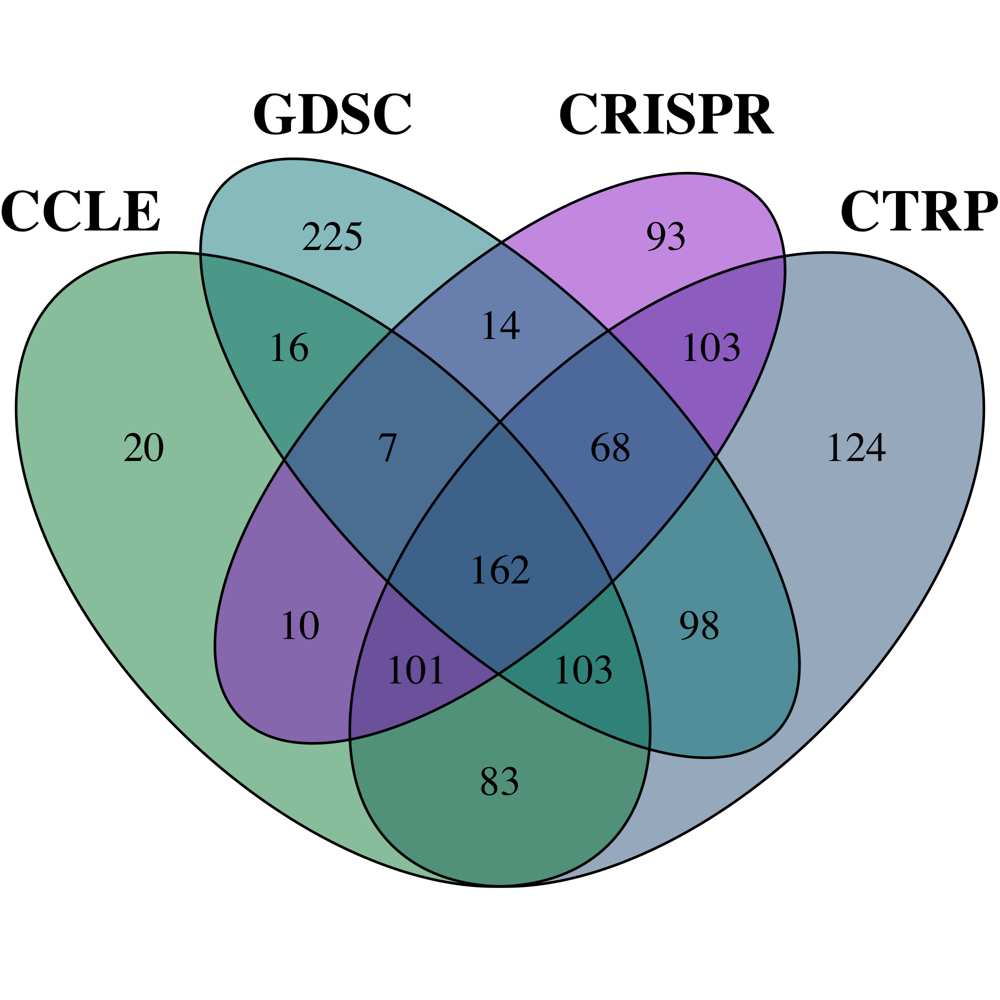

# HEADER

Body text goes here.

## Subheader

Body text goes here.

- List item 1
- List item 2
    - Sub-list item 1
    - Sub-list item 2

### Sub-subheader

Body text goes here.

> Block quote

 